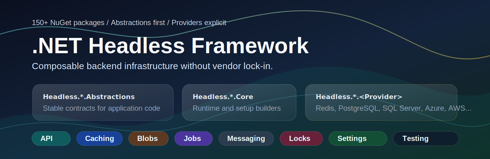

<p align="center">
  
</p>

# .NET Headless Framework

<div align="center">

**The modular .NET framework that stays out of your way.**

[](https://dotnet.microsoft.com)
[](https://github.com/xshaheen/headless-framework)


[اللغة: العربية](README.ar.md)

150+ NuGet packages &bull; Abstraction + provider pattern &bull; Explicit infrastructure

[Start Here](#start-here) &bull; [Package Model](#package-model) &bull; [Pick Packages By Job](#pick-packages-by-job) &bull; [Quick Start](#quick-start) &bull; [Packages](#packages) &bull; [Contributing](#contributing)

</div>

---

## Start Here

Headless Framework is a modular .NET framework for APIs and backend services that need production infrastructure without hiding the infrastructure choices. It gives application code stable contracts for common backend concerns, then lets each service choose the concrete provider it will run on.

Use it when a service needs one or more of these building blocks:

- API host defaults: problem details, health endpoints, OpenTelemetry, OpenAPI, forwarded headers, compression, and startup validation.
- Storage-facing abstractions: caching, blob storage, SQL access, dynamic settings, audit logs, permissions, and feature flags.
- Distributed runtime primitives: jobs, messaging, distributed locks, coordination, commit coordination, and dashboards.
- Delivery integrations: email, SMS, push notifications, CAPTCHA, image processing, media indexing, payments, TUS uploads, and serialization.
- Testing support: in-memory providers, test doubles, ASP.NET Core test hosting, and Testcontainers fixtures.

The framework is not a single platform package and it is not an application template. Start application and library code from the abstraction package, then add the core/runtime package and provider package at the service composition root.

## Package Model

Most feature families follow the same shape:

```text
Headless.<Feature>.Abstractions  -> contracts application code depends on
Headless.<Feature>.Core          -> provider-agnostic runtime and setup builder
Headless.<Feature>.<Provider>    -> concrete backend integration
Headless.<Feature>.Testing       -> test helpers when the domain has them
```

That shape keeps provider decisions at the composition root:

- Application code depends on contracts such as `ICache`, `IBlobStorage`, `IEmailSender`, `IDistributedLock`, `ISettingManager`, job managers, or messaging publishers.
- Provider packages contribute `UseRedis`, `UsePostgreSql`, `UseFileSystem`, `UseAws`, `UseAzure`, and similar setup members.
- Setup is explicit. A service only registers the domains and providers it actually uses.
- Local and test providers are first-class for development, but production behavior still depends on the provider's durability, transaction, ordering, locking, and operational limits.

## Pick Packages By Job

| Job | Start With | Add When You Need |
|-----|------------|-------------------|
| API contracts and host defaults | `Headless.Api.Abstractions` | `Headless.Api.Core` or `Headless.Api.ServiceDefaults` for runnable API hosts |
| Cache contracts | `Headless.Caching.Abstractions` | `Headless.Caching.Core` plus one default provider: in-memory, Redis, or hybrid; add named caches when a service needs multiple stores |
| Blob storage contracts | `Headless.Blobs.Abstractions` | `Headless.Blobs.Core` plus Azure, AWS, Cloudflare R2, filesystem, Redis, or SFTP provider |
| Background job contracts | `Headless.Jobs.Abstractions` | `Headless.Jobs.Core`, `Headless.Jobs.SourceGenerator`, dashboard, EF Core persistence, and a PostgreSQL or SQL Server native claim provider when contention warrants it |
| Distributed lock contracts | `Headless.DistributedLocks.Abstractions` | `Headless.DistributedLocks.Core` plus in-memory, Redis, PostgreSQL, or SQL Server provider |
| Cluster membership contracts | `Headless.Coordination.Abstractions` | `Headless.Coordination.Core` plus Redis, PostgreSQL, or SQL Server provider |
| Transaction-bound side-effect contracts | `Headless.CommitCoordination.Abstractions` | `Headless.CommitCoordination.Core` plus EF Core, PostgreSQL, SQL Server, in-memory, or durable-work package |
| Dynamic settings contracts | `Headless.Settings.Abstractions` | `Headless.Settings.Core` plus EF Core, PostgreSQL, or SQL Server storage |
| Feature flag contracts | `Headless.Features.Abstractions` | `Headless.Features.Core` plus EF Core, PostgreSQL, or SQL Server storage |
| Permission contracts | `Headless.Permissions.Abstractions` | `Headless.Permissions.Core` plus EF Core, PostgreSQL, SQL Server, or testing provider |
| Audit log contracts | `Headless.AuditLog.Abstractions` | `Headless.AuditLog.Core` plus EF Core, PostgreSQL, or SQL Server storage |
| Email contracts | `Headless.Emails.Abstractions` | `Headless.Emails.Core` plus AWS SES, Azure Communication Services, MailKit SMTP, or dev provider |
| SMS contracts | `Headless.Sms.Abstractions` | `Headless.Sms.Core` plus AWS, Cequens, Connekio, Infobip, Twilio, VictoryLink, Vodafone, or dev provider |
| Push notification contracts | `Headless.PushNotifications.Abstractions` | `Headless.PushNotifications.Core` plus Firebase or dev provider |
| Messaging contracts | `Headless.Messaging.Abstractions` | `Headless.Messaging.Core`, bus/queue abstractions, one transport, one durable storage provider when needed, dashboard, and testing packages |
| Test-only infrastructure | Domain abstraction package | In-memory provider, dev provider, or testing package for that domain |

## Quick Start

### Start an API Host

```bash
dotnet add package Headless.Api.ServiceDefaults
```

```csharp
var builder = WebApplication.CreateBuilder(args);

// OpenTelemetry, OpenAPI, problem details, JSON, health checks, forwarded headers,
// compression, exception handling, HSTS, status-code pages, and Headless endpoints.
builder.AddHeadless();

var app = builder.Build();

// Applies the Headless middleware order: forwarded headers, compression,
// status-code/problem-details handling, exceptions, HTTPS/HSTS, and no-cache defaults.
app.UseHeadless();

// Maps Headless operational endpoints such as health, liveness, OpenAPI JSON,
// and static web assets when enabled.
app.MapHeadlessEndpoints();

app.Run();
```

### Add a Cache

Application code that only consumes a cache should reference `Headless.Caching.Abstractions`. A runnable host adds the runtime package plus one provider. This example uses the in-memory provider for local development and tests.

```bash
dotnet add package Headless.Caching.Abstractions
dotnet add package Headless.Caching.Core
dotnet add package Headless.Caching.InMemory
```

```csharp
builder.Services.AddHeadlessCaching(setup =>
{
    setup.UseInMemory();
    setup.AddNamed("sessions", cache => cache.UseInMemory());
});
```

Switching to Redis changes the provider package and the setup member, not the consuming code that depends on `ICache`.

```bash
dotnet add package Headless.Caching.Redis
```

```csharp
builder.Services.AddHeadlessCaching(setup =>
{
    setup.UseRedis(options =>
    {
        options.ConnectionMultiplexer =
            ConnectionMultiplexer.Connect(builder.Configuration.GetConnectionString("Redis")!);
    });
});
```

### Add Blob Storage

Use named stores when one application needs several storage backends or several instances of the same backend.

```bash
dotnet add package Headless.Blobs.Abstractions
dotnet add package Headless.Blobs.Core
dotnet add package Headless.Blobs.FileSystem
```

```csharp
builder.Services.AddHeadlessBlobs(blobs =>
{
    blobs.UseFileSystem(options => options.BaseDirectoryPath = "/var/app/blobs");
    blobs.AddNamed("scratch", store => store.UseFileSystem(options => options.BaseDirectoryPath = "/tmp/app-blobs"));
});
```

### Add Messaging When a Service Actually Needs It

Messaging is one package family, not the framework's center of gravity. Add it when the service has cross-process publish/consume, queues, outbox, delayed delivery, or persisted retry requirements.

Start with:

- [`docs/llms/messaging.md`](docs/llms/messaging.md) for the detailed mental model.
- [`demo/Headless.Messaging.Console.Demo`](demo/Headless.Messaging.Console.Demo) for local in-memory wiring.
- [`demo/Headless.Messaging.RabbitMq.SqlServer.Demo`](demo/Headless.Messaging.RabbitMq.SqlServer.Demo) or [`demo/Headless.Messaging.Kafka.PostgreSql.Demo`](demo/Headless.Messaging.Kafka.PostgreSql.Demo) for durable examples.

## Production Guidance

Production use is a composition choice, not a global switch:

- Choose durable providers for state that must survive process restart.
- Use in-memory and dev providers for local development, tests, and isolated demos.
- Prefer named instances when one service talks to multiple logical stores or senders.
- Keep provider configuration at the composition root; do not leak concrete provider clients into business code unless the provider option deliberately exposes an SDK type.
- Read the package README for the domain you install. Each package documents dependencies, side effects, setup requirements, and provider limits.
- Test the actual provider combination used in production when behavior depends on storage, transactions, locks, ordering, broker delivery, or cloud service semantics.

## Versioning and Compatibility

- Most packages target `.NET 10`.
- Source generator packages target `netstandard2.0`.
- The repository pins the .NET SDK in [`global.json`](global.json).
- Package release notes are published from [GitHub releases](https://github.com/xshaheen/headless-framework/releases).

Check release notes before upgrading, especially for configuration APIs, provider setup, storage schema, retry behavior, and source-generated code.

## Packages

### API & Web

Everything you need to stand up production-grade ASP.NET Core APIs — request/response conventions, validation pipelines, structured logging, and OpenAPI documentation out of the box.

| Package | Description |
|---------|-------------|
| [Headless.Api.Core](src/Headless.Api.Core/README.md) | ASP.NET Core API building blocks (problem details, JWT, identity, middleware) |
| [Headless.Api.ServiceDefaults](src/Headless.Api.ServiceDefaults/README.md) | `AddHeadless()` orchestrator plus Aspire-style defaults (OpenTelemetry, OpenAPI, service discovery) |
| [Headless.Api.Abstractions](src/Headless.Api.Abstractions/README.md) | API abstractions and contracts |
| [Headless.Api.DataProtection](src/Headless.Api.DataProtection/README.md) | Data protection key storage |
| [Headless.Api.FluentValidation](src/Headless.Api.FluentValidation/README.md) | FluentValidation integration for APIs |
| [Headless.Api.Logging.Serilog](src/Headless.Api.Logging.Serilog/README.md) | Serilog logging integration |
| [Headless.Api.MinimalApi](src/Headless.Api.MinimalApi/README.md) | Minimal API utilities |
| [Headless.Api.Mvc](src/Headless.Api.Mvc/README.md) | MVC-specific utilities |
| [Headless.Api.Idempotency](src/Headless.Api.Idempotency/README.md) | Stripe-style HTTP idempotency middleware — cache and replay responses on retries |

### Core

Foundational building blocks shared across the framework — domain primitives, DDD base types, guard clauses, and entity/event infrastructure.

| Package | Description |
|---------|-------------|
| [Headless.Extensions](src/Headless.Extensions/README.md) | Core primitives and utilities |
| [Headless.Core](src/Headless.Core/README.md) | Domain-Driven Design building blocks |
| [Headless.Security.Abstractions](src/Headless.Security.Abstractions/README.md) | Security contracts and options |
| [Headless.Security](src/Headless.Security/README.md) | String encryption and hashing services |
| [Headless.Checks](src/Headless.Checks/README.md) | Guard clauses and argument validation |
| [Headless.Domain](src/Headless.Domain/README.md) | Domain entities and events |
| [Headless.Domain.LocalEventBus](src/Headless.Domain.LocalEventBus/README.md) | DI-based `ILocalEventBus` for in-process domain event publishing |
| [Headless.Mediator](src/Headless.Mediator/README.md) | Mediator pipeline behaviors (FluentValidation, request/response logging) |
| [Headless.MultiTenancy](src/Headless.MultiTenancy/README.md) | Composition surface for tenant posture across Headless packages |

### Audit Log

Property-level audit logging for tracking entity mutations and explicit business events. Records what changed, who changed it, and when — with EF Core persistence.

| Package | Description |
|---------|-------------|
| [Headless.AuditLog.Abstractions](src/Headless.AuditLog.Abstractions/README.md) | Audit log contracts and interfaces |
| [Headless.AuditLog.Core](src/Headless.AuditLog.Core/README.md) | Audit log DI setup, options validation, and provider setup pipeline |
| [Headless.AuditLog.Storage.EntityFramework](src/Headless.AuditLog.Storage.EntityFramework/README.md) | EF Core audit log persistence |
| [Headless.AuditLog.Storage.PostgreSql](src/Headless.AuditLog.Storage.PostgreSql/README.md) | PostgreSQL raw audit log storage |
| [Headless.AuditLog.Storage.SqlServer](src/Headless.AuditLog.Storage.SqlServer/README.md) | SQL Server raw audit log storage |

### Blob Storage

Unified blob storage interface with providers for every major cloud and protocol. Store and retrieve files without coupling to any single vendor.

| Package | Description |
|---------|-------------|
| [Headless.Blobs.Abstractions](src/Headless.Blobs.Abstractions/README.md) | Blob storage interfaces |
| [Headless.Blobs.Core](src/Headless.Blobs.Core/README.md) | Unified setup builder for composing named blob stores |
| [Headless.Blobs.Aws](src/Headless.Blobs.Aws/README.md) | AWS S3 blob storage |
| [Headless.Blobs.Azure](src/Headless.Blobs.Azure/README.md) | Azure Blob storage |
| [Headless.Blobs.CloudflareR2](src/Headless.Blobs.CloudflareR2/README.md) | Cloudflare R2 (S3-compatible) blob storage |
| [Headless.Blobs.FileSystem](src/Headless.Blobs.FileSystem/README.md) | Local filesystem storage |
| [Headless.Blobs.Redis](src/Headless.Blobs.Redis/README.md) | Redis blob storage |
| [Headless.Blobs.SshNet](src/Headless.Blobs.SshNet/README.md) | SFTP blob storage |

### Caching

Multi-tier caching with a clean abstraction layer. Supports in-memory, Redis, and hybrid (L1/L2) strategies — swap providers without touching business logic.

| Package | Description |
|---------|-------------|
| [Headless.Caching.Abstractions](src/Headless.Caching.Abstractions/README.md) | Caching interfaces |
| [Headless.Caching.Core](src/Headless.Caching.Core/README.md) | Shared factory-backed cache orchestration |
| [Headless.Caching.Hybrid](src/Headless.Caching.Hybrid/README.md) | Hybrid caching (L1/L2) |
| [Headless.Caching.InMemory](src/Headless.Caching.InMemory/README.md) | In-memory caching |
| [Headless.Caching.Redis](src/Headless.Caching.Redis/README.md) | Redis caching |
| [Headless.Caching.Bcl](src/Headless.Caching.Bcl/README.md) | Adapter exposing a Headless cache as `IDistributedCache` |
| [Headless.Caching.DistributedLocks](src/Headless.Caching.DistributedLocks/README.md) | Distributed-lock-backed cache stampede protection |
| [Headless.Caching.OutputCache](src/Headless.Caching.OutputCache/README.md) | Backs ASP.NET Core output caching with a Headless cache |

### Captcha

Verify CAPTCHA tokens behind one pass/fail abstraction. Compose Google reCAPTCHA v2/v3 and Cloudflare Turnstile through a single builder — swap or combine providers without touching call sites.

| Package | Description |
|---------|-------------|
| [Headless.Captcha.Abstractions](src/Headless.Captcha.Abstractions/README.md) | CAPTCHA verification interfaces and builder |
| [Headless.Captcha.Core](src/Headless.Captcha.Core/README.md) | CAPTCHA setup and validation pipeline |
| [Headless.Captcha.ReCaptcha](src/Headless.Captcha.ReCaptcha/README.md) | Google reCAPTCHA v2/v3 provider |
| [Headless.Captcha.Turnstile](src/Headless.Captcha.Turnstile/README.md) | Cloudflare Turnstile provider |

### Email

Send transactional and marketing emails through a unified interface. Plug in AWS SES, SMTP via MailKit, or a no-op dev provider for local testing.

| Package | Description |
|---------|-------------|
| [Headless.Emails.Abstractions](src/Headless.Emails.Abstractions/README.md) | Email sending interfaces |
| [Headless.Emails.Core](src/Headless.Emails.Core/README.md) | Core email implementation |
| [Headless.Emails.Aws](src/Headless.Emails.Aws/README.md) | AWS SES email provider |
| [Headless.Emails.Azure](src/Headless.Emails.Azure/README.md) | Azure Communication Services email provider |
| [Headless.Emails.Dev](src/Headless.Emails.Dev/README.md) | Development email provider |
| [Headless.Emails.Mailkit](src/Headless.Emails.Mailkit/README.md) | MailKit SMTP provider |

### Feature Management

Runtime feature flags backed by persistent storage. Toggle features without redeployment and query flag state from anywhere in your application.

| Package | Description |
|---------|-------------|
| [Headless.Features.Abstractions](src/Headless.Features.Abstractions/README.md) | Feature flag interfaces |
| [Headless.Features.Core](src/Headless.Features.Core/README.md) | Feature management implementation |
| [Headless.Features.Storage.EntityFramework](src/Headless.Features.Storage.EntityFramework/README.md) | EF Core feature storage |
| [Headless.Features.Storage.PostgreSql](src/Headless.Features.Storage.PostgreSql/README.md) | PostgreSQL raw-DDL feature storage |
| [Headless.Features.Storage.SqlServer](src/Headless.Features.Storage.SqlServer/README.md) | SQL Server raw-DDL feature storage |

### Identity

Identity persistence and storage extensions for ASP.NET Core Identity, built on EF Core.

| Package | Description |
|---------|-------------|
| [Headless.Identity.Storage.EntityFramework](src/Headless.Identity.Storage.EntityFramework/README.md) | EF Core identity storage |

### Imaging

Image processing pipeline with pluggable backends. Resize, crop, convert, and optimize images through a clean abstraction.

| Package | Description |
|---------|-------------|
| [Headless.Imaging.Abstractions](src/Headless.Imaging.Abstractions/README.md) | Image processing interfaces |
| [Headless.Imaging.Core](src/Headless.Imaging.Core/README.md) | Core image processing |
| [Headless.Imaging.ImageSharp](src/Headless.Imaging.ImageSharp/README.md) | ImageSharp implementation |

### Logging

Structured logging utilities and enrichers built on top of Serilog.

| Package | Description |
|---------|-------------|
| [Headless.Logging.Serilog](src/Headless.Logging.Serilog/README.md) | Serilog logging utilities |

### Media

Content indexing and metadata extraction for media files — images, video, and documents.

| Package | Description |
|---------|-------------|
| [Headless.Media.Indexing.Abstractions](src/Headless.Media.Indexing.Abstractions/README.md) | Media indexing interfaces |
| [Headless.Media.Indexing](src/Headless.Media.Indexing/README.md) | Media indexing implementation |

### Messaging

Reliable distributed message bus with transactional outbox, automatic retries, delayed delivery, and type-safe consumers. 8 transport providers and 3 storage backends — swap the underlying infrastructure without changing application code.

| Package | Description |
|---------|-------------|
| [Headless.Messaging.Abstractions](src/Headless.Messaging.Abstractions/README.md) | Core messaging interfaces and contracts |
| [Headless.Messaging.Bus.Abstractions](src/Headless.Messaging.Bus.Abstractions/README.md) | Broadcast (pub/sub) publisher contracts |
| [Headless.Messaging.Queue.Abstractions](src/Headless.Messaging.Queue.Abstractions/README.md) | Point-to-point queue publisher contracts |
| [Headless.Messaging.Core](src/Headless.Messaging.Core/README.md) | Runtime engine: outbox, retries, delayed delivery, consumer orchestration |
| [Headless.Messaging.Dashboard](src/Headless.Messaging.Dashboard/README.md) | Web UI for monitoring messages, failures, and system health |
| [Headless.Messaging.Dashboard.K8s](src/Headless.Messaging.Dashboard.K8s/README.md) | Kubernetes node auto-discovery for the dashboard |
| [Headless.Messaging.Testing](src/Headless.Messaging.Testing/README.md) | In-process test harness for asserting on published/consumed/faulted messages |

**Transports:**

| Package | Description |
|---------|-------------|
| [Headless.Messaging.RabbitMq](src/Headless.Messaging.RabbitMq/README.md) | RabbitMQ (AMQP) |
| [Headless.Messaging.Kafka](src/Headless.Messaging.Kafka/README.md) | Apache Kafka |
| [Headless.Messaging.Aws](src/Headless.Messaging.Aws/README.md) | AWS SQS + SNS |
| [Headless.Messaging.AzureServiceBus](src/Headless.Messaging.AzureServiceBus/README.md) | Azure Service Bus |
| [Headless.Messaging.Nats](src/Headless.Messaging.Nats/README.md) | NATS with JetStream |
| [Headless.Messaging.Pulsar](src/Headless.Messaging.Pulsar/README.md) | Apache Pulsar |
| [Headless.Messaging.Redis](src/Headless.Messaging.Redis/README.md) | Redis Streams queues and Redis Pub/Sub broadcast |
| [Headless.Messaging.InMemory](src/Headless.Messaging.InMemory/README.md) | In-memory (dev/testing) |

**Storage backends:**

| Package | Description |
|---------|-------------|
| [Headless.Messaging.Storage.PostgreSql](src/Headless.Messaging.Storage.PostgreSql/README.md) | PostgreSQL message persistence |
| [Headless.Messaging.Storage.SqlServer](src/Headless.Messaging.Storage.SqlServer/README.md) | SQL Server message persistence |
| [Headless.Messaging.InMemoryStorage](src/Headless.Messaging.InMemoryStorage/README.md) | Ephemeral storage (dev/testing) |

### Jobs

Distributed background job scheduling with cron expressions, delayed execution, monitoring dashboard, and OpenTelemetry observability. Source-generated for compile-time safety.

| Package | Description |
|---------|-------------|
| [Headless.Jobs.Abstractions](src/Headless.Jobs.Abstractions/README.md) | Job scheduling interfaces |
| [Headless.Jobs.Core](src/Headless.Jobs.Core/README.md) | Job engine: cron, delays, retries, monitoring |
| [Headless.Jobs.SourceGenerator](src/Headless.Jobs.SourceGenerator/README.md) | Compile-time code gen for `[Jobs]`-marked jobs |
| [Headless.Jobs.Dashboard](src/Headless.Jobs.Dashboard/README.md) | Web UI for job monitoring |
| [Headless.Jobs.EntityFramework](src/Headless.Jobs.EntityFramework/README.md) | EF Core job state persistence; uses optional `Headless.Caching.ICache` for cron-expression caching |
| [Headless.Jobs.EntityFramework.PostgreSql](src/Headless.Jobs.EntityFramework.PostgreSql/README.md) | PostgreSQL atomic claims with `FOR UPDATE SKIP LOCKED` |
| [Headless.Jobs.EntityFramework.SqlServer](src/Headless.Jobs.EntityFramework.SqlServer/README.md) | SQL Server atomic claims with `UPDLOCK`, `READPAST`, and `ROWLOCK` |

### OpenAPI

API documentation generation and interactive UIs. Supports NSwag for spec generation, OData query conventions, and Scalar for a modern API explorer.

| Package | Description |
|---------|-------------|
| [Headless.OpenApi.Nswag](src/Headless.OpenApi.Nswag/README.md) | NSwag OpenAPI generation |
| [Headless.OpenApi.Nswag.OData](src/Headless.OpenApi.Nswag.OData/README.md) | NSwag OData support |
| [Headless.OpenApi.Scalar](src/Headless.OpenApi.Scalar/README.md) | Scalar API documentation |

### ORM

Database access utilities for Entity Framework Core and Couchbase — conventions, seed data, soft deletes, and multi-tenancy support.

| Package | Description |
|---------|-------------|
| [Headless.EntityFramework](src/Headless.EntityFramework/README.md) | Entity Framework Core utilities |
| [Headless.EntityFramework.CommitCoordination](src/Headless.EntityFramework.CommitCoordination/README.md) | Opt-in commit coordination for the Headless EF save pipeline |
| [Headless.EntityFramework.Messaging](src/Headless.EntityFramework.Messaging/README.md) | EF Core outbox dispatcher — atomic integration-event writes on save |
| [Headless.Couchbase](src/Headless.Couchbase/README.md) | Couchbase data-access utilities |

### Payments

Payment gateway integrations for the MENA region. Cash-in (collection) and cash-out (disbursement) flows through Paymob.

| Package | Description |
|---------|-------------|
| [Headless.Payments.Paymob.CashIn](src/Headless.Payments.Paymob.CashIn/README.md) | Paymob cash-in payments |
| [Headless.Payments.Paymob.CashOut](src/Headless.Payments.Paymob.CashOut/README.md) | Paymob cash-out payments |
| [Headless.Payments.Paymob.Services](src/Headless.Payments.Paymob.Services/README.md) | Paymob shared services |

### Permissions

Dynamic, database-backed permission system. Define permissions as code, store assignments in EF Core, and query access control at runtime.

| Package | Description |
|---------|-------------|
| [Headless.Permissions.Abstractions](src/Headless.Permissions.Abstractions/README.md) | Permission system interfaces |
| [Headless.Permissions.Core](src/Headless.Permissions.Core/README.md) | Permission system implementation |
| [Headless.Permissions.Testing](src/Headless.Permissions.Testing/README.md) | Test-only always-allow permission and authorization doubles |
| [Headless.Permissions.Storage.EntityFramework](src/Headless.Permissions.Storage.EntityFramework/README.md) | EF Core permission storage |
| [Headless.Permissions.Storage.PostgreSql](src/Headless.Permissions.Storage.PostgreSql/README.md) | PostgreSQL raw-DDL permission storage |
| [Headless.Permissions.Storage.SqlServer](src/Headless.Permissions.Storage.SqlServer/README.md) | SQL Server raw-DDL permission storage |

### Push Notifications

Send push notifications through Firebase Cloud Messaging with a clean abstraction. Includes a no-op dev provider for local testing.

| Package | Description |
|---------|-------------|
| [Headless.PushNotifications.Abstractions](src/Headless.PushNotifications.Abstractions/README.md) | Push notification interfaces |
| [Headless.PushNotifications.Core](src/Headless.PushNotifications.Core/README.md) | Unified setup builder for composing named push-notification services |
| [Headless.PushNotifications.Dev](src/Headless.PushNotifications.Dev/README.md) | Development push provider |
| [Headless.PushNotifications.Firebase](src/Headless.PushNotifications.Firebase/README.md) | Firebase Cloud Messaging |

### Distributed Locking

Coordinate access to shared resources across distributed services.

| Package | Description |
|---------|-------------|
| [Headless.DistributedLocks.Abstractions](src/Headless.DistributedLocks.Abstractions/README.md) | Distributed locking interfaces |
| [Headless.DistributedLocks.Core](src/Headless.DistributedLocks.Core/README.md) | Distributed locking implementation |
| [Headless.DistributedLocks.Core.Database](src/Headless.DistributedLocks.Core.Database/README.md) | Shared relational substrate for database lock providers |
| [Headless.DistributedLocks.InMemory](src/Headless.DistributedLocks.InMemory/README.md) | In-process locking |
| [Headless.DistributedLocks.PostgreSql](src/Headless.DistributedLocks.PostgreSql/README.md) | PostgreSQL advisory-lock locking |
| [Headless.DistributedLocks.Redis](src/Headless.DistributedLocks.Redis/README.md) | Redis-based locking |
| [Headless.DistributedLocks.SqlServer](src/Headless.DistributedLocks.SqlServer/README.md) | SQL Server application-lock locking |

### Coordination

Cluster membership and liveness tracking — know which nodes are alive across a distributed deployment, with pluggable relational and Redis backends.

| Package | Description |
|---------|-------------|
| [Headless.Coordination.Abstractions](src/Headless.Coordination.Abstractions/README.md) | Membership, liveness, and lifecycle contracts |
| [Headless.Coordination.Core](src/Headless.Coordination.Core/README.md) | Provider-agnostic membership engine |
| [Headless.Coordination.Core.Database](src/Headless.Coordination.Core.Database/README.md) | Shared relational substrate for SQL coordination providers |
| [Headless.Coordination.PostgreSql](src/Headless.Coordination.PostgreSql/README.md) | PostgreSQL membership with server-clock liveness |
| [Headless.Coordination.Redis](src/Headless.Coordination.Redis/README.md) | Redis membership via Lua scripts and server time |
| [Headless.Coordination.SqlServer](src/Headless.Coordination.SqlServer/README.md) | SQL Server membership with guarded writes |

### Commit Coordination

Tie side effects to transaction boundaries — buffer work (outbox dispatch, durable jobs) inside a transaction and drain it atomically on commit, discard it on rollback.

| Package | Description |
|---------|-------------|
| [Headless.CommitCoordination.Abstractions](src/Headless.CommitCoordination.Abstractions/README.md) | Commit coordination contracts (provider-free) |
| [Headless.CommitCoordination.Core](src/Headless.CommitCoordination.Core/README.md) | In-process coordinator, ambient stack, and scope factory |
| [Headless.CommitCoordination.DurableWork](src/Headless.CommitCoordination.DurableWork/README.md) | Base for durable work buffers writing inside the active transaction |
| [Headless.CommitCoordination.EntityFramework](src/Headless.CommitCoordination.EntityFramework/README.md) | Bridges EF Core commit/rollback edges to commit coordination |
| [Headless.CommitCoordination.InMemory](src/Headless.CommitCoordination.InMemory/README.md) | In-process signal source for tests and owner-driven flows |
| [Headless.CommitCoordination.PostgreSql](src/Headless.CommitCoordination.PostgreSql/README.md) | PostgreSQL commit coordination registration points |
| [Headless.CommitCoordination.SqlServer](src/Headless.CommitCoordination.SqlServer/README.md) | Correlates SQL Server commit/rollback signals to scopes |

### Serialization

Pluggable serialization with providers for System.Text.Json and MessagePack. Use the same interface for JSON APIs and binary wire formats.

| Package | Description |
|---------|-------------|
| [Headless.Serializer.Abstractions](src/Headless.Serializer.Abstractions/README.md) | Serialization interfaces |
| [Headless.Serializer.Json](src/Headless.Serializer.Json/README.md) | System.Text.Json serializer |
| [Headless.Serializer.MessagePack](src/Headless.Serializer.MessagePack/README.md) | MessagePack serializer |

### Settings

Dynamic application settings stored in a database. Change configuration at runtime without redeployment, with caching and change notification support.

| Package | Description |
|---------|-------------|
| [Headless.Settings.Abstractions](src/Headless.Settings.Abstractions/README.md) | Dynamic settings interfaces |
| [Headless.Settings.Core](src/Headless.Settings.Core/README.md) | Settings management implementation |
| [Headless.Settings.Storage.EntityFramework](src/Headless.Settings.Storage.EntityFramework/README.md) | EF Core settings storage |
| [Headless.Settings.Storage.PostgreSql](src/Headless.Settings.Storage.PostgreSql/README.md) | PostgreSQL raw-DDL settings storage |
| [Headless.Settings.Storage.SqlServer](src/Headless.Settings.Storage.SqlServer/README.md) | SQL Server raw-DDL settings storage |

### SMS

Send SMS messages through a unified interface with providers for major regional and global carriers.

| Package | Description |
|---------|-------------|
| [Headless.Sms.Abstractions](src/Headless.Sms.Abstractions/README.md) | SMS sending interfaces |
| [Headless.Sms.Core](src/Headless.Sms.Core/README.md) | SMS setup builder and provider selection |
| [Headless.Sms.Aws](src/Headless.Sms.Aws/README.md) | AWS SNS SMS provider |
| [Headless.Sms.Cequens](src/Headless.Sms.Cequens/README.md) | Cequens SMS provider |
| [Headless.Sms.Connekio](src/Headless.Sms.Connekio/README.md) | Connekio SMS provider |
| [Headless.Sms.Dev](src/Headless.Sms.Dev/README.md) | Development SMS provider |
| [Headless.Sms.Infobip](src/Headless.Sms.Infobip/README.md) | Infobip SMS provider |
| [Headless.Sms.Twilio](src/Headless.Sms.Twilio/README.md) | Twilio SMS provider |
| [Headless.Sms.VictoryLink](src/Headless.Sms.VictoryLink/README.md) | VictoryLink SMS provider |
| [Headless.Sms.Vodafone](src/Headless.Sms.Vodafone/README.md) | Vodafone SMS provider |

### SQL

Lightweight connection factories for raw SQL access when you need to drop below the ORM. Supports PostgreSQL, SQL Server, and SQLite.

| Package | Description |
|---------|-------------|
| [Headless.Sql.Abstractions](src/Headless.Sql.Abstractions/README.md) | SQL connection interfaces |
| [Headless.Sql.Core](src/Headless.Sql.Core/README.md) | Default scoped ambient current-connection implementation |
| [Headless.Sql.PostgreSql](src/Headless.Sql.PostgreSql/README.md) | PostgreSQL connection factory |
| [Headless.Sql.SqlServer](src/Headless.Sql.SqlServer/README.md) | SQL Server connection factory |
| [Headless.Sql.Sqlite](src/Headless.Sql.Sqlite/README.md) | SQLite connection factory |

### Testing

Test infrastructure and utilities — base classes, builders, fixtures, and Testcontainers integration for real-database integration tests.

| Package | Description |
|---------|-------------|
| [Headless.Testing](src/Headless.Testing/README.md) | Testing utilities and base classes |
| [Headless.Testing.AspNetCore](src/Headless.Testing.AspNetCore/README.md) | ASP.NET Core integration-test server with time control and DB reset |
| [Headless.Testing.Testcontainers](src/Headless.Testing.Testcontainers/README.md) | Testcontainers fixtures |

### TUS (Resumable Uploads)

[TUS protocol](https://tus.io) support for reliable, resumable file uploads. Handles large files gracefully with Azure Blob Storage and distributed locking.

| Package | Description |
|---------|-------------|
| [Headless.Tus](src/Headless.Tus/README.md) | TUS protocol utilities |
| [Headless.Tus.Azure](src/Headless.Tus.Azure/README.md) | Azure Blob TUS store |
| [Headless.Tus.DistributedLocks](src/Headless.Tus.DistributedLocks/README.md) | TUS file locking |

### Utilities

Cross-cutting utilities that don't belong to a specific domain — validation extensions, source generators, hosting helpers, geospatial, and more.

| Package | Description |
|---------|-------------|
| [Headless.Dashboard.Authentication](src/Headless.Dashboard.Authentication/README.md) | Shared authentication for the Jobs and Messaging dashboards |
| [Headless.FluentValidation](src/Headless.FluentValidation/README.md) | FluentValidation extensions |
| [Headless.Generator.Primitives](src/Headless.Generator.Primitives/README.md) | Primitive types source generator |
| [Headless.Generator.Primitives.Abstractions](src/Headless.Generator.Primitives.Abstractions/README.md) | Generator abstractions |
| [Headless.Hosting](src/Headless.Hosting/README.md) | .NET hosting utilities |
| [Headless.NetTopologySuite](src/Headless.NetTopologySuite/README.md) | Geospatial utilities |
| [Headless.Primitives](src/Headless.Primitives/README.md) | Value objects, result pattern, paging models, and domain primitives |
| [Headless.Redis](src/Headless.Redis/README.md) | Redis utilities |
| [Headless.Sitemaps](src/Headless.Sitemaps/README.md) | XML sitemap generation |
| [Headless.Slugs](src/Headless.Slugs/README.md) | URL slug generation |
| [Headless.Urls](src/Headless.Urls/README.md) | Fluent URL builder and parser |

## Extending Headless

Provider packages are ordinary NuGet packages. To add a custom backend, implement the domain abstraction, expose a `Use{Provider}` setup extension that matches the family builder, and keep concrete provider details at the composition root. See the package README for the closest provider in the same domain before adding a new one.

## Using Headless with AI Agents

If your project uses Headless packages, add the following to your `AGENTS.md` or `CLAUDE.md` so AI coding agents can fetch the correct documentation on demand:

```markdown
## Headless Framework

This project uses [Headless .NET Framework](https://github.com/xshaheen/headless-framework).

When working with Headless packages, fetch the docs index:
https://raw.githubusercontent.com/xshaheen/headless-framework/main/docs/llms/index.md

The index lists per-domain docs to fetch as needed.
```

The index contains the framework's agent rules and links to per-domain documentation under [`docs/llms/`](docs/llms/).

## Contributing

Contributions are welcome — issues, feature requests, and PRs. See individual package READMEs for package-specific details.
