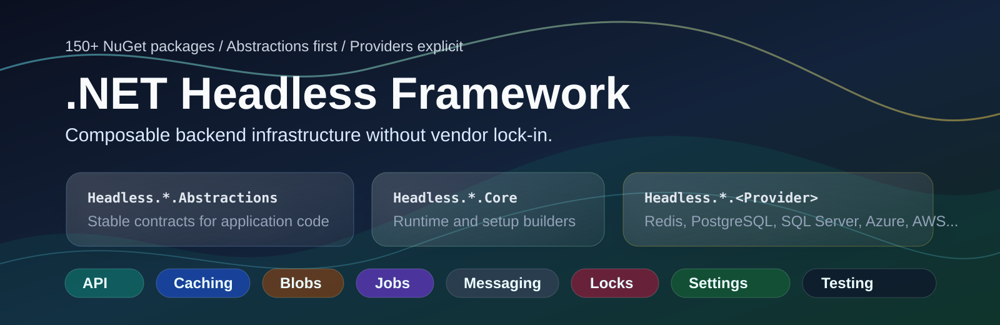

<p align="center">
  
</p>

# .NET Headless Framework

<div align="center">

**Production backend infrastructure for .NET, without a framework taking over your app.**

[](https://dotnet.microsoft.com)
[](https://www.nuget.org/packages?q=Headless.)
[](https://github.com/xshaheen/headless-framework)

[اللغة: العربية](README.ar.md)

168 packages &bull; One setup grammar &bull; Swap any provider in one line

[Why Headless](#why-headless) &bull; [60-second start](#60-second-start) &bull; [One grammar, every domain](#one-grammar-every-domain) &bull; [What is in the box](#what-is-in-the-box) &bull; [Package catalog](#package-catalog)

</div>

---

## Why Headless

Every backend service needs the same twenty things: a cache, blob storage, background jobs, a message bus, distributed locks, feature flags, dynamic settings, audit logs, email, SMS. You have three usual options, and each one costs you something.

- **Hand-roll them.** You write the outbox, the job claim query, and the lock renewal yourself. Those are the parts that fail at 3 a.m.
- **Glue twenty libraries together.** StackExchange.Redis, Hangfire, MassTransit, and Azure SDKs each have their own setup style, their own idea of a connection, and their own opinions about your DI container.
- **Adopt a full application framework.** You get everything at once, along with base classes you must inherit, a module system you must obey, and a migration path out that nobody wants to walk.

Headless is a fourth option. Each concern ships as a small contract package plus provider packages that you pick at the composition root. Your code depends on `ICache`, never on Redis. Every domain uses the same registration shape, so learning caching teaches you blob storage. Nothing inherits from anything, and nothing runs that you did not register.

### What that buys you

**Providers swap in one line.** Run in-memory in tests, Redis in production, and change nothing else.

```csharp
// Composition root. This is the only file that names a provider.
builder.Services.AddHeadlessCaching(setup => setup.UseInMemory()); // dev and tests
builder.Services.AddHeadlessCaching(setup => setup.UseRedis(...)); // production
```

Every service, repository, and handler that injects `ICache` is untouched by that edit. The same holds for `IBlobStorage` across S3, Azure, Cloudflare R2, the file system, Redis, and SFTP; for `IEmailSender` across SES, Azure Communication Services, and SMTP; and for messaging across eight transports.

**You install three packages, not 168.** The catalog is large because the provider matrix is large. A service that needs caching installs `Headless.Caching.Abstractions`, `Headless.Caching.Core`, and one provider. Domain and application libraries reference the abstraction package alone. `Headless.Caching.Abstractions` pulls in one thing: `Headless.Extensions`.

**Tests do not need Docker to be fast.** Caching, distributed locks, and messaging ship in-memory providers; email, SMS, and push notifications ship dev providers that send nothing; blob storage runs against the local file system. Unit tests exercise the real contract with no containers. When you want the real backend, `Headless.Testing.Testcontainers` supplies the fixtures. The repository itself runs 130 unit-test projects and 60 integration-test projects on that split.

**The hard parts are already written.** Background jobs claim work atomically with `FOR UPDATE SKIP LOCKED` on PostgreSQL and `UPDLOCK, READPAST, ROWLOCK` on SQL Server. Messaging writes to a transactional outbox inside your EF Core save. Distributed locks use PostgreSQL advisory locks and SQL Server application locks rather than an improvised `SET NX`. Node membership reads liveness from the server clock, not the node's clock. Each of these is a place where a plausible-looking implementation loses messages or runs a job twice.

**Two dashboards come with it.** `Headless.Jobs.Dashboard` and `Headless.Messaging.Dashboard` are real web UIs for inspecting runs, failures, and retries, with shared authentication and Kubernetes node discovery.

**AI coding agents get first-class docs.** [`docs/llms/`](docs/llms/) is a per-domain documentation set written for agents to fetch on demand. See [using Headless with AI agents](#using-headless-with-ai-agents).

### When not to use it

Headless is not an application template and not a starter kit. It gives you no project scaffolding, no admin UI, no CRUD generator, and no opinion about your architecture. If you want a batteries-included platform that lays out the whole application for you, ABP or Orchard Core fits better.

It also does not force exclusivity. Keep MassTransit and add only `Headless.Caching`. Keep Hangfire and add only `Headless.Blobs`. Each family stands alone.

## 60-second start

### Stand up an API host

```bash
dotnet add package Headless.Api.ServiceDefaults
```

```csharp
var builder = WebApplication.CreateBuilder(args);

// OpenTelemetry, OpenAPI, problem details, JSON, health checks, forwarded headers,
// compression, exception handling, HSTS, status-code pages, and Headless endpoints.
builder.AddHeadless();

var app = builder.Build();

// Applies the Headless middleware order: forwarded headers, compression,
// status-code/problem-details handling, exceptions, HTTPS/HSTS, and no-cache defaults.
app.UseHeadless();

// Maps Headless operational endpoints such as health, liveness, OpenAPI JSON,
// and static web assets when enabled.
app.MapHeadlessEndpoints();

app.Run();
```

### Add a cache

Application code that only consumes a cache references `Headless.Caching.Abstractions`. A runnable host adds the runtime package plus one provider.

```bash
dotnet add package Headless.Caching.Abstractions
dotnet add package Headless.Caching.Core
dotnet add package Headless.Caching.InMemory
```

```csharp
builder.Services.AddHeadlessCaching(setup =>
{
    setup.UseInMemory();
    setup.AddNamed("sessions", cache => cache.UseInMemory());
});
```

To move to Redis, install the provider and change the setup member. Consuming code that depends on `ICache` does not change.

```bash
dotnet add package Headless.Caching.Redis
```

```csharp
builder.Services.AddHeadlessCaching(setup =>
{
    setup.UseRedis(options =>
    {
        options.ConnectionMultiplexer =
            ConnectionMultiplexer.Connect(builder.Configuration.GetConnectionString("Redis")!);
    });
});
```

### Add blob storage

Use named stores when one application needs several storage backends, or several instances of the same backend.

```bash
dotnet add package Headless.Blobs.Abstractions
dotnet add package Headless.Blobs.Core
dotnet add package Headless.Blobs.FileSystem
```

```csharp
builder.Services.AddHeadlessBlobs(blobs =>
{
    blobs.UseFileSystem(options => options.BaseDirectoryPath = "/var/app/blobs");
    blobs.AddNamed("scratch", store => store.UseFileSystem(options => options.BaseDirectoryPath = "/tmp/app-blobs"));
});
```

### Go further

A full worked service — validated upload, blob write, read-through cache, and a background job — lives in [`docs/llms/index.md`](docs/llms/index.md). Twenty runnable demos live in [`demo/`](demo/).

## One grammar, every domain

The registration shape is the same everywhere. Learn it once.

```csharp
services.AddHeadless<Feature>(setup => setup.Use<Provider>(options => { ... }));
```

| Domain | Entry point | Providers you pick from |
|--------|-------------|-------------------------|
| Caching | `AddHeadlessCaching` | `UseInMemory`, `UseRedis`, `UseHybrid` (L1+L2) |
| Blob storage | `AddHeadlessBlobs` | `UseAws`, `UseAzure`, `UseCloudflareR2`, `UseFileSystem`, `UseRedis`, `UseSsh` |
| Email | `AddHeadlessEmails` | `UseAwsSes`, `UseAzure`, `UseMailkit`, `UseDevelopment`, `UseNoop` |
| SMS | `AddHeadlessSms` | `UseTwilio`, `UseAwsSns`, `UseInfobip`, `UseCequens`, `UseConnekio`, `UseVictoryLink`, `UseVodafone`, `UseDevelopment` |
| Push notifications | `AddHeadlessPushNotifications` | `UseFirebase`, `UseNoop` |
| Distributed locks | `AddHeadlessDistributedLocks` | `UseInMemory`, `UseRedis`, `UsePostgreSql`, `UseSqlServer` |
| Node membership | `AddHeadlessCoordination` | `UseRedis`, `UsePostgreSql`, `UseSqlServer` |
| Feature flags | `AddHeadlessFeatures` | `UseEntityFramework<TContext>`, `UsePostgreSql`, `UseSqlServer` |
| Dynamic settings | `AddHeadlessSettings` | `UseEntityFramework<TContext>`, `UsePostgreSql`, `UseSqlServer` |
| Permissions | `AddHeadlessPermissions` | `UseEntityFramework<TContext>`, `UsePostgreSql`, `UseSqlServer` |
| Audit log | `AddHeadlessAuditLog` | `UseEntityFramework<TContext>`, `UsePostgreSql`, `UseSqlServer` |
| CAPTCHA | `AddHeadlessCaptcha` | `UseReCaptchaV2`, `UseReCaptchaV3`, `UseTurnstile` |
| Messaging | `AddHeadlessMessaging` | Transport: `UseRabbitMq`, `UseKafka`, `UseAws`, `UseAzureServiceBus`, `UseNats`, `UsePulsar`, `UseRedis`, `UseInMemory`. Storage: `UsePostgreSql`, `UseSqlServer`, `UseInMemoryStorage` |
| Background jobs | `AddHeadlessJobs` | EF Core persistence with PostgreSQL or SQL Server atomic claims |

Two rules follow from that shape:

- **Setup is explicit.** A service registers only the domains and providers it uses. No package registers itself, and none scans your assemblies uninvited.
- **Named instances are built in.** When one service talks to two caches, three blob stores, or two SMS senders, `AddNamed` gives each a key instead of forcing a second container.

## What is in the box

| Area | What you get |
|------|--------------|
| **API host** | `AddHeadless()` one-line bootstrap: problem details, OpenTelemetry, OpenAPI, health checks, compression, forwarded headers, HSTS, startup validation. Minimal API and MVC integrations, FluentValidation filters, Stripe-style HTTP idempotency. |
| **Data** | EF Core conventions, global filters, soft deletes, DDD base types, seed data. Raw connection factories for PostgreSQL, SQL Server, and SQLite. Couchbase. Geospatial support through NetTopologySuite. |
| **State and storage** | Caching (memory, Redis, hybrid L1/L2, tagging, stampede protection). Blob storage across six backends. Dynamic settings, feature flags, permissions, and audit logs, each with three storage providers. |
| **Distributed runtime** | Messaging with a transactional outbox, retries, and delayed delivery over eight transports. Background jobs with cron, retries, and source-generated registration. Distributed locks. Node membership and liveness. A scoped unit of work that drains outbox and job work atomically on commit. |
| **Integrations** | Email, SMS, push notifications, CAPTCHA, image processing, media text extraction, Paymob payments, TUS resumable uploads, sitemaps, slugs, URL building. |
| **Multi-tenancy** | Tenant context that flows through HTTP resolution, EF Core query filters, permission caching, and messaging headers, plus an optional tenant catalog. |
| **Testing** | xUnit v3 base classes, Bogus builders, `WebApplicationFactory` fixtures with database reset, Testcontainers fixtures, and a messaging test harness that asserts on published, consumed, and faulted messages. |

## How packages are shaped

Most feature families follow one layout:

```text
Headless.<Feature>.Abstractions  -> contracts your application code depends on
Headless.<Feature>.Core          -> provider-agnostic runtime and setup builder
Headless.<Feature>.<Provider>    -> concrete backend integration
Headless.<Feature>.Testing       -> test helpers, where the domain has them
```

Reference the abstraction package from domain and application libraries. Add the core package and a provider package at the composition root of the runnable host. That split is what keeps provider types out of business code.

## Production guidance

Production readiness is a composition choice, not a global switch.

- Choose durable providers for state that must survive a process restart.
- Use in-memory and dev providers for local development, tests, and isolated demos.
- Prefer named instances when one service talks to several logical stores or senders.
- Keep provider configuration at the composition root. Do not leak concrete provider clients into business code unless the provider option deliberately exposes an SDK type.
- Read the package README for each domain you install. It documents dependencies, side effects, setup requirements, and provider limits.
- Test the provider combination you actually run in production whenever behavior depends on storage, transactions, locks, ordering, broker delivery, or cloud service semantics.

## Versioning and compatibility

The framework is published on nuget.org at `0.4.x`. It is pre-1.0 and this is a greenfield project: breaking changes land when they materially improve correctness or the API, rather than accumulating compatibility shims. Pin your versions and read the release notes before upgrading.

- Most packages target `.NET 10`. Source generator packages target `netstandard2.0`.
- The repository pins the .NET SDK in [`global.json`](global.json).
- Release notes are published from [GitHub releases](https://github.com/xshaheen/headless-framework/releases).

Pay particular attention to release notes covering configuration APIs, provider setup, storage schema, retry behavior, and source-generated code.

## Using Headless with AI agents

Add this to your `AGENTS.md` or `CLAUDE.md` so coding agents fetch the right documentation instead of guessing at the API:

```markdown
## Headless Framework

This project uses [Headless .NET Framework](https://github.com/xshaheen/headless-framework).

When working with Headless packages, fetch the docs index:
https://raw.githubusercontent.com/xshaheen/headless-framework/main/docs/llms/index.md

The index lists per-domain docs to fetch as needed.
```

The index carries the framework's agent rules and links to per-domain documentation under [`docs/llms/`](docs/llms/).

## Extending Headless

Provider packages are ordinary NuGet packages. To add a custom backend, implement the domain abstraction, expose a `Use{Provider}` setup extension that matches the family builder, and keep concrete provider details at the composition root. Read the README of the closest existing provider in the same domain first.

## Package catalog

<details>
<summary><strong>All 168 packages, grouped by domain</strong> — expand to browse</summary>

### API & Web

Production ASP.NET Core APIs: request and response conventions, validation pipelines, structured logging, and OpenAPI documentation.

| Package | Description |
|---------|-------------|
| [Headless.Api.Core](src/Headless.Api.Core/README.md) | ASP.NET Core API building blocks (problem details, JWT, identity, middleware) |
| [Headless.Api.ServiceDefaults](src/Headless.Api.ServiceDefaults/README.md) | `AddHeadless()` orchestrator plus Aspire-style defaults (OpenTelemetry, OpenAPI, service discovery) |
| [Headless.Api.Abstractions](src/Headless.Api.Abstractions/README.md) | API abstractions and contracts |
| [Headless.Api.DataProtection](src/Headless.Api.DataProtection/README.md) | Data protection key storage |
| [Headless.Api.FluentValidation](src/Headless.Api.FluentValidation/README.md) | FluentValidation integration for APIs |
| [Headless.Api.Logging.Serilog](src/Headless.Api.Logging.Serilog/README.md) | Serilog logging integration |
| [Headless.Api.MinimalApi](src/Headless.Api.MinimalApi/README.md) | Minimal API utilities |
| [Headless.Api.Mvc](src/Headless.Api.Mvc/README.md) | MVC-specific utilities |
| [Headless.Api.Idempotency](src/Headless.Api.Idempotency/README.md) | Stripe-style HTTP idempotency middleware — cache and replay responses on retries |

### Core

Foundational building blocks shared across the framework — domain primitives, DDD base types, guard clauses, and entity/event infrastructure.

| Package | Description |
|---------|-------------|
| [Headless.Extensions](src/Headless.Extensions/README.md) | Core primitives and utilities |
| [Headless.Core](src/Headless.Core/README.md) | Domain-Driven Design building blocks |
| [Headless.Security.Abstractions](src/Headless.Security.Abstractions/README.md) | Security contracts and options |
| [Headless.Security](src/Headless.Security/README.md) | String encryption and hashing services |
| [Headless.Checks](src/Headless.Checks/README.md) | Guard clauses and argument validation |
| [Headless.Domain](src/Headless.Domain/README.md) | Domain entities and events |
| [Headless.Domain.LocalEventBus](src/Headless.Domain.LocalEventBus/README.md) | DI-based `ILocalEventBus` for in-process domain event publishing |
| [Headless.Mediator](src/Headless.Mediator/README.md) | Mediator pipeline behaviors (FluentValidation, request/response logging) |
| [Headless.MultiTenancy.Abstractions](src/Headless.MultiTenancy.Abstractions/README.md) | Tenant-context contracts plus the optional tenant catalog's store SPI and models |
| [Headless.MultiTenancy](src/Headless.MultiTenancy/README.md) | Composition surface for tenant posture across Headless packages |
| [Headless.MultiTenancy.Storage.EntityFramework](src/Headless.MultiTenancy.Storage.EntityFramework/README.md) | EF Core `ITenantStore` for the optional tenant catalog |

### Audit Log

Property-level audit logging for entity mutations and explicit business events. Records what changed, who changed it, and when.

| Package | Description |
|---------|-------------|
| [Headless.AuditLog.Abstractions](src/Headless.AuditLog.Abstractions/README.md) | Audit log contracts and interfaces |
| [Headless.AuditLog.Core](src/Headless.AuditLog.Core/README.md) | Audit log DI setup, options validation, and provider setup pipeline |
| [Headless.AuditLog.Storage.EntityFramework](src/Headless.AuditLog.Storage.EntityFramework/README.md) | EF Core audit log persistence |
| [Headless.AuditLog.Storage.PostgreSql](src/Headless.AuditLog.Storage.PostgreSql/README.md) | PostgreSQL raw audit log storage |
| [Headless.AuditLog.Storage.SqlServer](src/Headless.AuditLog.Storage.SqlServer/README.md) | SQL Server raw audit log storage |

### Blob Storage

One blob storage interface with providers for every major cloud and protocol.

| Package | Description |
|---------|-------------|
| [Headless.Blobs.Abstractions](src/Headless.Blobs.Abstractions/README.md) | Blob storage interfaces |
| [Headless.Blobs.Core](src/Headless.Blobs.Core/README.md) | Unified setup builder for composing named blob stores |
| [Headless.Blobs.Aws](src/Headless.Blobs.Aws/README.md) | AWS S3 blob storage |
| [Headless.Blobs.Azure](src/Headless.Blobs.Azure/README.md) | Azure Blob storage |
| [Headless.Blobs.CloudflareR2](src/Headless.Blobs.CloudflareR2/README.md) | Cloudflare R2 (S3-compatible) blob storage |
| [Headless.Blobs.FileSystem](src/Headless.Blobs.FileSystem/README.md) | Local filesystem storage |
| [Headless.Blobs.Redis](src/Headless.Blobs.Redis/README.md) | Redis blob storage |
| [Headless.Blobs.SshNet](src/Headless.Blobs.SshNet/README.md) | SFTP blob storage |

### Caching

Multi-tier caching behind one abstraction: in-memory, Redis, and hybrid L1/L2.

| Package | Description |
|---------|-------------|
| [Headless.Caching.Abstractions](src/Headless.Caching.Abstractions/README.md) | Caching interfaces |
| [Headless.Caching.Core](src/Headless.Caching.Core/README.md) | Shared factory-backed cache orchestration |
| [Headless.Caching.Hybrid](src/Headless.Caching.Hybrid/README.md) | Hybrid caching (L1/L2) |
| [Headless.Caching.InMemory](src/Headless.Caching.InMemory/README.md) | In-memory caching |
| [Headless.Caching.Redis](src/Headless.Caching.Redis/README.md) | Redis caching |
| [Headless.Caching.Bcl](src/Headless.Caching.Bcl/README.md) | Adapter exposing a Headless cache as `IDistributedCache` |
| [Headless.Caching.DistributedLocks](src/Headless.Caching.DistributedLocks/README.md) | Distributed-lock-backed cache stampede protection |
| [Headless.Caching.OutputCache](src/Headless.Caching.OutputCache/README.md) | Backs ASP.NET Core output caching with a Headless cache |

### Captcha

Verify CAPTCHA tokens behind one pass/fail abstraction. Compose Google reCAPTCHA v2/v3 and Cloudflare Turnstile through a single builder.

| Package | Description |
|---------|-------------|
| [Headless.Captcha.Abstractions](src/Headless.Captcha.Abstractions/README.md) | CAPTCHA verification interfaces and builder |
| [Headless.Captcha.Core](src/Headless.Captcha.Core/README.md) | CAPTCHA setup and validation pipeline |
| [Headless.Captcha.ReCaptcha](src/Headless.Captcha.ReCaptcha/README.md) | Google reCAPTCHA v2/v3 provider |
| [Headless.Captcha.Turnstile](src/Headless.Captcha.Turnstile/README.md) | Cloudflare Turnstile provider |

### Email

Transactional and marketing email through one interface.

| Package | Description |
|---------|-------------|
| [Headless.Emails.Abstractions](src/Headless.Emails.Abstractions/README.md) | Email sending interfaces |
| [Headless.Emails.Core](src/Headless.Emails.Core/README.md) | Core email implementation |
| [Headless.Emails.Aws](src/Headless.Emails.Aws/README.md) | AWS SES email provider |
| [Headless.Emails.Azure](src/Headless.Emails.Azure/README.md) | Azure Communication Services email provider |
| [Headless.Emails.Dev](src/Headless.Emails.Dev/README.md) | Development email provider |
| [Headless.Emails.Mailkit](src/Headless.Emails.Mailkit/README.md) | MailKit SMTP provider |

### Feature Management

Runtime feature flags backed by persistent storage. Toggle features without a redeployment.

| Package | Description |
|---------|-------------|
| [Headless.Features.Abstractions](src/Headless.Features.Abstractions/README.md) | Feature flag interfaces |
| [Headless.Features.Core](src/Headless.Features.Core/README.md) | Feature management implementation |
| [Headless.Features.Storage.EntityFramework](src/Headless.Features.Storage.EntityFramework/README.md) | EF Core feature storage |
| [Headless.Features.Storage.PostgreSql](src/Headless.Features.Storage.PostgreSql/README.md) | PostgreSQL raw-DDL feature storage |
| [Headless.Features.Storage.SqlServer](src/Headless.Features.Storage.SqlServer/README.md) | SQL Server raw-DDL feature storage |

### Identity

Identity persistence and storage extensions for ASP.NET Core Identity, built on EF Core.

| Package | Description |
|---------|-------------|
| [Headless.Identity.Storage.EntityFramework](src/Headless.Identity.Storage.EntityFramework/README.md) | EF Core identity storage |

### Imaging

Image processing with pluggable backends: resize, crop, convert, and optimize.

| Package | Description |
|---------|-------------|
| [Headless.Imaging.Abstractions](src/Headless.Imaging.Abstractions/README.md) | Image processing interfaces |
| [Headless.Imaging.Core](src/Headless.Imaging.Core/README.md) | Core image processing |
| [Headless.Imaging.ImageSharp](src/Headless.Imaging.ImageSharp/README.md) | ImageSharp implementation |

### Logging

Structured logging utilities and enrichers built on Serilog.

| Package | Description |
|---------|-------------|
| [Headless.Logging.Serilog](src/Headless.Logging.Serilog/README.md) | Serilog logging utilities |

### Media

Content indexing and metadata extraction for images, video, and documents.

| Package | Description |
|---------|-------------|
| [Headless.Media.Indexing.Abstractions](src/Headless.Media.Indexing.Abstractions/README.md) | Media indexing interfaces |
| [Headless.Media.Indexing](src/Headless.Media.Indexing/README.md) | Media indexing implementation |

### Messaging

Distributed message bus with a transactional outbox, retries, delayed delivery, and type-safe consumers. Eight transports and three storage backends.

| Package | Description |
|---------|-------------|
| [Headless.Messaging.Abstractions](src/Headless.Messaging.Abstractions/README.md) | Core messaging interfaces and contracts |
| [Headless.Messaging.Bus.Abstractions](src/Headless.Messaging.Bus.Abstractions/README.md) | Broadcast (pub/sub) publisher contracts |
| [Headless.Messaging.Queue.Abstractions](src/Headless.Messaging.Queue.Abstractions/README.md) | Point-to-point queue publisher contracts |
| [Headless.Messaging.Core](src/Headless.Messaging.Core/README.md) | Runtime engine: outbox, retries, delayed delivery, consumer orchestration |
| [Headless.Messaging.Dashboard](src/Headless.Messaging.Dashboard/README.md) | Web UI for monitoring messages, failures, and system health |
| [Headless.Messaging.Dashboard.K8s](src/Headless.Messaging.Dashboard.K8s/README.md) | Kubernetes node auto-discovery for the dashboard |
| [Headless.Messaging.Testing](src/Headless.Messaging.Testing/README.md) | In-process test harness for asserting on published/consumed/faulted messages |

**Transports:**

| Package | Description |
|---------|-------------|
| [Headless.Messaging.RabbitMq](src/Headless.Messaging.RabbitMq/README.md) | RabbitMQ (AMQP) |
| [Headless.Messaging.Kafka](src/Headless.Messaging.Kafka/README.md) | Apache Kafka |
| [Headless.Messaging.Aws](src/Headless.Messaging.Aws/README.md) | AWS SQS + SNS |
| [Headless.Messaging.AzureServiceBus](src/Headless.Messaging.AzureServiceBus/README.md) | Azure Service Bus |
| [Headless.Messaging.Nats](src/Headless.Messaging.Nats/README.md) | NATS with JetStream |
| [Headless.Messaging.Pulsar](src/Headless.Messaging.Pulsar/README.md) | Apache Pulsar |
| [Headless.Messaging.Redis](src/Headless.Messaging.Redis/README.md) | Redis Streams queues and Redis Pub/Sub broadcast |
| [Headless.Messaging.InMemory](src/Headless.Messaging.InMemory/README.md) | In-memory (dev/testing) |

**Storage backends:**

| Package | Description |
|---------|-------------|
| [Headless.Messaging.Storage.PostgreSql](src/Headless.Messaging.Storage.PostgreSql/README.md) | PostgreSQL message persistence |
| [Headless.Messaging.Storage.PostgreSql.EntityFramework](src/Headless.Messaging.Storage.PostgreSql.EntityFramework/README.md) | Binds PostgreSQL message persistence to an EF Core context and transactional outbox |
| [Headless.Messaging.Storage.SqlServer](src/Headless.Messaging.Storage.SqlServer/README.md) | SQL Server message persistence |
| [Headless.Messaging.Storage.SqlServer.EntityFramework](src/Headless.Messaging.Storage.SqlServer.EntityFramework/README.md) | Binds SQL Server message persistence to an EF Core context and transactional outbox |
| [Headless.Messaging.Storage.InMemory](src/Headless.Messaging.Storage.InMemory/README.md) | Ephemeral storage (dev/testing) |

### Jobs

Distributed background job scheduling with cron expressions, delayed execution, a monitoring dashboard, and OpenTelemetry observability. Job registration is source-generated at compile time.

| Package | Description |
|---------|-------------|
| [Headless.Jobs.Abstractions](src/Headless.Jobs.Abstractions/README.md) | Job scheduling interfaces |
| [Headless.Jobs.Core](src/Headless.Jobs.Core/README.md) | Job engine: cron, delays, retries, monitoring |
| [Headless.Jobs.SourceGenerator](src/Headless.Jobs.SourceGenerator/README.md) | Compile-time code generation for `[JobFunction]`-marked methods |
| [Headless.Jobs.Dashboard](src/Headless.Jobs.Dashboard/README.md) | Web UI for job monitoring |
| [Headless.Jobs.EntityFramework](src/Headless.Jobs.EntityFramework/README.md) | EF Core job state persistence; uses optional `Headless.Caching.ICache` for cron-expression caching |
| [Headless.Jobs.EntityFramework.PostgreSql](src/Headless.Jobs.EntityFramework.PostgreSql/README.md) | PostgreSQL atomic claims with `FOR UPDATE SKIP LOCKED` |
| [Headless.Jobs.EntityFramework.SqlServer](src/Headless.Jobs.EntityFramework.SqlServer/README.md) | SQL Server atomic claims with `UPDLOCK`, `READPAST`, and `ROWLOCK` |

### OpenAPI

Specification generation and interactive documentation UIs.

| Package | Description |
|---------|-------------|
| [Headless.OpenApi.Nswag](src/Headless.OpenApi.Nswag/README.md) | NSwag OpenAPI generation |
| [Headless.OpenApi.Nswag.OData](src/Headless.OpenApi.Nswag.OData/README.md) | NSwag OData support |
| [Headless.OpenApi.Scalar](src/Headless.OpenApi.Scalar/README.md) | Scalar API documentation |

### ORM

Database access for Entity Framework Core and Couchbase — conventions, seed data, soft deletes, and multi-tenancy support.

| Package | Description |
|---------|-------------|
| [Headless.EntityFramework](src/Headless.EntityFramework/README.md) | Entity Framework Core utilities |
| [Headless.EntityFramework.Core](src/Headless.EntityFramework.Core/README.md) | Provider-neutral EF converters, primitive mappings, and query helpers without `HeadlessDbContext` |
| [Headless.EntityFramework.Messaging](src/Headless.EntityFramework.Messaging/README.md) | EF Core outbox dispatcher — atomic integration-event writes on save |
| [Headless.Couchbase](src/Headless.Couchbase/README.md) | Couchbase data-access utilities |

### Payments

Payment gateway integrations for the MENA region: cash-in (collection) and cash-out (disbursement) through Paymob.

| Package | Description |
|---------|-------------|
| [Headless.Payments.Paymob.CashIn](src/Headless.Payments.Paymob.CashIn/README.md) | Paymob cash-in payments |
| [Headless.Payments.Paymob.CashOut](src/Headless.Payments.Paymob.CashOut/README.md) | Paymob cash-out payments |
| [Headless.Payments.Paymob.Services](src/Headless.Payments.Paymob.Services/README.md) | Paymob shared services |

### Permissions

Database-backed permission system. Define permissions as code, store assignments in your database, and query access control at runtime.

| Package | Description |
|---------|-------------|
| [Headless.Permissions.Abstractions](src/Headless.Permissions.Abstractions/README.md) | Permission system interfaces |
| [Headless.Permissions.Core](src/Headless.Permissions.Core/README.md) | Permission system implementation |
| [Headless.Permissions.Testing](src/Headless.Permissions.Testing/README.md) | Test-only always-allow permission and authorization doubles |
| [Headless.Permissions.Storage.EntityFramework](src/Headless.Permissions.Storage.EntityFramework/README.md) | EF Core permission storage |
| [Headless.Permissions.Storage.PostgreSql](src/Headless.Permissions.Storage.PostgreSql/README.md) | PostgreSQL raw-DDL permission storage |
| [Headless.Permissions.Storage.SqlServer](src/Headless.Permissions.Storage.SqlServer/README.md) | SQL Server raw-DDL permission storage |

### Push Notifications

Firebase Cloud Messaging behind a clean abstraction, with a no-op dev provider for local testing.

| Package | Description |
|---------|-------------|
| [Headless.PushNotifications.Abstractions](src/Headless.PushNotifications.Abstractions/README.md) | Push notification interfaces |
| [Headless.PushNotifications.Core](src/Headless.PushNotifications.Core/README.md) | Unified setup builder for composing named push-notification services |
| [Headless.PushNotifications.Dev](src/Headless.PushNotifications.Dev/README.md) | Development push provider |
| [Headless.PushNotifications.Firebase](src/Headless.PushNotifications.Firebase/README.md) | Firebase Cloud Messaging |

### Distributed Locking

Coordinate access to shared resources across distributed services.

| Package | Description |
|---------|-------------|
| [Headless.DistributedLocks.Abstractions](src/Headless.DistributedLocks.Abstractions/README.md) | Distributed locking interfaces |
| [Headless.DistributedLocks.Core](src/Headless.DistributedLocks.Core/README.md) | Distributed locking implementation |
| [Headless.DistributedLocks.Core.Database](src/Headless.DistributedLocks.Core.Database/README.md) | Shared relational substrate for database lock providers |
| [Headless.DistributedLocks.InMemory](src/Headless.DistributedLocks.InMemory/README.md) | In-process locking |
| [Headless.DistributedLocks.PostgreSql](src/Headless.DistributedLocks.PostgreSql/README.md) | PostgreSQL advisory-lock locking |
| [Headless.DistributedLocks.Redis](src/Headless.DistributedLocks.Redis/README.md) | Redis-based locking |
| [Headless.DistributedLocks.SqlServer](src/Headless.DistributedLocks.SqlServer/README.md) | SQL Server application-lock locking |

### Coordination

Cluster membership and liveness tracking. Know which nodes are alive across a distributed deployment.

| Package | Description |
|---------|-------------|
| [Headless.Coordination.Abstractions](src/Headless.Coordination.Abstractions/README.md) | Membership, liveness, and lifecycle contracts |
| [Headless.Coordination.Core](src/Headless.Coordination.Core/README.md) | Provider-agnostic membership engine |
| [Headless.Coordination.Core.Database](src/Headless.Coordination.Core.Database/README.md) | Shared relational substrate for SQL coordination providers |
| [Headless.Coordination.PostgreSql](src/Headless.Coordination.PostgreSql/README.md) | PostgreSQL membership with server-clock liveness |
| [Headless.Coordination.Redis](src/Headless.Coordination.Redis/README.md) | Redis membership via Lua scripts and server time |
| [Headless.Coordination.SqlServer](src/Headless.Coordination.SqlServer/README.md) | SQL Server membership with guarded writes |

### Unit of Work

Explicit, scoped unit of work: begin it on the line you choose, do business work, and complete it. Outbox dispatch and durable jobs enlisted inside it drain atomically on commit and discard on rollback.

| Package | Description |
|---------|-------------|
| [Headless.UnitOfWork.Abstractions](src/Headless.UnitOfWork.Abstractions/README.md) | Scoped unit-of-work contracts: `IUnitOfWorkManager`, `IUnitOfWork`, `IUnitOfWorkResource`, `TransactionEnlistment` (zero dependencies) |
| [Headless.UnitOfWork](src/Headless.UnitOfWork/README.md) | The scoped manager, engine, and `AddUnitOfWork()` registration |
| [Headless.UnitOfWork.EntityFramework](src/Headless.UnitOfWork.EntityFramework/README.md) | EF Core provider: `BeginAsync(db)` / `Enlist(db, tx)` / `RunAsync(db, ...)` |
| [Headless.UnitOfWork.PostgreSql](src/Headless.UnitOfWork.PostgreSql/README.md) | Raw-ADO `NpgsqlConnection` provider with the same shape |
| [Headless.UnitOfWork.SqlServer](src/Headless.UnitOfWork.SqlServer/README.md) | Raw-ADO `SqlConnection` provider with the same shape |

### Serialization

One interface for JSON APIs and binary wire formats.

| Package | Description |
|---------|-------------|
| [Headless.Serializer.Abstractions](src/Headless.Serializer.Abstractions/README.md) | Serialization interfaces |
| [Headless.Serializer.Json](src/Headless.Serializer.Json/README.md) | System.Text.Json serializer |
| [Headless.Serializer.MessagePack](src/Headless.Serializer.MessagePack/README.md) | MessagePack serializer |

### Settings

Dynamic application settings stored in a database. Change configuration at runtime, with caching and change notification.

| Package | Description |
|---------|-------------|
| [Headless.Settings.Abstractions](src/Headless.Settings.Abstractions/README.md) | Dynamic settings interfaces |
| [Headless.Settings.Core](src/Headless.Settings.Core/README.md) | Settings management implementation |
| [Headless.Settings.Storage.EntityFramework](src/Headless.Settings.Storage.EntityFramework/README.md) | EF Core settings storage |
| [Headless.Settings.Storage.PostgreSql](src/Headless.Settings.Storage.PostgreSql/README.md) | PostgreSQL raw-DDL settings storage |
| [Headless.Settings.Storage.SqlServer](src/Headless.Settings.Storage.SqlServer/README.md) | SQL Server raw-DDL settings storage |

### SMS

One interface with providers for major regional and global carriers.

| Package | Description |
|---------|-------------|
| [Headless.Sms.Abstractions](src/Headless.Sms.Abstractions/README.md) | SMS sending interfaces |
| [Headless.Sms.Core](src/Headless.Sms.Core/README.md) | SMS setup builder and provider selection |
| [Headless.Sms.Aws](src/Headless.Sms.Aws/README.md) | AWS SNS SMS provider |
| [Headless.Sms.Cequens](src/Headless.Sms.Cequens/README.md) | Cequens SMS provider |
| [Headless.Sms.Connekio](src/Headless.Sms.Connekio/README.md) | Connekio SMS provider |
| [Headless.Sms.Dev](src/Headless.Sms.Dev/README.md) | Development SMS provider |
| [Headless.Sms.Infobip](src/Headless.Sms.Infobip/README.md) | Infobip SMS provider |
| [Headless.Sms.Twilio](src/Headless.Sms.Twilio/README.md) | Twilio SMS provider |
| [Headless.Sms.VictoryLink](src/Headless.Sms.VictoryLink/README.md) | VictoryLink SMS provider |
| [Headless.Sms.Vodafone](src/Headless.Sms.Vodafone/README.md) | Vodafone SMS provider |

### SQL

Connection factories for raw SQL access when you need to drop below the ORM.

| Package | Description |
|---------|-------------|
| [Headless.Sql.Abstractions](src/Headless.Sql.Abstractions/README.md) | SQL connection interfaces |
| [Headless.Sql.Core](src/Headless.Sql.Core/README.md) | Default scoped ambient current-connection implementation |
| [Headless.Sql.PostgreSql](src/Headless.Sql.PostgreSql/README.md) | PostgreSQL connection factory |
| [Headless.Sql.SqlServer](src/Headless.Sql.SqlServer/README.md) | SQL Server connection factory |
| [Headless.Sql.Sqlite](src/Headless.Sql.Sqlite/README.md) | SQLite connection factory |

### Testing

Base classes, builders, fixtures, and Testcontainers integration for real-database integration tests.

| Package | Description |
|---------|-------------|
| [Headless.Testing](src/Headless.Testing/README.md) | Testing utilities and base classes |
| [Headless.Testing.AspNetCore](src/Headless.Testing.AspNetCore/README.md) | ASP.NET Core integration-test server with time control and DB reset |
| [Headless.Testing.Testcontainers](src/Headless.Testing.Testcontainers/README.md) | Testcontainers fixtures |

### TUS (Resumable Uploads)

[TUS protocol](https://tus.io) support for resumable file uploads, with Azure Blob Storage and distributed locking.

| Package | Description |
|---------|-------------|
| [Headless.Tus](src/Headless.Tus/README.md) | TUS protocol utilities |
| [Headless.Tus.Azure](src/Headless.Tus.Azure/README.md) | Azure Blob TUS store |
| [Headless.Tus.DistributedLocks](src/Headless.Tus.DistributedLocks/README.md) | TUS file locking |

### Utilities

Cross-cutting utilities that belong to no single domain.

| Package | Description |
|---------|-------------|
| [Headless.Dashboard.Authentication](src/Headless.Dashboard.Authentication/README.md) | Shared authentication for the Jobs and Messaging dashboards |
| [Headless.FluentValidation](src/Headless.FluentValidation/README.md) | FluentValidation extensions |
| [Headless.Generator.Primitives](src/Headless.Generator.Primitives/README.md) | Primitive types source generator |
| [Headless.Generator.Primitives.Abstractions](src/Headless.Generator.Primitives.Abstractions/README.md) | Generator abstractions |
| [Headless.Hosting](src/Headless.Hosting/README.md) | .NET hosting utilities |
| [Headless.NetTopologySuite](src/Headless.NetTopologySuite/README.md) | Geospatial utilities |
| [Headless.Primitives](src/Headless.Primitives/README.md) | Value objects, result pattern, paging models, and domain primitives |
| [Headless.Redis](src/Headless.Redis/README.md) | Redis utilities |
| [Headless.Sitemaps](src/Headless.Sitemaps/README.md) | XML sitemap generation |
| [Headless.Slugs](src/Headless.Slugs/README.md) | URL slug generation |
| [Headless.Urls](src/Headless.Urls/README.md) | Fluent URL builder and parser |

</details>

The canonical package list lives in [`eng/expected-packages.txt`](eng/expected-packages.txt), one ID per packable project.

## Contributing

Issues, feature requests, and pull requests are welcome. Read the README of the package you are changing first — each one documents its dependencies, side effects, and provider limits.
