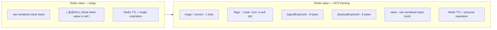

# Cache entry envelope — Redis payload format

## Summary

Give the Redis provider a wire format that carries the entry-metadata envelope (#371) inside the serialized payload, so the logical/physical expiration split, the reserved last-factory-error and tags slots, and null-value handling survive in Redis the way they survive as live object fields in the Memory provider. The format is a **versioned binary framing**: a fixed-width header (`magic/version`, `flags`, `logicalExpiresAt`, `physicalExpiresAt`) followed by the raw serialized value bytes. This slice is behavior-preserving — logical == physical, reserved slots empty — but the format is shaped once so every later M1/M2/M3 feature rides it without a second migration.

## Problem Frame

#371 established the envelope as a Memory-provider concern: `LogicalExpiresAt`/`PhysicalExpiresAt`/`LastFactoryError`/`Tags` live as fields on an in-process `CacheEntry` object. That works because Memory keeps live object references. Redis is out-of-process — the moment an entry leaves the process, its metadata has to live **in the bytes** or it does not exist. Today the Redis provider stores only the raw serialized value plus a single Redis TTL; it has nowhere to put "the value is stale but still serveable," "the last factory call failed at time T," or "this entry carries tags X, Y."

The roadmap's gating principle (#369) is "design the metadata model once; both M1 and M2 ride it." For Redis that cost is concentrated in the wire format: the M1 resilience family (#373–#376), the M2 tag index (#378–#380), and the M3 BCL-interop trio (#381–#383) all read or extend this payload. Getting the format wrong is paid as either inherited mistakes or repeated re-breaks across roughly a dozen issues.

Two forces make the Redis decision sharper than the Memory one:

- **Headless `ICache` is a power-user superset.** Unlike FusionCache (which runs purely on `IDistributedCache` and never touches the value server-side), Headless exposes `Increment`, compare-and-swap (`ReplaceIfEqual`/`RemoveIfEqual`), `SetIfHigher`/`SetIfLower`, prefix scan, and bulk — several of which operate on the **raw stored value** via Lua. Any format that buries the value inside a serialized graph breaks those scripts.
- **M3 is the headline deliverable.** The BCL adapters (`HybridCache`, `IOutputCacheStore`, `IDistributedCache`) traffic in `byte[]`. They need the raw value bytes back cheaply, without deserializing-and-re-extracting a wrapper.

This is deliberately a technical/architectural brainstorm — the wire format *is* the subject.

## Key Decisions

- **KD-1. Binary framing, not a whole-object wrapper, not a sidecar key.** The value is stored as a raw byte segment behind a fixed-width metadata header, all in one Redis string. This is the only layout that keeps the value *both* a recoverable raw segment (serving the atomic/CAS Lua superset and the M3 BCL adapters) *and* atomically co-evicted with its metadata. The whole-object wrapper (FusionCache's model) buries the value and fights both the superset and M3; the sidecar key keeps the value raw but cannot survive `maxmemory` — two keys have two independent LRU clocks and Redis has no primitive to evict them as a unit. A cache spends its life at `maxmemory`, so half-eviction is not a corner case.

- **KD-2. Physical expiration drives the Redis TTL; logical expiration lives in the header.** Redis `PEXPIRE` is set to the physical deadline (when the entry is evicted); the logical deadline (when the value is stale) is carried in the payload and consulted by app-side read logic. This matches FusionCache's verified L2 model. In this slice the two are equal, so TTL behavior is identical to today; #373 (fail-safe) flips them apart by setting a longer physical TTL with no format change.

- **KD-3. Null-value handling moves from a magic value to a header flag.** Today a cached C# null is stored as the literal `@@NULL` string, which means the literal string `"@@NULL"` cannot itself be cached. With framing, "value is null" becomes a bit in the `flags` byte and the value segment is empty. This preserves the null-round-trip behavior the conformance suite requires and removes the sentinel-collision wart.

- **KD-4. Counters stay raw; framed entries cover value + CAS.** Atomic numeric entries (`Increment`/`SetIfHigher`/`SetIfLower`) have no logical-vs-physical meaning, no factory to fail-safe, and nothing to tag — so they remain plain Redis-native values and keep native `INCR` throughput. Compare-and-swap (`ReplaceIfEqual`/`RemoveIfEqual`) operates on real metadata-bearing values, so it stays on framed entries and compares the caller's `expected` against the **value segment**, not the whole payload. The reader discriminates framed vs raw via the magic byte. *(This is the one consciously flippable decision — see Assumptions.)*

- **KD-5. Shared semantics, not a shared type — inherited from #371.** There is no shared CLR envelope type across providers. The field set and its semantics are the contract; Redis models them in its own wire format, Memory in live object fields. The cross-provider conformance harness is the drift guard. This keeps the caching provider assemblies decoupled and avoids the domain's first `InternalsVisibleTo` wiring.

- **KD-6. The header is versioned for forward evolution.** A `magic/version` byte governs the format so #373 (last-factory-error) and #379 (tags) extend the header without a break. Greenfield posture: there is no read path for pre-envelope payloads; unversioned/unrecognized bytes are rejected or ignored, not migrated.

### Wire layout: before / after

For #372, `logicalExpiresAt == physicalExpiresAt == now + duration` on every write, the `flags` carry only the is-null bit, and the reserved header capacity for last-factory-error (#373) and tags (#379) stays absent/empty — which is why behavior is unchanged.

## Requirements

### Wire format

- R1. Redis value entries are stored as a versioned binary frame: a fixed-width header carrying a magic/version marker, a flags byte, a logical-expiration instant, and a physical-expiration instant, followed by the raw serialized value bytes at a constant offset.
- R2. The value segment is the byte-for-byte output of the configured `ISerializer` (System.Text.Json or MessagePack) — framing wraps the serializer, it does not replace or nest inside it. The value bytes are recoverable by stripping the fixed header, without deserializing the value.
- R3. The header is versioned so later issues (#373 last-factory-error, #379 tags) extend it additively. Readers encountering an unrecognized/absent version treat the payload as not-an-envelope per the greenfield posture (reject or ignore; no legacy read path).
- R4. The header reserves capacity for the last-factory-error and tags fields defined by the envelope contract. In #372 these are absent/empty; #373 and #379 populate them.

### Expiration & null handling

- R5. The Redis key TTL (`PEXPIRE`) is set from the **physical** expiration. The **logical** expiration is carried in the header and is not enforced by Redis key expiry.
- R6. For every write in this slice, logical == physical == `now + duration`, so the observable TTL and expiry timing are identical to today.
- R7. A cached null value is represented by an is-null bit in the flags byte with an empty value segment, replacing the `@@NULL` literal. Round-tripping a null returns null; the literal string previously colliding with the sentinel is now cacheable.

### Atomic & compare-and-swap operations

- R8. Atomic numeric entries (`Increment`, `SetIfHigher`, `SetIfLower`) remain plain Redis-native values (no frame) and continue to use native/`INCR`-style operations. Reading such an entry back through the value path yields its numeric value.
- R9. Compare-and-swap operations (`ReplaceIfEqual`, `RemoveIfEqual`) operate on framed entries by comparing the caller's expected value against the **value segment** of the stored frame, and (for replace) by writing a new frame that preserves/refreshes the header. The migrated Lua scripts reach the value at the known offset rather than comparing whole-payload bytes.
- R10. The value read path discriminates framed entries from raw entries via the magic/version byte, so `GetAsync<T>` returns the correct value whether the entry was written framed (value/CAS) or raw (counter).

### Behavior preservation & conformance

- R11. With only a duration supplied (the only input available in this slice), the Redis provider's externally observable behavior — hits, misses, expiry timing, null round-trip, bulk/prefix operations, CAS, increment — is identical to the pre-change behavior. Existing Redis integration tests pass.
- R12. The cross-provider conformance harness asserts the metadata round-trips through Redis: an entry written with metadata is read back with the same logical/physical instants and null-ness, and logical/physical **parity** plus reserved-slot emptiness holds for this slice. The same conformance scenarios pass on both Memory and Redis.

## Acceptance Examples

- AE1. **Covers R1, R2, R11.**
  - **Given:** a value written via `UpsertAsync(key, value, TimeSpan.FromMinutes(10))`.
  - **When:** the stored Redis payload is inspected and then read back via `GetAsync<T>`.
  - **Then:** the payload begins with the versioned header and the value segment equals the raw `ISerializer` output; the read returns the original value.

- AE2. **Covers R5, R6.**
  - **Given:** the same 10-minute write.
  - **When:** the Redis key TTL and the header instants are inspected.
  - **Then:** the key TTL ≈ 10 minutes, `logicalExpiresAt == physicalExpiresAt == now + 10 minutes`, matching today's expiry timing.

- AE3. **Covers R7.**
  - **Given:** a null value cached under a key, and separately the literal string `"@@NULL"` cached under another key.
  - **When:** both are read back.
  - **Then:** the first returns null (is-null flag set, empty value segment); the second returns the literal string `"@@NULL"` intact.

- AE4. **Covers R8, R10.**
  - **Given:** `Increment(key, 1)` called several times, then `GetAsync<long>(key)`.
  - **When:** the entry is stored and read.
  - **Then:** it is stored as a raw native value (no frame), native increment applies, and the read returns the accumulated count.

- AE5. **Covers R9.**
  - **Given:** a framed value entry, and a `ReplaceIfEqual(key, expected, next)` call.
  - **When:** `expected` matches the stored value segment.
  - **Then:** the replacement succeeds and writes a new frame; when `expected` does not match the value segment, the operation is a no-op — comparison never sees header bytes.

- AE6. **Covers R12.**
  - **Given:** the cross-provider conformance suite for entry metadata.
  - **When:** it runs against the Redis fixture.
  - **Then:** metadata round-trips (logical/physical instants and null-ness survive), parity/emptiness invariants hold, and the suite is green on both Memory and Redis.

## Scope Boundaries

### Deferred to later issues (format is ready, not activated)

- Divergent logical/physical TTL and serve-stale-on-failure — #373 sets a longer physical TTL and reads the logical instant.
- Last-factory-error population and soft/hard factory timeouts — #373, #374; the header slot is reserved here.
- Eager refresh and adaptive caching — #375, #376.
- Tag header population, Redis reverse index, and `RemoveByTagAsync` — #378–#380; the tags slot is reserved here.
- BCL `IDistributedCache` / `HybridCache` / `IOutputCacheStore` adapters consuming the raw value segment — #381–#383.
- Sliding expiration — #377.

### Outside this issue's shape

- No change to the `ISerializer` abstraction or its implementations — framing sits above it.
- No shared cross-provider envelope CLR type (KD-5).
- No new public `ICache` surface; `CacheEntryOptions` members beyond `Duration` are added by the M1 PR that activates each one.
- Collection/list/set operations keep their existing sorted-set representation; the envelope concerns scalar value entries.

## Dependencies & Assumptions

- **Depends on #371 (PR #389):** the envelope field set and `CacheEntryOptions` exist in the abstractions/Memory provider. #372 must land on a branch that includes #389.
- **Assumption (flippable — KD-4): counters stay raw rather than framed.** Rationale: native `INCR` throughput and no metadata semantics on a counter. The alternative — uniform framing for every entry, with a custom Lua `INCR` that parses the header — buys a single on-wire format at the cost of native-increment speed and more Lua. If a uniform format is later judged worth that cost, the read path's magic-byte discrimination (R10) is the only thing that changes.
- **Assumption:** fixed-width header fields (1+1+8+8 bytes) are sufficient for the M1 metadata; #373/#379 extend via the version byte and additional fixed or length-prefixed regions rather than reshaping the existing fields.
- **Assumption:** the conformance harness scaffolding from #371 (R11/R12 there) is in place for Redis to attach its round-trip assertions; if not yet extracted, that extraction precedes or accompanies this slice (per the repo's harness-first rule for the 2nd provider).

## Open Questions

- OQ1. Exact header encoding of the expiration instants — Unix-ms `long` vs ticks — and endianness, settled at planning against the existing serializer/Redis byte conventions.
- OQ2. Whether the magic/version marker is a single byte or a short multi-byte tag, balanced against false-positive risk of misreading a raw counter or an externally-written key as a frame.
- OQ3. Migration mechanics of the CAS and set-if Lua scripts — whether the value-segment offset is passed as a script arg or hard-coded to the header width — decided when the scripts are rewritten.
