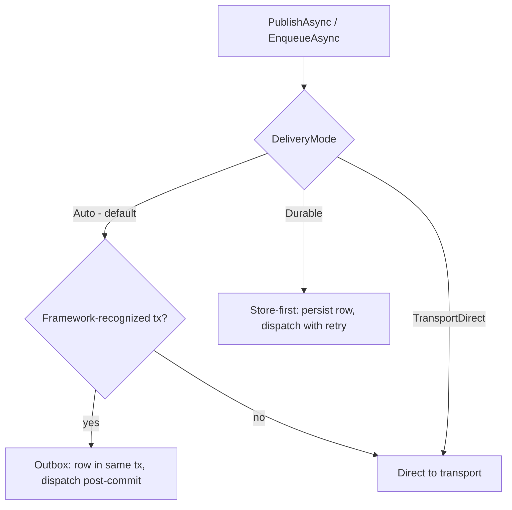

# Messaging Type-Intent Public API — Requirements

## Summary

Redesign the messaging public API so every message type declares its lane once via `IEvent`/`ICommand` marker interfaces, enforced at compile time by generic constraints on `IBus.PublishAsync` / `IQueue.EnqueueAsync`. The outbox interfaces (`IOutboxBus`/`IOutboxQueue`) are deleted: durability becomes a delivery mode on the two remaining surfaces — ambient-transaction-driven by default, overridable per call.

---

## Problem Frame

Headless is the only framework among the seven surveyed (MassTransit, NServiceBus, Wolverine, Rebus, Foundatio, CAP) that lets one message type traverse both the bus and queue lanes. Intent is chosen independently at every registration (`OnBus`/`OnQueue`) and every publish call (which of four interfaces), with nothing reconciling the two axes — the root of the #344 cross-intent leak and of four documented API weaknesses: free-floating intent, a verbose common case, scanning that cannot express intent, and a four-interface publish surface. The dual-lane capability this flexibility preserves is exercised by one unit test and used by nothing else in the repo.

Full analysis, framework comparison, and decision ledger: `docs/brainstorms/2026-06-10-messaging-public-api-design-handoff.md`.

---

## Key Decisions

- **One type → one lane, no escape hatch (Option 3).** Every message is an event or a command. A both-lanes need is modeled as two types. The #344 collision becomes unrepresentable instead of contained.
- **Markers + generic constraints, no conventions (A1).** Classification lives on the type (`IEvent`/`ICommand` over a common `IMessage`); constraints make wrong-verb and unmarked-type publishes compile errors. Predicate conventions, attributes, and builder classification (`.AsEvent()`) do not exist — they cannot satisfy constraints and would forfeit compile-time enforcement. Unowned third-party types are wrapped in owned marker-bearing records.
- **Keep `IBus` and `IQueue`; delete only the outbox pair.** The collapse is 4 → 2, not 4 → 1. The lane stays visible as the noun you inject, doubly enforced by the constraint. Familiar names and verbs (`PublishAsync`/`EnqueueAsync`) are preserved.
- **Durability follows the ambient transaction by default, overridable per call.** `DeliveryMode.Auto`: inside a framework-recognized transaction → outbox semantics; outside → direct to transport. `Durable` and `TransportDirect` are explicit per-call overrides. The hot broadcast path (e.g., cache invalidation) stays storage-free with no declaration.
- **Greenfield rip-and-replace.** `OnBus`/`OnQueue`, `IOutboxBus`/`IOutboxQueue`, and `IntentType`-as-public-signal are removed outright; no compatibility shims.

---

## Requirements

**Markers and classification**

- R1. A dependency-free contracts surface ships three empty marker interfaces: `IMessage`, `IEvent : IMessage`, `ICommand : IMessage`.
- R2. Every concrete message type resolves to exactly one lane marker after walking its full base-type and interface graph: assignable to `IEvent` xor `ICommand`. Derived marker interfaces (`IDomainEvent : IEvent`) are allowed. A type assignable to both, directly or indirectly, fails validation with an error naming the concrete type and the marker paths that caused the conflict.
- R3. No other classification mechanism exists. Guidance for unowned external types: wrap them in owned records.

**Publish surface**

- R4. `IBus.PublishAsync<T>` is constrained `where T : IEvent`; `IQueue.EnqueueAsync<T>` is constrained `where T : ICommand`.
- R5. `IOutboxBus` and `IOutboxQueue` are deleted; their capabilities move behind `IBus`/`IQueue` as delivery modes (R8–R10).
- R6. `IConsume<T>` is constrained `where T : IMessage`, so a handler for an unmarked type is a compile error.
- R7. `ConsumeContext` drops `IntentType`; the lane is derivable from the message type.

**Durability and delivery**

- R8. Default `DeliveryMode.Auto` uses the framework transaction accessor as the only source of truth for ambient durability. With an active framework-recognized transaction, the call writes an outbox row into that transaction and dispatches only after commit; without one, the call sends directly to the transport with no storage row.
- R8a. Presence of `System.Transactions.Transaction.Current` alone does not imply outbox semantics unless it is recognized by the framework transaction accessor.
- R9. `DeliveryMode.Durable` forces store-first regardless of transaction state (in a transaction: same-transaction row; outside: standalone row, then dispatched with retry).
- R10. `DeliveryMode.TransportDirect` forces transport-direct even inside a transaction — an explicit escape from atomicity. When used while a framework-recognized transaction is active, a structured diagnostic event records that atomicity was intentionally bypassed.
- R11. `Delay` requires storage: under `Auto` with no transaction it upgrades the call to durable; combined with explicit `TransportDirect` it is an argument error. If durable scheduling is unavailable for the configured provider, the call fails synchronously before writing or sending anything. `Delay` means the message is not eligible for dispatch until the delay elapses; exact dispatch time is best-effort (dispatcher polling/backoff). The current silent-ignore of `Delay` on direct publishes is removed.
- R12. `PublishOptions`/`EnqueueOptions` remain separate records and gain the `Delivery` member.

**Registration and discovery**

- R13. Assembly scanning infers the lane from the marker, replacing the hardcoded Bus default. Scanning is the documented default registration style.
- R13a. Scanning discovers consumers, resolves each consumed message type, validates its marker, and registers the consumer on the lane derived from that marker.
- R13b. A consumer for an unmarked type is invalid even when discovered only through scanning.
- R14. `ForMessage<T>` remains the explicit/override surface for name, correlation, and consumer configuration (`Group`, `Concurrency`, `HandlerId`, circuit breaker, provider escape hatches). `OnBus<C>`/`OnQueue<C>` are replaced by a lane-neutral `Consumer<C>`.
- R14a. `ForMessage<T>` is constrained `where T : IMessage`.
- R14b. `Consumer<C>()` validates that `C` consumes `T` — by generic constraints where the API shape allows, by boot validation otherwise.

**Enforcement and diagnostics**

- R15a. Boot validation checks every message type discovered through scanning or explicit registration against R2.
- R15b. Runtime validation checks the resolved message type before writing, dispatching, or consuming an envelope, so reflection, dynamic invocation, open generic consumers, provider escape hatches, and internal dispatch paths cannot bypass classification.
- R15c. Runtime validation fails before any storage write or transport send — a bad envelope is never half-written.
- R16. The wire intent header continues to be stamped for diagnostics; fail-closed behavior on mismatch is owned separately (Q4 follow-up issue). This work preserves enough envelope metadata to later check a resolved message type's marker against the wire intent header.

**Adoption**

- R17. Internal consumers of messaging (Caching.Hybrid invalidation) migrate to the marker model.
- R18. Doc surfaces (`docs/llms/messaging.md`, affected package READMEs) are updated per `docs/authoring/AUTHORING.md`. Docs state the lane meaning explicitly: `IEvent` = broadcast/pub-sub lane, `ICommand` = point-to-point/work-queue lane — not DDD's domain-event/command vocabulary. A "domain command that should also broadcast" is modeled as two message types.

---

## Acceptance Examples

- AE1. **Covers R4.** Given `ProcessPayment : ICommand`, when code calls `bus.PublishAsync(new ProcessPayment(…))`, then compilation fails on the `IEvent` constraint.
- AE2. **Covers R2, R15.** Given `record Confused : IEvent, ICommand` registered via scanning, when the host boots, then startup fails with an error naming `Confused` and both markers.
- AE3. **Covers R8.** Given no ambient transaction and default options, when an event is published, then no storage row is written and the transport receives it directly.
- AE4. **Covers R8.** Given an ambient transaction, when an event is published with default options and the transaction rolls back, then the message is never dispatched.
- AE5. **Covers R9.** Given no ambient transaction and `Delivery = Durable`, when the broker is unavailable at publish time, then the message persists and dispatches once the broker recovers.
- AE6. **Covers R11.** Given `Delivery = TransportDirect` and a non-null `Delay`, when the call is made, then it fails with an argument error rather than ignoring the delay.
- AE7. **Covers R13, R13a.** Given an assembly with handlers for one `IEvent` type and one `ICommand` type, when registered via scanning only, then the event handler consumes from the bus lane and the command handler from the queue lane.
- AE8. **Covers R4.** Given `UserRegistered : IEvent`, when code calls `queue.EnqueueAsync(new UserRegistered(…))`, then compilation fails on the `ICommand` constraint.
- AE9. **Covers R10.** Given an ambient framework transaction, when an event is published with `Delivery = TransportDirect` and the transaction later rolls back, then the transport send is not rolled back and a diagnostic event records that direct delivery bypassed atomicity.
- AE10. **Covers R11.** Given no ambient transaction, default delivery, and a non-null `Delay`, when a command is enqueued, then a storage row is written and the message is not eligible for dispatch until the delay elapses.
- AE11. **Covers R14a.** Given `record ExternalWebhook(…)` with no marker, when code calls `ForMessage<ExternalWebhook>()`, then compilation fails on the `IMessage` constraint.
- AE12. **Covers R2.** Given `interface IDomainEvent : IEvent` and `record UserRegistered(…) : IDomainEvent`, when discovered by scanning, then it classifies as an event.
- AE13. **Covers R2, R15a.** Given `interface IIntegrationMessage : IEvent, ICommand` and `record Bad(…) : IIntegrationMessage`, when the host boots, then validation fails naming `Bad` and both marker paths.
- AE14. **Covers R16.** Given `UserRegistered : IEvent`, when it is published, then the wire intent header is stamped with the bus lane.

---

## Scope Boundaries

- #359 (dual-lane physical topology split) executes from its own plan; it ships regardless and becomes a transition-only correctness net under this model.
- Q4 (fail-closed intent-header validation) is a standalone follow-up issue, not part of this work.
- A Roslyn analyzer for the both-markers hole is a later nicety, not v1.
- Option 4-style pipeline un-sharing (separate storage/dispatch per lane) is rejected; the internal pipeline stays shared.
- Request/response, sagas, and scheduling beyond the existing `Delay` option are untouched.

---

## Dependencies / Assumptions

- The ambient-transaction mechanism (`IOutboxTransactionAccessor` + writer branching) already exists and carries the `Auto`/outbox behavior; this work re-fronts it, not rebuilds it.
- Dual-lane same-type registration has no internal consumers (verified 2026-06-10); removing it breaks only one unit test.
- Message storage remains required by the consume pipeline; `Auto`'s direct path removes the storage write from the publish hot path only.

---

## Outstanding Questions

**Deferred to planning**

- Where the markers live: a new contracts package vs `Headless.Messaging.Abstractions` (decide by dependency weight).
- Whether the scanning entry points keep the `ForMessagesFromAssembly*` names or rename to consumer-centric names.
- Exact error codes/wording for R2/R11/R15 errors (`g:snake_case` descriptor space).
- Where the `DeliveryMode` enum lives (member names are settled: `Auto`, `Durable`, `TransportDirect`).
- How `Durable`-outside-transaction interacts with the dispatcher's existing retry/backoff configuration.

---

## Implementation Risk Notes

Breadcrumbs for the planner — the areas most likely to bite during implementation.

- Constraints must live on the public methods (`IBus`, `IQueue`, `ForMessage<T>`), not only on internal helpers.
- Lane resolution uses full assignability (`typeof(IEvent).IsAssignableFrom(t)` xor `typeof(ICommand).IsAssignableFrom(t)`), never direct-interface-list checks — derived marker aliases must classify correctly (R2, AE12).
- Scanning currently hardcodes the Bus lane; the migration re-keys discovery on `IConsume<T>` → `T` → marker (R13a).
- Existing tests may rely on `Delay`'s silent-ignore on direct publishes; replace them with explicit-failure tests (R11).
- `Durable` outside a transaction needs a defined boundary — persist row, then dispatch via the dispatcher/relay — not persist-then-best-effort-immediate-send, unless that contract already exists and is documented.
- Marking internal messages (cache invalidation) may surface vague internal message semantics worth tightening while there.

---

## Sources

- `docs/brainstorms/2026-06-10-messaging-public-api-design-handoff.md` — decision ledger (§7, Q1–Q7), framework research (§3.2), modeled API (Appendix F), code map (Appendix A).
- `docs/plans/2026-06-10-001-feat-messaging-dual-lane-topology-kafka-guard-plan.md` — #359 plan, ships independently.
- Industry references: NServiceBus message conventions and enforcement, MassTransit transactional outbox and Riders, Wolverine routing/durability (URLs in the handoff doc §3).
