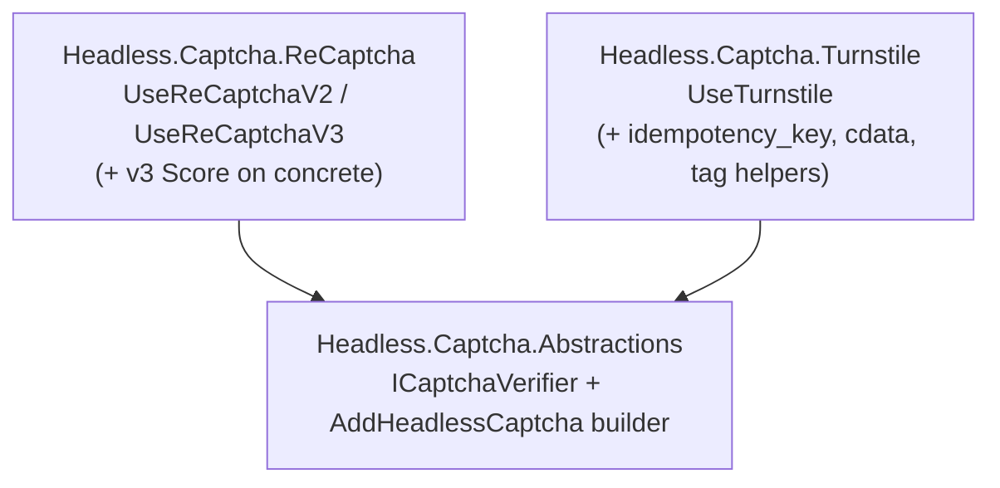

# CAPTCHA Provider Abstraction + Cloudflare Turnstile

## Summary

Introduce a provider-based CAPTCHA capability: a new `Headless.Captcha.Abstractions` defining `ICaptchaVerifier`, with the existing reCAPTCHA package renamed to `Headless.Captcha.ReCaptcha` and a new `Headless.Captcha.Turnstile` provider, all composed through a unified `AddHeadlessCaptcha(...)` builder. Turnstile ships at full parity with reCAPTCHA (server verify, Razor tag helpers, localization) plus its native `idempotency_key` and `cdata`.

## Problem Frame

The framework's value proposition is unopinionated, swappable providers behind a common abstraction (caching, blobs, locks, messaging all follow this). CAPTCHA does not: `src/Headless.ReCaptcha/` is a single standalone package hard-wired to Google reCAPTCHA, with no abstraction a second provider could implement. A consumer who wants Cloudflare Turnstile today cannot get it from the framework, and even if a standalone Turnstile package were added, consumers would couple their call sites to a concrete vendor type — the exact lock-in the framework exists to avoid.

reCAPTCHA and Turnstile share a near-identical server-verify contract (token + optional remote IP in; `success` / `hostname` / `challenge_ts` / `error-codes` / `action` out), which makes a shared abstraction honest rather than forced. The one genuine divergence — reCAPTCHA v3's numeric `score`, which Turnstile has no equivalent for — does not normalize, and is the reason the abstraction must stay pass/fail.

## Key Decisions

- **Full abstraction + provider split, not a standalone Turnstile package.** Rename `Headless.ReCaptcha` → `Headless.Captcha.ReCaptcha`, add `Headless.Captcha.Turnstile`, both behind `Headless.Captcha.Abstractions`. Aligns CAPTCHA with the framework's flagship caching/blobs pattern and gives consumers provider-swappability. Chosen over a zero-churn standalone package because swappable verification is the framework's whole point.
- **The shared abstraction is pass/fail only.** `ICaptchaVerifier` returns the fields common to every provider. reCAPTCHA v3's `score` stays on its concrete result/interface and is never forced into the base contract — a consumer doing score-gated logic is writing reCAPTCHA-specific code anyway, so coupling there is correct, not a leak.
- **Keyed multi-provider selection.** Multiple providers can be registered at once; the consumer names which verifier to resolve, following the established caching/blobs keyed-DI pattern.
- **Hard greenfield cutover.** The published `Headless.ReCaptcha` package id is retired with no compatibility shim; existing consumers migrate to the new package and builder. Consistent with the repo's stated greenfield stance.
- **Turnstile ships full parity plus native extras.** Server verify, Razor tag helpers, and a localization provider (matching reCAPTCHA), plus Turnstile's `idempotency_key` (request) and `cdata` (result), which are low carrying cost.

## Requirements

**Abstraction (`Headless.Captcha.Abstractions`)**

- R1. A new package defines `ICaptchaVerifier` whose `VerifyAsync(request, cancellationToken)` returns a normalized result carrying the fields common to all providers: success flag, hostname, challenge timestamp, error codes, and action.
- R2. The normalized request carries the required client response token and an optional remote IP — the inputs every provider accepts.
- R3. Provider-specific result data is exposed on derived result types, not on the base normalized result; the base result stays pass/fail.
- R4. The abstraction package owns the unified setup-builder entry point `AddHeadlessCaptcha(...)`, which provider packages extend with `Use{Provider}` members, per the unified-provider-setup-builder pattern.

**Turnstile provider (`Headless.Captcha.Turnstile`)**

- R5. A new package verifies tokens server-side against Cloudflare's siteverify endpoint and implements `ICaptchaVerifier`.
- R6. The Turnstile verify request supports the optional `idempotency_key` for safely retrying validation.
- R7. The Turnstile concrete result exposes its provider-only fields (`cdata`, and Enterprise `metadata` where present) without polluting the base result.
- R8. Razor tag helpers render the Turnstile client script and the widget element.
- R9. A localization provider supplies the widget language, mirroring reCAPTCHA's language-code provider.
- R10. Options carry site key and secret (and a configurable verify base URL), validated with FluentValidation declared in the same file as the options class.

**reCAPTCHA migration (`Headless.Captcha.ReCaptcha`)**

- R11. The existing `Headless.ReCaptcha` package is renamed to `Headless.Captcha.ReCaptcha`, with its public types moved into the captcha namespace.
- R12. reCAPTCHA v2 and v3 both implement `ICaptchaVerifier`; v3's `score` remains reachable only through its concrete result/interface.
- R13. reCAPTCHA registration moves onto the unified builder as `UseReCaptchaV2` / `UseReCaptchaV3`; the standalone `AddReCaptchaV2` / `AddReCaptchaV3` entry points are removed (no compat shim).

**DI and configuration**

- R14. Multiple providers may be registered simultaneously; `ICaptchaVerifier` and any concrete interfaces resolve by key/name so a consumer can select which verifier to use, following the caching/blobs keyed-DI pattern.
- R15. Provider `Use{Provider}` members that bind a backend's options expose the standard overload trio (`Action<TOptions>`, `IConfiguration`, `Action<TOptions, IServiceProvider>`) and bind a `Headless:Captcha:*` configuration section.

**Docs and demo**

- R16. A new `docs/llms/captcha.md` and per-package READMEs explain the abstraction, the providers, the pass/fail-vs-score trade-off, and provider selection, per the docs authoring contract.
- R17. The demo app is updated to show provider selection and Turnstile usage (extending or replacing the existing reCAPTCHA demo).

## Acceptance Examples

- AE1. Turnstile verify outcome. **Covers R5.**
  - **Given** a Turnstile provider is registered and a client token is presented.
  - **When** the token is valid, `VerifyAsync` returns a result with `success = true` and the populated common fields.
  - **When** the token is invalid or expired, the result has `success = false` and non-empty error codes — no exception for a well-formed-but-rejected token.

- AE2. Score is provider-specific. **Covers R3, R12.**
  - **Given** a reCAPTCHA v3 provider is registered.
  - **When** a consumer resolves the generic `ICaptchaVerifier`, the result exposes pass/fail only.
  - **Then** the numeric score is reachable only by resolving / casting to the concrete reCAPTCHA v3 type.

- AE3. Keyed provider selection. **Covers R14.**
  - **Given** both a Turnstile and a reCAPTCHA provider are registered on the same builder.
  - **When** a consumer resolves the verifier by the name it registered under.
  - **Then** the resolved verifier is the matching backend, and verification routes to that vendor's endpoint.

## Scope Boundaries

**Deferred for later**

- Additional providers (e.g., hCaptcha) — the abstraction is meant to enable them, but none are built in this effort.
- reCAPTCHA Enterprise and Turnstile Enterprise-only surfaces beyond exposing the `metadata` field where the standard response returns it.

**Outside this product's identity**

- Client-side integrations beyond Razor tag helpers (e.g., Blazor or JS-framework components) — the CAPTCHA packages stay server-side verification plus Razor, matching the current reCAPTCHA package.

## Dependencies / Assumptions

- Selection mechanism assumes the framework's existing keyed-DI multi-provider pattern (caching/blobs) rather than a new mechanism.
- Hard cutover assumed: downstream consumers of `Headless.ReCaptcha` migrate manually to the renamed package and builder.
- Turnstile API shape verified against Cloudflare docs on 2026-06-21: siteverify accepts `secret` / `response` / optional `remoteip` / optional `idempotency_key`; response carries `success` / `challenge_ts` / `hostname` / `error-codes` / `action` / `cdata`; there is no score field.
- The exact Turnstile widget language attribute for the localization provider (R9) needs confirmation at plan time — the client-rendering doc page did not enumerate it.

## Outstanding Questions

**Deferred to planning**

- Whether reCAPTCHA v2/v3 retain distinct concrete interfaces or collapse to `ICaptchaVerifier` + keyed registration + result subtypes. Affects public surface; resolve with codebase exploration during planning.
- Whether a single registered provider also resolves as an unkeyed/default `ICaptchaVerifier`, or whether resolution is always keyed.
- Exact result-type hierarchy, namespaces, and the tag-helper attribute coverage (theme/size/callbacks) for Turnstile.
- Migration mechanics for moving the reCAPTCHA namespaces and updating the demo + `headless-framework.slnx`.

## Sources / Research

- Cloudflare Turnstile — server-side validation: https://developers.cloudflare.com/turnstile/get-started/server-side-validation/
- Cloudflare Turnstile — client-side rendering: https://developers.cloudflare.com/turnstile/get-started/client-side-rendering/
- Existing reCAPTCHA package: `src/Headless.ReCaptcha/Setup.cs`, `src/Headless.ReCaptcha/V3/IReCaptchaSiteVerifyV3.cs`, `src/Headless.ReCaptcha/Contracts/ReCaptchaOptions.cs`, `src/Headless.ReCaptcha/README.md`.
- Solution registration: `headless-framework.slnx`.
- Patterns and conventions: `docs/solutions/architecture-patterns/unified-provider-setup-builder-pattern.md`, `CLAUDE.md` (options pattern, DI setup-class convention, problem-details error codes).
