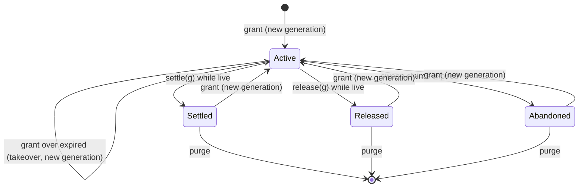

# Fencing

> A relational fenced-lease primitive: grant a lease on `(tenant, kind, resource)`, hand its generation to any executor, and refuse that executor's write once a later grant replaces it.

## How this differs from locks and idempotency

A fenced lease answers "who owns this work, at which generation, until when?". Comparison of all four primitives: [Choosing a coordination primitive](index.md#choosing-a-coordination-primitive).

- A **distributed lock** ([Distributed Locks](distributed-locks.md)) grants exclusive execution to a live in-process handle. Its optional `FencingToken` is a number the *protected resource itself* must check — the lock does not check it for you. Use a lock instead when the work runs in one live process and a duplicate run only wastes effort.
- A **fenced lease** (`IFencedLeases` / `unit.Leases`) is a durable database row any process can carry by `(resource, generation)`. The database checks it for you, inside the caller's own transaction, at the moment the write happens — not by convention at the call site. There is no live handle: an external executor with no connection to the framework can hold a lease, heartbeat it, and post a result hours later, which a connection-scoped lock cannot do.
- Use [Idempotency](idempotency.md) instead when the question is "has this operation already happened?" and a retry must replay its stored result. Idempotency keeps its own lease on its record and does not use this table.
- Do not add a fenced lease for work that already has a row you own. Put the lease on that row, as Jobs and Messaging do (`OwnerId`/`Owner` plus `LockedUntil`).

The classic (Kleppmann) failure this is built for:

```text
t0  Holder A grants the lease on "order-42", gets generation 1, starts a long GC pause or network partition.
t1  A's lease expires (database clock). A is still paused; it does not know yet.
t2  Holder B grants the lease, takes it over, gets generation 2, does the work, settles it.
t3  A resumes, unaware it lost the lease, and tries to write with generation 1.
    unit.Leases.FenceAsync(leaseAtGen1) reads the row, sees the current generation is 2, and throws
    StaleLeaseException — A's write never lands.
```

Nothing about `t3` depends on A noticing anything: the refusal happens at the database, inside A's own transaction, before A's write commits.

**The limit.** Fencing refuses a stale *write*. It cannot recall a side effect A already produced outside the database before `t3` — an email already sent, an external API already called, a message already published to a system this lease does not cover. Design any such side effect to be safe to repeat (idempotent at its own boundary), or gate it behind the fenced write itself (write first, act in a post-commit callback or a relay that only fires from the committed row).

**Relation to Jobs keyed scheduling.** Jobs guards its own scheduled rows the same way, with its own generation column: `ReplaceKeyedAsync(key, observedGeneration, ...)` advances only while the row is pending and unclaimed, and reports `StaleGeneration` when a lost-response replay names a generation Jobs already moved past (see [jobs.md](jobs.md)). That check protects exactly one table — Jobs' own. A fenced lease is the same generation-guard pattern extracted into a reusable primitive: it fences *any* caller-owned write, on any table, for any resource a caller names, not only Jobs' rows.

## Orientation

Register exactly one provider and use the lease either autonomously or enlisted:

```csharp
builder.Services.AddHeadlessFencing(setup => setup.UsePostgreSql(connectionString)); // or setup.UseSqlServer(...)
// tests, local development, one instance: builder.Services.AddHeadlessFencing(setup => setup.UseInMemory());
```

- **Autonomous** — inject `IFencedLeases` and call `GrantAsync`, `RenewAsync`, `SettleAsync`, `ReleaseAsync`, `SweepExpiredAsync`, or `PurgeAsync`. Each call is its own transaction and commits before it returns.
- **Enlisted** — `unit.Leases` (namespace `Headless.UnitOfWork`, added by `Headless.Fencing.Abstractions`) runs `GrantAsync`, `RenewAsync`, `SettleAsync`, `ReleaseAsync`, and `FenceAsync` inside the caller's own transaction, so a rollback undoes them.

A typical external-executor handoff:

```csharp
var grant = await leases.GrantAsync("exports", "order-42", TimeSpan.FromMinutes(5), ct); // GrantAsync
if (!grant.IsAcquired) { /* grant.Status == Held: someone else owns it */ }

SendToExecutor(grant.Lease!); // (resource, generation) — the executor can be an external process

// the executor heartbeats:
await leases.RenewAsync(lease, TimeSpan.FromMinutes(5), ct);

// the executor posts its result; fence it inside the unit that writes it:
await factory.RunAsync(db, async (unit, ct) =>
{
    await unit.Leases.FenceAsync(lease, ct);   // throws StaleLeaseException if a later grant replaced it
    // ... write the result ...
    await unit.Leases.SettleAsync(lease, ct);  // same transaction
});

// a cron or hosted service recovers abandoned attempts:
await leases.SweepExpiredAsync("exports", async (expired, unit, ct) =>
{
    await unit.Outbox.PublishAsync(new ExportAbandoned(expired.Resource), ct);
}, limit: 100, ct);
```

## Agent Rules

- Fence the write, not the read that decided to write. Call `unit.Leases.FenceAsync(lease)` immediately before the writes it guards, inside the same unit that commits them — it locks the lease row until the unit ends, so nothing can grant, renew, settle, or sweep the lease out from under that transaction.
- Never treat holding a `FencedLease` value as proof of anything. It is a plain record `(TenantId, Kind, Resource, Generation)` — only the store's answer to a grant, renew, settle, or fence call means the caller still owns it.
- An enlisted `GrantAsync` that answers `Held` keeps the lease row locked (read for update) until the caller's transaction ends, blocking the live holder's renew and settle for that long. Use the autonomous `IFencedLeases.GrantAsync` for a plain contention check, and reach for the enlisted `unit.Leases.GrantAsync` only when the grant itself must roll back with the caller's other writes.
- A long-running fenced transaction blocks every other verb on that lease — grant, renew, settle, sweep — for as long as it stays open, including the holder's *own* renew issued from another connection. Keep the window between `FenceAsync` and commit short; renew before fencing, not after.
- `SweepExpiredAsync`'s handler must write its handoff through the unit it receives (`unit.Outbox`, `unit.Jobs`, or raw ADO/Dapper on the unit's connection) — an EF `DbContext` cannot join a unit a raw-ADO call already owns. A handler that throws rolls back only its own claim; that lease stays expired and is offered again by a *later* call, never retried in a loop by the same call.
- Expiry is always decided by the database clock, inside the statement that checks it — never by comparing `DateTimeOffset.UtcNow` on the caller's machine. A skewed application clock cannot make a live lease look expired or an expired one look live. The in-memory provider is the one exception: its registered `TimeProvider` is the clock, read after the key's lock is held.
- `PurgeAsync` only deletes terminal rows (`Settled`, `Released`, `Abandoned`) older than the cutoff; it never weakens the generation guarantee — a lease granted again after its row is purged still gets a generation above every one issued before the purge, because generations are drawn from one store-wide sequence, not a per-row counter.
- `kind`, `resource`, and the current tenant id are validated against `FencingFieldLimits` (`KindMaxLength` 64, `ResourceMaxLength` 256, `TenantIdMaxLength` 128) before any SQL runs; a value with leading/trailing whitespace or over the limit throws `ArgumentException` immediately.

## Core Concepts

### Lease identity and generation

A lease is identified by `(TenantId, Kind, Resource)` — the tenant from `ICurrentTenant.Id` (host scope is `null`), a `kind` that groups leases for sweeping and purging, and a `resource` within that kind. Every successful grant issues a `Generation` strictly greater than any generation ever issued for that identity, including across a purge of the row. Generations come from one store-wide sequence rather than a per-row counter: a per-row counter would restart at 1 when a purged-and-recreated row is granted again, and a pre-purge zombie holding generation 1 would then look current. Gaps in the sequence (from a rolled-back grant) are harmless — a stale holder is caught by inequality with the row's current generation, never by arithmetic on it.

### Lease state

State is `Active | Settled | Released | Abandoned`. "Expired" is never stored — it is `Active` with `expires_at <= (database clock)`, evaluated fresh inside each statement.



`GrantAsync` reads the row and decides: no row, or a terminal row → `Granted` with a new generation; a live `Active` row → `Held` with the current holder's generation and expiry; an `Active` row past its expiry → `Takeover`, a new generation, and the previous generation in the result. `RenewAsync`, `SettleAsync`, and `ReleaseAsync` all take the generation they act on and report `Stale` whenever a newer grant replaced it, whichever terminal state ended it otherwise, or (for renew) `Expired` when the generation is current but the lease already lapsed.

### The fence

`FenceAsync` is a locking read, not a predicate appended to the caller's own write: PostgreSQL reads the row `FOR NO KEY UPDATE`, SQL Server `WITH (UPDLOCK, HOLDLOCK, ROWLOCK)`. It throws `StaleLeaseException` unless the generation is current, the lease is `Active`, and it has not expired — and the lock it takes holds that answer true until the caller's transaction ends, so no concurrent grant, renew, or sweep can invalidate it out from under the still-open write. `LeaseFenceStatus` on the exception says why: `Stale`, `Expired`, `Settled`, `Released`, or `Abandoned`.

### Sweep and purge

`SweepExpiredAsync(kind, handler, limit)` claims up to `limit` expired `Active` leases of one kind, one per its own owned transaction, marks each `Abandoned` in the same statement that claims it (`SKIP LOCKED` on PostgreSQL, `UPDLOCK, READPAST, ROWLOCK` — plus `READCOMMITTEDLOCK` under RCSI — on SQL Server), and hands it to the handler before committing. Concurrent sweepers therefore never hand one lease to two handlers, and a handler that throws only rolls back its own claim. The sweep never redispatches within one call; run it from your own cadence (a Jobs cron or hosted service) — there is no built-in scheduler.

`PurgeAsync(kind, olderThan)` deletes `Settled`, `Released`, and `Abandoned` rows of that kind that ended at least `olderThan` ago, by the database clock. Live and expired-but-still-`Active` leases are never touched.

### Enlistment

Enlisted calls (`unit.Leases.*`) follow the same rules as `unit.Sequences` (see [unit-of-work.md](unit-of-work.md)): they run `RequireTransaction`, then `ValidateEnlistment` (a live transaction, on the owning connection, on the same database as the configured provider via `RelationalDatabaseIdentity`), then — for grant, renew, settle, and release only, never for the fence read — mark an *observed*-mode unit non-retryable before running. Enlisted calls are never retried; a refused call runs no statement and leaves the unit retryable. What the unit must carry is the provider's judgment: the relational providers need a live transaction on their own database, while the in-memory provider refuses any unit over a database connection and accepts a resource-less unit (`IUnitOfWorkFactory.BeginAsync()`), which then plays the transaction. Autonomous calls open their own connection at READ COMMITTED and retry only a deadlock (PostgreSQL `40P01`, SQL Server 1205) up to three times.

## Choosing a Provider

| Provider | Use when | Avoid when | Trade-off |
| --- | --- | --- | --- |
| `Headless.Fencing.PostgreSql` | Enlisted callers run their units on PostgreSQL | Callers run on SQL Server | Sweep uses `SKIP LOCKED`; generation draws `nextval()` after the locking read |
| `Headless.Fencing.SqlServer` | Enlisted callers run their units on SQL Server | — | Sweep uses `READPAST` (plus `READCOMMITTEDLOCK` under RCSI); generation draws `NEXT VALUE FOR` after the locking read |
| `Headless.Fencing.InMemory` | Tests, local development, or a single-instance host with no relational database (for example Redis-only) | Several processes share the leased work, or a fence must guard writes that commit in a database | Leases live in one process and vanish on restart; the registered `TimeProvider` decides expiry; enlisted calls run only on resource-less units, so a fence cannot join a database transaction |

A relational provider must sit on the database enlisted units run on; lease rows are written inside the unit's own transaction, on its own connection.

---

## Headless.Fencing.Abstractions

Consumer contracts: `IFencedLeases`, `FencedLease`, the grant/renewal/settlement/sweep result types, `StaleLeaseException`, and the `unit.Leases` accessor.

### Setup

```bash
dotnet add package Headless.Fencing.Abstractions
```

Reference it from code that grants, renews, or fences leases. Registration lives in `Headless.Fencing.Core` and the provider packages.

### Design and runtime behavior

- `IFencedLeases`: `GrantAsync(kind, resource, duration, ct)` → `LeaseGrantResult` (`Status`: `Granted` | `Held` | `Takeover`; `Lease`, `ExpiresAt`, `HolderGeneration`, `PreviousGeneration`, `IsAcquired`). `RenewAsync(lease, duration, ct)` → `LeaseRenewalResult` (`Status`: `Renewed` | `Expired` | `Stale` | `Settled` | `Released` | `Abandoned`; `ExpiresAt`; `IsRenewed`). `SettleAsync` / `ReleaseAsync(lease, ct)` → `LeaseSettlementStatus` (`Settled` | `Released` | `Stale` | `Expired` | `Abandoned`); both are idempotent for the same generation. `SweepExpiredAsync(kind, handler, limit, ct)` → `LeaseSweepResult(Handled, Failures)`, where `Failures` are `LeaseSweepFailure(Lease, Exception)`. `PurgeAsync(kind, olderThan, ct)` → the row count deleted.
- `FencedLease(TenantId, Kind, Resource, Generation)` — a plain record, safe to persist or hand to another process; `ExpiredLease` adds `ExpiresAt` for the value a sweep hands its handler.
- `unit.Leases` (namespace `Headless.UnitOfWork`) returns a `UnitOfWorkLeases` bound to the unit; repeated reads on one unit return the same instance. It mirrors `IFencedLeases` plus `FenceAsync(lease, ct)`, which throws `StaleLeaseException` rather than returning a status.
- `unit.Leases` throws `InvalidOperationException` naming `AddHeadlessFencing` when no provider registered the feature.

---

## Headless.Fencing.Core

Registration, key resolution, and the provider seam.

### Setup

```bash
dotnet add package Headless.Fencing.Core
```

Applications reach it through a provider package; call `AddHeadlessFencing` as shown in [Orientation](#orientation).

### Configuration

| Builder member | Effect |
| --- | --- |
| `ConfigureOptions(Action<FencingOptions>)` | Sets `MinimumLeaseDuration` (default 1 second) and `MaximumLeaseDuration` (default 1 day); every grant and renewal duration must fall within these bounds |
| `ConfigureStorage(Action<FencingStorageOptions>)` / `ConfigureStorage(IConfiguration)` | Sets `Schema` (default `"fencing"`), the schema the lease table and its generation sequence live in |

### Design and runtime behavior

- `AddHeadlessFencing` requires exactly one `Use…` provider call and throws when there are none, several, or it is called twice.
- It registers `IFencedLeases`, `IUnitOfWorkLeases`, and `LeaseRequestResolver` as singletons, and falls back `ICurrentTenant` to the `AsyncLocal`-backed implementation when the host registered none — leases are keyed by the current tenant, so `ICurrentTenant.Change(...)` must actually change what a grant sees.
- `ILeaseStore` is the provider seam. Applications do not call it.

---

## Headless.Fencing.InMemory

Process-memory storage for tests, local development, and single-instance hosts.

### Setup

```bash
dotnet add package Headless.Fencing.InMemory
```

```csharp
builder.Services.AddHeadlessFencing(setup => setup.UseInMemory());
```

`UseInMemory()` takes no options. It registers `TimeProvider.System` and the unit-of-work factory when the host has not; register a `FakeTimeProvider` first to drive expiry in tests.

### Design and runtime behavior

- Leases live in a singleton table in this process and disappear when it stops. They coordinate only the callers of this process: two processes each with `UseInMemory()` each grant the same lease. Use a relational provider for work several processes share.
- The registered `TimeProvider` decides expiry, read once per call after the key's lock is held. A lease whose expiry equals the clock's instant is already expired.
- Every verb takes an exclusive per-key lock, so grants, renewals, settlements, and releases of one key serialize. Generations come from one process-wide counter, so they grow per key across releases, takeovers, and purges, but restart from 1 when the process restarts, when every earlier lease is gone too.
- Enlisted calls (`unit.Leases`) run only on a resource-less unit (`IUnitOfWorkFactory.BeginAsync()`); a unit over a database connection or `DbContext` is refused with `InvalidOperationException`, because in-memory state cannot commit or roll back with that transaction. The unit is the commit boundary: the key's lock is held until the unit ends, the call's writes reach the table only when the unit completes, and a rollback or a dispose without completing drops them. One unit may touch the same key again (fence, then settle) without waiting on itself.
- `FenceAsync` holds the key until the unit ends, so no grant, renewal, or sweep in this process changes the lease under the unit. It guards nothing outside the process and is not coupled to any database transaction: writes the unit makes to a database are not fenced atomically.
- Completion callbacks the unit registered before its first lease call run before the lease writes are visible; a callback that waits on the same key there would wait until the unit ends. Register such work after the lease calls, or run it after the unit completes.
- There is no deadlock detection. Units that lock several keys must lock them in one consistent order, and callers should pass a cancellation token that bounds the wait.
- Sweeps skip a key another unit holds (the in-memory form of `SKIP LOCKED`) and visit expired leases in `(expires_at, tenant_id, resource)` order, compared ordinally. Each claim runs in a resource-less owned unit, so the handler's handoff must be something that joins such a unit (for example `unit.Outbox` on the in-memory messaging storage) or is idempotent.
- `PurgeAsync` deletes ended leases past the cutoff and skips a key a unit holds; an age reaching past the earliest representable instant deletes nothing.

---

## Headless.Fencing.PostgreSql

PostgreSQL storage.

### Setup

```bash
dotnet add package Headless.Fencing.PostgreSql
```

```csharp
builder.Services.AddHeadlessFencing(setup => setup.UsePostgreSql(connectionString));
// or: setup.UsePostgreSql(builder.Configuration.GetSection("Fencing"));
// or: setup.UsePostgreSql(options => { options.ConnectionString = cs; options.CommandTimeout = TimeSpan.FromSeconds(10); });
```

Enlisted calls need a unit begun over an Npgsql connection or an EF `DbContext` on this same database (`AddPostgreSqlUnitOfWork()`, added automatically, or the EF unit-of-work package).

### Configuration

| Option | Default | Notes |
| --- | --- | --- |
| `ConnectionString` | required | The database that holds the leases and that enlisted units must run on |
| `CommandTimeout` | 30 seconds | Also bounds how long a grant waits behind another transaction's open fence |
| `InitializeOnStartup` | `true` | When `false`, the application creates the schema, table, indexes, and generation sequence |

### Design and runtime behavior

- Grant is the one multi-statement verb: one transaction that reads the row `FOR NO KEY UPDATE`, decides from that locked read and a `clock_timestamp()` captured once in a `MATERIALIZED` CTE, and either `INSERT … ON CONFLICT DO NOTHING RETURNING` (retrying the locking read if the insert loses a race) or `UPDATE … SET generation = nextval(…)`. The generation is drawn from the store-wide sequence only after the row is locked, never before — drawing it earlier could let a slower caller overwrite a faster caller's still-live grant with a smaller number.
- Every other verb — renew, settle, release, the fence read, sweep's claim — is one statement on one clock snapshot.
- Sweep claims with `SKIP LOCKED`, so a lease another sweeper is already claiming is simply skipped, not waited on.
- The autonomous path opens its own connection at READ COMMITTED and retries a deadlock (`40P01`) up to 3 times; the enlisted path runs on the unit's own connection and transaction with no retry.
- The initializer serializes concurrent hosts with an advisory lock and creates the schema, table, and sequence idempotently.

---

## Headless.Fencing.SqlServer

SQL Server storage.

### Setup

```bash
dotnet add package Headless.Fencing.SqlServer
```

```csharp
builder.Services.AddHeadlessFencing(setup => setup.UseSqlServer(connectionString));
```

Enlisted calls need a unit begun over a SqlClient connection or an EF `DbContext` on this same database (`AddSqlServerUnitOfWork()`, added automatically, or the EF unit-of-work package). Name the database explicitly (`Initial Catalog`) in the connection string.

### Configuration

| Option | Default | Notes |
| --- | --- | --- |
| `ConnectionString` | required | The database that holds the leases and that enlisted units must run on |
| `CommandTimeout` | 30 seconds | Also bounds how long a grant waits behind another transaction's open fence |
| `InitializeOnStartup` | `true` | When `false`, the application creates the schema, table, indexes, and generation sequence |

### Design and runtime behavior

- Every verb is one T-SQL batch on one `SYSUTCDATETIME()` snapshot captured into a variable. Grant draws its generation with `SET @g = NEXT VALUE FOR …` after the locking read (`WITH (UPDLOCK, HOLDLOCK, ROWLOCK)`) — `NEXT VALUE FOR` cannot appear inside `CASE`, `OUTPUT`, `WHERE`, a subquery, or `MERGE`, which is why grant reads first and computes the generation in a separate statement within the same batch.
- Sweep claims with `UPDLOCK, READPAST, ROWLOCK`, plus `READCOMMITTEDLOCK` when the database has read-committed snapshot isolation on — plain `READPAST` is rejected under RCSI at READ COMMITTED.
- The autonomous path opens its own connection at READ COMMITTED and retries a deadlock (1205) up to 3 times; the enlisted path runs on the unit's own connection and transaction with no retry.
- The initializer serializes concurrent hosts with `sp_getapplock` and creates the schema, table, and sequence idempotently.
