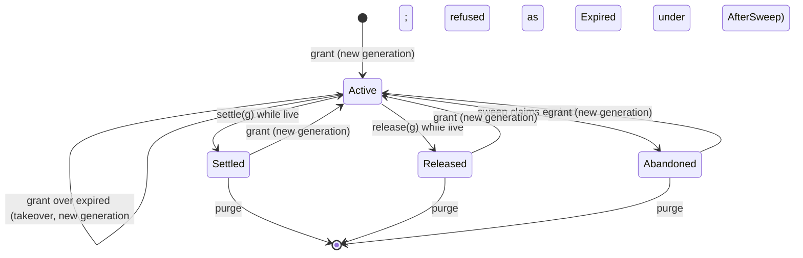

# Fencing

> A relational fenced-lease primitive: grant a lease on `(tenant, kind, resource)`, hand its generation to any executor, and refuse that executor's write once a later grant replaces it.

## Orientation

To choose between a fenced lease, a distributed lock, idempotent admission, and membership, read [Choosing a coordination primitive](#choosing-a-coordination-primitive) first.

Register exactly one provider and use the lease either autonomously or enlisted:

```csharp
builder.Services.AddHeadlessFencing(setup => setup.UsePostgreSql(connectionString)); // or setup.UseSqlServer(...)
// tests, local development, one instance: builder.Services.AddHeadlessFencing(setup => setup.UseInMemory());
```

- **Autonomous** — inject `IFencedLeases` and call `GrantAsync`, `RenewAsync`, `SettleAsync`, `ReleaseAsync`, `SweepExpiredAsync`, or `PurgeAsync`. Each call is its own transaction and commits before it returns.
- **Enlisted** — `unit.Leases` (namespace `Headless.UnitOfWork`, added by `Headless.Fencing.Abstractions`) runs `GrantAsync`, `RenewAsync`, `SettleAsync`, `ReleaseAsync`, and `FenceAsync` inside the caller's own transaction, so a rollback undoes them.

A typical external-executor handoff:

```csharp
var grant = await leases.GrantAsync("exports", "order-42", TimeSpan.FromMinutes(5), ct); // GrantAsync
if (!grant.IsAcquired) { /* grant.Status == Held: someone else owns it */ }

SendToExecutor(grant.Lease!); // (resource, generation) — the executor can be an external process

// the executor heartbeats, optionally recording how far it got:
await leases.RenewAsync(lease, TimeSpan.FromMinutes(5), ct);
await leases.RenewAsync(lease, TimeSpan.FromMinutes(5), new LeaseProgress(cursorBytes, "exports.cursor/v1"), ct);

// the executor posts its result; fence it inside the unit that writes it:
await factory.RunAsync(db, async (unit, ct) =>
{
    await unit.Leases.FenceAsync(lease, ct);   // throws StaleLeaseException if a later grant replaced it
    // ... write the result ...
    await unit.Leases.SettleAsync(lease, ct);  // same transaction
});

// a cron or hosted service recovers abandoned attempts:
await leases.SweepExpiredAsync("exports", async (expired, unit, ct) =>
{
    await unit.Outbox.PublishAsync(new ExportAbandoned(expired.Resource), ct);
}, limit: 100, ct);
```

## Agent Rules

- Fence the write, not the read that decided to write. Call `unit.Leases.FenceAsync(lease)` immediately before the writes it guards, inside the same unit that commits them — it locks the lease row until the unit ends, so nothing can grant, renew, settle, or sweep the lease out from under that transaction.
- Never treat holding a `FencedLease` value as proof of anything. It is a plain record `(TenantId, Kind, Resource, Generation)` — only the store's answer to a grant, renew, settle, or fence call means the caller still owns it.
- An enlisted `GrantAsync` that answers `Held` keeps the lease row locked (read for update) until the caller's transaction ends, blocking the live holder's renew and settle for that long. Use the autonomous `IFencedLeases.GrantAsync` for a plain contention check, and reach for the enlisted `unit.Leases.GrantAsync` only when the grant itself must roll back with the caller's other writes.
- A long-running fenced transaction blocks every other verb on that lease — grant, renew, settle, sweep — for as long as it stays open, including the holder's *own* renew issued from another connection. Keep the window between `FenceAsync` and commit short; renew before fencing, not after.
- `SweepExpiredAsync`'s handler must write its handoff through the unit it receives (`unit.Outbox`, `unit.Jobs`, or raw ADO/Dapper on the unit's connection) — an EF `DbContext` cannot join a unit a raw-ADO call already owns. A handler that throws rolls back only its own claim; that lease stays expired and is offered again by a *later* call, never retried in a loop by the same call. To hand off through EF Core, run your own loop: begin a unit over the context (`factory.RunAsync(db, …)`), call `unit.Leases.ClaimExpiredAsync(kind, after)`, write your rows, and let the unit commit.
- Grant with `LeaseTakeover.AfterSweep` when an attempt may already have had an external effect (a call to a provider, an email, a payment). An expired attempt then answers `Expired` instead of being taken over, and only your sweep handler — which can mark the work for review — ends it. The default, `LeaseTakeover.Allowed`, is for work that is safe to repeat or resumes from its progress.
- `GetStatusAsync(lease)` is a lockless read for dropping late work early (a result from an attempt already replaced). It never guards a write: the answer can change as soon as it returns, so a write that depends on the lease still runs `unit.Leases.FenceAsync` in its own unit.
- Expiry is always decided by the database clock, inside the statement that checks it — never by comparing `DateTimeOffset.UtcNow` on the caller's machine. A skewed application clock cannot make a live lease look expired or an expired one look live. The in-memory provider is the one exception: its registered `TimeProvider` is the clock, read after the key's lock is held.
- `PurgeAsync` only deletes terminal rows (`Settled`, `Released`, `Abandoned`) older than the cutoff; it never weakens the generation guarantee — a lease granted again after its row is purged still gets a generation above every one issued before the purge, because generations are drawn from one store-wide sequence, not a per-row counter.
- Progress is a resume cursor, not a result store. `LeaseProgress` is at most `FencingFieldLimits.ProgressMaxBytes` (64 KiB) of payload and `ProgressContractMaxLength` (256) characters of contract; a larger one throws `ArgumentException` before any SQL runs. Check the contract tag before decoding the bytes a grant hands back.
- Read `TakeoverCount` on every grant and on every `ExpiredLease` a sweep hands you. A count above 0 means earlier holders expired without finishing; a count that keeps rising for one resource means the work never gets through, and resuming from the same progress will not fix it on its own.
- `kind`, `resource`, and the current tenant id are validated against `FencingFieldLimits` (`KindMaxLength` 64, `ResourceMaxLength` 256, `TenantIdMaxLength` 128) before any SQL runs; a value over the limit, or one no provider stores unchanged (leading or trailing whitespace, a NUL character, or an unpaired UTF-16 surrogate), throws `ArgumentException` immediately, on every provider including in-memory. Case, accents, surrogate pairs, and other control characters are distinct keys everywhere.

## Choosing a coordination primitive

A fenced lease answers "who owns this work, at which generation, until when?". It is one of four primitives that answer four different questions. Choose by the question, not by the words "lock" or "lease". This section is the canonical comparison; the other guides link here.

| Question | Primitive | Held as | What refuses a stale holder |
| --- | --- | --- | --- |
| May this process run now? | Distributed lock: `IDistributedLock` ([Distributed Locks](distributed-locks.md)) | A live in-process handle (`IDistributedLease`). It cannot be handed to another process. | Nothing by default. The protected resource must check `FencingToken`, or the lock must be transaction-coupled. |
| Who owns this work, at which generation, until when? | Fenced lease: `IFencedLeases`, `unit.Leases` (this guide) | A durable row that any process carries as `(resource, Generation)`. | The database, inside the writer's transaction: `unit.Leases.FenceAsync`. |
| Has this operation already happened, and what was its result? | Idempotent admission: `IIdempotentOperations`, `unit.Idempotency`; `Headless.Api.Idempotency` for HTTP ([Idempotency](idempotency.md)) | A record per tenant-scoped key and request fingerprint, with its own lease and generation. | The store: `CompleteAsync` and `unit.Idempotency.FenceAsync` refuse a superseded generation (in the database, or by compare-and-swap in the cache with `UseCache`, which has no `FenceAsync`). |
| Which node incarnations are alive? | Membership: `INodeMembership` ([Coordination](coordination.md)) | A `NodeIdentity` (`node@incarnation`) that the consumer stamps on its own rows. | The consumer's recovery write, guarded by owner identity. Membership owns nothing. |

A lock's fencing token and a fenced lease's generation come from separate sequences: lock backends issue their own, and Fencing draws generations from one store-wide sequence. Comparing one with the other silently rejects valid writes or accepts stale ones. The type system keeps them apart: `IDistributedLease.FencingToken` is a `LockFencingToken` that compares only with its own kind, so comparing it with `FencedLease.Generation` does not compile. A resource guarded by both must record the highest lock token and the highest generation separately.

### Why each primitive exists

- **Distributed lock.** Cheap mutual exclusion while the holder is alive. Use it to avoid duplicate work (efficiency) when the work runs in one live process and a duplicate run only wastes effort, or take a transaction-coupled lock whose lifetime is the transaction. Redis locks expire by TTL. PostgreSQL and SQL Server locks are session-scoped advisory or application locks with no TTL: they live as long as the holding connection. The optional `FencingToken` is a `LockFencingToken` the protected resource itself must check; the lock does not check it for you.
- **Fenced lease.** A lock handle dies with its process and connection. A fenced lease is a database row instead, so an external executor with no connection to the framework can hold it, heartbeat it, and post a result hours later. The database checks the generation for you, inside the caller's own transaction, at the moment the write happens, not by convention at the call site. Expiry uses the database clock, and `SweepExpiredAsync` hands abandoned work to a durable handler (`unit.Outbox`, `unit.Jobs`) in the same transaction that marks the lease abandoned.
- **Idempotent admission.** Retries must replay a result, not repeat the operation. `AdmitAsync` returns `Admitted`, `InFlight`, `Replay`, or `Conflict` for one tenant-scoped key and fingerprint, and the stored result replays from any entry point. The record carries its own lease and generation; it does not use the Fencing table. It answers "once per key", not "one holder at a time per resource".
- **Membership.** Recovery needs to know which process runs died. Membership reports liveness only and never records ownership. Consumers stamp `node@incarnation` on their own rows and reclaim rows whose owner is no longer live.

### Work that already has a row

Jobs and Messaging need none of these for their own rows. Each work row carries its lease in its own columns (Jobs: `OwnerId` and `LockedUntil`; Messaging: `Owner` and `LockedUntil`), claimed and renewed by guarded updates on the database clock. That is correct because the row is the work: the claim, the renewal, and the result update the same row, so there is no second table and no lock order. Follow that pattern when your work already has a row you own. Use a fenced lease when it does not, or when an external executor needs a generation to carry.

Jobs keyed scheduling guards its own rows the same way, with its own generation column: `ReplaceKeyedAsync(key, observedGeneration, ...)` advances only while the row is pending and unclaimed, and reports `StaleGeneration` when a lost-response replay names a generation Jobs already moved past (see [jobs.md](jobs.md)). That check protects exactly one table, Jobs' own. A fenced lease is the same generation guard extracted into a reusable primitive: it fences any caller-owned write, on any table, for any resource a caller names.

### Fence, token, and lease

- **Lease:** time-bounded ownership that ends unless renewed. Expiry alone never stops a paused holder from writing after it resumes.
- **Token:** a number that identifies one grant: `IDistributedLease.FencingToken`, `FencedLease.Generation`, `IdempotentAdmission.Generation`, `NodeIncarnation`. A token protects nothing until something compares it.
- **Fence:** the comparison that refuses a write carrying a superseded token, done atomically with that write. Fencing and Idempotency fence in the database inside your transaction. A lock's `FencingToken` is fenced only if your resource stores the last accepted token and rejects anything not greater than it.

A lock alone never protects data: a holder can pause (garbage collection, a network partition), lose its lock or lease, and resume writing without knowing. Protect a correctness invariant with a fence at the write: a transaction-coupled lock, a fenced lease, an admission generation, or a guarded row update. The classic (Kleppmann) failure a fenced lease catches:

```text
t0  Holder A grants the lease on "order-42", gets generation 1, starts a long GC pause or network partition.
t1  A's lease expires (database clock). A is still paused; it does not know yet.
t2  Holder B grants the lease, takes it over, gets generation 2, does the work, settles it.
t3  A resumes, unaware it lost the lease, and tries to write with generation 1.
    unit.Leases.FenceAsync(leaseAtGen1) reads the row, sees the current generation is 2, and throws
    StaleLeaseException — A's write never lands.
```

Nothing about `t3` depends on A noticing anything: the refusal happens at the database, inside A's own transaction, before A's write commits.

**The limit.** A fence refuses a stale *write*. It cannot recall a side effect A already produced outside the database before `t3` — an email already sent, an external API already called, a message already published to a system this lease does not cover. Design any such side effect to be safe to repeat (idempotent at its own boundary), or gate it behind the fenced write itself (write first, act in a post-commit callback or a relay that only fires from the committed row).

## Core Concepts

### Lease identity and generation

A lease is identified by `(TenantId, Kind, Resource)` — the tenant from `ICurrentTenant.Id` (host scope is `null`), a `kind` that groups leases for sweeping and purging, and a `resource` within that kind. Every successful grant issues a `Generation` strictly greater than any generation ever issued for that identity, including across a purge of the row. Generations come from one store-wide sequence rather than a per-row counter: a per-row counter would restart at 1 when a purged-and-recreated row is granted again, and a pre-purge zombie holding generation 1 would then look current. Gaps in the sequence (from a rolled-back grant) are harmless — a stale holder is caught by inequality with the row's current generation, never by arithmetic on it.

### Lease state

State is `Active | Settled | Released | Abandoned`. "Expired" is never stored — it is `Active` with an expiry at or before the database clock, evaluated fresh inside each statement.


```mermaid
stateDiagram-v2
    [*] --> Active: grant (new generation)
    Active --> Active: renew(g) while live
    Active --> Active: grant over expired (takeover, new generation; refused as Expired under AfterSweep)
    Active --> Settled: settle(g) while live
    Active --> Released: release(g) while live
    Active --> Abandoned: sweep claims expired
    Settled --> Active: grant (new generation)
    Released --> Active: grant (new generation)
    Abandoned --> Active: grant (new generation)
    Settled --> [*]: purge
    Released --> [*]: purge
    Abandoned --> [*]: purge
```

`GrantAsync` reads the row and decides: no row, or a terminal row → `Granted` with a new generation; a live `Active` row → `Held` with the current holder's generation and expiry; an `Active` row past its expiry → `Takeover`, a new generation, and the previous generation in the result. With `LeaseTakeover.AfterSweep`, an `Active` row past its expiry instead answers `Expired` with that attempt's generation and expiry and writes nothing; the lease becomes grantable once a sweep abandons the attempt or the attempt settles or releases. `RenewAsync`, `SettleAsync`, and `ReleaseAsync` all take the generation they act on and report `Stale` whenever a newer grant replaced it, whichever terminal state ended it otherwise, or (for renew) `Expired` when the generation is current but the lease already lapsed.

### Progress and resume

An executor can record how far it got on each heartbeat: `RenewAsync(lease, duration, progress, ct)` takes a `LeaseProgress(payload, contract)`, opaque bytes plus a contract tag that says how to read them. The progress is written in the same guarded statement that extends the lease, so it is stored only when the renewal succeeds: an `Expired`, `Stale`, `Settled`, `Released`, or `Abandoned` renewal writes nothing, and a stale executor can never overwrite a newer holder's progress. The overload without progress keeps whatever was recorded.

The row keeps the last recorded progress until the work ends:

| Event | Progress on the row | Returned |
| --- | --- | --- |
| Successful renewal with progress | Replaced | — |
| `Takeover` grant | Kept | `LeaseGrantResult.Progress` |
| Sweep abandons the lease | Kept | `ExpiredLease.Progress` |
| `Granted` over an abandoned lease | Kept | `LeaseGrantResult.Progress` |
| Settle or release | Cleared | — |
| `Granted` over a settled or released lease, or a new lease | None | `null` |

Keeping progress across a takeover means a holder that takes over and crashes before its first heartbeat does not lose the previous holder's cursor. Keeping it across an abandonment means the attempt a sweep handler routes the work to resumes rather than restarts.

```csharp
var grant = await leases.GrantAsync("exports", "order-42", TimeSpan.FromMinutes(5), ct);
if (!grant.IsAcquired) return;

var cursor = grant.Progress is { Contract: "exports.cursor/v1" } progress
    ? ExportCursor.Decode(progress.Payload.Span)   // resume where the last attempt got to
    : ExportCursor.Start;                          // new work, or bytes this version cannot read

await foreach (var batch in export.ReadFromAsync(cursor, ct))
{
    await WriteBatchAsync(batch, ct);
    var renewed = await leases.RenewAsync(
        grant.Lease, TimeSpan.FromMinutes(5), new LeaseProgress(batch.Next.Encode(), "exports.cursor/v1"), ct);
    if (!renewed.IsRenewed) return;               // lost the lease: stop, the next holder resumes
}
```

The resumed attempt must tolerate repeating the work between the last recorded progress and the point the previous holder died, because that work may or may not have landed. Fence the writes that must not repeat.

### Takeover count

Each lease row counts how many times its work was taken from an expired holder since it last settled or was released (the Kubernetes `Lease` `leaseTransitions` signal). A `Takeover` grant adds one, and a sweep that marks the lease `Abandoned` adds one. A `Granted` grant over an abandoned lease adds nothing, because the sweep already counted that abandonment. Settle and release reset it to 0. `LeaseGrantResult.TakeoverCount` reports it on every grant (for `Held`, the live holder's count), and `ExpiredLease.TakeoverCount` reports it after the abandonment.

A rising count means executors keep losing the lease before they finish: a crash loop, a renewal cadence too slow for the lease duration, a GC pause or partition longer than the lease, or two workers flapping over one resource. Alert on it one of two ways:

- Set `FencingOptions.TakeoverWarningThreshold`. Every takeover grant or committed sweep abandonment whose count reaches the threshold logs a structured warning (event `FencedLeaseTakeoverThresholdReached` or `FencedLeaseAbandonThresholdReached`, with `Kind`, `Resource`, `TenantId`, `TakeoverCount`, and the generations). Route those events to your alerting. An enlisted grant logs when it returns, so a unit that then rolls back can leave a warning for a takeover that did not commit.
- Read the count yourself from the grant result or the sweep handler, and dead-letter, back off, or page when it passes a budget that fits the work.

The fencing packages emit no metrics.

### The fence

`FenceAsync` is a locking read, not a predicate appended to the caller's own write: PostgreSQL reads the row `FOR NO KEY UPDATE`, SQL Server `WITH (UPDLOCK, HOLDLOCK, ROWLOCK)`. It throws `StaleLeaseException` unless the generation is current, the lease is `Active`, and it has not expired — and the lock it takes holds that answer true until the caller's transaction ends, so no concurrent grant, renew, or sweep can invalidate it out from under the still-open write. `LeaseFenceStatus` on the exception says why: `Stale`, `Expired`, `Settled`, `Released`, or `Abandoned`.

`IFencedLeases.GetStatusAsync(lease)` answers the same question without a lock and outside any unit: `Current` while the generation is current, active, and unexpired by the database clock, otherwise the same reasons. A settlement or release ends the generation, so a token handed to another process (in a message, a JWT claim, a result payload) reads as `Settled` or `Released` afterwards, and as `Stale` once a later grant replaced it. Use it to drop late results and events early; keep the fence for the write itself.

### Sweep and purge

`SweepExpiredAsync(kind, handler, limit)` claims up to `limit` expired `Active` leases of one kind, one per its own owned transaction, marks each `Abandoned` in the same statement that claims it (`SKIP LOCKED` on PostgreSQL, `UPDLOCK, READPAST, ROWLOCK` — plus `READCOMMITTEDLOCK` under RCSI — on SQL Server), and hands it to the handler before committing. Concurrent sweepers therefore never hand one lease to two handlers, and a handler that throws only rolls back its own claim. The sweep never redispatches within one call; run it from your own cadence (a Jobs cron or hosted service) — there is no built-in scheduler.

`unit.Leases.ClaimExpiredAsync(kind, after)` is one claim of the same sweep inside a unit you began, so your handoff can use any writer that joins that unit, EF Core included. It claims the next expired `Active` lease of the kind across every tenant (skipping one another transaction holds), marks it `Abandoned`, and returns it, or `null` when none is left after `after`. Pass the previous result as `after` to continue. The abandonment commits or rolls back with your unit, and the takeover-count warning is logged only once it commits.

`PurgeAsync(kind, olderThan)` deletes `Settled`, `Released`, and `Abandoned` rows of that kind that ended at least `olderThan` ago, by the database clock. Live and expired-but-still-`Active` leases are never touched.

### Enlistment

Enlisted calls (`unit.Leases.*`) follow the same rules as `unit.Sequences` (see [unit-of-work.md](unit-of-work.md)): they run `RequireTransaction`, then `ValidateEnlistment` (a live transaction, on the owning connection, on the same database as the configured provider via `RelationalDatabaseIdentity`), then — for grant, renew, settle, and release only, never for the fence read — mark an *observed*-mode unit non-retryable before running. Enlisted calls are never retried; a refused call runs no statement and leaves the unit retryable. What the unit must carry is the provider's judgment: the relational providers need a live transaction on their own database, while the in-memory provider refuses any unit over a database connection and accepts a resource-less unit (`IUnitOfWorkFactory.BeginAsync()`), which then plays the transaction. Autonomous calls open their own connection at READ COMMITTED and retry only a deadlock or serialization failure (PostgreSQL `40P01`/`40001`, SQL Server 1205/3960), in a fresh transaction, up to three attempts, waiting a jittered delay (`n × 10–50 ms` before retry `n`, on the registered `TimeProvider`) between them.

With `Headless.UnitOfWork.Analyzers` referenced, [HF2004](unit-of-work.md#hf2004) reports an `IFencedLeases` grant, renew, settle, or release made while a unit of work is in scope, and its code fix moves the call onto `unit.Leases`. `SweepExpiredAsync`, `GetStatusAsync`, and `PurgeAsync` are not reported. `unit.Leases.ClaimExpiredAsync` is a write: it marks an observed-mode unit non-retryable like the other enlisted writes.

## Choosing a Provider

| Provider | Use when | Avoid when | Trade-off |
| --- | --- | --- | --- |
| `Headless.Fencing.PostgreSql` | Enlisted callers run their units on PostgreSQL | Callers run on SQL Server | Sweep uses `SKIP LOCKED`; generation draws `nextval()` after the locking read |
| `Headless.Fencing.SqlServer` | Enlisted callers run their units on SQL Server | — | Sweep uses `READPAST` (plus `READCOMMITTEDLOCK` under RCSI); generation draws `NEXT VALUE FOR` after the locking read |
| `Headless.Fencing.Sqlite` | Every process that shares the leased work runs on one host and one SQLite file | A lease must be granted inside a caller's unit (`unit.Leases.GrantAsync`), or many writers contend | Every call holds the database write lock; enlisted grant is refused, autonomous grant and every other enlisted call work; the host clock decides expiry |
| `Headless.Fencing.InMemory` | Tests, local development, or a single-instance host with no relational database (for example Redis-only) | Several processes share the leased work, or a fence must guard writes that commit in a database | Leases live in one process and vanish on restart; the registered `TimeProvider` decides expiry; enlisted calls run only on resource-less units, so a fence cannot join a database transaction |

A relational provider must sit on the database enlisted units run on; lease rows are written inside the unit's own transaction, on its own connection.

---

## Headless.Fencing.Abstractions

Consumer contracts: `IFencedLeases`, `FencedLease`, the grant/renewal/settlement/sweep result types, `StaleLeaseException`, and the `unit.Leases` accessor.

### Setup

```bash
dotnet add package Headless.Fencing.Abstractions
```

Reference it from code that grants, renews, or fences leases. Registration lives in `Headless.Fencing` and the provider packages.

### Design and runtime behavior

- `IFencedLeases`: `GrantAsync(kind, resource, duration, ct)` and `GrantAsync(kind, resource, duration, takeover, ct)` → `LeaseGrantResult` (`Status`: `Granted` | `Held` | `Takeover` | `Expired`; `Lease`, `ExpiresAt`, `HolderGeneration`, `PreviousGeneration`, `TakeoverCount`, `Progress`, `IsAcquired`). `LeaseTakeover` is `Allowed` (the default: take an expired attempt over) or `AfterSweep` (answer `Expired` until a sweep, settlement, or release ends it); an undefined value throws `InvalidEnumArgumentException`. `GetStatusAsync(lease, ct)` → `LeaseFenceStatus` (`Current` | `Stale` | `Expired` | `Settled` | `Released` | `Abandoned`), read without a lock. `RenewAsync(lease, duration, ct)` and `RenewAsync(lease, duration, progress, ct)` → `LeaseRenewalResult` (`Status`: `Renewed` | `Expired` | `Stale` | `Settled` | `Released` | `Abandoned`; `ExpiresAt`; `IsRenewed`). `SettleAsync` / `ReleaseAsync(lease, ct)` → `LeaseSettlementStatus` (`Settled` | `Released` | `Stale` | `Expired` | `Abandoned`); both are idempotent for the same generation. `SweepExpiredAsync(kind, handler, limit, ct)` → `LeaseSweepResult(Handled, Failures)`, where `Failures` are `LeaseSweepFailure(Lease, Exception)`. `PurgeAsync(kind, olderThan, ct)` → the row count deleted.
- `FencedLease(TenantId, Kind, Resource, Generation)` — a plain record, safe to persist or hand to another process; `ExpiredLease` adds `ExpiresAt`, `TakeoverCount`, and `Progress` for the value a sweep hands its handler.
- `LeaseProgress(payload, contract)` — copies the payload; exposes `Payload` (`ReadOnlyMemory<byte>`) and `Contract`. See [Progress and resume](#progress-and-resume).
- `unit.Leases` (namespace `Headless.UnitOfWork`) returns a `UnitOfWorkLeases` bound to the unit; repeated reads on one unit return the same instance. It mirrors `IFencedLeases` (grant with or without a `LeaseTakeover`, renew, settle, release) plus `FenceAsync(lease, ct)`, which throws `StaleLeaseException` rather than returning a status, and `ClaimExpiredAsync(kind, after = null, ct)` → `ExpiredLease?`, one sweep claim inside the unit.
- `unit.Leases` throws `InvalidOperationException` naming `AddHeadlessFencing` when no provider registered the feature.

---

## Headless.Fencing

Registration, key resolution, and the provider seam.

### Setup

```bash
dotnet add package Headless.Fencing
```

Applications reach it through a provider package; call `AddHeadlessFencing` as shown in [Orientation](#orientation).

### Configuration

| Builder member | Effect |
| --- | --- |
| `ConfigureOptions(Action<FencingOptions>)` | Sets `MinimumLeaseDuration` (default 1 second) and `MaximumLeaseDuration` (default 1 day); every grant and renewal duration must fall within these bounds, and is then applied truncated to whole microseconds, the finest resolution every provider stores, so a lease expires at the same offset from its grant on every provider. Also sets `TakeoverWarningThreshold` (default `null`, off; must be positive when set): the takeover count at which a takeover grant or committed sweep abandonment logs a warning |
| `ConfigureStorage(Action<FencingStorageOptions>)` / `ConfigureStorage(IConfiguration)` | Sets `Schema` (default `"headless"`, the schema every Headless feature shares), the schema the lease table and its generation sequence live in (`fencing_leases` and `fencing_lease_generations` on PostgreSQL, `FencingLeases` and `FencingLeaseGenerations` on SQL Server) |

### Design and runtime behavior

- `AddHeadlessFencing` requires exactly one `Use…` provider call and throws when there are none, several, or it is called twice.
- It registers `IFencedLeases`, `IUnitOfWorkLeases`, `LeaseRequestResolver`, and the takeover-warning logger as singletons, and falls back `ICurrentTenant` to the `AsyncLocal`-backed implementation when the host registered none — leases are keyed by the current tenant, so `ICurrentTenant.Change(...)` must actually change what a grant sees.
- `ILeaseStore` is the provider seam. Applications do not call it.
- The PostgreSQL and SQL Server providers share one store, written once against the `Headless.Sql` dialect kit. Renew, settle, release, and the fence are each one fenced transition: a locking read (`FOR NO KEY UPDATE` / `UPDLOCK, HOLDLOCK, ROWLOCK`) waits out any other holder, then a single conditional `UPDATE` whose `WHERE` is "this generation, active, unexpired by the database clock" decides and writes, so the check and the write cannot disagree; a refusal is classified from the row the locking read found. A grant is the same transition with the opposite fence ("no live holder"), drawing its generation from the store-wide sequence in the `UPDATE`'s own assignment, so a generation is drawn only for a grant that applies and only after the row is locked. An absent row is inserted by a statement that cannot raise a duplicate-key error inside a caller's transaction.
- The database clock is read once per deciding statement, after its locks are held: a `clock_timestamp()` captured in a `MATERIALIZED` CTE on PostgreSQL (never `now()`, which is frozen at transaction start), `SYSUTCDATETIME()` captured into a variable on SQL Server (which evaluates it when a statement starts, before any lock wait).
- Each provider contributes its table, indexes, and sequence as one schema step, in its own SQL, to the [schema runner](sql.md#schema-runner-apply-verify-and-deploy-time-scripts); the store only reads and writes rows.
- `PostgreSqlFencingOptions` and `SqlServerFencingOptions` both derive from `RelationalFencingOptions`, which carries `ConnectionString`, `CommandTimeout`, and `InitializeOnStartup`.

---

## Headless.Fencing.InMemory

Process-memory storage for tests, local development, and single-instance hosts.

### Setup

```bash
dotnet add package Headless.Fencing.InMemory
```

```csharp
builder.Services.AddHeadlessFencing(setup => setup.UseInMemory());
```

`UseInMemory()` takes no options. It registers `TimeProvider.System` and the unit-of-work factory when the host has not; register a `FakeTimeProvider` first to drive expiry in tests.

### Design and runtime behavior

- Leases live in a singleton table in this process and disappear when it stops. They coordinate only the callers of this process: two processes each with `UseInMemory()` each grant the same lease. Use a relational provider for work several processes share.
- The registered `TimeProvider` decides expiry, read once per call after the key's lock is held. A lease whose expiry equals the clock's instant is already expired.
- Every verb takes an exclusive per-key lock, so grants, renewals, settlements, and releases of one key serialize. Generations come from one process-wide counter, so they grow per key across releases, takeovers, and purges, but restart from 1 when the process restarts, when every earlier lease is gone too.
- Enlisted calls (`unit.Leases`) run only on a resource-less unit (`IUnitOfWorkFactory.BeginAsync()`); a unit over a database connection or `DbContext` is refused with `InvalidOperationException`, because in-memory state cannot commit or roll back with that transaction. The unit is the commit boundary: the key's lock is held until the unit ends, the call's writes reach the table only when the unit completes, and a rollback or a dispose without completing drops them. One unit may touch the same key again (fence, then settle) without waiting on itself.
- `FenceAsync` holds the key until the unit ends, so no grant, renewal, or sweep in this process changes the lease under the unit. It guards nothing outside the process and is not coupled to any database transaction: writes the unit makes to a database are not fenced atomically.
- Completion callbacks the unit registered before its first lease call run before the lease writes are visible; a callback that waits on the same key there would wait until the unit ends. Register such work after the lease calls, or run it after the unit completes.
- There is no deadlock detection. Units that lock several keys must lock them in one consistent order, and callers should pass a cancellation token that bounds the wait.
- Sweeps skip a key another unit holds (the in-memory form of `SKIP LOCKED`) and visit expired leases in (expiry, tenant id, resource) order, compared ordinally. Each claim runs in a resource-less owned unit, so the handler's handoff must be something that joins such a unit (for example `unit.Outbox` on the in-memory messaging storage) or is idempotent.
- `PurgeAsync` deletes ended leases past the cutoff and skips a key a unit holds; an age reaching past the earliest representable instant deletes nothing.

---

## Headless.Fencing.PostgreSql

PostgreSQL storage.

### Setup

```bash
dotnet add package Headless.Fencing.PostgreSql
```

```csharp
builder.Services.AddHeadlessFencing(setup => setup.UsePostgreSql(connectionString));
// or reuse the connection from services.AddPostgreSqlSql(connectionString): setup.UsePostgreSql();
// or: setup.UsePostgreSql(builder.Configuration.GetSection("Fencing"));
// or: setup.UsePostgreSql(options => { options.ConnectionString = cs; options.CommandTimeout = TimeSpan.FromSeconds(10); });
```

The parameterless overloads and the shared `headless` schema are described in [sql.md § Shared connection and schema for storage features](sql.md#shared-connection-and-schema-for-storage-features).

Enlisted calls need a unit begun over an Npgsql connection or an EF `DbContext` on this same database (`AddPostgreSqlUnitOfWork()`, added automatically, or the EF unit-of-work package).

### Configuration

| Option | Default | Notes |
| --- | --- | --- |
| `ConnectionString` | required | The database that holds the leases and that enlisted units must run on |
| `CommandTimeout` | 30 seconds | Also bounds how long a grant waits behind another transaction's open fence |
| `InitializeOnStartup` | `true` | When `false`, the application creates the schema, the `fencing_leases` table and its indexes, and the `fencing_lease_generations` sequence |

The lease row stores progress as `progress bytea` plus `progress_contract varchar(256)` (both null or both set) and the count as `takeover_count integer NOT NULL DEFAULT 0`.

### Design and runtime behavior

- The verbs are the shared relational store's (see [Headless.Fencing](#headlessfencing)). A first grant of a key inserts with `INSERT … ON CONFLICT DO NOTHING`; when it loses a race to another transaction's insert, it rereads the committed row and decides again.
- Sweep claims and purge batches use `FOR UPDATE … SKIP LOCKED`, so a lease another sweeper is already claiming is simply skipped, not waited on.
- The autonomous path opens its own connection at READ COMMITTED and retries a transient fault raised before the commit (a deadlock or serialization failure, `40P01`, `40001`, or anything Npgsql reports as transient) up to 3 attempts with a jittered delay between them, never a fault from the commit; the enlisted path runs on the unit's own connection and transaction with no retry.
- The table and sequence are one schema step (`Fencing/1`) the [schema runner](sql.md#schema-runner-apply-verify-and-deploy-time-scripts) applies at startup, under one advisory lock per database shared with every other Headless feature.

---

## Headless.Fencing.SqlServer

SQL Server storage.

### Setup

```bash
dotnet add package Headless.Fencing.SqlServer
```

```csharp
builder.Services.AddHeadlessFencing(setup => setup.UseSqlServer(connectionString));
// or reuse the connection from services.AddSqlServerSql(connectionString): setup.UseSqlServer();
```

The parameterless overloads and the shared `headless` schema are described in [sql.md § Shared connection and schema for storage features](sql.md#shared-connection-and-schema-for-storage-features).

Enlisted calls need a unit begun over a SqlClient connection or an EF `DbContext` on this same database (`AddSqlServerUnitOfWork()`, added automatically, or the EF unit-of-work package). Name the database explicitly (`Initial Catalog`) in the connection string.

The lease row stores progress as `Progress varbinary(max)` plus `ProgressContract nvarchar(256)` (both null or both set) and the count as `TakeoverCount int NOT NULL DEFAULT 0`.

### Configuration

| Option | Default | Notes |
| --- | --- | --- |
| `ConnectionString` | required | The database that holds the leases and that enlisted units must run on |
| `CommandTimeout` | 30 seconds | Also bounds how long a grant waits behind another transaction's open fence |
| `InitializeOnStartup` | `true` | When `false`, the application creates the schema, the `FencingLeases` table and its indexes, and the `FencingLeaseGenerations` sequence |

### Design and runtime behavior

- The verbs are the shared relational store's (see [Headless.Fencing](#headlessfencing)). The locking read's `HOLDLOCK` takes a key-range lock when the row is absent, so two first grants of one key serialize and the insert never collides; no batch uses `TRY/CATCH` or a session `SET`, so nothing leaks into or dooms a caller's `XACT_ABORT ON` transaction.
- Sweep claims and purge batches use `UPDLOCK, READPAST, ROWLOCK, READCOMMITTEDLOCK`: `READPAST` is refused under read committed snapshot isolation unless the read also takes locks, and the hint is the default without it, so the same statement works either way.
- The autonomous path opens its own connection at READ COMMITTED and retries a transient fault raised before the commit (a deadlock or snapshot update conflict, 1205, 3960, a lock timeout, 1222, or a connection fault EF Core's SQL Server retry set covers) up to 3 attempts with a jittered delay between them, never a fault from the commit; the enlisted path runs on the unit's own connection and transaction with no retry.
- The table and sequence are one schema step (`Fencing/1`) the [schema runner](sql.md#schema-runner-apply-verify-and-deploy-time-scripts) applies at startup, under one `sp_getapplock` per database shared with every other Headless feature.

---

## Headless.Fencing.Sqlite

SQLite storage for fenced leases.

### Setup

```bash
dotnet add package Headless.Fencing.Sqlite
```

```csharp
builder.Services.AddHeadlessFencing(setup => setup.UseSqlite("Data Source=/var/lib/app/app.db"));
// or reuse the connection from services.AddSqliteSql(connectionString): setup.UseSqlite();
```

Use a database file: the store and the schema runner open their own connections. Every process sharing the leases must run on the host that holds the file, since SQLite locking does not work over a network file system; that also makes the host clock the one clock that judges expiry.

### Configuration

| Option | Default | Notes |
| --- | --- | --- |
| `ConnectionString` | required | The database file that holds the leases; an enlisted call is accepted only on a SQLite unit whose connection reaches the same file |
| `CommandTimeout` | 30 seconds | Also bounds how long a call waits for another writer's database lock |
| `InitializeOnStartup` | `true` | When `false`, the application creates the `<schema>_fencing_lease_generations` sequence table, the `<schema>_fencing_leases` table, its two indexes, and its two generation triggers |

### Design and runtime behavior

- **Enlisted grant is refused.** `unit.Leases.GrantAsync` throws `NotSupportedException` before it touches the unit, including the unit an expired-lease sweep passes to its handler: a handler that grants and then throws would roll the generation back for the next grant to draw again. PostgreSQL and SQL Server draw generations from a sequence that ignores transactions; SQLite has no such counter, so a generation drawn in a caller's transaction that then rolls back would be drawn again by the next grant, and two holders could carry the same fencing token. `IFencedLeases.GrantAsync` grants in a transaction it commits before returning the lease, so it is safe. The unit can still renew, settle, release, or fence a lease granted that way.
- The verbs are the shared relational store's (see [Headless.Fencing](#headlessfencing)). Every transaction begins `IMMEDIATE` and holds the database write lock in place of the row lock, so grants, fences, and settlements of every key serialize on the file, and a sweep never meets a lease another transaction holds.
- The generation sequence is a one-row table. A grant reads one past its value, and triggers on the lease table raise it to every generation written, in the same statement. A purge deletes leases, never the sequence row, so a lease granted again after its row was purged still gets a higher generation.
- `SQLITE_BUSY` before the commit is retried in a fresh transaction, like a lock timeout on the other providers. The wait holds a thread-pool thread; see [sql.md § SQLite in the kit](sql.md#sqlite-in-the-kit).
- The sequence table, lease table, indexes, and triggers are one schema step (`Fencing/1`) the [schema runner](sql.md#schema-runner-apply-verify-and-deploy-time-scripts) applies at startup.

