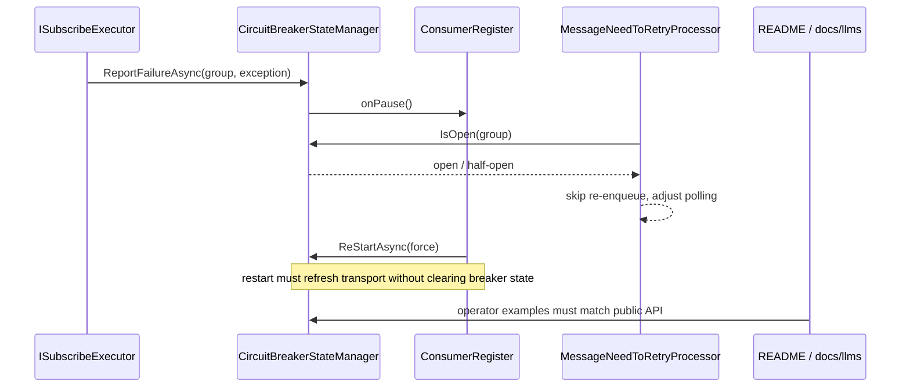

# fix: Finish messaging resilience hardening

## Overview

Finish the follow-up hardening pass for the already-implemented messaging circuit breaker and adaptive retry backpressure work. This plan treats the active worktree, PR #194 review, and the five in-progress todo files as the source of truth for the remaining lifecycle, test, observability, and documentation gaps rather than re-planning the original feature from scratch.

## Problem Frame

The core feature described in `docs/brainstorms/2026-03-18-messaging-circuit-breaker-and-retry-backpressure-brainstorm.md` is already in the branch: per-group circuit breaking, transport pause/resume, adaptive retry polling, and monitor APIs exist. The remaining work is a bounded hardening pass across the control plane edges that are easiest to get wrong in production:

- transport restart must not erase breaker state
- half-open resume/dispose timing must not allow late transport resumes
- retry backpressure tests should use public seams instead of private reflection
- OTel metric paths must stay allocation-safe and cardinality-safe
- public operator docs must match the actual monitor APIs

This plan keeps the original architecture intact and focuses on merge-quality correctness, test confidence, and documentation parity.

## Requirements Trace

- R1. Preserve the brainstormed architecture: per-consumer-group breaker state, transport-level pause/resume, and retry processor respect for open circuits.
- R2. Close the remaining PR #194 hardening gaps represented by todo findings `081`, `082`, `083`, `089`, and `094`.
- R3. Keep restart, half-open, dispose, and recovery flows behaviorally consistent under concurrency and lifecycle transitions.
- R4. Keep observability and operator surfaces accurate: metric tagging must remain safe, and docs/examples must compile against the real monitor interfaces.
- R5. Leave real transport integration expansion out of this pass; rely on focused unit coverage in the touched core seams and defer broader transport integration work to a separate follow-up.

## Scope Boundaries

- No redesign of the circuit breaker state machine, retry policy shape, or per-process scope.
- No distributed/shared circuit state across replicas.
- No new transport-adapter feature work unless a core hardening fix proves an adapter seam is still broken.
- No large benchmark suite or new performance harness unless a minimal existing pattern is discovered during implementation.

## Context & Research

### Relevant Code and Patterns

- `src/Headless.Messaging.Core/CircuitBreaker/CircuitBreakerStateManager.cs`
  Core state machine, timer lifecycle, half-open resume path, reset/force-open APIs, known-group registration, and OTel hook-up.
- `src/Headless.Messaging.Core/Internal/IConsumerRegister.cs`
  Owns transport start/restart/dispose flow and registers breaker pause/resume callbacks per group.
- `src/Headless.Messaging.Core/Processor/IProcessor.NeedRetry.cs`
  Adaptive retry polling, backpressure state, and circuit-open skip behavior.
- `src/Headless.Messaging.Core/CircuitBreaker/CircuitBreakerMetrics.cs`
  Trip/open-duration instruments and observable-gauge state reporting.
- `src/Headless.Messaging.Core/Setup.cs`
  DI registration and FluentValidation wiring for `CircuitBreakerOptions` and `RetryProcessorOptions`.
- `src/Headless.Messaging.Core/CircuitBreaker/ICircuitBreakerMonitor.cs`
  Public operator/observer surface. Current API has `ResetAsync(string groupName)` and `ForceOpenAsync(string groupName)` with no cancellation token.
- `src/Headless.Messaging.Core/CircuitBreaker/IRetryProcessorMonitor.cs`
  Public adaptive polling monitor surface used by operators and tests.
- `tests/Headless.Messaging.Core.Tests.Unit/CircuitBreaker/CircuitBreakerStateManagerTests.cs`
  Main regression suite for state transitions, reset behavior, known-group guards, and escalation reset.
- `tests/Headless.Messaging.Core.Tests.Unit/CircuitBreaker/CircuitBreakerIntegrationTests.cs`
  End-to-end unit-style lifecycle coverage across breaker and retry processor interaction.
- `tests/Headless.Messaging.Core.Tests.Unit/ConsumerRegisterTests.cs`
  Restart/dispose/recovery tests for the control plane.
- `tests/Headless.Messaging.Core.Tests.Unit/Processor/MessageNeedToRetryProcessorTests.cs`
  Adaptive polling and circuit-open skip coverage.
- `src/Headless.Messaging.Core/README.md`
  Public package documentation. Currently drifts from the actual `ICircuitBreakerMonitor.ResetAsync` signature.
- `docs/llms/messaging.txt`
  Agent-facing operator examples for the messaging package.

### Institutional Learnings

- `docs/solutions/concurrency/circuit-breaker-transport-thread-safety-patterns.md`
  Relevant patterns: pre-assign task handles before `Task.Run`, generation-safe timer callbacks, surface fire-and-forget failures, avoid OTel allocation/cardinality hazards.
- `docs/solutions/concurrency/startup-pause-gating-and-half-open-recovery.md`
  Relevant patterns: restart and startup are separate from breaker state, resume failures must propagate back into breaker control logic, cross-option invariants belong in FluentValidation validators.
- `docs/solutions/patterns/critical-patterns.md`
  Not found in this worktree. Do not assume extra critical-pattern guidance exists beyond the two solution docs above.

### External References

- None. The local repo already contains recent design, review, and institutional guidance for this exact area, so external research would add little practical value.

### Control-Plane Flow Snapshot

## Key Technical Decisions

- Treat this as a bounded hardening plan, not a redesign. The brainstorm architecture stays intact.
- Use existing public monitoring seams in tests where possible, especially `IRetryProcessorMonitor.CurrentPollingInterval`, instead of private reflection.
- Keep transport restart orthogonal to handler-failure memory. `ConsumerRegister` may rebuild transport resources, but it must not clear breaker state unless the group is being permanently torn down.
- If restart interrupts a `HalfOpen` probe, normalize that group back to `Open` with its existing failure and escalation history preserved, then require a new cooldown/probe cycle on the rebuilt transport handles. This is safer than carrying an aborted probe across teardown/rebind boundaries.
- Prefer source-level no-boxing fixes and focused regression coverage over adding a new benchmark harness solely for `TagList`.
- Reconcile public docs with the shipping API in the same hardening pass so operator/agent recovery guidance stays trustworthy. Documentation and XML-doc wording may change here; public method signatures should not change unless Units 1-2 uncover a genuine correctness requirement.

## Open Questions

### Resolved During Planning

- **What is the planning input?** Use the active worktree topic plus `docs/reviews/2026-03-23-pr-194-review.md` and the in-progress todo files as the follow-up hardening scope. There is no matching `*-requirements.md` for this exact work.
- **Plan depth?** `Standard`. The work is cross-cutting and concurrency-sensitive, but still bounded to a small set of core files and tests.
- **Need external research?** No. The repo has fresher and more specific guidance than outside sources for this exact feature.
- **Should real transport integration tests be added in this pass?** No. Keep the scope on core-unit hardening, consistent with the PR review note that broader transport integration remains a follow-up concern.
- **What should restart do with a group already in `HalfOpen`?** Treat the in-flight probe as invalidated by teardown. Preserve the breaker’s learned failure/escalation state, but move the group back to `Open` and require a fresh probe on the rebuilt transport lifecycle.

### Deferred to Implementation

- **How much helper extraction should remain in `MessageNeedToRetryProcessorTests`?** Choose the smallest change that removes reflection and keeps coverage readable; do not introduce new test-only abstractions unless the remaining seams justify them.
- **Does the metrics cleanup need a dedicated regression test or only source-level verification?** Decide based on the simplest repo-consistent verification path once the final implementation shape is settled.
- **Which todo files can move from `in-progress` to `done`?** Defer until code, tests, and docs all verify the acceptance criteria for each finding.

## Implementation Units

- [ ] **Unit 1: Finalize breaker lifecycle correctness**

**Goal:** Lock down the lifecycle edges where half-open timers, resume callbacks, disposal, and transport restart can diverge from the intended breaker state.

**Requirements:** R1, R2, R3

**Dependencies:** None

**Files:**
- Modify: `src/Headless.Messaging.Core/CircuitBreaker/CircuitBreakerStateManager.cs`
- Modify: `src/Headless.Messaging.Core/Internal/IConsumerRegister.cs`
- Test: `tests/Headless.Messaging.Core.Tests.Unit/CircuitBreaker/CircuitBreakerStateManagerTests.cs`
- Test: `tests/Headless.Messaging.Core.Tests.Unit/CircuitBreaker/CircuitBreakerIntegrationTests.cs`
- Test: `tests/Headless.Messaging.Core.Tests.Unit/ConsumerRegisterTests.cs`

**Approach:**
- Preserve the current separation of concerns: `CircuitBreakerStateManager` owns breaker state transitions; `ConsumerRegister` owns transport lifecycle.
- Ensure restart paths refresh callbacks/handles without calling state-clearing logic intended for final teardown.
- When restart encounters `HalfOpen`, do not preserve the aborted probe verbatim across rebuilt clients. Rebind callbacks, retain the learned breaker history, and normalize the group to a safe `Open` state that must earn a fresh half-open probe.
- Keep the half-open resume path observable to disposal so no late resume can occur after shutdown returns.
- Verify that reopen-on-resume-failure behavior still composes correctly with the restart-preserves-state rule.

**Execution note:** Start with regression coverage for restart, dispose, and half-open race cases before simplifying or moving concurrency code.

**Patterns to follow:**
- `docs/solutions/concurrency/circuit-breaker-transport-thread-safety-patterns.md`
- `docs/solutions/concurrency/startup-pause-gating-and-half-open-recovery.md`
- Existing task/TCS pattern in `CircuitBreakerStateManager._OnOpenTimerElapsed`

**Test scenarios:**
- Dispose while a half-open resume callback is in flight still awaits the tracked task and prevents post-dispose resume.
- Open circuit -> transport restart -> circuit state, escalation level, and failure counters remain intact.
- Half-open circuit -> transport restart -> group does not resume as if the old probe were still valid; it returns to a protected open state and requires a new probe cycle.
- Resume failure during half-open still reopens the circuit and keeps pause semantics consistent.
- Final teardown still removes group state and does not leave callbacks/timers behind.

**Verification:**
- The breaker and restart control plane behave consistently across open, half-open, restart, and dispose transitions with no state loss or late transport activity.

- [ ] **Unit 2: Finish retry backpressure and observability cleanup**

**Goal:** Keep retry backpressure behavior testable through public seams and keep metric emission allocation-safe and cardinality-safe.

**Requirements:** R1, R2, R3, R4

**Dependencies:** Unit 1

**Files:**
- Modify: `src/Headless.Messaging.Core/Processor/IProcessor.NeedRetry.cs`
- Modify: `src/Headless.Messaging.Core/CircuitBreaker/CircuitBreakerMetrics.cs`
- Test: `tests/Headless.Messaging.Core.Tests.Unit/Processor/MessageNeedToRetryProcessorTests.cs`
- Test: `tests/Headless.Messaging.Core.Tests.Unit/CircuitBreaker/CircuitBreakerStateManagerTests.cs`

**Approach:**
- Keep `MessageNeedToRetryProcessor` externally observable through `IRetryProcessorMonitor`; tests should read behavior from that public surface instead of private reflection.
- Preserve the current known-group cardinality guard and `TagList` metric path rather than reintroducing boxed key/value usage.
- Limit changes to the minimal hot-path cleanup needed for review findings; avoid broad refactors to retry scheduling logic.

**Execution note:** Implement test changes against the public monitor seam first, then remove any leftover reflection-only helpers that no longer justify their existence.

**Patterns to follow:**
- `IRetryProcessorMonitor.CurrentPollingInterval` in `src/Headless.Messaging.Core/CircuitBreaker/IRetryProcessorMonitor.cs`
- Known-group guard behavior in `CircuitBreakerStateManager.RegisterKnownGroups`
- OTel guidance already reflected in `CircuitBreakerMetrics`

**Test scenarios:**
- Adaptive polling interval changes are asserted via `CurrentPollingInterval` instead of non-public member access.
- Retry processing still skips messages for open groups and resumes normal cadence after recovery/reset.
- Metrics reporting continues to tag unknown groups safely after known groups are registered.
- No code path reintroduces `KeyValuePair<string, object?>` params-array calls for breaker metrics.

**Verification:**
- Retry and metrics tests prove behavior through supported seams, and the breaker metrics implementation remains allocation-conscious and cardinality-safe by inspection and regression coverage.

- [ ] **Unit 3: Reconcile operator docs with the shipped API**

**Goal:** Make public and agent-facing messaging docs match the actual breaker and retry monitor interfaces so recovery examples do not drift or fail to compile.

**Requirements:** R4

**Dependencies:** Units 1-2

**Files:**
- Modify: `src/Headless.Messaging.Core/README.md`
- Modify: `docs/llms/messaging.txt`
- Modify: `src/Headless.Messaging.Core/CircuitBreaker/ICircuitBreakerMonitor.cs`
- Modify: `src/Headless.Messaging.Core/CircuitBreaker/IRetryProcessorMonitor.cs`

**Approach:**
- Keep documentation aligned with the current public API, especially `ResetAsync` and `ForceOpenAsync` usage.
- Update XML docs only when the implementation/API wording needs clarification; do not reshape the API solely to preserve stale examples or stale agent guidance.
- Re-state the per-process scope limitation and operator recovery story consistently across README and agent docs.

**Patterns to follow:**
- Existing README structure in `src/Headless.Messaging.Core/README.md`
- XML-doc style already used in `ICircuitBreakerMonitor` and `IRetryProcessorMonitor`

**Test scenarios:**
- README and `docs/llms/messaging.txt` monitor examples match the actual interface signatures.
- XML docs do not promise overloads or cancellation semantics that the public API does not expose.

**Verification:**
- A reader following the README or agent docs would call only real APIs and would get an accurate description of recovery and scope behavior.

- [ ] **Unit 4: Close the review workflow artifacts**

**Goal:** Bring the review/todo workflow into sync with the verified code and documentation state so the branch can hand off cleanly.

**Requirements:** R2, R4, R5

**Dependencies:** Units 1-3

**Files:**
- Modify: `docs/todos/081-in-progress-p1-fix-resumetask-assigned-after-taskrun--disposeasyn.md`
- Modify: `docs/todos/082-in-progress-p3-refactor-adaptive-polling-tests-to-avoid-reflectio.md`
- Modify: `docs/todos/083-in-progress-p2-switch-circuitbreakermetrics-otel-calls-from-boxin.md`
- Modify: `docs/todos/089-in-progress-p2-fix-transportcheckprocessorrestartasync-inadverten.md`
- Modify: `docs/todos/094-in-progress-p3-add-escalationlevel-assertion-to-shouldresetescala.md`
- Modify: `docs/reviews/2026-03-23-pr-194-review.md`
- Test: `tests/Headless.Messaging.Core.Tests.Unit/CircuitBreaker/CircuitBreakerStateManagerTests.cs`
- Test: `tests/Headless.Messaging.Core.Tests.Unit/ConsumerRegisterTests.cs`
- Test: `tests/Headless.Messaging.Core.Tests.Unit/Processor/MessageNeedToRetryProcessorTests.cs`

**Approach:**
- Use the todo files as acceptance checklists, not as alternate design docs.
- Update statuses only after the implementation and docs changes have demonstrably satisfied each finding.
- Keep the review summary accurate about what remains deferred, especially broader transport integration work.

**Patterns to follow:**
- Existing todo/review artifact structure under `docs/todos/` and `docs/reviews/`

**Test scenarios:**
- Each todo’s acceptance criteria maps to an existing or newly-added regression assertion.
- Review status cleanly distinguishes completed hardening from still-deferred transport integration coverage.

**Verification:**
- The branch’s review artifacts accurately reflect completed work, remaining deferrals, and the tests/docs that justify closure.

## System-Wide Impact

- **Interaction graph:** `ISubscribeExecutor` reports failures to `ICircuitBreakerStateManager`; the state manager invokes `ConsumerRegister` pause/resume callbacks; `MessageNeedToRetryProcessor` consults `ICircuitBreakerMonitor`; OTel pulls breaker state from `CircuitBreakerMetrics`.
- **Error propagation:** Resume failures must flow from transport client -> `ConsumerRegister` -> `CircuitBreakerStateManager` reopen path; docs must not imply different operator signatures than the compiled API exposes.
- **State lifecycle risks:** The main risks are restart clearing state, stale half-open callbacks after dispose, and retry backpressure diverging from breaker state under open circuits.
- **API surface parity:** `ICircuitBreakerMonitor`, `IRetryProcessorMonitor`, README samples, and `docs/llms/messaging.txt` must describe the same recovery surface.
- **Integration coverage:** Unit tests should prove core lifecycle guarantees; transport-specific end-to-end broker coverage remains intentionally outside this plan.

## Risks & Dependencies

- The active worktree already changes several target files. Implementation should reconcile with those in-progress edits instead of assuming a clean baseline.
- Concurrency regressions here are timing-sensitive; prefer deterministic `TaskCompletionSource`/token-driven tests over sleep-heavy assertions.
- Documentation drift is already present in the README. If this pass changes API wording again, docs must be updated in the same slice.
- The repo does not show an obvious benchmark pattern for this area. Avoid over-building a perf harness unless one is already available.

## Documentation / Operational Notes

- Keep `src/Headless.Messaging.Core/README.md` and `docs/llms/messaging.txt` synchronized with the public monitor interfaces.
- Preserve operator guidance that the breaker is per-process only and that manual reset/backpressure reset are the supported recovery actions.
- If the hardening pass confirms some review findings were already fixed in code, still update the todo/review artifacts so the workflow state matches reality.

## Sources & References

- Brainstorm: `docs/brainstorms/2026-03-18-messaging-circuit-breaker-and-retry-backpressure-brainstorm.md`
- Review: `docs/reviews/2026-03-23-pr-194-review.md`
- Todo inputs:
  - `docs/todos/081-in-progress-p1-fix-resumetask-assigned-after-taskrun--disposeasyn.md`
  - `docs/todos/082-in-progress-p3-refactor-adaptive-polling-tests-to-avoid-reflectio.md`
  - `docs/todos/083-in-progress-p2-switch-circuitbreakermetrics-otel-calls-from-boxin.md`
  - `docs/todos/089-in-progress-p2-fix-transportcheckprocessorrestartasync-inadverten.md`
  - `docs/todos/094-in-progress-p3-add-escalationlevel-assertion-to-shouldresetescala.md`
- Institutional learnings:
  - `docs/solutions/concurrency/circuit-breaker-transport-thread-safety-patterns.md`
  - `docs/solutions/concurrency/startup-pause-gating-and-half-open-recovery.md`
- Related code:
  - `src/Headless.Messaging.Core/CircuitBreaker/CircuitBreakerStateManager.cs`
  - `src/Headless.Messaging.Core/Internal/IConsumerRegister.cs`
  - `src/Headless.Messaging.Core/Processor/IProcessor.NeedRetry.cs`
  - `src/Headless.Messaging.Core/CircuitBreaker/CircuitBreakerMetrics.cs`
  - `src/Headless.Messaging.Core/README.md`
