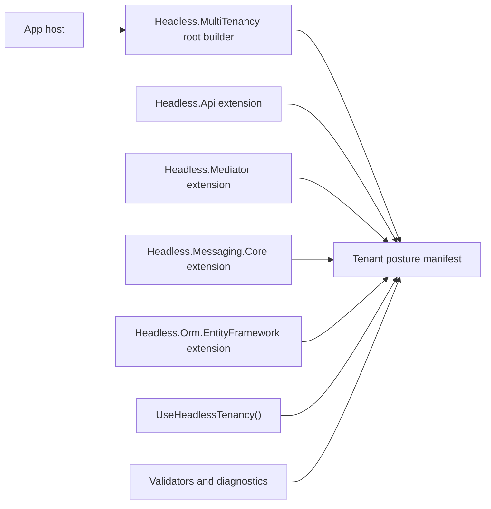

# feat: Add Headless tenancy configuration

## Goal

Add a first-class `AddHeadlessTenancy(...)` configuration surface that makes tenant wiring discoverable across HTTP, mediator, messaging, and Entity Framework, while keeping each package responsible for its own runtime behavior.

The desired host shape is:

```csharp
builder.AddHeadlessTenancy(tenancy => tenancy
    .Http(http => http.ResolveFromClaims())
    .Mediator(mediator => mediator.RequireTenant())
    .Messaging(messaging => messaging.PropagateTenant().RequireTenantOnPublish())
    .EntityFramework(ef => ef.GuardTenantWrites()));

app.UseHeadlessDefaults();
app.UseAuthentication();
app.UseHeadlessTenancy();
app.UseAuthorization();
```

`UseAuthentication()` and `UseAuthorization()` stay app-owned. Headless must not call them internally.

## Requirements

This plan implements the requirements from `docs/brainstorms/2026-05-11-001-headless-tenancy-configuration-requirements.md`.

- Add root `AddHeadlessTenancy(...)` as the primary discoverable API for tenancy configuration.
- Place the root in a neutral package, not `Headless.Api` or `Headless.Core`.
- Use an extension-bus model: seam packages contribute fluent extensions without moving authority into the root package.
- Maintain a shared manifest/posture record for configured tenant behavior.
- Keep enforcement local to each seam:
  - `Headless.Api` owns HTTP tenant resolution.
  - `Headless.Mediator` owns tenant-required mediator behavior and opt-out attributes.
  - `Headless.Messaging.Core` owns tenant propagation and publish/consume strictness decisions.
  - `Headless.Orm.EntityFramework` owns tenant write guard, scoped bypass, and tenant-write exceptions.
- Introduce `UseHeadlessTenancy()` as the V1 HTTP happy path and move `UseTenantResolution()` out of primary docs.
- Do not wire `UseAuthentication()` or `UseAuthorization()` from Headless APIs.
- Support the intended HTTP order: `UseHeadlessDefaults()`, app auth, `UseHeadlessTenancy()`, app authorization, endpoints.
- Make `UseHeadlessTenancy()` apply HTTP tenant resolution only when HTTP tenant resolution was configured.
- Add diagnostics for high-value incomplete wiring, especially HTTP configured without `UseHeadlessTenancy()` and messaging propagation without a real tenant source.
- Keep diagnostics free of tenant IDs, claim values, user identifiers, or other PII.
- Update docs and package READMEs so the new surface is the happy path and lower-level APIs are advanced/compatibility APIs.

## Non-Goals

- Do not make `AddHeadlessInfrastructure()` configure tenancy policy. It can remain the base infrastructure helper, but tenancy posture is explicit.
- Do not add environment presets in V1.
- Do not introduce a generic tenant bypass abstraction. `ITenantWriteGuardBypass` remains EF-owned because bypass is an EF write-guard concept, not a cross-seam tenancy concept.
- Do not remove existing lower-level APIs in this change unless implementation proves a compatibility-safe removal is already intended. Prefer keeping them and moving them out of happy-path docs.
- Do not make non-HTTP hosts depend on `Headless.Api`.

## Current State

- `src/Headless.Api/MultiTenancySetup.cs` exposes `AddHeadlessMultiTenancy(...)` and configures `MultiTenancyOptions` plus `CurrentTenant`.
- `src/Headless.Api/MiddlewareSetup.cs` exposes `AddTenantResolution(...)` and `UseTenantResolution(...)`.
- `src/Headless.Api/Setup.cs` exposes `AddHeadlessInfrastructure(...)` and `UseHeadlessDefaults(...)`; it does not own authentication or authorization.
- `src/Headless.Mediator/Setup.cs` exposes `AddTenantRequiredBehavior()`.
- `src/Headless.Messaging.Core/MultiTenancy/MultiTenancyMessagingBuilderExtensions.cs` exposes `MessagingBuilder.AddTenantPropagation()`, registers tenant filters, and has a startup validator for missing real tenant source.
- `src/Headless.Orm.EntityFramework/Setup.cs` exposes `AddHeadlessTenantWriteGuard(...)` and owns `TenantWriteGuardOptions`, `ITenantWriteGuardBypass`, and EF write-guard behavior.
- Existing tests already cover lower-level HTTP middleware, mediator behavior registration, messaging tenant propagation validation, and EF tenant write guard behavior.

## Design

Create a neutral `Headless.MultiTenancy` package that owns the root builder, seam contribution contracts, diagnostics, and shared manifest. Each existing package references this neutral package and contributes its own fluent extension methods.



The root package should expose the minimum shared concepts:

- A host-level `AddHeadlessTenancy(...)` entry point.
- A root builder used by seam packages to attach extension methods.
- A manifest/posture service that records which seams were configured and which runtime markers were applied.
- Diagnostic/validation contracts that report missing or contradictory tenancy wiring without seam-specific runtime logic.

The root package must not:

- Reference API, mediator, messaging, or EF packages.
- Apply middleware directly.
- Register mediator pipeline behavior directly.
- Register messaging transport filters directly.
- Enable EF write guard directly.
- Own bypass semantics.

## Output Structure

Add:

- `src/Headless.MultiTenancy/`
- `tests/Headless.MultiTenancy.Tests.Unit/`

Update:

- `headless-framework.slnx`
- `src/Headless.Api/`
- `src/Headless.Mediator/`
- `src/Headless.Messaging.Core/`
- `src/Headless.Orm.EntityFramework/`
- Relevant docs and package READMEs.

## Implementation Plan

### 1. Add neutral multi-tenancy package

Create `src/Headless.MultiTenancy/Headless.MultiTenancy.csproj`.

Expected package dependencies:

- `Headless.Core`, if existing core abstractions are useful.
- `Headless.Hosting`, only if host-builder conventions are needed.
- `Microsoft.Extensions.DependencyInjection.Abstractions`.
- `Microsoft.Extensions.Options`, if validators/options are represented as options.
- `Microsoft.Extensions.Hosting.Abstractions`, if runtime validation uses hosted services.

Avoid references from `Headless.MultiTenancy` to any seam package.

Core types to introduce, with exact names adjustable during implementation:

- `SetupHeadlessTenancy`
- `HeadlessTenancyBuilder`
- `TenantPostureManifest`
- `TenantSeamPosture`
- `HeadlessTenancyDiagnostics` or equivalent diagnostic result type
- seam contribution helpers that support package-local extension methods

Add `tests/Headless.MultiTenancy.Tests.Unit/` and register both projects in `headless-framework.slnx`.

Acceptance checks:

- `builder.AddHeadlessTenancy(...)` registers the root services once.
- Repeated calls are idempotent or merge predictably.
- Seam posture can be recorded without referencing seam packages.
- Diagnostics expose seam names, states, and messages only; no tenant values.

### 2. Add HTTP seam extension and `UseHeadlessTenancy()`

Update `Headless.Api` to reference `Headless.MultiTenancy`.

Add an API-owned extension similar to:

```csharp
builder.AddHeadlessTenancy(tenancy => tenancy
    .Http(http => http.ResolveFromClaims()));
```

The HTTP extension should:

- Delegate to the existing `AddHeadlessMultiTenancy(...)` behavior where possible.
- Record HTTP posture in the shared manifest.
- Keep claim mapping options in `Headless.Api`.
- Avoid moving HTTP behavior into the root package.

Add `UseHeadlessTenancy()` in `Headless.Api`.

Runtime behavior:

- If HTTP tenant resolution was configured, call the existing tenant-resolution middleware path.
- If HTTP tenant resolution was not configured, act as a no-op.
- Mark HTTP tenancy middleware as applied so startup validation can detect omitted middleware.
- Do not call `UseAuthentication()` or `UseAuthorization()`.

Keep `UseTenantResolution()` as a lower-level/compatibility API for now, but remove it from happy-path docs.

Acceptance checks:

- Configured HTTP tenancy resolves tenant claims when the app calls auth, then `UseHeadlessTenancy()`.
- `UseHeadlessTenancy()` is a no-op when HTTP tenancy is not configured.
- `UseHeadlessTenancy()` does not register or invoke authentication/authorization middleware.
- Existing `UseTenantResolution()` tests still pass.
- Existing `UseHeadlessDefaults()` tests still pass and do not imply tenant resolution.

### 3. Add mediator seam extension

Update `Headless.Mediator` to reference `Headless.MultiTenancy`.

Add a mediator-owned extension similar to:

```csharp
builder.AddHeadlessTenancy(tenancy => tenancy
    .Mediator(mediator => mediator.RequireTenant()));
```

The mediator extension should:

- Delegate to `services.AddTenantRequiredBehavior()`.
- Record mediator posture in the shared manifest.
- Preserve existing opt-out behavior such as allow-missing-tenant attributes.
- Keep mediator enforcement inside `Headless.Mediator`.

Acceptance checks:

- Root tenancy configuration registers the tenant-required behavior exactly once.
- Existing direct `AddTenantRequiredBehavior()` usage still works.
- Manifest records mediator required posture.

### 4. Add messaging seam extension

Update `Headless.Messaging.Core` to reference `Headless.MultiTenancy`.

Add a messaging-owned extension similar to:

```csharp
builder.AddHeadlessTenancy(tenancy => tenancy
    .Messaging(messaging => messaging.PropagateTenant().RequireTenantOnPublish()));
```

Messaging currently hangs tenant propagation from `MessagingBuilder.AddTenantPropagation()`. To support root configuration without forcing callers to remember another messaging-specific method, extract the common tenant registration into a messaging-owned service-registration helper. Then call that helper from both:

- existing `MessagingBuilder.AddTenantPropagation()`
- new root tenancy messaging extension

Define the supported ordering between `AddHeadlessTenancy(...)` and `AddHeadlessMessaging(...)`. Prefer order-insensitive registration. If the existing messaging builder shape makes that impractical, document and enforce the supported order with startup validation so hosts fail fast instead of silently missing tenant propagation.

Keep strictness aligned with the current behavior in V1:

- Propagate tenant context through existing publish/consume filters.
- Require tenant on publish when configured.
- Reuse or integrate the existing startup validator that fails when propagation is enabled with `NullCurrentTenant`.
- Defer separate producer/consumer policy naming unless implementation proves it is required.

Acceptance checks:

- Root messaging tenancy configuration registers the same filters as `AddTenantPropagation()`.
- Existing `AddTenantPropagation()` remains supported.
- Strict publish requirement is enabled by root configuration.
- Startup validation still fails when propagation is enabled without a real tenant source.
- Repeated root and direct configuration does not duplicate filters or validators.
- Root messaging configuration either works before/after messaging setup or fails fast with a documented ordering diagnostic.

### 5. Add EF seam extension

Update `Headless.Orm.EntityFramework` to reference `Headless.MultiTenancy`.

Add an EF-owned extension similar to:

```csharp
builder.AddHeadlessTenancy(tenancy => tenancy
    .EntityFramework(ef => ef.GuardTenantWrites()));
```

The EF extension should:

- Delegate to `services.AddHeadlessTenantWriteGuard(...)`.
- Record EF write-guard posture in the shared manifest.
- Preserve EF-owned exception types and bypass implementation.
- Keep `ITenantWriteGuardBypass` in the EF package.

Acceptance checks:

- Root EF tenancy configuration enables `TenantWriteGuardOptions`.
- Existing direct `AddHeadlessTenantWriteGuard(...)` still works.
- Scoped bypass remains EF-only.
- Existing EF write-guard integration tests still pass.

### 6. Add diagnostics and validation

Implement manifest-backed validation that catches high-value wiring mistakes without overreaching.

Required hard-failure diagnostics:

- HTTP tenant resolution configured but `UseHeadlessTenancy()` was not applied.
- Messaging tenant propagation configured while the resolved `ICurrentTenant` source is still the null/default implementation.
- Multiple seam posture states can be reported together.

Best-effort diagnostics:

- HTTP order issues where a reliable marker exists.

Do not attempt to infer full ASP.NET Core middleware order if the platform does not expose a stable signal. Instead, document the required order and test representative host setup.

Acceptance checks:

- Host startup fails with a clear diagnostic when HTTP tenancy is configured but `UseHeadlessTenancy()` is omitted.
- No hard-failure diagnostic is emitted when HTTP tenancy is not configured.
- Messaging missing-tenant-source validation remains clear and non-PII.
- Diagnostics name seams and actions, not tenant/user values.

### 7. Update docs and READMEs

Update primary documentation to make `AddHeadlessTenancy(...)` plus `UseHeadlessTenancy()` the recommended path.

Expected docs:

- `docs/llms/multi-tenancy.md`
- `docs/llms/api.md`
- `docs/llms/messaging.md`
- `docs/llms/orm.md`
- `src/Headless.Api/README.md`
- `src/Headless.Mediator/README.md`, if present/relevant
- `src/Headless.Messaging.Core/README.md`
- `src/Headless.Orm.EntityFramework/README.md`

Documentation must state:

- `AddHeadlessInfrastructure()` is base infrastructure, not tenancy policy.
- `UseAuthentication()` and `UseAuthorization()` are app-owned.
- `UseHeadlessTenancy()` belongs after authentication and before authorization.
- `UseTenantResolution()` is lower-level/compatibility API, not V1 happy path.
- EF bypass is intentionally EF-owned and not generic.

Acceptance checks:

- Happy-path examples use `AddHeadlessTenancy(...)` and `UseHeadlessTenancy()`.
- Lower-level APIs remain documented only where useful for advanced usage.
- `rg "UseTenantResolution" docs src -g '*.md'` shows no primary setup example that prefers it over `UseHeadlessTenancy()`.

## Test Plan

Run focused tests first:

- `dotnet test tests/Headless.MultiTenancy.Tests.Unit/Headless.MultiTenancy.Tests.Unit.csproj`
- `dotnet test tests/Headless.Api.Tests.Integration/Headless.Api.Tests.Integration.csproj`
- `dotnet test tests/Headless.Mediator.Tests.Unit/Headless.Mediator.Tests.Unit.csproj`
- `dotnet test tests/Headless.Messaging.Core.Tests.Unit/Headless.Messaging.Core.Tests.Unit.csproj`
- `dotnet test tests/Headless.Orm.EntityFramework.Tests.Integration/Headless.Orm.EntityFramework.Tests.Integration.csproj`

Then run a wider solution-level check if the focused suite is green and runtime allows it.

## Documentation and Release Notes

Document this as a new primary tenancy setup path, not a breaking removal.

Release note shape:

- Added `AddHeadlessTenancy(...)` as the top-level tenancy configuration entry point.
- Added `UseHeadlessTenancy()` for HTTP tenant resolution in the app pipeline.
- Kept lower-level seam APIs for advanced and compatibility usage.
- Clarified that Headless does not call authentication or authorization middleware.

## Risks

- Messaging builder sequencing: existing tenant propagation hangs from `MessagingBuilder`, while the new root shape is host-builder based. Mitigate by extracting messaging-owned registration helpers and preserving the old `MessagingBuilder` API.
- ASP.NET Core middleware order detection: full order is not reliably inspectable. Mitigate by detecting omitted `UseHeadlessTenancy()` and documenting/testing the required order.
- Cross-package dependency drift: the root must stay neutral. Mitigate with project-reference checks and tests that `Headless.MultiTenancy` does not reference seam packages.
- API sprawl: the fluent surface can become a mega-options object. Mitigate by keeping root abstractions small and requiring each seam package to own its own options.
- Documentation drift: public API changes must update docs and package READMEs together.

## Alternatives Considered

- Put the root API in `Headless.Api`: rejected because non-HTTP hosts should configure mediator, messaging, or EF tenancy without depending on API.
- Put the root API in `Headless.Core`: rejected because the root uses host/DI setup concepts and would make Core too broad.
- Wire tenancy through `AddHeadlessInfrastructure()`: rejected because tenancy is posture/policy, not base infrastructure.
- Call authentication/authorization inside Headless middleware helpers: rejected because app-owned security pipeline order must remain explicit.
- Add a generic tenant bypass: rejected because bypass semantics are seam-specific; the current concrete bypass is only meaningful for EF write guards.
- Start with presets: deferred because presets would hide important V1 decisions before the base composition model is stable.

## Implementation Order

1. Add `Headless.MultiTenancy` package, root builder, manifest, diagnostics contracts, and unit tests.
2. Add API seam extension and `UseHeadlessTenancy()` using existing tenant-resolution middleware.
3. Add mediator seam extension.
4. Add messaging seam extension by extracting shared messaging-owned tenant registration helpers.
5. Add EF seam extension.
6. Add manifest-backed diagnostics and startup validation.
7. Update docs, READMEs, and release notes.
8. Run focused tests, then wider validation.

## Open Questions for Implementation

- Exact public type names for the root builder, seam builders, and manifest records.
- Whether diagnostics should fail startup by default or expose warnings for some states. HTTP omitted middleware and messaging null tenant source should be hard failures.
- Whether `UseTenantResolution()` should be marked obsolete now or only moved out of happy-path docs.
- Whether `Headless.MultiTenancy` should sit under the solution's `/Kernel/` folder or a new `/MultiTenancy/` folder in `headless-framework.slnx`.
