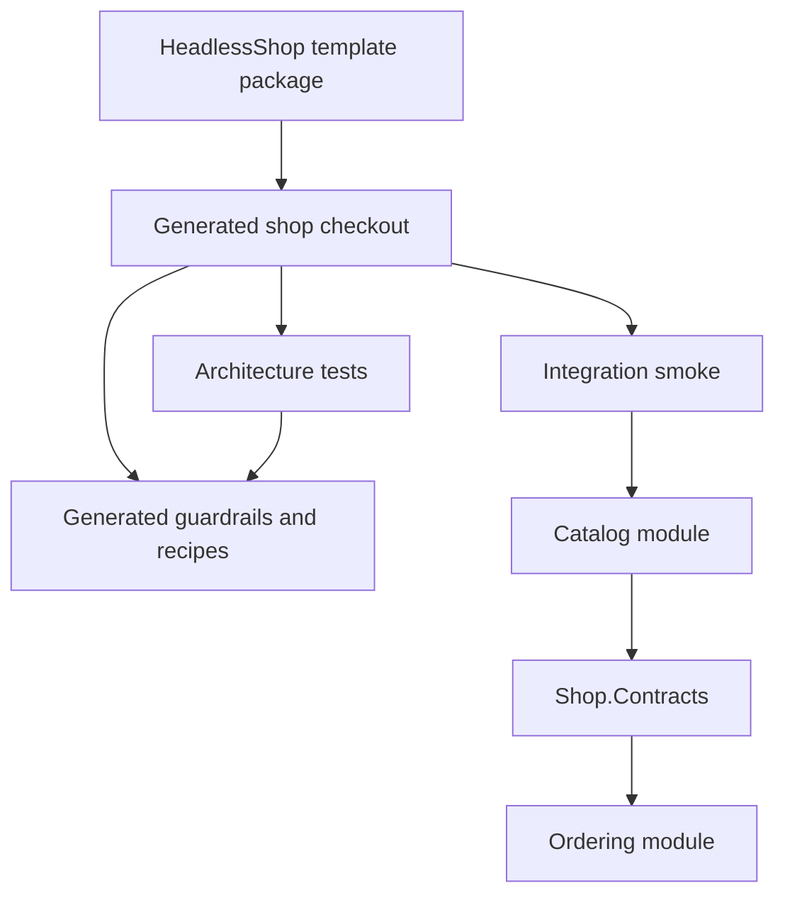
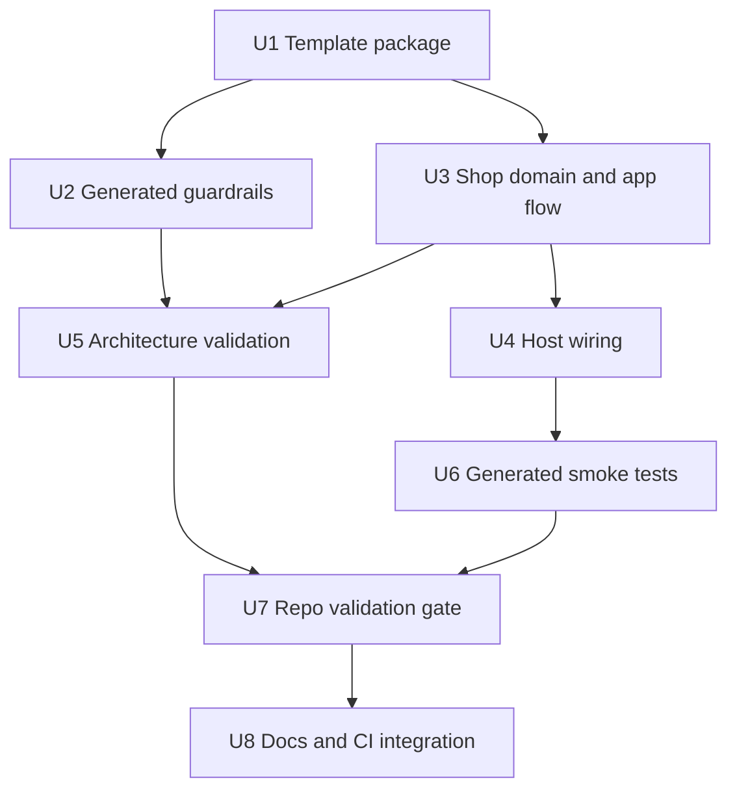
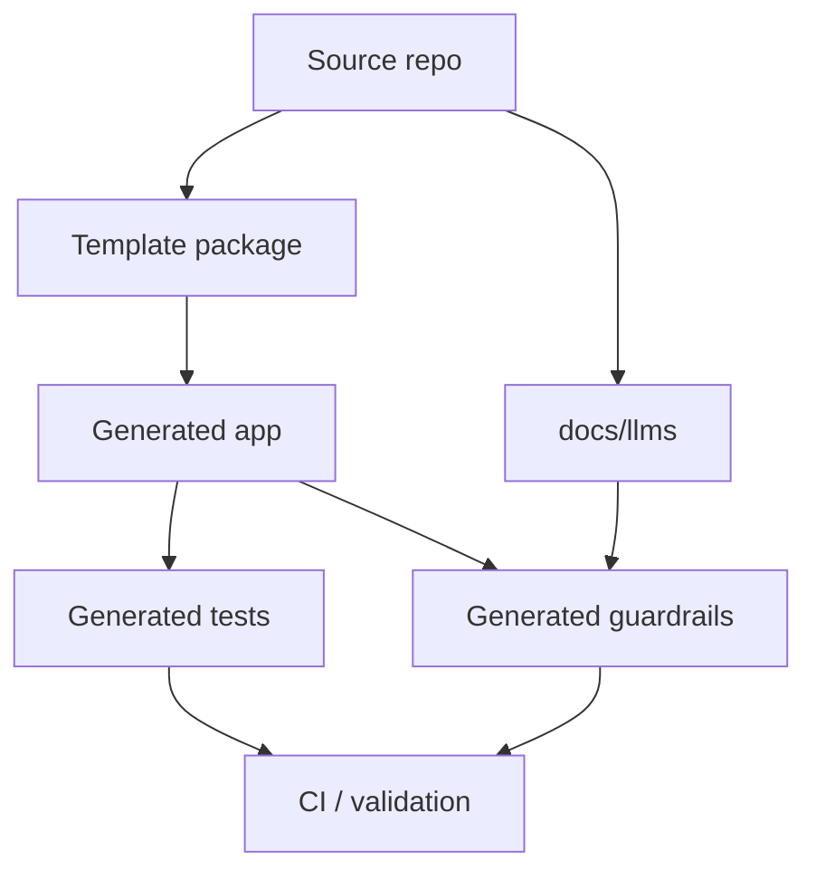

# feat: Add agent-ready Headless shop template

## Summary

Add a first `dotnet new` template package for `headless-shop` that generates an opinionated modular shop capability tour, agent-readable guardrails, architecture validation, generated-output validation, and a product-to-order smoke path. The v1 plan uses repo-local Headless surfaces and in-memory/local infrastructure so the template proves safe extension before adding module generators, profiles, or external provider breadth.

---

## Problem Frame

The origin requirements frame `headless-shop` as a Headless capability tour, not another Clean Architecture folder skeleton. The implementation needs to make the generated app itself the product: runnable, understandable by humans and AI agents, and protected by validation that catches architecture drift, stale generated docs, and broken cross-layer behavior.

---

## Requirements

- R1. Create an installable `headless-shop` template package positioned as an agent-ready capability tour, not a generic Clean Architecture starter (see origin: docs/brainstorms/2026-05-16-001-agent-ready-headless-template-requirements.md).
- R2. Generate a modular shop app with instructions, docs, and recipe guidance that make safe human and AI extension explicit.
- R3. Ship only the opinionated `tour` shape for v1; do not introduce `minimal`, `production`, or broad provider switches yet.
- R4. Include generated guardrails covering module shape, business-rule location, command/query additions, module communication, validation commands, generated/template-owned files, and forbidden actions.
- R5. Include a concise generated architecture overview and at least one repeatable command-style recipe.
- R6. Add architecture validation with actionable failure messages for direct module references, endpoint business logic, raw broker usage, and tenant-aware write posture.
- R7. Implement a product-to-order capability tour: create product, publish product-created signal, project product data into Ordering, place order.
- R8. Demonstrate Headless domain primitives, Mediator-based commands/queries, thin Minimal APIs, EF-backed persistence, Headless messaging, tenant posture, OpenAPI, permissions around one command, and tests.
- R9. Keep cross-module communication through shared contracts and Headless messaging abstractions, never direct module internals or raw broker clients.
- R10. Add generated-template validation that packs, installs into an isolated hive, generates a clean app, builds, tests, architecture-checks, and smoke-tests the output.
- R11. Cover tenant setup, product creation, OpenAPI exposure, tenant-scoped product visibility, integration-event publishing, Ordering projection update, order placement, and tenant isolation failure behavior in validation.
- R12. Validate generated docs and recipes against generated output so stale package names, APIs, or non-runnable instructions fail before release.

**Origin actors:** A1 Application developer, A2 AI coding agent, A3 Framework maintainer, A4 Template-generated app runtime.
**Origin flows:** F1 Generate and validate the shop template, F2 Extend behavior through an agent-readable recipe, F3 Exercise the product-to-order smoke path.
**Origin acceptance examples:** AE1 generated instructions, AE2 architecture boundary failure, AE3 product-to-order smoke, AE4 stale generated docs fail validation, AE5 opinionated tour shape.

---

## Scope Boundaries

- V1 includes one opinionated `headless-shop` tour template, not `minimal` or `production` profiles.
- V1 includes generated `AGENTS.md`, architecture overview, validation guidance, and one add-command recipe; the broader recipe set from ideation is deferred.
- V1 architecture validation uses custom xUnit checks over generated source/project boundaries rather than adding a new architecture-test dependency.
- V1 smoke uses in-memory/local Headless messaging and storage so the release gate is deterministic.
- V1 must not expose raw broker-client sample code or direct module-internal references.
- The plan may add template validation scripts/projects, but should not replace the existing framework CI model.

### Deferred to Follow-Up Work

- `headless-module` generator: add after the flagship generated app shape and validation contract are stable.
- `minimal` and `production` profiles: add after the `tour` profile has enough validation to prevent drift.
- Expanded recipe set: add module, query, integration-event, permission, and tenant-aware-flow recipes after the first recipe is validated end-to-end.
- External broker/provider variants: add after the in-memory/local smoke path proves the core contract.
- Broader observability/jobs/caching tour slices: add only after the product-to-order path is stable.

---

## Context & Research

### Relevant Code and Patterns

- `global.json` pins .NET `10.0.203` and Headless MSBuild SDKs; new generated projects should use `Headless.NET.Sdk`, `Headless.NET.Sdk.Web`, and `Headless.NET.Sdk.Test`.
- `CLAUDE.md` requires project `Setup.cs` patterns, public API discipline, package README/doc sync, and `docs/llms` synchronization when behavior changes.
- `Directory.Packages.props` centralizes package versions; generated projects should not add inline `Version` attributes.
- `src/Headless.Messaging.Testing/README.md` and `tests/Headless.Messaging.Testing.Tests.Unit/*` show deterministic in-memory messaging harness patterns, including tenant propagation tests.
- `src/Headless.Messaging.InMemoryQueue/Setup.cs` and `src/Headless.Messaging.InMemoryStorage/Setup.cs` provide the v1 smoke's local messaging/storage provider choices.
- `docs/llms/multi-tenancy.md`, `docs/llms/messaging.md`, `docs/llms/openapi.md`, `docs/llms/orm.md`, and `docs/llms/testing.md` are the source documents to mirror for generated guardrails and recipes.
- `demo/Headless.OpenApi.Nswag.Demo/Program.cs` shows the current NSwag + Scalar demo pattern.
- The repository has no existing `templates/` package or `dotnet new` template; this is new product surface.

### Institutional Learnings

- Prior local learning for `headless-shop` established the stable template shape: `Shop.Api`, `Shop.Contracts`, `Shop.Modules`, per-module `Domain` / `Application` / `Infrastructure` / `Api` / `Module`, and `Shop.Tests.Architecture`.
- Prior template validation used pack -> custom hive install -> generate `TrailStore` -> build/test generated output. Keep generated-output validation as the primary release evidence.
- `docs/solutions/messaging/transport-wrapper-drift-and-doc-sync.md` warns that wrapper APIs, generated docs, and display surfaces drift together unless samples/docs are validated alongside API changes.
- `docs/solutions/guides/messaging-transport-provider-guide.md` reinforces that messaging examples should prove Headless messaging contracts, not raw broker behavior.

### External References

- Microsoft custom template documentation: https://learn.microsoft.com/en-us/dotnet/core/tools/custom-templates

---

## Key Technical Decisions

- Create a real template package under `templates/HeadlessShop`, not a demo-only source tree: the requested product surface is `dotnet new headless-shop`, and generated output must be the validation target.
- Generate a modular monolith with `Shop.Api`, `Shop.Contracts`, `Shop.Modules`, and per-module projects: this matches prior local template learning and keeps shared integration events out of module internals.
- Use custom xUnit architecture tests in the generated app for v1: this avoids adding a new architecture-test dependency while still giving actionable guardrail failures.
- Use in-memory/local Headless messaging and storage for the first smoke path: this keeps the generated-template gate deterministic and avoids turning provider configuration into the main feature.
- Keep generated docs small and executable: `AGENTS.md`, `docs/architecture.md`, `docs/validation.md`, and `docs/recipes/add-command.md` are enough to prove the guardrail model without doc sprawl.
- Validate generated docs through generated output: recipes and validation guidance should reference paths/commands that exist after generation, preventing stale instructions from shipping.
- Validate the add-command recipe as an extension workflow, not only as prose: the template's core agent-safety promise depends on proving a developer or agent can follow the generated recipe and still pass validation.
- Add template validation outside the generated template tree: validation should exercise the package like a consumer would, while keeping generated app files clean.

---

## Open Questions

### Resolved During Planning

- Smallest useful v1 generated docs: use `AGENTS.md`, `docs/architecture.md`, `docs/validation.md`, and one add-command recipe; defer the rest of the ideation recipe set.
- Architecture-test approach: start with custom xUnit checks over generated projects and source text/assembly references instead of adding a new architecture dependency.
- V1 smoke infrastructure: use in-memory/local Headless messaging and storage first; defer broker/provider breadth.
- Validation location: add repo-owned validation script/test assets outside generated output so the generated app remains a normal consumer checkout.

### Deferred to Implementation

- Exact project/package names inside `templates/HeadlessShop`: the plan defines the expected shape, but implementation should adjust names to the final `.template.config/template.json` and pack behavior.
- Exact generated command name for validation: generated docs must expose one validation command, but the final command can be `make verify`, a script, or a repo-local equivalent that fits generated output.
- Exact permission bootstrap: planning requires one command protected by permissions; implementation should choose the smallest current Headless permissions setup that works reliably in the generated app.
- Exact OpenAPI endpoint assertions: implementation should verify current NSwag/Scalar routes in generated output before locking smoke assertions.

---

## Output Structure

```text
templates/HeadlessShop/
  HeadlessShop.csproj
  README.md
  content/
    .template.config/
      template.json
    Shop.Api/
    Shop.Contracts/
    Shop.Modules/
    Shop.Catalog.Domain/
    Shop.Catalog.Application/
    Shop.Catalog.Infrastructure/
    Shop.Catalog.Api/
    Shop.Catalog.Module/
    Shop.Ordering.Domain/
    Shop.Ordering.Application/
    Shop.Ordering.Infrastructure/
    Shop.Ordering.Api/
    Shop.Ordering.Module/
    Shop.Tests.Architecture/
    Shop.Tests.Integration/
    AGENTS.md
    docs/
      architecture.md
      validation.md
      recipes/
        add-command.md
tools/
  validate-headless-shop-template.sh
tests/
  Headless.Templates.Tests.Integration/
docs/
  llms/
```

The tree is directional. Per-unit file lists are authoritative during implementation, and the implementer may adjust exact paths if `dotnet new` packaging requires it.

---

## High-Level Technical Design

> *This illustrates the intended approach and is directional guidance for review, not implementation specification. The implementing agent should treat it as context, not code to reproduce.*



The runtime smoke should prove this business flow:

```text
tenant context -> CreateProduct command -> Catalog aggregate
  -> ProductCreated contract event -> Headless messaging
  -> Ordering projection -> PlaceOrder command -> order accepted
  -> cross-tenant visibility/write attempt fails
```

---

## Implementation Units



### U1. Create the HeadlessShop template package

**Goal:** Add a packable `dotnet new` template package that produces a generated `headless-shop` checkout.

**Requirements:** R1, R3, R10, AE5

**Dependencies:** None

**Files:**
- Create: `templates/HeadlessShop/HeadlessShop.csproj`
- Create: `templates/HeadlessShop/README.md`
- Create: `templates/HeadlessShop/content/.template.config/template.json`
- Modify: `headless-framework.slnx`
- Modify: `.github/workflows/ci.yml`
- Test: `tests/Headless.Templates.Tests.Integration/*`

**Approach:**
- Add a `templates/HeadlessShop` package that packs generated content as a template package.
- Configure the template identity around short name `headless-shop`, one `tour` profile/default shape, and generated project renaming.
- Keep v1 template options minimal: project name/output name only, plus whatever the .NET template engine requires for reliable source replacement.
- Treat feature content under `templates/HeadlessShop/content/` as owned by U2 through U6; this unit owns the package shell and template metadata needed to generate that content.
- Attach template and validation tests to the solution using the repo's Headless SDK conventions.

**Execution note:** Start with generated-template validation failing because no package can be packed/installed/generated yet.

**Patterns to follow:**
- `global.json` Headless SDK mappings.
- Repo package conventions in `Directory.Packages.props`.
- Microsoft custom template docs for `.template.config/template.json`.

**Test scenarios:**
- Integration: packing the template project produces one installable `.nupkg` containing `.template.config/template.json`.
- Integration: installing the packed template into an isolated custom hive exposes `headless-shop`.
- Integration: generating `TrailStore` into a clean directory creates renamed projects and no unresolved template placeholders.
- Edge case: generating twice into different output folders with different names does not share build artifacts or hive state.
- Error path: invalid or missing packed template path fails validation with a clear message naming the failed template step.

**Verification:**
- A clean generated checkout can be created from the local packed template without relying on source-tree demos.

---

### U2. Generate agent-readable guardrails and recipe docs

**Goal:** Make generated output self-describing for developers and AI agents.

**Requirements:** R2, R4, R5, R12, AE1, AE4

**Dependencies:** U1

**Files:**
- Create: `templates/HeadlessShop/content/AGENTS.md`
- Create: `templates/HeadlessShop/content/docs/architecture.md`
- Create: `templates/HeadlessShop/content/docs/validation.md`
- Create: `templates/HeadlessShop/content/docs/recipes/add-command.md`
- Modify: `templates/HeadlessShop/README.md`
- Test: `tests/Headless.Templates.Tests.Integration/*`

**Approach:**
- Keep generated guardrails compact and operational: module shape, layer responsibilities, command/query recipe, messaging boundary, tenant posture, validation command, and forbidden actions.
- Make the add-command recipe path-oriented and runnable against generated output without naming stale framework APIs.
- Mark generated/template-owned files clearly so agents understand what is scaffolding versus app-owned extension surface.
- Include validation guidance that points to the generated app's own verification command plus the repo-owned template validation gate.

**Patterns to follow:**
- Project `AGENTS.md` delegates repo conventions to `CLAUDE.md`; generated `AGENTS.md` should be self-contained for the generated app.
- `docs/llms/multi-tenancy.md`, `docs/llms/messaging.md`, `docs/llms/openapi.md`, and `docs/llms/testing.md` for current Headless agent guidance.

**Test scenarios:**
- Happy path: generated output contains `AGENTS.md`, `docs/architecture.md`, `docs/validation.md`, and `docs/recipes/add-command.md`.
- Happy path: generated docs mention the template validation command and the command recipe references generated paths that exist.
- Integration: a recipe-conformance check follows the add-command recipe against generated output, then runs generated validation to prove the new command lands in the intended module/layer.
- Error path: generated docs contain no unresolved template placeholders after generation.
- Integration: generated doc validation catches a recipe path that does not exist in the generated checkout.

**Verification:**
- A downstream implementer can follow generated docs without needing the source repo's ideation or requirements documents.

---

### U3. Build the modular shop capability flow

**Goal:** Add the generated Catalog/Ordering modules and shared contracts that implement the product-to-order flow.

**Requirements:** R7, R8, R9, AE3

**Dependencies:** U1

**Files:**
- Create: `templates/HeadlessShop/content/Shop.Contracts/*`
- Create: `templates/HeadlessShop/content/Shop.Catalog.Domain/*`
- Create: `templates/HeadlessShop/content/Shop.Catalog.Application/*`
- Create: `templates/HeadlessShop/content/Shop.Catalog.Infrastructure/*`
- Create: `templates/HeadlessShop/content/Shop.Catalog.Api/*`
- Create: `templates/HeadlessShop/content/Shop.Catalog.Module/*`
- Create: `templates/HeadlessShop/content/Shop.Ordering.Domain/*`
- Create: `templates/HeadlessShop/content/Shop.Ordering.Application/*`
- Create: `templates/HeadlessShop/content/Shop.Ordering.Infrastructure/*`
- Create: `templates/HeadlessShop/content/Shop.Ordering.Api/*`
- Create: `templates/HeadlessShop/content/Shop.Ordering.Module/*`
- Test: `templates/HeadlessShop/content/Shop.Tests.Integration/*`
- Test: `templates/HeadlessShop/content/Shop.Tests.Architecture/*`

**Approach:**
- Use `Shop.Contracts` for integration contracts shared across modules.
- Keep Catalog responsible for product aggregate behavior and product-created publication.
- Keep Ordering responsible for product snapshot/projection and order placement decisions.
- Use Mediator request handlers in module application layers; keep endpoints thin.
- Use Headless domain primitives for aggregates/value objects/messages where they fit the current package APIs.
- Keep tenant-aware entities and flows explicit enough for EF filters/write guard and smoke tests to prove tenant isolation.

**Execution note:** Implement core domain/application behavior test-first inside the generated template content before broad host validation.

**Patterns to follow:**
- `src/Headless.Domain/README.md` for aggregate/message primitives.
- `src/Headless.Mediator/README.md` for tenant-required Mediator behavior and validation/logging pipeline.
- Prior local `headless-shop` learning: Catalog and Ordering communicate through `Shop.Contracts` plus Headless messaging.

**Test scenarios:**
- Happy path: creating a valid product records/publishes a product-created contract event.
- Happy path: consuming the product-created event creates or updates Ordering's product snapshot.
- Happy path: placing an order for a projected product succeeds under the same tenant.
- Edge case: duplicate product-created event does not create duplicate usable product snapshots.
- Edge case: placing an order for an unknown product fails with a domain/application error.
- Error path: creating a product with invalid required fields fails before publishing.
- Integration: Catalog does not reference Ordering internals and Ordering does not reference Catalog internals.

**Verification:**
- Generated application code expresses real domain behavior rather than CRUD-only folders.

---

### U4. Wire the generated API host and Headless infrastructure

**Goal:** Make the generated app runnable with Headless infrastructure, OpenAPI, permissions, tenancy, EF, Mediator, and messaging.

**Requirements:** R8, R11

**Dependencies:** U3

**Files:**
- Create: `templates/HeadlessShop/content/Shop.Api/*`
- Create: `templates/HeadlessShop/content/Shop.Modules/*`
- Modify: `templates/HeadlessShop/content/Shop.Catalog.Module/*`
- Modify: `templates/HeadlessShop/content/Shop.Ordering.Module/*`
- Test: `templates/HeadlessShop/content/Shop.Tests.Integration/*`

**Approach:**
- Centralize module registration in `Shop.Modules` so the host does not know module internals.
- Use current Headless setup APIs for API defaults, tenant posture, OpenAPI/Scalar, EF registration, Mediator registration, messaging, and permissions.
- Keep auth/tenant bootstrap deliberately simple for the generated tour, while still proving tenant context and one permission-protected command.
- Use in-memory/local infrastructure for v1 smoke where current Headless packages support it.
- Ensure `Program` remains a thin composition root.

**Patterns to follow:**
- `docs/llms/multi-tenancy.md` for `AddHeadlessTenancy`, `UseHeadlessTenancy`, mediator tenancy, messaging tenant propagation, and EF write guard posture.
- `docs/llms/openapi.md` and `demo/Headless.OpenApi.Nswag.Demo/Program.cs` for OpenAPI + Scalar.
- `src/Headless.Permissions.Core/README.md` for permission setup, while keeping generated v1 minimal.

**Test scenarios:**
- Happy path: generated host starts and exposes OpenAPI/Scalar endpoints.
- Happy path: generated host resolves tenant context before tenant-required Mediator requests run.
- Happy path: one protected command denies unauthorized/permission-missing access and succeeds with the seeded or test principal permission.
- Error path: tenant-required command without tenant context fails through the standard Headless tenant-required path.
- Integration: module endpoints delegate to Mediator requests and do not contain business decisions.

**Verification:**
- Generated app can be run and exercised as a normal consumer app using Headless composition surfaces.

---

### U5. Add actionable architecture validation

**Goal:** Add generated architecture tests that enforce the extension contract with human/agent-readable failure messages.

**Requirements:** R2, R6, R9, AE2

**Dependencies:** U2, U3

**Files:**
- Create: `templates/HeadlessShop/content/Shop.Tests.Architecture/*`
- Modify: `templates/HeadlessShop/content/docs/validation.md`
- Test: `tests/Headless.Templates.Tests.Integration/*`

**Approach:**
- Implement custom xUnit architecture checks over generated project references, source structure, and dependency patterns.
- Cover the v1 guardrails explicitly: no direct Catalog-to-Ordering internals, no Ordering-to-Catalog internals, shared contracts live in `Shop.Contracts`, endpoints stay thin, messaging goes through Headless abstractions, and tenant-aware flows remain guarded.
- Make failure messages prescriptive, matching the origin examples in spirit without depending on exact wording.
- Keep checks maintainable and narrow; avoid broad static-analysis rules that produce noisy failures.

**Patterns to follow:**
- Existing xUnit v3 project shape with `Headless.NET.Sdk.Test`.
- Repo test naming and AwesomeAssertions usage.

**Test scenarios:**
- Happy path: generated template passes all architecture tests immediately after generation.
- Error path: synthetic direct module reference fails with a message telling the implementer to move shared contracts to `Shop.Contracts`.
- Error path: synthetic endpoint business logic fails with a message directing behavior into Application/Mediator handlers.
- Error path: raw broker-client reference fails with a message directing use of Headless messaging abstractions.
- Error path: tenant-aware write path missing tenant posture fails with a message naming the tenant guard expectation.

**Verification:**
- Architecture failures are actionable enough for an AI agent to correct without guessing the intended boundary.

---

### U6. Add generated integration smoke coverage

**Goal:** Prove the generated app's end-to-end capability tour after template generation.

**Requirements:** R7, R8, R10, R11, AE3

**Dependencies:** U2, U4

**Files:**
- Create: `templates/HeadlessShop/content/Shop.Tests.Integration/*`
- Modify: `templates/HeadlessShop/content/docs/validation.md`
- Test: `tests/Headless.Templates.Tests.Integration/*`

**Approach:**
- Add integration tests inside generated output that exercise the app through public API or host-level test seams.
- Use Headless messaging test harness or equivalent local messaging infrastructure to observe product-created publish/consume/projection behavior.
- Assert OpenAPI exposure and tenant isolation in the same generated app context.
- Keep smoke deterministic and isolated; avoid Docker/external broker requirements for v1.

**Patterns to follow:**
- `src/Headless.Messaging.Testing/README.md` host integration pattern.
- `tests/Headless.Messaging.Testing.Tests.Unit/MultiTenancy/TenantPropagationE2ETests.cs` tenant propagation and observation style.
- `docs/llms/testing.md` for `TestBase`, fake current user/tenant, and xUnit v3 conventions.

**Test scenarios:**
- Integration: creating a product under tenant A publishes the product-created message with tenant context.
- Integration: Ordering consumes/projects the product-created message and can place an order for the projected product under tenant A.
- Integration: OpenAPI endpoint is exposed in the generated host.
- Error path: tenant B cannot see or order tenant A's product.
- Error path: missing tenant context cannot create tenant-owned product/order data.
- Edge case: repeated product-created message leaves Ordering projection idempotent.

**Verification:**
- The generated app proves the product-to-order tour from API through domain, persistence, messaging, projection, and tenant isolation.

---

### U7. Add repo-owned generated-template validation gate

**Goal:** Add a repeatable validation path that treats generated output as the product.

**Requirements:** R10, R12, AE4

**Dependencies:** U1, U5, U6

**Files:**
- Create: `tools/validate-headless-shop-template.sh`
- Create: `tests/Headless.Templates.Tests.Integration/*`
- Modify: `headless-framework.slnx`
- Modify: `.github/workflows/ci.yml`
- Modify: `docs/brainstorms/2026-05-16-001-agent-ready-headless-template-requirements.md` only if implementation discovers scope corrections are needed

**Approach:**
- Add a validation script/test harness that packs the template, installs it into an isolated custom hive, generates a clean app, builds generated output, runs generated unit/architecture/integration tests, and validates generated docs/recipe paths.
- Include a recipe-conformance validation scenario for the generated add-command recipe so the agent-extension workflow is proven, not only documented.
- Keep validation output clear by naming each gate step.
- Avoid parallel rebuilds in the same generated checkout; generated-output validation should run sequentially to avoid build artifact lock contention.
- Make CI include template paths so future template/doc changes run the gate.

**Patterns to follow:**
- Existing `.github/workflows/ci.yml` restore/build/pack style.
- Prior local validation learning using custom hive install and generated output build/test.
- Shell scripting rules from global instructions if a shell script is added.

**Test scenarios:**
- Happy path: validation succeeds against a freshly packed local template and generated app.
- Error path: broken template install/generation fails before build/test with a clear step label.
- Error path: generated docs referencing a missing path or command fail doc validation.
- Error path: add-command recipe conformance fails if the recipe lands behavior in the wrong layer or breaks generated validation.
- Error path: generated architecture or smoke tests fail the template validation gate.
- Edge case: validation creates parent temp directories before custom hive/output directories.

**Verification:**
- Maintainers can run one gate and know whether the template package, generated app, guardrails, and smoke path are coherent.

---

### U8. Synchronize framework docs and release guidance

**Goal:** Make the new template discoverable and keep agent-facing documentation in sync.

**Requirements:** R2, R10, R12

**Dependencies:** U7

**Files:**
- Modify: `README.md`
- Create or modify: `docs/llms/templates.md`
- Modify: `docs/llms/*` only where template behavior changes cross-domain guidance
- Modify: `templates/HeadlessShop/README.md`
- Modify: `.github/workflows/ci.yml`

**Approach:**
- Add a concise README entry for the template and its validation posture.
- Add LLM-facing template guidance that tells agents how to use `headless-shop`, where generated guardrails live, and what not to bypass.
- Cross-link the generated guardrails with repo-level docs without duplicating full framework package docs.
- Update CI path filters so template and relevant docs changes trigger validation.

**Patterns to follow:**
- `README.md` package and LLM-context sections.
- Existing `docs/llms/*.md` domain docs with frontmatter and agent instructions.
- `CLAUDE.md` requirement to keep `docs/llms` synchronized when behavior changes.

**Test scenarios:**
- Test expectation: none for prose-only README/LLM doc changes; validation is covered by U7 generated-doc checks.
- Integration: CI path-filter change includes `templates/**`, `tools/**`, and template validation tests so future template changes are not skipped.

**Verification:**
- Developers and agents can discover the template from repo docs, and future template changes are included in validation paths.

---

## System-Wide Impact



- **Interaction graph:** The change adds a new template package, generated app projects, generated tests, validation tooling, CI path coverage, and LLM/docs surfaces.
- **Error propagation:** Template validation should fail at the earliest named step: pack, install, generate, build, generated docs, architecture tests, integration smoke.
- **State lifecycle risks:** Generated-output validation creates temp hives/output directories; implementation should isolate them per run and avoid stale template state.
- **API surface parity:** Any sample Headless API in generated docs must match current package APIs, source package READMEs, and `docs/llms`.
- **Integration coverage:** Generated app tests are the primary evidence; source-template tests alone are insufficient.
- **Unchanged invariants:** Existing Headless packages remain framework packages. This plan adds a consumer template and validation gate without changing package runtime contracts unless implementation discovers an actual API gap.

---

## Risks & Dependencies

| Risk | Mitigation |
|------|------------|
| Template source and generated output drift | Validate generated output, docs, architecture tests, and smoke path from a packed template package. |
| V1 becomes too broad | Keep only `tour`, one recipe, in-memory/local smoke, and defer profiles/providers/module generator. |
| Generated docs teach stale APIs | Validate recipe paths/commands and update `docs/llms` with any API/sample behavior changes. |
| Architecture checks become brittle | Start with narrow custom xUnit checks tied to explicit module-boundary promises. |
| Smoke path depends on fragile external infrastructure | Use in-memory/local Headless messaging/storage first. |
| Permission/tenant setup balloons | Protect one command and prove tenant posture; defer broader identity scenarios. |
| CI time increases sharply | Keep generated validation targeted and sequential; run the full generated gate only for template/source paths. |

---

## Documentation / Operational Notes

- Update `README.md` with `dotnet new headless-shop` discovery and the template validation contract.
- Add template-specific LLM docs so AI agents learn the generated app contract before editing.
- Keep generated `AGENTS.md` and recipes short enough to be read at task start.
- CI must include template and validation paths; otherwise template changes can bypass the release gate.
- No production rollout or data migration is involved; this is a package/template release surface.

---

## Alternative Approaches Considered

- Demo-only sample under `demo/`: rejected because the requirements center on `dotnet new` generated output and agent-safe extension, not source-tree examples.
- Add `headless-module` in the same slice: rejected for v1 because it expands scope before the flagship app and validation contract are proven.
- Use an external architecture-testing library immediately: deferred because custom xUnit checks can prove the v1 guardrails without adding dependency risk.
- Start with external providers/Testcontainers: rejected for v1 smoke because reliability and fast generated validation matter more than provider breadth.

---

## Success Metrics

- `dotnet new headless-shop` generates a clean app from the local packed template.
- Generated output builds and runs its architecture/integration tests from a clean directory.
- A deliberate direct module reference produces an actionable architecture-test failure.
- The product-to-order smoke proves product creation, message publication/consumption, Ordering projection, order placement, OpenAPI exposure, and tenant isolation.
- Generated docs and recipe paths are validated against generated output.

---

## Sources & References

- **Origin document:** [docs/brainstorms/2026-05-16-001-agent-ready-headless-template-requirements.md](docs/brainstorms/2026-05-16-001-agent-ready-headless-template-requirements.md)
- Ideation source: [docs/ideation/2026-05-16-agent-ready-headless-template.md](docs/ideation/2026-05-16-agent-ready-headless-template.md)
- Messaging doc-sync learning: [docs/solutions/messaging/transport-wrapper-drift-and-doc-sync.md](docs/solutions/messaging/transport-wrapper-drift-and-doc-sync.md)
- Messaging provider guide: [docs/solutions/guides/messaging-transport-provider-guide.md](docs/solutions/guides/messaging-transport-provider-guide.md)
- Tenant guidance: [docs/llms/multi-tenancy.md](docs/llms/multi-tenancy.md)
- Messaging guidance: [docs/llms/messaging.md](docs/llms/messaging.md)
- OpenAPI guidance: [docs/llms/openapi.md](docs/llms/openapi.md)
- ORM guidance: [docs/llms/orm.md](docs/llms/orm.md)
- Testing guidance: [docs/llms/testing.md](docs/llms/testing.md)
- Microsoft custom template docs: https://learn.microsoft.com/en-us/dotnet/core/tools/custom-templates
