# fix: harden messaging retry concurrency, shutdown, and review blockers

## Summary

Close the eight remaining PR #254 review issues by hardening retry pickup against active deliveries, restoring tenant context for exhausted callbacks, making poisoned-message terminal guards observable to callers, correcting retry indexes for the hot query shape, aligning local test entry points with the repo's `dotnet-test` workflow, protecting the `Retries` counter from multi-replica races, bounding transport publish on shutdown, and adding explicit ADO.NET `CommandTimeout`.

**Relationship to `2026-05-16-001`:** This plan supersedes that one entirely. It keeps the valid problem framings (R2 tenant context, R3 poisoned-message gating, R4 retry indexes, R5 Makefile alignment) and changes the lease implementation: instead of reusing `NextRetryAt` for three meanings (initial grace / active lease / retry due time), a dedicated `LockedUntil` column is added. The prior plan listed the three-meaning timestamp as a self-acknowledged state-lifecycle risk; this plan resolves that risk and is grounded in peer-framework prior art (Hangfire `SlidingInvisibilityTimeout`).

---

## Problem Frame

PR #254 shipped the typed `RetryPolicy` contract, multiplicative budget, and `NextRetryAt`-driven single-branch pickup. Code review (run `20260516-9af877eb`) plus follow-up review verification on `2026-05-16-001` left eight residual issues. All are framework-level correctness/reliability issues because the messaging package is a reusable NuGet surface — consumers cannot patch around them without forking.

1. **In-flight protection is documented but not durable.** `InitialDispatchGrace` claims the persisted retry processor will not race the inline-retry path, but the padded `NextRetryAt` is written only AFTER the first attempt completes. Handlers exceeding 30 s (default grace) are concurrently re-dispatched.
2. **Multi-replica `Retries` race.** Two workers can snapshot the same row (post-`SKIP LOCKED` commit), both dispatch, both `Retries++` in memory, both `UPDATE Retries=N+1`. User-configured budget silently multiplied by replica count.
3. **Transport publish does not observe shutdown.** `_transport.SendAsync` uses `CancellationToken.None`. A stuck broker holds the dispatch thread until the transport's internal timeout fires; in-flight publishes survive past Kubernetes `terminationGracePeriodSeconds` → SIGKILL.
4. **No `CommandTimeout` on ADO.NET commands.** Driver defaults vary (30 s SqlClient, driver-config-dependent Npgsql). Terminal-state writes use `CancellationToken.None`, so a hung DB blocks ~2 min until OS TCP timeout.
5. **`OnExhausted` callback runs outside envelope tenant context.** Tenant propagation enters the consume scope but does not wrap the exhausted-callback invocation; the callback observes whatever ambient tenant the host thread carries.
6. **Poisoned-on-arrival redelivery double-fires `OnExhausted`.** Broker redelivery of a deserialization-failure message re-runs the storage write path; with no storage-mutation signal, the caller cannot detect the row is already terminal and the callback fires again.
7. **Retry pickup indexes have `Version` as a residual filter, not a seek predicate.** Filtered indexes `idx_*_next_retry` / `IX_*_NextRetry` are keyed on `NextRetryAt` only with `Version` in `INCLUDE`. Under rolling upgrades the planner returns rows from both versions and discards one version's rows post-fetch.
8. **Local `Makefile` test targets contradict the `dotnet-test` workflow.** The repo's `dotnet-test` skill is the required test entry point; `Makefile` still teaches `dotnet test` for normal targets.

---

## Requirements

- **R1.** A retry pickup must not redeliver a row while an active publish or consume attempt is still executing for that row, up to a configurable bounded lease window.
- **R2.** `RetryPolicy.OnExhausted` must observe the envelope's tenant context via `ICurrentTenant` when tenant propagation is configured.
- **R3.** Poisoned-on-arrival broker redelivery must not invoke `OnExhausted` when storage proves the row is already terminal.
- **R4.** A retry-counter increment driven by one replica must not be silently overwritten by a concurrent replica's increment for the same row.
- **R5.** Transport publish must observe host shutdown within a bounded, configurable timeout regardless of whether the underlying broker client honors `CancellationToken`.
- **R6.** Every ADO.NET command issued by a storage provider must have an explicit, configurable `CommandTimeout` that bounds wall-clock blocking independent of cancellation token plumbing.
- **R7.** PostgreSQL and SQL Server retry-pickup indexes must match the hot query shape that filters by `Version` and `NextRetryAt`, making `Version` a seek predicate rather than a residual filter.
- **R8.** Local test entry points must not contradict the repo's `dotnet-test` skill workflow.
- **R9.** Public XML docs, `src/Headless.Messaging.Core/README.md`, and `docs/llms/messaging.md` / `docs/llms/multi-tenancy.md` must describe the new lease, optimistic-concurrency, transport-timeout, command-timeout, and tenant-restoration contracts so consumers configure them deliberately.

---

## Scope Boundaries

- This plan does not change the retry budget model (`MaxInlineRetries × MaxPersistedRetries`) or the `NextRetryAt`-driven pickup branch.
- This plan does not introduce exactly-once delivery. Messaging remains at-least-once: handlers exceeding the lease window can still be re-dispatched.
- This plan does not add a separate dead-letter queue or poison-message workflow; the existing `OnExhausted` callback remains the terminal-handler hook.
- This plan does not refactor `IDataStorage` beyond the parameters required for `LockedUntil`, optimistic concurrency, and the new poisoned-message affected-row signal.
- This plan does not add a new external NuGet dependency.

### Deferred to Follow-Up Work

- Operational telemetry for lease writes, lease expiries, rejected optimistic-concurrency UPDATEs, and tenant-restoration failures belongs in the existing retry-telemetry follow-up (#230).
- Per-message override of the lease window (handler-attribute / per-publish API).
- Adaptive backoff on rejected optimistic-concurrency UPDATEs.
- Startup warning when multiple replicas are detected with `UseStorageLock = false` (the framework cannot reliably detect replica count; documentation is the right surface).

---

## Context & Research

### Relevant Code and Patterns

- `src/Headless.Messaging.Core/Retry/RetryHelper.cs` — shared retry decision authority; stays pure with respect to persistence. Call sites own mutations.
- `src/Headless.Messaging.Core/Internal/IMessageSender.cs`, `src/Headless.Messaging.Core/Internal/ISubscribeExecutor.cs` — sibling publish/consume call sites for lease writes, optimistic-concurrency checks, and tenant scope.
- `src/Headless.Messaging.Core/Retry/InlineRetryLoop.cs` — inline retry loop owning each dispatch attempt; the natural pre-attempt hook for lease writes.
- `src/Headless.Messaging.Core/Internal/IConsumerRegister.cs`, `src/Headless.Messaging.Core/Internal/IConsumeExecutionPipeline.cs` — poisoned-message storage path and lenient tenant-header resolution.
- `src/Headless.Messaging.Core/MultiTenancy/TenantPropagationConsumeFilter.cs` — `ICurrentTenant.Change(...)` lifetime discipline to reuse around `OnExhausted`.
- `src/Headless.Messaging.Core/Persistence/IDataStorage.cs` — contract surface for new `originalRetries`, `lockedUntil`, and poisoned-message `ValueTask<bool>` parameters.
- `src/Headless.Messaging.{PostgreSql,SqlServer,InMemoryStorage}/*DataStorage.cs` + `*StorageInitializer.cs` — provider parity surfaces for the new column, conditional UPDATE WHERE, index DDL, and `CommandTimeout` discipline.
- `src/Headless.Messaging.PostgreSql/DbConnectionExtensions.cs` (and SqlServer equivalent) — the choke point where `CommandTimeout` lands on every command.
- `tests/Headless.Messaging.Core.Tests.Harness/DataStorageTestsBase.cs` — provider-contract test surface; the gate for cross-provider parity.

### Institutional Learnings

- `docs/solutions/logic-errors/terminal-state-overwrite-on-redelivery-2026-05-16.md` — storage owns terminal-state truth; callers must treat `affected == false` as authoritative. The terminal-row guard must include the `NextRetryAt IS NULL` axis. The optimistic-concurrency check and poisoned-message gating reuse this discipline. **Update this learning after U3 lands** so it covers poisoned-on-arrival affected-row signaling.
- `docs/solutions/concurrency/circuit-breaker-transport-thread-safety-patterns.md` — Pattern 2 (TOCTOU in InMemory) applies to the InMemory lease write. Use `Interlocked.CompareExchange` or a per-row lock.
- `docs/solutions/concurrency/startup-pause-gating-and-half-open-recovery.md` — cross-option invariants must live in FluentValidation. New options (`DispatchTimeout`, `TransportPublishTimeout`, `CommandTimeout`) follow this rule.

### Peer-Framework Prior Art

Decisions below are grounded in observed production patterns (research run 2026-05-16).

**Sliding lease (R1):**
- **Hangfire `SlidingInvisibilityTimeout`** (default 5 min): worker writes `FetchedAt` on claim + keep-alive every `SlidingInvisibilityTimeout / 5`. Pickup excludes recently-fetched rows. ([SqlServerStorageOptions.cs](https://github.com/HangfireIO/Hangfire/blob/main/src/Hangfire.SqlServer/SqlServerStorageOptions.cs)) — this plan adopts the model **without the keep-alive thread**: the terminal/retry-schedule write at attempt end clears the lease.
- **Wolverine `owner_id` + node registry** ([durability docs](https://wolverinefx.net/guide/durability/)) — rejected: no node registry in this framework.
- **NServiceBus SQL transport destructive-claim** ([SQL Statements docs](https://docs.particular.net/transports/sql/sql-statements)) — rejected: row-survives-retry model is incompatible with delete-on-pickup.

**Optimistic concurrency on counter (R4):**
- **MassTransit saga `RowVersion`** ([Persistence docs](https://masstransit.io/documentation/configuration/persistence/entity-framework)) — this plan adopts the conditional-UPDATE-with-`@OriginalRetries` shape but does NOT throw; the storage method returns `false` on `rowsAffected == 0` and the caller logs and discards. The lease (R1) already serializes typical concurrent access.

**Transport publish timeout (R5):**
- **MassTransit `IBus.Publish` CT-honoring** has known gaps ([Issue #1760](https://github.com/MassTransit/MassTransit/issues/1760)).
- **RabbitMQ .NET client v7.x `BasicPublishAsync`** honors CT only for publisher-confirm wait ([Issue #1682](https://github.com/rabbitmq/rabbitmq-dotnet-client/issues/1682)).
- **Kafka (.NET Confluent)** has `delivery.timeout.ms` (default 120 s); no per-publish CT.
- **Conclusion:** a linked CTS with `CancelAfter(TransportPublishTimeout)` is the only framework-level safety net.

**ADO.NET `CommandTimeout` (R6):**
- **Hangfire `SqlServerStorageOptions.CommandTimeout`** (`TimeSpan? = null` → driver default; introduced in 1.6.9 due to Azure SQL timeouts) ([SqlServerStorageOptions.cs](https://github.com/HangfireIO/Hangfire/blob/main/src/Hangfire.SqlServer/SqlServerStorageOptions.cs), [1.6.9 release](https://www.hangfire.io/blog/2017/03/02/hangfire-1.6.9.html))
- **NServiceBus SQL persistence:** no first-class API; connection-factory escape hatch only.
- **Conclusion:** explicit 30 s default (matching SqlClient's documented default, making it observable) applied uniformly to every `DbCommand` via `DbConnectionExtensions`.

**Envelope subclassing (drop from scope):** Wolverine `Envelope` is `public partial class`; MassTransit uses interfaces; NServiceBus marker interface. The `MediumMessage` sealing finding from code review is dropped on this basis. The InMemory provider's `MemoryMessage : MediumMessage` is a legitimate in-framework extension and the unsealed surface is consistent with peer-framework convention.

---

## Key Technical Decisions

- **Add a dedicated `LockedUntil` column** instead of overloading `NextRetryAt`. Separates "when eligible for retry" (`NextRetryAt`) from "when active dispatch claim expires" (`LockedUntil`). Pickup query becomes `NextRetryAt <= @Now AND (LockedUntil IS NULL OR LockedUntil <= @Now)`. The prior plan's three-meaning-timestamp risk is eliminated.
- **No keep-alive thread.** Terminal/retry-schedule writes clear `LockedUntil` synchronously at attempt end. Handlers exceeding `DispatchTimeout` are documented at-least-once.
- **Optimistic concurrency via storage parameter, not exception.** `originalRetries` is snapshotted at the call site before the in-memory increment; storage adds `AND Retries = @OriginalRetries` to the conditional UPDATE. On `rowsAffected == 0`, the storage method returns `false` (reusing the existing terminal-row guard signal). No new exception type.
- **`TransportPublishTimeout` is a top-level `MessagingOptions` property**, not per-transport. Per-transport tuning is deferred.
- **`CommandTimeout` lives on a shared storage-options surface** (one knob across PostgreSQL and SqlServer) — providers read from the same option. Default 30 s = SqlClient's documented default, made explicit and observable.
- **Terminal-state writes keep `CancellationToken.None` but rely on `CommandTimeout`.** Introducing a real CT would let SIGTERM orphan a half-written terminal row; `CommandTimeout` is the right safety net for terminal writes.
- **Lease write reuses the existing conditional-UPDATE terminal-row guard.** If the row is terminal, the lease write returns `false` and the caller stops the attempt path (no consumer/transport invocation).
- **Restore tenant context around `OnExhausted` centrally near callback invocation**, not inside user callbacks. Reuse `TenantPropagationConsumeFilter`'s lifetime discipline. Reuse the consume pipeline's lenient header parsing — missing/whitespace/oversized values resolve to no tenant, matching consume-side behavior.
- **Make poisoned-message storage return an affected-row signal**, matching `ChangePublishStateAsync` / `ChangeReceiveStateAsync`. Terminal-row rejection is a contract, not an implementation detail.
- **Replace retry pickup indexes with `Version` as the leading key column**, `NextRetryAt` second, `Retries` included. Filtered `WHERE NextRetryAt IS NOT NULL`. Handle old-index replacement explicitly on Postgres (`DROP INDEX IF EXISTS` of the old name then `CREATE INDEX`) and SqlServer (same shape inside the existing TRY/CATCH idempotency wrapper).
- **`Makefile` test targets delegate to `dotnet-test` or are removed** in favor of documentation. Coverage-specific targets that genuinely need a non-skill path stay, explicitly documented as not the standard test entry point.

---

## Open Questions

### Resolved During Planning

- Should the lease window be per-message or global? **Global, configurable.** Per-message is YAGNI.
- Should the optimistic-concurrency rejection retry instead of discard? **Discard.** Log informational; the lease already serializes typical concurrent access.
- Should `LockedUntil` be cleared on terminal-Failed (exhausted/stop)? **Yes, both columns cleared.** Symmetric with `NextRetryAt`'s terminal behavior.
- Should `TransportPublishTimeout` cancel mid-publish or only abort the wait? **Cancel via linked CTS.** Transport client may or may not honor it; the CTS signals intent.
- Should the poisoned-message callback gating depend on in-memory status? **No.** Storage's bool return is the authoritative signal.
- Should the new `OnExhausted` tenant scope use strict publish validation? **No.** Match the consume pipeline's lenient resolution.

### Deferred to Implementation

- Whether `DispatchTimeout` defaults to 5 min (Hangfire's `SlidingInvisibilityTimeout`) or shorter. Start at 5 min; revisit on production signal.
- Whether to split `CommandTimeout` into query vs command timeouts (Hangfire has both). Start with one knob.
- Whether to thread `CommandTimeout` via a parameter on every `DbConnectionExtensions` method (functional) or via injected `IOptions<StorageOptions>` (fewer call-site changes). Pick the smaller-diff shape during implementation.
- Whether `LeaseAsync` is a new `IDataStorage` method or threaded into `ChangePublishStateAsync` / `ChangeReceiveStateAsync` via an optional `DateTime? lockedUntil` parameter. Same trade-off; smaller-diff wins.
- Whether the `Makefile` keeps a `make test` target that delegates to the `dotnet-test` skill script or removes test targets entirely. Maintainer preference.

---

## High-Level Technical Design

> *Directional guidance for review; not implementation specification.*

```mermaid
stateDiagram-v2
    [*] --> Stored: StoreMessage / StoreReceivedMessage<br/>(NextRetryAt = now + InitialDispatchGrace; LockedUntil = null)
    Stored --> Leased: pre-attempt lease write<br/>(LockedUntil = now + DispatchTimeout)
    Leased --> Succeeded: attempt succeeds<br/>(NextRetryAt = null; LockedUntil = null)
    Leased --> Failed_Terminal: Stop or Exhausted<br/>(NextRetryAt = null; LockedUntil = null;<br/>OnExhausted invoked under tenant scope)
    Leased --> Scheduled: Continue<br/>(NextRetryAt = retry_due; LockedUntil = null)
    Scheduled --> Leased: retry pickup after due time<br/>(LockedUntil = now + DispatchTimeout)
    Leased --> Scheduled: lease expired<br/>(at-least-once duplicate possible)
```



`NextRetryAt` and `LockedUntil` are independent axes. The pickup query is `NextRetryAt <= @Now AND (LockedUntil IS NULL OR LockedUntil <= @Now)`. Counter-race protection is enforced via `AND Retries = @OriginalRetries`. Transport-timeout protection wraps `_transport.SendAsync` in a linked CTS. Command-timeout protection is set on every `DbCommand` before execution.

---

## Implementation Units

### U1. Add `LockedUntil` Column and Pre-Attempt Lease Write

**Goal:** Prevent retry pickup from racing an active publish or consume attempt during the configured lease window.

**Requirements:** R1, R9

**Dependencies:** None.

**Files:**
- Modify: `src/Headless.Messaging.Core/Configuration/RetryPolicyOptions.cs` — add `DispatchTimeout = TimeSpan.FromMinutes(5)` + validator (`> Zero`, `<= 1 h`).
- Modify: `src/Headless.Messaging.Core/Messages/MediumMessage.cs` — add `LockedUntil` (`DateTime?`).
- Modify: `src/Headless.Messaging.Core/Persistence/IDataStorage.cs` — thread `DateTime? lockedUntil = null` into `ChangePublishStateAsync` / `ChangeReceiveStateAsync` (or add a dedicated `LeaseAsync`; pick smaller-diff).
- Modify: `src/Headless.Messaging.Core/Retry/InlineRetryLoop.cs` — write the lease before invoking `attemptFn` each iteration.
- Modify: `src/Headless.Messaging.Core/Internal/IMessageSender.cs`, `ISubscribeExecutor.cs` — consume the lease bool; stop on `false`.
- Modify: `src/Headless.Messaging.PostgreSql/PostgreSqlDataStorage.cs`, `SqlServerDataStorage.cs`, `InMemoryStorage/InMemoryDataStorage.cs` — bind `@LockedUntil`; include `(LockedUntil IS NULL OR LockedUntil <= @Now)` in pickup query.
- Modify: `src/Headless.Messaging.PostgreSql/PostgreSqlStorageInitializer.cs`, `SqlServerStorageInitializer.cs` — add `LockedUntil` column (`TIMESTAMPTZ NULL` / `DATETIME2 NULL`) to `published` and `received` tables.
- Modify: `src/Headless.Messaging.Core/README.md`, `docs/llms/messaging.md` — document `DispatchTimeout` and at-least-once-past-the-lease.
- Test: `tests/Headless.Messaging.Core.Tests.Unit/SubscribeExecutorRetryTests.cs`, `MessageSenderTests.cs` — pre-attempt lease written; pickup excluded during lease window.
- Test: `tests/Headless.Messaging.Core.Tests.Unit/Configuration/MessagingOptionsValidationTests.cs` — `DispatchTimeout` bounds.
- Test: `tests/Headless.Messaging.Core.Tests.Harness/DataStorageTestsBase.cs` — provider-contract test: leased row excluded until expiry.

**Approach:**
- Pickup query adds `AND ("LockedUntil" IS NULL OR "LockedUntil" <= @Now)`. Reuse the existing `@Now` parameter (already introduced by the prior auto-applied #4 fix that parameterizes app-clock-vs-DB-clock).
- Pre-attempt lease write: single conditional UPDATE that sets `LockedUntil = @Now + @DispatchTimeout` and reuses the existing terminal-row guard. If `false`, the attempt path stops without invoking the consumer / transport.
- Terminal and retry-schedule writes clear `LockedUntil` to `NULL` symmetric with `NextRetryAt` clear-on-terminal.
- InMemory parity: lease write inside the existing lock that protects the conditional-UPDATE simulation.

**Test scenarios:**
- Happy path (consume + publish): lease written; pickup before lease expires returns no row; terminal write clears lease.
- Edge case: lease write rejected because row is already terminal — attempt path stops, no consumer/transport invocation.
- Edge case: lease expires during slow handler — row becomes pickup-eligible; integration test documents at-least-once.
- Edge case: `DispatchTimeout` shorter than `InitialDispatchGrace` — initial-grace still respected via `NextRetryAt <= @Now`.
- Provider contract: PostgreSQL / SqlServer / InMemory all exclude leased rows.
- Validator: `Zero` rejected; `> 1 h` rejected.

### U2. Optimistic Concurrency on `Retries` Counter

**Goal:** Prevent multi-replica `Retries` counter overwrites after lease expiry or with `UseStorageLock = false` + short polling.

**Requirements:** R4, R9

**Dependencies:** U1 narrows the race window. Independent but cheaper to land after U1 has threaded new parameters through the storage signatures.

**Files:**
- Modify: `src/Headless.Messaging.Core/Persistence/IDataStorage.cs` — add `int originalRetries` (or `int? expectedRetries = null` for opt-in shape; pick smaller-diff) to `ChangePublishStateAsync` / `ChangeReceiveStateAsync`. Document that `false` now also covers counter-race rejection.
- Modify: `src/Headless.Messaging.Core/Internal/IMessageSender.cs`, `ISubscribeExecutor.cs` — capture `originalRetries = message.Retries` BEFORE the in-memory increment; pass to storage.
- Modify: all three providers — add `AND "Retries" = @OriginalRetries` to the conditional UPDATE WHERE on retry-transition paths.
- Modify: `src/Headless.Messaging.Core/README.md`, `docs/llms/messaging.md` — document the optimistic-concurrency contract and discard semantics.
- Test: `tests/Headless.Messaging.Core.Tests.Harness/DataStorageTestsBase.cs` — concurrent `ChangeReceiveStateAsync` with same `originalRetries` → one `true`, one `false`.
- Test: `tests/Headless.Messaging.Core.Tests.Unit/SubscribeExecutorRetryTests.cs` — on `rowsAffected == 0`, no `OnExhausted` re-invocation; informational log emitted.

**Approach:**
- Snapshot `originalRetries` at the call site BEFORE incrementing `message.Retries`. The increment is already at the call site per the existing X3 design.
- Storage adds the predicate; on rejection, return `false` and log informational ("counter race for message {Id}; observed Retries {Observed}, expected {Expected}").
- No retry/throw. The lease (U1) already serializes typical access.
- Existing terminal-row guard remains; `false` from terminal-OR-counter-race converges on "stop attempt path" in callers.

**Test scenarios:**
- Happy path: single-replica increment; `originalRetries=N`, storage `Retries=N+1`, returns `true`.
- Edge case (race): two concurrent calls with `originalRetries=N` → one `true`/`Retries=N+1`, one `false`/`Retries=N+1`.
- Edge case (terminal reject): both replicas get `false` from terminal guard; neither overwrites.
- Edge case (lease-expired race): two replicas pick same row post-lease-expiry; exactly one counter advance wins.
- Provider contract: all three providers reject mismatched `originalRetries`.

### U3. Restore Tenant Context Around `OnExhausted`

**Goal:** Ensure exhausted callbacks observe the envelope tenant through `ICurrentTenant` when tenant propagation is configured.

**Requirements:** R2, R9

**Dependencies:** None.

**Files:**
- Modify: `src/Headless.Messaging.Core/Internal/IMessageSender.cs`, `ISubscribeExecutor.cs`, `IConsumerRegister.cs`, `IConsumeExecutionPipeline.cs` — extract or reuse lenient tenant-header resolution; wrap `RetryHelper.InvokeOnExhaustedAsync` in a tenant scope.
- Modify: `src/Headless.Messaging.Core/MultiTenancy/TenantPropagationConsumeFilter.cs` — expose the scope-entry helper for reuse (or share via a shared internal helper).
- Modify: `src/Headless.Messaging.Core/README.md`, `docs/llms/messaging.md`, `docs/llms/multi-tenancy.md` — document tenant restoration around `OnExhausted`.
- Test: `tests/Headless.Messaging.Core.Tests.Unit/MultiTenancy/TenantPropagationConsumeFilterTests.cs`, `MessageSenderTests.cs`, `SubscribeExecutorRetryTests.cs`.
- Test: `tests/Headless.Messaging.Testing.Tests.Unit/MultiTenancy/TenantPropagationE2ETests.cs`.

**Approach:**
- Reuse the consume pipeline's lenient header parsing (missing/whitespace/oversized → no tenant).
- Wrap `InvokeOnExhaustedAsync` invocation in an ambient tenant scope when (a) the message carries a valid tenant header and (b) an `ICurrentTenant` is resolvable from the active DI scope.
- Apply consistently across publish exhaustion, consume exhaustion, and poisoned-on-arrival exhaustion (U4 wires the last one through).
- Dispose the tenant scope on BOTH success and exception paths via `try/finally`.

**Test scenarios:**
- Happy path: consumed message with tenant `acme` exhausts → `OnExhausted` resolves `ICurrentTenant.Id == "acme"`.
- Happy path: publish message with tenant `acme` exhausts → same.
- Happy path: poisoned-on-arrival with tenant `acme` → callback runs under tenant `acme`.
- Edge case: missing/invalid tenant header → callback runs with no ambient tenant (consistent with consume).
- Error path: `OnExhausted` throws/times out → tenant scope still disposed.

### U4. Gate Poisoned-Message `OnExhausted` on Storage Mutation

**Goal:** Stop duplicate `OnExhausted` invocations for broker-redelivered poisoned messages when storage already has a terminal row.

**Requirements:** R3

**Dependencies:** None (independent of U1/U2/U3, though tenant scope from U3 must wrap this path too).

**Files:**
- Modify: `src/Headless.Messaging.Core/Persistence/IDataStorage.cs` — change poisoned-message storage path (`StoreReceivedExceptionMessageAsync`) to return `ValueTask<bool>` reflecting whether a row was inserted or updated. Keep the existing terminal-row guard semantics (only rows in terminal `Succeeded` or `Failed` with `NextRetryAt = NULL` are protected).
- Modify: `src/Headless.Messaging.Core/Internal/IConsumerRegister.cs` — commit the broker message after storage processing, but invoke `OnExhausted` only when storage reports a real mutation. Wrap the invocation in the U3 tenant scope.
- Modify: `src/Headless.Messaging.PostgreSql/PostgreSqlDataStorage.cs`, `SqlServerDataStorage.cs`, `InMemoryStorage/InMemoryDataStorage.cs` — return the affected-row signal from `StoreReceivedExceptionMessageAsync`. Preserve at-least-once contract: best-effort skip when storage proves terminal, NOT a global single-fire guarantee.
- Modify: `docs/solutions/logic-errors/terminal-state-overwrite-on-redelivery-2026-05-16.md` — extend learning to cover poisoned-on-arrival affected-row signaling.
- Test: `tests/Headless.Messaging.Core.Tests.Harness/DataStorageTestsBase.cs` — provider-contract test: redelivery of terminal poisoned message returns `false`.
- Test: `tests/Headless.Messaging.Core.Tests.Unit/IConsumerRegisterTests.cs` — callback skipped on `false`.
- Test: `tests/Headless.Messaging.SqlServer.Tests.Integration/SqlServerDataStorageTests.cs`, `SqlServerStorageConnectionTest.cs` — terminal redelivery returns `false`.

**Approach:**
- Storage method's WHERE adds the terminal guard: `AND NOT (StatusName IN ('Succeeded','Failed') AND NextRetryAt IS NULL)`.
- Caller (`IConsumerRegister`) reads the returned bool; on `false`, skip `OnExhausted` and log informational ("skip OnExhausted for poisoned redelivery; row already terminal").
- Update NSubstitute setups across affected tests to match new arity/return.

**Test scenarios:**
- Happy path: first poisoned delivery inserts row + invokes `OnExhausted` once.
- Edge case: redelivery after terminal row → storage returns `false`; callback skipped.
- Edge case: non-terminal retry-in-progress row → storage updates it; callback runs (the terminal guard does not match).
- Provider contract: all three providers return the same affected signal for insert / non-terminal update / terminal no-op.
- Error path: storage exceptions prevent broker commit and produce no misleading callback.

### U5. Transport Publish Timeout via Linked CTS

**Goal:** Bound transport-side publish blocking on graceful shutdown so a stuck broker does not hold the process past `terminationGracePeriodSeconds`.

**Requirements:** R5, R9

**Dependencies:** None.

**Files:**
- Modify: `src/Headless.Messaging.Core/Configuration/MessagingOptions.cs` — add `TransportPublishTimeout = TimeSpan.FromSeconds(10)` + validator (`> Zero`, `<= 5 min`).
- Modify: `src/Headless.Messaging.Core/Internal/IMessageSender.cs` — wrap `_transport.SendAsync` in a linked CTS with `CancelAfter`.
- Modify: `src/Headless.Messaging.Core/README.md`, `docs/llms/messaging.md` — document the timeout, default, and orchestrator-grace-period relationship.
- Test: `tests/Headless.Messaging.Core.Tests.Unit/MessageSenderTests.cs` — timeout fires; shutdown classified correctly when both signals race.
- Test: `tests/Headless.Messaging.Core.Tests.Unit/Configuration/MessagingOptionsValidationTests.cs` — `TransportPublishTimeout` bounds.

**Approach:**
```csharp
using var cts = CancellationTokenSource.CreateLinkedTokenSource(_shutdownToken);
cts.CancelAfter(_options.Value.TransportPublishTimeout);
await _transport.SendAsync(transportMsg, cts.Token).ConfigureAwait(false);
```
- Classify the resulting OCE: if `_shutdownToken.IsCancellationRequested`, treat as host-shutdown (existing `IsCancellation` path). Otherwise treat as transient publish failure (normal retry policy applies).

**Test scenarios:**
- Happy path: transport completes before timeout.
- Edge case (timeout): transport hangs; CTS fires; OCE classified transient; retry policy applies.
- Edge case (shutdown): shutdown token fires first; OCE classified host-shutdown; row state preserved per X4.
- Validator: `Zero` rejected; `> 5 min` rejected.

### U6. Explicit `CommandTimeout` on All ADO.NET Commands

**Goal:** Bound DB-side blocking with an explicit `CommandTimeout` independent of `CancellationToken`, especially on terminal writes using `CancellationToken.None`.

**Requirements:** R6, R9

**Dependencies:** None.

**Files:**
- Modify: shared storage-options surface (or each provider's options class if no shared surface exists) — add `CommandTimeout = TimeSpan.FromSeconds(30)` + validator (`> Zero`, `<= 5 min`).
- Modify: `src/Headless.Messaging.PostgreSql/DbConnectionExtensions.cs` (and SqlServer equivalent) — accept `TimeSpan commandTimeout` parameter (or read from injected options); set `command.CommandTimeout = (int)commandTimeout.TotalSeconds` on every `DbCommand` before execute.
- Modify: callers in `PostgreSqlDataStorage.cs`, `SqlServerDataStorage.cs`, `PostgreSqlStorageInitializer.cs`, `SqlServerStorageInitializer.cs` — pass the configured `CommandTimeout`.
- Verify terminal-state write paths consume `CommandTimeout` correctly with `CancellationToken.None`.
- Modify: `src/Headless.Messaging.Core/README.md`, `docs/llms/messaging.md` — document the option; explain why terminal writes don't use CT.
- Test: `tests/Headless.Messaging.PostgreSql.Tests.Unit/DbConnectionExtensionsTests.cs` (and SqlServer equivalent) — `CommandTimeout` set on every command path.
- Test: `tests/Headless.Messaging.Core.Tests.Unit/Configuration/MessagingOptionsValidationTests.cs` — `CommandTimeout` bounds.

**Approach:**
- Two viable threading shapes (pick at implementation time, smaller-diff wins): (a) pass `TimeSpan commandTimeout` parameter on every extension method; (b) inject `IOptions<StorageOptions>` into the extension class and read on each call.
- Apply to every `DbCommand` before the first await.
- Terminal-state writes (`_SetFailedState` paths that pass `CancellationToken.None`) get the same `CommandTimeout` as the only safety net.

**Test scenarios:**
- Happy path: command completes before timeout.
- Edge case (timeout): command takes > `CommandTimeout` → `SqlException` / `NpgsqlException` timeout signal propagates.
- Edge case (terminal write timeout): terminal write with `CancellationToken.None` still observes `CommandTimeout`; row state on retry recovery preserved per X4.
- Validator: `Zero` rejected; `> 5 min` rejected.
- Coverage: every public extension method on `DbConnectionExtensions` (Postgres + SqlServer) has a `CommandTimeout` assertion.
- Integration: deliberate slow SQL (`SELECT pg_sleep(N)` / `WAITFOR DELAY`) with `N > CommandTimeout` surfaces the timeout exception.

### U7. Correct Retry Pickup Indexes

**Goal:** Align storage indexes with retry pickup queries so `Version` is a seek predicate, not a residual filter.

**Requirements:** R7

**Dependencies:** None (U1's `LockedUntil` addition is orthogonal — that column lands in the row, the existing index changes here are about key order).

**Files:**
- Modify: `src/Headless.Messaging.PostgreSql/PostgreSqlStorageInitializer.cs` — replace `idx_published_next_retry` / `idx_received_next_retry` with `(Version, NextRetryAt)` keyed, `(Retries)` included, filtered `WHERE NextRetryAt IS NOT NULL`. `DROP INDEX IF EXISTS` the old name before `CREATE INDEX IF NOT EXISTS` of the new.
- Modify: `src/Headless.Messaging.SqlServer/SqlServerStorageInitializer.cs` — same shape (`[Version], [NextRetryAt]` key + `INCLUDE ([Retries])` + filtered) inside the existing TRY/CATCH idempotency wrapper.
- Test: `tests/Headless.Messaging.SqlServer.Tests.Integration/SqlServerStorageInitializerTests.cs`, `tests/Headless.Messaging.PostgreSql.Tests.Unit/SetupTests.cs` — assert index key order and idempotency.

**Approach:**
- Fresh databases get the new index shape directly.
- Development databases with the old single-column index get the `DROP IF EXISTS` then `CREATE`, leaving no duplicate stale indexes.
- Both providers' filtered-index `WHERE NextRetryAt IS NOT NULL` is preserved.
- Verify the pickup query's leading predicate is `Version = @Version`; the planner now seeks on `Version` then ranges on `NextRetryAt`.

**Test scenarios:**
- Happy path: fresh initializer creates indexes with `Version` first.
- Edge case: running initializer twice is idempotent.
- Edge case: DB with old single-column index → upgraded to new shape with no duplicate.
- Plan check: `EXPLAIN ANALYZE` (Postgres) / actual execution plan (SqlServer) confirms `Version` is a seek predicate.

### U8. Align `Makefile` Test Targets With `dotnet-test` Workflow

**Goal:** Remove or redirect raw `dotnet test` entry points so repo-local commands do not contradict project instructions.

**Requirements:** R8

**Dependencies:** None.

**Files:**
- Modify: `Makefile`
- Modify: `CLAUDE.md` (if it references Makefile test commands)

**Approach:**
- Smallest change that preserves local ergonomics. Two viable shapes: delegate `make test` to the `dotnet-test` skill script, or replace `test` targets with clear guidance pointing to the skill.
- Keep `make build` / `make format` intact.
- Coverage-specific targets may keep a project-local path that is not the standard test entry point — document the divergence explicitly inside the Makefile.

**Test scenarios:**
- N/A — workflow wrapper change, not product behavior. Validate by inspecting that no `dotnet test` invocation remains under standard test targets.

---

## System-Wide Impact

- **Interaction graph:** U1's lease touches store, dispatch, pickup, publish, consume, and provider initializer. U2's counter check touches every retry-transition path. U3's tenant scope touches every `OnExhausted` invocation. U4's affected-row signal touches every poisoned-message storage path. U5 wraps every transport publish. U6 sets command timeout on every ADO.NET command. U7 changes both providers' initializer DDL. U8 touches Makefile only.
- **Error propagation:** `bool` returns from storage now carry three meanings — terminal-row reject, counter-race reject, lease-write reject. All converge on "stop the attempt path" in callers; informational logs distinguish them.
- **State lifecycle:** introducing `LockedUntil` as a separate column eliminates the prior plan's three-meaning-`NextRetryAt` risk. Tests pin: terminal-Failed clears both columns; terminal-Succeeded clears both; retry-schedule clears `LockedUntil` and sets `NextRetryAt`; lease write sets `LockedUntil` and does not touch `NextRetryAt`.
- **API surface parity:** `IDataStorage` signature changes (`originalRetries`, `lockedUntil`, poisoned-message `ValueTask<bool>`) affect all three providers + every implementor. `DataStorageTestsBase` provider-contract tests are the gate.
- **Unchanged invariants:** at-least-once delivery; idempotency burden on consumer code; `RetryHelper` is pure with respect to `MediumMessage`; X1/X2/X3/X4/X5 contracts from the 2026-05-15 plan all remain valid.
- **Performance:** one additional column predicate on the pickup query (`LockedUntil IS NULL OR LockedUntil <= @Now`); one additional UPDATE per attempt (lease write); one extra `Retries = @OriginalRetries` predicate per state change; `CommandTimeout` adds zero runtime cost. Net cost is bounded and predictable.

---

## Risks & Dependencies

| Risk | Mitigation |
|------|------------|
| `LockedUntil` column adds schema-migration burden for any future consumer with a populated DB. | Framework is pre-1.0 with no deployed consumers. Greenfield initializer DDL covers it; document the new column. |
| Lease write adds one DB round-trip per attempt. | Combine with the existing pre-attempt state mutation where possible (single UPDATE sets `Status` + `LockedUntil` together). |
| Misconfigured `DispatchTimeout` (too short) → duplicate dispatch storm on long handlers. | Validator enforces bounds. Document at-least-once boundary clearly; recommend setting ≥ p99 handler duration with margin. |
| Optimistic-concurrency rejection silently drops a counter advance under contention. | Log rejection at informational with `messageId` and observed-vs-expected `Retries`. Grep-friendly. |
| `TransportPublishTimeout` set too short → spurious publish failures under normal broker latency. | Default 10 s leaves headroom; validator caps at 5 min. |
| `CommandTimeout` set too short → spurious DB-side failures on slow queries. | Default 30 s = SqlClient default; tunable within bounds. |
| Tenant restoration uses `IServiceProvider` from a disposed dispatch scope. | Resolve `ICurrentTenant` from the still-live dispatch scope BEFORE `OnExhausted` invocation (per existing scope-lifetime contract in X4). |
| Poisoned-message storage signature change ripples to every provider + test mock. | Provider-contract test first, then update all implementations in one pass; audit NSubstitute setups for arity. |
| Index initializer changes leave old indexes in existing local databases. | Explicit `DROP IF EXISTS` of old index name before `CREATE`. Idempotency test in initializer suite. |
| `NextRetryAt` carrying initial-grace + retry-due-time semantics is unchanged. | Pinning tests in U1 explicitly assert each transition. |
| Provider parity drift if a future storage provider misses one of the changes. | `DataStorageTestsBase` provider-contract tests are the gate; every new provider must pass them. |

---

## Documentation / Operational Notes

- Update `src/Headless.Messaging.Core/README.md` to describe (a) `DispatchTimeout` and at-least-once past the lease, (b) optimistic-concurrency rejection semantics and log signal, (c) tenant restoration around `OnExhausted`, (d) `TransportPublishTimeout` relationship to orchestrator grace periods, (e) `CommandTimeout` rationale on terminal writes.
- Update `docs/llms/messaging.md` to mirror README; include all new `MessagingOptions` / `RetryPolicyOptions` / `StorageOptions` properties in the configuration tables.
- Update `docs/llms/multi-tenancy.md` to clarify that exhausted callbacks also run under restored envelope tenant context.
- Update `docs/solutions/logic-errors/terminal-state-overwrite-on-redelivery-2026-05-16.md` after U4 lands to cover poisoned-on-arrival affected-row signaling.
- Add a callout in the at-least-once / idempotency section: handlers MUST tolerate duplicate dispatch when `DispatchTimeout` is exceeded; reference `Message.GetId()` as the dedupe key (consistent with X1).

---

## Sources & References

- Code review run: `/tmp/compound/dev-code-review/20260516-9af877eb/`
- Superseded plan: `docs/plans/2026-05-16-001-fix-messaging-retry-review-blockers-plan.md`
- Earlier plans:
  - `docs/plans/2026-05-15-001-feat-messaging-retry-revised-leans.md` (shipped in PR #254)
  - `docs/plans/2026-05-14-001-feat-messaging-retry-policy-contract-plan.md` (superseded by 2026-05-15-001)
- Related learnings:
  - `docs/solutions/logic-errors/terminal-state-overwrite-on-redelivery-2026-05-16.md`
  - `docs/solutions/concurrency/circuit-breaker-transport-thread-safety-patterns.md`
  - `docs/solutions/concurrency/startup-pause-gating-and-half-open-recovery.md`
- Peer-framework prior art (research run 2026-05-16):
  - Hangfire `SlidingInvisibilityTimeout` — [SqlServerStorageOptions.cs](https://github.com/HangfireIO/Hangfire/blob/main/src/Hangfire.SqlServer/SqlServerStorageOptions.cs), [1.6.9 release](https://www.hangfire.io/blog/2017/03/02/hangfire-1.6.9.html)
  - MassTransit saga concurrency — [Persistence docs](https://masstransit.io/documentation/configuration/persistence/entity-framework), [Issue #1760 — IBus.Publish + CT](https://github.com/MassTransit/MassTransit/issues/1760)
  - NServiceBus SQL transport destructive-claim — [SQL Statements docs](https://docs.particular.net/transports/sql/sql-statements)
  - Wolverine durable messaging — [docs](https://wolverinefx.net/guide/durability/), [Issue #2279 — teardown race](https://github.com/JasperFx/wolverine/issues/2279)
  - RabbitMQ .NET client — [Issue #1682](https://github.com/rabbitmq/rabbitmq-dotnet-client/issues/1682), [Issue #1787](https://github.com/rabbitmq/rabbitmq-dotnet-client/issues/1787)
- PR review target: PR #254
