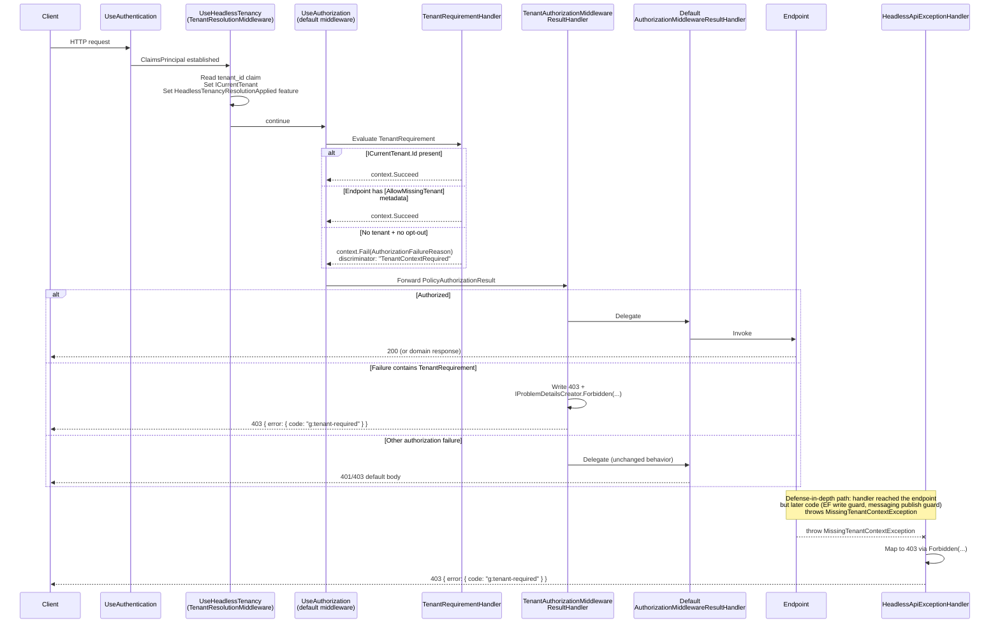

# refactor: Replace Mediator-pipeline tenant gate with ASP.NET TenantRequirement

## Summary

Replace the Mediator-pipeline tenant gate with a first-class ASP.NET authorization primitive — `TenantRequirement` — that consumers wire into `FallbackPolicy` / `DefaultPolicy`, plus an endpoint-level `[AllowMissingTenant]` opt-out and a fluent `.AllowMissingTenant()` extension on `IEndpointConventionBuilder`. The old Mediator behavior, attribute, builder, and registration hook are deleted outright (greenfield, no `[Obsolete]` cycle). Both the new auth-gate failure path and the leftover `MissingTenantContextException` mapping return 403 with the existing `g:tenant-required` ProblemDetails code, so consumers see one error shape across both. All new code lives in `Headless.Api.Core/MultiTenancy/`.

---

## Problem Frame

`TenantRequiredBehavior<,>` enforces tenant presence inside the Mediator pipeline — after model binding, validation, and dispatch. Three problems with that location: enforcement is late (abusive payloads are fully parsed before the check fires), opt-outs drift (consumers carrying both Mediator-side `[AllowMissingTenant]` and endpoint-side `.AllowAnonymous()` must keep them aligned), and the same invariant gets checked twice when both gates are wired (structurally different from the read/write defense the EF query filter + write guard provide). The right shape is a single `IAuthorizationRequirement` in `FallbackPolicy` / `DefaultPolicy`, composable with role/permission requirements and enforced by `UseAuthorization` before model binding. Data-layer guards stay; messaging propagation stays; only the dispatch-boundary check moves. (see origin: `docs/brainstorms/2026-05-18-tenancy-http-authorization-requirement-requirements.md`)

---

## Requirements Trace

Every requirement from the origin doc maps to one or more implementation units below.

| Origin | Covered by |
|---|---|
| R1 (TenantRequirement + handler) | U1 |
| R2 (succeeds when tenant present) | U1, U7 |
| R3 (succeeds with `[AllowMissingTenant]` metadata) | U1, U7 |
| R4 (structured failure reason → `g:tenant-required` ProblemDetails) | U3, U4, U7 |
| R5 (endpoint-side `[AllowMissingTenant]`) | U2, U7 |
| R6 (`.AllowMissingTenant()` extension) | U2, U7 |
| R7 (delete `TenantRequiredBehavior`) | U6 |
| R8 (delete Mediator-side attribute) | U6 |
| R9 (delete `.Mediator(...)`, `RequireTenant()`, `HeadlessMediatorTenancyBuilder`) | U6 |
| R10 (delete `AddMediatorTenantRequiredBehavior` + supporting tests) | U6 |
| R11 (remap exception 400 → 403, same code) | U3 |
| R12 (doc + README sync) | U8 |
| R13 (posture-manifest seam record) | U5 |
| AE1, AE2, AE3, AE4 | U7 |

---

## Key Technical Decisions

- **New types group under `src/Headless.Api.Core/MultiTenancy/`.** Mirrors the layout convention used elsewhere (e.g., `Headless.Permissions.Core/Requirements/`). Keeps `Headless.Api.Core` root uncluttered and makes the multi-tenancy seam discoverable as a unit.
- **`IEndpointConventionBuilder` extension lives in namespace `Microsoft.AspNetCore.Builder`.** Matches the existing precedent in `src/Headless.Api.MinimalApi/Filters/RouteBuilderExtensions.cs` (with the `IDE0130` pragma). Consumers get the extension automatically with a `using Microsoft.AspNetCore.Builder` they already have.
- **Custom `IAuthorizationMiddlewareResultHandler` decorates the effective existing handler.** ASP.NET supports only one result-handler slot, so the tenant handler intercepts tenant failures and delegates all other authorization results to the previously effective customer/default handler.
- **`IProblemDetailsCreator.Forbidden(...)` is extended for the tenant response.** The factory now accepts optional `detail` and singular `error` parameters while preserving the existing plural `errors` path. Both tenant write-sites use the same `Forbidden(detail: TenantContextRequired, error: TenantContextRequired)` call so the wire shape stays singular `error.code: g:tenant-required`.
- **`Forbidden(...)` over `IProblemDetailsCreator.Normalize()` case-arm.** `docs/solutions/api/aspnet-core-cancellation-vs-timeout-differentiation-2026-05-07.md` documents `Normalize()` as the canonical single-source-of-truth for backfilling Title/Type/Detail on bare status codes that downstream middleware sets. That pattern fits the cancellation/timeout case where `StatusCodesRewriterMiddleware` rewrites bare 4xx/5xx after the fact. This work writes the full response body directly from the auth-result handler and the exception handler — both already build a structured ProblemDetails from a typed factory rather than relying on rewrite.
- **`TenantRequirementHandler` calls `context.Fail(new AuthorizationFailureReason(...))` with a discriminator string** so the custom result handler can match the failure to a `TenantRequirement` without reflection. No precedent in the codebase for failure-reason attachment (`PermissionRequirementHandler` only calls `Succeed`); this introduces it.
- **Posture-manifest seam name is `"Authorization"`, capability `"require-tenant"`, status `Enforcing`.** Mirrors the deleted Mediator seam's enforcement vocabulary and matches the four-seam pattern documented in `src/Headless.MultiTenancy/TenantPostureManifest.cs`.
- **Pipeline ordering is unchanged.** `UseAuthentication() → UseHeadlessTenancy() → UseAuthorization()` continues to apply; the new `TenantRequirement` runs after `TenantResolutionMiddleware` has populated `ICurrentTenant`. The existing `HeadlessTenancyResolutionApplied` feature marker stays meaningful for "middleware missing" diagnostics.
- **Straight removal — no `[Obsolete]` cycle.** Confirmed by the brainstorm's greenfield posture and reinforced by `docs/solutions/messaging/transport-wrapper-drift-and-doc-sync.md` (greenfield scope rule: don't ship migration glue for unreleased modules). (see origin: Key Decisions)

---

## High-Level Technical Design

*This illustrates the intended request-time flow and is directional guidance for review, not implementation specification. The implementing agent should treat it as context, not code to reproduce.*

The new control flow on an HTTP request that hits an endpoint covered by the `TenantRequirement`:

Two write-sites converge on the same `IProblemDetailsCreator.Forbidden(detail: ..., error: ...)` call: the auth-result handler (pre-model-bind, the new canonical gate) and the exception handler (post-dispatch, for server-side guards that fire when the auth gate was bypassed by `[AllowMissingTenant]` or when the call path is non-HTTP). One factory, one wire shape.

---

## System-Wide Impact

- **`Headless.Mediator`** loses three public types (`TenantRequiredBehavior`, `AllowMissingTenantAttribute`, `HeadlessMediatorTenancyBuilder`) and one public extension method (`AddMediatorTenantRequiredBehavior`). Mediator validation + logging behaviors stay.
- **`Headless.Api.Core`** gains a `MultiTenancy/` folder with five new public types, one new `IProblemDetailsCreator` method, and a modified case in `HeadlessApiExceptionHandler`. New auth-result handler replaces the default `AuthorizationMiddlewareResultHandler` globally for apps that wire `.Authorization(a => a.RequireTenant())`.
- **`Headless.MultiTenancy`** gains a new seam record (`"Authorization"`) and loses the `"Mediator"` seam from its documented vocabulary. The `HeadlessTenancyBuilder` `.Mediator(...)` extension method disappears.
- **Documentation** sees the largest delta: `docs/llms/multi-tenancy.md` "Mediator-Boundary Enforcement" section is rewritten as "HTTP Authorization Requirement"; three README files (`Headless.Api.Core`, `Headless.Mediator`, `Headless.MultiTenancy`) need targeted edits.
- **Downstream consumers** inside this repo: none. No file under `src/` or `demo/` references the Mediator-side API except the package itself and its own tests. Greenfield clean delete.

---

## Implementation Units

### U1. `TenantRequirement` + `TenantRequirementHandler`

**Goal:** Provide the core `IAuthorizationRequirement` and its handler. Handler succeeds when `ICurrentTenant.Id` is non-empty or when the active endpoint has `[AllowMissingTenant]` metadata; otherwise it attaches a structured failure reason that the result handler in U4 can identify.

**Requirements:** R1, R2, R3 (handler-side); contributes to R4.

**Dependencies:** None — this is the first unit. Does not depend on U2 (handler reads metadata generically, not via the concrete attribute type at compile time, though U2's attribute is the metadata it expects).

**Files:**
- `src/Headless.Api.Core/MultiTenancy/TenantRequirement.cs` (create)
- `src/Headless.Api.Core/MultiTenancy/TenantRequirementHandler.cs` (create)
- `tests/Headless.Api.Tests.Unit/MultiTenancy/TenantRequirementHandlerTests.cs` (create)

**Approach:**
- `TenantRequirement` is a sealed `IAuthorizationRequirement` with no payload, similar in shape to `PermissionRequirement` but parameterless. `[PublicAPI]` per framework conventions.
- `TenantRequirementHandler : AuthorizationHandler<TenantRequirement>` injects `ICurrentTenant`. Override `HandleRequirementAsync`:
  - If `ICurrentTenant.Id` is non-empty → `context.Succeed(requirement)` and return.
  - Else look up endpoint metadata via `context.Resource as HttpContext` → `httpContext.GetEndpoint()?.Metadata.GetMetadata<AllowMissingTenantAttribute>()`. If present → `context.Succeed(requirement)`.
  - Else `context.Fail(new AuthorizationFailureReason(this, FailureReason))` where `FailureReason` is a stable string constant (e.g., `"TenantContextRequired"`). Do not throw.
- Constant for the failure-reason discriminator lives on `TenantRequirement` as a `public const string` so the result handler in U4 can match it without cross-file coupling.

**Patterns to follow:**
- `src/Headless.Permissions.Core/Requirements/PermissionRequirement.cs` for the requirement-handler pairing shape (sealed types, `AuthorizationHandler<T>` base, no extra interfaces).
- Endpoint-metadata lookup pattern: see how `Microsoft.AspNetCore.Authorization.Policy.AuthorizationMiddleware` resolves endpoint metadata; mirror the `context.Resource as HttpContext` cast.

**Test scenarios:**
- Handler succeeds when `ICurrentTenant.Id` is non-empty and no `[AllowMissingTenant]` metadata is present.
- Handler succeeds when `ICurrentTenant.Id` is empty but the endpoint has `[AllowMissingTenant]` metadata.
- Handler succeeds when both conditions are true (tenant present AND attribute present).
- Handler fails when `ICurrentTenant.Id` is empty/null/whitespace and no `[AllowMissingTenant]` metadata is present. Failure reason carries the expected discriminator string and references the requirement instance.
- `Covers AE1.` Handler succeeds when given a fake `HttpContext` with a tenant-populated `ICurrentTenant` and an endpoint without the attribute.
- `Covers AE3.` Handler succeeds when given a fake `HttpContext` with empty `ICurrentTenant` and an endpoint carrying `[AllowMissingTenant]` metadata.
- Handler does not throw when `context.Resource` is not an `HttpContext` (defensive — Mediator-style authorization could still flow through). In that case, only the tenant-id check applies.

**Verification:** Unit tests pass. New types compile with no warnings under `Headless.NET.Sdk` strict mode.

---

### U2. Endpoint-side `[AllowMissingTenant]` attribute + `.AllowMissingTenant()` extension

**Goal:** Provide the metadata attribute consumers attach to endpoints (controllers, actions, or Minimal-API routes) and the fluent `IEndpointConventionBuilder` extension that wires the attribute as endpoint metadata.

**Requirements:** R5, R6.

**Dependencies:** None — independent of U1 at compile time. The handler in U1 reads the attribute by generic metadata type so order does not matter.

**Files:**
- `src/Headless.Api.Core/MultiTenancy/AllowMissingTenantAttribute.cs` (create)
- `src/Headless.Api.Core/MultiTenancy/EndpointConventionBuilderExtensions.cs` (create — namespace `Microsoft.AspNetCore.Builder`)
- `tests/Headless.Api.Tests.Unit/MultiTenancy/EndpointConventionBuilderExtensionsTests.cs` (create)

**Approach:**
- `AllowMissingTenantAttribute` is a sealed `Attribute` with `[AttributeUsage(AttributeTargets.Class | AttributeTargets.Method, Inherited = false, AllowMultiple = false)]`. No constructor parameters, no properties. `[PublicAPI]`.
- `EndpointConventionBuilderExtensions` is a static class in namespace `Microsoft.AspNetCore.Builder` (with the `IDE0130` pragma + ReSharper namespace-mismatch suppression for consistency with `RouteBuilderExtensions`). Single public extension method `AllowMissingTenant<TBuilder>(this TBuilder builder) where TBuilder : IEndpointConventionBuilder` that calls `builder.WithMetadata(new AllowMissingTenantAttribute())` and returns `builder`.

**Patterns to follow:**
- `src/Headless.Api.Mvc/Filters/BlockInEnvironmentAttribute.cs` for the `[AttributeUsage]` flags pattern (`Class | Method`, `Inherited = false`, `AllowMultiple = false`).
- `src/Headless.Api.MinimalApi/Filters/RouteBuilderExtensions.cs` for the cross-namespace extension pattern (`namespace Microsoft.AspNetCore.Builder` with pragma).

**Test scenarios:**
- Attribute is sealed and carries the expected `AttributeUsage` flags (introspect via reflection).
- Extension method attaches an `AllowMissingTenantAttribute` instance to the convention builder's metadata. Use a stub `IEndpointConventionBuilder` that captures `Conventions` callbacks; invoke the convention against a stub `EndpointBuilder`; assert `Metadata.OfType<AllowMissingTenantAttribute>().Single()`.
- Extension is generic-constrained — calling it on `RouteHandlerBuilder` and `RouteGroupBuilder` both compile and behave identically.

**Verification:** Unit tests pass. The new namespace is reachable from any project with `using Microsoft.AspNetCore.Builder;`.

---

### U3. `Forbidden(...)` tenant response + remap exception handler 400 → 403

**Goal:** Extend `IProblemDetailsCreator.Forbidden(...)` so it can emit 403 with a custom detail and singular `error` wire shape carrying the existing `g:tenant-required` code, then update `HeadlessApiExceptionHandler` to call it (replacing the current `BadRequest(detail, error)` call) and set `Status403Forbidden`.

**Requirements:** R11; foundation for R4 (U4 also calls this factory).

**Dependencies:** None — purely additive on the creator side, single case-arm change on the handler side.

**Files:**
- `src/Headless.Api.Core/Abstractions/IProblemDetailsCreator.cs` (modify — extend `Forbidden(...)` on the interface and on the concrete `public sealed class ProblemDetailsCreator` which co-lives in the same file at line 153)
- `src/Headless.Api.Core/Middlewares/HeadlessApiExceptionHandler.cs:107-123` (modify — switch factory + status)
- `tests/Headless.Api.Tests.Unit/HeadlessApiExceptionHandlerTests.cs` (modify — update ~10 cases asserting status 400 to assert 403 with the same code)

**Approach:**
- Extend `ProblemDetails Forbidden(...)` to accept optional `detail` and singular `error` parameters alongside the existing plural `errors` collection.
- Implementation: produce a `ProblemDetails` with `Status = 403`, `Title = HeadlessProblemDetailsConstants.Titles.Forbidden`, `Detail = detail ?? HeadlessProblemDetailsConstants.Details.Forbidden`, optional `Extensions["errors"]`, and optional singular `Extensions["error"]`.
- In `HeadlessApiExceptionHandler`, the `case MissingTenantContextException missingTenant:` arm:
  - Keep the existing log calls and `HeadlessTenancyResolutionApplied` feature check.
  - Replace `problemDetailsCreator.BadRequest(detail: ..., error: ...)` with `problemDetailsCreator.Forbidden(detail: ..., error: ...)`.
  - Change `statusCode = StatusCodes.Status400BadRequest` to `StatusCodes.Status403Forbidden`.

**Patterns to follow:**
- Existing `BadRequest(string detail, ErrorDescriptor error)` for the singular-`error` Extensions pattern.

**Test scenarios:**
- `Forbidden(detail: ..., error: ...)` returns a `ProblemDetails` with `Status == 403`, `Title == "forbidden"`, `Detail == "An operation required an ambient tenant context but none was set."`, and `Extensions["error"]` deserializes to an `ErrorDescriptor` whose `Code == "g:tenant-required"`.
- `Covers AE4.` `HeadlessApiExceptionHandler` translates a raised `MissingTenantContextException` into a 403 response with the same `g:tenant-required` code (unit test against the handler; integration coverage in U7).
- Existing `HeadlessTenancyResolutionApplied`-absence log path still fires when the middleware was not invoked (preserves the diagnostic).
- Existing tests in `HeadlessApiExceptionHandlerTests.cs` that asserted 400 + `g:tenant-required` now assert 403 + `g:tenant-required`.
- The `HeadlessApiExceptionHandlerEndToEndTests` integration check at the existing line ranges still passes with the new status (covered in U7's broader integration suite, but spot-update here to keep this unit's tests green in isolation).

**Verification:** All affected `HeadlessApiExceptionHandlerTests` cases pass. The wire-shape assertion path (`error.code`) still works because the singular `error` key is preserved.

---

### U4. `TenantAuthorizationMiddlewareResultHandler`

**Goal:** Replace ASP.NET's default `IAuthorizationMiddlewareResultHandler` with a composing implementation that intercepts authorization failures carrying the `TenantRequirement` failure reason and writes the structured `g:tenant-required` ProblemDetails response (via the factory from U3). For any other failure, delegate to the default handler.

**Requirements:** R4.

**Dependencies:** U1 (failure-reason discriminator constant), U3 (`Forbidden(...)` tenant response).

**Files:**
- `src/Headless.Api.Core/MultiTenancy/TenantAuthorizationMiddlewareResultHandler.cs` (create)
- `tests/Headless.Api.Tests.Unit/MultiTenancy/TenantAuthorizationMiddlewareResultHandlerTests.cs` (create)

**Approach:**
- Sealed class implementing `IAuthorizationMiddlewareResultHandler`. Constructor takes `IProblemDetailsCreator` and a captured fallback result handler; the tenancy builder decorates the previously effective `IAuthorizationMiddlewareResultHandler` so customer handlers still see non-tenant authorization results.
- `HandleAsync(RequestDelegate next, HttpContext context, AuthorizationPolicy policy, PolicyAuthorizationResult authorizeResult)`:
  - If `authorizeResult.AuthorizationFailure?.FailedRequirements` contains a `TenantRequirement` (or `FailureReasons` contains one whose `Message == TenantRequirement.FailureReason`), write the response: set `Response.StatusCode = 403`, serialize `IProblemDetailsCreator.Forbidden(detail: ..., error: ...)`, return.
  - Otherwise delegate to the captured fallback handler.
- The exact ProblemDetails serialization helper is settled during implementation — `Headless.Api.Core` already has a path for writing structured 4xx/5xx responses (`HeadlessApiExceptionHandler` uses it). Reuse that path; do not invent a new serialization shape.

**Patterns to follow:**
- `Headless.Api.Core/Middlewares/HeadlessApiExceptionHandler.cs` for the ProblemDetails-to-response writing pattern (status code, content type, writing via `IProblemDetailsService` or its equivalent).
- ASP.NET Core's source for `AuthorizationMiddlewareResultHandler` for the default-delegation pattern.

**Test scenarios:**
- When `authorizeResult.Succeeded` is true → invokes `next(context)`, does not write a response.
- When `authorizeResult` carries a failure including a `TenantRequirement` → writes 403 with `g:tenant-required` ProblemDetails, does not invoke `next`, does not invoke default handler.
- When `authorizeResult` carries a failure with no `TenantRequirement` (e.g., bare `RequireAuthenticatedUser` failure) → delegates to the default handler; response is whatever ASP.NET default writes.
- `Covers AE2.` Failure path produces the expected 403 + structured code body when assembled with a stub `HttpContext`.
- When `authorizeResult` has a forbidden result with no failure reasons at all → delegates to default (defensive — failures without reasons are possible).
- Result handler does not double-write — if the default handler is delegated to, the wrapper does not also write headers.

**Verification:** Unit tests pass. Behavior under default delegation is observably identical to ASP.NET defaults when no `TenantRequirement` is in play.

---

### U5. `.Authorization(...)` setup extension on `HeadlessTenancyBuilder`

**Goal:** Wire all the new pieces from U1–U4 through the existing `HeadlessTenancyBuilder` composition. Consumers write `.Authorization(a => a.RequireTenant())` alongside the existing `.Http(...)`, `.Messaging(...)`, `.EntityFramework(...)` calls. Records the new posture seam.

**Requirements:** R13; integrates R1–R6 wire-up.

**Dependencies:** U1, U2, U3, U4.

**Files:**
- `src/Headless.Api.Core/SetupApiTenancy.cs` (modify — add `.Authorization(...)` extension method and `HeadlessAuthorizationTenancyBuilder` class alongside the existing `HeadlessHttpTenancyBuilder`)
- `tests/Headless.Api.Tests.Unit/SetupApiTenancyTests.cs` (modify or create — verify the new builder, idempotent registration, and seam record)

**Approach:**
- Add to `SetupApiTenancy.cs`:
  - `public static HeadlessTenancyBuilder Authorization(this HeadlessTenancyBuilder builder, Action<HeadlessAuthorizationTenancyBuilder> configure)` — mirrors the shape of the existing `.Http(...)` extension.
  - `public sealed class HeadlessAuthorizationTenancyBuilder` exposing constants (`public const string Seam = "Authorization"`, `public const string RequireTenantCapability = "require-tenant"`) and a fluent `RequireTenant()` method.
  - `RequireTenant()` performs (via `TryAddEnumerable` / `TryAddSingleton` per the framework's library-DI conventions):
    - `services.TryAddEnumerable(ServiceDescriptor.Singleton<IAuthorizationHandler, TenantRequirementHandler>())`
    - `services.AddSingleton<IAuthorizationMiddlewareResultHandler, TenantAuthorizationMiddlewareResultHandler>()` — this replaces the default handler. Idempotency note: ASP.NET allows only one slot; calling `.RequireTenant()` twice should not register twice. Use a guard or rely on the host `services.Replace` pattern; settle the exact registration call during implementation.
    - `builder.RecordSeam(Seam, TenantPostureStatus.Enforcing, RequireTenantCapability)`.

**Patterns to follow:**
- `src/Headless.Api.Core/SetupApiTenancy.cs` `Http(...)` extension and `HeadlessHttpTenancyBuilder` class shape (lines 58–156). Mirror the constants pattern, the `TryAdd*` registration discipline, and the `RecordSeam` call site at the end of the configuration method.

**Test scenarios:**
- Calling `.AddHeadlessTenancy(t => t.Authorization(a => a.RequireTenant()))` registers `TenantRequirementHandler` exactly once as `IAuthorizationHandler` (assert via `ServiceCollection` inspection).
- Calling `.RequireTenant()` twice does not double-register the handler or double-replace the result handler.
- The posture manifest contains a `"Authorization"` seam with `TenantPostureStatus.Enforcing` and the `"require-tenant"` capability after `RequireTenant()` is invoked.
- Composition with other seams (`.Http(...)`, `.Messaging(...)`) coexists — the manifest carries all configured seams.

**Verification:** Unit tests pass. The setup surface compiles with no warnings.

---

### U6. Delete Mediator-side tenant pieces

**Goal:** Remove all Mediator-pipeline tenant-gate code, attribute, builder, registration hook, and tests. No `[Obsolete]` markers — straight delete per greenfield rule.

**Requirements:** R7, R8, R9, R10.

**Dependencies:** U5 (so the replacement is live before the old code is removed — strictly speaking units can land in any order since there are no internal consumers, but ordering U6 after U5 keeps the framework's tenancy seams continuously functional and lets the test suite stay green between commits).

**Files (delete):**
- `src/Headless.Mediator/Behaviors/TenantRequiredBehavior.cs`
- `src/Headless.Mediator/AllowMissingTenantAttribute.cs`
- `src/Headless.Mediator/SetupMediatorTenancy.cs`
- `tests/Headless.Mediator.Tests.Unit/TenantRequiredBehaviorTests.cs`
- `tests/Headless.Mediator.Tests.Unit/AllowMissingTenantAttributeTests.cs`

**Files (modify):**
- `src/Headless.Mediator/Setup.cs` — remove `AddMediatorTenantRequiredBehavior()` extension only; keep `MediatorSetup` validation and logging registrations.
- `tests/Headless.Mediator.Tests.Unit/MediatorSetupTests.cs` — prune tenant-related tests; keep validation/logging coverage.

**Approach:**
- Use `git rm` (or file deletion + commit) for the four to-be-deleted files. Pre-flight: confirm no `using Headless.Mediator;` consumer references `TenantRequiredBehavior`, `AllowMissingTenantAttribute`, `HeadlessMediatorTenancyBuilder`, or `AddMediatorTenantRequiredBehavior` outside the package itself (research already verified zero hits in `src/` and `demo/`; re-verify before deletion).
- In `Setup.cs`, locate and remove the `AddMediatorTenantRequiredBehavior` extension method and any `[PublicAPI]` doc comments scoped to it. Do not delete the surrounding `MediatorSetup` class.
- In `MediatorSetupTests.cs`, delete the following tests (per research findings):
  - `should_register_tenant_required_behavior_once`
  - `should_register_tenant_required_behavior_idempotently`
  - `should_register_tenant_required_behavior_from_headless_tenancy_root`
  - Any null-services test scoped to the tenant behavior registration
  - The two behavior-dispatch tests duplicated in this file
  - The helpers that exist solely to support these tests
- Remove any `using Headless.Abstractions;` or other imports that become unused after the prune.

**Patterns to follow:** N/A — straightforward deletion. Match existing test-file style for the remaining tests.

**Test scenarios:**
- Solution builds with no warnings after the deletions and prune.
- `Headless.Mediator.Tests.Unit` runs green with the pruned `MediatorSetupTests.cs`.
- `dotnet build --no-incremental` produces no analyzer warnings about unused usings in `Setup.cs`.

**Test expectation: none for the deletion side itself** — the removed code's existing tests are deleted with it; the modified `Setup.cs` retains its coverage via the remaining validation/logging tests.

**Verification:** Repo-wide grep for the deleted symbols returns zero hits. Mediator and Api test projects build and pass.

---

### U7. Integration tests for HTTP authorization path

**Goal:** End-to-end integration coverage for the new auth gate, the endpoint opt-outs, and the exception remap. Follows the repo's existing integration-test pattern (no `WebApplicationFactory<T>`).

**Requirements:** R1–R6, R11 (end-to-end verification); covers AE1–AE4.

**Dependencies:** U1, U2, U3, U4, U5 — the integration test exercises the full wiring.

**Execution note:** Start with a failing integration test for the request/response contract (AE2: missing tenant → 403 + `g:tenant-required`) before implementing U4's result handler, to keep the end-to-end behavior honest.

**Files:**
- `tests/Headless.Api.Tests.Integration/TenantRequirementTests.cs` (create)

**Approach:**
- Follow the pattern in `tests/Headless.Api.Tests.Integration/TenantResolutionMiddlewareTests.cs`: a `_CreateAppAsync` helper that builds a `WebApplication` with `WebApplication.CreateBuilder`, `UseUrls("http://127.0.0.1:0")`, real `AddAuthentication`/`AddAuthorization` with a `FallbackPolicy` that includes `TenantRequirement`, calls `AddHeadlessTenancy(t => t.Http(...).Authorization(a => a.RequireTenant()))`, configures a Minimal-API and an MVC endpoint, and starts via `app.StartAsync(AbortToken)`. Tests then make plain `HttpClient` calls against `app.Urls.Single()`.
- Reuse `TestAuthenticationHandler` from `TenantResolutionMiddlewareTests.cs:441-473` (`X-Test-User`, `X-Test-Tenant`, `X-Test-Unauthenticated` header convention). Lift into a shared helper if duplication becomes a maintenance issue; copy-paste is acceptable per current repo style.
- One throwing endpoint that calls `throw new MissingTenantContextException()` covers AE4 (exception-handler remap path).

**Patterns to follow:**
- `tests/Headless.Api.Tests.Integration/TenantResolutionMiddlewareTests.cs` (app builder helper, header-driven auth handler).
- `tests/Headless.Api.Tests.Integration/HeadlessApiExceptionHandlerEndToEndTests.cs` (MVC + Minimal-API parity coverage, throwing endpoints, wire-shape assertions on `error.code`).

**Test scenarios:**
- `Covers AE1.` Authenticated user with `tenant_id` claim hits a Minimal-API endpoint under the default policy → 200, handler observes populated `ICurrentTenant`.
- `Covers AE2.` Authenticated user **without** `tenant_id` claim hits the same endpoint → 403, response body deserializes to ProblemDetails with `error.code == "g:tenant-required"`, `Status == 403`, `Title == "forbidden"`.
- `Covers AE3.` Authenticated user without `tenant_id` claim hits an endpoint marked `.AllowMissingTenant()` → 200.
- `Covers AE3.` Authenticated user without `tenant_id` claim hits an MVC action carrying `[AllowMissingTenant]` → 200 (MVC parity).
- `Covers AE4.` Authenticated user with `tenant_id` claim hits a throwing endpoint that raises `MissingTenantContextException` (simulating an EF write-guard or messaging-publish-guard failure) → 403 with `error.code == "g:tenant-required"` (exception-handler remap path).
- Unauthenticated request to a tenant-required endpoint → 401 (default ASP.NET behavior — confirms the result handler does not capture non-tenant failures).
- Authenticated user without `tenant_id` claim hits an endpoint requiring **both** `TenantRequirement` and a permission requirement (composed policy) → 403 with the tenant code (tenant failure is surfaced; permission failure is not double-reported). If both fail, the tenant code wins because the result handler matches on the tenant failure reason.
- Composed policy where the tenant requirement passes but the permission requirement fails → 403 with the default ASP.NET forbidden body (no tenant code), proving the result handler delegates correctly.

**Verification:** Integration tests pass. Wire shapes match across Minimal-API and MVC pipelines. Manual smoke (skill scope: not run from this plan) optional.

---

### U8. Documentation + README sync

**Goal:** Bring all human- and LLM-facing docs in line with the new shape. Remove every reference to `.Mediator(...).RequireTenant()`, `TenantRequiredBehavior`, and the Mediator-side `AllowMissingTenantAttribute`. Document the new canonical wiring.

**Requirements:** R12.

**Dependencies:** U1–U7 (docs should describe the final landed shape).

**Files (modify):**
- `docs/llms/multi-tenancy.md` — primary rewrite target. Lines 33, 46, 67 (Mediator references in overview/canonical setup), 151 (the nonexistent `TenantRequired()` factory — now exists per U3, so the doc is accurate after U3 lands), 153–198 (the "Mediator-Boundary Enforcement" section: rewrite as "HTTP Authorization Requirement"). Add a section describing `.Authorization(a => a.RequireTenant())`, `FallbackPolicy` wiring, `[AllowMissingTenant]` + `.AllowMissingTenant()`, and the unified 403 + `g:tenant-required` response.
- `src/Headless.Api.Core/README.md` — add a section documenting the new HTTP authorization-tenant primitives (`TenantRequirement`, `[AllowMissingTenant]`, `.AllowMissingTenant()`, `.Authorization(...)`).
- `src/Headless.MultiTenancy/README.md` — lines 16, 37 (replace `.Mediator(...)` examples with `.Authorization(...)`); update the seam vocabulary list (`Http`, `Authorization`, `Messaging`, `EntityFramework`).
- `src/Headless.Mediator/README.md` — lines 12, 13 (remove `TenantRequiredBehavior` and Mediator-side `[AllowMissingTenant]` from key features); 36–39 (remove tenant Quick Start); 50–69 (remove Failure Behavior + opt-out section); 76 (remove `AddMediatorTenantRequiredBehavior`); 86–95 (revise Pipeline Ordering — auth-then-tenant note no longer applies); 145–157 (remove Service Lifetime example for the tenant behavior); 160–169 (remove the second Failure Behavior section). Net: the Mediator README shrinks; what remains documents validation, logging, and dispatch only.

**Approach:**
- Pre-flight grep: `rg -n '\.Mediator\(|TenantRequiredBehavior|AllowMissingTenantAttribute|AddMediatorTenantRequiredBehavior|HeadlessMediatorTenancyBuilder|RequireTenant\(' docs/ src/Headless.*/README.md` — exhaustive list before editing.
- For each hit, decide: rewrite (canonical-wiring example → new shape), delete (removed feature reference), or leave (e.g., references inside `docs/brainstorms/` or `docs/plans/` are historical artifacts and stay).
- Cross-reference the brainstorm doc's "Outstanding Questions → Deferred to Planning → Q4" (doc-sweep list) — research already supplied the canonical list; this unit executes it.
- Keep the rewritten `docs/llms/multi-tenancy.md` section concise and code-sample-bearing (Minimal-API + MVC examples for `[AllowMissingTenant]` / `.AllowMissingTenant()`).

**Patterns to follow:**
- Existing structure of `docs/llms/multi-tenancy.md` — preserve the section ordering, the `## HTTP Tenant Resolution` style of header, and the code-fence conventions.

**Test scenarios:**
**Test expectation: none — this is a documentation unit.** Verification is by grep (zero hits for removed symbols) and visual review.

**Verification:** Repo-wide grep for `TenantRequiredBehavior`, `AddMediatorTenantRequiredBehavior`, `HeadlessMediatorTenancyBuilder`, `.Mediator(`, and the Mediator-side `[AllowMissingTenant]` returns zero hits outside `docs/brainstorms/` and `docs/plans/`. The `docs/llms/multi-tenancy.md` "Mediator-Boundary Enforcement" section is replaced. README files compile with the new pieces named.

---

## Scope Boundaries

### Deferred to Follow-Up Work

- Capturing a `docs/solutions/` learning entry for the framework's first `IAuthorizationMiddlewareResultHandler` + structured-failure-reason pattern. The learnings researcher flagged this as a gap worth documenting after the design stabilizes.
- Lifting `TestAuthenticationHandler` from `TenantResolutionMiddlewareTests.cs` into a shared `Headless.Testing` helper. Today it is inlined per test class; the second occurrence (in U7) is acceptable copy-paste, but the third would warrant extraction.

### Not in scope (carried from origin)

- `TenantScopedJob<T>` abstraction and other non-HTTP scope helpers for background jobs.
- A `RequireAuthBehavior<,>` / `[RequireAuth]` Mediator equivalent. `RequireAuthorization(...)` on endpoints + `IAuthorizationService` for resource-based ABAC remain canonical.
- Changes to `MultiTenantFilter`, the EF tenant write guard, or `CrossTenantWriteException`.
- Changes to `TenantPropagationConsumeFilter` for messaging.
- Composite policies (role + tenant, permission + tenant) — consumers compose those themselves with `AuthorizationPolicyBuilder`.
- A `[Obsolete]` deprecation cycle for the deleted Mediator types.

(see origin: Scope Boundaries)

---

## Dependencies / Assumptions

- ASP.NET Core (`Microsoft.AspNetCore.App` framework reference) on .NET 10 — confirmed via `src/Headless.Api.Core/Headless.Api.Core.csproj`.
- The framework's existing problem-details serialization path (used by `HeadlessApiExceptionHandler`) is reachable from a custom `IAuthorizationMiddlewareResultHandler`. **Assumption — verify during U4 implementation; if the serialization path requires an HTTP exception-handler context, the result handler will write the response inline using `IProblemDetailsService` or the underlying JSON serializer.**
- `UseHeadlessTenancy()` runs between `UseAuthentication()` and `UseAuthorization()` in the canonical pipeline — confirmed by `src/Headless.Api.Core/SetupApiTenancy.cs:75-77` doc and integration-test wiring.
- No consumer (inside this repo) depends on the deleted Mediator-side API. Verified by repo-wide grep during research; re-verify before U6.
- The integration-test project (`Headless.Api.Tests.Integration`) targets the same framework version as `Headless.Api.Core` and can reference the new types without additional package references — confirmed via the project file's `ProjectReference` to `Headless.Api.Demo`/`Headless.Api.MinimalApi` (which transitively pull `Headless.Api.Core`).

---

## Outstanding Questions

### Deferred to Implementation

- [Affects U4][Technical] The exact serialization helper the result handler uses to write the ProblemDetails — `IProblemDetailsService` vs. inline JSON via `JsonSerializer` vs. delegating to the framework's existing response-writing helper. Settle while implementing U4; the brainstorm flagged this as a planning-time question that the research narrowed but did not fully resolve.
- [Affects U5][Technical] Whether `RequireTenant()` should use `services.Replace` or `services.AddSingleton` (or another pattern) for the single-slot `IAuthorizationMiddlewareResultHandler` to guarantee idempotency under double-registration. Both work; pick the one most consistent with the rest of `Headless.Api.Core` registration code.
