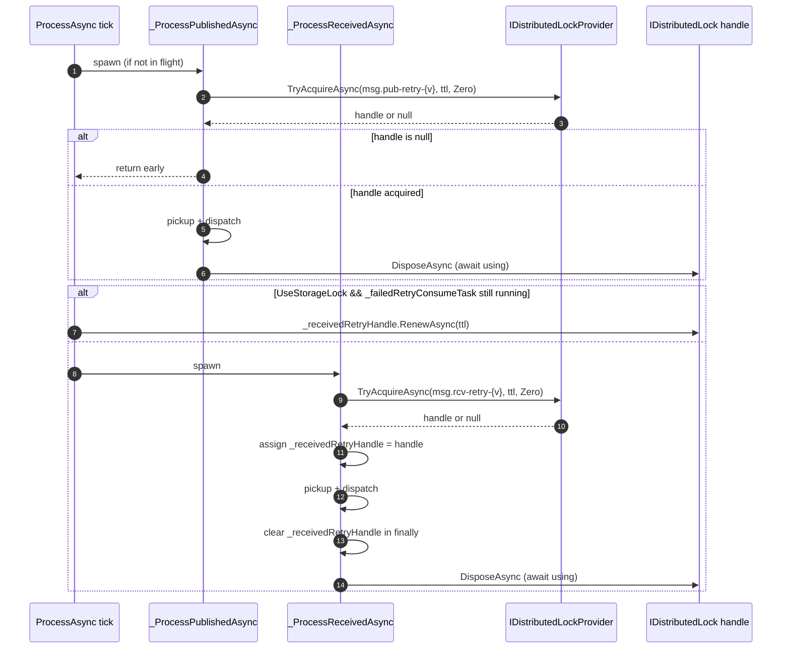

# refactor(messaging): adopt IDistributedLockProvider for coarse-grained retry lock

## Summary

Replace the named-lock primitives on `IDataStorage` (`AcquireLockAsync` /
`ReleaseLockAsync` / `RenewLockAsync`) with the framework's `IDistributedLockProvider`
for the retry-processor coarse mutex. Ship an internal no-op `IDistributedLockProvider`
as a `TryAddSingleton` fallback so messaging does not require a user-registered lock
provider — consumers opt into real cross-process coordination by registering
`Headless.DistributedLocks.Redis` (or another provider). Per-row `LockedUntil` leases
(`LeasePublishAsync` / `LeaseReceiveAsync`) are untouched.

## Problem Frame

Messaging carries its own ~50 LOC of lock SQL per provider, plus a dedicated lock table
in storage initializers, plus an `_instance` identity field — duplicating
`Headless.DistributedLocks.Abstractions` for a single consumer
(`MessageNeedToRetryProcessor`). The framework already has a richer handle-based
lock abstraction with renewal, inspection, metrics, and diagnostics. Adopting it removes
duplication without changing correctness (per-row `LockedUntil` lease is the actual
correctness primitive) and establishes the canonical pattern that `Headless.Jobs` will
follow next (issue #263 P4).

## Scope Boundaries

**In scope:**
- Remove the lock surface from `IDataStorage` and all three storage implementations.
- Remove the lock table DDL + `IStorageInitializer.GetLockTableName()`.
- Rewrite `MessageNeedToRetryProcessor` against `IDistributedLockProvider`, preserving
  receive-retry renewal via the handle (Option 1 from the origin brainstorm).
- Ship an internal `NoOpDistributedLockProvider` and register as fallback.
- Bootstrapper startup warning when `UseStorageLock = true` resolves the no-op fallback.
- Update `Headless.Messaging.Core/README.md`, `docs/llms/messaging.md`, and
  `docs/llms/distributed-locks.md`.

**Out of scope:**
- Per-row lease semantics (`MediumMessage.LockedUntil`, `LeasePublishAsync`,
  `LeaseReceiveAsync`). Different concept; stays on `IDataStorage`.
- Changing the `UseStorageLock` default (stays `false`).
- Adopting the same pattern in `Headless.Jobs` (P4 reference, separate issue).
- A SQL-backed `IDistributedLockProvider` (would re-introduce duplication).

### Deferred to Follow-Up Work

- Apply the same `IDistributedLockProvider` + no-op-fallback pattern in `Headless.Jobs`
  per issue #263 P4.

---

## Requirements Traceability

Sourced from the origin requirements doc (see origin:
`docs/brainstorms/2026-05-18-messaging-adopt-distributed-lock-provider-requirements.md`):

| Origin requirement | Plan coverage |
|---|---|
| Delete named-lock methods from `IDataStorage` | U1 |
| Delete provider lock SQL | U2 |
| Delete lock table DDL + `GetLockTableName()` | U3 |
| Ship `NoOpDistributedLockProvider` + `TryAdd` fallback | U4 |
| Rewrite `MessageNeedToRetryProcessor` (Option 1 handle renewal) | U5 |
| Bootstrapper startup warning on no-op fallback | U6 |
| Resource naming `messaging.<op>-<version>` | U5 |
| Integration tests: mutual exclusion, cross-tick renewal, no-op-fallback warning | U7 |
| README + `docs/llms` documentation | U8 |

---

## Key Technical Decisions

### Renewal path: capture handle, parent renews (Option 1)

The receive-retry consume task spans multiple polling cycles when work is heavy. Today,
`ProcessAsync` renews the lock once per polling tick via
`_dataStorage.RenewLockAsync(...)`. Preserve this with:

- `_ProcessReceivedAsync` writes the acquired `IDistributedLock` into a field
  (`_receivedRetryHandle`) before doing work; clears it in `finally`.
- `ProcessAsync` reads the field and calls `_receivedRetryHandle.RenewAsync(_GetLockTtl(), ct)`
  on each tick where the task is still running.
- Field is single-writer (the task) and single-reader (`ProcessAsync`, invoked
  sequentially per processor instance). A stale-read at the task-end boundary just means
  one skipped renewal cycle, which the next tick re-renews.

Rejected alternatives are recorded in the origin brainstorm (self-renewing task,
drop-renewal-size-TTL-to-fit, drop-renewal-and-guard).

### Provider availability: no-op fallback (Option C)

Rejected hard DI fail-fast (Option A) and full coarse-lock removal (Option B). Trade-off
analysis recorded in the origin brainstorm. Key implementation points:

- `Headless.Messaging.Core` ships `internal sealed class NoOpDistributedLockProvider`
  implementing `IDistributedLockProvider`. All operations succeed and return no-op state.
- Registered via `TryAddSingleton<IDistributedLockProvider, NoOpDistributedLockProvider>()`
  inside `SetupMessaging._RegisterCoreMessagingServices`. The `TryAdd` ensures a
  user-registered provider (e.g., via `services.AddDistributedLocks().UseRedis(...)`)
  wins. Order independence: this works regardless of whether
  `services.AddHeadlessMessaging(...)` is called before or after
  `services.AddDistributedLocks(...)`, because both use `TryAdd*` for the provider — the
  first registration sticks.
- `MessageNeedToRetryProcessor` always injects `IDistributedLockProvider` (no
  nullable / optional dependency).
- `Bootstrapper` resolves the provider at startup and, when `UseStorageLock = true` and
  the resolved type is `NoOpDistributedLockProvider`, logs a `Warning` once. No
  exception.

### Acquire semantics

`acquireTimeout: TimeSpan.Zero` produces try-once-no-wait behavior across all real
providers — verified against `DistributedLockProvider.TryAcquireAsync` at
`src/Headless.DistributedLocks.Core/RegularLocks/DistributedLockProvider.cs:70-78`
(the `CancellationTokenSource(TimeSpan.Zero)` fires immediately; the do-while loop
breaks after the first storage call). Redis and Cache backends share this same `Core`
provider class — they only differ in `IDistributedLockStorage` implementation.

### Lock store vs data store may differ

Coarse lock is an efficiency / observability primitive, not a correctness primitive.
Per-row `LockedUntil` lease (atomic claim-and-return inside the data store) handles
correctness. The plan does not require lock store and data store to share a backend.
This is documented in `docs/llms/messaging.md` per U8.

---

## High-Level Technical Design

*Directional guidance for review, not implementation specification. The implementing agent should treat it as context, not code to reproduce.*

### Lock acquisition lifecycle



### Provider resolution at startup

```text
Container resolves IDistributedLockProvider at SetupMessaging:
- If user registered AddDistributedLocks() (or any IDistributedLockProvider via TryAdd
  or Add): TryAdd in messaging is a no-op → user's provider wins.
- If no user registration: TryAdd in messaging registers NoOpDistributedLockProvider →
  fallback wins.

Bootstrapper at StartAsync:
- Resolve IDistributedLockProvider.
- If UseStorageLock == true and resolved instance is NoOpDistributedLockProvider →
  log Warning: "UseStorageLock = true but no real IDistributedLockProvider is registered;
  coarse-grained mutual exclusion is disabled. Register a real provider (e.g.,
  Headless.DistributedLocks.Redis) or set UseStorageLock = false to silence this warning."
- Otherwise: no log.
```

---

## Implementation Units

### U1. Remove lock surface from `IDataStorage`

**Goal:** Delete the three named-lock methods from the messaging persistence contract.

**Dependencies:** None.

**Files:**
- `src/Headless.Messaging.Core/Persistence/IDataStorage.cs`

**Approach:**
- Remove `AcquireLockAsync`, `ReleaseLockAsync`, `RenewLockAsync` from the interface.
- Per-row `LeasePublishAsync` / `LeaseReceiveAsync` stay — different concept, not in scope.

**Test scenarios:** none — pure interface deletion. Downstream compile failures in U2 and
U5 confirm the surface has been removed correctly.

**Verification:** `dotnet build` for `Headless.Messaging.Core` succeeds after U2 / U5 land.

---

### U2. Remove lock implementations from storage providers

**Goal:** Delete the lock SQL and lock-table state from the three storage implementations.

**Dependencies:** U1 (interface change drives the implementation deletion).

**Files:**
- `src/Headless.Messaging.InMemoryStorage/InMemoryDataStorage.cs`
- `src/Headless.Messaging.PostgreSql/PostgreSqlDataStorage.cs`
- `src/Headless.Messaging.SqlServer/SqlServerDataStorage.cs`

**Approach:**
- Remove `AcquireLockAsync`, `ReleaseLockAsync`, `RenewLockAsync` method bodies in all
  three. ~50 LOC per provider as the origin issue noted.
- Remove the `private readonly string _lockTable = initializer.GetLockTableName();` field
  in the Postgres and SqlServer providers.
- Remove any `initializer.GetLockTableName()` usages (cleared by U3).

**Patterns to follow:** Mirror today's deletion-only pattern — no replacement primitives.

**Test scenarios:** none — pure deletion. Tests are exercised at U5/U7.

**Verification:** Each `Headless.Messaging.*` storage project compiles without the
removed methods.

---

### U3. Remove lock-table DDL and `GetLockTableName()`

**Goal:** Delete the seed `CREATE TABLE` / `INSERT` blocks and the
`IStorageInitializer.GetLockTableName()` contract.

**Dependencies:** U2 (storage providers must stop calling `GetLockTableName()` first).

**Files:**
- `src/Headless.Messaging.Core/Persistence/IStorageInitializer.cs`
- `src/Headless.Messaging.InMemoryStorage/InMemoryStorageInitializer.cs`
- `src/Headless.Messaging.PostgreSql/PostgreSqlStorageInitializer.cs`
- `src/Headless.Messaging.SqlServer/SqlServerStorageInitializer.cs`

**Approach:**
- Delete `GetLockTableName()` from the interface and all three implementations.
- Delete the `CREATE TABLE IF NOT EXISTS … Lock(...)` block plus the seed
  `INSERT INTO … VALUES('publish_retry_…',...)` / `('received_retry_…',...)` statements
  from Postgres and SqlServer initializers (see today's
  `PostgreSqlStorageInitializer.cs:246-252` and `SqlServerStorageInitializer.cs:249-273`).
- Delete the corresponding parameter constants used only for the lock-table seed.
- Greenfield framework — no `DROP TABLE` migration script required.

**Test scenarios:** none — schema-shape change covered by existing initializer tests
that exercise `InitializeAsync` end-to-end. If a test asserts the lock table exists,
update or delete it.

**Verification:** Initializer integration tests pass; the lock table is no longer
created.

---

### U4. Ship `NoOpDistributedLockProvider` and wire as fallback

**Goal:** Provide an internal no-op `IDistributedLockProvider` implementation registered
via `TryAddSingleton` so messaging works without a user-registered real provider.

**Dependencies:** U1 (interface deletion landed) — strictly speaking independent, but
keeping them ordered avoids transient build state.

**Files:**
- `src/Headless.Messaging.Core/Internal/NoOpDistributedLockProvider.cs` (new)
- `src/Headless.Messaging.Core/Headless.Messaging.Core.csproj` (add reference to
  `Headless.DistributedLocks.Abstractions`)
- `src/Headless.Messaging.Core/Setup.cs` (register fallback)

**Approach:**
- New `internal sealed class NoOpDistributedLockProvider : IDistributedLockProvider`
  whose `TryAcquireAsync` always returns a no-op `IDistributedLock` (lockId = a fixed
  sentinel like `"noop"`, `Resource` = the requested resource, all renew/release/dispose
  succeed). All inspection methods (`IsLockedAsync`, `GetLockInfoAsync`,
  `ListActiveLocksAsync`, `GetActiveLocksCountAsync`) return empty/false/zero.
- The inner no-op handle is a private nested class. `RenewAsync` returns `true`,
  `ReleaseAsync` / `DisposeAsync` complete synchronously.
- Register in `SetupMessaging._RegisterCoreMessagingServices` via
  `services.TryAddSingleton<IDistributedLockProvider, NoOpDistributedLockProvider>()`.
  Place it among the existing `TryAddSingleton` block (around the
  `TryAddSingleton<MessageNeedToRetryProcessor>()` line at `Setup.cs:138`).
- The `internal` visibility matches project conventions (per `CLAUDE.md`: "keep types
  `internal sealed`"). Do not annotate `[PublicAPI]` — this is not part of the
  package's public surface.

**Patterns to follow:**
- `internal sealed` + primary constructor where it fits cleanly (per project `CLAUDE.md`
  conventions on naming and design).
- File header `// Copyright (c) Mahmoud Shaheen. All rights reserved.` per repo
  convention.
- `[PublicAPI]` NOT applied — internal type.

**Test scenarios:**
- `should_return_non_null_handle_when_TryAcquireAsync_called` — happy path; verify
  resource and lockId on the returned handle.
- `should_succeed_when_RenewAsync_called_on_handle` — returns true.
- `should_be_safe_to_DisposeAsync_multiple_times` — idempotent.
- `should_return_empty_list_when_ListActiveLocksAsync_called` — observability methods
  honour the "nothing tracked" contract.

**Test file:** `tests/Headless.Messaging.Core.Tests.Unit/NoOpDistributedLockProviderTests.cs`
(new).

**Verification:** Unit tests pass; `Headless.Messaging.Core` compiles with the new
project reference; messaging can be wired without a user-registered lock provider.

---

### U5. Rewrite `MessageNeedToRetryProcessor` against `IDistributedLockProvider`

**Goal:** Replace the `IDataStorage` lock calls with `IDistributedLockProvider` +
handle-based renewal (Option 1).

**Dependencies:** U1, U4.

**Files:**
- `src/Headless.Messaging.Core/Processor/IProcessor.NeedRetry.cs`

**Approach:**
- **Constructor:** add `IDistributedLockProvider lockProvider` parameter; assign to
  a `_lockProvider` field. Remove the `_instance` field and its
  `SnowflakeIdLongIdGenerator` initialization (no longer needed — the handle owns owner
  identity).
- **Add a new `_receivedRetryHandle` field** of type `IDistributedLock?`, used only by
  the receive-retry path. Single-writer / single-reader by the threading contract in the
  file's existing comment (lines 40-49) — `ProcessAsync` is sequential per processor
  instance, the consume task assigns the field before doing work and clears it in
  `finally`.
- **`_ProcessPublishedAsync` rewrite:**
  - When `_options.Value.UseStorageLock == false`: call `_RunPublishedWorkAsync(...)`
    directly. Today's behavior preserved (no lock involvement).
  - When `true`: `await using var handle = await _lockProvider.TryAcquireAsync(
    $"messaging.publish-retry-{_options.Value.Version}", _GetLockTtl(), TimeSpan.Zero, ct);`
    Return early if `handle is null`. Otherwise run the work inside the `await using`
    scope.
  - Extract the existing in-method work (pickup + dispatch loop) into
    `_RunPublishedWorkAsync` so both branches share it.
- **`_ProcessReceivedAsync` rewrite:**
  - Same `UseStorageLock = false` early-skip pattern.
  - When `true`: `var handle = await _lockProvider.TryAcquireAsync(
    $"messaging.receive-retry-{_options.Value.Version}", _GetLockTtl(), TimeSpan.Zero, ct);`
    Return early if `handle is null`.
  - Inside a try / finally: assign `_receivedRetryHandle = handle`; run the existing
    work loop; in `finally` clear `_receivedRetryHandle = null` and dispose the handle
    (`await handle.DisposeAsync()`).
- **`ProcessAsync` renewal site** (today `IProcessor.NeedRetry.cs:174-188`):
  - When `UseStorageLock && _failedRetryConsumeTask is { IsCompleted: false }`:
    - If `_receivedRetryHandle is not null`: `await _receivedRetryHandle.RenewAsync(
      _GetLockTtl(), context.CancellationToken);` Swallow `LockNotHeldException`-style
      "no longer owner" results — the next tick will re-acquire.
    - Then `await context.WaitAsync(...)` and `return`, as today.
- **Resource naming:** lock resources are `messaging.publish-retry-{Version}` and
  `messaging.receive-retry-{Version}`. Names live as inline interpolations at the
  call sites — small enough not to warrant constants.
- **Race-condition handling.** Three real interleavings the renewal field can hit:
  1. Field is read in `ProcessAsync` *after* the task wrote it but *before* it cleared
     in `finally` — renewal call succeeds, expected path.
  2. Field is read while the task hasn't yet assigned it (race between `Task.Factory.StartNew`
     and the first tick): field reads `null`, parent skips renewal, next tick handles it.
  3. Field is read after the task cleared it in `finally` and the next tick is in
     `ProcessAsync`: `_failedRetryConsumeTask is { IsCompleted: false }` is `false`
     because the task is complete → renewal branch doesn't fire. No stale-handle call.

  No `Interlocked` / `Volatile` needed because the field is `IDistributedLock?` (a
  reference, single-word atomic on .NET) and the existing threading contract documents
  `ProcessAsync` as sequential per processor.

**Execution note:** test-first. Start by writing the integration test in U7 that asserts
mutual exclusion via two `MessageNeedToRetryProcessor` instances against a real provider;
let it red-then-green this rewrite.

**Patterns to follow:**
- `await using var handle = ...` idiom matches `IDistributedLock : IAsyncDisposable`.
- Existing `_GetSafelyAsync` failure-isolation pattern stays.
- Existing source-generated logger pattern (`RetryProcessorLog`) — add a `LockAcquireFailed`
  or similar logger message only if the implementer encounters a real need; usually the
  storage / lock provider's own log lines are sufficient.

**Test scenarios:**

*Unit-level behavior* (in `MessageNeedToRetryProcessorTests`):
- `should_skip_TryAcquireAsync_when_UseStorageLock_is_false` — given an
  `NSubstitute`-substituted `IDistributedLockProvider`, processor never calls it.
- `should_call_TryAcquireAsync_with_expected_resource_name_when_UseStorageLock_is_true` —
  asserts `messaging.publish-retry-{Version}` / `messaging.receive-retry-{Version}`,
  `acquireTimeout: TimeSpan.Zero`, and `timeUntilExpires: _GetLockTtl()`.
- `should_return_early_when_TryAcquireAsync_returns_null` — `_dispatcher.EnqueueToPublish`
  is never called.
- `should_renew_received_retry_handle_when_consume_task_is_still_running` — drive
  `ProcessAsync` twice while holding the consume task open; assert
  `handle.RenewAsync(_)` is called once on tick 2.
- `should_not_renew_when_receivedRetryHandle_is_null` — race-window 2 above; no exception.
- `should_clear_receivedRetryHandle_in_finally_even_if_work_throws` — exception inside
  the dispatch loop still nulls the field before propagation.

*Integration-level behavior* is covered in U7.

**Verification:** All unit tests in `tests/Headless.Messaging.Core.Tests.Unit` pass.

---

### U6. Bootstrapper startup warning on no-op fallback

**Goal:** Surface the misconfiguration where `UseStorageLock = true` but no real
`IDistributedLockProvider` was registered — log a `Warning` once at startup, no
exception.

**Dependencies:** U4.

**Files:**
- `src/Headless.Messaging.Core/Internal/IBootstrapper.Default.cs`

**Approach:**
- In `Bootstrapper`'s startup path (the `_BootstrapAsyncCore` flow invoked from
  `StartAsync` / `BootstrapAsync`), resolve `IDistributedLockProvider` from the
  `serviceProvider` field.
- If `_options.Value.UseStorageLock == true` AND `resolved.GetType() ==
  typeof(NoOpDistributedLockProvider)`, log a `Warning`-level source-generated log
  message via `LoggerExtensions`:
  - "UseStorageLock is enabled but no real IDistributedLockProvider is registered.
    Coarse-grained mutual exclusion is disabled. Register a real provider (e.g.,
    Headless.DistributedLocks.Redis) or set UseStorageLock = false to silence this
    warning."
- Resolve `IOptions<MessagingOptions>` for `UseStorageLock` (Bootstrapper does not take
  this today — wire it in via the constructor, following the same DI pattern as the
  other dependencies).
- The check fires once at startup, not on every poll.

**Patterns to follow:**
- Source-generated logger via `[LoggerMessage]` in the file's existing `LoggerExtensions`
  partial class. Use the next free event ID in the messaging band.

**Test scenarios:**
- `should_log_warning_when_UseStorageLock_is_true_and_only_NoOpProvider_resolved` —
  unit test with `NSubstitute` `ILogger`, `IOptions<MessagingOptions>` set, and a
  service provider that resolves the no-op.
- `should_not_log_warning_when_UseStorageLock_is_false` — even with no-op resolved.
- `should_not_log_warning_when_real_provider_is_resolved` — even with `UseStorageLock = true`.

**Test file:** `tests/Headless.Messaging.Core.Tests.Unit/BootstrapperWarningTests.cs`
(new — or extend an existing `BootstrapperTests.cs` if present; check during
implementation).

**Verification:** Unit tests pass.

---

### U7. Integration tests: mutual exclusion, cross-tick renewal, no-op fallback

**Goal:** Prove the rewritten processor honors mutual exclusion under a real provider
and that the no-op fallback path warns + runs without coordination.

**Dependencies:** U4, U5, U6.

**Files:**
- `tests/Headless.Messaging.PostgreSql.Tests.Integration/RetryProcessorDistributedLockTests.cs`
  (new — placement chosen because Postgres integration tests already use Testcontainers,
  and the test exercises real `IDistributedLockStorage` semantics).
- `tests/Headless.Messaging.Core.Tests.Unit/` — additional unit cases if integration
  coverage isn't a clean fit.

**Approach:**
- Use the existing messaging integration test fixture pattern in
  `tests/Headless.Messaging.PostgreSql.Tests.Integration` (Testcontainers + WAF — confirm
  exact fixture name during implementation; check `BaseTestFixture` or similar).
- Register `Headless.DistributedLocks.Cache` (in-memory storage) for the real-provider
  scenarios — fast, deterministic, no Testcontainers needed for the lock store. This
  also exercises the "lock store and data store may be different backends" property
  from the brainstorm.

**Test scenarios:**

*Mutual exclusion (published):*
- `should_have_exactly_one_processor_run_pickup_when_two_instances_tick_simultaneously` —
  configure two `MessageNeedToRetryProcessor` instances against the same Postgres data
  store and shared `Headless.DistributedLocks.Cache` provider; both `ProcessAsync` calls
  fire concurrently. Use a counter or `IDispatcher` substitute to count
  `EnqueueToPublish` invocations across both. Assert only one processor enqueued the
  due rows.

*Mutual exclusion (received):* same pattern for the received-retry path.

*Cross-tick renewal:*
- `should_keep_received_retry_lock_when_consume_task_spans_polling_ticks` — make the
  consume task slow (insert delay into `_dispatcher`), drive `ProcessAsync` for ≥2 ticks
  via `FakeTimeProvider`, assert the second tick fired the renewal (use a wrapping
  `IDistributedLockProvider` that counts `RenewAsync` calls on the held handle).

*No-op fallback:*
- `should_run_pickup_on_both_replicas_when_only_NoOpProvider_registered_and_UseStorageLock_true` —
  two processors, no user-registered provider, `UseStorageLock = true`. Both run the
  body. The warning fires at startup. Verify via a captured `ILogger`.
- `should_not_log_warning_when_UseStorageLock_false_and_only_NoOpProvider_registered` —
  default config path; no warning.

*Acquire semantics:*
- `should_return_null_when_TryAcquireAsync_acquireTimeout_Zero_and_lock_already_held` —
  pin down the verified `TimeSpan.Zero` semantics so a future provider change doesn't
  silently drift.

**Execution note:** test-first preferred for at least the two mutual-exclusion tests —
they're the safety net for the whole refactor.

**Verification:** Integration tests pass against a real Postgres Testcontainer and the
in-memory `Headless.DistributedLocks.Cache` provider.

---

### U8. Documentation updates

**Goal:** README + LLM docs reflect the new dependency, the no-op fallback, and the
enable/disable trade-offs.

**Dependencies:** U4, U5, U6 (the surface is settled before doc-writing).

**Files:**
- `src/Headless.Messaging.Core/README.md`
- `docs/llms/messaging.md`
- `docs/llms/distributed-locks.md`

**Approach:**

`src/Headless.Messaging.Core/README.md`:
- Add a "Coarse-grained retry lock" subsection under the configuration / advanced topics
  area. Document:
  - `UseStorageLock` default (`false`) and what each value does.
  - The no-op fallback registered via `TryAddSingleton` — messaging works out of the box
    without a lock provider.
  - How to opt into a real provider (one-line example pointing to
    `services.AddDistributedLocks()` + a backing store such as
    `Headless.DistributedLocks.Redis`).
  - The startup warning behavior.

`docs/llms/messaging.md`:
- New subsection: "Coarse-grained retry lock — enable/disable trade-offs". Covers:
  - **What it is:** efficiency / observability primitive on the retry processor's pickup
    loop. Not a correctness primitive (per-row `LockedUntil` lease handles that).
  - **When `UseStorageLock = true` + real provider:** pros — operational observability
    (`ListActiveLocksAsync` to see who holds it), reduced redundant pickup queries at
    high replica counts, coherent adaptive-polling signal across the cluster, canonical
    framework primitive shared with `Headless.Jobs`. Cons — single-replica load
    concentration (one node gets the full pickup batch), lock-store outage halts retry
    processing cluster-wide.
  - **When `UseStorageLock = false` (default):** pros — simpler topology, no DI
    dependency on a lock provider, graceful degradation if lock store is down (it isn't
    used). Cons — N replicas × poll-rate pickup queries (small, indexed, cheap), less
    visibility into "who is currently dispatching", per-replica adaptive polling
    self-balances with noise.
  - **Correctness invariant unchanged in both states:** atomic claim-and-return on
    `GetPublishedMessagesOfNeedRetryAsync` / `GetReceivedMessagesOfNeedRetryAsync` plus
    `LockedUntil` lease prevent double-dispatch regardless.
  - **Lock store and data store may differ** — link to the operational note in the
    brainstorm doc.

`docs/llms/distributed-locks.md`:
- Cross-reference the messaging adoption: "`Headless.Messaging.Core` uses
  `IDistributedLockProvider` for its retry-processor coarse mutex, with a no-op
  fallback when no real provider is registered. See `docs/llms/messaging.md` for
  trade-offs."
- If a "no-op fallback pattern" subsection doesn't already exist, add a short one
  describing the idiom (`internal sealed class …` + `TryAddSingleton` fallback) so
  `Headless.Jobs` can reuse it.

**Test scenarios:** none — documentation. Markdown link-check via the repo's existing
docs tooling (if present) is the closest verification.

**Verification:** Documentation reads cleanly to an AI coding agent picking up the
messaging package fresh — the "what knob, when to flip it" answer is in `docs/llms/messaging.md`.

---

## Dependencies / Sequencing

```
U1 ──► U2 ──► U3
  │
  └──► U4 ──► U5 ──► U6 ──► U7 ──► U8
```

- U1 (interface change) unblocks U2 and U4.
- U2 → U3 (storage providers must stop calling `GetLockTableName()` before the interface
  loses it).
- U4 (no-op + DI fallback) unblocks U5 (processor depends on `IDistributedLockProvider`).
- U5 then U6 then U7 in sequence — each unit's verification depends on the previous.
- U8 last — documentation reflects the settled surface.

---

## System-Wide Impact

- **`Headless.Messaging.Core` public surface:** `IDataStorage` loses three methods;
  `IStorageInitializer` loses one method. Greenfield framework — breaking changes are
  acceptable per `CLAUDE.md`.
- **`Headless.Messaging.Core` package dependency graph:** new project reference on
  `Headless.DistributedLocks.Abstractions`. No new transitive dependency for consumers
  who don't register a real lock provider (the `Abstractions` package is interface-only).
- **`Headless.Jobs` (downstream):** unchanged today; future P4 adoption (issue #263) is
  out of scope for this plan but benefits from the canonical pattern.
- **Storage initializers:** the lock table is no longer created. Greenfield — no
  migration path required for deployed consumers.

---

## Risks & Mitigations

| Risk | Likelihood | Mitigation |
|---|---|---|
| Receive-retry handle field race causes missed renewal → lock expires mid-run → another node double-pickups | Low | TTL has 10s safety margin; row-level `LockedUntil` lease still gates dispatch correctness. U7 integration test asserts cross-tick renewal works. Stale-read paths analyzed in U5 Approach. |
| `TimeSpan.Zero` acquire-timeout semantics differ across providers | Very low | Verified against `DistributedLockProvider.TryAcquireAsync` (all three providers share this Core class). U7 integration test pins down the behavior. |
| `Bootstrapper` startup warning misses the no-op-fallback case due to DI scoping | Low | Warning logic uses a direct `typeof()` check on the resolved instance, not assignability — explicit and easy to verify in U6 unit tests. |
| User accidentally registers no lock provider but expects coordination | Medium (existing footgun) | Startup warning addresses it. `docs/llms/messaging.md` explains the knob. |
| Tests against the in-memory `Headless.DistributedLocks.Cache` provider don't exercise real network failure modes | Medium | Documented as an explicit limitation; mutual-exclusion and renewal behavior is the same; production users with Redis hit different failure modes that are out of scope here. |

---

## Open Questions Deferred to Implementation

- Exact `LockNotHeldException` (or equivalent failure signal) returned by
  `IDistributedLock.RenewAsync` when the lock is no longer held — decide swallow-vs-log
  behavior in U5 once the implementer reads the lock-provider impl. Current plan: log
  at `Debug` and let the next tick re-acquire.
- Whether an existing `BootstrapperTests.cs` exists or U6 needs a new file. Resolve at
  implementation.
- Whether `Headless.DistributedLocks.Cache` is the right test-side provider, or whether
  `Headless.DistributedLocks.Core` + a fake `IDistributedLockStorage` would be cleaner.
  Resolve when U7 is written.

---

## Verification Strategy

- `dotnet build` of the full solution after each unit.
- Unit tests in `tests/Headless.Messaging.Core.Tests.Unit` pass (U4–U6).
- Integration tests in `tests/Headless.Messaging.PostgreSql.Tests.Integration` pass (U7).
- Documentation hand-read for accuracy (U8).
- Compile check: no references to `AcquireLockAsync` / `ReleaseLockAsync` /
  `RenewLockAsync` / `GetLockTableName` / `_instance` remain in `src/`.
