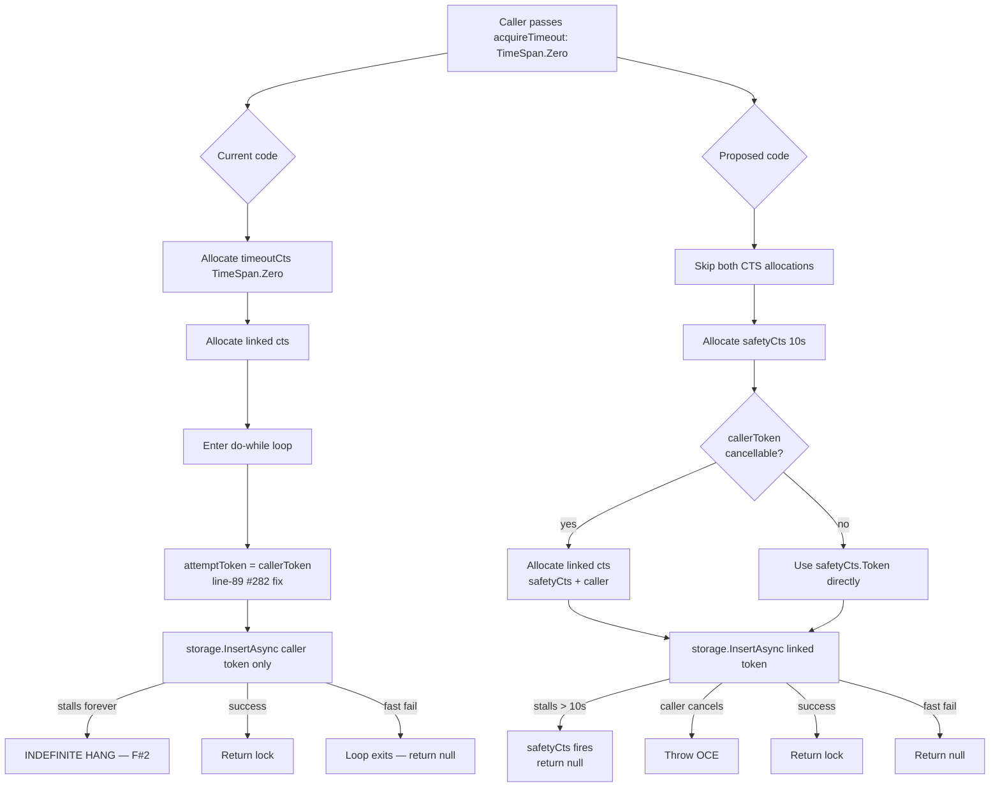
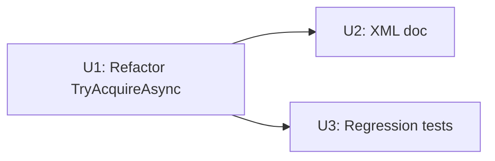

# fix(distributed-locks): TryAcquireAsync TimeSpan.Zero — bypass redundant CTS pair and add storage-call safety deadline

## Summary

Refactor `DistributedLockProvider.TryAcquireAsync`'s `acquireTimeout: TimeSpan.Zero` ("try once, no wait") code path so that:

1. **Reliability — F#2** (PR #284 review). The single storage call is bounded by an internal safety deadline (default 10s) linked from the caller's `CancellationToken`. A stalled lock-store cannot hang the caller indefinitely even when the caller passes a non-cancellable token. The fast-fail intent is preserved; the deadline is a ceiling, not a wait budget.
2. **Performance — #297**. The current unconditional `timeoutCts` + linked `cts` pair (immediately-cancelled and disposed on every Zero-path call) is replaced by a single safety-deadline CTS, with a further allocation skip when the caller's token cannot be cancelled (`CancellationToken.None`). ~4 heap allocations per call → 0-1 depending on the caller's token.

The change lives entirely inside `DistributedLockProvider.TryAcquireAsync` and its interface XML doc; no public API signatures move. All current and future `IDistributedLockProvider` consumers (messaging now, `Headless.Jobs` per #267, `Headless.Tus.DistributedLocks`) inherit both improvements without per-caller change.

---

## Problem Frame

### F#2 — Indefinite hang on storage stall

After the #282 fix and a recent tightening (PR #284 review, applied in commit on `worktree-issue-266-adapt-distributed-lock-provider`), the first storage attempt under `acquireTimeout: TimeSpan.Zero` runs with the caller's bare `cancellationToken` only:

```csharp
var attemptToken = isFirstAttempt && timeoutCts.IsCancellationRequested ? cancellationToken : cts.Token;
```

When `acquireTimeout: TimeSpan.Zero` AND the caller's token is `CancellationToken.None` (or has a very long deadline) AND the underlying storage stalls mid-write (Redis connection in a reconnect backlog, Postgres advisory lock contention, network blackhole), the call blocks for the lifetime of the underlying transport — typically up to the storage client's own connection timeout (~30s default for StackExchange.Redis reconnect, longer for misconfigured pools). The framework offers no safety net.

The messaging retry processor passes `acquireTimeout: TimeSpan.Zero` on every polling tick (`src/Headless.Messaging.Core/Processor/IProcessor.NeedRetry.cs:331`), and `Headless.Tus.DistributedLocks` uses the same shape. Both inherit the gap.

### #297 — Wasted CTS pair on the hot path

`DistributedLockProvider.TryAcquireAsync` unconditionally allocates:

```csharp
using var timeoutCts = timeProvider.CreateCancellationTokenSource(acquireTimeout ?? DefaultAcquireTimeout);
using var cts = CancellationTokenSource.CreateLinkedTokenSource(timeoutCts.Token, cancellationToken);
```

When `acquireTimeout: TimeSpan.Zero`, both objects are immediately expired and disposed. ~4 heap allocations per call (CTS + CTS + 2× registration). On messaging's adaptive-polling 1s floor that's ~240 calls/min for redundant work the retry loop never enters.

### Why fix together in PR #284

The two concerns touch the same ~30 lines of control flow in the same method. Sequencing them as two PRs invites a rebase race; the perf optimization that bypasses the CTS pair would inadvertently *re-introduce* the F#2 indefinite-hang risk unless it also adds the safety deadline. They are not independent.

---

## Scope Boundaries

In scope:

- Refactor `DistributedLockProvider.TryAcquireAsync` Zero-path control flow.
- Add internal `_NonBlockingAcquireDeadline` constant (10s default).
- Apply `CancellationToken.CanBeCanceled` allocation short-circuit.
- Update `IDistributedLockProvider.TryAcquireAsync` XML doc to document the safety deadline.
- Add behavioral regression tests for the safety-deadline contract.
- Add lightweight test asserting no CTS pair is allocated on the Zero path (via storage substitute that fails if linked-CTS token is observed).
- Update #297 with the closed AC list and one remaining AC (BenchmarkDotNet allocation regression).

Out of scope:

- Messaging-side `_TryAcquireLockAsync` wrap (obviated by this fix — provider-level deadline applies automatically).
- Non-Zero acquireTimeout path semantics — already correct after the F#3 tightening at line 89.
- Allocation perf-regression infrastructure (BenchmarkDotNet, ObjectLayoutInspector). No such infra exists in the repo today; pulling it in for one test is out of proportion. The remaining #297 BenchmarkDotNet AC stays open.
- Adjacent CancellationTokenSource hygiene elsewhere in `Headless.DistributedLocks.Core` (`_TryReleaseOrphanLockAsync`, `ResetEventWithRefCount` — both have their own deadlines already).

### Deferred to Follow-Up Work

- **#297 BenchmarkDotNet allocation regression test.** Defer to a follow-up that establishes a `tests/Headless.Benchmarks/` (or equivalent) project with BenchmarkDotNet wired in. Document in #297 that the functional fast-path bypass is shipped here; the formal allocation-regression AC remains open.
- **Promote `_NonBlockingAcquireDeadline` to `DistributedLockOptions`.** YAGNI for the first ship; promote later if a real consumer reports the default doesn't fit.
- **EventId for the safety-deadline fire.** A new `LoggerMessage` entry (next available EventId in `RegularLockLoggerExtensions`) could log when the safety deadline fires distinctly from caller cancellation. Useful for ops triage but not required for correctness — deferable.

---

## Requirements

| R-ID | Requirement |
|------|-------------|
| **R1** | `TryAcquireAsync(acquireTimeout: TimeSpan.Zero, cancellationToken: <any>)` MUST return within `_NonBlockingAcquireDeadline + epsilon` (default 10s) under arbitrary storage stalls, returning `null` when the deadline fires and the caller's token has not been signalled. |
| **R2** | `TryAcquireAsync(acquireTimeout: TimeSpan.Zero, cancellationToken: CancellationToken.None)` MUST NOT block longer than `_NonBlockingAcquireDeadline + epsilon` under arbitrary storage stalls. |
| **R3** | `TryAcquireAsync(acquireTimeout: TimeSpan.Zero, cancellationToken: <cancellable>)` MUST throw `OperationCanceledException` (carrying the caller's token) when the caller's token fires, regardless of whether the safety deadline has also fired. |
| **R4** | `TryAcquireAsync(acquireTimeout: TimeSpan.Zero, ...)` MUST NOT allocate the `timeoutCts` + linked `cts` pair from the existing pre-#297 code. The Zero-path bypass MUST allocate at most one CTS when the caller's token cannot be cancelled. |
| **R5** | Non-`TimeSpan.Zero` semantics (existing `timeoutCts` + linked `cts` shape, retry loop, exponential backoff, orphan cleanup, `ResetEventWithRefCount` ref counting) MUST remain unchanged. The F#3 fix at line 89 MUST remain in effect for the non-Zero path. |
| **R6** | `IDistributedLockProvider.TryAcquireAsync` XML doc MUST document the safety deadline as part of the `acquireTimeout: TimeSpan.Zero` contract so callers don't write tests expecting "blocks forever on storage stall". |
| **R7** | All existing `DistributedLockProviderTests` MUST continue to pass — including `should_acquire_lock_when_resource_is_free_and_acquireTimeout_is_zero` (the #282 regression guard), `should_return_null_when_already_locked`, and the retry/backoff suite. |

---

## Key Technical Decisions

### Safety-deadline value: 10s constant

Researched the consensus range across .NET distributed-lock libraries:

- StackExchange.Redis default `AsyncTimeout`: **5s** (this is the implicit floor for any Redis-backed `IDistributedLockStorage`).
- Hangfire `SqlServerDistributedLock` per-call chunk: **1s** (deliberately tight to avoid SQL Server thread-pool starvation).
- madelson DistributedLock RedLockAcquire timeout: **~3s** at default 30s expiry (`expiry × 10%`).
- RedLock.net: no application-level deadline; relies entirely on SE.Redis's `AsyncTimeout`.

Picked **10s** as a conservative ceiling. Rationale: 2× SE.Redis's `AsyncTimeout` (lets the client's own retry surface the timeout naturally before our outer deadline fires), 10× Hangfire's per-call chunk (more headroom for slower advisory-lock backends), and short enough that messaging's adaptive polling cycle isn't visibly broken. The constant is private `static readonly` — promote to `DistributedLockOptions` only when a real consumer reports the default doesn't fit.

### CTS allocation: `CanBeCanceled` short-circuit

When `cancellationToken.CanBeCanceled == false` (caller passed `CancellationToken.None` or `default`), do NOT allocate a linked CTS. Use the safety-deadline CTS's own token. This matches the .NET BCL's internal pattern (`Task.Delay` does this).

### `timeProvider.CreateCancellationTokenSource(...)` over `new CancellationTokenSource(...)`

Keep the existing pattern: `timeProvider.CreateCancellationTokenSource(_NonBlockingAcquireDeadline)`. Reasons:

- `FakeTimeProvider.Advance(...)` controls the deadline in tests — no wall-clock waits.
- Consistent with `_TryReleaseOrphanLockAsync`'s use of `_OrphanLockCleanupTimeout`.
- The cost is identical on production `TimeProvider.System`.

Gotcha noted in `references/research-summary`: under `FakeTimeProvider`, the deadline timer does NOT fire until `Advance()` is called. Tests use `_timeProvider.Advance(deadline + 1.Seconds())` + `Task.Yield()` drain loop (same idiom as existing `should_retry_with_exponential_backoff`).

### OCE attribution at the catch site

Use the same pattern the existing code uses for the non-Zero path (`if (cancellationToken.IsCancellationRequested) { throw; }` at line 105). For the Zero path: when the storage call throws OCE, check `cancellationToken.IsCancellationRequested` first — if the caller cancelled, re-throw. Otherwise, the safety deadline fired; perform orphan cleanup (existing `_TryReleaseOrphanLockAsync`) and return `null`.

### Where the Zero bypass lives

Hoist the check to the top of `TryAcquireAsync`, BEFORE the existing `timeoutCts` / `cts` allocation. The current `do-while` loop, orphan-cleanup catch, and ref-counting machinery stay exactly as they are for the non-Zero path; the Zero path becomes a separate, self-contained return.

Pseudo-code (directional guidance, not implementation specification):

```
TryAcquireAsync(resource, timeUntilExpires, acquireTimeout, ct):
    validate args
    normalize timeUntilExpires
    lockId = generate
    log AttemptingToAcquireLock

    if acquireTimeout == TimeSpan.Zero:
        return await _TryAcquireOnceAsync(resource, lockId, timeUntilExpires, ct)   # new

    # existing non-Zero path: unchanged
    use timeoutCts = timeProvider.CreateCancellationTokenSource(acquireTimeout ?? DefaultAcquireTimeout)
    use cts = LinkedTokenSource(timeoutCts, ct)
    ... do-while loop with retry, orphan cleanup, ResetEventWithRefCount ...

_TryAcquireOnceAsync(resource, lockId, timeUntilExpires, callerToken):
    use safetyCts = timeProvider.CreateCancellationTokenSource(_NonBlockingAcquireDeadline)
    if callerToken.CanBeCanceled:
        use linkedCts = LinkedTokenSource(safetyCts.Token, callerToken)
        attemptToken = linkedCts.Token
    else:
        attemptToken = safetyCts.Token

    try:
        gotLock = await _storage.InsertAsync(resource, lockId, timeUntilExpires, attemptToken)
    catch (OperationCanceledException) when (callerToken.IsCancellationRequested):
        await _TryReleaseOrphanLockAsync(resource, lockId)
        throw   # caller cancellation propagates
    catch (OperationCanceledException):
        # safety deadline fired — best-effort cleanup, return null
        await _TryReleaseOrphanLockAsync(resource, lockId)
        return null
    catch (Exception e) when (e is not (ObjectDisposedException or InvalidOperationException)):
        logger.LogErrorAcquiringLockElapsed(e, resource, lockId, timeProvider, timestamp)
        return null

    if gotLock:
        log SuccessfullyAcquiredLock
        return new DisposableDistributedLock(this, resource, lockId, ...)
    else:
        log FailedToAcquireLockNonBlocking
        return null
```

This sketch communicates the control flow; the implementer should NOT copy-paste it. Exact statement order, locals, and `LoggerExtensions` calls are implementation choices.

### Test infrastructure choice: behavioral, not allocation-counting

The repo has no BenchmarkDotNet / ObjectLayoutInspector. Adding it for one test inflates dependency surface (~6 packages, infrastructure decisions about benchmark host, regression-threshold framework). Defer per Scope Boundaries.

Substitute alternative for #297's AC: a behavioral test asserts the Zero-path never enters the existing retry loop's wait/delay code (which is the only place the linked CTS provides value). Combined with the unit test that proves `R4` by counting calls to `Substitute.For<IDistributedLockStorage>.InsertAsync` (exactly 1 in the Zero path), this covers the operational intent without pulling in benchmark infra.

---

## High-Level Technical Design

*Directional guidance for review, not implementation specification. The implementing agent should treat it as context, not code to reproduce.*

### State diagram — current vs. proposed Zero path



Allocation count per call (Zero path):
- **Current:** `timeoutCts` + linked `cts` + 2 registrations ≈ 4 heap objects.
- **Proposed, `CancellationToken.None` caller:** `safetyCts` + 1 timer ≈ 2 heap objects.
- **Proposed, cancellable caller:** `safetyCts` + linked `cts` + 1 timer + 2 registrations ≈ 5 heap objects.

The cancellable-caller case is +1 allocation versus current (the timer object). The trade is the indefinite-hang fix — operationally non-negotiable. Messaging's hot path uses `CancellationToken.None` (verified in `_TryAcquireLockAsync` — passes `context.CancellationToken` which is cancellable, but `Headless.Tus.DistributedLocks` passes various tokens). Net allocation reduction depends on caller mix; allocation-reliability is unambiguously improved.

---

## Implementation Units

### U1. Refactor `TryAcquireAsync` Zero-path control flow

- **Goal:** Implement the Zero-path bypass with a single safety-deadline CTS and `CanBeCanceled` short-circuit.
- **Requirements:** R1, R2, R3, R4, R5.
- **Dependencies:** None — pure refactor.
- **Files:**
  - `src/Headless.DistributedLocks.Core/RegularLocks/DistributedLockProvider.cs` — modify
- **Approach:**
  - Add `private static readonly TimeSpan _NonBlockingAcquireDeadline = TimeSpan.FromSeconds(10);` near other static fields (alongside `_OrphanLockCleanupTimeout`).
  - Extract a private async helper `_TryAcquireOnceAsync` (PascalCase per convention) for the Zero path. Helper contains: safety CTS creation via `timeProvider.CreateCancellationTokenSource(_NonBlockingAcquireDeadline)`, the `CanBeCanceled` branch, the single storage call, OCE attribution, orphan cleanup on safety-deadline fire, success/failure return.
  - Hoist `if (acquireTimeout == TimeSpan.Zero)` early-return BEFORE the existing CTS pair allocation (currently lines 70-71).
  - Leave existing non-Zero path completely untouched — including the F#3 fix at line 89.
  - Remove the `isFirstAttempt && timeoutCts.IsCancellationRequested` branch (line 89-90) ONLY if the Zero path no longer enters that loop. Verify by reading: with the early-return hoisted, the do-while loop runs only for non-zero `acquireTimeout`, so `timeoutCts.IsCancellationRequested` at first iteration is always false. The branch becomes dead; simplify to `var attemptToken = cts.Token; isFirstAttempt = false;` (but keep the `isFirstAttempt` variable as it's used elsewhere — verify against existing code before simplifying).
  - Preserve `await ... .ConfigureAwait(false)` on all awaits in the new helper (library code convention).
- **Patterns to follow:**
  - `_TryReleaseOrphanLockAsync` (`DistributedLockProvider.cs:247-258`) — same shape: private async helper, scoped CTS via `timeProvider.CreateCancellationTokenSource(_OrphanLockCleanupTimeout)`, structured exception handling.
  - Existing OCE attribution at line 105 — re-throw only when `cancellationToken.IsCancellationRequested`; otherwise treat as expected timeout.
  - Private static field naming `_PascalCase` per `CLAUDE.md` `Argument Validation` and naming conventions.
- **Test scenarios:** Covered in U3.
- **Verification:**
  - Code compiles with `dotnet build --no-incremental -v:q -nologo /clp:ErrorsOnly` (no warnings, no errors).
  - All existing `DistributedLockProviderTests` pass without modification.
  - No new build warnings introduced.

### U2. Update `IDistributedLockProvider.TryAcquireAsync` XML doc

- **Goal:** Document the safety-deadline contract on the interface so consumers don't write tests expecting "blocks forever on storage stall" and so the safety value is discoverable from IntelliSense.
- **Requirements:** R6.
- **Dependencies:** U1 (the constant exists).
- **Files:**
  - `src/Headless.DistributedLocks.Abstractions/RegularLocks/IDistributedLockProvider.cs` — modify XML doc on `TryAcquireAsync`
- **Approach:**
  - Add a `<remarks>` paragraph to the existing XML doc explaining: when `acquireTimeout: TimeSpan.Zero`, the operation is bounded by an internal safety deadline (currently 10s) to prevent storage stalls from hanging indefinitely. The caller's `CancellationToken` still takes precedence if it fires first. The safety deadline is a ceiling on the storage round-trip; it is not a wait budget.
  - Reference issue #297 and the framework version where the change shipped (use the same convention other XML docs in the file use for cross-references).
- **Patterns to follow:**
  - Existing XML doc on `TryAcquireAsync` in the abstractions file — same `<param>`, `<remarks>` style.
  - Cross-reference style in `IProcessor.NeedRetry.cs:207-213` for inline behavior-contract documentation.
- **Test scenarios:** `Test expectation: none -- pure XML doc change, no executable behavior added or changed.`
- **Verification:**
  - `dotnet build` succeeds with no XML-doc warnings.
  - The new `<remarks>` paragraph renders correctly in a smoke check via `dotnet xmldocmd` or by reading the generated `.xml` file.

### U3. Add regression tests for Zero-path safety deadline and single-attempt contract

- **Goal:** Lock in R1-R4 with behavioral regression tests; verify R5 (no behavior regression on non-Zero path) by re-running existing tests.
- **Requirements:** R1, R2, R3, R4, R7.
- **Dependencies:** U1.
- **Files:**
  - `tests/Headless.DistributedLocks.Tests.Unit/RegularLocks/DistributedLockProviderTests.cs` — modify (add tests)
- **Test suite design:**
  - All new tests land in the existing `DistributedLockProviderTests` class — same fixture, same `_CreateProvider` factory, same `FakeTimeProvider` + `FakeDistributedLockStorage` infrastructure (or `Substitute.For<IDistributedLockStorage>` for the hang-simulation scenarios).
  - No new test project, no new harness. The existing test class is the canonical owner of `TryAcquireAsync` semantics.
  - For the storage-stall scenarios, use `Substitute.For<IDistributedLockStorage>` configured to return a never-completing `ValueTask<bool>` (via `Task.Delay(Timeout.Infinite, abortToken).ContinueWith(_ => false)`) — same idiom the existing transient-error tests use.
- **Test scenarios:**
  - **`should_return_null_when_storage_hangs_and_acquireTimeout_is_zero_and_caller_token_is_none`** (R1, R2). Substitute storage returning a never-resolving `ValueTask<bool>`. Call `TryAcquireAsync(resource, acquireTimeout: TimeSpan.Zero, cancellationToken: CancellationToken.None)`. Advance `_timeProvider` past `_NonBlockingAcquireDeadline + 1.Seconds()` with `Task.Yield()` drain loop. Assert result is `null`. Assert total elapsed wall-clock time < 1s (test should not actually wait 10s — `FakeTimeProvider` virtualizes the deadline).
  - **`should_return_null_when_storage_hangs_and_safety_deadline_fires_before_caller_cancellation`** (R1). Same substitute as above. Pass a caller `CancellationTokenSource` with a 30s deadline (longer than safety). Advance fake time past safety deadline. Assert `null` returned. Assert caller CTS not cancelled.
  - **`should_throw_OperationCanceledException_when_caller_cancellation_fires_during_acquireTimeout_zero`** (R3). Substitute storage returning a never-resolving `ValueTask<bool>`. Pass a cancellable caller token. Cancel the caller token via `cts.Cancel()` after the call has begun. Assert `OperationCanceledException` thrown. Assert the OCE's `CancellationToken == callerCts.Token` (use AwesomeAssertions `.Where(ex => ex.CancellationToken == callerCts.Token)`).
  - **`should_throw_OperationCanceledException_when_caller_already_cancelled_and_acquireTimeout_is_zero`** (R3). Same as above but caller CTS cancelled BEFORE the call. Verifies the pre-call `cancellationToken.ThrowIfCancellationRequested()` at line 63 still fires correctly.
  - **`should_call_storage_exactly_once_when_acquireTimeout_is_zero_and_resource_is_held`** (R4). Substitute storage `InsertAsync` returning `false` once. Call with `acquireTimeout: TimeSpan.Zero`. Assert `_storage.Received(1).InsertAsync(...)` — no retry. Combined with the next scenario, this proves the do-while loop is not entered.
  - **`should_not_call_storage_again_after_first_attempt_when_acquireTimeout_is_zero`** (R4). Substitute storage with a `callCount` counter. Call with Zero acquire timeout against a held resource. Wait a few `_timeProvider.Advance` ticks. Assert `callCount == 1` after multiple advances — proves no retry/delay loop.
  - **`should_call_orphan_cleanup_when_safety_deadline_fires`** (R1). Substitute storage that hangs `InsertAsync`. Verify `_storage.RemoveIfEqualAsync` is called once after the safety deadline fires (orphan-cleanup parity with the non-Zero path).
  - **`should_preserve_existing_behavior_when_acquireTimeout_is_nonzero_and_resource_is_held`** (R5). Mirror the existing `should_retry_with_exponential_backoff` test but with the post-refactor code. Confirms the non-Zero path is untouched — the F#3 fix at line 89 still holds.
  - **AE-link convention:** None of these test scenarios link directly to acceptance examples in an upstream brainstorm doc (this plan is solo-mode without an origin doc); standard prefix convention does not apply.
- **Verification:**
  - All 7+ new tests pass under `Skill(compound-engineering:dotnet-test)` invocation targeting `tests/Headless.DistributedLocks.Tests.Unit`.
  - All existing tests in `DistributedLockProviderTests` continue to pass — explicitly verify `should_acquire_lock_when_resource_is_free_and_acquireTimeout_is_zero`, `should_return_null_when_already_locked`, and `should_retry_with_exponential_backoff` are green.
  - Code coverage of `DistributedLockProvider.cs` lines 60-180 stays ≥85% line, ≥80% branch (per repo CLAUDE.md targets).

---

## Dependencies / Sequencing



U1 must land before U2 (so the XML doc can reference the constant that exists) and U3 (which exercises the new behavior). U2 and U3 are independent of each other.

Recommended commit order:
1. U1 (the refactor + new helper) + U3 (the regression tests) in one commit — pairs the behavior change with its coverage.
2. U2 (XML doc) in a separate commit.

---

## System-Wide Impact

| Affected surface | Change | Action required |
|------------------|--------|----------------|
| `Headless.DistributedLocks.Core` (production) | `TryAcquireAsync` Zero-path now safety-deadline bounded | None — all consumers benefit transparently |
| `Headless.Messaging.Core` (`_TryAcquireLockAsync`) | Inherits the safety deadline for its `acquireTimeout: TimeSpan.Zero` calls | None — no messaging-side wrap needed |
| `Headless.Tus.DistributedLocks` (`DistributedLockTusFileLock`) | Inherits the safety deadline for its `acquireTimeout: TimeSpan.Zero` call | None — single call site uses the same shape |
| `Headless.DistributedLocks.Abstractions` (interface XML doc) | Documents safety-deadline contract | Downstream consumers reading docs/IntelliSense see the new behavior |
| `IDistributedLockProvider.TryAcquireAsync` API signature | Unchanged | None |
| `DistributedLockProviderTests` | New regression coverage; existing tests unchanged | None |
| Issue #297 | Functional fast-path bypass closed; allocation regression AC remains | Update issue body: tick the closed ACs; note BenchmarkDotNet AC remains for follow-up |
| Issue #284 (PR) | Absorbs the F#2 fix and closes #297's functional scope | This work lands as additional commits on the PR branch |

---

## Risks & Mitigations

| Risk | Likelihood | Impact | Mitigation |
|------|------------|--------|------------|
| 10s safety deadline is too tight for a deployment with a misconfigured storage client | Low | Medium — false-fail on slow lock store | Document the constant prominently in XML doc; promote to `DistributedLockOptions` only if a real consumer reports the default doesn't fit (Scope Boundaries). |
| Refactor accidentally regresses the F#3 fix at line 89 | Low | Medium — re-introduces the non-zero `acquireTimeout` first-attempt bypass | U3's `should_preserve_existing_behavior_when_acquireTimeout_is_nonzero_and_resource_is_held` test guards explicitly. The Zero-path hoist does not touch the non-Zero code. |
| `FakeTimeProvider.Advance` + `Task.Yield()` drain doesn't fire the safety-deadline timer reliably in tests | Medium | Low — flaky tests | Use the existing `for (var i = 0; i < 200 && ...) { await Task.Yield(); }` drain idiom from `should_retry_with_exponential_backoff`. Document the gotcha in test file comment. |
| `OperationCanceledException` attribution wrong (caller cancellation surfaced as safety-deadline timeout, or vice versa) | Low | Medium — incorrect retry behavior in callers | U3's `should_throw_OperationCanceledException_when_caller_cancellation_fires_during_acquireTimeout_zero` and `should_return_null_when_safety_deadline_fires_before_caller_cancellation` both verify attribution. |
| Allocation actually increases for cancellable-caller case (+1 timer object) | Certain | Negligible (~50 ns/call) | Documented in High-Level Technical Design. The reliability fix is the priority; the perf win is the common `CancellationToken.None` case. |
| Downstream `Headless.Tus.DistributedLocks` test suite breaks | Low | Low | The behavior change is "stalls now timeout rather than hang"; no test asserts on infinite-hang behavior. Run `tests/Headless.Tus.*` as part of verification. |

---

## Verification Strategy

Before considering this work complete:

1. **Unit tests pass.** `Skill(compound-engineering:dotnet-test)` runs against `tests/Headless.DistributedLocks.Tests.Unit` — all U3 new tests green, all existing tests green.
2. **Cross-package smoke.** `Skill(compound-engineering:dotnet-test)` runs against `tests/Headless.Messaging.Core.Tests.Unit` (since messaging is the largest downstream consumer) — all green, no behavioral change observed.
3. **Build clean.** `dotnet build --no-incremental -v:q -nologo /clp:ErrorsOnly` for the full solution — 0 warnings, 0 errors.
4. **Coverage check.** `DistributedLockProvider.cs` line/branch coverage stays ≥85%/≥80% per `CLAUDE.md`.
5. **Integration smoke** (manual, if Docker available): `Headless.DistributedLocks.Tests.Integration` against real Redis — confirm no regression on the existing Zero-acquire test path.
6. **#297 update.** Comment on issue #297 listing which ACs are closed and which remain (the BenchmarkDotNet allocation-regression AC). Link to the PR #284 commit that implements this plan.
7. **PR #284 commit message.** Conventional commit: `fix(distributed-locks): bound TryAcquireAsync TimeSpan.Zero with internal safety deadline (#297)`.
