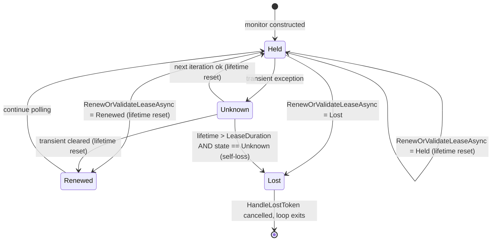
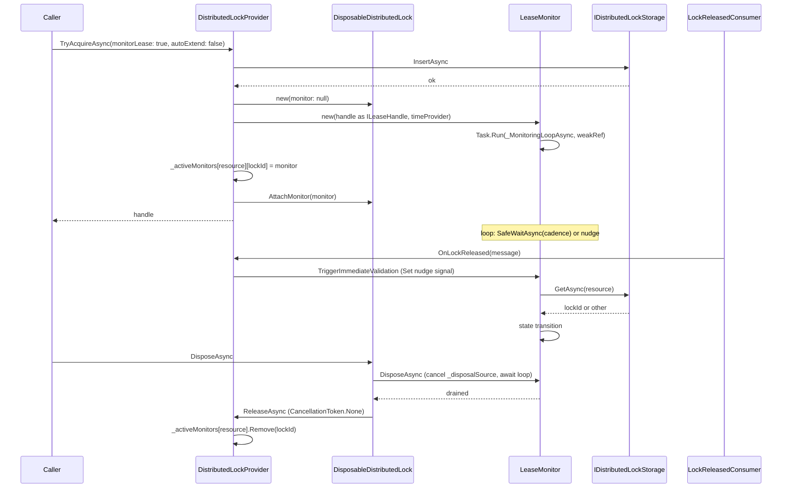

# feat: distributed-locks Phase 2 — LeaseMonitor + HandleLostToken + opt-in auto-extension

## Summary

Add lease-lifecycle correctness to `Headless.DistributedLocks.*`. Introduce an internal `LeaseMonitor` with a 4-state machine (`Held` / `Renewed` / `Lost` / `Unknown`) that runs a background polling loop holding only a `WeakReference<LeaseMonitor>` to itself, so abandoned `DisposableDistributedLock` handles can be GC'd and the loop exits naturally. Expose loss detection through a new `IDistributedLock.HandleLostToken` (breaking) so consumer code can short-circuit work the moment the lease is lost. Wire a hybrid wake-up: the existing outbox `DistributedLockReleased` consumer nudges every active monitor for that resource for fast-path validation (target latency < 100ms); the ½-TTL poll is the backstop when outbox is absent or messages drop. Add opt-in background auto-extension via `autoExtend: bool` on acquire (default `false`), with monitor cadence at 1/3 TTL when auto-extending. Disposal of the lock awaits monitor disposal first, which is what closes #283 — the monitor honors its own disposal token without 15-retry hangs.

Greenfield posture per `CLAUDE.md` — interface change ships clean, no shims. Docs sync (agent-facing `docs/llms/distributed-locks.md` + package READMEs) is part of the phase.

---

## Problem Frame

Today's `DisposableDistributedLock` is fire-and-acquire: once a handle returns, the consumer has no signal that the lease was lost (storage eviction, network partition, clock skew, GC pause exceeding TTL). The consumer keeps doing work past the point where another process can legally acquire the same resource. The lock stays in the "efficiency lock" safety category (see `docs/solutions/tooling-decisions/redlock-multi-instance-not-adopted-2026-05-19.md`) — the framework cannot promise correctness through clock skew — but it can narrow the window where work continues against a lost lease, which is what Phase 2 ships.

Phase 1 (#288, landed) added `releaseOnDispose: false`, the optional-`IOutboxPublisher` path, and `LockAcquisitionTimeoutException` under a new `DistributedLockException` base. Phase 2 sits on that foundation and adds the lease-lifecycle layer the rest of the four-phase track (#287) builds against — Phase 3's RW lock, semaphore, and composite primitives all consume `HandleLostToken`.

`IDistributedLock` is consumed framework-internally today by `Headless.Messaging` (per `docs/llms/distributed-locks.md`) and is the next-target dependency for `Headless.Jobs`. Both are in this monorepo, so the breaking change is single-commit reachable. No external NuGet consumers exist yet.

---

## Requirements Traceability

Origin: GitHub issue #289 (treated as the requirements document for this plan).

| Origin ID | Description | Implementation Units |
|---|---|---|
| R2.1 | `HandleLostToken` on `IDistributedLock`; returns `None` when monitor not enabled | U3, U6 |
| R2.2 | `LeaseMonitor` 4-state machine with `leaseLifetime > LeaseDuration` self-loss | U2 |
| R2.3 | `WeakReference<LeaseMonitor>` capture in monitoring loop; abandoned handles GC | U2 |
| R2.4 | Outbox fast-path: `DistributedLockReleased` → `TriggerImmediateValidation` | U6 |
| R2.5 | Polling cadence default ½ TTL; `PollingCadenceFraction` option | U4 |
| R2.6 | `autoExtend: bool` parameter on acquire; renew vs. validate routing | U5, U7 |
| R2.7 | Auto-extension cadence 1/3 TTL; `AutoExtensionCadenceFraction` option | U4 |
| R2.8 | Disposal: monitor disposes first, then release — closes #283 | U5 |
| AC1 | Partition: repeated `Unknown` fires loss only at `leaseLifetime > LeaseDuration` | U2 / U8 |
| AC2 | Transient: single `Unknown` followed by `Renewed` resets lifetime; no loss fired | U2 / U8 |
| AC3 | Outbox fast-path: `DistributedLockReleased` → validation < 100ms | U6 / U9 |
| AC4 | `autoExtend: true`: work past TTL succeeds; storage shows renewals | U5 / U9 |
| AC5 | `autoExtend: false`: work past TTL fires `HandleLostToken`; no renewals | U5 / U9 |
| AC6 | Abandonment: drop strong ref, force GC, loop exits within one cadence | U2 / U8 |
| AC7 | Shutdown disposal: under 100ms CT, returns ≤ 100ms; closes #283 | U5 / U9 |
| AC8 | Works without `IOutboxPublisher`: falls back to polling-only | U6 / U9 |

---

## Key Technical Decisions

- **Two opt-in parameters on acquire, not one.** `monitorLease: bool` (default `false`) controls whether the monitor and `HandleLostToken` are wired; `autoExtend: bool` (default `false`) controls whether the monitor calls `RenewAsync` (extend) or `GetAsync` (validate only). `autoExtend: true` implies `monitorLease: true` — auto-promote silently rather than throw, since `autoExtend` without monitoring is non-sensical. `monitorLease: false` keeps the current cost profile: no background task, no registry entry, `HandleLostToken == CancellationToken.None`. Rationale: every monitor is a background polling task; high-churn workloads with thousands of throwaway acquires should not pay for monitoring they don't read.
- **`IDistributedLock.ReleaseAsync()` stays parameterless.** Issue #283 is closed by disposal *ordering* (drain monitor first; monitor honors its own disposal CT), not by adding a `CancellationToken` to the public `ReleaseAsync()` surface. Consumers needing a hard shutdown bound use Phase 1's `releaseOnDispose: false` + `IDistributedLockProvider.ReleaseAsync(resource, lockId, ct)` which already takes a token. Keeps the breaking-change footprint of Phase 2 to a single `IDistributedLock` member.
- **Active-monitor registry on the provider, not the handle — and holds `WeakReference<LeaseMonitor>`.** Shape: `ConcurrentDictionary<string, ConcurrentDictionary<string, WeakReference<LeaseMonitor>>>` keyed by resource → lockId → weak-ref-to-monitor. The registry must NOT be a GC root for the monitor; otherwise the loop's own `WeakReference<LeaseMonitor>` self-reference is defeated and abandoned handles leak both the handle and the background monitoring task. Registration happens at construction time inside `TryAcquireAsync` / `_TryAcquireOnceAsync` when `monitorLease: true`; deregistration happens in `LeaseMonitor.DisposeAsync` (always called by `DisposableDistributedLock.DisposeAsync`). The provider owns the registry because `OnLockReleased` is invoked on the provider and needs to dispatch the nudge synchronously. Dispatch resolves the weak-ref via `TryGetTarget`; dead entries are skipped on read and lazily evicted by `OnLockReleased` sweeps (cheap because the inner dict is small).

  Reference graph: handle → strong → monitor; monitor → strong → handle (as `ILeaseHandle`, scoped to monitor lifetime); registry → weak → monitor; loop closure → weak → monitor. When the consumer drops the handle (no external root), the handle ↔ monitor strong cycle is unreachable, GC reclaims both, the loop's `TryGetTarget` returns false on the next iteration, the loop exits, and the registry entry becomes dead-and-evictable. This satisfies AC6 (abandonment GC).
- **`OnLockReleased` stays synchronous.** Contract in `src/Headless.DistributedLocks.Core/RegularLocks/ICanReceiveLockReleased.cs` requires non-blocking dispatch. The monitor nudge is a single `AsyncAutoResetEvent.Set()` per matching monitor — the same primitive already used for waiter wake-up.
- **`TimeProvider.CreateCancellationTokenSource(cadence)` over `CreateTimer`.** No `CreateTimer` precedent exists in the DistributedLocks codebase; the loop + linked-CTS + `AsyncAutoResetEvent.SafeWaitAsync` pattern matches existing acquire loop conventions. Avoid introducing a new timing primitive.
- **State category framing.** The monitor adds observability + recovery. It does NOT upgrade these locks to correctness locks. Public framing on `HandleLostToken` doc-comments and in `docs/llms/distributed-locks.md` must align with `redlock-multi-instance-not-adopted-2026-05-19.md`: consumers needing correctness still need to fence the protected resource with `LockId`.
- **Apply circuit-breaker thread-safety checklist verbatim** per `docs/solutions/concurrency/circuit-breaker-transport-thread-safety-patterns.md`. Specifically: timer-generation guard before any state transition; dispose-race lock; fire-and-forget continuation observer on the monitor's `_monitoringTask`.
- **`LockHandleLostException` is a consumer-throw type, not framework-throw.** The framework signals lease loss via `HandleLostToken` cancellation. Consumers wrap their work cancellation in `try/catch` and throw `LockHandleLostException` when they need an exception-shape signal. The type ships in `Headless.DistributedLocks.Abstractions/Exceptions/` — already named in `LockAcquisitionTimeoutException`'s doc-comment as a sibling under `DistributedLockException`.
- **No new Setup overload.** `monitorLease` and `autoExtend` are per-call parameters on existing `AcquireAsync` / `TryAcquireAsync`. The Setup contract in `src/Headless.DistributedLocks.Core/Setup.cs` (`AddDistributedLockExtensions`) is untouched. Options-level globals (cadence fractions) bind through the existing `services.Configure<DistributedLockOptions, DistributedLockOptionsValidator>(...)` pipeline.

---

## High-Level Technical Design

*The diagrams below illustrate the intended approach and are directional guidance for review, not implementation specification. The implementing agent should treat them as context, not code to reproduce.*

### State machine



Key invariant: `Lost` is terminal. Both `Renewed` and `Held` reset `leaseLifetime` — both are positive ownership confirmations from storage and the polling-only mode (`autoExtend: false`) never sees `Renewed`, so resetting only on `Renewed` would accumulate lifetime drift across long `Held` streaks. `Unknown` does NOT reset — repeated `Unknown` accumulates lifetime. The self-loss promotion fires only when `leaseLifetime > LeaseDuration` AND the prior probe was `Unknown`; a confirmed `Held` or `Renewed` cannot trip the safety net (defense in depth alongside the lifetime reset). This is what makes partition behavior correct (AC1) without producing false-positive Lost in polling mode.

### Acquire-to-monitor-to-dispose sequence



The drain step (`await _monitor.DisposeAsync()` before `ReleaseAsync()`) is what closes #283. Monitor disposal honors its own `_disposalSource` token; it does not retry storage; it exits within one cadence tick. Consumers needing a hard time bound on the *release* path use `releaseOnDispose: false` from Phase 1.

---

## Implementation Units

### U2. Implement `LeaseMonitor` with 4-state machine, weak-ref loop, nudge signal

*Note: this unit also defines the `LeaseState` enum and `LeaseMonitor.ILeaseHandle` nested interface inside the same `LeaseMonitor.cs` file (formerly described as U1 — folded here since U1 had no separate file output of its own; U-IDs U3+ keep their original numbering per the U-ID stability rule).*

**Nested types defined here:**
- `LeaseState` — nested public enum on `LeaseMonitor`: `Held`, `Renewed`, `Lost`, `Unknown`. Nested-on-internal keeps it invisible to consumers.
- `LeaseMonitor.ILeaseHandle` — nested interface: `TimeSpan LeaseDuration { get; }`, `TimeSpan MonitoringCadence { get; }`, `Task<LeaseState> RenewOrValidateLeaseAsync(CancellationToken)`. `DisposableDistributedLock` implements it in U5.
- `MonitoringCadence` is computed by the handle, not the monitor — the handle owns the cadence-fraction lookup since it holds the options reference. Monitor stays storage-agnostic.

Nested types on internal classes match the existing `LockReleasedConsumer` nested under `DistributedLockProvider` (`src/Headless.DistributedLocks.Core/RegularLocks/DistributedLockProvider.cs:791`).

**Goal:** Land the monitor primitive that drives lease lifecycle. Background polling loop with `WeakReference<LeaseMonitor>` self-reference, `AsyncAutoResetEvent`-based nudge for fast-path validation, terminal `HandleLostToken` cancellation on lost state.

**Requirements:** R2.2, R2.3, AC1, AC2, AC6

**Dependencies:** none

**Files:**
- `src/Headless.DistributedLocks.Core/RegularLocks/LeaseMonitor.cs` (created)
- `tests/Headless.DistributedLocks.Tests.Unit/RegularLocks/LeaseMonitorTests.cs` (created)
- `tests/Headless.DistributedLocks.Tests.Unit/Fakes/FakeLeaseHandle.cs` (created) — test double implementing `LeaseMonitor.ILeaseHandle`

**Approach:**
- `internal sealed class LeaseMonitor : IAsyncDisposable`. Two `CancellationTokenSource` fields: `_disposalSource` (loop exit), `_handleLostSource` (the externally-observed token).
- Constructor takes `ILeaseHandle` + `TimeProvider`. Validates `LeaseDuration >= MonitoringCadence` via `Argument.IsGreaterThanOrEqualTo`. Starts loop via `Task.Run`, passing only `WeakReference<LeaseMonitor>(this)` plus value-typed copies (cadence, time provider, disposal token) — the loop never closes over `this`. The weak-ref is load-bearing for abandonment GC and only works if no other strong root holds the monitor; U6 keeps the registry weak-only to honor this.
- Loop pattern (mirrors `DistributedLockProvider`'s acquire backoff loop): linked CTS over (cadence-CTS, disposal-CT) → `_nudgeSignal.SafeWaitAsync(linkedCts.Token)` (catches `OperationCanceledException`) → check disposal → resolve weak ref → `_RunIterationAsync(monitor, leaseLifetime)`.
- `_RunIterationAsync` checks `leaseLifetime > _leaseHandle.LeaseDuration` first (self-loss); else calls `_leaseHandle.RenewOrValidateLeaseAsync(_disposalSource.Token)` inside `try/catch` mapping non-cancellation exceptions to `Unknown`; then state-machine switch.
- On `Lost`, cancel `_handleLostSource` on a background thread via `Task.Run(() => _handleLostSource.Cancel())` to avoid running waiter continuations under the loop's effective lock. Stash the resulting `Task` for `DisposeAsync` to dispose the CTS after continuations drain.
- `TriggerImmediateValidation()` is a synchronous public method — calls `_nudgeSignal.Set()`. No `async` boundary.
- `DisposeAsync`: cancel `_disposalSource` (if not already), `await _monitoringTask` in `try/finally`, dispose CTS in `finally` (handling the deferred dispose of `_handleLostSource` if `_cancellationTask` is non-null).
- Apply circuit-breaker thread-safety checklist from `docs/solutions/concurrency/circuit-breaker-transport-thread-safety-patterns.md`: no `volatile bool` gates, no sync-over-async in `DisposeAsync`, idempotent double-dispose, observer on the `Task.Run` continuation (`ContinueWith(OnlyOnFaulted)` to log fault — silent wedge prevention).

**Technical design** (directional):
```text
LeaseMonitor
├── ctor(ILeaseHandle, TimeProvider)
│   ├── validates LeaseDuration >= MonitoringCadence
│   └── starts Task.Run(_MonitoringLoopAsync, weakRef = new WeakReference<LeaseMonitor>(this))
├── HandleLostToken => _handleLostSource.Token
├── TriggerImmediateValidation() => _nudgeSignal.Set()
└── DisposeAsync()
    ├── _disposalSource.Cancel()
    ├── await _monitoringTask
    └── dispose CTS (defer _handleLostSource dispose if _cancellationTask is non-null)
```

This illustrates the intended shape and is directional guidance for review, not implementation specification.

**Patterns to follow:**
- `AsyncAutoResetEvent.SafeWaitAsync(ct)` extension already exists at `src/Headless.Extensions/Threading/AsyncExExtensions.cs:30` — reuse, do not duplicate.
- `timeProvider.CreateCancellationTokenSource(cadence)` matches `src/Headless.DistributedLocks.Core/RegularLocks/DistributedLockProvider.cs:225`.
- Source-gen `[LoggerMessage]` partial class at the bottom of the file (per memory note `feedback_logger_class_placement.md`). Event IDs start at 1 for the new `LeaseMonitorLog` class.
- `Argument.IsGreaterThanOrEqualTo` / `Argument.IsNotNull` from `Headless.Checks`.
- Circuit-breaker patterns from `docs/solutions/concurrency/circuit-breaker-transport-thread-safety-patterns.md`.

**Execution note:** Implement the state-machine test cases first (RED) against `FakeLeaseHandle` before wiring up the production loop. Weak-ref / GC-abandonment test in particular tends to mis-spec without an empirical loop.

**Test suite design:** All tests are unit tests under `tests/Headless.DistributedLocks.Tests.Unit/RegularLocks/`. Use `FakeTimeProvider` (already imported throughout existing unit tests) + `FakeLeaseHandle` (new). Reuse the `_DrainContinuationsAsync` idiom established at `tests/Headless.DistributedLocks.Tests.Unit/RegularLocks/DistributedLockProviderTests.cs:559` for advancing virtual time across the monitor's `Task.Run` continuations.

**Test scenarios:**
- *Happy path — `Renewed` transitions reset lifetime.* `FakeLeaseHandle` returns `Renewed` on every call; advance time past one cadence; `HandleLostToken` never fires; `leaseLifetime` (visible via fake-injected stopwatch peek or assert via repeated cadences without loss) is reset after each `Renewed`. Covers AC2.
- *Happy path — `Held` continues polling.* `FakeLeaseHandle` returns `Held`; advance multiple cadences within `LeaseDuration`; no loss fired; loop alive.
- *Self-loss when `leaseLifetime > LeaseDuration`.* `FakeLeaseHandle` returns `Unknown` forever; advance past `LeaseDuration`; `HandleLostToken` cancels exactly once; loop exits within one cadence after loss. Covers AC1.
- *Transient `Unknown` followed by `Renewed` does not fire loss.* Sequence: `Unknown` → `Renewed`; advance to `1.5 × LeaseDuration` total, but the `Renewed` happens before `LeaseDuration` elapses; `HandleLostToken` never fires. Covers AC2.
- *Explicit `Lost` from handle fires immediately.* `FakeLeaseHandle` returns `Lost` on first iteration; `HandleLostToken` cancels within one cadence regardless of `leaseLifetime`.
- *Edge case — nudge wakes the loop before cadence elapses.* `TriggerImmediateValidation` is called while `SafeWaitAsync` is pending; verify iteration runs within a small tolerance (assert via fake-clock elapsed at iteration time, not wall-clock).
- *Edge case — exception during `RenewOrValidateLeaseAsync` maps to `Unknown`.* `FakeLeaseHandle` throws `InvalidOperationException`; one iteration returns `Unknown` state internally; loop continues; cumulative `Unknown` eventually self-promotes to `Lost` per the `Unknown`-forever case.
- *Edge case — exception when disposal already requested is suppressed.* Trigger disposal during iteration; `RenewOrValidateLeaseAsync` throws `OperationCanceledException`; loop exits cleanly, `HandleLostToken` does not fire.
- *Abandonment — drop strong ref + GC → loop exits.* Construct monitor, drop the local strong reference, call `GC.Collect()` + `GC.WaitForPendingFinalizers()`; advance one cadence; verify the monitoring task completes (use a fake-handle invocation counter to observe loop termination indirectly — direct assertion on `_monitoringTask.IsCompleted` via internal test hook acceptable since `LeaseMonitor` is internal). Covers AC6.
- *Disposal — idempotent double-dispose.* Call `DisposeAsync` twice; second call is no-op; no exceptions.
- *Disposal — drain awaits in-flight iteration.* Hold a TCS inside the fake handle; trigger disposal; `DisposeAsync` does not complete until the fake handle releases.
- *Constructor — validates `LeaseDuration >= MonitoringCadence`.* Throw `ArgumentException` when cadence > duration.

**Verification:** All listed test scenarios implemented and passing under `make test-project-fast TEST_PROJECT=tests/Headless.DistributedLocks.Tests.Unit`. Line coverage on `LeaseMonitor` ≥ 85%, branch ≥ 80% per `CLAUDE.md`. `make format-check` clean. No new analyzer warnings introduced.

---

### U3. Add `HandleLostToken` to `IDistributedLock` + introduce `LockHandleLostException`

**Goal:** Land the breaking interface change and the consumer-facing exception type.

**Requirements:** R2.1

**Dependencies:** none (independent of U2 — interface lives in `Abstractions`)

**Files:**
- `src/Headless.DistributedLocks.Abstractions/RegularLocks/IDistributedLock.cs` (modified)
- `src/Headless.DistributedLocks.Abstractions/Exceptions/LockHandleLostException.cs` (created)
- `src/Headless.DistributedLocks.Abstractions/RegularLocks/NullDistributedLockProvider.cs` (modified — null lock returns `CancellationToken.None`)
- `tests/Headless.DistributedLocks.Tests.Unit/RegularLocks/LockHandleLostExceptionTests.cs` (created)

**Approach:**
- Add `CancellationToken HandleLostToken { get; }` to `IDistributedLock`. XML doc must explicitly state: returns `CancellationToken.None` when `monitorLease: false` was passed at acquire time; otherwise cancels when the lease is detected lost or self-lost via `leaseLifetime > LeaseDuration`. Doc must include the safety-category framing: *"This is an observability signal. Consumers needing correctness must validate `LockId` at the protected resource — see `docs/llms/distributed-locks.md` for fencing guidance."*
- `LockHandleLostException` mirrors `LockAcquisitionTimeoutException` shape exactly: `sealed`, inherits `DistributedLockException`, three public ctors (`(string resource, string lockId)`, `(string, string, string?)`, `(string, string, string?, Exception?)`), all chain through `Argument.IsNotNullOrWhiteSpace` on both `resource` and `lockId`. Exposes `Resource` and `LockId` properties. `[PublicAPI]`.
- Update `LockAcquisitionTimeoutException`'s doc-comment that anticipates `LockHandleLostException` (currently lines 11-17 of `LockAcquisitionTimeoutException.cs`) — point to the new sibling type.
- `NullDistributedLockProvider`'s `IDistributedLock` implementation returns `CancellationToken.None` for `HandleLostToken`.

**Patterns to follow:**
- `LockAcquisitionTimeoutException` at `src/Headless.DistributedLocks.Abstractions/Exceptions/LockAcquisitionTimeoutException.cs` is the exact template — chained ctor validation, `Argument.IsNotNullOrWhiteSpace`, `[PublicAPI]`, `sealed`.
- XML doc style on `IDistributedLock` members.

**Test suite design:** Unit tests for the exception type land in `Headless.DistributedLocks.Tests.Unit`. Interface contract is exercised via integration tests in U9 (against `NullDistributedLockProvider` and real provider).

**Test scenarios:**
- *`LockHandleLostException` ctors validate `resource` and `lockId`.* `Argument.IsNotNullOrWhiteSpace` throws on null/empty/whitespace for both params, across all three ctors.
- *`LockHandleLostException` exposes `Resource` and `LockId`.* Construct with sentinel values; assert getters.
- *`LockHandleLostException` inherits `DistributedLockException`.* Type-check assertion.
- *`NullDistributedLockProvider`'s lock returns `CancellationToken.None` for `HandleLostToken`.* Acquire, read property, assert default.

**Verification:** Interface change compiles across all referencing projects in the solution (including `Headless.Messaging.Core` which is the explicit current consumer). `make build` clean. Listed exception tests pass. `NullDistributedLockProvider` test for `HandleLostToken == CancellationToken.None` passes.

---

### U4. Extend `DistributedLockOptions` with cadence-fraction fields + validator

**Goal:** Surface the two new tunables (`PollingCadenceFraction`, `AutoExtensionCadenceFraction`) on the existing options class with FluentValidation `InclusiveBetween(0.1, 0.5)` rules colocated in the same file.

**Requirements:** R2.5, R2.7

**Dependencies:** none

**Files:**
- `src/Headless.DistributedLocks.Core/RegularLocks/DistributedLockOptions.cs` (modified)
- `tests/Headless.DistributedLocks.Tests.Unit/RegularLocks/DistributedLockOptionsValidatorTests.cs` (modified or created — check if exists)

**Approach:**
- Add two `public double` properties on `DistributedLockOptions` with defaults `PollingCadenceFraction = 0.5` and `AutoExtensionCadenceFraction = 1.0 / 3.0`.
- Add two `RuleFor(...).InclusiveBetween(0.1, 0.5)` rules to the existing `DistributedLockOptionsValidator` (already colocated below the options class).
- Independent ranges — both fractions clamp the same `[0.1, 0.5]` range to avoid pathological cadences (too aggressive starves storage; too slow misses partition recovery within reasonable TTLs).

**Patterns to follow:**
- Colocated validator at the bottom of the options file per `CLAUDE.md` options pattern; existing structure at `src/Headless.DistributedLocks.Core/RegularLocks/DistributedLockOptions.cs:24` is the template.
- No new options class — extend the existing one to avoid expanding the configuration surface.

**Test scenarios:**
- *Defaults validate clean.* Construct `DistributedLockOptions` with no overrides; validator returns valid.
- *Boundary — `0.1` validates clean for both fractions.*
- *Boundary — `0.5` validates clean for both fractions.*
- *Below boundary — `0.09` fails validation for both fractions.*
- *Above boundary — `0.51` fails validation for both fractions.*

**Verification:** Validator tests pass; `services.Configure<DistributedLockOptions, DistributedLockOptionsValidator>(...)` registration at startup catches out-of-band fractions via `ValidateOnStart()` (covered by integration tests in U9 indirectly via DI bootstrap).

---

### U5. Wire `LeaseMonitor` into `DisposableDistributedLock`

**Goal:** Make the handle implement `LeaseMonitor.ILeaseHandle`, accept an optional monitor reference, expose `HandleLostToken`, and reorder `DisposeAsync` to drain the monitor before issuing release — closing #283.

**Requirements:** R2.1, R2.6, R2.8, AC4, AC5, AC7

**Dependencies:** U2, U3, U4

**Files:**
- `src/Headless.DistributedLocks.Core/RegularLocks/DisposableDistributedLock.cs` (modified)
- `tests/Headless.DistributedLocks.Tests.Unit/RegularLocks/DisposableDistributedLockTests.cs` (modified)

**Approach:**
- `DisposableDistributedLock` constructor gains a nullable `LeaseMonitor?` parameter and the `autoExtend` and options refs needed to compute `MonitoringCadence`. Add `DistributedLockOptions` to the ctor (`DistributedLockProvider` already holds it; pass through).
- `DisposableDistributedLock` implements `LeaseMonitor.ILeaseHandle` explicitly:
  - `LeaseDuration` returns `_timeUntilExpires` (need to thread this through the ctor — currently not on the handle; comes from the acquire-call path, must be plumbed).
  - `MonitoringCadence` returns `_timeUntilExpires * (autoExtend ? options.AutoExtensionCadenceFraction : options.PollingCadenceFraction)`.
  - `RenewOrValidateLeaseAsync(ct)` routes by `autoExtend`: `true` → `lockProvider.RenewAsync(Resource, LockId, _timeUntilExpires, ct)` → `Renewed`/`Lost`; `false` → `lockProvider.GetLockIdAsync(Resource, ct)` (need to add this to `IDistributedLockProvider` — see below) → compare with `LockId` → `Held`/`Lost`.
- Add `Task<string?> GetLockIdAsync(string resource, CancellationToken)` to `IDistributedLockProvider` and implement on `DistributedLockProvider` (route through `_queryPipeline` to `_storage.GetAsync(resource, ct)`). This is the validate-without-renew primitive the monitor needs. Cleaner than exposing `IDistributedLockStorage` to the handle.
- `HandleLostToken` property: `_monitor?.HandleLostToken ?? CancellationToken.None`.
- `DisposeAsync` reorder:
  1. Trace log: disposing
  2. **If `_monitor` is non-null: `await _monitor.DisposeAsync()` first.** This is the drain that closes #283.
  3. `if (releaseOnDispose) await ReleaseAsync()` (existing logic; release still passes `CancellationToken.None` per Key Technical Decisions).
  4. Trace log: disposed
- Catch + log on monitor dispose failure does NOT short-circuit the release — release still runs.

**Technical design** (directional):
```text
DisposeAsync:
  trace("disposing")
  if monitor is not null:
    await monitor.DisposeAsync()    // drains _disposalSource, awaits loop
  if releaseOnDispose:
    await ReleaseAsync()             // existing, CT.None
  trace("disposed")
```

This illustrates the drain-then-release ordering and is directional guidance for review.

**Patterns to follow:**
- Source-gen logger partial class at the bottom of the file (existing `DisposableDistributedLockLog` at line 120) — append new event IDs 8+ for monitor lifecycle traces.
- `Argument.IsNotNull` for the new ctor params that are non-nullable.
- `[Pure]` / `[MustDisposeResource]` annotations where applicable per `JetBrains.Annotations` discipline.

**Execution note:** Add the failing AC7 shutdown-disposal test first against the current code — confirm the 15-retry hang reproduces — then implement the drain-order fix. Characterizes the bug before fixing.

**Test suite design:** Unit tests for the handle live in the existing `DisposableDistributedLockTests.cs`. Integration tests for AC4, AC5, AC7 land on the harness (U9).

**Test scenarios:**
- *`HandleLostToken` is `None` when monitor is null.* Construct handle without monitor; read property; assert default.
- *`HandleLostToken` forwards monitor's token.* Construct with a monitor whose `_handleLostSource` is fresh; assert tokens equal-via-source (use `WaitHandle`-equivalent identity check or fire monitor's loss and observe handle's token cancel).
- *`DisposeAsync` awaits monitor before release.* Inject a fake monitor whose `DisposeAsync` holds a TCS; assert `lockProvider.ReleaseAsync` not called until the TCS completes.
- *`DisposeAsync` swallows monitor-disposal exceptions and still releases.* Fake monitor throws on dispose; release still runs; handle is marked released.
- *`DisposeAsync` honors `releaseOnDispose: false` regardless of monitor.* `releaseOnDispose: false` + monitor non-null; dispose still drains monitor but does NOT call release.
- *`ILeaseHandle.RenewOrValidateLeaseAsync` routes by `autoExtend`.* `autoExtend: true` → calls `RenewAsync`, maps `true → Renewed`, `false → Lost`. `autoExtend: false` → calls `GetLockIdAsync`, maps matching lockId → `Held`, mismatched → `Lost`, null → `Lost`.
- *`ILeaseHandle.MonitoringCadence` reflects fraction.* With `autoExtend: false` and `PollingCadenceFraction = 0.5`, cadence = `_timeUntilExpires / 2`. With `autoExtend: true` and `AutoExtensionCadenceFraction = 1/3`, cadence = `_timeUntilExpires / 3`.

**Verification:** Existing `DisposableDistributedLockTests` continue to pass; new scenarios pass. `IDistributedLockProvider` gains `GetLockIdAsync`; `DistributedLockProvider` implements it; `NullDistributedLockProvider` returns `null`.

---

### U6. Wire active-monitor registry on `DistributedLockProvider`; extend `OnLockReleased` to nudge

**Goal:** Add the per-resource active-monitor registry on the provider; register monitors at acquire time; deregister at monitor disposal time; extend the existing `OnLockReleased` to nudge every active monitor for the released resource.

**Requirements:** R2.1, R2.4, AC3, AC8

**Dependencies:** U2, U3, U5

**Files:**
- `src/Headless.DistributedLocks.Core/RegularLocks/DistributedLockProvider.cs` (modified)
- `src/Headless.DistributedLocks.Core/RegularLocks/LoggerExtensions.cs` (modified — new EventIds for monitor register/unregister/nudge traces)
- `tests/Headless.DistributedLocks.Tests.Unit/RegularLocks/DistributedLockProviderTests.cs` (modified — add registry + nudge tests)

**Approach:**
- New field on `DistributedLockProvider`: `ConcurrentDictionary<string, ConcurrentDictionary<string, WeakReference<LeaseMonitor>>> _activeMonitors` keyed by resource → lockId → weak-ref-to-monitor. Both levels use `StringComparer.Ordinal` (matches `_autoResetEvents`). The weak-ref is load-bearing — see Key Technical Decisions for the reference-graph rationale.
- New internal methods: `_RegisterMonitor(string resource, string lockId, LeaseMonitor monitor)` (wraps in a fresh `WeakReference<>`) and `_DeregisterMonitor(string resource, string lockId)`. Inner-dict removal cleans up when empty. Both methods are non-blocking dictionary ops.
- Extend `ICanReceiveLockReleased.OnLockReleased`:
  ```text
  void OnLockReleased(DistributedLockReleased message):
      logger.LogGotLockReleasedMessage(...)
      // existing: pulse the waiter reset event
      if _autoResetEvents.TryGetValue(message.Resource, out var ev): ev.Target.Set()
      // new: nudge active monitors for this resource; lazy-evict dead weak-refs
      if _activeMonitors.TryGetValue(message.Resource, out var monitors):
          foreach (var (lockId, weakRef) in monitors):
              if weakRef.TryGetTarget(out var monitor): monitor.TriggerImmediateValidation()
              else: monitors.TryRemove(KeyValuePair.Create(lockId, weakRef))  // lazy GC sweep
          if monitors.IsEmpty: _activeMonitors.TryRemove(KeyValuePair.Create(message.Resource, monitors))
  ```
- The release dispatch contract stays synchronous; `TriggerImmediateValidation` is `_nudgeSignal.Set()` (synchronous).
- Monitor disposal calls back to `_DeregisterMonitor`. Two viable shapes: (a) pass an `Action<string, string>` to the monitor ctor; (b) wire `DisposableDistributedLock.DisposeAsync` to call the deregister method after the monitor drains. Lean: **(b)** — keeps `LeaseMonitor` provider-agnostic (testable in isolation against `FakeLeaseHandle`); the handle already knows the provider. When monitor + handle are GC'd without explicit disposal, the `OnLockReleased` sweep above evicts the dead entry; cleanup is eventually-consistent, not synchronous.

**Patterns to follow:**
- `ConcurrentDictionary` usage matches existing `_autoResetEvents` at `src/Headless.DistributedLocks.Core/RegularLocks/DistributedLockProvider.cs:36`.
- `OnLockReleased` synchronous contract per `src/Headless.DistributedLocks.Core/RegularLocks/ICanReceiveLockReleased.cs`.
- `[LoggerMessage]` in `LoggerExtensions.cs` (this file uses sibling-file logger pattern, not bottom-of-file). EventIds continue from current max — implementer must audit `RegularLockLoggerExtensions` for the actual current max immediately before adding new ones rather than trusting any number stated here (snapshot risk).

**Test suite design:** Unit tests for registry + nudge against the in-memory storage in `DistributedLockProviderTests`. Integration test for outbox fast-path latency (AC3) and no-outbox fallback (AC8) lives in U9 on the harness.

**Test scenarios:**
- *`_RegisterMonitor` inserts a weak-ref into nested dict.* Register two monitors for same resource with different lockIds; assert dict shape; assert each inner entry is a `WeakReference<LeaseMonitor>` (not strong).
- *`_DeregisterMonitor` removes inner entry; outer entry removed when empty.* Register one, deregister; outer dict no longer contains the resource.
- *`OnLockReleased` nudges every active monitor for the resource.* Register two monitors (fake monitors with counting `TriggerImmediateValidation`); call `OnLockReleased(resource, anyLockId)`; both monitors' nudge counts == 1. Note: the nudge dispatches by resource, not lockId — a released message wakes all active monitors for that resource (a stale monitor holding a different lockId will see its `GetAsync` return null or someone-else's-lockId and transition to `Lost` correctly).
- *`OnLockReleased` does not call into a deregistered monitor.* Register, deregister, send `OnLockReleased`; monitor's nudge count == 0.
- *`OnLockReleased` evicts dead weak-refs lazily.* Register a monitor, drop the strong ref + force GC so the weak-ref dies; call `OnLockReleased`; assert no exception, no nudge, and the dead entry is removed from the inner dict after the sweep.
- *Registry weak-ref does not pin the monitor.* Register a monitor inside a helper method (no caller-side strong ref); `GC.Collect()` + `GC.WaitForPendingFinalizers()`; assert `TryGetTarget` on the registry entry returns `false`. Regression guard for the load-bearing weak-ref decision.
- *`OnLockReleased` keeps existing waiter wake-up working.* Register a waiter (force `_IncrementResetEvent`); call `OnLockReleased`; assert the auto-reset event was pulsed — regression guard for the existing contract.
- *Concurrent register/deregister/dispatch — no exception.* Spin two tasks: one repeatedly registers/deregisters; one fires `OnLockReleased` in a tight loop. Assert no exception over N iterations (smoke-test for `ConcurrentDictionary` boundary cases).
- *Provider with null `IOutboxPublisher` still registers + nudges via in-process call.* Construct provider with `outboxPublisher: null` (Phase 1 path); manually invoke `((ICanReceiveLockReleased)provider).OnLockReleased(...)`; nudge fires. Covers AC8 at unit level.

**Verification:** Listed unit tests pass. Existing waiter-wake-up tests in `DistributedLockProviderTests` continue to pass (regression guard for the contract this unit extends).

---

### U7. Add `monitorLease` and `autoExtend` parameters to acquire APIs; create + register monitors at acquire time

**Goal:** Surface the two new acquire-time parameters on `IDistributedLockProvider`, plumb through `DistributedLockProvider.TryAcquireAsync` and `_TryAcquireOnceAsync`, and wire monitor construction + registry insertion + handle attachment at both acquire success sites.

**Requirements:** R2.1, R2.6, R2.7

**Dependencies:** U2, U4, U5, U6

**Files:**
- `src/Headless.DistributedLocks.Abstractions/RegularLocks/IDistributedLockProvider.cs` (modified)
- `src/Headless.DistributedLocks.Abstractions/RegularLocks/NullDistributedLockProvider.cs` (modified — accept new params; ignore)
- `src/Headless.DistributedLocks.Abstractions/RegularLocks/DistributedLockProviderExtensions.cs` (modified if overloads need to be added there)
- `src/Headless.DistributedLocks.Core/RegularLocks/DistributedLockProvider.cs` (modified — both `TryAcquireAsync` and `_TryAcquireOnceAsync` paths)
- `tests/Headless.DistributedLocks.Tests.Unit/RegularLocks/DistributedLockProviderTests.cs` (modified — add parameter-routing tests)

**Approach:**
- Add `bool monitorLease = false` and `bool autoExtend = false` parameters to both `AcquireAsync` and `TryAcquireAsync` on `IDistributedLockProvider`. Place them between `releaseOnDispose` and `cancellationToken` to keep the cancellation-token-last convention.
- Update XML docs: `monitorLease` enables `HandleLostToken` and background lease polling; `autoExtend` controls renew-vs-validate inside the monitor and auto-promotes `monitorLease` to `true` if not already set.
- In `TryAcquireAsync` and `_TryAcquireOnceAsync`, after a successful acquire and before constructing `DisposableDistributedLock`:
  - Compute `effectiveMonitorLease = monitorLease || autoExtend`.
  - If `effectiveMonitorLease`: construct `DisposableDistributedLock` first (passing `monitor: null` initially, plus the `autoExtend`, `_options` refs and the resolved `_timeUntilExpires`), then construct `LeaseMonitor` passing the handle as `ILeaseHandle`, then `_RegisterMonitor(resource, lockId, monitor)`, then attach via `handle.AttachMonitor(monitor)` (add an internal `AttachMonitor` method to the handle since the monitor must reference the handle).
  - Else: construct `DisposableDistributedLock` with `monitor: null`.
- Resolution of `effectiveMonitorLease` and the construction order are critical: handle exists first (so `ILeaseHandle` is implementable), monitor wraps handle, registry holds monitor, handle exposes monitor via `HandleLostToken`. The "attach" step is small but necessary because `DisposableDistributedLock` cannot reference an instance that doesn't exist yet.
- Both acquire paths (`TryAcquireAsync` main loop and `_TryAcquireOnceAsync` zero-timeout fast path) get the same monitor-attachment block — keep them parallel.
- `AcquireAsync` (which currently delegates to `TryAcquireAsync` then throws on null) needs no extra logic — params plumb through to `TryAcquireAsync`.
- `NullDistributedLockProvider` accepts the new params and ignores them — its handle continues to return `CancellationToken.None`.

**Patterns to follow:**
- Existing parameter pattern in `TryAcquireAsync` (line 109 of `DistributedLockProvider.cs`) — extend, don't rewrite.
- `Argument.*` validation: no new validation needed for two booleans.
- Keep both construction sites in lockstep — they are the dispatch fork for the Zero-timeout fast path; any change to one needs the mirror in the other.

**Test scenarios:**
- *Default params produce no monitor.* `TryAcquireAsync(resource)` with no `monitorLease`/`autoExtend`; resulting handle's `HandleLostToken` is `CancellationToken.None`; registry empty for the resource.
- *`monitorLease: true` creates monitor and registers.* Acquire; assert registry contains the resource→lockId mapping; assert `HandleLostToken` is non-`None` and not yet cancelled.
- *`autoExtend: true` auto-promotes `monitorLease: false`.* Acquire with `autoExtend: true, monitorLease: false`; monitor created; registry populated; `HandleLostToken` live.
- *`autoExtend: true` configures monitor with 1/3 cadence.* Acquire; inspect `MonitoringCadence` on handle (via internal test hook on `DisposableDistributedLock`); equals `_timeUntilExpires / 3`.
- *`monitorLease: true` + `autoExtend: false` configures monitor with ½ cadence.* Inspect cadence; equals `_timeUntilExpires / 2`.
- *Dispose deregisters monitor from registry.* Acquire with `monitorLease: true`; dispose handle; assert registry no longer contains the lockId.
- *Acquire failure does not register.* Force `TryAcquireAsync` to return null (storage rejects); registry empty.
- *Zero-timeout fast path also creates + registers monitor.* `acquireTimeout: TimeSpan.Zero, monitorLease: true`; monitor created and registered (mirror behavior with main loop).
- *Failed cancellation cleanup deregisters cleanly.* Cancel during acquire; if monitor was registered (only possible after handle construction), deregistration runs. If acquire never reached handle construction, no entry exists.
- *Concurrent acquires same resource (different lockIds, only one wins) — only winner registers monitor.* Race two `TryAcquireAsync` calls with `monitorLease: true`; one returns handle (registered), one returns null (no registry entry for its lockId).

**Verification:** Listed unit tests pass. Both `TryAcquireAsync` and `_TryAcquireOnceAsync` paths exercised by tests that pass `acquireTimeout: TimeSpan.Zero` and non-zero. `make build` clean across all `IDistributedLockProvider` consumers in the solution (`Headless.Messaging.Core` notably — must not break).

---

### U8. Cross-cutting unit tests for `LeaseMonitor` × `DisposableDistributedLock` interaction

**Goal:** Validate the monitor↔handle↔provider three-way wiring works end-to-end at the unit-test level (no Testcontainers). Covers behaviors that span all three components but don't need a real storage backend.

**Requirements:** AC1, AC2, AC6 (unit-level)

**Dependencies:** U2, U5, U6, U7

**Files:**
- `tests/Headless.DistributedLocks.Tests.Unit/RegularLocks/LeaseLifecycleIntegrationTests.cs` (created — naming reflects "unit-level integration of components", lives in unit project)

**Approach:**
- Compose `DistributedLockProvider` + `FakeDistributedLockStorage` + `FakeTimeProvider` (existing patterns from `DistributedLockProviderTests.cs`). Acquire with `monitorLease: true`; force storage state changes; observe `HandleLostToken` behavior on the returned handle.
- Reuse `_DrainContinuationsAsync` helper from `DistributedLockProviderTests.cs:559`.

**Test scenarios:**
- *Acquire + monitor + outbox-style nudge.* Acquire with `monitorLease: true`; manually invoke `((ICanReceiveLockReleased)provider).OnLockReleased(...)` for the resource; storage state shows the lock still exists (simulating a stale release message); monitor validates, sees lockId match, stays `Held`; `HandleLostToken` does not fire.
- *Acquire + monitor + foreign release.* Acquire with `monitorLease: true`; tamper with storage to replace the lockId with a different value; advance one cadence; monitor's next validation returns `Lost`; `HandleLostToken` fires.
- *Acquire + monitor + storage deletion.* Acquire with `monitorLease: true`; remove the entry from storage (simulating TTL expiry); advance one cadence; monitor's next validation gets `null` → `Lost`; `HandleLostToken` fires.
- *Acquire + auto-extend renews at cadence.* Acquire with `autoExtend: true, timeUntilExpires: 6s`; storage's `ReplaceIfEqualAsync` increments a renewal counter; advance time `1s + 2s + 2s + 2s` (3 cadences at 2s = 1/3 of 6s); renewal counter ≥ 3.
- *Disposed handle deregisters and stops monitor.* Acquire with `monitorLease: true`; dispose; assert registry empty for the resource; monitor's `_monitoringTask` is `IsCompleted`.

**Verification:** Listed scenarios pass. Coverage delta on `DistributedLockProvider`'s monitor wiring ≥ 85% line.

---

### U9. Cross-storage integration tests on harness — partition, fast-path, abandonment, shutdown, no-outbox

**Goal:** Exercise the eight ACs on the three integration storage backends (Redis, InMemory, Cache) through `DistributedLockProviderTestsBase`.

**Requirements:** AC1, AC3, AC4, AC5, AC6, AC7, AC8

**Dependencies:** U7

**Files:**
- `tests/Headless.DistributedLocks.Tests.Harness/DistributedLockProviderTestsBase.cs` (modified — add virtual lease-monitor methods)
- `tests/Headless.DistributedLocks.Redis.Tests.Integration/RedisDistributedLockProviderTests.cs` (modified — override + storage-specific partition simulation)
- `tests/Headless.DistributedLocks.InMemory.Tests.Integration/InMemoryDistributedLockProviderTests.cs` (modified — override standard cases)
- `tests/Headless.DistributedLocks.Cache.Tests.Integration/CacheDistributedLockProviderTests.cs` (modified — override standard cases; check file name in repo)

**Approach:**
- Add virtual test methods on `DistributedLockProviderTestsBase` for each AC that doesn't require storage-specific chaos. The Redis-only partition-simulation test goes in `Headless.DistributedLocks.Redis.Tests.Integration` directly because it requires Testcontainers chaos hooks (network pause on the Redis container) that aren't expressible in InMemory or Cache backends.
- Use `RedisTestFixture` per `tests/Headless.DistributedLocks.Redis.Tests.Integration/RedisTestFixture.cs:11` for Redis tests. Use `TestBase.AbortToken` everywhere.
- For AC3 (outbox fast-path latency), inject a real outbox setup via the existing harness setup and measure stopwatch time from `OnLockReleased` invocation to monitor's next `RenewOrValidateLeaseAsync` call (via a wrapping handle that timestamps the call). Assert < 100ms.
- For AC6 (abandonment GC), allocate the lock in a separate method (so the local ref doesn't pin), call `GC.Collect()` + `WaitForPendingFinalizers()`, advance time one cadence (with FakeTimeProvider where possible, wall-clock where required — Redis path may need real time advance via `await Task.Delay(cadence + tolerance, AbortToken)`). Assert the monitor task is completed by querying the provider's `_activeMonitors` count (expose via internal test hook).
- For AC7 (shutdown disposal), construct provider with FakeTimeProvider AND a storage decorator that delays `RemoveIfEqualAsync` (simulating degraded storage); acquire with `monitorLease: true, releaseOnDispose: false` — this is the AC7-relevant shape because `releaseOnDispose: true` would still pay the underlying `_releasePipeline` 15-retry budget on `ReleaseAsync`. Start `DisposeAsync` and assert it completes within 100ms (FakeTimeProvider step + tolerance). The point of AC7 is that the *monitor* does not add to shutdown latency; the release path stays best-effort, and consumers needing a hard release bound under shutdown use `releaseOnDispose: false` per Phase 1's design.
- For AC8 (no-outbox), construct provider with `outboxPublisher: null`; acquire with `monitorLease: true`; foreign-replace the storage entry; advance ½ TTL; assert `HandleLostToken` fires (polling-only backstop works).
- For AC4/AC5 (auto-extend vs polling-only TTL behavior), use the existing `RenewAsync` mock-or-real path; assert renewal counts via storage observability.

**Test suite design:**
- Cross-storage behavior → harness (`DistributedLockProviderTestsBase`).
- Storage-specific chaos → Redis integration project.
- Unit-level state machine + weak-ref / disposal → U2 and U8 (already covered).

**Test scenarios** (harness-level, each becomes a virtual method override in each integration project):
- *Covers AC1. Network-partition simulation (Redis-only override site): pause the Redis container's network; monitor returns `Unknown` repeatedly; `HandleLostToken` fires only after `leaseLifetime > _timeUntilExpires`.* InMemory and Cache override this with a fake-storage-fault injection or skip per fixture capability.
- *Covers AC2. Transient error then recovery: storage decorator returns one `Exception` then succeeds; `Unknown` once → `Renewed`; `HandleLostToken` does not fire even after `leaseLifetime` would have exceeded `_timeUntilExpires` minus the recovery.* Harness method using a decorator on the storage; works against all backends.
- *Covers AC3. Outbox fast-path latency.* Acquire with `monitorLease: true`; another producer releases the lock; measure dispatch latency from `OnLockReleased` to next monitor validation < 100ms. Harness-level; runs on all backends that have outbox wired.
- *Covers AC4. `autoExtend: true` work past TTL.* Acquire with `autoExtend: true, timeUntilExpires: 3s`; sleep 6s; verify lock still held (`IsLockedAsync(resource) == true` and lockId matches); cleanup via dispose.
- *Covers AC5. `autoExtend: false` work past TTL fires `HandleLostToken`.* Acquire with `monitorLease: true, autoExtend: false, timeUntilExpires: 3s`; sleep 6s; assert `HandleLostToken.IsCancellationRequested == true`; storage shows no renewal calls.
- *Covers AC6. Abandonment GC.* Acquire inside a helper method that doesn't return the handle; `GC.Collect` + `WaitForPendingFinalizers`; advance one cadence; assert `_activeMonitors` is empty for the resource within bounded wait.
- *Covers AC7. Shutdown disposal under 100ms with degraded storage.* Construct degraded-storage scenario (decorator that delays `RemoveIfEqualAsync` by 30s); acquire with `monitorLease: true, releaseOnDispose: false` (the AC7-relevant shape per Key Technical Decisions); start `DisposeAsync`; assert `DisposeAsync` returns within 100ms. AC7 closure of #283 is scoped to monitor drain not adding to shutdown latency; the underlying `_releasePipeline` retry budget on `ReleaseAsync` is a separate concern tracked in Deferred to Follow-Up Work. A secondary regression-style scenario asserts `DisposeAsync` with `releaseOnDispose: true` against the same degraded storage takes substantially longer than 100ms (confirming the test is exercising the intended boundary).
- *Covers AC8. Works without `IOutboxPublisher`.* Setup provider with `IOutboxPublisher` not registered; acquire with `monitorLease: true`; ½-TTL poll detects a tampered storage entry; `HandleLostToken` fires; no monitor failures logged.

**Verification:** All eight AC scenarios pass on all three integration backends (where applicable; Redis-only chaos tests pass only on Redis). Coverage targets met per `CLAUDE.md`. Integration suite runs clean under `make test-integration`.

---

### U10. Documentation sync — `docs/llms/distributed-locks.md` + package READMEs

**Goal:** Update agent-facing and consumer-facing docs in lockstep with the API change, per `docs/authoring/AUTHORING.md` and the `CLAUDE.md` sync trigger ("public API surface changes" + "consumer-visible behavior changes").

**Requirements:** R2.1 (doc surface), R2.5, R2.6, R2.7

**Dependencies:** U3, U7

**Files:**
- `docs/llms/distributed-locks.md` (modified)
- `src/Headless.DistributedLocks.Abstractions/README.md` (modified)
- `src/Headless.DistributedLocks.Core/README.md` (modified)
- `src/Headless.DistributedLocks.Redis/README.md` (modified — note Phase 2 is storage-agnostic)
- `src/Headless.DistributedLocks.Cache/README.md` (modified — same)

**Approach:**
- Add a "Lease lifecycle and `HandleLostToken`" section to `docs/llms/distributed-locks.md` covering: what `monitorLease: true` does, the 4-state machine in plain prose, fast-path nudge vs. polling backstop, auto-extension cadence, and the safety-category framing (still efficiency locks; fence with `LockId` for correctness).
- Update the existing "Messaging Wake-ups" section to mention that `OnLockReleased` now also nudges active monitors, not just waiters.
- Add new options (`PollingCadenceFraction`, `AutoExtensionCadenceFraction`) to the options reference table.
- Add the `LockHandleLostException` to the exception list.
- READMEs: update the public API examples to show the new acquire parameters; note that `HandleLostToken` is part of `IDistributedLock`.
- Cross-link the safety-category doc (`docs/solutions/tooling-decisions/redlock-multi-instance-not-adopted-2026-05-19.md`).
- Apply the drift checks in `docs/authoring/AUTHORING.md` before considering this unit complete.

**Patterns to follow:**
- Existing structure of `docs/llms/distributed-locks.md` (Phase 1's "Messaging Wake-ups" section is the closest template).
- README style across `src/Headless.DistributedLocks.*/README.md`.

**Test expectation:** none — documentation. Verification is via the doc drift checks in `docs/authoring/AUTHORING.md` and manual review.

**Verification:** Docs build / link-check clean (if such tooling exists). Manual review confirms the safety-category framing is preserved. The Phase 2 API surface is discoverable from `docs/llms/distributed-locks.md`.

---

## Test Suite Design (Cross-Unit)

| Layer | Project | Owns |
|---|---|---|
| Pure state-machine / weak-ref / disposal | `tests/Headless.DistributedLocks.Tests.Unit/RegularLocks/LeaseMonitorTests.cs` | U2 |
| Handle ↔ monitor wiring + dispose ordering | `tests/Headless.DistributedLocks.Tests.Unit/RegularLocks/DisposableDistributedLockTests.cs` | U5 |
| Provider registry + `OnLockReleased` nudge | `tests/Headless.DistributedLocks.Tests.Unit/RegularLocks/DistributedLockProviderTests.cs` | U6 |
| Three-way provider + handle + monitor integration on fake storage | `tests/Headless.DistributedLocks.Tests.Unit/RegularLocks/LeaseLifecycleIntegrationTests.cs` | U8 |
| Cross-storage behavior (eight ACs) | `tests/Headless.DistributedLocks.Tests.Harness/DistributedLockProviderTestsBase.cs` + each integration project's override | U9 |
| Redis-specific chaos (partition) | `tests/Headless.DistributedLocks.Redis.Tests.Integration/` | U9 |

**Shared test infrastructure to reuse:**
- `FakeTimeProvider` (Microsoft.Extensions.Time.Testing).
- `FakeDistributedLockStorage` at `tests/Headless.DistributedLocks.Tests.Unit/Fakes/` (existing).
- `_DrainContinuationsAsync` helper at `tests/Headless.DistributedLocks.Tests.Unit/RegularLocks/DistributedLockProviderTests.cs:559`.
- `RedisTestFixture` at `tests/Headless.DistributedLocks.Redis.Tests.Integration/RedisTestFixture.cs:11`.
- `TestBase.AbortToken` / `TestContext.Current.CancellationToken` everywhere — no `CancellationToken.None` in tests.
- `Bogus` for varied input data on non-asserted fields.

**New test infrastructure required:**
- `FakeLeaseHandle` test double for `LeaseMonitor.ILeaseHandle` (lands in U2).
- A storage decorator that injects partition / transient failures (lands in U9; consider placing in `Tests.Harness` if shared, else in `Tests.Unit` or `Redis.Tests.Integration`).
- An internal test hook exposing `_activeMonitors` snapshot count for AC6 abandonment assertion (lands in U6 or U9; consider an `internal` property with `[InternalsVisibleTo("Headless.DistributedLocks.Tests.Unit")]` if not already configured).

---

## Scope Boundaries

**In scope (this plan):**
- `LeaseMonitor` with 4-state machine, weak-ref loop, nudge signal.
- `IDistributedLock.HandleLostToken` (breaking).
- `LockHandleLostException` (consumer-throw type).
- `PollingCadenceFraction` and `AutoExtensionCadenceFraction` options + validators.
- `monitorLease` and `autoExtend` parameters on `AcquireAsync` / `TryAcquireAsync`.
- Active-monitor registry on `DistributedLockProvider`.
- `OnLockReleased` extension to nudge monitors.
- `IDistributedLockProvider.GetLockIdAsync` (the validate-without-renew primitive surfaced as a first-class method).
- Disposal reordering in `DisposableDistributedLock` (drain monitor → release) — closes #283.
- Cross-storage harness tests + Redis-specific partition simulation.
- Docs sync for `docs/llms/distributed-locks.md` and package READMEs.

**Out of scope (this plan):**

### Outside this product's identity

- **`IDistributedLock.ReleaseAsync(CancellationToken)`** — not in Phase 2's contract. #283 closes by drain-order. Adding cancellation to the handle-level release surface is a future, separately-justified change.
- **Promotion to correctness locks** — Phase 2 stays in the efficiency-lock category per the RedLock decision. Fencing token / safety-category docs work is tracked separately (#298 in the tracking issue).

### Deferred for later

- **Phase 3a (RW lock)** — #290, depends on this phase.
- **Phase 3b (semaphore)** — #291, depends on this phase.
- **Phase 3c (composite acquire)** — #292, depends on this phase.
- **Phase 4a (Postgres provider)** — #293, depends on this phase.
- **Phase 4b (SQL Server provider)** — #294, depends on this phase.
- **Phase 4c (Azure blob lease provider)** — #295, depends on this phase.

### Deferred to Follow-Up Work

- **Tightening `DistributedLockProvider`'s `_releasePipeline` retry budget under `IHostApplicationLifetime.ApplicationStopping`** — explicitly deferred. AC7's closure of #283 covers the monitor's contribution to shutdown latency; the underlying `ReleaseAsync` 15-retry pipeline still exists for `releaseOnDispose: true` callers and remains best-effort. Two viable follow-up shapes if usage demands it: (a) clamp `_releasePipeline.MaxRetryAttempts` to ~2 when `IHostApplicationLifetime.ApplicationStopping` has fired (path b from #283's original recommendation); (b) add `DistributedLockOptions.DisposalReleaseTimeout` (default 1s) that wraps `ReleaseAsync` in a bounded CT when called from `DisposeAsync`. Neither is in Phase 2 scope — file as a follow-up issue if post-deploy data shows the hang persists for any consumer.
- **`_activeMonitors` capacity guard** — currently unbounded by design (mirrors `_autoResetEvents` which has DoS guards via `MaxConcurrentWaitingResources` / `MaxWaitersPerResource`). If `monitorLease: true` becomes the dominant acquire mode, add a parallel DoS guard. Defer until usage signals it.
- **Auto-detect `monitorLease` requirement from messaging consumers** — `Headless.Messaging` could request `monitorLease: true` by default; out of scope here, file as a `Headless.Messaging` issue if useful.

---

## Risk Analysis & Mitigation

| Risk | Likelihood | Impact | Mitigation |
|---|---|---|---|
| Dispose race: monitor's `_handleLostSource.Cancel()` runs continuations under loop lock, deadlocking with caller's `DisposeAsync` | Medium | High | Cancel on a background thread (`Task.Run(() => _handleLostSource.Cancel())`); track the task in `_cancellationTask` and dispose the source only after the task completes (per the reference sketch). Apply circuit-breaker pattern 5 (dispose-race lock) from `docs/solutions/concurrency/circuit-breaker-transport-thread-safety-patterns.md`. |
| Weak-ref capture leaks: closure inadvertently retains `this` | Medium | High | Static `_MonitoringLoopAsync` method receiving `WeakReference<LeaseMonitor>` + value types only; no instance method as the loop body. Test AC6 (GC abandonment) is the verification. |
| Stale monitor still receives outbox nudges after deregistration | Low | Low | Deregistration runs in `DisposableDistributedLock.DisposeAsync` after monitor drain; `OnLockReleased` reads the registry under no lock (`ConcurrentDictionary` semantics); a brief window where the nudge fires on a disposing monitor is harmless because `TriggerImmediateValidation` is `Set()` on an already-cancelled-source-aware `SafeWaitAsync` — no exception, no state corruption. |
| Cadence-fraction misconfiguration produces pathological loops | Low | Medium | `InclusiveBetween(0.1, 0.5)` validator catches at startup via `ValidateOnStart()`. Test U4 covers boundaries. |
| Breaking `IDistributedLock` consumer (`Headless.Messaging`) doesn't compile | Medium | Medium | Single-commit-reachable consumers; `make build` from solution root catches at plan execution. U7's verification gate is explicitly cross-project build clean. |
| AC7 shutdown-disposal — `releaseOnDispose: true` under degraded storage still pays the 15-retry budget on `ReleaseAsync` | Medium | Medium | Resolved: AC7 is scoped to `releaseOnDispose: false`. The monitor adds zero shutdown latency; the underlying `_releasePipeline` retry budget on `ReleaseAsync` is tracked in Deferred to Follow-Up Work and is the right scope for a separate plan if usage demands it. Documented in Key Technical Decisions and U9 AC7 scenario. |
| Registry strong-ref defeats the loop's `WeakReference<LeaseMonitor>` and leaks abandoned monitors | Medium | High | Registry holds `WeakReference<LeaseMonitor>` per Key Technical Decisions. Dead entries lazy-evict on `OnLockReleased` sweeps. U6 has explicit "registry weak-ref does not pin the monitor" regression test. |
| Outbox fast-path test (AC3) is flaky on slow CI | Medium | Low | Use FakeTimeProvider where possible; if a real-time measurement is required, set the assertion bound to `< 500ms` for CI tolerance and document the local-target `< 100ms` separately. |
| Source-gen logger EventId collision across the new LeaseMonitorLog + existing LoggerExtensions | Low | Low | Reserve EventIds 1-9 for `LeaseMonitorLog` (file-local), continue from 20 in `RegularLockLoggerExtensions` (the sibling file pattern). Audit existing max EventId before adding new ones. |

---

## Dependencies / Prerequisites

- **Phase 1 (#288)** must be landed — it is. Confirmed in `main` at commit `9dd381d9 feat(distributed-locks): improve lock acquisition ergonomics (#322)`.
- **`Headless.Messaging.Core`** must compile against the new `IDistributedLock` shape — verify with `make build` during U3 review.
- **`Headless.Extensions.Threading.AsyncExExtensions.SafeWaitAsync`** must exist — confirmed at `src/Headless.Extensions/Threading/AsyncExExtensions.cs:30`.
- **No new NuGet dependencies** — everything needed is already referenced (`Nito.AsyncEx`, `Microsoft.Extensions.Time.Testing`, `Polly`, FluentValidation).

---

## Phased Delivery

The plan is one logical phase but breaks naturally into three near-atomic deliveries that can land as separate commits within the same PR or as sequential PRs depending on reviewer preference:

1. **Shape unit** — U3 + U4 (and the type definitions inside `LeaseMonitor.cs` from U2). Lands type definitions (`LeaseState`, `ILeaseHandle`, `HandleLostToken`, `LockHandleLostException`, options fields + validator). No behavior change beyond exposed surface.
2. **Behavior unit** — U2 + U5 + U6 + U7 + U8. Lands the monitor, the handle wiring, the registry, the acquire-time params, and the unit-level cross-component tests. This is where #283 closes.
3. **Coverage + docs unit** — U9 + U10. Lands the cross-storage harness tests and the documentation sync.

Delivery decision is the implementer's — landing all in one PR is reasonable given the small-monorepo single-team posture; splitting helps if reviewer cycles are tight.

---

## Verification Criteria (Phase-Level)

The phase is complete when:

- All ten implementation units' verification gates pass.
- All eight acceptance criteria from issue #289 are covered by tests in U8 and U9.
- `make build` is clean across the solution; specifically `Headless.Messaging.Core` compiles against the new `IDistributedLock.HandleLostToken`.
- `make test` passes; `make test-integration` passes (requires Docker).
- Coverage targets per `CLAUDE.md` met for the touched packages: line ≥ 85%, branch ≥ 80%.
- `make format-check` clean.
- `docs/llms/distributed-locks.md` and the six package READMEs updated; drift checks in `docs/authoring/AUTHORING.md` pass.
- Issue #283 can be closed (referenced from the Phase 2 PR via `Closes #283`).
- Issue #289 acceptance checklist is fully checked.

---

## Documentation Plan

| Surface | Action | Unit |
|---|---|---|
| `docs/llms/distributed-locks.md` | New "Lease lifecycle and `HandleLostToken`" section; extend "Messaging Wake-ups" | U10 |
| `src/Headless.DistributedLocks.Abstractions/README.md` | Public API update — `HandleLostToken`, `LockHandleLostException`, acquire params | U10 |
| `src/Headless.DistributedLocks.Core/README.md` | Setup notes — cadence fractions; safety-category framing | U10 |
| `src/Headless.DistributedLocks.{Redis,Cache}/README.md` | Note Phase 2 is storage-agnostic; no provider-side changes | U10 |
| XML doc on `IDistributedLock.HandleLostToken` | Inline safety-category framing pointing to RedLock decision doc | U3 |
| XML doc on `AcquireAsync` / `TryAcquireAsync` params | New `monitorLease` and `autoExtend` semantics | U7 |

Drift checks per `docs/authoring/AUTHORING.md` are mandatory before declaring the phase complete.

---

## Operational / Rollout Notes

- **No deployment artifacts change.** This is a library-only change consumed in-process by other Headless packages.
- **Breaking change scope.** The single breaking change is the new `HandleLostToken` member on `IDistributedLock`. Any in-repo implementation of `IDistributedLock` (currently only `DisposableDistributedLock` and the `NullDistributedLockProvider`'s nested type) must be updated. External implementations would fail to compile — none exist yet (no shipped NuGet consumers).
- **Default opt-in posture preserves current behavior.** Both `monitorLease` and `autoExtend` default to `false`. Existing consumers (`Headless.Messaging`) continue to work unchanged unless they opt in. `Headless.Messaging` can opt in as a follow-up — out of scope here.
- **Observability surface.** Add `LeaseMonitorLog` events (start, state transition, nudge, loss-fired, dispose) at appropriate levels (Trace for cadence; Debug for state changes; Warning for self-loss; no Error level — loss is expected behavior, not an error). Consider adding OpenTelemetry counters via `DistributedLockMetrics` for `LeaseLost` and `LeaseRenewed` — defer unless the implementer sees a clean home for it.
- **Backout posture.** Reverting Phase 2 is a single-commit revert plus a single-commit `Closes #283` re-open. No data layer changes; no persistent state introduced.

---

## Unresolved Questions

These are knowable-during-implementation, not blocking the plan:

1. **Whether to expose `_activeMonitors` count via a public observability API** — for parity with `GetActiveLocksCountAsync`, a `GetActiveMonitorsCountAsync` could land. Defer unless integration tests show it's needed for assertion shape.
2. **`OpenTelemetry` activity tags on monitor lifecycle** — Phase 1 added activity instrumentation on acquire; Phase 2 could extend to monitor state transitions. Out of scope unless implementer sees a low-cost home.
3. **`LeaseMonitor` placement** — the plan places it under `RegularLocks/`. If Phase 3 adds RW lock / semaphore that share the monitor, a future move to a shared `LeaseLifecycle/` folder may be useful. Defer; Phase 3 plan owns the decision.
