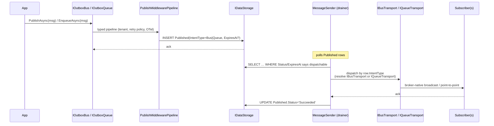
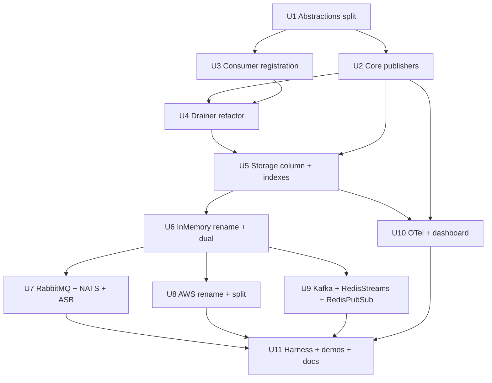

# feat: Messaging — Bus / Queue Type-Level Split (`IBus` + `IQueue`)

## Summary

Replace the existing publisher trio (`IDirectPublisher` / `IOutboxPublisher` / `IScheduledPublisher`) with a **type-level intent split**: four publisher interfaces — `IBus`, `IOutboxBus`, `IQueue`, `IOutboxQueue` — declared in two new intent-specific abstractions packages. Split the current single `Headless.Messaging.Abstractions` into three (shared core + `Bus.Abstractions` + `Queue.Abstractions`). Add an `IntentType` discriminator column to outbox storage, refactor the drainer to dispatch via the matching transport interface (`IBusTransport` / `IQueueTransport`), migrate all nine transport packages to declare capability through **provider-owned direct csproj references plus registered transport types** (no runtime capability flags), rename two packages (`AwsSqs → Aws`, `InMemoryQueue → InMemory`), add one new package (`RedisPubSub`), update OpenTelemetry tags, expose `IntentType` through the dashboard projection, and rewrite `docs/llms/messaging.md` plus provider READMEs. Ships as one coordinated breaking PR with no compatibility shims; `main` never sees a half-migrated state.

This plan is self-contained. The brainstorm and earlier method-level plan artifacts referenced during drafting are not present in this worktree, so the R1-R19 / AE1-AE8 labels below are preserved as plan-local traceability anchors rather than live links to a separate source document.

---

## Problem Frame

The framework currently exposes three publisher interfaces — `IDirectPublisher` / `IOutboxPublisher` / `IScheduledPublisher` — all sharing `IMessagePublisher.PublishAsync<T>`. Intent (broadcast-vs-point-to-point) is implicit and conflated with durability (direct-vs-outbox) and scheduling. Earlier planning attempted a **method-level** split (`SendAsync` / `BroadcastAsync`) with a runtime capability flag and first-call validation; review surfaced three issues that motivated this redesign: broker wire calls do not always differ by method, runtime capability checks are weak API design for a greenfield framework, and durability belongs on a separate axis from intent.

The new design uses the C# type system as the carrier of intent and durability: each publisher interface declares both axes, and each provider package implements **only** the transport interfaces it natively supports. The abstractions packages provide a clean compile-time fence for apps that reference intent packages directly; provider capability is enforced by provider-owned references, setup registrations, and startup validation because `Headless.Messaging.Core` may reference both intent packages transitively. The intent dimension flows end-to-end (publisher interface → outbox row → drainer → transport interface → `ConsumeContext<T>.IntentType` → OTel tag) with the interface itself as the single source of truth.

---

## Current Repo State

This worktree is currently detached at `c38b94be feat(messaging): scaffold bus/queue abstractions split (WIP U1)`. The WIP commit already adds the initial `Bus.Abstractions` / `Queue.Abstractions` projects plus `IntentType` and `MessagePublishOptionsBase`, but those projects are not yet attached to `headless-framework.slnx`, `ConsumeContext.IntentType` currently defaults to `Bus`, and the old publisher / unified `ITransport` surfaces still exist. Treat U1 as a reconciliation-and-completion unit against that WIP state, not a from-scratch create-only unit.

---

## Execution Roadmap

This document is the canonical design map. Execute the work through the five child plans below; each child plan is scoped for `/dev-code` and should keep the build green before the next slice starts.

| Sequence | Child plan | Parent units | Purpose |
|---:|---|---|---|
| 1 | [Foundation contracts](2026-05-21-002-feat-messaging-foundation-contracts-plan.md) | U1-U3 + U4 startup validation | New contracts, publishers, consumer registration, and bootstrap capability checks. |
| 2 | [Intent persistence and drainer](2026-05-21-003-feat-messaging-intent-persistence-drainer-plan.md) | U4-U5 | Durable intent column, received identity, storage projections, and drainer dispatch by intent. |
| 3 | [InMemory vertical slice and testing harness](2026-05-21-004-feat-messaging-inmemory-testing-vertical-plan.md) | U6 + testing-package parts of U11 | First end-to-end proof and intent-aware `Headless.Messaging.Testing` harness. |
| 4 | [Provider migration](2026-05-21-005-feat-messaging-provider-migration-plan.md) | U7-U9 | External broker migrations, AWS rename/split, queue-only providers, and RedisPubSub. |
| 5 | [Observability, dashboard, demos, and docs](2026-05-21-006-feat-messaging-observability-docs-plan.md) | U10 + remaining U11 | OTel tags, dashboard projection, demos, final docs, and README cleanup. |

Do not execute the five slices as disconnected designs. The key decisions, capability matrix, non-goals, and deferred implementation-time decisions in this parent remain authoritative unless a child plan explicitly narrows them.

---

## Scope & Requirements Traceability

In scope (covers all 19 plan-local requirements R1–R19):

- **Surface** (R1, R2, R3, R4): four publisher interfaces in two new abstractions packages, options inheritance from a shared base, retained `Headless.Messaging.Abstractions` as the shared-core root.
- **Consumer** (R5, R6): `AddBusConsumer<T,THandler>()` and `AddQueueConsumer<T,THandler>()` registration helpers; `ConsumeContext<T>.IntentType` populated from registration-derived dispatch path.
- **Storage** (R7, R8, R9, R10): `IntentType SMALLINT NOT NULL` column on `Published` and `Received`; received-message identity expands from `(Version, MessageId, Group)` to `(Version, MessageId, Group, IntentType)` so bus and queue deliveries cannot collapse into the same inbox row; joint dashboard/retry indexes include the new dimension where it matches real query shapes; drainer dispatches via matching transport interface.
- **Telemetry** (R11, R12): two OTel tags (`headless.messaging.intent`, `messaging.destination.kind`); one combined suppression flag; diagnostic listener event names additively compatible.
- **Transports** (R13, R14, R15, R16, R17): nine provider migrations including `AwsSqs → Aws` rename + SNS-Bus / SQS-Queue split (R15), `InMemoryQueue → InMemory` rename + dual implementation (R16), and new `RedisPubSub` package (R17) with documented volatile-delivery semantics.
- **Migration** (R18): single coordinated breaking PR; no compat shims; old `I*Publisher` types deleted outright.
- **Documentation** (R19): rewrite `docs/llms/messaging.md`; update abstractions and provider READMEs per [docs/authoring/AUTHORING.md](../authoring/AUTHORING.md).

### Deferred to Follow-Up Work

These items are planned future work (separate PRs / tickets), distinct from non-goals:

- **#220 polymorphic broadcast dispatch** — consumer-side fan-out across multiple typed handlers; depends on the `IntentType` column landed here.
- **#221 dashboard intent rendering UI** — this plan lands the column and the projection exposure on `MessageView` / `MessageQuery`; the dashboard UI work (filter chips, intent badges) lands separately.
- **#223 advanced scheduling** — cron, dynamic reschedule, scheduled-broadcast wiring beyond simple `Delay` on outbox options.
- **#224 transactional broadcast bridge** — cross-context outbox propagation.
- **#225 inbox pattern** — consumer-side idempotency / dedup.
- **#233 NATS ergonomics** — per-subject vs per-queue-group routing improvements, plus any JetStream-backed broker replay / durable consumer retention story. This plan uses framework outbox durability with NATS Core handoff only.

### Outside this product's identity (non-goals)

- Backward-compatibility shims for the old `IDirectPublisher` / `IOutboxPublisher` / `IScheduledPublisher` surface. Greenfield; breaking change accepted.
- Settable `IntentType` override (replay / forge use cases). The interface IS the intent declaration.
- `IBus` durability via decorator. Durability is a type-level axis.
- Method-level intent variants on the same interface (e.g., `IBus.PublishAsync` + `IBus.SendAsync`). Each interface has exactly one publish/enqueue method.
- Provider package splitting per intent (e.g., `Headless.Messaging.RabbitMq.Bus` + `Headless.Messaging.RabbitMq.Queue`). Providers stay unified; capability is declared via provider-owned direct abstraction references plus setup-registered transport types.

---

## High-Level Technical Design

> The sketches below illustrate the intended approach and are directional guidance for review, not implementation specification.

### Type Surface

```text
Headless.Messaging.Abstractions  (shared core — retained name)
├─ IConsume<TMessage>
├─ ConsumeContext<TMessage> { IntentType: IntentType, … }
├─ IntentType { Bus = 0, Queue = 1 }
├─ MessageHeader, Headers, MessagingConventions
├─ MessagePublishOptionsBase  (shared base: MessageId, CorrelationId, TenantId, Topic, Headers, CallbackName)
└─ IOutboxTransaction, IRetryBackoffStrategy, attribute types

Headless.Messaging.Bus.Abstractions       depends on .Abstractions
├─ IBus            : PublishAsync<T>(T, PublishOptions?, CT)
├─ IOutboxBus      : PublishAsync<T>(T, PublishOptions?, CT)
├─ IBusTransport   (broker-side counterpart)
├─ PublishOptions  : MessagePublishOptionsBase + Delay?   (Delay honored by IOutboxBus only)
└─ AddBusConsumer<T,THandler>() registration helpers

Headless.Messaging.Queue.Abstractions     depends on .Abstractions
├─ IQueue          : EnqueueAsync<T>(T, EnqueueOptions?, CT)
├─ IOutboxQueue    : EnqueueAsync<T>(T, EnqueueOptions?, CT)
├─ IQueueTransport (broker-side counterpart)
├─ EnqueueOptions  : MessagePublishOptionsBase + Delay?   (Delay honored by IOutboxQueue only)
└─ AddQueueConsumer<T,THandler>() registration helpers
```

### Flow



### Per-Provider Capability Matrix (declared by provider references + setup)

| Package | refs `Bus.Abstractions` | refs `Queue.Abstractions` |
|---|:---:|:---:|
| `Headless.Messaging.Nats` | ✅ | ✅ |
| `Headless.Messaging.RabbitMq` | ✅ | ✅ |
| `Headless.Messaging.AzureServiceBus` | ✅ | ✅ |
| `Headless.Messaging.Aws` *(renamed)* | ✅ | ✅ |
| `Headless.Messaging.Pulsar` | ✅ | ✅ |
| `Headless.Messaging.InMemory` *(renamed)* | ✅ | ✅ |
| `Headless.Messaging.Kafka` | ❌ | ✅ |
| `Headless.Messaging.RedisStreams` | ❌ | ✅ |
| `Headless.Messaging.RedisPubSub` *(new)* | ✅ | ❌ |

The table is a provider-owned direct-reference and registration contract: a provider package declares support only when its own `.csproj` directly references the relevant intent abstractions package **and** its setup registers the matching `I*Transport` implementation. Transitive references through `Headless.Messaging.Core` are not capability declarations and are not used to infer provider support. Practically, this means `Kafka` may still bring `IBus` into the consuming app's compile graph through `Core`, but it must not register `IBusTransport`; unsupported intent use fails at startup with the U4 validation error, not at first publish.

---

## Output Structure (new packages and renames)

```text
src/
├── Headless.Messaging.Abstractions/        # retained — internal cleanup only
├── Headless.Messaging.Bus.Abstractions/    # NEW package
│   ├── IBus.cs
│   ├── IOutboxBus.cs
│   ├── IBusTransport.cs
│   ├── PublishOptions.cs
│   ├── ServiceCollectionExtensions.cs       # AddBusConsumer<T,THandler>
│   ├── Headless.Messaging.Bus.Abstractions.csproj
│   └── README.md
├── Headless.Messaging.Queue.Abstractions/  # NEW package
│   ├── IQueue.cs
│   ├── IOutboxQueue.cs
│   ├── IQueueTransport.cs
│   ├── EnqueueOptions.cs
│   ├── ServiceCollectionExtensions.cs       # AddQueueConsumer<T,THandler>
│   ├── Headless.Messaging.Queue.Abstractions.csproj
│   └── README.md
├── Headless.Messaging.Aws/                 # RENAMED from Headless.Messaging.AwsSqs
├── Headless.Messaging.InMemory/            # RENAMED from Headless.Messaging.InMemoryQueue
├── Headless.Messaging.RedisPubSub/         # NEW package
│   ├── RedisPubSubBusTransport.cs
│   ├── RedisPubSubOptions.cs
│   ├── Setup.cs
│   ├── Headless.Messaging.RedisPubSub.csproj
│   └── README.md
└── … (other providers unchanged in structure; csproj refs adjusted per matrix)
```

The implementer may adjust file layout where implementation reveals a better shape; per-unit `**Files:**` sections remain authoritative.

---

## Key Technical Decisions

- **Type-level intent split, not method-level.** Resolves the wire-level mismatch on NATS / Pulsar / SNS (identical wire calls regardless of method) and eliminates capability-flag + first-call-validation runtime complexity. Foundatio precedent supports the distinct bus/queue vocabulary.
- **Durability as a second type-level axis.** `IBus` / `IQueue` (fire-and-forget) vs `IOutboxBus` / `IOutboxQueue` (persisted). Compile-time signal, not runtime characteristic.
- **Scheduling as `Delay` option on outbox interfaces only.** Direct interfaces are fire-and-forget; scheduling requires persistence. Matches Foundatio + NServiceBus precedent.
- **Single outbox table with `IntentType` discriminator column.** One drainer loop; dashboard filters via indexed column.
- **Provider capability declared by provider-owned csproj references plus registered transport types.** Each provider implements only what's native; the package's own `.csproj` dependency on `Bus.Abstractions` and/or `Queue.Abstractions` plus the setup-registered `IBusTransport` / `IQueueTransport` implementation is the capability declaration. Transitive references through `Headless.Messaging.Core` do not count as support, and they can bring both intent abstractions into the consumer compile graph. Add a CI/test guard that scans direct provider references and compiled setup registrations so a queue-only package cannot accidentally register bus support.
- **Three abstractions packages**, retaining `Headless.Messaging.Abstractions` as the shared-core root. Application consumers reference only the intent packages they need.
- **`EnqueueAsync` for queue / `PublishAsync` for bus.** Foundatio verb convention; avoids MassTransit `Send`/`Publish` overloading.
- **`IQueue` is non-generic** (`EnqueueAsync<T>(T)`), symmetric with `IBus.PublishAsync<T>`. Diverges from Foundatio's `IQueue<T>` in favor of MassTransit / NServiceBus shape; per-message-type configuration lives in an options registry resolved by message type.
- **Same `IConsume<T>` handler interface for both intents.** Registration shape (`AddBusConsumer<T>` vs `AddQueueConsumer<T>`) decides which transport wires it up. A handler can be registered for both intents independently (verified during U3).
- **`ConsumeContext<T>.IntentType` is registration-derived and required.** The runtime knows which dispatch path delivered the message; no wire-envelope header carries intent. Do not rely on enum zero as a default: context construction, test helpers, `MediumMessage`, storage projections, and dashboard views must set intent explicitly.
- **One combined `SuppressIntentTags` flag.** Both `headless.messaging.intent` and `messaging.destination.kind` are emit-together by design.
- **`MediumMessage.IntentType` is the storage/runtime contract.** Put `required IntentType IntentType` on `MediumMessage` and thread it through store, delayed pickup, retry pickup, drainer, receive persistence, monitoring projection, and dashboard query paths. Avoid a separate `IDataStorage.StoreMessageAsync(..., IntentType intent)` side channel that can drift from the row object the drainer actually consumes.
- **`OutboxPublisher` refactor: split into separate `OutboxBus` + `OutboxQueue` classes.** Each owns its persistence path; clearer call sites and test boundaries than a single dual-interface type. Confirmed during scoping synthesis.
- **Old publisher types deleted outright.** No `[Obsolete]` keepalives. `IDirectPublisher`, `IOutboxPublisher`, `IScheduledPublisher`, `IMessagePublisher`, `DirectPublisher`, `OutboxPublisher`, and `MessagePublisherExtensions` are removed in U1/U2. `PublisherSentFailedException` is not part of that deletion rule unless U1 deliberately replaces the provider failure wrapper everywhere. Greenfield per CLAUDE.md.
- **AWS package rename + internal SNS-Bus / SQS-Queue split.** `Headless.Messaging.AwsSqs → Headless.Messaging.Aws`. Shared `AmazonSqsConsumerClient` for consume. Internal class organization (one `AwsTransport` with branching vs separate `AmazonSnsTransport` + `AmazonSqsTransport`) settled during U8 implementation.
- **Drainer dispatch shape settled during U4.** Either one `MessageSender` resolving the right transport per row, or split into `BusMessageSender` + `QueueMessageSender`. Both work; pick based on shared-code volume after U2 lands. Regardless of class shape, row-level runtime validation is required: a persisted row with a valid `IntentType` but no matching transport is marked terminal `Failed` with `NextRetryAt = null`, the reason is recorded, and the loop continues to later rows.
- **Single feature branch with stacked commits.** `main` only sees the merged tip with everything migrated; intermediate slices reviewed incrementally on the branch.

---

## System-Wide Impact

| Surface | Impact |
|---|---|
| **Public API** | Breaking. Four new publisher interfaces; three abstractions packages instead of one; old `I*Publisher` types removed. |
| **NuGet packages** | Three new (`Bus.Abstractions`, `Queue.Abstractions`, `RedisPubSub`); two renamed (`AwsSqs → Aws`, `InMemoryQueue → InMemory`); old single `Abstractions` retained name; eight provider csproj reference updates. |
| **Database schema** | New `IntentType SMALLINT NOT NULL` column on `Published` and `Received` across PostgreSQL, SqlServer, InMemoryStorage; new joint indexes. Greenfield drop-and-recreate is acceptable if U5 makes it explicit and tests the old-schema path. |
| **Wire envelope** | Unchanged. Intent is not on the wire (per R7); `TransportMessage.Headers` continues to ride existing headers verbatim. |
| **OpenTelemetry consumers** | Additive — two new tags. Existing tags / event names unchanged (R12). One new suppression flag. |
| **Dashboard** | `MessageView` / `MessageQuery` projection exposes `IntentType`; UI rendering deferred to #221. |
| **Demo projects** | Renames cascade: `*AwsSqs*` → `*Aws*`; `*InMemoryQueue*` → `*InMemory*`. |
| **Test harness** | `MessagingIntegrationTestsBase`, `TransportTestsBase`, `DataStorageTestsBase` updated to be intent-aware; new fixtures for bus-only / queue-only providers. |
| **Documentation** | Full rewrite of `docs/llms/messaging.md` (2388 lines); abstractions and provider READMEs updated. |
| **Downstream tickets** | #220, #221, #223, #224, #233 unblocked. #226 absorbed via R15. |

---

## Implementation Units

Grouped into four design phases and five executable child plans. The child plans are the execution units; this section remains the detailed design reference.

### Phase A — Abstractions, Core, Consumer, Drainer

---

### U1. Split abstractions into three packages; declare new publisher and transport interfaces

**Goal.** Create `Headless.Messaging.Bus.Abstractions` and `Headless.Messaging.Queue.Abstractions` projects. Define `IBus`, `IOutboxBus`, `IQueue`, `IOutboxQueue`, `IBusTransport`, `IQueueTransport`, `IntentType` enum, `PublishOptions`, `EnqueueOptions`, and the shared `MessagePublishOptionsBase`. Add `ConsumeContext<T>.IntentType` property. Delete the old publisher surface and supporting types.

**Requirements.** R1, R2, R3, R4, R6 (property only; population in U3). Covers AE1.

**Dependencies.** None — this is the foundation.

**Files.**
- Audit/modify: `src/Headless.Messaging.Bus.Abstractions/Headless.Messaging.Bus.Abstractions.csproj`
- Audit/modify: `src/Headless.Messaging.Bus.Abstractions/IBus.cs`
- Audit/modify: `src/Headless.Messaging.Bus.Abstractions/IOutboxBus.cs`
- Audit/modify: `src/Headless.Messaging.Bus.Abstractions/IBusTransport.cs`
- Audit/modify: `src/Headless.Messaging.Bus.Abstractions/PublishOptions.cs`
- Audit/modify: `src/Headless.Messaging.Queue.Abstractions/Headless.Messaging.Queue.Abstractions.csproj`
- Audit/modify: `src/Headless.Messaging.Queue.Abstractions/IQueue.cs`
- Audit/modify: `src/Headless.Messaging.Queue.Abstractions/IOutboxQueue.cs`
- Audit/modify: `src/Headless.Messaging.Queue.Abstractions/IQueueTransport.cs`
- Audit/modify: `src/Headless.Messaging.Queue.Abstractions/EnqueueOptions.cs`
- Modify: `src/Headless.Messaging.Abstractions/ConsumeContext.cs` — make `IntentType` explicit/required; remove silent `IntentType.Bus` default from the WIP scaffold.
- Audit/modify: `src/Headless.Messaging.Abstractions/IntentType.cs` — `enum IntentType : short { Bus = 0, Queue = 1 }`; keep values stable, but add tests that every runtime object sets the value explicitly.
- Audit/modify: `src/Headless.Messaging.Abstractions/MessagePublishOptionsBase.cs` — extracted shared base.
- Delete: `src/Headless.Messaging.Abstractions/IDirectPublisher.cs`
- Delete: `src/Headless.Messaging.Abstractions/IOutboxPublisher.cs`
- Delete: `src/Headless.Messaging.Abstractions/IScheduledPublisher.cs`
- Delete: `src/Headless.Messaging.Abstractions/IMessagePublisher.cs`
- Delete: `src/Headless.Messaging.Abstractions/MessagePublisherExtensions.cs`
- Move/rename or retain: `src/Headless.Messaging.Abstractions/PublisherSentFailedException.cs` — this is also the transport failure wrapper contract used by providers and `docs/solutions/guides/messaging-transport-provider-guide.md`. Do not delete it without replacing it with a transport-neutral exception and migrating every provider/doc in the same unit.
- Move: `src/Headless.Messaging.Core/Transport/ITransport.cs` content split into the two new `I*Transport` interfaces; remove the unified `ITransport`. `BrokerAddress` stays in Core.
- Modify: `src/Headless.Messaging.Abstractions/PublishOptions.cs` — old single options record removed; shared properties move to `MessagePublishOptionsBase`
- Modify: `headless-framework.slnx` — attach two new projects

**Approach.**
- All four publisher interfaces and both transport interfaces are `[PublicAPI]`.
- `PublishOptions` and `EnqueueOptions` both inherit from `MessagePublishOptionsBase`; `Delay` is declared on each derived record but only honored by outbox variants at the Core layer (the interface contract says "honored when persisted").
- `IntentType` is `short` (`SMALLINT`) — storage shape governs.
- `ConsumeContext<T>.IntentType` is a `{ get; init; }` non-nullable/required property; no initializer defaults to `IntentType.Bus`. Existing tests and helper factories must be updated to pass the intent explicitly instead of relying on enum zero.
- The shared core package keeps its current name (`Headless.Messaging.Abstractions`) per the §Deferred-to-Planning lean.
- Validate options via FluentValidation if any property requires it; create `internal sealed class {OptionsName}Validator` in the same file (CLAUDE.md convention).
- Reconcile the existing WIP scaffold first: audit XML docs, attach projects to the solution, confirm package references, and only then continue deleting the old publisher / transport contracts.

**Patterns to follow.**
- `[PublicAPI]` annotation on every public type (per CLAUDE.md "Public API Discipline").
- Csproj uses `Headless.NET.Sdk` (per CLAUDE.md "New .NET Projects"); reference `Headless.Messaging.Abstractions` from both new packages via `<ProjectReference>`.
- Source file headers (`// Copyright (c) Mahmoud Shaheen. All rights reserved.`).

**Test suite design.** Unit tests live in two new projects: `tests/Headless.Messaging.Bus.Abstractions.Tests.Unit/` and `tests/Headless.Messaging.Queue.Abstractions.Tests.Unit/`. Existing `tests/Headless.Messaging.Abstractions.Tests.Unit/` retains shared-type tests (`MessageHeader`, `ConsumeContext`, headers constants, `MessagingConventions`).

**Test scenarios.**
- **Covers AE1.** Compile-time fence: an isolated probe project referencing only `Headless.Messaging.Queue.Abstractions` cannot resolve the type name `IBus` (`Type or namespace 'IBus' could not be found`). Probe lives under `tests/Headless.Messaging.PackageReference.Tests.Probe/` or equivalent and is verified via `dotnet build` as part of harness.
- Options inheritance: `PublishOptions` instance has all properties of `MessagePublishOptionsBase` plus `Delay`; round-trip `with`-mutation preserves base properties.
- `IntentType` enum: `(short)IntentType.Bus == 0`, `(short)IntentType.Queue == 1` (storage shape contract).
- `ConsumeContext<T>` construction: `IntentType` is required in runtime code and test helpers; no initializer silently defaults to `Bus`.
- Public surface assertion: `Bus.Abstractions` does not expose `IQueue` / `IOutboxQueue` / `IQueueTransport` symbols (reflection scan over the compiled assembly).

**Verification.**
- New csprojs compile under the strict Headless SDK warnings-as-errors baseline.
- Old publisher type names no longer resolve anywhere in the solution (`rg "IDirectPublisher|IOutboxPublisher|IScheduledPublisher|IMessagePublisher" src tests` returns zero hits after U2 lands).
- All test scenarios above are implemented and passing.
- `headless-framework.slnx` includes the two new projects.

---

### U2. Core publisher implementations; delete old publisher classes; DI registration

**Goal.** Implement `Bus`, `OutboxBus`, `Queue`, `OutboxQueue` concrete types in `Headless.Messaging.Core`. Wire them through the existing typed publish middleware pipeline. Update `SetupMessaging` to register all four; remove old DI registrations.

**Requirements.** R2, R4, R18. Covers AE2 (persistence + delay round-trip behavior).

**Dependencies.** U1.

**Files.**
- Create: `src/Headless.Messaging.Core/Internal/Bus.cs` — `internal sealed class Bus : IBus`, fire-and-forget direct broadcast via `IBusTransport`.
- Create: `src/Headless.Messaging.Core/Internal/OutboxBus.cs` — `internal sealed class OutboxBus : IOutboxBus`, persists to `Published` with `IntentType = Bus`, honors `Delay`.
- Create: `src/Headless.Messaging.Core/Internal/Queue.cs` — `internal sealed class Queue : IQueue`, fire-and-forget point-to-point via `IQueueTransport`.
- Create: `src/Headless.Messaging.Core/Internal/OutboxQueue.cs` — `internal sealed class OutboxQueue : IOutboxQueue`, persists to `Published` with `IntentType = Queue`, honors `Delay`.
- Delete: `src/Headless.Messaging.Core/Internal/DirectPublisher.cs`.
- Delete: `src/Headless.Messaging.Core/Internal/OutboxPublisher.cs`.
- Modify: `src/Headless.Messaging.Core/Setup.cs` — register the four new publishers; remove the three old registrations.
- Modify: `src/Headless.Messaging.Core/ServiceCollectionExtensions.cs` — builder API still surfaces a single entry point; internally registers both bus and queue publishers conditionally based on which abstractions packages the consumer's host references (always register the interfaces; resolution against a missing transport surfaces at startup per R10).
- Modify: `src/Headless.Messaging.Core/Internal/PublishMiddlewarePipeline.cs` — pipeline accepts the new options shapes; intent metadata flows via the publisher type that invoked the pipeline (no envelope field).
- Modify: `src/Headless.Messaging.Core/Configuration/MessagingBuilder.cs` — surface unchanged externally; internal wiring updated.

**Approach.**
- Each publisher class is single-purpose. The `Outbox*` variants accept `IDataStorage` + the typed pipeline; the direct variants resolve `IBusTransport` / `IQueueTransport` and call dispatch immediately.
- `Bus` and `Queue` direct publishers fail during messaging startup (not at first call) if their transport isn't registered. This repo has no `MessagingBuilder.Build()` hook; put validation in the existing `Bootstrapper` / `IBootstrapper.BootstrapAsync` path that is registered from `SetupMessaging.AddHeadlessMessaging()` and also runs as the hosted service. DI resolution can construct the publisher, but bootstrap must fail before dispatch begins when the matching `I*Transport` registration is missing.
- `OutboxBus.PublishAsync` stamps the envelope, then persists a `MediumMessage` with `IntentType = IntentType.Bus`. For delayed sends, keep the current scheduler model: `DelayTime` header + `ExpiresAt = publishAt` + `StatusName.Delayed/Queued` according to the existing `Dispatcher` / `MessageDelayedProcessor` path. Identical shape for `OutboxQueue` with `IntentType.Queue`.
- All four publishers go through the same `PublishMiddlewarePipeline` — tenant context, retry-policy annotation, OTel start-span all happen once regardless of intent.

**Patterns to follow.**
- `internal sealed class` for all four implementations (CLAUDE.md "Public API Discipline").
- `Argument.*` / `Ensure.*` from `Headless.Checks` for argument validation (CLAUDE.md "Argument Validation").
- Logging via `[LoggerMessage]` partial classes at the bottom of the file (per memory `feedback_logger_class_placement.md`).

**Test suite design.** Unit tests in `tests/Headless.Messaging.Core.Tests.Unit/`. Replace `DirectPublisherTests.cs` and `OutboxPublisherTests.cs` with `BusTests.cs`, `OutboxBusTests.cs`, `QueueTests.cs`, `OutboxQueueTests.cs`. Existing fakes (`FakeDataStorage`, `FakeTransport`) split into `FakeBusTransport` and `FakeQueueTransport`.

**Test scenarios.**
- **Covers AE2.** `OutboxQueue.EnqueueAsync<MyCommand>(msg, opts => opts.Delay = TimeSpan.FromMinutes(5))` persists a `Published` row with `IntentType = 1`, a `DelayTime` header, and `ExpiresAt` ≈ `UtcNow + 5min` on the existing delayed scheduler path (assert within tolerance window).
- `OutboxBus.PublishAsync` with no delay persists `Published` row with `IntentType = 0`, no `DelayTime` header, and immediate-dispatch status.
- `Bus.PublishAsync` invokes `IBusTransport.SendAsync` exactly once with the stamped envelope; does NOT touch `IDataStorage`.
- `Queue.EnqueueAsync` invokes `IQueueTransport.SendAsync` exactly once; does NOT touch `IDataStorage`.
- Startup-time error: registering `IBus` with no `IBusTransport` in DI produces a clear `InvalidOperationException` from `IBootstrapper.BootstrapAsync()` / hosted-service startup (covers AE6 contract — full integration check lands in U9).
- Cancellation token threads through all four publishers and is honored when canceled before dispatch.
- Existing publisher behaviors preserved: tenant context stamping, correlation-ID propagation, message-ID generation when `MessageId` is null — verified for all four.
- Edge: `PublishAsync(null)` on `Bus`/`OutboxBus` throws via `Argument.IsNotNull` (consistent with current `IDirectPublisher` behavior).

**Verification.**
- All four publisher tests pass; coverage for the four new classes ≥85% line, ≥80% branch per CLAUDE.md coverage targets.
- `dotnet build` is green; warnings-as-errors clean.
- Old class names removed (`rg "DirectPublisher|OutboxPublisher" src tests` returns zero matches).

---

### U3. Consumer registration helpers; `ConsumeContext<T>.IntentType` population

**Goal.** Add `AddBusConsumer<TMessage, THandler>()` and `AddQueueConsumer<TMessage, THandler>()` registration helpers in the appropriate abstractions packages. Populate `ConsumeContext<T>.IntentType` from the registration-derived dispatch path (not from envelope headers).

**Requirements.** R5, R6. Covers AE4.

**Dependencies.** U1, U2.

**Files.**
- Create: `src/Headless.Messaging.Bus.Abstractions/ServiceCollectionExtensions.cs` — `AddBusConsumer<T,THandler>()` extension method on `IServiceCollection` / `IMessagingBuilder`.
- Create: `src/Headless.Messaging.Queue.Abstractions/ServiceCollectionExtensions.cs` — `AddQueueConsumer<T,THandler>()` extension method.
- Modify: `src/Headless.Messaging.Core/Processor/Dispatcher.cs` — at construct-`ConsumeContext<T>` time, stamp `IntentType` from the registered subscriber path (the dispatcher resolves which registration delivered the message).
- Modify: `src/Headless.Messaging.Core/ConsumerMetadata.cs` — add `IntentType IntentType` to the existing consumer metadata model instead of introducing a parallel registration source.
- Modify: `src/Headless.Messaging.Core/Internal/ConsumerExecutorDescriptor.cs` — carry intent into execution descriptors.
- Modify: `src/Headless.Messaging.Core/Transport/IConsumerClientFactory.cs` and call sites — pass or derive intent early enough for broker subscription topology.
- Modify: `src/Headless.Messaging.Core/Internal/IRuntimeSubscriber.cs` (and impl) — tracks `IntentType` per subscription.

**Approach.**
- Registration helpers wrap the current `ConsumerMetadata` / `ConsumerRegistry` path and stamp `IntentType.Bus` or `IntentType.Queue` there. Do not add a second `ConsumerRegistration` collection that can drift from the existing registry.
- Dual registration: a single handler type registered as both `AddBusConsumer<OrderEvent, Handler>()` and `AddQueueConsumer<OrderEvent, Handler>()` produces two existing metadata entries keyed by `(MessageType, HandlerId/Group, IntentType)`. Both are independently resolvable; dispatch from either path constructs `ConsumeContext<T>` with the matching `IntentType`.
- Intent must be available before late dispatcher context construction: AWS, Pulsar, and NATS need it while building subscription topology (topic/subscription vs queue group/shared subscription). Carry it through metadata, executor descriptors, consumer factory calls, and group keys.
- The `Headless.Messaging.Core` package transitively references both `Bus.Abstractions` and `Queue.Abstractions` (it must — its dispatcher knows both). Application consumers reference only what they need.

**Patterns to follow.**
- Extend the existing `ConsumerMetadata` / registry pattern; no parallel registration model.
- Builder extension pattern matches `services.Configure<TOption, TValidator>(...)` style from CLAUDE.md "Options Pattern".
- Setup convention from CLAUDE.md "DI Registration": registration extensions are extension members on `IServiceCollection` / `IMessagingBuilder`.

**Test suite design.** Unit tests in `tests/Headless.Messaging.Core.Tests.Unit/DispatcherTests.cs`, `ConsumerRegistryTests.cs`, `ConsumerMetadataTests.cs`, and related builder tests. Integration coverage for end-to-end dispatch lands in transport units (U6+) via the harness where integration projects already exist.

**Test scenarios.**
- **Covers AE4.** A handler registered via `AddBusConsumer<OrderEvent, OrderEventHandler>()` receives `context` with `context.IntentType == IntentType.Bus` when the bus dispatch path invokes it.
- Symmetric for `AddQueueConsumer<T, THandler>()` — `context.IntentType == IntentType.Queue`.
- Dual registration: same handler type registered both ways produces two existing metadata/descriptor entries distinguished by `IntentType`; dispatcher invokes the handler with the matching `IntentType` for each path; DI resolves the handler at the user's chosen lifetime without surprise (single shared instance when registered as `Singleton`; separate instances per scope when `Scoped`).
- Conflict path: registering the same `(TMessage, THandler, IntentType)` triple twice surfaces a clear error at registration time (or silently dedupes — implementation choice; assertion captures whichever shape lands).
- `ConsumeContext<T>` constructed outside the dispatcher (e.g., test helpers) requires `IntentType` parameter — no silent default.
- Edge: an isolated app/probe that references only `Queue.Abstractions` cannot call `AddBusConsumer<T,THandler>()` because the bus extension method is not in scope. Provider packages that reference `Core` are handled by startup validation instead, because `Core` may bring both intent packages transitively.

**Verification.**
- Tests above pass.
- `Dispatcher` covers both intent paths in test; branch coverage on the intent-stamp logic ≥90%.

---

### U4. Drainer refactor for intent-aware dispatch

**Goal.** The outbox drainer (`MessageSender` / `IMessageSender`) reads `IntentType` from the persisted row and dispatches via the matching transport interface. Same-process missing-transport misconfiguration fails during startup validation; persisted-row/process-drift mismatches are handled per row at runtime so one bad row cannot stall the drainer loop.

**Requirements.** R10. Covers AE3.

**Dependencies.** U2 (publishers), U3 (consumer intent metadata). Persisted-column integration completes in U5; U4 can use `MediumMessage.IntentType` and fakes before SQL providers project the column.

**Files.**
- Modify: `src/Headless.Messaging.Core/Internal/IMessageSender.cs` — signature change to indicate intent in dispatch contract.
- Modify: `src/Headless.Messaging.Core/Internal/MessageSender.cs` (or successor) — resolves `IBusTransport` / `IQueueTransport` per row's `IntentType`.
- Modify: `src/Headless.Messaging.Core/Internal/IBootstrapper.Default.cs` — add startup validation to the existing `Bootstrapper` / `IBootstrapper.BootstrapAsync` path before subscriptions and dispatch start.
- Modify: `src/Headless.Messaging.Core/Setup.cs` — register any validator service the bootstrapper needs; do not invent a `MessagingBuilder.Build()` hook.
- Modify: `src/Headless.Messaging.Core/Messages/MediumMessage.cs` — add `IntentType IntentType { get; init; }` field projected from storage.

**Approach.**
- Implementation-time decision: keep one `MessageSender` resolving the right transport per row, OR split into `BusMessageSender` + `QueueMessageSender`. Both work; pick during implementation based on shared-code volume after U2 lands. Default lean: keep one — the per-row branch is tiny and the shared retry/circuit-breaker logic is large.
- Startup validation hook: enumerate registered `ConsumerMetadata` entries (from U3); for each unique `IntentType` present, assert the corresponding transport interface (`IBusTransport` or `IQueueTransport`) has at least one DI registration. The same bootstrap-time validator also checks publisher availability: if `IBus` / `IOutboxBus` or `IQueue` / `IOutboxQueue` is registered for use without the matching transport, fail before dispatch starts.
- Error message shape: `"Cannot start messaging: registered IBus / OutboxBus / AddBusConsumer but no IBusTransport implementation is registered. Did you forget to call services.AddRabbitMq()/AddNats()/AddRedisPubSub()/...?"` — concrete and actionable.

**Patterns to follow.**
- Logging via `[LoggerMessage]` partial class at the bottom of `MessageSender.cs`.
- Startup-validation hook pattern matches existing `Headless.Hosting` `ValidateOnStart()` shape from CLAUDE.md "Options Pattern".

**Test suite design.** Unit tests in `tests/Headless.Messaging.Core.Tests.Unit/MessageSenderTests.cs` (refactored) with fake `IBusTransport` / `IQueueTransport`. Integration smoke at the harness level covers cross-storage dispatch.

**Test scenarios.**
- **Covers AE3.** A `MediumMessage` projected from a `Published` row with `IntentType = Queue` invokes the registered `IQueueTransport.SendAsync` exactly once; `IBusTransport` is not invoked.
- Symmetric for `IntentType = Bus` → `IBusTransport.SendAsync`.
- Startup hook: app registers `IOutboxBus` consumer but no `IBusTransport` provider → `IBootstrapper.BootstrapAsync()` / hosted-service startup throws `InvalidOperationException` with the intent name in the message.
- Startup hook: app registers both `IBus` and `IQueue` consumers but only `IBusTransport` is registered → error names the missing `IQueueTransport`.
- Drainer respects the existing delayed scheduler path: row with `IntentType = Queue`, `DelayTime`, future `ExpiresAt`, and delayed/queued status is left undispatched until the timestamp elapses (covers AE2 end-to-end).
- Retry behavior preserved: a transport failure for one intent does not affect rows of the other intent (independent retry counters per row remain correct).
- Edge: row with `IntentType` value outside `{0,1}` (corrupted storage) → drainer logs an error and marks only that row terminal `Failed` with `NextRetryAt = null` and recorded exception info (no silent dispatch to wrong transport).
- Edge: drainer encounters a row with valid `IntentType` but the matching transport is not registered in DI at dispatch time (config drift between writer and reader processes, or a transport package removed after rows were persisted) → drainer logs critical, marks only that row terminal `Failed` with `NextRetryAt = null` and a clear reason ("no IBusTransport registered for row with IntentType=Bus"), and does not stall the loop on subsequent rows. Distinct from the startup hook (which prevents the common same-process misconfiguration at process start).

**Verification.**
- Tests above pass.
- Startup-time validation hook produces actionable error messages (assertion on exception message text).
- Drainer code path coverage ≥85% line.

---

### Phase B — Storage

---

### U5. Storage schema: `IntentType` column + joint indexes on all three providers

**Goal.** Add `IntentType SMALLINT NOT NULL` column to `Published` and `Received` tables on PostgreSQL, SqlServer, and InMemoryStorage. Define joint indexes with `StatusName` (and existing ordering columns) to support dashboard intent-filtered queries.

**Requirements.** R7, R8, R9. Covers AE3 (index-supported predicate).

**Dependencies.** U1 (`IntentType` enum), U2 (`Published` row writes carry the column), U4 (`MediumMessage.IntentType` projection field).

**Files.**
- Modify: `src/Headless.Messaging.PostgreSql/PostgreSqlStorageInitializer.cs` — DDL adds `IntentType SMALLINT NOT NULL`; new joint index `IX_{schema}_Published_IntentType_StatusName_ExpiresAt` (shape settled per provider during implementation — partial / filtered / full).
- Modify: `src/Headless.Messaging.PostgreSql/PostgreSqlDataStorage.cs` — `INSERT` / `SELECT` / `UPDATE` statements include the new column; query helpers expose intent-filtered predicates.
- Modify: `src/Headless.Messaging.PostgreSql/PostgreSqlMonitoringApi.cs` — projection includes `IntentType`.
- Modify: `src/Headless.Messaging.SqlServer/SqlServerStorageInitializer.cs` — DDL adds the column; new joint index `IX_{schema}_Published_IntentType_StatusName_ExpiresAt`.
- Modify: `src/Headless.Messaging.SqlServer/SqlServerDataStorage.cs` — analogous to PostgreSQL.
- Modify: `src/Headless.Messaging.SqlServer/SqlServerMonitoringApi.cs` — projection.
- Modify: `src/Headless.Messaging.InMemoryStorage/InMemoryDataStorage.cs` — in-memory model adds `IntentType` field; query helpers respect it.
- Modify: `src/Headless.Messaging.InMemoryStorage/InMemoryMonitoringApi.cs` — projection.
- Modify: `src/Headless.Messaging.InMemoryStorage/InMemoryStorageInitializer.cs` — in-memory schema documents the column.
- Modify: `src/Headless.Messaging.Core/Persistence/IDataStorage.cs` — replace the current topic/message persistence shape with a storage-envelope shape that carries a `MediumMessage` (or equivalent draft object) containing `IntentType`; do **not** add a separate `StoreMessageAsync(..., IntentType intent)` side-channel.
- Modify: `src/Headless.Messaging.Core/Messages/MediumMessage.cs` — add `required IntentType IntentType`.
- Modify: `src/Headless.Messaging.Core/Monitoring/MessageQuery.cs` — add optional `IntentType` filter.
- Modify: `src/Headless.Messaging.Core/Monitoring/MessageView.cs` — add `IntentType` projection.

**Approach.**
- `IntentType` is `SMALLINT NOT NULL` (no default constant in the column DDL; the application always supplies it because the publisher type is the source). Because current initializers use `CREATE TABLE IF NOT EXISTS` / `IF OBJECT_ID IS NULL`, greenfield does not automatically update an existing local/test database. U5 must either explicitly drop/recreate the messaging tables for this breaking branch or add idempotent `ALTER TABLE ADD IntentType ...` logic plus backfill for existing local rows. Pick one deliberately; do not assume the initializer will add the column.
- Received identity expands from `(Version, MessageId, Group)` to `(Version, MessageId, Group, IntentType)` across SQL unique indexes and the in-memory `_receivedIdentityIndex`. This prevents a bus delivery and a queue delivery with the same message id/group from collapsing into one inbox row.
- `MediumMessage.IntentType` is required and is the only storage/runtime carrier. All INSERTs, delayed SELECTs, retry SELECTs, `Change*State` round-trips, and monitoring projections must include it before U4 dispatches by intent. If the existing `StoreMessageAsync(topic, message, transaction, ...)` shape remains internally useful, wrap those arguments into a `MediumMessage` before crossing the `IDataStorage` boundary so the persisted row object and drainer object cannot disagree.
- Index shape per provider:
  - **PostgreSQL.** Extend the existing delayed/retry/dashboard indexes only where the actual predicates use intent. For dashboard page/count queries, add intent to predicates that filter by `MessageQuery.IntentType` and keep ordering aligned with the existing `Added DESC` projection query.
  - **SqlServer.** Same principle: filtered/composite indexes follow actual retry/delayed and dashboard query predicates, not a synthetic `(IntentType, StatusName, ExpiresAt)` shape when the query orders/pages by `Added`.
  - **InMemory.** No physical index; just a sortable model field.
- Receive-side population (R7): `Received.IntentType` is stamped from the existing consumer metadata / descriptor that dispatched the message — the storage layer accepts whatever the runtime passes; the runtime computes it from U3 metadata. External / non-framework-stamped messages (no matching metadata) cannot reach storage because they fail subscription matching first; this case doesn't arise.

**Patterns to follow.**
- SQL/Storage idioms match existing patterns in `PostgreSqlDataStorage` / `SqlServerDataStorage`.
- DDL changes go through the existing `IStorageInitializer` flow.
- Index naming follows `IX_{schema}_{Table}_{cols}` / `idx_{table}_{cols}` per provider.

**Test suite design.** Unit tests update existing `tests/Headless.Messaging.PostgreSql.Tests.Unit/`, `SqlServer.Tests.Unit/`, `InMemoryStorage.Tests.Unit/`. Integration tests via Testcontainers in `tests/Headless.Messaging.PostgreSql.Tests.Integration/` and `tests/Headless.Messaging.SqlServer.Tests.Integration/` verify real DDL, real INSERT/SELECT round-trips, and index existence. Harness updates in `tests/Headless.Messaging.Core.Tests.Harness/DataStorageTestsBase.cs` add intent-aware scenarios applied to all storage providers.

**Test scenarios.**
- **Covers AE3.** Insert a `Published` row with `IntentType = 1`; `SELECT … WHERE IntentType = 1 AND StatusName = 'Succeeded'` returns the row; query plan inspection confirms index seek (PostgreSQL / SqlServer integration tests — `EXPLAIN` / `SET STATISTICS XML ON`).
- Schema initializer creates the column and the index on a fresh database; idempotent re-initialization is a no-op.
- Existing local/test schema path: initialize an old schema without `IntentType`, run the new initializer, and assert either the tables are deliberately rebuilt or the column/backfill/indexes are added. This test captures the chosen greenfield reset strategy.
- `IDataStorage.StoreMessageAsync` round-trip: pass a storage envelope / `MediumMessage` with `IntentType = Bus`, fetch, assert `IntentType == Bus`. Same for `Queue`. A compile-time or unit guard ensures there is no overload that accepts intent separately from the row object.
- Received identity: store two received rows with the same `(Version, MessageId, Group)` but different `IntentType`; both rows exist and later exception/state updates target the matching intent row only. Repeat for `Group = null` because PostgreSQL currently uses a `COALESCE(Group, '')` unique index.
- Delayed/retry pickup projection: delayed and persisted-retry SELECTs populate `MediumMessage.IntentType`; a delayed queue row never re-enters the drainer as default bus.
- Dashboard projection: `MonitoringApi.GetMessages(…)` returns rows with `IntentType` populated (no null / no default).
- Dashboard filtering: `MessageQuery.IntentType = Queue` filters both count and page queries; query plans use the selected dashboard index shape where supported.
- Edge: every existing test that inserts a `Published` row now supplies `IntentType`; no test silently relies on a default value (this is the per-CLAUDE.md greenfield rule — broken tests are updated, not papered over).
- Index existence assertion: integration test queries the catalog (`pg_indexes` / `sys.indexes`) and asserts the new index by name.

**Verification.**
- Storage integration tests across all three providers pass against real backends (Testcontainers PostgreSQL, SqlServer, in-process InMemory).
- Drop-recreate cycle on a non-empty test fixture succeeds without data corruption (R9 acceptable: greenfield drop is OK).
- Index seek confirmed for intent-filtered queries on PostgreSQL + SqlServer.

---

### Phase C — Transports

---

### U6. `Headless.Messaging.InMemory` — rename + dual-intent implementation

**Goal.** Rename `Headless.Messaging.InMemoryQueue` → `Headless.Messaging.InMemory`. Keep the existing in-process queue as the `IQueueTransport` implementation; add a new in-process pub/sub for the `IBusTransport` implementation. Both live in one package. Update test harness to use the renamed package broadly.

**Requirements.** R13, R14, R16.

**Dependencies.** U1-U5. The rename and transport split can start from U1, but the end-to-end outbox/drainer scenarios in this unit require the publisher, consumer metadata, drainer, and storage-intent slices.

**Files.**
- Rename directory: `src/Headless.Messaging.InMemoryQueue/` → `src/Headless.Messaging.InMemory/`.
- Rename csproj: `src/Headless.Messaging.InMemory/Headless.Messaging.InMemory.csproj`.
- Rename: `src/Headless.Messaging.InMemory/InMemoryQueueTransport.cs` → `InMemoryQueueTransport.cs` (keep name internally; class still `InMemoryQueueTransport : IQueueTransport`).
- Create: `src/Headless.Messaging.InMemory/InMemoryBusTransport.cs` — `InMemoryBusTransport : IBusTransport`; in-process channel/subject fan-out.
- Modify: `src/Headless.Messaging.InMemory/Setup.cs` — registers both transports under one `AddInMemory(…)` builder call; csproj references both `Bus.Abstractions` and `Queue.Abstractions`.
- Rename: `src/Headless.Messaging.InMemory/README.md`.
- Modify: `headless-framework.slnx` — update project paths.
- Rename: `tests/Headless.Messaging.InMemoryQueue.Tests.Unit/` → `tests/Headless.Messaging.InMemory.Tests.Unit/`.
- Modify: `tests/Headless.Messaging.Core.Tests.Harness/TransportTestsBase.cs` — accept both transport interfaces in the harness setup.
- Update all cross-references: demos, slnx, csprojs in existing messaging test projects that reference the old package name.

**Approach.**
- The in-process pub/sub mirrors the channel-fan-out pattern: an `IBusTransport.SendAsync(envelope)` writes to a `Channel<T>` per topic; subscribers are registered consumer paths from existing `ConsumerMetadata`/descriptors with `IntentType.Bus`. The existing in-process queue keeps its current shape (one queue per logical destination).
- Both transports share `BrokerAddress` semantics from `Headless.Messaging.Core/Transport/BrokerAddress.cs`.
- `Setup.cs` builder pattern from CLAUDE.md: `SetupInMemory.AddInMemory(...)` extension on `IServiceCollection`; internally registers `InMemoryBusTransport : IBusTransport` and `InMemoryQueueTransport : IQueueTransport`.
- Rename affects test harness — most unit tests use `Headless.Messaging.InMemory` for in-process transport. Rename must propagate completely.

**Patterns to follow.**
- `internal sealed class` for transport implementations.
- Setup convention per CLAUDE.md (`SetupInMemory` class with extension members on `IServiceCollection`).
- Thread-safety: use `ConcurrentDictionary` / `Channel<T>` (lock-free) patterns already established in the existing `InMemoryQueueTransport`.

**Test suite design.** Existing `InMemoryQueue.Tests.Unit/` rename + scope expansion. Add scenarios for the new `InMemoryBusTransport` covering broadcast fan-out using the in-process transport. The renamed unit test project becomes the canonical home for both intents unless implementation deliberately creates a new integration fixture.

**Test scenarios.**
- `InMemoryBusTransport.SendAsync` to a topic with three subscribers fans out to all three (every subscriber receives one copy).
- `InMemoryQueueTransport.SendAsync` to a queue with two competing workers delivers to exactly one (point-to-point semantics preserved).
- Dual registration end-to-end: register a handler via `AddBusConsumer<OrderEvent,…>` and `AddQueueConsumer<OrderEvent,…>`, dispatch one bus message and one queue message — handler is invoked once per dispatch path, `ConsumeContext.IntentType` matches.
- Drainer end-to-end: `OutboxBus.PublishAsync` → `Published` row → drainer → `InMemoryBusTransport.SendAsync` → subscriber receives → `Received` row inserted with `IntentType = Bus`.
- Cancellation propagation: cancel mid-dispatch leaves `Published` row in `Scheduled` state for retry.
- All existing in-memory integration scenarios continue to pass after rename (no behavioral regression on the queue side).

**Verification.**
- Renamed test project compiles and runs.
- `headless-framework.slnx` references the renamed project, not the old path.
- All references to `Headless.Messaging.InMemoryQueue` are gone (`rg "InMemoryQueue" --type csproj --type cs src tests demo` shows only the renamed `InMemoryQueueTransport` class name where appropriate).
- README.md rewritten to describe both intents.

---

### U7. RabbitMQ, NATS, Azure Service Bus — dual-intent transport implementations

**Goal.** Each provider implements both `IBusTransport` and `IQueueTransport`. Wiring matches broker-native primitives: RabbitMQ fanout vs direct, NATS Core subject pub/sub + queue groups, Azure topic vs queue. Csprojs reference both new abstractions packages.

**Requirements.** R13, R14.

**Dependencies.** U1, U2, U6 (test harness shape).

**Files.**
- Modify: `src/Headless.Messaging.RabbitMq/RabbitMqTransport.cs` → split into `RabbitMqBusTransport.cs` (fanout exchange) + `RabbitMqQueueTransport.cs` (direct exchange). Shared connection / channel pool stays in a helper.
- Modify: `src/Headless.Messaging.RabbitMq/Setup.cs` — registers both transports; csproj references both new abstractions packages.
- Modify: `src/Headless.Messaging.RabbitMq/Headless.Messaging.RabbitMq.csproj` — references.
- Modify: `src/Headless.Messaging.Nats/NatsTransport.cs` → split into `NatsBusTransport.cs` + `NatsQueueTransport.cs`. NATS Core subject for `IBusTransport`; queue groups for `IQueueTransport`.
- Modify: `src/Headless.Messaging.Nats/Setup.cs`, `Headless.Messaging.Nats.csproj`.
- Modify: `src/Headless.Messaging.AzureServiceBus/AzureServiceBusTransport.cs` → split into `AzureServiceBusBusTransport.cs` (topic) + `AzureServiceBusQueueTransport.cs` (queue).
- Modify: `src/Headless.Messaging.AzureServiceBus/Setup.cs`, `Headless.Messaging.AzureServiceBus.csproj`.

**Approach.**
- For each provider, keep the existing `IConsumerClient` / `IConsumerClientFactory` shape where possible; the consume side gains an intent-aware subscription/topology input derived from `ConsumerMetadata.IntentType`, not a new parallel registration model.
- Class organization: prefer two separate classes per provider (`{Provider}BusTransport` + `{Provider}QueueTransport`) over one branching class. Shared connection state lives in an internal helper (`{Provider}ConnectionPool` etc., reuse existing where possible). This mirrors the §Outstanding-Questions lean for AWS (U8) but applied uniformly.
- NATS specifically: JetStream-backed broker replay / durable consumer retention is outside this migration and remains follow-up work under #233. The direct `IBusTransport.SendAsync` and `IQueueTransport.SendAsync` go through NATS Core; the outbox path persists framework-side and the drainer dispatches via the same transports. Do not add a JetStream startup requirement in U7.

**Patterns to follow.**
- Setup convention per CLAUDE.md (`SetupRabbitMq`, `SetupNats`, `SetupAzureServiceBus` classes with extension members on `IServiceCollection`).
- `internal sealed` transport classes.
- Argument validation via `Headless.Checks`.
- `[LoggerMessage]` partial logger classes at file bottom.

**Test suite design.** Existing integration tests under `tests/Headless.Messaging.RabbitMq.Tests.Integration/` and `tests/Headless.Messaging.Nats.Tests.Integration/` extend with intent-aware scenarios. Azure Service Bus currently has unit tests only, so U7 updates `tests/Headless.Messaging.AzureServiceBus.Tests.Unit/` unless creating a new emulator/live integration project is explicitly chosen during implementation. The harness in `Headless.Messaging.Core.Tests.Harness/TransportTestsBase.cs` adds parameterized bus-vs-queue test methods that integration-capable transports run through; unit-only providers get focused transport/setup tests.

**Test scenarios (per provider; apply identically to RabbitMQ, NATS, ASB).**
- Bus broadcast: publish via `IBusTransport.SendAsync` to a topic with three subscriber clients (separate connections / consumer groups / subscriptions per broker convention) → all three receive the message.
- Queue point-to-point: enqueue via `IQueueTransport.SendAsync` to a queue with three competing consumer clients → exactly one receives the message.
- End-to-end outbox: `OutboxBus.PublishAsync` → drainer dispatches via `{Provider}BusTransport` → subscribers receive → `Received` row inserted with `IntentType = Bus`. Symmetric for `OutboxQueue`.
- Delayed enqueue: `OutboxQueue.EnqueueAsync(msg, opts.Delay = 5s)` → drainer holds the row until elapsed → exactly one consumer receives the message (verifies AE2 end-to-end through this provider).
- Connection failure mid-dispatch: simulated broker disconnect during `SendAsync` → row remains in `Scheduled` / `Failed` state per retry policy; no message loss.
- Tenant header round-trip: a published message with `TenantId` header round-trips through the transport intact (regression check on R12 — diagnostic listener event data shape unchanged).
- NATS specific: direct Core NATS publish/subscription paths work with a non-JetStream NATS server; outbox durability remains framework-side until the drainer hands the message to NATS.

**Verification.**
- Integration tests pass against Testcontainers RabbitMQ and NATS Core. Azure Service Bus unit coverage passes; if a new emulator/live ASB integration fixture is added, it must be validated separately and documented as new test infrastructure.
- Capability matrix in package READMEs reflects both intents (R19 partial — full doc rewrite in U11).

---

### U8. `Headless.Messaging.Aws` — rename + SNS-Bus / SQS-Queue split

**Goal.** Rename `Headless.Messaging.AwsSqs` → `Headless.Messaging.Aws`. The SNS publish path becomes `IBusTransport`; a new SQS `SendMessage` publish path becomes `IQueueTransport`. The existing `AmazonSqsConsumerClient` continues to serve consume for both intents (SQS queues subscribed to SNS topics or used directly).

**Requirements.** R13, R14, R15. Covers AE7.

**Dependencies.** U1, U2, U6 (harness shape).

**Files.**
- Rename directory: `src/Headless.Messaging.AwsSqs/` → `src/Headless.Messaging.Aws/`.
- Rename csproj: `src/Headless.Messaging.Aws/Headless.Messaging.Aws.csproj`.
- Rename + split: `src/Headless.Messaging.AwsSqs/AmazonSqsTransport.cs` → `src/Headless.Messaging.Aws/AmazonSnsBusTransport.cs` (uses `IAmazonSimpleNotificationService.PublishAsync`) + `src/Headless.Messaging.Aws/AmazonSqsQueueTransport.cs` (uses `IAmazonSQS.SendMessageAsync`).
- Keep: `src/Headless.Messaging.Aws/AmazonSqsConsumerClient.cs` — shared consume for both intents.
- Modify: `src/Headless.Messaging.Aws/Setup.cs` — registers both transports + the shared consumer client; csproj references both new abstractions packages.
- Namespace rename: `Headless.Messaging.AwsSqs` → `Headless.Messaging.Aws` across all files.
- Rename: `src/Headless.Messaging.Aws/README.md`.
- Modify: `headless-framework.slnx` — update project path.
- Rename: `tests/Headless.Messaging.AwsSqs.Tests.Integration/` → `tests/Headless.Messaging.Aws.Tests.Integration/`.
- Update LocalStack fixture wiring (SNS topic + SQS queue subscription provisioning) to support both publish paths and the shared consume path.
- Rename: `demo/Headless.Messaging.AwsSqs.InMemory.Demo/` → `demo/Headless.Messaging.Aws.InMemory.Demo/` (and the project name inside the csproj).
- Audit: configuration key namespaces in demo `appsettings.json` and any integration test config files (e.g., `Messaging:AwsSqs:…` → `Messaging:Aws:…`); options binding sections in `Setup.cs` (`configuration.GetSection("Messaging:AwsSqs")` style calls) updated to match.

**Approach.**
- The brainstorm flags the internal class organization as a §Deferred-to-Planning item: one `AwsTransport` with branching vs two separate transport classes. Lean: **two separate classes** (`AmazonSnsBusTransport` + `AmazonSqsQueueTransport`) — keeps each class focused on its AWS SDK client (`IAmazonSimpleNotificationService` vs `IAmazonSQS`) and avoids method-dispatch branching for what are genuinely different AWS API surfaces.
- Consume side: `AmazonSqsConsumerClient` is unchanged structurally — it polls SQS queues. Those queues may be (a) directly fed by `IAmazonSQS.SendMessage` (queue intent) or (b) subscribed to SNS topics (bus intent fan-out via SNS → SQS subscriptions per consumer). The intent is determined by `ConsumerMetadata.IntentType` (Core layer), not by inspection of the SQS message.
- SNS publish → SQS subscribe is the "broadcast" semantic on AWS: SNS publishes once; subscribed SQS queues each receive their own copy. This matches the brainstorm §Key Decisions on the hybrid honest naming.
- The rename cascades through every namespace `using` in test projects, demo projects, and any external `csproj` references. Use a project-wide find/replace + manual review.

**Patterns to follow.**
- Setup convention per CLAUDE.md (`SetupAws` class with extension members on `IServiceCollection`).
- AWS SDK client lifetime: existing pattern (singleton clients) preserved.
- LocalStack fixture pattern from existing `tests/Headless.Messaging.AwsSqs.Tests.Integration/` fixtures.

**Test suite design.** Renamed integration tests cover both publish paths against LocalStack. Harness `TransportTestsBase` parameterized bus/queue scenarios from U7 apply identically here.

**Test scenarios.**
- **Covers AE7.** Publish via `IBus.PublishAsync` against the renamed package → SNS receives the publish; subscribed SQS queues receive copies; `AmazonSqsConsumerClient` delivers them to bus consumers.
- Enqueue via `IQueue.EnqueueAsync` → SQS receives the message directly; queue consumers receive it (point-to-point).
- Cross-intent: an app registers both a bus consumer (via SNS → SQS subscription) and a queue consumer (direct SQS) — both work independently.
- LocalStack integration: SNS topic + SQS subscription provisioning on first connect; SQS-direct queue provisioning on first connect.
- Tenant + correlation header propagation through SNS message attributes and SQS message attributes.
- Connection failure during SNS publish → retry per policy; no message loss; row stays in outbox.
- Rename audit: `rg "AwsSqs" src tests demo` shows zero hits in csproj, namespace, or class declarations after migration (file paths only — the rename is the whole point).

**Verification.**
- LocalStack integration tests pass for both publish paths and the shared consume path.
- Demo project renamed and builds.
- README rewritten to describe SNS-Bus + SQS-Queue + shared consume.

---

### U9. Kafka + RedisStreams (queue-only) + new `Headless.Messaging.RedisPubSub` (bus-only)

**Goal.** Kafka and RedisStreams implement `IQueueTransport` only; their csprojs reference only `Queue.Abstractions`. Create a new `Headless.Messaging.RedisPubSub` package implementing `IBusTransport` only, with volatile-delivery semantics documented prominently.

**Requirements.** R13, R14, R17. Covers AE6, AE8.

**Dependencies.** U1, U2, U6 (harness).

**Files.**
- Modify: `src/Headless.Messaging.Kafka/KafkaTransport.cs` → rename to `KafkaQueueTransport.cs` if it helps readability; class implements `IQueueTransport` only.
- Modify: `src/Headless.Messaging.Kafka/Setup.cs`, `Headless.Messaging.Kafka.csproj` — provider csproj directly references only `Queue.Abstractions` for capability, even though it also references Core transitively.
- Modify: `src/Headless.Messaging.RedisStreams/RedisTransport.cs` → rename to `RedisStreamsQueueTransport.cs`; class implements `IQueueTransport` only.
- Modify: `src/Headless.Messaging.RedisStreams/Setup.cs`, `Headless.Messaging.RedisStreams.csproj`.
- Modify: `src/Headless.Messaging.Pulsar/PulsarTransport.cs` → split into `PulsarBusTransport.cs` + `PulsarQueueTransport.cs`. Bus = publish to topic with independent subscriptions per logical subscriber; Queue = publish to topic with one logical subscription shared by competing workers (Shared / Key_Shared subscription type per R14).
- Modify: `src/Headless.Messaging.Pulsar/Setup.cs`, `Headless.Messaging.Pulsar.csproj` — references both abstractions.
- Create: `src/Headless.Messaging.RedisPubSub/Headless.Messaging.RedisPubSub.csproj` — references `Bus.Abstractions` only.
- Create: `src/Headless.Messaging.RedisPubSub/RedisPubSubBusTransport.cs` — implements `IBusTransport` via Redis `PUBLISH`. Internal `ISubscriber` wrapper for the consume side.
- Create: `src/Headless.Messaging.RedisPubSub/RedisPubSubOptions.cs` — connection multiplexer config.
- Create: `src/Headless.Messaging.RedisPubSub/Setup.cs` — DI helpers.
- Create: `src/Headless.Messaging.RedisPubSub/README.md` — prominent volatile-delivery callout (R17).
- Modify: `headless-framework.slnx` — attach the new project.
- Create optional: `tests/Headless.Messaging.RedisPubSub.Tests.Integration/` — Testcontainers Redis fixture if implementation chooses integration coverage for the new RedisPubSub package.

**Approach.**
- Kafka and RedisStreams are mechanical: today they implement a unified `ITransport`; the rename narrows their declared interface to `IQueueTransport` only. Their consume side (consumer groups, XREADGROUP) was already queue-shaped; the change is in the type system, not behavior.
- Pulsar is dual-intent (per R14). The Bus vs Queue distinction is **per-subscription, not per-message**. The transport publishes to a topic; subscription mode (Exclusive vs Shared) governs which intent the consumers expose. Two separate transport classes both publish to topics; the framework's `ConsumerMetadata.IntentType` determines which subscription mode the consumer client opens.
- `RedisPubSub` is greenfield. The implementation calls `ISubscriber.PublishAsync` (write side) and `ISubscriber.SubscribeAsync` (consume side). No persistence, no acks, no replay — explicitly documented. The `IBusTransport.SendAsync` awaits the StackExchange.Redis `PublishAsync` completion (which signals that the Redis server has accepted the `PUBLISH` command) before returning. This preserves the outbox-to-broker handoff: the drainer marks the row as `Succeeded` only after Redis has accepted the publish. Broker-side delivery to currently-connected subscribers remains volatile per R17.
- The `IOutboxBus + RedisPubSub` combination is a layering distinction: the outbox guarantees framework-side persistence; the broker-side delivery is still volatile. README + `docs/llms/messaging.md` (U11) call this out prominently per R17.

**Patterns to follow.**
- Setup convention per CLAUDE.md (`SetupKafka`, `SetupRedisStreams`, `SetupRedisPubSub`, `SetupPulsar` classes).
- New package conventions: `Headless.NET.Sdk` SDK in csproj, `[PublicAPI]` annotations, source file headers.
- README authoring rules from [docs/authoring/AUTHORING.md](../authoring/AUTHORING.md).

**Test suite design.** Existing unit tests for Kafka, RedisStreams, and Pulsar update for queue-only / dual-mode coverage. New `tests/Headless.Messaging.RedisPubSub.Tests.Integration/` may be created because Redis has a cheap Testcontainers fixture and RedisPubSub is a new broker package; if implementation keeps it unit-only initially, the volatile-delivery behavior must still be covered with a deterministic fake/subscriber seam.

**Test scenarios.**
- **Covers AE6.** Kafka package: `rg "Bus.Abstractions" src/Headless.Messaging.Kafka/Headless.Messaging.Kafka.csproj` shows no direct provider reference. Because `Core` may bring bus abstractions transitively, the enforceable provider-capability guard is startup validation: an application that uses Kafka while registering bus intent (e.g., `AddBusConsumer<T,H>` with no `IBusTransport` provider) fails at `IBootstrapper.BootstrapAsync()` with the U4 hook error message naming the missing `IBusTransport`.
- Kafka queue end-to-end: `OutboxQueue.EnqueueAsync` → Published row → drainer dispatches via `KafkaQueueTransport` → consumer group receives → Received row.
- **Covers AE8.** RedisPubSub package: csproj references `Bus.Abstractions` only. Attempting to register it as a queue transport produces a clear DI error (no `IQueueTransport` exposed by the package).
- RedisPubSub bus broadcast: three connected subscribers receive a `PUBLISH`-ed message.
- RedisPubSub volatile-delivery negative test: subscriber that is offline at publish time does NOT receive the message after reconnect (this is the explicit semantic guarantee documented in the README — the test asserts the constraint, not a bug).
- RedisPubSub publish-ack: `IBusTransport.SendAsync` does not return until the Redis server has acknowledged the `PUBLISH` command (StackExchange.Redis `PublishAsync` task completes). Simulated mid-publish connection drop produces a faulted task, not silent success.
- Pulsar bus: publish + independent subscription per logical subscriber → each receives one copy.
- Pulsar queue: publish + shared subscription across workers → exactly one worker receives.
- Pulsar OutboxBus + OutboxQueue end-to-end through the drainer.
- Capability matrix in README of each provider matches the in-code reality (csproj references = README capability table). Tested via doc lint or README scan.

**Verification.**
- Unit coverage passes for Kafka, RedisStreams, and Pulsar. RedisPubSub passes either its new Testcontainers integration suite or an explicitly documented unit/fake seam that proves volatile-delivery behavior.
- New `RedisPubSub` package compiles and publishes a `*.nupkg` artifact (`make pack`).
- `headless-framework.slnx` includes the new project.
- README volatile-delivery callout is prominent (top of README, not buried).

---

### Phase D — Observability & Wrap-up

---

### U10. OpenTelemetry tags + dashboard projection

**Goal.** Emit `headless.messaging.intent` (`bus` / `queue`) and `messaging.destination.kind` (`topic` / `queue`) tags on every publish and consume span. One combined `SuppressIntentTags` flag covers both. Diagnostic listener event names and event-data shape remain additively compatible. Expose `IntentType` through the dashboard `MessageView` / `MessageQuery` projection.

**Requirements.** R11, R12.

**Dependencies.** U1 (`IntentType` enum), U2 (publishers stamp intent into the activity), U5 (storage column for dashboard projection).

**Files.**
- Modify: `src/Headless.Messaging.OpenTelemetry/MessagingTags.cs` — add `Intent = "headless.messaging.intent"` constant; add `DestinationKind = "messaging.destination.kind"` constant.
- Modify: `src/Headless.Messaging.OpenTelemetry/MessagingInstrumentationOptions.cs` — add `bool SuppressIntentTags { get; init; } = false;`.
- Create: `src/Headless.Messaging.OpenTelemetry/Internal/IntentTagEnricher.cs` — emits both tags from the activity context's intent; respects the suppression flag.
- Modify: `src/Headless.Messaging.OpenTelemetry/DiagnosticListener.cs` — wires the new enricher; preserves existing event names.
- Modify: `src/Headless.Messaging.Core/Diagnostics/EventData.Message.P.cs` and `EventData.Message.S.cs` — event data shape additively includes `IntentType` (existing consumers reading only the prior fields are unaffected per R12).
- Modify: `src/Headless.Messaging.Dashboard/Endpoints/MessagingDashboardEndpoints.cs` — query projection exposes `IntentType` field on `MessageView` / `MessageQuery` response shapes (UI consumes in #221 separately).

**Approach.**
- The enricher reads `IntentType` from the activity's baggage or a typed context (the publisher writes it when constructing the span; the consumer dispatcher writes it when constructing `ConsumeContext<T>`).
- Tag value mapping: `IntentType.Bus → ("bus", "topic")`, `IntentType.Queue → ("queue", "queue")`. Bounded cardinality (2 values each).
- Suppression flag is one boolean — both tags emit-together. If a downstream user needs per-tag suppression in the future, expand to two flags non-breakingly.
- Dashboard projection is purely additive: `MessageView` gains an `IntentType` property; existing consumers ignore it. UI rendering is out of scope (deferred to #221).

**Patterns to follow.**
- Existing `IActivityTagEnricher` pattern in `src/Headless.Messaging.OpenTelemetry/IActivityTagEnricher.cs`; mirror `TenantIdTagEnricher` shape.
- Options validation via FluentValidation if `SuppressIntentTags` needs validation (it doesn't — bool is fine).

**Test suite design.** Unit tests in `tests/Headless.Messaging.OpenTelemetry.Tests.Unit/` (or extend existing). Use `ActivityListener` to capture emitted tags. Dashboard projection tests in `tests/Headless.Messaging.Dashboard.Tests.Unit/`.

**Test scenarios.**
- **Covers AE5.** `OutboxBus.PublishAsync` → captured activity has both `headless.messaging.intent = "bus"` and `messaging.destination.kind = "topic"`.
- `OutboxQueue.EnqueueAsync` → activity has `headless.messaging.intent = "queue"` and `messaging.destination.kind = "queue"`.
- `SuppressIntentTags = true` → neither tag is present on the activity.
- Receive side: a bus-dispatched message produces a receive activity with `headless.messaging.intent = "bus"`.
- Receive side: a queue-dispatched message produces a receive activity with `headless.messaging.intent = "queue"`.
- Diagnostic listener event data: existing fields unchanged; the new `IntentType` field is present additively (regression check on R12).
- Dashboard projection: a row with `IntentType = Bus` round-trips through `GetMessages(...)` with `MessageView.IntentType == IntentType.Bus`.
- Dashboard filter: `GetMessages(filter => filter.IntentType = Bus)` returns only Bus rows; query plan uses the new index (PostgreSQL / SqlServer integration tests).

**Verification.**
- Tests above pass.
- Existing OTel consumers in demo projects continue to receive their current tags unchanged.
- Dashboard endpoint returns `IntentType` in JSON payload (smoke test on a running demo).

---

### U11. Testing harness, demos, docs rewrite; supersede prior plan

**Goal.** Update `MessagingIntegrationTestsBase`, `TransportTestsBase`, and `Headless.Messaging.Testing` to be intent-aware. Rename affected demo projects. Rewrite `docs/llms/messaging.md`. Update `Headless.Messaging.Abstractions/README.md`, create READMEs for the two new abstractions packages, and update every provider README to reflect declared capability. If the prior method-level plan artifact is restored into the worktree, mark it superseded in frontmatter.

**Requirements.** R18 (demos / tests in same PR), R19 (docs).

**Dependencies.** U1–U10 (this unit lands last; it consumes the public surface produced by all prior units).

**Files.**
- Modify: `tests/Headless.Messaging.Core.Tests.Harness/MessagingIntegrationTestsBase.cs` — parameterized intent scenarios.
- Modify: `tests/Headless.Messaging.Core.Tests.Harness/TransportTestsBase.cs` — bus/queue parameterized base methods.
- Modify: `tests/Headless.Messaging.Core.Tests.Harness/DataStorageTestsBase.cs` — intent-aware storage scenarios.
- Modify: `src/Headless.Messaging.Testing/Headless.Messaging.Testing.csproj` — reference the renamed `Headless.Messaging.InMemory` package and both intent abstractions as needed.
- Modify: `src/Headless.Messaging.Testing/MessagingTestHarness.cs` — require/register both `IBusTransport` and `IQueueTransport` when the harness is used for dual-intent scenarios; keep clear errors for missing in-memory transport/storage.
- Modify: `src/Headless.Messaging.Testing/Internal/RecordingTransport.cs` — split or adapt into recording wrappers for `IBusTransport` and `IQueueTransport`, preserving `WaitForPublished<T>` behavior while adding intent to recorded messages.
- Modify: `src/Headless.Messaging.Testing/RecordedMessage.cs` and `MessageObservationStore.cs` — include `IntentType` so tests can wait for bus vs queue observations independently.
- Modify: `tests/Headless.Messaging.Testing.Tests.Unit/` — migrate existing `RecordingTransport` / `MessagingTestHarness` assertions from unified `ITransport` to the new bus/queue wrappers.
- Modify: every `demo/Headless.Messaging.*.Demo/Program.cs` — show `IBus` and/or `IQueue` resolution per provider's capability; the AWS demo and InMemory demo cover both intents.
- Rename: `demo/Headless.Messaging.AwsSqs.InMemory.Demo/` → `demo/Headless.Messaging.Aws.InMemory.Demo/`.
- Rewrite: `docs/llms/messaging.md` (currently 2388 lines) — full rewrite organized around: type-level intent split (`IBus` vs `IQueue`), durability axis (direct vs outbox), scheduling as option on outbox interfaces, per-provider capability matrix derived from direct provider references plus setup-registered transport types (table format identical to this plan's §Per-Provider Capability Matrix), `ConsumeContext.IntentType` semantics, OpenTelemetry tags, migration notes from the current old publisher trio (`IDirectPublisher` / `IOutboxPublisher` / `IScheduledPublisher`) to the new bus/queue surface, and prominent volatile-delivery callout for RedisPubSub. Do not document migration from the unshipped method-level plan shape unless that surface appears in a published package.
- Rewrite: `src/Headless.Messaging.Abstractions/README.md`.
- Create: `src/Headless.Messaging.Bus.Abstractions/README.md`.
- Create: `src/Headless.Messaging.Queue.Abstractions/README.md`.
- Update: every `src/Headless.Messaging.*/README.md` to reflect declared capability and link to `docs/llms/messaging.md`.
- Conditional update: if `docs/plans/2026-05-20-003-feat-messaging-publisher-intent-split-plan.md` is restored into the worktree, update its frontmatter — set `status: superseded`, add `superseded_by: docs/plans/2026-05-21-001-feat-messaging-bus-queue-split-plan.md`. Do not fail U11 if the file remains absent; this current plan is self-contained.
- Audit: `.github/workflows/*.yml` and `Makefile` targets for hard-coded paths referencing `Headless.Messaging.AwsSqs` or `Headless.Messaging.InMemoryQueue` — update to the renamed paths. Verify any path-filtered job triggers (`paths:` clauses) still match.
- Verify: `Directory.Packages.props` does not need entries for the new internal project references (`Bus.Abstractions`, `Queue.Abstractions`, `RedisPubSub`); confirm any new external NuGet dependencies introduced by `RedisPubSub` (e.g., `StackExchange.Redis` — likely already centrally versioned for `RedisStreams`) are present in `Directory.Packages.props`.

**Approach.**
- Follow [docs/authoring/AUTHORING.md](../authoring/AUTHORING.md) for both `docs/llms/messaging.md` and the provider READMEs. The two surfaces stay in lockstep per CLAUDE.md "Documentation" section.
- The docs are not pure API reference; they explain core concepts, trade-offs, and the provider decisions (e.g., why RedisStreams is queue-only, why RedisPubSub is bus-only with volatile delivery).
- Capability matrix in `docs/llms/messaging.md` is the canonical reference; provider READMEs cross-link to it.
- Demo projects exercise the realistic shape: e.g., the `Aws.InMemory.Demo` shows both `IBus.PublishAsync` (SNS) and `IQueue.EnqueueAsync` (SQS) end-to-end against LocalStack.
- The renamed AWS demo project propagates through `headless-framework.slnx` and any `dotnet run --project …` references in CI / README quickstarts.
- Frontmatter update on the superseded plan, when the file exists, is a small one-line edit; no content change to that file.

**Patterns to follow.**
- Doc authoring per [docs/authoring/AUTHORING.md](../authoring/AUTHORING.md) — read this before editing either surface.
- Demo project conventions match existing demos (`Headless.Messaging.Console.Demo`, etc.).
- Test harness shape preserved — additions, not rewrites.

**Test suite design.** This unit is primarily docs + demos + harness. Test expectations:
- For docs / READMEs: no automated test — manual review against [docs/authoring/AUTHORING.md](../authoring/AUTHORING.md) checklist.
- For demos: each demo's `Program.cs` runs to completion (existing smoke pattern).
- For harness/testing package: every transport test project picks up the new parameterized base methods; `Headless.Messaging.Testing` exposes intent-aware observation without relying on unified `ITransport`.

**Test scenarios.**
- Harness parameterized methods cover the bus / queue / outbox-bus / outbox-queue matrix across every provider's capability declaration. Providers that declare only one intent run only the applicable subset.
- `MessagingTestHarness` wraps both `IBusTransport` and `IQueueTransport` in recording decorators; `WaitForPublished<T>(IntentType.Bus)` and `WaitForPublished<T>(IntentType.Queue)` distinguish otherwise identical payloads.
- Existing `Headless.Messaging.Testing.Tests.Unit` tests pass after the unified `RecordingTransport` migration; no test references `ITransport` directly.
- Demos: each demo project runs to completion against its declared providers (smoke test; existing pattern).
- Old-name search: `rg "AwsSqs|InMemoryQueue" demo docs` returns zero results after migration (file paths only — the rename is the whole point of R15/R16).
- Docs lint: `docs/llms/messaging.md` mentions every requirement R1–R19 either by behavior or by structural section.
- Prior plan: if the prior plan artifact exists, frontmatter `status: superseded` correctly set and the file content is otherwise unchanged. If absent, the plan's self-contained origin note remains the source of truth.

**Verification.**
- All harness tests across all transports pass.
- All demo projects build and run smoke scenarios.
- `make format-check` clean across modified files.
- `make build` green; warnings-as-errors clean.
- Docs surfaces (`docs/llms/messaging.md`, every README) reflect the new shape and pass an [docs/authoring/AUTHORING.md](../authoring/AUTHORING.md) checklist review.

---

## Test Suite Design (cross-unit summary)

| Test concern | Project / harness |
|---|---|
| Per-publisher unit tests | `tests/Headless.Messaging.Core.Tests.Unit/` (BusTests, OutboxBusTests, QueueTests, OutboxQueueTests) |
| Abstractions shape tests | `tests/Headless.Messaging.Bus.Abstractions.Tests.Unit/`, `tests/Headless.Messaging.Queue.Abstractions.Tests.Unit/`, existing `tests/Headless.Messaging.Abstractions.Tests.Unit/` |
| Storage schema + column | `tests/Headless.Messaging.PostgreSql.Tests.Integration/`, `tests/Headless.Messaging.SqlServer.Tests.Integration/`, in-memory unit tests |
| Drainer + dispatch + startup hook | `tests/Headless.Messaging.Core.Tests.Unit/` (MessageSenderTests, DispatcherTests, SetupValidationTests) |
| Per-transport intent coverage | integration-capable providers use existing integration projects (`RabbitMq`, `Nats`, `AwsSqs/Aws`, `NatsPostgreSql`); unit-only providers (`AzureServiceBus`, `Kafka`, `RedisStreams`, `Pulsar`, `InMemoryQueue/InMemory`) update their existing unit projects unless a new integration fixture is explicitly introduced |
| Testing package migration | `tests/Headless.Messaging.Testing.Tests.Unit/` (`MessagingTestHarness`, recording bus/queue wrappers, intent-aware observations) |
| Cross-provider matrix (storage × transport) | existing `tests/Headless.Messaging.NatsPostgreSql.Tests.Integration/` etc. — extended for intent |
| OpenTelemetry tag emission | `tests/Headless.Messaging.OpenTelemetry.Tests.Unit/` |
| Dashboard projection | `tests/Headless.Messaging.Dashboard.Tests.Unit/` |
| Compile-time package-reference fence | new `tests/Headless.Messaging.PackageReference.Tests.Probe/` (negative build probe; the test passes when the probe fails with the expected unresolved `IBus` error) |

New test infrastructure required:
- The compile-time probe project (per AE1).
- Parameterized intent-aware base methods on `TransportTestsBase` and `DataStorageTestsBase` — additive, not replacing existing scenarios.
- Fake transports split into `FakeBusTransport` / `FakeQueueTransport` (replacing the single `FakeTransport`).

---

## Dependencies / Sequencing

Implementation units land on a single feature branch as stacked commits in the order below. Each commit keeps the build green.



The `Headless.Messaging.InMemory` transport (U6) lands before external-broker transports because it lets the harness and most unit tests pass before any external broker work, per the brainstorm's slicing recommendation.

---

## Risks & Mitigations

| Risk | Likelihood | Impact | Mitigation |
|---|---|---|---|
| Rename cascade misses a `using` or csproj reference (`AwsSqs → Aws`, `InMemoryQueue → InMemory`) | Medium | Medium — build break on a slice | After each rename unit, run `rg "AwsSqs"` / `rg "InMemoryQueue"` across `src tests demo docs`; fail any commit with stray references. |
| Drainer startup validation produces false positives (e.g., transitive registrations from unused libraries) | Low | Low — annoying friction | Validation hook checks intent registrations only against active `ConsumerMetadata` entries, not transport registrations alone. A registered transport without a consumer is harmless. |
| Transitive Core references blur provider capability | Medium | Medium — queue-only packages look bus-capable at compile time | Capability is defined by direct provider csproj references plus setup-registered transport types, and a CI/test guard verifies the matrix. Unsupported provider intent fails at `IBootstrapper.BootstrapAsync()`, not at first publish. |
| Existing local/test storage schemas miss the new non-null column | Medium | Medium — initializer succeeds but runtime SELECT/INSERT fails | U5 must either drop/recreate messaging tables intentionally or add idempotent ALTER/backfill logic; test the old-schema path explicitly. |
| Received-message identity collapses bus and queue deliveries | Medium | High — inbox row corruption / skipped handler execution | Expand SQL unique indexes and in-memory identity index to include `IntentType`; add same-message-id/group dual-intent tests. |
| OutboxPublisher refactor (split into OutboxBus + OutboxQueue) breaks existing consumers of `IOutboxPublisher` in test code outside the framework | Low | Low — greenfield | All in-tree test references migrate in U2. No external consumers exist per CLAUDE.md "greenfield project". |
| Storage drop-recreate during U5 deletes test fixture data mid-run | Medium | Low — tests are independent | Testcontainers fixtures recreate per test class; greenfield drop is fine. Document the constraint in `tests/.../README.md` if needed. |
| Per-provider index shape requires DBA-style tuning that isn't obvious at planning time | Medium | Medium — slow queries on large dashboard tables | Land minimal joint indexes in U5; refine per `EXPLAIN` analysis during U5 implementation. Index shape change is non-breaking. |
| `Headless.Messaging.RedisPubSub` volatile-delivery semantics surprise users | Medium | Medium — silent message loss in production | README and `docs/llms/messaging.md` (U11) call out the constraint prominently; the negative-path test in U9 documents it explicitly. |
| Pulsar dual-intent split (subscription-mode-based) is subtler than RabbitMQ / NATS | Medium | Medium — Pulsar subscription setup can regress silently | Tighten Pulsar unit coverage around subscription-mode selection before relying on it for any future harness parameterization. |
| `docs/llms/messaging.md` rewrite (2388 lines) under-delivers vs the new design | Medium | Medium — agent + LLM consumers get stale guidance | Follow [docs/authoring/AUTHORING.md](../authoring/AUTHORING.md) checklist; reference every R1–R19 by behavior in the rewrite (see U11 docs lint scenario). |
| Mega-branch grows unwieldy and stays unmerged | Medium | High — half-migrated state on the branch (not main) | Stack commits per slice; keep build green on every commit; review per-slice; merge to main only after U11 lands. |

---

## Verification Criteria (whole plan)

- All 11 implementation units pass their per-unit verification.
- `make build` and `make test` green on the feature-branch tip; warnings-as-errors clean.
- `make format-check` clean.
- Coverage targets per CLAUDE.md met: ≥85% line, ≥80% branch on new/modified `Headless.Messaging.*` projects.
- All 8 plan-local Acceptance Examples (AE1–AE8) have at least one passing test scenario covering them (see per-unit `Covers AE<N>` annotations).
- `rg "IDirectPublisher|IOutboxPublisher|IScheduledPublisher|IMessagePublisher|DirectPublisher|OutboxPublisher" src tests demo` returns zero hits (greenfield clean — no compat shims). `PublisherSentFailedException` is excluded from this deletion check because it remains/replaces the transport error contract unless U1 deliberately renames it everywhere.
- `rg "AwsSqs|InMemoryQueue" src tests demo docs` returns zero hits beyond explicit rename-history sections in this current plan and any intentional historical references in superseded plans / changelogs.
- `docs/llms/messaging.md` rewrite references every R1–R19 by behavior or structural section.
- Prior method-level plan frontmatter marked `status: superseded` only if that artifact exists in the worktree.
- `headless-framework.slnx` includes all new projects (`Bus.Abstractions`, `Queue.Abstractions`, `RedisPubSub`, renamed `Aws`, renamed `InMemory`, and their test projects).

---

## Deferred Implementation-Time Decisions

These items are intentionally left for the implementer to resolve during execution, with leans noted where applicable:

- **Drainer split shape** (U4): one `MessageSender` resolving the right transport per row vs split into `BusMessageSender` + `QueueMessageSender`. Lean: keep one.
- **AWS internal class organization** (U8): one branching class vs two separate classes. Lean: two separate classes.
- **Per-provider storage index shape** (U5): partial vs filtered vs composite per provider, alignment with existing index families. Resolve via `EXPLAIN` analysis during U5.
- **Existing schema handling** (U5): deliberate drop/recreate vs idempotent `ALTER TABLE` + backfill for local/test databases. Either is acceptable for greenfield, but it must be explicit and tested.
- **Exact `MessagingBuilder` API shape for `Add{Provider}` registration** when a provider supports only one intent — the builder may surface only the applicable extension methods, or both with the unsupported one no-op. Lean: surface only applicable.
- **Whether `Bus` and `Queue` (direct, fire-and-forget) bypass the publish middleware pipeline entirely** — they don't go through outbox, so most middleware (tenant stamp, OTel start-span) is still useful, but retry policy is not. Lean: same pipeline; retry-policy middleware short-circuits for direct intent.

These are implementation-detail decisions: either choice meets the requirements; the plan does not pretend they are settled.

---

## Origin Document Cross-Reference

This plan is self-contained because the original brainstorm and earlier method-level plan artifacts are not present in this worktree. The R1–R19 and AE1–AE8 labels are preserved as plan-local traceability anchors; each is covered by at least one implementation unit via §Scope & Requirements Traceability and per-unit `Covers AE<N>` annotations.
