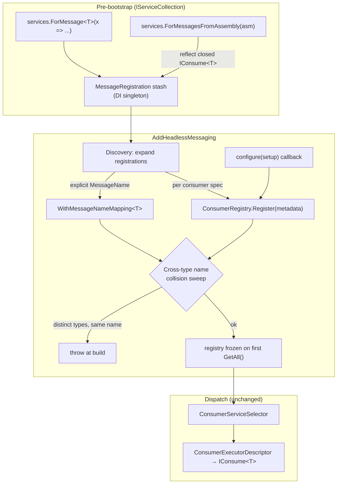
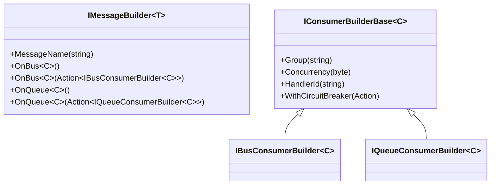

# feat(messaging): ForMessage&lt;T&gt; registration API (Cluster 0.3)

## Summary

Replace every consumer-registration entry point in `Headless.Messaging.Core` with a single
message-centric fluent API: `services.ForMessage<T>(x => { x.OnBus<C>(); x.OnQueue<C>(q => q.Group(...)); })`.
The same handler can be registered under both intent lanes; a message can be registered with no
consumers at all (publisher-only); and two distinct message types that resolve to the same message
name fail host startup. This is the headline change of Cluster 0 (#357) and unblocks #358 (Layer 2
knobs), then #359 / #360.

---

## Problem Frame

Today registration is split across two unrelated surfaces with divergent semantics:

- **Imperative**, pre-bootstrap: `services.AddBusConsumer<TConsumer,TMessage>(name)` /
  `AddQueueConsumer<...>(name)` (`src/Headless.Messaging.Core/ServiceCollectionExtensions.cs`).
  These stash a `ConsumerMetadata` as a DI singleton and rely on `_DiscoverConsumersFromDI`
  (`src/Headless.Messaging.Core/Setup.cs`) to bridge them into the live registry. Intent is encoded
  purely by which method was called.
- **Fluent**, inside `AddHeadlessMessaging`: `IMessagingBuilder.Subscribe<T>()` /
  `Subscribe<T>(name)` / `Subscribe<T>(Action<...>)` / `SubscribeFromAssembly(...)` /
  `SubscribeFromAssemblyContaining<T>()` (`src/Headless.Messaging.Core/IMessagingBuilder.cs`,
  `Configuration/MessagingSetupBuilder.cs`). This path always registers `IntentType.Bus` — there is
  no fluent way to register a Queue consumer.

The split is the root problem the consumer-model spec (origin §3) resolves: intent should be
declared once, at a message-centric registration site, with the same handler usable in either lane.
The greenfield decision (origin §1, §12) is to delete the old surfaces outright rather than bridge
them.

Three facts from current-state research shape this plan and correct the issue's framing:

- There is **no** `MessagingConventions.GetMessageNameForType<T>()`. Name inference is the instance
  method `MessagingConventions.GetMessageName(Type)`
  (`src/Headless.Messaging.Abstractions/MessagingConventions.cs:123`), reached through
  `MessagingOptions.CreateConsumerMetadata(...)`.
- `ConsumerMetadata` already carries `IntentType` as a first-class field
  (`src/Headless.Messaging.Core/ConsumerMetadata.cs`), and `ConsumerRegistry` already exists with
  freeze-on-read and the full query surface. There is no separate "intent pair" object to replace,
  and no need for a parallel `MessagingConsumerRegistry`.
- The current registry conflict check is keyed on `(MessageName, Group, IntentType)`
  (`ConsumerRegistry._FindDuplicateTopicGroupConflict`). It does **not** catch two distinct message
  *types* resolving to the same message name — that cross-type collision check is net-new work here.

---

## Requirements

### Registration API (origin §3)

- R1. `services.ForMessage<T>(Action<IMessageBuilder<T>>)` registers message-level metadata plus zero
  or more consumers for `T`, callable on `IServiceCollection` before `AddHeadlessMessaging`.
- R2. `IMessageBuilder<T>` exposes `MessageName(string)`, `OnBus<C>()` / `OnBus<C>(Action<IBusConsumerBuilder<C>>)`,
  and `OnQueue<C>()` / `OnQueue<C>(Action<IQueueConsumerBuilder<C>>)`, where `C : IConsume<T>`.
- R3. The same handler type registered under both lanes in one block (`x.OnBus<C>(); x.OnQueue<C>();`)
  produces two registrations; each consume invocation observes the matching `IntentType`.
- R4. Multiple `OnBus<...>` / `OnQueue<...>` calls in one block register multiple distinct consumers
  for the message.
- R5. Per-consumer config is intent-typed: `IBusConsumerBuilder<C>` and `IQueueConsumerBuilder<C>`
  share a base carrying the knobs that exist today — `Group(string)`, `Concurrency(byte)`,
  `HandlerId(string)`, `WithCircuitBreaker(...)`. The method name is `Group`, not `GroupId`
  (issue-explicit; supersedes origin §3's illustrative `GroupId`).

### Message naming and collision (origin §10)

- R6. When `MessageName` is omitted, the framework infers the name from `T` via the existing
  `MessagingOptions.CreateConsumerMetadata` → `MessagingConventions.GetMessageName(Type)` path.
- R7. An explicit `x.MessageName("...")` overrides inference and is the name used by both the publish
  side and the consume side for `T`.
- R8. Host startup throws when two **distinct** message types resolve to the same message name, naming
  both types and the resolved name in the error.
- R9. Multiple `ForMessage<T>` calls for the **same** `T` (e.g. from independent modules) merge their
  consumer lists rather than throwing. Re-declaring a *different* explicit `MessageName` for an
  already-named `T` is the one same-type conflict that throws.
- R9a. Re-registering the **same** consumer type for the same `(message name, group, intent)` is an
  idempotent no-op (merge), not a duplicate-registration error. Two **different** consumer types that
  collide on the same `(message name, group, intent)` still throw at startup (the existing
  competing-identity guard, preserved). See KTD3b.
- R10. Empty or whitespace-only message-name strings are rejected at startup.

### Publisher-only support (origin §3 acceptance criteria)

- R11. `ForMessage<T>(x => x.MessageName("..."))` with no `OnBus` / `OnQueue` call is a valid
  registration: it declares the message-name mapping for publishing `T` without requiring any
  consumer handler in the process.

### Consolidation and removal (origin §1, §12)

- R12. `AddBusConsumer<TConsumer,TMessage>` and `AddQueueConsumer<TConsumer,TMessage>` are deleted —
  references produce a compile error, not a deprecation warning.
- R13. The entire `IMessagingBuilder.Subscribe<T>*` surface (`Subscribe<T>()`, `Subscribe<T>(string)`,
  `Subscribe<T>(Action<...>)`) is deleted.
- R14. Assembly scanning is preserved as `services.ForMessagesFromAssembly(Assembly)` and
  `services.ForMessagesFromAssemblyContaining<TMarker>()`, discovering `IConsume<TMessage>`
  implementations and registering each as a Bus-intent consumer with an inferred message name —
  matching today's `SubscribeFromAssembly` behavior.
- R15. The public testing harness (`src/Headless.Messaging.Testing/MessagingTestHarness*.cs`), all
  messaging tests, and all `demo/` apps are migrated to the new surface and the full suite is green.

### Documentation (CLAUDE.md sync trigger — public API surface change)

- R16. `docs/llms/messaging.md`, `src/Headless.Messaging.Core/README.md`, and the relevant
  Abstractions README are updated to document `ForMessage<T>` and the removal of the old surfaces.

---

## Key Technical Decisions

- KTD1 — Reuse `ConsumerRegistry`; do not introduce `MessagingConsumerRegistry`. The existing
  `public sealed ConsumerRegistry` already stores `ConsumerMetadata` (with `IntentType`), freezes on
  first read, and exposes every query the dispatch path needs. A second registry would duplicate it.
  The cross-type collision check (R8) is added as a startup sweep over registry contents, not as a
  new type. *(User decision; corrects the issue's deliverable list.)*

- KTD2 — `ForMessage<T>` stashes message-level registration intents as DI singletons and a discovery
  pass expands them at `AddHeadlessMessaging` time. `ForMessage<T>` runs on `IServiceCollection`
  before the registry exists (mirroring the current `AddBusConsumer` seam), so it cannot touch the
  registry directly. A new `MessageRegistration` stash record (message type + optional explicit name +
  list of consumer specs, each carrying its `IntentType` and per-consumer config) replaces the
  per-consumer `ConsumerMetadata` singleton stash. Discovery reworks `Setup.cs._DiscoverConsumersFromDI`
  as a **two-pass, group-by-type** expansion (see KTD3 and KTD3a). A single sequential per-registration
  loop is incorrect — see KTD3a.

- KTD3 — `x.MessageName(...)` at message scope wires into the existing `WithMessageNameMapping<T>`
  mechanism (`MessagingOptions.cs:324`). This is what makes publisher-only registration (R11) work
  without consumers and what keeps publish-side and consume-side names in sync (R7) — reuse the mapping
  rather than inventing a second name source. The mapping guard already throws when the same type is
  mapped to two *different* explicit names (verified at `MessagingOptions.cs:329-337`), which gives R9's
  same-type-conflict throw for free.

- KTD3a — Resolve the authoritative message name **per type, before expanding any consumers**. Two
  `ForMessage<OrderPlaced>` blocks where one sets `MessageName("order-placed")` and the other relies on
  inference must both register under `"order-placed"`. A naive sequential loop that expands the
  inference-only block first would register its consumer under the inferred `OrderPlaced` name, then the
  explicit block under `order-placed` — silently splitting one type across two names. Mitigation: group
  stashes by message type, fold to one resolved name (explicit beats inferred; two *different* explicit
  names for the same type throw), register the mapping, then expand all consumer specs for that type.
  Pass 2 passes `messageName: null` for inference-only specs so the pass-1 mapping wins.

- KTD3b — **Idempotent merge vs duplicate-throw.** `ConsumerRegistry.Register` keys its duplicate check
  on `(MessageName, Group, IntentType)` *without* comparing consumer type, and throws on any match. So
  re-registering the **same** consumer for the same message+intent (R9 modular merge) would throw, not
  merge. Pass 2 must therefore deduplicate before `Register`: skip a spec whose
  `(resolved MessageName, resolved Group, IntentType, ConsumerType)` already registered (true idempotent
  merge), and let `Register` throw only on the genuine conflict — two **different** consumer types
  colliding on the same `(name, group, intent)` (the existing competing-identity guard, preserved). This
  resolves the tension between R4 (multiple distinct consumers) and R9 (same-consumer merge).

- KTD4 — Full consolidation. Delete `AddBusConsumer` / `AddQueueConsumer`, `ServiceCollectionConsumerBuilder`,
  and the entire `IMessagingBuilder.Subscribe<T>*` surface. Assembly scanning is re-expressed on top of
  a non-generic, `Type`-based internal registration path that `services.ForMessagesFromAssembly(...)`
  drives via reflection (the same closed-`IConsume<T>` discovery `SubscribeFromAssembly` does today).
  *(User decision; broader than the issue's literal scope, which named only the two `AddX` methods.)*
  On origin §2 Non-Goals: "Auto-discovery of handlers (Wolverine-style assembly scanning)" is listed as
  out of scope, but that non-goal targets *adding new* convention-based discovery. `SubscribeFromAssembly`
  already exists today; this cluster *preserves* that existing behavior on the new surface rather than
  introducing new auto-discovery. The non-generic path is the only added surface, and it exists solely
  to drive the same reflection that already ships.

- KTD4a — **Scan-vs-explicit precedence.** Assembly scanning defaults to Bus intent (KTD6). Without a
  precedence rule, a consumer already registered explicitly as `OnQueue<C>` that is *also* picked up by
  `ForMessagesFromAssembly` would register a second time as Bus — different intent, so the
  `(name, group, intent)` guard does not catch it, producing silent dual-lane double delivery. Rule:
  scanning skips a `(consumerType, messageType)` pair already registered explicitly via `ForMessage<T>`
  in **any** lane. Explicit registration wins; scan fills only the gaps.

- KTD5 — Intent-typed builders over a shared base. `IBusConsumerBuilder<C>` and `IQueueConsumerBuilder<C>`
  both extend a shared `IConsumerBuilderBase<C>` carrying today's knobs only. The lane-specific extras
  the origin spec lists (`Subscription` for bus; `Name` / `VisibilityTimeout` for queue), `Retry`, and
  the per-consumer `Transport(string)` pin are **not** added here — `Retry` is global today, and
  `Transport(string)` needs the named-transport registry resolution that does not exist until #358.
  Those knobs are #358 territory. The type split exists now so #358 extends it without reshaping call sites.

- KTD6 — Assembly-scanned consumers default to `IntentType.Bus`, preserving current `SubscribeFromAssembly`
  semantics. Queue-intent consumers require an explicit `ForMessage<T>(x => x.OnQueue<C>())`.

- KTD7 — The cross-type collision sweep (R8) runs in `Bootstrapper._CheckRequirement()`
  (`src/Headless.Messaging.Core/Internal/IBootstrapper.Default.cs:292`), **not** inside
  `AddHeadlessMessaging`. `AddHeadlessMessaging` returns a `MessagingBuilder` (Setup.cs:68/196), so a
  caller can add mappings *after* it returns (e.g. `builder.WithMessageNameMapping<T>()`); a sweep
  inside `AddHeadlessMessaging` would miss those. `_CheckRequirement()` already enumerates the final
  `registry.GetAll()` (IBootstrapper.Default.cs:331) at host start, sees every registration and mapping
  regardless of add order, and is the existing fail-fast requirement gate — consistent with origin §6's
  "fail at startup, not at first dispatch" rule. **Documented scope limit:** the sweep covers
  compile-time `ForMessage` / assembly-scan registrations plus publisher-only mappings only. Runtime
  subscriptions added later via `IRuntimeSubscriber` register into the separate `RuntimeConsumerRegistry`
  (hardcoded Bus intent) after startup and are **out of scope** for cross-type collision detection in v1 —
  a deliberate boundary, not an accidental hole.

---

## High-Level Technical Design

### Registration → discovery → dispatch flow

The dispatch half (selector, descriptors, `MethodMatcherCache` intent keying) is untouched by #357 —
`ConsumerMetadata.IntentType` already flows to `ConsumerExecutorDescriptor.IntentType`. This PR only
changes how registrations *enter* the registry.

### Builder type hierarchy

*Directional guidance — final member shapes are an implementation detail; the type relationships and
the `Group` (not `GroupId`) naming are the load-bearing constraints.*

---

## Testing Strategy

- **Unit** coverage owns the new surface and lives in `tests/Headless.Messaging.Core.Tests.Unit/`. A
  new `ForMessageRegistrationTests.cs` owns builder semantics, merge/collision, publisher-only, and
  dual-intent registration. `MessagingBuilderTests.cs` is reworked for the consolidated surface;
  `ServiceCollectionConsumerBuilderTests.cs` (27 cases, built entirely around the deleted `AddX` API)
  is deleted and its still-relevant assertions folded into `ForMessageRegistrationTests.cs`.
- **Integration** coverage (Bus/Queue actually firing) stays in
  `tests/Headless.Messaging.Core.Tests.Unit/IntegrationTests/*` and the testing-harness E2E suite
  (`tests/Headless.Messaging.Testing.Tests.Unit/`); these are migrated, not rewritten.
- No new test infrastructure is required — the existing in-memory transport + `MessagingTestHarness`
  cover end-to-end registration→dispatch. The harness itself changes surface (Unit U7) and its own
  tests migrate with it.
- **Execution posture:** characterization-first for the migration units (U8–U10 must preserve observed
  behavior); test-first for the net-new behaviors (collision sweep, same-type merge, publisher-only,
  dual-intent) in U1–U5.

---

## Implementation Units

Grouped into four phases. Phase A builds the new surface; Phase B removes the old; Phase C migrates
consumers; Phase D syncs docs. B and C land together as a single compiling change in practice, but are
separated here for review clarity.

### Phase A — New registration surface

### U1. `ForMessage<T>` entry point, `IMessageBuilder<T>`, and the stash record

- Goal: Add the public `services.ForMessage<T>(Action<IMessageBuilder<T>>)` extension and the
  `IMessageBuilder<T>` surface (`MessageName`, `OnBus`, `OnQueue`), accumulating a `MessageRegistration`
  stash record as a DI singleton. No discovery yet.
- Requirements: R1, R2, R3, R4, R7, R11.
- Dependencies: none.
- Files:
  - `src/Headless.Messaging.Core/Registration/MessageBuilder.cs` (new — `IMessageBuilder<T>` + impl)
  - `src/Headless.Messaging.Core/Registration/MessageRegistration.cs` (new — stash record)
  - `src/Headless.Messaging.Core/ServiceCollectionExtensions.cs` (add `ForMessage<T>`; `AddX` removed in U6)
  - `tests/Headless.Messaging.Core.Tests.Unit/ForMessageRegistrationTests.cs` (new)
- Approach: `ForMessage<T>` constructs an `IMessageBuilder<T>` impl that records an optional explicit
  message name and a list of `(IntentType, consumerType, perConsumerConfig)` specs, then registers the
  resulting `MessageRegistration` as a singleton instance (mirroring how `AddBusConsumer` stashes
  `ConsumerMetadata` today). Each `OnBus`/`OnQueue` also `TryAddScoped`s the consumer type + its
  `IConsume<T>` mapping, as the current code does. The outer lambda returns `void`.
- Patterns to follow: the stash-as-DI-singleton seam in `ServiceCollectionExtensions._AddConsumer`;
  the accumulate-into-a-list builder shape from
  `docs/solutions/architecture-patterns/unified-storage-setup-pattern.md`. Use C# 14 `extension(IServiceCollection)`
  members per the project Setup-class convention.
- Test suite design: unit, in `ForMessageRegistrationTests.cs`.
- Test scenarios:
  - Happy path: `ForMessage<T>(x => x.OnBus<C>())` registers one Bus consumer spec for `T`.
  - `ForMessage<T>(x => { x.OnBus<A>(); x.OnBus<B>(); })` registers two distinct consumers (R4).
  - `ForMessage<T>(x => { x.OnBus<C>(); x.OnQueue<C>(); })` registers the same type twice, one per
    lane (R3).
  - `ForMessage<T>(x => x.MessageName("orders.placed"))` with no consumers stashes a registration with
    the explicit name and an empty consumer list (R11).
  - Explicit `MessageName` is recorded on the stash and not overwritten by inference (R7).
  - Edge: `OnBus<C>(q => ...)` configure lambda mutates the per-consumer config captured on the spec.
- Verification: planned tests added and passing; `ForMessage<T>` compiles and the stash is observable
  as a registered singleton. No discovery/registry assertions yet (U3).
- Note: keep the existing DI pattern — `TryAddScoped<C>()` for the concrete consumer plus
  `TryAddScoped<IConsume<T>>(sp => sp.GetRequiredService<C>())`. Dispatch resolves the **concrete** type
  (`CompiledMessageDispatcher._ResolveConsumer` line 253, via `descriptor.ImplTypeInfo`), so multiple
  consumers per message and the same consumer under both lanes are already safe. Do **not** switch the
  `IConsume<T>` registration to `AddScoped`/`TryAddEnumerable` to "fix" first-wins — that registration
  is incidental to descriptor dispatch and changing it risks double-execution.

### U2. Intent-typed per-consumer builders

- Goal: Introduce `IConsumerBuilderBase<C>`, `IBusConsumerBuilder<C>`, `IQueueConsumerBuilder<C>`
  carrying today's knobs (`Group`, `Concurrency`, `HandlerId`, `WithCircuitBreaker`), wired to mutate
  the per-consumer config on the `MessageRegistration` spec from U1.
- Requirements: R5.
- Dependencies: U1.
- Files:
  - `src/Headless.Messaging.Core/Registration/ConsumerBuilders.cs` (new — base + two intent builders)
  - `src/Headless.Messaging.Core/Registration/MessageBuilder.cs` (wire `OnBus`/`OnQueue` overloads to them)
  - `tests/Headless.Messaging.Core.Tests.Unit/ForMessageRegistrationTests.cs`
- Approach: Lift the knob-setting guts of the existing `ServiceCollectionConsumerBuilder` /
  `ConsumerBuilder` (Concurrency-zero guard, CB-override capture) into the shared base. The two
  intent-typed builders are thin subtypes — no lane-specific members in #357. `Group` keeps its name.
- Patterns to follow: `src/Headless.Messaging.Core/ServiceCollectionConsumerBuilder.cs` (knob setters,
  `Concurrency` `ArgumentOutOfRangeException` guard, `WithCircuitBreaker` delegate capture).
- Test suite design: unit, same file as U1.
- Test scenarios:
  - `OnQueue<C>(q => q.Group("inventory"))` records `Group` on the consumer spec.
  - `q.Concurrency(0)` throws `ArgumentOutOfRangeException` (preserve current guard).
  - `q.HandlerId("custom")` overrides the resolved handler id.
  - `q.WithCircuitBreaker(...)` captures the configure delegate for later application at discovery.
  - Type check: `OnBus` hands an `IBusConsumerBuilder<C>`, `OnQueue` an `IQueueConsumerBuilder<C>`.
- Verification: planned tests added and passing.

### U3. Discovery rework + publisher-only name mapping + same-type merge

- Goal: Replace `Setup.cs._DiscoverConsumersFromDI` with discovery that expands `MessageRegistration`
  stashes into the live `ConsumerRegistry`, registers explicit message names via
  `WithMessageNameMapping<T>`, and merges duplicate same-type registrations.
- Requirements: R6, R7, R9, R11. (R8's cross-type collision *throw* is owned by U4; U3 only wires the
  resolved `(type, name)` data the U4 sweep reads.)
- Dependencies: U1, U2.
- Files:
  - `src/Headless.Messaging.Core/Setup.cs` (`_DiscoverConsumersFromDI` → `_DiscoverMessageRegistrations`)
  - `src/Headless.Messaging.Core/Configuration/MessagingSetupBuilder.cs` (`RegisterConsumer` reuse;
    expose explicit-name mapping path)
  - `tests/Headless.Messaging.Core.Tests.Unit/MessagingBuilderTests.cs`
  - `tests/Headless.Messaging.Core.Tests.Unit/ForMessageRegistrationTests.cs`
- Approach: **Two-pass, grouped by message type** (KTD3a). Pass 1 — group all stashed
  `MessageRegistration`s by `MessageType`, fold each group to one authoritative name (any explicit
  `MessageName` wins over inference; two *different* explicit names for the same type throw via the
  existing `WithMessageNameMapping` guard at `MessagingOptions.cs:324`), and register the type→name
  mapping. Pass 2 — for every consumer spec across all groups, build metadata via
  `options.CreateConsumerMetadata(...)` (now resolving the authoritative name through the mapping;
  inference only when no group set an explicit name — pass `messageName: null` for inference-only specs
  so the mapping wins) and `registry.Register(...)`, applying any CB override. **Deduplicate before
  `Register` (KTD3b):** skip a spec whose resolved `(MessageName, Group, IntentType, ConsumerType)`
  already exists — that is the R9/R9a idempotent same-consumer merge. `registry.Register` then throws
  only on the genuine conflict (two *different* consumer types on the same `(name, group, intent)`).
  Without this dedup the second same-consumer registration hits the existing `(name, group, intent)`
  guard and throws, failing R9. A single sequential per-registration loop is also rejected — it splits a
  type across inferred and explicit names depending on stash order.
- Patterns to follow: existing `_DiscoverConsumersFromDI` (Setup.cs discovery sweep),
  `_ResolveDiscoveredMetadata`, `MessagingSetupBuilder.RegisterConsumer` (metadata build + registry
  register + `TryAdd` consumer).
- Test suite design: unit + the integration suites in U8 prove dispatch end-to-end.
- Test scenarios:
  - Inferred name: `ForMessage<T>(x => x.OnBus<C>())` registers under the name returned by the instance method `MessagingConventions.GetMessageName(typeof(T))` (R6).
  - Explicit name flows to both the registry entry and the publish-side mapping (R7).
  - Publisher-only: `ForMessage<T>(x => x.MessageName("n"))` registers the mapping with zero registry
    consumer entries; resolving the publish name for `T` returns `"n"` (R11).
  - Same-type merge: two `ForMessage<T>` blocks (one `OnBus<A>`, one `OnQueue<B>`) yield two registry
    entries for `T`, no throw (R9).
  - Idempotent same-consumer merge: two `ForMessage<T>` blocks both `OnBus<C>` yield exactly one registry
    entry for `(T, C, Bus)`, no throw (R9a / KTD3b — guards against the duplicate-throw regression).
  - Distinct-consumer conflict: two *different* consumer types given the same explicit `Group` on the
    same `(message, Bus)` still throws at startup (R9a competing-identity guard, preserved).
  - Mixed explicit/inferred ordering (KTD3a): one `ForMessage<T>` block sets an explicit name, another
    relies on inference — both consumers register under the explicit name regardless of stash order.
    Assert with the inference-only block stashed *first*.
  - Same-type conflicting explicit names throws (R9 boundary).
  - Empty/whitespace explicit name rejected: the throw fires in pass 1 here in U3 via the
    `WithMessageNameMapping` guard (`MessagingOptions.cs:329-337`), not in the U4 sweep (R10).
- Verification: planned tests added and passing; discovery produces the same registry contents the old
  `AddX`/`Subscribe` paths produced for equivalent input (characterization).

### U4. Cross-type message-name collision sweep at startup

- Goal: Add the startup check that throws when two distinct message types resolve to the same message
  name, naming both types and the resolved name.
- Requirements: R7, R8. (R10's empty-name rejection throws earlier, in U3's pass-1 mapping guard.)
- Dependencies: U3.
- Files:
  - `src/Headless.Messaging.Core/Internal/IBootstrapper.Default.cs` (`_CheckRequirement`, near the
    existing `registry.GetAll()` at line 331)
  - `src/Headless.Messaging.Core/ConsumerRegistry.cs` (helper to enumerate resolved `(type, name)` pairs,
    incl. publisher-only mappings)
  - `tests/Headless.Messaging.Core.Tests.Unit/ForMessageRegistrationTests.cs`
- Approach: In `Bootstrapper._CheckRequirement()` (KTD7), over the final frozen `registry.GetAll()`
  plus publisher-only name mappings, build a `MessageName → set<MessageType>` map. **Normalize names to
  one space before comparing:** registry entries store the prefix-applied name
  (`CreateConsumerMetadata` calls `ApplyMessageNamePrefix`), but `MessageNameMappings` stores the raw
  un-prefixed string — so apply `ApplyMessageNamePrefix` to the mapping values (or compare against the
  registry's prefixed form) so a non-empty `MessageNamePrefix` does not produce false negatives (missed
  collisions) or false positives (publisher-only `order.placed` vs registry `app.order.placed` for the
  same type). Any normalized name mapping to 2+ distinct types throws an enumerated, actionable
  configuration exception (origin §10 wording: surface both colliding types and the resolved name).
  Running here — not in `AddHeadlessMessaging` — catches mappings added on the returned `MessagingBuilder`
  after the call. Additive to the existing `(name, group, intent)` registry conflict, which stays.
- Patterns to follow: the enumerated-actionable-error convention from
  `docs/solutions/architecture-patterns/unified-storage-setup-pattern.md`; the existing
  `ConsumerRegistry._FindDuplicateTopicGroupConflict` throw shape.
- Test suite design: unit.
- Test scenarios:
  - Covers AE (origin §10): `Sales.OrderPlaced` and `Billing.OrderPlaced` both inferring `order.placed`
    throws at host build; message names both type full-names and the resolved name.
  - Two types with explicit identical `MessageName` throws.
  - Same type registered twice does **not** trip the sweep (R9 — merge, not collide).
  - Different names for different types builds cleanly (no false positive).
  - Prefix normalization: with a non-empty `MessageNamePrefix`, a publisher-only mapping and a consumer
    registration for the **same** logical name + same type build cleanly (no false collision), and a
    genuine cross-type collision still throws (F1/A4).
  - Failure surfaces from `IServiceProvider` build / host start, not first dispatch.
- Verification: planned tests added and passing; collision throws at startup.

### U5. Assembly scanning on the ForMessage path

- Goal: Add `services.ForMessagesFromAssembly(Assembly)` and
  `services.ForMessagesFromAssemblyContaining<TMarker>()`, plus the internal non-generic `Type`-based
  registration path they drive.
- Requirements: R13, R6.
- Dependencies: U1, U3.
- Files:
  - `src/Headless.Messaging.Core/ServiceCollectionExtensions.cs` (scanning extensions)
  - `src/Headless.Messaging.Core/Registration/MessageBuilder.cs` (non-generic Type-based stash helper)
  - `tests/Headless.Messaging.Core.Tests.Unit/ForMessageRegistrationTests.cs`
- Approach: Reflect over the assembly for closed `IConsume<TMessage>` implementations (the same
  discovery `SubscribeFromAssembly` does today), and for each register a Bus-intent consumer spec with
  an inferred name through the non-generic stash path. Multiple `IConsume<...>` on one type register
  multiple specs. **Scan-vs-explicit precedence (KTD4a):** skip a `(consumerType, messageType)` pair
  already registered explicitly via `ForMessage<T>` in **any** lane, so an explicitly-`OnQueue<C>`
  consumer is not silently re-added as a Bus consumer (which would dual-deliver). The non-generic stash
  path must feed the same two-pass grouping (KTD3a) and dedup (KTD3b) as the generic path, so scanned and
  explicit registrations for the same type merge consistently.
- Patterns to follow: current `MessagingSetupBuilder.SubscribeFromAssembly` reflection (closed-interface
  discovery, `RegisterConsumer` per match).
- Test suite design: unit in this unit, **plus an integration test owned by U5** (not deferred to U8)
  that scans a test assembly and dispatches end-to-end — Phase A units must be verifiable without Phase C.
- Test scenarios:
  - Assembly with two `IConsume<>` implementations registers two Bus consumers with inferred names.
  - A consumer implementing `IConsume<A>` and `IConsume<B>` registers two specs.
  - `ForMessagesFromAssemblyContaining<TMarker>()` scans the marker's assembly.
  - Scanned + explicit `ForMessage<T>` for the same type merge (R9 interaction).
  - Scan precedence (KTD4a): explicit `OnQueue<C>` + a scan of `C`'s assembly yields exactly **one**
    Queue registration, not Queue + Bus (guards against silent double delivery).
  - Empty/irrelevant assembly registers nothing and does not throw.
  - Integration: scan a fixture assembly, publish, and assert the scanned consumer fires on the Bus lane.
- Verification: planned tests (incl. the U5-owned integration test) added and passing; scanned consumers
  dispatch as Bus intent and never duplicate an explicit registration.

### Phase B — Remove the old surfaces

### U6. Delete `AddBusConsumer` / `AddQueueConsumer`, `Subscribe<T>*`, and dead builders

- Goal: Remove every legacy registration entry point and the now-unused builder types.
- Requirements: R12, R13.
- Dependencies: U1–U5 (replacements exist).
- Files:
  - `src/Headless.Messaging.Core/ServiceCollectionExtensions.cs` (delete `AddBusConsumer`,
    `AddQueueConsumer`, `_AddConsumer`)
  - `src/Headless.Messaging.Core/ServiceCollectionConsumerBuilder.cs` (delete)
  - `src/Headless.Messaging.Core/IMessagingBuilder.cs` (delete `Subscribe<T>*`; keep `WithMessageNameMapping`,
    `UseConventions`)
  - `src/Headless.Messaging.Core/Configuration/MessagingSetupBuilder.cs` (delete `Subscribe<T>*` impls;
    keep `RegisterConsumer` helper used by discovery)
  - `src/Headless.Messaging.Core/ConsumerBuilder.cs`, `IConsumerBuilder.cs` (delete if fully superseded
    by U2 builders; otherwise repurpose — confirm during execution)
  - XML-doc cross-references in remaining files (e.g. `CircuitBreaker/ConsumerCircuitBreakerRegistry.cs`
    string mention)
- Approach: Delete after the new surface compiles. Confirm `ConsumerBuilder`/`IConsumerBuilder<T>` have
  no remaining references once Subscribe is gone; fold any still-needed logic into the U2 base.
- Patterns to follow: greenfield no-shim removal (origin §1, §12;
  `docs/solutions/messaging/transport-wrapper-drift-and-doc-sync.md` greenfield-scope rule).
- Test suite design: none new — this unit is validated by the whole suite compiling and passing after
  U7–U9 migrate call sites.
- Test scenarios: `Test expectation: none -- pure deletion; correctness is proven by U7–U9 migration
  compiling and the existing suite passing.`
- Verification: solution builds with the old symbols gone; no remaining references in `src/`.

### Phase C — Migrate consumers of the surface

### U7. Migrate the public testing harness

- Goal: Update `MessagingTestHarness` / `MessagingTestHarnessExtensions` to expose and use
  `ForMessage<T>` instead of `Subscribe<T>`.
- Requirements: R14, R15.
- Dependencies: U1–U6.
- Files:
  - `src/Headless.Messaging.Testing/MessagingTestHarness.cs`
  - `src/Headless.Messaging.Testing/MessagingTestHarnessExtensions.cs`
  - `tests/Headless.Messaging.Testing.Tests.Unit/*` (harness's own tests)
- Approach: The harness is itself a public API surface; its setup callback and XML-doc examples
  (`setup.Subscribe<...>`) move to the `ForMessage<T>` shape. Preserve the harness's recording behavior.
- Patterns to follow: existing harness wiring of `IMessagingBuilder`.
- Test suite design: unit/E2E in the Testing test project; characterization-first (behavior preserved).
- Test scenarios:
  - Harness registers a consumer via the new surface and records a dispatched message (happy path).
  - Dual-intent registration through the harness records both lanes.
  - Harness XML-doc example compiles (doc-as-test if present).
- Verification: planned/updated tests passing; harness public surface uses `ForMessage<T>`.

### U8. Migrate all messaging tests

- Goal: Convert the ~146 legacy call sites (~110 `Subscribe*` + 36 `AddX`) across the test projects to
  `ForMessage<T>` / `ForMessagesFromAssembly`.
- Requirements: R14.
- Dependencies: U1–U7.
- Files (highest-density first; `dev-code` should re-grep `\.Subscribe<|AddBusConsumer|AddQueueConsumer`
  for the authoritative list):
  - `tests/Headless.Messaging.Core.Tests.Unit/ServiceCollectionConsumerBuilderTests.cs` (delete; fold
    into `ForMessageRegistrationTests.cs`)
  - `tests/Headless.Messaging.Core.Tests.Unit/MessagingBuilderTests.cs` (28 Subscribe + 3 AddX)
  - `tests/Headless.Messaging.Core.Tests.Unit/ConsumerServiceSelectorTests.cs` (13)
  - `tests/Headless.Messaging.Core.Tests.Unit/SubscribeInvokerTests.cs` (12)
  - `tests/Headless.Messaging.Core.Tests.Unit/IntegrationTests/BusIntegrationTests.cs` (10)
  - `tests/Headless.Messaging.Testing.Tests.Unit/EndToEndTests.cs` (9 Subscribe + 4 AddX)
  - `tests/Headless.Messaging.Core.Tests.Unit/IntegrationTests/IConsumeIntegrationTests.cs` (9)
  - `tests/Headless.Messaging.Testing.Tests.Unit/MultiTenancy/TenantPropagationE2ETests.cs` (8)
  - `tests/Headless.Messaging.Core.Tests.Unit/MessagingIntentSplitTests.cs` (2 AddX)
  - `tests/Headless.Messaging.Core.Tests.Harness/MessagingIntegrationTestsBase.cs` (2)
  - `tests/Headless.Messaging.Core.Tests.Unit/Helpers/TestServiceCollectionExtensions.cs` (1)
  - remaining single-call files: `SubscribeExecutorRetryTests.cs`, `SubscribeExecutorCancellationTests.cs`,
    `SharedConsumeScopeIntegrationTests.cs`, `ConsumerRegisterTests.cs`,
    `CircuitBreaker/SubscribeExecutorCircuitBreakerTests.cs`, `CircuitBreaker/CircuitBreakerOptionsTests.cs`,
    `SharedHostIsolationTests.cs`
- Approach: Mostly-mechanical translation, but **not purely** — the message name moves scope. Rules:
  - `AddBusConsumer<C,M>("n")` → `ForMessage<M>(x => { x.MessageName("n"); x.OnBus<C>(); })`;
    `AddQueueConsumer` → `OnQueue`.
  - `Subscribe<C>()` → `ForMessage<M>(x => x.OnBus<C>())` (Bus default).
  - **Chained per-consumer `.MessageName("n")`** — today `Subscribe<C>().MessageName("n")` /
    `AddBusConsumer<C,M>("n")` set the name at consumer scope. The new model has **no** per-consumer
    `MessageName`; it lives on `IMessageBuilder<T>`. So `Subscribe<C>().MessageName("n").Group("g")` →
    `ForMessage<M>(x => { x.MessageName("n"); x.OnBus<C>(b => b.Group("g")); })`. This appears ~12× in
    `SubscribeInvokerTests.cs` and ~6× in `ConsumerServiceSelectorTests.cs` — the translator must
    identify the message type `M` and hoist the name to the outer lambda, and must not let two consumers
    in one file set different names for the same `M` (now a startup throw).
  - Chained `.Group(...)` / `.Concurrency(...)` / `.HandlerId(...)` move onto the per-consumer lambda.
  Preserve every assertion; behavior-preserving except where the old per-consumer-name shape is
  restructured to message scope.
- Patterns to follow: the migrated demos (U9) and the new unit tests (U1–U5) as worked examples.
- Test suite design: characterization-first — the migrated tests must assert the same outcomes as before.
- Test scenarios: `Test expectation: existing scenarios preserved.` The unit's correctness signal is the
  full suite passing with identical coverage; no new behavioral scenarios beyond those in U1–U5.
- Verification: `make test-unit` (and integration suites where Docker is available) green; no remaining
  `Subscribe<`/`AddBusConsumer`/`AddQueueConsumer` references in `tests/`.

### U9. Migrate demo apps

- Goal: Convert the 7 demo `Program.cs` / `Startup.cs` registration call sites to the new surface.
- Requirements: R14.
- Dependencies: U1–U6.
- Files:
  - `demo/Headless.Messaging.Console.Demo/Program.cs`
  - `demo/Headless.Messaging.Aws.InMemory.Demo/Program.cs`
  - `demo/Headless.Messaging.AzureServiceBus.InMemory.Demo/Program.cs`
  - `demo/Headless.Messaging.Pulsar.InMemory.Demo/Program.cs`
  - `demo/Headless.Messaging.RabbitMq.SqlServer.Demo/Program.cs`
  - `demo/Headless.Messaging.Dashboard.Auth.Demo/Startup.cs`
  - `demo/Headless.Messaging.Dashboard.Jwt.Demo/Program.cs`
  - `demo/Headless.Messaging.Kafka.PostgreSql.Demo/Program.cs`,
    `demo/Headless.Messaging.Redis.SqlServer.Demo/Program.cs` (the two `AddQueueConsumer` demos)
- Approach: Same mechanical translation as U8. Demos are the most visible usage examples, so prefer the
  clearest idiomatic shape (`ForMessage<T>(x => x.OnQueue<C>(q => q.Group(...)))`).
- Patterns to follow: U1–U5 examples.
- Test suite design: demos have no test suite; correctness is `make build` of the demo projects.
- Test scenarios: `Test expectation: none -- demo apps; verified by build.`
- Verification: all demo projects build; registration reads idiomatically.

### Phase D — Documentation

### U10. Sync docs to the new surface

- Goal: Update agent-facing and package docs for `ForMessage<T>` and the removal of `AddBusConsumer` /
  `AddQueueConsumer` / `Subscribe<T>*`.
- Requirements: R16.
- Dependencies: U1–U9.
- Files:
  - `docs/llms/messaging.md`
  - `src/Headless.Messaging.Core/README.md`
  - `src/Headless.Messaging.Abstractions/README.md` (if it references registration)
- Approach: Follow `docs/authoring/AUTHORING.md` drift checks. Replace registration examples, document
  intent lanes at the registration site, the inference + collision rules, and publisher-only registration.
  Do not document #358+ features (Layer 2 wiring, escape hatches) as live.
- Patterns to follow: `docs/authoring/AUTHORING.md`; the doc-sync rule in
  `docs/solutions/messaging/transport-wrapper-drift-and-doc-sync.md`.
- Test suite design: none — docs.
- Test scenarios: `Test expectation: none -- documentation; verified by review against AUTHORING.md.`
- Verification: docs reference only the shipped surface; examples compile against the new API.

---

## Scope Boundaries

### In scope

The `ForMessage<T>` registration surface (origin §3), message-name inference + cross-type collision
detection (origin §10), publisher-only registration, full consolidation of the legacy `AddX` and
`Subscribe*` surfaces incl. assembly scanning, and migration of every call site + docs.

### Deferred to Follow-Up Work (later Cluster 0 PRs)

- Layer 2 knob **wiring** — `PartitionBy`, `CorrelationFrom` behavior and their builder methods (#358).
  The publisher-only acceptance test's `PartitionBy` portion (origin §3) lands with #358; #357 proves
  publisher-only registration via `MessageName` alone.
- Layer 3 provider escape hatches — `x.UseRabbitMQ(...)`, `q.UseKafka(...)`, etc. (#358 / #359).
- The per-consumer `Transport(string)` pin **method itself** plus its named-transport registry
  resolution, and the lane-specific builder knobs (`Subscription`, `Name`, `VisibilityTimeout`,
  `MaxConcurrency`) the origin spec lists (#358) — neither the method nor the resolution ships in #357.
- Dual-lane physical topology per provider and the Kafka-Bus startup rejection (#359).
- Dispatch-side intent absorption (#360).

### Outside this product's identity (origin §2 Non-Goals)

Cross-language wire contract, sagas, request/response, scheduled delivery, auto-discovery beyond
explicit assembly scanning, per-tenant topology, source-generated registration, Kafka bus-emulation.

---

## Open Questions

- OQ1 — `ConsumerBuilder` / `IConsumerBuilder<T>` fate (U6): confirm during execution whether any
  logic must be retained (folded into the U2 base) or the types delete cleanly once `Subscribe<T>*` is
  gone. Lean: delete after folding the `Concurrency` guard and CB-override capture into the base.
- OQ2 — Assembly-scan intent: #357 fixes Bus default (KTD6). If a real driver wants Queue-intent
  scanning later, it is an additive `ForMessagesFromAssembly(asm, x => x.DefaultIntent(...))` overload —
  not in this PR.

---

## Risks & Dependencies

- Largest risk is the migration surface (U8): ~146 legacy call sites. Mitigation — land Phase A behind
  the existing surface first (both compile briefly is impossible since U6 deletes; in practice U6–U9 are
  one commit), translate mechanically, and lean on characterization (assertions unchanged). The new
  behaviors (U1–U5) are test-first and isolated from the migration.
- `ServiceCollectionConsumerBuilderTests.cs` deletion (27 cases) must not drop coverage — its still-valid
  assertions fold into `ForMessageRegistrationTests.cs` (called out in U8).
- Dispatch path is explicitly untouched; if a migrated test fails on dispatch (not registration), treat
  it as a discovery-wiring regression in U3, not a dispatch change.
- Depends on Cluster 0.1 (#355) and 0.2 (#356), both merged. Blocks #358 → #359 / #360.

---

## Sources & Research

- Origin spec: `docs/brainstorms/2026-05-25-messaging-consumer-model-evolution-requirements.md`
  (§3 registration API, §4 intent model, §10 inference/collision, §11 layout, §12 rejected alternatives).
- Current-state map (researched 2026-06-01):
  - `src/Headless.Messaging.Core/ServiceCollectionExtensions.cs` — `AddBusConsumer`/`AddQueueConsumer`,
    `_AddConsumer` stash-as-singleton seam.
  - `src/Headless.Messaging.Core/Setup.cs` — `_DiscoverConsumersFromDI` bridge; `_RegisterCoreMessagingServices`;
    `ValidateOnStart` wiring via `services.Configure<MessagingOptions, MessagingOptionsValidator>`.
  - `src/Headless.Messaging.Core/ConsumerRegistry.cs` — `Register` / `Update`, freeze-on-read,
    `_FindDuplicateTopicGroupConflict` keyed on `(MessageName, Group, IntentType)`.
  - `src/Headless.Messaging.Core/ConsumerMetadata.cs` — record with first-class `IntentType`.
  - `src/Headless.Messaging.Core/Configuration/MessagingSetupBuilder.cs` — `Subscribe<T>*`,
    `SubscribeFromAssembly*`, `RegisterConsumer`, `WithMessageNameMapping`.
  - `src/Headless.Messaging.Abstractions/MessagingConventions.cs:123` — `GetMessageName(Type)` (no `<T>` overload).
  - `src/Headless.Messaging.Core/Internal/ConsumerServiceSelector.cs`, `MethodMatcherCache.cs` — dispatch
    (untouched; `ConsumerGroupKey(GroupName, IntentType)` already keys intent).
- Verified facts (used by KTD3b / KTD7 / U3 / U4):
  - `MessagingOptions.WithMessageNameMapping` (`MessagingOptions.cs:329-337`) throws when the same type
    is mapped to two *different* names — this is R9's same-type-conflict throw (no new code needed).
  - `MessagingOptions.CreateConsumerMetadata` applies `ApplyMessageNamePrefix` to the stored
    `ConsumerMetadata.MessageName`, but `WithMessageNameMapping` stores the raw name — the prefix
    mismatch the U4 sweep must normalize (F1/A4).
  - `CompiledMessageDispatcher._ResolveConsumer:253` resolves the concrete consumer type via
    `descriptor.ImplTypeInfo`, not `IConsume<T>` — so multi-consumer and dual-lane registration are safe.
  - `AddHeadlessMessaging` returns a `MessagingBuilder` (`Setup.cs:68/196`), so mappings can be added
    after it returns — the reason the collision sweep lives in `Bootstrapper._CheckRequirement` (KTD7).
  - `RuntimeConsumerRegistry` hardcodes `IntentType.Bus` and registers post-startup — the runtime
    collision-detection scope limit in KTD7.
- Learnings:
  - `docs/solutions/architecture-patterns/unified-storage-setup-pattern.md` — accumulate-into-list builder,
    `_Add{Feature}Core` wiring, enumerated-actionable invariant errors. Closest precedent.
  - `docs/solutions/architecture-patterns/messaging-keyed-di-lock-isolation-2026-05-19.md` — avoid
    `TryAdd`-ordering for identity; registry as single source of truth.
  - `docs/solutions/messaging/transport-wrapper-drift-and-doc-sync.md` — greenfield no-shim scope rule;
    public-API change requires same-PR docs sync.
