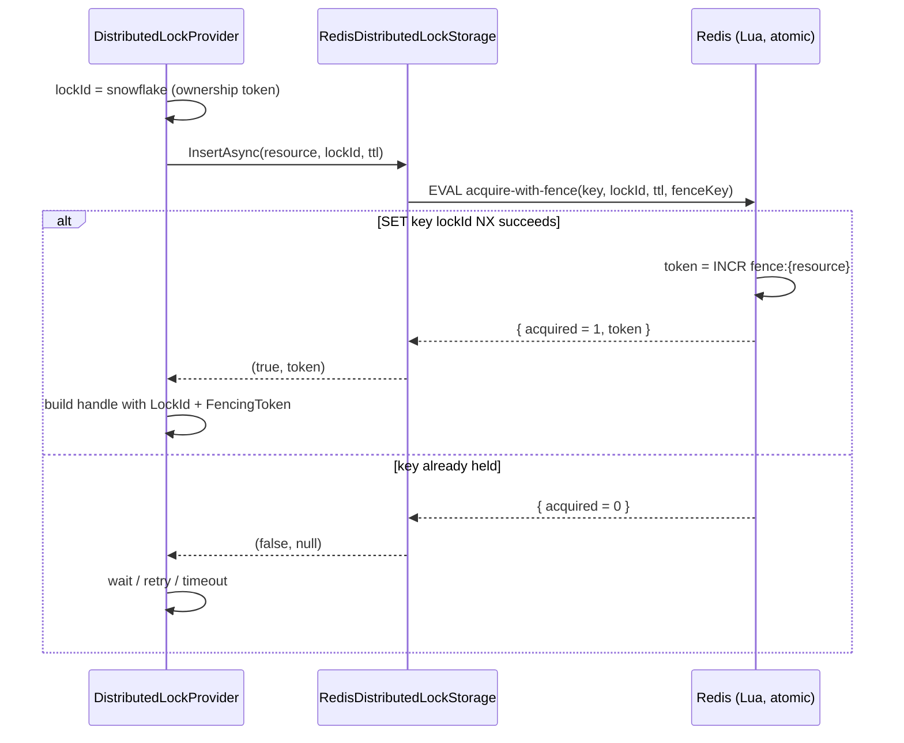
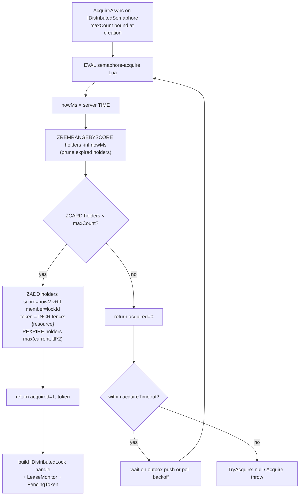

# feat: Monotonic fencing tokens + Redis N-holder semaphore

Adds two related pieces of the `Headless.DistributedLocks` roadmap, sequenced **fencing-first**:

1. **Fencing tokens (#364)** — a separate monotonic `FencingToken` on the lock handle, sourced from a per-resource Redis `INCR` counter, established first on the mutex acquire path.
2. **Redis N-holder semaphore (#291)** — a distributed semaphore with `maxCount` bound at creation via a factory, reusing `LeaseMonitor` + outbox push, with the fencing token baked into its acquire path from the start.

The durable DB-sequence fencing variant and DB-backed semaphores are **out of scope** here (they ship with the Postgres/SQL Server backends, #293/#294). This plan delivers the Redis path and the cross-cutting public-API surface.

**Reference repo:** `madelson/DistributedLock` is studied as the algorithm reference. We port clean-room (our async-only, DI-native conventions); we do not copy its source. References to it below use repo-name-relative paths (e.g. `madelson/DistributedLock: src/...`).

---

## Problem Frame

The framework's current fencing story is *weak*: `IDistributedLock.LockId` is a global snowflake `string` used for ownership equality (release/renew), and consumers are told to use it as a fence. But a snowflake is not a per-resource monotonic counter, so a protected resource cannot reliably reject a stale holder's write by comparing tokens (clock skew, same-tick generation). Kleppmann's fencing model requires a strictly increasing per-resource token issued on each grant.

Separately, the framework has no distributed semaphore. Consumers misuse rate-limiter throttling for "cap N concurrent holders," which is the wrong invariant (concurrency vs rate). The semaphore is the correct primitive and, unlike a rate limiter, benefits from the lock domain's push-wake-up + observability moat.

These are sequenced together because the semaphore's acquire path should issue fencing tokens from day one, and both share the Redis Lua acquire surface and the `LeaseMonitor` lifecycle. Establishing fencing on the mutex first gives a proven, tested foundation before the semaphore builds on it.

---

## Requirements

Traceability to the origin issues:

- **R1 (#364)** — Add `long? FencingToken` to `IDistributedLock` (and `LockInfo`), populated on successful acquire. `null` where a backend provides no fence.
- **R2 (#364)** — `LockId` semantics unchanged: it stays the opaque ownership token (equality-checked in release/renew). Fencing is a *separate* per-resource monotonic counter, not a repurposing of `LockId`.
- **R3 (#364)** — Redis fence via a per-resource `INCR`, incremented atomically with a successful acquire (only a granted acquire issues a token). Best-effort grade: the fence key carries no TTL; monotonicity holds only while the key is not evicted — document the operational contract (avoid `allkeys-*` eviction).
- **R4 (#291)** — Define `IDistributedSemaphore` (per-resource handle-factory, binds `maxCount`) and `IDistributedSemaphoreProvider` with `CreateSemaphore(resource, maxCount)`. `maxCount` is bound at creation, **not** per acquire call.
- **R5 (#291)** — Redis semaphore via ZSET keyed by lock-id with expiration-timestamp scores ("Redis in Action" Ch. 6.3): prune expired, count, add-if-room, set safety TTL. Storage interface `IDistributedSemaphoreStorage` in Core; Redis impl in Redis package. Reuse `LeaseMonitor` for the lease lifecycle.
- **R6 (#291)** — Acquired slot returns the unified `IDistributedLock` handle (so `HandleLostToken`, `LockMonitoringMode`, auto-extension, and the new `FencingToken` flow through unchanged).
- **R7 (#291)** — Slot-freed wake-up integrates with the existing outbox push path (`DistributedLockReleased`); polling fallback when no `IOutboxBus`.
- **R8 (#287 quality bar)** — Both features ship observability inspection, OTel metrics, DoS guardrails, `Setup` three-overload registration, docs sync, and Testcontainers integration coverage.

---

## Key Technical Decisions

**KTD1 — Fencing is a separate per-resource counter, distinct from `LockId`.** `LockId` stays the global snowflake ownership token; `FencingToken` is a per-resource Redis `INCR`. Rationale (settled in #364): if `LockId` *were* the counter, a Redis eviction/reset could hand a new acquirer a token equal to a believed-held holder's, breaking the lock's own release/renew equality — not just external fencing. Separate tokens isolate the eviction footgun to external fencing only.

**KTD2 — Mutex acquire moves from `StringSet NX` to a Lua script.** Today `RedisDistributedLockStorage.InsertAsync` uses `StringSetAsync(key, lockId, ttl, When.NotExists)` (`src/Headless.DistributedLocks.Redis/RedisDistributedLockStorage.cs:16-27`). To issue the fence atomically with the grant (increment **only** when the SET-NX wins), acquire becomes a Lua script: `SET NX` → on success `INCR` the per-resource fence counter → return the token; else return nil. This is the cleanest way to keep "grant ⇒ exactly one new token" atomic. To avoid `CROSSSLOT` sharding errors on a Redis Cluster, mutex storage maps the logical lock name to an internal hash-tagged lock key and derives the fence counter with the same hash tag.

**KTD3 — `IDistributedLockStorage` acquire return shape changes from `bool` to carry the fence.** `InsertAsync` returns `(bool acquired, long? fencingToken)` (or a small result struct). This is a **breaking** internal interface change (greenfield-OK) that ripples to every storage impl — the Redis storage, `ScopedDistributedLockStorage` (wrapper), and the unit-test fake under `tests/Headless.DistributedLocks.Tests.Unit/Fakes/`. The fake gets an in-memory `Interlocked`-style per-resource counter.

**KTD4 — Redis fence is best-effort; durable fence deferred.** The fence key carries **no TTL** and is documented as requiring a non-`allkeys-*` eviction policy — monotonicity holds only while the key survives (per #364's settled decision). A TTL was considered (bounds memory under high-cardinality ephemeral resource names) and **rejected**: it would let a counter silently reset and contradicts #364's explicit "carries no TTL"; fence keys are 8-byte integer counters whose cardinality is already bounded by `MaxResourceNameLength` / `MaxConcurrentWaitingResources` guardrails, so the memory exposure is marginal. Document the no-TTL + eviction-policy contract as the operational note; if a deployment genuinely has unbounded ephemeral resources, a bounded re-extended TTL is the deferred mitigation. The correctness-grade durable sequence is deferred to the Postgres/SQL Server backends (#293/#294). The capability matrix records Redis fence as "best-effort."

**KTD5 — Semaphore `maxCount` bound at creation (factory).** `IDistributedSemaphoreProvider.CreateSemaphore(resource, maxCount)` returns an `IDistributedSemaphore` whose `AcquireAsync`/`TryAcquireAsync` take no count. Per-call inconsistency is impossible by construction (matches `madelson/DistributedLock: src/DistributedLock.SqlServer/SqlDistributedSemaphore.cs`). Cross-process agreement on `maxCount` remains a documented contract; optional runtime guard deferred.

**KTD6 — Semaphore reuses ZSET + server-`TIME` + LeaseMonitor + outbox.** The expiration-scored ZSET algorithm mirrors the existing reader-writer storage's server-clock pattern (`redis.call('TIME')` inside Lua — `src/Headless.DistributedLocks.Redis/RedisDistributedReaderWriterLockStorage.cs`), avoiding client clock skew. The semaphore handle implements `LeaseMonitor.ILeaseHandle` exactly as `DisposableDistributedLock` does, and slot release publishes `DistributedLockReleased` like the mutex.

**KTD7 — `FencingToken` is nullable on the interface; RW handles return `null`.** Mutex and semaphore populate it. Reader-writer lock handles return `null` (reader-side fencing is undefined; writer fencing deferred). This keeps the interface change additive and honest.

**Alternatives considered**

- *Convert `LockId` into the fence (single token).* Rejected per #364 — couples the eviction footgun into ownership safety (see KTD1). Settled decision.
- *Per-call `maxCount` with a runtime mismatch guard.* Rejected in favor of creation-time binding (KTD5) — the factory removes the footgun by construction rather than detecting it.
- *Separate `INCR` round-trip instead of folding into the acquire Lua.* Rejected — non-atomic (a token could be issued without a grant, or vice versa, on partial failure).

---

## High-Level Technical Design

### Mutex acquire with atomic fence issuance (storage Lua)

Directional guidance, not implementation spec.



### Semaphore acquire (Redis ZSET, expiration-scored)



### Lease + wake-up parity (both primitives)

Auto-extension ZADDs the holder's entry with a new expiry score (semaphore) / `ReplaceIfEqual` with new TTL (mutex), driven by the existing `LeaseMonitor` at `AutoExtensionCadenceFraction`. Slot/lock release `ZREM`/`RemoveIfEqual` then publishes `DistributedLockReleased` to wake waiters; polling backstop when no `IOutboxBus`.

---

## Implementation Units

### Phase A — Fencing foundation (mutex path)

### U1. Add `FencingToken` to the public lock surface

- **Goal:** Additive, nullable `long? FencingToken` on the handle and `LockInfo`, implemented across all `IDistributedLock` producers.
- **Requirements:** R1, R2, R7-quality.
- **Dependencies:** none.
- **Files:**
  - `src/Headless.DistributedLocks.Abstractions/RegularLocks/IDistributedLock.cs` (add property + XML doc distinguishing it from `LockId`)
  - `src/Headless.DistributedLocks.Abstractions/RegularLocks/LockInfo.cs` (add `long? FencingToken { get; init; }`)
  - `src/Headless.DistributedLocks.Core/RegularLocks/DisposableDistributedLock.cs` (field + property + ctor param)
  - `src/Headless.DistributedLocks.Abstractions/RegularLocks/NullDistributedLockProvider.cs` (inner handle returns `null`)
  - `src/Headless.DistributedLocks.Core/ReaderWriterLocks/DisposableReaderWriterLock.cs` (returns `null` — KTD7)
- **Approach:** Pure surface addition; no behavior yet (token wired in U3). XML doc must state: `FencingToken` is a per-resource monotonic grant counter for stale-write rejection; `null` when unsupported; distinct from `LockId`.
- **Patterns to follow:** existing nullable handle members and `LockInfo` init-only record style.
- **Test suite design:** unit only — compile-level surface + null defaults. Behavior tested in U2/U3.
- **Test scenarios:**
  - Null handle exposes `FencingToken == null`.
  - RW read/write handles expose `FencingToken == null`.
  - `Test expectation:` minimal — this unit is surface-only; real behavior is covered in U3.
- **Verification:** solution compiles; all `IDistributedLock` implementors satisfy the new member; existing tests green.

### U2. Atomic per-resource fence in the Redis mutex acquire

- **Goal:** Issue a monotonic fence token atomically with a successful mutex grant; change the storage acquire contract to carry it.
- **Requirements:** R1, R3, KTD2, KTD3.
- **Dependencies:** U1.
- **Files:**
  - `src/Headless.DistributedLocks.Core/RegularLocks/IDistributedLockStorage.cs` (`InsertAsync` returns acquired + `long? fencingToken`)
  - `src/Headless.DistributedLocks.Core/RegularLocks/ScopedDistributedLockStorage.cs` (delegate wrapping to satisfy interface change)
  - `src/Headless.DistributedLocks.Redis/RedisDistributedLockStorage.cs` (acquire → Lua via loader)
  - `src/Headless.Redis/RedisScripts.cs` (new acquire-with-fence Lua constant)
  - `src/Headless.Redis/HeadlessRedisScriptsLoader.cs` (add properties, selector delegates, LoadScriptsAsync concurrent loading tasks, and evaluate helper)
  - `tests/Headless.DistributedLocks.Tests.Unit/Fakes/FakeDistributedLockStorage.cs` (per-resource in-memory counter)
  - `tests/Headless.Messaging.Core.Tests.Unit/Fakes/InMemoryDistributedLockStorage.cs` (second fake impl — also breaks on the `InsertAsync` signature change; update to return the new tuple shape)
- **Approach:** Lua: `SET key lockId NX` (+ `PEXPIRE`); on success `INCR` the per-resource fence counter, return `{acquired, token}`; else `{0}`. Redis mutex storage maps the logical lock name to an internal hash-tagged key pair so the lock key and fence key share a Redis Cluster slot. The fence key carries **no TTL** (KTD4 — settled per #364; eviction-policy contract documented in U10). Parse `RedisResult` → `(bool, long?)`. Update both fakes to mint a strictly increasing per-resource token on successful insert so unit-level consumers see fencing without Redis.
- **Technical design (directional):**
  ```lua
  -- KEYS[1]=lockKey KEYS[2]=fenceKey ARGV[1]=lockId ARGV[2]=ttlMs
  -- logical lock names are mapped to hash-tagged lock/fence keys for CROSSSLOT safety
  if redis.call('SET', KEYS[1], ARGV[1], 'NX', 'PX', ARGV[2]) then
    return {1, redis.call('INCR', KEYS[2])} -- counter persists (no TTL) for monotonicity
  else
    return {0}
  end
  ```
- **Patterns to follow:** `ReplaceIfEqualAsync` script registration + `EvaluateAsync` usage in `HeadlessRedisScriptsLoader` (`:223-240`, `:473-512`); RW storage's `RedisResult` parsing.
- **Test suite design:** unit (fake) for the contract shape + monotonicity; Redis integration for the real Lua atomicity.
- **Test scenarios:**
  - Successful acquire returns a non-null token; the next successful acquire of the same resource returns a strictly greater token (Redis integration).
  - Failed acquire (already held) returns `(false, null)` and does **not** advance the counter.
  - Two distinct resources have independent counters (no cross-resource ordering coupling).
  - Fence key has no TTL (integration: inspect `PTTL` == -1).
  - Fake storage mirrors monotonic-per-resource behavior (unit).
- **Verification:** unit + integration tests above pass; `InsertAsync` callers updated; no client-side clock used for the token.

### U3. Thread the fence token through the provider to the handle and `LockInfo`

- **Goal:** Populate `FencingToken` on the acquired handle and surface it via `GetLockInfoAsync`.
- **Requirements:** R1, R2.
- **Dependencies:** U1, U2.
- **Files:**
  - `src/Headless.DistributedLocks.Core/RegularLocks/DistributedLockProvider.cs` (capture token from `InsertAsync`; pass into `_CreateLockHandle`; include in `LockInfo`)
  - `src/Headless.DistributedLocks.Core/RegularLocks/DisposableDistributedLock.cs` (ctor stores token)
- **Approach:** `_CreateLockHandle` gains a `long? fencingToken` param threaded from the acquire result (`DistributedLockProvider.cs:182` acquire → `:372-408` handle creation). `RenewAsync` does **not** change the token (renewal is not a new grant — the token is grant-stable). `GetLockInfoAsync` reports the stored token where available (note: `GetAsync`/`GetLockInfoAsync` read paths may not have a token for locks they did not grant — return `null` there, documented).
- **Patterns to follow:** existing `_CreateLockHandle` parameter threading and `LockInfo` construction.
- **Test suite design:** harness conformance (provider-level) + Redis integration.
- **Test scenarios:**
  - Covers AE (fencing): acquire → handle exposes the same token storage issued.
  - Renew does not change `FencingToken`.
  - Re-acquire after release issues a strictly greater token.
  - A protected-resource simulation: writer with stale (lower) token is rejected by a consumer-side last-fence check; writer with the current token is accepted.
  - `GetLockInfoAsync` for an externally-held lock returns `FencingToken == null` (read path has no issued token).
- **Verification:** conformance + integration green; token is grant-stable across renew; monotonic across re-acquire.

---

### Phase B — Redis N-holder semaphore (fencing baked in)

### U4. `IDistributedSemaphore` + `IDistributedSemaphoreProvider` (factory, creation-time `maxCount`)

- **Goal:** Public contracts with `maxCount` bound at creation.
- **Requirements:** R4, R6.
- **Dependencies:** U1 (handle carries `FencingToken`).
- **Files:**
  - `src/Headless.DistributedLocks.Abstractions/RegularLocks/IDistributedSemaphore.cs` (new)
  - `src/Headless.DistributedLocks.Abstractions/RegularLocks/IDistributedSemaphoreProvider.cs` (new)
  - `src/Headless.DistributedLocks.Abstractions/RegularLocks/NullDistributedSemaphoreProvider.cs` (new — parity with null lock provider)
- **Approach:** `IDistributedSemaphoreProvider.CreateSemaphore(resource, maxCount)` → `IDistributedSemaphore` exposing `Resource`, `MaxCount`, `TryAcquireAsync(options?, ct)`, `AcquireAsync(options?, ct)` returning the unified `IDistributedLock`. `[PublicAPI]`. Argument validation via `Argument.*` (`maxCount` positive).
- **Patterns to follow:** `IDistributedLockProvider` / `IDistributedReaderWriterLockProvider` shapes; `madelson/DistributedLock: src/DistributedLock.Core/IDistributedSemaphore.cs` for the `MaxCount` member and factory binding.
- **Test suite design:** unit — contract + guard clauses; null provider behavior.
- **Test scenarios:**
  - `CreateSemaphore` with `maxCount < 1` throws (guard).
  - Null provider returns a no-op handle / never blocks (parity with null lock provider).
  - `MaxCount` round-trips from creation.
- **Verification:** compiles; guards enforced; null provider conforms.

### U5. `IDistributedSemaphoreStorage` (Core)

- **Goal:** Backend-neutral storage contract for the ZSET algorithm.
- **Requirements:** R5.
- **Dependencies:** U4.
- **Files:** `src/Headless.DistributedLocks.Core/RegularLocks/IDistributedSemaphoreStorage.cs` (new)
- **Approach:** Define pure backend-neutral behavioral methods: `TryAcquireAsync(resource, lockId, maxCount, ttl)`, `TryExtendAsync(resource, lockId, ttl)`, and `ReleaseAsync(resource, lockId)`. Keep all ZSET-specific nomenclature (scores, ZADD/ZREM equivalent semantics) fully encapsulated inside the Redis provider to avoid leakage and ensure clean compatibility with SQL Server and Postgres backends.
- **Patterns to follow:** `IDistributedLockStorage` and `IDistributedReaderWriterLockStorage` high-level method styles.
- **Test suite design:** none directly — exercised via the fake (U7 tests) and Redis impl (U6).
- **Test scenarios:** `Test expectation: none -- interface definition; behavior covered by U6 (Redis) and U7 (provider/fake).`
- **Verification:** compiles; shape supports the acquire/extend/release/count Lua operations.

### U6. Redis semaphore storage (ZSET Lua, fence-integrated)

- **Goal:** Atomic ZSET acquire/extend/release with expiration scores and fence issuance.
- **Requirements:** R5, R3 (fence), KTD6.
- **Dependencies:** U2 (fence Lua/loader), U5.
- **Files:**
  - `src/Headless.DistributedLocks.Redis/RedisDistributedSemaphoreStorage.cs` (new)
  - `src/Headless.Redis/RedisScripts.cs` (semaphore acquire/extend Lua constants)
  - `src/Headless.Redis/HeadlessRedisScriptsLoader.cs` (register script properties, static selectors, and integrate concurrent tasks in LoadScriptsAsync)
- **Approach:** Acquire Lua = prune (`ZREMRANGEBYSCORE … -inf nowMs`) → `ZCARD < maxCount` → `ZADD` + `INCR fence` + increase holders TTL to at least `ttl*2`; uses server `TIME` for `nowMs` (no client clock). Extend = `ZADD` with new score **using the 'XX' modifier** (`redis.call('ZADD', KEYS[1], 'XX', ARGV[1], ARGV[2])`) so a pruned/expired member cannot be accidentally re-added to breach the concurrency limit. Key is hash-tagged (`{resource}:holders`) for cluster slot affinity, consistent with RW storage; the fence key reuses the same hash-tag (`fence:{resource}`) for CROSSSLOT safety and carries **no TTL** (KTD4). Note the holders ZSET *does* get a safety TTL (at least `ttl*2`, never shrunk by shorter later holders) — distinct from the fence counter, which must persist.
- **Technical design (directional):** see the Semaphore acquire flowchart in High-Level Technical Design. Ensure extend Lua uses 'XX'.
- **Patterns to follow:** `RedisDistributedReaderWriterLockStorage` server-`TIME` + hash-tag + multi-key Lua; `madelson/DistributedLock: src/DistributedLock.Redis` semaphore (loosely based on "Redis in Action" 6.3) as the algorithm reference.
- **Test suite design:** Redis integration (Testcontainers) — the bulk of coverage lives here.
- **Test scenarios:**
  - `maxCount=5`: 5 concurrent acquires succeed; the 6th fails until one releases.
  - Crash/expiry: a holder's entry expires (score < now); a new acquire succeeds without explicit release.
  - Extend: a held entry's score is pushed forward; entry survives beyond original TTL.
  - Release `ZREM`s exactly the holder's entry; others unaffected.
  - Fence: each successful acquire returns a strictly greater per-resource token; failed acquire does not advance it.
  - Holders key has safety TTL at least `ttl*2` and shorter later holders do not shrink it (integration: `PTTL` bounded).
- **Verification:** integration suite passes against Testcontainers Redis; server clock authoritative; capacity respected under concurrency.

### U7. Semaphore handle + `DistributedSemaphoreProvider` (LeaseMonitor + outbox push)

- **Goal:** Wire the acquire/extend/release lifecycle into a provider that returns the unified `IDistributedLock` handle with monitoring, auto-extension, fencing, and push wake-up.
- **Requirements:** R5, R6, R7.
- **Dependencies:** U3 (handle threading), U4, U5, U6.
- **Files:**
  - `src/Headless.DistributedLocks.Core/RegularLocks/DistributedSemaphoreProvider.cs` (new — implements `IDistributedSemaphoreProvider`; `CreateSemaphore` returns an internal `RedisDistributedSemaphore` handle-factory)
  - `src/Headless.DistributedLocks.Core/RegularLocks/DisposableSemaphoreSlot.cs` (new — `IDistributedLock` + `LeaseMonitor.ILeaseHandle`, models `DisposableDistributedLock`)
  - `src/Headless.DistributedLocks.Core/RegularLocks/DistributedLockProvider.cs` (reuse outbox publish + `LeaseMonitorRegistry`; extract shared release-publish helper if needed)
- **Approach:** Slot handle's `RenewOrValidateLeaseAsync` calls storage extend (auto-extend) or count-validate (monitor). Release `ZREM`s and publishes `DistributedLockReleased` for the resource so waiters wake; acquire wait loop consumes the same outbox signal + poll backoff used by the mutex. `maxCount` is captured by the handle-factory at `CreateSemaphore`. Cadences reuse `DistributedLockOptions.AutoExtensionCadenceFraction` / `PollingCadenceFraction`.
- **Patterns to follow:** `DisposableDistributedLock` lease wiring (`:19-102`, `:214-257`); `DistributedLockProvider` acquire/retry/outbox flow (`:87-284`, `:484-600`); `LeaseMonitorRegistry`.
- **Test suite design:** harness conformance for semaphore semantics + Redis integration for crash/extend/push; unit for the wait-loop using the fake.
- **Test scenarios:**
  - Covers AE: `maxCount=5` — 5 holders concurrent; 6th waits or returns null per `acquireTimeout`.
  - Holder crash (no release) → entry expires → another caller acquires.
  - `LockMonitoringMode.AutoExtend` holder retains its slot beyond TTL.
  - `HandleLostToken` fires when a slot's lease is lost (entry pruned out from under a non-extending holder).
  - Push wake-up: a released slot wakes a waiter via the outbox before the polling cadence elapses (with `IOutboxBus` registered).
  - Acquired slot exposes a populated `FencingToken`.
  - `releaseOnDispose:false` leaves the entry; explicit `ReleaseAsync` removes it.
- **Verification:** conformance + integration + unit green; push wake-up measurably faster than poll; capacity + lease semantics hold.

### U8. `SetupRedisDistributedSemaphore` registration

- **Goal:** DI registration mirroring the lock setup pattern.
- **Requirements:** R4, R8.
- **Dependencies:** U6, U7.
- **Files:**
  - `src/Headless.DistributedLocks.Redis/Setup.cs` (add `AddRedisDistributedSemaphore` ×3 overloads + `_AddRedisDistributedSemaphoreCore`)
  - `src/Headless.DistributedLocks.Core/Setup.cs` (core `AddDistributedSemaphore<TStorage>` wiring, if symmetric to lock setup)
  - options: reuse `DistributedLockOptions` (KeyPrefix, guardrails, cadence) unless a semaphore-specific option emerges; if a new options type is needed, add `DistributedSemaphoreOptions` + validator in the same file
- **Approach:** Three overloads (`IConfiguration` / `Action<T>` / `Action<T, IServiceProvider>`) delegating to a private `_AddRedisDistributedSemaphoreCore` that `TryAddSingleton<HeadlessRedisScriptsLoader>()` and registers the storage + provider. `TryAdd*` throughout.
- **Patterns to follow:** `RedisDistributedLockSetup` and the RW setup block in `src/Headless.DistributedLocks.Redis/Setup.cs:22-116`.
- **Test suite design:** unit — registration resolves the provider; options validation fires on start.
- **Test scenarios:**
  - All three overloads register a resolvable `IDistributedSemaphoreProvider`.
  - `HeadlessRedisScriptsLoader` registered once (idempotent with lock setup via `TryAdd`).
  - Invalid options fail `ValidateOnStart`.
- **Verification:** `SetupTests`-style unit coverage passes; DI graph resolves.

---

### Phase C — Cross-cutting

### U9. Observability, metrics, and guardrails for the semaphore (quality bar)

- **Goal:** Bring the semaphore up to the #287 quality bar.
- **Requirements:** R8.
- **Dependencies:** U7.
- **Files:**
  - `src/Headless.DistributedLocks.Core/RegularLocks/DistributedLocksDiagnostics.cs` / `DistributedLockMetrics.cs` (semaphore counters/histograms)
  - semaphore provider (inspection APIs: active holders, count, per-resource holder count)
  - `src/Headless.DistributedLocks.Core/RegularLocks/DistributedLockOptions.cs` (confirm waiter/resource guardrails apply to semaphore waiters)
- **Approach:** Reuse `ActivitySource` + `Meter`; add semaphore acquire/fail/wait-time instruments. Expose `GetHolderCountAsync(resource)` / active-holder inspection. Apply `MaxWaitersPerResource` / `MaxConcurrentWaitingResources` to the semaphore wait path.
- **Patterns to follow:** existing `headless.lock.failed` / `headless.lock.wait.time` instruments; lock inspection APIs; modern .NET 8+ Source Generator annotations (`[Counter<int>]` and `[Histogram<double>]` in the partial `Instruments` class of `DistributedLockMetrics.cs`) to maintain high-performance compiler-generated wrappers.
- **Test suite design:** unit for guardrail enforcement; integration asserts metrics emitted.
- **Test scenarios:**
  - Exceeding `MaxWaitersPerResource` on a saturated semaphore throws the guardrail error.
  - Acquire failure increments the failure counter; wait time recorded.
  - Holder-count inspection reflects live ZSET cardinality.
- **Verification:** guardrail + metric tests pass; inspection matches storage truth.

### U10. Docs sync — fencing + semaphore + capability matrix

- **Goal:** Keep `docs/llms/` and package READMEs in lockstep (mandatory per AUTHORING + #287).
- **Requirements:** R8.
- **Dependencies:** U3 (fencing shipped), U8 (semaphore shipped).
- **Files:**
  - `docs/llms/distributed-locks.md` (rewrite "Weak Fencing With LockId" → "Fencing Tokens"; add semaphore section; update capability-matrix fencing + semaphore rows; cross-link `docs/llms/rate-limiting.md` for concurrency-vs-rate)
  - `src/Headless.DistributedLocks.Abstractions/README.md`, `src/Headless.DistributedLocks.Core/README.md`, `src/Headless.DistributedLocks.Redis/README.md` (mirror per AUTHORING)
- **Approach:** Document `FencingToken` semantics + the Redis best-effort eviction contract (KTD4); document the semaphore (concurrency control, creation-time `maxCount`, why it's the right tool vs `Polly.RateLimiting`/`RedisRateLimiting`). Regenerate the doc ToC.
- **Patterns to follow:** `docs/authoring/AUTHORING.md` per-package section order; existing distributed-locks.md structure.
- **Test suite design:** none (docs).
- **Test scenarios:** `Test expectation: none -- documentation.`
- **Verification:** docs build/links resolve; capability matrix rows accurate; READMEs mirror the llms sections; no stale "weak fence" framing remains.

---

## Scope Boundaries

**In scope:** Redis fencing token (mutex + semaphore), the cross-cutting `IDistributedLock.FencingToken` API, the Redis N-holder semaphore with creation-time `maxCount`, quality-bar items, docs.

**Deferred to follow-up work (other issues):**
- **Durable DB-sequence fencing** → ships with Postgres (#293) and SQL Server (#294) backends; this plan documents it as the correctness-grade variant but does not build it.
- **Reader-writer / writer fencing** → handles return `null` for now (KTD7).
- **Slot-table semaphore on SQL Server / Postgres** → #294 / not-on-Postgres per the capability matrix.
- **Cross-process `maxCount` mismatch runtime guard** → optional hardening, deferred (KTD5).

**Outside this plan's identity:** rate limiting of any kind (delegated — see `docs/llms/rate-limiting.md`); composite multi-resource acquire (#292, deferred).

---

## Risks & Dependencies

- **Atomicity (high):** fence issuance must be inside the same Lua as the grant. Mitigation: KTD2 converts acquire to Lua; tests assert "failed acquire never advances the counter."
- **CROSSSLOT Key Alignment (high):** Accessing both the lock key and the counter key in Lua will throw cluster alignment errors. Mitigation: U2/U6 enforce slot sharding affinity by mapping logical mutex names and semaphore resources to storage-owned hash-tagged key pairs.
- **Semaphore Waiter Starvation (medium):** If a single waiter is woken up but fails to acquire the slot due to a transient Redis error, the slot remains empty while the other waiters remain asleep. Mitigation: U7 wait-loop includes a fail-safe nudge that republishes `DistributedLockReleased` on transient failure to pass the signal.
- **Redis eviction breaks monotonicity (medium):** the fence counter has no TTL; monotonicity holds only while the key survives. Mitigation: documented operational contract (non-`allkeys-*` eviction policy) in U10; correctness-grade durable fence is the DB backends' job (#293/#294). Memory exposure from high-cardinality resource names is marginal (8-byte counters, bounded by `MaxResourceNameLength`/`MaxConcurrentWaitingResources`); a bounded re-extended TTL is the deferred mitigation if a deployment proves otherwise (KTD4 — deviates from #364, so deferred not adopted).
- **Breaking storage contract (medium):** `InsertAsync` return-shape change touches every `IDistributedLockStorage` impl — Redis storage, `ScopedDistributedLockStorage` wrapper, **and two test fakes** (`tests/Headless.DistributedLocks.Tests.Unit/Fakes/FakeDistributedLockStorage.cs`, `tests/Headless.Messaging.Core.Tests.Unit/Fakes/InMemoryDistributedLockStorage.cs`). Mitigation: U2 updates all four within the same implementation unit; greenfield posture allows the break.
- **ZSET clock correctness (medium):** must use server `TIME` in Lua (not client clock). Mitigation: mirror RW storage; integration test asserts expiry behavior under a `FakeTimeProvider`-driven harness where possible and real Redis TIME otherwise.
- **Semaphore fairness (low):** the ZSET approach has no FIFO guarantee (thundering herd under contention). Acceptable and matches the reference algorithm; document as a non-goal.
- **Dependency:** all units depend on Phase 2 (`LeaseMonitor`, `HandleLostToken`) which is already shipped (#289). No external blockers.

---

## Test-Suite Design (cross-unit)

- **Unit (`tests/Headless.DistributedLocks.Tests.Unit`)** — fencing contract + monotonicity via the `Fakes/` storage; semaphore provider wait-loop, guards, setup/DI; null providers. Reserved for logic that does not need Redis.
- **Harness (`tests/Headless.DistributedLocks.Tests.Harness`)** — extend `DistributedLockProviderTestsBase` (or a new `DistributedSemaphoreProviderTestsBase`) with provider-level conformance both the fake and Redis impls must pass (fencing monotonicity, semaphore capacity, lease loss).
- **Integration (`tests/Headless.DistributedLocks.Redis.Tests.Integration`)** — the bulk: real Lua atomicity, ZSET expiry/crash recovery, auto-extend, outbox push wake-up, fence-key TTL inspection, concurrency at `maxCount`.

Coverage targets per `CLAUDE.md` (≥85% line, ≥80% branch). The fencing return-shape change must keep existing mutex/RW suites green.

---

## Sources & Research

- **Origin issues:** #364 (fencing — separate `FencingToken`, Redis INCR best-effort + DB sequence durable), #291 (semaphore — creation-time `maxCount`, ZSET, LeaseMonitor reuse, outbox push). Tracking #287.
- **Reference repo (read-only, MIT, clean-room):** `madelson/DistributedLock` — `src/DistributedLock.Redis` (semaphore ZSET, "Redis in Action" 6.3), `src/DistributedLock.SqlServer/SqlDistributedSemaphore.cs` (creation-time `maxCount` binding), `src/DistributedLock.MongoDB/MongoDistributedLockHandle.cs` (monotonic fencing token prior art).
- **Current impl (grounding):** `RedisDistributedLockStorage.cs` (mutex acquire via `StringSet NX`, to become Lua), `HeadlessRedisScriptsLoader.cs:223-240,473-512` (script load/execute), `RedisDistributedReaderWriterLockStorage.cs` (ZSET/HASH + server-`TIME` + hash-tag), `DistributedLockProvider.cs:127,182,372-408` (lockId gen, acquire, handle creation), `DisposableDistributedLock.cs:19-102,214-257` (handle + LeaseMonitor wiring), `DistributedLockOptions.cs` (cadence + guardrails).
- **Concept:** Kleppmann, "How to do distributed locking" (fencing tokens).
- **Docs to keep in lockstep:** `docs/llms/distributed-locks.md`, `docs/llms/rate-limiting.md` (concurrency-vs-rate), `docs/authoring/AUTHORING.md`.
