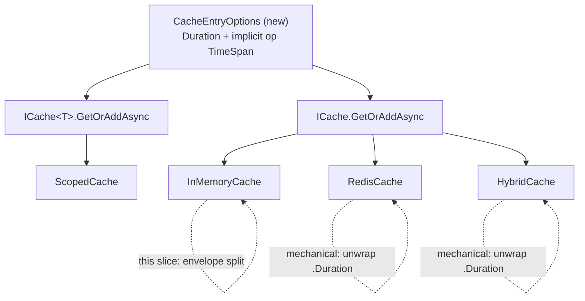

# feat: Cache entry-metadata envelope + CacheEntryOptions (abstractions + Memory)

## Summary

Lay the metadata foundation for the `Headless.Caching.*` M1/M2 program. Introduce a `CacheEntryOptions` value type (carrying only `Duration` today, with an implicit `TimeSpan` conversion) that replaces the bare `TimeSpan` on `GetOrAddAsync`, and refactor the Memory provider's stored entry to separate **logical expiration** (value stale) from **physical expiration** (entry evicted) plus reserved internal slots for a last-factory-error and tags. The change is behavior-preserving: with only a duration supplied, logical == physical and the cache behaves exactly as today.

---

## Problem Frame

Memory's internal `CacheEntry` (`src/Headless.Caching.Memory/InMemoryCache.cs`) collapses "value is stale" and "entry is evicted" into a single `ExpiresAt` instant, and `GetOrAddAsync` accepts a bare `TimeSpan expiration` across `ICache`, `ICache<T>`, and `ScopedCache`. That model cannot host the M1/M2 resilience features the roadmap commits to: fail-safe needs a value to survive past its staleness point; factory timeouts/throttling need a place to record the last factory error; tagging needs a per-entry tag set. The roadmap's gating rule is "design the metadata model once; both M1 and M2 ride it" (see origin: `docs/brainstorms/2026-06-02-cache-entry-envelope-options-requirements.md`), so the envelope's field set must be settled now even though no new behavior ships in this slice.

This is deliberately a structural/architectural change — the envelope and options shape are the subject, not incidental implementation detail.

---

## Requirements

Traceability to the origin requirements doc (R-IDs are the origin's).

**Envelope (Memory)**
- R1. Memory's stored entry separates logical expiration from physical expiration; the single `ExpiresAt` is replaced by both.
- R2. The envelope carries a reserved last-factory-error slot (error + timestamp), always empty in this slice.
- R3. The envelope carries a reserved tags slot (set of tag strings), always empty in this slice.
- R4. Eviction, LRU, size accounting, and `IsExpired`/read-miss decisions are driven by physical expiration; logical expiration is recorded but not yet consulted.

**CacheEntryOptions surface**
- R5. `CacheEntryOptions` exposes a single active member, `Duration`; no fail-safe/timeout/refresh/tag members in this slice.
- R6. `Duration` validation matches today's `GetOrAddAsync` contract (must be positive).
- R7. Implicit conversion from `TimeSpan` to `CacheEntryOptions` maps the `TimeSpan` to `Duration`.

**GetOrAddAsync signature**
- R8. `GetOrAddAsync` takes `CacheEntryOptions` in place of `TimeSpan`; existing `TimeSpan` call sites compile unchanged via R7.
- R9. The write family (`UpsertAsync`, `TryInsertAsync`, increment/set-if/set-add, …) retains `TimeSpan?` and is not changed; its writes produce envelopes where logical == physical.

**Behavior preservation & docs**
- R10. With only a duration provided, Memory's observable behavior (hits, misses, expiry timing, eviction, cloning, size limits, stampede protection) is identical; existing Memory/abstraction tests pass unchanged.
- R11. Cross-provider conformance of the envelope is asserted by parity tests (logical == physical, reserved slots empty). **Plan decision:** these live in the existing Memory unit project for this slice; the `Headless.Caching.Tests.Harness` extraction is deferred to #372 (see KTD-4).
- R12. The `CacheEntryOptions` public surface is documented as the M1 extension point — later PRs add members rather than replacing it.

---

## Key Technical Decisions

- **KTD-1. Full internal envelope, lean public options.** The Memory envelope materializes its complete field set now (logical, physical, last-factory-error, tags) as internal structural capacity; `CacheEntryOptions` exposes only `Duration`. Each later knob (fail-safe, timeouts, refresh) is added to the public surface by the M1 PR that activates it — no public property is inert. (see origin Key Decisions)

- **KTD-2. Shared semantics, not a shared type.** No shared envelope CLR type across providers and no `InternalsVisibleTo` in the caching domain. Memory models the fields natively on its private `CacheEntry`; Redis (#372) designs its own wire format against the same documented field set. Drift is guarded by conformance tests once a 2nd provider rides the model.

- **KTD-3. `CacheEntryOptions` is a `readonly struct` with `init` members and an implicit `TimeSpan` conversion.** (Revised during PR #389 code review — originally specified as a mutable `sealed class`.) A per-call parameter value benefits from value semantics: zero heap allocation on the hot `GetOrAddAsync` path, immutability by construction, and **no null surface** — the parameter cannot be `null`, so no `Argument.IsNotNull(options)` guard is needed on any implementer; only `Duration` positivity is validated inline with `Argument.IsPositive`, exactly as `GetOrAddAsync` validated `expiration` before. Additive growth across M1 PRs is preserved via new `init` members (e.g. fail-safe, timeout, refresh). It is a per-call value, **not** a DI options-pattern type — so no FluentValidation validator. Lives in `src/Headless.Caching.Abstractions/Contracts/` beside `CacheOptions`/`CacheValue`.

- **KTD-4. Conformance harness deferred to #372.** No caching `Tests.Harness` exists today, and this slice produces nothing observable across providers (everything reduces to current behavior). Per this repo's "extract the harness when adding the 2nd provider" rule, the natural extraction point is #372, where Redis's envelope becomes the genuine 2nd implementation of the model. This slice keeps its parity assertions in `tests/Headless.Caching.Memory.Tests.Unit`. (Overrides the origin's tentative assumption that the skeleton lands here.)

- **KTD-5. Replace, don't overload.** `GetOrAddAsync`'s `TimeSpan` parameter is replaced outright (greenfield posture); the implicit conversion preserves call-site ergonomics. Consequence: the signature change on `ICache` forces a same-commit mechanical update of every implementation (`ICache<T>`, `ScopedCache`, `InMemoryCache`, `RedisCache`, `HybridCache`) to keep the solution compiling — Redis/Hybrid unwrap `.Duration` and keep current behavior; their real envelope work stays in #372.

---

## High-Level Technical Design

### Envelope field shape (Memory `CacheEntry`)

| Field | Today | This slice | Drives behavior now? |
|---|---|---|---|
| value | ✅ | ✅ (unchanged) | yes |
| `ExpiresAt` | single instant | **removed** | — |
| `LogicalExpiresAt` | — | value-stale instant | no (recorded only) |
| `PhysicalExpiresAt` | — | eviction instant | yes (eviction/expiry/LRU) |
| `LastFactoryError?` | — | reserved, null | no |
| `Tags?` | — | reserved, empty | no |
| `Size` / `LastAccessTicks` | ✅ | ✅ (unchanged) | yes |

Invariant this slice: on every write `LogicalExpiresAt == PhysicalExpiresAt == now + Duration`, reserved slots empty — which is why behavior is unchanged.

### Signature-change ripple (atomic compile boundary)

The interface flip (U2) and all implementer updates must land in one commit; the Memory envelope refactor (U3) follows as a Memory-internal change.

---

## Implementation Units

### U1. Add `CacheEntryOptions` value type

- **Goal:** Introduce the per-call options type that `GetOrAddAsync` will accept, with an implicit `TimeSpan` conversion. Compiles standalone with no consumers yet.
- **Requirements:** R5, R6, R7, R12
- **Dependencies:** none
- **Files:**
  - `src/Headless.Caching.Abstractions/Contracts/CacheEntryOptions.cs` (new)
  - `tests/Headless.Caching.Abstractions.Tests.Unit/CacheEntryOptionsTests.cs` (new)
- **Approach:** `[PublicAPI] readonly struct CacheEntryOptions` with an `init` `Duration` (`TimeSpan`) and `public static implicit operator CacheEntryOptions(TimeSpan duration)`. XML doc states it is the M1 extension point and that fail-safe/timeout/refresh members arrive in later PRs. No validator (KTD-3); callers validate `Duration` at use (see U2/U3).
- **Patterns to follow:** `src/Headless.Caching.Abstractions/Contracts/CacheOptions.cs` and `Contracts/CacheValue.cs` for file shape, namespace (`Headless.Caching`), and annotation style.
- **Test scenarios:**
  - Implicit conversion: `TimeSpan.FromMinutes(5)` assigned to a `CacheEntryOptions` yields `Duration == 5 min`. *Covers R7.*
  - Default/explicit construction: `new CacheEntryOptions { Duration = … }` round-trips `Duration`.
  - A `TimeSpan` argument is accepted where `CacheEntryOptions` is the parameter type (compile + runtime equivalence). *Covers R7, R8.*
- **Verification:** New unit tests pass; type is `public`, lives under `Contracts/`, and exposes only `Duration` (no inert knobs). *Covers R5.*

### U2. Flip `GetOrAddAsync` to `CacheEntryOptions` across abstraction + all implementations

- **Goal:** Replace the `TimeSpan expiration` parameter with `CacheEntryOptions` on every `GetOrAddAsync` declaration and implementation, in one compiling commit. Behavior unchanged everywhere — implementations read `.Duration` and call existing logic.
- **Requirements:** R8, R9 (verify write family untouched), R10
- **Dependencies:** U1
- **Files:**
  - `src/Headless.Caching.Abstractions/ICache.cs`
  - `src/Headless.Caching.Abstractions/ICache`T.cs`
  - `src/Headless.Caching.Abstractions/ScopedCache.cs`
  - `src/Headless.Caching.Memory/InMemoryCache.cs` (GetOrAddAsync entry point only; envelope split is U3)
  - `src/Headless.Caching.Redis/RedisCache.cs`
  - `src/Headless.Caching.Hybrid/HybridCache.cs`
  - `src/Headless.Caching.Memory/Setup.cs` — `InMemoryCacheDistributedCacheAdapter.GetOrAddAsync` is a real `ICache` implementer and must be updated (confirmed, not conditional)
- **Approach:** Change parameter type to `CacheEntryOptions options`; inside each implementation add `Argument.IsNotNull(options)` (it is a reference type and can be passed `null` → NRE otherwise), then derive `var expiration = options.Duration;` and feed the existing code path, preserving the existing `Argument.IsPositive(expiration)` guard against `options.Duration`. Do **not** touch the write family (R9). Update XML doc comments that reference the `expiration` parameter. Watch the compiler for any additional `ICache`/`ICache<T>` implementers not listed above and update them the same mechanical way (execution-time discovery).
- **Patterns to follow:** existing delegation in `ScopedCache.GetOrAddAsync` (`_cache.GetOrAddAsync(_ScopeKey(key), factory, expiration, ct)`); existing `Argument.IsPositive` usage in `InMemoryCache`.
- **Test suite design:** No new tests; this unit is validated by the existing abstraction/provider suites continuing to pass via the implicit conversion. The Memory parity tests are added in U3.
- **Test scenarios:**
  - Existing `tests/Headless.Caching.Abstractions.Tests.Unit/GetOrAddAsyncTests.cs` compile unchanged (they pass `TimeSpan` literals) and pass. *Covers AE1, R8.*
  - Existing `tests/Headless.Caching.Hybrid.Tests.Unit/HybridCacheTests.cs` pass unchanged. *Covers R10.*
  - Existing `tests/Headless.Caching.Redis.Tests.Integration` `GetOrAddAsync` coverage passes unchanged.
  - `ScopedCache` key-scoping behavior through `GetOrAddAsync` is unchanged.
- **Verification:** Full solution builds; all pre-existing caching tests pass with no edits to their call sites beyond what the implicit conversion handles. No write-family signature changed (grep confirms `UpsertAsync`/`TryInsertAsync`/etc. still take `TimeSpan?`). *Covers R9.*

### U3. Memory envelope: split logical/physical expiration + reserve error/tags slots

- **Goal:** Refactor Memory's private `CacheEntry` to carry `LogicalExpiresAt` + `PhysicalExpiresAt` (replacing single `ExpiresAt`) plus reserved `LastFactoryError?` and `Tags?` slots, with logical == physical on all writes. The structural foundation #372/#373 ride.
- **Requirements:** R1, R2, R3, R4, R10, R11
- **Dependencies:** U2
- **Files:**
  - `src/Headless.Caching.Memory/InMemoryCache.cs` (`CacheEntry` class; `IsExpired`; `WithExpiration`; `GetExpirationAsync`; expiration-queue/eviction paths)
  - `tests/Headless.Caching.Memory.Tests.Unit/InMemoryCacheTests.cs` (add parity/behavior assertions)
- **Approach:** Replace `CacheEntry.ExpiresAt` with `LogicalExpiresAt` and `PhysicalExpiresAt`. All current write paths (`GetOrAddAsync`, `UpsertAsync`, `TryInsertAsync`, `TryReplaceAsync`, set/increment ops) set both to `now + duration` (logical == physical). When the supplied expiration is `null` (eternal entry, write family only), store both instants as `null` — never `now + null`. `IsExpired`, the `_expirationQueue`, LRU, and size accounting key off `PhysicalExpiresAt` (preserving today's semantics). `GetExpirationAsync` (currently reads `ExpiresAt`) returns the logical expiration. Add `LastFactoryError?` (nullable, holds error + timestamp) and `Tags?` (nullable set) fields, always null/empty this slice; ensure `WithExpiration` and the clone/prototype constructor carry them forward unchanged. Logical expiration is stored but read by nothing time-sensitive yet.
- **Technical design (directional, not specification):** make the new `(logicalExpiresAt, physicalExpiresAt)` constructor the **primary**, and keep the existing single-instant constructor as an overload delegating to it (`: this(value, expiresAt, expiresAt, …)`). This preserves all ~22 existing `new CacheEntry(...)` call sites untouched in this slice and gives #373 a single place to widen physical beyond logical.
- **Patterns to follow:** existing `CacheEntry` constructor, `WithExpiration`, and `IsExpired` in `InMemoryCache.cs`; existing `_TrackUpdate`/eviction logic for which timestamp to enqueue.
- **Test suite design:** Unit-level in `Headless.Caching.Memory.Tests.Unit` (the harness extraction is deferred — KTD-4). Reuse `FakeTimeProvider` as the existing tests do.
- **Test scenarios:**
  - Add with a 10-min duration → `LogicalExpiresAt == PhysicalExpiresAt == now + 10 min`. *Covers AE2, R1.*
  - `UpsertAsync(key, value, TimeSpan.FromMinutes(5))` → envelope logical == physical == now + 5 min; write API unchanged. *Covers AE3, R9.*
  - Newly created entry → `LastFactoryError` is null and `Tags` is empty/null. *Covers AE4, R2, R3.*
  - `UpsertAsync(key, value, expiration: null)` (eternal entry) → both `LogicalExpiresAt` and `PhysicalExpiresAt` are null; entry never expires, matching today. *Covers R9, R10.*
  - `GetExpirationAsync` returns the logical expiration and matches the value observed before the field split. *Covers R4, R10.*
  - Expiry: advancing the fake clock past physical expiration evicts/expires the entry exactly as before the change (read miss, eviction eligibility). *Covers R4, R10.*
  - LRU + `MaxItems` eviction, size limits (`MaxMemorySize`/`MaxEntrySize`), and `CloneValues` isolation behave identically to pre-change. *Covers R10.*
  - Stampede protection: concurrent `GetOrAddAsync` on a cold key runs the factory once. *Covers R10.*
- **Verification:** New parity/behavior tests pass; the full pre-existing `InMemoryCacheTests` and `InMemoryCachePerformanceTests` pass unchanged; no `ExpiresAt` references remain. *Covers R1–R4, R10, R11.*

### U4. Docs sync: caching LLM doc + package READMEs

- **Goal:** Reflect the public API change (`GetOrAddAsync` now takes `CacheEntryOptions`; implicit `TimeSpan`) and document `CacheEntryOptions` as the M1 extension point.
- **Requirements:** R12
- **Dependencies:** U2 (signature final), U3 (envelope concept final)
- **Files:**
  - `docs/llms/caching.md`
  - `src/Headless.Caching.Abstractions/README.md`
  - `src/Headless.Caching.Memory/README.md`
- **Approach:** Per `docs/authoring/AUTHORING.md`, update the agent-facing doc and the affected package READMEs in lockstep: the `GetOrAddAsync` examples (still valid via implicit conversion — show both the `TimeSpan` shorthand and the explicit `CacheEntryOptions` form), a short note introducing logical-vs-physical expiration as the foundation for upcoming fail-safe/tagging, and that `CacheEntryOptions` will grow additively. Note the public-API breaking change (greenfield posture). Do not document Redis envelope specifics (deferred to #372).
- **Patterns to follow:** existing `docs/llms/caching.md` structure and the Usage/Configuration sections of the package READMEs.
- **Test expectation:** none — documentation only.
- **Verification:** `docs/llms/caching.md` and both READMEs reflect the new signature and envelope concept; no stale `TimeSpan expiration`-only examples remain; AUTHORING drift checks pass.

---

## Scope Boundaries

### Deferred to follow-up work (other issues in #369)
- Redis payload format serializing the same field set — #372 (also the conformance-harness extraction point, KTD-4).
- Fail-safe / serve-stale-on-failure and reading logical expiration — #373.
- Soft/hard factory timeouts, background completion, last-factory-error population/throttling — #374.
- Eager refresh (#375), adaptive caching (#376), sliding expiration (#377).
- Tagging behavior and `RemoveByTagAsync` (populating/querying the tags slot) — #378–#380.

### Non-goals (outside this issue's shape)
- Extending `CacheEntryOptions` to the write family — it stays on `TimeSpan?`; options attach only where a factory exists. **Known future path:** tagging (#378) applies to direct writes too, so the write family will likely take options when M2 lands; that migration is out of scope here but anticipated.
- A shared envelope CLR type, a `Caching.Core` package, or `InternalsVisibleTo` wiring (KTD-2).
- Any new observable cache behavior — this slice is structure-only.

---

## Risks & Dependencies

- **Dependencies:** none upstream — this is the foundation slice of M1. Internal sequencing: U1 → U2 → U3 → U4.
- **Risk — incomplete implementer sweep on the signature flip (U2).** A missed `ICache`/`ICache<T>` implementation breaks the build. *Mitigation:* the compiler enumerates every implementer; the unit treats the listed files as the known set and any compiler-flagged extras as the same mechanical edit.
- **Risk — silently changing eviction/expiry semantics during the envelope split (U3).** Pointing eviction at the wrong timestamp would regress behavior invisibly. *Mitigation:* physical expiration drives all current decisions, and the full pre-existing Memory suite plus explicit parity/expiry tests must pass unchanged.
- **Risk — implicit conversion masking an intended explicit choice.** A `TimeSpan` silently becoming options is convenient but can hide intent later when knobs exist. *Mitigation:* acceptable now (only `Duration` exists); revisit when M1 adds knobs, documented in U4.

---

## Sources & Research

- Origin requirements: `docs/brainstorms/2026-06-02-cache-entry-envelope-options-requirements.md`.
- Roadmap/thesis (FusionCache playbook, "design the metadata model once"): GitHub #369; this slice is #371.
- Current code surface verified: `GetOrAddAsync` declared on `src/Headless.Caching.Abstractions/ICache.cs`, `ICache`T.cs`, `ScopedCache.cs`; implemented in `InMemoryCache.cs`, `RedisCache.cs`, `HybridCache.cs`. Memory entry storage and `CacheEntry` in `src/Headless.Caching.Memory/InMemoryCache.cs`.
- Test surface: `tests/Headless.Caching.{Abstractions.Tests.Unit,Memory.Tests.Unit,Hybrid.Tests.Unit,Redis.Tests.Integration}`. No `Headless.Caching.Tests.Harness` exists today (basis for KTD-4).
- Conventions: project `CLAUDE.md` (options pattern, harness-extraction trigger, docs sync trigger), `docs/authoring/AUTHORING.md` (docs lockstep).
