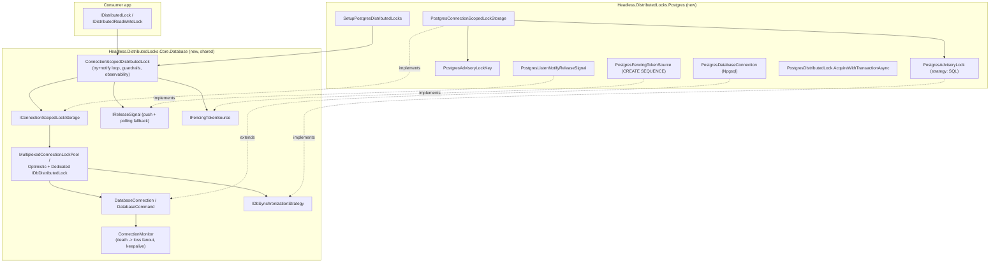
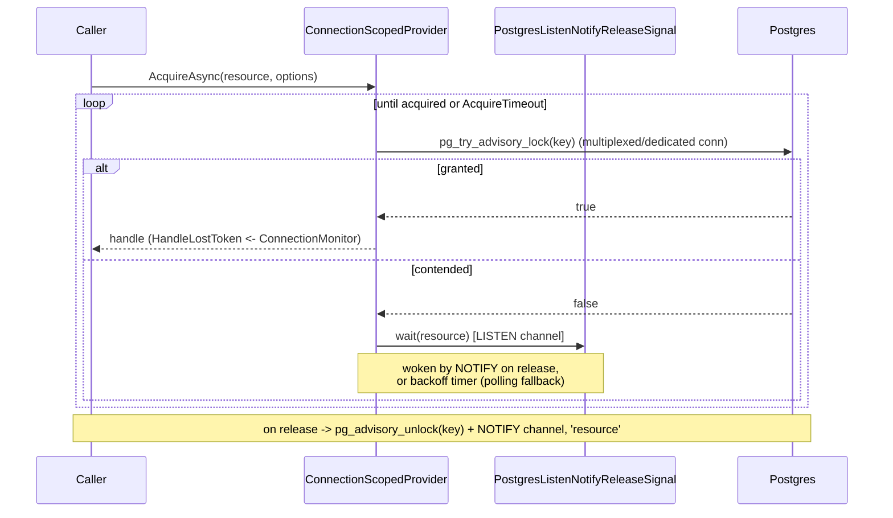
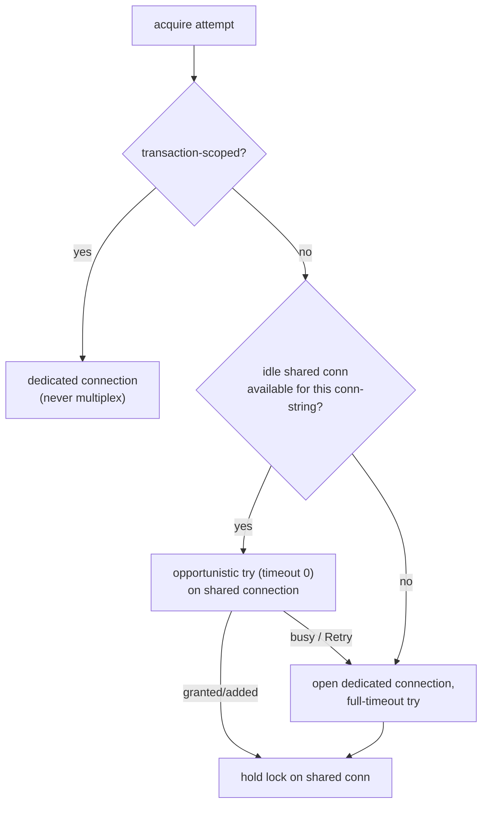

# feat: Postgres distributed-lock provider (pg_advisory_lock + pg_advisory_xact_lock)

## Summary

Add `Headless.DistributedLocks.Postgres` — the framework's first **cross-node DB-engine** lock backend — built on a new shared `Headless.DistributedLocks.Core.Database` package that both this provider and the future SQL Server provider (#294) consume. Postgres advisory locks are **connection-scoped** (no TTL, no server-stored lock value; the lock lives exactly as long as the holding session or transaction), so this work cannot reuse the existing TTL-based `DistributedLock`. Instead it introduces a connection-scoped provider that maps `pg_advisory_lock`/`pg_advisory_xact_lock` onto the `IDistributedLock` surface, with correctness-grade `HandleLostToken` driven by connection death (`ConnectionMonitor`), optimistic connection multiplexing, PG-native `LISTEN`/`NOTIFY` push wake-up, a durable sequence-backed fencing token, and reader-writer support.

---

## Problem Frame

The distributed-locks roadmap (#287) commits the framework to three cross-node backends — Redis (shipped), Postgres (this issue, #293), SQL Server (#294) — differentiating from `madelson/DistributedLock` on operability: push wake-up, observability, DoS guardrails, DI-native registration, and proper fencing. Postgres is the first DB-engine backend, so it carries the one-time cost of standing up the shared ADO.NET engine (connection lifecycle, death monitoring, multiplexing) that #294 will reuse.

Two backend properties make Postgres strategically valuable and shape the whole design:

- **Transaction-coupled locking** (`pg_advisory_xact_lock`) makes the lock and the data mutation atomic by construction — the safest primitive in the framework, needing no fencing in that mode.
- **Connection-scoped locking** gives **correctness-grade** lost-handle detection: when the holding connection dies, Postgres releases the lock server-side and `ConnectionMonitor` fires `HandleLostToken` — a stronger guarantee than Redis's best-effort TTL lease.

The existing `DistributedLock` ([src/Headless.DistributedLocks.Core/RegularLocks/DistributedLock.cs](../../src/Headless.DistributedLocks.Core/RegularLocks/DistributedLock.cs)) is hard-wired to `IDistributedLockStorage` (TTL `InsertAsync`/`ReplaceIfEqualAsync`/`RemoveIfEqualAsync`) and `LeaseMonitor` (TTL-fraction polling). None of that maps to advisory locks. The reconciliation between connection-scoped semantics and the `IDistributedLock` contract is the core design problem this plan solves.

---

## Key Technical Decisions

- **Acquire model is try-loop + `LISTEN`/`NOTIFY` push wake-up, not server-side blocking.** The cited madelson port uses a blocking `pg_advisory_lock` that parks the backend server-side; this plan deliberately does **not**. Contended acquires run `pg_try_advisory_lock` (non-blocking) in a backoff retry loop and are woken by a PG-native `NOTIFY` published on release, with polling backoff as the fallback when no notification arrives. Rationale: (a) it is the stated product differentiator in #287 ("push-driven … coordination"); (b) a non-blocking try never holds a connection while *waiting*, so waiters multiplex cleanly instead of pinning one connection per waiter; (c) it reuses the framework's established retry/guardrail/observability shape. Trade-off: more moving parts than a server-side block (a dedicated listener connection + a `NOTIFY`-on-release path) and a correctness surface around notification delivery — mitigated by the polling fallback, which makes `NOTIFY` a latency optimization, never a correctness dependency.

- **Shared DB engine lives in a new `Headless.DistributedLocks.Core.Database` package, not in `.Core`.** The provider-agnostic ADO.NET engine (connection wrapper, command wrapper, `ConnectionMonitor`, multiplexing pool, dedicated-connection lock, `IConnectionScopedLockStorage`, the connection-scoped provider) is its own package referenced by `.Postgres` and `.SqlServer`. Rationale: `Headless.DistributedLocks.Core` is referenced by the Redis provider; putting ADO.NET engine internals there would force Redis to transitively carry DB-engine machinery it never uses. A dedicated package keeps the dependency graph honest. `Core.Database` depends on `.Abstractions` (and `.Core` only if it needs the shared `DistributedLockOptions`/diagnostics — see U3).

- **No interface change for fencing — this PR only populates the existing `FencingToken` with a durable PG sequence.** #368 already shipped the `long? FencingToken` member on `IDistributedLock`, `DistributedLockInfo`, and `DistributedLockHandleBase`, the `DistributedLockAcquireResult(bool Acquired, long? FencingToken)` storage shape, and the best-effort Redis fence (Lua `INCR` of a no-TTL counter). #364 remains open for the **durable DB sequence** portion (Postgres + SQL Server) and the docs. This plan delivers the Postgres half: a `ConnectionScopedDistributedLock` that threads a fence value from an `IFencingTokenSource` (Core.Database seam) into the existing handle, implemented for Postgres as a durable sequence. Follow the existing convention that **reader-writer locks issue no fence** (`FencingToken == null`, per `DisposableReaderWriterLock`). No public-surface change is needed; `IConnectionScopedLockStorage` mirrors the `DistributedLockAcquireResult` shape so the fence flows through the same path as Redis.

- **Connection-scoped semantics are reconciled onto `IDistributedLock` with honest limitations, not faked TTLs.** `RenewAsync` is a no-op returning `true` (an advisory lock never expires while held); `GetExpirationAsync` returns `null`; `GetLockInfoAsync`/`ListActiveLocksAsync`/`GetActiveLocksCountAsync` query `pg_locks` filtered to advisory locks in the current database with `TimeToLive == null`; `GetLockIdAsync` returns `null` for resources not held in-process, because advisory locks carry no server-stored client lock-id (the Snowflake `LockId` is a client construct). These limitations are documented and drive harness-test overrides (U11). `LockId` remains the client-side ownership token for the local handle and the `NOTIFY` payload.

- **`PostgresAdvisoryLockKey` is the resource→key mapping (OQ7).** A `readonly struct` with three constructors — `long`, `(int, int)`, and `FromString(name, allowHashing)` — porting madelson's encoding: short ASCII names pack losslessly, `16-hex` / `8,8-hex` strings round-trip to the `bigint` / `(int,int)` spaces, and `allowHashing: true` SHA-derives a `bigint` for long names. `ToString()` round-trips. The provider selects the `pg_advisory_lock(bigint)` vs `pg_advisory_lock(int, int)` overload from `HasSingleKey`.

- **Clean-room port, adapted to Headless conventions.** The madelson sources at `/Users/xshaheen/Dev/oss/DistributedLock` (MIT) are the correctness reference. Ports adopt framework conventions: injected `TimeProvider` for all delays/timers, `Headless.Checks` (`Argument.*`/`Ensure.*`) validation, source-generated `[LoggerMessage]` logging (partial `Log` classes at file bottom), `internal sealed` by default, the copyright header, and the `Setup{Provider}` + three-overload DI shape. Do not copy madelson's sync-over-async (`SyncViaAsync`) layer — Headless is async-only.

---

## High-Level Technical Design

### Component topology



### Acquire + wake-up sequence (contended mutex)



### Multiplexing decision (per acquire attempt)



---

## Output Structure

```text
src/
  Headless.DistributedLocks.Core.Database/                 # new shared DB engine
    Headless.DistributedLocks.Core.Database.csproj
    Internal/
      DatabaseConnection.cs
      DatabaseCommand.cs
      ConnectionMonitor.cs
      IDatabaseConnectionMonitoringHandle.cs
      IDbDistributedLock.cs
      IDbSynchronizationStrategy.cs
      MultiplexedConnectionLockPool.cs
      MultiplexedConnectionLock.cs
      OptimisticConnectionMultiplexingDbDistributedLock.cs
      DedicatedConnectionOrTransactionDbDistributedLock.cs
    IConnectionScopedLockStorage.cs
    IReleaseSignal.cs
    IFencingTokenSource.cs
    ConnectionScopedDistributedLock.cs
    ConnectionScopedReadWriteLock.cs
    ConnectionScopedDistributedLockHandle.cs
    LoggerExtensions.cs
    README.md
  Headless.DistributedLocks.Postgres/                # new provider
    Headless.DistributedLocks.Postgres.csproj
    PostgresAdvisoryLockKey.cs
    PostgresAdvisoryLock.cs
    PostgresDatabaseConnection.cs
    PostgresConnectionScopedLockStorage.cs
    PostgresReaderWriterLockStorage.cs
    PostgresListenNotifyReleaseSignal.cs
    PostgresFencingTokenSource.cs
    PostgresDistributedLock.cs                        # static AcquireWithTransactionAsync
    PostgresDistributedLockOptions.cs                 # + internal validator
    Setup.cs                                          # SetupPostgresDistributedLocks
    README.md
tests/
  Headless.DistributedLocks.Core.Database.Tests.Unit/      # pool + key-agnostic engine logic
  Headless.DistributedLocks.Postgres.Tests.Integration/
    PostgresDistributedLockFixture.cs
    PostgresDistributedLockTests.cs                   # harness conformance + overrides
    PostgresAdvisoryTests.cs                          # backend-specific
```

The tree is a scope declaration of the expected shape; the implementer may adjust file boundaries. The per-unit `Files` lists remain authoritative.

---

## Requirements

### Shared DB engine (`Headless.DistributedLocks.Core.Database`)

- R1. New `Headless.DistributedLocks.Core.Database` package holds the provider-agnostic ADO.NET engine; no Npgsql dependency (works against `IDbConnection`/`DbConnection`/`DbDataSource`). (issue R4.1; shared with #294)
- R2. Connection lifecycle + `ConnectionMonitor`: a held connection's death is detected (state-change event + cancellable keepalive probe) and fans `HandleLostToken` loss out to **all** locks multiplexed on that connection. (issue R4.2, R4.5)
- R3. Optimistic connection multiplexing **day-one**: uncontended/held locks share idle connections; an acquire that must block falls back to a dedicated connection; transaction-scoped locks are never multiplexed. (issue R4.5; resolves former OQ6)
- R4. `IConnectionScopedLockStorage` (acquire/release/validate by connection) plus a `ConnectionScopedDistributedLock : IDistributedLock` that reconciles connection-scoped semantics onto the provider surface (no-op renew, null TTL, `pg_locks`-style listing via the storage), carries the try-loop acquire with DoS guardrails and OTel/observability, and wires `HandleLostToken` from `ConnectionMonitor`. (issue R4.1, R4.2)

### Postgres provider (`Headless.DistributedLocks.Postgres`)

- R5. `PostgresAdvisoryLockKey` value type with `long`, `(int, int)`, and `FromString(name, allowHashing)` constructors; round-trips via `ToString()`; selects the `pg_advisory_lock(bigint)` vs `(int, int)` overload correctly. (issue OQ7)
- R6. Mutex provider end-to-end: `PostgresConnectionScopedLockStorage` over the advisory-lock strategy + multiplexing engine; `SetupPostgresDistributedLocks` with three overloads (`IConfiguration`, `Action<Options>`, `Action<Options, IServiceProvider>`), `NpgsqlDataSource` preferred over connection-string construction; dispose → `pg_advisory_unlock`; connection death auto-releases server-side. (issue R4.1, R4.2)
- R7. `LISTEN`/`NOTIFY` push wake-up: release publishes `NOTIFY` on a channel; waiters `LISTEN` and wake immediately; polling backoff is the fallback when no notification arrives. (issue R4.6)
- R8. Transaction-coupled static API `PostgresDistributedLock.AcquireWithTransactionAsync` using `pg_advisory_xact_lock`; the caller owns the transaction; commit/rollback releases; documented as the safest primitive (atomic with data mutation, no fencing needed in this mode). (issue R4.3)
- R9. Reader-writer support via advisory shared/exclusive (`pg_advisory_lock_shared` / exclusive), exposed through `IDistributedReadWriteLock` with the same handle shape. (issue R4.4)

### Fencing (durable DB half of #364)

- R10. Provide `IFencingTokenSource` in `Core.Database` and implement a **durable** Postgres sequence (single global sequence; `nextval`) that populates the **existing** `FencingToken` member on acquire. The `FencingToken` interface + best-effort Redis fence already shipped (#368); this delivers the durable-DB portion #364 still tracks. Reader-writer locks issue no fence (`null`, existing convention). (issue Fencing; #364)

### Cross-cutting quality (per #287)

- R11. Observability + guardrails: OTel activity/metrics parity with the Redis provider, source-generated logging, and the existing DoS guardrails (max resource-name length, max concurrent waiting resources, max waiters per resource) applied in the connection-scoped provider. (issue Quality bar)
- R12. Docs sync + coverage: `docs/llms/distributed-locks.md` (capability-matrix Postgres row, connection-scoped concept section, fencing-section rewrite), new `README.md` for both new packages; coverage per `CLAUDE.md` (line ≥85%, branch ≥80%). (issue Quality bar; docs sync trigger)

---

## Testing Strategy

Coverage spans three suites:

- **`Headless.DistributedLocks.Core.Database.Tests.Unit`** — pure/engine logic testable without a database: `PostgresAdvisoryLockKey` is Postgres-specific so it is tested in the Postgres integration project's unit-style tests; the multiplexing pool's share-vs-dedicate decision and `ConnectionMonitor` fanout are tested with a fake `DatabaseConnection`/`DbConnection` double where feasible. Connection-death fanout that needs a real socket lives in integration.
- **`Headless.DistributedLocks.Postgres.Tests.Integration`** — the bulk. A `PostgresDistributedLockFixture` (Testcontainers `postgres`) consumes the existing `Headless.DistributedLocks.Tests.Harness` `DistributedLockTestsBase` conformance suite, **overriding the TTL-coupled virtuals** (`should_get_expiration_for_locked_resource`, `should_get_lock_info_for_locked_resource`, `should_return_null_expiration_when_not_locked`) to assert connection-scoped semantics (null TTL; cross-caller `LockId` not resolvable). Backend-specific tests (advisory-key round-trip, connection-loss fanout, multiplexing share/fallback, transaction-coupled commit/rollback, `LISTEN`/`NOTIFY` latency, fencing monotonicity) have no harness sibling — they are non-portable by construction.
- **`Core.Database.Tests.Unit`** — covers R10's fence plumbing with a fake `IFencingTokenSource` (handle stamping, null when unregistered, null for RW); the `FencingToken` member itself already ships with its own coverage from #368.

Harness reconciliation (overrides vs. a capability flag on the base class) is a decision for U11; prefer per-fixture overrides first and only add a base-class capability flag if SQL Server (#294) needs the same overrides, to avoid speculative generality.

---

## Implementation Units

### U1. `Core.Database` package scaffold + ADO.NET primitives + `ConnectionMonitor`

- **Goal:** Stand up the new shared package and port the connection/command primitives and connection-death monitor (clean-room from madelson `Internal/Data`).
- **Requirements:** R1, R2
- **Dependencies:** none
- **Files:** `src/Headless.DistributedLocks.Core.Database/Headless.DistributedLocks.Core.Database.csproj` (`Sdk="Headless.NET.Sdk"`, ref `..\Headless.DistributedLocks.Abstractions`), `Internal/DatabaseConnection.cs`, `Internal/DatabaseCommand.cs`, `Internal/ConnectionMonitor.cs`, `Internal/IDatabaseConnectionMonitoringHandle.cs`, `Internal/IDbSynchronizationStrategy.cs`, `Internal/IDbDistributedLock.cs`, `LoggerExtensions.cs`; attach to [headless-framework.slnx](../../headless-framework.slnx).
- **Approach:** Port `DatabaseConnection` (open/close/dispose, transaction begin, `CreateCommand`, abstract `ShouldPrepareCommands`/`IsCommandCancellationException`/`SleepAsync`), `DatabaseCommand` (async-only — drop `SyncViaAsync`), and `ConnectionMonitor` (state-change → cancel all `MonitoringHandle` token sources on background tasks; cancellable keepalive probe via abstract `SleepAsync`). Replace madelson's internal timing with injected `TimeProvider`; validation via `Headless.Checks`; logging via source-gen partials at file bottom. Keep all types `internal sealed`/`internal abstract`. **Set an explicit command timeout on every monitoring/keepalive query** (a small bounded value, e.g. configurable, defaulting to a few seconds) so a half-open TCP connection — a network drop with no RST — cannot hang the monitor worker indefinitely; the state-change event covers clean disconnects, the command timeout covers silent ones.
- **Patterns to follow:** madelson `src/DistributedLock.Core/Internal/Data/*` (correctness reference); [LeaseMonitor.cs](../../src/Headless.DistributedLocks.Core/RegularLocks/LeaseMonitor.cs) for the Headless `TimeProvider`/weak-ref/cancellation/fail-safe idioms and `[LoggerMessage]` shape.
- **Test suite design:** Create `tests/Headless.DistributedLocks.Core.Database.Tests.Unit` (`Sdk="Headless.NET.Sdk.Test"`) in this unit; cover monitor state transitions against a fake `DbConnection`. Real-socket death fanout deferred to U11 integration. This project also hosts U2's pool tests and U4's fence-seam tests.
- **Test scenarios:**
  - `ConnectionMonitor` transitions Idle→Active when a monitoring handle is requested; returns an already-cancelled handle when the connection is already closed.
  - State-change Open→Closed cancels every outstanding monitoring handle's `ConnectionLostToken` (multiple handles on one connection all fire).
  - Keepalive probe runs at the configured cadence and is a no-op while the connection is actively in use (no overlap with user commands).
  - A monitoring query against a stalled connection aborts at the command timeout rather than hanging (silent half-open connection surfaces as loss).
  - Disposal unsubscribes the state-change handler and cancels in-flight monitoring without throwing.
- **Verification:** Package builds warnings-clean under the Headless SDK; planned unit tests added and passing.

### U2. Optimistic multiplexing + dedicated fallback

- **Goal:** Port the multiplexing pool and the two `IDbDistributedLock` strategies (multiplexed-optimistic and dedicated/transaction), adapted to async-only Headless conventions.
- **Requirements:** R3
- **Dependencies:** U1
- **Files:** `Internal/MultiplexedConnectionLockPool.cs`, `Internal/MultiplexedConnectionLock.cs`, `Internal/OptimisticConnectionMultiplexingDbDistributedLock.cs`, `Internal/DedicatedConnectionOrTransactionDbDistributedLock.cs`.
- **Approach:** Port the pool keyed by connection string; each `MultiplexedConnectionLock` holds N advisory locks on one connection under an `AsyncLock`. `OptimisticConnectionMultiplexingDbDistributedLock` routes to the pool when `!strategy.IsUpgradeable && contextHandle is null`, else to the dedicated lock. Opportunistic zero-timeout probe on a shared connection; on `Retry`/busy, allocate a fresh connection with the full timeout. `DedicatedConnectionOrTransactionDbDistributedLock` owns the transaction-scoped path (skip explicit release when transaction-scoped and the transaction is gone). Replace `Math.Random`-style pruning thresholds verbatim; thread `TimeProvider`. **Two correctness guards beyond the literal port:** (1) **Key the per-connection held-lock set by the resolved lock-cookie/numeric key, not the resource string** — two distinct resource strings can map to the same advisory key (ASCII/int overlap or `allowHashing` collision), and advisory locks are re-entrant per session, so a string-keyed held-set would let both "hold" the same physical lock on one shared connection and each believe it is exclusive. Keying by the resolved key makes a collision force the second acquirer onto a dedicated connection (where the DB correctly serializes them). (2) **Poison the connection on any release failure** — if `pg_advisory_unlock` throws (e.g., command cancellation) while other locks are still held on the shared connection, the lock leaks server-side; mark the connection poisoned and close it immediately so the OS/PG releases all its advisory locks rather than returning it to the pool.
- **Patterns to follow:** madelson `OptimisticConnectionMultiplexingDbDistributedLock.cs`, `MultiplexedConnectionLockPool.cs`, `MultiplexedConnectionLock.cs`, `DedicatedConnectionOrTransactionDbDistributedLock.cs`.
- **Test suite design:** Unit tests with a fake `DatabaseConnection`/strategy double asserting the share-vs-dedicate decision; contention/fallback under a real DB in U11.
- **Test scenarios:**
  - Two uncontended acquires for distinct keys on one connection string share a single pooled connection.
  - Acquiring the same key twice on the same pooled connection is refused (forces a new connection / contention path).
  - An opportunistic probe that returns `Retry` (busy connection) falls back to a freshly opened dedicated connection with the full timeout.
  - A transaction-scoped strategy never enters the pool (always dedicated).
  - Releasing the last lock on a pooled connection makes it eligible for disposal/pruning; releasing one of several keeps it pooled.
  - Two distinct resource strings that resolve to the same advisory key do not both hold on one shared connection — the second is forced onto a dedicated connection (held-set keyed by resolved key, not string).
  - A release that throws while other locks are held on the shared connection poisons and closes that connection (does not return it to the pool); the other locks are observed released server-side.
- **Verification:** Planned unit tests added and passing; pool never deadlocks a release behind an in-progress acquire on the same connection, and never leaks a lock on a poisoned connection.

### U3. `IConnectionScopedLockStorage` + `ConnectionScopedDistributedLock`

- **Goal:** Define the connection-scoped storage contract and the provider that maps it onto `IDistributedLock`, carrying the try-loop acquire, push/poll wake-up seam, guardrails, and observability.
- **Requirements:** R4, R11
- **Dependencies:** U1, U2
- **Files:** `IConnectionScopedLockStorage.cs`, `IReleaseSignal.cs`, `ConnectionScopedDistributedLockHandle.cs`, `ConnectionScopedDistributedLock.cs`; ref `..\Headless.DistributedLocks.Core` if reusing `DistributedLockOptions`/`DistributedLocksDiagnostics`/guardrail helpers (decide in this unit — reuse over duplication).
- **Approach:** `IConnectionScopedLockStorage` exposes `TryAcquireAsync(resource, lockId, isShared, ct) -> handle?`, `ReleaseAsync(handle)`, `IsHeldAsync`/listing primitives over `pg_locks`-style queries, and exposes the acquired connection's `ConnectionLostToken`. The provider runs the non-blocking try in a backoff loop (model the structure on [DistributedLock.cs](../../src/Headless.DistributedLocks.Core/RegularLocks/DistributedLock.cs) acquire loop and guardrails — `MaxResourceNameLength`, `MaxConcurrentWaitingResources`, `MaxWaitersPerResource`, the `_NonBlockingAcquireDeadline` zero-timeout fast path) but waits on `IReleaseSignal.WaitAsync(resource)` instead of the outbox auto-reset events. `HandleLostToken` comes from the storage handle's `ConnectionLostToken`; `IsMonitored` is `true` (connection monitoring is always on). Reconcile the surface: `RenewAsync` → `true` no-op; `GetExpirationAsync` → `null`; `GetLockIdAsync` → `null` when not held in-process; `GetLockInfoAsync`/`ListActiveLocksAsync`/`GetActiveLocksCountAsync` → via storage `pg_locks` query with `TimeToLive == null`. OTel activity + metrics mirroring `DistributedLockMetrics`/`DistributedLocksDiagnostics`.
- **Execution note:** Implement the surface-reconciliation behaviors test-first — the no-op renew and null-TTL contract are easy to get subtly wrong.
- **Patterns to follow:** `DistributedLock` (acquire loop, guardrails, observability, `LockAcquisitionTimeoutException` shape); `DistributedLockInfo`.
- **Test suite design:** Provider behavior covered by U11 integration (needs a real held connection for `HandleLostToken`); guardrail/reconciliation logic unit-tested with a fake `IConnectionScopedLockStorage` + a fake `IReleaseSignal`.
- **Test scenarios:**
  - `AcquireTimeout == Zero` runs exactly one try and returns null on contention (no wait loop).
  - Contended acquire waits on `IReleaseSignal`, then retries and succeeds after a simulated release signal.
  - Guardrails throw when max waiters per resource / max concurrent waiting resources are exceeded.
  - `RenewAsync` returns `true` without touching storage; `GetExpirationAsync` returns `null`; `GetLockIdAsync` returns `null` for a resource not held in-process.
  - `HandleLostToken` surfaces the storage handle's `ConnectionLostToken`; `IsMonitored` is `true`.
- **Verification:** Planned unit tests added and passing; provider satisfies `IDistributedLock` with documented connection-scoped semantics.

### U4. `IFencingTokenSource` seam in `Core.Database`

- **Goal:** Define the fence-source abstraction and thread its value through the connection-scoped provider into the **existing** `FencingToken` handle member (no public-interface change — that already shipped in #368).
- **Requirements:** R10
- **Dependencies:** U3
- **Files:** `src/Headless.DistributedLocks.Core.Database/IFencingTokenSource.cs`; wire into `ConnectionScopedDistributedLock.cs` + `ConnectionScopedDistributedLockHandle.cs` (U3).
- **Approach:** `IFencingTokenSource.NextAsync(resource, connection, ct) -> long?`. On a successful acquire the connection-scoped provider stamps the handle's `FencingToken` from the source (mirroring how `DistributedLock` passes `acquireResult.FencingToken` into `DistributedLockHandleBase`). When no source is registered, the token is `null`. Reader-writer acquires pass `null` (existing convention — `DisposableReaderWriterLock` issues no fence). The Postgres concrete source is U10; this unit only establishes the seam and the mutex provider's plumbing.
- **Patterns to follow:** [DistributedLock.cs](../../src/Headless.DistributedLocks.Core/RegularLocks/DistributedLock.cs) fence-passing (`acquireResult.FencingToken` → handle); `DistributedLockAcquireResult`; [DistributedLockHandleBase.cs](../../src/Headless.DistributedLocks.Core/RegularLocks/DistributedLockHandleBase.cs) (`fencingToken` ctor param already present).
- **Test suite design:** Unit-tested with a fake `IFencingTokenSource` in `Core.Database.Tests.Unit`; PG durable-sequence behavior in U10/U11.
- **Test scenarios:**
  - With a fake source returning increasing values, successive acquires stamp increasing `FencingToken` on the handle.
  - With no source registered, the handle's `FencingToken` is `null`.
  - A reader-writer acquire stamps `FencingToken == null` regardless of source registration.
- **Verification:** Planned unit tests added and passing; fence value flows handle-ward through the same shape Redis uses.

### U5. `PostgresAdvisoryLockKey` + `PostgresAdvisoryLock` strategy + `PostgresDatabaseConnection`

- **Goal:** The Postgres-specific value type, the SQL-emitting synchronization strategy, and the Npgsql connection wrapper.
- **Requirements:** R5, R6 (partial)
- **Dependencies:** U1
- **Files:** `src/Headless.DistributedLocks.Postgres/Headless.DistributedLocks.Postgres.csproj` (`Sdk="Headless.NET.Sdk"`, `PackageReference Include="Npgsql"`, refs `..\Headless.DistributedLocks.Core.Database` + `..\Headless.DistributedLocks.Core`), `PostgresAdvisoryLockKey.cs`, `PostgresAdvisoryLock.cs`, `PostgresDatabaseConnection.cs`; attach to slnx.
- **Approach:** Port `PostgresAdvisoryLockKey` (ASCII pack / hex parse / SHA hash; `HasSingleKey`/`Key`/`Keys`; `ToString` round-trip). `PostgresAdvisoryLock : IDbSynchronizationStrategy` exposes `ExclusiveLock`/`SharedLock`, emits `pg_try_advisory_lock[_shared]` / `pg_advisory_xact_lock[_shared]` / `pg_advisory_unlock[_shared]` with `bigint` vs `(int,int)` parameters and the `pg_locks` holding check. **Note the acquire model divergence:** the connection-scoped provider drives the wait loop, so the strategy issues the **non-blocking try** variants (`pg_try_advisory_lock`) for the provider path; blocking `pg_advisory_lock` is used only by the transaction-coupled static API where server-side block is correct (U8). `PostgresDatabaseConnection : DatabaseConnection` sets `ShouldPrepareCommands = true`, maps SqlState `57014` to cancellation, and implements `SleepAsync` via `pg_sleep`.
- **Patterns to follow:** madelson `PostgresAdvisoryLockKey.cs`, `PostgresAdvisoryLock.cs`, `PostgresDatabaseConnection.cs`.
- **Test suite design:** `PostgresAdvisoryLockKey` is pure → unit-style tests in the Postgres integration project (or a small Postgres unit project); SQL execution covered in U6/U11.
- **Test scenarios:**
  - `long` key round-trips to the `bigint` overload; `(int,int)` to the two-arg overload; both encode distinctly.
  - Short ASCII name (≤9 chars) packs losslessly and round-trips through `ToString()`.
  - `16-hex` and `8,8-hex` strings parse to the `bigint` / `(int,int)` spaces.
  - `FromString(long-name, allowHashing: false)` throws `FormatException`; `allowHashing: true` produces a stable `bigint`.
  - Strategy emits `pg_try_advisory_lock_shared` for shared/non-blocking and `pg_advisory_unlock` for exclusive release; selects parameter overload from `HasSingleKey`.
- **Verification:** Planned key/strategy tests added and passing; package builds warnings-clean.

### U6. Mutex provider end-to-end + `SetupPostgresDistributedLocks`

- **Goal:** Implement `PostgresConnectionScopedLockStorage` and the DI registration so a registered `IDistributedLock` acquires/releases real advisory locks.
- **Requirements:** R6, R11
- **Dependencies:** U2, U3, U5
- **Files:** `PostgresConnectionScopedLockStorage.cs`, `PostgresDistributedLockOptions.cs` (+ `internal sealed PostgresDistributedLockOptionsValidator`), `Setup.cs`.
- **Approach:** `PostgresConnectionScopedLockStorage : IConnectionScopedLockStorage` binds `PostgresAdvisoryLock` + the multiplexing engine + `PostgresDatabaseConnection` factory; prefers an injected `NpgsqlDataSource`, falling back to connection-string construction. `SetupPostgresDistributedLocks` exposes the three overloads (`IConfiguration`, `Action<Options>`, `Action<Options, IServiceProvider>`) delegating to a private `_AddPostgresDistributedLocksCore`; `TryAdd*` registrations; options validated via `services.Configure<TOptions, TValidator>` (Headless.Hosting). Options carry `KeepaliveCadence`, `MonitoringCommandTimeout` (U1), `UseMultiplexing`, `EnablePushWakeup` (U7), guardrail knobs, and `KeyPrefix`.
- **Patterns to follow:** [src/Headless.DistributedLocks.Redis/Setup.cs](../../src/Headless.DistributedLocks.Redis/Setup.cs) (overload shape, `_Add…Core` helper), the CLAUDE.md Setup-class contract.
- **Test suite design:** End-to-end acquire/release in U11 integration; `Setup` overload registration in `Headless.DistributedLocks.Postgres.Tests.Integration` (DI resolves the provider) or a unit-style setup test mirroring `SetupTests`.
- **Test scenarios:**
  - All three `Setup` overloads register a resolvable `IDistributedLock`.
  - Options validation rejects invalid cadence/guardrail values at startup (`ValidateOnStart`).
  - `NpgsqlDataSource` registration is preferred when present; connection-string path works otherwise.
  - (integration, U11) acquire→hold→release round-trip against Testcontainers Postgres; second acquirer is blocked while held, succeeds after release.
- **Verification:** Planned setup + integration tests added and passing.

### U7. `LISTEN`/`NOTIFY` push wake-up + polling fallback

- **Goal:** PG-native push wake-up on release, with polling backoff fallback.
- **Requirements:** R7
- **Dependencies:** U6
- **Files:** `PostgresListenNotifyReleaseSignal.cs` (implements `IReleaseSignal`); wire into `Setup.cs` and the release path of `PostgresConnectionScopedLockStorage`.
- **Approach:** A background listener owns a dedicated `NpgsqlConnection` issuing `LISTEN <channel>` and dispatching `NpgsqlConnection.Notification` events to per-resource waiters; release issues `NOTIFY <channel>, '<resource>'` (or `pg_notify`) after `pg_advisory_unlock`. `IReleaseSignal.WaitAsync(resource, ct)` completes on a matching notification or on the backoff timer (`TimeProvider`), whichever fires first — so a missed/dropped notification only costs latency, never correctness. Reconnect the listener connection on drop. Channel name derived from `KeyPrefix`. **Expose an `EnablePushWakeup` option (default on) that switches to pure polling backoff:** a single broadcast channel fans every release to every node's listener, which under very high contention across a large cluster can become a NOTIFY broadcast storm (CPU/network). The toggle lets operators fall back to polling-only; because the polling fallback is already the correctness path, disabling push is purely a tuning lever. Channel-sharding is a future optimization, not in this PR.
- **Execution note:** Start with a failing integration test asserting wake latency under `NOTIFY` is materially below the polling cadence.
- **Patterns to follow:** Npgsql notification docs (Context7/Npgsql); the Redis provider's outbox push-vs-poll fallback intent in [Setup.cs](../../src/Headless.DistributedLocks.Redis/Setup.cs) remarks.
- **Test suite design:** Integration (Testcontainers) in U11 — needs real `LISTEN`/`NOTIFY`.
- **Test scenarios:**
  - A waiter blocked on a contended resource wakes within the notification path (latency well under the polling cadence) after the holder releases.
  - With the listener disabled/disconnected, the waiter still acquires via polling backoff (fallback correctness).
  - `EnablePushWakeup = false` skips `LISTEN`/`NOTIFY` entirely; acquisition still succeeds via polling (no listener connection opened).
  - Listener reconnects after its connection is dropped and resumes delivering wake-ups.
  - A `NOTIFY` for an unrelated resource does not wake a waiter on a different resource.
- **Verification:** Planned integration tests added and passing; `NOTIFY` path demonstrably beats polling latency (issue acceptance).

### U8. Transaction-coupled static API

- **Goal:** `PostgresDistributedLock.AcquireWithTransactionAsync` using `pg_advisory_xact_lock`.
- **Requirements:** R8
- **Dependencies:** U5
- **Files:** `PostgresDistributedLock.cs` (static partial: `AcquireWithTransactionAsync`, `TryAcquireWithTransactionAsync`).
- **Approach:** Static API taking a caller-owned `NpgsqlTransaction`/`IDbTransaction`; wraps it in `PostgresDatabaseConnection(transaction)` so `HasTransaction` routes the strategy to `pg_advisory_xact_lock[_shared]`; no explicit release (commit/rollback releases server-side). Here the **blocking** `pg_advisory_xact_lock` is correct (the caller's transaction is already a dedicated connection; server-side block is the natural wait). Document as the safest primitive — atomic with the data mutation, no fencing needed.
- **Patterns to follow:** madelson `PostgresDistributedLock.Transactions.cs`.
- **Test suite design:** Integration in U11.
- **Test scenarios:**
  - Acquire within a transaction, commit → lock released (a fresh acquirer succeeds).
  - Acquire within a transaction, rollback → lock released.
  - Two concurrent transactions contend on the same key; the second blocks until the first commits (try-variant returns false immediately).
  - The static API does not issue an explicit `pg_advisory_unlock` (transaction lifetime owns release).
- **Verification:** Planned integration tests added and passing (commit + rollback both release).

### U9. Reader-writer provider

- **Goal:** Advisory shared/exclusive reader-writer support via `IDistributedReadWriteLock`.
- **Requirements:** R9
- **Dependencies:** U6
- **Files:** `PostgresReaderWriterLockStorage.cs`, `src/Headless.DistributedLocks.Core.Database/ConnectionScopedReadWriteLock.cs`, RW overloads in `Setup.cs`.
- **Approach:** Route reads to `PostgresAdvisoryLock.SharedLock` and writes to `ExclusiveLock` through the same multiplexing engine. Because advisory shared/exclusive is enforced by Postgres natively (no reader-set marker, no writer-preference TTL machinery), the connection-scoped RW provider is far simpler than the TTL-based [DistributedReadWriteLock](../../src/Headless.DistributedLocks.Core/ReaderWriterLocks/DistributedReadWriteLock.cs) — it does not need the `IDistributedReadWriteLockStorage` writer-marker contract. Same `IDistributedLock` handle shape. Upgradeable RW is **out of scope** (not expressible on PG advisory locks).
- **Patterns to follow:** madelson `PostgresDistributedReadWriteLock.cs`; existing `IDistributedReadWriteLock` surface.
- **Test suite design:** Integration in U11 (and harness RW conformance if a connection-scoped RW base exists; otherwise PG-specific).
- **Test scenarios:**
  - Multiple concurrent read locks on the same resource are granted simultaneously.
  - A write lock is blocked while any read lock is held; granted after readers release.
  - A read lock is blocked while a write lock is held.
  - Read and write handles release on dispose (`pg_advisory_unlock_shared` / exclusive).
- **Verification:** Planned integration tests added and passing.

### U10. Durable fencing sequence (`PostgresFencingTokenSource`)

- **Goal:** Correctness-grade monotonic fencing token via a Postgres sequence, populated on acquire.
- **Requirements:** R10
- **Dependencies:** U4, U6
- **Files:** `PostgresFencingTokenSource.cs` (implements `IFencingTokenSource`); wire into `PostgresConnectionScopedLockStorage` acquire + the handle.
- **Approach:** Use a **single global sequence** created once at initialization (`CREATE SEQUENCE IF NOT EXISTS <prefixed>_fence`), and on acquire call `nextval(...)` to stamp the handle's `FencingToken`. **Do not create a sequence per resource** — resource names are dynamic and unbounded, so per-resource DDL would bloat `pg_class`, churn the system catalog, and serialize acquires behind `CREATE SEQUENCE` DDL locks. A single global sequence is strictly increasing, which is a superset of the required per-resource monotonicity (successive acquires of *any* resource get a higher token, so successive acquires of *the same* resource necessarily do too). Survives restarts (durable). Coordinate the sequence-name shape with #364's documented contract. (If a future requirement needs gap-free per-resource counters, a coordinate-row table with `INSERT … ON CONFLICT … DO UPDATE … RETURNING` is the no-DDL alternative — out of scope here.)
- **Patterns to follow:** #364 decision text (separate monotonic `FencingToken`, not `LockId`); madelson `MongoDistributedLockHandle` fencing as prior art.
- **Test suite design:** Integration in U11.
- **Test scenarios:**
  - Successive acquires of the same resource return strictly increasing `FencingToken`.
  - A protected resource storing the last-seen fence rejects a write carrying a lower token.
  - `FencingToken` is strictly increasing **across a simulated restart** (sequence is durable).
  - Transaction-coupled mode documents fencing as unnecessary; `FencingToken` may be `null` there.
- **Verification:** Planned integration tests added and passing (monotonic + survives restart).

### U11. Integration test fixture, harness conformance + reconciliation, backend-specific suite

- **Goal:** Wire the Testcontainers fixture, run the shared conformance suite with connection-scoped overrides, and add the backend-specific tests.
- **Requirements:** R6–R10, R12 (coverage)
- **Dependencies:** U6, U7, U8, U9, U10
- **Files:** `tests/Headless.DistributedLocks.Postgres.Tests.Integration/Headless.DistributedLocks.Postgres.Tests.Integration.csproj` (`Sdk="Headless.NET.Sdk.Test"`, refs `..\..\src\Headless.DistributedLocks.Postgres`, `..\Headless.DistributedLocks.Tests.Harness`, `..\..\src\Headless.Testing.Testcontainers`; `PackageReference Testcontainers.PostgreSql`), `PostgresDistributedLockFixture.cs`, `PostgresDistributedLockTests.cs`, `PostgresAdvisoryTests.cs`; optionally `tests/Headless.DistributedLocks.Core.Database.Tests.Unit/` for U1/U2 unit coverage; attach to slnx.
- **Approach:** `PostgresDistributedLockFixture` boots a `postgres` container (mirror `RedisTestFixture` shape) and exposes `GetLockProvider()`. `PostgresDistributedLockTests : DistributedLockTestsBase` runs the conformance virtuals, **overriding** `should_get_expiration_for_locked_resource`, `should_get_lock_info_for_locked_resource`, and `should_return_null_expiration_when_not_locked` to assert connection-scoped semantics (null TTL; `GetLockIdAsync`/cross-caller `LockId` not resolvable). `PostgresAdvisoryTests` carries the non-portable backend tests (connection-loss fanout, multiplexing share/fallback, `LISTEN`/`NOTIFY` latency, transaction-coupled, fencing) — many already enumerated in U7–U10; this unit assembles and de-duplicates them.
- **Execution note:** Add the connection-loss test first — killing the held connection and asserting `HandleLostToken` fires for all multiplexed locks is the highest-value, highest-risk scenario.
- **Patterns to follow:** [tests/Headless.DistributedLocks.Redis.Tests.Integration/RedisTestFixture.cs](../../tests/Headless.DistributedLocks.Redis.Tests.Integration/RedisTestFixture.cs), `RedisConnectionFailureTests.cs`; [DistributedLockTestsBase.cs](../../tests/Headless.DistributedLocks.Tests.Harness/DistributedLockTestsBase.cs).
- **Test scenarios:**
  - All non-TTL conformance virtuals pass unchanged (acquire/try/release/parallel/one-at-a-time).
  - Overridden TTL virtuals assert null expiration and connection-scoped info shape.
  - Connection-loss: kill the held connection → `HandleLostToken` fires (correctness-grade); **all** locks multiplexed on that connection are lost together.
  - Multiplexing: many concurrent uncontended locks share connections; a contended/blocking acquire falls back to a dedicated connection.
  - Coverage meets `CLAUDE.md` thresholds (line ≥85%, branch ≥80%).
- **Verification:** Planned integration tests added and passing under Docker; coverage thresholds met.

### U12. Docs sync

- **Goal:** Keep the agent-facing doc surfaces and READMEs in lockstep with the new packages and the fencing change.
- **Requirements:** R12
- **Dependencies:** U6, U8, U10 (content must reflect shipped behavior)
- **Files:** [docs/llms/distributed-locks.md](../../docs/llms/distributed-locks.md), new `src/Headless.DistributedLocks.Postgres/README.md`, new `src/Headless.DistributedLocks.Core.Database/README.md`.
- **Approach:** Per [docs/authoring/AUTHORING.md](../../docs/authoring/AUTHORING.md): add the Postgres capability-matrix row; add a "connection-scoped locks" concept section (TTL-less, connection-death loss detection, transaction-coupled safety, multiplexing); extend the existing "Fencing Tokens" section (already present from #368) with the **durable** PG sequence grade alongside the best-effort Redis fence; document the `LISTEN`/`NOTIFY` wake-up and the surface-reconciliation limitations (no-op renew, null TTL, `GetLockIdAsync` cross-process limitation); add a prominent **deployment caveat** that the session-scoped provider requires PgBouncer **session** pooling (or direct connections) and that only the transaction-coupled API is safe under transaction/statement pooling. New READMEs follow the per-package authoring template (concepts + trade-offs, not pure API reference).
- **Test suite design:** Docs — no automated tests. `Test expectation: none -- documentation only.`
- **Verification:** Doc surfaces updated and internally consistent; capability matrix reflects Postgres; reviewers can trace each new public type to a doc mention.

---

## Scope Boundaries

In scope: the `Core.Database` shared engine, the Postgres mutex + reader-writer providers, optimistic multiplexing, `ConnectionMonitor`-driven `HandleLostToken`, `LISTEN`/`NOTIFY` wake-up, transaction-coupled static API, `PostgresAdvisoryLockKey`, and the durable fencing sequence that populates the existing `FencingToken`.

### Outside this product's identity

- **Semaphore on Postgres** — `pg_advisory` has no N-holder mode; a slot-table + `SKIP LOCKED` provider is a separate, on-demand effort.
- **Upgradeable reader-writer** — not expressible on PG advisory locks (SQL Server gets it via `sp_getapplock` Update mode in #294).

### Deferred to Follow-Up Work

- **#294 SQL Server provider** — consumes the `Core.Database` engine this PR introduces; adds the `sp_getapplock` strategy + native-block wake-up. This PR must leave the engine provider-agnostic so #294 only adds a strategy + connection wrapper.
- **#364 remainder** — the SQL Server durable sequence (with #294) and any remaining fencing docs. The `FencingToken` interface and best-effort Redis fence already shipped (#368); this PR adds the durable **Postgres** sequence, leaving SQL Server's as #294's.
- **Harness capability flag** — if SQL Server (#294) needs the same connection-scoped overrides as U11, promote them into a base-class capability flag then; do not add speculatively now.

---

## Risks & Dependencies

- **Clean-room port correctness (highest risk).** The multiplexing pool and `ConnectionMonitor` fanout are subtle concurrency code. Mitigation: port structure faithfully from the madelson reference, keep the async-only adaptation mechanical, and cover the share/fallback and death-fanout paths with integration tests (U2 unit + U11 integration) before relying on them.
- **PgBouncer / connection-pooler incompatibility (operational).** Session-scoped advisory locks (the standard provider) require the **same** backend connection across acquire and release; under PgBouncer *transaction* or *statement* pooling the lock can silently land on a different backend and never release. Mitigation: document explicitly (U12) that the standard provider needs PgBouncer **session** pooling or direct connections; only the transaction-coupled API (U8) is safe under transaction pooling. Not enforceable in code — a documentation + guardrail-note obligation.
- **Multiplexed release lock-leak.** A throwing `pg_advisory_unlock` on a shared connection holding other locks would leak the lock server-side. Mitigation: connection poisoning on any release failure (U2) — close the connection so PG drops all its advisory locks rather than pooling a connection with a leaked lock.
- **`NOTIFY` broadcast storm at scale.** A single release channel fans every release to every node. Mitigation: `EnablePushWakeup` toggle (U7) for polling-only operation; channel-sharding deferred.
- **`LISTEN`/`NOTIFY` correctness surface.** Notification delivery is best-effort across connection drops. Mitigation: polling backoff is the correctness fallback (U7) — `NOTIFY` is strictly a latency optimization; tests assert acquisition still succeeds with the listener disabled.
- **Fence value plumbing.** `FencingToken` already exists on the contract (#368); the only risk is the connection-scoped provider forgetting to stamp it. Mitigation: U4 establishes the seam test-first against a fake source before U10's PG sequence lands.
- **Harness TTL-coupling.** `DistributedLockTestsBase` assumes TTL semantics in three virtuals. Mitigation: per-fixture overrides (U11), documented as the reconciliation point.
- **Dependencies:** #289 (Phase 2 — `HandleLostToken`, `LeaseMonitor.ILeaseHandle`) is **closed/done** — `HandleLostToken`/`IsMonitored` already on `IDistributedLock`. Packages `Npgsql 10.0.2`, `Dapper 2.1.79`, `Testcontainers.PostgreSql 4.12.0` are already pinned in [Directory.Packages.props](../../Directory.Packages.props). Coordinate the shared-engine seam with #294 and the fencing contract shape with #364.

---

## Sources & Research

- **Issue #293** (this plan's origin) and roadmap **#287** (capability matrix, DB-engine thesis, push-wake-up differentiation).
- **#294** (SQL Server) — shares the `Core.Database` engine; **#364** (fencing tokens) — verified open, but the **interface + best-effort Redis fence already shipped via #368** (`FencingToken` is present on `IDistributedLock`/`DistributedLockInfo`/`DistributedLockHandleBase`, with `DistributedLockAcquireResult` carrying it). #364's open remainder is the durable DB sequence (this PR delivers Postgres; #294 delivers SQL Server) + docs.
- **madelson/DistributedLock** at `/Users/xshaheen/Dev/oss/DistributedLock` (MIT, port reference): `src/DistributedLock.Postgres/{PostgresAdvisoryLock,PostgresAdvisoryLockKey,PostgresDatabaseConnection,PostgresDistributedLock.Transactions,PostgresDistributedReadWriteLock}.cs`; `src/DistributedLock.Core/Internal/Data/{ConnectionMonitor,MultiplexedConnectionLockPool,MultiplexedConnectionLock,OptimisticConnectionMultiplexingDbDistributedLock,DedicatedConnectionOrTransactionDbDistributedLock,DatabaseConnection,DatabaseCommand,IDbDistributedLock,IDbSynchronizationStrategy}.cs`. **Note:** madelson uses server-side blocking and has **no** `LISTEN`/`NOTIFY` — this plan's try+notify model is a deliberate departure (see Key Technical Decisions).
- Framework analogs: [DistributedLock.cs](../../src/Headless.DistributedLocks.Core/RegularLocks/DistributedLock.cs) (acquire loop, guardrails, observability), [LeaseMonitor.cs](../../src/Headless.DistributedLocks.Core/RegularLocks/LeaseMonitor.cs) (Headless `TimeProvider`/cancellation idioms), [Redis Setup.cs](../../src/Headless.DistributedLocks.Redis/Setup.cs) (DI overload shape), the Phase 3a plan [docs/plans/2026-05-24-001-feat-distributed-locks-phase-3a-reader-writer-plan.md](2026-05-24-001-feat-distributed-locks-phase-3a-reader-writer-plan.md).
- Postgres advisory locks: https://www.postgresql.org/docs/current/explicit-locking.html#ADVISORY-LOCKS
