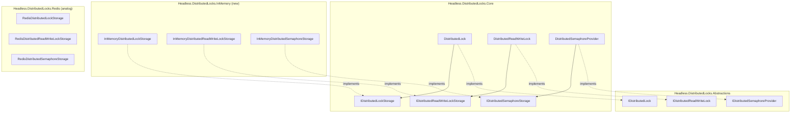
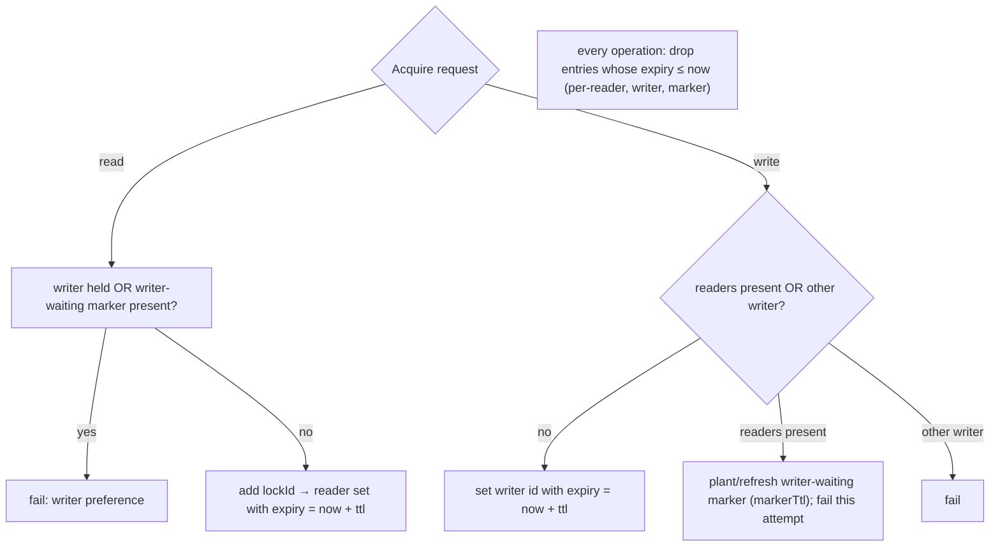

# feat: DistributedLocks InMemory provider + Caching.Memory rename

---

## Summary

Ship `Headless.DistributedLocks.InMemory`: an **in-process** backend for the distributed-lock abstraction covering all three primitives — mutex, reader-writer, and semaphore — plus the standard three-overload DI setup. Coordination scope is **single-process only**; it is not a distributed lock and must never be presented as one.

The implementations already exist as `TimeProvider`-driven test fakes in `Headless.DistributedLocks.Tests.Unit` (`FakeDistributedLockStorage`, `FakeDistributedSemaphoreStorage`, `FakeReaderWriterLockStorage`). The mutex and semaphore fakes already satisfy the current contract (fencing via per-resource monotonic counters, TTL via injected clock). This work promotes and hardens them into a shipped package, adds the one missing piece (TTL semantics in the reader-writer storage), wires `Setup`, and consolidates the ad-hoc per-test fakes onto the shipped types. The provider serves two real consumers: the canonical test double for code written against the abstraction without Testcontainers, and a no-infra default for local dev and genuinely single-instance apps.

This plan also renames `Headless.Caching.Memory` → `Headless.Caching.InMemory` so the framework's in-process package naming is consistent (`Headless.Messaging.InMemory`, the new `Headless.DistributedLocks.InMemory`, and the InMemory cache all align on the `.InMemory` suffix). The rename is **project-identity only** — the namespace is already `Headless.Caching` and the types are already `InMemoryCache` / `SetupInMemoryCache` / `AddInMemoryCache`, so there is zero namespace, type, or public-method churn.

---

## Problem Frame

Code written against `IDistributedLock`, `IDistributedReadWriteLock`, and `IDistributedSemaphoreProvider` currently has no shipped in-process backend. Two needs go unmet:

1. **Test double.** Every unit test that exercises lock-consuming code must either spin up Testcontainers/Redis or hand-roll a private `IDistributedLockStorage` fake. The repo already grew three such fakes; the docs reference them. They should be a shipped, conformance-validated package instead of copy-paste test scaffolding.
2. **No-infra default.** Local development and genuinely single-instance apps want the abstraction without standing up Redis. `Headless.Messaging.InMemory` and `Headless.Caching` (InMemory cache) already establish this "in-process backend ships as a real package" pattern.

Per issue #366 and the #287 capability matrix, the InMemory backend is the one place where mutex + reader-writer + semaphore are all trivially correct in-process (`SemaphoreSlim`/`ConcurrentDictionary`/`Interlocked` over an injected `TimeProvider`), making it the cleanest complete conformance target for the shared suites. The single hazard is mislabeling: the package and docs must make it impossible to mistake an in-process coordinator for a cross-instance lock.

Separately, `Headless.Caching.Memory` is the lone `*.Memory`-suffixed package in a framework that otherwise standardized on `.InMemory`. Folding its rename into this PR removes the inconsistency while the in-process naming convention is already the topic of work.

---

## Key Technical Decisions

### KTD1. Implement the storage seam, not the provider interface.

The issue text says `InMemoryDistributedLock : IDistributedLock`, but the framework's actual pattern is **provider (Core) → storage (per-backend)**. `DistributedLock` / `DistributedReadWriteLock` / `DistributedSemaphoreProvider` live in `Headless.DistributedLocks.Core` and delegate to `IDistributedLockStorage` / `IDistributedReadWriteLockStorage` / `IDistributedSemaphoreStorage`. Redis implements only the storage interfaces. InMemory does the same: three storage classes, zero provider re-implementation. This keeps lease-monitoring, auto-extend, messaging wake-ups, and observability uniform across backends for free.

### KTD2. Promote the existing fakes; don't write from scratch.

`FakeDistributedLockStorage` and `FakeDistributedSemaphoreStorage` already implement the current contract correctly against an injected `TimeProvider` (fencing via `_fencingTokens.AddOrUpdate(key, 1, +1)`, TTL via `GetUtcNow()` + prune-on-access). The shipped storages are these classes promoted to `public sealed`, with test-only mutators (`Clear`, `SetLock`, `SetRead`, `WriteReleaseCount`) removed and `TimeProvider` taken as a required constructor dependency (resolved from DI — Core already registers `TimeProvider.System`). This is hardening, not greenfield invention.

### KTD3. Reader-writer storage gains real TTL semantics.

`FakeReaderWriterLockStorage` ignores its `ttl` / `markerTtl` parameters entirely (simple `lock(state)` over a reader set + writer id). The contract requires read leases to carry finite TTL, the writer-waiting marker to expire on `markerTtl`, and implementations to never shorten an existing TTL. The shipped RW storage must add per-reader expiry, writer + writer-waiting-marker expiry, writer-preference, and prune-on-access — mirroring the Redis RW algorithm semantically (same observable behavior, no Lua). This is the one genuinely net-new implementation in the PR and carries the heaviest test scenarios.

### KTD4. Package name `Headless.DistributedLocks.InMemory`, shipped non-`Dev`.

Parallels `Headless.Caching` (InMemory cache) and `Headless.Messaging.InMemory`. Shipped as a normal package (not a `*.Dev` no-op) so single-instance apps can adopt it in production knowingly. `Testing` was the alternative; rejected because the package is genuinely useful beyond tests and `InMemory` matches the established convention.

### KTD5. Consolidate state-fakes onto the shipped types; keep behavior-spies as substitutes.

The issue's primary purpose is replacing the ad-hoc fakes. After shipping, `Tests.Unit` references `Headless.DistributedLocks.InMemory` and deletes the private fakes **for state-based tests** (tests that seed/inspect lock state). Tests that assert *interaction* (e.g., "release was called N times" via `WriteReleaseCount`) switch to `NSubstitute` on the storage interface — a clean in-process storage should not expose spy counters as public API. This keeps the shipped surface honest and follows the repo rule "test through public APIs."

### KTD6. Caching rename is project-identity only; greenfield means no compatibility shim.

The folder, `.csproj`, assembly name, and NuGet package id change `Memory` → `InMemory`; nothing else. No `[Obsolete]` type aliases, no transitional meta-package — the framework has no deployed external consumers, so a clean rename is correct.

---

## High-Level Technical Design

### Provider → storage seam (where InMemory plugs in)



InMemory swaps in at the storage interfaces only. The Core providers, lease monitor, auto-extend, and messaging wake-ups are inherited unchanged — identical to how Redis plugs in.

### Reader-writer in-process state model (the net-new logic, KTD3)



Per-entry expiry keyed on `TimeProvider.GetUtcNow()`, pruned on access — the same shape the mutex and semaphore storages already use. Releasing a write clears both the writer id and the writer-waiting marker derived from the same lock id (per the contract's D8 writer-preference rule).

---

## Output Structure

```text
src/Headless.DistributedLocks.InMemory/
  Headless.DistributedLocks.InMemory.csproj
  InMemoryDistributedLockStorage.cs
  InMemoryDistributedReadWriteLockStorage.cs
  InMemoryDistributedSemaphoreStorage.cs
  Setup.cs
  README.md
tests/Headless.DistributedLocks.InMemory.Tests.Integration/
  Headless.DistributedLocks.InMemory.Tests.Integration.csproj
  InMemoryDistributedLockTests.cs        # consumes DistributedLockTestsBase
  InMemoryReaderWriterLockProviderTests.cs       # mirrors RedisReaderWriterLockProviderTests
  InMemoryDistributedSemaphoreTests.cs           # mirrors Redis semaphore tests
  InMemoryStorageDeterministicTests.cs           # TTL expiry + fencing under FakeTimeProvider
```

Per-unit `**Files:**` remain authoritative; the implementer may adjust file splits if behavior reveals a cleaner layout.

---

## Requirements

### InMemory provider (issue #366)

- R1. New package `Headless.DistributedLocks.InMemory` exposes `InMemoryDistributedLockStorage`, `InMemoryDistributedReadWriteLockStorage`, `InMemoryDistributedSemaphoreStorage` and an async-only setup extension with the three-overload pattern, attached to `headless-framework.slnx`.
- R2. Storages are keyed per resource over `ConcurrentDictionary`, backed by in-process primitives, honoring `DistributedLockAcquireOptions` (timeout, `ReleaseOnDispose`) where the storage layer is responsible, and clamping/honoring TTL through an injected `TimeProvider`.
- R3. Fencing tokens are strictly increasing per resource via a monotonic in-process counter (mutex and semaphore storages).
- R4. The provider drives the existing regular-lock conformance suite (`DistributedLockTestsBase`) green, the same suite the Redis provider passes.
- R5. Reader-writer and semaphore behavior match the contract (RW: concurrent readers, exclusive writer, writer-preference, TTL expiry; semaphore: N-holder cap, fencing, TTL expiry), validated by tests mirroring the Redis provider's suites.
- R6. Docs prominently scope the package as in-process / dev-test + single-instance and **never** distributed: new package README, a provider section + capability-matrix row in `docs/llms/distributed-locks.md`, and a root README row.
- R7. The ad-hoc per-test `IDistributedLockStorage` / semaphore / RW fakes are replaced across **both** `Headless.DistributedLocks.Tests.Unit` (three fakes) and `Headless.Messaging.Core.Tests.Unit` (a fourth, duplicate `InMemoryDistributedLockStorage`): state-based tests consume the shipped storages; interaction-based tests use `NSubstitute`.
- R8. Coverage targets per `CLAUDE.md` are met for the new package.

### Caching package rename

- R9. `Headless.Caching.Memory` (and `Headless.Caching.Memory.Tests.Unit`) are renamed to `Headless.Caching.InMemory` (`.InMemory.Tests.Unit`) — folders, `.csproj`, assembly/package id — with all `ProjectReference`s, `headless-framework.slnx` entries, and documentation references updated. No namespace, type, or public-method changes.

---

## Testing Strategy

Conformance-first, mirroring the Redis provider's structure:

- **Shared conformance (regular locks).** A concrete test class consumes `DistributedLockTestsBase` from `Headless.DistributedLocks.Tests.Harness`, exactly as the Redis integration project does (override the `virtual` base methods, attribute with `[Fact]`). This proves the abstraction holds for InMemory against the identical suite Redis passes.
- **Hand-rolled RW + semaphore suites.** There is no shared reader-writer or semaphore conformance base today (Redis hand-rolls both). InMemory mirrors `RedisReaderWriterLockProviderTests` and the Redis semaphore tests **scenario-for-scenario, with high fidelity**, and adds a brief comment block per suite recording the contract interpretation each scenario encodes (writer-preference, never-shorten-TTL, cancellation, expired-lease handling). This makes the eventual shared-harness extraction a mechanical hoist rather than a re-derivation, and mitigates the divergent-interpretation risk (A1) of deferring extraction. Extracting shared RW/semaphore harness bases is **deferred** (see Scope Boundaries) and coordinated with the sibling Postgres plan, which also touches the harness.
- **Deterministic in-process tests under `FakeTimeProvider`.** TTL expiry (lock, reader lease, writer-waiting marker, semaphore holder), fencing-token monotonicity, and writer-preference are tested deterministically by advancing a `FakeTimeProvider` — no wall-clock waits, no flakes. This is the InMemory backend's unique advantage as a conformance target.
- **No Docker.** The `.Tests.Integration` name signals "exercises full provider+storage wiring via the shared conformance suite," consistent with the harness pattern; the project needs no Testcontainers.

---

## Implementation Units

Two streams: U1–U8 ship the InMemory provider; U9 renames the caching package. The streams are independent and may land in either order within the PR.

### U1. Package scaffold + slnx wiring + orphan cleanup

- **Goal:** Create the empty shippable package and attach it to the solution.
- **Requirements:** R1
- **Dependencies:** none
- **Files:**
  - `src/Headless.DistributedLocks.InMemory/Headless.DistributedLocks.InMemory.csproj` (create)
  - `headless-framework.slnx` (modify — add to `/DistributedLocks/` folder)
  - delete orphaned untracked build dirs: `tests/Headless.DistributedLocks.InMemory.Tests.Integration/obj`, `src/Headless.DistributedLocks.Cache/obj` (leftover `obj/` with no tracked sources; verify with `git ls-files` before removing)
- **Approach:** `<Project Sdk="Headless.NET.Sdk">` per `global.json`; `ProjectReference` to `Headless.DistributedLocks.Core`; package metadata description must state in-process / not-distributed. No `Directory.Packages.props` entry needed (no new external `PackageVersion`).
- **Patterns to follow:** `src/Headless.DistributedLocks.Redis/Headless.DistributedLocks.Redis.csproj` for csproj shape and metadata fields.
- **Test scenarios:** `Test expectation: none -- scaffolding only; behavior is covered by U2–U6.`
- **Verification:** `make build-project PROJECT=src/Headless.DistributedLocks.InMemory/Headless.DistributedLocks.InMemory.csproj` compiles; project appears in the solution.

### U2. `InMemoryDistributedLockStorage`

- **Goal:** Ship the mutex storage.
- **Requirements:** R2, R3
- **Dependencies:** U1
- **Files:**
  - `src/Headless.DistributedLocks.InMemory/InMemoryDistributedLockStorage.cs` (create)
- **Approach:** Promote `FakeDistributedLockStorage` to `public sealed`. Constructor takes a required `TimeProvider` (DI-resolved). Keep the `ConcurrentDictionary<string, LockEntry>` + per-key `_fencingTokens` monotonic counter; `InsertAsync` returns `DistributedLockAcquireResult` (fencing increments only on successful add). Remove test-only mutators (`Clear`, `SetLock`, `RemoveLock`). Keep prune-on-access TTL via `GetUtcNow()`. `StringComparer.Ordinal` for keys.
- **Patterns to follow:** current `FakeDistributedLockStorage` (algorithm); `RedisDistributedLockStorage` (`Argument.*` guards, `ThrowIfCancellationRequested`, `ValueTask` shape).
- **Test scenarios:** (covered in U6's deterministic suite, but enumerated here for the implementer)
  - Insert on free key → `Acquired = true`, `FencingToken = 1`; second insert on held key → `Failed`.
  - Fencing strictly increases across release→re-acquire cycles on the same key.
  - `ReplaceIfEqualAsync` succeeds only when `expectedId` matches the live entry; fails on mismatch or expired entry; never extends a foreign lock.
  - `RemoveIfEqualAsync` removes only on id match; idempotent on missing/expired/foreign.
  - TTL: entry past expiry is absent to `GetAsync`/`ExistsAsync`; `GetExpirationAsync` returns remaining or `Zero`, `null` when no TTL.
  - Prefix queries (`GetAllByPrefixAsync`, `GetAllWithExpirationByPrefixAsync`, `GetCountAsync`) exclude expired entries.
- **Verification:** U6 suite green; no public mutator surface remains.

### U3. `InMemoryDistributedSemaphoreStorage`

- **Goal:** Ship the semaphore storage.
- **Requirements:** R2, R3, R5
- **Dependencies:** U1
- **Files:**
  - `src/Headless.DistributedLocks.InMemory/InMemoryDistributedSemaphoreStorage.cs` (create)
- **Approach:** Promote `FakeDistributedSemaphoreStorage` to `public sealed`; required `TimeProvider`. Keep per-resource holder map + per-resource fencing counter + prune-on-access TTL. `TryAcquireAsync` returns `Failed` when live holder count ≥ `maxCount`; fencing increments only on grant.
- **Patterns to follow:** current `FakeDistributedSemaphoreStorage`; `RedisDistributedSemaphoreStorage` for guard/cancellation shape.
- **Test scenarios:** (in U6)
  - Up to `maxCount` concurrent holders granted; the (maxCount+1)th fails until a holder releases or expires.
  - Fencing strictly increases per resource across grants.
  - `TryExtendAsync` refreshes TTL only for a live holder; `ValidateAsync` true only while held; `ReleaseAsync` idempotent.
  - Expired holder frees a slot without explicit release; `GetCountAsync` excludes expired holders.
- **Verification:** U6 suite green.

### U4. `InMemoryDistributedReadWriteLockStorage` (net-new TTL logic)

- **Goal:** Ship the RW storage with full contract-correct TTL semantics.
- **Requirements:** R2, R5
- **Dependencies:** U1
- **Files:**
  - `src/Headless.DistributedLocks.InMemory/InMemoryDistributedReadWriteLockStorage.cs` (create)
- **Approach:** Start from `FakeReaderWriterLockStorage`'s writer-preference structure but **add per-entry expiry** (KTD3): reader set entries carry `expiry = now + ttl`; writer id and writer-waiting marker carry their own expiry (`markerTtl` for the marker). Prune expired entries on every operation before deciding. `TryAcquireReadAsync` fails when a live writer or live writer-waiting marker is present. `TryAcquireWriteAsync` grants when no live readers/writer, else plants/refreshes the writer-waiting marker and fails. `ReleaseWriteAsync` clears both writer id and the marker derived from the same lock id (use `DistributedLockCoreHelpers.GetWriterWaitingId` / `WriterWaitingSuffix`).
  - **Extend guards (E1, E2 — explicit):** `TryExtendReadAsync` / `TryExtendWriteAsync` must (a) **prune first**, so a lease that has already expired returns `false` (lost lease is not extendable) even if its entry lingers; and (b) **never shorten TTL** — compute `newExpiry = now + ttl` and update only when `newExpiry > existingExpiry`, otherwise leave the existing expiry and still return `true`.
  - **Inspection pruning (W1):** `IsReadLocked`, `IsWriteLocked`, `GetReaderCount` **also prune-on-access** before returning, consistent with the mutex/semaphore storages (U2/U3). The contract documents these as advisory and *permits* (does not require) staleness — but in-process pruning is free, makes the diagnostic accurate, and avoids deterministic-test flakiness where a count is asserted after expiry without an intervening write-acquire. This is a deliberate, contract-compatible tightening of the documented Redis behavior, not a contract violation.
- **Patterns to follow:** `RedisDistributedReadWriteLockStorage` for the *semantics* the Lua scripts encode (the in-process version reproduces behavior without Lua); `DistributedLockCoreHelpers` for marker-id derivation; the mutex/semaphore storages for the prune-on-access TTL idiom.
- **Test scenarios:** (in U6, RW suite)
  - **Happy path:** multiple concurrent readers granted; writer exclusive; reader after writer release granted.
  - **Writer preference:** a queued writer (marker planted) blocks new readers until it acquires or releases.
  - **Edge/TTL:** reader lease expires and frees the resource without explicit release; writer-waiting marker expires on `markerTtl` and unblocks readers; releasing a never-acquired or foreign lease is idempotent.
  - **Extend guards (E1/E2):** extending with a shorter TTL than the remaining lease does **not** shorten it (returns `true`, expiry unchanged); extending an already-expired reader/writer lease returns `false`.
  - **Inspection pruning (W1):** `GetReaderCountAsync` / `IsReadLockedAsync` return `0` / `false` after all reader leases expire, with no intervening write-acquire (asserted deterministically under `FakeTimeProvider`).
  - **Error paths:** acquire under cancellation throws; release after expiry does not throw.
- **Verification:** U6 RW suite green, including the deterministic TTL cases under `FakeTimeProvider`.

### U5. `Setup.cs` — DI registration

- **Goal:** Provide `AddInMemoryDistributedLock` / `AddInMemoryDistributedReadWriteLock` / `AddInMemoryDistributedSemaphore`, three overloads each.
- **Requirements:** R1
- **Dependencies:** U2, U3, U4
- **Files:**
  - `src/Headless.DistributedLocks.InMemory/Setup.cs` (create)
- **Approach:** `public static class SetupInMemoryDistributedLock` using C# 14 `extension(IServiceCollection services)`. Each method family delegates to Core's generic registrar (`AddDistributedLock<InMemoryDistributedLockStorage>`, `AddDistributedReadWriteLock<InMemoryDistributedReadWriteLockStorage>`, `AddDistributedSemaphore<InMemoryDistributedSemaphoreStorage>`), exactly mirroring `SetupRedisDistributedLock`. Three overloads per family: `IConfiguration`, `Action<DistributedLockOptions>`, `Action<DistributedLockOptions, IServiceProvider>`. Shared private helper named `_AddInMemoryDistributedLockCore` per the `_Add{Feature}Core` convention (InMemory needs no extra services like Redis's scripts loader, so the helper may be a thin pass-through — still present for shape consistency). `[PublicAPI]` on the class.
- **Patterns to follow:** `src/Headless.DistributedLocks.Redis/Setup.cs` (current, all three families); `src/Headless.Caching.InMemory/Setup.cs` for the extension-member idiom.
- **Test scenarios:**
  - Each `Add*` overload registers a resolvable provider of the corresponding interface; repeated calls are idempotent (`TryAdd*` semantics inherited from Core).
  - Options bound from `IConfiguration` and from `Action<>` reach the storage.
- **Verification:** A setup test resolves all three providers from a built `ServiceProvider`; U6 conformance (which registers via these methods) is green.

### U6. Integration / conformance test project

- **Goal:** Prove the provider against the shared suite plus InMemory-specific deterministic coverage.
- **Requirements:** R4, R5, R8
- **Dependencies:** U5
- **Files:**
  - `tests/Headless.DistributedLocks.InMemory.Tests.Integration/Headless.DistributedLocks.InMemory.Tests.Integration.csproj` (create; `Headless.NET.Sdk.Test`; refs InMemory package + `Tests.Harness`)
  - `tests/Headless.DistributedLocks.InMemory.Tests.Integration/InMemoryDistributedLockTests.cs` (create — consumes `DistributedLockTestsBase`)
  - `tests/Headless.DistributedLocks.InMemory.Tests.Integration/InMemoryReaderWriterLockProviderTests.cs` (create)
  - `tests/Headless.DistributedLocks.InMemory.Tests.Integration/InMemoryDistributedSemaphoreTests.cs` (create)
  - `tests/Headless.DistributedLocks.InMemory.Tests.Integration/InMemoryStorageDeterministicTests.cs` (create)
  - `headless-framework.slnx` (modify — add test project)
- **Approach:** Mirror `Headless.DistributedLocks.Redis.Tests.Integration` for the harness-consumption mechanics (`GetLockProvider()` override returning a provider built via U5's `AddInMemoryDistributedLock`, `[Fact]` overrides of the base's `virtual` methods). RW and semaphore tests mirror the Redis equivalents. Deterministic tests inject `FakeTimeProvider` into a hand-built provider to assert TTL/fencing/writer-preference without wall-clock waits. Use `TestBase.AbortToken` for cancellation; `Bogus` for resource names.
- **Test suite design:** Integration project (full provider+storage wiring), no external infra. Regular-lock coverage comes from the shared harness base; RW + semaphore from hand-rolled suites; TTL/fencing edge cases from the deterministic suite. No new harness infrastructure created here (deferred).
- **Test scenarios:** the union of U2/U3/U4 enumerated scenarios, organized into the four files above; plus the full `DistributedLockTestsBase` set inherited verbatim.
- **Verification:** `make test-project TEST_PROJECT=tests/Headless.DistributedLocks.InMemory.Tests.Integration` green; coverage meets `CLAUDE.md` targets for the new package.

### U7. Consolidate the ad-hoc fakes

- **Goal:** Replace the private per-test fakes with the shipped storages (state) and substitutes (interaction).
- **Requirements:** R7
- **Dependencies:** U2, U3, U4
- **Files:**
  - `tests/Headless.DistributedLocks.Tests.Unit/Headless.DistributedLocks.Tests.Unit.csproj` (modify — add `ProjectReference` to the InMemory package)
  - `tests/Headless.DistributedLocks.Tests.Unit/Fakes/FakeDistributedLockStorage.cs` (delete)
  - `tests/Headless.DistributedLocks.Tests.Unit/Fakes/FakeDistributedSemaphoreStorage.cs` (delete)
  - `tests/Headless.DistributedLocks.Tests.Unit/Fakes/FakeReaderWriterLockStorage.cs` (delete)
  - call sites under `tests/Headless.DistributedLocks.Tests.Unit/RegularLocks/` and `tests/Headless.DistributedLocks.Tests.Unit/ReaderWriterLocks/` (modify)
  - **Third duplicate, messaging domain:** `tests/Headless.Messaging.Core.Tests.Unit/Headless.Messaging.Core.Tests.Unit.csproj` (modify — add `ProjectReference` to the InMemory package), `tests/Headless.Messaging.Core.Tests.Unit/RetryProcessorDistributedLockTests.cs` (modify — use the shipped `InMemoryDistributedLockStorage`), `tests/Headless.Messaging.Core.Tests.Unit/Fakes/InMemoryDistributedLockStorage.cs` (delete)
- **Approach:** For tests that seed/inspect state, construct the shipped storage with a `FakeTimeProvider` and drive it through the contract (`InsertAsync` with a foreign id + tiny TTL to simulate held/expired state, replacing former `SetLock`/`SetRead` mutators). For tests asserting interaction counts (e.g., `WriteReleaseCount`), replace with an `NSubstitute` mock of the storage interface and `Received()` assertions. The messaging `RetryProcessorDistributedLockTests` fake (`InMemoryDistributedLockStorage(TimeProvider)`) is already a state-based in-memory storage and maps directly onto the shipped type — swap the `using`/construction and delete the private copy. Delete all three private fakes (DistributedLocks domain) plus the messaging copy once no references remain.
- **Patterns to follow:** existing `NSubstitute` usage in the repo; `FakeTimeProvider` usage elsewhere in the suite.
- **Test scenarios:** `Test expectation: none -- migration of existing tests; success criterion is that the existing assertions in both Tests.Unit projects still pass against the new doubles with no loss of coverage.`
- **Verification:** `make test-project` green for both `tests/Headless.DistributedLocks.Tests.Unit` and `tests/Headless.Messaging.Core.Tests.Unit`; `git grep -lE "Fake(DistributedLock|DistributedSemaphore|ReaderWriterLock)Storage|Fakes/InMemoryDistributedLockStorage"` returns nothing under either project; no test was weakened (same assertions, new double).

### U8. Documentation

- **Goal:** Ship the agent-facing + human-facing docs, loudly scoping the package as in-process / not-distributed.
- **Requirements:** R6
- **Dependencies:** U5 (final public API shape)
- **Files:**
  - `src/Headless.DistributedLocks.InMemory/README.md` (create)
  - `docs/llms/distributed-locks.md` (modify — frontmatter `packages:` list, TOC, a `Headless.DistributedLocks.InMemory` provider section, a capability-matrix row, and a "Choosing a Provider" entry; correct the existing "in-process scenarios use test-only fakes" line to point at the shipped package)
  - `README.md` (modify — add a `Headless.DistributedLocks.InMemory` row near the other DistributedLocks rows ~line 290-292)
- **Approach:** Follow `docs/authoring/AUTHORING.md` (README ↔ llms lockstep). Lead every surface with the in-process / single-instance / **not distributed** scoping. Document that `HandleLostToken` is `CancellationToken.None` (in-process: if the app dies, everything dies) and that fencing is perfectly correct here (monotonic in-process counter, no eviction).
- **Test scenarios:** `Test expectation: none -- documentation.`
- **Verification:** Both surfaces consistent per the AUTHORING drift checks; capability matrix shows InMemory across mutex/RW/semaphore with the in-process scope called out.

### U9. Rename `Headless.Caching.Memory` → `Headless.Caching.InMemory`

- **Goal:** Standardize the in-process cache package name; project-identity only.
- **Requirements:** R9
- **Dependencies:** none (independent of U1–U8)
- **Files:**
  - rename `src/Headless.Caching.Memory/` → `src/Headless.Caching.InMemory/` (folder + `Headless.Caching.Memory.csproj` → `Headless.Caching.InMemory.csproj`)
  - rename `tests/Headless.Caching.Memory.Tests.Unit/` → `tests/Headless.Caching.InMemory.Tests.Unit/` (folder + `.csproj`)
  - `headless-framework.slnx` (modify — 2 `<Project Path>` entries, lines ~68 and ~72)
  - 6 consumer `ProjectReference`s (modify): `demo/Headless.EntityFramework.Migrations.Startup`, `tests/Headless.Api.Idempotency.Tests.Integration`, `tests/Headless.Caching.Abstractions.Tests.Unit`, `tests/Headless.Caching.Hybrid.Tests.Unit`, the renamed test project's self-reference, `tests/Headless.Messaging.Storage.PostgreSql.Tests.Integration`
  - docs (modify): `README.md` (line ~128), `docs/llms/caching.md` (5 refs incl. install line, heading, anchor), `docs/llms/index.md` (line ~164), `docs/llms/testing.md` (line ~331), `docs/todos/007-pending-p2-bound-inmemorycache-queue-growth-under-write-heavy-load.md` (file-path ref), `src/Headless.Caching.Hybrid/README.md` (line ~13)
- **Approach:** Pure identity rename — use `git mv` for folders/files to preserve history. **Do not** touch namespaces (`Headless.Caching`), types (`InMemoryCache`, `InMemoryCacheOptions`, `MaxEntrySizeExceededException`), or methods (`SetupInMemoryCache`, `AddInMemoryCache`) — they are already correctly named. Distinguish real `Headless.Caching.Memory` references from `Microsoft.Extensions.Caching.Memory` / `IMemoryCache` (the `Directory.Packages.props` line 88 hit is the MS package — leave it). Greenfield: no `[Obsolete]` shim.
- **Patterns to follow:** existing `.InMemory` package naming (`Headless.Messaging.InMemory`).
- **Test scenarios:** `Test expectation: none -- rename only; the existing Headless.Caching.InMemory.Tests.Unit suite must pass unchanged after the rename.`
- **Verification:** `make build` clean (no dangling references); `make test-project TEST_PROJECT=tests/Headless.Caching.InMemory.Tests.Unit` green; `git grep "Caching\.Memory"` returns only intentional rename-history text and the legitimate `Microsoft.Extensions.Caching.Memory` matches.

---

## Scope Boundaries

### Outside this product's identity

- **Any cross-process / cross-node behavior.** Explicitly none. The package coordinates within a single process only and must never be presented as distributed (#366, #287).
- **`HandleLostToken` monitoring semantics beyond `CancellationToken.None`.** In-process: if the host dies, all holders die with it; there is no lease to lose across a partition.

### Deferred to Follow-Up Work

- **Shared reader-writer and semaphore conformance harness bases.** Today only regular locks have a shared base (`DistributedLockTestsBase`); RW and semaphore are hand-rolled per provider. InMemory is the cleanest driver for extracting shared RW/semaphore bases (all primitives trivially correct), and the CLAUDE.md "2nd provider" trigger now applies — but extraction is a dedicated batch coordinated with the sibling Postgres plan (`2026-06-02-002`), which also reworks the harness. Hand-rolled RW/semaphore suites are sufficient for this PR.
- **`Headless.DistributedLocks.Cache` package.** A stray untracked `obj/` exists for it; that directory is cleaned in U1, but no Cache-backed provider is in scope here.

---

## Risks & Dependencies

| Risk / Dependency | Impact | Mitigation |
| --- | --- | --- |
| RW TTL logic is the only net-new algorithm and the contract is subtle (writer-preference + marker expiry, never-shorten-TTL). | A correctness bug here is the most likely defect. | Heaviest test scenarios (U4/U6) run deterministically under `FakeTimeProvider`; semantics mirror the proven Redis RW algorithm. |
| Fake consolidation (U7) could silently weaken existing assertions when swapping mutators for contract-driven seeding or `NSubstitute`. | Lost coverage masquerading as green. | U7 verification requires the *same assertions* against the new doubles; treat any test that can no longer express its intent as a signal to keep a minimal local double, not to drop the assertion. |
| Harness consumption mechanics for the regular-lock base are not yet confirmed in detail (how Redis attributes the `virtual` base methods). | U6 could stall on test-discovery wiring. | Mirror `Headless.DistributedLocks.Redis.Tests.Integration` exactly; this is a solved pattern in-repo. |
| Sibling provider plans (Postgres #293, SQL Server #294, FileSystem #365) touch the same storage contracts and harness concurrently. | Merge friction on `headless-framework.slnx` and `docs/llms/distributed-locks.md`. | Keep U8/U9 doc edits surgical; the slnx additions are independent folder entries; coordinate harness extraction as the deferred follow-up. |
| Renaming a package id mid-stream while sibling lock plans are open could collide on `slnx`. | Low — different files/folders. | U9 is independent; land it cleanly with `git mv`. |

**Dependency:** Core's generic registrars (`AddDistributedLock<TStorage>`, `AddDistributedReadWriteLock<TStorage>`, `AddDistributedSemaphore<TStorage>`) already exist and register `TimeProvider.System` — no Core changes required.

---

## Sources & Research

- Issue #366 (InMemory provider), #287 (coordination-scope capability matrix), #368 (fencing tokens + Redis semaphores — established the current three-primitive contract).
- Current contracts: `IDistributedLockStorage`, `IDistributedReadWriteLockStorage`, `IDistributedSemaphoreStorage`, `DistributedLockAcquireResult` in `src/Headless.DistributedLocks.Core`.
- De-facto in-process implementations being promoted: `FakeDistributedLockStorage`, `FakeDistributedSemaphoreStorage`, `FakeReaderWriterLockStorage` in `tests/Headless.DistributedLocks.Tests.Unit/Fakes/`.
- Analog provider: `src/Headless.DistributedLocks.Redis/` (storages + `Setup.cs`); conformance base `tests/Headless.DistributedLocks.Tests.Harness/DistributedLockTestsBase.cs`.
- Package precedent for the rename: `src/Headless.Caching.Memory/` (already InMemory-named internally) and `src/Headless.Messaging.InMemory/`.
- Sibling plan for structural alignment: `docs/plans/2026-06-02-002-feat-postgres-distributed-lock-provider-plan.md`; RW contract rationale in `docs/plans/2026-05-24-001-feat-distributed-locks-phase-3a-reader-writer-plan.md`.
- No external research: pure in-process .NET concurrency over established local patterns; madelson ships no pure in-process backend (per #366), so nothing to port.
