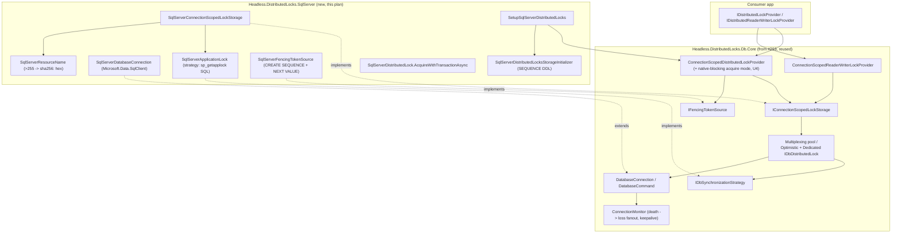

# feat: SQL Server distributed-lock provider (sp_getapplock)

## Summary

Add `Headless.DistributedLocks.SqlServer` — the framework's second **cross-node DB-engine** lock backend — built on the shared `Headless.DistributedLocks.Db.Core` package introduced by the Postgres provider (#293). SQL Server locks are **connection-scoped** native primitives (`sp_getapplock` / `sp_releaseapplock`): no TTL, no server-stored lock value, and — uniquely among the in-scope backends — the engine **blocks server-side** (`@LockTimeout`), so a contended acquire parks inside SQL Server and is woken natively on release. There is no poll loop and no push channel to build ("wake-up = engine, push N/A"). This plan adds the SQL-Server-specific strategy, connection wrapper, native-blocking acquire path, transaction-coupled static API, durable `SEQUENCE`-backed fencing, and Testcontainers integration tests, reusing the `Db.Core` connection lifecycle, `ConnectionMonitor`, optimistic multiplexing, and fencing plumbing wholesale.

**Depends on #293 landing `Headless.DistributedLocks.Db.Core` first** (your scoping decision). This plan treats that package as a prerequisite and specifies the exact seam it consumes, including one coordinated addition the SQL Server backend requires (native server-side blocking — see U4).

---

## Problem Frame

The distributed-locks roadmap (#287) commits the framework to three cross-node backends — Redis (shipped), Postgres (#293), SQL Server (this issue, #294) — differentiating from `madelson/DistributedLock` on operability: observability, DoS guardrails, DI-native registration, and proper fencing. The roadmap labels SQL Server **the richest backend in scope**: `sp_getapplock` natively supports mutex, reader-writer (Shared/Exclusive), upgradeable RW (Update mode), and — via a slot table — semaphore; it blocks server-side; and `ConnectionMonitor` gives correctness-grade `HandleLostToken`.

Two backend properties shape the design and distinguish it from the Postgres sibling:

- **Native server-side blocking** (`sp_getapplock @LockTimeout`). A contended acquire blocks *inside SQL Server* and returns the instant the lock frees. Cancellation is delivered as a TDS attention signal (`SqlCommand.Cancel()`), which SQL Server turns into return code `-2`. This is simpler and lower-latency than Postgres's try-loop + `LISTEN`/`NOTIFY` — there is no waiter loop and no notification channel — but it requires the shared engine to support a "the storage blocks; do not run the provider wait loop" acquire mode (U4).
- **Connection-scoped locking** gives **correctness-grade** lost-handle detection: when the holding connection dies, SQL Server releases the lock server-side and `ConnectionMonitor` (from `Db.Core`) fires `HandleLostToken`.

The existing `DistributedLockProvider` ([src/Headless.DistributedLocks.Core/RegularLocks/DistributedLockProvider.cs](../../src/Headless.DistributedLocks.Core/RegularLocks/DistributedLockProvider.cs)) is hard-wired to TTL storage + `LeaseMonitor`; none of that maps to `sp_getapplock`. The Postgres plan (#293) already solved the connection-scoped reconciliation in `Db.Core` (`ConnectionScopedDistributedLockProvider`, no-op renew, null TTL, `ConnectionMonitor`-driven `HandleLostToken`). This plan reuses that reconciliation unchanged and adds only what is SQL-Server-specific.

---

## Prerequisites — Shared `Db.Core` Seam (delivered by #293)

This plan assumes #293 has landed `Headless.DistributedLocks.Db.Core` with the contract below. These are **not** built here; they are the seam this plan plugs into. If #293's final shape diverges, reconcile the affected units (flagged per-unit). Sourced from the #293 plan ([docs/plans/2026-06-02-002-feat-postgres-distributed-lock-provider-plan.md](2026-06-02-002-feat-postgres-distributed-lock-provider-plan.md)).

| Seam type | Role this plan relies on |
| --- | --- |
| `DatabaseConnection` / `DatabaseCommand` (`Internal/`) | Abstract ADO.NET connection/command wrapper; SQL Server subclasses `DatabaseConnection` (U1). |
| `ConnectionMonitor` + `IDatabaseConnectionMonitoringHandle` | Connection-death detection + keepalive; drives `HandleLostToken`. Consumed as-is. |
| `IDbSynchronizationStrategy` | The SQL-emitting strategy seam; `SqlServerApplicationLock` implements it (U2). |
| `IDbDistributedLock` + `OptimisticConnectionMultiplexingDbDistributedLock` / `DedicatedConnectionOrTransactionDbDistributedLock` / `MultiplexedConnectionLockPool` | Multiplexing + dedicated/transaction routing. Consumed as-is. |
| `IConnectionScopedLockStorage` | Storage contract; `SqlServerConnectionScopedLockStorage` implements it (U5). **U4 extends its acquire signature for native blocking.** |
| `ConnectionScopedDistributedLockProvider` / `ConnectionScopedReaderWriterLockProvider` / `ConnectionScopedDistributedLockHandle` | Surface reconciliation (no-op renew, null TTL, guardrails, observability, fence stamping). **U4 adds a native-blocking acquire mode.** |
| `IFencingTokenSource` | Fence seam; `SqlServerFencingTokenSource` implements it (U9). |
| `IReleaseSignal` | Postgres push/poll wake-up. **SQL Server does not use this** — native blocking replaces it. |

---

## Key Technical Decisions

- **Acquire model is native server-side blocking, not a try-loop.** `sp_getapplock @LockTimeout = N` blocks inside SQL Server for up to N ms and returns the instant the lock frees; cancellation is a TDS attention signal yielding return code `-2`. This is the roadmap's stated SQL Server design ("native block; push N/A") and the inverse of Postgres's try+`NOTIFY` model. Consequence: the shared `ConnectionScopedDistributedLockProvider` must support a mode where the storage call blocks and the provider does **not** run its `IReleaseSignal` wait loop (U4). Trade-off: a blocking acquire pins one connection for the duration of the *wait* (unlike Postgres's non-blocking try, which multiplexes waiters) — so blocking acquires fall back to a dedicated connection (already the multiplexing engine's behavior: an acquire that must block never multiplexes).

- **Reuse the `Db.Core` engine wholesale; add only a strategy + connection wrapper + native-block mode.** #293's plan explicitly commits to leaving the engine provider-agnostic so #294 "only adds a strategy + connection wrapper." This plan honors that: no re-implementation of `ConnectionMonitor`, multiplexing, or surface reconciliation. The one engine-level addition (native blocking, U4) is small, provider-agnostic, and benefits any future natively-blocking backend.

- **`sp_getapplock` return-code contract is ported faithfully.** The strategy maps the full code set: `0`/`1`/other-positive → granted; `-1` → timeout (return null / throw `LockAcquisitionTimeoutException`); `-2` → cancellation (`OperationCanceledException`); `-3` → deadlock (`DistributedLockException`-derived); `-999` → parameter error (`ArgumentException`); `103` → already-held-on-this-connection (re-entrancy); `104` → invalid upgrade. `@DbPrincipal='public'` is always passed so the lock namespace is uniform across DB principals. This is correctness-critical and is the heart of U2.

- **Re-entrancy is guarded with `APPLOCK_MODE()`, not left to SQL Server's silent recursion.** `sp_getapplock` is reentrant per session: re-acquiring the same lock on the same connection succeeds and inflates a hidden reference count that requires matching releases. On externally-owned or multiplexed connections the strategy gates acquire with `APPLOCK_MODE(...) = 'NoLock'` and returns code `103` if already held, so the multiplexing engine forces the second acquirer onto a dedicated connection (where SQL Server correctly serializes them). Without this guard, two logical locks could share one multiplexed connection and each believe it holds exclusively.

- **Cancellation issues a guarded post-cancel release to close the attention-signal race.** There is a real window where the attention signal reaches the server *after* the lock was granted but *before* the return code is read. On `OperationCanceledException` the strategy issues a guarded `IF APPLOCK_MODE(...) != 'NoLock' EXEC sp_releaseapplock` before rethrowing, so a lock granted in that window is not leaked.

- **Long resource names hash to `"sha256:" + <hex>` (OQ9).** `@Resource` is `NVARCHAR(255)`. Names ≤ 255 chars pass through unchanged; longer names become `"sha256:" + lowercase-hex(SHA256(utf8(name)))` (71 chars). This follows the issue's prescribed shape rather than madelson's SHA-512-truncate-append scheme — the issue is authoritative and the prefixed-hash form is simpler and collision-safe for the 255-char budget. The 255-char cutoff is documented. The max length is hoisted to a `SqlServerDistributedLockFieldLimits` constants class consumed by both the name encoder and runtime validation (prevents DDL/runtime drift — a documented prior learning).

- **No interface change for fencing — populate the existing `FencingToken` with a durable SQL `SEQUENCE`.** #368 shipped `long? FencingToken` on `IDistributedLock`/`LockInfo`/`DistributedLockHandleBase` and the best-effort Redis fence; #293 adds the durable Postgres sequence and the `IFencingTokenSource` seam. This plan delivers the SQL Server half: a `SqlServerFencingTokenSource` that issues `SELECT NEXT VALUE FOR <seq>` on acquire and stamps the handle. A **single global sequence** (not per-resource) is used — strictly increasing is a superset of per-resource monotonicity, and per-resource DDL would churn `sys.sequences`. Reader-writer locks issue no fence (`null`, existing convention).

- **Only the fencing `SEQUENCE` needs schema; mutex + RW need none.** `sp_getapplock` is a built-in — no tables. The storage initializer exists solely to create the durable fencing `SEQUENCE`, guarded by the proven `sp_getapplock`-Session + outer `TRY/CATCH` + `APPLOCK_MODE`-release DDL pattern (modeled on [SqlServerAuditLogStorageInitializer.cs](../../src/Headless.AuditLog.Storage.SqlServer/SqlServerAuditLogStorageInitializer.cs)), with `IF NOT EXISTS (SELECT 1 FROM sys.sequences ...)` idempotency. When fencing is disabled, no DDL runs.

- **Clean-room port, adapted to Headless conventions.** madelson sources at `/Users/xshaheen/Dev/oss/DistributedLock` (MIT) are the correctness reference. Ports adopt: injected `TimeProvider` for all delays/timers, `Headless.Checks` validation, source-generated `[LoggerMessage]` (partial `Log` at file bottom), `internal sealed` by default, the copyright header, the `Setup{Provider}` + three-overload DI shape, and `Microsoft.Data.SqlClient` only (no `System.Data.SqlClient` legacy path). Drop madelson's `SyncViaAsync` dual API (async-only), its runtime-DDL semaphore (deferred + redesigned), and its finalizer-based release (DI owns lifetime).

---

## High-Level Technical Design

### Component topology



### Native-blocking acquire + cancellation sequence (contended mutex)

```mermaid
sequenceDiagram
  participant Caller
  participant Prov as ConnectionScopedProvider (native-block mode)
  participant Strat as SqlServerApplicationLock
  participant SQL as SQL Server

  Caller->>Prov: AcquireAsync(resource, options)
  Prov->>Strat: TryAcquireAsync(conn, name, acquireTimeout, ct)  [single call, no wait loop]
  Strat->>SQL: EXEC sp_getapplock @Resource, @LockMode, @LockOwner, @LockTimeout=ms, @DbPrincipal='public'
  Note over Strat,SQL: CommandTimeout = infinite when @LockTimeout = -1
  alt granted (return 0/1)
    SQL-->>Strat: >=0
    Strat-->>Prov: handle (HandleLostToken <- ConnectionMonitor; FencingToken <- SEQUENCE)
  else timeout (return -1)
    SQL-->>Strat: -1
    Strat-->>Prov: null  (=> LockAcquisitionTimeoutException / null for Try*)
  else cancelled (ct fires -> attention signal -> return -2)
    Caller--xSQL: SqlCommand.Cancel() (TDS attention)
    SQL-->>Strat: -2
    Strat->>SQL: IF APPLOCK_MODE != 'NoLock' EXEC sp_releaseapplock  (close grant race)
    Strat-->>Prov: throw OperationCanceledException
  end
  Note over Caller,SQL: on release -> EXEC sp_releaseapplock (skipped when transaction-scoped)
```

### `sp_getapplock` return-code → outcome (U2 contract)

| Return code | Meaning | Strategy outcome |
| --- | --- | --- |
| `0` | Granted synchronously | success |
| `1` | Granted after waiting | success |
| `> 1` | Forward-compatible success | success |
| `-1` | Timeout — not granted within `@LockTimeout` | `null` (Try*) / `LockAcquisitionTimeoutException` |
| `-2` | Cancelled (attention signal) | `OperationCanceledException` + guarded release |
| `-3` | Deadlock victim | `DistributedLockDeadlockException` (new, `DistributedLockException`-derived — U2) |
| `-999` | Parameter / unknown error | `ArgumentException` |
| `103` | Already held on this connection (re-entrancy) | force dedicated conn; null on zero-timeout; deadlock-throw on infinite |
| `104` | Invalid upgrade (Update lock not held) | `InvalidOperationException` (upgradeable RW is deferred) |

### SQL Server vs Postgres acquire model (why U4 exists)

| Aspect | Postgres (#293) | SQL Server (#294) |
| --- | --- | --- |
| Contended wait | non-blocking `pg_try_advisory_lock` in provider loop | blocking `sp_getapplock @LockTimeout` inside SQL Server |
| Wake-up | `LISTEN`/`NOTIFY` push + polling fallback (`IReleaseSignal`) | engine wakes the blocked call natively — no signal |
| Connection while waiting | freed between tries (waiters multiplex) | pinned for the wait (dedicated connection) |
| Provider acquire path | try-loop + `IReleaseSignal.WaitAsync` | single storage call, `BlocksServerSide = true` (U4) |

---

## Output Structure

```text
src/
  Headless.DistributedLocks.SqlServer/                 # new provider
    Headless.DistributedLocks.SqlServer.csproj
    SqlServerApplicationLock.cs                         # IDbSynchronizationStrategy (sp_getapplock SQL)
    SqlServerDatabaseConnection.cs                      # DatabaseConnection (Microsoft.Data.SqlClient)
    SqlServerResourceName.cs                            # >255 -> "sha256:" + hex (OQ9)
    SqlServerDistributedLockFieldLimits.cs             # constants (255 max, etc.)
    SqlServerConnectionScopedLockStorage.cs            # IConnectionScopedLockStorage
    SqlServerFencingTokenSource.cs                      # IFencingTokenSource (SEQUENCE)
    SqlServerDistributedLocksStorageInitializer.cs     # SEQUENCE DDL (sp_getapplock-guarded)
    SqlServerDistributedLock.cs                         # static AcquireWithTransactionAsync
    SqlServerDistributedLockOptions.cs                 # + internal validator
    Setup.cs                                            # SetupSqlServerDistributedLocks (mutex + RW overloads)
    README.md
tests/
  Headless.DistributedLocks.SqlServer.Tests.Integration/
    SqlServerDistributedLockFixture.cs                 # Testcontainers mssql
    SqlServerDistributedLockTests.cs                   # harness conformance + connection-scoped overrides
    SqlServerApplicationLockTests.cs                   # backend-specific (sp_getapplock, native block, txn, fencing)
```

The tree is a scope declaration of the expected shape; the implementer may adjust file boundaries. The per-unit `Files` lists remain authoritative. The native-blocking addition (U4) touches `Db.Core`, not this tree.

---

## Requirements

### Coordinated `Db.Core` addition

- R1. The shared `ConnectionScopedDistributedLockProvider` / `ConnectionScopedReaderWriterLockProvider` support a **native server-side blocking** acquire mode: when the storage advertises `BlocksServerSide`, the provider passes the acquire timeout to a single storage acquire call and does **not** run the `IReleaseSignal` wait loop. The provider-agnostic engine remains correct for both Postgres (try+signal) and SQL Server (native block). (issue R4.3; coordinates with #293)

### SQL Server provider (`Headless.DistributedLocks.SqlServer`)

- R2. New package + `SqlServerApplicationLock : IDbSynchronizationStrategy` over `sp_getapplock`/`sp_releaseapplock`; `Microsoft.Data.SqlClient`; `@LockOwner='Session'` for the provider path; `@DbPrincipal='public'`; dispose → `sp_releaseapplock`; connection death auto-releases server-side; full return-code contract; `APPLOCK_MODE` re-entrancy guard; post-cancel guarded release. (issue R4.1)
- R3. Mutex + reader-writer via `sp_getapplock` Exclusive/Shared modes, exposed through `IDistributedLockProvider` and `IDistributedReaderWriterLockProvider` with the unified `IDistributedLock` handle. (issue R4.1, R4.2)
- R4. Native blocking acquire (`@LockTimeout`); cancellation via `SqlCommand` attention signal (`-2`); `CommandTimeout` set to infinite when `@LockTimeout = -1`; documented as "wake-up = engine, push N/A". (issue R4.3)
- R5. Transaction-coupled static API `SqlServerDistributedLock.AcquireWithTransactionAsync` (`@LockOwner='Transaction'`); caller owns the transaction; commit/rollback releases; no explicit `sp_releaseapplock`. (issue R4.4)
- R6. Optimistic connection multiplexing (day-one) + `ConnectionMonitor` loss fan-out, reused from `Db.Core`; multiplexed connections must not return to the ADO.NET pool while holding a session-scoped lock (the engine keeps them open — verified, not faked). (issue R4.5)
- R7. Resource names > 255 chars hashed to `"sha256:" + <hex>`; cutoff documented; max length in a shared constants class. (issue OQ9)

### Fencing (durable DB half of #364, SQL Server)

- R8. `SqlServerFencingTokenSource : IFencingTokenSource` backed by a durable SQL `SEQUENCE` (`SELECT NEXT VALUE FOR`), created idempotently by the storage initializer, populating the existing `FencingToken`; strictly increasing across restarts; reader-writer issues no fence. (issue Fencing; #364)

### Cross-cutting quality (per #287)

- R9. Observability + guardrails: OTel activity/metrics parity with the Redis/Postgres providers, source-generated logging, DoS guardrails (max resource-name length, max concurrent waiting resources, max waiters per resource) applied in the connection-scoped provider; storage initializer wired via `AddInitializerHostedService` + `WaitForInitializationAsync`. (issue Quality bar)
- R10. Docs sync + coverage: `docs/llms/distributed-locks.md` (SQL Server capability-matrix row, native-block wake-up note, fencing-grade row), new `src/Headless.DistributedLocks.SqlServer/README.md`; coverage per `CLAUDE.md` (line ≥85%, branch ≥80%). (issue Quality bar; docs sync trigger)

---

## Testing Strategy

Coverage follows the testing diamond, concentrated in integration:

- **`Headless.DistributedLocks.SqlServer.Tests.Integration`** — the bulk. A `SqlServerDistributedLockFixture` (Testcontainers `mcr.microsoft.com/mssql/server`) consumes the existing `Headless.DistributedLocks.Tests.Harness` `DistributedLockProviderTestsBase` conformance suite, **overriding the same TTL-coupled virtuals** the Postgres fixture overrides (`should_get_expiration_for_locked_resource`, `should_get_lock_info_for_locked_resource`, `should_return_null_expiration_when_not_locked`) to assert connection-scoped semantics. Backend-specific tests (`sp_getapplock` acquire/release, native block + attention-signal cancellation, connection-loss fanout, multiplexing share/fallback, transaction-coupled commit/rollback, long-name hashing, fencing monotonic + across-restart) are non-portable by construction.
- **Pure-logic unit coverage** — `SqlServerResourceName` (hashing/cutoff) and the `sp_getapplock` return-code → outcome mapping are pure and can be unit-tested without a database (return-code mapping via a fake command/connection double). Co-locate in the integration project as unit-style tests, or a small SqlServer unit project if it grows. The `Db.Core` native-blocking addition (U4) is unit-tested in `Db.Core.Tests.Unit` (introduced by #293) with a fake `BlocksServerSide` storage.
- **Harness reconciliation** — if the per-fixture overrides now exist in **both** the Postgres and SQL Server fixtures, U9 promotes them into a `DistributedLockProviderTestsBase` capability flag (this is the "promote when the second backend needs it" point #293 deferred). Decide in U9-tests.

Connection-loss fanout that needs a real socket lives in integration; the cancellation-race guarded-release path is asserted with a cancellation token that fires mid-acquire against a held lock.

---

## Implementation Units

### U1. SQL Server package scaffold + `SqlServerDatabaseConnection`

- **Goal:** Stand up the provider package and the Microsoft.Data.SqlClient connection wrapper over `Db.Core`'s `DatabaseConnection`.
- **Requirements:** R2 (partial)
- **Dependencies:** #293 `Db.Core` (`DatabaseConnection`, `DatabaseCommand`, `ConnectionMonitor`)
- **Files:** `src/Headless.DistributedLocks.SqlServer/Headless.DistributedLocks.SqlServer.csproj` (`Sdk="Headless.NET.Sdk"`, `PackageReference Include="Microsoft.Data.SqlClient"`, refs `..\Headless.DistributedLocks.Db.Core` + `..\Headless.DistributedLocks.Core`), `SqlServerDatabaseConnection.cs`, `SqlServerDistributedLockFieldLimits.cs`; attach to [headless-framework.slnx](../../headless-framework.slnx).
- **Approach:** `SqlServerDatabaseConnection : DatabaseConnection` wraps `Microsoft.Data.SqlClient.SqlConnection` (and optional `SqlTransaction`). Set `ShouldPrepareCommands = false` (SQL Server gains nothing from prepared `sp_getapplock` calls). Implement `IsCommandCancellationException` to recognize `Microsoft.Data.SqlClient.SqlException` with `Number == 0` (the cancel error number) **and** `InvalidOperationException` thrown by `SqlCommand.Cancel()`. Implement `SleepAsync` via `WAITFOR DELAY @delay` (used by `ConnectionMonitor`'s keepalive/monitoring loop). All time via injected `TimeProvider`; validation via `Headless.Checks`; copyright header + file-scoped namespace trick.
- **Patterns to follow:** madelson `src/DistributedLock.Core/Internal/Data/SqlDatabaseConnection.cs` (cancellation detection, `WAITFOR DELAY` sleep); #293's `PostgresDatabaseConnection.cs` for the Headless adaptation shape; [LeaseMonitor.cs](../../src/Headless.DistributedLocks.Core/RegularLocks/LeaseMonitor.cs) for `TimeProvider`/logging idioms.
- **Test suite design:** Create `tests/Headless.DistributedLocks.SqlServer.Tests.Integration` (`Sdk="Headless.NET.Sdk.Test"`) in this unit; the connection wrapper's cancellation-detection logic is unit-testable against a synthesized `SqlException` (constructed via `SqlException` test factory) — assert `IsCommandCancellationException` classifies `Number == 0` and `InvalidOperationException` as cancellation, and a generic SQL error as not.
- **Test scenarios:**
  - `IsCommandCancellationException` returns true for `SqlException` with `Number == 0`, true for `InvalidOperationException` from `Cancel()`, false for a generic `SqlException` (e.g., `Number == 1205` deadlock).
  - `ShouldPrepareCommands` is `false`.
  - `SleepAsync` issues a `WAITFOR DELAY` command and honors cancellation.
- **Verification:** Package builds warnings-clean under the Headless SDK; planned unit tests added and passing.

### U2. `SqlServerApplicationLock` strategy (`sp_getapplock`)

- **Goal:** The SQL-emitting synchronization strategy — the heart of the provider — implementing the full `sp_getapplock`/`sp_releaseapplock` mechanics and return-code contract.
- **Requirements:** R2, R3 (mode mapping), R4 (native block + cancellation)
- **Dependencies:** U1
- **Files:** `SqlServerApplicationLock.cs` (implements `Db.Core`'s `IDbSynchronizationStrategy`); `src/Headless.DistributedLocks.Abstractions/Exceptions/DistributedLockDeadlockException.cs` (new — see below).
- **Approach:** Expose `ExclusiveLock` (mutex/write) and `SharedLock` (read) cookies mapping to `@LockMode = 'Exclusive' | 'Shared'`. Determine `@LockOwner` in SQL from `@@TRANCOUNT` (`CASE @@TRANCOUNT WHEN 0 THEN 'Session' ELSE 'Transaction' END`). Pass `@LockTimeout` in milliseconds (`0` = try-once, `-1` = infinite block, `N` = block N ms) and set `CommandTimeout` to infinite when `@LockTimeout = -1` (otherwise SQL Server holds the thread past an ADO.NET timeout — madelson gotcha). Always pass `@DbPrincipal='public'`. Map every return code per the HLTD table. **The re-entrancy guard and the acquire are one SQL batch, not two round-trips:** on externally-owned or multiplexed connections emit a single command `IF APPLOCK_MODE(...) != 'NoLock' SET @result = 103 ELSE EXEC @result = sp_getapplock ...` (madelson's `OUTPUT`-parameter form), so a non-blocking probe costs one round-trip; the happy path on an internally-owned connection is the direct stored-proc call with no guard. Code `103` (already held) routes the engine to a dedicated connection. On `OperationCanceledException`, issue the guarded post-cancel release (`IF APPLOCK_MODE(...) != 'NoLock' EXEC sp_releaseapplock`) before rethrowing. `ReleaseAsync` always uses `CancellationToken.None` (release must not be cancellable) and skips the explicit call when transaction-scoped on an internally-owned connection. Upgradeable RW (Update mode, code `104`) is **out of scope** — surface `104` as `InvalidOperationException` but do not expose an upgrade path.
- **New exception:** Define `public sealed class DistributedLockDeadlockException : DistributedLockException` (carrying `Resource`) in `Headless.DistributedLocks.Abstractions/Exceptions/`, mirroring the existing `LockAcquisitionTimeoutException`/`LockHandleLostException` shape (`[PublicAPI]`, copyright header). Return code `-3` maps to it. This is a public-surface addition (one new exception type), the only abstraction change in this plan, and is independent of the `Db.Core` seam.
- **Execution note:** Implement the return-code mapping test-first — it is the highest-density correctness surface and easy to get subtly wrong (especially `103` vs `-3`, and the zero/finite/infinite timeout policy for `103`).
- **Patterns to follow:** madelson `src/DistributedLock.SqlServer/SqlApplicationLock.cs` (correctness reference — call shapes, exit codes, `APPLOCK_MODE` guard, cancellation release); #293's `PostgresAdvisoryLock.cs` for the Headless strategy adaptation.
- **Test suite design:** Return-code mapping unit-tested with a fake `DatabaseCommand`/connection double returning each code; live `sp_getapplock` behavior in U9 integration.
- **Test scenarios:**
  - Return `0`/`1`/`2` → strategy reports acquired; `-1` → not acquired (provider surfaces timeout); `-999` → `ArgumentException`; `-3` → deadlock exception.
  - `-2` → `OperationCanceledException` **and** a guarded `sp_releaseapplock` is issued (grant-race close).
  - `103` on a zero-timeout acquire → not acquired (null); on an infinite-timeout acquire → throws (would hang); on a finite-timeout acquire → not acquired after the timeout.
  - `@LockOwner` resolves to `'Session'` with no ambient transaction and `'Transaction'` when `@@TRANCOUNT > 0`.
  - `@LockTimeout = -1` sets an infinite `CommandTimeout`; `N > 0` sets a finite one.
  - `@DbPrincipal='public'` is always present; `APPLOCK_MODE` guard precedes acquire on externally-owned connections.
  - Release uses `CancellationToken.None` and is skipped for transaction-scoped internally-owned connections.
- **Verification:** Planned unit tests added and passing; every return code has a mapped, tested outcome.

### U3. Resource-name encoding (OQ9) + field limits

- **Goal:** Encode resource names to the `@Resource` 255-char budget, hashing long names.
- **Requirements:** R7
- **Dependencies:** U1
- **Files:** `SqlServerResourceName.cs`, `SqlServerDistributedLockFieldLimits.cs`.
- **Approach:** `SqlServerResourceName.Encode(string resource)` returns the name unchanged when its length ≤ `SqlServerDistributedLockFieldLimits.MaxResourceNameLength` (255), else `"sha256:" + lowercase-hex(SHA256(UTF-8(resource)))`. Deterministic and stable across processes. Constants class hoists `MaxResourceNameLength = 255` (and any other SQL limits) for reuse by the encoder, the options validator, and the strategy. Document the cutoff in the README and `docs/llms`.
- **Patterns to follow:** issue OQ9 (`"sha256:" + <hex>`); the field-limits-constants learning ([docs/solutions/best-practices/storage-initializer-lifecycle-correctness.md](../../docs/solutions/best-practices/storage-initializer-lifecycle-correctness.md)); madelson `DistributedLockHelpers.ToSafeName` (correctness reference only — we use the issue's simpler prefixed-SHA256 form, not SHA-512-truncate-append).
- **Test suite design:** Pure unit tests (no DB).
- **Test scenarios:**
  - A name ≤ 255 chars is returned unchanged.
  - A name > 255 chars returns `"sha256:" + 64 hex` (71 chars total) and is stable across calls.
  - Two distinct long names produce distinct encodings; the same long name is deterministic.
  - A name of exactly 255 chars is not hashed; 256 chars is.
- **Verification:** Planned unit tests added and passing.

### U4. Native server-side blocking acquire mode in `Db.Core` (coordinated addition)

- **Goal:** Extend the shared connection-scoped provider so a storage that blocks server-side is driven by a single acquire call with the acquire timeout, bypassing the `IReleaseSignal` wait loop.
- **Requirements:** R1
- **Dependencies:** #293 `Db.Core` (`IConnectionScopedLockStorage`, `ConnectionScopedDistributedLockProvider`, `ConnectionScopedReaderWriterLockProvider`)
- **Files:** `src/Headless.DistributedLocks.Db.Core/IConnectionScopedLockStorage.cs` (add acquire-timeout parameter + `bool BlocksServerSide`), `src/Headless.DistributedLocks.Db.Core/ConnectionScopedDistributedLockProvider.cs` + `ConnectionScopedReaderWriterLockProvider.cs` (branch on `BlocksServerSide`).
- **Approach:** Add a `bool BlocksServerSide { get; }` capability to `IConnectionScopedLockStorage` and thread the remaining acquire timeout into `TryAcquireAsync(resource, lockId, isShared, acquireTimeout, ct)`. In the provider acquire path: when `BlocksServerSide`, call `TryAcquireAsync` once with the full remaining acquire timeout and translate a null/timeout result to the standard `LockAcquisitionTimeoutException`/null contract — no `IReleaseSignal.WaitAsync`. When `!BlocksServerSide` (Postgres), retain the existing try-loop + signal behavior unchanged. Keep guardrails (max waiters, max concurrent resources, name length) and observability identical across both modes. **Coordination note:** if #293 shipped `IConnectionScopedLockStorage` without an acquire-timeout parameter, this is the reconciling change; keep it additive and provider-agnostic so Postgres is unaffected (Postgres sets `BlocksServerSide = false`).
- **Patterns to follow:** #293's `ConnectionScopedDistributedLockProvider` acquire loop + guardrails; [DistributedLockProvider.cs](../../src/Headless.DistributedLocks.Core/RegularLocks/DistributedLockProvider.cs) `_NonBlockingAcquireDeadline` fast-path shape.
- **Test suite design:** Unit tests in `Headless.DistributedLocks.Db.Core.Tests.Unit` (from #293) with a fake `BlocksServerSide = true` storage; assert no signal-wait is invoked.
- **Test scenarios:**
  - With `BlocksServerSide = true`, a contended acquire issues exactly one storage acquire call with the full timeout and never calls `IReleaseSignal.WaitAsync`.
  - A native-block storage returning timeout surfaces `LockAcquisitionTimeoutException` (acquire) / `null` (try).
  - With `BlocksServerSide = false`, the existing Postgres try-loop + signal path is unchanged (regression guard).
  - Guardrails (max waiters / max concurrent resources / name length) apply in native-block mode too.
- **Verification:** Planned unit tests added and passing; Postgres provider behavior unchanged (#293 tests still green).

### U5. Mutex storage end-to-end + `SetupSqlServerDistributedLocks`

- **Goal:** Implement `SqlServerConnectionScopedLockStorage` and DI registration so a registered `IDistributedLockProvider` acquires/releases real `sp_getapplock` locks.
- **Requirements:** R2, R3, R6, R9
- **Dependencies:** U2, U3, U4
- **Files:** `SqlServerConnectionScopedLockStorage.cs`, `SqlServerDistributedLockOptions.cs` (+ `internal sealed SqlServerDistributedLockOptionsValidator`), `Setup.cs`.
- **Approach:** `SqlServerConnectionScopedLockStorage : IConnectionScopedLockStorage` binds `SqlServerApplicationLock` + the `Db.Core` multiplexing engine + a `SqlServerDatabaseConnection` factory; advertises `BlocksServerSide = true`. Connection construction via `Microsoft.Data.SqlClient.SqlConnectionStringBuilder` (no `NpgsqlDataSource` analog — accept a connection string or a registered `SqlConnection` factory). `SetupSqlServerDistributedLocks` exposes three overloads (`IConfiguration`, `Action<SqlServerDistributedLockOptions>`, `Action<SqlServerDistributedLockOptions, IServiceProvider>`) delegating to a private `_AddSqlServerDistributedLocksCore`; `TryAdd*`; options validated via `services.Configure<TOptions, TValidator>` (Headless.Hosting, `ValidateOnStart`). Options carry the connection string, `Schema` (default `"dbo"`, consistent with the other SQL Server storage providers), `KeepaliveCadence`, `MonitoringCommandTimeout`, `UseMultiplexing` (default on), `EnableFencing` (default on — gates the initializer), guardrail knobs, and `KeyPrefix`. The validator constrains `Schema` to a safe SQL identifier (no injection via configuration); `KeyPrefix` is used only as an opaque `@Resource` prefix passed as a **parameter** to `sp_getapplock` (never interpolated into SQL) and as a sanitized fragment of the fence sequence name (U8) — so a colon-style prefix like `headless:locks:` is safe at the resource layer but is normalized for the DDL identifier in U8. The mutex provider is the shared `ConnectionScopedDistributedLockProvider` in native-block mode. Multiplexing is reused from `Db.Core`; verify (via test) that a held session-scoped lock keeps its connection out of the ADO.NET pool.
- **Patterns to follow:** [src/Headless.DistributedLocks.Redis/Setup.cs](../../src/Headless.DistributedLocks.Redis/Setup.cs) (overload shape, `_Add…Core` helper); #293's `SetupPostgresDistributedLocks`; the CLAUDE.md Setup-class contract; [Headless.AuditLog.Storage.SqlServer/Setup.cs](../../src/Headless.AuditLog.Storage.SqlServer/Setup.cs) for SQL Server options/connection-string shape.
- **Test suite design:** End-to-end acquire/release in U9 integration; `Setup` overload registration tested via DI resolution.
- **Test scenarios:**
  - All three `Setup` overloads register a resolvable `IDistributedLockProvider`.
  - Options validation rejects invalid cadence/guardrail values at startup (`ValidateOnStart`).
  - Storage advertises `BlocksServerSide = true`.
  - (integration, U9) acquire→hold→release round-trip against Testcontainers SQL Server; a second acquirer blocks server-side while held and succeeds after release.
  - (integration, U9) a held session-scoped lock's connection is not returned to the pool (no `sp_reset_connection`-induced release).
- **Verification:** Planned setup + integration tests added and passing.

### U6. Reader-writer provider

- **Goal:** Shared/Exclusive reader-writer support via `IDistributedReaderWriterLockProvider`.
- **Requirements:** R3
- **Dependencies:** U5
- **Files:** RW wiring in `SqlServerConnectionScopedLockStorage.cs` (or a thin `SqlServerReaderWriterLockStorage.cs`), RW overloads in `Setup.cs`.
- **Approach:** Route reads to `SqlServerApplicationLock.SharedLock` (`@LockMode='Shared'`) and writes to `ExclusiveLock` (`@LockMode='Exclusive'`) through the same multiplexing engine and the shared `ConnectionScopedReaderWriterLockProvider` (native-block mode). Because Shared/Exclusive is enforced natively by SQL Server, the RW provider needs no reader-set marker or writer-preference TTL machinery (far simpler than the TTL-based [DistributedReaderWriterLockProvider](../../src/Headless.DistributedLocks.Core/ReaderWriterLocks/DistributedReaderWriterLockProvider.cs)). Same `IDistributedLock` handle. Upgradeable RW (Update mode) is **deferred** (issue: on-demand).
- **Patterns to follow:** madelson `SqlDistributedReaderWriterLock.cs` (Shared/Exclusive mapping; ignore the Update/upgrade path); #293's `ConnectionScopedReaderWriterLockProvider` usage.
- **Test suite design:** Integration in U9 (and harness RW conformance if a connection-scoped RW base exists; otherwise SQL-specific).
- **Test scenarios:**
  - Multiple concurrent read locks on the same resource are granted simultaneously.
  - A write lock blocks while any read lock is held; granted after readers release.
  - A read lock blocks while a write lock is held.
  - Read and write handles release on dispose (`sp_releaseapplock`).
- **Verification:** Planned integration tests added and passing.

### U7. Transaction-coupled static API

- **Goal:** `SqlServerDistributedLock.AcquireWithTransactionAsync` using `@LockOwner='Transaction'`.
- **Requirements:** R5
- **Dependencies:** U2
- **Files:** `SqlServerDistributedLock.cs` (static: `AcquireWithTransactionAsync`, `TryAcquireWithTransactionAsync`).
- **Approach:** Static API taking a caller-owned `SqlTransaction`/`IDbTransaction`; wraps it in `SqlServerDatabaseConnection(transaction)` so `@@TRANCOUNT > 0` routes the strategy to `@LockOwner='Transaction'`; **no explicit `sp_releaseapplock`** (commit/rollback releases server-side — and calling release again would error). The blocking `sp_getapplock @LockTimeout` is correct here (the caller's transaction is already a dedicated connection; server-side block is the natural wait). **Disposing the returned handle is a safe no-op for the transaction-scoped path:** because the caller owns the transaction and SQL Server releases the lock when the transaction ends, the handle must not call `sp_releaseapplock` and must not throw if the transaction has already been committed/rolled back/disposed by the time the handle is disposed (the common ordering — `using` transaction inside `using` handle, or vice-versa). Dispose simply detaches; it never touches the (possibly-zombie) transaction. Document as the safest primitive — atomic with the data mutation, no fencing needed in this mode. Never multiplexed (transaction-scoped).
- **Patterns to follow:** madelson `SqlApplicationLock.cs` transaction path (`canSkipExplicitRelease` logic); #293's `PostgresDistributedLock.cs` transaction-coupled static API shape.
- **Test suite design:** Integration in U9.
- **Test scenarios:**
  - Acquire within a transaction, commit → lock released (a fresh acquirer succeeds).
  - Acquire within a transaction, rollback → lock released.
  - Two concurrent transactions contend on the same resource; the second blocks until the first commits (try-variant returns false immediately).
  - The static API issues no explicit `sp_releaseapplock` (transaction lifetime owns release).
  - Disposing the handle **after** the transaction is already committed/rolled back/disposed does not throw and does not attempt a release (no-op), in both dispose orderings (handle-then-transaction and transaction-then-handle).
- **Verification:** Planned integration tests added and passing (commit + rollback both release; no double-release error).

### U8. Storage initializer (fencing `SEQUENCE` DDL)

- **Goal:** Idempotently create the durable fencing `SEQUENCE`, wired into the host initialization chain.
- **Requirements:** R8 (schema), R9 (initializer wiring)
- **Dependencies:** U5
- **Files:** `SqlServerDistributedLocksStorageInitializer.cs`; wire `AddInitializerHostedService<...>` in `Setup.cs`.
- **Approach:** Create a schema-qualified durable sequence. **The sequence object name and schema are SQL identifiers and must never be raw-interpolated from `KeyPrefix` or `Schema`:** derive a deterministic safe identifier (e.g., `headless_distlocks_fence` plus a sanitized `KeyPrefix` fragment — strip/replace non-`[A-Za-z0-9_]` characters such as the colons in `headless:locks:`, enforce SQL Server's 128-char identifier limit), and emit every identifier through `QUOTENAME(...)` in the DDL; pass the unquoted name as an `@name` **parameter** to the `sys.sequences` existence check. The check is **schema-scoped**: `IF NOT EXISTS (SELECT 1 FROM sys.sequences s JOIN sys.schemas sc ON s.schema_id = sc.schema_id WHERE s.name = @seqName AND sc.name = @schema)` then `CREATE SEQUENCE QUOTENAME(@schema).QUOTENAME(@seqName) AS BIGINT START WITH 1 INCREMENT BY 1 NO CYCLE` (built via `sp_executesql` with the validated identifiers). Validate `Schema` and the derived sequence name as safe identifiers in code before any DDL runs (fail fast with a clear `ArgumentException`, not a SQL syntax error at startup). Wrap the whole DDL in the proven concurrent-startup-safe pattern: `sp_getapplock @LockOwner='Session'` + outer `TRY/CATCH` that releases via an `APPLOCK_MODE`-guarded `sp_releaseapplock` (never unconditional — avoids a second error). Expose `WaitForInitializationAsync` via the `TaskCompletionSource` + `IsCompleted`-gated `Interlocked.Exchange` restart pattern. Run only when `EnableFencing` is on (no DDL otherwise). Model on the AuditLog initializer.
- **Patterns to follow:** [SqlServerAuditLogStorageInitializer.cs](../../src/Headless.AuditLog.Storage.SqlServer/SqlServerAuditLogStorageInitializer.cs) (the proven `sp_getapplock`-guarded DDL + `WaitForInitializationAsync` pattern); [docs/solutions/best-practices/storage-initializer-lifecycle-correctness.md](../../docs/solutions/best-practices/storage-initializer-lifecycle-correctness.md); [docs/solutions/architecture-patterns/unified-storage-setup-pattern.md](../../docs/solutions/architecture-patterns/unified-storage-setup-pattern.md).
- **Test suite design:** Integration in U9 (concurrent-startup safety + idempotency).
- **Test scenarios:**
  - First start creates the sequence; second start is a no-op (idempotent).
  - Concurrent startup of 5 hosts against a fresh database produces exactly one sequence object (`_CountSequencesAsync` regression guard) and no host hangs holding the applock.
  - A simulated mid-DDL failure releases the session applock (outer `TRY/CATCH`) so the next start succeeds.
  - A colon-style `KeyPrefix` (`headless:locks:`) produces a valid, sanitized sequence identifier and a working sequence (no SQL syntax error at startup).
  - An out-of-range/invalid `Schema` or a derived identifier exceeding 128 chars fails fast with a clear `ArgumentException` before any DDL runs.
  - The sequence existence check is schema-scoped (a same-named sequence in a different schema does not suppress creation in the configured schema).
  - `EnableFencing = false` runs no DDL.
- **Verification:** Planned integration tests added and passing; exactly one sequence after concurrent startup.

### U9. Durable fencing source + integration suite

- **Goal:** Implement `SqlServerFencingTokenSource` and the full Testcontainers integration suite (conformance + overrides + backend-specific).
- **Requirements:** R8, R3–R6, R10 (coverage)
- **Dependencies:** U5, U6, U7, U8
- **Files:** `SqlServerFencingTokenSource.cs` (implements `Db.Core`'s `IFencingTokenSource`); `tests/Headless.DistributedLocks.SqlServer.Tests.Integration/Headless.DistributedLocks.SqlServer.Tests.Integration.csproj` (`Sdk="Headless.NET.Sdk.Test"`, refs `..\..\src\Headless.DistributedLocks.SqlServer`, `..\Headless.DistributedLocks.Tests.Harness`, `..\..\src\Headless.Testing.Testcontainers`; `PackageReference Testcontainers.MsSql`), `SqlServerDistributedLockFixture.cs`, `SqlServerDistributedLockTests.cs`, `SqlServerApplicationLockTests.cs`; attach test project to slnx.
- **Approach:** `SqlServerFencingTokenSource.NextAsync(resource, connection, ct)` issues `SELECT NEXT VALUE FOR QUOTENAME(@schema).QUOTENAME(@seqName)` (same schema-qualified, sanitized identifier U8 created) on the acquiring connection and returns the `long`; the connection-scoped provider stamps the handle's `FencingToken` (mutex only; RW passes `null`). `SqlServerDistributedLockFixture` boots an `mssql` container (mirror `RedisTestFixture`/`PostgresDistributedLockFixture` shape), runs the initializer, and exposes `GetLockProvider()`. `SqlServerDistributedLockTests : DistributedLockProviderTestsBase` runs the conformance virtuals, **overriding** the three TTL-coupled virtuals to assert connection-scoped semantics. `SqlServerApplicationLockTests` carries the backend-specific scenarios.
- **Execution note:** Add the connection-loss test first — kill the held connection and assert `HandleLostToken` fires for all multiplexed locks; it is the highest-value, highest-risk scenario. Then the attention-signal cancellation test (cancel a blocked acquire; assert clean abort + no leaked lock).
- **Patterns to follow:** [tests/Headless.DistributedLocks.Redis.Tests.Integration/RedisTestFixture.cs](../../tests/Headless.DistributedLocks.Redis.Tests.Integration/RedisTestFixture.cs); #293's `PostgresDistributedLockFixture.cs`/`PostgresAdvisoryTests.cs`; [DistributedLockProviderTestsBase.cs](../../tests/Headless.DistributedLocks.Tests.Harness/DistributedLockProviderTestsBase.cs); the messaging Testcontainers reliability fixes (`7a0098453`) for container readiness/isolation.
- **Test suite design:** Integration-heavy; fencing-source plumbing also unit-tested with a fake source via the U4 path. If both Postgres and SQL Server now override the same three TTL virtuals, promote them to a base-class capability flag here (the deferred #293 decision).
- **Test scenarios:**
  - `sp_getapplock` acquire/release (mutex + RW) against Testcontainers SQL Server.
  - Native server-side block honored; an attention-signal cancellation aborts a blocked acquire cleanly with no leaked lock (guarded release fired).
  - Connection-loss: kill the held connection → `HandleLostToken` fires (correctness-grade); **all** locks multiplexed on that connection are lost together.
  - Multiplexing: uncontended locks share connections; a blocking acquire falls back to a dedicated connection.
  - Transaction-coupled: commit releases; rollback releases.
  - Long name (>255) hashes and round-trips to a working lock.
  - Durable `FencingToken` strictly increasing, including **across a container restart**; RW issues `null`.
  - Non-TTL conformance virtuals pass unchanged; overridden TTL virtuals assert null expiration / connection-scoped info.
  - Coverage meets `CLAUDE.md` thresholds (line ≥85%, branch ≥80%).
- **Verification:** Planned integration tests added and passing under Docker; coverage thresholds met.

### U10. Docs sync

- **Goal:** Keep the agent-facing doc surfaces and README in lockstep with the new provider and the durable-fencing SQL Server half.
- **Requirements:** R10
- **Dependencies:** U5, U7, U9 (content must reflect shipped behavior)
- **Files:** [docs/llms/distributed-locks.md](../../docs/llms/distributed-locks.md), new `src/Headless.DistributedLocks.SqlServer/README.md`.
- **Approach:** Per [docs/authoring/AUTHORING.md](../../docs/authoring/AUTHORING.md): add the SQL Server capability-matrix row; update the "Redis is the only shipped backend" sentence (now Redis + Postgres + SQL Server); document the **native server-side blocking** wake-up model (contrast with Redis outbox push and Postgres `LISTEN`/`NOTIFY`); extend the "Fencing Tokens" section with the durable SQL `SEQUENCE` grade alongside Redis (best-effort) and Postgres (durable); note the connection-scoped reconciliation limitations inherited from `Db.Core` (no-op renew, null TTL, `GetLockIdAsync` cross-process limitation); document the OQ9 255-char cutoff; add a **deployment caveat** that a session-scoped lock's connection must not be returned to the ADO.NET pool while held (the engine guarantees this) and that only the transaction-coupled API is safe across arbitrary pooled connections. New README follows the per-package authoring template (concepts + trade-offs, not pure API reference). Reference the RedLock decision doc framing ([redlock-multi-instance-not-adopted](../../docs/solutions/tooling-decisions/redlock-multi-instance-not-adopted-2026-05-19.md)) — this provider is the correctness-grade answer consumers wrongly sought from RedLock.
- **Test suite design:** Docs — no automated tests. `Test expectation: none -- documentation only.`
- **Verification:** Doc surfaces updated and internally consistent; capability matrix reflects SQL Server; reviewers can trace each new public type to a doc mention.

---

## Scope Boundaries

In scope: the SQL Server mutex + reader-writer providers over `sp_getapplock`, native server-side blocking acquire (incl. the `Db.Core` mode addition), `ConnectionMonitor`-driven `HandleLostToken` and optimistic multiplexing (reused), the transaction-coupled static API, resource-name hashing (OQ9), and the durable `SEQUENCE`-backed fencing that populates the existing `FencingToken`.

### Outside this product's identity

- **Semaphore on SQL Server** — deferred and redesigned. The issue marks it on-demand and explicitly rejects madelson's runtime marker-table DDL; the future design is a persistent slot table + `sp_getapplock`-per-slot (or `WITH (UPDLOCK, READPAST)` skip-locked), not in this PR.
- **Upgradeable reader-writer** (Update mode → Exclusive) — on-demand only. The strategy surfaces code `104` but exposes no upgrade path.

### Deferred to Follow-Up Work

- **#293 must land first** — this plan consumes `Headless.DistributedLocks.Db.Core`. If #293 is not yet merged, the prerequisite seam (and the U4 native-block addition) must be coordinated before U5 onward can execute.
- **Harness capability flag** — promote the three connection-scoped TTL overrides into `DistributedLockProviderTestsBase` once both Postgres and SQL Server need them (U9 is the trigger point; #293 deferred it pending the second backend — this is that backend).
- **#364 closure** — the `FencingToken` interface (#368) and durable Postgres sequence (#293) ship elsewhere; this PR adds the SQL Server durable sequence, completing the durable-DB fencing trio. Any remaining cross-provider fencing docs close with #364.

---

## Risks & Dependencies

- **`Db.Core` dependency (highest, structural).** This plan cannot execute until #293 lands `Headless.DistributedLocks.Db.Core`. Mitigation: the Prerequisites section pins the exact seam; U4 is the one coordinated change (native blocking) and is additive/provider-agnostic. If #293's seam diverges, U1/U2/U5/U9 reconcile against the actual surface — flagged per-unit.
- **`sp_getapplock` return-code + cancellation correctness (highest, code).** The return-code contract, `APPLOCK_MODE` re-entrancy guard, and the attention-signal grant-race release are subtle. Mitigation: test-first return-code mapping (U2), explicit guarded-release test (U2 + U9), faithful port from the madelson reference.
- **ADO.NET connection-pool reset releasing session locks (operational).** SQL Server releases session-scoped app-locks on `sp_reset_connection`, which fires when a pooled connection is reused. Mitigation: the `Db.Core` multiplexing engine keeps a lock-holding connection out of the pool for the lock's lifetime; U5 adds an explicit test that a held lock's connection is not pool-reset. Document the invariant (U10).
- **Infinite-block command timeout (code).** `@LockTimeout = -1` blocks forever inside SQL; if `CommandTimeout` is shorter, ADO.NET times out while SQL still holds the thread and may have granted the lock. Mitigation: U2 sets `CommandTimeout` to infinite whenever `@LockTimeout = -1`; tested.
- **Azure SQL idle-connection termination (operational).** Azure SQL kills connections idle ~30 min; a long-held lock's connection is idle. Mitigation: `ConnectionMonitor` keepalive (`SELECT 0` / `WAITFOR`) from `Db.Core` at the configured cadence; `SqlServerDatabaseConnection.SleepAsync` (U1) supplies the `WAITFOR` primitive.
- **Native-block mode regressing Postgres (coordination).** The U4 provider change touches code Postgres depends on. Mitigation: `BlocksServerSide = false` preserves the exact Postgres path; U4 includes a Postgres-path regression guard.
- **Dependencies:** #289 (Phase 2 — `HandleLostToken`, `LeaseMonitor.ILeaseHandle`) is **closed/done**. #368 shipped `FencingToken` + best-effort Redis fence (verified on `HEAD` `3a9111703`). Packages `Microsoft.Data.SqlClient 7.0.1`, `Dapper 2.1.79`, `Testcontainers.MsSql 4.12.0` are already pinned in [Directory.Packages.props](../../Directory.Packages.props). Coordinate the shared-engine seam with #293 and the fencing-sequence naming shape with #364.

---

## Sources & Research

- **Issue #294** (this plan's origin) and roadmap **#287** (capability matrix — SQL Server is the richest in-scope backend; DB-engine thesis; "native block, push N/A").
- **#293** (Postgres) — introduces the shared `Headless.DistributedLocks.Db.Core` this plan consumes; plan at [docs/plans/2026-06-02-002-feat-postgres-distributed-lock-provider-plan.md](2026-06-02-002-feat-postgres-distributed-lock-provider-plan.md). **#364** (fencing) — open; interface + best-effort Redis fence already shipped via **#368** (verified on `HEAD` `3a9111703`).
- **madelson/DistributedLock** at `/Users/xshaheen/Dev/oss/DistributedLock` (MIT, port reference): `src/DistributedLock.SqlServer/{SqlApplicationLock,SqlDistributedLock,SqlDistributedReaderWriterLock}.cs` (`SqlSemaphore.cs` is the semaphore correctness reference only — deferred); `src/DistributedLock.Core/Internal/Data/{SqlDatabaseConnection,ConnectionMonitor,MultiplexedConnectionLockPool,OptimisticConnectionMultiplexingDbDistributedLock,DedicatedConnectionOrTransactionDbDistributedLock}.cs`. **Note:** madelson uses `SyncViaAsync` (dropped — async-only) and runtime-DDL semaphores (dropped — slot-table redesign deferred).
- **`sp_getapplock`**: https://learn.microsoft.com/en-us/sql/relational-databases/system-stored-procedures/sp-getapplock-transact-sql
- Framework analogs: [DistributedLockProvider.cs](../../src/Headless.DistributedLocks.Core/RegularLocks/DistributedLockProvider.cs) (acquire loop, guardrails, observability), [Redis Setup.cs](../../src/Headless.DistributedLocks.Redis/Setup.cs) (DI overload shape), [SqlServerAuditLogStorageInitializer.cs](../../src/Headless.AuditLog.Storage.SqlServer/SqlServerAuditLogStorageInitializer.cs) (concurrent-startup-safe DDL), the Phase 3a plan [docs/plans/2026-05-24-001-feat-distributed-locks-phase-3a-reader-writer-plan.md](2026-05-24-001-feat-distributed-locks-phase-3a-reader-writer-plan.md).
- Institutional learnings: [storage-initializer-lifecycle-correctness.md](../../docs/solutions/best-practices/storage-initializer-lifecycle-correctness.md), [unified-storage-setup-pattern.md](../../docs/solutions/architecture-patterns/unified-storage-setup-pattern.md), [messaging-keyed-di-lock-isolation-2026-05-19.md](../../docs/solutions/architecture-patterns/messaging-keyed-di-lock-isolation-2026-05-19.md), [redlock-multi-instance-not-adopted-2026-05-19.md](../../docs/solutions/tooling-decisions/redlock-multi-instance-not-adopted-2026-05-19.md).
