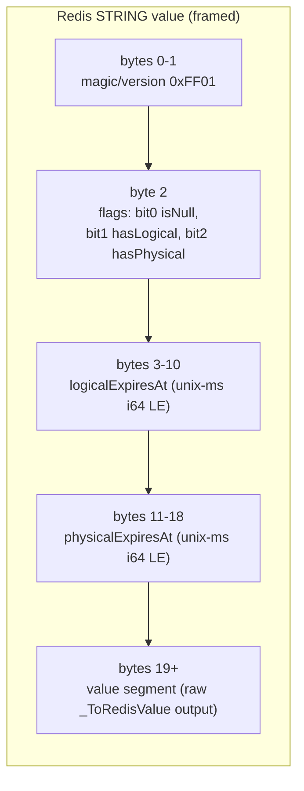
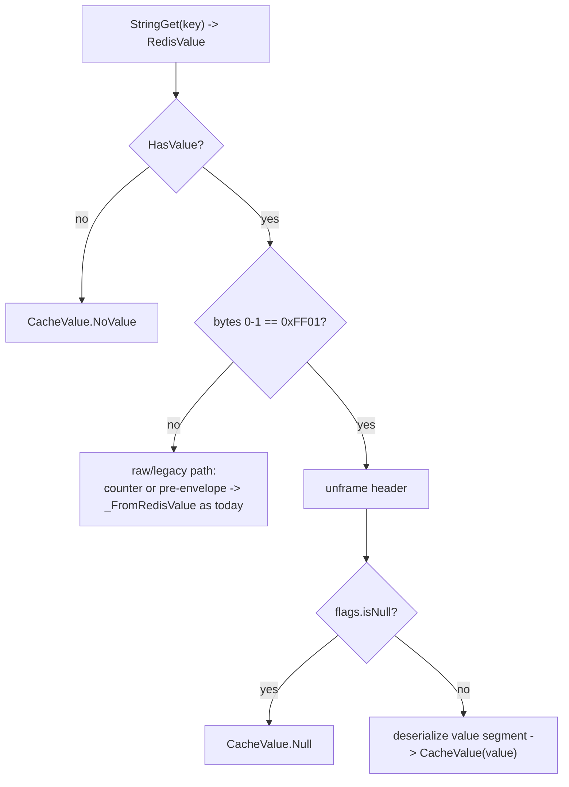
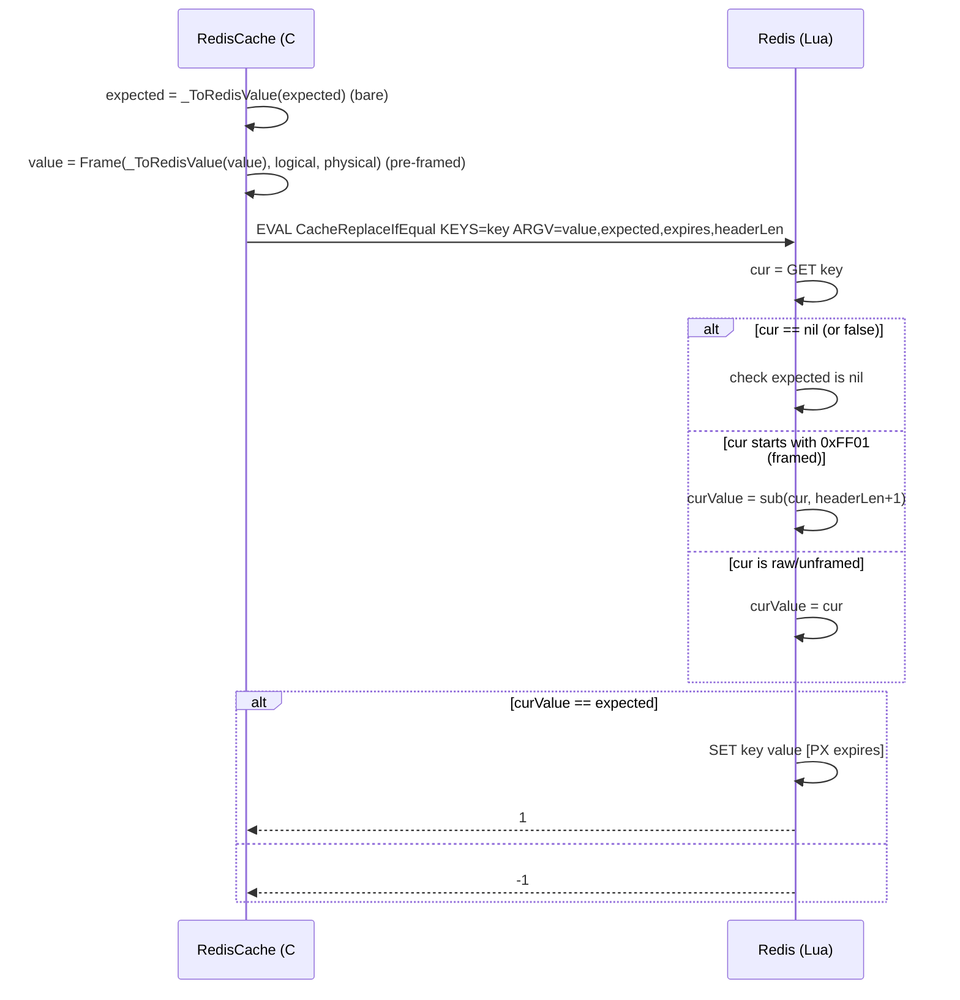

# feat: Cache entry envelope — Redis payload format

## Summary

Give `Headless.Caching.Redis` a versioned binary framing format for scalar cache entries so the entry-metadata envelope (#371 / PR #389) survives in the Redis bytes: a fixed-width header (`magic/version`, `flags`, `logicalExpiresAt`, `physicalExpiresAt`) followed by the raw value bytes. Physical expiration drives the Redis key TTL; logical expiration rides in the header. Null moves from the `@@NULL` literal to a header flag bit. Atomic numeric counters stay raw (native `INCR`); compare-and-swap (`ReplaceIfEqual`/`RemoveIfEqual`) gains envelope-aware Lua that compares against the value segment. The slice is behavior-preserving — logical == physical, reserved slots empty — but settles the wire format for the whole M1/M2/M3 program. As part of this work, extract a `Headless.Caching.Tests.Harness` package so the cross-provider value-semantics contract (Memory + Redis) is proven against one conformance suite rather than drifting copies.

**Target branch note:** #371's envelope landed as PR #389 (`3157122f5`) on `main` but is **not** on the current `xshaheen/messaging-message-options` branch. This work must branch from a base that includes #389 — `GetOrAddAsync` already takes `CacheEntryOptions`, and `InMemoryCache.CacheEntry` already carries `LogicalExpiresAt`/`PhysicalExpiresAt`/`LastFactoryError`/`Tags`.

---

## Problem Frame

The Memory provider keeps entry metadata as live object fields (`InMemoryCache.CacheEntry`, post-#389). Redis is out-of-process, so the same metadata must live in the serialized bytes or it does not exist. Today `RedisCache` stores only the raw serialized value plus a single Redis TTL (`src/Headless.Caching.Redis/RedisCache.cs`, `_SetInternalAsync` 1047–1064), with null represented by an `@@NULL` literal (`_NullValue`, line 44; applied in `_ToRedisValue`/`_FromRedisValue`/`_RedisValueToCacheValue`, 958–1015). There is nowhere to record "the value is stale but serveable" (#373 fail-safe), "the last factory call failed at T" (#374), or "this entry carries tags X, Y" (#379).

The roadmap (#369) gates most M1/M2 features on this format: the resilience family (#373–#376), the tag index (#378–#380), and the M3 BCL-interop trio (#381–#383) all read or extend this payload. Two repo facts make the Redis decision load-bearing:

- **`string` values bypass the serializer** (`_ToRedisValue` returns the raw string; `_FromRedisValue` returns `redisValue.ToString()`). Framing therefore cannot live inside `_ToRedisValue`/`_FromRedisValue` — it must be a distinct layer at the StringGet/StringSet sites, applied uniformly to strings and serialized bytes alike.
- **CAS passes `_ToRedisValue(expected)` as the comparison operand** (`TryReplaceIfEqualAsync` 202–242, `RemoveIfEqualAsync` 767–787). If framing were folded into `_ToRedisValue`, the expected operand would be framed and CAS would break. `_ToRedisValue` must stay a *bare* value codec.

This is a technical/architectural plan — the wire format and the test-harness shape are the subject. See origin: `docs/brainstorms/2026-06-03-caching-redis-envelope-payload-requirements.md`.

---

## Key Technical Decisions

- **KTD-1. Fixed-width 19-byte header.** Layout: bytes 0–1 = 2-byte magic/version prefix (byte 0 = `0xFF` magic to prevent UTF-8 multi-byte collisions, byte 1 = `0x01` version); byte 2 = `flags`; bytes 3–10 = `logicalExpiresAt`; bytes 11–18 = `physicalExpiresAt`; bytes 19+ = value segment. Expiration instants are Unix-epoch milliseconds as `Int64`, little-endian (`BinaryPrimitives`). Absence of an instant ("no expiry") is encoded by a `flags` bit, not a sentinel number. Fixed width keeps the value segment at a constant offset so Lua can slice it and BCL adapters can strip it. *(Resolves origin OQ1.)*

- **KTD-2. Framing is a distinct layer, not inside the value codec.** `_ToRedisValue`/`_FromRedisValue` stay bare value codecs (so CAS can pass a bare `expected`). A new internal framing component encodes/decodes the header around those bare bytes, invoked only at the scalar StringGet/StringSet sites. This is the single most important seam in the change.

- **KTD-3. Physical → Redis TTL; logical → header.** The Redis key `PEXPIRE`/`StringSet` expiry is set from the physical instant; the logical instant rides in the header and is not enforced by Redis key expiry. This slice writes logical == physical == `now + duration`, so observable TTL is identical to today; #373 diverges them with no format change. Matches FusionCache's verified L2 model (see origin Key Decisions).

- **KTD-4. Null via `flags` bit; `@@NULL` retired.** "Value is null" becomes `flags` bit 0 with an empty value segment, replacing the `@@NULL` literal. This preserves null round-trip and makes the literal string `"@@NULL"` cacheable (removes a current wart).

- **KTD-5. Counters stay raw; 2-byte magic prefix discriminates.** Atomic numeric entries (`Increment`, `SetIfHigher`, `SetIfLower`) remain plain Redis-native values using native `INCR` — they have no logical/physical/tag semantics. The read path distinguishes framed from raw by checking if the first byte is `0xFF` (magic) and the second byte is `0x01` (version). Using `0xFF` eliminates collision risk with UTF-8 character leading bytes (such as emojis or supplementary CJK planes, which occupy `0xF0`–`0xF4` at most) and MessagePack negative fixints (`0xf0`–`0xff`). Unframed bytes → raw/legacy path (deserialize directly, as today). *(Resolves origin OQ2.)*

- **KTD-6. Dedicated CAS Lua scripts with framing safety checks; new value pre-framed in C#.** To avoid breaking `Headless.DistributedLocks.Redis` (which shares the general locking scripts), define caching-specific scripts (`CacheReplaceIfEqualScriptDefinition` and `CacheRemoveIfEqualScriptDefinition`) in `Headless.Caching.Redis`. The Lua scripts check if the current key exists before slicing, and check the magic byte prefix of the current value to discriminate framed vs raw. If it is raw/legacy, they compare against the entire un-sliced value. For `ReplaceIfEqual`, C# pre-frames the replacement value (it knows logical/physical) and passes it as `@value`; the script also takes `headerLen` as an ARGV constant. Null-expected equality is reconciled against the current frame's null flag. `Increment`/`SetIfHigher`/`SetIfLower` Lua are untouched. *(Resolves origin OQ3.)*

- **KTD-7. Versioned header for forward evolution.** The version nibble governs the format so #373 (last-factory-error) and #379 (tags) extend the header additively. Greenfield posture: no read path for pre-envelope payloads; unrecognized bytes are treated as raw, not migrated.

- **KTD-8. Extract `Headless.Caching.Tests.Harness` (cross-provider conformance).** Per the repo harness rule, the envelope makes Redis the provider whose value semantics must match Memory's. Rather than copy assertions, extract a `CacheConformanceTestsBase` over `ICache` plus a fixture seam; Memory and Redis each supply a concrete fixture. Portable value-semantics scenarios live in the base; backend-specific tests (Redis key-prefix, setup, cluster/Lua, concurrency contention) stay in the leaf project. Mirrors `tests/Headless.DistributedLocks.Tests.Harness/DistributedLockProviderTestsBase.cs` (note: no leaf inherits that base yet, so this slice establishes the inheriting pattern). xUnit v3 does not auto-discover inherited virtual `[Fact]` methods unless the leaf re-declares them — each leaf class overrides the base scenarios and annotates them with `[Fact]` so they execute under the concrete provider.

---

## High-Level Technical Design

*Directional guidance for reviewers, not implementation specification.*

### Wire layout (framed scalar entry)



Redis key TTL = physical instant. Counters are NOT framed — stored as native ASCII integers, no magic byte.

### Read discrimination



### CAS seam (CacheReplaceIfEqual)



---

## Output Structure

```
tests/Headless.Caching.Tests.Harness/
├── Headless.Caching.Tests.Harness.csproj   # Headless.NET.Sdk.Test
└── CacheConformanceTestsBase.cs            # abstract: ICache factory + virtual should_* scenarios
```

Leaf wiring (existing projects, new files):
```
tests/Headless.Caching.Memory.Tests.Unit/InMemoryCacheConformanceTests.cs   # : CacheConformanceTestsBase
tests/Headless.Caching.Redis.Tests.Integration/RedisCacheConformanceTests.cs # : CacheConformanceTestsBase
tests/Headless.Caching.Redis.Tests.Integration/RedisEnvelopeFormatTests.cs   # backend-specific frame assertions
```

The per-unit `**Files:**` sections remain authoritative; the implementer may adjust layout.

---

## Implementation Units

### U1. Binary framing codec

- **Goal:** A pure, internal encode/decode component for the 19-byte header + value segment, independent of Redis and the serializer.
- **Requirements:** R1, R3, R4, R7 (origin).
- **Dependencies:** none (branch must include #389).
- **Files:**
  - `src/Headless.Caching.Redis/RedisCacheEntryFrame.cs` (new — `internal static`/`readonly struct` encode/decode + flags/magic constants)
  - `tests/Headless.Caching.Redis.Tests.Integration/RedisCacheEntryFrameTests.cs` (new — pure unit tests; no container needed, but lives with Redis as it is Redis-internal)
- **Approach:** Encode `(valueBytes, isNull, logical?, physical?)` → `byte[]`: write magic (`0xFF`), version (`0x01`), flags (isNull/hasLogical/hasPhysical bits), two `Int64` unix-ms instants via `BinaryPrimitives.WriteInt64LittleEndian`, then append value bytes. Decode returns `(isFramed, isNull, logical?, physical?, ReadOnlyMemory<byte> valueSegment)`; `isFramed=false` when byte 0 ≠ `0xFF` or byte 1 ≠ `0x01` or length < header. Expose `HeaderLength` const (19) for the Lua ARGV and read-path slicing. No `DateTime`↔ms helper duplication — centralize conversion here.
- **Patterns to follow:** `BinaryPrimitives` for endian-safe packing; file header `// Copyright (c) Mahmoud Shaheen. All rights reserved.`; keep `internal sealed`/`static`.
- **Test suite design:** Pure unit tests in the Redis integration project (no Testcontainers dependency for this class); they exercise the codec directly.
- **Test scenarios:**
  - Round-trip: value bytes + logical + physical → decode yields identical segment + instants.
  - Null: encode `isNull=true` → empty value segment, flag set; decode restores null.
  - No-expiry: `logical=null`/`physical=null` → hasLogical/hasPhysical bits clear; decode yields null instants.
  - Discrimination: bytes not starting with `0xFF 0x01` sequence → `isFramed=false`; a buffer shorter than `HeaderLength` → `isFramed=false`.
  - Boundary: empty value segment with non-null flag clear (zero-length value) round-trips distinctly from null.
  - Endianness: a known instant encodes to the expected little-endian byte pattern (guards accidental host-endian drift).
- **Verification:** New unit tests pass; codec has no Redis or serializer dependency.

### U2. Frame the scalar write path

- **Goal:** Writes store framed entries; Redis TTL is set from physical expiration.
- **Requirements:** R1, R2, R5, R6 (origin).
- **Dependencies:** U1.
- **Files:**
  - `src/Headless.Caching.Redis/RedisCache.cs` (`_SetInternalAsync` 1047–1064, `_SetAllInternalAsync` 1066–1092; thread logical/physical from the write call)
  - `tests/Headless.Caching.Redis.Tests.Integration/UpsertTests.cs` (extend)
- **Approach:** Keep `_ToRedisValue` producing bare bytes; after it, call the U1 encoder to wrap with `(isNull, logical, physical)`. This slice: `physical = logical = now + expiration` (single source from the existing `TimeSpan?`/`CacheEntryOptions.Duration`). Set the StringSet expiry from physical. `_SetAllInternalAsync` frames each pair value; null entries frame with the null flag (do not skip them — current code's null-skip in set-all is replaced by an explicit null frame so nulls round-trip). Strings are framed too (they no longer hit the raw `@@NULL` branch).
- **Patterns to follow:** existing `_NormalizeExpiration`/expiry handling; MSETEX vs pipelined fallback branches unchanged except for the framed value bytes.
- **Test suite design:** Redis integration (Testcontainers); behavioral assertions belong in the conformance base (U5) — here, assert framing/TTL specifics that are Redis-only.
- **Test scenarios:**
  - Upsert with duration → stored raw key begins with magic byte; Redis `PTTL` ≈ duration.
  - Upsert null → stored frame has null flag, empty value segment; `GetAsync` returns null.
  - `UpsertAll` with a null among non-nulls → each round-trips, including the null.
  - Upsert with no expiration → frame has hasPhysical bit clear; key has no TTL.
- **Verification:** New/updated Redis tests pass; existing upsert tests still green.

### U3. Unframe the scalar read path

- **Goal:** Reads detect frames, restore null via flag, and fall back to raw for counters/legacy.
- **Requirements:** R7, R10, R11 (origin).
- **Dependencies:** U1.
- **Files:**
  - `src/Headless.Caching.Redis/RedisCache.cs` (`_FromRedisValue` 973–991, `_RedisValueToCacheValue` 993–1015, `_RedisValuesToCacheValue` 1017–1045; `GetAsync` 525–532, `GetAllAsync` 534–591 inherit)
  - `tests/Headless.Caching.Redis.Tests.Integration/GetTests.cs` (extend)
- **Approach:** At the read sites, decode via U1 first. If `isFramed`: null flag → `CacheValue.Null`; else deserialize the value segment through the existing serializer/string branch. If not framed: preserve today's behavior exactly (raw deserialize) — this is the counter path (native-`INCR` ASCII). Retire `_NullValue`/`@@NULL` handling from the read path entirely: framed entries carry null in the flag, and counters never write `@@NULL`. Greenfield posture (KTD-7) — no pre-envelope payloads exist to read, so no legacy `@@NULL` fallback is retained. Collection/sorted-set ops are untouched (separate path).
- **Patterns to follow:** keep the `typeof(T)==string` fast path, now applied to the value segment; keep `LogDeserializationFailed` behavior.
- **Test suite design:** Redis integration; cross-provider behavior covered in U5.
- **Test scenarios:**
  - `Covers AE1.` Framed value written by U2 → `GetAsync<T>` returns the original.
  - `Covers AE3.` Null framed entry → returns null; a value equal to the literal string `"@@NULL"` → returns `"@@NULL"` intact (when written as a versioned frame).
  - `Covers AE3 (legacy).` Reading an unframed key containing `"@@NULL"` → returns null (retroactive compatibility check).
  - `Covers AE4.` A counter written by `Increment` (raw, unframed) → `GetAsync<long>` returns the count via the raw path.
  - `GetAll` over a mix of framed, null-framed, and missing keys → correct `CacheValue` for each.
- **Verification:** New/updated Redis read tests pass; existing get tests green.

### U4. Implement Cache CAS Lua script definitions

- **Goal:** `ReplaceIfEqual`/`RemoveIfEqual` operate correctly against framed entries; counter scripts stay raw.
- **Requirements:** R9 (origin).
- **Dependencies:** U1, U2, U3.
- **Files:**
  - `src/Headless.Caching.Redis/CacheScriptDefinitions.cs` (new — define `CacheReplaceIfEqualScriptDefinition` and `CacheRemoveIfEqualScriptDefinition` specifically for caching to avoid breaking `DistributedLocks` shared scripts)
  - `src/Headless.Caching.Redis/RedisCache.cs` (`TryReplaceIfEqualAsync` 202–242, `RemoveIfEqualAsync` 767–787; pre-frame `@value`, pass bare `@expected` + `headerLen`)
  - `src/Headless.Caching.Redis/RedisCacheScriptsInitializer.cs` (register the new `CacheReplaceIfEqualScriptDefinition` and `CacheRemoveIfEqualScriptDefinition` here; verify script bodies load)
  - `tests/Headless.Caching.Redis.Tests.Integration/TryReplaceTests.cs`, `RemoveTests.cs` (extend)
- **Approach:** Both scripts fetch the current value and check if it is non-nil/non-false. In Lua, check if the value length >= headerLen and starts with the 2-byte magic prefix (`0xFF 0x01`). If framed, slice: `local curValue = string.sub(currentVal, @headerLen + 1)`; if unframed, do not slice: `local curValue = currentVal`. Compare `curValue` to bare `@expected`. `ReplaceIfEqual` writes the C#-pre-framed `@value` (header built in C#, not Lua). Reconcile null-expected: when the caller's expected is null, compare against the current frame's null flag (byte 2 bit 0) rather than a byte compare. Leave `Increment`/`SetIfHigher`/`SetIfLower` untouched.
- **Execution note:** Start with a failing CAS-against-framed test before editing the Lua; the slicing/null interaction is the highest-risk part of the change.
- **Patterns to follow:** existing `@param`-bound `LuaScript.Prepare` style; `HeadlessRedisScriptsLoader.EvaluateAsync` load/fallback.
- **Test suite design:** Redis integration; the happy-path CAS scenarios also seed the conformance base (U5), but the null-expected and slicing edge cases are Redis-specific and stay here.
- **Test scenarios:**
  - `ReplaceIfEqual` where expected matches the stored value segment (not the whole blob) → replaces; resulting entry is a valid frame readable by U3.
  - `ReplaceIfEqual` where expected differs → no-op (returns the not-equal sentinel).
  - `ReplaceIfEqual` preserves/refreshes TTL via the pre-framed physical instant.
  - `ReplaceIfEqual` / `RemoveIfEqual` against legacy unframed or raw values works without crash and compares against the entire raw string.
  - `RemoveIfEqual` matches value segment → deletes; mismatch → no-op.
  - Null-expected: `RemoveIfEqual`/`ReplaceIfEqual` against a null-framed entry with expected=null → matches; against a non-null entry → no-op.
  - Two entries with identical value but different timestamps compare equal (proves comparison ignores header).
- **Verification:** New CAS tests pass including null-expected; concurrency tests still green; scripts reload cleanly on startup.

### U5. Extract `Headless.Caching.Tests.Harness` + wire Memory

- **Goal:** A cross-provider conformance suite over `ICache`, proven first against Memory.
- **Requirements:** R12 (origin); KTD-8.
- **Dependencies:** none for the base + Memory wiring (Memory already has #389); the Redis pass is U6.
- **Files:**
  - `tests/Headless.Caching.Tests.Harness/Headless.Caching.Tests.Harness.csproj` (new — `Headless.NET.Sdk.Test`)
  - `tests/Headless.Caching.Tests.Harness/CacheConformanceTestsBase.cs` (new)
  - `tests/Headless.Caching.Memory.Tests.Unit/InMemoryCacheConformanceTests.cs` (new — concrete fixture)
  - `headless-framework.slnx` (attach new project)
- **Approach:** Mirror `DistributedLockProviderTestsBase`: `abstract class CacheConformanceTestsBase : TestBase` with `protected abstract ICache CreateCache(string keyPrefix)` and an abstract/overridable `TimeProvider` so providers inject `FakeTimeProvider` (Memory) or real (Redis). `public virtual async Task should_*` scenarios cover the portable value-semantics contract. Memory leaf supplies `InMemoryCache`. Do not pull Redis-only assertions (frame bytes, TTL internals) into the base. In `InMemoryCacheConformanceTests.cs`, override each of the virtual conformance methods and decorate them with `[Fact]` to align with the framework's test discovery convention.
- **Patterns to follow:** `tests/Headless.DistributedLocks.Tests.Harness/DistributedLockProviderTestsBase.cs`; `Headless.Testing.Tests.TestBase`; AwesomeAssertions + Bogus; namespace `Tests`.
- **Test suite design:** This unit *is* the shared harness. Base scenarios are the contract; leaves are thin. Memory runs them as unit tests (fake clock where timing matters); Redis (U6) runs them as integration tests.
- **Test scenarios (the conformance contract — each a `should_*` in the base):**
  - Round-trip an object value and a string value.
  - `Covers AE3.` Null round-trips; the literal `"@@NULL"` round-trips as a normal string.
  - `Covers AE2.` Absolute-expiry timing: value present before expiry, absent after.
  - Bulk: `UpsertAll`/`GetAll` parity including a null member.
  - `Covers AE4.` `Increment` accumulates and reads back as a number.
  - `Covers AE5.` CAS: `ReplaceIfEqual`/`RemoveIfEqual` succeed on match, no-op on mismatch.
  - `TryInsert` (not-exists) and `TryReplace` (exists) semantics.
- **Verification:** Memory conformance class passes all base scenarios; project builds and is attached to the solution.

### U6. Wire Redis to the harness; prune duplicated leaf tests

- **Goal:** Redis passes the same conformance suite; the integration project keeps only backend-specific tests.
- **Requirements:** R11, R12 (origin); KTD-8.
- **Dependencies:** U1–U5.
- **Files:**
  - `tests/Headless.Caching.Redis.Tests.Integration/RedisCacheConformanceTests.cs` (new — concrete fixture over the Testcontainers `RedisCacheFixture`)
  - `tests/Headless.Caching.Redis.Tests.Integration/RedisEnvelopeFormatTests.cs` (new — backend-specific frame assertions)
  - Prune portable scenarios now owned by the base from: `GetTests.cs`, `UpsertTests.cs`, `IncrementTests.cs`, `TryReplaceTests.cs`, `TryInsertTests.cs`, `RemoveTests.cs` (keep backend-specific cases)
  - Keep as-is (backend-specific): `KeyPrefixTests.cs`, `RedisCacheSetupTests.cs`, `ConcurrencyTests.cs`, `SetOperationsTests.cs`, `SetIfHigherLowerTests.cs`, `ExpirationTests.cs` (Redis TTL specifics)
- **Approach:** `RedisCacheConformanceTests : CacheConformanceTestsBase` builds `RedisCache` via the existing fixture (`new SystemJsonSerializer()`, `Fixture.ScriptsLoader`, real `TimeProvider`), with per-test key-prefix isolation and `FlushAsync`. In `RedisCacheConformanceTests.cs`, override each of the virtual conformance methods and decorate them with `[Fact]` to align with the framework's test discovery convention. `RedisEnvelopeFormatTests` reads the raw key bytes to assert the magic bytes, null-flag, physical-TTL mapping, and that a counter key is stored unframed (raw ASCII). Remove leaf tests whose behavior the conformance base now guarantees to avoid drift; retain any Redis-specific edge of those operations.
- **Patterns to follow:** `RedisCacheTestBase`/`RedisCacheFixture` lifecycle; conformance-base contract from U5.
- **Test suite design:** Integration (Testcontainers). Conformance scenarios inherited; envelope-format assertions are the only net-new Redis-specific behavioral tests.
- **Test scenarios:**
  - All inherited `should_*` conformance scenarios pass against Redis.
  - `Covers AE1.` Raw stored value begins with the magic byte and the value segment deserializes to the original.
  - `Covers AE2.` Redis `PTTL` ≈ physical instant.
  - `Covers AE4.` `Increment` key stored as raw ASCII (no magic byte) verified by raw read.
  - Pruned-test audit: no portable scenario is lost — every removed assertion has a conformance-base equivalent.
- **Verification:** Full Redis integration suite green; conformance scenarios identical to Memory's; no net loss of coverage vs pre-prune (spot-check the audit scenario).

### U7. Documentation sync

- **Goal:** Keep the two agent-facing doc surfaces in lockstep with the consumer-visible behavior change.
- **Requirements:** docs sync trigger (consumer-visible behavior change: `@@NULL` literal now cacheable; Redis wire format).
- **Dependencies:** U1–U4 (behavior settled).
- **Files:**
  - `docs/llms/caching.md`
  - `src/Headless.Caching.Redis/README.md`
- **Approach:** Document the Redis envelope wire format (header fields, physical-TTL mapping, logical-in-payload), the null-via-flag change and that `"@@NULL"` is now a normal cacheable string, and that counters remain raw. Follow `docs/authoring/AUTHORING.md` drift checks; explain the concept and the physical-vs-logical trade-off, not just the field list. Note the format is versioned for the M1/M2 roadmap.
- **Test suite design:** N/A — docs.
- **Test scenarios:** `Test expectation: none -- documentation-only unit.`
- **Verification:** Both surfaces updated and consistent; AUTHORING drift checks pass; no stale `@@NULL`-limitation wording remains.

---

## Scope Boundaries

### In scope
- Versioned binary framing for scalar Redis value entries (write, read, CAS).
- Physical→TTL / logical→header mapping; null-via-flag; counters-stay-raw.
- `Headless.Caching.Tests.Harness` extraction + Memory and Redis conformance wiring.
- Docs sync for the consumer-visible behavior change.

### Deferred for later (origin roadmap — format ready, not activated)
- Divergent logical/physical TTL and serve-stale-on-failure — #373.
- Last-factory-error population, soft/hard factory timeouts — #373, #374.
- Eager refresh, adaptive caching — #375, #376.
- Tag header population, Redis reverse index, `RemoveByTagAsync` — #378–#380.
- BCL `IDistributedCache`/`HybridCache`/`IOutputCacheStore` adapters consuming the raw value segment — #381–#383.
- Sliding expiration — #377.

### Deferred to follow-up work (plan-local)
- Migrating the remaining backend-specific Redis tests into any future shared shape — only the portable value-semantics scenarios move now.
- Hybrid provider (`Headless.Caching.Hybrid`) conformance participation — out of this slice; revisit when the L1+L2 path consumes the envelope.

---

## Risks & Mitigation

- **CAS Lua correctness (highest risk).** Value-segment slicing + null-expected reconciliation are subtle. *Mitigation:* test-first on the framed-CAS path (U4 execution note); dedicated null-expected scenarios; checking key existence and framing before slicing; dedicated caching scripts to avoid collision with distributed lock storage scripts.
- **Binary (non-text) payloads.** Prepending a binary header makes stored values non-UTF-8; tooling or assumptions expecting text break. *Mitigation:* `RedisValue` handles bytes natively; magic bytes make frames self-identifying; documented in U7.
- **Read-path false positives (high-nibble collision).** A non-framework key or UTF-8 emoji/MessagePack fixint could be misread as a frame. *Mitigation:* Using a 2-byte magic prefix (`0xFF 0x01`) rather than a single-byte high-nibble check. `0xFF` is invalid in UTF-8, avoiding all emoji collisions.
- **Harness extraction drift/scope.** Memory (unit) vs Redis (integration) and clock differences could leak Redis specifics into the base. *Mitigation:* base parameterizes `ICache` factory + `TimeProvider`; only portable scenarios in the base; pruning audit scenario guards against lost coverage.
- **Branch base.** Building on a pre-#389 branch would miss the envelope and `CacheEntryOptions`. *Mitigation:* stated dependency — branch from a base including PR #389.

---

## Acceptance Traceability (origin)

| Origin AE | Covered by |
|---|---|
| AE1 (frame round-trip) | U3, U6 |
| AE2 (TTL ≈ physical) | U5, U6 |
| AE3 (null + literal `@@NULL`) | U3, U5 |
| AE4 (counter raw) | U3, U5, U6 |
| AE5 (CAS value-segment) | U4, U5 |
| AE6 (conformance green both providers) | U5, U6 |

---

## Sources & Research

- Origin requirements: `docs/brainstorms/2026-06-03-caching-redis-envelope-payload-requirements.md`.
- `#371`/PR #389 (`3157122f5`) envelope shape: `src/Headless.Caching.Abstractions/Contracts/CacheEntryOptions.cs`; `InMemoryCache.CacheEntry` fields.
- Redis value path: `src/Headless.Caching.Redis/RedisCache.cs` (`_ToRedisValue`/`_FromRedisValue` 958–1015, `_SetInternalAsync` 1047–1064, CAS 202–242 / 767–787).
- Lua: `src/Headless.Redis/RedisScriptDefinitions.cs`; loader `src/Headless.Redis/HeadlessRedisScriptsLoader.cs`; initializer `src/Headless.Caching.Redis/RedisCacheScriptsInitializer.cs`.
- Serializer: `src/Headless.Serializer.Abstractions/SerializerExtensions.cs` (`SerializeToBytes`/`Deserialize<T>(byte[])`).
- Harness shape: `tests/Headless.DistributedLocks.Tests.Harness/DistributedLockProviderTestsBase.cs`; repo harness rule in `CLAUDE.md`.
- FusionCache L2 model (logical-in-payload, physical-as-TTL), verified: `ZiggyCreatures.FusionCache` `FusionCacheDistributedEntry<T>`.
