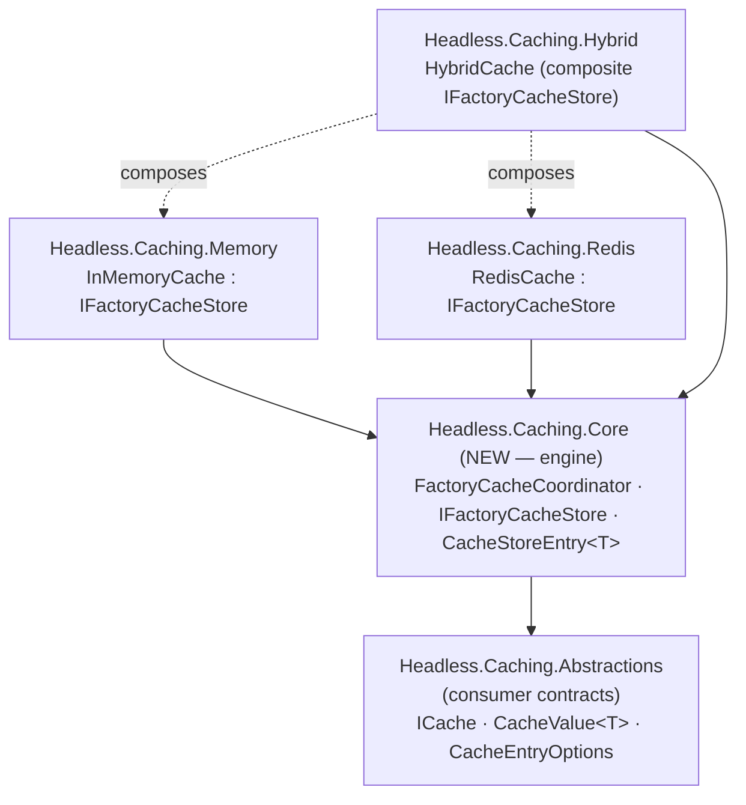
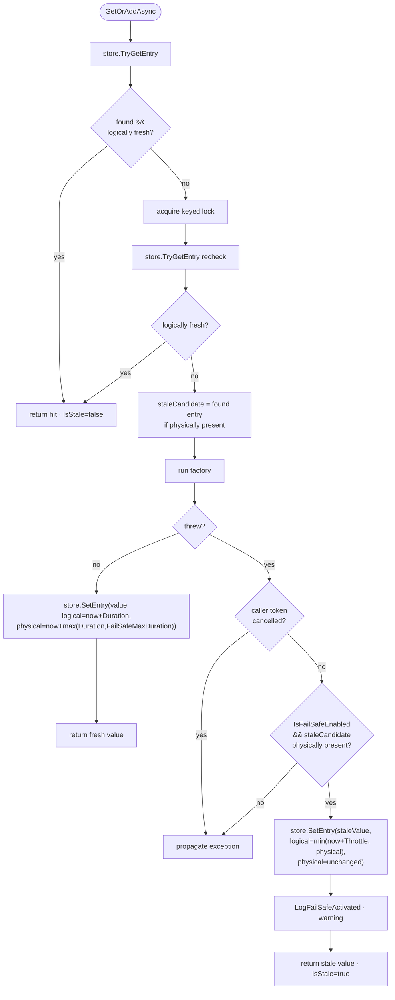
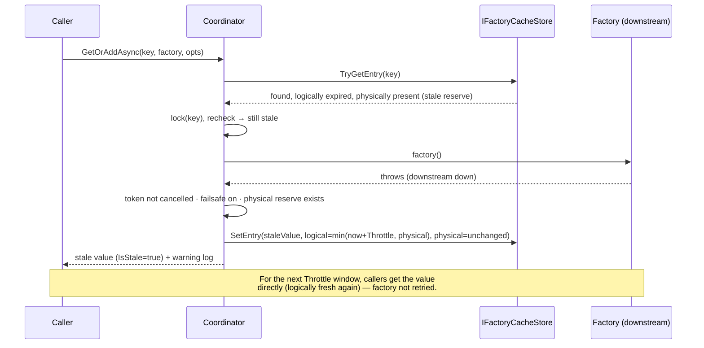

# feat: caching fail-safe (serve stale on factory/store failure)

## Summary

When a factory throws or the backing store is unavailable, serve the physically-retained **stale** value instead of propagating the failure — bounded by `FailSafeMaxDuration` and rate-limited by `FailSafeThrottleDuration`. This is the first feature of **M1 (resilient core)** in roadmap #369, and it establishes the shared factory-orchestration engine that #374 (timeouts), #375 (eager refresh), and #376 (adaptive) will all extend.

The entry-metadata envelope (logical vs physical expiration) already shipped in #371/#372 and is the foundation: `InMemoryCache.CacheEntry` already carries `LogicalExpiresAt`, `PhysicalExpiresAt`, and an (unused) `LastFactoryError`; the Redis frame already encodes both timestamps. Today both timestamps are written identically and factory throws propagate. Fail-safe makes physical outlive logical and consumes the difference.

Three decisions were settled before planning (see Key Technical Decisions): **(1)** the factory-orchestration state machine is **centralized** into a new `Headless.Caching.Core` engine that all three providers delegate to, rather than duplicated; **(2)** observability for this slice is a `CacheValue<T>.IsStale` flag plus a structured activation log — the formal event/meter surface is deferred to M4 (#384/#385); **(3)** the engine lives in a **new `Headless.Caching.Core` package**.

---

## Problem Frame

**Today:** All three providers (`InMemoryCache`, `RedisCache`, `HybridCache`) implement `GetOrAddAsync` with the same control flow — read, keyed-lock, double-check, run factory, upsert — and a factory exception propagates to the caller. A transient downstream outage (DB down, upstream API 500) therefore turns every cache-miss into a user-visible error, even when a perfectly serviceable value was cached moments ago and is still physically resident.

**Desired:** A caller that opts into fail-safe (`CacheEntryOptions.IsFailSafeEnabled = true`) gets the last-known-good value served from the physical reserve when the factory fails, for up to `FailSafeMaxDuration` after entry creation. After fail-safe activates, the factory is not retried again until `FailSafeThrottleDuration` elapses, so a hard-down dependency is not hammered. The served value is marked `IsStale = true` and a warning is logged. Beyond the physical window (or with no stale value to fall back on), the original exception propagates.

**Why now:** #369's thesis is "engine first" — build resilience into the engine, then expose it through the BCL interfaces in M3. Fail-safe is the first engine feature and sets the orchestration shape for the rest of M1.

**Scope boundary at a glance:** per-entry opt-in via `CacheEntryOptions`; factory-throw and store-exception activation; the `IsStale` flag + activation log. Out: soft/hard factory timeouts (#374), eager refresh (#375), adaptive (#376), the public event hub + OTel meters (#384/#385), global default entry options, and a `failSafeDefaultValue` cold-cache escape hatch.

---

## High-Level Technical Design

Three architectural shapes warrant visualization: the **package layering** (new engine across providers), the **coordinator state machine** (the fail-safe control flow), and the **activation sequence** (how stale is served on failure). All three are authoritative; prose governs on any disagreement.

### Package layering



Providers implement the `IFactoryCacheStore` primitive (get-entry-with-metadata, set-entry-with-explicit-logical+physical) and delegate their `GetOrAddAsync` to the shared `FactoryCacheCoordinator`. #374/#375/#376 extend the coordinator only.

### Coordinator state machine (`FactoryCacheCoordinator.GetOrAddAsync<T>`)



### Fail-safe activation sequence



---

## Key Technical Decisions

### KTD-1 — Centralized engine (`FactoryCacheCoordinator` + `IFactoryCacheStore`) — *settled*
The three providers' `GetOrAddAsync` flows are factored into one state machine in `Headless.Caching.Core`. Providers supply primitives via `IFactoryCacheStore`; the coordinator owns the keyed lock, `TimeProvider`, logger, fresh/stale decision, throttle, window, and cancellation rules. **Rationale:** #373–376 all ride this exact flow; centralizing once avoids implementing the state machine 3× and re-touching all three on every subsequent M1 feature. Matches #369's "engine first" thesis. **Trade-off:** larger up-front refactor of all three providers vs. compounding payoff across M1. *Alternative considered:* per-provider implementation now, extract later — rejected (3× surface to get the state machine right + provider drift).

### KTD-2 — Engine lives in a new `Headless.Caching.Core` package — *settled*
`Core` references `Abstractions`; all three providers reference `Core`. **Rationale:** keeps `Abstractions` a pure consumer-contract surface; `Core` becomes the home for M2 tag-index and M4 event-hub/OTel engine code too. *Alternatives considered:* public engine types in `Abstractions` — rejected (leaks infra into the contract package, accretes over M1–M4); a C# shared project / linked-source approach — rejected (compiles the engine into every provider assembly with no NuGet package boundary, defeating the "engine as a first-class, separately-versioned package" intent and the M2/M4 reuse story).

### KTD-3 — Observability = `IsStale` flag + structured log; defer event/meter surface to M4 — *settled*
Add `CacheValue<T>.IsStale` and a `[LoggerMessage]` warning on activation. **Rationale:** M4 (#384 OTel meters, #385 public event surface) already owns the formal surface; building it now front-runs that design. The issue's "event/flag" requirement is met by the flag + log seam, which M4 wraps.

### KTD-4 — Throttle by re-stamping **logical** expiration forward; never extend physical
On activation the coordinator writes the stale value back with `logical = min(now + FailSafeThrottleDuration, physicalExpiresAt)` and **unchanged physical**. **Rationale:** reuses the existing two-timestamp envelope with **no frame-format change** and gives distributed throttle coordination for free (logical is persisted in Redis, so any node sees the throttle). Total stale lifetime stays capped by physical (`creation + FailSafeMaxDuration`). *Alternative considered:* a third "throttle-until" timestamp in the envelope — rejected (Redis frame format change for no added correctness). **Consequence:** during the throttle window the value reads as a normal hit (`IsStale=false`); only the activating call returns `IsStale=true`. Accepted as honest ("we chose to serve this for the throttle window"). Callers needing per-read staleness signaling get it from M4's event surface (#385), not this slice. **Edge:** when `now + FailSafeThrottleDuration > physicalExpiresAt`, the `min()` clamp shortens the final throttle window so the factory may be retried sooner than `FailSafeThrottleDuration` right before the entry dies — harmless, since the entry is about to expire physically anyway.

### KTD-5 — Logical expiration governs normal reads; physical is the fail-safe reserve
`GetAsync` returns a miss once an entry is **logically** expired; the physically-retained value is reachable **only** through `GetOrAddAsync`'s fail-safe fallback. **Rationale:** makes the two-timestamp model coherent — `GetOrAddAsync` must treat logical-expired as "needs factory" (else it would return stale and never refresh). **Backward-compatible:** when fail-safe is disabled (the default), `logical == physical`, so behavior is unchanged. Implemented by both `GetAsync` and the coordinator reading the same `IFactoryCacheStore.TryGetEntry`, differing only in whether they accept a logically-expired entry.

**Consistency across read methods:** all single-value read surfaces apply the same logical-governed rule for fail-safe entries — `GetAsync`, `GetAllAsync`, `GetByPrefixAsync`, `GetSetAsync`, and `ExistsAsync` treat a logically-expired entry as absent; `GetExpirationAsync` reports the **logical** remaining time; `GetCountAsync`/`GetAllKeysByPrefixAsync` (key-presence, not value reads) continue to reflect physical residency (the keys still exist until physical eviction). Because fail-safe-disabled entries have `logical == physical`, none of these change for the common case. Each provider unit (U6/U7/U8) must apply the rule uniformly, not just in `GetAsync`.

**Store-read failure is a miss, not an error:** if `IFactoryCacheStore.TryGetEntry` itself throws (e.g. Redis unreachable on the read), the coordinator treats it as a cache miss and proceeds to the keyed-lock + factory path (degraded-but-available). A read failure yields no stale candidate, so a subsequent factory failure simply propagates. The composite Hybrid store swallows L2 read failures internally and still returns any L1 entry (see U7).

### KTD-6 — Redis key TTL tracks **physical**; no new Lua required
`RedisCache.SetEntryAsync` sets the Redis TTL to the remaining time-to-physical (`physicalExpiresAt - now`) so the stale reserve survives in Redis through the window. The restamp is a plain `StringSet` (best-effort, under the per-node keyed lock) — **no CAS / no new Lua script**, which sidesteps the shared `ReplaceIfEqual`/`RemoveIfEqual` script hazard entirely (those scripts in `Headless.Redis` are shared with `DistributedLocks.Redis` and must not be mutated).

**Known cross-node race (accepted for v1, hardening path noted):** the keyed lock is per-node, so a blind `StringSet` restamp on node A can overwrite a *fresh* value that node B's factory succeeded in writing in the same instant — regressing good data to stale for up to one throttle window, after which logical re-expires and the factory restores freshness. Likelihood is low (requires A's factory to fail while B's succeeds within the restamp window) and impact is bounded (≤ `FailSafeThrottleDuration` of stale-instead-of-fresh). **If this proves material, the sanctioned hardening is a cache-owned, conditional restamp script** — a *fork* of the `ReplaceIfEqual` CAS shape registered under the cache package's own keyed `ScriptsLoader` (per the keyed-DI script-isolation learning), restamping only when the stored value still equals the stale value we read. Deliberately deferred to keep v1 Lua-free; tracked as a residual risk.

### KTD-7 — Caller-cancellation never activates fail-safe
If the caller's `CancellationToken` is cancelled, the exception propagates even if a stale reserve exists. **Rationale:** a cancelled caller wants to stop, not receive stale data. Any *other* factory exception (including an `OperationCanceledException` not tied to the caller's token) activates fail-safe. Rule: `if (cancellationToken.IsCancellationRequested) throw;` before the stale-serve branch.

### KTD-8 — `FailSafeMaxDuration` coherence: physical = `now + max(Duration, FailSafeMaxDuration)`
Mirrors FusionCache. `FailSafeMaxDuration` is measured from entry creation; if a caller sets it below `Duration`, the longer wins (physical never precedes logical). Defaults mirror FusionCache: `IsFailSafeEnabled=false`, `FailSafeMaxDuration=1d`, `FailSafeThrottleDuration=30s`. The coordinator computes logical/physical from options; `CacheEntryOptions` stores raw values.

**The physical reserve is established only by factory-backed writes** (`GetOrAddAsync` via the coordinator), matching FusionCache's "fail-safe is a GetOrSet concept." Direct writes — `UpsertAsync`, `TryInsertAsync`, `TryReplaceAsync` — take a plain `TimeSpan? expiration` (no `CacheEntryOptions`) and write `logical == physical`, so a value set that way has no stale reserve when later read through a fail-safe `GetOrAddAsync`. This is intentional for #373 (no API-surface change to the direct-write methods); documented as a consumer-visible limitation in U9.

---

## Output Structure

New package and its test project (the per-unit `**Files:**` lists remain authoritative):

```
src/Headless.Caching.Core/
├── Headless.Caching.Core.csproj          # <Project Sdk="Headless.NET.Sdk">, refs Abstractions
├── IFactoryCacheStore.cs                 # provider primitive: TryGetEntry / SetEntry
├── CacheStoreEntry.cs                    # readonly record struct: Found, IsNull, Value, Logical/PhysicalExpiresAt
├── FactoryCacheCoordinator.cs            # the state machine + [LoggerMessage] activation log
└── README.md                            # package doc (engine concept)

tests/Headless.Caching.Core.Tests.Unit/
├── Headless.Caching.Core.Tests.Unit.csproj
├── FactoryCacheCoordinatorTests.cs       # state-machine unit tests over a fake IFactoryCacheStore
└── FakeFactoryCacheStore.cs              # in-memory test double with controllable clock/state
```

---

## Requirements Traceability

From issue #373 (acceptance): *factory exception → stale within window; beyond window → error; throttle prevents factory hammering*; *surface an event/flag when fail-safe activates*.

| Req | Description | Units |
| --- | --- | --- |
| R1 | Factory exception serves stale value when within physical window | U4, U5, U6, U7, U8 |
| R2 | Beyond physical window (or no stale reserve) → original exception propagates | U4, U8 |
| R3 | Throttle prevents factory hammering after activation | U4, U8 |
| R4 | Store-unavailable (store exception) activates fail-safe | U6, U7 |
| R5 | Activation surfaces a flag (`CacheValue<T>.IsStale`) + structured log | U3, U4, U8 |
| R6 | Per-entry opt-in + bounds via `CacheEntryOptions` (`IsFailSafeEnabled`, `FailSafeMaxDuration`, `FailSafeThrottleDuration`) | U2 |
| R7 | Fail-safe disabled (default) preserves current behavior across all providers | U2, U5, U6, U7, U8 |
| R8 | Caller cancellation propagates (never activates fail-safe) | U4, U8 |
| R9 | Docs synced (public API + behavior change) | U9 |

---

## Implementation Units

### U1. Scaffold `Headless.Caching.Core` package + `IFactoryCacheStore` contract
**Goal:** Create the engine package and define the provider primitive + entry value type. No behavior yet.
**Requirements:** Enables KTD-1, KTD-2.
**Dependencies:** none.
**Files:**
- `src/Headless.Caching.Core/Headless.Caching.Core.csproj` (create; `<Project Sdk="Headless.NET.Sdk">`, `ProjectReference` to `Headless.Caching.Abstractions`)
- `src/Headless.Caching.Core/IFactoryCacheStore.cs` (create)
- `src/Headless.Caching.Core/CacheStoreEntry.cs` (create)
- `headless-framework.slnx` (attach new project + its test project)
- `Directory.Packages.props` (only if a new transitive package is needed — expected none)
**Approach:** `IFactoryCacheStore` exposes `ValueTask<CacheStoreEntry<T>> TryGetEntryAsync<T>(string key, CancellationToken)` and `ValueTask SetEntryAsync<T>(string key, T? value, bool isNull, DateTime logicalExpiresAt, DateTime physicalExpiresAt, CancellationToken)`. `CacheStoreEntry<T>` is a `readonly record struct` carrying `Found`, `IsNull`, `Value`, `LogicalExpiresAt`, `PhysicalExpiresAt`. Types are `public` (cross-assembly use by providers) but namespaced `Headless.Caching` and `[PublicAPI]`-free / documented as engine-facing. Copyright header on every file.
**Patterns to follow:** existing package csproj shape under `src/Headless.Caching.Memory`; SDK selection per CLAUDE.md "New .NET Projects".
**Test suite design:** none for U1 itself (pure scaffolding); the `Headless.Caching.Core.Tests.Unit` project is created here but populated in U4.
**Test scenarios:** `Test expectation: none -- scaffolding/contract only; behavior arrives in U4.`
**Verification:** solution builds with the new project attached; `make build` clean; no warnings (warnings-as-errors in CI).

### U2. `CacheEntryOptions` fail-safe fields + coherence rules
**Goal:** Add the per-entry opt-in surface and its normalization semantics.
**Requirements:** R6, R7.
**Dependencies:** none (Abstractions-only).
**Files:**
- `src/Headless.Caching.Abstractions/Contracts/CacheEntryOptions.cs` (modify — add `IsFailSafeEnabled`, `FailSafeMaxDuration`, `FailSafeThrottleDuration` init properties with FusionCache-mirroring defaults)
- `tests/Headless.Caching.Abstractions.Tests.Unit/CacheEntryOptionsTests.cs` (create or extend)
**Approach:** Keep the `readonly record struct` + implicit `TimeSpan` conversion (sets `Duration` only; fail-safe stays off by default — preserves R7). Store raw option values; the **coordinator** computes effective logical/physical (KTD-8) so normalization lives in one place. Document each property and the coherence rule (`physical = max(Duration, FailSafeMaxDuration)`) in XML docs. Update the type-level remark that currently says "This slice only activates Duration."
**Patterns to follow:** existing `CacheEntryOptions` XML-doc style; `Headless.Checks` (`Argument.*`) only where a value must be guarded.
**Test suite design:** unit (pure value type) in the existing Abstractions unit project.
**Test scenarios:**
- Default options → `IsFailSafeEnabled == false`, `FailSafeMaxDuration == 1d`, `FailSafeThrottleDuration == 30s`.
- Implicit `TimeSpan` → `CacheEntryOptions` leaves fail-safe disabled and sets `Duration`.
- `Covers R7.` Options with fail-safe disabled behave identically to today (assert no physical/logical divergence is implied — the divergence is computed in U4, so here assert the flag default only).
- Setting all three properties round-trips the raw values unchanged (coherence is applied downstream, not in the struct).
**Verification:** new/updated unit tests pass; `make test-project TEST_PROJECT=tests/Headless.Caching.Abstractions.Tests.Unit` green.

### U3. `CacheValue<T>.IsStale` flag
**Goal:** Let callers detect a stale-served value.
**Requirements:** R5.
**Dependencies:** none (Abstractions-only).
**Files:**
- `src/Headless.Caching.Abstractions/Contracts/CacheValue.cs` (modify — add `bool IsStale`, default `false`)
- `tests/Headless.Caching.Abstractions.Tests.Unit/CacheValueTests.cs` (create or extend)
**Approach:** Add an optional `isStale = false` constructor parameter and an `IsStale` get-only property; `Null` and `NoValue` static instances keep `IsStale = false`. Do not break existing `new CacheValue<T>(value, hasValue)` call sites (new param is optional/last). XML docs explain that `IsStale` is only `true` for a fail-safe-served value.
**Patterns to follow:** existing `CacheValue<T>` immutable shape.
**Test suite design:** unit, Abstractions unit project.
**Test scenarios:**
- `new CacheValue<T>(v, hasValue:true)` → `IsStale == false` (default preserved for all existing call sites).
- `new CacheValue<T>(v, hasValue:true, isStale:true)` → `HasValue == true && IsStale == true`.
- `CacheValue<T>.Null` and `.NoValue` → `IsStale == false`.
**Verification:** unit tests pass; full solution still compiles (all existing `CacheValue` constructions unaffected).

### U4. `FactoryCacheCoordinator` state machine + activation log
**Goal:** Implement the centralized fail-safe orchestration once.
**Requirements:** R1, R2, R3, R5, R8.
**Dependencies:** U1, U2, U3.
**Files:**
- `src/Headless.Caching.Core/FactoryCacheCoordinator.cs` (create — state machine + `[LoggerMessage]` partial at the **bottom** of the file)
- `tests/Headless.Caching.Core.Tests.Unit/FactoryCacheCoordinatorTests.cs` (create)
- `tests/Headless.Caching.Core.Tests.Unit/FakeFactoryCacheStore.cs` (create)
**Approach:** `GetOrAddAsync<T>(IFactoryCacheStore store, string key, Func<CancellationToken, ValueTask<T?>> factory, CacheEntryOptions options, CancellationToken)` implements the state machine in the HTD flowchart. Owns a `KeyedAsyncLock` and a `TimeProvider` (injected per-provider). Computes `logical = now + Duration`; `physical = now + (IsFailSafeEnabled ? max(Duration, FailSafeMaxDuration) : Duration)`. On factory throw: rethrow if `cancellationToken.IsCancellationRequested` (KTD-7); else if `IsFailSafeEnabled` and `staleCandidate.Found` and `staleCandidate.PhysicalExpiresAt > now`, restamp (`logical = min(now + FailSafeThrottleDuration, physical)`, physical unchanged) via `store.SetEntryAsync`, log activation (warning, key only), and return `new CacheValue<T>(staleValue, hasValue:true, isStale:true)`; otherwise rethrow. Activation flag is local to the call path — no shared mutable latch — so no CAS needed for this slice (the learnings' `Interlocked` activation-gate concern applies to M4's metric/event latch, not here).

**Best-effort restamp (write-failure isolation):** the restamp `store.SetEntryAsync` is wrapped in its own `try/catch` (excluding `OperationCanceledException` on the caller token). Serving the stale value is the priority; if the restamp write itself fails (store now also unreachable), **still return the stale value** with `IsStale=true` and log the restamp failure at debug — do not let a failed throttle-write convert a successful fail-safe into a thrown exception. The throttle is an optimization, not a correctness gate.

**Read-failure handling:** a throwing `store.TryGetEntry` (read path) is caught and treated as a miss → proceed to lock + factory (KTD-5); it yields no stale candidate.

**Lifetime/disposal:** the coordinator owns the `KeyedAsyncLock`; it is constructed and owned by each provider and disposed when the provider is disposed. If `KeyedAsyncLock` is `IDisposable`/`IAsyncDisposable`, the coordinator exposes matching disposal and each provider's existing `Dispose`/`DisposeAsync` (InMemoryCache, HybridCache) disposes it; a non-disposable lock needs no extra wiring.
**Execution note:** implement test-first — the state machine is pure logic with a fake store; write the failing scenario tests before the coordinator.
**Patterns to follow:** `KeyedAsyncLock` usage in current `InMemoryCache.GetOrAddAsync`; `[LoggerMessage]` partial-class placement at file bottom (project convention); `TimeProvider` injection per `.NET` time rules.
**Test suite design:** **unit** in `Headless.Caching.Core.Tests.Unit` over `FakeFactoryCacheStore` with `FakeTimeProvider` — this is the primary, exhaustive coverage of the state machine (testing-diamond: non-trivial pure logic). Provider conformance (U8) re-proves the behavior end-to-end per backend but does not duplicate every branch here.
**Test scenarios:**
- `Covers R1.` Logical-expired + physically-present entry, factory throws, fail-safe on → returns stale value, `IsStale == true`.
- `Covers R2.` No stale reserve (cold) + factory throws, fail-safe on → exception propagates.
- `Covers R2.` Stale entry past physical window (advance clock beyond physical), factory throws → exception propagates (not served).
- `Covers R3.` After activation, a second call within `FailSafeThrottleDuration` returns the value **without** invoking the factory (assert factory call count == prior count); advancing past throttle re-invokes the factory.
- `Covers R5.` Activation path returns `IsStale == true`; fresh path returns `IsStale == false`.
- `Covers R8.` Caller token cancelled and factory throws → exception propagates, factory-failure does **not** serve stale.
- Fail-safe **disabled** + factory throws → propagates (no stale-serve attempt) even if a physical reserve somehow exists.
- Fresh entry (logical not expired) → returned without acquiring the factory path (factory not called).
- Factory success → `SetEntryAsync` called with `logical = now+Duration` and `physical = now+max(Duration,FailSafeMaxDuration)`; returns fresh value.
- Concurrency: two concurrent callers on a cold key with a slow factory → factory invoked once (keyed-lock stampede protection), both get the value.
- Store-read throws (fake store set to fault `TryGetEntry`) → treated as a miss; factory runs; on factory success returns fresh, on factory failure (cold, no reserve) propagates.
- Restamp write throws (fake store faults `SetEntryAsync` only) on the fail-safe path → stale value still returned with `IsStale == true` (restamp failure swallowed).
**Verification:** `make test-project TEST_PROJECT=tests/Headless.Caching.Core.Tests.Unit` green; all listed scenarios implemented and passing.

### U5. `InMemoryCache` implements `IFactoryCacheStore`; delegate `GetOrAddAsync` to coordinator
**Goal:** Route the memory provider through the engine; honor logical-governed reads.
**Requirements:** R1, R5, R7.
**Dependencies:** U4.
**Files:**
- `src/Headless.Caching.Memory/InMemoryCache.cs` (modify — implement `IFactoryCacheStore`, construct a `FactoryCacheCoordinator`, replace `GetOrAddAsync` body with delegation, adjust `GetAsync`/`CacheEntry` to logical-governed reads)
- `src/Headless.Caching.Memory/Headless.Caching.Memory.csproj` (modify — add `ProjectReference` to `Headless.Caching.Core`)
- `tests/Headless.Caching.Memory.Tests.Unit/InMemoryCacheConformanceTests.cs` (modify if fail-safe conformance is opted-in via U8 base)
- `tests/Headless.Caching.Memory.Tests.Unit/InMemoryCacheTests.cs` (extend — memory-specific fail-safe cases)
**Execution note:** turn the U8 conformance scenarios green for the memory provider (they were authored failing in U8, ahead of this unit).
**Approach:** `TryGetEntryAsync<T>` reads the `CacheEntry` and returns `Found/IsNull/Value/LogicalExpiresAt/PhysicalExpiresAt` **without** removing logically-expired-but-physically-present entries (the eviction/maintenance loop already keys on `PhysicalExpiresAt` — leave it). `SetEntryAsync<T>` constructs a `CacheEntry` with the explicit logical+physical (the second `CacheEntry` constructor already accepts both). Public reads (`GetAsync`, `GetAllAsync`, `GetByPrefixAsync`, `GetSetAsync`, `ExistsAsync`) now treat logical-expired as absent (KTD-5): found && `LogicalExpiresAt > now` → hit, else `NoValue`; `GetExpirationAsync` reports logical-remaining. `GetOrAddAsync` becomes `_coordinator.GetOrAddAsync(this, key, factory, options, ct)`. The provider's own `_keyedLock` for the factory path is superseded by the coordinator's lock — remove the now-dead double-lock.
**Patterns to follow:** existing `CacheEntry` two-timestamp constructor (`InMemoryCache.cs` ~L2051); `_GetKey` prefixing; `TimeProvider` already injected.
**Test suite design:** unit (memory provider, `FakeTimeProvider`); the cross-provider behavior is owned by U8 conformance — keep U5 tests to memory-specific concerns (eviction interplay, clone semantics under stale).
**Test scenarios:**
- `Covers R7.` Fail-safe disabled (default options): set with `Duration`, advance past it → `GetAsync` miss and `GetOrAddAsync` re-runs factory — identical to pre-change behavior.
- `Covers R5.` Fail-safe on: factory throws within window → `GetOrAddAsync` returns `IsStale == true` value; activation logged.
- `Covers R1.` Logical-expired entry is **not** evicted before physical (assert `TryGetEntryAsync` still `Found` after logical but before physical).
- `GetAsync` on a logically-expired-but-physically-present entry → `NoValue` (KTD-5).
- Clone-values mode (`CloneValues=true`): stale-served value is a clone, not the cached reference.
**Verification:** `make test-project-fast TEST_PROJECT=tests/Headless.Caching.Memory.Tests.Unit` green; existing memory conformance suite still passes unchanged.

### U6. `RedisCache` implements `IFactoryCacheStore`; delegate `GetOrAddAsync`; TTL = physical
**Goal:** Route the Redis provider through the engine; retain the stale reserve in Redis; activate on store exceptions.
**Requirements:** R1, R4, R5, R7.
**Dependencies:** U4.
**Files:**
- `src/Headless.Caching.Redis/RedisCache.cs` (modify — implement `IFactoryCacheStore`, delegate `GetOrAddAsync`, add logical check to `_RedisValueToCacheValue`, set TTL from physical in `SetEntryAsync`)
- `src/Headless.Caching.Redis/Headless.Caching.Redis.csproj` (modify — `ProjectReference` to `Headless.Caching.Core`)
- `tests/Headless.Caching.Redis.Tests.Integration/RedisCacheFailSafeTests.cs` (create — store-unavailable + TTL=physical cases)
- `tests/Headless.Caching.Redis.Tests.Integration/RedisEnvelopeFormatTests.cs` (modify — TTL now tracks physical, not Duration, when fail-safe on)
**Execution note:** turn the U8 conformance scenarios green for the Redis provider (authored failing in U8).
**Approach:** `TryGetEntryAsync<T>` = `StringGet` + `RedisCacheEntryFrame.Decode` → `CacheStoreEntry` (frame already yields logical+physical). `SetEntryAsync<T>` = `Encode(value, isNull, logical, physical)` + `StringSet` with `expiry = physicalExpiresAt - now` (KTD-6). `_RedisValueToCacheValue` (used by the public reads) adds the logical check: framed && `LogicalExpiresAt <= now` → `NoValue` (KTD-5), applied consistently across `GetAsync`/`GetAllAsync`/`GetByPrefixAsync`/`ExistsAsync`; fail-safe-disabled entries have logical==physical==TTL so this is a near-no-op. Restamp is a plain `StringSet` — **no Lua** (KTD-6). Store-unavailable activation: a `RedisConnectionException`/`RedisException` thrown by the factory (or by an L2 read in Hybrid) is a non-cancellation exception → the coordinator's normal stale-serve path handles it; for the *direct* Redis provider, "store unavailable" mainly means the factory itself failed — the read that produced `staleCandidate` must have succeeded for a reserve to exist.
**Patterns to follow:** `_ToFramedRedisValue`/`_SetInternalAsync` (`RedisCache.cs` ~L1078); `RedisCacheEntryFrame` codec; keyed-loader DI isolation (do not touch shared scripts).
**Test suite design:** **integration** (Testcontainers Redis) in the existing Redis integration project; use small real durations (e.g. logical 1s / physical 3s / throttle 1s) to keep waits short. Cross-provider semantics still owned by U8.
**Test scenarios:**
- `Covers R1.` Plant a framed entry with `logical < now < physical` (write with fail-safe), factory throws → `GetOrAddAsync` serves stale, `IsStale == true`.
- `Covers R4.` Factory throws a `RedisException` (simulated store failure in the factory) within window → stale served.
- `should_set_redis_ttl_to_physical_when_failsafe_enabled` — TTL ≈ `max(Duration, FailSafeMaxDuration)`, not `Duration`.
- `Covers R7.` Fail-safe disabled → TTL == `Duration`, `GetAsync` behavior unchanged (existing envelope-format test still green).
- `GetAsync` on logically-expired framed entry → `NoValue` (KTD-5).
- Beyond physical (key TTL elapsed in Redis), factory throws → propagates (no key to serve).
**Verification:** `make test-project TEST_PROJECT=tests/Headless.Caching.Redis.Tests.Integration` green (Docker required); `RedisEnvelopeFormatTests` updated and passing.

### U7. `HybridCache` composite `IFactoryCacheStore`; delegate `GetOrAddAsync`
**Goal:** Route the two-tier provider through the engine; serve stale from L1 or L2; activate when L2 is down.
**Requirements:** R1, R4, R5, R7.
**Dependencies:** U4, U5, U6.
**Files:**
- `src/Headless.Caching.Hybrid/HybridCache.cs` (modify — implement a composite `IFactoryCacheStore`, delegate `GetOrAddAsync` to the coordinator, preserve backplane/local-expiration behavior in `SetEntryAsync`)
- `src/Headless.Caching.Hybrid/Headless.Caching.Hybrid.csproj` (modify — `ProjectReference` to `Headless.Caching.Core`)
- `tests/Headless.Caching.Hybrid.Tests.Unit/HybridCacheFailSafeTests.cs` (create)
**Execution note:** if Hybrid is wired into the U8 conformance suite, turn those scenarios green here; otherwise the `HybridCacheFailSafeTests` are authored test-first against the composite behavior.
**Approach:** Hybrid implements `IFactoryCacheStore` as a composite: `TryGetEntryAsync` checks L1 then L2 (populating L1 from L2 as today), returning the first `Found` with its logical/physical; `GetOrAddAsync` delegates to the coordinator. Fail-safe stale can come from L1 or L2 (whichever the composite read returns). L2-down during the factory → coordinator serves whatever stale the composite read surfaced (typically from L1). No backplane message on activation (serving stale is local). Keep `HandleInvalidationAsync` and the consumer untouched.

**Explicit L1/L2 expiration mapping (resolves the local-expiration ambiguity):** `SetEntryAsync(value, logical, physical)` writes the two tiers with different bounds:
- **L2** gets the full `logical`/`physical` from the coordinator (non-fatal on write exception, as today) — L2 holds the authoritative reserve.
- **L1** is bounded by `HybridCacheOptions.DefaultLocalExpiration` to avoid pinning large reserves in process memory: `l1Logical = min(logical, now + DefaultLocalExpiration)` and `l1Physical = min(physical, now + DefaultLocalExpiration)`. When fail-safe is **off**, this collapses to today's single shortened local TTL (`logical == physical`), preserving current behavior. When **on**, L1 can serve stale only within the local window; once L1's physical lapses, the composite read falls through to L2's longer reserve. This keeps the memory-pressure ceiling at `DefaultLocalExpiration` (addresses the long-physical-in-memory residual concern) while L2 carries the full `FailSafeMaxDuration` window.
- **Promote-from-L2:** when `TryGetEntryAsync` finds the entry in L2 (L1 miss), it populates L1 using the same `min(…, DefaultLocalExpiration)` bounds derived from L2's logical/physical.
**Patterns to follow:** existing `HybridCache.GetOrAddAsync` L1/L2 sequencing and the `try/catch (… is not OperationCanceledException)` non-fatal L2 write (`HybridCache.cs` ~L161).
**Test suite design:** unit (mock `IBus`, `FakeTimeProvider`, real `InMemoryCache` as L1 + a fake/substitute L2 or real `RedisCache` substitute) in the existing Hybrid unit project.
**Test scenarios:**
- `Covers R1.` L1 has a stale (logical-expired, physical-present) entry, factory throws → stale served from L1, `IsStale == true`.
- `Covers R4.` L1 empty, L2 returns stale, factory throws → stale served from L2.
- `Covers R4.` L2 read throws (store down), L1 has stale, factory throws → stale served from L1 (L2 failure non-fatal).
- `Covers R7.` Fail-safe disabled → two-tier behavior identical to today (L1 hit, L2 promote, factory-once).
- Factory success → L2 written with physical, L1 written with local expiration; no backplane publish on the fail-safe path.
**Verification:** `make test-project-fast TEST_PROJECT=tests/Headless.Caching.Hybrid.Tests.Unit` green; existing Hybrid tests unaffected.

### U8. Cross-provider fail-safe conformance suite + harness time-advance helper
**Goal:** Prove identical fail-safe behavior across providers from one suite.
**Requirements:** R1, R2, R3, R5, R7, R8.
**Dependencies:** U2, U3, U4 (the harness base + scenarios reference only the public API + coordinator behavior). **Sequencing:** per the repo's harness-first rule (CLAUDE.md "extract the harness first, then add the new provider against it"), **author this unit's conformance base + scenarios before U5–U7** as failing tests; each provider unit then turns its slice green by supplying `CreateCache` + `AdvanceAsync`. Listed last only for reading order — it is implemented immediately after U4.
**Execution note:** harness-first / characterization-first — write the abstract `AdvanceAsync` + fail-safe scenario methods (red) before the provider implementations exist.
**Files:**
- `tests/Headless.Caching.Tests.Harness/CacheConformanceTestsBase.cs` (modify — add a virtual `AdvanceAsync(TimeSpan)` distinct from `AdvancePastExpirationAsync`, and fail-safe conformance test methods; or add a sibling `FailSafeConformanceTestsBase`)
- `tests/Headless.Caching.Memory.Tests.Unit/InMemoryCacheConformanceTests.cs` (modify — supply `AdvanceAsync` via `FakeTimeProvider`; wired in U5)
- `tests/Headless.Caching.Redis.Tests.Integration/RedisCacheConformanceTests.cs` (modify — supply `AdvanceAsync` via real delay with small durations; wired in U6)
**Approach:** Extend the existing abstract conformance base with a controllable time-advance (memory advances `FakeTimeProvider`; Redis really waits a small span). Add fail-safe scenarios that run against every provider. Keep store-exception scenarios (R4) in the provider-specific suites (U6/U7) since "store unavailable" is not portable to the in-process memory provider.
**Patterns to follow:** existing `CacheConformanceTestsBase` abstract-`CreateCache`/`ResetAsync`/`AdvancePastExpirationAsync` shape.
**Test suite design:** harness-owned conformance, executed by Memory (unit) and Redis (integration) fixtures — the canonical "same behavior per backend" guard per the repo's harness rule.
**Test scenarios (run per provider):**
- `Covers R1.` Factory throws within window → stale served, `IsStale == true`.
- `Covers R2.` Past physical window → factory throw propagates.
- `Covers R2.` Cold cache + factory throws → propagates.
- `Covers R3.` Throttle: second call within throttle does not re-invoke factory; past throttle it does.
- `Covers R5.` Stale-served value carries `IsStale == true`; fresh carries `false`.
- `Covers R7.` Fail-safe disabled default → no stale-serving on any provider.
- `Covers R8.` Caller-cancellation + factory throw → propagates.
**Verification:** `make test-unit` (memory conformance) and `make test-integration` (redis conformance) green; the same conformance methods pass for both providers.

### U9. Docs sync — `docs/llms/caching.md` + package READMEs
**Goal:** Keep the two agent-facing doc surfaces in lockstep with the new public API and behavior.
**Requirements:** R9.
**Dependencies:** U2, U3, U5, U6, U7 (final behavior settled).
**Files:**
- `docs/llms/caching.md` (modify — fail-safe concept, logical-vs-physical reads (KTD-5), options + defaults, `IsStale`, throttle semantics, provider notes, defer-to-M4 observability note)
- `src/Headless.Caching.Core/README.md` (create — engine package doc)
- `src/Headless.Caching.Abstractions/README.md` (modify — `CacheEntryOptions` fail-safe fields, `CacheValue<T>.IsStale`)
- `src/Headless.Caching.Memory/README.md`, `src/Headless.Caching.Redis/README.md`, `src/Headless.Caching.Hybrid/README.md` (modify — per-provider fail-safe behavior + Redis TTL=physical note)
**Approach:** Follow `docs/authoring/AUTHORING.md` — read it first; docs explain concepts/trade-offs, not just API. Cover: the per-entry opt-in; the coherence rule; the no-stale-on-normal-reads semantics across **all** read methods (KTD-5), framed as the greenfield behavior note (reads are logical-governed when fail-safe is used); the limitation that only `GetOrAddAsync` establishes a fail-safe reserve (direct `UpsertAsync`/`TryInsertAsync` do not — KTD-8); the Redis TTL=physical note; and the memory-footprint trade-off of a long `FailSafeMaxDuration`.
**Test suite design:** n/a (docs).
**Test scenarios:** `Test expectation: none -- documentation only.`
**Verification:** both surfaces updated and consistent; drift checks in `AUTHORING.md` pass; sample snippets compile against the new API.

---

## Scope Boundaries

### In scope
- Per-entry fail-safe via `CacheEntryOptions` across Memory, Redis, Hybrid.
- Activation on factory-throw and store-exception (non-cancellation).
- `CacheValue<T>.IsStale` + structured activation log.
- The centralized `FactoryCacheCoordinator` engine + `Headless.Caching.Core` package.

### Deferred to Follow-Up Work (this program, later issues)
- Soft/hard factory timeouts + background completion (#374) — extends the coordinator.
- Eager (proactive) refresh (#375) — extends the coordinator.
- Adaptive caching (#376).
- Public event surface (#385) and OpenTelemetry meters/traces (#384) — the formal observability surface that wraps the `IsStale`/log seam.
- Global default entry options (e.g. a provider-level `DefaultEntryOptions`) so consumers can enable fail-safe once — not required by #373's per-entry contract.
- A `failSafeDefaultValue` cold-cache escape hatch (FusionCache has one; #373 specifies "no stale → error").
- **Persisting `LastFactoryError` into the envelope.** The envelope reserves a `LastFactoryError` slot (already present, unused, in `InMemoryCache.CacheEntry`); this slice keeps the captured exception in coordinator-local scope (used only for the activation log) and does **not** persist it. Surfacing last-error metadata on the entry is an observability concern deferred to M4 (#385).

### Out of scope (not this product's direction here)
- Changing the stampede/keyed-lock guarantees to multi-instance consensus (framework posture: best-effort single-instance lock + idempotent factory; tolerate rare double-refresh).
- New Redis Lua / CAS scripts (KTD-6 avoids them; the shared `ReplaceIfEqual`/`RemoveIfEqual` scripts stay untouched).

---

## Risks & Dependencies

| Risk | Likelihood | Impact | Mitigation |
| --- | --- | --- | --- |
| Refactoring three providers onto the coordinator regresses existing `GetOrAddAsync`/`GetAsync` behavior | Med | High | Fail-safe **disabled** is the default and yields `logical == physical` (KTD-5/8) → existing conformance suites must pass unchanged; run them per provider before/after (U5–U7 verification). |
| Redis stale reserve evicted mid-slow-factory (TTL hits during factory) | Low | Med | Coordinator re-checks `PhysicalExpiresAt > now` at activation; if elapsed, propagate (U4 scenario). |
| Throttle-as-logical-restamp makes stale reads look fresh (`IsStale=false` during throttle) | Low | Low | Documented accepted trade-off (KTD-4); only the activating call signals `IsStale=true`. |
| Cross-node restamp races (last-writer-wins) double-invoke factory briefly | Low | Low | Accepted per framework lock posture; idempotent-factory expectation documented. |
| **Cross-node restamp overwrites a fresh value with stale** (KTD-6 blind `StringSet`) | Low | Med | Bounded to ≤ one throttle window; logical re-expiry then restores freshness. Hardening path: cache-owned forked CAS restamp script (KTD-6) if it proves material. |
| **Memory pressure from long physical reserves in `InMemoryCache`** (default `FailSafeMaxDuration=1d`) | Med | Med | L1 physical is capped at `HybridCacheOptions.DefaultLocalExpiration` in Hybrid (U7); for direct `InMemoryCache` use, the existing `MaxItems`/`MaxMemorySize`/LRU compaction bounds total footprint. Document the trade-off (long `FailSafeMaxDuration` × many keys) in U9. |
| Restamp (throttle) write fails when store is also down | Low | Low | Best-effort restamp wrapped in `try/catch`; stale value still served (U4). |
| Public API change to read-method semantics surprises consumers using fail-safe | Low | Med | Greenfield posture (no deployed consumers); documented in U9 as a behavior note; disabled-default keeps the common case identical. |
| New package adds CI/build surface | Low | Low | Mirror an existing caching package's csproj + slnx wiring (U1); no new third-party deps expected. |

**External dependencies:** none new. Builds on shipped #371/#372 envelope. Docker required for Redis integration tests (U6, U8).

---

## Acceptance Examples

- **AE1 (R1):** Entry written with `IsFailSafeEnabled=true`, `Duration=5m`, `FailSafeMaxDuration=1h`. At T+6m the factory throws → `GetOrAddAsync` returns the cached value with `IsStale=true` and logs a fail-safe warning.
- **AE2 (R2):** Same entry at T+2h (past physical) with a throwing factory → the factory's exception propagates to the caller.
- **AE3 (R3):** After AE1 activates with `FailSafeThrottleDuration=30s`, a second `GetOrAddAsync` at T+6m10s returns the value **without** invoking the factory; at T+6m40s the factory is invoked again.
- **AE4 (R7):** Default options (fail-safe off): at T+6m the factory throws → exception propagates exactly as today (no stale-serving).
- **AE5 (R8):** Caller cancels its token and the factory throws `OperationCanceledException` → cancellation propagates; no stale value is served.

---

## Open Questions

1. **Conformance vs provider-specific for store-unavailable (R4):** the plan keeps R4 in provider-specific suites (Redis/Hybrid) because in-process memory has no "store down" mode. Confirm this split is acceptable rather than forcing a portable abstraction for store failure. *(Lean: keep split — non-portable by construction.)*
2. **`Headless.Caching.Core` `Setup.cs`:** does the engine need any DI registration of its own, or do providers simply `new FactoryCacheCoordinator(...)` in their constructors? *(Lean: no Core DI; providers construct the coordinator with their own `TimeProvider`/logger — resolved during U4/U5.)*
3. **README count:** U9 touches five READMEs + the llms doc. Confirm all provider READMEs need the fail-safe note now, or whether the Core + Abstractions docs plus `caching.md` suffice for this slice. *(Lean: at minimum Core, Abstractions, and `caching.md`; provider READMEs get a short note + Redis TTL caveat.)*
4. **Hybrid L2-down throttling across nodes:** when L2 is down and fail-safe serves from L1, multiple nodes will each independently retry their own factory after their L1 throttle window. Is per-node throttling acceptable for v1, or should Hybrid coordinate L2-down backoff? *(Lean: per-node throttle is acceptable for #373 — cross-node backoff coordination belongs with M4 backplane auto-recovery #386.)*
5. **Default `FailSafeMaxDuration` for `InMemoryCache`:** FusionCache's 1-day default is generous for an in-process L1. Confirm whether to keep the 1d default uniformly or lower it for the memory provider to cap footprint. *(Lean: keep 1d uniform; the option is opt-in and bounded by `MaxItems`/`MaxMemorySize`.)*

---

## Sources & Research

- **Issue #373** (acceptance criteria) and **roadmap #369** (engine-first thesis, M1 sequencing, capability gap table).
- **Shipped foundation:** #371 (`CacheEntryOptions` + envelope, Memory), #372 (Redis frame). Code: `src/Headless.Caching.Abstractions/Contracts/CacheEntryOptions.cs`, `src/Headless.Caching.Redis/RedisCacheEntryFrame.cs`, `InMemoryCache.CacheEntry` (logical/physical + unused `LastFactoryError`).
- **FusionCache fail-safe semantics** (the roadmap's explicit playbook): logical=`Duration`, physical=`FailSafeMaxDuration` from creation (`physical = max(Duration, FailSafeMaxDuration)`); activation on factory throw / store exception / soft timeout, **not** hard timeout or normal hits; cold-cache-no-stale → propagate; throttle re-stamps the stale entry; `FailSafeActivate` event + `IsStale` hit flag (deferred to M4 here). Sources: FusionCache `docs/FailSafe.md`, `Options.md`, `FusionCacheEntryOptions.cs`, `FusionCacheMemoryEntry.cs`.
- **Institutional learnings (`docs/solutions/`):** keyed-DI script isolation (`architecture-patterns/messaging-keyed-di-lock-isolation-2026-05-19.md`) — register any cache scripts under the cache package's keyed loader (KTD-6 avoids new scripts entirely); circuit-breaker thread-safety (`concurrency/circuit-breaker-transport-thread-safety-patterns.md`) — relevant to M4's activation latch, not this slice; RedLock-not-adopted (`tooling-decisions/redlock-multi-instance-not-adopted-2026-05-19.md`) — best-effort lock posture (KTD-6); cancellation-vs-timeout (`api/aspnet-core-cancellation-vs-timeout-differentiation-2026-05-07.md`) — KTD-7.
- **Note:** no `docs/solutions/` entry covers the #371/#372 envelope yet — worth a `/dev-compound` capture after this lands.
