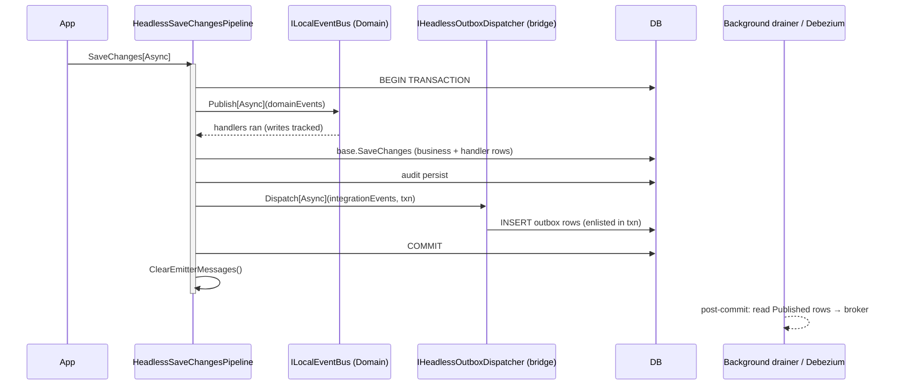
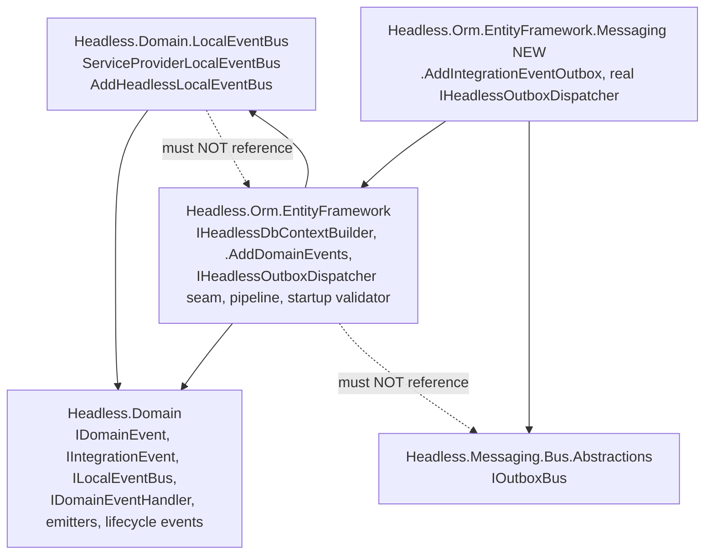

# refactor: EF event-dispatch seam → domain/integration split with real defaults

## Summary

Replace `IHeadlessMessageDispatcher` — a 4-method (local/distributed × sync/async) EF-only interface whose only registered default is the fail-fast `ThrowHeadlessMessageDispatcher` — with a two-tier design that matches the canonical eShop/ABP/CAP pattern and **ships real defaults**:

- **Domain events** (in-process, in-transaction) are dispatched by the pipeline calling `ILocalEventBus` directly — a Domain-layer contract with a shipping default (`ServiceProviderLocalEventBus`). No EF-specific interface for this tier.
- **Integration events** (cross-process) are written to the transactional outbox by a single small seam, `IHeadlessOutboxDispatcher`, whose **real** default lives in a new bridge package `Headless.Orm.EntityFramework.Messaging` and calls `IOutboxBus.PublishAsync` (always pub/sub).
- Contracts are renamed to DDD vocabulary (`IDomainEvent` / `IIntegrationEvent` / `ILocalEventBus`) so the transaction semantics are self-documenting.
- **DI is a discoverable builder chain** — `AddHeadlessDbContextServices(...).AddDomainEvents().AddIntegrationEventOutbox()` — mirroring `AddAuthentication().AddJwtBearer()`; satellite packages light up their `.AddX()` as you reference them.
- The save-time throw is replaced by **host-startup validation** that names the exact missing `.AddX()` call.

The transactional outbox internals (CAP-style ADO.NET, transaction-enlisted, post-commit drainer) are correct and **out of scope** — this change only reshapes the producer-side seam and the defaults.

---

## Problem Frame

`Headless.Orm.EntityFramework` exposes `IHeadlessMessageDispatcher` with four methods and registers `ThrowHeadlessMessageDispatcher` by default. Consequences:

1. **No real default.** Any entity that emits a message crashes `SaveChanges` at runtime unless the consumer hand-writes a dispatcher. The framework ships none, despite having all the pieces (`ILocalMessagePublisher` in Domain; `IOutboxBus` in Messaging).
2. **Conflated tiers.** In-process domain events and cross-process integration events have different transaction semantics but share one interface, forcing one implementer to handle both even when only one applies.
3. **Self-inflicted local friction.** The local tier needs no EF abstraction at all — `ILocalMessagePublisher` already lives in `Headless.Domain` (which EF references) with a shipping implementation.
4. **Hostile failure mode.** Failure surfaces at first message-emitting save (a user-facing 500), not at startup.
5. **Opaque names.** `ILocalMessage`/`IDistributedMessage` carry no hint of their transaction behavior.

**Settled approach** (validated against eShop, ABP, CAP, MassTransit, Wolverine; transaction-coordination and domain/integration prior art researched): the universal pattern is *in-transaction domain-event dispatch + outbox-row write, broker never touched inside the transaction, post-commit relay*. The Headless pipeline already orders the steps correctly and the outbox already enlists in the EF transaction (verified: `SqlServerDataStorage.StoreMessageAsync(..., dbContextTrans.GetDbTransaction())`). This plan only fixes the **seam shape** and the **defaults**.

---

## Scope Boundaries

**In scope:**
- Rename message contracts + emitters + lifecycle events to DDD vocabulary (Decision 1).
- `ILocalEventBus` gains a non-generic `Publish`/`PublishAsync(IDomainEvent)` overload; pipeline calls it directly for the local tier.
- New `IHeadlessOutboxDispatcher` distributed-only seam (flat message lists, `IDbContextTransaction`, sync+async).
- New bridge package `Headless.Orm.EntityFramework.Messaging` with the real default (→ `IOutboxBus`, always bus).
- Remove `IHeadlessMessageDispatcher`, `ThrowHeadlessMessageDispatcher`, and the `AddHeadlessMessageDispatcher<T>/factory/instance` trio.
- Startup validation replacing the save-time throw.
- Docs sync across `docs/llms/*` and affected READMEs.

**Out of scope:**
- Messaging outbox internals (CAP-style transaction model is correct — do not touch).
- Adding sync outbox APIs to Messaging (the bridge's sync path bridges to async internally).
- Bus-vs-queue routing for the aggregate-emit path (integration events are always bus; teams needing transactional queue enqueue call `IOutboxQueue` directly outside this path).
- Phase-enum / middleware-pipeline dispatch abstraction (YAGNI for two fixed phases).

### Deferred to Follow-Up Work
- CDC/Debezium is **documentation only** (Decision 5): note that because the producer only writes an outbox row, advanced users can point Debezium at the `Published` table instead of the in-process drainer. No code.
- A provider-neutral `Headless.Orm.Messaging.Abstractions` (for a future non-EF ORM) — revisit when a second ORM provider lands; not justified now.

---

## Key Technical Decisions

**KTD-1 — Split the tiers; local needs no EF interface.** The pipeline resolves `ILocalEventBus` (Domain) and calls it directly. Only the distributed tier gets an EF seam (`IHeadlessOutboxDispatcher`). Rationale: local dispatch is provider-agnostic and already has a shipping default; an EF interface for it is gratuitous. Mirrors ABP's `ILocalEventBus` living in core, not its EF package.

**KTD-2 — `ILocalEventBus` stays in `Headless.Domain`.** Do **not** move it to EF. It is a domain concern; moving it would force every non-EF consumer to depend on EF Core.

**KTD-3 — Rename to DDD vocabulary** (`IDomainEvent`/`IIntegrationEvent`/`ILocalEventBus` + emitters + lifecycle events). Greenfield, no compat layer. Makes in-transaction vs outbox semantics legible at the type level.

**KTD-4 — Non-generic local publish is additive.** Add `Publish(IDomainEvent)`/`PublishAsync(IDomainEvent, ct)` alongside the existing generic methods. Existing storage-repo callers (`PublishAsync(new EntityChangedEventData<T>(...))`) keep working. The non-generic implementation recovers the concrete handler type via `message.GetType()` → `MakeGenericType`/`MakeGenericMethod`, same reflection pattern as `ConsumeMiddlewarePipeline._DispatchAsync`. The pipeline (holding `IReadOnlyList<IDomainEvent>`) uses the non-generic path.

**KTD-5 — Integration events always route to `IOutboxBus`** (pub/sub). No markers, no type-map, no phase enum. A domain-emitted message is a past-tense fact → broadcast. Matches ABP `IDistributedEventBus` (pub/sub-only) and eShop integration events.

**KTD-6 — Keep `IDbContextTransaction` on the distributed seam.** It is load-bearing: the bridge enlists the outbox INSERT in that exact transaction (verified CAP path). Do not "simplify" it away.

**KTD-7 — Flatten the dispatch contract to flat message lists.** Verified the `Emitter` reference is used only by `ClearEmitterMessages()`. The collector (`HeadlessSaveEntryContext`) retains the emitter wrappers for clearing; the seam receives `IReadOnlyList<IIntegrationEvent>`. Removes two public records from the contract surface.

**KTD-8 — Bridge owns the *Messaging* coupling; EF may reference the Domain-layer local bus.** The purity rule is specifically "EF must not reference `Headless.Messaging.*`." `Headless.Orm.EntityFramework` references `Headless.Domain` and (added for the builder, KTD-13) `Headless.Domain.LocalEventBus` — both Domain-layer, no messaging. `Headless.Orm.EntityFramework.Messaging` references EF + `Headless.Messaging.Bus.Abstractions` and supplies the real `IHeadlessOutboxDispatcher`. Verified Messaging ↛ ORM and ORM ↛ Messaging today; the bridge remains the only ORM↔Messaging edge.

**KTD-9 — Startup validation, not save-time throw.** Register an `IHostedLifecycleService` (mirror `HeadlessTenancyStartupValidator`) that fails fast at host start if message-emitting entities are configured but the required bus/dispatcher is unregistered. Removes `ThrowHeadlessMessageDispatcher`.

**KTD-10 — Generic-T recovery via cached compiled invoker.** The bridge turns `IIntegrationEvent` → `IOutboxBus.PublishAsync<TConcrete>` using `MakeGenericMethod` cached per runtime type (prior art: `ConsumeMiddlewarePipeline._CompiledTypedInvokers`). The distributed **sync** path calls the async publish via `GetAwaiter().GetResult()` inside the bridge only.

**KTD-11 — `ILocalEventBus` must be registered `Scoped`, and handlers resolve from the save scope.** (Antigravity finding.) The current `ServiceProviderLocalMessagePublisher` is registered `Singleton` capturing the root `IServiceProvider`. That is incorrect for the new design: Tier-1 domain-event handlers must write into the **same** save transaction, which requires resolving the **same scoped `DbContext`**. A root-resolved handler would get a different `DbContext` and its writes would silently fall outside the transaction — breaking the core in-transaction invariant. Register `ILocalEventBus` as `Scoped`; the pipeline resolves it from its per-save scope so handlers share the scoped `DbContext`. Also fixes the latent captive-dependency/scoped-handler hazard.

**KTD-12 — Preserve exact-type handler resolution; contravariant traversal is out of scope.** (Antigravity finding.) MS.DI `GetServices<ILocalMessageHandler<T>>()` does not resolve base-type handlers for a derived event — this is the *existing* behavior of the generic path. The new non-generic `PublishAsync(IDomainEvent)` must resolve handlers for the **exact runtime type only**, matching the generic path bit-for-bit (no regression, no expansion). Adding event-hierarchy traversal would change dispatch semantics and is deliberately deferred — this is a rename/seam refactor, not a behavior change.

**KTD-13 — Builder-chain DI experience.** (User decision.) `AddHeadlessDbContextServices(...)` returns an `IHeadlessDbContextBuilder` (new type in `Headless.Orm.EntityFramework`, exposing `IServiceCollection Services`). Satellite packages add discoverable, IntelliSense-surfaced extension methods on it, mirroring `AddAuthentication().AddJwtBearer()`:
- `.AddDomainEvents()` — lives in `Headless.Orm.EntityFramework` (which references `Headless.Domain.LocalEventBus`), registers `ServiceProviderLocalEventBus` as `Scoped` (KTD-11).
- `.AddIntegrationEventOutbox(...)` — lives in the bridge package, registers the real `IHeadlessOutboxDispatcher`; carries the three options overloads (`IConfiguration`/`Action<TOptions>`/`Action<TOptions,IServiceProvider>`) → `_AddCore`.

Target consumer experience:
```
services
    .AddHeadlessDbContextServices(o => o.UseGuardTenantWrites())
    .AddDomainEvents()             // reference Headless.Orm.EntityFramework
    .AddIntegrationEventOutbox();  // reference the bridge package
```
Domain events are kept an **explicit** builder call (not default-on) so registration intent is visible and the startup validator can name the exact missing call (KTD-9). The provider-agnostic `Headless.Domain.LocalEventBus` package keeps its plain `services.AddHeadlessLocalEventBus()` for non-EF consumers and does **not** reference EF; the builder method `.AddDomainEvents()` is the EF-side wrapper around it.

---

## High-Level Technical Design

### Save-time sequence (after change)



### Package dependency shape



### Seam: before → after

```text
BEFORE  IHeadlessMessageDispatcher (EF):
  PublishLocalAsync(IReadOnlyList<EmitterLocalMessages>, IDbContextTransaction, ct)
  PublishLocal(IReadOnlyList<EmitterLocalMessages>, IDbContextTransaction)
  EnqueueDistributedAsync(IReadOnlyList<EmitterDistributedMessages>, IDbContextTransaction, ct)
  EnqueueDistributed(IReadOnlyList<EmitterDistributedMessages>, IDbContextTransaction)
  default = ThrowHeadlessMessageDispatcher (throws at save)

AFTER
  local  → ILocalEventBus (Domain, called directly by pipeline):
             Publish(IDomainEvent) + PublishAsync(IDomainEvent, ct)   [non-generic, additive]
  distrib → IHeadlessOutboxDispatcher (EF seam):
             Dispatch(IReadOnlyList<IIntegrationEvent>, IDbContextTransaction)
             DispatchAsync(IReadOnlyList<IIntegrationEvent>, IDbContextTransaction, ct)
             real default in bridge → IOutboxBus.PublishAsync (always bus)
  DI       → AddHeadlessDbContextServices(...) returns IHeadlessDbContextBuilder:
             .AddDomainEvents()            (EF)     → ILocalEventBus scoped
             .AddIntegrationEventOutbox()  (bridge) → IHeadlessOutboxDispatcher
  missing registration → fail at host startup, naming the exact .AddX() to add
```

---

## Output Structure (new bridge package)

```text
src/Headless.Orm.EntityFramework.Messaging/
  Headless.Orm.EntityFramework.Messaging.csproj   (Sdk=Headless.NET.Sdk, net10.0)
  Setup.cs                                          (SetupEntityFrameworkMessaging, 3 overloads → _AddCore)
  OutboxIntegrationEventDispatcher.cs              (IHeadlessOutboxDispatcher → IOutboxBus)
  IntegrationEventPublishInvokerCache.cs           (cached MakeGenericMethod invokers)
  README.md
tests/Headless.Orm.EntityFramework.Messaging.Tests.Integration/
  Headless.Orm.EntityFramework.Messaging.Tests.Integration.csproj
  (composite EF + messaging Testcontainers fixture + conformance tests)
```

---

## Implementation Units

### U1. Rename core contracts in `Headless.Domain`

**Goal:** Rename the message contracts, emitters, and lifecycle events to DDD vocabulary; this is the foundation every later unit depends on.

**Dependencies:** none.

**Files:**
- `src/Headless.Domain/Messages/Local/ILocalMessage.cs` → `IDomainEvent` (rename file + type)
- `src/Headless.Domain/Messages/Distributed/IDistributedMessage.cs` → `IIntegrationEvent`
- `src/Headless.Domain/Messages/Local/ILocalMessageEmitter.cs` → `IDomainEventEmitter` (methods: `AddDomainEvent`/`ClearDomainEvents`/`GetDomainEvents`)
- `src/Headless.Domain/Messages/Distributed/IDistributedMessageEmitter.cs` → `IIntegrationEventEmitter` (methods: `AddIntegrationEvent`/`ClearIntegrationEvents`/`GetIntegrationEvents`)
- `src/Headless.Domain/Messages/Local/ILocalMessagePublisher.cs` → `ILocalEventBus.cs` (rename type; add non-generic signatures `Publish(IDomainEvent)` + `PublishAsync(IDomainEvent, CancellationToken)` alongside the existing generic ones)
- `src/Headless.Domain/Messages/Local/ILocalMessageHandler.cs` → `IDomainEventHandler<T>` (Antigravity finding #3 — rename the handler interface to match; keep the `in TMessage` contravariance as-is per KTD-12)
- `LocalEventHandlerOrderAttribute` → `DomainEventHandlerOrderAttribute` (Antigravity finding #3 — find its file and rename)
- Distributed side: confirm there is **no** `IDistributedMessageHandler` to rename (integration-event consumers live in the messaging layer and consume by message name, not `IDistributedMessage`); if one exists, rename to `IIntegrationEventHandler`.
- `src/Headless.Domain/Domain/IAggregateRoot.cs` (implements both emitters; rename members)
- `src/Headless.Domain/Events/EntityEventData.cs`, `EntityChangedEventData.cs`, `EntityCreatedEventData.cs`, `EntityUpdatedEventData.cs`, `EntityDeletedEventData.cs` (these implement `ILocalMessage` → `IDomainEvent`)

**Approach:** Pure rename + interface widening (additive non-generic overload signatures only; implementation lands in U2). Keep folder structure `Messages/Local` and `Messages/Distributed` or rename to `Events/Domain` and `Events/Integration` — decide during execution; folder rename is cosmetic and optional.

**Patterns to follow:** existing one-type-per-file Domain layout; `// Copyright` header.

**Test scenarios:** `Test expectation: none -- pure rename of contracts; behavioral coverage lands in U2/U7.` Build must compile after downstream units; this unit alone will not.

**Verification:** `Headless.Domain` compiles; renamed symbols present; non-generic `ILocalEventBus` overloads declared.

---

### U2. `ServiceProviderLocalEventBus` + non-generic publish implementation

**Goal:** Rename the local-bus implementation and implement the non-generic `Publish`/`PublishAsync(IDomainEvent)` overloads via runtime-type handler resolution. Decide the package rename.

**Dependencies:** U1.

**Files:**
- `src/Headless.Domain.LocalPublisher/ServiceProviderLocalMessagePublisher.cs` → `ServiceProviderLocalEventBus.cs`
- `src/Headless.Domain.LocalPublisher/Setup.cs` (registration → `ILocalEventBus`)
- Package rename: `Headless.Domain.LocalPublisher` → `Headless.Domain.LocalEventBus` (csproj rename, `headless-framework.slnx` path, all `ProjectReference`s)

**Approach:** Non-generic `PublishAsync(IDomainEvent e, ct)` does `e.GetType()` → resolves `IDomainEventHandler<TConcrete>` for the **exact runtime type only** (KTD-12 — parity with the generic path, no contravariant base-type traversal) via a cached `MakeGenericMethod` invoker (prior art: `src/Headless.Messaging.Core/Internal/ConsumeMiddlewarePipeline.cs` `_DispatchAsync` + `_CompiledTypedInvokers`). Sync `Publish(IDomainEvent)` mirrors via the existing `WaitAndUnwrapException` path. Keep generic overloads (additive, KTD-4).

**Registration lifetime (KTD-11 — critical):** change the DI registration in `Setup.cs` from `Singleton` to **`Scoped`**. The pipeline resolves `ILocalEventBus` from its per-save scope so domain-event handlers share the scoped `DbContext` and their writes join the save transaction. Resolve handlers from the scoped provider, not a captured root provider.

**Packaging (KTD-13):** `Headless.Domain.LocalEventBus` stays **provider-agnostic** — it must **not** reference EF. Keep its plain `services.AddHeadlessLocalEventBus()` (scoped registration) for non-EF consumers. The EF-side builder method `.AddDomainEvents()` (U4) wraps this registration; EF references this package, not the reverse.

**Patterns to follow:** `ConsumeMiddlewarePipeline` cached-invoker reflection; existing handler-ordering logic in the publisher.

**Test suite design:** unit tests in `tests/Headless.Domain.LocalPublisher.Tests.Unit` (rename project to match package).

**Test scenarios:**
- Non-generic `PublishAsync(IDomainEvent)` resolves and invokes the correct `IDomainEventHandler<TConcrete>` for a runtime-typed event.
- Non-generic path honors `DomainEventHandlerOrderAttribute` ordering identically to the generic path.
- Multiple handlers all run; aggregated exception thrown when >1 fails (parity with generic path).
- Sync `Publish(IDomainEvent)` invokes handlers synchronously and surfaces handler exceptions.
- Invoker cache returns the same compiled delegate for repeated calls with the same runtime type.
- No registered handler for the event type → no-op, no throw.
- **Exact-type-only (KTD-12):** a handler registered for a base event type is **not** invoked for a derived event — parity with the generic path; documents the intentional non-traversal.
- **Scoped resolution (KTD-11):** a `Scoped` handler resolved during publish shares the ambient scope's `DbContext` instance (assert same instance), proving handler writes can join the save transaction.

**Verification:** unit tests pass; package + test project renamed and attached to slnx.

---

### U3. Propagate rename through storage modules

**Goal:** Update every emitter/repository/cache-invalidator referencing the renamed symbols in the storage modules.

**Dependencies:** U1, U2.

**Files (rename references only):**
- `src/Headless.Features.Core/Setup.cs`, `src/Headless.Features.Core/Values/FeatureValueCacheItemInvalidator.cs`, `src/Headless.Features.Storage.{EntityFramework,PostgreSql,SqlServer}/EfFeatureValueRecordRecordRepository.cs`
- `src/Headless.Permissions.Core/Setup.cs`, `Grants/PermissionGrantCacheItemInvalidator.cs`, `src/Headless.Permissions.Storage.{EntityFramework,PostgreSql,SqlServer}/EfPermissionGrantRepository.cs`
- `src/Headless.Settings.Core/Setup.cs`, `Values/SettingValueCacheItemInvalidator.cs`, `src/Headless.Settings.Storage.{EntityFramework,PostgreSql,SqlServer}/EfSettingValueRecordRepository.cs`

**Approach:** Mechanical: `ILocalMessage`→`IDomainEvent`, `ILocalMessagePublisher`→`ILocalEventBus`, `EntityChangedEventData<T>` unchanged (only its base interface renamed). Repos keep their generic `PublishAsync(new EntityChangedEventData<T>(...))` calls (KTD-4 additive).

**Patterns to follow:** existing repo `localPublisher.PublishAsync(...)` call shape.

**Test scenarios:** `Test expectation: none -- mechanical rename; behavior covered by existing module integration tests in U7.`

**Verification:** all three storage modules (Core + 3 providers each) compile against renamed Domain contracts.

---

### U4. Redesign the EF seam + pipeline wiring + builder

**Goal:** Remove `IHeadlessMessageDispatcher`/`ThrowHeadlessMessageDispatcher`/registration trio; introduce `IHeadlessOutboxDispatcher`; call `ILocalEventBus` directly for the local tier; flatten the distributed contract; introduce the `IHeadlessDbContextBuilder` and the `.AddDomainEvents()` builder method (KTD-13).

**Dependencies:** U1, U2.

**Files:**
- Delete/replace `src/Headless.Orm.EntityFramework/Contexts/Messaging/IHeadlessMessageDispatcher.cs` → new `IHeadlessOutboxDispatcher.cs` (`Dispatch(IReadOnlyList<IIntegrationEvent>, IDbContextTransaction)` + `DispatchAsync(..., ct)`)
- `src/Headless.Orm.EntityFramework/Contexts/Messaging/EmitterMessages.cs` (keep `EmitterDomainEvents`/`EmitterIntegrationEvents` internal collection records for the collector/clearing; remove them from the public seam)
- `src/Headless.Orm.EntityFramework/Contexts/Runtime/HeadlessSaveChangesPipeline.cs` (constructor: inject `ILocalEventBus` + `IHeadlessOutboxDispatcher`; swap call sites — async local ~L223 → `localEventBus.PublishAsync(domainEvents, ct)` per event or batch; async distributed ~L247 → `outboxDispatcher.DispatchAsync(integrationEvents, transaction, ct)`; sync local ~L296; sync distributed ~L305)
- `src/Headless.Orm.EntityFramework/Contexts/Processors/HeadlessMessageCollectorSaveEntryProcessor.cs`, `HeadlessLocalEventSaveEntryProcessor.cs`, `IHeadlessSaveEntryProcessor.cs` (rename; `ClearEmitterMessages` clears via retained emitters)
- `src/Headless.Orm.EntityFramework/IHeadlessDbContextBuilder.cs` (new — `IServiceCollection Services { get; }`) + internal default impl
- `src/Headless.Orm.EntityFramework/SetupEntityFramework.cs` (remove `TryAddScoped<IHeadlessMessageDispatcher, ThrowHeadlessMessageDispatcher>()` and the three `AddHeadlessMessageDispatcher` overloads; `AddHeadlessDbContextServices(...)` now **returns `IHeadlessDbContextBuilder`**; add `.AddDomainEvents()` builder extension that calls `AddHeadlessLocalEventBus()` from U2)
- `src/Headless.Orm.EntityFramework/Headless.Orm.EntityFramework.csproj` (add `ProjectReference` → `Headless.Domain.LocalEventBus`)

**Approach:** Pipeline flattens collected domain events into `IReadOnlyList<IDomainEvent>` and integration events into `IReadOnlyList<IIntegrationEvent>` (dedup snapshot already done in the collector). Local: loop and call `ILocalEventBus.Publish[Async]` per event (non-generic). Distributed: single `IHeadlessOutboxDispatcher.Dispatch[Async]` call. The collector keeps emitter references in `HeadlessSaveEntryContext` so `ClearEmitterMessages()` still works (KTD-7). No default `IHeadlessOutboxDispatcher` registered here (the bridge provides it; absence handled by U5). `AddHeadlessDbContextServices` returns a concrete `IHeadlessDbContextBuilder` wrapping the `IServiceCollection`; `.AddDomainEvents()` is an extension on that builder (KTD-13) registering the scoped `ILocalEventBus`. **Returning a builder is a breaking signature change** — confirm existing `AddHeadlessDbContextServices(...)` call sites still compile (it returned `IServiceCollection`; a builder that is implicitly usable or exposes `.Services` may be needed for chained `IServiceCollection` calls — decide whether the builder also returns to `IServiceCollection` via a terminal or implicit conversion).

**Patterns to follow:** existing pipeline transaction/audit ordering; `extension(IServiceCollection)` Setup shape; builder-returning `Add*` pattern à la `AddAuthentication`.

**Test suite design:** runtime/extensibility behavior covered by `tests/Headless.Orm.EntityFramework.Tests.Integration` + `tests/Headless.Orm.Tests.Harness` (U7).

**Test scenarios:**
- Domain events dispatched **before** `base.SaveChanges`, in-transaction; a throwing handler rolls back the whole save (no business rows committed). *Covers the in-transaction invariant.*
- Integration events passed to `IHeadlessOutboxDispatcher.DispatchAsync` **after** persist, **before** commit, with the active `IDbContextTransaction`.
- Sync `SaveChanges` path routes through `Publish` (local) and `Dispatch` (distributed) equivalently.
- `ClearEmitterMessages()` still clears each emitter after successful commit (no stale messages on re-save).
- No domain events / no integration events → corresponding tier is skipped (no call).
- Seam receives flat lists (no `Emitter` reference leaked to the dispatcher).
- `AddHeadlessDbContextServices(...)` returns an `IHeadlessDbContextBuilder` whose `Services` is the same `IServiceCollection`.
- `.AddDomainEvents()` registers `ILocalEventBus` as `Scoped` and returns the builder for chaining.

**Verification:** EF project compiles without `IHeadlessMessageDispatcher`; pipeline tests in U7 pass; `dotnet build --no-incremental` clean (0 warnings).

---

### U5. Host-startup validation (replaces save-time throw)

**Goal:** Fail at host startup — not at first save — when message-emitting entities are configured but the required bus is unregistered.

**Dependencies:** U4.

**Files:**
- `src/Headless.Orm.EntityFramework/` new `HeadlessEventDispatchStartupValidator.cs` (`IHostedLifecycleService`)
- `src/Headless.Orm.EntityFramework/SetupEntityFramework.cs` (register the validator)

**Approach:** Mirror `src/Headless.MultiTenancy/HeadlessTenancyStartupValidator.cs` / `src/Headless.Api.ServiceDefaults/HeadlessServiceDefaultsValidationStartupFilter.cs`. In `StartingAsync`, prefer **DI-descriptor / model-metadata detection over constructing a live `DbContext`** (Antigravity finding #2): if a `DbContext` must be inspected, resolve it inside an **explicit `IServiceScopeFactory.CreateScope()`** rather than from the root, and use `IDbContextFactory<TDbContext>` where available so construction does not assume an HTTP request scope. Detection: if any mapped entity type implements `IIntegrationEventEmitter` but no `IHeadlessOutboxDispatcher` is registered → throw `InvalidOperationException` naming the exact fix: reference the bridge package and call `.AddIntegrationEventOutbox()`; if any implements `IDomainEventEmitter` but no `ILocalEventBus` is registered → throw naming `.AddDomainEvents()` (KTD-13 — the message must name the builder call, not just the package). Keep messages actionable (name the missing package + the `Add…` call). Register a **typed** `HeadlessEventDispatchStartupValidator<TDbContext>` per `AddHeadlessDbContext<TDbContext>` registration rather than one global scanner, so each context is validated against its own model. Document that `DbContext` constructor dependencies must tolerate initialization outside an HTTP request.

**Patterns to follow:** `IHostedLifecycleService.StartingAsync` validator with `[LoggerMessage]` diagnostics (partial Log class at file bottom).

**Test suite design:** integration tests in `tests/Headless.Orm.EntityFramework.Tests.Integration` (host bootstrap with/without the bridge).

**Test scenarios:**
- Host with integration-event-emitting entity + no `IHeadlessOutboxDispatcher` → startup throws; message names `.AddIntegrationEventOutbox()` + the bridge package.
- Host with domain-event-emitting entity + no `ILocalEventBus` → startup throws; message names `.AddDomainEvents()`.
- Host with both builder calls made → starts cleanly.
- Host with no message-emitting entities + neither registered → starts cleanly (no false positive).
- Error lists all failures at once (not first-only), matching the tenancy validator pattern.

**Verification:** validation fires at `StartingAsync` before request handling; tests pass.

---

### U6. Bridge package `Headless.Orm.EntityFramework.Messaging`

**Goal:** Ship the real `IHeadlessOutboxDispatcher` that writes integration events to the outbox via `IOutboxBus`, enlisted in the save transaction.

**Dependencies:** U4.

**Files (new):**
- `src/Headless.Orm.EntityFramework.Messaging/Headless.Orm.EntityFramework.Messaging.csproj` (`Sdk=Headless.NET.Sdk`, `net10.0`; `ProjectReference` → `Headless.Orm.EntityFramework`, `Headless.Messaging.Bus.Abstractions`, `Headless.Domain`)
- `src/Headless.Orm.EntityFramework.Messaging/OutboxIntegrationEventDispatcher.cs`
- `src/Headless.Orm.EntityFramework.Messaging/IntegrationEventPublishInvokerCache.cs`
- `src/Headless.Orm.EntityFramework.Messaging/Setup.cs` (`.AddIntegrationEventOutbox(...)` builder extension on `IHeadlessDbContextBuilder` — 3 overloads `IConfiguration`/`Action<TOptions>`/`Action<TOptions,IServiceProvider>` → `_AddIntegrationEventOutboxCore`, `TryAdd`; returns the builder for chaining)
- `src/Headless.Orm.EntityFramework.Messaging/README.md`
- `headless-framework.slnx` (attach under `/Orm/Src/` or new folder)

**Approach:** `.AddIntegrationEventOutbox()` is a builder extension (KTD-13) registering `OutboxIntegrationEventDispatcher` as the `IHeadlessOutboxDispatcher`. `OutboxIntegrationEventDispatcher.DispatchAsync(events, txn, ct)` ensures the outbox enlists in `txn` (establish/confirm the ambient `IOutboxTransaction` bound to `txn.GetDbTransaction()`), then for each `IIntegrationEvent` calls `IOutboxBus.PublishAsync<TConcrete>` via the cached `MakeGenericMethod` invoker (KTD-10; prior art `ConsumeMiddlewarePipeline`). Sync `Dispatch` calls `DispatchAsync(...).GetAwaiter().GetResult()` — the single contained sync-over-async (KTD-6/KTD-10). `IOutboxBus` has no non-generic overload (verified), so the invoker cache is required.

**Patterns to follow:** `src/Headless.Blobs.Azure/Setup.cs` three-overload `_AddCore`; `ConsumeMiddlewarePipeline` invoker cache; `Headless.Settings.Storage.EntityFramework.csproj` bridge csproj shape; `AddAuthentication().AddX()` builder-extension idiom.

**Test suite design:** integration (U8) owns transaction/enlistment behavior; a small unit test here covers the invoker cache + routing.

**Test scenarios (unit):**
- Invoker cache resolves `PublishAsync<TConcrete>` for a runtime-typed `IIntegrationEvent` and caches it.
- Each event in the list is published exactly once, in order.
- Sync `Dispatch` produces the same outbox writes as `DispatchAsync`.
- Empty list → no `IOutboxBus` calls.
- `.AddIntegrationEventOutbox()` registers `IHeadlessOutboxDispatcher` (via `TryAdd`) and returns the builder for chaining; all three options overloads wire the same core.

**Verification:** bridge compiles; references only EF + Bus.Abstractions + Domain; unit tests pass.

---

### U7. Update test harness + existing tests for the rename and new seam

**Goal:** Update `Headless.Orm.Tests.Harness` and all affected test projects to the renamed symbols and the new seam; replace `RecordingHeadlessMessageDispatcher`.

**Dependencies:** U1–U6.

**Files:**
- `tests/Headless.Orm.Tests.Harness/Fixtures/RecordingHeadlessMessageDispatcher.cs` → recording `IHeadlessOutboxDispatcher` (+ a recording `ILocalEventBus` if harness asserts local dispatch), `Messages/HarnessLocalMessage.cs` → `HarnessDomainEvent`, `Messages/HarnessDistributedMessage.cs` → `HarnessIntegrationEvent`, `Fixtures/{HarnessDbContext,IHarnessDbContext}.cs`, `Tests/HeadlessDbContextSaveChangesTestBase.cs`, `Fixtures/PostgreSqlDbContextTestFixture.cs`
- `tests/Headless.Orm.EntityFramework.Tests.Integration/*` (`HeadlessDbContextRuntimeExtensibilityTests.cs`, `HeadlessDbContextTests.cs`, `Fixture/TestHeadlessDbContext.cs`, `Fixture/TestDistributedMessage.cs`, `Fixture/TenantWriteGuardDbContextTestFixture.cs`)
- `tests/Headless.AuditLog.Storage.EntityFramework.Tests.Integration/*` (`Fixture/EmittingOrder.cs`, `Fixture/ThrowingPublishAuditTestDbContext.cs`, `AuditLogIntegrationTests.cs`)
- `tests/Headless.Identity.Storage.EntityFramework.Tests.Integration/Fixture/TestIdentityDbContext.cs`
- `tests/Headless.Domain.Tests.Unit/Events/EntityEventDataTests.cs`
- `tests/Headless.Features.Tests.Integration`, `tests/Headless.Permissions.Tests.{Integration,Unit}`, `tests/Headless.Settings.Tests.{Integration,Unit}` (`ServiceProviderLocalMessagePublisher` refs, cache-invalidator tests)

**Approach:** Mechanical rename + replace the throwing/recording dispatcher fixtures with the new seam. The AuditLog "throwing publish" fixture now implements `IHeadlessOutboxDispatcher` (throwing) to keep its discard-on-failure coverage.

**Test scenarios:** existing scenarios preserved; assert the renamed lifecycle events (`EntityCreated/Updated/Deleted/Changed`) still fire. No new behavior beyond U4/U5/U6.

**Verification:** `make test-integration` and unit suites green across all renamed projects.

---

### U8. Bridge integration tests (new project)

**Goal:** Prove the bridge writes outbox rows atomically with the save and never publishes to the broker inside the transaction.

**Dependencies:** U6.

**Files (new):**
- `tests/Headless.Orm.EntityFramework.Messaging.Tests.Integration/Headless.Orm.EntityFramework.Messaging.Tests.Integration.csproj` (`Sdk=Headless.NET.Sdk.Test`, `OutputType=Exe`, `xunit.v3.mtp-v2`)
- composite Testcontainers fixture (EF DbContext + a real `IOutboxBus` storage provider, e.g. PostgreSql) + conformance tests

**Approach:** Drive a real save that emits integration events; assert outbox `Published` rows exist after commit and are written inside the save transaction; assert a rolled-back save leaves no outbox rows; assert no broker dispatch happens before commit (the drainer/relay is the post-commit actor). Reuse `Headless.Orm.Tests.Harness` + messaging storage fixtures.

**Test suite design:** integration-only; extends harness fixtures per the repo's harness rule.

**Test scenarios:**
- Save emitting integration events → matching `Published` outbox rows exist post-commit, with correct payload/type. *Covers the outbox-write invariant.*
- Save that throws after dispatch (forced rollback) → zero outbox rows (atomic with business data).
- Outbox write uses the save's transaction (no second connection): rows invisible to a separate connection until commit.
- Sync `SaveChanges` path produces identical outbox rows to async.
- Multiple integration events of different concrete types each routed via the correct `PublishAsync<T>` (invoker cache correctness end-to-end).

**Verification:** integration tests pass against Testcontainers (Docker required).

---

### U9. Documentation sync

**Goal:** Keep agent-facing docs and READMEs in lockstep with the new design per `docs/authoring/AUTHORING.md`.

**Dependencies:** U1–U8.

**Files:**
- `docs/llms/orm.md` (seam redesign, bridge package, startup validation, CDC note), `docs/llms/core.md`, `docs/llms/index.md` (renamed contracts)
- `src/Headless.Domain/README.md`, `src/Headless.Domain.LocalEventBus/README.md` (renamed), `src/Headless.Orm.EntityFramework/README.md`, new `src/Headless.Orm.EntityFramework.Messaging/README.md`
- storage-module READMEs that mention local publishing (Features/Permissions/Settings) if they reference the renamed symbols

**Approach:** Replace the `IHeadlessMessageDispatcher` / `ThrowHeadlessMessageDispatcher` / `AddHeadlessMessageDispatcher` narrative with: the **builder-chain DI experience** (`AddHeadlessDbContextServices(...).AddDomainEvents().AddIntegrationEventOutbox()`) as the headline setup snippet (KTD-13); domain events via `ILocalEventBus`; integration events via the bridge package; the two-tier transaction sequence; the startup-validation behavior (and the actionable error messages); and the CDC advanced-deployment note (Decision 5). Run the AUTHORING.md drift checks.

**Test scenarios:** `Test expectation: none -- docs.`

**Verification:** docs build/lint per repo tooling; both surfaces (docs/llms + README) consistent; no stale references to removed types (grep clean).

---

## Sequencing & Phases

- **Phase 1 (foundation):** U1 → U2 → U3 (rename ripples; repo compiles on renamed contracts).
- **Phase 2 (seam):** U4 → U5 (EF seam + startup validation; EF compiles with no default dispatcher).
- **Phase 3 (default):** U6 → U8 (bridge package + its integration tests).
- **Phase 4 (tests + docs):** U7 (cross-project test updates) can begin after U4 and finalize after U6; U9 last.

Commit boundaries: each unit is an atomic commit. U1–U3 may need to land together to keep the tree buildable (rename touches public contracts across packages); land Phase 1 as a tight sequence, then Phase 2+ independently.

---

## Risks & Mitigations

- **R1 — Rename breaks the build mid-sequence.** The contract rename (U1) won't compile until consumers (U2/U3) follow. *Mitigation:* land Phase 1 as a contiguous set; run `dotnet build --no-incremental` after U3 before proceeding.
- **R2 — Sync-over-async in the bridge.** `Dispatch` blocking on `DispatchAsync` risks deadlock under a sync context **and thread-pool starvation under heavy sync `SaveChanges` load with integration events** (Antigravity finding #5). *Mitigation:* framework targets ASP.NET Core (no sync context, deadlock-safe); contain the single `GetAwaiter().GetResult()` in the bridge; document that the **async** save path is recommended when emitting integration events and that the sync path can starve the thread pool at scale; cover the sync path in U8. Adding a sync `IOutboxBus` API is explicitly out of scope (user decision).
- **R3 — Reflection cost for generic-T recovery.** Per-event `MakeGenericMethod` is slow. *Mitigation:* cache compiled invokers per runtime type (KTD-10), proven in `ConsumeMiddlewarePipeline`.
- **R4 — Outbox enlistment subtlety.** The bridge must ensure `IOutboxBus.PublishAsync` enlists in the *save* transaction, not a fresh one. *Mitigation:* U8 asserts atomicity (rollback → zero rows; rows invisible cross-connection pre-commit); verify the ambient `IOutboxTransaction` binding to `txn.GetDbTransaction()`.
- **R5 — Startup validator false positives/negatives.** Detecting "entity can emit integration events" from the model may be imprecise. *Mitigation:* key off mapped entity types implementing `IIntegrationEventEmitter`; U5 covers the no-false-positive case.
- **R6 — Package rename churn** (`Headless.Domain.LocalPublisher` → `.LocalEventBus`). *Mitigation:* update slnx + all `ProjectReference`s in U2; grep for the old package id before finalizing.
- **R7 — `AddHeadlessDbContextServices` return-type change** from `IServiceCollection` → `IHeadlessDbContextBuilder` (KTD-13) breaks any caller that continues a `.AddX()` chain expecting `IServiceCollection`. *Mitigation:* audit existing call sites in U4; give `IHeadlessDbContextBuilder` an implicit conversion to / `.Services` accessor for `IServiceCollection` so existing chains keep compiling; greenfield (no external consumers) limits blast radius to in-repo call sites.
- **R8 — EF → `Headless.Domain.LocalEventBus` reference** could be read as eroding the purity boundary. *Mitigation:* the boundary is specifically "no `Headless.Messaging.*`" (KTD-8); LocalEventBus is Domain-layer with no messaging. Add an architecture-test/assertion (if one exists in the repo) or a note that EF must never gain a `Headless.Messaging.*` reference.

---

## Verification (overall)
- `dotnet build --no-incremental -v:minimal` clean across all touched projects (0 warnings — CI treats warnings as errors).
- Unit suites: Domain.LocalEventBus, Permissions/Settings unit tests green.
- Integration suites (Docker): Orm.EntityFramework, Orm.EntityFramework.Messaging, AuditLog/Identity storage, Features/Permissions/Settings green.
- Grep clean: no residual `IHeadlessMessageDispatcher`, `ThrowHeadlessMessageDispatcher`, `AddHeadlessMessageDispatcher`, `ILocalMessage`, `IDistributedMessage`, `ILocalMessagePublisher` outside intentional history.
- Docs: both doc surfaces updated; CDC note present.

## Open Questions (execution-time)
- Folder rename `Messages/Local` → `Events/Domain` (cosmetic) — decide in U1; not load-bearing.
- Exact startup-validation model inspection API (EF `IModel` walk vs DI marker) — resolve in U5 against the real model metadata.
- Whether the harness needs a recording `ILocalEventBus` in addition to the recording `IHeadlessOutboxDispatcher` — depends on which existing harness assertions touch local dispatch (resolve in U7).
