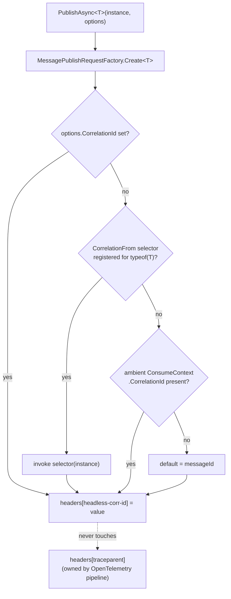
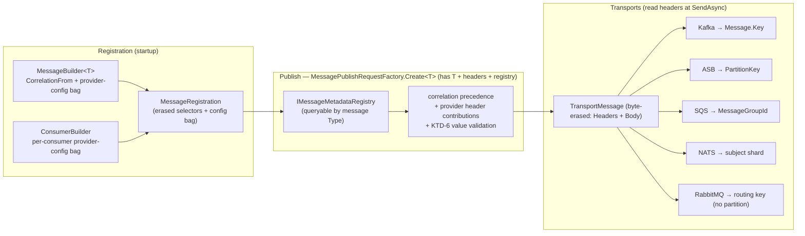

# feat(messaging): Cluster 0.4 — Layer 2 universal knobs + provider escape hatches

## Summary

Cluster 0.3 (#357, merged) shipped the `ForMessage<T>` builder with a `MessageName` stub. This plan adds the remaining message-level configuration surface: the universal `CorrelationFrom` Layer-2 knob with full 4-level correlation precedence, and the provider escape-hatch mechanism (`x.UseKafka(...)`, `x.UseRabbitMq(...)`, etc.) across five providers — RabbitMQ, Kafka, Azure Service Bus, AWS, NATS.

**Key deviation from spec §4 (owner-approved):** `PartitionBy` is **not** a Layer-2 universal knob. Partition affinity is provider-divergent (Kafka key ≠ ASB PartitionKey ≠ SQS MessageGroupId ≠ NATS subject), so it lives inside each provider's Layer-3 escape hatch. This deletes the "warn-at-startup on unsupported partition" acceptance criterion from the issue and retires the deferred `UnsupportedHintBehavior` enum's only v1 use case. See [Key Technical Decisions](#key-technical-decisions) and [Scope Boundaries](#scope-boundaries).

---

## Implementation Result

Completed on 2026-06-05 in commits:

- `9582a423c feat(messaging): add universal publish metadata core`
- `eafb3cd38 feat(messaging): add provider escape hatches`

Validation run during implementation:

- `make build-project PROJECT=src/Headless.Messaging.Core/Headless.Messaging.Core.csproj`
- `make test-project TEST_PROJECT=tests/Headless.Messaging.Core.Tests.Unit/Headless.Messaging.Core.Tests.Unit.csproj`
- `make test-project TEST_PROJECT=tests/Headless.Messaging.Kafka.Tests.Unit/Headless.Messaging.Kafka.Tests.Unit.csproj`
- `make test-project TEST_PROJECT=tests/Headless.Messaging.RabbitMq.Tests.Unit/Headless.Messaging.RabbitMq.Tests.Unit.csproj`
- `make test-project TEST_PROJECT=tests/Headless.Messaging.AzureServiceBus.Tests.Unit/Headless.Messaging.AzureServiceBus.Tests.Unit.csproj`
- `make test-project TEST_PROJECT=tests/Headless.Messaging.Aws.Tests.Unit/Headless.Messaging.Aws.Tests.Unit.csproj`
- `make test-project TEST_PROJECT=tests/Headless.Messaging.Nats.Tests.Unit/Headless.Messaging.Nats.Tests.Unit.csproj`
- `dotnet csharpier format` on changed C# files
- `git diff --check`

---

## Problem Frame

The builder from Cluster 0.3 can register consumers and override the message name, but it cannot:

1. **Derive a correlation ID from the message payload** (`CorrelationFrom`), nor resolve correlation through a defined precedence order when multiple sources exist.
2. **Carry provider-specific physical topology** (exchange type, routing key, partition key, isolation level, session/partition refinement) without coupling the framework core to any broker.

Both gaps must close without the core referencing any provider package, and without breaking the W3C `traceparent` trace-context propagation that rides the same publish path.

Three structural facts from the current code shape the whole design:

- `MessagePublishRequestFactory.Create<T>` (`src/Headless.Messaging.Core/Internal/IMessagePublishRequestFactory.cs:45`) is the **only** point holding both the compile-time `T` and the runtime instance. Correlation today is `options.CorrelationId ?? messageId` — levels 1 and 4 only.
- `TransportMessage` (`src/Headless.Messaging.Abstractions/TransportMessage.cs:30`) is byte-erased: `Headers` dictionary + `Body`, **no `T`**. A provider transport's `SendAsync` cannot invoke a `Func<T,string>` selector — `T` is gone by then. Any payload-derived value must be computed in the typed publish pipeline and travel as a header.
- No ambient `ConsumeContext` accessor exists. Tenant (`AsyncLocalCurrentTenantAccessor`) and outbox (`AsyncLocalOutboxTransactionAccessor`) have AsyncLocal accessors; correlation does not. Precedence level 3 (inherit correlation when publishing inside a handler) requires building one.

---

## Requirements

Traced from issue #358 and origin §4 (`MessageName`/`CorrelationFrom` Layer 2; escape-hatch invariants):

- **R1.** `x.CorrelationFrom(Func<T,string>)` selector reaches the outgoing message's correlation header for **all** providers (it is a single universal header).
- **R2.** Correlation precedence, highest wins: (1) explicit `PublishOptions.CorrelationId`; (2) `CorrelationFrom` selector; (3) ambient `ConsumeContext.CorrelationId`; (4) framework-generated default (`messageId`).
- **R3.** W3C `traceparent` is isolated from correlation logic — never read or written by the `CorrelationFrom` path. The two headers stay orthogonal.
- **R4.** Provider escape hatches (`x.UseRabbitMq`, `x.UseKafka`, `x.UseAzureServiceBus`, `x.UseAws`, `x.UseNats`) attach broker-specific physical config at **message scope** and **per-consumer scope**.
- **R5.** Escape-hatch config has two faces. **Producer-side** knobs (partition key, routing key — anything stamped on the outgoing wire) are **message-scope only**: the publisher has no consumer identity, so per-consumer override of a publish-time value is incoherent. **Consumer-side** knobs (consume isolation level, prefetch, subscription settings) attach per-consumer, and a per-consumer value overrides the message-scope value for the same provider. The "per-consumer overrides message-scope" rule (issue AC) applies to the consumer-side face.
- **R6.** An escape-hatch block compiles only when the matching provider package is referenced.
- **R7.** Partition affinity is honored end-to-end on the partition-capable providers (Kafka, ASB, AWS-SQS, NATS) — expressed through each provider's Layer-3 escape hatch, not a universal knob.
- **R8.** The escape-hatch invariant holds: a hatch refines **physical** topology but must not reinterpret the `OnBus`/`OnQueue` intent lane. Enforced by API design (the lane-flipping methods simply don't exist).
- **R9.** Layer-2 settings remain message-scope only — a consumer cannot override `MessageName` or `CorrelationFrom` (firm v1 constraint, origin §4).

---

## Key Technical Decisions

### KTD-1 — The Layer-2 admission test (governing principle)

A knob earns **Layer 2** only if it has a **single, identical wire mapping across every provider**. Anything provider-divergent goes to **Layer 3** (per-provider escape hatch).

| Knob | Wire mapping | Layer |
|---|---|---|
| `MessageName` | one logical identity header, same everywhere | 2 |
| `CorrelationFrom` | one correlation header (`headless-corr-id`), byte-identical | 2 |
| Partition affinity | Kafka `Message.Key` / ASB `PartitionKey` / SQS `MessageGroupId` / NATS subject — **divergent semantics** | 3 |
| Routing key, exchange type, isolation level, sessions | broker-shaped | 3 |

Rationale: the universal-partition abstraction leaks (SQS `MessageGroupId` is a FIFO *ordering* concern, not throughput partitioning — origin itself half-assigns it to the deferred `OrderingBy` knob). Owner decision: do not paper over the leak with a false-universal knob. This test is the rule for every future "L2 or L3?" question.

### KTD-2 — Selector invocation lives in `MessagePublishRequestFactory.Create<T>`, never in the transport

Because `TransportMessage` is byte-erased, every payload-derived value (`CorrelationFrom`, partition key, routing key) is computed while the typed instance is still in hand, and stamped as a header. Transports read their header at `SendAsync`.

**Convergence point is the factory, not a separate middleware.** The publish pipeline wraps the factory (`Bus.cs`: `publishPipeline.ExecuteAsync` → callback → `factory.Create`), so a middleware running before the callback cannot stamp headers the factory has not built yet. `MessagePublishRequestFactory.Create<T>` is the single point that holds `typeof(T)`, the live instance, the mutable header dictionary, **and** (after wiring) the metadata registry — so both correlation precedence and provider header contributions are resolved there. This also keeps `traceparent` isolation trivial: the factory only writes `Headers.CorrelationId` and the contributed header names; it never touches `Headers.TraceParent`.

**Null/empty-payload safety:** `PublishAsync<T>(T? contentObj)` permits a null payload. A selector (`CorrelationFrom` or a provider contribution) is invoked only when the instance is non-null; a null instance, or a selector returning null/empty/whitespace, is treated as "not provided" and falls through to the next precedence level (correlation) or contributes no header (provider). Selectors are never invoked on null.

### KTD-3 — Provider config is a type-keyed opaque bag; core stays provider-agnostic

The core registration records carry `IReadOnlyDictionary<Type, object>` of provider config, keyed by the provider's config type. Core never names a provider package. Each provider config object can expose **type-erased header contributions** — `(string headerName, Func<object,string> selector)` — that the core publish factory applies (KTD-2). This is how partition keys and routing keys reach the wire without core knowing what Kafka or RabbitMQ is.

Rejected alternative: typed override slots per provider on the core record (e.g. `KafkaConfig? Kafka`). Rejected — couples `Headless.Messaging.Core` to every provider, violating the abstraction+provider layering (CLAUDE.md).

### KTD-4 — Producer-side knobs are message-scope; consumer-side knobs override per-consumer

A provider's escape-hatch config object has two distinct faces (R5):
- **Producer-side** = header contributions stamped on the outgoing message (partition key, routing key). These are **message-scope only** — applied at publish, where there is no consumer identity. They live in `MessageBuilder<T>`'s bag and are ignored if set on a consumer builder (compile-time: producer-side methods are simply absent from the consumer-builder surface).
- **Consumer-side** = consume-time settings (isolation level, prefetch, subscription). These live in both bags; at build time the effective consumer config = message bag overlaid by consumer bag, replacing on matching config `Type`.

Layer-2 knobs (`MessageName`, `CorrelationFrom`) are not in either bag and have no per-consumer surface (R9). The compile-time split (producer-side methods on `IMessageBuilder<T>` only; consumer-side methods on the consumer builders) is what makes the incoherent case — "override a partition key per consumer" — unrepresentable rather than a runtime error.

### KTD-5 — Ambient `ConsumeContext` via AsyncLocal, mirroring tenant/outbox accessors

New `IConsumeContextAccessor` backed by `AsyncLocalConsumeContextAccessor`, populated at the consume dispatch boundary and cleared in a `finally` after the handler completes. The publish factory reads it for precedence level 3. Mirrors `AsyncLocalCurrentTenantAccessor` and `AsyncLocalOutboxTransactionAccessor` (`src/Headless.Messaging.Core/Transactions/IOutboxTransactionAccessor.cs`) exactly so the lifecycle pattern is already proven in this codebase. **Isolation invariant:** the holder must be cleared on every exit path so a correlation ID never bleeds from one consumed message into the next on a pooled thread, and never crosses tenant/request boundaries — this is the same leak class the tenant accessor already guards, and U3 asserts it directly.

### KTD-6 — Contributed header values are validated; length limits delegated to providers

Selector outputs become wire header values. **Core** validates the provider-neutral safety properties before stamping: reject control characters and CRLF (header-injection guard) and reject framework-reserved header names (the existing `_ReservedHeaders` set). A value that fails these throws a clear publish-time error naming the provider + header, never silently truncates or stamps a malformed header.

**Length limits are the provider's job, not core's.** Broker maximums differ materially (Kafka key vs ASB `PartitionKey` ≤ 128 chars vs SQS `MessageGroupId` ≤ 128 chars vs NATS subject token rules), and core does not know which transport is active (KTD-3 inert-extra-headers). Each provider validates the length/format of its own contributed value against its broker's constraint in the provider unit (U6–U9), throwing a provider-named error. Core stays broker-agnostic; providers own broker-specific bounds.

---

## High-Level Technical Design

### Correlation precedence resolution (publish path)

### Layering — where each concern is computed and read

*Directional guidance for reviewers — not implementation specification.*

---

## Implementation Units

Grouped into four phases. Phases A–B land the Layer-2 + correlation core; Phase C fans out the escape-hatch mechanism and providers; Phase D syncs docs.

### Phase A — Core foundation

### U1. Provider-config extensibility bag

- **Goal:** Give `MessageBuilder<T>` and the per-consumer builders a type-keyed provider-config store, surfaced on the registration records, with per-consumer-overrides-message resolution.
- **Requirements:** R4, R5, R9 (by exclusion — Layer-2 knobs stay out of the bag).
- **Dependencies:** none.
- **Files:**
  - `src/Headless.Messaging.Core/Registration/MessageBuilder.cs` — add config bag + internal setter used by provider extension methods.
  - `src/Headless.Messaging.Core/Registration/ConsumerBuilders.cs` — same bag on `ConsumerBuilderBase`.
  - `src/Headless.Messaging.Core/Registration/MessageRegistration.cs` — `IReadOnlyDictionary<Type,object>` on both records.
  - New `src/Headless.Messaging.Core/Registration/ProviderConfigBag.cs` — internal bag + header-contribution contract (`IProviderHeaderContributions` exposing `IReadOnlyList<(string HeaderName, Func<object,string> Selector)>`).
  - `tests/Headless.Messaging.Core.Tests.Unit/Registration/ProviderConfigBagTests.cs`
- **Approach:** Bag keyed by config `Type`; setter replaces on duplicate type **within a single registration block**. Build-time merge: consumer bag overlays message bag by type (KTD-4). The header-contribution contract is what lets U5 stay provider-agnostic. Cross-block conflict detection (same `T`/group configured differently by separate modules) is **not** silent here — it is surfaced to the U2 startup validation, which throws. This unit only records; U2 adjudicates conflicts across blocks.
- **Patterns to follow:** existing builder mutation style in `MessageBuilder.cs` / `ConsumerBuilders.cs` (`Set*` methods, `Build()` projecting to records).
- **Test suite design:** unit only — pure builder/record logic, no infra.
- **Test scenarios:**
  - Setting a config object stores it; retrieving by type returns it.
  - Setting a second config of the same type replaces the first.
  - Consumer-scope config of type X overrides message-scope config of type X; non-overlapping types from both scopes both survive in the effective set.
  - Empty bag yields an empty effective config (no nulls).
- **Verification:** unit tests above pass; `MessageRegistration.Build()` projects the merged bag onto the record.

### U2. Runtime message-metadata registry

- **Goal:** Make per-message-type metadata (CorrelationFrom selector + provider config bag + header contributions) queryable at publish time by runtime `Type`.
- **Requirements:** R1, R2, R7 (enables publish-time lookup).
- **Dependencies:** U1.
- **Files:**
  - New `src/Headless.Messaging.Core/Internal/IMessageMetadataRegistry.cs` (+ impl) — `TryGet(Type) → MessageMetadata`.
  - `src/Headless.Messaging.Core/Setup.cs` — drain `MessageRegistration` singletons into the registry at startup (mirror the existing `ConsumerRegistry` drain at `Setup.cs:143`), merging multiple `ForMessage<T>` for the same `T`.
  - `tests/Headless.Messaging.Core.Tests.Unit/Internal/MessageMetadataRegistryTests.cs`
- **Approach:** Singleton built once from the registered `MessageRegistration` instances. Merge semantics for repeated `ForMessage<T>` match the Cluster 0.3 rule (origin §10): same `T` merges, distinct `T` with colliding name throws — name collision is already handled in 0.3; do not duplicate it here.
  - **Interface/base-type resolution.** A caller may publish as a declared type that differs from the concrete registration (`PublishAsync<IOrderEvent>(concrete)` or a base type). Exact-`Type` lookup alone would miss the metadata. The registry resolves by exact match first, then by assignable type (the registered type the published `T` is assignable to). Ambiguous resolution (the published type is assignable to two distinct registered types) throws at publish with a clear message naming the candidates — do not silently pick one. Cache resolved mappings per `Type` to keep the hot path O(1) after first lookup.
  - **Startup conflict validation (with U1).** At host startup, validate the merged registrations: conflicting consumer-group configuration for the same `(MessageName, intent-lane)` across separately-registered modules throws naming the message + group + conflicting registrations, rather than letting a silent last-write-wins corrupt competing-consumer semantics. Pairs with the provider-config conflict check below.
- **Patterns to follow:** `ConsumerRegistry` drain in `Setup.cs`; `IConsumerRegistry` shape in `src/Headless.Messaging.Core/IConsumerRegistry.cs`.
- **Test suite design:** unit only.
- **Test scenarios:**
  - Lookup by registered type returns the merged metadata.
  - Lookup by unregistered type returns false/empty (publisher-only and unmapped types do not throw).
  - Publish as an interface/base type the concrete registration is assignable to resolves to the registered metadata.
  - Ambiguous assignable resolution (two registered types match) throws naming both candidates.
  - Two `ForMessage<T>` blocks for the same `T` merge their provider config + selectors.
  - Two blocks for the same `T` that each set a **conflicting** config of the same provider type (e.g. two different Kafka `PartitionBy` selectors) **throw at startup** naming the message type + provider, rather than silently keeping the last write.
  - Conflicting consumer-group config for the same `(MessageName, intent-lane)` across modules throws at startup naming the group + registrations.
- **Verification:** unit tests pass; registry resolvable from DI and injected into the publish factory in U4; both conflict checks throw; interface resolution covered.

### U3. Ambient `ConsumeContext` accessor

- **Goal:** Provide AsyncLocal access to the in-flight `ConsumeContext` so a publish inside a handler can inherit its correlation ID (precedence level 3).
- **Requirements:** R2 (level 3).
- **Dependencies:** none (parallel with U1/U2).
- **Files:**
  - New `src/Headless.Messaging.Core/Internal/IConsumeContextAccessor.cs` (+ `AsyncLocalConsumeContextAccessor`).
  - Consume dispatch site — populate/clear around handler invocation (`src/Headless.Messaging.Core/Internal/ISubscribeInvoker.cs` / `ISubscribeExecutor.cs`; exact set-and-clear seam to confirm at implementation — see Open Questions).
  - `src/Headless.Messaging.Core/Setup.cs` — register accessor (`TryAddSingleton`, near `Setup.cs:281`).
  - `tests/Headless.Messaging.Core.Tests.Unit/Internal/ConsumeContextAccessorTests.cs`
- **Approach:** Mirror `AsyncLocalOutboxTransactionAccessor` (holder + AsyncLocal). Set on entry to handler execution inside a `try`, clear in the matching `finally` so every exit path (success, throw, cancellation) resets the holder. Value flows across `await` within the handler.
- **Execution note:** Add characterization coverage of the set-and-clear lifecycle before wiring it into the dispatch path — the holder must be null outside handler scope and stable across awaits inside it.
- **Patterns to follow:** `src/Headless.Messaging.Core/Transactions/IOutboxTransactionAccessor.cs`; `AsyncLocalCurrentTenantAccessor` referenced at `Setup.cs:281`.
- **Test suite design:** unit for accessor lifecycle; the end-to-end "publish inside handler inherits correlation" assertion lives in U4's integration test (it needs the publish factory wired).
- **Test scenarios:**
  - Accessor returns null when no context is set.
  - Value set inside a scope is visible across an `await` boundary in that scope.
  - Value is null again after the scope's `finally` clears it.
  - Nested/sequential scopes do not leak values between them.
  - **Isolation (KTD-5):** processing message A then message B on the same (pooled) execution flow — B never observes A's correlation ID; the holder is null at B's entry. Covers the cross-message / cross-tenant leak class.
  - Handler that throws still clears the holder (`finally` path), so the next message starts clean.
- **Verification:** unit tests pass; accessor populated at the dispatch seam and consumed by U4; isolation test green.

### Phase B — Layer-2 correlation

### U4. `CorrelationFrom` knob + 4-level precedence + traceparent isolation

- **Goal:** Add the `CorrelationFrom` Layer-2 knob and resolve correlation through the full precedence order in the publish factory, leaving `traceparent` untouched.
- **Requirements:** R1, R2, R3, R9.
- **Dependencies:** U2 (registry), U3 (ambient accessor).
- **Files:**
  - `src/Headless.Messaging.Core/Registration/MessageBuilder.cs` — `IMessageBuilder<T>.CorrelationFrom(Func<T,string>)`; store erased `Func<object,string>` on the registration.
  - `src/Headless.Messaging.Core/Internal/IMessagePublishRequestFactory.cs` — inject `IMessageMetadataRegistry` + `IConsumeContextAccessor`; resolve the correlation ID in the generic `Create<T>` method (since it holds the payload instance) and pass it to `_CreateHeaders` (currently `IMessagePublishRequestFactory.cs:99`) to apply R2 precedence.
  - `tests/Headless.Messaging.Core.Tests.Unit/Internal/CorrelationPrecedenceTests.cs`
  - `tests/Headless.Messaging.Core.Tests.Unit/IntegrationTests/...` (ambient inheritance, see scenarios).
- **Approach:** Selector stored as `Func<object,string>` (closure casts `object`→`T`). Precedence resolved once per publish in `Create<T>`; a null payload or a selector returning null/empty/whitespace is treated as "not provided" and falls through to the next level (KTD-2). The `traceparent` header is never read or assigned in this path (it is owned by the OpenTelemetry diagnostic pipeline, `Headers.TraceParent`).
- **Patterns to follow:** existing `_CreateHeaders` structure; `TenantPropagationPublishMiddleware` for ambient-read shape.
- **Test suite design:** unit covers the precedence branches deterministically (fake registry + fake accessor); one integration test proves ambient inheritance end-to-end via the in-memory transport.
- **Test scenarios:**
  - Explicit `options.CorrelationId` wins over a registered `CorrelationFrom` selector.
  - `CorrelationFrom` selector value used when no explicit option is set.
  - Ambient `ConsumeContext.CorrelationId` used when neither explicit nor selector is present (publish inside a handler — integration).
  - Default `messageId` used when none of the above apply.
  - Null payload → selector not invoked, falls through to ambient/default (no NRE).
  - Selector returns empty/whitespace → treated as not-provided, falls through (no empty correlation stamped).
  - `traceparent` header present before publish is byte-identical after correlation resolution (not overwritten, not removed).
  - Selector that throws surfaces a clear error at publish (not a silent default).
- **Verification:** all precedence + traceparent-isolation tests pass; `CorrelationFrom` compiles on `IMessageBuilder<T>` and has no per-consumer surface.

### Phase C — Escape-hatch mechanism + providers

### U5. Provider-header contribution step in the publish factory

- **Goal:** In `MessagePublishRequestFactory.Create<T>`, invoke each message-scope provider config's header contributions against the live instance and stamp the validated headers. Provider-agnostic core.
- **Requirements:** R7 (partition/routing values reach the wire), R8 (physical-only), KTD-6 (value safety).
- **Dependencies:** U1 (contributions contract), U2 (registry), U4 (factory already injects the registry).
- **Files:**
  - `src/Headless.Messaging.Core/Internal/IMessagePublishRequestFactory.cs` — add the contribution-application step inside `Create<T>` (same place correlation precedence is resolved; headers dict is still mutable here).
  - `tests/Headless.Messaging.Core.Tests.Unit/Internal/ProviderHeaderContributionTests.cs`
- **Approach:** For `typeof(T)`, pull the **message-scope** provider configs from the registry (producer-side contributions are message-scope only — KTD-4), enumerate `(headerName, Func<object,string>)`, skip on null payload, invoke against the instance, validate per KTD-6, write the header. No separate middleware (folded into the factory — KTD-2). **Inert extra headers:** when multiple providers' configs are registered but only one transport is active in the process, the inactive providers' headers are harmless — each transport reads only its own header at `SendAsync` and ignores the rest. The plan accepts this over teaching core which transport is active (which would re-couple core to providers).
- **Patterns to follow:** the `_ReservedHeaders` guard and header-writing style already in `MessagePublishRequestFactory`.
- **Test suite design:** unit with a fake provider config exposing contributions — proves the mechanism without any real broker.
- **Test scenarios:**
  - A fake config's contribution stamps the expected header value derived from the instance.
  - Two providers' contributions both apply; non-colliding header names coexist.
  - A contribution targeting a reserved header name, or returning a value with CRLF/control chars, is rejected with a clear error (KTD-6).
  - Null payload → no contribution invoked, no header stamped (no NRE).
  - No registered config → no-op (headers unchanged).
  - Consumer-side config is **not** applied at publish (producer/consumer split — KTD-4).
- **Verification:** unit tests pass; contributed headers present on the produced `Message` and survive serialization to `TransportMessage`.

### U6. Kafka escape hatch (reference implementation)

- **Goal:** `x.UseKafka(k => k.PartitionBy(Func<T,string>))` at **message scope** (producer-side) and `b/q.UseKafka(k => k.IsolationLevel(...))` at **per-consumer scope** (consumer-side); partition key reaches `Message.Key`.
- **Requirements:** R4, R5, R6, R7, R8.
- **Dependencies:** U5.
- **Files:**
  - New `src/Headless.Messaging.Kafka/Registration/KafkaMessageBuilderExtensions.cs` — `UseKafka` on `IMessageBuilder<T>` exposes producer-side knobs (`PartitionBy`); `UseKafka` on `IBusConsumerBuilder<T>` / `IQueueConsumerBuilder<T>` exposes consumer-side knobs (`IsolationLevel`, prefetch). The producer/consumer surfaces are separate method sets so a partition selector cannot be set per-consumer (KTD-4). Producer config contributes a header → existing `KafkaHeaders.KafkaKey` (`src/Headless.Messaging.Kafka/KafkaHeaders.cs:7`).
  - Verify `src/Headless.Messaging.Kafka/KafkaTransport.cs:42` already reads `KafkaHeaders.KafkaKey` (it does) — no transport change needed for partition.
  - `tests/Headless.Messaging.Kafka.Tests.Unit/...` (builder stores config + contribution; partition-key header mapping).
  - **Do not scaffold a new `Headless.Messaging.Kafka.Tests.Integration` project.** Kafka ships only `.Tests.Unit` today; cover partition-honoring through the shared `Headless.Messaging.Core.Tests.Harness` conformance suite (the cross-provider home for "selector → native field" behavior) rather than a bespoke Kafka integration project. Unit-level header-mapping assertions carry the provider-specific detail.
- **Approach:** message-scope `PartitionBy` registers a header contribution → `KafkaHeaders.KafkaKey`; consumer-scope `IsolationLevel` attaches to the config consumed by the Kafka consumer client. No method that would flip the intent lane (R8).
- **Patterns to follow:** `SetupKafkaMessaging` extension-member shape (`src/Headless.Messaging.Kafka/Setup.cs`).
- **Test suite design:** unit for builder/config + header-mapping; end-to-end partition honoring via the `Headless.Messaging.Core.Tests.Harness` conformance suite (no new Kafka integration project).
- **Test scenarios:**
  - Unit: message-scope `UseKafka(k => k.PartitionBy(m => m.TenantId))` stores a config whose contribution maps to `KafkaHeaders.KafkaKey`.
  - Unit: consumer-scope `UseKafka(k => k.IsolationLevel(...))` overrides message-scope consumer-side config; `PartitionBy` is **not** present on the consumer surface (compile-time absence).
  - Unit: a `PartitionBy` value exceeding Kafka's key constraint throws a Kafka-named error (provider-owned length/format check, KTD-6).
  - Harness conformance: two messages with the same partition selector value land on the same partition; different values may differ.
  - Compile check: `UseKafka` is unavailable without the Kafka package reference (R6 — verified by project structure).
- **Verification:** unit + harness conformance pass; partition key observable on the produced record; producer/consumer split enforced at compile time.

### U7. RabbitMQ escape hatch

- **Goal:** RabbitMQ exposes consume-side knobs only in this cluster. `x.UseRabbitMq(rmq => rmq.PrefetchCount(...))` attaches per-consumer. **No producer-side routing-key selector** ships in this cluster because the current subscription topology binds consumers by logical message name only, so a publish-time routing-key override would be incoherent without a matching binding surface. **No partition method** (RabbitMQ has no partition primitive — KTD-1).
- **Requirements:** R4, R5, R6, R8.
- **Dependencies:** U5.
- **Files:**
  - New `src/Headless.Messaging.RabbitMq/Registration/RabbitMqMessageBuilderExtensions.cs`.
  - `src/Headless.Messaging.RabbitMq/RabbitMqTransport.cs` — publish using the logical message name as the routing key.
  - `tests/Headless.Messaging.RabbitMq.Tests.Unit/...`, `tests/Headless.Messaging.RabbitMq.Tests.Integration/...`
- **Approach:** keep RabbitMQ producer topology aligned with the logical message name until a future cluster adds explicit binding topology. Deliberately omit any partition method — its absence is the enforcement of KTD-1 (no warn-at-startup machinery needed).
- **Patterns to follow:** `SetupRabbitMqMessaging`; existing `RabbitMqTransport` publish path.
- **Test suite design:** unit for consumer config only; no routing-key delivery coverage in this cluster because the producer-side selector is intentionally absent.
- **Test scenarios:**
  - Unit: a consume-side knob (e.g. prefetch) is stored on the consumer registration.
  - Surface check: no producer-side RabbitMQ message builder hatch exists in this cluster; no `PartitionBy`/partition method exists on the RabbitMQ builder (compile-time absence).
- **Verification:** unit pass; no unsupported producer routing surface present.

### U8. Azure Service Bus + AWS escape hatches

- **Goal:** ASB `x.UseAzureServiceBus(asb => asb.PartitionKey(Func<T,string>)...)` → `ServiceBusMessage.PartitionKey`; AWS `x.UseAws(s => s.MessageGroupId(Func<T,string>))` → SQS `MessageGroupId`.
- **Requirements:** R4, R5, R6, R7, R8.
- **Dependencies:** U5.
- **Files:**
  - New `src/Headless.Messaging.AzureServiceBus/Registration/AzureServiceBusMessageBuilderExtensions.cs`.
  - `src/Headless.Messaging.AzureServiceBus/AzureServiceBusMessageBuilder.cs` — map a partition-key header to `ServiceBusMessage.PartitionKey` (not set today, ~`AzureServiceBusMessageBuilder.cs:14`).
  - New `src/Headless.Messaging.Aws/Registration/AwsMessageBuilderExtensions.cs`.
  - `src/Headless.Messaging.Aws/AmazonSqsQueueTransport.cs` — let an explicit `MessageGroupId` contribution override the current `Headers.Group` default (`AmazonSqsQueueTransport.cs:61`); absent contribution keeps the existing default (graceful fallback).
  - `tests/Headless.Messaging.AzureServiceBus.Tests.Unit/...` (ASB ships only `.Tests.Unit`; **do not scaffold a new integration project** — cover `PartitionKey` mapping + session-equality validation at unit level on `AzureServiceBusMessageBuilder`, and end-to-end behavior through the `Headless.Messaging.Core.Tests.Harness` conformance suite). `tests/Headless.Messaging.Aws.Tests.{Unit,Integration}/...` (both exist; reuse them).
- **Approach:** Each provider's `PartitionBy`-equivalent registers a message-scope header contribution; the provider's message builder/transport maps that header to its native field. Names match broker vocabulary (`PartitionKey`, `MessageGroupId`) — not a forced-universal `PartitionBy` (KTD-1).
  - **ASB session/partition coupling.** When ASB sessions are enabled, Azure requires `PartitionKey == SessionId`. If a registration sets both an explicit `PartitionKey` selector and sessions (`SessionId` derived from `Group`), the builder/message-builder validates they resolve equal and throws a clear ASB-named error otherwise — silently diverging would make the broker reject or mis-route the message. This is the ASB-specific validation KTD-6 delegates to this provider.
  - **Semantic note:** SQS `MessageGroupId` carries FIFO *ordering* semantics that overlap the deferred `OrderingBy` knob (origin §13.13). Shipping it under the AWS escape hatch (Layer 3, broker-named) is honest — it makes no universal-ordering claim — and reconciles cleanly when `OrderingBy` lands. Record this in U10.
- **Patterns to follow:** `AzureServiceBusOptions.ConfigureCustomProducer<T>` for the per-message-type config precedent; `SetupAwsMessaging`.
- **Test suite design:** unit per provider builder/message-builder; cross-provider partition behavior via `Headless.Messaging.Core.Tests.Harness`; AWS reuses its existing `.Tests.Integration`. No new ASB integration project.
- **Test scenarios:**
  - ASB unit: `PartitionKey` selector → header → `ServiceBusMessage.PartitionKey` set on the built message.
  - ASB unit: sessions enabled + `PartitionKey` ≠ derived `SessionId` → throws ASB-named error; equal → passes.
  - AWS unit: explicit `MessageGroupId` contribution overrides the `Headers.Group` default; absent → falls back to group.
  - Both are producer-side (message-scope); the `PartitionKey`/`MessageGroupId` methods are absent from the consumer-builder surface (compile-time).
  - AWS integration (existing project): group value observable on the sent message.
- **Verification:** unit pass for both; session-equality + producer-scope enforced; AWS integration green; ASB partition behavior covered via harness.

### U9. NATS escape hatch

- **Goal:** `x.UseNats(n => n.SubjectShard(Func<T,string>)...)` influencing the NATS subject for partition/sharding affinity.
- **Requirements:** R4, R5, R6, R7, R8.
- **Dependencies:** U5.
- **Files:**
  - New `src/Headless.Messaging.Nats/Registration/NatsMessageBuilderExtensions.cs`.
  - `src/Headless.Messaging.Nats/NatsTransport.cs` — append the subject-shard segment to the published subject (currently subject = message name, `NatsTransport.cs:28`), e.g. `{messageName}.{shard}`.
  - Consume-side subscription wiring in NATS subscriber — see Approach.
  - `tests/Headless.Messaging.Nats.Tests.{Unit,Integration}/...`
- **Approach:** Subject sharding changes the **published subject**, which means it changes **routing**, not just throughput. A consumer subscribed to the base subject `{messageName}` would **miss** messages published to `{messageName}.{shard}`. So the subscriber must subscribe with a wildcard (`{messageName}.>`) when sharding is enabled for that message, otherwise sharded messages are silently undelivered. This is the critical correctness coupling: producer-side `SubjectShard` (message-scope) implies a consumer-side wildcard subscription. Keep the lane semantics intact (R8).
  - **Subject-injection guard.** NATS subject tokens treat `.` (separator), `*` (single-token wildcard), `>` (multi-token wildcard), and whitespace as structural. A shard value containing any of these would corrupt the subject hierarchy or hijack routing. Validate the shard value to a safe token charset (reject `.`/`*`/`>`/whitespace/control chars) and throw a NATS-named error on violation — the NATS-specific length/format check that KTD-6 delegates to this provider.
- **Patterns to follow:** `SetupNatsMessaging`; `NatsTransport` publish path; existing NATS subscription setup.
- **Test suite design:** unit for builder/subject derivation; integration for subject-routed delivery **including the wildcard-subscription path**.
- **Test scenarios:**
  - Unit: `SubjectShard` selector derives the expected sharded subject for an instance.
  - Integration: messages with distinct shard values route to distinct subjects; a consumer subscribed via the wildcard receives **all** shards (no silent drop).
  - Integration (regression guard): with sharding enabled, a base-subject-only subscription is either upgraded to wildcard by the framework or flagged — assert no message is silently lost.
- **Verification:** unit + integration pass; subject reflects the shard selector AND the consumer receives every shard (routing not broken).

### Phase D — Documentation

### U10. Docs sync (agent surfaces + provider READMEs)

- **Goal:** Reflect the new public surface and the spec deviation per the CLAUDE.md sync trigger (public API + consumer-visible behavior changed).
- **Requirements:** all (documentation of R1–R9).
- **Dependencies:** U4, U6, U7, U8, U9.
- **Files:**
  - `docs/llms/messaging.md` and `src/Headless.Messaging.Core/README.md` — Layer 2 is now two knobs (`MessageName`, `CorrelationFrom`); correlation precedence; escape-hatch pattern; the Layer-2 admission test (KTD-1).
  - `src/Headless.Messaging.Kafka/README.md`, `.RabbitMq/README.md`, `.AzureServiceBus/README.md`, `.Aws/README.md`, `.Nats/README.md` — each provider's escape-hatch knobs; the producer-side (message-scope) vs consumer-side (per-consumer) split.
  - Record the **spec deviation** (partition is Layer 3; warn-at-startup AC dropped) where origin §4 is referenced; note SQS `MessageGroupId` ↔ deferred `OrderingBy` reconciliation; NATS sharding requires wildcard consumer subscriptions.
  - **Selector-safety guidance:** document that `CorrelationFrom` and provider partition/routing selectors place their output on the wire as headers — consumers should not select secrets/PII into these values, and the framework validates (but does not encrypt) header content (KTD-6).
  - **Diagnostic-log masking:** payload-derived correlation/partition/routing values may carry PII; the messaging diagnostic/debug logging must mask or omit these selector-derived values (log presence + header name, not the raw value) so they don't leak into log sinks. Verify the `Headless.Messaging.OpenTelemetry`/diagnostic logging path does not emit raw contributed values; add masking where it does.
- **Approach:** Follow `docs/authoring/AUTHORING.md` — concepts + trade-offs, not just API reference. The two agent surfaces (`docs/llms/messaging.md` + Core README) stay in lockstep.
- **Test suite design / Test expectation:** none — documentation only.
- **Verification:** drift checks in `docs/authoring/AUTHORING.md` pass; deviation note present.

---

## Scope Boundaries

### In scope
- `CorrelationFrom` Layer-2 knob + full 4-level precedence + `traceparent` isolation.
- Ambient `ConsumeContext` accessor.
- Provider-config bag + provider header-contribution step folded into the publish factory.
- Escape hatches for RabbitMQ, Kafka, ASB, AWS, NATS, with the producer-side (message-scope) / consumer-side (per-consumer) split, including per-provider partition/routing affinity.

### Deferred to follow-up work
- Escape hatches for Pulsar, Redis (PubSub/Streams), InMemory — add when a driver needs them (origin §4 "minimal v1; add knobs as drivers appear").
- `OrderingBy` Layer-2/3 knob — origin §13.13, unresolved cross-provider semantics.
- `UnsupportedHintBehavior` enum (`Log`/`Throw`/`Ignore`) — origin §13.14; **now without a v1 use case** given the partition deviation, but kept on the deferred list for future Layer-2 hints.

### Outside this product's identity (origin §11/§12)
- TTL, retention, dead-letter routing, encryption, subscription-filter abstraction, named topology profiles, `MessageData<T>` chunking.

### Deliberate spec deviation (owner-approved, 2026-06-05)
Origin §4 lists `PartitionBy` as a Layer-2 universal knob and the issue requires a warn-at-startup on unsupported providers. This plan moves partition affinity to Layer-3 per-provider escape hatches (KTD-1) and **drops** the warn-at-startup acceptance criterion (unsupported = method structurally absent). Origin §4 and issue #358's acceptance criteria should be reconciled to match.

---

## Open Questions

- **Exact ambient-population seam (U3).** The set-and-clear point around handler invocation must wrap the full async handler scope including any in-handler publish. Candidate seam: `ISubscribeInvoker`/`ISubscribeExecutor`. Resolve at implementation by reading the dispatch path — deferred per Planning Rule 3.6 (execution-time detail).
- **ASB partition integration coverage.** Whether the test environment provides an ASB emulator that honors `PartitionKey`. If not, U8 covers the mapping at unit level and gates the integration scenario explicitly (no silent skip).
- **Multiple named instances of one provider** (e.g. two Kafka clusters for the same message type). The type-keyed config bag (KTD-3) holds one config per provider type, which suits v1's single-provider-per-process model. Named multi-instance config is deferred until a real driver needs it — surfaced here so the type-keyed choice is a conscious v1 boundary, not an oversight.
- **Header value length/format bounds.** Delegated to each provider per KTD-6 (ASB/SQS ≤ 128, NATS subject-token rules, Kafka key constraint). Core enforces only CRLF/control-char/reserved-name. The exact per-provider bounds are settled in U6–U9 when wiring each validator.

---

## System-Wide Impact

- **Publish path** gains two new injected dependencies on the factory (registry, ambient accessor) plus the contribution + correlation resolution step inside `Create<T>` — hot path; keep lookups O(1) by `Type` and the no-config path allocation-free.
- **Consume path** gains ambient context set/clear at the dispatch boundary — must not leak across messages (AsyncLocal clear in `finally`).
- **Five provider packages** gain a new public extension surface — each is its NuGet contract (CLAUDE.md public-API discipline); keep helper types `internal sealed`.
- **Core stays provider-agnostic** — no provider reference added to `Headless.Messaging.Core` (verified by the config-bag indirection, KTD-3).

---

## Risks & Dependencies

| Risk | Likelihood | Mitigation |
|---|---|---|
| AsyncLocal context leak across messages (U3) | Med | Mirror proven outbox/tenant accessor; characterization test asserts null outside scope. |
| `traceparent` accidentally touched by correlation path (U4) | Low | Explicit isolation test; correlation path only writes `Headers.CorrelationId`. |
| Provider integration tests flaky/slow (U6–U9) | Med | Reuse existing RabbitMq/AWS/NATS `.Tests.Integration`; route Kafka/ASB through `Core.Tests.Harness` conformance (no new projects); environment-gate where infra is unavailable and log the gate. |
| Hot-path regression from registry lookup (U4/U5) | Low-Med | O(1) `Type` lookup; allocation-free no-config branch; microbench before/after if needed. |
| Escape-hatch surface accidentally allows lane flip (R8) | Low | API design omits lane-changing methods; covered by surface tests (U7 absence check). |

**Hard dependency:** Cluster 0.3 (#357) — merged. Builder + `MessageRegistration` present.

---

## Sources & Research

- Issue #358 (acceptance criteria, correlation precedence, escape-hatch list).
- Origin requirements §4 (`docs/brainstorms/2026-05-25-messaging-consumer-model-evolution-requirements.md`) — Layer model, escape-hatch invariants, deferred knobs.
- PR-split plan PR-0.4 (`docs/plans/2026-05-26-001-feat-messaging-consumer-model-cluster-0-pr-split-plan.md`).
- Code anchors (current `main` via this worktree): `Internal/IMessagePublishRequestFactory.cs:45,99`; `Abstractions/TransportMessage.cs:30`; `Transactions/IOutboxTransactionAccessor.cs`; `Setup.cs:143,281`; `Kafka/KafkaTransport.cs:42`; `AzureServiceBus/AzureServiceBusMessageBuilder.cs:14`; `Aws/AmazonSqsQueueTransport.cs:61`; `Nats/NatsTransport.cs:28`.
