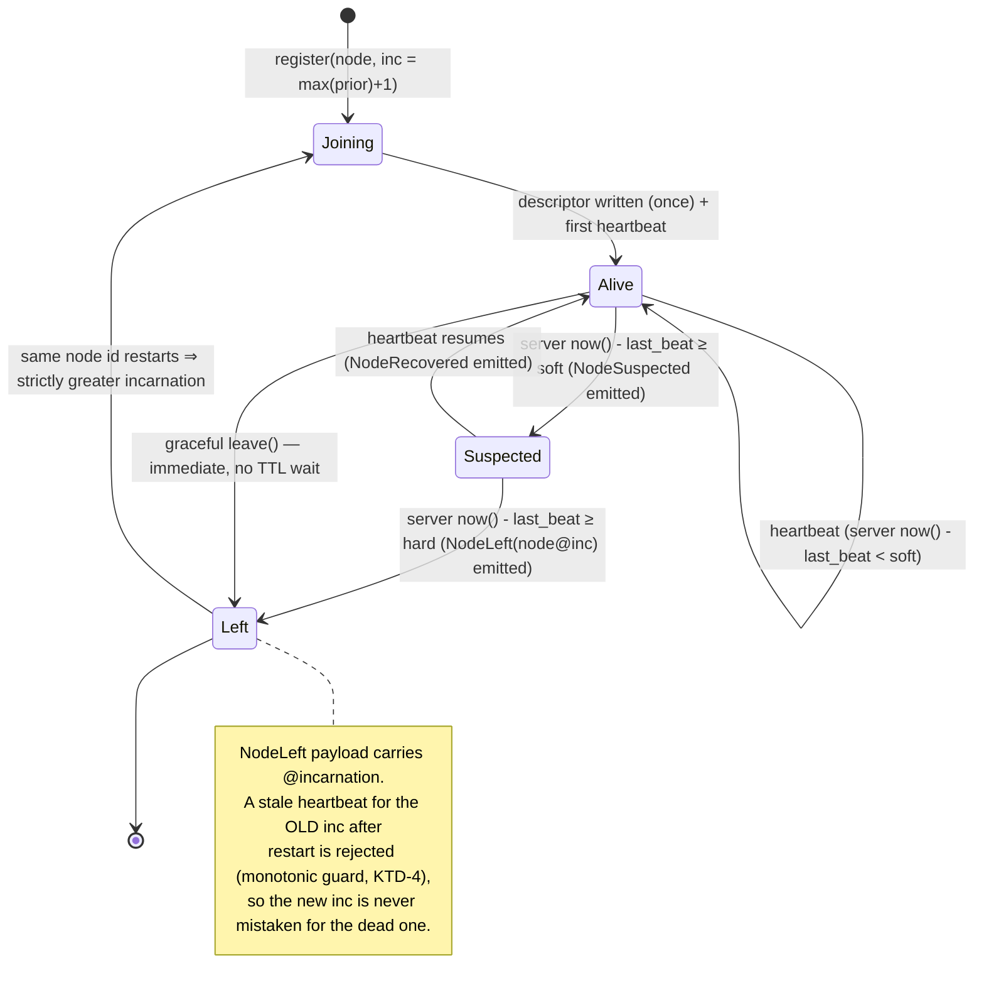

# feat: Headless.Coordination — membership/liveness substrate, providers, and conformance harness

> **Scope of this plan.** Build the `Headless.Coordination` package family — Abstractions,
> Core engine, shared `Core.Database` ADO substrate, native PostgreSql/SqlServer providers,
> a Redis provider, and a Testcontainers conformance
> harness. **Jobs and Messaging consumer wiring are explicitly out of scope** (separate
> follow-up plans). This plan delivers the substrate and proves the authoritative-store
> rules against real stores. Tasks 1–4 from the spec (GUID lease ids, Messaging StorageId→Guid,
> drop ORM `IEntity<long>` auto-gen, remove Snowflake) are **already done** and are
> preconditions, not work items here.

---

## 1. Problem Frame

Membership/liveness logic exists in the repo but is **siloed in `Headless.Jobs.Caching.Redis` and
Redis-only** (`IJobsRedisContext` → `NoOpJobsRedisContext` returns no dead nodes; heartbeat
service unregistered when Redis is absent). Run Jobs on Postgres/EF without Redis and dead-node
recovery silently vanishes. Messaging has no node-level recovery at all.

The structural goal (origin §1.2) is to extract the genuinely shared concern — **liveness +
incarnation identity** — once, as a K8s-shaped substrate: a *dumb store* plus a *consumer-side
algorithm*, with the **store as the sole temporal authority**. Consumers (Jobs, Messaging,
future dashboards) then stamp `node@incarnation` onto their own rows and react to
`NodeLeft(node@incarnation)` to recover work, each keeping its own terminal-state predicate.

This plan builds that substrate. The forcing function is the **no-Redis Jobs recovery path**:
once Jobs drops its incarnation-free `NodeIdentifier` for `node@incarnation`, the EF/Postgres
Jobs path's startup self-reclaim breaks unless a DB-heartbeat liveness provider exists (origin §5.2,
Finding B). So the **native PostgreSql Coordination provider is mandatory**, not optional (it supplies
the DB-heartbeat liveness for Jobs running on Postgres/EF without Redis) — but Jobs itself migrates in a
later plan against the abstraction this plan ships.

**What this substrate is (origin §1.5):** node identity, incarnation-qualified liveness,
lifecycle events, ordered live-node views, fail-stop on loss, fail-closed when the store is
unavailable. **What it is not:** a consensus system. No Raft/Paxos, no split-brain-proof
leadership, no cross-region linearizability, no generic ownership ledger, no domain recovery
logic. The safety ceiling is **fencing-safe / fail-stop / fail-closed**, **not consensus-safe**
unless backed by a consensus-grade provider. This ceiling must be explicit in API + docs (never
cited as RedLock-equivalent — consistent with the repo's standing RedLock rejection, see
`docs/solutions/tooling-decisions/redlock-multi-instance-not-adopted-2026-05-19.md`).

---

## 2. Requirements

Carried from origin `docs/specs/coordination-primitive.md` (Decisions 1, 1b, 3, 4, 6, 7) and the
invoking request. R-IDs are plan-local.

- **R1 — Incarnation-qualified identity.** A node identity is `node@incarnation` where
  incarnation is a monotonic generation: a restarted node is a *distinct* identity from its dead
  predecessor (Orleans `SiloAddress = endpoint + Generation`). (origin §4)
- **R1b — Defined node-id selection.** `node_id` is chosen via an explicit `INodeIdProvider` with a
  default implementation and documented per-deployment guidance — node-id stability determines whether
  incarnation semantics are meaningful, so it cannot be left implicit. (reviewer Finding 6; see KTD-14)
- **R2 — Split descriptor / liveness rows.** Two logical rows per node: a **cold descriptor**
  (write-once on join: identity, incarnation, host/ports, role/metadata) and a **hot liveness
  row** (heartbeat timestamp, status). (origin §4, Fork 1)
- **R3 — Store as sole temporal authority.** Heartbeat timestamps are written with the *store's*
  server clock; dead/suspected detection is a *store-evaluated* predicate
  (`last_beat < server_now() - threshold`). **No application node ever compares another node's
  wall clock to its own.** (origin §4, Fork 2)
- **R4 — Authoritative-store rule.** Heartbeat write, liveness read driving failover, expiry,
  takeover, and `NodeLeft` decisions run only on the **authoritative write/primary path**
  (Postgres primary connection; Redis primary executing the Lua script). Async/read replicas may
  serve dashboards/approximate views but **must not drive failover**. A provider that cannot
  offer an authoritative clock + linearizable liveness-row read/write is **degraded/unsupported
  for failover**. *Invariant: no failover decision from a stale read.* (origin §4)
- **R5 — Substrate read contract (liveness-tracker, option C).** Coordination exposes:
  register / heartbeat / leave, `IsAlive(node)`, the **ordered live-node identities**
  (`GetLiveNodesAsync()` → `NodeIdentity` only), a **full ordered snapshot**
  (`GetLivenessSnapshotAsync()` → `NodeLivenessSnapshot` with `Identity`, `State`, `Role`, `Metadata`
  — for HRW/rendezvous and diagnostics), the **incarnation-qualified identity** to stamp, and events.
  It does **not** store ownership; consumers stamp identity onto their own rows. (origin §4b; snapshot
  accessor per reviewer Finding 8)
- **R6 — Lifecycle events.** Four events, each carrying the full `NodeIdentity` (`node@incarnation`):
  `NodeJoined` (identity first observed Alive), `NodeSuspected` (Alive→Suspected), `NodeRecovered`
  (Suspected→Alive), `NodeLeft` (Alive/Suspected→Dead/Left). The **`NodeLeft` payload carries the
  incarnation**, never node-id alone — keying recovery on node-id would let a fast restart have its
  legitimately-owned rows reclaimed by a survivor reacting to the *previous* incarnation's death.
  (origin §4b invariant) **[Per invoking decisions: `NodeSuspected` and its completing `NodeRecovered`
  ship in v1; `NodeJoined` is never reused for recovery.]**
- **R13 — Event delivery is best-effort, decoupled from heartbeat correctness.** Events are local
  observations *derived from authoritative snapshots*, exposed via
  `IMembershipEventSource.WatchAsync(ct) → IAsyncEnumerable<NodeMembershipEvent>`. They **accelerate**
  recovery; they are not the authoritative recovery path. Invariants: (a) a missed event must never
  permanently block recovery — consumers also periodically reconcile via `GetLiveNodes()`;
  (b) consumer recovery must be idempotent; (c) a slow/throwing/lagging subscriber must never block
  or stall the heartbeat loop; (d) event-delivery failures are logged and never stop heartbeats.
  (sharpens R4 fail-closed; see KTD-11)
- **R7 — Incarnation-safe writes (monotonic guard).** A late heartbeat from a *prior* incarnation
  must be **rejected at the write** — it must not resurrect a node that already emitted `NodeLeft`,
  nor overwrite the liveness row of a newer incarnation. (origin §4b; defense class from
  `docs/solutions/logic-errors/terminal-state-overwrite-on-redelivery-2026-05-16.md`)
- **R8 — Fail-stop / graceful release.** Graceful `Leave()` on shutdown removes the node from the
  live set immediately (no TTL wait), speeding handover; correctness still rests on store-clock
  expiry + incarnation predicates. (origin §7.1–7.2)
- **R9 — Package decomposition.** `Headless.Coordination.{Abstractions, Core, Core.Database,
  PostgreSql, SqlServer, Redis}` + `Headless.Coordination.Tests.Harness`.
  Parallel native providers over a shared `Core.Database` ADO substrate. (invoking decision;
  mirrors `Headless.DistributedLocks.*`. **No generic EntityFramework provider** — dropped per
  invoking decision; native PostgreSql covers the DB-heartbeat liveness Finding B requires.)
- **R10 — Conformance harness.** A Testcontainers-backed conformance suite proves the same
  observable behavior across PostgreSql / SqlServer / Redis. **No InMemory shipped provider**
  (invoking decision). Per CLAUDE.md harness rule.
- **R11 — Jobs-readiness.** The `INodeMembership` surface must satisfy what Jobs needs today
  (verified against code, origin §5.2): register / heartbeat / leave, `IsAlive`, ordered live
  nodes, an identity to stamp into `LockHolder`, and `NodeLeft(node@inc)` to trigger
  `ReleaseDeadNodeResources`. Jobs wiring is **deferred**; the abstraction must not block it.
- **R12 — Acyclic dependencies.** No provider depends on Jobs/Messaging/ORM. Coordination v1 does
  **not** depend on `Headless.DistributedLocks` (no per-heartbeat lease; leadership N=1 is
  deferred). (origin §6 dependency rules)
- **R14 — Fail-stop on self-heartbeat rejection.** When a node's *own* heartbeat is rejected
  (`accepted = false` — a newer incarnation owns the identity), the process must fail-stop, not continue:
  mark local membership `Lost`, fire a `LocalMembershipLostToken` so ownership-sensitive work self-fences,
  publish `LocalMembershipLost`, and apply a configurable `MembershipLostBehavior` (**default
  `StopApplication`**; alternative `StopMembershipOnly`). A stale incarnation must never keep running as
  if valid. (reviewer Finding 9; see KTD-15)
- **R15 — Consumer reconciliation is part of the contract.** Docs must state that consumers treat
  `NodeLeft` as an *optimization trigger*, not the only recovery mechanism: they must **periodically
  reconcile** rows whose `owner` identity is not in the live set, and recovery updates must be idempotent
  and guarded by `owner_identity` + non-terminal state. This covers dropped local events, consumer
  restarts, and consumers that start *after* a `NodeLeft` already fired. (reviewer Finding 10; extends R13)

---

## 3. Key Technical Decisions

### KTD-1 — Provider decomposition: parallel natives + shared `Core.Database` (no EF)
**Decision (user call).** Mirror `Headless.DistributedLocks.*`: `Core.Database` is the shared ADO
substrate; `PostgreSql` (Npgsql) and `SqlServer` (SqlClient) are independent native providers with raw
SQL and native clocks; `Redis` implements Core's store SPI against Lua. **No generic EntityFramework
provider** (dropped per invoking decision) — the substrate's correctness rests on store-clock SQL on
the authoritative path, which the native providers own directly; a generic EF layer would only add a
degraded portability tier the v1 scope doesn't need, and native PostgreSql already satisfies the
no-Redis DB-heartbeat liveness that origin Finding B requires. **Rationale:** each native provider
fully owns its SQL/clock with zero ORM coupling, matching a family the team already maintains.
**Cost accepted:** consumers on an unlisted relational backend must wait for a native provider rather
than reusing a generic EF one.

### KTD-2 — Single temporal authority; server-clock SQL is net-new
**Decision.** The store SPI evaluates all liveness predicates with the store's own **statement-execution**
clock: **`clock_timestamp()` on Postgres** (NOT `transaction_timestamp()` — see below), `sysutcdatetime()`
on SqlServer (already statement-time), `redis.call('TIME')` on Redis. **Postgres rule:** liveness writes
and classification must use `clock_timestamp()` (actual current server time at statement execution);
`transaction_timestamp()` returns the *transaction start* time, so if a coordination call is wrapped in a
longer ambient transaction, heartbeat freshness and dead/suspected classification go stale at write time.
`transaction_timestamp()` must not be used for any heartbeat-freshness or liveness-classification decision.
**Finding (research):** DistributedLocks gives **no template** — its SQL providers use
*connection-scoped advisory locks with no clock at all*. Only the Redis ZSET semaphore
(`Headless.Redis/RedisScriptDefinitions.cs`, prune-vs-count separation, server `TIME` expiry)
models the lease-on-server-time pattern. The native SQL providers write this SQL from scratch;
the only reusable scaffolding is the advisory-lock-guarded idempotent-DDL idiom.

### KTD-3 — `NodeSuspected` = two store-evaluated thresholds, **not** a voting oracle
**Decision (user call: ship NodeSuspected).** The store buckets each node by
`server_now() - last_beat` against two thresholds: `SuspicionThreshold` (soft) and `DeadThreshold`
(hard). `Alive` (< soft) → `Suspected` (soft ≤ … < hard) → `Dead/Left` (≥ hard). A suspected node
**self-recovers** to `Alive` on its next heartbeat. **Rationale:** this stays compatible with
store-as-sole-authority (origin §2 "delete the voting/suspicion oracle") because there is **no
inter-node probing, no quorum, no vote** — suspicion is purely a store-evaluated soft window, a
single-authority signal for operability. This is the one deliberate divergence from the spec's
lean, made on the user's instruction; it must be documented as "soft signal, not consensus."

### KTD-4 — Heartbeat guard: incarnation **equals** the durable generation authority
**Decision.** Liveness writes are gated against the **durable generation authority**
(`coordination_node_generation` in SQL / the `coordination:{cluster}:gen:{node}` counter in Redis), not
the prunable liveness row. The three store operations have distinct, explicit contracts:

- **`Register(cluster, node)`** — the **only** operation that advances generation: atomically increment
  and return `node@new_incarnation` (KTD-13).
- **`Heartbeat(node@inc)`** — accepted **only if `inc == current_generation(cluster, node)`**; otherwise
  rejected (`accepted = false`). Equality, not `>=`: a heartbeat is not a registration, so a *stale*
  incarnation (`inc < current`, a newer one registered) **and** an *impossible* one (`inc > current`,
  corruption/bug) are both rejected. Heartbeat never advances generation.
- **`Leave(node@inc)`** — applies only to the supplied `node@incarnation` (never affects a different
  incarnation's rows).

The liveness-row incarnation match remains a cheap local correctness check, but the **generation source
is the authority** because liveness/`:known` rows are pruned after `DeadThreshold + DeadRetentionWindow`;
without the durable anchor, an ancient `A@1` could re-heartbeat after `A@2`'s liveness row was pruned and
resurrect itself (reviewer correction). The generation row is **not** pruned while the node may return.
This contract is identical across SQL and Redis. **Rationale:** same defense class as the messaging
terminal-state-overwrite bug — a stale heartbeat from a dead incarnation must not resurrect or clobber a
newer one. This is the load-bearing invariant for **incarnation-safe `NodeLeft`** (R6/R7) and the trigger
for fail-stop self-loss (R14): a node whose `inc != current_generation` has lost its identity.

### KTD-5 — Race-safe idempotent DDL
**Decision.** Membership-table DDL is idempotent and concurrency-guarded: Postgres wraps
`CREATE … IF NOT EXISTS` in `pg_advisory_xact_lock(hashtextextended(...))` with `42P06/42P07/23505`
already-exists handling; SqlServer guards with `sp_getapplock` + `IF NOT EXISTS` inside `TRY/CATCH`,
run from a `HostedInitializer`. **Rationale:** concurrent N-node cold start is the norm
(`docs/solutions/best-practices/storage-initializer-lifecycle-correctness.md`); every node races to
create the table.

### KTD-6 — No InMemory shipped provider; Core unit-tested via an inline fake store
**Decision (user call).** No `Headless.Coordination.InMemory` package. The conformance harness runs
Testcontainers Postgres/SqlServer/Redis only. **However**, Core's event-derivation engine is unit
tested against an *inline test-double* `IMembershipStore` living in `Headless.Coordination.Core.Tests.Unit`
— a test fixture, **not** a shipped provider. This keeps the critical join/suspect/left transition
logic fast-testable without violating the no-InMemory decision.

### KTD-7 — Harness style: generic `FixtureBase<TOptions>` + `ConformanceTests<TFixture>`
**Decision.** Use the CLAUDE.md-documented generic harness shape (as in Blobs/Orm/Messaging),
reusing `Headless.Testing.Testcontainers` container fixtures, **not** the older
`abstract TestsBase + explicit override-as-[Fact]` style that DistributedLocks happens to use.
**Rationale:** three+ providers asserting one liveness contract is exactly what the generic shape
is for; CLAUDE.md names it the standard. (The user's "mirror DistributedLocks" call was about
*package decomposition*, not test ergonomics.)

### KTD-8 — Provider eligibility is a correctness gate (all v1 providers authoritative)
**Decision.** Provider eligibility is a **correctness gate**, not just a capability list (origin §6):
a provider qualifies for failover decisions only if it offers an authoritative clock + linearizable
liveness-row read/write. **All three v1 providers (PostgreSql, SqlServer, Redis) are authoritative**
(`FailoverEligible = true`) — there is no degraded tier in v1 (the EF generic provider that would have
been degraded was dropped, KTD-1). The `ProviderCapabilities.FailoverEligible` flag is still shipped
as a forward-looking gate so a future degraded/portable provider must explicitly opt out of
failover-driving scenarios rather than silently pass them. **Rationale:** keeps R4 enforceable at the
provider boundary even though every current provider passes.

### KTD-9 — Redis Lua: fork shared scripts, do not mutate
**Decision.** New membership Lua (heartbeat upsert with incarnation guard, prune-by-`TIME`, tri-state
bucket read) is added as **new** definitions in `Headless.Redis/RedisScriptDefinitions.cs`, loaded
via a `CoordinationRedisScriptsInitializer`. Do **not** mutate the existing semaphore/CAS scripts
shared with Caching/DistributedLocks. **Rationale:** standing memory note — those scripts are shared;
fork, don't mutate.

### KTD-10 — Coordination v1 does not depend on DistributedLocks
**Decision.** Membership writes are direct store CAS/upserts; no per-heartbeat lease. Therefore Core
does **not** reference `Headless.DistributedLocks.*` in v1. **Rationale:** keeps the graph acyclic
(origin §6), avoids the keyed-DI shadowing concern
(`docs/solutions/architecture-patterns/messaging-keyed-di-lock-isolation-2026-05-19.md`), and defers
the lease dependency to a future leadership (N=1) feature that genuinely needs it.

### KTD-11 — Event delivery: `WatchAsync` over a bounded channel; best-effort, snapshot-floored
**Decision.** Events are exposed as a **pull stream**, not C# events:
`IMembershipEventSource.WatchAsync(ct) → IAsyncEnumerable<NodeMembershipEvent>`, where
`NodeMembershipEvent` is a closed set `{ NodeJoined, NodeSuspected, NodeRecovered, NodeLeft }`, each
carrying `NodeIdentity`. Each subscriber gets its own **bounded `Channel<NodeMembershipEvent>`**; the
heartbeat loop *writes* and never blocks on a slow consumer (drop-oldest-with-log when a subscriber
lags). **Rationale (reviewer Finding 1):** `NodeLeft` is a *recovery trigger*, not a UI
notification — plain C# events are silent-miss-prone, don't compose with async handlers, and would
couple heartbeat-loop correctness to consumer callback behavior. The pull-stream + per-subscriber
channel isolates the loop from consumers and gives explicit backpressure.

**Delivery semantics (load-bearing, enforced in Core + asserted in the harness):**
1. Events are **best-effort local observations derived from authoritative snapshots** — they
   *accelerate* recovery; the **authoritative floor is `GetLiveNodes()` snapshot + each consumer's own
   periodic reconcile** (mirrors Messaging's `LockedUntil` floor framing, origin §5.3).
2. Consumer recovery **must be idempotent** — a re-delivered or reconcile-discovered `NodeLeft` must
   not double-recover.
3. A **missed event must never permanently block recovery** — reconcile catches what the stream dropped.
4. A slow / throwing / lagging subscriber **must never block or stall the heartbeat loop**; its channel
   is bounded and drops with a log.
5. Event-delivery failures are **logged and never stop heartbeats** (extends the R4 fail-closed rule to
   the delivery path).

**Self-recovery is explicit (reviewer Finding 2):** Suspected→Alive emits **`NodeRecovered`**, never a
re-`NodeJoined`. `NodeJoined` means *first observed Alive* (a genuinely new identity/incarnation);
overloading it for recovery would stop consumers distinguishing "new incarnation, may need setup" from
"existing node un-suspected, cancel speculative recovery." `NodeRecovered` is cheap and unambiguous.

### KTD-12 — SqlServer upsert: explicit guarded UPDATE/INSERT, not `MERGE`
**Decision (reviewer Finding 4).** The SqlServer liveness upsert is an explicit transaction that first
enforces the KTD-4 generation equality guard (`reject if @inc <> current_generation`, read under
`UPDLOCK, HOLDLOCK`), then writes the **per-incarnation** liveness row:
`UPDATE coordination_liveness WITH (UPDLOCK, HOLDLOCK) SET last_beat=SYSUTCDATETIME()
WHERE cluster_name=@c AND node_id=@id AND incarnation=@inc;` then `IF @@ROWCOUNT = 0` a conditional
`INSERT … WHERE NOT EXISTS (…)`. **`MERGE` is not the default** — it carries documented concurrency
caveats that could let the guard regress under load. **Rationale:** for a correctness primitive, boring guarded SQL with explicit lock hints beats a
clever single statement; `MERGE` may be revisited only if proven both safe *and* simpler. (Supersedes
the earlier "MERGE with fallback" framing.)

### KTD-13 — Incarnation source of truth: a dedicated generation table with atomic increment
**Decision (reviewer Finding 5).** Monotonic incarnation lives in its own table
`coordination_node_generation (cluster_name, node_id, current_incarnation, updated_at)` with
`PK(cluster_name, node_id)` — **not** derived from `MAX(liveness.incarnation)+1`. `RegisterAsync`
allocates atomically and returns the new value:
- Postgres: `INSERT … VALUES (@cluster,@id,1) ON CONFLICT (cluster_name,node_id) DO UPDATE SET
  current_incarnation = coordination_node_generation.current_incarnation + 1 RETURNING current_incarnation;`
- SqlServer: guarded `UPDATE … SET current_incarnation += 1 OUTPUT inserted.current_incarnation` with an
  insert-if-absent fallback (same UPDLOCK/HOLDLOCK discipline as KTD-12).
- Redis: `INCR coordination:{cluster}:gen:{node}` (atomic, server-side).
**Rationale:** makes the "strictly-greater on restart" invariant (R1/KTD-4) a single atomic store
operation immune to the lost-update race a `MAX+1` read-then-write would expose under concurrent register.
**The generation row/counter is also the durable heartbeat-guard authority (KTD-4):** it is **not** pruned
while the node may return, so it remains the reference even after liveness/`:known` rows age out — closing
the pruned-row resurrection gap. All three providers are cluster-scoped (`cluster_name` / Redis key
prefix) so multiple clusters can share one store.

### KTD-14 — `INodeIdProvider` contract + documented node-id defaults
**Decision (reviewer Finding 6).** Node-id selection is explicit, not implicit. Ship
`INodeIdProvider { ValueTask<NodeId> GetNodeIdAsync(ct) }` with a default implementation and **documented
deployment guidance**, because node-id stability directly determines whether incarnation semantics are
meaningful:
- **K8s Deployment:** prefer `POD_NAME` + namespace (pod-stable for the pod's lifetime).
- **K8s StatefulSet:** the ordinal pod name is stable across restart/replacement — best fit.
- **Configured instance id:** allowed but **dangerous if duplicated** — validate uniqueness.
- **Generated GUID at process start:** acceptable for local/dev, but node-id never repeats so incarnation
  adds little; document that recovery semantics differ (each start is a brand-new node).
- **Machine/container id:** may be unstable depending on deployment — not the default.
Default provider resolution order: explicit configured id → `POD_NAME`(+namespace) → stable hostname →
generated fallback (with a warning that recovery semantics are degraded). **Also:** the substrate logs a
warning if it observes **multiple live registrations for the same node-id in rapid succession** (a likely
duplicate-id misconfiguration).

### KTD-15 — Self-heartbeat rejection is fail-stop; default `StopApplication`
**Decision (reviewer Finding 9; default resolved per OQ7).** If a node's **own** heartbeat returns
`accepted = false`, this process is no longer the valid owner of its `node@incarnation` — a **local
fencing failure**, not a soft warning. On self-heartbeat rejection the local member must transition to
`MembershipLost`. The Core engine: (1) marks local membership `Lost`; (2) cancels a
`LocalMembershipLostToken` so ownership-sensitive work self-fences (parallels `IDistributedLease.LostToken`);
(3) publishes `LocalMembershipLost`; (4) applies `MembershipLostBehavior`.

```csharp
public enum MembershipLostBehavior
{
    StopApplication = 0,    // default
    StopMembershipOnly = 1,
}
```

**Default = `StopApplication`:** the membership service requests host shutdown via
`IHostApplicationLifetime.StopApplication()`. This is the safest fail-stop because a stale incarnation
continuing to run may perform ownership-sensitive work after it has lost fencing; stopping loudly lets
Kubernetes/systemd/App Service restart it cleanly with a new incarnation. **Configurable alternative
`StopMembershipOnly`:** stop heartbeating, mark local membership lost, emit `LocalMembershipLost`, and
make ownership-sensitive coordination APIs fail — the process stays alive but is then responsible for
quiescing its own workers and avoiding unsafe side effects. **Why not default to `StopMembershipOnly`?**
It depends on *every* consumer doing the right thing — one missed worker loop, stale cache, background
service, message consumer, or scheduler can keep working under a dead incarnation, which is exactly the
hazard the substrate exists to reduce.

### KTD-16 — Operational reads are current-generation only; history is retained but separate
**Decision (reviewer correction).** Because liveness is incarnation-qualified (`PK(cluster_name, node_id,
incarnation)` stays — *not* collapsed to `node_id`), a node that restarts several times within
`DeadThreshold + DeadRetentionWindow` leaves **multiple historical incarnation rows** for the same
`node_id`. Operational reads must **not** treat those superseded rows as active candidates. The read model
splits into two tiers:

- **Operational reads — current-generation only.** `GetLiveNodesAsync()` and `ReadLivenessAsync()` /
  `GetLivenessSnapshotAsync()` return only rows whose `incarnation == coordination_node_generation
  .current_incarnation` for that `(cluster, node)`. SQL joins the generation table; Redis filters members
  by the `gen` counter. `GetLiveNodesAsync` further restricts to `Alive`; the operational snapshot returns
  current-generation `Alive`/`Suspected`/`Dead` for recovery and HRW decisions.
  ```sql
  SELECT l.*
  FROM coordination_liveness l
  JOIN coordination_node_generation g
    ON g.cluster_name = l.cluster_name AND g.node_id = l.node_id
   AND g.current_incarnation = l.incarnation
  WHERE l.cluster_name = @cluster AND l.state IN ('Alive','Suspected')   -- GetLiveNodes; snapshot drops the state filter
  ```
- **Diagnostic / history reads (optional, may be deferred).** Retained historical incarnations exist so
  providers can derive `NodeLeft`/Dead observations and support debugging; a diagnostic read *may* expose
  them, but **consumers must never use historical rows as live ownership candidates.**

**Rationale:** keeps the `node_id + incarnation` identity invariant intact (a restart is a new identity)
while preventing a just-superseded `A@1` from polluting the live set once `A@2` is current. Recovery stays
correct: a consumer reconciling `owner = A@1` finds A@1 is not in the current-generation live set →
reclaims; A@2 (current) is untouched.

---

## 4. High-Level Technical Design

### 4.1 Package & dependency graph

```mermaid
graph TD
    Abs[Headless.Coordination.Abstractions<br/>contracts, identity, events, options]
    Core[Headless.Coordination.Core<br/>engine: heartbeat service,<br/>event derivation, store SPI]
    CoreDb[Headless.Coordination.Core.Database<br/>shared ADO substrate, DDL bootstrap,<br/>incarnation-guard upsert shape]
    PG[Headless.Coordination.PostgreSql<br/>Npgsql, now(), advisory-DDL]
    MSSQL[Headless.Coordination.SqlServer<br/>SqlClient, sysutcdatetime(), guarded UPDATE/INSERT]
    Redis[Headless.Coordination.Redis<br/>ZSET + TIME Lua - authoritative]
    Ext[Headless.Extensions.Abstractions<br/>IGuidGenerator]
    HRedis[Headless.Redis<br/>RedisScriptDefinitions]

    Core --> Abs
    Core --> Ext
    CoreDb --> Core
    PG --> CoreDb
    MSSQL --> CoreDb
    Redis --> Core
    Redis --> HRedis

    Harness[Headless.Coordination.Tests.Harness<br/>FixtureBase + ConformanceTests]
    Harness --> Core
    Harness -.->|Testcontainers fixtures| TC[Headless.Testing.Testcontainers]

    classDef auth fill:#1b5e20,color:#fff,stroke:#fff
    class PG,MSSQL,Redis auth
```

*No arrow points back into Coordination from Jobs/Messaging/ORM (R12). DistributedLocks is absent
in v1 (KTD-10).*

### 4.2 Node liveness state machine (per node identity)



*All threshold comparisons are evaluated by the store with its own clock (R3). The app observes
buckets; it never compares clocks (R4).*

### 4.3 Incarnation-safe `NodeLeft` — the scenario the harness must prove

```mermaid
sequenceDiagram
    participant A1 as Node A@1
    participant A2 as Node A@2 (restart)
    participant Store as Authoritative store (sole clock)
    participant S as Survivor node (observer)

    A1->>Store: register A@1, heartbeat...
    Note over A1: crashes (no graceful leave)
    A1--xStore: heartbeats stop
    A2->>Store: register A → incarnation 2 (> 1)
    A2->>Store: heartbeat A@2 (server now())
    Note over A1,Store: delayed/duplicated A@1 heartbeat arrives
    A1-->>Store: heartbeat A@1
    Store-->>A1: REJECTED (inc 1 < stored 2) — KTD-4
    S->>Store: poll live set (server-evaluated)
    Store-->>S: A@1 past hard threshold → Dead; A@2 Alive
    S->>S: emit NodeLeft(A@1)
    Note over S: consumer reclaims WHERE owner = A@1 AND not terminal.<br/>A@2's rows (owner = A@2) are untouched.
```

---

## 5. Output Structure

```
src/
  Headless.Coordination.Abstractions/
    Setup.cs is N/A (no DI) — contracts only
    NodeId.cs, NodeIncarnation.cs, NodeIdentity.cs        # node@incarnation value types
    NodeDescriptor.cs                                     # cold row
    NodeLivenessState.cs (enum: Alive/Suspected/Dead)
    NodeLivenessSnapshot.cs                              # (Identity, State, Role, Metadata)
    INodeIdProvider.cs                                   # GetNodeIdAsync — node-id selection seam (KTD-14)
    INodeMembership.cs                                    # register/heartbeat/leave/IsAlive/GetLiveNodes/GetLivenessSnapshot/Identity/LocalMembershipLostToken
    MembershipLostBehavior.cs                            # StopMembershipOnly | StopApplication (R14)
    Events/NodeMembershipEvent.cs (NodeJoined|NodeSuspected|NodeRecovered|NodeLeft), IMembershipEventSource.cs (WatchAsync), LocalMembershipLost.cs
    CoordinationOptions.cs (+ validator)
    Exceptions/, NullNodeMembership.cs
  Headless.Coordination.Core/
    IMembershipStore.cs                                   # store SPI (descriptor + liveness + generation ops)
    DefaultNodeIdProvider.cs                              # env/hostname/configured/generated resolution (KTD-14)
    MembershipService.cs                                  # INodeMembership impl over a store; fail-stop on self-reject (R14)
    MembershipHeartbeatBackgroundService.cs               # heartbeat + snapshot-diff event derivation
    MembershipEventSource.cs                              # per-subscriber bounded channel; WatchAsync (KTD-11)
    ProviderCapabilities.cs                               # FailoverEligible gate (R4/KTD-8)
    Setup.cs                                              # _AddCoordinationCore
  Headless.Coordination.Core.Database/
    DatabaseMembershipStoreBase.cs                        # shared upsert/guard/bucket + generation shape
    IMembershipStorageInitializer.cs, MembershipSchema.cs # tables: descriptor + liveness + node_generation
  Headless.Coordination.PostgreSql/   { PostgresMembershipStore.cs, *StorageInitializer.cs, Setup.cs }
  Headless.Coordination.SqlServer/    { SqlServerMembershipStore.cs, *StorageInitializer.cs, Setup.cs }
  Headless.Coordination.Redis/        { RedisMembershipStore.cs, CoordinationRedisScriptsInitializer.cs, Setup.cs }
tests/
  Headless.Coordination.Tests.Harness/    { CoordinationFixtureBase.cs, MembershipConformanceTests.cs }
  Headless.Coordination.Core.Tests.Unit/  { FakeMembershipStore.cs, event-derivation + identity tests }
  Headless.Coordination.PostgreSql.Tests.Integration/    { fixture + conformance subclass + native-only }
  Headless.Coordination.SqlServer.Tests.Integration/     { ... }
  Headless.Coordination.Redis.Tests.Integration/         { fixture + conformance + Lua-eviction tests }
```

*Structure is a scope declaration, not a constraint — per-unit `**Files:**` are authoritative.*

---

## 6. Implementation Units

### U1. Abstractions — identity, contracts, events, options
**Goal:** Ship the public contract surface: `node@incarnation` identity value types, the
`INodeMembership` contract, lifecycle event types, options, and Null object. This is the NuGet
contract every provider and consumer references.
**Requirements:** R1, R1b, R5, R6, R11, R12, R13, R14.
**Dependencies:** none.
**Files:**
- `src/Headless.Coordination.Abstractions/Headless.Coordination.Abstractions.csproj` (new, `Headless.NET.Sdk`)
- `src/Headless.Coordination.Abstractions/{NodeId,NodeIncarnation,NodeIdentity}.cs`
- `src/Headless.Coordination.Abstractions/{NodeDescriptor,NodeLivenessState,NodeLivenessSnapshot}.cs`
- `src/Headless.Coordination.Abstractions/INodeIdProvider.cs` (`ValueTask<NodeId> GetNodeIdAsync(ct)`)
- `src/Headless.Coordination.Abstractions/INodeMembership.cs`
- `src/Headless.Coordination.Abstractions/MembershipLostBehavior.cs` (enum: `StopApplication = 0` default, `StopMembershipOnly = 1`)
- `src/Headless.Coordination.Abstractions/Events/NodeMembershipEvent.cs` (closed hierarchy: `NodeJoined`, `NodeSuspected`, `NodeRecovered`, `NodeLeft` — each carrying `NodeIdentity`), `Events/IMembershipEventSource.cs` (`WatchAsync(ct) → IAsyncEnumerable<NodeMembershipEvent>`), `Events/LocalMembershipLost.cs`
- `src/Headless.Coordination.Abstractions/CoordinationOptions.cs` (+ `internal sealed CoordinationOptionsValidator`)
- `src/Headless.Coordination.Abstractions/NullNodeMembership.cs`, `Exceptions/*`
- `tests/Headless.Coordination.Abstractions.Tests.Unit/{NodeIdentityTests.cs, CoordinationOptionsValidatorTests.cs}`
**Approach:**
- `NodeIdentity` wraps `NodeId` (string) + `NodeIncarnation` (monotonic — a store-allocated `long`, KTD-13).
  Canonical `node@incarnation` string format with `Parse`/`TryParse`/`ToString` round-trip and
  value equality. Incarnation defines `IComparable` ordering (KTD-4 guard depends on it).
- `INodeIdProvider` (R1b/KTD-14): `ValueTask<NodeId> GetNodeIdAsync(ct)` — the seam for choosing node-id;
  the default impl ships in Core (U2). XML-doc the deployment guidance (K8s Deployment → pod name+ns;
  StatefulSet → ordinal pod name; configured id → validate uniqueness; generated GUID → dev-only, degraded
  recovery semantics).
- `INodeMembership`: `RegisterAsync` (returns assigned `NodeIdentity`), `HeartbeatAsync`, `LeaveAsync`,
  `IsAliveAsync(NodeIdentity)`, `GetLiveNodesAsync()` → **ordered** `IReadOnlyList<NodeIdentity>` (alive
  only), `GetLivenessSnapshotAsync()` → **ordered** `IReadOnlyList<NodeLivenessSnapshot>` (full state for
  HRW/diagnostics, Finding 8), plus `Identity { get; }` and a `LocalMembershipLostToken` (R14) for the
  current node.
- `NodeLivenessSnapshot` is a record `(NodeIdentity Identity, NodeLivenessState State, string? Role,
  IReadOnlyDictionary<string,string> Metadata)`; both read accessors return deterministic ordering by
  identity (for cross-node-stable HRW).
- `MembershipLostBehavior` enum + a `LocalMembershipLost` event/signal type for the R14 fail-stop path
  (default behavior decided in options, OQ7).
- Events via `IMembershipEventSource.WatchAsync(ct) → IAsyncEnumerable<NodeMembershipEvent>` (KTD-11) —
  a **pull stream**, not C# events. `NodeMembershipEvent` is a closed/sealed hierarchy (or
  discriminated record set) `{ NodeJoined, NodeSuspected, NodeRecovered, NodeLeft }`; **every** variant
  carries the full `NodeIdentity` (`node@incarnation`), `NodeLeft` especially (R6). Document the
  best-effort + snapshot-floor + idempotent-recovery semantics (R13) on `IMembershipEventSource` XML
  docs so consumers know the stream accelerates — it does not replace — `GetLiveNodes()` reconcile.
- `CoordinationOptions`: `HeartbeatInterval`, `SuspicionThreshold` (soft), `DeadThreshold` (hard),
  `DeadRetentionWindow` (how long a Dead node stays *readable as Dead* before removal — drives Redis's
  `:known` prune horizon and any SQL dead-row cleanup, so Dead is observable at least once, Finding 3),
  `KeyPrefix`/`ClusterName`, node `Role`/metadata, and `MembershipLostBehavior` (**default
  `StopApplication`**, KTD-15). `DeadRetentionWindow` is an explicit `TimeSpan` (no implicit default that
  hides the Dead-visibility dependency). Validator: `0 < HeartbeatInterval < SuspicionThreshold <
  DeadThreshold` and `DeadRetentionWindow >= HeartbeatInterval * 2` (too small and slow observers miss
  the Dead state before prune, reviewer minor).
- Mark the consensus ceiling in XML docs on `INodeMembership` (origin §1.5): fencing-safe / fail-stop
  / fail-closed, **not** consensus-safe.
**Patterns to follow:** `src/Headless.DistributedLocks.Abstractions/*` (contracts-only package, Null
objects, `[PublicAPI]`, options+validator in same file). `IGuidGenerator` lives in
`Headless.Extensions/Abstractions` (namespace `Headless.Abstractions`).
**Test suite design:** `Headless.Coordination.Abstractions.Tests.Unit` (new). Pure value-type tests,
no infra.
**Test scenarios:**
- `NodeIdentity` round-trips `node@incarnation` via `ToString`/`Parse`; `TryParse` rejects malformed
  input (`"a@"`, `"@1"`, `"a@notnum"`, empty) returning false without throwing.
- Two `NodeIdentity` with same id+incarnation are equal; differing incarnation are unequal; incarnation
  `IComparable` orders `a@1 < a@2`.
- `CoordinationOptionsValidator` rejects `SuspicionThreshold >= DeadThreshold`, non-positive
  `HeartbeatInterval`, `HeartbeatInterval >= SuspicionThreshold`, and `DeadRetentionWindow <
  HeartbeatInterval * 2`; accepts a valid triangle + retention window.
- `NullNodeMembership.GetLiveNodesAsync()` returns empty; `IsAliveAsync` returns false;
  `WatchAsync` yields an empty/never-completing stream that honors cancellation; no throw.
- Each `NodeMembershipEvent` variant (`NodeJoined`/`NodeSuspected`/`NodeRecovered`/`NodeLeft`) exposes
  its `NodeIdentity`; pattern-matching/exhaustiveness over the closed set compiles (no silent default
  arm needed).
- `NodeLivenessSnapshot` carries `Identity`, `State`, `Role`, and `Metadata`; `GetLivenessSnapshotAsync`
  and `GetLiveNodesAsync` are distinct members (snapshot = full state, live = identities only).
- `MembershipLostBehavior` has both `StopMembershipOnly` and `StopApplication`; `NullNodeMembership`
  exposes a non-cancelled `LocalMembershipLostToken`.
**Verification:** package compiles under strict SDK; `Tests.Unit` green; `INodeMembership` exposes
every member R11 enumerates (register/heartbeat/leave/IsAlive/ordered GetLiveNodes + GetLivenessSnapshot/
Identity/LocalMembershipLostToken); `INodeIdProvider` and `MembershipLostBehavior` are public;
`IMembershipEventSource.WatchAsync` returns `IAsyncEnumerable<NodeMembershipEvent>` and the event set is
the closed four `{Joined, Suspected, Recovered, Left}` each carrying `NodeIdentity`.

### U2. Core — store SPI, membership service, event-deriving heartbeat engine
**Goal:** Provider-agnostic engine: the `IMembershipStore` SPI, `MembershipService : INodeMembership`,
the `IMembershipEventSource` (`WatchAsync` over per-subscriber bounded channels), and the background
service that heartbeats and derives `NodeJoined`/`NodeSuspected`/`NodeRecovered`/`NodeLeft` by diffing
successive store snapshots. This is where the K8s-shaped algorithm lives.
**Requirements:** R1b, R3, R5, R6, R7, R8, R10 (testability), R12, R13, R14.
**Dependencies:** U1.
**Files:**
- `src/Headless.Coordination.Core/Headless.Coordination.Core.csproj` (new; refs Abstractions, Hosting, Extensions.Abstractions)
- `src/Headless.Coordination.Core/IMembershipStore.cs`
- `src/Headless.Coordination.Core/DefaultNodeIdProvider.cs` (env/hostname/configured/generated resolution, KTD-14)
- `src/Headless.Coordination.Core/MembershipService.cs`
- `src/Headless.Coordination.Core/MembershipHeartbeatBackgroundService.cs`
- `src/Headless.Coordination.Core/MembershipEventSource.cs` (`IMembershipEventSource` impl; per-subscriber bounded `Channel<NodeMembershipEvent>` with drop-oldest-with-log)
- `src/Headless.Coordination.Core/ProviderCapabilities.cs`
- `src/Headless.Coordination.Core/Setup.cs`
- `src/Headless.Coordination.Core/Internal/LoggerExtensions.cs` (`[LoggerMessage]` partial — at file bottom)
- `tests/Headless.Coordination.Core.Tests.Unit/{FakeMembershipStore.cs, EventDerivationTests.cs, EventDeliveryTests.cs, SelfHeartbeatLostTests.cs, NodeIdProviderTests.cs, MembershipServiceTests.cs}`
**Approach:**
- `IMembershipStore` (the dumb contract) with the explicit per-operation guard contract (KTD-4):
  - `AllocateIncarnationAsync(cluster, NodeId)` → strictly-greater incarnation via the dedicated
    generation table (KTD-13, atomic increment-and-return — never `MAX+1`). **The only operation that
    advances generation.**
  - `UpsertDescriptorAsync(NodeDescriptor)` (write-once per `node@incarnation`).
  - `HeartbeatAsync(NodeIdentity)` → returns `accepted`, **`true` only when `inc == current_generation`**
    for `(cluster, node)`; both stale (`<`) and impossible (`>`) incarnations return `false` (KTD-4).
  - `LeaveAsync(NodeIdentity)` → affects only the supplied `node@incarnation`.
  - `ReadLivenessAsync()` → ordered `IReadOnlyList<NodeLivenessSnapshot>`, **current-generation only**
    (joined against the generation source, KTD-16) where the **store has already bucketed** each node
    Alive/Suspected/Dead using its own clock + thresholds. Historical (superseded) incarnations are
    **excluded** from this operational read; they are retained only for event derivation / diagnostics.
  All operations are `cluster_name`-scoped. The store evaluates time; the engine never does (R3/R4).
- `DefaultNodeIdProvider` (R1b/KTD-14): resolves node-id by configured-id → `POD_NAME`(+`POD_NAMESPACE`)
  → stable hostname → generated GUID (logging a warning in the generated case that recovery semantics are
  degraded). Validates a configured id is non-empty.
- `MembershipService`: orchestrates register (resolve node-id via `INodeIdProvider` → atomically allocate
  incarnation → write descriptor → first heartbeat), exposes `GetLiveNodesAsync` (identities, Alive only),
  `GetLivenessSnapshotAsync` (full ordered state, Finding 8), `IsAliveAsync`, `LeaveAsync`, `Identity`,
  and `LocalMembershipLostToken`.
- **Fail-stop on self-heartbeat rejection (R14/KTD-15):** when the loop's *own* `HeartbeatAsync` returns
  `accepted = false`, the engine treats it as identity loss — sets state `Lost`, cancels
  `LocalMembershipLostToken`, publishes `LocalMembershipLost`, stops heartbeating, and applies
  `MembershipLostBehavior` (`StopMembershipOnly` → stop loop + ownership work; `StopApplication` →
  `IHostApplicationLifetime.StopApplication()`). It does **not** silently continue or blindly re-register.
- `MembershipHeartbeatBackgroundService`: loop on `HeartbeatInterval` — (1) heartbeat self;
  (2) read the **current-generation** operational snapshot (`ReadLivenessAsync`, KTD-16);
  (3) diff against previous snapshot to derive events and publish them through `MembershipEventSource`:
  new identity Alive → `NodeJoined`; Alive→Suspected → `NodeSuspected`; **Suspected→Alive → `NodeRecovered`**
  (never a re-`NodeJoined`, KTD-11/R6); →Dead or vanished → `NodeLeft(identity)`. Because reads are
  current-generation, a superseded `A@1` (after `A@2` registers) **vanishes** from the snapshot and the diff
  emits `NodeLeft(A@1)` + `NodeJoined(A@2)` as distinct identities. **The store, not the engine, decided the
  buckets.**
- `MembershipEventSource` (R13/KTD-11): `WatchAsync(ct)` hands each subscriber its own bounded
  `Channel<NodeMembershipEvent>`. The heartbeat loop publishes by *writing* to each channel and **never
  awaits a slow reader** — on a full channel it drops-oldest (or drops-newest) with a warning log, so
  one lagging consumer can't stall liveness. A subscriber whose enumeration throws is detached and
  logged; its failure never propagates into the loop. Publishing happens *after* the snapshot is
  committed, so a delivery failure cannot corrupt the authoritative read path.
- Fail-closed (R4 + R13): if `ReadLivenessAsync`/`HeartbeatAsync` throws (store unavailable), the engine
  does **not** synthesize `NodeLeft` (or any) events from a stale local snapshot — it logs and retries
  next tick. Events are an *acceleration* over the authoritative `GetLiveNodes()` snapshot; consumers
  reconcile periodically, so a dropped or never-emitted event is recoverable, not fatal.
**Patterns to follow:** `Headless.DistributedLocks.Core` (engine + storage-SPI split, `Setup.cs`
`_AddCoordinationCore`). Heartbeat-loop shape from `NodeHeartBeatBackgroundService.cs` in
`Headless.Jobs.Caching.Redis` (but event-deriving, not poll-and-reclaim).
**Test suite design:** `Headless.Coordination.Core.Tests.Unit` (new). Uses an **inline
`FakeMembershipStore`** test double (KTD-6) — deterministic, no infra — to drive the event-derivation
state machine. This is the critical-logic test layer; the Testcontainers harness (U8) proves the
store implementations honor the same contract.
**Test scenarios:**
- *NodeJoined:* a node appearing Alive in the snapshot for the first time emits exactly one
  `NodeJoined`; re-appearing Alive across ticks does not re-emit.
- *NodeSuspected → NodeLeft:* a node bucketed Suspected emits `NodeSuspected` once; on a later tick
  bucketed Dead emits `NodeLeft` carrying the **same incarnation**.
- *NodeRecovered (not NodeJoined):* Suspected→Alive emits exactly one `NodeRecovered` for that identity
  and **never** a second `NodeJoined`; a later genuine new incarnation still emits `NodeJoined`.
- *Incarnation-safe (engine side):* snapshot flips from `A@1 Dead` to `A@2 Alive` across ticks →
  emits `NodeLeft(A@1)` and `NodeJoined(A@2)` as distinct identities, never collapsing them.
- *Fail-stop on self-reject (SelfHeartbeatLostTests, R14/KTD-15):* when the loop's own `HeartbeatAsync`
  returns `accepted=false`, the engine cancels `LocalMembershipLostToken`, publishes `LocalMembershipLost`,
  stops heartbeating, and — under `StopApplication` — calls `IHostApplicationLifetime.StopApplication()`;
  under `StopMembershipOnly` the process stays up but the loop halts. It never silently continues or
  blindly re-registers.
- *Fail-closed:* `ReadLivenessAsync` throwing on a tick emits **no** `NodeLeft` (or other) events for
  nodes Alive last tick (no stale-read failover); next successful tick resumes.
- *Node-id resolution (NodeIdProviderTests, R1b/KTD-14):* `DefaultNodeIdProvider` prefers configured id,
  then `POD_NAME`(+namespace), then hostname, then a generated GUID with a degraded-recovery warning;
  a blank configured id is rejected.
- *Snapshot accessor (Finding 8):* `GetLivenessSnapshotAsync` returns full `NodeLivenessSnapshot`
  (Identity/State/Role/Metadata) for Alive, Suspected, and Dead nodes; `GetLiveNodesAsync` returns only
  Alive identities — the two are distinct and consistent.
- *Delivery isolation — slow subscriber (EventDeliveryTests):* a `WatchAsync` consumer that never
  reads its channel does not stall the heartbeat loop; the loop keeps heartbeating and publishing to
  other subscribers; the slow channel drops-with-log past its bound.
- *Delivery isolation — throwing subscriber:* a consumer whose enumeration throws is detached and
  logged; the loop and other subscribers are unaffected.
- *Multi-subscriber fan-out:* two concurrent `WatchAsync` streams each receive the full event sequence
  independently (one subscriber's lag doesn't drop the other's events).
- *Idempotent-recovery contract surfaced:* re-publishing a `NodeLeft` for an already-left identity (or
  a reconcile that re-discovers it) is observable as a duplicate the consumer can dedupe — assert the
  payload identity equality so consumer idempotency is possible (R13 invariant b).
- *Register:* resolves node-id, atomically allocates a strictly-greater incarnation (generation table,
  KTD-13), writes descriptor once, sets `Identity`.
- *Ordered live nodes:* `GetLiveNodesAsync` returns deterministic order for the same membership set.
**Verification:** `Tests.Unit` green covering all transitions, delivery-isolation, fail-stop, and node-id
scenarios; no event-derivation path reads a wall clock (assert via design — store returns buckets);
fail-closed scenario proves no stale-read failover; a non-reading/throwing subscriber provably never
stalls the heartbeat loop (R13); self-heartbeat rejection provably triggers the R14 fail-stop path.

### U3. Core.Database — shared ADO substrate, table model, race-safe DDL
**Goal:** Shared relational scaffolding the native providers specialize: the descriptor + liveness
table model, the incarnation-guard upsert *shape*, the tri-state bucket read *shape*, and the
race-safe idempotent-DDL initializer contract.
**Requirements:** R2, R4, R5, R7, KTD-5, KTD-13.
**Dependencies:** U2.
**Files:**
- `src/Headless.Coordination.Core.Database/Headless.Coordination.Core.Database.csproj` (new; refs Core, Hosting; `InternalsVisibleTo` PostgreSql + SqlServer)
- `src/Headless.Coordination.Core.Database/DatabaseMembershipStoreBase.cs`
- `src/Headless.Coordination.Core.Database/MembershipSchema.cs` (table/column names: descriptor + liveness + node_generation)
- `src/Headless.Coordination.Core.Database/IMembershipStorageInitializer.cs`
**Approach:**
- Define the three-table model (R2 + KTD-13), **all cluster-scoped** so multiple logical clusters can
  share one database safely (parity with the cluster-scoped Redis keys, reviewer blocking-2):
  - `coordination_descriptor` — `PK(cluster_name, node_id, incarnation)`; columns host, ports, role,
    metadata, created_at. **Per-incarnation and immutable** (write-once on join): because a descriptor
    carries incarnation-specific identity and the state machine allows the same `node_id` to restart with
    a greater incarnation, `node_id` alone cannot be the PK (reviewer blocking-1). Each incarnation owns
    its own descriptor row; old rows are cleaned with the same retention horizon as liveness.
  - `coordination_liveness` — `PK(cluster_name, node_id, incarnation)`; last_beat, status-derived-on-read.
  - `coordination_node_generation` — `PK(cluster_name, node_id)`; current_incarnation, updated_at — the
    monotonic incarnation source of truth **and the durable heartbeat-guard authority** (never pruned
    while the node may return; see KTD-4/KTD-13).
  - **Every** query/update/delete/read filters by `cluster_name`. Column names centralized so providers
    don't drift (mitigates the positional-SQL hazard the Messaging plan flagged).
- `DatabaseMembershipStoreBase` holds the provider-neutral algorithm seams: the *order* of
  operations for register/heartbeat/leave and the bucket-read contract; native providers inject the
  backend SQL + clock expression. Keep clock + dialect SQL **out** of this base (it lives in natives,
  KTD-2).
- **Operational reads are current-generation only (KTD-16):** the bucket-read contract **joins
  `coordination_node_generation`** on `current_incarnation = liveness.incarnation` so live/snapshot reads
  return only the current incarnation per `node_id`. Historical (superseded) liveness rows are excluded
  from the operational projection even while retained. A separate diagnostic/history read (optional, may
  be deferred) can expose retained rows.
- **Dead-row retention (parity with Redis, Finding 3):** SQL keeps dead liveness rows so the bucket read
  classifies them `Dead` (rather than them vanishing); rows older than `DeadThreshold + DeadRetentionWindow`
  are cleaned (in the heartbeat/read path or a lightweight periodic delete) so dead/historical rows don't
  accumulate unbounded. This is the SQL counterpart to the Redis `:known` retention horizon — both
  guarantee Dead is observable at least once before removal. **Generation rows are not part of this
  retention cleanup** — they persist as the durable guard authority (KTD-4).
- `IMembershipStorageInitializer` contract for idempotent, advisory-lock-guarded DDL (KTD-5); native
  providers implement the dialect-specific guard.
**Patterns to follow:** `Headless.DistributedLocks.Core.Database` (shared substrate + `InternalsVisibleTo`
to natives). Initializer race-safety per
`docs/solutions/best-practices/storage-initializer-lifecycle-correctness.md`.
**Test suite design:** No dedicated test project — exercised through the native providers against the
U8 conformance harness. (Non-feature-bearing on its own.)
**Test scenarios:** `Test expectation: none -- shared scaffolding with no standalone behavior; covered via PostgreSql/SqlServer conformance in U4/U5.`
**Verification:** compiles; PostgreSql and SqlServer providers build against it without leaking dialect
SQL into the base.

### U4. PostgreSql native provider
**Goal:** Authoritative Npgsql provider: `IMembershipStore` over **`clock_timestamp()`** (statement-time
server clock), `ON CONFLICT` upsert with equality incarnation guard, advisory-lock-guarded idempotent DDL,
ordered current-generation tri-state bucket read. **This is the provider the deferred no-Redis Jobs path
depends on (origin Finding B).**
**Requirements:** R3, R4, R7, KTD-2, KTD-4, KTD-5, KTD-13, R9.
**Dependencies:** U3.
**Files:**
- `src/Headless.Coordination.PostgreSql/Headless.Coordination.PostgreSql.csproj` (new; refs Core.Database, Hosting, Npgsql)
- `src/Headless.Coordination.PostgreSql/PostgresMembershipStore.cs`
- `src/Headless.Coordination.PostgreSql/PostgresMembershipStorageInitializer.cs`
- `src/Headless.Coordination.PostgreSql/Setup.cs` (`SetupPostgresCoordination`)
- `tests/Headless.Coordination.PostgreSql.Tests.Integration/{PostgresMembershipFixture.cs, PostgresMembershipConformanceTests.cs, PostgresMembershipNativeTests.cs}`
**Approach:**
- Incarnation allocation (KTD-13): `INSERT INTO coordination_node_generation (cluster_name, node_id,
  current_incarnation) VALUES (@cluster,@id,1) ON CONFLICT (cluster_name,node_id) DO UPDATE SET
  current_incarnation = coordination_node_generation.current_incarnation + 1 RETURNING current_incarnation;`
  — atomic, no read-then-write race.
- Heartbeat upsert (guarded by **`inc == current_generation`**, KTD-4; **`clock_timestamp()`** for
  freshness, KTD-2): gated on `@inc = (SELECT current_incarnation FROM coordination_node_generation WHERE
  cluster_name=@cluster AND node_id=@id)` — e.g. `INSERT … (last_beat = clock_timestamp()) ON CONFLICT
  (cluster_name,node_id,incarnation) DO UPDATE SET last_beat = clock_timestamp() WHERE @inc = (SELECT
  current_incarnation FROM coordination_node_generation WHERE cluster_name=@cluster AND node_id=@id)`;
  `RETURNING`/row-count reports acceptance. Equality (not `>=`) rejects both stale and impossible
  incarnations; checking the generation row closes the pruned-row resurrection gap. The per-incarnation
  `ON CONFLICT` target means an `A@1` heartbeat can only ever touch `A@1`'s row. **`clock_timestamp()`,
  not `transaction_timestamp()`** — the latter is transaction-start time and goes stale inside an ambient
  transaction (KTD-2).
- Operational bucket read (current-generation only, KTD-16): a single query **joining
  `coordination_node_generation`** (`g.current_incarnation = l.incarnation`), computing
  `clock_timestamp() - l.last_beat` against the soft/hard thresholds, **filtered by `cluster_name`**,
  returning each current node's bucket **ordered** by node identity (R5). Historical incarnations are
  excluded. All on the primary connection (R4).
- DDL: `pg_advisory_xact_lock(hashtextextended('headless_coordination_init:'||@cluster, 0))` then
  `CREATE TABLE IF NOT EXISTS …`, handling `42P06/42P07/23505` (mirror
  `PostgresFencingTokenSource._EnsureSequenceAsync`).
- `Setup.cs`: three overloads (IConfiguration / `Action<TOptions>` / `Action<TOptions,IServiceProvider>`)
  → `_AddPostgresCoordinationCore`; register `ProviderCapabilities { FailoverEligible = true }`;
  `services.AddInitializerHostedService<PostgresMembershipStorageInitializer>()`.
**Patterns to follow:** `Headless.DistributedLocks.Postgres/Setup.cs` (DI shape, shared `PostgresLockDataSource`
analog), `PostgresFencingTokenSource` (advisory-guarded DDL).
**Test suite design:** Conformance via U8 (`MembershipConformanceTests<PostgresMembershipFixture>`,
reusing `HeadlessPostgreSqlFixture` from `Headless.Testing.Testcontainers`). Plus a native-only test
file for Postgres-specific mechanics that have no portable sibling.
**Test scenarios:**
- *(conformance, inherited from U8)* register/heartbeat/leave/IsAlive/ordered-live/Suspected→Left/
  incarnation-safe NodeLeft/graceful-leave-immediate — all run against real Postgres.
- *Native — equality guard SQL (KTD-4):* a heartbeat with `inc == current_generation` is accepted; one
  with `inc < current` (stale) **and** one with `inc > current` (impossible) both return row-count 0
  (rejected); the current incarnation's row is untouched in the reject cases.
- *Native — server-clock authority:* a node whose last_beat is older than `DeadThreshold` by the
  *server* clock is bucketed Dead even when the test process clock is skewed forward/back (simulate by
  writing `last_beat` directly); proves no app-clock comparison.
- *Native — DDL race:* N concurrent initializers against a fresh database all succeed; table created
  exactly once; no unhandled `42P07/23505`.
- *Native — atomic incarnation (KTD-13):* N concurrent `RegisterAsync` calls for the same node-id via the
  `ON CONFLICT … RETURNING` generation increment yield N strictly-distinct, monotonically-increasing
  incarnations (no duplicates, no lost updates).
- *Native — pruned-row resurrection rejected (KTD-4):* after `A@2` registers and `A@1`'s liveness row is
  deleted (simulate prune), an `A@1` heartbeat is still rejected because the guard checks
  `coordination_node_generation` (= 2), not the now-absent liveness row.
- *Native — cluster isolation:* two clusters sharing the database with the same `node_id` don't see each
  other's nodes; every read/write is `cluster_name`-filtered.
- *Native — current-generation projection (KTD-16):* with both `A@1` (Dead, retained) and `A@2` (Alive)
  rows present, the operational read (generation join) returns only `A@2`; `A@1` is excluded from the
  live/snapshot projection.
- *Native — `clock_timestamp()` freshness (KTD-2):* a heartbeat issued inside a long-running ambient
  transaction still records a current `last_beat` (proves `clock_timestamp()`, not `transaction_timestamp()`).
- *Native — ordered read determinism:* two reads over the same membership return identical ordering.
**Verification:** conformance + native tests green against Testcontainers Postgres; `FailoverEligible=true`;
DDL idempotent under concurrency; concurrent register yields unique increasing incarnations;
operational reads are current-generation only and use `clock_timestamp()`.

### U5. SqlServer native provider
**Goal:** Authoritative SqlClient provider: `IMembershipStore` over `sysutcdatetime()`, explicit
guarded `UPDATE`/`INSERT` upsert (not `MERGE`), `sp_getapplock`-guarded idempotent DDL via a
`HostedInitializer`.
**Requirements:** R3, R4, R7, KTD-2, KTD-4, KTD-5, KTD-12, KTD-13, R9.
**Dependencies:** U3.
**Files:**
- `src/Headless.Coordination.SqlServer/Headless.Coordination.SqlServer.csproj` (new; refs Core.Database, Hosting, Microsoft.Data.SqlClient)
- `src/Headless.Coordination.SqlServer/SqlServerMembershipStore.cs`
- `src/Headless.Coordination.SqlServer/SqlServerMembershipStorageInitializer.cs`
- `src/Headless.Coordination.SqlServer/Setup.cs` (`SetupSqlServerCoordination`)
- `tests/Headless.Coordination.SqlServer.Tests.Integration/{SqlServerMembershipFixture.cs, SqlServerMembershipConformanceTests.cs, SqlServerMembershipNativeTests.cs}`
**Approach:**
- Incarnation allocation (KTD-13): guarded `UPDATE coordination_node_generation WITH (UPDLOCK, HOLDLOCK)
  SET current_incarnation += 1 OUTPUT inserted.current_incarnation WHERE cluster_name=@c AND node_id=@id;`
  with an `INSERT … WHERE NOT EXISTS` fallback when the row is absent — all in one transaction.
- Heartbeat upsert (KTD-12, **not `MERGE`**; guarded by **`inc == current_generation`**, KTD-4):
  in a transaction, first read `current_incarnation` from `coordination_node_generation WITH (UPDLOCK,
  HOLDLOCK) WHERE cluster_name=@c AND node_id=@id` and **reject if `@inc <> current`** (equality — rejects
  both stale and impossible); else `UPDATE coordination_liveness WITH (UPDLOCK, HOLDLOCK)
  SET last_beat=SYSUTCDATETIME() WHERE cluster_name=@c AND node_id=@id AND incarnation=@inc;` then
  `IF @@ROWCOUNT = 0` a conditional `INSERT … WHERE NOT EXISTS (…)`. `@@ROWCOUNT` reports acceptance.
  Guarding on the generation row (not just the liveness row) closes the pruned-row resurrection gap.
  Boring guarded SQL over clever `MERGE`.
- Operational bucket read (current-generation only, KTD-16): `DATEDIFF`/`sysutcdatetime() - last_beat` vs
  thresholds, **joining `coordination_node_generation`** (`g.current_incarnation = l.incarnation`),
  **filtered by `cluster_name`**, ordered by identity, primary connection (R4). Historical incarnations
  excluded.
- DDL initializer mirrors `SqlServerDistributedLocksStorageInitializer`: `sp_getapplock` session lock →
  `IF NOT EXISTS … CREATE TABLE` inside `TRY/CATCH` → release applock. Registered via
  `AddInitializerHostedService<T>()`, gated `RunOnStartup`.
- `Setup.cs`: standard three overloads; `ProviderCapabilities { FailoverEligible = true }`.
**Patterns to follow:** `Headless.DistributedLocks.SqlServer/{SqlServerApplicationLock,
SqlServerDistributedLocksStorageInitializer}.cs`, its `Setup.cs:53` initializer registration.
**Test suite design:** Conformance via U8 (`…<SqlServerMembershipFixture>`, reusing
`HeadlessSqlServerFixture`) + native-only file.
**Test scenarios:**
- *(conformance, inherited from U8)* full membership contract against real SqlServer.
- *Native — equality guard (KTD-4):* `inc == current_generation` is accepted; `inc < current` and
  `inc > current` are both rejected (`@@ROWCOUNT = 0`, conditional `INSERT` does not fire); the current
  row is untouched in the reject cases.
- *Native — server-clock authority:* `sysutcdatetime()`-based bucketing independent of process clock.
- *Native — DDL race:* concurrent `sp_getapplock`-guarded initializers create the table once; no
  unhandled `2714`/object-exists error.
- *Native — upsert concurrency under load (KTD-12):* concurrent heartbeats for the same node under load
  never regress the incarnation guard (the `UPDLOCK, HOLDLOCK` UPDATE/INSERT path holds — proving the
  reason `MERGE` was avoided).
- *Native — atomic incarnation (KTD-13):* concurrent `RegisterAsync` for the same node-id yield strictly
  distinct increasing incarnations via the `OUTPUT`-returning guarded increment.
- *Native — current-generation projection (KTD-16):* with `A@1` (Dead, retained) and `A@2` (Alive) rows,
  the generation-join read returns only `A@2`.
**Verification:** conformance + native green against Testcontainers SqlServer; `FailoverEligible=true`;
guarded UPDATE/INSERT path proven race-safe under load (no `MERGE`); concurrent register yields unique
increasing incarnations; operational reads are current-generation only.

> **U6 — intentionally removed.** A generic EntityFramework provider was planned here; dropped per
> invoking decision (see KTD-1). The U-ID gap is preserved per the plan's stability rule — U7/U8/U9
> are **not** renumbered. Native PostgreSql (U4) covers the no-Redis DB-heartbeat liveness that origin
> Finding B requires; consumers on an unlisted relational backend wait for a native provider.

### U7. Redis provider (authoritative, server `TIME`)
**Goal:** Redis provider implementing the store SPI via a **two-structure** model so that Dead is an
explicit, observable state (parity with the SQL providers), not a silent disappearance after prune.
**Requirements:** R3, R4, R7, KTD-2, KTD-3, KTD-4, KTD-13, KTD-16, KTD-9, R9.
**Dependencies:** U2.
**Files:**
- `src/Headless.Coordination.Redis/Headless.Coordination.Redis.csproj` (new; refs Core, Hosting, Headless.Redis)
- `src/Headless.Coordination.Redis/RedisMembershipStore.cs`
- `src/Headless.Coordination.Redis/RedisCoordinationOptions.cs` (+ validator; cleanup/retention knobs)
- `src/Headless.Coordination.Redis/RedisMembershipCleanupService.cs` (periodic cleanup `BackgroundService`)
- `src/Headless.Coordination.Redis/CoordinationRedisScriptsInitializer.cs`
- `src/Headless.Coordination.Redis/Setup.cs` (`SetupRedisCoordination`)
- `src/Headless.Redis/RedisScriptDefinitions.cs` (**edit: add** membership Lua defs — fork, don't mutate existing)
- `tests/Headless.Coordination.Redis.Tests.Integration/{RedisMembershipFixture.cs, RedisMembershipConformanceTests.cs, RedisMembershipLuaTests.cs}`
**Approach (reviewer Finding 3 — dead-node visibility):**
- **Two structures, deliberately:**
  - `coordination:{cluster}:live` — ZSET, member = `node@incarnation`, score = `TIME`-derived **hard
    expiry** (`last_beat_ms + DeadThreshold`). This is the hot liveness signal.
  - `coordination:{cluster}:known` — HASH, `node@incarnation → {last_beat_ms, role, metadata}`. Retains a
    member for a **retention window past hard expiry** so a just-died node can still be *read and
    classified Dead at least once* before removal.
- **Prune must NOT erase a member before it is observable as Dead.** The read/classify step (KTD-3) runs
  *before* any prune: using `TIME`, it classifies every `:known` member Alive (`age < soft`) / Suspected
  (`soft ≤ age < hard`) / Dead (`hard ≤ age < hard + retention`), returned **ordered**. Only entries
  older than `hard + retention` are pruned from both structures. This makes "recently expired = Dead" a
  **first-class returned state**, so Redis reports `NodeLeft` from an explicit Dead bucket — matching SQL,
  which keeps dead rows and classifies them — rather than from "vanished." (Prune stays separate from
  classify, per `docs/solutions/design-patterns/redis-zset-semaphore-prune-count-separation.md`.)
- **Heartbeat Lua:** read `TIME`; **incarnation-guard against the durable generation counter** (KTD-4) —
  reject unless `inc == GET coordination:{cluster}:gen:{node}` (equality: rejects both stale `<` and
  impossible `>`); else `zadd` `:live` with the new hard-expiry score and update `:known`. Guarding on the
  persistent `gen` counter (which is *not* pruned), rather than only on `:known` (which is pruned after
  `hard + retention`), closes the gap where an ancient `A@1` could re-heartbeat after `A@2` aged out of
  `:known` (reviewer correction).
- **Incarnation allocation (KTD-13):** `INCR coordination:{cluster}:gen:{node}` — atomic server-side; the
  resulting counter is the durable heartbeat-guard authority above.
- **Operational live read is current-generation only (KTD-16):** the classify/read returns, for each
  `node_id`, only the member whose `incarnation == GET coordination:{cluster}:gen:{node}`. Historical
  superseded incarnations remain in `:known` for diagnostics/event-derivation but are excluded from the
  operational projection (`GetLiveNodes`/operational snapshot).
- **Explicit cleanup (Redis has no field-level HASH TTL, reviewer §5):** the provider must actively prune
  retained state — Redis won't expire individual HASH fields, and relying on whole-key TTL is unsafe while
  the cluster is active. Cleanup runs **opportunistically on `HeartbeatAsync`/`ReadLivenessAsync`** *and*
  **periodically** via `RedisMembershipCleanupService` while membership is active. Two horizons:
  (a) **operational**: a member is removable from the Dead-visible set once it is older than
  `DeadThreshold + DeadRetentionWindow` (short — the Dead-visibility guarantee, KTD-16/Finding 3);
  (b) **diagnostic/historical**: `:known` metadata + superseded historical incarnations are fully removed
  past `RedisKnownNodeRetention` (long). Cleanup prunes both, plus stale auxiliary metadata. Options on
  `RedisCoordinationOptions` (names follow package style): `RedisCleanupInterval` (default ~5 min) and
  `RedisKnownNodeRetention` (default ~7 days, must be `>= DeadThreshold + DeadRetentionWindow`).
- **Conservative generation-counter retention (reviewer §6):** `coordination:{cluster}:gen:{node}` counters
  are the durable stale-heartbeat rejector — **not purged by default in v1.** Deleting one could let an
  ancient process appear valid again if it can still heartbeat. If a long-retention purge is opted into, it
  may only remove counters for node-ids whose original processes cannot still be running and whose id scheme
  guarantees no reappearance (e.g. K8s pod-name ids are safe after long retention; **manually-configured
  stable ids should be retained**). This is documented as an explicit, opt-in, conservative policy.
- New Lua lives as **new** definitions in `Headless.Redis/RedisScriptDefinitions.cs`, loaded by
  `CoordinationRedisScriptsInitializer : HostedInitializer` (do not touch semaphore/CAS scripts — KTD-9,
  standing memory note on shared scripts).
**Patterns to follow:** the Redis ZSET semaphore in `RedisScriptDefinitions.cs` (server `TIME`,
prune-on-read, persistent counter), `Headless.DistributedLocks.Redis/RedisScriptsInitializer`, the
shared-script fork discipline.
**Test suite design:** Conformance via U8 (`…<RedisMembershipFixture>`, reusing `HeadlessRedisFixture`)
+ Lua-specific native tests.
**Test scenarios:**
- *(conformance, inherited)* full membership contract against real Redis — including the Suspected→Left
  and reconcile-floor scenarios, which exercise the Dead-visibility fix end-to-end.
- *Native — Dead is observable (Finding 3):* a node that stops heartbeating is **classified Dead** by at
  least one `ReadLivenessAsync` (returned in the Dead bucket) before it is pruned — it does not jump
  straight from Alive to absent. Proves Redis surfaces explicit Dead parity with SQL.
- *Native — retention prune horizon:* a member older than `hard + retention` is removed from both `:live`
  and `:known`; a member within the retention window survives so it can be read as Dead.
- *Native — classify-uses-server-TIME:* Alive/Suspected/Dead bucketing uses `redis.call('TIME')`, not
  client time (skew the test process clock; bucketing is unaffected).
- *Native — equality guard via gen counter (KTD-4):* `inc == GET gen` is accepted; a heartbeat for `A@1`
  after `A@2` registered (`inc < gen`) is rejected and an `inc > gen` heartbeat is rejected; `A@2` remains;
  `A@1` does not reappear.
- *Native — pruned-`:known` resurrection rejected:* after `A@1` ages out of `:known` (past
  `hard + retention`) while `gen = 2`, an `A@1` heartbeat is still rejected because the guard reads the
  persistent `coordination:{cluster}:gen:{node}` counter, not `:known`.
- *Native — atomic incarnation (KTD-13):* concurrent `INCR`-based register for the same node-id yields
  strictly distinct increasing incarnations.
- *Native — current-generation projection (KTD-16):* with `A@1` (retained, Dead) and `A@2` (Alive) in
  `:known`, the operational read returns only `A@2`; `A@1` is excluded from the live projection.
- *Native — cleanup prunes retained state (reviewer §5):* `:known` entries past
  `DeadThreshold + DeadRetentionWindow` are removed by cleanup, and **cleanup runs without requiring an
  unrelated node registration** (i.e. `RedisMembershipCleanupService` or opportunistic prune does it).
- *Native — generation counters not purged by default (reviewer §6):* after a node dies and is pruned from
  `:live`/`:known`, its `gen` counter still exists; a default-config run never deletes it (so a resurrected
  stale incarnation is still rejected).
- *Native — shared scripts untouched:* assert existing semaphore/CAS script definitions are unchanged
  (no accidental mutation) — e.g., snapshot the definition set or test the semaphore still loads.
**Verification:** conformance + Lua tests green against Testcontainers Redis; `FailoverEligible=true`;
**a dead node is provably classified Dead at least once before prune** (SQL parity); existing shared
scripts provably unmodified.

### U8. Conformance harness — `FixtureBase` + `MembershipConformanceTests`
**Goal:** One Testcontainers-backed conformance contract that every provider's leaf integration project
subclasses, proving identical observable behavior and the authoritative-store rules the request
emphasized (primary/write-path liveness, no stale reads for failover, incarnation-safe NodeLeft).
**Requirements:** R3, R4, R5, R6, R7, R8, R10, R13, R14.
**Dependencies:** U2 (compiles against Core/Abstractions; leaf subclasses land with each provider U4, U5, U7).
**Files:**
- `tests/Headless.Coordination.Tests.Harness/Headless.Coordination.Tests.Harness.csproj` (new; refs Core + Headless.Testing.Testcontainers; `IsTestProject=false`)
- `tests/Headless.Coordination.Tests.Harness/CoordinationFixtureBase.cs`
- `tests/Headless.Coordination.Tests.Harness/MembershipConformanceTests.cs`
**Approach:**
- Generic shape (KTD-7): abstract `CoordinationFixtureBase<TOptions>` owning container lifecycle (via
  the reusable `Headless.Testing.Testcontainers` fixtures), host bootstrap (DI + `setup.Use…` pivot),
  and the storage-initializer/migration waiter. Abstract `MembershipConformanceTests<TFixture>` carrying
  the cross-provider scenarios; `TFixture` satisfies `IClassFixture<>`/`ICollectionFixture<>`.
- **Isolation via unique cluster name per test** (enabled by the cluster-scoped schema): each test uses a
  fresh `ClusterName` (e.g. `conformance:{random}`) so SQL rows and Redis keys are naturally partitioned —
  no global DDL drops / `FLUSHDB` between tests, and parallel-safe by construction.
- Capability-aware (forward-looking): failover-driving scenarios consult
  `ProviderCapabilities.FailoverEligible` and skip with a surfaced reason if a provider opts out (R4/KTD-8).
  **All three v1 providers are authoritative, so none skip in v1** — the gate exists so a future
  degraded provider can't silently pass.
- The harness must be able to **stop a node's heartbeat** and **advance/observe store-evaluated expiry**
  without sleeping on the real wall clock where avoidable — prefer writing `last_beat` directly or using
  short thresholds; never compare app clocks (R3).
**Patterns to follow:** Blobs/Orm/Messaging harnesses (the generic `FixtureBase<TOptions>` +
`ConformanceTests<TFixture>` shape named in CLAUDE.md), reusing `HeadlessPostgreSqlFixture`/
`HeadlessSqlServerFixture`/`HeadlessRedisFixture`. Do **not** copy the older DistributedLocks
`abstract TestsBase + override-as-[Fact]` style.
**Test suite design:** This unit **is** the shared test infrastructure. It ships the scenarios; leaf
integration projects (in U4, U5, U7) instantiate them per provider. No standalone execution.
**Test scenarios (the conformance contract — enumerated here, executed per provider):**
- *Round-trip:* register → descriptor written once, `Identity = node@inc`, node in live set.
- *Heartbeat keeps alive:* continuous heartbeat keeps a node in `GetLiveNodes`.
- *Suspected → Recovered:* stop heartbeat → node bucketed Suspected (`NodeSuspected` emitted via
  `WatchAsync`) → resume heartbeat before the hard threshold → node back Alive and **`NodeRecovered`
  emitted, not a second `NodeJoined`** (proves the KTD-11 semantics hold against a real store).
- *Suspected then Left:* stop heartbeat → node bucketed Suspected (`NodeSuspected`) → past hard
  threshold bucketed Dead (`NodeLeft(node@inc)`). **Covers the request's "primary/write-path liveness."**
- *Dead is explicitly observable (Finding 3 — cross-provider parity):* between hard expiry and the
  retention horizon, `GetLivenessSnapshotAsync` returns the node in the **Dead** bucket on every provider
  (SQL keeps the row; Redis keeps `:known`) — a node never jumps Alive→absent without a Dead observation.
  Guarantees identical observable behavior across SQL and Redis.
- *Incarnation-safe NodeLeft:* `A@1` dies; `A@2` registers; a late `A@1` heartbeat is **rejected**;
  survivor emits `NodeLeft(A@1)` while `A@2` stays Alive — `A@2`'s identity is never reclaimed. **Covers
  the request's "incarnation-safe NodeLeft."**
- *Concurrent register → unique incarnations (KTD-13):* N parallel `RegisterAsync` for one node-id yield
  N strictly-distinct increasing incarnations on every provider (generation-table / `INCR`).
- *Fail-stop on self-reject (R14):* force a higher incarnation for the node externally, then the node's
  next self-heartbeat is rejected → its `LocalMembershipLostToken` fires and `LocalMembershipLost` is
  observed — identical across providers.
- *Durable guard survives prune (KTD-4):* `A@1` dies and is pruned (past `DeadThreshold +
  DeadRetentionWindow`) while `A@2` is registered; a resurrected `A@1` heartbeat is still **rejected**
  because the guard consults the durable generation source, not the pruned liveness/`:known` row —
  identical across SQL and Redis.
- *Snapshot vs live accessors (Finding 8):* `GetLivenessSnapshotAsync` exposes full state for Alive/
  Suspected/Dead; `GetLiveNodesAsync` returns only Alive identities; both ordered deterministically.
- *Current-generation filtering (KTD-16, reviewer §7):* register `A@1`; stop heartbeating until it is Dead
  but still retained; register the same node-id again as `A@2`; assert (a) `GetLiveNodesAsync` returns
  **only `A@2`**; (b) the operational snapshot does **not** treat `A@1` as an active live node; (c) the
  diagnostic/history read (if exposed) can still observe retained `A@1` as Dead. Identical across providers.
- *No stale-read failover:* a liveness read that is not on the authoritative path must not produce a
  `NodeLeft`; assert failover decisions come only from the primary/write path. **Covers the request's
  "no stale reads for failover."**
- *Event best-effort / reconcile floor (R13):* a consumer that **misses** the `NodeLeft` event (e.g.,
  subscribes after it fired, or its channel dropped under lag) still observes the dead node absent from
  `GetLiveNodes()` — proving the snapshot reconcile is the authoritative floor and events are an
  acceleration, not the only recovery path.
- *Graceful leave:* `LeaveAsync` removes the node from the live set immediately (before the hard
  threshold would elapse).
- *Ordered live nodes:* `GetLiveNodes` ordering is deterministic and identical across observers.
**Verification:** every provider leaf project (U4 PG, U5 SqlServer, U7 Redis) runs the full
conformance set green; the three request-named rules each have a dedicated, passing scenario; the
Dead-visibility, fail-stop, and concurrent-incarnation scenarios pass identically on all three.

### U9. Solution wiring, package metadata, and docs sync
**Goal:** Attach all new projects to the solution, register package versions centrally, and update the
two agent-facing doc surfaces — this is a doc-sync trigger (new packages, new public API, new
consumer-visible primitive).
**Requirements:** R9, plus repo CLAUDE.md doc-sync + SDK rules.
**Dependencies:** U1–U8.
**Files:**
- `headless-framework.slnx` (attach all new `src/` + `tests/` projects)
- `Directory.Packages.props` (any new package versions, e.g. Npgsql / Microsoft.Data.SqlClient if not already present — central versions only, never in csproj)
- `docs/llms/coordination.md` (new — domain doc per `docs/authoring/AUTHORING.md`)
- `src/Headless.Coordination.Abstractions/README.md` and one README per shipped package (Core, Core.Database, PostgreSql, SqlServer, Redis)
- `CONCEPTS.md` (only if it exists — add `node@incarnation`, `liveness`, `descriptor`, `NodeSuspected/NodeLeft` glossary entries)
- `docs/specs/coordination-primitive.md` (mark Decision 6 provider model + Decision 8 v1 scope **RESOLVED** with a pointer to this plan)
**Approach:**
- Every new `.csproj` uses a Headless MSBuild SDK (`Headless.NET.Sdk` for libs, `Headless.NET.Sdk.Test`
  for tests) per global.json; no stock `Microsoft.NET.Sdk`.
- **Author the docs from the §10 Documentation content spec** — Positioning, Correctness Contract,
  Event Semantics, Consumer Guidance, K8s/multi-instance guidance, Provider Safety Notes, Safety Ceiling,
  and the suggested README summary are all specified there; treat §10 as the source of truth.
- Docs are not pure API reference: `docs/llms/coordination.md` + each README must explain the
  liveness/identity concepts, the authoritative-store rule, the consensus ceiling (not RedLock-equivalent),
  the NodeSuspected soft-signal semantics, the provider eligibility correctness gate (all v1 providers
  authoritative), **node-id selection guidance per deployment** (`INodeIdProvider`; K8s Deployment vs
  StatefulSet vs configured vs generated — KTD-14), the **fail-stop-on-self-loss** behavior and
  `MembershipLostBehavior` default (R14/OQ7), and the **consumer reconciliation contract** (R15: consumers
  treat `NodeLeft` as an optimization trigger, must periodically reconcile rows whose owner is not alive,
  with idempotent owner+non-terminal-guarded recovery). Read `docs/authoring/AUTHORING.md` before writing
  either surface; keep `docs/llms/<domain>.md` and the package READMEs in lockstep.
- Source-file header `// Copyright (c) Mahmoud Shaheen. All rights reserved.` on every new `.cs`.
**Patterns to follow:** existing `docs/llms/distributed-locks.md` + `src/Headless.DistributedLocks.Core/README.md`
pair (note both are modified on this branch — match their current shape).
**Test suite design:** `Test expectation: none -- solution/metadata/docs wiring, no runtime behavior.`
**Test scenarios:** `Test expectation: none -- non-feature-bearing (build + docs).`
**Verification:** `make build` succeeds with all projects attached; `make format-check` clean;
`docs/llms/coordination.md` and every package README exist and cover concepts + capability tiers +
consensus ceiling; spec Decisions 6 & 8 marked resolved.

---

## 7. Scope Boundaries

**In scope:** the `Headless.Coordination.*` package family (Abstractions, Core, Core.Database,
PostgreSql, SqlServer, Redis), the Testcontainers conformance harness, Core unit tests, and docs.
The substrate is proven independently against real stores. **No EntityFramework provider** (dropped,
KTD-1). **No InMemory provider** (KTD-6).

### Deferred to Follow-Up Work (separate plans)
- **Jobs no-Redis integration** — remap `NodeIdentifier` → `node@incarnation`, stamp `LockHolder`,
  delete `JobsRedisContext` membership + `NodeHeartBeatBackgroundService` + the startup self-reclaim hook,
  trigger `ReleaseDeadNodeResources(node@inc)` from `NodeLeft`, tighten `WhereCanAcquire` to strict
  `LockHolder == owner`. (origin §5.2; the forcing function, but its own atomic slice.)
- **Messaging recovery integration** — add `owner_node`/`owner_incarnation` to `published`/`received`
  across 3 stores, stamp at the atomic claim, `NodeLeft` reclaim UPDATE ANDed onto the terminal guard,
  keep `LockedUntil` floor. (origin §5.3.)

### Outside this product's identity (origin §1.5 ceiling)
- Consensus (Raft/Paxos), split-brain-proof leadership, cross-region linearizability, a generic
  ownership ledger, domain recovery logic.

### Deferred for later (origin §8, Decision 8)
- Leadership election (N=1 lock — lives in DistributedLocks when built).
- HRW/rendezvous partition rebalance (consumers compute from the ordered live-node set; substrate ships
  the ordered view but not the hashing).
- Dashboards / approximate read-replica views.

---

## 8. Risks & Mitigations

- **R-A — Server-clock SQL is net-new with no in-repo template.** The native SQL providers write
  `now()`/`sysutcdatetime()` predicates and monotonic-guard upserts from scratch (DistributedLocks uses
  clockless advisory locks). *Mitigation:* the U8 conformance suite asserts store-clock authority
  directly (skewed-process-clock scenario); the Redis ZSET semaphore is the one working reference for the
  pattern.
- **R-B — SqlServer upsert concurrency.** A clever single-statement upsert could let the incarnation guard
  regress under load. *Mitigation (KTD-12, reviewer Finding 4):* default to an explicit transaction —
  generation equality check (`@inc <> current → reject`) under `UPDLOCK, HOLDLOCK`, then per-incarnation
  `UPDATE … WHERE incarnation=@inc` + conditional `INSERT … WHERE NOT EXISTS` — **not** `MERGE`; native
  upsert-concurrency-under-load test (U5) proves no
  incarnation regression. Boring SQL over clever SQL.
- **R-C — NodeSuspected reintroduces a concept the spec leaned against.** Risk of it drifting toward a
  voting oracle. *Mitigation:* KTD-3 constrains it to two store-evaluated thresholds with no inter-node
  probing; documented as "soft signal, not consensus"; no quorum code exists to drift into.
- **R-D — Incarnation guard is the single load-bearing correctness invariant.** A missed guard on any
  provider silently resurrects dead incarnations. *Mitigation:* per-provider native monotonic-guard test
  **and** the shared incarnation-safe-NodeLeft conformance scenario; engine-level fail-closed test.
- **R-E — Shared Redis script mutation.** Editing `RedisScriptDefinitions.cs` risks touching scripts
  shared with Caching/DistributedLocks. *Mitigation:* KTD-9 fork discipline + a native test asserting the
  existing definitions are unchanged.
- **R-F — Concurrent-startup DDL races.** N nodes create the table simultaneously. *Mitigation:*
  advisory-lock-guarded idempotent DDL (KTD-5) + per-provider DDL-race tests, per the documented
  storage-initializer learning.
- **R-G — Event delivery coupling to heartbeat correctness.** A slow/throwing consumer callback could
  stall the liveness loop, or a dropped event could silently strand recovery. *Mitigation (KTD-11/R13):*
  pull-stream `WatchAsync` over per-subscriber bounded channels (loop never awaits a reader; drops with
  log), subscriber faults detached not propagated, and events are best-effort over an authoritative
  `GetLiveNodes()` reconcile floor so a dropped event is recoverable. Asserted by the U2 delivery-isolation
  tests and the U8 reconcile-floor scenario.
- **R-H — Node-id instability defeats incarnation semantics (reviewer Finding 6).** If `node_id` is
  unstable (e.g., random per process) or duplicated (misconfigured shared id), incarnation either becomes
  meaningless or two processes collide on one identity. *Mitigation:* explicit `INodeIdProvider` +
  documented per-deployment defaults (KTD-14); a warning when multiple live registrations for the same
  node-id appear in rapid succession; docs state recovery semantics differ for generated ids.
- **R-I — Redis Dead-state vanishing (reviewer Finding 3).** A prune-before-classify Redis design would
  delete a dead member before it can be returned as `Dead`, diverging from SQL (which keeps dead rows).
  *Mitigation:* two-structure model (`:live` ZSET + `:known` HASH) with classify-before-prune and a
  `DeadRetentionWindow` horizon (U7); conformance scenario asserts a node is classified `Dead` at least
  once before removal, identically on SQL and Redis.
- **R-J — Stale incarnation continues running (reviewer Finding 9).** A process whose self-heartbeat is
  rejected but keeps working is exactly the split-brain hazard the incarnation guard exists to prevent.
  *Mitigation:* R14/KTD-15 fail-stop — cancel `LocalMembershipLostToken`, publish `LocalMembershipLost`,
  apply `MembershipLostBehavior`; conformance + Core tests assert the token fires on self-reject.

---

## 9. Dependencies & Prerequisites

- **Tasks 1–4 already done** (GUID lease ids, Messaging StorageId→Guid, drop `IEntity<long>` auto-gen,
  remove Snowflake) — preconditions. `IGuidGenerator` (`Headless.Extensions/Abstractions`) is the ID
  source.
- `Headless.Testing.Testcontainers` provides `HeadlessPostgreSqlFixture`/`HeadlessSqlServerFixture`/
  `HeadlessRedisFixture` (reuse, do not re-roll).
- `Headless.Hosting` provides `HostedInitializer` + `AddInitializerHostedService<T>` and the
  options+validator (`Configure<TOptions,TValidator>`) wiring.
- Docker required for the integration/conformance projects (`make test-integration`).

---

## 10. Documentation

This section is the **authoritative content spec** for the docs U9 produces (`docs/llms/coordination.md`
+ per-package READMEs). It exists so the safety model, intended use, and non-goals are unambiguous to
future framework users. Document `Headless.Coordination` as a **membership/liveness coordination
substrate**, never as a general distributed-consensus system.

### 10.1 Positioning

Document `Headless.Coordination` as a **store-authoritative membership and liveness coordination
substrate**. It is designed for:
- detecting live application instances;
- stamping ownership-sensitive work with `node@incarnation`;
- detecting when an owner incarnation is **suspected**, **recovered**, or **left**;
- enabling idempotent abandoned-work recovery;
- supporting jobs, messaging, outbox processors, schedulers, and background workers.

It is **not** designed to be:
- a distributed consensus system;
- a Raft/etcd/ZooKeeper/Consul replacement;
- a global strongly-consistent leader-election service;
- a general distributed lock service (that is `Headless.DistributedLocks`);
- a mechanism for irreversible single-leader decisions under network partitions.

### 10.2 Correctness Contract (invariants to document)

1. The authoritative **store clock is the only time authority** (R3).
2. Application nodes **must not compare other nodes' heartbeat timestamps against their own local wall
   clocks** (R3).
3. Failover and recovery decisions **must use authoritative primary/write-path reads** (R4).
4. Node identity is always **`node_id + incarnation`** (R1).
5. Incarnation allocation is **atomic and strictly monotonic per `cluster_name + node_id`** (KTD-13).
6. **A heartbeat is accepted only when `inc == current_generation(cluster, node)`** — both stale
   (`<`) and impossible (`>`) incarnations are rejected; only `Register` advances generation;
   `Leave` affects only the supplied `node@incarnation`. Guarded against the durable generation
   source, not the prunable liveness row (KTD-4).
7. **Self-heartbeat rejection means local membership is lost** (R14/KTD-15).
8. The **default `MembershipLostBehavior` is `StopApplication`** (KTD-15).
9. **`NodeLeft` is incarnation-qualified** (R6).
10. **Events are best-effort local observations; consumers must still reconcile from snapshots** (R13/R15).
11. **Recovery must be idempotent and fenced by `owner_node_id + owner_incarnation`** (R15).
12. **`GetLiveNodesAsync` returns only current-generation identities.** Historical incarnations are
    excluded from the normal live-node projection even if still retained for Dead visibility or
    diagnostics. Operational reads (live set + recovery snapshot) are current-generation only; retained
    historical rows exist so providers can derive `NodeLeft`/Dead observations and support diagnostics,
    but consumers **must not** use historical rows as live ownership candidates (KTD-16).

### 10.3 Event Semantics

- **`NodeJoined`** — a new `node@incarnation` is first observed alive.
- **`NodeSuspected`** — an existing `node@incarnation` transitions alive → suspected.
- **`NodeRecovered`** — the same `node@incarnation` transitions suspected → alive.
- **`NodeLeft`** — an existing `node@incarnation` transitions alive/suspected → dead, left, or vanished
  after authoritative pruning.
- **`LocalMembershipLost`** — the local process lost its own membership because its heartbeat was rejected.

Explicitly state: **`NodeJoined` must not be reused for recovery.** A restarted process with a new
incarnation is a new `NodeJoined`; recovery applies only to the *same* `node@incarnation` (via
`NodeRecovered`).

### 10.4 Consumer Guidance (Jobs, Messaging, Outbox, Inbox, Schedulers)

- Treat `NodeLeft` as a **fast recovery trigger, not the only recovery mechanism**.
- **Periodically reconcile** owned work against the authoritative membership snapshot (`GetLivenessSnapshotAsync`).
- Stamp owned work with `owner_node_id` and `owner_incarnation`.
- Reclaim work **only when the stamped owner incarnation is no longer alive**.
- Make recovery **idempotent**.
- Use **compare-and-set / guarded updates** when transferring ownership.
- **Never** reclaim work based only on local time.
- **Never** assume event delivery is complete or exactly-once.

> `NodeLeft` should trigger recovery quickly, but correctness must come from snapshot reconciliation and
> fenced, idempotent updates. Consumers must be safe if an event is missed, duplicated, delayed, or
> observed after restart.

### 10.5 Kubernetes / Multi-instance Guidance (node identity)

- **Kubernetes Deployment:** use pod name + namespace as the default node id when available.
- **StatefulSet:** pod name is stable and works naturally as node id.
- **Local development:** a generated process id is acceptable, but restart/recovery semantics differ
  (each start is a brand-new node).
- **Warn** against manually configuring the same node id for multiple concurrently-running processes.
- A restarted process with the same node id **must receive a strictly greater incarnation** (KTD-13).

### 10.6 Storage retention & read model

> The storage model may retain **historical incarnations** for Dead visibility, event derivation, and
> diagnostics. **Operational membership reads are current-generation only** and must not interpret
> retained historical incarnations as active ownership candidates (KTD-16). A node that restarts several
> times within `DeadThreshold + DeadRetentionWindow` leaves multiple historical rows for the same
> `node_id`; only the row matching `coordination_node_generation.current_incarnation` is operationally live.

### 10.7 Provider Safety Notes

**PostgreSQL / SQL Server**
- The store clock is authoritative; failover decisions must use primary/write-path reads.
- **PostgreSQL: use `clock_timestamp()`** for liveness writes and classification — **never**
  `transaction_timestamp()` (it returns transaction-start time and goes stale inside an ambient
  transaction). SqlServer uses `sysutcdatetime()` (statement-time).
- Read replicas may serve dashboards/diagnostics only — **never** recovery decisions.
- Table keys must include `cluster_name`; liveness/descriptor identity is scoped by
  `cluster_name + node_id + incarnation`.
- Operational live/snapshot reads **join `coordination_node_generation`** and return only
  `current_incarnation` rows.

**Redis**
- Redis server `TIME` is authoritative.
- Lua scripts perform atomic heartbeat / classification / prune operations.
- Redis keys must be cluster-scoped.
- Redis must preserve enough known-node state (`:known` + `DeadRetentionWindow`) to allow `Dead`/vanished
  observations **before** final pruning.
- Heartbeats are rejected unless the supplied incarnation **equals** the authoritative `gen` counter for
  that node id.
- **Redis does not provide field-level TTL for HASH entries.** The provider uses explicit cleanup
  scripts/tasks (opportunistic on heartbeat/read + periodic) to prune retained known-node state.
- **Generation counters are retained conservatively** because they are part of stale-incarnation
  rejection — they are **not** purged by default in v1 (deleting one could let an ancient process appear
  valid again if it can still heartbeat).

### 10.8 Safety Ceiling / When Not To Use

> This mechanism provides **fenced membership/liveness coordination. It does not provide consensus.** It
> must not be used as the sole correctness mechanism for: irreversible global leader decisions;
> exactly-once distributed execution; cross-region active-active consensus; strongly consistent cluster
> configuration changes; split-brain-proof ownership under arbitrary network partitions. For those cases,
> use a real consensus-backed system (etcd, ZooKeeper, Consul, or another Raft-backed service).

### 10.9 Suggested README Summary

> `Headless.Coordination` provides store-authoritative membership and liveness coordination for
> multi-instance .NET applications. It lets application instances register as `node@incarnation`,
> heartbeat against an authoritative store clock, observe joined/suspected/recovered/left nodes, and
> safely coordinate idempotent recovery of abandoned work.
>
> It is intended for jobs, messaging, outbox processors, schedulers, and background workers. It is **not**
> a distributed consensus system, leader-election service, or etcd/ZooKeeper replacement. Consumers must
> stamp ownership-sensitive work with `node@incarnation`, use fenced idempotent recovery, and periodically
> reconcile from authoritative snapshots.

---

## 11. Sources & Research

- **Origin spec:** `docs/specs/coordination-primitive.md` (Decisions 1, 1b, 3, 4, 6, 7; §1.5 ceiling;
  §5.2 Jobs Finding B).
- **Package/provider template:** `Headless.DistributedLocks.*` — Abstractions/Core/Core.Database/native
  split, `Setup{Provider}` shape, `*StorageInitializer` (research: no EF precedent here; SQL providers are
  clockless advisory locks — server-clock is net-new).
- **Jobs consumer surface (verified vs code):** `JobsOptionsBuilder.cs:182` (`NodeIdentifier`),
  `IJobsRedisContext`/`NoOpJobsRedisContext`, `NodeHeartBeatBackgroundService.cs:47-65`,
  `InternalJobsManager.cs:616-626`, `JobsQueryExtensions.cs:9-29`, `EF/ServiceExtension.cs:56-69`.
- **Learnings:**
  `docs/solutions/tooling-decisions/redlock-multi-instance-not-adopted-2026-05-19.md` (single-authority,
  not consensus — cite, don't relitigate);
  `docs/solutions/design-patterns/redis-zset-semaphore-prune-count-separation.md` (Redis liveness Lua);
  `docs/solutions/best-practices/storage-initializer-lifecycle-correctness.md` (race-safe DDL);
  `docs/solutions/architecture-patterns/unified-provider-setup-builder-pattern.md` (provider DI shape);
  `docs/solutions/logic-errors/terminal-state-overwrite-on-redelivery-2026-05-16.md` (monotonic upsert
  guard — incarnation defense);
  `docs/solutions/architecture-patterns/messaging-keyed-di-lock-isolation-2026-05-19.md` (keyed-DI, only
  if a future leadership feature consumes `IDistributedLock`).
- **Redis Lua home:** `Headless.Redis/RedisScriptDefinitions.cs` (+ `HeadlessRedisScriptsLoader`); fork
  shared scripts, don't mutate (standing memory note).

---

## 12. Open Questions (deferred to implementation)

- **OQ1 — Event delivery mechanism:** ✅ **RESOLVED** (reviewer Finding 1) — `IMembershipEventSource.WatchAsync`
  pull-stream over per-subscriber bounded channels, best-effort with snapshot reconcile floor. See KTD-11 / R13.
- **OQ2 — EF degraded detection:** ✅ **MOOT** — the EntityFramework provider was dropped (KTD-1); no degraded
  tier exists in v1.
- **OQ3 — SqlServer upsert:** ✅ **RESOLVED** (reviewer Finding 4) — explicit transaction: generation
  equality guard (`@inc <> current → reject`) under `UPDLOCK, HOLDLOCK`, then per-incarnation
  `UPDATE … WHERE incarnation = @inc` + conditional `INSERT … WHERE NOT EXISTS`; **do not** start with
  `MERGE`. See KTD-4 / KTD-12 / U5. "Boring SQL over clever SQL."
- **OQ4 — Incarnation representation:** ✅ **RESOLVED** (reviewer Finding 5) — a dedicated
  `coordination_node_generation` table is the monotonic source of truth; `RegisterAsync` does an atomic
  increment-and-return (Postgres `INSERT … ON CONFLICT DO UPDATE … RETURNING`; SqlServer guarded `UPDATE …
  OUTPUT`). **Never** `MAX(prior)+1`. See KTD-13 / U3 / U4 / U5.
- **OQ5 — Suspected→Alive recovery event:** ✅ **RESOLVED** (reviewer Finding 2) — emit explicit
  `NodeRecovered`; never reuse `NodeJoined` for recovery. See R6 / KTD-11.
- **OQ6 — `INodeIdProvider` default selection per deployment:** the *contract* and documented defaults are
  fixed (KTD-14 / U1); the exact auto-detection order (env vars like `POD_NAME`+`POD_NAMESPACE`, hostname,
  configured id, generated fallback) is refined in U2 when the default provider is implemented.
- **OQ7 — `MembershipLostBehavior` default:** ✅ **RESOLVED** (user call) — default `StopApplication`
  (`= 0`); `StopMembershipOnly` (`= 1`) is the configurable advanced alternative. Self-heartbeat rejection
  is a local fencing failure; loud host shutdown lets the orchestrator restart with a fresh incarnation
  rather than depending on every consumer to quiesce. See KTD-15 / R14.
