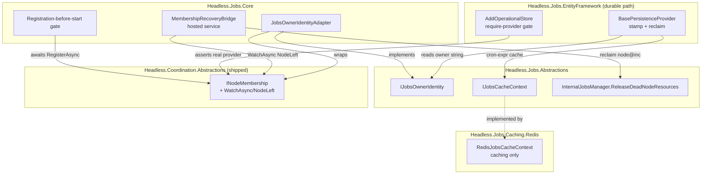
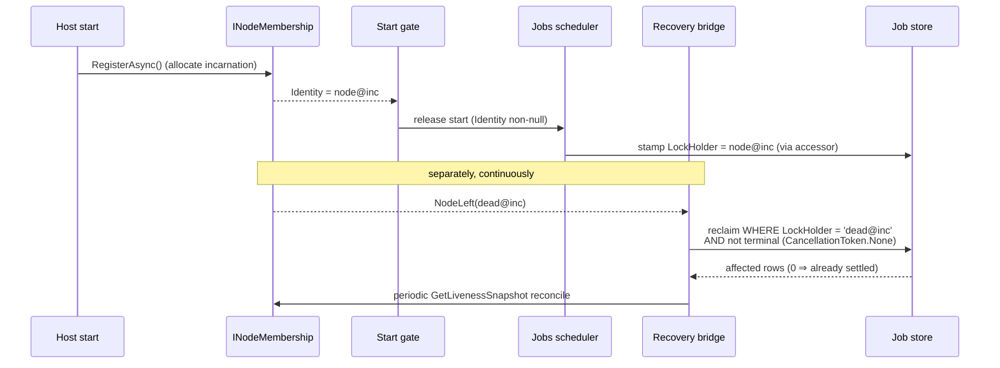

# feat: Migrate Headless.Jobs node membership & dead-node recovery onto Headless.Coordination

> **Scope of this plan (Slice 3 of issue #396).** Move Jobs node identity, liveness, and dead-node
> recovery off the Redis-only `IJobsRedisContext` path and onto the shipped `Headless.Coordination`
> substrate (`INodeMembership`, `node@incarnation` identity, `NodeLeft` events). Add a Dashboard
> live-nodes view backed by the substrate's liveness snapshot. **Out of scope:** Messaging recovery
> (Slice 4, separate plan), leadership election, HRW rebalance, any change to the job-table schema
> (the `LockHolder` column already carries the owner stamp). The Coordination substrate itself —
> Abstractions, Core, Core.Database, PostgreSql, SqlServer, Redis providers, conformance harness — is
> **already built and merged** (PR #416, commit `db3f76195`); this plan consumes it.

---

## 1. Problem Frame

Today Jobs membership/liveness is **siloed in `Headless.Jobs.Caching.Redis` and Redis-only**:

- Identity is `SchedulerOptionsBuilder.NodeIdentifier` = `Environment.MachineName` — a stable string
  with **no incarnation** (`src/Headless.Jobs.Abstractions/JobsOptionsBuilder.cs:182`). It is captured
  once at construction into `BasePersistenceProvider.LockHolder`
  (`src/Headless.Jobs.EntityFramework/Infrastructure/BasePersistenceProvider.cs:22`) and stamped onto
  the nullable `LockHolder` / `LockedAt` columns.
- Liveness is `IJobsRedisContext.NotifyNodeAliveAsync` / `GetDeadNodesAsync`, driven by
  `NodeHeartBeatBackgroundService` (`src/Headless.Jobs.Caching.Redis/`). Without Redis the default is
  `NoOpJobsRedisContext` — `GetDeadNodesAsync` returns empty and the heartbeat service is never
  registered, so **dead-node recovery silently vanishes on the EF/Postgres-without-Redis path**.
- The only recovery on the no-Redis path is an EF startup hook
  (`src/Headless.Jobs.EntityFramework/DependencyInjection/ServiceExtension.cs`, `_UseApplicationService`)
  that calls `ReleaseDeadNodeResources(NodeIdentifier)` once at `ApplicationStarted`. It works **only
  because `MachineName` is stable across restarts** — a restarted process reclaims its own orphaned rows
  by name-match.

The structural goal (origin §1.2, §5.2) is to consume the shared substrate once so recovery becomes
**backend-neutral and restart-safe**: the row owner becomes `node@incarnation`, and a reliable
`NodeLeft(node@inc)` signal drives reclaim — regardless of whether Redis is present.

Two facts complicate the swap and shape the units below:

1. **`IJobsRedisContext` is dual-purpose.** Beyond membership, it provides cron-expression **caching**
   (`GetOrSetArrayAsync`, `DistributedCache`, `HasRedisConnection`) consumed by
   `BasePersistenceProvider.cs:426` and `JobsEFCorePersistenceProvider.cs:203,223,244`. The caching role
   must survive; only the membership role moves out.
2. **Identity becomes late and runtime-resolved.** `node@incarnation` is store-allocated and only known
   after `INodeMembership.RegisterAsync` completes at host start (`MembershipService.cs:24-45`), and it
   reverts to `null` on membership loss (`MembershipService.cs:61`). It can no longer be a
   construction-time constant.

---

## 2. Requirements

Carried from origin `docs/specs/coordination-primitive.md` (§4b, §5.2, §7) and the resolved scoping
decisions for this plan. R-IDs are plan-local.

- **R1 — Owner stamp is `node@incarnation`.** The durable (EF operational-store) path stamps
  `LockHolder` with the current `INodeMembership.Identity` rendered as `node@incarnation`
  (`NodeIdentity.ToString()`), not `MachineName`.
- **R2 — Recovery is event-driven.** Dead-node reclaim is triggered by `NodeLeft(node@inc)` from the
  substrate's `WatchAsync` stream, with a periodic snapshot reconcile (events are best-effort, origin
  §4b invariant). Reclaim matches `owner = node@inc` exactly.
- **R3 — Recovery is backend-neutral.** Recovery works on the EF/Postgres path **without** Redis, via
  the mandatory DB-heartbeat Coordination provider (origin §5.2 Finding B). The old EF startup
  self-reclaim hook is removed; `NodeLeft` is the recovery trigger.
- **R4 — Reclaim predicate is strict.** Dead-node reclaim uses exact `LockHolder == owner` and **drops**
  the loose `LockedAt == null` arm that `WhereCanAcquire` carries (origin §5.2); acquisition keeps the
  loose arm. The two predicates diverge.
- **R5 — Fail-fast, require-a-provider.** The durable operational-store path **requires** a registered
  real Coordination provider; it fails fast at startup if only `NullNodeMembership` (the `null@1`
  default) is present. The in-memory single-process path is unaffected.
- **R6 — Registration precedes stamping.** No job is stamped before `Identity` is non-null; scheduler
  processing start is gated on `RegisterAsync` completing.
- **R7 — Caching seam preserved.** Cron-expression caching keeps working; the membership role is cleanly
  removed from the Redis context.
- **R8 — Dashboard live-nodes view.** The Dashboard surfaces live nodes (identity, role, state,
  last-beat) from `INodeMembership.GetLivenessSnapshotAsync`, updated by membership events over the
  existing SignalR hub.
- **R9 — Graceful loss handling.** On local membership loss (`LocalMembershipLostToken`), the durable
  path stops stamping/processing (fail-stop, origin §7.1) rather than stamping with a stale owner.

---

## 3. Key Technical Decisions

- **KTD1 — Identity via a thin Jobs-owned accessor seam (not direct `INodeMembership` injection).**
  Introduce a one-member `IJobsOwnerIdentity` in `Headless.Jobs.Abstractions`; a single adapter in
  `Headless.Jobs.Core` implements it over `INodeMembership`. `BasePersistenceProvider` and
  `LoggerInstrumentation` read the accessor instead of capturing `NodeIdentifier` at construction.
  **Why:** keeps the full `Headless.Coordination.Abstractions` dependency out of the low-level EF
  persistence layer (origin §6 "consume only the small abstractions they need"); centralizes the
  "not-registered / membership-lost" policy in one place instead of scattering null-checks across ~10
  stamp sites; `LockHolder` is already a `string`, so stamp sites change from a field read to a property
  read; reclaim-query tests inject a fake accessor with no Coordination dependency. *(User-confirmed
  fork.)*
- **KTD2 — Require-a-provider binds to the durable EF path, not Jobs.Core globally.** The fail-fast gate
  lives in `AddOperationalStore` wiring. The default in-memory single-process provider
  (`JobsInMemoryPersistenceProvider` + `NoOpJobsRedisContext`) needs no cross-node recovery and stays
  zero-infra. **Why:** preserves the in-memory dev path while making the multi-node durable path safe;
  avoids forcing Coordination onto users who don't run a cluster. *(User-confirmed: fail-fast /
  require-a-provider.)*
- **KTD3 — Rely on `NodeLeft` for no-Redis recovery; delete the startup self-reclaim hook.** Per origin
  §5.2 Finding B, the mandatory DB-heartbeat provider supplies liveness, so the EF `_UseApplicationService`
  immediate self-reclaim is removed and recovery flows through `NodeLeft(node@inc)`. **Trade-off:**
  fast-restart recovery on the no-Redis path moves from *immediate* (old machine-name self-match) to
  *TTL-bounded* (predecessor incarnation detected dead after heartbeat expiry). This latency change is
  the accepted consequence of incarnation-qualified identity (see Risk R-1).
- **KTD4 — Split `IJobsRedisContext` into a caching seam + membership-via-Coordination.** Extract the
  caching members into `IJobsCacheContext`; route membership to `INodeMembership`. **Why:** the two
  concerns were only co-located because both happened to use Redis; they have different lifetimes and
  different providers (origin §6, learnings: unified-provider-setup-builder-pattern).
- **KTD5 — Divergent acquire vs reclaim predicates.** Keep `WhereCanAcquire` (loose `LockedAt == null`
  arm) for acquisition; add `WhereOwnedBy(owner)` (strict `LockHolder == owner`) for dead-node reclaim.
  **Why:** with incarnation, a survivor reacting to a dead incarnation must reclaim only that
  incarnation's rows, never unowned-but-idle rows or a fast-restart's freshly-stamped rows (origin §4b
  invariant; learnings: terminal-state-overwrite-on-redelivery).
- **KTD6 — Reclaim writes use `CancellationToken.None` after classifying cancellation once.** A
  `NodeLeft` reclaim racing host shutdown must not be torn down mid-write (learnings:
  terminal-state-overwrite-on-redelivery rule b). The conditional reclaim `UPDATE` returns affected-rows;
  the handler treats a zero result as "another reclaimer or the recovered node won" and does not assume
  ownership.

---

## 4. High-Level Technical Design

### 4.1 Component shape after migration

The dual-purpose Redis context splits; the EF persistence layer depends only on a tiny Jobs abstraction;
the Coordination dependency is isolated to one adapter and one bridge in `Headless.Jobs.Core`.

### 4.2 Stamp + recovery sequence

### 4.3 Predicate divergence (KTD5)

| Path | Predicate | Loose `LockedAt == null` arm? |
|---|---|---|
| Acquire next jobs | `WhereCanAcquire(owner)` | **Yes** — claim idle/unlocked rows |
| Dead-node reclaim | `WhereOwnedBy(deadOwner)` (`LockHolder == deadOwner` AND not terminal) | **No** — only the dead incarnation's rows |

---

## 5. Implementation Units

### U1. Owner-identity accessor seam

**Goal:** Replace the construction-time `NodeIdentifier` constant with a runtime `node@incarnation`
owner string sourced from a thin Jobs abstraction.

**Requirements:** R1, R6, R9.

**Dependencies:** none (foundation).

**Files:**
- `src/Headless.Jobs.Abstractions/Interfaces/IJobsOwnerIdentity.cs` (new — `string DisplayOwner { get; }` (never throws), `bool TryGetStampOwner(out string owner)`, `CancellationToken MembershipLostToken { get; }`)
- `src/Headless.Jobs.Abstractions/Coordination/DefaultJobsOwnerIdentity.cs` (new — fallback over `NodeIdentifier`/machine name, `MembershipLostToken == None`; registered `TryAddSingleton` in Jobs.Core)
- `src/Headless.Jobs.Core/Coordination/JobsOwnerIdentityAdapter.cs` (new — implements `IJobsOwnerIdentity` over `INodeMembership`; durable path overrides the default)
- `src/Headless.Jobs.EntityFramework/Infrastructure/BasePersistenceProvider.cs` (stamp sites use `TryGetStampOwner`)
- `src/Headless.Jobs.Abstractions/Instrumentation/LoggerInstrumentation.cs` (display owner from accessor)
- `src/Headless.Jobs.OpenTelemetry/OpenTelemetryInstrumentation.cs` (`InstanceIdentifier` activity tag from `DisplayOwner`)
- `src/Headless.Jobs.Core/DependencyInjection/JobsServiceExtensions.cs` (`TryAddSingleton` the default fallback)
- `tests/Headless.Jobs.Tests.Unit/Coordination/JobsOwnerIdentityAdapterTests.cs` (new)

**Approach:** Two clearly separated owner reads (review findings 1.2, 1.3, 2.1):
- **`DisplayOwner`** — best-effort label for logging/telemetry; **never throws**. Returns the current
  `node@incarnation` when registered, else a safe fallback (machine name / `NodeIdentifier`). Read by
  `LoggerInstrumentation` and `OpenTelemetryInstrumentation` (both singletons on the activity/telemetry
  hot path — a throwing getter there would mask the original exception and crash the logger).
- **`TryGetStampOwner(out owner)`** — the **authoritative stamp gate**. Returns `false` when `Identity`
  is `null` (not yet registered or membership lost). `BasePersistenceProvider` stamp sites call this and
  refuse to stamp on `false` (defense-in-depth behind the U5 start gate); they never stamp a fallback owner.
- **`MembershipLostToken`** — `CancellationToken.None` on the default path, `INodeMembership.LocalMembershipLostToken`
  on the coordinated path; consumed by the scheduler loops in U5 for fail-stop (R9).

A `DefaultJobsOwnerIdentity` is registered `TryAddSingleton` in `JobsServiceExtensions` so the zero-infra
in-memory path resolves the abstraction; the durable path overrides it with `JobsOwnerIdentityAdapter`.
Do **not** inject `INodeMembership` into the EF layer (KTD1).

**Patterns to follow:** keyed/abstraction-injection conventions (learnings:
`keyed-services-for-overridable-abstractions`); accessor mirrors how `LockHolder` is already a plain
`string`.

**Test suite design:** Unit (pure adapter logic over a fake `INodeMembership`); the stamp wiring is
proven in U7 integration.

**Test scenarios:**
- Happy: registered identity `node-a@5` → `DisplayOwner == "node-a@5"`, `TryGetStampOwner` true with `"node-a@5"`.
- Edge: `Identity` null → `TryGetStampOwner` false; `DisplayOwner` returns the machine-name fallback and **does not throw** (covers finding 2.1 — logging/telemetry safe).
- Edge: identity transitions null → set → null (membership loss) → accessor reflects each state on next read (no caching of a stale owner).
- Edge: default `DefaultJobsOwnerIdentity` (in-memory path) → `DisplayOwner` returns `NodeIdentifier`; `MembershipLostToken == CancellationToken.None`.
- Covers R9: after `LocalMembershipLostToken` fires and `Identity` clears, `TryGetStampOwner` returns false and `MembershipLostToken` is signalled.

**Verification:** Adapter unit tests pass; `DisplayOwner` never throws on any state; `BasePersistenceProvider`
compiles against the accessor with no `INodeMembership` reference in `Headless.Jobs.EntityFramework`; the
in-memory path resolves `IJobsOwnerIdentity` without a Coordination provider.

---

### U2. Membership-recovery bridge (NodeLeft → reclaim)

**Goal:** Drive dead-node reclaim from the substrate's event stream plus a periodic snapshot reconcile,
replacing the Redis heartbeat-poll dead-node loop.

**Requirements:** R2, R3, KTD6.

**Dependencies:** U1.

**Files:**
- `src/Headless.Jobs.Core/Coordination/MembershipRecoveryBridge.cs` (new — `BackgroundService`)
- `src/Headless.Jobs.Core/DependencyInjection/JobsServiceExtensions.cs` (register bridge on durable path)
- `tests/Headless.Jobs.Tests.Unit/Coordination/MembershipRecoveryBridgeTests.cs` (new)

**Approach:** `WatchAsync(stoppingToken)`; on `NodeLeft(identity)` call
`internalJobsManager.ReleaseDeadNodeResources(identity.ToString(), CancellationToken.None)` (KTD6).
Run a periodic `GetLivenessSnapshotAsync` reconcile (interval from options) to catch nodes whose `Dead`
transition was missed while not subscribed, reclaiming any `Dead` identity not already handled — reclaim
must be **idempotent** (the strict conditional UPDATE in U3 makes a second reclaim a no-op). Dispose the
async enumerator on stop (the substrate contract requires it). Do **not** reclaim on `NodeSuspected`
(only `NodeLeft`/`Dead`).

**Reconcile de-dup (finding 4.1):** Dead nodes linger in the snapshot (`Dead` state) for the whole
retention window, so a naive reconcile re-issues a 0-row reclaim UPDATE for every dead node every tick.
Keep an in-memory `HashSet<string>` of already-reclaimed `node@incarnation`; reclaim a dead identity
once, add it to the set, and prune entries that have disappeared from the snapshot (so a future
same-id incarnation is never wrongly suppressed). Events and reconcile both consult the set, so a
`NodeLeft` event followed by a reconcile tick does not double-write.

**Execution note:** Start with a failing test asserting `NodeLeft(node-a@5)` produces exactly one
`ReleaseDeadNodeResources("node-a@5")` call.

**Patterns to follow:** `MembershipHeartbeatBackgroundService` event-diff shape; learnings:
`redlock-multi-instance-not-adopted` (recovery is at-least-once + dedup, not stronger locks),
`startup-pause-gating-and-half-open-recovery` (a swallowed failure must stay observable).

**Test suite design:** Unit with a fake `INodeMembership` emitting a scripted event sequence + a spy
`IInternalJobManager`; end-to-end reclaim against a real store is U7.

**Test scenarios:**
- Happy: `NodeLeft(node-a@5)` → one reclaim call with `"node-a@5"`.
- Edge: `NodeSuspected` then `NodeRecovered` → **no** reclaim.
- Edge: duplicate `NodeLeft(node-a@5)` (event + reconcile) → reclaim invoked once; the reclaimed-set suppresses the second; no exception.
- Edge: dead `node-a@5` persists across N reconcile ticks → exactly one reclaim call total (de-dup set), then suppressed.
- Edge: `node-a@5` leaves the snapshot then a new `node-a@6` appears and dies → `node-a@6` is reclaimed (set pruned `node-a@5`, did not suppress the new incarnation).
- Error: `ReleaseDeadNodeResources` throws → logged, identity **not** added to the reclaimed-set (so it retries next tick), loop continues (failure observable, not silently swallowed).
- Cancellation: host stop cancels `WatchAsync`; enumerator disposed; in-flight reclaim uses `CancellationToken.None` and is allowed to complete.

**Verification:** Bridge unit tests pass; no reclaim on suspected/recovered; reclaim idempotent under duplicate `NodeLeft`.

---

### U3. Strict dead-node reclaim predicate

**Goal:** Diverge the reclaim predicate from the acquire predicate so reclaim matches the dead
incarnation exactly.

**Requirements:** R4, KTD5, KTD6.

**Dependencies:** U1.

**Files:**
- `src/Headless.Jobs.EntityFramework/Infrastructure/JobsQueryExtensions.cs` (add `WhereOwnedBy`)
- `src/Headless.Jobs.EntityFramework/Infrastructure/BasePersistenceProvider.cs` (`ReleaseDeadNode{TimeJob,Occurrence}Resources` use `WhereOwnedBy`; return affected rows)
- `tests/Headless.Jobs.Tests.Unit/Infrastructure/JobsQueryPredicateTests.cs` (new — in-memory `IQueryable` predicate shape)

**Approach:** Add `WhereOwnedBy<T>(this IQueryable<T>, string owner)` = `Status in {Idle,Queued,InProgress}`
(reclaim must also recover `InProgress` rows the dead node was mid-execution on, mirroring the existing
`Status == InProgress` reclaim arms at `BasePersistenceProvider.cs:276,546`) **AND** `LockHolder == owner`,
with the terminal-state guard preserved and the loose `LockedAt == null` arm **dropped**. Keep
`WhereCanAcquire` unchanged for acquisition. Make the reclaim UPDATE return affected rows.

**Atomicity (finding 3.1, defensive):** `ReleaseDeadNode{TimeJob,Occurrence}Resources` issue two
`ExecuteUpdateAsync` statements (release Idle/Queued + handle InProgress). Wrap the pair in a single
transaction so a crash between them can't leave a half-reclaimed node. This is insurance, not a
correctness gap — the idempotent reconcile (U2) already re-reclaims a partially-applied node on the next
tick — but the transaction is cheap and removes the transient half-state. Use `CancellationToken.None`
for the reclaim writes (KTD6).

**Patterns to follow:** existing `WhereCanAcquire`; learnings: `terminal-state-overwrite-on-redelivery`
(conditional UPDATE returns affected-rows, terminal predicate includes the retry axis).

**Test suite design:** Unit for predicate shape (LINQ-to-objects); cross-provider behavior (Postgres +
SqlServer) is U7.

**Test scenarios:**
- Happy: rows owned by `node-a@5` (Idle/Queued/InProgress, non-terminal) → selected.
- Edge: an unowned idle row (`LockedAt == null`, `LockHolder == null`) → **not** selected (the dropped loose arm; this is the core behavior change from today).
- Edge: a fast-restart row freshly stamped `node-a@6` → **not** selected when reclaiming `node-a@5`.
- Edge: a terminal row owned by `node-a@5` → **not** selected (terminal guard intact).
- Covers R4: reclaiming `node-a@5` never touches `node-a@6` or unowned rows.

**Verification:** Predicate unit tests pass; reclaim no longer selects unowned-idle rows; acquire path predicate unchanged.

---

### U4. Split `IJobsRedisContext` — extract caching seam, remove membership role

**Goal:** Separate cron-expression caching from membership; delete the Redis membership implementation.

**Requirements:** R7.

**Dependencies:** U2 (recovery no longer needs the Redis dead-node path before removal).

**Files:**
- `src/Headless.Jobs.Abstractions/Interfaces/IJobsCacheContext.cs` (new — `GetOrSetArrayAsync`, `DistributedCache`, `HasRedisConnection`)
- `src/Headless.Jobs.Abstractions/Interfaces/IJobsRedisContext.cs` (delete)
- `src/Headless.Jobs.Abstractions/Temps/NoOpJobsRedisContext.cs` → `NoOpJobsCacheContext.cs` (caching no-op only)
- `src/Headless.Jobs.Caching.Redis/JobsRedisContext.cs` → `RedisJobsCacheContext.cs` (caching only; membership methods removed)
- `src/Headless.Jobs.Caching.Redis/NodeHeartBeatBackgroundService.cs` (delete)
- `src/Headless.Jobs.Caching.Redis/Setup.cs` (register cache context; drop heartbeat service + membership)
- `src/Headless.Jobs.EntityFramework/Infrastructure/BasePersistenceProvider.cs`, `JobsEFCorePersistenceProvider.cs` (consume `IJobsCacheContext`)
- `src/Headless.Jobs.Core/DependencyInjection/JobsServiceExtensions.cs` (default `NoOpJobsCacheContext`)
- `tests/Headless.Jobs.Tests.Unit/Caching/NoOpJobsCacheContextTests.cs` (new)

**Approach:** Mechanical extraction. The caching members move verbatim into `IJobsCacheContext`;
`GetDeadNodesAsync` / `NotifyNodeAliveAsync` are deleted (their behavior now lives in Coordination +
U2). `RedisJobsCacheContext` keeps `GetOrSetArrayAsync` + `DistributedCache` + `HasRedisConnection`.
The old `UpdateNodeHeartBeatAsync` push (dashboard node feed) is removed here and re-sourced from
membership events in U6.

**Opportunistic fix (finding 5.1, in blast radius):** `BasePersistenceProvider.GetAllCronJobExpressions`
(`BasePersistenceProvider.cs:424-452`) currently calls `GetOrSetArrayAsync` into `result` and then
**ignores `result`**, issuing a fresh DB query on every call — the cache is populated but never read,
so the cache is dead weight. Since this method is one of the exact call sites being migrated to
`IJobsCacheContext`, fix it here: return the cached `result` when non-null, falling through to the DB
read only on a cache miss/failure. Pin with a test asserting a cache hit skips the DB factory.

**Patterns to follow:** learnings: `unified-provider-setup-builder-pattern` (caching seam stays in
`*.Core`/`*.Caching.Redis`, never drags EF), `keyed-services-for-overridable-abstractions`.

**Test suite design:** Unit for the no-op cache fallback; Redis cache behavior is exercised by existing
EF-provider cron-expression cache paths in U7.

**Test scenarios:**
- Happy: `NoOpJobsCacheContext.GetOrSetArrayAsync` invokes the factory and returns its result.
- Edge: `HasRedisConnection` false on no-op → EF provider skips cache invalidation (matches `JobsEFCorePersistenceProvider.cs:203` guard).
- Covers finding 5.1: `GetAllCronJobExpressions` with a populated cache returns the cached value and does **not** invoke the DB factory; with an empty cache it falls through to the DB and populates the cache.
- Test expectation note: pure interface relocation of `GetOrSetArrayAsync` body carries its existing behavior; assert the factory-passthrough contract.

**Verification:** No references to `IJobsRedisContext`, `GetDeadNodesAsync`, `NotifyNodeAliveAsync`, or `NodeHeartBeatBackgroundService` remain (`grep` clean); cron-expression caching still works in U7.

---

### U5. Require-a-provider fail-fast + registration-before-start gate

**Goal:** The durable operational-store path requires a real Coordination provider and never stamps
before registration completes.

**Requirements:** R3, R5, R6.

**Dependencies:** U1, U2.

**Files:**
- `src/Headless.Jobs.EntityFramework/DependencyInjection/ServiceExtension.cs` (delete `_UseApplicationService` self-reclaim hook; add require-provider assertion + override `IJobsOwnerIdentity` with the coordinated adapter + register bridge on the durable path)
- `src/Headless.Jobs.Core/Coordination/JobsCoordinationStartupGate.cs` (new — `IHostedLifecycleService` that awaits the Coordination storage initializer then registration before scheduler start)
- `src/Headless.Jobs.Core/Background/JobsSchedulerBackgroundService.cs` (link execution loop to `IJobsOwnerIdentity.MembershipLostToken` for fail-stop)
- `src/Headless.Jobs.Core/DependencyInjection/JobsServiceExtensions.cs` (ordering: gate before scheduler hosted service)
- `tests/Headless.Jobs.Tests.Unit/Coordination/RequireProviderTests.cs` (new)

**Approach:** At `AddOperationalStore` wiring, resolve `INodeMembership`; if it is `NullNodeMembership`
(or absent), throw a clear configuration exception naming the fix (register a Coordination provider via
`AddHeadlessCoordination(...)`). On the durable path also override the `DefaultJobsOwnerIdentity` (U1)
with the coordinated `JobsOwnerIdentityAdapter`.

**Startup ordering (finding 1.1).** The gate runs in `IHostedLifecycleService.StartingAsync` (before
`IHostedService.StartAsync`, learnings: `storage-initializer-lifecycle-correctness`) and must:
1. Resolve `IMembershipStorageInitializer` if present and `await` its completion — the Coordination
   schema is created during startup, and `RegisterAsync` writes to that schema. Registering before the
   table exists crashes host start.
2. Call `membership.RegisterAsync()` (the substrate heartbeat service's `if (Identity is null)` guard
   makes its own later registration a no-op, so this is not a double-register).
3. Release the scheduler only after `Identity` is non-null (R6).

**Fail-stop wiring (finding 1.3, R9).** The scheduler execution loop links its internal token to
`IJobsOwnerIdentity.MembershipLostToken` so that on local membership loss the loop exits cleanly instead
of spinning on a refused stamp or processing with a stale owner. On the in-memory path that token is
`CancellationToken.None` (never fires), so behavior is unchanged there.

Delete the EF startup self-reclaim hook (KTD3) — recovery now flows through U2.

**Execution note:** Add a failing test first asserting `AddOperationalStore` without a Coordination
provider throws at build/startup.

**Patterns to follow:** `unified-provider-setup-builder-pattern` (exactly-one-provider gate, hard-fail
at host start); existing `JobsInitializationHostedService` ordering comment in `JobsServiceExtensions.cs:58`.

**Test suite design:** Unit for the fail-fast assertion (DI build); start-ordering proven in U7
integration (stamp never observed before registration).

**Test scenarios:**
- Happy: durable path + registered Postgres Coordination provider → builds and starts.
- Error: durable path + no provider (`NullNodeMembership`) → throws configuration exception naming `AddHeadlessCoordination`.
- Edge: in-memory single-process path (no `AddOperationalStore`) + no provider → builds and runs (KTD2 — in-memory unaffected; default `IJobsOwnerIdentity` resolves).
- Covers finding 1.1: gate awaits the storage initializer before registering — registration never runs against a missing schema (assert ordering with a fake initializer that completes after a delay).
- Covers finding 1.3 / R9: signalling `MembershipLostToken` causes the scheduler loop to exit (no further job processing).
- Covers R6: gate blocks scheduler start until `Identity` non-null (ordering assertion in U7).

**Verification:** Fail-fast test passes; in-memory path still runs without Coordination; registration is
ordered after the storage initializer; scheduler stops on membership loss; no `_UseApplicationService`
self-reclaim hook remains.

---

### U6. Dashboard live-nodes view

**Goal:** Surface live nodes (identity, role, state, last-beat) in the Dashboard, fed by the substrate's
liveness snapshot and membership events.

**Requirements:** R8.

**Dependencies:** U2 (event stream), U4 (old Redis node feed removed).

**Files:**
- `src/Headless.Jobs.Dashboard/Endpoints/DashboardEndpoints.cs` (new live-nodes endpoint reading `GetLivenessSnapshotAsync`)
- `src/Headless.Jobs.Dashboard/Hubs/JobsNotificationHubSender.cs` (node push from membership events, replacing `UpdateNodeHeartBeatAsync`)
- `src/Headless.Jobs.Dashboard/Coordination/MembershipDashboardBridge.cs` (new — subscribes `WatchAsync`, pushes Joined/Suspected/Recovered/Left to the hub)
- `src/Headless.Jobs.Dashboard/Infrastructure/Dashboard/JobsDashboardRepository.cs` (node-view projection)
- `src/Headless.Jobs.Dashboard/wwwroot/src/**` (Vue 3 + Vite SPA — nodes panel component + SignalR client handler; `App.vue`/`Dashboard.vue` wire it in)
- `src/Headless.Jobs.Dashboard/wwwroot/dist/**` (rebuilt embedded assets — see build step)
- `tests/Headless.Jobs.Tests.Unit/Dashboard/MembershipDashboardBridgeTests.cs` (new)

**Approach:** A read endpoint projects `NodeLivenessSnapshot` (identity, role, state, metadata) to a
view model. A dashboard-side bridge subscribes to membership events and pushes deltas over the existing
SignalR hub (`JobsNotificationHub`) so the panel updates live without polling. This replaces the removed
Redis-driven `UpdateNodeHeartBeatAsync` feed (U4) with a membership-event-driven one. The frontend is a
Vue 3 + Vite SPA whose `dist` output is embedded into the assembly via `<EmbeddedResource Include="wwwroot/dist/**/*">`
(`Headless.Jobs.Dashboard.csproj:15`).

**Frontend build step (finding 1.4).** The csproj has **no automatic npm/Vite target** — editing the Vue
sources alone will not change the running dashboard until `wwwroot/dist` is regenerated. The unit of work
must run `npm install` then `npm run build` in `src/Headless.Jobs.Dashboard/wwwroot/` and commit the
rebuilt `dist` so the new nodes panel is packaged. Verify the running dashboard reflects the change, not
just the source.

**Patterns to follow:** existing `JobsNotificationHub` / `JobsNotificationHubSender` SignalR shape;
substrate `NodeLivenessSnapshot` / `NodeLivenessState`.

**Test suite design:** Unit for the dashboard bridge (fake membership events → spy hub sender);
integration for the endpoint is optional and covered by the dashboard's existing endpoint test approach
if present, otherwise deferred to manual verification (note in U7).

**Test scenarios:**
- Happy: snapshot of two `Alive` nodes → endpoint returns both with role/state.
- Happy: `NodeJoined` / `NodeLeft` events → hub sender receives matching push payloads.
- Edge: `NodeSuspected` → pushed with `Suspected` state (not dropped, not treated as Left).
- Edge: empty snapshot (single node, others left) → endpoint returns just the local node.

**Verification:** Endpoint returns the live-node projection; bridge unit tests show event-to-hub push;
no references to the removed `UpdateNodeHeartBeatAsync` node feed remain.

---

### U7. Integration test infrastructure — `Headless.Jobs.EntityFramework.Tests.Integration`

**Goal:** Prove the behavioral contract (stamp, event-driven reclaim, strict predicate, fail-fast,
start-ordering) against a real database + real Coordination provider.

**Requirements:** R1–R6 (behavioral verification).

**Dependencies:** U1–U5.

**Files:**
- `tests/Headless.Jobs.EntityFramework.Tests.Integration/Headless.Jobs.EntityFramework.Tests.Integration.csproj` (new — `Headless.NET.Sdk.Test`)
- `tests/Headless.Jobs.EntityFramework.Tests.Integration/JobsCoordinationFixture.cs` (new — Testcontainers Postgres for both the Jobs store and the Coordination Postgres provider)
- `tests/Headless.Jobs.EntityFramework.Tests.Integration/DeadNodeRecoveryTests.cs` (new)
- `tests/Headless.Jobs.EntityFramework.Tests.Integration/OwnerStampTests.cs` (new)
- `tests/Headless.Jobs.EntityFramework.Tests.Integration/StartupOrderingTests.cs` (new)
- attach project to `headless-framework.slnx`

**Approach:** Boot a host with `AddOperationalStore` (EF/Postgres) + `AddHeadlessCoordination(UsePostgreSql)`.
Drive real registration, stamping, and a simulated node death (force the dead incarnation's liveness to
expire / leave) to assert `NodeLeft`-driven reclaim. This is the **bulk** of behavioral coverage per the
repo's testing-diamond convention; it is the only place predicate divergence and start-ordering are
proven against real SQL on both providers where practical (SqlServer fixture optional follow-up).

**Patterns to follow:** `Headless.Coordination.PostgreSql.Tests.Integration` fixture +
`Headless.Coordination.Tests.Harness`; repo harness rule in `CLAUDE.md`; learnings:
`storage-initializer-lifecycle-correctness` (boot N hosts via `Task.WhenAll` for concurrent-startup).

**Test suite design:** New integration project (Testcontainers). If a 2nd Jobs provider integration
project later lands (SqlServer), extract a `Headless.Jobs.EntityFramework`-shared fixture base per the
repo harness rule — flagged, not built here.

**Test scenarios:**
- Covers R1: a queued job is stamped `LockHolder == node@inc` (matches the registered identity).
- Covers R2/R3: kill node A@5 (expire liveness); survivor observes `NodeLeft(A@5)` and reclaims A@5's non-terminal rows; works **with Redis absent**.
- Covers R4: reclaiming A@5 leaves an unowned-idle row and a fresh A@6 row untouched; a terminal A@5 row untouched.
- Covers R5: host configured with `AddOperationalStore` but no Coordination provider fails to start with a clear message.
- Covers R6: no row is observed stamped before registration completes (assert ordering via a barrier in the gate).
- Concurrent startup: boot 3 hosts via `Task.WhenAll`; each registers a distinct incarnation; no cross-claim.
- Idempotency: deliver `NodeLeft(A@5)` twice → second reclaim affects zero rows, no error.

**Verification:** All scenarios pass against Testcontainers Postgres with Docker; recovery verified with
Redis both present and absent.

---

### U8. Documentation sync

**Goal:** Update agent-facing and package docs for the new membership/recovery model.

**Requirements:** R3, R5, R8 (consumer-visible behavior + config changes).

**Dependencies:** U1–U6.

**Files:**
- `docs/llms/jobs.md` (recovery model, require-a-provider, dashboard nodes view)
- `src/Headless.Jobs.EntityFramework/README.md` and/or `src/Headless.Jobs.Core/README.md` (consumer setup: `AddHeadlessCoordination` now required for the durable path)
- `docs/llms/coordination.md` (add Jobs as a consumer example, if present)

**Approach:** Follow `docs/authoring/AUTHORING.md` drift checks. Document: identity is `node@incarnation`;
recovery is `NodeLeft`-driven and backend-neutral; the durable path requires a Coordination provider
(with the exact registration snippet); Redis is now caching-only for Jobs; the no-Redis fast-restart
recovery is TTL-bounded (KTD3 trade-off); the dashboard nodes view.

**Test suite design:** none (docs).

**Test scenarios:** `Test expectation: none — documentation only.`

**Verification:** Docs reviewer pass; `docs/llms/jobs.md` and the package README agree on the require-a-provider setup and recovery model.

---

## 6. Scope Boundaries

### In scope
- Jobs durable-path identity → `node@incarnation` (accessor seam).
- Event-driven dead-node recovery via `NodeLeft` + snapshot reconcile.
- Strict reclaim predicate; caching/membership split; fail-fast require-a-provider + start gate.
- Dashboard live-nodes view (user-confirmed in scope, overriding origin §8's dashboard deferral for this slice).
- New Jobs EF integration test project.

### Out of scope (true non-goals)
- Consensus-grade leadership, split-brain safety (origin §1.5 ceiling).
- HRW/shard rebalance on membership change.
- Changing the job-table schema (the `LockHolder` string column already carries the stamp).

### Deferred to follow-up work
- **Messaging recovery onto Coordination** — Slice 4, separate plan (origin §5.3).
- **SqlServer Jobs integration fixture + shared `Headless.Jobs.EntityFramework` harness base** — extract when the 2nd provider integration project lands (repo harness rule).
- **Immediate same-node startup self-reclaim optimization** — to recover the pre-migration *immediate* (vs TTL-bounded) recovery latency on fast restarts, if the latency change (Risk R-1) proves material.
- **Leadership lease for singleton sweepers** (origin §8).

---

## 7. Risks & Dependencies

- **R-1 (behavioral, accepted) — no-Redis recovery latency regression.** Recovery on the EF/Postgres
  path moves from *immediate* (old machine-name self-reclaim) to *TTL-bounded* (predecessor incarnation
  detected dead after heartbeat expiry). Mitigation: documented (U8); tune Coordination heartbeat/TTL;
  optional immediate self-reclaim deferred (§6).
- **R-2 (correctness) — reclaim racing a fast restart.** A survivor reclaiming `A@5` must never touch
  `A@6`'s freshly-stamped rows. Mitigated by the strict `LockHolder == owner` predicate (U3) and
  incarnation-keyed `NodeLeft` (origin §4b invariant); pinned by U7 scenario "fresh A@6 untouched."
- **R-3 (correctness) — stamp before registration.** A job stamped before `Identity` is set would carry
  a wrong/empty owner. Mitigated by the start gate (U5) + accessor fail-stop (U1); pinned by U7 R6 scenario.
- **R-4 (reliability) — event loss.** `WatchAsync` is best-effort; a missed `NodeLeft` would strand a
  dead node's rows. Mitigated by the periodic snapshot reconcile (U2) reclaiming any `Dead` identity.
- **R-5 (process) — Jobs has no prior integration harness.** Standing up Testcontainers + dual-DB
  (Jobs store + Coordination store) is net-new for Jobs (U7). Mitigated by reusing the Coordination
  PostgreSql fixture shape.
- **R-6 (regression) — in-memory path DI break.** `LoggerInstrumentation` / `OpenTelemetryInstrumentation`
  run on all paths and now consume `IJobsOwnerIdentity`; without a default the zero-infra in-memory path
  would fail DI resolution. Mitigated by `TryAddSingleton<IJobsOwnerIdentity, DefaultJobsOwnerIdentity>`
  in Jobs.Core (U1), overridden on the durable path (finding 1.2).
- **R-7 (correctness) — throwing owner getter masks exceptions.** A display-owner getter that throws
  during logging/telemetry would crash the logger and hide the original error. Mitigated by the
  `DisplayOwner` (never-throws) vs `TryGetStampOwner` (gate) split (U1, finding 2.1).
- **R-8 (process) — stale dashboard assets.** The Vue SPA is embedded from `wwwroot/dist`; editing
  sources without rebuilding ships an unchanged dashboard. Mitigated by the explicit npm build step in U6
  (finding 1.4) and verifying the running dashboard, not just the source.
- **R-9 (correctness, defended) — partial dead-node reclaim.** Two non-atomic reclaim UPDATEs could leave
  a half-reclaimed node on a mid-statement crash. Defended by wrapping the pair in a transaction (U3) and,
  as backstop, the idempotent reconcile (U2) that re-reclaims on the next tick (finding 3.1).
- **Dependency:** Coordination substrate (PR #416) is merged and the Postgres provider supplies
  DB-heartbeat liveness — the precondition for R3 backend-neutral recovery (origin §5.2 Finding B). ✓ met.

---

## 8. Sources & Research

- Origin: `docs/specs/coordination-primitive.md` §1.5, §4, §4b, §5.2, §6, §7, §8.
- Issue #396 (Slice 3 — migrate Jobs).
- Substrate plan: `docs/plans/2026-06-06-001-feat-coordination-membership-substrate-plan.md` (completed).
- Learnings:
  - `docs/solutions/architecture-patterns/coordination-register-establishes-durable-liveness.md` — registration establishes liveness; don't assume "first heartbeat is special"; follow-up #418 (`IsAliveAsync` SPI) may simplify reclaim reads.
  - `docs/solutions/logic-errors/terminal-state-overwrite-on-redelivery-2026-05-16.md` — conditional UPDATE returns affected-rows; `CancellationToken.None` for terminal writes; terminal predicate includes the retry axis (KTD5/KTD6).
  - `docs/solutions/architecture-patterns/unified-provider-setup-builder-pattern.md` — DI grammar, exactly-one-provider gate (KTD2/U5).
  - `docs/solutions/best-practices/storage-initializer-lifecycle-correctness.md` — `IHostedLifecycleService.StartingAsync` host-start ordering (U5); concurrent-startup conformance (U7).
  - `docs/solutions/tooling-decisions/redlock-multi-instance-not-adopted-2026-05-19.md` — recovery is at-least-once + dedup, not stronger locks (U2).
  - `docs/solutions/conventions/keyed-services-for-overridable-abstractions.md` — `TryAdd` first-writer-wins, shadowing trap (U1/U4).
- Gap flagged: no documented EF positional-SQL / predicate-shape learning exists — capture via `/x-compound` if U3/U7 surfaces one.
