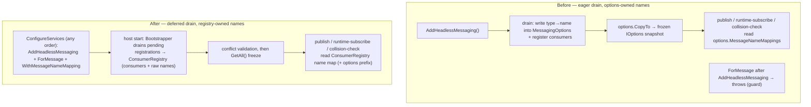

# refactor: Order-independent consumer registration via registry-owned name resolution

## Summary

Make `IServiceCollection.ForMessage<T>` registration independent of call order
relative to `AddHeadlessMessaging`, and delete the fail-fast ordering guard. The
enabling change (B2): move the authoritative type→name map off `MessagingOptions`
onto `ConsumerRegistry`, then relocate the registration drain to host start so all
`ConfigureServices`-time registrations land regardless of order. The
distributed-locks package is the motivating consumer but is not modified.

---

## Problem Frame

The lock-released wake-up consumer is registered via `ForMessage<DistributedLockReleased>`
(`src/Headless.DistributedLocks.Core/RegularLocks/DistributedLockConsumerRegistration.cs:31`),
which emits a `MessageRegistration` singleton drained into `ConsumerRegistry`
synchronously inside `AddHeadlessMessaging` (`src/Headless.Messaging.Core/Setup.cs:214`).
The drain also back-propagates explicit type→name mappings into `MessagingOptions`
(`Setup.cs:439`), and the publish path resolves names from that frozen snapshot
(`src/Headless.Messaging.Core/Internal/IMessagePublishRequestFactory.cs:267`). So a
`ForMessage` call after `AddHeadlessMessaging` (a natural setup order) currently
fail-fasts (`Setup.cs:147`), and a naive drain relocation would silently break
publish-side name resolution.

Full motivation, rejected Approach A (runtime subscription), and the
optimization-not-correctness nature of the wake-up signal are in the origin
document (see origin: `docs/brainstorms/2026-06-07-order-independent-consumer-registration-requirements.md`).

---

## Requirements

**Order independence**

- R1. A `ForMessage<T>` registration is drained into `ConsumerRegistry` whether it
  is called before or after `AddHeadlessMessaging`, provided both run during service
  configuration (before host build). (origin R1)
- R2. Type→name resolution is identical regardless of registration order — publish
  and subscribe agree on the message name. (origin R2)
- R3. The drain completes before any registry read that builds transport topology or
  freezes the registry. (origin R3)

**Name-resolution authority**

- R4. `ConsumerRegistry` owns the authoritative type→name map. The user-facing
  `WithMessageNameMapping<T>` API and the deferred drain both write to it; publish
  name resolution, runtime-subscribe name resolution, and the startup collision-check
  all read from it. `MessagingOptions.MessageNameMappings` is removed.
- R5. Registration-conflict validation (duplicate explicit names per type, conflicting
  consumer settings) still runs and fails fast at host start, before message
  processing begins. (origin R5)

**Guard removal**

- R6. The `ForMessage<T>` fail-fast ordering guard (`Setup.cs:147`) is removed. (origin R2, R4)

**Distributed-locks path**

- R7. Lock and semaphore wake-ups work with `AddDistributedLock` / `AddDistributedSemaphore`
  registered before or after `AddHeadlessMessaging`, with no source change in
  `Headless.DistributedLocks.Core`. (origin R6)
- R8. The polling fallback is preserved unchanged when messaging is not registered. (origin R7)

**Cleanup**

- R9. Tests asserting the old fail-fast guard behavior (#368) are removed or inverted
  to assert order-independence. (origin R8)

---

## Key Technical Decisions

- **Registry as single source of truth for type→name mappings (B2).** Chosen over
  mutating the frozen `MessagingOptions` instance at startup (contained but a smell)
  and over Approach A (runtime subscription). Collapses the options/registry
  name-resolution duplication to one authority. Accepts a wider messaging-core blast
  radius — two writers and three readers repointed — than a drain-only relocation.
- **Registry stores the raw mapped name; prefix stays an options concern.** Readers
  continue to call `options.ApplyMessageNamePrefix(...)` after looking the raw name up
  in the registry. This keeps the change focused on *where the type→name map lives*,
  not on prefix semantics.
- **Drain relocates into `Bootstrapper` startup, not a separate hosted service.** The
  `Bootstrapper` already runs at host start and already reads the registry
  (`IBootstrapper.Default.cs:330`), so draining as its first step — ahead of the
  collision-check and the `GetAll()` freeze — keeps all startup ordering in one place
  and avoids inter-hosted-service ordering fragility.
- **Authority move (U2) is sequenced before drain relocation (U3).** Moving the map
  to the registry is behavior-preserving on its own (drain still eager, guard still
  present); relocating the drain then delivers order-independence. This keeps each
  unit independently landable and green.

---

## High-Level Technical Design

Name-resolution authority and drain timing, before and after:

The registry's type→name map is mutable through `ConfigureServices` (user mappings)
and the host-start drain (`ForMessage` mappings), then frozen alongside the consumer
list on first `GetAll()`.

---

## Implementation Units

### U1. Authoritative type→name map on ConsumerRegistry

- **Goal:** Give `ConsumerRegistry` a `Type → rawMessageName` map with register +
  lookup APIs, frozen together with the consumer list.
- **Requirements:** R4
- **Dependencies:** none
- **Files:**
  - `src/Headless.Messaging.Core/ConsumerRegistry.cs`
  - `src/Headless.Messaging.Core/IConsumerRegistry.cs`
  - `tests/Headless.Messaging.Core.Tests.Unit/ConsumerRegistryNameMapTests.cs` (new)
- **Approach:** Add `RegisterMessageName(Type, string)` and
  `TryGetMessageName(Type, out string?)`. Conflict detection mirrors the existing
  `MessagingOptions.WithMessageNameMapping` rule (`MessagingOptions.cs:330`): same type
  mapped to a different name throws; identical re-map is idempotent. Reuse the existing
  `_lock` + freeze-on-first-`GetAll` pattern (`ConsumerRegistry.cs:108-127`) so the name
  map freezes when the consumer list does. Store the **raw** name; do not apply prefix
  here. The name map is **consumer-independent** — `WithMessageNameMapping<T>` registers a
  publish-only name for a type with no consumer, so the store is keyed on type alone, not
  tied to a `ConsumerMetadata` entry. Place the *read* API (`TryGetMessageName`) on the
  public `IConsumerRegistry` interface (readers depend on the interface); the *write* API
  may stay on the concrete `ConsumerRegistry` (only setup + drain write). See Q3.
- **Patterns to follow:** existing freeze/`volatile _frozen` discipline and
  `_FindDuplicateTopicGroupConflict` conflict shape in `ConsumerRegistry.cs`.
- **Test suite design:** unit, in `Headless.Messaging.Core.Tests.Unit` (pure registry
  logic, no transport).
- **Test scenarios:**
  - register a mapping then look it up returns the raw name.
  - registering the same type with a different name throws with both names in the message.
  - registering the same type with the identical name is idempotent (no throw).
  - lookup of an unmapped type returns false / null.
  - register after `GetAll()` freeze throws (mirrors consumer-list freeze behavior).
- **Verification:** new unit tests added and passing; no behavior change elsewhere
  (additive API).

### U2. Move name-resolution authority from MessagingOptions to the registry

- **Goal:** Repoint every writer and reader of the type→name map to the registry and
  delete `MessagingOptions.MessageNameMappings`. Behavior-preserving (drain still eager,
  guard still present).
- **Requirements:** R2, R4
- **Dependencies:** U1
- **Files:**
  - `src/Headless.Messaging.Core/Configuration/MessagingSetupBuilder.cs` (writer: `WithMessageNameMapping<T>`)
  - `src/Headless.Messaging.Core/Configuration/MessagingOptions.cs` (remove `MessageNameMappings`, `WithMessageNameMapping`, `CopyTo` copy of it; adjust `CreateConsumerMetadata` name resolution)
  - `src/Headless.Messaging.Core/Setup.cs` (`_DiscoverMessageRegistrations` writes registry name map instead of options)
  - `src/Headless.Messaging.Core/Internal/IMessagePublishRequestFactory.cs` (reader)
  - `src/Headless.Messaging.Core/Internal/IRuntimeConsumerRegistry.cs` (reader)
  - `src/Headless.Messaging.Core/Internal/IBootstrapper.Default.cs` (`_CheckMessageNameCollisions` reader)
  - `tests/Headless.Messaging.Core.Tests.Unit/` (name-resolution tests updated)
- **Approach:** `WithMessageNameMapping<T>` (config time) and the drain both call
  `registry.RegisterMessageName(...)`. The three readers look the raw name up in the
  registry, then apply `options.ApplyMessageNamePrefix(...)` exactly as today. The drain
  resolves consumer-metadata names from the registration's explicit name + conventions
  directly, eliminating the current write-to-options-then-read-back round trip
  (`Setup.cs:439` → `MessagingOptions.cs:417`). `IConsumerRegistry` is already injectable
  where the readers live; confirm injection sites.
- **Patterns to follow:** existing resolution order in
  `IMessagePublishRequestFactory._ResolveMessageName` (explicit → mapped → convention),
  preserved with the registry as the "mapped" source.
- **Test suite design:** unit, in `Headless.Messaging.Core.Tests.Unit`; existing
  publish/runtime name-resolution tests updated to seed the registry rather than options.
- **Test scenarios:**
  - publish resolves a `WithMessageNameMapping<T>`-declared name (with prefix applied).
  - publish resolves a `ForMessage`-declared explicit name (with prefix applied).
  - publish falls back to convention name for an unmapped type.
  - runtime-subscribe resolves the same name as publish for a mapped type.
  - collision-check still throws when two types map to the same name.
  - `MessagingOptions` no longer exposes `MessageNameMappings` (compile-time / reflection guard).
- **Verification:** updated unit tests pass; full messaging-core unit + integration
  suites green (behavior unchanged at this step).

### U3. Relocate the drain to host start

- **Goal:** Run the registration drain at host start inside `Bootstrapper`, ahead of the
  collision-check and registry freeze; remove the eager call from `AddHeadlessMessaging`.
  Delivers order-independence (with U4).
- **Requirements:** R1, R3, R5
- **Dependencies:** U2
- **Files:**
  - `src/Headless.Messaging.Core/Setup.cs` (remove eager `_DiscoverMessageRegistrations` call at line 214; expose the drain so the bootstrapper can run it)
  - `src/Headless.Messaging.Core/Internal/IBootstrapper.Default.cs` (drain pending `MessageRegistration` singletons as the first startup step, before `_CheckMessageNameCollisions`)
  - `tests/Headless.Messaging.Core.Tests.Unit/` (order-independence unit coverage; deeper coverage in U5)
- **Approach:** The bootstrapper resolves the registered `IServiceCollection` snapshot
  (already available, `Setup.cs:271`) plus `IOptions<MessagingOptions>` and the registry,
  then drains all `MessageRegistration` singletons into the registry (consumers + raw
  names). Conflict validation (duplicate explicit names per type, conflicting settings)
  runs in the drain, then the existing `_CheckMessageNameCollisions` /
  `_CheckIntentTransportSupport` run, then `GetAll()` freezes. Confirm no
  `ConfigureServices`-time reader of registry **consumer** contents remains (see Risk D1).
- **Patterns to follow:** the existing drain body (`Setup.cs:390-501`) moves largely
  intact; only its trigger point and its options-vs-registry name writes change (the
  latter done in U2). Assembly-scanned consumers (`IsAssemblyScan`, `Setup.cs:446-452`)
  flow through the same relocated drain — no separate path.
- **Test suite design:** unit, in `Headless.Messaging.Core.Tests.Unit`; full
  end-to-end order-independence lives in U5.
- **Test scenarios:**
  - registering a consumer after `AddHeadlessMessaging` (guard temporarily still present
    — assert via the relocated-drain seam or defer the cross-order assertion to U5 after
    U4 lands).
  - drain runs before collision-check: a name collision still throws at host start.
  - no-op when there are zero `MessageRegistration` singletons (no messaging consumers).
- **Verification:** messaging-core suites green; collision detection still fires at host
  start; nothing in `AddHeadlessMessaging` reads drained registry contents synchronously.

### U4. Remove the ForMessage fail-fast ordering guard

- **Goal:** Delete the `InvalidOperationException` guard so `ForMessage<T>` is legal
  before or after `AddHeadlessMessaging`.
- **Requirements:** R6, R1, R7
- **Dependencies:** U3
- **Files:**
  - `src/Headless.Messaging.Core/Setup.cs` (remove guard at lines 147-156)
- **Approach:** Remove the `ConsumerRegistry`-presence check. With U3, a late
  registration is drained at host start, so the call is now valid. Keep the registry's
  post-freeze `Register` throw (`ConsumerRegistry.cs:43`) — that guards genuine
  post-build mutation, which is a different (still-illegal) case.
- **Test suite design:** behavior covered by U5's order-independence suite; no isolated
  unit test for a deletion.
- **Test scenarios:** `Test expectation: none -- guard removal; behavior asserted by U5 order-independence tests.`
- **Verification:** no `InvalidOperationException` on post-`AddHeadlessMessaging`
  `ForMessage`; messaging-core suites green.

### U5. Order-independence and regression test suite

- **Goal:** Prove order-independence end-to-end, preserve the polling fallback, and
  invert the #368 guard tests.
- **Requirements:** R1, R2, R7, R8, R9
- **Dependencies:** U4
- **Files:**
  - `tests/Headless.Messaging.Core.Tests.Unit/ConsumerRegistrationOrderTests.cs` (new)
  - `tests/Headless.DistributedLocks.InMemory.Tests.Integration/` (lock wake-up both orders)
  - `tests/Headless.DistributedLocks.Composition.Tests.Unit/SetupTests.cs` (invert/remove #368 guard test)
- **Approach:** Use the in-memory transport to register a consumer + name mapping in both
  orders and assert publish/subscribe agree and the consumer fires. For locks, drive a
  real release→wake-up through the in-memory provider with `AddDistributedLock` registered
  after `AddHeadlessMessaging`. Replace the guard-throws test with an
  order-independence-works assertion.
- **Test suite design:** the cross-cutting integration coverage that spans
  registration → host start → publish/consume; the bulk of this unit's value is
  integration-level per the testing diamond.
- **Test scenarios:**
  - Covers R1, R2. consumer registered before `AddHeadlessMessaging`: message published,
    consumer receives it.
  - Covers R1, R2. consumer registered after `AddHeadlessMessaging`: identical outcome.
  - Covers R7. lock released with `AddDistributedLock` after `AddHeadlessMessaging`:
    waiter woken by the released message, not by polling timeout.
  - Covers R8. no messaging registered: lock acquisition proceeds via polling cadence.
  - Covers R9. former guard scenario (`ForMessage` after `AddHeadlessMessaging`) no longer
    throws and now wires the consumer.
  - Covers R5. two consumers with conflicting registration for the same name/group/intent:
    startup fails with a clear error.
  - Covers R2. with a configured message-name prefix, publish and subscribe both resolve
    the prefixed name for a registry-mapped type (prefix-parity).
- **Verification:** new tests pass; previously-guard-asserting tests no longer assert a
  throw; full distributed-locks integration suite green (requires Docker for non-in-memory
  providers, but order-independence is covered by the in-memory path).

---

## Testing Strategy

- **Unit (Headless.Messaging.Core.Tests.Unit):** registry name-map logic (U1), name
  resolution through the registry across publish/runtime/collision-check (U2),
  drain-at-startup mechanics and collision timing (U3), order-independence at the
  registration/publish seam (U5).
- **Integration (Headless.DistributedLocks.InMemory.Tests.Integration):** real
  release→wake-up across registration orders, plus polling-fallback when messaging is
  absent (U5). In-memory keeps this Docker-free; brokered providers inherit the behavior
  and need no new per-provider tests for this change.
- **Regression:** the broader messaging integration suites (RabbitMq, SqlServer,
  PostgreSql) must stay green — they exercise the drain and name resolution and are the
  safety net for the authority move.
- No new test harness is required; existing fixtures and the in-memory transport cover
  the new behavior.

---

## Risks & Dependencies

- D1. **A config-time reader of registry *consumer* contents would break under drain
  relocation.** `ConsumerRegistry.FindByTypes` is documented as "used internally during
  setup to resolve group names for deferred registrations" (`ConsumerRegistry.cs:175`).
  Verify its callers all run *within* the drain (which still executes at startup as one
  unit) and not earlier in `AddHeadlessMessaging`. If an earlier caller exists, it must
  move into the relocated drain. Resolve during U3.
- D2. **Startup ordering inside the bootstrapper.** The drain must run before
  `_CheckMessageNameCollisions` (which calls `GetAll()` and freezes). Co-locating both in
  the bootstrapper's startup makes this a local, testable ordering rather than a
  cross-service one.
- D3. **Name-resolution parity across publish and runtime-subscribe.** Both
  `IMessagePublishRequestFactory` and `IRuntimeConsumerRegistry` must read from the same
  registry source; a missed site reintroduces the publish/subscribe name divergence the
  brainstorm warned about. U2 repoints both; U5 asserts parity.
- Greenfield: no deployed external consumers, so removing `MessagingOptions.MessageNameMappings`
  and the guard are acceptable breaking changes (see origin A3).

---

## Scope Boundaries

- Approach A (runtime `IRuntimeSubscriber` subscription) and dynamic transport topology —
  rejected (see origin).
- No source change in `Headless.DistributedLocks.Core`; it keeps its static
  `ForMessage<DistributedLockReleased>` registration.
- Message-name **prefix** semantics stay in `MessagingOptions`; only the raw type→name
  map moves to the registry.

### Deferred to Follow-Up Work

- None identified. Adjacent cleanup (e.g., reviewing other `MessagingOptions` snapshot
  fields for similar late-contribution patterns) is out of scope unless surfaced during
  implementation.

---

## Open Questions

**Deferred to implementation**

- Q1. Exact seam for invoking the relocated drain from `Bootstrapper` (a method exposed on
  the existing drain code vs. an internal initializer type) — settle when touching
  `IBootstrapper.Default.cs` in U3.
- Q2. Whether `CreateConsumerMetadata` keeps reading a name source at all after U2, or
  takes the resolved raw name as a parameter from the drain — decide while editing
  `MessagingOptions.cs` in U2.
- Q3. Final split of the registry name API across `IConsumerRegistry` (read) vs the
  concrete `ConsumerRegistry` (write) — confirm reader injection sites depend on the
  interface before placing `TryGetMessageName` there (U1/U2).

---

## Sources & Research

- `src/Headless.Messaging.Core/Setup.cs:147` — `ForMessage<T>` fail-fast guard (R6).
- `src/Headless.Messaging.Core/Setup.cs:214`, `:390-501` — eager drain to relocate.
- `src/Headless.Messaging.Core/Setup.cs:439` — drain's options name back-propagation (the wrinkle).
- `src/Headless.Messaging.Core/Configuration/MessagingOptions.cs:32`, `:324`, `:417` — `MessageNameMappings` field, writer, internal reader.
- `src/Headless.Messaging.Core/Configuration/MessagingSetupBuilder.cs:65` — user-facing `WithMessageNameMapping<T>`.
- `src/Headless.Messaging.Core/Internal/IMessagePublishRequestFactory.cs:267` — publish-side reader.
- `src/Headless.Messaging.Core/Internal/IRuntimeConsumerRegistry.cs:231` — runtime-subscribe reader.
- `src/Headless.Messaging.Core/Internal/IBootstrapper.Default.cs:323`, `:330`, `:338` — startup collision-check, first `GetAll()` freeze, options reader.
- `src/Headless.Messaging.Core/ConsumerRegistry.cs:43`, `:108-127`, `:175` — freeze semantics, `FindByTypes` setup-time note.
- `src/Headless.DistributedLocks.Core/RegularLocks/DistributedLockConsumerRegistration.cs:31` — lock `ForMessage` registration (unchanged).
- `src/Headless.DistributedLocks.Core/RegularLocks/DistributedLock.cs:571` — lock publishes with no explicit name (relies on the type→name map).
- Related: #390 (this issue), #368 (introduced the guard), #287 (distributed-locks program).
</content>
