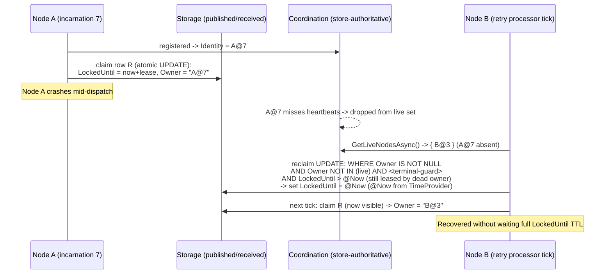
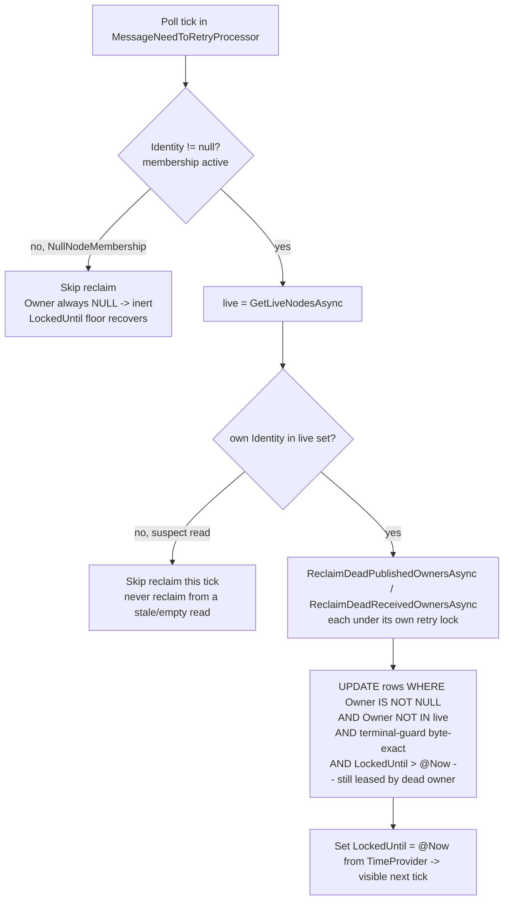
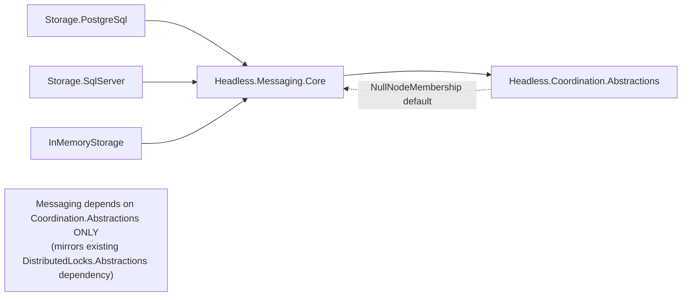

# feat: Messaging node-incarnation orphan recovery via Coordination

## Summary

Make `Headless.Messaging` consume the shipped `Headless.Coordination` membership substrate so a dead process incarnation's claimed outbox/inbox rows are recovered promptly instead of only after their per-row `LockedUntil` visibility lease expires.

The work adds a nullable `Owner` column (`node@incarnation`) to the `published` and `received` tables across all three storage providers, stamps it at the same atomic write that already sets `LockedUntil`, and adds a **reconcile-on-tick** reclaim pass inside the existing `MessageNeedToRetryProcessor` poll loop: each tick reads the live-node set from Coordination, finds non-terminal rows still leased by incarnations no longer live, and accelerates their visibility (pulls `LockedUntil` back to now) so the next tick re-picks them. `LockedUntil` remains the correctness floor; Coordination only accelerates.

This is the Messaging slice of issue #396 (originally "Slice 4"), narrowed by two things that already shipped: the `StorageId`->`Guid` pivot (#414) and the removal of framework worker-ids (spec §5, GUID decision). What remains is purely the recovery migration described in spec §5.3.

---

## Problem Frame

Messaging today has **no node-level recovery**. When a process dies mid-dispatch, its in-flight rows carry a `LockedUntil` visibility lease and a `NextRetryAt`; another node can only re-pick them once `LockedUntil` naturally expires (`PostgreSqlDataStorage.cs:811` `FOR UPDATE SKIP LOCKED` claim). There is no owner column anywhere, no node concept, and no sweeper. (Spec §5.3, verified against source.)

The Coordination substrate (#416) now provides exactly the missing piece: a store-authoritative `node@incarnation` identity, an ordered live-node view, and lifecycle events. Jobs already has the *shape* of recovery (an owner column `LockHolder` + `ReleaseDeadNodeResources(owner)`), but its liveness is Redis-only and incarnation-free; Jobs has **not** yet been migrated to Coordination (verified — zero `INodeMembership` references in `src/Headless.Jobs.*`). Messaging is therefore the **first** Coordination consumer, and its integration becomes the reference pattern.

**Why Coordination and not just `IDistributedLock`:** a lock answers "may I exclusively do this critical section now?" (Messaging already uses `IDistributedLock` for coarse retry-pickup mutual exclusion). It cannot tell a surviving node *which durable rows a crashed incarnation last owned*. That requires a node-incarnation stamp on the rows plus a reliable live-node view — which is what this plan adds. (Spec §9 "Why consumers need Coordination instead of only DistributedLocks".)

**Requirements (traced to spec §5.3 and issue #396):**
- R1. Add `owner = node@incarnation` to `published` + `received` across PostgreSQL, SQL Server, InMemory.
- R2. Stamp `owner` at the **same atomic write** that sets `LockedUntil` (never as a separate SELECT-then-write — that re-introduces a double-dispatch race).
- R3. Reclaim must AND the owner predicate onto the **exact** terminal-state guard, replicated byte-for-byte per provider.
- R4. `LockedUntil` stays the safety floor; reclaim must not bypass it as a correctness mechanism, and must be idempotent and reconciliation-driven (membership events are best-effort).
- R5. Recovery must be incarnation-fenced: a fast restart (same node id, new incarnation) must never have its legitimately-owned rows reclaimed.
- R6. No-coordination deployments (no provider registered -> `NullNodeMembership`) must behave exactly as today: `LockedUntil`-floor-only recovery, zero new behavior.
- R7. Cross-provider conformance for owner-stamp + reclaim is driven through `Headless.Messaging.Core.Tests.Harness` (repo harness rule), not per-provider copy-paste.

---

## Scope Boundaries

### In scope
- Nullable `Owner` column on `published` + `received` for all three storage providers, with idempotent DDL migration.
- Owner stamping co-located with every `LockedUntil` write (per-attempt lease writes + the atomic retry-pickup claim).
- A new `IDataStorage` reclaim method and the reconcile-on-tick orchestration inside `MessageNeedToRetryProcessor`.
- `Headless.Coordination.Abstractions` dependency (Abstractions only) + `NullNodeMembership` default-registration fallback.
- Harness conformance tests + provider-specific SQL/index assertions in leaf integration projects.
- Bootstrap diagnostic when recovery is wired but only `NullNodeMembership` is present; docs sync.

### Out of scope (already resolved)
- `StorageId`->`Guid` migration — shipped in #414 (`MediumMessage.StorageId` is already `Guid`).
- Framework worker-id / snowflake assignment — removed by the GUID decision (spec §5); not a Coordination consumer concern.
- Migrating **Jobs** onto Coordination (issue #396 Slice 3) — separate plan (`docs/plans/2026-06-07-001-feat-jobs-coordination-migration-plan.md`).
- The Coordination substrate itself — shipped in #416.

### Deferred to follow-up work
- **WatchAsync event-driven reclaim** (lower latency than reconcile-on-tick). The substrate exposes `IMembershipEventSource.WatchAsync`; a future `LeaseMonitor`/auto-extend evolution (#289/#296/#300) is the natural home. Reconcile-on-tick is the v1 trigger.
- **Messaging dashboard "live consumers / per-node throughput"** view (issue #396 beneficiary table) — needs the owner column this plan adds, but is its own feature.
- **Leader-elected singleton sweeper** — Coordination v1 defers leadership election (spec §8).

---

## High-Level Technical Design

### Ownership lifecycle and reconcile-on-tick recovery

### Reclaim guard logic (the safety invariants)

### Dependency direction (acyclic; Abstractions-only)

### Terminal-guard replication map (the byte-for-byte risk)

The reclaim predicate is a **4th** copy of the terminal-state guard. It must match each provider's existing form exactly. Existing occurrences (verified):

| Provider | Guard constant / form | File:line |
|---|---|---|
| PostgreSQL | `_TerminalRowGuardSimple` (quoted idents) | `src/Headless.Messaging.Storage.PostgreSql/PostgreSqlDataStorage.cs:53` |
| SQL Server | `_TerminalRowGuardSimple` (bare idents) | `src/Headless.Messaging.Storage.SqlServer/SqlServerDataStorage.cs:52` |
| InMemory | C#: `(StatusName is Succeeded or Failed) && NextRetryAt is null` | `src/Headless.Messaging.Storage.InMemory/InMemoryDataStorage.cs:710` |

Canonical SQL text: `NOT (StatusName IN ('Succeeded','Failed') AND NextRetryAt IS NULL)`. The reclaim UPDATE reuses the existing per-provider constant rather than re-typing the predicate.

---

## Key Technical Decisions

### KTD1 — `Owner` is a nullable string storing `NodeIdentity.ToString()` (`node@incarnation`)
`NodeIdentity` is `readonly record struct (NodeId, NodeIncarnation)` with `ToString()` -> `"{NodeId}@{Incarnation}"` and round-tripping `TryParse` (splits on the last `@`). A string column matches Jobs' existing `LockHolder string?` model, maps natively, and avoids a two-column (`owner_node` + `owner_incarnation`) split that would complicate the positional column lists three times over. Equality comparison for reclaim is plain string comparison against the serialized live set — no parsing needed on the hot path. (Spec §5.3 suggested `owner_node` + `owner_incarnation`; the single serialized-string column is chosen here as the lower-risk variant given the positional-SQL hazard, and because reclaim only needs set-membership, not field access.)

### KTD2 — Owner stamped only when membership is active; reclaim requires `Owner IS NOT NULL`
When no Coordination provider is registered, the resolved `INodeMembership` is `NullNodeMembership`, whose `Identity` is `null` (until a `RegisterAsync` that the consumer never calls) and whose `GetLiveNodesAsync` returns **empty**. A naive `Owner NOT IN (live)` with an empty live set would match *every* owned row. The invariant that closes this: **stamp `Owner` only when `Identity != null`** (so under `NullNodeMembership`, `Owner` stays `NULL`), and **reclaim only rows where `Owner IS NOT NULL`**. Result: the no-coordination path is inert by construction (R6), and the empty-live-set footgun cannot fire.

### KTD3 — Reconcile-on-tick, not event-driven (v1)
Reclaim runs inside the existing `MessageNeedToRetryProcessor` poll loop. Each tick: read `GetLiveNodesAsync`, then call the table-specific reclaim (`ReclaimDeadPublishedOwnersAsync` / `ReclaimDeadReceivedOwnersAsync`) under each pipeline's lock. This honors the substrate's explicit contract that membership **events are best-effort acceleration, not the authoritative recovery path** — `GetLiveNodesAsync` is the authoritative reconciliation surface, and the pass is naturally idempotent (re-running it is a no-op once rows are visible). No new hosted service, no enumerator lifecycle to manage. Latency = adaptive poll interval, which is acceptable because `LockedUntil` is the floor. `WatchAsync` event-driven acceleration is deferred (see Scope Boundaries). *(User decision, 2026-06-07.)*

### KTD4 — Stale-read self-check before reclaiming
Because we are alive and registered, the live set must contain our own `Identity`. If `GetLiveNodesAsync` returns a set that does **not** include our own identity (transient store hiccup, partition), the read is suspect — skip reclaim that tick rather than risk reclaiming rows from live owners. This is belt-and-suspenders on top of the state-change CAS (`originalRetries` + `LockedUntil` token) that already rejects stale writers.

### KTD5 — Coordination dependency injected into the provider `IDataStorage`, Abstractions-only
Stamping happens inside provider `IDataStorage` implementations (where the lease/claim SQL lives), so the provider needs the current `NodeIdentity`. Inject `INodeMembership` (Abstractions type, transitively available via Messaging.Core) into each provider's storage ctor and read `.Identity`. Messaging.Core and all providers reference `Headless.Coordination.Abstractions` **only** — never `Core` or a provider — mirroring the established `Headless.DistributedLocks.Abstractions`-only dependency. Default-register `NullNodeMembership` via `TryAddSingleton` exactly like `NullDistributedLock` at `src/Headless.Messaging.Core/Setup.cs:314`.

### KTD6 — Single shared `Owner` column-width constant
Define the `node@incarnation` column max length once (a constant in Messaging.Core) consumed by all three DDL builders, to prevent DDL-says-N / runtime-truncates-M drift (per `storage-initializer-lifecycle-correctness` learning). NodeId is an arbitrary non-empty string + `@` + a `long`; size generously (e.g. wide enough for hostname-class node ids) and document the ceiling.

### KTD7 — Reclaim targets *currently-leased* rows, written with `TimeProvider` (not the DB clock)
Two corrections to the reclaim write, both grounded in the existing claim at `PostgreSqlDataStorage.cs:795-811`:
- **Predicate is `LockedUntil > @Now`, not `<= @Now`.** The normal claim already re-picks rows whose lease is null or expired (`LockedUntil IS NULL OR LockedUntil <= @Now`). Reclaim must target the *complement* — rows still **actively leased into the future** by a dead owner — and pull their `LockedUntil` back to `@Now` so the next claim tick re-picks them. A `<= @Now` predicate would only match rows normal pickup already handles, making reclaim a complete no-op.
- **`@Now` comes from the injected `TimeProvider`, not `now()` / `SYSUTCDATETIME()`.** The existing storage code deliberately stamps `LockedUntil` from `TimeProvider` (documented at `PostgreSqlDataStorage.cs:795-797`) so InMemory and SQL providers share identical pickup semantics and fake-clock tests stay honest. Reclaim is a Messaging `LockedUntil` write and must follow the same convention. **This does not violate the spec's store-clock rule** (spec §4 Fork 2): that rule governs *Coordination's* liveness/dead-node decisions, which Coordination owns store-authoritatively via `GetLiveNodesAsync`. Dead-owner *detection* stays store-authoritative; the `LockedUntil` *write* is a per-row Messaging lease on `TimeProvider`. Both rules are honored.

---

## Implementation Units

### U1. Core contract: `Owner` field, reclaim method, Coordination dependency, Null fallback

**Goal:** Establish every Messaging.Core-level surface the providers and processor build on, with the no-coordination path inert by default.

**Requirements:** R1 (contract), R5/R6 (identity + fallback), R7 (single contract).

**Dependencies:** none.

**Files:**
- `src/Headless.Messaging.Core/Messages/MediumMessage.cs` — add `Owner` (`string?`).
- `src/Headless.Messaging.Storage.InMemory/MemoryMessage.cs` — inherits/extends; ensure `Owner` flows (final wiring in U5).
- `src/Headless.Messaging.Core/Persistence/IDataStorage.cs` — add **two** methods, `ReclaimDeadPublishedOwnersAsync(IReadOnlyCollection<string> liveOwners, CancellationToken)` and `ReclaimDeadReceivedOwnersAsync(...)`, mirroring the existing published/received split (`GetPublishedMessagesOfNeedRetryAsync:237` / `GetReceivedMessagesOfNeedRetryAsync:276`). The two retry pipelines run under distinct distributed locks (`_publishRetryResource` / `_receiveRetryResource`), so a single both-tables sweep would cross lock boundaries (review finding 2.1).
- `src/Headless.Messaging.Core/Setup.cs` — `services.TryAddSingleton<INodeMembership, NullNodeMembership>()` (mirror `:314` null-lock pattern); add a shared `OwnerColumnMaxLength` constant (KTD6).
- `src/Headless.Messaging.Core/Headless.Messaging.Core.csproj` — `ProjectReference` to `Headless.Coordination.Abstractions` only.

**Approach:** Mirror the existing optional-dependency precedent (`IDistributedLock` keyed fallback + `_WarnIfNoOpProvider` at `IBootstrapper.Default.cs:242`). Decide whether `INodeMembership` is keyed (like the lock) or unkeyed — unkeyed is acceptable since there is no app-vs-messaging isolation concern for membership, but document the choice. Both reclaim methods take the **already-serialized** live-owner set (strings) so providers do not depend on identity parsing.

**Patterns to follow:** `messaging-keyed-di-lock-isolation` learning; `NullDistributedLock` registration at `Setup.cs:314`.

**Test suite design:** Unit (`Headless.Messaging.Core.Tests.Unit`). The reclaim *behavior* is conformance-tested in U6 against real storage; here only verify the DI default and contract shape.

**Test scenarios:**
- When no Coordination provider is registered, the resolved `INodeMembership` is `NullNodeMembership` and `Identity` is `null`.
- When an app registers a real `INodeMembership`, the `TryAdd` default does not shadow it.
- `MediumMessage.Owner` round-trips through the serializer used for storage (default null).
- Test expectation note: the empty-live-set / inert-reclaim guard (KTD2) is exercised end-to-end in U6, not here.

**Verification:** Solution builds with the new Abstractions reference and no cycle; unit tests above pass; `IDataStorage` compiles with the new method (providers stubbed until U3–U5).

---

### U2. Reconcile-on-tick orchestration in `MessageNeedToRetryProcessor`

**Goal:** Each poll tick, reconcile owners against the live-node set and trigger reclaim, with the stale-read and inactive-membership guards.

**Requirements:** R2 (no separate race-prone path), R4 (idempotent, reconciliation-driven), R5, R6, KTD3, KTD4.

**Dependencies:** U1.

**Files:**
- `src/Headless.Messaging.Core/Processor/IProcessor.NeedRetry.cs` — inject `INodeMembership` into `MessageNeedToRetryProcessor` (ctor already takes `[FromKeyedServices(MessagingKeys.LockProvider)] IDistributedLock` at `:100`); add the reconcile step to the `ProcessAsync` tick (`:157`), alongside `_ExecutePublishedWorkAsync` (`:374`) / `_ExecuteReceivedWorkAsync` (`:396`).
- `src/Headless.Messaging.Core/Setup.cs` — `MessageNeedToRetryProcessor` registration (`:328`) picks up the new dependency automatically.

**Approach:** Compute the live-owner set once per tick with the guards: (1) if `membership.Identity is null` -> skip (inactive, owner is never stamped so nothing to reclaim); (2) `live = await membership.GetLiveNodesAsync(ct)`; (3) if `live` does not contain own `Identity` -> skip (stale read, KTD4); (4) serialize live identities. Then invoke the **table-specific** reclaim **inside each pipeline under its own lock** (review finding 2.1): `ReclaimDeadPublishedOwnersAsync` within `_ProcessPublishedAsync` (`:279`, under `_publishRetryResource`) and `ReclaimDeadReceivedOwnersAsync` within `_ProcessReceivedAsync` (`:307`, under `_receiveRetryResource`) — never a single cross-table sweep, which would have a task holding the publish lock writing the `received` table. The reclaim itself is idempotent, so lock contention only avoids redundant work, not correctness.

**Execution note:** Implement the guard logic test-first — the inactive-membership and stale-read skips are the correctness-bearing branches and are cheap to assert with a mocked `INodeMembership`.

**Patterns to follow:** the existing `_TryAcquireLockAsync` + `_Execute*WorkAsync` cadence in the same file; treat reclaim as a sibling work step.

**Test suite design:** Unit (`Headless.Messaging.Core.Tests.Unit`) with `INodeMembership` and `IDataStorage` substituted (NSubstitute). Real-storage reclaim is U6.

**Test scenarios:**
- `Identity == null` (NullNodeMembership) -> neither reclaim method is called.
- Live set excludes own identity -> reclaim skipped that tick (stale-read guard).
- Live set includes own identity + a dead owner -> `ReclaimDeadPublishedOwnersAsync` called within the publish pipeline and `ReclaimDeadReceivedOwnersAsync` within the receive pipeline, each once, with the serialized live set.
- Each reclaim runs only when its pipeline's lock is held (`UseStorageLock=true`); when the respective lock is not acquired, that table's sweep is skipped (mirrors pickup) — and no cross-table write occurs.
- NSubstitute arity audit: confirm both new reclaim mocks match the real calls (guard against the stale-arity green-but-unverified trap from the `terminal-state-overwrite` learning).

**Verification:** Unit tests above pass; the processor compiles against the U1 contract; no behavior change when membership inactive.

---

### U3. PostgreSQL: `Owner` column, idempotent DDL, stamp at claim/lease, reclaim

**Goal:** PostgreSQL provider stamps `Owner` atomically with `LockedUntil` and implements both reclaim methods with a byte-exact terminal guard.

**Requirements:** R1–R5.

**Dependencies:** U1, U2.

**Files:**
- `src/Headless.Messaging.Storage.PostgreSql/PostgreSqlStorageInitializer.cs` — add `"Owner"` to `received` (`:204-219`) + `published` (`:243-256`) CREATE TABLE; add an idempotent `ALTER TABLE ... ADD COLUMN IF NOT EXISTS "Owner"` block for existing tables, wrapped in the existing swallow-already-exists / advisory-lock envelope; add a **partial index** `("Owner") WHERE "Owner" IS NOT NULL` on each table (review finding 4 — only leased/owned rows are indexed, so the index is tiny and the sweep is O(matches), not a seq-scan), created `CONCURRENTLY` like `:111`, and run the established `_DropInvalidIndexConcurrentlyAsync` first to clear any `indisvalid=false` index left by an interrupted prior create (review finding 3.3).
- `src/Headless.Messaging.Storage.PostgreSql/PostgreSqlDataStorage.cs` — extend positional column lists + param arrays + reader ordinals: `StoreMessageAsync` INSERT (`:200-201`), `_StoreReceivedMessage` INSERT (`:711-712`), the atomic claim `RETURNING` list + reader (`:811`, `:839-850`), the lease/state UPDATE SET lists (`_ChangeMessageStateAsync:617`, `ChangeReceiveStateAsync:155`); stamp `Owner` at every write that **sets** `LockedUntil` (sourced from injected `INodeMembership.Identity`, null-safe per KTD2) and **clear** `Owner` to `NULL` at every write that clears `LockedUntil` (success / terminal / reschedule — review finding 3.2, keeps unleased rows free of stale owners); add `ReclaimDeadPublishedOwnersAsync` + `ReclaimDeadReceivedOwnersAsync` reusing `_TerminalRowGuardSimple` (`:53`).

**Approach:** Reclaim UPDATE shape (per table): `UPDATE "published" SET "LockedUntil" = @Now WHERE "Owner" IS NOT NULL AND "Owner" <> ALL(@LiveOwners) AND "LockedUntil" > @Now AND <_TerminalRowGuardSimple>`. **`@Now` is `timeProvider.GetUtcNow()`, and the predicate is `LockedUntil > @Now`** (currently-leased rows owned by a dead incarnation) per KTD7 — not `<= @Now`, which would no-op. Stamping reads `_membership.Identity?.ToString()` once per write; when null, the column is left null. Inject `INodeMembership` into the storage ctor (Abstractions-only, transitive via Core).

**Execution note:** Add a concurrent-startup characterization test (boot N initializers via `Task.WhenAll`, assert exactly one `Owner` column) before relying on the idempotent DDL — the `1913`/`42P07` race is invisible single-host (`storage-initializer-lifecycle-correctness` learning).

**Patterns to follow:** existing `_TerminalRowGuardSimple` usage in `_GetMessagesOfNeedRetryAsync`; the `CONCURRENTLY` index + advisory-lock idempotent-DDL pattern in `PostgreSqlStorageInitializer.cs`.

**Test suite design:** Conformance scenarios live in U6 (harness). Provider-specific assertions (column type, index presence/column-order, EXPLAIN-plan pinning for the reclaim query) go in `tests/.../Headless.Messaging.Storage.PostgreSql.Tests.Integration` (the `:280-539` region of `PostgreSqlStorageTests.cs`).

**Test scenarios:**
- `Owner` column exists as the shared-width type after init; `ALTER ... ADD IF NOT EXISTS` is a no-op on a table that already has it.
- Concurrent init (N hosts) yields exactly one `Owner` column and one partial index (no `42P07`/`1913` leak); an `indisvalid=false` index left by a simulated interrupt is dropped and rebuilt valid.
- Reclaim query uses the partial `WHERE "Owner" IS NOT NULL` index (EXPLAIN assertion), does not seq-scan at scale.
- Reclaim accelerates only rows with `LockedUntil > @Now` owned by a dead incarnation; rows with `LockedUntil <= @Now` are left to normal pickup (predicate-direction guard).
- Positional-list integrity: a round-trip store -> claim -> read returns the stamped `Owner` at the correct ordinal (guards against ordinal drift); a state change that clears `LockedUntil` also nulls `Owner`.

**Verification:** Provider integration tests pass; harness conformance (U6) green for PostgreSQL.

---

### U4. SQL Server: `Owner` column, idempotent DDL, stamp at claim/lease, reclaim

**Goal:** SQL Server provider parity with U3.

**Requirements:** R1–R5.

**Dependencies:** U1, U2.

**Files:**
- `src/Headless.Messaging.Storage.SqlServer/SqlServerStorageInitializer.cs` — add `[Owner]` to `Received` (`:98-114`) + `Published` (`:157-171`) CREATE TABLE; add an idempotent `IF COL_LENGTH(...) IS NULL ALTER TABLE ... ADD [Owner]` block in the existing `BEGIN TRY/CATCH` envelope (swallowing `2714/1913/2627`); add a **filtered index** `([Owner]) WHERE [Owner] IS NOT NULL` on each table (review finding 4) idempotently.
- `src/Headless.Messaging.Storage.SqlServer/SqlServerDataStorage.cs` — extend positional lists + reader ordinals: `StoreMessageAsync` INSERT (`:196-197`), `_StoreReceivedMessage` MERGE INSERT (`:736-737`), the atomic claim `OUTPUT inserted.*` list + reader (`:821`, `:856-867`), UPDATE SET lists (`_ChangeMessageStateAsync:648`, `ChangeReceiveStateAsync:150`); stamp `Owner` at every write that sets `LockedUntil` and clear it to `NULL` at every write that clears `LockedUntil` (review finding 3.2); add `ReclaimDeadPublishedOwnersAsync` + `ReclaimDeadReceivedOwnersAsync` reusing `_TerminalRowGuardSimple` (`:52`).

**Approach:** Reclaim UPDATE (per table): `UPDATE [Published] SET [LockedUntil] = @Now WHERE [Owner] IS NOT NULL AND [Owner] NOT IN (@Owner0, @Owner1, ...) AND [LockedUntil] > @Now AND <_TerminalRowGuardSimple>`. **`@Now` is `timeProvider.GetUtcNow()`** and the predicate is **`LockedUntil > @Now`** (KTD7). Pass the live-owner set as **dynamically-built positional parameters** `@Owner0..@OwnerN`, not a Table-Valued Parameter — the live set is cluster-sized (bounded, < ~1024) so a UDTT migration is unnecessary overhead (review finding 2.2). The set is non-null by construction, so `NOT IN` nullable semantics are not a hazard.

**Execution note:** As U3 — concurrent-startup characterization for the `ALTER` block first.

**Patterns to follow:** the `BEGIN TRY/CATCH` swallow-already-exists DDL pattern in `SqlServerStorageInitializer.cs`; `_TerminalRowGuardSimple` usage.

**Test suite design:** Provider-specific assertions in `tests/.../Headless.Messaging.Storage.SqlServer.Tests.Integration`; cross-provider behavior in U6.

**Test scenarios:**
- `Owner` column + filtered index added idempotently (the `IF COL_LENGTH` block no-ops when present).
- Concurrent init yields exactly one column and one filtered index.
- Dynamic `NOT IN (@Owner0..)` filter excludes live owners and matches only dead, non-null, non-terminal, **still-leased (`LockedUntil > @Now`)** rows.
- Round-trip ordinal integrity through the MERGE `OUTPUT` reader; clearing `LockedUntil` nulls `Owner`.

**Verification:** Provider integration tests pass; harness conformance (U6) green for SQL Server.

---

### U5. InMemory: `Owner` field, per-row-atomic stamp, C# reclaim filter

**Goal:** InMemory provider parity for harness uniformity (R7), with correct per-row-lock atomicity.

**Requirements:** R1–R5 (recovery is a practical no-op single-process, but the contract must hold for the harness).

**Dependencies:** U1, U2.

**Files:**
- `src/Headless.Messaging.Storage.InMemory/MemoryMessage.cs` — add `Owner` (`string?`).
- `src/Headless.Messaging.Storage.InMemory/InMemoryDataStorage.cs` — set `Owner` at the atomic claim/lease (`_ClaimMessagesOfNeedRetry:608`, `_LeaseAsync:693`) under the existing per-row object lock (the claim guard at `:643-666`); clear `Owner` when `LockedUntil` is cleared on state change (review finding 3.2); **propagate `Owner` in the deep-clone `_Clone` helper (`:693` region)** — without it the stamped owner is silently dropped when rows are read, false-failing the conformance tests (review finding 3.1); add `ReclaimDeadPublishedOwnersAsync` + `ReclaimDeadReceivedOwnersAsync` using the C# terminal form (`:710`) plus `Owner is not null && !liveOwners.Contains(Owner) && LockedUntil > now`.

**Approach:** The stamp + lease must be a single atomic check-then-write under the per-row lock (SQL providers get isolation via the conditional UPDATE; InMemory does not get it for free — `terminal-state-overwrite` learning). Reclaim iterates rows under their locks, sets `LockedUntil = now` (from `TimeProvider`, KTD7) on matches with `LockedUntil > now` (currently leased). `Owner` is stamped only when `Identity != null` (KTD2), so the default InMemory wiring (typically no Coordination) leaves it null and reclaim is inert.

**Patterns to follow:** the per-row-lock atomic claim already in `_ClaimMessagesOfNeedRetry`; the C# terminal guard at `:710`.

**Test suite design:** `tests/Headless.Messaging.Storage.InMemory.Tests.Unit` for InMemory-specific atomicity; cross-provider behavior in U6.

**Test scenarios:**
- Two concurrent claimers of the same row -> exactly one stamps `Owner` and proceeds (per-row-lock atomicity).
- With a stubbed active `INodeMembership`, claim stamps `Owner = node@inc`, and `_Clone` returns the `Owner` intact on read (regression guard for finding 3.1).
- Reclaim sets `LockedUntil = now` only for non-null, dead-owner, non-terminal, **still-leased (`LockedUntil > now`)** rows; terminal rows and rows whose lease already expired are untouched.
- With `NullNodeMembership` (Identity null), `Owner` stays null and reclaim is a no-op.

**Verification:** InMemory unit tests pass; harness conformance (U6) green for InMemory.

---

### U6. Harness conformance: owner-stamp, reclaim, fencing, floor, inert-fallback

**Goal:** One owner/reclaim contract verified identically across all three providers (repo harness rule, R7).

**Requirements:** R1–R7.

**Dependencies:** U3, U4, U5.

**Files:**
- `tests/Headless.Messaging.Core.Tests.Harness/DataStorageTestsBase.cs` — add `virtual` conformance methods (mirror the existing lease tests `should_not_return_leased_published_message_until_lease_expires:699` / `..._received...:738`, the CAS test `should_handle_concurrent_state_updates_to_same_row:772`, and the terminal-predicate tests `:594-697`); add a harness seam to read a row's `Owner` and to inject/stub a controllable `INodeMembership` identity + live set.
- Leaf overrides as `[Fact] public override Task ...` in `PostgreSqlStorageTests.cs`, `SqlServerStorageTests.cs`, and the InMemory unit test class.

**Approach:** Use a controllable membership stub so the harness can set "current identity = A@7" for stamping and "live set = {B@3}" for reclaim, deterministically. Reuse the `SupportsControllableClock`/`TimeProvider` seam (`:39-46`) for the `LockedUntil`-floor timing assertions.

**Test suite design:** Conformance (portable) in the base; provider-specific SQL/index/EXPLAIN assertions stay in the leaf integration projects (U3/U4).

**Test scenarios (each becomes a `virtual` base method, overridden in all 3 leaves):**
- Covers R2. `should_stamp_owner_on_claim` — claiming a row with active identity A@7 stamps `Owner = "A@7"` at the same write as `LockedUntil`.
- Covers R4/R3. `should_reclaim_dead_owner_rows_and_accelerate_visibility` — a row owned by A@7 (not in live set), non-terminal, **still actively leased (`LockedUntil` in the future)** -> reclaim pulls `LockedUntil` back to `@Now` so the next claim picks it, recovering it *before* the lease would naturally expire (this is the whole acceleration point). A row owned by a **live** node is **not** reclaimed even though leased (floor + liveness honored). `@Now` driven by the controllable clock.
- Covers R5. `should_not_reclaim_rows_of_a_live_or_restarted_incarnation` — rows owned by A@8 when live set = {A@8} are untouched (fast-restart fencing); rows owned by A@7 when A@8 is live (same node, new incarnation) **are** reclaimable.
- Covers R3. `should_not_reclaim_terminal_rows` — a `(Succeeded|Failed, NextRetryAt IS NULL)` row owned by a dead incarnation is never made visible by reclaim.
- Covers R6. `should_be_inert_when_owner_is_null` — rows with `Owner IS NULL` (no-coordination path) are never reclaimed regardless of live set (including empty live set).
- Covers R4. `should_be_idempotent` — running reclaim twice over the same dead-owner set produces the same visible state (no double-effect).

**Verification:** All new conformance methods pass in all three leaf projects; the floor-timing case passes under the controllable clock.

---

### U7. Bootstrap diagnostic + docs sync

**Goal:** Operability and doc parity for the new optional behavior.

**Requirements:** R6 (observable fallback), CLAUDE.md docs sync trigger (new optional dependency + consumer-visible recovery behavior).

**Dependencies:** U1–U6.

**Files:**
- `src/Headless.Messaging.Core/.../IBootstrapper.Default.cs` — add a diagnostic near `_WarnIfNoOpProvider` (`:242`): if recovery would benefit (multi-node deployment expected) but only `NullNodeMembership` is wired, log an info/warn that recovery falls back to `LockedUntil`-floor-only. Use an `EventId`-tagged `LoggerMessage` partial placed at the **bottom** of the file (repo convention).
- `docs/llms/messaging.md` and `src/Headless.Messaging.Core/README.md` — document the `Owner` column, the optional Coordination dependency, reconcile-on-tick recovery, the `LockedUntil` floor relationship, and the no-coordination fallback. Follow `docs/authoring/AUTHORING.md` and keep the two surfaces in lockstep.

**Approach:** The diagnostic is informational, not fail-closed — no-coordination is a valid supported deployment (R6). Docs must explain *why* (`LockedUntil` is the floor; Coordination accelerates) and the trade-off (recovery latency vs. running a Coordination provider), not just the API.

**Test suite design:** Unit test for the diagnostic log emission (assert it fires under `NullNodeMembership` and not under a real provider); docs have no test.

**Test scenarios:**
- Diagnostic logs (correct `EventId`) when membership is `NullNodeMembership` and a multi-node/recovery posture is configured.
- No diagnostic when a real `INodeMembership` is registered.
- Test expectation: docs changes — none (documentation only).

**Verification:** Diagnostic unit test passes; `docs/authoring/AUTHORING.md` drift checks pass; both doc surfaces updated.

---

## System-Wide Impact

- **Schema:** additive nullable `Owner` column on `published` + `received` in PostgreSQL and SQL Server; greenfield, no migration/backfill path required. Existing rows have `Owner = NULL` and are recovered by the `LockedUntil` floor exactly as today.
- **Public API:** `MediumMessage.Owner` and the two `IDataStorage` reclaim methods (`ReclaimDeadPublishedOwnersAsync` / `ReclaimDeadReceivedOwnersAsync`) added; `Headless.Coordination.Abstractions` becomes a (transitive) dependency of the storage providers. New optional registration surface.
- **Runtime behavior:** with Coordination registered, dead-incarnation rows recover faster than `LockedUntil` TTL; without it, identical to today. One extra `GetLiveNodesAsync` read per tick, plus one reclaim UPDATE per table (published + received) gated by each pipeline's existing retry lock, when membership is active. Reclaim hits a partial/filtered index covering only owned rows.
- **Affected parties:** Messaging operators (new recovery latency/operability gain, optional infra), downstream consumers of the storage schema (new column), the future Jobs migration (this becomes its reference pattern).

---

## Risks & Dependencies

| Risk | Likelihood | Mitigation |
|---|---|---|
| Positional-column / reader-ordinal drift adding `Owner` to hand-written SQL across 2 ADO providers | High | Round-trip ordinal-integrity test per provider (U3/U4); harness `should_stamp_owner_on_claim` proves the value survives store->claim->read. No dedicated learning exists for this hazard — flag for `/x-compound` after landing. |
| Terminal guard mis-replicated in the reclaim (4th copy) | Medium | Reuse the existing `_TerminalRowGuardSimple` constant per provider rather than re-typing; `should_not_reclaim_terminal_rows` conformance in all 3 leaves. |
| Empty-live-set reclaiming everything (NullNodeMembership) | Medium | KTD2 invariant (stamp only when active + reclaim requires `Owner IS NOT NULL`) + KTD4 stale-read self-check; `should_be_inert_when_owner_is_null` conformance. |
| Double-dispatch if reclaim races a still-alive owner whose event lagged | Low | Reconcile from authoritative `GetLiveNodesAsync` (not events); `LockedUntil` floor + state-change CAS (`originalRetries`) reject stale writers (`redlock-not-adopted` learning: incarnation is the fencing token). |
| Concurrent-startup DDL race on the new column/index (`1913`/`42P07`); PG `CREATE INDEX CONCURRENTLY` left invalid by an interrupted deploy | Medium | Idempotent `ALTER`/`CREATE` inside existing swallow-already-exists envelopes; PG runs `_DropInvalidIndexConcurrentlyAsync` before re-create; concurrent-init characterization test (U3/U4). |
| Inverted reclaim predicate (`LockedUntil <= @Now` no-ops the whole feature) or DB-clock drift | Medium | KTD7 locks the direction (`> @Now`) and the clock (`TimeProvider`); predicate-direction conformance + provider scenarios assert acceleration actually fires before natural expiry. |
| NSubstitute stale-arity green-but-unverified after widening storage contract | Medium | Explicit arity audit in U2 test scenarios (per `terminal-state-overwrite` learning). |

**Dependencies:** `Headless.Coordination` substrate (#416, shipped); `StorageId`->`Guid` (#414, shipped). No external/runtime blockers.

---

## Open Questions

- **Keyed vs. unkeyed `INodeMembership` registration** (U1) — the lock uses keyed isolation (`MessagingKeys.LockProvider`) to prevent an app's unrelated registration from shadowing messaging's. Membership has weaker isolation pressure (one node identity per process is correct to share), so unkeyed is the lean — confirm during U1 whether any app scenario wants messaging-private membership.
- **Reclaim batching / throttle** — at very large table scale, a single reclaim UPDATE per tick is fine (it is set-based and indexed), but if many incarnations die at once, consider a row-count cap with a `log()` of what was deferred. Defer the decision to U3 implementation once the index plan is confirmed; do not silently cap.

---

## Sources & Research

- **Origin spec:** `docs/specs/coordination-primitive.md` §1.5 (safety ceiling), §4b (substrate read contract / incarnation stamp), §5.3 (Messaging integration contract — verified file:line), §9 (why Coordination not just locks).
- **Issue:** #396 (Slice 4 = Messaging; narrowed by #414 + the GUID decision).
- **Learnings:**
  - `docs/solutions/logic-errors/terminal-state-overwrite-on-redelivery-2026-05-16.md` — terminal-guard invariant, `NextRetryAt` visibility, NSubstitute arity trap, InMemory atomicity (hard constraint).
  - `docs/solutions/architecture-patterns/coordination-register-establishes-durable-liveness.md` — `node@incarnation` model, store-as-temporal-authority.
  - `docs/solutions/best-practices/storage-initializer-lifecycle-correctness.md` — idempotent DDL, concurrent-startup races, column-width hoist.
  - `docs/solutions/architecture-patterns/messaging-keyed-di-lock-isolation-2026-05-19.md` — optional-dependency NoOp-fallback precedent.
  - `docs/solutions/tooling-decisions/redlock-multi-instance-not-adopted-2026-05-19.md` — incarnation-as-fencing-token, lease-expiry-alone-is-unsafe.
- **Knowledge-base gaps flagged for `/x-compound` after landing:** positional-SQL ordinal-drift across providers; `FOR UPDATE SKIP LOCKED` atomic-claim semantics.
- **Reference prior art (verified):** Jobs not yet on Coordination (own `LockHolder`/`ReleaseDeadNodeResources` model); Coordination consumer API (`INodeMembership`, `NodeIdentity.ToString()`, `GetLiveNodesAsync`, `NullNodeMembership`).
