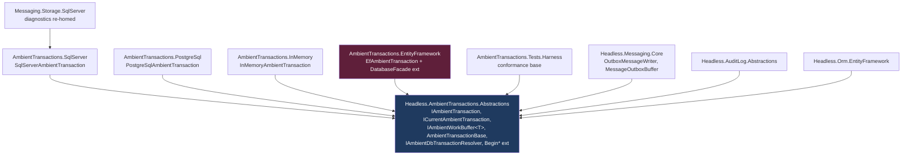

# feat: Extract ambient transactions into Headless.AmbientTransactions.*

## Summary

Carve the general-purpose "ambient DB transaction + deferred-work buffer" out of `Headless.Messaging.*` into a standalone, messaging-agnostic `Headless.AmbientTransactions.*` package family, then rewire messaging to consume it. The mechanism today is misnamed (`IOutboxTransaction` leaks the use case) and hard-coupled to messaging (`MediumMessage`, `IDispatcher`), which blocks Jobs (#270) from enqueuing a job inside a user's domain transaction.

The plan also **unifies a second, pre-existing ambient-transaction concept** — the audit-log `IAmbientDbTransactionAccessor` (a read-only resolver for "the transaction already in flight") — into the same package family, so the framework has one coherent home for ambient-transaction primitives instead of two silos with confusingly-similar names.

This is a **refactor + extraction**, not a feature. Greenfield discipline applies: full rename, no back-compat shims, no type-forwarding (per repo `CLAUDE.md` and origin non-goals).

---

## Problem Frame

Two distinct "ambient transaction" mechanisms exist in the repo today, in separate homes, solving complementary halves of the same problem:

| | Coordinator (push/buffer) | Resolver (pull/read-only) |
| --- | --- | --- |
| **Contract** | `IOutboxTransaction` + `IOutboxTransactionAccessor` + `IOutboxMessageBuffer` | `IAmbientDbTransactionAccessor` |
| **Home** | `Headless.Messaging.Abstractions` + `Headless.Messaging.Core/Transactions` | `Headless.AuditLog.Abstractions` (EF impl in `Headless.Orm.EntityFramework`) |
| **Behavior** | You create a transaction object; writers buffer work onto it via `AsyncLocal`; flush on commit; owner drives begin/commit/rollback. | Given a `DbContext`, return the active `(DbConnection, DbTransaction)` so a raw-SQL store can enlist read/append-only. MUST NOT open connections or begin transactions. |
| **Consumers** | `OutboxMessageWriter` (behind `IOutboxBus`/`IOutboxQueue`) | `SqlServerAuditLogStore`, `PostgreSqlAuditLogStore` |

Problems this plan solves:

1. **Naming leak** — `IOutboxTransaction` describes a use case (the outbox pattern), but the mechanism is general ambient-transaction coordination.
2. **Messaging coupling** — the coordinator's base class (`OutboxTransaction`) takes `IDispatcher` and buffers `MediumMessage`; nothing non-messaging can reuse it. Jobs needs the same mechanism with `TimeJobEntity`, not `MediumMessage`.
3. **Conceptual fragmentation** — the resolver primitive (`IAmbientDbTransactionAccessor`) sits in `AuditLog.Abstractions`, while the EF logic to read a `DbContext`'s current transaction is duplicated across `EfAmbientDbTransactionAccessor`, `OutboxIntegrationEventDispatcher`, and the per-provider `*EntityFrameworkDbTransaction` bridges.
4. **Name collision risk** — the issue's proposed `IAmbientTransactionAccessor` is one letter from the existing `IAmbientDbTransactionAccessor`, in the same conceptual space.

> **Verification note (drives this plan's accuracy):** the origin issue frames this as "move the classes." It is not. The coordinator base is messaging-coupled (`IDispatcher` constructor param, `MediumMessage` flush) and the SqlServer adapter's `AddToSent` carries SqlServer messaging diagnostics (`DiagnosticProcessorObserver.TransBuffer`, `ClientConnectionId`). Extraction requires **splitting** generic transaction lifecycle from messaging-specific flush + diagnostics — see KTD-1.

---

## Scope Boundaries

### In scope
- New `Headless.AmbientTransactions.Abstractions` package: coordinator contracts + base + `IDbConnection` extensions + the relocated resolver primitive.
- Four provider packages: `SqlServer`, `PostgreSql`, `InMemory`, `EntityFramework` (the last adds the forward `IDbContextTransaction → IAmbientTransaction` adapter).
- A cross-provider conformance test harness (`Headless.AmbientTransactions.Tests.Harness`) per the repo's harness rule.
- Rewiring `Headless.Messaging.*` to consume the ambient family: `MessageOutboxBuffer : IAmbientWorkBuffer<MediumMessage>`, `OutboxMessageWriter` re-pointed, messaging-side SqlServer diagnostics re-homed, `IOutboxBus`/`IOutboxQueue` retained.
- Relocating `IAmbientDbTransactionAccessor` (→ `IAmbientDbTransactionResolver`) into the new abstractions package; re-pointing AuditLog + EF.
- Full rename: no `IOutboxTransaction` references remain.
- Docs lockstep: new `docs/llms/ambient-transactions.md`, per-package READMEs, updated `messaging.md`/`orm.md` cross-links, `index.md` registration.
- The capstone acceptance test: a message + EF Core domain write committed atomically through one ambient transaction.

### Out of scope (true non-goals — from origin)
- **Jobs manager integration** with ambient transactions — tracked in P7 (#270). This plan makes it *possible*; it does not wire `JobOutboxBuffer`.
- Distributed transactions (XA, MSDTC, `TransactionScope` wrapping).
- Type-forwarding shims / back-compat layers.

### Deferred to Follow-Up Work
- Collapsing `OutboxIntegrationEventDispatcher` (the existing EF reverse-bridge in `Headless.Orm.EntityFramework.Messaging`) onto the new EF adapter. The new forward adapter (U6) and the existing reverse-bridge coexist after this plan; consolidating them is a separate, messaging-aware change best done once Jobs (P7) exercises the forward path. Flagged, not actioned.

---

## Key Technical Decisions

### KTD-1: Split the messaging-coupled base into a generic lifecycle core + a typed on-commit registry, with per-consumer buffer storage in a `ConditionalWeakTable` (the heart of the extraction)
Today `OutboxTransaction` does two jobs: (a) generic — own the `DbTransaction`, wire the `AsyncLocal` accessor, manage Dispose/commit/rollback lifecycle; (b) messaging — buffer `MediumMessage`, flush to `IDispatcher` on commit. The generic `AmbientTransactionBase` keeps (a) and exposes a **provider-agnostic on-commit flush hook**; the messaging-specific (b) moves to a `MessageOutboxBuffer` on the messaging side.

**Critical correction (caught in review):** today `OutboxMessageWriter` casts the *current transaction* to `IOutboxMessageBuffer` (`AddToSent`) — this works only because the non-generic base hard-codes `MediumMessage` in `Headless.Messaging.Core`. Once the base is messaging-free, a raw provider transaction (`SqlServerAmbientTransaction`) **cannot** implement `IAmbientWorkBuffer<MediumMessage>` (it can't reference `MediumMessage`), so casting the transaction to that interface **always returns false at runtime**. Additionally, `OutboxMessageWriter` is a **singleton**, so it cannot hold a stateful per-transaction buffer without a captive-dependency violation.

**Resolution — typed on-commit registry on the contract + messaging-side `ConditionalWeakTable` for buffer storage (NOT a public `Items` object-bag):** an earlier draft put an `IDictionary<object,object> Items` bag on `IAmbientTransaction`. Doc-review (product + adversarial) flagged that as a public NuGet contract designed around a consumer that does not exist yet (Jobs has zero code references; it is out of scope). Cleaner design that keeps the public surface minimal and typed:

- `IAmbientTransaction` exposes a **typed on-commit work registry** — `void RegisterCommitWork(Func<CancellationToken, ValueTask> drain)` (name directional) — and nothing else for buffering. No public object dictionary.
- The singleton `OutboxMessageWriter` owns a `ConditionalWeakTable<IAmbientTransaction, MessageOutboxBuffer>`. On the first publish within a transaction it `GetValue`-creates the buffer (keyed by the transaction instance, GC-friendly) and registers the buffer's drain via `RegisterCommitWork` exactly once. Subsequent publishes in the same transaction resolve the same buffer from the table.

```
// OutboxMessageWriter (singleton, messaging side) — directional, not impl spec
var buffer = _buffers.GetValue(current, tx => {           // ConditionalWeakTable, messaging-owned
    var b = new MessageOutboxBuffer(dispatcher);
    tx.RegisterCommitWork(b.DrainAsync);                  // typed registry on IAmbientTransaction
    return b;
});
buffer.Buffer(mediumMessage);
```

This keeps provider transactions 100% decoupled from messaging types, keeps the public `IAmbientTransaction` contract free of an object-bag, binds buffer lifetime to the transaction instance (not a DI scope), and removes the captive-dependency problem. Jobs (P7) attaches its own `ConditionalWeakTable<IAmbientTransaction, JobOutboxBuffer>` the same way — no shared bag, no cross-package contract coupling.

**Provider-policy drain timing (KTD-7, finding-driven):** the registry is invoked per provider, NOT by a single universal "drain after DB commit" rule — the three current providers flush differently and the unified rule would break two of them. See KTD-7 for the per-provider drain-trigger matrix.

```
AmbientTransactionBase (Headless.AmbientTransactions.Abstractions)   — generic
  ├─ DbTransaction (object?), ICurrentAmbientTransaction wiring, Dispose/AsyncDispose
  ├─ RegisterCommitWork(Func<CancellationToken,ValueTask>)   (typed on-commit registry)
  ├─ abstract Commit/CommitAsync/Rollback/RollbackAsync       (provider commits the DbTransaction + drains per policy)
  └─ CompleteExternally()  (KTD-7: drain a detached txn WITHOUT committing the DbTransaction)

IAmbientWorkBuffer<TWork>.Buffer(TWork)   — generic contract
        ▲
MessageOutboxBuffer : IAmbientWorkBuffer<MediumMessage>  (Headless.Messaging.Core)  — messaging
  └─ stored in OutboxMessageWriter's ConditionalWeakTable; DrainAsync → IDispatcher.EnqueueToPublish / EnqueueToScheduler
```

This is the conceptually load-bearing unit (U1/U7). It deserves deliberate design at execution time, not a mechanical port.

### KTD-7: `CompleteExternally()` replaces the `NoopTransaction` switch — but it must reproduce the full detach→external-commit lifecycle, and drain timing is provider-policy
Today `SqlServerOutboxTransaction.Commit()` switches on `NoopTransaction` (a messaging `Transport` type) and a BCL-only `SqlServerAmbientTransaction` cannot reference it. The naïve framing "replace the sentinel with a method that drains without re-committing" is **insufficient** — doc-review (adversarial) traced the actual mechanism and it is order-sensitive:

**The real SqlServer external-commit lifecycle (3 phases):**
1. `OutboxIntegrationEventDispatcher` attaches the EF transaction (`DbTransaction = efTxn`, `AutoCommit = false`), buffers work, then **detaches without disposing** by setting `DbTransaction = null` — which through the base setter **also clears `ICurrentAmbientTransaction.Current`**. The transaction object is now buffered-but-detached, surviving only because it was registered in the SqlServer diagnostic `TransBuffer` keyed by `ClientConnectionId`.
2. Later, the **real** EF/SqlClient transaction commits; the SqlClient diagnostic fires `WriteTransactionCommitAfter`.
3. The diagnostic observer (today) re-arms the object (`DbTransaction = new NoopTransaction()`), calls `Commit()` to flush, then disposes.

So `CompleteExternally()` must **flush a transaction whose `DbTransaction` is `null` at call time** (detached, `Current` already cleared), run its registered drains exactly once, and not re-commit or re-touch the accessor. A simple "alternative Commit branch" drops integration events — the exact failure the dispatcher's own comment warns against. The `NoopTransaction` swap was doing real work (re-establishing a non-null `DbTransaction` so the flush path ran); `CompleteExternally()` must encode "detached-and-externally-committed → drain now" as a first-class state, distinct from "rolled-back → discard".

**Sync-only (resolves former open-question #2):** the only external-commit trigger is `DiagnosticObserver.OnNext` / `DiagnosticProcessorObserver.OnNext`, which are **synchronous `void` `IObserver` callbacks with no async seam** (verified). Today's flush is already sync-over-async (`Flush()` → `FlushAsync().GetAwaiter().GetResult()`). Therefore ship **only `void CompleteExternally()`** on the contract (documented sync-over-async at the seam); do **not** add `CompleteExternallyAsync` — it would be public surface with exactly one synchronous, blocking caller, misleading future consumers (Jobs) into thinking an async external-commit path exists. Add the async variant only when a real async external-commit caller appears.

**Provider-policy drain matrix (resolves finding 1 — the providers do NOT share a commit-time shape):**

| Provider | Where the drain fires today | Rule for `AmbientTransactionBase` |
| --- | --- | --- |
| PostgreSql | inline in `CommitAsync` (commit DbTxn, then `FlushAsync`) | drain inline on commit |
| InMemory | sync `Commit()` only (async `CommitAsync` is a no-op today) | drain inline on **both** `Commit` and `CommitAsync` (finding 9) |
| SqlServer | **out-of-band** via the sync diagnostic; normal `CommitAsync` does **not** flush | **suppress** the in-commit drain; drain only via `CompleteExternally()` from the diagnostic |

If `AmbientTransactionBase` drains unconditionally after every commit, SqlServer **double-flushes** (once in `CommitAsync`, once via the diagnostic). The drain trigger must therefore be a provider decision, not a single base behavior. The commit-time sequence diagram below shows the PostgreSql/inline path; SqlServer follows the detach→external path above.

**Audience note (finding 7):** `CompleteExternally()` lives on the universal `IAmbientTransaction` but its semantics only make sense in an external-commit-interception scenario. The package README must state its audience (provider/diagnostic authors, not typical consumers); a non-messaging consumer never calls it. Narrowing it to a secondary provider-facing interface is recorded as an Open Question rather than actioned, to avoid over-engineering the first cut.

### KTD-2: Unify both ambient concepts in one package, as two clearly-named layers (do not merge the interfaces)
The resolver (`IAmbientDbTransactionResolver`) and the coordinator (`IAmbientTransaction`) are stacked layers, not the same abstraction: the coordinator's EF adapter *needs* the resolver mechanic (`DbContext.Database.CurrentTransaction.GetDbTransaction()`). Co-locate both in `Headless.AmbientTransactions.Abstractions`; keep them as distinct interfaces. Rationale: one conceptual home, kills the duplication of EF resolution logic, and forces coherent naming. (Chosen over "scope to #265 / leave resolver in AuditLog" because greenfield + no deployed consumers makes the relocation cheap now and incoherent later.)

### KTD-3: Naming (collision-safe; proposed, changeable at execution)
| Today | New |
| --- | --- |
| `IOutboxTransaction` | `IAmbientTransaction` |
| `IOutboxTransactionAccessor` / `AsyncLocalOutboxTransactionAccessor` | `ICurrentAmbientTransaction` / `AsyncLocalCurrentAmbientTransaction` |
| `IOutboxMessageBuffer.AddToSent(MediumMessage)` | `IAmbientWorkBuffer<TWork>.Buffer(TWork)` |
| `OutboxTransaction` (base) | `AmbientTransactionBase` |
| `BeginOutboxTransaction[Async]` | `BeginAmbientTransaction[Async]` |
| `IAmbientDbTransactionAccessor` | `IAmbientDbTransactionResolver` |
| `SqlServer/PostgreSql/InMemoryOutboxTransaction` | `SqlServer/PostgreSql/InMemoryAmbientTransaction` |

`ICurrentAmbientTransaction` (holds the coordinator) vs `IAmbientDbTransactionResolver` (reads raw conn/txn) are now unmistakably different.

### KTD-4: Keep the abstraction BCL-only so raw-ADO providers never reference EF Core
Per institutional learning (`docs/solutions/architecture-patterns/unified-provider-setup-builder-pattern.md` §8), the resolver/coordinator contracts deal in `System.Data` / `System.Data.Common` types only. `SqlServer` and `PostgreSql` provider packages depend solely on `Headless.AmbientTransactions.Abstractions`; only the `EntityFramework` package references EF Core. This is what makes the four-provider split clean.

### KTD-5: Build the conformance harness before the providers
Per `CLAUDE.md` harness rule and learning #3 (`DataStorageTestsBase` model). The harness defines the contract once; each provider proves it. Port the audit-log atomicity scenarios (enroll-commit, rollback-drops-work, accessor-null fallback, provider-mismatch fallback) as the cross-provider base.

### KTD-6: Messaging storage providers depend on the corresponding ambient provider
So `Headless.Messaging.Storage.SqlServer` keeps registering a SqlServer-backed transaction for the outbox publish path — it now resolves `SqlServerAmbientTransaction` from `Headless.AmbientTransactions.SqlServer` and re-homes the SqlServer messaging diagnostics (`TransBuffer`) into a messaging-side wrapper/hook rather than inside the moved transaction class. The diagnostic listener signals post-external-commit flush via `IAmbientTransaction.CompleteExternally()` (KTD-7), not by substituting `NoopTransaction`.

### KTD-8: The EF ambient package depends on EF Core Relational only — never on `Headless.Orm.EntityFramework` (cycle avoidance)
`EfAmbientTransaction` and the `DatabaseFacade` extensions need only `Microsoft.EntityFrameworkCore.Relational` types (`IDbContextTransaction`, `GetDbTransaction()`), not `HeadlessDbContext`. Keeping `Headless.AmbientTransactions.EntityFramework` off `Headless.Orm.EntityFramework` means `Headless.Orm.EntityFramework` can depend on the BCL-only `Headless.AmbientTransactions.Abstractions` (for the relocated resolver interface) with no cycle. Consequently the EF *resolver implementation* stays in `Headless.Orm.EntityFramework` (its existing auto-registration home for audit-log enrollment), not in the EF ambient package. (Resolves former open-question #1.)

---

## High-Level Technical Design

### Package dependency graph (target)



Note the **inverted dependency** (KTD-2): `Headless.Messaging.Core` and `Headless.AuditLog.Abstractions` now depend *on* the new abstractions package. This is the structural consequence the origin issue does not state.

### Commit-time sequence (coordinator path)

```mermaid
sequenceDiagram
    participant App
    participant Conn as IDbConnection
    participant Tx as IAmbientTransaction
    participant Cur as ICurrentAmbientTransaction
    participant Writer as OutboxMessageWriter
    participant Buf as MessageOutboxBuffer
    participant Disp as IDispatcher

    App->>Conn: BeginAmbientTransactionAsync(tx)
    Conn->>Tx: DbTransaction = begin(); Cur.Current = tx
    App->>Writer: bus.PublishAsync(msg)
    Writer->>Cur: Current?
    Cur-->>Writer: tx (DbTransaction set, AutoCommit false)
    Writer->>Buf: Buffer(mediumMessage)
    Buf->>Tx: register drain (once)
    App->>Tx: CommitAsync()
    Tx->>Tx: DbTransaction.Commit()
    Tx->>Buf: drain() (inline-drain providers: PostgreSql, InMemory)
    Buf->>Disp: EnqueueToPublish / EnqueueToScheduler
```

> This shows the **inline-drain** path (PostgreSql, InMemory). **SqlServer differs:** it detaches the transaction (`DbTransaction = null`, clearing `Current`), the real EF/SqlClient transaction commits out-of-band, and the sync diagnostic then calls `CompleteExternally()` to drain — see KTD-7's 3-phase lifecycle and provider-policy matrix. A single shared "commit→drain" path is the wrong abstraction.

---

## Output Structure (new packages)

```
src/
  Headless.AmbientTransactions.Abstractions/
    Headless.AmbientTransactions.Abstractions.csproj
    Setup.cs                                  # if shared registration helpers are needed
    IAmbientTransaction.cs
    ICurrentAmbientTransaction.cs             # + AsyncLocalCurrentAmbientTransaction
    IAmbientWorkBuffer.cs
    AmbientTransactionBase.cs
    AmbientTransactionExtensions.cs           # BeginAmbientTransaction[Async]
    IAmbientDbTransactionResolver.cs
    README.md
  Headless.AmbientTransactions.SqlServer/      { SqlServerAmbientTransaction.cs, Setup.cs, README.md }
  Headless.AmbientTransactions.PostgreSql/     { PostgreSqlAmbientTransaction.cs, Setup.cs, README.md }
  Headless.AmbientTransactions.InMemory/       { InMemoryAmbientTransaction.cs, Setup.cs, README.md }
  Headless.AmbientTransactions.EntityFramework/{ EfAmbientTransaction.cs, EfAmbientTransactionExtensions.cs, Setup.cs, README.md }
                                              # resolver IMPL stays in Headless.Orm.EntityFramework (KTD-8); only the EfAmbientTransaction forward adapter + DatabaseFacade ext live here
tests/
  Headless.AmbientTransactions.Tests.Harness/          { AmbientTransactionFixtureBase.cs, AmbientTransactionConformanceTests.cs }
  Headless.AmbientTransactions.Tests.Unit/             { InMemory + extensions unit tests }
  Headless.AmbientTransactions.SqlServer.Tests.Integration/
  Headless.AmbientTransactions.PostgreSql.Tests.Integration/
  Headless.AmbientTransactions.EntityFramework.Tests.Integration/
docs/llms/ambient-transactions.md
```

The per-unit `**Files:**` lists remain authoritative; the implementer may adjust layout.

---

## Implementation Units

Grouped in four phases. U-IDs are stable.

### Phase A — Generic substrate + harness

### U1. Create `Headless.AmbientTransactions.Abstractions`
**Goal:** Stand up the messaging-free coordinator contracts, the generic base with the on-commit flush hook, the `IDbConnection` extensions, and the relocated resolver interface.
**Requirements:** Origin acceptance — abstractions package + rename; KTD-1, KTD-3, KTD-4.
**Dependencies:** none.
**Files:**
- `src/Headless.AmbientTransactions.Abstractions/Headless.AmbientTransactions.Abstractions.csproj` (SDK `Headless.NET.Sdk`, `TargetFramework net10.0`, `RootNamespace Headless.AmbientTransactions`)
- `IAmbientTransaction.cs`, `ICurrentAmbientTransaction.cs` (+ `AsyncLocalCurrentAmbientTransaction`), `IAmbientWorkBuffer.cs`, `AmbientTransactionBase.cs`, `AmbientTransactionExtensions.cs`, `IAmbientDbTransactionResolver.cs`, `README.md`
- `headless-framework.slnx` (new `/AmbientTransactions/` folder)
- test: `tests/Headless.AmbientTransactions.Tests.Unit/AmbientTransactionExtensionsTests.cs`
**Approach:** Port `IOutboxTransaction` → `IAmbientTransaction` (drop the "outbox" doc framing). Add to the contract: a **typed on-commit work registry** `RegisterCommitWork(Func<CancellationToken,ValueTask>)` (KTD-1 — NOT a public `IDictionary` object-bag) and a **sync-only** `void CompleteExternally()` (KTD-7 — no `CompleteExternallyAsync`). `AmbientTransactionBase` keeps the `DbTransaction` setter/accessor wiring and Dispose logic from today's `OutboxTransaction`, but **removes** the `IDispatcher` ctor param and `MediumMessage` flush; replace with the typed registry + `CompleteExternally` (KTD-1, KTD-7). `CompleteExternally()` must drain a transaction whose `DbTransaction` is `null` at call time (detached external-commit path) and encode "drain now" distinctly from "rolled-back → discard". Move `BeginOutboxTransaction[Async]` verbatim except renamed. Relocate `IAmbientDbTransactionAccessor`'s contract here as `IAmbientDbTransactionResolver` (BCL-only signature unchanged). **Note:** the `AsyncLocalCurrentAmbientTransaction` setter preserves today's *mutate-existing-holder* semantics (not allocate-new-holder) — this is deliberate and lets `DbTransaction = null` clear `Current` from the dispose frame; see Risks.
**Patterns to follow:** existing `*.Abstractions` csproj shape (`Headless.DistributedLocks.Abstractions`); current `OutboxTransactionExtensions.cs` for the extension bodies.
**Test suite design:** Unit project owns extension-method tests (open/begin/auto-commit flag wiring) and the base's drain-registry semantics with a fake provider transaction. Provider-specific commit/rollback is proven in the harness (U2), not here.
**Test scenarios:**
- `BeginAmbientTransaction` opens a closed connection, sets `DbTransaction`, sets `AutoCommit` from arg; `ICurrentAmbientTransaction.Current` becomes the txn.
- `BeginAmbientTransactionAsync` same, async path; respects `IsolationLevel` overload.
- Setting `DbTransaction = null` clears `Current` when it referenced this txn (mirror today's behavior).
- On-commit registry: `RegisterCommitWork` callback registered once is invoked exactly once after commit; not invoked on rollback; not double-invoked if both `Commit` and a later `CompleteExternally` fire.
- `CompleteExternally()` drains the registered work when `DbTransaction` is `null` (detached external-commit path) without committing/disposing; it does NOT re-touch `ICurrentAmbientTransaction.Current`; a subsequent `Commit()` does not re-run drains.
- `CompleteExternally()` on a rolled-back transaction discards (distinguishes "externally committed, drain" from "rolled back, discard").
- Dispose/DisposeAsync disposes the underlying `DbTransaction` and nulls it.
**Verification:** Unit project builds and the above tests pass; no `MediumMessage`/`IDispatcher` reference exists anywhere in the package (grep clean).

### U2. Create `Headless.AmbientTransactions.Tests.Harness`
**Goal:** One cross-provider conformance suite + fixture base that every provider proves.
**Requirements:** KTD-5; CLAUDE.md harness rule.
**Dependencies:** U1.
**Files:**
- `tests/Headless.AmbientTransactions.Tests.Harness/Headless.AmbientTransactions.Tests.Harness.csproj` (SDK `Headless.NET.Sdk.Test`, `IsTestProject=false`, `IsTestableProject=false`, refs `Headless.Testing` + `Headless.Testing.Testcontainers`)
- `AmbientTransactionFixtureBase.cs` (container lifecycle + host bootstrap + schema/init seam), `AmbientTransactionConformanceTests.cs` (`abstract class ...<TFixture>`)
**Approach:** Mirror `Headless.DistributedLocks.Tests.Harness/DistributedLockTestsBase.cs` (abstract `GetXxx()` + `virtual` scenario methods, provider-specific escapes as `virtual` throwing `NotSupportedException`). Mirror `Headless.Orm.Tests.Harness` fixture base for Testcontainers lifecycle and the `OnDatabaseInitializeAsync` seam. Reuse `HeadlessSqlServerFixture` (ARM64 image fallback) and `TestImages` constants.
**Test suite design:** This IS the test infrastructure. Conformance scenarios are `public virtual async Task should_...`; leaf integration projects (U4/U5/U6) subclass and bind a concrete fixture.
**Test scenarios (the conformance contract — implemented as overridable methods):**
- Enroll-commit: work buffered inside the ambient txn is flushed **exactly once** after commit; domain row persists. **Exercise both `Commit()` and `CommitAsync()`** (the async path is what U9 and Jobs use; InMemory's async path is a no-op today — finding 9).
- Drain-exactly-once across providers: assert no double-flush. This is the guard for the SqlServer in-commit-suppressed + external-drain policy (KTD-7) — a provider that drains both inline and via `CompleteExternally()` fails here.
- Detach → external-commit (SqlServer-shaped): attach txn → buffer → detach (`DbTransaction = null`, `Current` cleared) → simulate external commit → `CompleteExternally()` → assert drain runs exactly once and buffered work is NOT dropped. Mirrors `OutboxIntegrationEventDispatcher`'s production path.
- Rollback drops work: buffered work is discarded; domain row absent. (Covers atomicity.) Also: `CompleteExternally()` on a rolled-back txn discards.
- Accessor-null fallback: with no ambient txn in flight, a publish/write takes the standalone path (no buffering).
- Provider-mismatch fallback: a resolver of a different provider shape falls back to standalone rather than throwing; warning deduped once-per-shape (learning #1).
- Cancellation: `CommitAsync(ct)` honors a cancelled token before flushing.
- Double-commit / commit-after-dispose guard behavior.
**Verification:** Harness compiles as a library (not a runnable test project); at least one provider (U3 InMemory) green against it before SQL providers start. **Prerequisite:** the buffering scenarios (enroll-commit, drain-exactly-once, detach→external-commit) only run against InMemory if `InMemoryAmbientTransaction` provides a begin path + sentinel non-null `DbTransaction` (U3) — today's InMemory has no transaction handle and never buffers, so without that the "validate without Docker first" path is impossible.

### Phase B — Providers

### U3. `Headless.AmbientTransactions.InMemory`
**Goal:** In-memory coordinator adapter (flush-on-commit, no real DB transaction) + DI Setup. **Highest-risk port** (learning #3: no free isolation/snapshot semantics).
**Requirements:** Origin — four providers; KTD-4.
**Dependencies:** U1, U2.
**Files:** `src/Headless.AmbientTransactions.InMemory/{InMemoryAmbientTransaction.cs, Setup.cs, README.md, .csproj}`; `tests/Headless.AmbientTransactions.Tests.Unit/InMemoryAmbientTransactionTests.cs`; subclass the conformance harness in the Unit project (no container needed).
**Approach:** Port `InMemoryOutboxTransaction` → `InMemoryAmbientTransaction`, but this is **not a verbatim port — it adds a capability the current InMemory lacks.** Today InMemory has *no transaction handle* (`InMemoryDataStorage.cs:827`: "the nullability is part of the contract") and *no begin path*, so `DbTransaction` is never non-null, `Current` never points at it, and it never buffers — which is why today's `Commit()`-flushes-empty vs `CommitAsync()`-no-op asymmetry is harmless dead code, **not a live bug** (an earlier draft mischaracterized it). The new `InMemoryAmbientTransaction` must:
  - **Provide a begin path + a sentinel non-null `DbTransaction`** (e.g. a private marker object) so the buffering branch in `OutboxMessageWriter` actually executes in-process. **This is a prerequisite for U2's conformance harness** — the enroll-commit / drain-exactly-once / detach scenarios cannot run against InMemory (the "validate without Docker first" path) unless InMemory can buffer.
  - **Drain on BOTH `Commit()` and `CommitAsync()`** — once buffering is real, the old async no-op *would* silently drop work; U9 and Jobs commit asynchronously (finding 9).
  - `Rollback` discards.
  `SetupInMemoryAmbientTransactions` follows the `extension(IServiceCollection)` + `_AddInMemoryAmbientTransactionsCore` pattern. InMemory needs **no options** → plain `AddInMemoryAmbientTransactions()` with no configurator overload (options convention).
**Package-vs-test-only decision (finding 8):** doc-review flagged that InMemory's only *current* consumer is harness validation, suggesting it live inside the test harness. Decision: **ship it as a package** — it mirrors the framework's existing InMemory-provider-per-package pattern (`Headless.Caching.InMemory`, `Headless.DistributedLocks.InMemory`), the origin issue names it as one of four providers, and downstream apps testing consumer code without a DB are a real (if latent) use. The risk it invites (using InMemory where a real provider belongs) is mitigated by the README stating it is not a durability substitute.
**Patterns to follow:** `Headless.Caching.*`/`DistributedLocks.InMemory` Setup shape.
**Test suite design:** Unit project runs the full conformance base against InMemory + InMemory-specific concurrency tests.
**Test scenarios:**
- All conformance scenarios (via harness subclass) pass for InMemory.
- Concurrency: two concurrent ambient "transactions" each buffer overlapping work; commit of one does not flush the other's buffer (snapshot/isolation must be explicit — clone, don't share live refs).
- Rollback discards buffered work without side effects.
**Verification:** Conformance base + concurrency tests pass; explicit assertion that buffered work is cloned/isolated, not shared by reference.

### U4. `Headless.AmbientTransactions.SqlServer`
**Goal:** SqlServer coordinator adapter (commit/rollback the real `DbTransaction`), messaging-free.
**Requirements:** Origin — four providers; KTD-4, KTD-6.
**Dependencies:** U1, U2.
**Files:** `src/Headless.AmbientTransactions.SqlServer/{SqlServerAmbientTransaction.cs, Setup.cs, README.md, .csproj}`; `tests/Headless.AmbientTransactions.SqlServer.Tests.Integration/{SqlServerAmbientTransactionFixture.cs, SqlServerAmbientTransactionTests.cs}`
**Approach:** Port `SqlServerOutboxTransaction`'s Commit/Rollback switch for the BCL transaction cases (`IDbTransaction` / `DbTransaction`) — **drop** the `AddToSent` diagnostics override and the `DiagnosticProcessorObserver`/`TransBuffer` coupling (re-home to messaging in U7), **drop** the `NoopTransaction` case (replaced by `CompleteExternally()` per KTD-7 — the diagnostic listener calls that), and **drop** the `IDbContextTransaction` case (EF lives only in the EF ambient package, KTD-4). This package is strictly BCL-only — no `Microsoft.EntityFrameworkCore.*` reference. **Drain policy (KTD-7):** `SqlServerAmbientTransaction.CommitAsync`/`Commit` commit the `DbTransaction` but do **NOT** drain in-commit — the real flush is diagnostic-driven via `CompleteExternally()` on the detach→external-commit path. Draining in-commit here would double-flush (once in commit, once via the diagnostic). The `DatabaseFacade` EF-facade `BeginTransaction` extensions do **not** belong here; they move to `Headless.AmbientTransactions.EntityFramework` (U6).
**Patterns to follow:** existing provider Setup; `HeadlessSqlServerFixture` for the integration container.
**Test suite design:** Integration project (Testcontainers MsSql `2022-latest` / AzureSqlEdge ARM64 fallback) subclasses the conformance harness with a SqlServer fixture; plus SqlServer-only test for real transaction durability.
**Test scenarios:**
- Full conformance base passes against a real SqlServer transaction (incl. the drain-exactly-once and detach→external-commit scenarios from U2).
- Committed work is visible after commit; rolled-back work absent (real DB round-trip, not a mock).
- No double-flush: `CommitAsync` does not drain; `CompleteExternally()` drains exactly once on the external-commit path.
- `IsolationLevel` override honored.
**Verification:** Integration tests pass under Docker; no messaging type referenced in the package (grep clean).

### U5. `Headless.AmbientTransactions.PostgreSql`
**Goal:** PostgreSql coordinator adapter — symmetric to U4.
**Requirements:** Origin — four providers; KTD-4.
**Dependencies:** U1, U2.
**Files:** `src/Headless.AmbientTransactions.PostgreSql/{PostgreSqlAmbientTransaction.cs, Setup.cs, README.md, .csproj}`; `tests/Headless.AmbientTransactions.PostgreSql.Tests.Integration/{PostgreSqlAmbientTransactionFixture.cs, PostgreSqlAmbientTransactionTests.cs}`
**Approach:** Port `PostgreSqlOutboxTransaction` the same way as U4, dropping any messaging diagnostics. Symmetric structure — U4 and U5 are deliberately parallel.
**Patterns to follow:** U4; `Testcontainers.PostgreSql` (`postgres:18.1-alpine3.23` via `TestImages.PostgreSql`).
**Test suite design:** Integration project subclasses the conformance harness with a PostgreSql fixture.
**Test scenarios:** Conformance base passes against a real Npgsql transaction; commit-visible / rollback-absent round-trip; isolation override honored.
**Verification:** Integration tests pass under Docker; grep clean of messaging types.

### U6. `Headless.AmbientTransactions.EntityFramework`
**Goal:** The forward adapter — wrap an EF-owned `IDbContextTransaction` so it *becomes* an `IAmbientTransaction` (so EF-using callers like Jobs can host the ambient transaction), plus the `DatabaseFacade` `BeginAmbientTransaction[Async]` extensions. (The EF *resolver implementation* is not here — it stays in `Headless.Orm.EntityFramework`, U8/KTD-8.)
**Requirements:** Origin — EF provider implemented with integration test; KTD-2, KTD-4, KTD-8.
**Dependencies:** U1, U2; relates U8 (resolver contract).
**Files:** `src/Headless.AmbientTransactions.EntityFramework/{EfAmbientTransaction.cs, EfAmbientTransactionExtensions.cs, Setup.cs, README.md, .csproj}` (**refs `Microsoft.EntityFrameworkCore.Relational` directly + `Headless.AmbientTransactions.Abstractions` — NOT `Headless.Orm.EntityFramework`**, to avoid the circular dependency in KTD-8); `tests/Headless.AmbientTransactions.EntityFramework.Tests.Integration/{...Fixture.cs, EfAmbientTransactionTests.cs}`
**Approach:** `EfAmbientTransaction` adapts an `IDbContextTransaction` (a pure EF Core *Relational* type — `HeadlessDbContext` is not needed): begins (or wraps an existing) EF transaction, exposes it as `IAmbientTransaction` with `DbTransaction` set to the EF txn, commit/rollback delegating to the `IDbContextTransaction`. This package **also owns the `DatabaseFacade` EF-facade `BeginAmbientTransaction[Async]` extensions** moved out of the messaging SQL storage packages (review finding — BCL-only SQL packages can't reference `DatabaseFacade`). The EF implementation of `IAmbientDbTransactionResolver` does **not** live here — it stays in `Headless.Orm.EntityFramework` (U8) to avoid a cycle, since that package already auto-registers it for audit-log enrollment. Builder-style Setup (`AddEntityFrameworkAmbientTransactions(this IHeadlessDbContextBuilder)`) mirroring `Headless.Orm.EntityFramework.Messaging`'s `AddIntegrationEventOutbox`.
**Patterns to follow:** `EfAmbientDbTransactionAccessor` (the resolver mechanic); `OutboxIntegrationEventDispatcher` for the EF-transaction lifecycle ownership caveat (detach-without-dispose when EF owns the txn).
**Test suite design:** Integration project (Testcontainers — pick PostgreSql for speed, or both) subclasses the conformance harness with an EF-backed fixture; plus an EF-specific atomicity test.
**Test scenarios:**
- Conformance base passes with an EF `IDbContextTransaction` backing the ambient transaction.
- EF domain write (`SaveChangesAsync`) + buffered ambient work commit atomically: both present after commit.
- Rollback of the EF transaction drops both the domain write and the buffered work.
- `DatabaseFacade.BeginAmbientTransactionAsync(...)` returns a usable `IAmbientTransaction` whose `DbTransaction` is the EF txn. (The `IAmbientDbTransactionResolver` EF impl is tested in U8, not here.)
**Verification:** Integration tests pass under Docker; no `Headless.Orm.EntityFramework` reference in the csproj (cycle-free, KTD-8).

### Phase C — Messaging rewire

### U7. Rewire `Headless.Messaging.*` onto the ambient family
**Goal:** Messaging consumes `Headless.AmbientTransactions.*`; the `MediumMessage`→`IDispatcher` flush lives in a messaging-side `MessageOutboxBuffer`; SqlServer messaging diagnostics re-homed; public `IOutboxBus`/`IOutboxQueue` unchanged.
**Requirements:** Origin — `MessageOutboxBuffer` adapter; `IOutboxBus`/`IOutboxQueue` retained; all existing messaging tests pass; full rename. KTD-1, KTD-6.
**Dependencies:** U1, U3, U4, U5, U6 (U6 owns the relocated `DatabaseFacade` `BeginAmbientTransaction[Async]` extensions and the `IDbContextTransaction → IAmbientTransaction` surface that U7's EF-storage repoints consume).
**Files:**
- delete `src/Headless.Messaging.Abstractions/IOutboxTransaction.cs`; delete `src/Headless.Messaging.Core/Transactions/{IOutboxTransactionAccessor.cs, IOutboxMessageBuffer.cs, OutboxTransaction.cs, OutboxTransactionExtensions.cs}`
- add `src/Headless.Messaging.Core/Transactions/MessageOutboxBuffer.cs` (`IAmbientWorkBuffer<MediumMessage>`; the `EnqueueToPublish`/`EnqueueToScheduler` `DrainAsync`; constructed with `IDispatcher`)
- edit `src/Headless.Messaging.Core/Internal/OutboxMessageWriter.cs` (`ICurrentAmbientTransaction`; **owns a `ConditionalWeakTable<IAmbientTransaction, MessageOutboxBuffer>`; on first publish per txn, `GetValue`-creates the buffer and registers its drain via `current.RegisterCommitWork(buffer.DrainAsync)` — NOT a public `Items` bag and NOT a cast on the transaction**, per KTD-1)
- edit `src/Headless.Messaging.Core/Setup.cs` (register `AsyncLocalCurrentAmbientTransaction`, `MessageOutboxBuffer`)
- edit `src/Headless.Messaging.Core/Headless.Messaging.Core.csproj` (+ `Headless.AmbientTransactions.Abstractions`)
- edit `src/Headless.Messaging.Storage.SqlServer/*` — depend on `Headless.AmbientTransactions.SqlServer`; re-home `DiagnosticProcessorObserver.TransBuffer` registration into a messaging-side hook (was `SqlServerOutboxTransaction.AddToSent`); delete `SqlServerOutboxTransaction.cs`, repoint `SqlServerEntityFrameworkDbTransaction.cs`/`EntityFrameworkTransactionExtensions.cs` to `IAmbientTransaction`
- edit `src/Headless.Messaging.Storage.PostgreSql/*` and `src/Headless.Messaging.InMemoryStorage/*` symmetrically; delete the moved provider transaction files
- edit `src/Headless.Orm.EntityFramework.Messaging/OutboxIntegrationEventDispatcher.cs` — **explicit rewire** (not just a type rename): it resolves a transient `IOutboxTransaction` from DI and relies on the SqlServer provider self-registering that *same instance* in the diagnostic `TransBuffer`. After extraction the DI-registered transaction is the messaging-free `SqlServerAmbientTransaction` and the buffer lives in `OutboxMessageWriter`'s `ConditionalWeakTable`. Rewire to obtain/attach the ambient transaction via `ICurrentAmbientTransaction`, and rewrite the detach-without-dispose comment + invariant so the post-commit diagnostic drains via `CompleteExternally()` (which finds the buffer by transaction identity, not by being the same resolved object). Confirm the diagnostic still locates the work by `ClientConnectionId` once the registering instance is no longer the object the dispatcher resolved.
**Approach:** Mechanical rename for the type references; the **non-mechanical** parts are (a) factoring the `MediumMessage` flush out of the base into `MessageOutboxBuffer`, stored in `OutboxMessageWriter`'s `ConditionalWeakTable<IAmbientTransaction, MessageOutboxBuffer>` and wired to the transaction via `RegisterCommitWork` (KTD-1), (b) re-homing SqlServer's `TransBuffer` diagnostic registration — today it lives inside the moved transaction's `AddToSent`; it must move to a messaging-owned seam that observes buffering, and call `CompleteExternally()` on post-external-commit (KTD-7), and (c) ensuring the diagnostic `TransBuffer` entry (keyed by `ClientConnectionId`) is removed on **every** exit path (commit, external-commit, rollback, dispose, exception) — review-flagged leak risk. Keep `IOutboxBus`/`IOutboxQueue` names and behavior identical.
**Patterns to follow:** today's `OutboxMessageWriter._PublishInternalAsync` transactional branch; today's `OutboxTransaction.FlushAsync` (becomes `MessageOutboxBuffer`'s drain).
**Test suite design:** The **existing** messaging unit + integration suites are the primary regression gate — BUT they are partially neutralized by the rewrite and must be updated, not just renamed: today's test doubles (e.g. the fake transaction in `IsTransactionalPropagationTests`) implement `IOutboxMessageBuffer.AddToSent` directly on the transaction, which is exactly the cast that "always returns false at runtime" under the new design. Renaming them leaves the new attachment path (`ConditionalWeakTable` + `RegisterCommitWork`) **unexercised while the tests stay green** — the silent-green failure mode. Rewrite the propagation/publish fakes to exercise the new attachment, and audit NSubstitute mock arity at every touched call site (learning #3).
**Test scenarios:**
- All existing messaging tests pass unchanged in behavior (`OutboxTransactionExtensionsTests`, `IsTransactionalPropagationTests`, `TypeSafePublishApiTests`, storage provider tests) — updated only for renamed types.
- Transactional publish buffers via `MessageOutboxBuffer` and flushes to `IDispatcher` on commit (behavior identical to today).
- `AutoCommit=true` path still commits immediately after buffering.
- SqlServer diagnostics: `TransBuffer` still receives the transaction on buffering (re-homed hook), proven by the existing SqlServer messaging diagnostic test; **and `TransBuffer` returns to zero active entries after commit / external-commit / rollback / dispose** (new assertion — leak guard).
- Buffer attachment: two publishes within one ambient transaction resolve the *same* `MessageOutboxBuffer` from the `ConditionalWeakTable` and register the drain *once*, not twice.
- Delayed-vs-immediate parity (Open Q#3): a message with `Headers.DelayTime` drains via `EnqueueToScheduler` with the `SentTime` header; without it, via `EnqueueToPublish` — assert this explicitly so the logic moving out of `OutboxTransaction.FlushAsync` into `MessageOutboxBuffer` does not drift.
**Verification:** `make test` green for all `Headless.Messaging.*` projects; grep shows zero `IOutboxTransaction`/`IOutboxMessageBuffer`/`OutboxTransaction` references remain.

### Phase D — Unification + capstone + docs

### U8. Relocate the resolver: `IAmbientDbTransactionAccessor` → `IAmbientDbTransactionResolver`
**Goal:** Move the resolver primitive into the ambient abstractions package; re-point AuditLog + EF.
**Requirements:** KTD-2, KTD-3.
**Dependencies:** U1.
**Files:**
- delete `src/Headless.AuditLog.Abstractions/IAmbientDbTransactionAccessor.cs` (contract now in U1's package)
- edit `src/Headless.AuditLog.Abstractions/*.csproj` (+ `Headless.AmbientTransactions.Abstractions`)
- edit `src/Headless.AuditLog.Storage.SqlServer/SqlServerAuditLogStore.cs`, `src/Headless.AuditLog.Storage.PostgreSql/PostgreSqlAuditLogStore.cs` (use `IAmbientDbTransactionResolver`)
- rename in place `src/Headless.Orm.EntityFramework/Contexts/Auditing/EfAmbientDbTransactionAccessor.cs` → `EfAmbientDbTransactionResolver` implementing the relocated `IAmbientDbTransactionResolver`; edit `src/Headless.Orm.EntityFramework/SetupEntityFramework.cs` registration; add `Headless.AmbientTransactions.Abstractions` ref to `Headless.Orm.EntityFramework.csproj`
**Approach:** Relocate the *interface* to the abstractions package (U1); the EF *implementation stays in `Headless.Orm.EntityFramework`* (decided in KTD-8 — it's the existing auto-registration home and keeping it there avoids a cycle with the EF ambient package). BCL-only signature unchanged. Pure rename + re-point.
**Patterns to follow:** current `SetupEntityFramework.cs:115` `TryAddSingleton` registration.
**Test suite design:** Existing AuditLog integration tests (`*AtomicityTests`) are the regression gate — they already cover enroll-commit / rollback-drops-row / accessor-null / provider-mismatch.
**Test scenarios:**
- Existing audit-log atomicity tests pass against the renamed interface (enroll-commit, rollback-drops-row, accessor-null fallback, provider-mismatch fallback with once-per-shape dedup).
- Grep shows zero `IAmbientDbTransactionAccessor` references remain.
**Verification:** AuditLog + ORM EF test suites green; rename complete.

### U9. Capstone acceptance test: message + EF domain write atomic
**Goal:** The origin's headline acceptance — one ambient transaction commits a messaging publish and an EF Core domain write atomically.
**Requirements:** Origin acceptance — "Sample integration test demonstrating message + EF Core domain write committed atomically."
**Dependencies:** U6, U7.
**Files:** `tests/Headless.AmbientTransactions.EntityFramework.Tests.Integration/AmbientTransactionMessagingSampleTests.cs` (or a dedicated sample integration project if cross-package refs require it)
**Approach:** Compose an EF-backed ambient transaction + a registered `IOutboxBus`; in one `BeginAmbientTransactionAsync` scope do `SaveChangesAsync` + `bus.PublishAsync`, then `CommitAsync`; assert the domain row persisted AND the message was dispatched (drained to the test dispatcher). Then a rollback variant asserting neither happened.
**Test suite design:** Integration (Testcontainers). This is the proof that the extraction actually unified the two write paths.
**Test scenarios:**
- Commit: domain row present + message enqueued exactly once.
- Rollback: domain row absent + message not enqueued.
- Cancellation mid-commit leaves a consistent state (no partial flush).
**Verification:** Sample integration test passes under Docker.

### U10. Docs lockstep
**Goal:** Keep agent-doc + README surfaces in sync per `docs/authoring/AUTHORING.md`.
**Requirements:** Origin — "Four new packages exist with READMEs"; CLAUDE.md docs sync trigger (public API + new packages).
**Dependencies:** U1–U9.
**Files:** new `docs/llms/ambient-transactions.md` (from `docs/authoring/TEMPLATE.md`); per-package `README.md` (from `PACKAGE-README-TEMPLATE.md`); edit `docs/llms/index.md` (domain list + package catalog); edit `docs/llms/messaging.md` and `docs/llms/orm.md` (the `IOutboxTransaction`/`BeginOutboxTransaction` and EF-enlistment narratives now point to the ambient family).
**Approach:** Follow AUTHORING.md drift checks. Explain concepts + trade-offs (push coordinator vs pull resolver), not just API. Cross-link messaging/orm to the new domain doc.
**Test suite design:** `Test expectation: none -- documentation only.`
**Verification:** `docs/llms/index.md` lists the new domain + packages; messaging/orm docs no longer describe the mechanism inline as messaging-owned; each new src package has a README.

---

## Risks & Dependencies

| Risk | Impact | Mitigation |
| --- | --- | --- |
| **Flush/diagnostics split (KTD-1) is subtler than a rename** | Messaging behavior regressions (lost messages, double-flush) | Existing messaging suite is the gate (U7); design the drain registry deliberately; keep `IOutboxBus`/`IOutboxQueue` behavior identical |
| **InMemory loses free isolation** (learning #3) | Concurrent ambient txns leak buffered work | Explicit cloning + per-row isolation in U3; concurrency tests assert isolation |
| **NSubstitute mock arity drift** during rename (learning #3) | Tests stay green while behavior goes unverified | Audit every `Received()`/`When()` site touching the renamed interfaces in U7/U8 |
| **Provider-mismatch must fall back, not throw** (learning #1) | Multi-store misconfig throws instead of degrading | Port the mismatch-fallback + once-per-shape dedup into the conformance base (U2) |
| **AuditLog relocation widens blast radius beyond #265** | Review friction; unexpected coupling | U8 is isolated and small (~7 touch points across AuditLog + Orm.EF); droppable without blocking U1–U7 |
| **EF transaction ownership** (who disposes) | Double-dispose or leaked EF txn | Follow `OutboxIntegrationEventDispatcher`'s detach-without-dispose precedent in U6 |
| **Circular dependency** EF ambient ↔ `Orm.EntityFramework` | Build break | KTD-8: EF ambient depends on EF Core *Relational* only; resolver impl stays in `Orm.EntityFramework`. Verify csproj has no `Orm.EntityFramework` ref |
| **Captive dependency** (singleton writer + stateful buffer) | Scope-validation runtime error | KTD-1: buffer stored in the singleton writer's `ConditionalWeakTable<IAmbientTransaction, MessageOutboxBuffer>`, lifetime-bound to the txn instance; never injected, no public `Items` bag |
| **Provider flush-timing asymmetry** (PG inline / SqlServer diagnostic / InMemory) | SqlServer double-flush or InMemory async-no-op regression | KTD-7 provider-policy drain matrix; U2 drain-exactly-once + detach→external-commit conformance scenarios across all providers |
| **Renamed-but-stale test fakes** (implement old `AddToSent`-on-transaction) | Silent-green: new attachment path unexercised | U7: rewrite propagation/publish fakes to exercise `ConditionalWeakTable` + `RegisterCommitWork`, not the dead cast |
| **SqlServer diagnostic `TransBuffer` leak** | Unbounded growth keyed by `ClientConnectionId` | U7: remove entry on every exit path; leak-guard assertion in tests |
| **AsyncLocal holder mutation semantics** | Changing to allocate-new-holder could break dispose→clear-`Current` | Preserve today's mutate-existing-holder pattern (framework-consistent); validate against existing `OutboxTransactionExtensionsTests` / propagation tests at execution. Do **not** "fix" it speculatively |

**Sequencing:** U1 → U2 → (U3 ∥ U4 ∥ U5 ∥ U6 ∥ U8) → U7 → U9 → U10. U3 should land first among providers to validate the conformance harness without Docker. U4/U5 are symmetric and parallelizable. U8 depends only on U1 (not U7) — it runs in parallel with the provider units; it is drawn alongside them, not on the U7→U9 critical path. U9 (capstone) depends on U6 + U7.

---

## Open Questions (resolve at execution)

*(Several questions were resolved during review passes — see KTD-7 (`CompleteExternally` replaces `NoopTransaction`, sync-only, provider-policy drain timing), KTD-8 (resolver stays in `Orm.EntityFramework`), and KTD-1 (public contract is a typed `RegisterCommitWork` registry, not an `Items` object-bag; buffer storage is a messaging-side `ConditionalWeakTable`). Remaining:)*

1. **Narrow `CompleteExternally()` off the universal contract?** It lives on `IAmbientTransaction` but only the external-commit-interception scenario (SqlServer diagnostic) calls it. Option: move it to a secondary provider-facing interface the diagnostic casts to, keeping the primary public contract free of a diagnostic-only method. Deferred (not actioned) to avoid over-engineering the first cut; README must document its audience meanwhile (KTD-7).
2. **`MediumMessage`-delay flush parity:** confirm the relocated `MessageOutboxBuffer.DrainAsync` preserves today's delayed-vs-immediate split (`Headers.DelayTime` → `EnqueueToScheduler` with `SentTime`, else `EnqueueToPublish`) exactly — this logic moves out of `OutboxTransaction.FlushAsync` and must not drift. (Now also pinned by a U7 test scenario.)
3. **Should U8 (audit-log resolver unification) be a follow-up issue?** (FYI, product + scope-guardian.) The plan keeps U8 in scope and fences it as droppable; the only forcing function for doing it *now* vs. after Jobs is the naming-coherence argument. Confirm the coherence payoff justifies the public-surface footprint, or split U8 into its own issue alongside the deferred `OutboxIntegrationEventDispatcher` consolidation.

---

## Sources & Research

- **Origin:** GitHub issue #265 (verified + corrected against `main` before planning).
- **Verified current code:** `src/Headless.Messaging.Core/Transactions/*`, `src/Headless.Messaging.Core/Internal/OutboxMessageWriter.cs`, `src/Headless.Messaging.Storage.{SqlServer,PostgreSql}/*`, `src/Headless.Messaging.InMemoryStorage/InMemoryOutboxTransaction.cs`, `src/Headless.AuditLog.Abstractions/IAmbientDbTransactionAccessor.cs`, `src/Headless.Orm.EntityFramework/Contexts/Auditing/EfAmbientDbTransactionAccessor.cs`.
- **Institutional learnings:**
  - `docs/solutions/best-practices/storage-initializer-lifecycle-correctness.md` §7 — the existing ambient-resolver contract + atomicity scenarios to port.
  - `docs/solutions/architecture-patterns/unified-provider-setup-builder-pattern.md` §8 — BCL-only abstraction keeps EF out of raw providers (KTD-4).
  - `docs/solutions/logic-errors/terminal-state-overwrite-on-redelivery-2026-05-16.md` — conformance-suite model + InMemory non-atomicity + NSubstitute arity trap.
  - `docs/solutions/guides/messaging-transport-provider-guide.md` — "core owns policy, adapters own wiring" boundary.
- **Repo conventions:** `*.Abstractions`/`*.<Provider>` csproj shape, `Setup{Provider}` + `extension(IServiceCollection)` + `_Add{Feature}Core`, `Tests.Harness` (`IsTestProject=false`), `HeadlessSqlServerFixture` + `TestImages`, Central Package Management in `Directory.Packages.props`, MSBuild SDKs in `global.json`, `docs/authoring/AUTHORING.md` lockstep rule.
