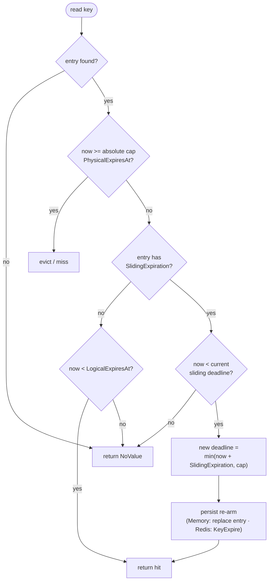
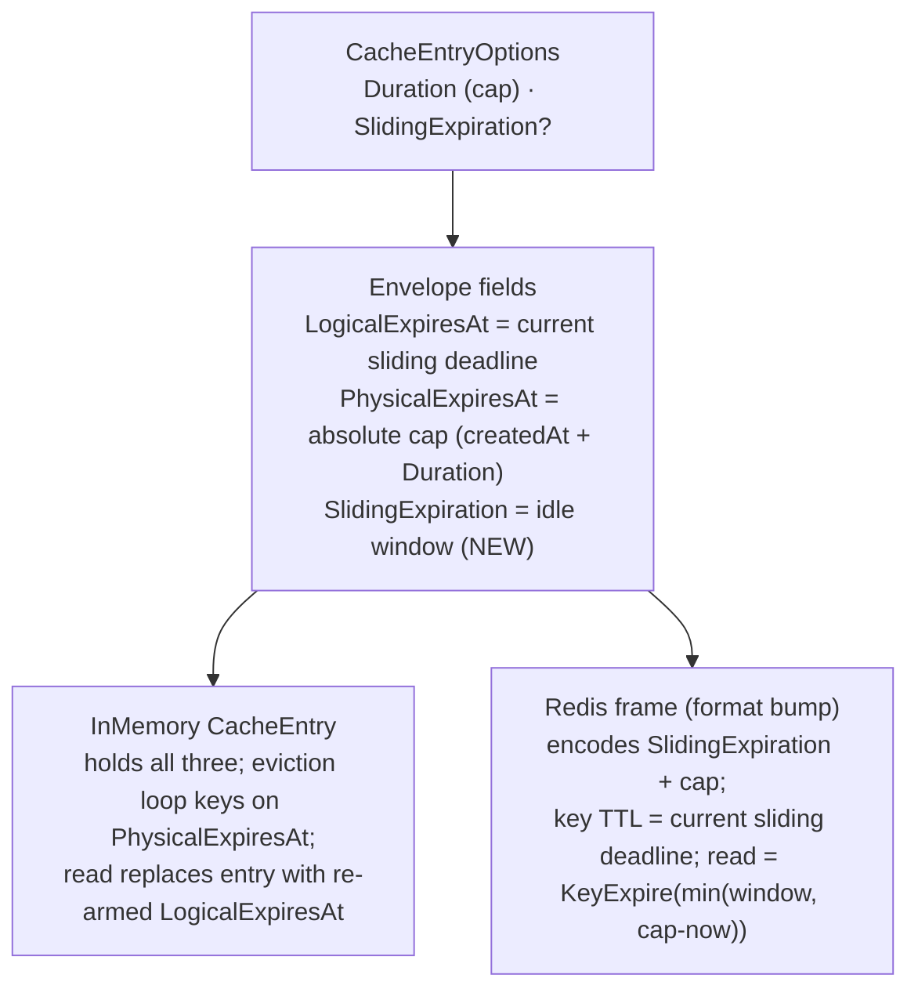

# feat: caching sliding expiration (core engine + Memory + Redis)

## Summary

Add a **sliding-expiration** capability to the caching engine: an entry can carry an idle window that read paths **re-arm** (push the eviction deadline to `now + SlidingExpiration`, capped by the entry's absolute `Duration`), so the entry survives while accessed and expires after an idle gap. Delivered across the engine primitive, the InMemory provider (re-stamp the in-process entry on read), the Redis provider (re-arm via native key TTL — no value rewrite, no new Lua), and the Hybrid composite, exercised through a new `CacheEntryOptions.SlidingExpiration` field on `GetOrAddAsync` and proven by a cross-provider conformance suite. This is the first M3 (standard-interop) item in roadmap #369 and the engine groundwork that #383 (the BCL `IDistributedCache` adapter) and ASP.NET Session will map `DistributedCacheEntryOptions.SlidingExpiration` onto.

---

## Problem Frame

**Today:** Every cache entry has a fixed lifetime. The envelope (shipped in #371/#372) carries `LogicalExpiresAt` (freshness/stale boundary) and `PhysicalExpiresAt` (retention/eviction); fail-safe (#373) makes physical outlive logical. No path re-arms an entry's deadline on access — once written, an entry expires at a fixed instant regardless of how often it is read.

**Desired:** A caller that opts into sliding (`CacheEntryOptions.SlidingExpiration = window`) gets an entry whose eviction deadline is pushed forward to `min(now + window, createdAt + Duration)` on each value-returning read. An idle entry (no reads for `window`) expires; a frequently-read entry survives up to the absolute ceiling `Duration`. The behavior is identical across InMemory, Redis, and Hybrid, and is the contract ASP.NET Session and the BCL `IDistributedCache` adapter depend on.

**Why now:** #369's strategy is "engine first, interfaces last" — build the capability into the engine so the standard `IDistributedCache`/Session implementation (#383) ships already faithful. Sliding is the M3 prerequisite that #383 cannot be built without.

**Design grounding (FusionCache):** The roadmap names FusionCache as the resilience playbook, but FusionCache **deliberately omits sliding expiration** (issue #48, closed; absent from `Options.md` and the codebase) — its author argues a heavily-read entry "keeps sliding and never updates itself" and steers users to fail-safe + soft timeouts instead. Headless diverges intentionally: it adds real sliding **for BCL/Session parity**, a use case fail-safe does not serve. Because Headless's `Duration` is required and positive, every sliding entry has a built-in absolute ceiling, which defuses the "never expires" objection at the root.

---

## High-Level Technical Design

Two shapes warrant visualization: the **read-path re-arm state machine** (the new behavior) and the **envelope/TTL mapping** across providers (where the sliding deadline lives). Both are authoritative; prose governs on any disagreement.

### Re-arm-on-read decision (applies to every value-returning read)

### Envelope / TTL mapping per provider

For a sliding entry the invariant `LogicalExpiresAt <= PhysicalExpiresAt` is preserved (the sliding deadline is always at or before the absolute cap), so the existing `IsFresh`/`IsPhysicallyPresent` predicates and the fail-safe envelope semantics remain coherent.

---

## Key Technical Decisions

### KTD-1 — `SlidingExpiration` is a per-entry option on the factory path only — *settled (user call)*
Add `CacheEntryOptions.SlidingExpiration` (`TimeSpan?`, default `null` = off). Sliding entries are created through `GetOrAddAsync` (the factory path) and the engine store primitive; the public direct-write `ICache` methods (`UpsertAsync`/`TryInsertAsync`/`TryReplaceAsync`, which take a bare `TimeSpan?`) are **unchanged**. **Rationale:** keeps the power-user `ICache` surface stable; the BCL `IDistributedCache` adapter (#383) owns the mapping from `DistributedCacheEntryOptions.SlidingExpiration` onto the engine's sliding-aware set primitive — building a public direct-write sliding API now would front-run that adapter's design. *Alternative considered:* add options-bearing `Upsert` overloads now — deferred to #383.

### KTD-2 — Sliding and fail-safe are mutually exclusive on a single entry **in this version** — *settled for v1; composition is a future option, not impossible*
If `SlidingExpiration` is set **and** `IsFailSafeEnabled` is `true`, the coordinator rejects the call (`ArgumentException`/`ArgumentOutOfRangeException`) at the same validation gate that already enforces `Argument.IsPositive(options.Duration)`. The rejection message and docs frame this as **"unsupported in this version"**, not "logically invalid" — the combination is coherent and may be added later. **Rationale (v1):** FusionCache treats sliding and fail-safe as competing answers to the same "keep serving while the source is slow/unavailable" problem; there is no current Headless use case for combining them, and rejecting avoids ambiguous stale-vs-idle semantics in the first cut. Fail-safe is the factory-backed resilience answer (`GetOrAddAsync` power users); sliding is the idle-eviction answer (BCL/Session parity). **Consequence:** the v1 re-arm logic never has to reason about a stale reserve, and `LogicalExpiresAt <= PhysicalExpiresAt` stays a clean invariant.

**Future composition (documented, deferred — see Scope Boundaries):** a coherent design exists — sliding re-arms the **logical** idle deadline; **physical** is the fail-safe reserve cap; fail-safe stale reuse activates only after the sliding logical deadline lapses, bounded by physical. It roughly doubles the re-arm × stale-reserve test matrix, so it is out of scope here, not foreclosed. *Alternative considered:* normalize-and-log (FusionCache's incoherent-options pattern) — rejected for v1 in favor of fail-fast, matching Headless's strict greenfield validation posture.

### KTD-3 — `Duration` is the absolute cap; the sliding deadline rides `LogicalExpiresAt` — *settled*
For a sliding entry: `PhysicalExpiresAt = createdAt + Duration` (the absolute ceiling, **never** moved by reads); `LogicalExpiresAt = min(lastAccess + SlidingExpiration, PhysicalExpiresAt)` (the current sliding deadline, re-armed on read). A read is a hit iff `now < LogicalExpiresAt`. **Rationale:** reuses the existing two-timestamp envelope with no inversion of the `logical <= physical` invariant, so fail-safe-disabled non-sliding entries (`logical == physical`) and sliding entries share the same `IsFresh`/`IsPhysicallyPresent` predicates. The required, positive `Duration` guarantees every sliding entry has a hard ceiling (the FusionCache "never expires" guard). **Normalization:** if `SlidingExpiration >= Duration` the `min()` makes sliding a no-op (the entry just lives `Duration`); this is allowed, not an error.

### KTD-4 — One new envelope field: `SlidingExpiration` carried through the engine and both stores — *settled*
`CacheStoreEntry<T>`, `IFactoryCacheStore.SetEntryAsync`, the InMemory `CacheEntry`, and the Redis frame each gain a `SlidingExpiration` (`TimeSpan?`) slot so each read can recompute the next deadline (`now + window`, capped). **Rationale:** re-arm needs the window value on every read, so it must be persisted with the entry — it cannot be derived from the two timestamps alone. `SetEntryAsync` gains a `slidingExpiration` parameter (the coordinator passes it on factory-backed writes; non-sliding writes pass `null`, preserving today's behavior).

### KTD-5 — Re-arm happens in the read path as a side effect of a successful value-returning read — *settled*
`GetAsync` (and the methods that delegate to it — `GetAllAsync`, `GetByPrefixAsync`, `GetSetAsync`) re-arm a sliding entry; `GetOrAddAsync`'s fresh-hit path re-arms via the same store primitive. Metadata/peek reads do **not** re-arm: `GetExpirationAsync`, `GetCountAsync`, `GetAllKeysByPrefixAsync`, and `ExistsAsync` are non-touching (mirrors BCL, where only `Get`/`Refresh` slide and key enumeration does not). **Rationale:** matches BCL `IDistributedCache` semantics (`Get`/`Refresh` re-arm); the re-arm computation (`min(now + window, cap)`) is trivial and lives in a **shared, reusable helper** (so a future `RefreshAsync` and the #383 BCL `IDistributedCache.Refresh` map onto the same re-arm), each provider supplying its own persist mechanism. *Alternative considered:* re-arm inside `IFactoryCacheStore.TryGetEntryAsync` so the coordinator gets it for free — rejected (a read-with-side-effect on a primitive named `TryGet` is surprising, and the coordinator calls it twice per `GetOrAddAsync`).

**`GetExpirationAsync` returns the current sliding (logical) deadline, not the cap.** For a sliding entry, `GetExpirationAsync` reports the next observed expiration if no further value reads happen — i.e. the current sliding deadline — **without** re-arming. **InMemory:** read `LogicalExpiresAt` (kept current by re-arm). **Redis:** derive it from the live **key TTL** (`KeyTimeToLiveAsync`), **not** `frame.LogicalExpiresAt` — the embedded logical is stale after the first `KeyExpire` re-arm (KTD-6), so trusting it would return a wrong (too-early) value. Non-sliding entries keep today's behavior (logical remaining). This makes R6 ("metadata reads don't re-arm") true *and* the returned value correct.

### KTD-9 — Re-arm is throttled to avoid write amplification; unconditional re-arm is benchmark-gated — *settled (lean: throttle)*
Re-arming on **every** hot read causes write amplification in Redis (`KeyExpire` per read) and `ConcurrentDictionary` churn in InMemory. Default to a **lazy re-arm threshold**: re-arm only when the remaining lifetime has decayed past a fraction of the window — e.g. InMemory re-arms when `now - lastArm >= SlidingExpiration * RearmThreshold`; Redis issues `KeyExpire` only when current TTL `< SlidingExpiration * RearmThreshold` (lean: `RearmThreshold ≈ 0.5–0.75`). **Trade-off:** this trades exact-BCL precision (BCL `MemoryCache` re-arms on every access) for throughput — an entry may be evicted up to `window * RearmThreshold` earlier than a strict slide would allow. **Acceptance gate:** U4/U5 must include a hot-key read benchmark; do **not** ship unconditional re-arm without it. If the benchmark shows the throttle materially harms idle-eviction accuracy for a target workload, the threshold is tunable (or unconditional for that provider). The threshold is an internal implementation detail, not a public option, in v1.

### KTD-6 — Redis re-arm is `KeyExpire`-only; Redis TTL is the sliding clock; no value rewrite, no new Lua — *settled*
The Redis key TTL for a sliding entry is set to the current sliding deadline (`LogicalExpiresAt - now`). On a value-returning read, re-arm = `KeyExpireAsync(key, min(SlidingExpiration, cap - now))` — the value frame is **not** re-serialized or rewritten. The frame carries `SlidingExpiration` + the absolute cap (`PhysicalExpiresAt`) so each read recomputes the next TTL; eviction is delegated to Redis. **Rationale:** matches the BCL `Microsoft.Extensions.Caching.StackExchangeRedis` approach (store metadata in the value, re-arm via `EXPIRE`); avoids a per-read serialization cost and sidesteps the shared `ReplaceIfEqual`/`RemoveIfEqual` Lua scripts entirely (those live in `Headless.Redis` and are shared with `DistributedLocks.Redis` — must not be mutated). **Format bump:** the frame gains a `HasSlidingExpirationFlag` bit and an 8-byte field at a new offset; the `Version` byte stays `0x01` (a cleared flag means "no sliding" and the new bytes are not read), greenfield posture permits the format change.

**Decode for sliding entries is logical-agnostic — key existence is truth (resolves the stale-embedded-logical hole):** because `KeyExpire` re-arms the live TTL **without** rewriting the frame, the frame's embedded `LogicalExpiresAt` goes stale the instant the first re-arm fires. Therefore, for a **sliding** frame (the `HasSlidingExpirationFlag` is set), the Redis read paths (`_RedisValueToCacheValue` and `_TryGetEntryAsync`) must **not** evaluate `frame.LogicalExpiresAt` — freshness is governed solely by key existence (Redis evicts the key at the re-armed sliding deadline) plus the absolute `PhysicalExpiresAt` cap as a hard ceiling. The embedded logical on a sliding frame is informational only. (Non-sliding frames keep checking both logical and physical exactly as today — this carve-out is gated on the sliding flag, so fail-safe/normal entries are unaffected.) This closes the contradiction where decode would otherwise report `NoValue` for a live, re-armed key once `now` passed the original embedded logical.

**Best-effort:** a failed `KeyExpire` re-arm does not fail the read — the value is returned and the next read retries the re-arm (the slide is an optimization, not a correctness gate).

### KTD-6b — TTL-from-logical is gated on `slidingExpiration != null`; fail-safe/normal writes keep TTL-from-physical — *settled*
The shared `RedisCache.SetEntryAsync` today derives the Redis key TTL from `physicalExpiresAt - now`. The sliding change (TTL = `logical - now`, the nearer sliding deadline) applies **only** when `slidingExpiration is not null`. **Rationale:** fail-safe entries have `physical = max(Duration, FailSafeMaxDuration)` and `logical = Duration` — if the TTL-from-logical change applied unconditionally, the fail-safe physical reserve would silently collapse to the logical window, breaking #373. KTD-2 makes sliding⊕fail-safe exclusive, so the two TTL rules never apply to the same entry; the branch is `expiresIn = slidingExpiration is null ? (physical - now) : (logical - now)`.

### KTD-7 — InMemory re-arm replaces the entry under `AddOrUpdate`; eviction loop is untouched — *settled*
On a value-returning read of a sliding entry, `InMemoryCache` replaces the stored `CacheEntry` with one carrying the re-armed `LogicalExpiresAt` while **preserving `PhysicalExpiresAt` (the cap) and `SlidingExpiration` unchanged**, via `AddOrUpdate`/`TryUpdate`. **Rationale:** read-with-write is the standard sliding implementation (BCL `MemoryCache` does it).

**Idle eviction is enforced two ways (resolves the lazy-vs-active memory-pressure gap):** (1) **on read** — a logically-expired sliding entry returns `NoValue` (correctness; already covered by the logical-governed reads); (2) **active reclamation** — the maintenance/eviction loop is extended to evict a sliding entry once `now >= LogicalExpiresAt` (the idle deadline), not only at `PhysicalExpiresAt` (the cap). Without (2), an idle 5-min-sliding entry under a 1-day cap would squat in memory for ~1 day. The eviction predicate becomes `now >= PhysicalExpiresAt || (SlidingExpiration is not null && now >= LogicalExpiresAt)`, removed with the value-equality `TryRemove(KeyValuePair)` overload (below). The expiration-tracking queue (`_TrackUpdate`/`_expirationQueue`) should enqueue the **logical** deadline for sliding entries so the loop wakes at the idle deadline, re-enqueued on each re-arm.

**Do NOT reuse `WithExpiration` for re-arm.** `CacheEntry.WithExpiration(expiresAt)` sets **both** `LogicalExpiresAt` and `PhysicalExpiresAt` to the same value, which would move the absolute cap forward on every read and defeat R4. U4 adds a distinct clone-sharing helper — `WithLogicalExpiration(DateTime logicalExpiresAt)` — that threads `physicalExpiresAt` and `SlidingExpiration` through unchanged (the private clone-sharing constructor already accepts separate logical/physical; extend it to carry sliding). `WithExpiration` stays for the TTL-only refresh callers that legitimately move both.

**Re-arm vs eviction concurrency invariant.** Re-arm publishes a **new** `CacheEntry` instance (new `InstanceNumber`) via `AddOrUpdate`. The maintenance evictor must use the value-equality `TryRemove(KeyValuePair<string, CacheEntry>(key, entry))` overload so a concurrent re-arm (different instance) causes the evict to no-op rather than drop a freshly-re-armed entry. **Any idle-evict-on-read path U4 adds must use the same value-equality remove, never the key-only `_RemoveExpiredKey`** (which would race-delete a concurrently re-armed entry). A lost re-arm race is otherwise benign (both writers only push the deadline forward). **LRU/clone:** re-arm touches LRU (`_TrackUpdate`) but reuses the cloned value reference.

### KTD-8 — Hybrid re-arms both tiers; L1 stays bounded by `DefaultLocalExpiration` — *settled*
`HybridCache`'s composite read re-arms L1 and L2 on a value-returning read. L2 (Redis) re-arms to the full sliding deadline; L1 (InMemory) re-arms bounded by `min(slidingDeadline, now + DefaultLocalExpiration)` so a long-lived sliding entry does not pin process memory beyond the local window — mirroring the L1/L2 bound established for fail-safe (#373). When L1's bound lapses, the composite read falls through to L2 and re-promotes. **Rationale:** preserves the existing two-tier memory-pressure ceiling; keeps sliding semantics authoritative in L2 (the shared tier).

---

## Output Structure

This slice modifies existing files and adds one test file; no new package or directory hierarchy. The per-unit `**Files:**` lists are authoritative.

---

## Requirements

From issue #377 (acceptance): *sliding entry survives while accessed, expires after idle window; conformance harness covers it; across Memory + Redis; prerequisite for faithful BCL `IDistributedCache`/Session.*

### Capability

- R1. A cache entry can carry a sliding idle window via `CacheEntryOptions.SlidingExpiration`, created through `GetOrAddAsync`.
- R2. A value-returning read re-arms the entry's eviction deadline to `min(now + SlidingExpiration, createdAt + Duration)`.
- R3. An entry read more frequently than its sliding window survives, up to the absolute ceiling `Duration`; an idle entry expires after the window.
- R4. The absolute `Duration` is a hard ceiling that reads never extend.

### Cross-provider parity

- R5. R1–R4 hold identically across InMemory, Redis, and Hybrid, verified by a shared conformance suite.
- R6. Metadata/peek reads (`ExistsAsync`, `GetExpirationAsync`, `GetCountAsync`, `GetAllKeysByPrefixAsync`) do not re-arm.
- R10. `GetExpirationAsync` returns the current sliding (logical) deadline for a sliding entry — derived from the live key TTL on Redis, not the stale embedded logical (KTD-5).
- R11. An idle sliding entry is actively reclaimed at its idle deadline, not held until the absolute cap (InMemory maintenance loop; KTD-7).

### Coherence and compatibility

- R7. Sliding and fail-safe are rejected when both set on one entry, framed as unsupported-in-this-version (KTD-2).
- R8. Non-sliding entries (`SlidingExpiration == null`, the default) behave exactly as today across all providers and read methods; the Redis frame for a non-sliding entry is byte-identical to the pre-change layout (KTD-6/U3).
- R9. Docs synced (`docs/llms/caching.md` + affected package READMEs).
- R12. Re-arm is throttled (not issued on every hot read) and the hot-key read path is benchmarked before unconditional re-arm ships (KTD-9).

---

## Implementation Units

### U1. `CacheEntryOptions.SlidingExpiration` field + coherence rules
**Goal:** Add the per-entry opt-in surface and its normalization/guard semantics.
**Requirements:** R1, R7, R8.
**Dependencies:** none (Abstractions-only).
**Files:**
- `src/Headless.Caching.Abstractions/Contracts/CacheEntryOptions.cs` (modify — add `SlidingExpiration` `TimeSpan?` init property, default `null`; XML docs covering the cap relationship and the fail-safe mutual exclusion)
- `tests/Headless.Caching.Abstractions.Tests.Unit/CacheEntryOptionsTests.cs` (extend)
**Approach:** Keep the `readonly record struct` + implicit `TimeSpan` conversion (sets `Duration` only; sliding stays `null`, preserving R8). Store the raw value; the coordinator computes effective deadlines (KTD-3) and enforces the sliding⊕fail-safe guard (KTD-2) so all normalization lives in one place — the struct itself does not throw. Document that `SlidingExpiration >= Duration` degrades to a fixed `Duration` lifetime (no-op slide), and that sliding + fail-safe is rejected downstream.
**Patterns to follow:** the existing fail-safe fields on `CacheEntryOptions` (same XML-doc style, same "raw value, coordinator normalizes" split).
**Test suite design:** unit (pure value type), existing Abstractions unit project.
**Test scenarios:**
- Default options → `SlidingExpiration == null`.
- Implicit `TimeSpan` conversion → `SlidingExpiration == null`, `Duration` set (R8 default preserved).
- Setting `SlidingExpiration` round-trips the raw value unchanged (coherence applied downstream).
- `Covers R8.` An options value with sliding unset is structurally identical to today (no new non-null defaults introduced).
**Verification:** planned unit tests added and passing; `make test-project TEST_PROJECT=tests/Headless.Caching.Abstractions.Tests.Unit` green.

### U2. Engine: thread `SlidingExpiration` through the envelope + coordinator (set on write, re-arm on hit, guard)
**Goal:** Carry sliding through the engine primitive, set it on factory writes, re-arm on the fresh-hit path, and enforce the sliding⊕fail-safe guard.
**Requirements:** R1, R2, R4, R7, R8.
**Dependencies:** U1.
**Files:**
- `src/Headless.Caching.Core/CacheStoreEntry.cs` (modify — add `SlidingExpiration` `TimeSpan?` to the record struct + `NotFound`)
- `src/Headless.Caching.Core/IFactoryCacheStore.cs` (modify — add `slidingExpiration` parameter to `SetEntryAsync`; document re-arm contract)
- `src/Headless.Caching.Core/FactoryCacheCoordinator.cs` (modify — validation guard for sliding⊕fail-safe; compute logical/physical for a sliding write per KTD-3; re-arm the entry on the fresh-hit return path)
- `tests/Headless.Caching.Core.Tests.Unit/FactoryCacheCoordinatorTests.cs` (extend)
- `tests/Headless.Caching.Core.Tests.Unit/FakeFactoryCacheStore.cs` (modify — record `SlidingExpiration` on set; expose re-arm observation)
**Approach:** Add the guard `if (options.SlidingExpiration is { } slide) { Argument.IsPositive(slide); if (options.IsFailSafeEnabled) throw … }` alongside the existing `Argument.IsPositive(options.Duration)`. On factory success for a sliding entry: `physical = now + Duration` (cap), `logical = min(now + SlidingExpiration, physical)`; call `store.SetEntryAsync(..., slidingExpiration: options.SlidingExpiration, ...)`. Non-sliding paths are unchanged (sliding param `null`).

**Re-arm on BOTH fresh-hit return sites.** `GetOrAddAsync` reads via `store.TryGetEntryAsync` (a peek, not `GetAsync`), so the coordinator must re-arm explicitly on each fresh-hit `return`: the **pre-lock** fresh hit (`FactoryCacheCoordinator.cs:51-54`) **and** the **under-lock** fresh hit (`:63-65`). The under-lock site is reachable — a concurrent writer can populate the entry between the pre-lock miss and lock acquisition — so it is a legitimate fresh return that must also re-arm, not dead code. Re-arm = best-effort `store.SetEntryAsync` with `logical = min(now + entry.SlidingExpiration, entry.PhysicalExpiresAt)`, physical + sliding unchanged; a failed re-arm still returns the hit. Two concurrent callers each re-arming once is benign (both push forward).
**Execution note:** implement test-first — pure state-machine logic over the fake store.
**Patterns to follow:** the existing fail-safe set/restamp computation in `FactoryCacheCoordinator`; `[LoggerMessage]` partial at file bottom if a re-arm-failure log is added.
**Test suite design:** unit over `FakeFactoryCacheStore` + `FakeTimeProvider`, primary exhaustive coverage of the engine behavior; provider conformance (U7) re-proves end-to-end.
**Test scenarios:**
- `Covers R7.` Options with both `SlidingExpiration` and `IsFailSafeEnabled` → throws at the validation gate; factory not invoked.
- `Covers R1.` Factory success with sliding set → `SetEntryAsync` called with `physical = now + Duration`, `logical = min(now + sliding, physical)`, `slidingExpiration` non-null.
- `Covers R2.` Fresh-hit on a sliding entry re-arms: `SetEntryAsync` called with `logical = min(now + sliding, cap)`, physical unchanged; value returned `IsStale == false`.
- `Covers R4.` Re-arm never pushes `logical` beyond `PhysicalExpiresAt` (set `now + sliding > cap` → re-armed logical clamps to cap).
- `Covers R8.` Factory success with sliding `null` → `SetEntryAsync` called with `slidingExpiration: null`, `logical == physical == now + Duration` (today's behavior); fresh-hit does not re-arm.
- `Covers R2.` Under-lock fresh-hit re-arms: simulate a concurrent populate (fake returns a miss pre-lock, a fresh sliding entry under-lock) → the under-lock return path also calls `SetEntryAsync` with the re-armed logical.
- Re-arm write failure (fake faults `SetEntryAsync`) on the hit path → hit still returned (best-effort).
**Verification:** planned unit tests added and passing; `make test-project TEST_PROJECT=tests/Headless.Caching.Core.Tests.Unit` green.

### U3. Redis frame: encode/decode `SlidingExpiration`
**Goal:** Extend the wire frame to carry the sliding window.
**Requirements:** R1, R8.
**Dependencies:** none (codec is self-contained; sequence before U5).
**Files:**
- `src/Headless.Caching.Redis/RedisCacheEntryFrame.cs` (modify — add `HasSlidingExpirationFlag = 1 << 3`, a **flag-conditional** 8-byte slot, a flag-derived payload offset, thread `slidingExpiration` through `Encode`/`Decode`/`DecodedFrame`)
- `tests/Headless.Caching.Redis.Tests.Integration/RedisEnvelopeFormatTests.cs` (extend — round-trip sliding; old-layout byte-compat; absence of the flag decodes `SlidingExpiration == null`)
**Approach (the 8 sliding bytes are present ONLY when the flag is set — hard implementation note):** When `slidingExpiration` is non-null, set `HasSlidingExpirationFlag` and write 8 bytes (int64 ms) at offset 19, so the value payload starts at offset 27. When `slidingExpiration` is null, write **no** sliding bytes and the payload starts at offset 19 — **byte-identical to the pre-change frame**. The base header (logical at offset 3, physical at offset 11, `HeaderLength = 19`) is unchanged. **Decode must derive the payload offset from the flag, not a fixed `HeaderLength`:** `payloadOffset = (flags & HasSlidingExpirationFlag) != 0 ? 27 : 19`. If decode ever assumes a fixed 27-byte header, every old/non-sliding value's payload is read from the wrong offset and corrupts — this is the load-bearing correctness point of this unit. **Keep the `Version` byte at `0x01`** — `Decode` throws `NotSupportedException` on a version mismatch (`RedisCacheEntryFrame.cs:72-75`), so a version bump would make pre-change frames decode-throw (the flag-gated, zero-extra-bytes-when-absent layout is what makes `0x01` safe). Update `_IsOutOfRange` to cover the sliding field only when the flag is set. **Greenfield:** no migration required.
**Patterns to follow:** the existing logical/physical flag+field encoding in `RedisCacheEntryFrame`; `_IsOutOfRange` validation.
**Test suite design:** the frame is exercised by the Redis integration project's format tests (it is `internal`); cover encode/decode round-trips there.
**Test scenarios:**
- Encode with `SlidingExpiration` set → decode yields the same window; `HasSlidingExpirationFlag` set; payload at offset 27.
- `Covers R8.` Encode with `slidingExpiration: null` → `HasSlidingExpirationFlag` cleared; **no sliding bytes written**; payload at offset 19; the encoded `byte[]` is identical to a pre-change frame for the same value/timestamps.
- **Strict old-layout decode:** given a `byte[]` produced by the pre-change 19-byte-header encoder, decode reads the payload from offset 19 (not 27), returns the exact original value (no payload shift/corruption), and `SlidingExpiration == null`.
- Out-of-range sliding bytes (flag set) → frame reads as unframed/miss (consistent with the existing timestamp guard).
**Verification:** planned tests added and passing; `make test-project TEST_PROJECT=tests/Headless.Caching.Redis.Tests.Integration` green (Docker).

### U4. `InMemoryCache`: store sliding, re-arm on read
**Goal:** Persist the sliding window in the in-process entry and re-arm it on value-returning reads.
**Requirements:** R1, R2, R3, R4, R6, R8.
**Dependencies:** U2.
**Files:**
- `src/Headless.Caching.InMemory/InMemoryCache.cs` (modify — `CacheEntry` gains a `SlidingExpiration` slot; add a `WithLogicalExpiration(DateTime)` clone-sharing helper that preserves physical + sliding; `IFactoryCacheStore.SetEntryAsync` accepts + stores sliding; `IFactoryCacheStore.TryGetEntryAsync` surfaces it; `GetAsync` (and the delegating reads) re-arm sliding entries via value-equality `AddOrUpdate`; metadata reads left non-touching)
- `tests/Headless.Caching.InMemory.Tests.Unit/InMemoryCacheTests.cs` (extend — memory-specific sliding cases)
**Execution note:** turn the U7 conformance sliding scenarios green for the memory provider (authored failing in U7).
**Approach:** Add `SlidingExpiration` to `CacheEntry` (carried through both public constructors and the private clone-sharing constructor). `SetEntryAsync` stores it. On a value-returning read of an entry with `SlidingExpiration` set and not past `PhysicalExpiresAt`: compute `newLogical = min(now + sliding, PhysicalExpiresAt)`, and if it advances the deadline, replace the entry via `AddOrUpdate` with the new **`WithLogicalExpiration(newLogical)`** helper — which keeps `PhysicalExpiresAt` (the cap) and `SlidingExpiration` unchanged (KTD-7; do **not** use `WithExpiration`, which moves both timestamps and would extend the cap). Re-arm is best-effort under the concurrent dictionary (a lost race just means another reader's re-arm wins — both push forward) and **throttled** per KTD-9 (re-arm only when `now - lastArm >= SlidingExpiration * RearmThreshold`) to avoid dictionary churn on hot keys. Extend the maintenance/eviction loop to evict sliding entries at their `LogicalExpiresAt` (idle deadline), not only `PhysicalExpiresAt` (KTD-7 active reclamation), and enqueue the logical deadline in the expiration queue (re-enqueued on re-arm). Any idle-evict path must use the value-equality `TryRemove(KeyValuePair)` overload, never key-only `_RemoveExpiredKey` (KTD-7 concurrency invariant). Metadata reads do not re-arm; `GetExpirationAsync` returns the current logical (sliding) deadline (KTD-5). `ExistsAsync`/`GetCountAsync`/`GetAllKeysByPrefixAsync` are non-touching.
**Patterns to follow:** the `AddOrUpdate` flow in `_SetInternalAsync` and the value-equality evictor `TryRemove` (`InMemoryCache.cs` ~1965); the existing `WithExpiration` clone-sharing constructor (extend its private overload to carry sliding); `_TrackUpdate`; logical-governed read checks added for fail-safe.
**Test suite design:** unit (memory provider, `FakeTimeProvider`); cross-provider parity owned by U7 — keep U4 to memory-specific concerns (eviction interplay, clone/LRU under re-arm, concurrent re-arm).
**Test scenarios:**
- `Covers R2.` Sliding entry, read within the window advances `LogicalExpiresAt` (assert via `TryGetEntryAsync` or `GetExpirationAsync` after a re-arming `GetAsync`).
- `Covers R3.` Repeated reads each within the window keep the entry alive past the original sliding deadline; an idle gap > window → `GetAsync` miss.
- `Covers R4.` Reads cannot extend past `createdAt + Duration`: after the cap, `GetAsync` miss even with continuous reads.
- `Covers R4.` A re-arm leaves `PhysicalExpiresAt` (the cap) unchanged — read the entry's physical via `TryGetEntryAsync` before and after a re-arming `GetAsync` and assert it did not move (guards against the `WithExpiration` cap-extension bug).
- `Covers R6.` `ExistsAsync`/`GetExpirationAsync` do not re-arm (deadline unchanged after a metadata read).
- `Covers R10.` `GetExpirationAsync` on a sliding entry returns ≈ the current sliding remaining (logical deadline), not the absolute cap.
- `Covers R11.` An idle sliding entry is removed by the maintenance loop at its idle (logical) deadline — assert `GetCountAsync`/memory size drops before the absolute cap, without an intervening read.
- `Covers R12.` Hot-key reads do not re-arm on every read: with `RearmThreshold` set, N rapid reads within the threshold window produce far fewer than N store writes (assert bounded re-arm count via the test seam).
- `Covers R8.` Non-sliding entry: read does not move the deadline; behavior identical to today.
- Clone mode (`CloneValues=true`): a re-arm reuses the cloned value reference (no re-clone), returned value still a clone.
- Concurrency: a re-arm racing the maintenance evictor does not drop the entry (value-equality `TryRemove` no-ops against the re-armed instance).
**Verification:** planned unit tests added and passing; `make test-project-fast TEST_PROJECT=tests/Headless.Caching.InMemory.Tests.Unit` green; existing memory conformance unaffected.

### U5. `RedisCache`: store sliding in frame, re-arm via `KeyExpire` on read
**Goal:** Persist the window in the frame, drive eviction by key TTL, re-arm on value-returning reads without rewriting the value.
**Requirements:** R1, R2, R3, R4, R6, R8.
**Dependencies:** U2, U3.
**Files:**
- `src/Headless.Caching.Redis/RedisCache.cs` (modify — `IFactoryCacheStore.SetEntryAsync` encodes sliding + sets TTL to the sliding deadline; `_TryGetEntryAsync`/`_RedisValueToCacheValue` surface sliding and re-arm via `KeyExpireAsync`; metadata reads non-touching)
- `tests/Headless.Caching.Redis.Tests.Integration/RedisCacheSlidingTests.cs` (create — TTL re-arm, idle expiry, cap ceiling)
**Execution note:** turn the U7 conformance sliding scenarios green for the Redis provider (authored failing in U7).
**Approach:** `SetEntryAsync`: encode `slidingExpiration` into the frame; derive the TTL with the **gated branch** `expiresIn = slidingExpiration is null ? (physical - now) : (logical - now)` (KTD-6b — non-sliding/fail-safe writes keep TTL-from-physical so the fail-safe reserve is not collapsed). On a value-returning read (`GetAsync` → `_RedisValueToCacheValue`, and the engine's `_TryGetEntryAsync`): when the frame has `SlidingExpiration` set, **skip the embedded-logical expiry check** — treat the entry as a hit while the key exists and `now < PhysicalExpiresAt` (cap), since the embedded logical is stale after the first re-arm (KTD-6); then re-arm `KeyExpireAsync(key, min(slidingExpiration, cap - now))` — best-effort, value not re-serialized. Non-sliding frames keep checking both logical and physical exactly as today (the carve-out is gated on the sliding flag). Use small real durations in tests (sliding 1s / cap 3s) to keep waits short. **No Lua** — `KeyExpireAsync` only. Metadata reads (`ExistsAsync`, `GetExpirationAsync`, key enumeration) do not call `KeyExpire`.
**Patterns to follow:** `_SetInternalAsync`/`_ToFramedRedisValue`; `KeyExpireAsync` usage in `_SetListExpirationAsync`; the read decode path in `_RedisValueToCacheValue`; keyed-loader DI isolation (do not touch shared scripts).
**Test suite design:** integration (Testcontainers Redis), existing Redis integration project; cross-provider parity owned by U7.
**Test scenarios:**
- `Covers R2.` Plant a sliding entry (TTL = window), read within the window → key TTL re-armed to the window (assert remaining TTL ≈ window after read).
- `Covers R3.` Reads at sub-window intervals keep the key alive past the original window; an idle gap > window → key gone, `GetAsync` miss.
- `Covers R3.` Re-armed key read after the *original* sliding window has elapsed (but TTL re-armed) → `GetAsync` returns the value, not `NoValue` (guards the stale-embedded-logical decode hole: decode must not reject on the frame's original logical).
- `Covers R4.` Continuous reads cannot push the key past `createdAt + Duration` (cap): after the cap, `GetAsync` miss (the re-arm clamps TTL to `cap - now`, reaching ≤ 0).
- `Covers R6.` `ExistsAsync`/`GetExpirationAsync` do not re-arm (TTL unchanged).
- `Covers R10.` `GetExpirationAsync` after a re-arm returns the re-armed remaining (derived from key TTL), not the stale original embedded logical.
- `Covers R12.` Throttle: N rapid reads within `SlidingExpiration * RearmThreshold` issue far fewer than N `KeyExpire` calls (assert via the test seam / a tracking `IDatabase` wrapper).
- `Covers R8.` Non-sliding entry: TTL == `Duration`, reads do not re-arm; existing envelope-format behavior unchanged. Fail-safe entry (sliding null, physical > logical): TTL == physical window, **not** collapsed to logical (guards KTD-6b).
**Verification:** planned integration tests added and passing; `make test-project TEST_PROJECT=tests/Headless.Caching.Redis.Tests.Integration` green (Docker).

### U6. `HybridCache`: re-arm both tiers, bound L1
**Goal:** Re-arm sliding across L1 and L2 on read while keeping L1 bounded by the local-expiration window.
**Requirements:** R2, R3, R4, R5, R8.
**Dependencies:** U4, U5.
**Files:**
- `src/Headless.Caching.Hybrid/HybridCache.cs` (modify — composite `SetEntryAsync` writes sliding to L2 (full deadline) and L1 (bounded by `DefaultLocalExpiration`); composite read re-arms both tiers; promote-from-L2 re-applies the L1 bound)
- `tests/Headless.Caching.Hybrid.Tests.Unit/HybridCacheSlidingTests.cs` (create)
**Execution note:** if Hybrid is wired into the U7 conformance suite, turn those scenarios green here; otherwise author `HybridCacheSlidingTests` test-first against the composite.
**Approach:** `SetEntryAsync` for a sliding entry: L2 gets the full `logical`/`physical`/`sliding`; L1 gets `l1Logical = min(logical, now + DefaultLocalExpiration)` and the same sliding window (so L1 re-arms within its bound). Composite read of a sliding hit re-arms L1 (bounded) and L2 (full); when L1's bound lapses, the read falls through to L2 and re-promotes with the bound. No backplane publish on a re-arm (sliding is a local TTL concern). Keep `HandleInvalidationAsync`/consumer untouched.
**Patterns to follow:** the existing L1/L2 sequencing and the `min(…, DefaultLocalExpiration)` bound applied for fail-safe (#373); the non-fatal L2-write `try/catch`.
**Test suite design:** unit (real `InMemoryCache` L1 + substitute/real L2, `FakeTimeProvider`/small durations), existing Hybrid unit project.
**Test scenarios:**
- `Covers R2.` Read of a sliding entry re-arms L1 and L2 deadlines.
- `Covers R3.` Reads within the window keep the entry alive across tiers; idle gap > window → miss on both.
- `Covers R4.` Cap ceiling holds across tiers.
- L1 bound: a sliding deadline longer than `DefaultLocalExpiration` is capped in L1 but full in L2; after L1 lapses, the entry is served+re-promoted from L2.
- `Covers R8.` Non-sliding entry: two-tier behavior identical to today.
**Verification:** planned unit tests added and passing; `make test-project-fast TEST_PROJECT=tests/Headless.Caching.Hybrid.Tests.Unit` green; existing Hybrid tests unaffected.

### U7. Cross-provider sliding conformance suite
**Goal:** Prove identical sliding behavior across providers from one suite.
**Requirements:** R5, R6, R8 (and R1–R4 per provider).
**Dependencies:** U1, U2 (suite references only the public API + engine behavior). **Sequencing:** per the repo's harness-first rule, author this suite's sliding scenario methods **before U4–U6** as failing tests; each provider unit turns its slice green by supplying `CreateCache` + `AdvanceAsync`. Listed after the providers for reading order only.
**Files:**
- `tests/Headless.Caching.Tests.Harness/CacheConformanceTestsBase.cs` (modify — add sliding conformance scenario methods using the existing `AdvanceAsync`/`ResetAsync`/`CreateCache` shape and a `_CreateSlidingOptions` helper mirroring `_CreateFailSafeOptions`)
- `tests/Headless.Caching.InMemory.Tests.Unit/InMemoryCacheConformanceTests.cs` (modify — inherit the new scenarios; `AdvanceAsync` via `FakeTimeProvider`)
- `tests/Headless.Caching.Redis.Tests.Integration/RedisCacheConformanceTests.cs` (modify — inherit the new scenarios; `AdvanceAsync` via small real delays)
**Execution note:** harness-first — write the abstract sliding scenario methods (red) before the provider re-arm implementations exist.
**Approach:** Add sliding scenarios that run against every provider using the existing `AdvanceAsync(TimeSpan)` time-advance seam. Keep the scenarios at the public-`ICache` level (`GetOrAddAsync` with `CacheEntryOptions.SlidingExpiration`, then `GetAsync` to re-arm, then `AdvanceAsync`).
**Patterns to follow:** the existing fail-safe conformance methods + `_CreateFailSafeOptions` in `CacheConformanceTestsBase`.
**Test suite design:** harness-owned conformance executed by Memory (unit) and Redis (integration) fixtures — the canonical same-behavior-per-backend guard.
**Test scenarios (run per provider):**
- `Covers R3.` Sliding entry read within the window before each advance survives past the original deadline; an idle advance > window → miss.
- `Covers R2.` A read re-arms (read, advance < window, read again succeeds).
- `Covers R4.` Continuous reads expire at the absolute cap.
- `Covers R6.` `ExistsAsync` between reads does not re-arm.
- `Covers R8.` Non-sliding default options → no re-arm on any provider.
**Verification:** planned scenarios added and passing; `make test-unit` (memory) and `make test-integration` (redis) green; the same methods pass for both providers.

### U8. Docs sync — `docs/llms/caching.md` + package READMEs
**Goal:** Keep the agent-facing doc surfaces in lockstep with the new option and behavior.
**Requirements:** R9.
**Dependencies:** U1, U4, U5, U6 (final behavior settled).
**Files:**
- `docs/llms/caching.md` (modify — sliding concept, `SlidingExpiration` option + cap relationship, re-arm-on-read semantics + which reads re-arm (KTD-5), sliding⊕fail-safe exclusion (KTD-2), Redis TTL-as-clock note, per-provider notes, BCL/Session forward link to #383)
- `src/Headless.Caching.Abstractions/README.md` (modify — `CacheEntryOptions.SlidingExpiration`)
- `src/Headless.Caching.Core/README.md` (modify — engine re-arm contract + `SetEntryAsync` sliding parameter)
- `src/Headless.Caching.InMemory/README.md`, `src/Headless.Caching.Redis/README.md`, `src/Headless.Caching.Hybrid/README.md` (modify — per-provider sliding behavior; Redis `KeyExpire` note; Hybrid L1 bound)
**Approach:** Follow `docs/authoring/AUTHORING.md` (read first); docs explain concepts/trade-offs, not just API. Cover: the per-entry opt-in; `Duration` as the absolute cap; which reads re-arm vs which don't (KTD-5/R6); `GetExpirationAsync` returning the sliding deadline (Redis from key TTL — KTD-5/R10); the fail-safe exclusion framed as **unsupported-in-this-version** with the future-composition shape noted (KTD-2); the Redis TTL-as-clock + logical-agnostic-decode note (KTD-6); the throttled re-arm trade-off (KTD-9 — sliding precision vs write amplification); the InMemory active idle reclamation (KTD-7/R11); the Hybrid L1 bound; and the forward links that #383 maps the BCL `SlidingExpiration` and `Refresh` onto this.
**Test suite design:** n/a (docs).
**Test scenarios:** `Test expectation: none -- documentation only.`
**Verification:** both surfaces updated and consistent; `AUTHORING.md` drift checks pass; sample snippets compile against the new API.

---

## Scope Boundaries

### In scope
- `CacheEntryOptions.SlidingExpiration` (factory path) + engine store primitive threading.
- Re-arm-on-read across InMemory, Redis, Hybrid; absolute `Duration` ceiling.
- Redis frame format bump (sliding field) + `KeyExpire`-based re-arm.
- Cross-provider sliding conformance suite + docs sync.

### Deferred to Follow-Up Work
- Public direct-write sliding API on `ICache` (`Upsert` overloads) — owned by the BCL `IDistributedCache` adapter (#383), which maps `DistributedCacheEntryOptions.SlidingExpiration` onto the engine primitive.
- **Public `RefreshAsync(key)` (re-arm without value materialization).** BCL `IDistributedCache.Refresh`/`RefreshAsync` is the explicit re-arm op and maps directly onto this slice's re-arm helper. This slice keeps re-arm a *read-path side effect* and does **not** add a public `RefreshAsync` to `ICache` (consistent with the factory-path-only write surface); the re-arm helper is factored to be reused, so #383 (or a follow-up) can expose `RefreshAsync` cheaply. Surface here as a known mapping, not built now.
- BCL `IDistributedCache`/`HybridCache`/OutputCache adapters (#381/#382/#383) — the consumers of this capability.
- A sliding × fail-safe composition — coherent but rejected in v1 (KTD-2): sliding re-arms logical, physical is the fail-safe reserve cap, stale reuse activates after the sliding logical deadline. No current use case; doubles the test matrix.
- OpenTelemetry/event surfacing of re-arm activity (#384/#385).
- A public/tunable re-arm threshold option (KTD-9 keeps `RearmThreshold` internal in v1).

### Out of scope (not this product's direction here)
- New Redis Lua / CAS scripts (KTD-6 avoids them; shared `ReplaceIfEqual`/`RemoveIfEqual` stay untouched).
- Changing the eviction/maintenance loop's physical-expiry keying (sliding rides logical; the loop keeps keying on physical).

---

## Risks & Dependencies

| Risk | Likelihood | Impact | Mitigation |
| --- | --- | --- | --- |
| Re-arm-on-read adds a write to the read path → contention/perf regression | Med | Med | Memory uses lock-free `AddOrUpdate` (re-arm races are benign — both push forward); Redis re-arm is a single best-effort `KeyExpire` (no value rewrite). Benchmark the read path under sliding in U4/U5; non-sliding reads skip re-arm entirely (R8). |
| Redis frame format bump breaks decode of existing/non-sliding frames | Low | High | Flag-gated extension: cleared `HasSlidingExpirationFlag` means no sliding and the new bytes are not read; U3 explicitly tests pre-change-layout decode. Greenfield → no deployed data to migrate. |
| Re-arm failure (e.g. Redis `KeyExpire` fails) silently shortens the window | Low | Low | Best-effort; the value is still returned and the next read retries the re-arm. Documented (KTD-6). |
| Hybrid L1 pins memory for long sliding windows | Low | Med | L1 bounded by `DefaultLocalExpiration` (KTD-8), reusing the fail-safe bound; L2 holds the authoritative deadline. |
| Sliding entry "never updates" (the FusionCache objection) | Low | Low | Hard ceiling at `Duration` (KTD-3) guarantees eventual eviction/refresh regardless of read frequency. |
| Re-arm-on-`GetAsync` surprises consumers expecting a side-effect-free read | Low | Med | Greenfield posture; documented in U8 as the BCL-faithful behavior; only sliding entries (opt-in) are affected, and only value-returning reads (R6 keeps metadata reads pure). |

**External dependencies:** none new. Builds on shipped #371/#372 (envelope) and #373 (engine). Docker required for Redis integration tests (U5, U7).

---

## Acceptance Examples

- AE1 (R3): Entry created via `GetOrAddAsync` with `SlidingExpiration = 5m`, `Duration = 1h`. Read at T+4m, T+8m, T+12m (each within 5m of the prior) → all hits, the entry survives well past the original 5m deadline.
- AE2 (R3): Same entry, last read at T+12m, next read at T+18m (6m idle > 5m window) → miss; the factory runs again.
- AE3 (R4): Same entry read continuously every 1m → expires at T+1h (the absolute `Duration` cap), regardless of read frequency.
- AE4 (R6): Between two reads, `ExistsAsync` is called → it returns `true` but does **not** push the deadline; the entry still expires on the original idle schedule.
- AE5 (R7): `GetOrAddAsync` with both `SlidingExpiration = 5m` and `IsFailSafeEnabled = true` → throws at the validation gate; no entry written.
- AE6 (R8): Default options (no sliding) → reads never move the deadline; behavior identical to today across all providers.

---

## Open Questions

1. **Memory re-arm granularity** — only persist a re-arm when it advances the deadline by a meaningful delta, to avoid churning the concurrent dictionary on bursty reads? *(Lean: re-arm unconditionally for correctness in v1; add a min-delta throttle only if U4 benchmarks show churn.)*

*(Resolved during planning — Redis `Version` byte stays `0x01`, KTD-6/U3; both `GetOrAddAsync` fresh-hit sites re-arm, including the reachable under-lock site, U2/KTD-5.)*

---

## Sources & Research

- **Issue #377** (acceptance) and **roadmap #369** (M3 standard-interop sequencing; engine-first thesis). Dependencies **#371/#372** (envelope + Redis frame) and **#373** (engine) all shipped; downstream consumer **#383** (BCL `IDistributedCache` adapter).
- **FusionCache (verified, load-bearing for KTD-2):** FusionCache deliberately has **no** sliding expiration — issue [#48 "Sliding Expiration"](https://github.com/ZiggyCreatures/FusionCache/issues/48) (closed), absent from `docs/Options.md`, no `SlidingExpiration` in the codebase. The author steers users to fail-safe + soft timeouts as the alternative, arguing sliding leads to entries that "keep sliding and never update." This grounds KTD-2 (sliding and fail-safe are alternatives, not composable) and KTD-3 (the required `Duration` cap defuses the "never expires" objection). FusionCache normalizes incoherent options with a log rather than throwing — considered and rejected for KTD-2 in favor of fail-fast.
- **BCL parity targets:** `Microsoft.Extensions.Caching.StackExchangeRedis` (store metadata in the value, re-arm via `EXPIRE`) grounds KTD-6; `MemoryCache`'s read-with-write sliding grounds KTD-7; `DistributedCacheEntryOptions.SlidingExpiration` is the contract #383 maps onto.
- **Sibling plan:** `docs/plans/2026-06-04-001-feat-cache-fail-safe-plan.md` (the engine + envelope this builds on; the L1/L2 bound reused in KTD-8).
- **Code anchors:** engine `src/Headless.Caching.Core/FactoryCacheCoordinator.cs` (fresh-hit returns), `CacheStoreEntry.cs`/`IFactoryCacheStore.cs`; InMemory `src/Headless.Caching.InMemory/InMemoryCache.cs` (`CacheEntry` ~2056, `WithExpiration` ~2169, value-equality evictor ~1965, `GetAsync` ~1096); Redis `src/Headless.Caching.Redis/RedisCache.cs` (`_RedisValueToCacheValue` ~1017, `_TryGetEntryAsync` ~1162, `SetEntryAsync` ~1134) + `RedisCacheEntryFrame.cs` (offsets 3/11, `HeaderLength` 19); harness `tests/Headless.Caching.Tests.Harness/CacheConformanceTestsBase.cs`.
- **Plan hardened by an adversarial review pass** (substituted for the auth-blocked Antigravity reviewer): caught the `WithExpiration` cap-extension bug (B1→KTD-7/U4), the Redis stale-embedded-logical decode hole (B2a→KTD-6), the fail-safe TTL-collapse risk (B2b→KTD-6b), and the under-lock re-arm reachability (M1→U2).
