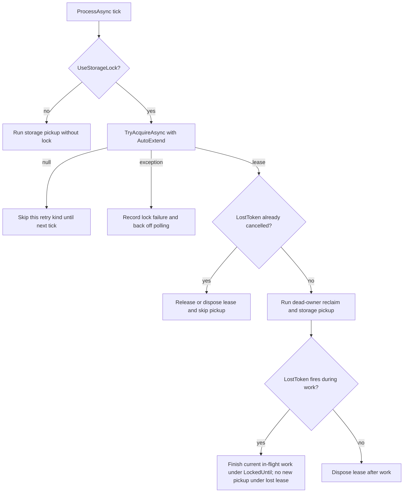

# feat(messaging): Consume retry lock lease-loss monitoring

## Summary

Retire the manual received-retry lock renewal loop now that `IDistributedLease.LostToken` and `LockMonitoringMode.AutoExtend` exist. Messaging should acquire retry locks with background auto-extension, observe lease loss as a pickup-boundary signal, keep in-flight dispatch governed by per-row `LockedUntil`, and report lock-store outages independently from storage-pickup failures.

---

## Problem Frame

Issue #296 tracks cleanup left behind by PR #284: `MessageNeedToRetryProcessor` adopted the messaging-keyed `IDistributedLock` provider before the distributed-lock lease lifecycle work shipped, so it hand-rolled received-retry renewal in `ProcessAsync`. Issue #289 is now closed and current code exposes the intended replacement surface: `DistributedLockAcquireOptions.Monitoring`, `LockMonitoringMode.AutoExtend`, and `IDistributedLease.LostToken`.

The local retry processor still carries the temporary shape: `_LockSafetyMargin`, `_GetLockTtl()`, a cross-tick `_receivedRetryHandle`, explicit `RenewAsync(...)` polling, and comments that name #296 as the removal point. Existing Coordination owner reclaim is separate and already uses `INodeMembership`; this plan does not reopen that row-owner recovery design.

---

## Requirements

**Retry lock lifecycle**

- R1. Retry lock acquisition must request monitored auto-extension so long-running published and received retry pickup work no longer depends on `ProcessAsync` polling to renew a handle.
- R2. The received-retry path must stop storing a cross-tick lease handle for manual renewal; lock lifetime belongs to the background task that acquired it.
- R3. When the retry lock's `LostToken` fires, messaging must prevent new retry pickup under that lost lease and let the next processor tick attempt a fresh acquire.
- R4. Lease loss must not cancel or abort already-enqueued in-flight publish/consume dispatch; per-row `LockedUntil` and storage CAS remain the correctness boundary.

**Monitoring and backpressure**

- R5. Lock-acquire failure accounting must be independent from storage-pickup failure accounting, so healthy storage reads cannot reset persistent lock-store outage counters.
- R6. Lock-side Warning and Error EventIds must remain filterable by retry kind and must escalate after the same consecutive-failure threshold used today.
- R7. Adaptive polling must still back off on lock-store acquisition failures and storage-pickup failures, without conflating their reset paths.

**Documentation and compatibility**

- R8. `UseStorageLock = false` behavior remains unchanged: no distributed lock calls, no lock monitoring, and retry correctness still rests on `LockedUntil`.
- R9. Existing Coordination dead-owner reclaim remains unchanged: `INodeMembership` accelerates orphaned rows only under the storage-lock path.
- R10. Messaging docs and package README must describe `LostToken`/auto-extension as the canonical retry-lock lifecycle mechanism and remove stale manual-renewal EventId semantics.

---

## Key Technical Decisions

- KTD1. Use `LockMonitoringMode.AutoExtend` for retry locks: retry pickup can legitimately exceed the initial TTL, so `Monitor` would only report loss while `AutoExtend` preserves the coarse mutex as long as the process and lock store remain healthy.
- KTD2. Treat `LostToken` as a next-boundary gate, not a dispatch cancellation token: issue #296's posture and the existing docs agree that per-row `LockedUntil` protects correctness, while mid-dispatch cancellation risks partial broker-write state.
- KTD3. Keep lease observation local to each background retry task: the task that acquired the lock should register or poll its own lease-lost signal and stop before starting storage pickup if the lease is already lost, rather than exposing a shared `_receivedRetryHandle` across `ProcessAsync` ticks.
- KTD4. Split lock and storage counters by cause and retry kind: published-lock, received-lock, published-storage, and received-storage failure streaks are separate operational signals, while adaptive polling can still use a shared "any pickup infrastructure failure happened" marker.
- KTD5. Preserve the existing messaging-keyed lock registration: `MessagingBuilder.UseDistributedLock(...)` and `MessagingKeys.LockProvider` remain the isolation boundary so app-level unkeyed lock providers do not silently control messaging retry pickup.

---

## High-Level Technical Design

`LostToken` narrows the lifetime of the coarse pickup mutex. It does not become a second correctness primitive and does not replace `LockedUntil`.

---

## Scope Boundaries

### In Scope

- Replace manual received-retry renewal with monitored auto-extension.
- Add retry-processor behavior around lease-loss observation.
- Split lock-acquire failure counters from storage-pickup counters.
- Update retry-lock tests and docs for the new operational contract.

### Deferred to Follow-Up Work

- Event-driven Coordination membership reclaim through `WatchAsync`; current reconcile-on-tick owner reclaim stays as implemented.
- Changing `UseStorageLock` default from `false`; this remains a deployment choice.
- Aborting in-flight dispatch on lock loss; this remains outside the intended correctness model.

### Out of Scope

- Storage schema changes, `Owner` column changes, and provider reclaim query changes.
- Distributed-lock provider internals; #289 already supplied the lease-monitor contract consumed here.
- New lock primitives or new distributed-lock backends.

---

## Implementation Units

### U1. Acquire retry locks with monitored auto-extension

- **Goal:** Make retry pickup use the distributed-lock lease lifecycle shipped by #289 instead of manual renewal.
- **Requirements:** R1, R2, R8, R9
- **Dependencies:** None
- **Files:**
  - `src/Headless.Messaging.Core/Processor/IProcessor.NeedRetry.cs`
  - `tests/Headless.Messaging.Core.Tests.Unit/RetryProcessorDistributedLockTests.cs`
- **Approach:** Update `_TryAcquireLockAsync` so the acquire options include `Monitoring = LockMonitoringMode.AutoExtend` alongside the current finite `TimeUntilExpires` and `AcquireTimeout = TimeSpan.Zero`. Remove `_LockSafetyMargin` and `_GetLockTtl()` once no remaining call sites need them. Keep `UseStorageLock = false` as the fast path that never touches the lock provider.
- **Patterns to follow:** Existing `DistributedLockAcquireOptions` usage in retry-processor tests; distributed-lock docs' per-call monitoring model.
- **Test suite design:** Unit coverage belongs in `tests/Headless.Messaging.Core.Tests.Unit/RetryProcessorDistributedLockTests.cs` using existing substitute lock providers and option-capture helpers. No new test project or harness is needed.
- **Test scenarios:**
  - With `UseStorageLock = true`, published and received retry lock acquisition passes finite `TimeUntilExpires`, `AcquireTimeout = TimeSpan.Zero`, and `Monitoring = LockMonitoringMode.AutoExtend`.
  - With `UseStorageLock = false`, the lock provider is not called and storage pickup still runs.
  - A null acquire result still skips the corresponding pickup path without querying membership reclaim for that path.
- **Verification:** Planned tests are added or updated and passing; no production reference remains to `_LockSafetyMargin`, `_GetLockTtl()`, or manual renewal-only comments.

### U2. Replace cross-tick received renewal with lease-loss gating

- **Goal:** Remove `_receivedRetryHandle` and make the received retry task own its acquired lease until the task completes or observes loss.
- **Requirements:** R2, R3, R4
- **Dependencies:** U1
- **Files:**
  - `src/Headless.Messaging.Core/Processor/IProcessor.NeedRetry.cs`
  - `src/Headless.Messaging.Core/Internal/LoggerExtensions.cs`
  - `tests/Headless.Messaging.Core.Tests.Unit/RetryProcessorDistributedLockTests.cs`
- **Approach:** Delete the renewal branch in `ProcessAsync` that calls `RenewAsync(...)` while `_receivedRetryConsumeTask` is still running. Keep the in-progress task guard so another received retry task is not spawned while the previous one runs under `UseStorageLock`. In `_ProcessReceivedAsync` and `_ProcessPublishedAsync`, check the acquired lease's loss signal before starting reclaim or storage pickup, and register or observe the token so loss during the work is logged and prevents reuse of that lease. Let the current storage-dispatch work finish under `LockedUntil` rather than linking the lost token into broker or storage writes.
- **Technical design:** Directional state model: `Acquired -> ActivePickup`; `LostBeforePickup -> Skip`; `LostDuringPickup -> FinishCurrentAttemptThenDispose`; `Completed -> Dispose`.
- **Patterns to follow:** Existing in-progress task guard in `ProcessAsync`; `IDistributedLease.LostToken`, `CanObserveLoss`, and `ThrowIfLost()` semantics from `Headless.DistributedLocks.Abstractions`.
- **Test suite design:** Unit coverage belongs in `RetryProcessorDistributedLockTests.cs`; add a controllable fake `IDistributedLease` that exposes a cancellable `LostToken` and records renewal calls.
- **Test scenarios:**
  - Received retry work spanning two `ProcessAsync` ticks no longer calls `RenewAsync` on the lease.
  - A lease whose `LostToken` is already cancelled before pickup skips reclaim and storage pickup, logs lease loss, disposes the handle, and allows the next tick to attempt a fresh acquire.
  - A lease whose `LostToken` cancels while storage pickup is already in progress does not cancel the in-flight storage/dispatch path, but the processor does not treat the lost lease as reusable.
  - A lease with `CanObserveLoss = false` remains compatible with fallback/no-op providers and does not throw because loss observation is unavailable.
- **Verification:** Planned tests are added or updated and passing; `_receivedRetryHandle` and the manual renewal branch are gone; in-flight dispatch cancellation behavior remains unchanged.

### U3. Split lock-acquire failure counters from storage-pickup counters

- **Goal:** Make lock-store outages independently observable without being reset by healthy storage reads.
- **Requirements:** R5, R6, R7
- **Dependencies:** None
- **Files:**
  - `src/Headless.Messaging.Core/Processor/IProcessor.NeedRetry.cs`
  - `tests/Headless.Messaging.Core.Tests.Unit/Processor/MessageNeedToRetryProcessorTests.cs`
  - `tests/Headless.Messaging.Core.Tests.Unit/RetryProcessorDistributedLockTests.cs`
- **Approach:** Replace the shared `_CounterRef(kind)` use in `_RecordLockAcquireFailure` with lock-specific counters, while `_GetSafelyAsync` continues to own storage-specific counters. Reset lock counters only on successful lock acquisition for that retry kind. Keep the current Warning/EventId and Error/EventId pairs unless implementation discovers a compelling reason to introduce new IDs; the load-bearing change is independent reset behavior, not renaming.
- **Patterns to follow:** Existing per-kind storage failure counters and logger capture helpers in retry-processor tests.
- **Test suite design:** Unit coverage belongs in existing retry-processor unit tests. Use logger capture to assert EventIds and test that successful storage pickup does not reset lock-acquire streaks.
- **Test scenarios:**
  - Three consecutive published lock-acquire exceptions escalate to the published lock Error EventId even when published storage pickup succeeds on intervening cycles.
  - Three consecutive received lock-acquire exceptions escalate to the received lock Error EventId even when received storage pickup succeeds on intervening cycles.
  - A successful lock acquisition resets only the matching lock counter.
  - A successful storage pickup resets only the matching storage counter.
  - Adaptive polling backs off after either storage-pickup failure or lock-acquire failure.
- **Verification:** Planned tests are added or updated and passing; comments no longer describe counter conflation as pending #296.

### U4. Update operational docs and public package README

- **Goal:** Align docs with the new retry-lock lifecycle and remove stale manual-renewal language.
- **Requirements:** R4, R8, R9, R10
- **Dependencies:** U1, U2, U3
- **Files:**
  - `docs/authoring/AUTHORING.md`
  - `docs/llms/messaging.md`
  - `docs/llms/distributed-locks.md`
  - `src/Headless.Messaging.Core/README.md`
- **Approach:** Follow the authoring rules before editing docs. Update Messaging's distributed-lock section so it says retry locks use monitored auto-extension and `LostToken`, not explicit renewal. Keep the existing Coordination recovery decision tree, `LockedUntil` correctness framing, and `UseStorageLock = false` guidance. Update EventId tables if U2/U3 removes or repurposes manual-renewal events.
- **Patterns to follow:** Existing lockstep doc surfaces for Messaging; distributed-lock lifecycle wording already present in `docs/llms/distributed-locks.md`.
- **Test suite design:** Test expectation: none -- documentation-only unit. Verification is doc drift review plus the code tests in U1-U3.
- **Test scenarios:** Test expectation: none -- documentation-only unit.
- **Verification:** Docs reflect the implemented EventIds and lifecycle behavior; `docs/llms/messaging.md` and `src/Headless.Messaging.Core/README.md` stay consistent.

---

## Testing Strategy

The behavioral surface is retry-processor orchestration, so coverage should stay in unit tests rather than provider integration suites. `tests/Headless.Messaging.Core.Tests.Unit/RetryProcessorDistributedLockTests.cs` owns lock acquisition, loss-token behavior, and `UseStorageLock` branching. `tests/Headless.Messaging.Core.Tests.Unit/Processor/MessageNeedToRetryProcessorTests.cs` owns storage/backpressure failure accounting where existing tests already assert storage failure escalation.

No provider conformance harness changes are planned because storage provider behavior, `Owner` stamping, and reclaim queries are out of scope.

---

## System-Wide Impact

- **Runtime behavior:** Retry processors stop manually renewing received retry locks. Auto-extension shifts lease renewal to the distributed-lock provider's monitor.
- **Correctness:** `LockedUntil` remains the durable per-row guard against double dispatch. Lock loss is an observability and pickup-boundary signal.
- **Operations:** Lock-store outages become independently alertable; storage success no longer masks lock failure streaks.
- **Public contract:** No new public messaging API is planned. The change consumes existing `Headless.DistributedLocks` public APIs.

---

## Risks & Dependencies

| Risk | Mitigation |
| --- | --- |
| Lost-token handling accidentally aborts broker writes or storage state changes mid-dispatch. | Keep `LostToken` out of dispatch cancellation tokens; tests assert in-flight work continues under `LockedUntil`. |
| Auto-extension is requested with an invalid TTL. | Preserve finite `TimeUntilExpires`; distributed-lock validation already rejects monitored infinite leases. |
| Lock-counter split changes adaptive polling semantics. | Keep the shared "infrastructure failure happened" backoff marker while separating reset/escalation counters by cause. |
| Docs drift around EventIds if implementation keeps/removes 79 and 80 differently than planned. | U4 runs after U1-U3 and updates tables to match the final code. |

---

## Sources & Research

- GitHub issue #296: cleanup scope, in-flight tolerance, lock/storage failure split, and docs requirements.
- GitHub issue #289: dependency confirming `LeaseMonitor`, `LostToken`, and auto-extension shipped.
- GitHub issue #287: distributed-lock roadmap and settled lease lifecycle posture.
- `src/Headless.Messaging.Core/Processor/IProcessor.NeedRetry.cs`: current manual renewal and retry lock orchestration.
- `src/Headless.DistributedLocks.Abstractions/RegularLocks/IDistributedLease.cs`: `LostToken`, `CanObserveLoss`, and `ThrowIfLost()` contract.
- `src/Headless.DistributedLocks.Abstractions/RegularLocks/DistributedLockAcquireOptions.cs`: monitored acquire options.
- `docs/solutions/architecture-patterns/messaging-keyed-di-lock-isolation-2026-05-19.md`: keyed lock provider isolation precedent.
- `docs/plans/2026-06-07-002-feat-messaging-coordination-recovery-plan.md`: current Coordination owner reclaim boundary that this plan preserves.
