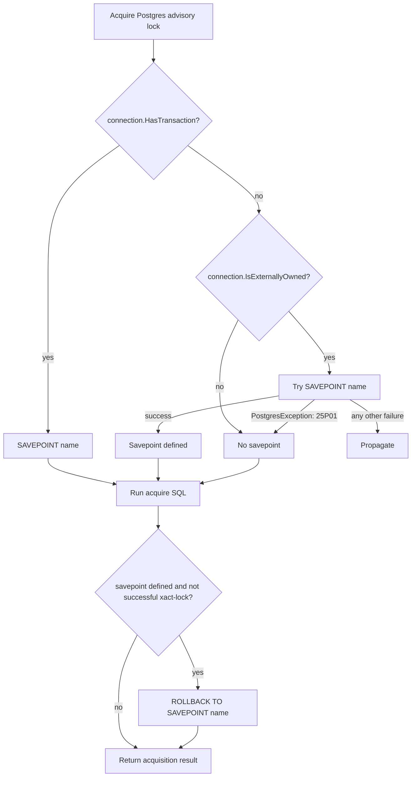

# fix: Replace Postgres advisory savepoint transaction probe

## Summary

Replace the side-effectful transaction probe in `PostgresAdvisoryLock` with a savepoint-first boundary check. The fix should preserve transaction-local timeout isolation for visible and invisible external transactions, while ensuring "no active transaction" is the only swallowed PostgreSQL state.

The issue is not the savepoint itself. The issue is using `DatabaseConnection.BeginTransactionAsync(...)` as a detection mechanism: it can mutate wrapper state on success, and it catches provider `InvalidOperationException` too broadly on failure.

## Problem Frame

`src/Headless.DistributedLocks.Postgres/PostgresAdvisoryLock.cs` currently decides whether acquisition should be protected by a savepoint through `_ShouldDefineSavePointAsync(...)`.

The problematic branch is an externally-owned `NpgsqlConnection` whose active transaction is not tracked by `DatabaseConnection`:

1. `connection.HasTransaction` is false.
2. `_ShouldDefineSavePointAsync(...)` calls `connection.BeginTransactionAsync(CancellationToken.None)`.
3. If Npgsql rejects the call, any `InvalidOperationException` is treated as "there must already be an active transaction".
4. If the call succeeds, a transaction was created only to answer a question.

That is fragile because the classifier is the exception shape from an operation that changes transaction state. It also makes future Npgsql failures easy to misclassify.

Primary-source check against Npgsql v10.0.2 showed no public authoritative hidden-transaction property. `NpgsqlConnection.FullState` is connection state, while the useful transaction markers (`Connector.InTransaction`, `TransactionStatus`) are internal. Therefore the safer design is not "read hidden state"; it is "attempt the exact PostgreSQL boundary operation we actually need, and classify only its documented SQLSTATE".

## Requirements

### Probe Removal and Transaction Boundaries

- R1. `PostgresAdvisoryLock` must not call `DatabaseConnection.BeginTransactionAsync(...)` to infer external transaction state.
- R2. For Headless-tracked transactions (`connection.HasTransaction == true`), acquisition must still create a savepoint before mutating `SET LOCAL` timeout settings.
- R3. For externally-owned `NpgsqlConnection` instances with an invisible active transaction, acquisition must still create a savepoint so timeout settings can be rolled back.
- R4. For externally-owned `NpgsqlConnection` instances with no active transaction, acquisition must not attempt rollback-to-savepoint cleanup.
- R5. Only PostgreSQL `NoActiveSqlTransaction` (`25P01`) may mean "no transaction"; failed transactions, busy connections, network/provider errors, and other SQLSTATEs must propagate.
- R6. Existing session-scoped and transaction-scoped advisory-lock semantics must stay unchanged.

### Testing and Documentation

- R7. Add integration coverage for visible transaction, invisible external transaction, no transaction, and failed transaction paths.
- R8. Do not change public docs unless the implementation changes public behavior. This fix is intended to be internal/provider-behavior hardening.
- R9. The PR body should include `Fixes #404`.

## High-Level Technical Design



The helper should make savepoint creation the transaction-boundary check:

```csharp
private static async ValueTask<bool> _TryDefineSavePointAsync(
    DatabaseConnection connection,
    string savePointName,
    CancellationToken cancellationToken
)
```

Expected behavior:

- Internal provider-owned no-transaction path returns `false` without a server round trip.
- Visible transaction path executes `SAVEPOINT`.
- External no-visible-transaction path executes `SAVEPOINT`; it returns `false` only for `PostgresErrorCodes.NoActiveSqlTransaction`.
- All other failures bubble.

## Key Technical Decisions

### KTD1. Use savepoint-first detection, not a synthetic transaction

Because Npgsql does not expose a public read-only hidden transaction flag, using `BeginTransactionAsync(...)` as a probe creates exactly the side effect the issue asks to remove. `SAVEPOINT` is the boundary operation the provider actually needs, so classifying `SAVEPOINT` failure is both narrower and more directly tied to behavior.

### KTD2. Preserve invisible external transaction timeout isolation

A simpler implementation could return `connection.HasTransaction` and remove all hidden-transaction handling. That would be read-only, but it would leak `SET LOCAL lock_timeout` changes within invisible external transactions. The savepoint-first design preserves the existing isolation behavior without creating a transaction.

### KTD3. Keep transaction-scoped lock selection tied to `connection.HasTransaction`

`_UseTransactionScopedLock(...)` should remain based on Headless-tracked transactions. The invisible external transaction path should be protected for timeout cleanup, but this fix should not silently convert session-scoped lock acquisition into `pg_advisory_xact_lock`.

### KTD4. Add a narrow provider test seam only where public APIs cannot reach the branch

The normal provider behavior should stay covered through public DI/conformance tests. The issue-specific external-connection branch is internal to the database lock engine and Postgres strategy, so targeted integration tests may add `InternalsVisibleTo` for `Headless.DistributedLocks.Postgres.Tests.Integration`, matching existing provider precedent such as the SQL Server distributed-lock project.

## Implementation Units

### U1. Add failing/characterizing Postgres integration coverage

Goal: lock down the transaction-boundary behavior before refactoring the probe.

Requirements: R2, R3, R4, R5, R6, R7.

Files:

- `tests/Headless.DistributedLocks.Postgres.Tests.Integration/PostgresTransactionLockTests.cs`
- `src/Headless.DistributedLocks.Postgres/Headless.DistributedLocks.Postgres.csproj` only if internal access is required

Approach:

- Prefer public/static Postgres APIs for transaction-scoped behavior already exposed by `PostgresDistributedLock`.
- For the issue-specific branch, instantiate `PostgresAdvisoryLock` and `PostgresDatabaseConnection` directly only if no public path can exercise externally-owned connection behavior.
- If internals are exposed, keep the exposure limited to the existing Postgres integration test assembly and document that it exists for provider-boundary behavior, not generic white-box unit testing.
- Reuse the existing `PostgresDistributedLockFixture` and `TestBase.AbortToken`.

Test scenarios:

- Visible transaction: wrap an `NpgsqlTransaction`, acquire through the advisory strategy, and assert acquisition succeeds with transaction-scoped behavior unchanged.
- Invisible external transaction: begin a transaction directly on `NpgsqlConnection`, wrap only the connection, set a sentinel `lock_timeout`, acquire through `PostgresAdvisoryLock`, then assert the sentinel is still visible inside the transaction after acquisition.
- No transaction: wrap an open external `NpgsqlConnection` without a transaction and assert acquisition succeeds without trying to roll back to a savepoint.
- Failed transaction: begin a transaction, intentionally force a SQL error so PostgreSQL enters failed-transaction state, wrap only the connection, attempt acquisition, and assert the non-`NoActiveSqlTransaction` `PostgresException` propagates.

Verification:

- `make test-project TEST_PROJECT=tests/Headless.DistributedLocks.Postgres.Tests.Integration/Headless.DistributedLocks.Postgres.Tests.Integration.csproj`

### U2. Replace `_ShouldDefineSavePointAsync(...)` with savepoint-first boundary handling

Goal: remove the transaction probe and classify only the PostgreSQL "no active transaction" SQLSTATE.

Requirements: R1, R2, R3, R4, R5, R6.

Files:

- `src/Headless.DistributedLocks.Postgres/PostgresAdvisoryLock.cs`

Approach:

- Replace the sequence:
  - `needsSavePoint = await _ShouldDefineSavePointAsync(...)`
  - conditional `SAVEPOINT`
- With:
  - `savePointDefined = await _TryDefineSavePointAsync(connection, savePointName, cancellationToken)`
- Remove `_ShouldDefineSavePointAsync(...)`.
- Add `_TryDefineSavePointAsync(...)` that:
  - returns `false` for provider-owned connections without `HasTransaction`;
  - creates a savepoint directly for `HasTransaction`;
  - for externally-owned connections without visible transactions, attempts `SAVEPOINT` and catches only `PostgresException` where `SqlState == PostgresErrorCodes.NoActiveSqlTransaction`;
  - lets every other exception propagate.
- Keep rollback/timeout restore behavior keyed to the returned `savePointDefined` boolean.
- Keep `_UseTransactionScopedLock(...)` unchanged.

Verification:

- `rg -n "BeginTransactionAsync|_ShouldDefineSavePointAsync" src/Headless.DistributedLocks.Postgres/PostgresAdvisoryLock.cs` should not show either symbol.
- Run the U1 integration tests.

### U3. Tighten comments and issue traceability

Goal: make the new branch readable without expanding public documentation.

Requirements: R8, R9.

Files:

- `src/Headless.DistributedLocks.Postgres/PostgresAdvisoryLock.cs`

Approach:

- Add a short comment only where it prevents future regressions: the external no-visible-transaction branch is intentionally using `SAVEPOINT` as the transaction boundary check because Npgsql's transaction state is not public.
- Do not update `src/Headless.DistributedLocks.Postgres/README.md` or `docs/llms/...` unless the code change becomes consumer-visible.
- Include `Fixes #404` in the PR body.

Verification:

- `make build-project PROJECT=src/Headless.DistributedLocks.Postgres/Headless.DistributedLocks.Postgres.csproj`
- `make test-project TEST_PROJECT=tests/Headless.DistributedLocks.Postgres.Tests.Integration/Headless.DistributedLocks.Postgres.Tests.Integration.csproj`

## Testing Strategy

Use Postgres integration tests as the primary validation surface. The behavior depends on PostgreSQL transaction state, savepoint semantics, and Npgsql exception mapping, so mock/unit tests would mostly assert an invented model.

Minimum verification:

- `make build-project PROJECT=src/Headless.DistributedLocks.Postgres/Headless.DistributedLocks.Postgres.csproj`
- `make test-project TEST_PROJECT=tests/Headless.DistributedLocks.Postgres.Tests.Integration/Headless.DistributedLocks.Postgres.Tests.Integration.csproj`
- `git diff --check`

Broader verification if the implementation touches shared database lock engine code:

- `make test-project TEST_PROJECT=tests/Headless.DistributedLocks.Core.Database.Tests.Unit/Headless.DistributedLocks.Core.Database.Tests.Unit.csproj`
- `make test-project TEST_PROJECT=tests/Headless.DistributedLocks.SqlServer.Tests.Integration/Headless.DistributedLocks.SqlServer.Tests.Integration.csproj`

## Scope Boundaries

In scope:

- `PostgresAdvisoryLock` transaction-boundary/savepoint decision.
- Postgres provider integration tests for the affected paths.
- Minimal comments explaining the new branch.

Out of scope:

- Public API changes.
- Changes to `PostgresDistributedLock.AcquireWithTransactionAsync(...)` or `TryAcquireWithTransactionAsync(...)`.
- Reflection into Npgsql internals.
- New transaction isolation-level behavior.
- Reworking the shared database lock engine unless tests prove the fix cannot stay Postgres-local.
- README or LLM documentation updates unless public behavior changes.

## Risks and Dependencies

- Integration validation requires Docker/Testcontainers.
- Hidden external transaction detection cannot be implemented as a pure read with public Npgsql v10.0.2 APIs.
- The external no-visible-transaction path will issue one `SAVEPOINT` round trip to classify transaction state. Provider-owned no-transaction acquisitions should avoid that branch.
- Failed transaction tests must assert SQLSTATE/class behavior, not English exception messages.
- If future Npgsql versions expose a public transaction-state property, this logic can be simplified later.

## Sources and Research

- GitHub issue: `https://github.com/xshaheen/headless-framework/issues/404`
- `src/Headless.DistributedLocks.Postgres/PostgresAdvisoryLock.cs`
- `src/Headless.DistributedLocks.Postgres/PostgresDatabaseConnection.cs`
- `src/Headless.DistributedLocks.Core.Database/Internal/DatabaseConnection.cs`
- `src/Headless.DistributedLocks.Core.Database/Internal/DedicatedConnectionOrTransactionDbDistributedLock.cs`
- `tests/Headless.DistributedLocks.Postgres.Tests.Integration/PostgresTransactionLockTests.cs`
- `src/Headless.DistributedLocks.SqlServer/Headless.DistributedLocks.SqlServer.csproj`
- `docs/solutions/tooling-decisions/redlock-multi-instance-not-adopted-2026-05-19.md`
- Npgsql v10.0.2 source via GitHub API:
  - `src/Npgsql/NpgsqlConnection.cs`
  - `src/Npgsql/Internal/NpgsqlConnector.cs`
  - `src/Npgsql/PostgresErrorCodes.cs`
