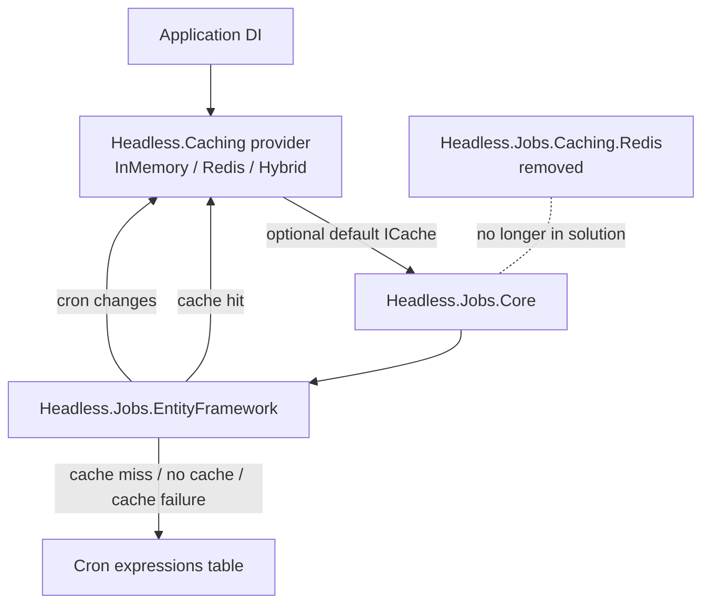

# refactor: Route Jobs cron caching through Headless.Caching

## Summary

Remove `Headless.Jobs.Caching.Redis` and route Jobs cron-expression caching directly through the framework's `Headless.Caching.ICache` abstraction. Jobs should consume an optional/default `ICache` from the host application, preserve fail-open behavior when caching is absent or unavailable, and leave provider selection to the existing `Headless.Caching.*` packages.

---

## Problem Frame

Issue #274 asks Jobs to stop bypassing the framework's caching abstraction. The issue body names `Headless.Caching.Abstractions.IDistributedCache`, but the live caching contract is `ICache` / `IRemoteCache`; there is no Headless `IDistributedCache` type. The plan therefore implements the issue's intent against the current abstraction surface.

The repository has also moved since the issue was opened. Membership and liveness have already moved out of Jobs Redis and into Coordination, leaving `Headless.Jobs.Caching.Redis` as a thin cron-cache adapter. Keeping that project would preserve a package whose name implies a Jobs-owned Redis provider even though the desired direction is direct `ICache` usage by `Headless.Jobs.*`.

---

## Requirements

- R1. Jobs packages no longer expose or consume `Microsoft.Extensions.Caching.Distributed.IDistributedCache`.
- R2. Jobs cron-expression reads and invalidations use `Headless.Caching.ICache` directly, without an `IJobsCacheContext` adapter.
- R3. Jobs remains usable when no `ICache` is registered; cron-expression reads fall through to the database factory and invalidations become no-ops.
- R4. `Headless.Jobs.Caching.Redis` is removed from source, solution membership, package docs, and package catalogs.
- R5. Cron-expression cache hits skip the database factory, cache misses populate the cache, and cache failures do not prevent the database result from being returned.
- R6. Jobs docs explain that consumers choose a cache provider by registering `Headless.Caching.InMemory`, `Headless.Caching.Redis`, or `Headless.Caching.Hybrid`; Jobs itself does not ship a Redis-specific cache package.

---

## Key Technical Decisions

- KTD1. Use `ICache`, not a new `IDistributedCache` shim. `Headless.Caching.Abstractions` already tells consumers to code against `ICache`; inventing a Jobs-only distributed-cache alias would create a second abstraction with no existing provider pattern.
- KTD2. Delete `Headless.Jobs.Caching.Redis` instead of turning it into a compatibility wrapper. Jobs should not own provider-specific cache registration once it consumes `ICache` directly. Consumers who want Redis-backed Jobs caching register `Headless.Caching.Redis` as their application cache provider.
- KTD3. Remove `IJobsCacheContext` and inject/resolve `ICache` at the Jobs persistence boundary. The adapter only existed to hide the old Redis/MS distributed-cache split; direct optional `ICache` keeps the runtime contract simpler and makes absence of caching explicit.
- KTD4. Preserve fail-open factory behavior around Jobs cache calls. `ICache.GetOrAddAsync` can propagate store-write or cold-cache factory failures depending on options and provider state; Jobs should catch non-cancellation cache failures and return the database factory result.
- KTD5. Treat package removal as a greenfield breaking change. This repo prefers cleaner APIs over compatibility layers unless explicitly requested, and keeping `AddStackExchangeRedis(...)` would preserve stale Redis vocabulary in Jobs.

---

## High-Level Technical Design

Jobs reads the application's optional default `ICache`. If no cache is registered, Jobs behaves as it does with the no-op context today: cron expressions are read from the database and invalidation does nothing. If a cache is registered, Jobs uses the same cache provider the application selected.

---

## Scope Boundaries

### In Scope

- Remove `Headless.Jobs.Caching.Redis` source project, solution entry, package docs, and package catalog references.
- Remove `IJobsCacheContext`, `NoOpJobsCacheContext`, `RedisJobsCacheContext`, and related `InternalsVisibleTo` entries.
- Update Jobs Core/EntityFramework wiring so cron-expression cache behavior uses optional/default `ICache` directly.
- Update Jobs docs to show cache provider selection through `Headless.Caching.*` packages.

### Deferred to Follow-Up Work

- A jobs-private keyed Headless cache binding for consumers who want Jobs to use a different cache than the app default.
- Broader Caching setup improvements for multiple independent Redis cache instances.

### Out of Scope

- Jobs membership, liveness, dead-node recovery, Dashboard live-node behavior, or Coordination provider changes.
- Any database schema changes.
- Any new cache provider implementation.
- Editing historical plans/specs except where current docs or package catalogs would otherwise remain misleading.

---

## System-Wide Impact

This removes a package from the solution and NuGet surface. Consumers who previously called `.AddStackExchangeRedis(...)` from `Headless.Jobs.Caching.Redis` must instead register a Headless cache provider, such as `AddRedisCache(...)`, before or alongside Jobs. Jobs behavior becomes provider-neutral: Redis is no longer a Jobs concern.

---

## Implementation Units

### U1. Remove the Jobs Redis package surface

**Goal:** Delete the obsolete package and all build/catalog references to it.

**Requirements:** R4.

**Dependencies:** None.

**Files:**

- `src/Headless.Jobs.Caching.Redis/Headless.Jobs.Caching.Redis.csproj` (delete)
- `src/Headless.Jobs.Caching.Redis/Setup.cs` (delete)
- `src/Headless.Jobs.Caching.Redis/RedisJobsCacheContext.cs` (delete)
- `src/Headless.Jobs.Caching.Redis/README.md` (delete)
- `headless-framework.slnx`
- `src/Headless.Jobs.Abstractions/Headless.Jobs.Abstractions.csproj`

**Approach:** Remove the project directory and its solution entry. Remove the `InternalsVisibleTo` entry for `Headless.Jobs.Caching.Redis`. Do not replace the Jobs Redis extension with a compatibility shim.

**Patterns to follow:** Project removal should mirror existing solution/project-file style; keep the edit mechanical and scoped.

**Test scenarios:** Test expectation: none -- build graph removal is verified by solution build.

**Verification:** Solution restore/build no longer references `src/Headless.Jobs.Caching.Redis`; `rg "Headless.Jobs.Caching.Redis" headless-framework.slnx src` returns no live source/project references.

---

### U2. Replace `IJobsCacheContext` with direct optional `ICache`

**Goal:** Remove the Jobs-specific cache adapter and make Jobs consume the framework cache abstraction directly.

**Requirements:** R1, R2, R3.

**Dependencies:** U1.

**Files:**

- `src/Headless.Jobs.Abstractions/Interfaces/IJobsCacheContext.cs` (delete)
- `src/Headless.Jobs.Abstractions/Temps/NoOpJobsCacheContext.cs` (delete)
- `src/Headless.Jobs.Abstractions/Headless.Jobs.Abstractions.csproj`
- `src/Headless.Jobs.Core/DependencyInjection/JobsServiceExtensions.cs`
- `src/Headless.Jobs.EntityFramework/Infrastructure/BasePersistenceProvider.cs`
- `src/Headless.Jobs.EntityFramework/Infrastructure/JobsEFCorePersistenceProvider.cs`
- `tests/Headless.Jobs.Tests.Unit/Caching/NoOpJobsCacheContextTests.cs` (delete or replace)
- `tests/Headless.Jobs.Tests.Unit/CronScheduleCacheTests.cs`
- `tests/Headless.Jobs.Tests.Unit/Headless.Jobs.Tests.Unit.csproj`

**Approach:** Add a `Headless.Caching.Abstractions` project reference to the Jobs package that owns the persistence cache behavior. Wire `ICache?` as an optional dependency at the Jobs persistence boundary, using DI factory resolution if constructor optionality is awkward. Remove `IJobsCacheContext` registrations from Jobs Core.

**Patterns to follow:** `docs/llms/caching.md` directs framework code to use `ICache`; existing consumers such as Settings, Permissions, and API Idempotency show direct `ICache` usage.

**Test scenarios:**

- When no `ICache` is registered, cron-expression reads execute the database factory and return its result.
- When no `ICache` is registered, insert/update/remove cron-job operations skip invalidation without throwing.
- Jobs projects no longer require `Microsoft.Extensions.Caching.Abstractions`.
- Jobs Core no longer registers `IJobsCacheContext` or a no-op adapter.

**Verification:** Unit tests pass; no `IJobsCacheContext`, `NoOpJobsCacheContext`, or `Microsoft.Extensions.Caching.Distributed` usage remains in live Jobs source.

---

### U3. Preserve cron-expression cache semantics with direct `ICache`

**Goal:** Keep the observable cache behavior while removing the adapter layer.

**Requirements:** R2, R5.

**Dependencies:** U2.

**Files:**

- `src/Headless.Jobs.EntityFramework/Infrastructure/BasePersistenceProvider.cs`
- `src/Headless.Jobs.EntityFramework/Infrastructure/JobsEFCorePersistenceProvider.cs`
- `tests/Headless.Jobs.Tests.Unit/CronScheduleCacheTests.cs`

**Approach:** Use `ICache.GetOrAddAsync` for `"cron:expressions"` with the existing expiration. Use `ICache.RemoveAsync` for invalidation on cron insert/update/remove when a cache exists. Keep fail-open behavior centralized in helper methods so EF call sites stay readable and non-cancellation cache failures do not break Jobs operations.

**Execution note:** Characterize the current cache hit/miss/failure behavior before replacing the adapter.

**Patterns to follow:** `FactoryCacheCoordinator` semantics in `src/Headless.Caching.Core/FactoryCacheCoordinator.cs` and direct `ICache` usage in `src/Headless.Api.Idempotency/IdempotencyMiddleware.cs`.

**Test scenarios:**

- Cache hit returns cached cron expressions and does not execute the database factory.
- Cache miss executes the database factory once, stores the result, and returns it.
- Cache read failure executes the database factory and returns its result.
- Cache write failure after a database factory success returns the database result.
- Caller cancellation still propagates rather than being swallowed as a cache failure.
- Insert, update, and remove cron-job operations call `ICache.RemoveAsync("cron:expressions", ...)` when a cache exists.

**Verification:** Unit coverage proves hit, miss, failure fallback, cancellation, and invalidation behavior.

---

### U4. Update Jobs documentation and package catalogs

**Goal:** Make docs reflect that Jobs uses generic Headless caching and no longer ships a Redis cache package.

**Requirements:** R4, R6.

**Dependencies:** U1, U2, U3.

**Files:**

- `docs/llms/jobs.md`
- `docs/llms/index.md`
- `src/Headless.Jobs.Abstractions/README.md`
- `src/Headless.Jobs.Core/README.md`
- `src/Headless.Jobs.EntityFramework/README.md`

**Approach:** Follow `docs/authoring/AUTHORING.md`. Remove the `Headless.Jobs.Caching.Redis` package section and catalog entry. Update Jobs orientation to say cron-expression caching is enabled by registering a default `ICache` provider from `Headless.Caching.*`. Fix stale index text that still describes Jobs Redis as node registry and heartbeats.

**Patterns to follow:** Package README section order and domain doc sync rules in `docs/authoring/AUTHORING.md`.

**Test scenarios:** Test expectation: none -- documentation-only unit.

**Verification:** Documentation no longer tells consumers to install `Headless.Jobs.Caching.Redis`; docs name `Headless.Caching.Redis` as the Redis provider for Jobs cron caching.

---

## Testing Strategy

Primary coverage belongs in `tests/Headless.Jobs.Tests.Unit` because the behavior being changed is the Jobs cron-expression cache flow and DI fallback behavior. Use substitutes/fakes for `ICache` to prove hit, miss, invalidation, and fail-open behavior. The existing caching provider suites continue to own Redis/InMemory/Hybrid provider correctness.

Build verification should include the solution or at least all affected Jobs projects, because U1 removes a project from the solution and U2 changes project references.

---

## Risks & Dependencies

- **Issue wording drift:** Issue #274 names a nonexistent `Headless.Caching.Abstractions.IDistributedCache`. The plan resolves this to `ICache`, which is the actual framework cache abstraction.
- **Package removal break:** Consumers using `Headless.Jobs.Caching.Redis` and `.AddStackExchangeRedis(...)` must migrate to `Headless.Caching.Redis` / `AddRedisCache(...)`.
- **Optional cache DI shape:** Constructor injection of nullable `ICache` may need a DI factory if the current provider construction path assumes all constructor arguments are required.
- **Fail-open behavior:** `ICache.GetOrAddAsync` does not exactly match the old hand-written Redis try/catch. Jobs should preserve its own fallback semantics around cache operations.
- **Doc drift:** Historical coordination plans/specs mention `Headless.Jobs.Caching.Redis`; do not rewrite history broadly, but current docs and catalogs must not point to the removed package as available.

---

## Sources & Research

- GitHub issue #274: `refactor(jobs): replace Microsoft IDistributedCache with Headless.Caching abstraction`.
- Current Jobs cache seam: `src/Headless.Jobs.Abstractions/Interfaces/IJobsCacheContext.cs`, `src/Headless.Jobs.Abstractions/Temps/NoOpJobsCacheContext.cs`, `src/Headless.Jobs.Caching.Redis/`.
- Current Headless cache contracts: `src/Headless.Caching.Abstractions/ICache.cs`, `src/Headless.Caching.Redis/Setup.cs`, `src/Headless.Caching.Core/FactoryCacheCoordinator.cs`.
- Current direct `ICache` consumers: `src/Headless.Api.Idempotency/IdempotencyMiddleware.cs`, `src/Headless.Settings.Core/`, `src/Headless.Permissions.Core/`.
- Documentation rules: `docs/authoring/AUTHORING.md`.
