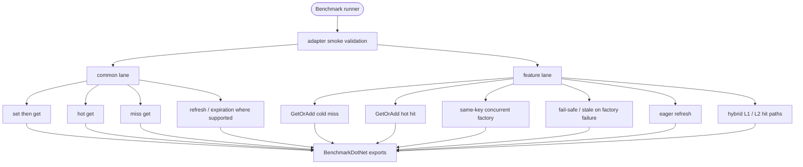

# feat: add cache benchmark suite

## Summary

Add a repeatable BenchmarkDotNet suite that compares Headless cache against FusionCache, Foundatio, and Microsoft `IDistributedCache`. The suite separates common cache operations from feature-specific scenarios so each library is measured on comparable semantics and unsupported features are shown as unsupported, not forced through adapter tricks.

---

## Problem Frame

Headless caching now has richer factory-backed behavior than a basic distributed cache: typed values, `GetOrAddAsync`, fail-safe stale serving, eager refresh, sliding expiration, tags, and hybrid tiering. The repo has focused correctness tests and a small stopwatch-style in-memory performance test, but no durable benchmark surface for comparing Headless against external cache libraries under repeatable workloads.

The benchmark needs to answer two questions without mixing them: how Headless performs on common cache operations, and how its higher-level behaviors compare with libraries that expose similar capabilities. Microsoft `IDistributedCache` is a useful baseline for `Get`, `Set`, `Refresh`, and `Remove`, but it is byte-array oriented and does not own Headless/FusionCache-style factory and fail-safe semantics.

---

## Requirements

**Benchmark coverage**

- R1. The suite must compare Headless, FusionCache, Foundatio, and Microsoft `IDistributedCache` for common single-key read/write operations.
- R2. The suite must include in-process and Redis-backed scenarios when the library supports them.
- R3. Feature-specific scenarios must cover factory-backed hot hits, cold misses, stampede control, fail-safe/stale serving, eager refresh, and hybrid tier reads only for libraries with comparable semantics.
- R4. Unsupported features must be represented as explicit capability gaps, not as failing benchmark cases or synthetic behavior layered onto a library.

**Reproducibility**

- R5. Benchmarks must use BenchmarkDotNet with memory allocation reporting and machine-readable exports.
- R6. Workloads must parameterize payload size, key cardinality, hit ratio, and provider so results are comparable across runs.
- R7. Redis-backed benchmarks must isolate keys per run and avoid cross-provider contamination.

**Validation and reporting**

- R8. Adapter behavior must be validated by tests before benchmark results are trusted.
- R9. The benchmark suite must emit markdown, CSV, and HTML artifacts and include a short interpretation guide for future runs.
- R10. Dependency additions must follow central package management and the repo's package quarantine rules.

---

## Key Technical Decisions

- KTD-1. Add a benchmark console project under `benchmarks/`: this keeps measurement code outside production packages and test projects while still allowing it to reference local source projects directly.
- KTD-2. Use adapter classes only to normalize benchmark calls: adapters should expose a small internal benchmark-facing shape for common operations and declared feature capabilities, not a new public cache abstraction.
- KTD-3. Split common and feature lanes: common-denominator benchmarks include all libraries, while feature lanes include only Headless, FusionCache, and Foundatio where semantics are comparable. This prevents `IDistributedCache` from looking weak because it lacks higher-level APIs it was not designed to expose.
- KTD-4. Use the same serialization payload per lane: Microsoft `IDistributedCache` stores the serialized bytes directly; object-oriented libraries use the same payload model and serializer where distributed storage requires bytes.
- KTD-5. Redis scenarios use one Redis resource with provider-specific key prefixes and cleanup: this mirrors existing Redis test isolation while avoiding one container per benchmark case.
- KTD-6. Dependency versions are resolved during implementation, not hardcoded in the plan: package names are known, but exact versions must pass NuGet availability and the local 7-day package quarantine before they enter `Directory.Packages.props`.

---

## High-Level Technical Design

### Benchmark lanes



### Capability matrix

| Library | In-process | Redis-backed | Factory get-or-add | Fail-safe | Eager refresh | Hybrid tiering | Common `IDistributedCache` baseline |
| --- | --- | --- | --- | --- | --- | --- | --- |
| Headless | yes | yes | yes | yes | yes | yes | no |
| FusionCache | yes | yes | yes | yes | yes | yes | no |
| Foundatio | yes | yes | yes | partial/comparable only if supported by current API | no unless current API supports it | yes | no |
| Microsoft `IDistributedCache` | yes | yes | no | no | no | no | yes |

The implementation must verify the Foundatio feature cells against the package version selected during implementation. If a capability is absent or materially different, the feature lane omits Foundatio for that scenario and the report records the gap.

---

## Output Structure

```text
benchmarks/
  Headless.Caching.Benchmarks/
    Headless.Caching.Benchmarks.csproj
    Program.cs
    README.md
    Adapters/
    Config/
    Infrastructure/
    Payloads/
    Scenarios/
tests/
  Headless.Caching.Benchmarks.Tests.Unit/
    Headless.Caching.Benchmarks.Tests.Unit.csproj
```

The exact file count may change during implementation, but the directory split should stay: adapters normalize libraries, scenarios define measurements, infrastructure owns Redis/configuration, payloads own deterministic test data, and README owns run/interpretation guidance.

---

## Implementation Units

### U1. Create benchmark project and dependency surface

**Goal:** Add the benchmark host project, central package entries, and solution membership.

**Requirements:** R5, R9, R10

**Dependencies:** none

**Files:**

- `benchmarks/Headless.Caching.Benchmarks/Headless.Caching.Benchmarks.csproj` (create)
- `benchmarks/Headless.Caching.Benchmarks/Program.cs` (create)
- `Directory.Packages.props` (modify)
- `headless-framework.slnx` (modify)

**Approach:** Use `Headless.NET.Sdk` with `net10.0` and console output. Add `BenchmarkDotNet`, FusionCache, Foundatio, and required Microsoft caching package references through central package management. Reference local Headless caching projects directly so the suite measures the current working tree.

**Patterns to follow:** New project SDK guidance in `CLAUDE.md`; package versions in `Directory.Packages.props`; existing cache project references under `src/Headless.Caching.*`.

**Test scenarios:** `Test expectation: none -- project scaffolding only; behavior validation is covered by U2 and U5.`

**Verification:** The benchmark project is listed in `headless-framework.slnx`, restores through central package management, and builds without version attributes in the project file.

### U2. Add benchmark workload model and adapter validation tests

**Goal:** Define deterministic payloads, provider selection, and adapter contracts used by all benchmark scenarios.

**Requirements:** R1, R4, R6, R8

**Dependencies:** U1

**Files:**

- `benchmarks/Headless.Caching.Benchmarks/Adapters/` (create)
- `benchmarks/Headless.Caching.Benchmarks/Payloads/` (create)
- `benchmarks/Headless.Caching.Benchmarks/Config/` (create)
- `tests/Headless.Caching.Benchmarks.Tests.Unit/Headless.Caching.Benchmarks.Tests.Unit.csproj` (create)
- `tests/Headless.Caching.Benchmarks.Tests.Unit/` (create tests)
- `headless-framework.slnx` (modify)

**Approach:** Create internal adapters for each library with two surfaces: common operations and optional feature operations. The adapters expose capability metadata so unsupported scenarios are filtered before BenchmarkDotNet runs. Payload generation should use deterministic byte/string/object payloads at configured sizes.

**Patterns to follow:** `CacheConformanceTestsBase` for public cache behavior expectations; `InMemoryCachePerformanceTests` for existing performance-oriented cache concerns; `AwesomeAssertions` and xUnit v3 in current test projects.

**Test suite design:** Unit tests own adapter smoke coverage. They should not assert throughput, only that each adapter can round-trip supported operations and reports unsupported capabilities honestly.

**Test scenarios:**

- Given each in-process adapter, when setting and reading a small payload through the common surface, then the retrieved payload matches the input.
- Given the Microsoft `IDistributedCache` adapter, when feature capabilities are queried, then factory, fail-safe, eager-refresh, and hybrid capabilities are false.
- Given deterministic payload settings, when payloads are generated twice for the same size and seed, then the serialized bytes match.
- Given unsupported capability metadata, when scenario discovery runs, then unsupported provider/scenario pairs are excluded rather than scheduled.

**Verification:** Planned unit tests are added and passing, and the benchmark host refuses to run feature scenarios for adapters that declare the feature unsupported.

### U3. Implement common-denominator benchmark scenarios

**Goal:** Add common single-key read/write benchmarks that include every comparator.

**Requirements:** R1, R2, R5, R6

**Dependencies:** U2

**Files:**

- `benchmarks/Headless.Caching.Benchmarks/Scenarios/CommonCacheBenchmarks.cs` (create)
- `benchmarks/Headless.Caching.Benchmarks/Config/BenchmarkConfig.cs` (create or modify)
- `tests/Headless.Caching.Benchmarks.Tests.Unit/` (modify tests)

**Approach:** Benchmark hot hit, cold miss, set-then-get, overwrite, remove, and refresh/expiration where the common surface supports it. Parameterize provider, backend mode, payload size, and key cardinality. Keep assertions out of benchmark methods; validation belongs in U2 tests and setup checks.

**Patterns to follow:** BenchmarkDotNet `GlobalSetup`/`GlobalCleanup`, `Params`, `MemoryDiagnoser`, and exporter patterns; Microsoft `IDistributedCache` method set (`GetAsync`, `SetAsync`, `RefreshAsync`, `RemoveAsync`).

**Test suite design:** Unit tests validate scenario discovery and setup invariants. BenchmarkDotNet owns measurement execution.

**Test scenarios:**

- Given all registered common adapters, when common scenario discovery runs, then every adapter has at least hot-hit and miss benchmarks.
- Given a payload-size parameter, when scenario setup runs, then seeded keys and payloads are created before benchmark invocation.
- Given refresh/expiration scenario discovery, when an adapter lacks a refresh operation, then the scenario is omitted for that adapter with a capability note.

**Verification:** Planned tests are added or updated and passing, and a dry benchmark listing shows all common provider/backend combinations without invoking feature-only scenarios.

### U4. Implement feature-specific benchmark scenarios

**Goal:** Add higher-level cache behavior benchmarks without flattening semantic differences into misleading baselines.

**Requirements:** R3, R4, R5, R6

**Dependencies:** U2, U3

**Files:**

- `benchmarks/Headless.Caching.Benchmarks/Scenarios/FactoryCacheBenchmarks.cs` (create)
- `benchmarks/Headless.Caching.Benchmarks/Scenarios/ResilienceCacheBenchmarks.cs` (create)
- `benchmarks/Headless.Caching.Benchmarks/Scenarios/HybridCacheBenchmarks.cs` (create)
- `tests/Headless.Caching.Benchmarks.Tests.Unit/` (modify tests)

**Approach:** Feature lanes should measure `GetOrAdd` cold miss, `GetOrAdd` hot hit, same-key concurrent factory calls, fail-safe/stale-on-failure behavior, eager refresh, and hybrid L1/L2 hit paths. Each scenario first filters by capability. Foundatio feature participation is limited to behaviors verified in the selected package version.

**Patterns to follow:** Existing Headless cache conformance scenarios for fail-safe, eager refresh, and hybrid behavior; FusionCache options for fail-safe, factory timeouts, and eager refresh; Foundatio cache API docs for `GetAsync`, `SetAsync`, and hybrid Redis client behavior.

**Test suite design:** Unit tests validate scenario eligibility and state setup. They do not compare performance numbers.

**Test scenarios:**

- Given the feature scenario catalog, when Microsoft `IDistributedCache` is registered, then it is excluded from all feature scenarios.
- Given a Headless adapter with fail-safe enabled, when setup seeds a stale value and a failing factory, then the smoke validation observes a stale value before the benchmark is eligible.
- Given a FusionCache adapter with fail-safe enabled, when setup seeds a stale value and a failing factory, then the smoke validation observes comparable stale behavior before the benchmark is eligible.
- Given Foundatio lacks an eager-refresh equivalent in the selected version, when scenario discovery runs, then Foundatio is omitted from the eager-refresh benchmark and the capability matrix records the omission.
- Given hybrid adapters, when L1-hit and L2-hit scenarios are prepared, then setup can distinguish local hit from distributed hit before measurement starts.

**Verification:** Planned tests are added or updated and passing, and feature benchmark discovery produces only capability-valid provider/scenario pairs.

### U5. Add Redis benchmark infrastructure and cleanup

**Goal:** Support Redis-backed benchmark cases without contaminating runs across providers or benchmark iterations.

**Requirements:** R2, R7, R8

**Dependencies:** U1, U2

**Files:**

- `benchmarks/Headless.Caching.Benchmarks/Infrastructure/RedisBenchmarkResource.cs` (create)
- `benchmarks/Headless.Caching.Benchmarks/Infrastructure/BenchmarkKeyPrefix.cs` (create)
- `benchmarks/Headless.Caching.Benchmarks/Config/RedisBenchmarkOptions.cs` (create)
- `tests/Headless.Caching.Benchmarks.Tests.Unit/` (modify tests)

**Approach:** Prefer an explicit Redis connection string option for serious runs and allow a local/Testcontainers-backed path only when practical for developer runs. Every provider receives a unique key prefix per benchmark run. Cleanup should remove only benchmark-owned keys and should not flush all Redis databases unless the benchmark owns the Redis instance.

**Patterns to follow:** `RedisCacheFixture` for connection string materialization and `HeadlessRedisFixture` for local Redis testcontainer precedent; provider key-prefix patterns in existing Redis tests.

**Test suite design:** Unit tests cover key-prefix generation and cleanup target selection. Integration testing the Redis resource itself can be deferred unless the implementation introduces reusable infrastructure beyond the benchmark project.

**Test scenarios:**

- Given provider name, scenario name, and run id, when a benchmark key prefix is created, then prefixes are unique and stable for that run.
- Given cleanup is configured for benchmark-owned prefixes, when cleanup runs, then only matching keys are selected.
- Given no Redis connection string and container startup is disabled, when Redis-backed scenarios are requested, then the benchmark host reports a configuration error before measurement.

**Verification:** Planned tests are added or updated and passing, and Redis-backed benchmark setup cannot accidentally flush or reuse non-benchmark keys.

### U6. Add BenchmarkDotNet configuration and reporting guidance

**Goal:** Make benchmark execution auditable and comparable across future runs.

**Requirements:** R5, R6, R9

**Dependencies:** U3, U4, U5

**Files:**

- `benchmarks/Headless.Caching.Benchmarks/Config/BenchmarkRunConfig.cs` (create or modify)
- `benchmarks/Headless.Caching.Benchmarks/README.md` (create)
- `benchmarks/Headless.Caching.Benchmarks/Program.cs` (modify)
- `tests/Headless.Caching.Benchmarks.Tests.Unit/` (modify tests)

**Approach:** Configure BenchmarkDotNet with memory diagnoser, markdown/CSV/HTML exporters, explicit artifact path, and a release-only warning. The README should document scenario lanes, provider capability interpretation, Redis prerequisites, run profiles, and how to compare outputs without treating one run as a universal ranking.

**Patterns to follow:** BenchmarkDotNet exporter and memory diagnoser guidance; repo documentation style that explains trade-offs rather than only commands.

**Test suite design:** Unit tests validate run-profile parsing and artifact-path decisions. BenchmarkDotNet validates exporter behavior during dry discovery or actual runs.

**Test scenarios:**

- Given the default run profile, when benchmark configuration is built, then markdown, CSV, HTML, and memory diagnoser outputs are enabled.
- Given a custom artifact path, when benchmark configuration is built, then BenchmarkDotNet writes under that path instead of the process working directory.
- Given an in-process-only run profile, when scenario selection runs, then Redis-backed scenarios are excluded before measurement.

**Verification:** Planned tests are added or updated and passing, the benchmark host emits BenchmarkDotNet artifacts to a predictable path, and the README explains how to run common-only, feature-only, in-process-only, and Redis-backed subsets.

---

## Testing Strategy

The benchmark project itself measures performance; tests validate correctness of the benchmark harness. Add `tests/Headless.Caching.Benchmarks.Tests.Unit` for adapter smoke tests, capability filtering, deterministic payload generation, scenario discovery, and Redis key-prefix safety. Do not assert timing thresholds in tests.

Final implementation verification should build the benchmark project and the new unit-test project, run the new unit tests, and run a dry benchmark discovery/listing. A full benchmark run is useful for publishing results but should not be required as a normal correctness gate because it is machine-sensitive and slow.

---

## Scope Boundaries

- This plan does not change production cache behavior or public cache APIs.
- This plan does not claim one library is universally faster; it creates the measurement surface and reporting discipline.
- This plan does not add a committed benchmark result baseline. Results should be generated per machine/run and interpreted with environment metadata.
- This plan does not add the future BCL `IDistributedCache` adapter for Headless; Microsoft `IDistributedCache` remains an external baseline here.

### Deferred to Follow-Up Work

- CI trend publishing or performance regression gates.
- Multi-node backplane/invalidation benchmarks.
- A public docs page advertising benchmark results after enough repeated runs exist.

---

## Risks & Dependencies

| Risk | Impact | Mitigation |
| --- | --- | --- |
| Adapter abstraction hides semantic differences | Benchmark results become misleading | Keep capability metadata visible and split common vs feature lanes. |
| Redis setup noise dominates measurements | Redis-backed results vary across machines | Record Redis connection mode, isolate key prefixes, and treat Redis results as environment-specific. |
| New dependency versions are too fresh for local quarantine | Restore fails during implementation | Verify package age and choose stable package versions that satisfy `min-release-age`. |
| Foundatio feature semantics differ from Headless/FusionCache | Feature comparison becomes unfair | Verify current Foundatio API during implementation and omit non-comparable scenarios. |

---

## Acceptance Examples

- AE1. Given the benchmark host runs common in-process scenarios, when discovery completes, then Headless, FusionCache, Foundatio, and Microsoft `IDistributedCache` all have hot-hit, miss, and set/get cases.
- AE2. Given Redis connection settings are valid, when Redis-backed common scenarios run, then every provider uses its own benchmark key prefix and the artifacts show Redis-backed provider names.
- AE3. Given feature scenarios are discovered, when the fail-safe lane is prepared, then Microsoft `IDistributedCache` is omitted and Headless/FusionCache are included only after smoke validation passes.
- AE4. Given BenchmarkDotNet completes a run, when artifacts are inspected, then markdown, CSV, and HTML exports are present under the configured artifact path.
- AE5. Given a future reader opens the benchmark README, when they compare results, then they can distinguish common operation results from feature lane results and capability gaps.

---

## Documentation / Operational Notes

The benchmark README should explain prerequisites and interpretation, not just commands. It should call out that BenchmarkDotNet results are machine-sensitive, Redis-backed results depend on Redis topology, and unsupported feature cells are capability gaps rather than zero scores.

Generated BenchmarkDotNet artifacts should stay out of normal commits unless a later task deliberately publishes a report. If a report is committed, it should include machine/runtime metadata and the exact git SHA.

---

## Sources & Research

- `CLAUDE.md` for repo conventions: Headless SDKs, central package management, solution membership, and test project patterns.
- `docs/llms/caching.md` for Headless cache semantics and FusionCache alignment notes.
- `docs/solutions/architecture-patterns/caching-fail-safe-coordinator-design.md` for fail-safe and coordinator design constraints.
- `tests/Headless.Caching.Tests.Harness/CacheConformanceTestsBase.cs` for cross-provider cache behavior scenarios.
- `tests/Headless.Caching.Redis.Tests.Integration/RedisCacheFixture.cs` for Redis testcontainer and connection setup precedent.
- BenchmarkDotNet documentation via Context7 and https://github.com/dotnet/BenchmarkDotNet: benchmark classes, `GlobalSetup`, `Params`, `MemoryDiagnoser`, and markdown/CSV/HTML exporters.
- FusionCache documentation via Context7 and https://github.com/ZiggyCreatures/FusionCache: entry options, fail-safe, factory timeouts, eager refresh, distributed cache, and Redis-backed setup.
- Foundatio documentation via Context7 and https://github.com/foundatiofx/foundatio: `ICacheClient`, Redis cache client, and Redis hybrid cache client setup.
- Microsoft Learn distributed caching docs at https://learn.microsoft.com/en-us/aspnet/core/performance/caching/distributed and `IDistributedCache` API docs at https://learn.microsoft.com/en-us/dotnet/api/microsoft.extensions.caching.distributed.idistributedcache: byte-array `Get`/`Set`/`Refresh`/`Remove` operations and recommendation to benchmark cache strategies for performance characteristics.
