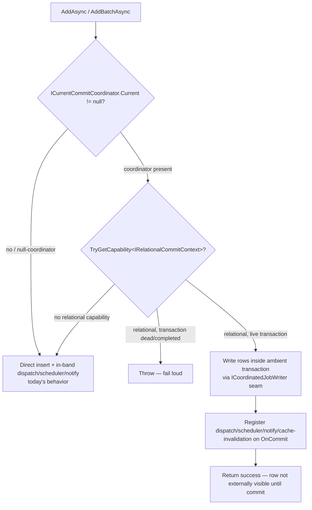

# feat(jobs): Atomic Job Enqueue via Commit Coordination

## Summary

When a relational commit coordinator is active, `ITimeJobManager.AddAsync` / `AddBatchAsync` (and `ICronJobManager.AddAsync` / `AddBatchAsync`) write the job row inside the caller's ambient transaction and defer their dispatch / scheduler-restart / notify side effects to post-commit, mirroring the messaging outbox. With no coordinator, today's direct-insert behavior is unchanged.

---

## Problem Frame

`JobsManager` persists through `IJobPersistenceProvider`, and the EF provider opens its **own** pooled `DbContext` per call (`JobsEFCorePersistenceProvider.AddTimeJobs`, `src/Headless.Jobs.EntityFramework/Infrastructure/JobsEFCorePersistenceProvider.cs:95`). A caller doing `dbContext.SaveChangesAsync()` then `timeJobManager.AddAsync(...)` has two uncoordinated writes; a crash between them diverges the job row from domain state. Messaging closed this gap through commit coordination (`OutboxMessageWriter`, `src/Headless.Messaging.Core/Internal/OutboxMessageWriter.cs`); jobs is the remaining unintegrated write (see origin: `docs/brainstorms/2026-06-15-jobs-commit-coordination-enqueue-requirements.md`).

The substrate this work targets is `Headless.CommitCoordination.*` (#428). The `IAmbientTransaction` shape named in issue #270 is obsolete.

---

## High-Level Technical Design

Routing happens in `JobsManager`, synchronously, before any `await` — the captured coordinator and relational capability must be read in the caller's frame or the `AsyncLocal` scope is stranded across the first await (`docs/solutions/logic-errors/asynclocal-ambient-scope-stranded-across-await.md`).

Directional guidance, not implementation specification.

---

## Key Technical Decisions

- **KTD-1. Hand-rolled capture; in-transaction write behind a focused EF seam, not `DurableWorkBuffer<TRow>` and not the public persistence interface.** Mirror `OutboxMessageWriter._TryCaptureCoordinatedContext`: capture `ICurrentCommitCoordinator.Current` and `IRelationalCommitContext` synchronously. The actual write lives behind a narrow seam `ICoordinatedJobWriter` (declared in `Headless.Jobs.Abstractions`, implemented **only** by the EF provider); the manager pattern-matches `persistenceProvider is ICoordinatedJobWriter`. This keeps the public `IJobPersistenceProvider` unchanged and means the in-memory provider needs no throwing stub. `DurableWorkBuffer<TRow>` covers only the row write and would split one logical operation across two mechanisms (see origin A-vs-B).
  - **The write cannot reuse the pooled `DbContext` factory — by EF design, not by choice.** EF pooling owns and opens its own connection from fixed options and resets state on return; `Database.UseTransaction` requires the transaction's connection to be the context's current connection. EF offers no supported way for a pooled context to adopt an externally-opened connection that already carries a live transaction (the `IDbConnectionInterceptor` dynamic-connection path only sets a connection *string* when EF itself opens the connection). EF's documented cross-context-transaction pattern is therefore a **non-pooled** context: `new JobsDbContext(options)` over `relationalContext.Connection` + `Database.UseTransaction(relationalContext.Transaction)` + `AddRange` + `SaveChanges`.
  - **What pooling is actually given up — and what is not.** The caller's connection is reused, so ADO.NET **connection pooling is untouched**. The compiled **model is cached globally** (keyed by the model cache key, not the context pool), so building the non-pooled context from a clone of the existing options template (`new DbContextOptionsBuilder<…>(existingOptions).UseXxx(relationalContext.Connection)`) reuses the cached model and internal service provider — no model recompilation. Only the lightweight context-instance pooling is skipped, and only on the cold coordinated-enqueue branch; every other jobs operation (all hot polling paths, the non-coordinated enqueue) keeps `PooledDbContextFactory` unchanged. Pass the connection as an object so EF treats it as externally-owned and never disposes/closes it. The seam works identically for `UseJobsDbContext` and `UseApplicationDbContext` because it writes through the shared physical connection, not the consumer's context type. The U2 spike confirms the options-template clone reuses the model and applies the schema/customizer.

- **KTD-2. Fail loud only when a relational transaction was offered but is unusable.** When `IRelationalCommitContext` is present but its transaction is null/completed, `AddAsync` throws — the caller opened a transaction expecting atomicity and silent fallback would reintroduce the divergence the feature prevents. When the active coordinator exposes **no relational capability at all** (e.g. a messaging-only coordinated scope), `AddAsync` falls back to the direct path rather than throwing: the coordinator is an ambient scope any subsystem may open, so jobs must not make it infectious. Matches `OutboxMessageWriter`'s capture-returns-null fallback, with the dead-transaction case as the one hard error.

- **KTD-3. Coordinator dependency is required, with a Jobs-owned null fallback.** `JobsManager` injects `ICurrentCommitCoordinator` as a required (non-nullable) dependency and gates on `Current == null` — a nullable `?` parameter carries no meaning to .NET DI, and Messaging already registers a non-null null-coordinator, so an optional parameter would never actually be null. `AddHeadlessJobs` does `TryAddSingleton<ICurrentCommitCoordinator, …>` a null-coordinator fallback (`Current => null`) so Jobs works standalone without CommitCoordination or Messaging; `AddCommitCoordination`'s unconditional registration wins when present. Mirrors `OutboxMessageWriter` exactly.

- **KTD-4. Side effects and cache invalidation move to post-commit via `OnCommit`.** Immediate dispatch (`ExecutionTime <= now+1s`), `IJobsHostScheduler.RestartIfNeeded`, `IJobsNotificationHubSender` sends, **and the cron-expressions cache invalidation** (`InvalidateCronExpressionsCacheAsync`, which today runs right after `SaveChanges` and would otherwise fire pre-commit on a stale snapshot) are registered on `OnCommit` and fire only after commit. On rollback none fire. Return-contract consequence: in the coordinated path `AddAsync` returns `JobResult.IsSucceeded=true` once the row is buffered into the transaction — it guarantees the row **committed**, not that deferred dispatch succeeded. A post-commit dispatch failure is swallowed by the commit interceptor (commit is already durable); the scheduler's polling sweep is the recovery path. U6 documents this SLA difference from the direct path.

- **KTD-5. Cron `AddAsync` participates; startup seeding does not.** `_AddCronJobAsync` shares the time-job shape (persist + scheduler-restart + notify, no immediate-dispatch), so it routes identically. `MigrateDefinedCronJobs` is startup bootstrap, never reached from `AddAsync`, and stays out (handled by #267).

---

## Requirements Traceability

- R1, R2, R3 (coordinated enqueue, rollback discard, ordering) → U2, U3, U5.
- R4 (side-effect deferral) → U3, U4.
- R5 (batch) → U3.
- R6 (cron parity) → U4.
- R7 (fail loud, refined split) → U3.
- R8, R9 (non-coordinated + in-memory parity) → U3 (in-memory provider left untouched).
- R10 (docs) → U6.

---

## Implementation Units

### U1. Coordinated-write seam

**Goal:** Declare a focused seam for writing job rows inside a caller-supplied relational transaction, without touching the public persistence interface.
**Requirements:** R1.
**Dependencies:** none.
**Files:**
- `src/Headless.Jobs.Abstractions/Interfaces/ICoordinatedJobWriter.cs` (new) — `WriteTimeJobsAsync(TTimeJob[], IRelationalCommitContext, CancellationToken)` and `WriteCronJobsAsync(TCronJob[], IRelationalCommitContext, CancellationToken)`. Pure row writes — no dispatch/scheduler/notify/cache side effects (those stay in the manager, deferred per KTD-4).
- `src/Headless.Jobs.Abstractions/Headless.Jobs.Abstractions.csproj` — add `ProjectReference` to `Headless.CommitCoordination.Abstractions` (needed regardless: the manager itself consumes `ICurrentCommitCoordinator` / `IRelationalCommitContext`).
**Approach:** A separate seam — not new overloads on `IJobPersistenceProvider` — so the in-memory provider is untouched and there is no unreachable throwing stub. The manager discovers it by pattern-match (`persistenceProvider is ICoordinatedJobWriter writer`); when a relational coordinator is active but the provider is not an `ICoordinatedJobWriter`, that is a mis-wire and routes to the KTD-2 fail-loud throw.
**Patterns to follow:** Messaging's transaction-aware `storage.StoreMessageAsync(..., transaction)` shape (`src/Headless.Messaging.Core/Internal/OutboxMessageWriter.cs`).
**Test expectation:** none — interface declaration only; behavior is exercised in U2/U5.
**Verification:** Seam compiles; `IJobPersistenceProvider` and the in-memory provider are unchanged.

### U2. EF coordinated write (spike, then implement)

**Goal:** Implement `ICoordinatedJobWriter` in the EF provider, writing rows into the caller's ambient transaction.
**Requirements:** R1, R3.
**Dependencies:** U1.
**Files:**
- `src/Headless.Jobs.EntityFramework/Infrastructure/JobsEFCorePersistenceProvider.cs` — implement `ICoordinatedJobWriter`: construct a short-lived **non-pooled** `JobsDbContext` over `relationalContext.Connection`, `Database.UseTransaction(relationalContext.Transaction)`, `AddRange`, `SaveChanges`. Do **not** invalidate the cron cache here (deferred to `OnCommit` per KTD-4).
- `src/Headless.Jobs.EntityFramework/Headless.Jobs.EntityFramework.csproj` — `ProjectReference` to `Headless.CommitCoordination.Abstractions` if not transitive.
**Approach:** Bypass the `PooledDbContextFactory` (a pooled context owns a different connection and `UseTransaction` would throw — KTD-1). Build options by **cloning the registered options template** (`new DbContextOptionsBuilder<…>(existingOptions).UseXxx(relationalContext.Connection)`) so the cached model / internal service provider / value converters carry over without recompilation, then `UseTransaction(relationalContext.Transaction)`. Pass the connection as an object so EF never disposes/closes the caller's connection. Identical for `UseJobsDbContext` and `UseApplicationDbContext`. Preserve insertion order on `AddRange`.
**Execution note:** Start with a throwaway spike proving the options-template clone writes a `JobsDbContext` through a foreign `DbConnection`+`DbTransaction` — model reused, schema/customizer applied, caller's connection left open — against both Postgres and SqlServer, before U3 depends on it.
**Patterns to follow:** `src/Headless.CommitCoordination.EntityFramework/EnlistCommitCoordinationExtensions.cs` extracts `GetDbConnection()`/`GetDbTransaction()` from an EF context to hand to the coordinator; U2 does the reverse — it attaches a fresh context to the coordinator-supplied connection via `DbContextOptionsBuilder.UseXxx(connection)` + `UseTransaction`.
**Test suite design:** Behavioral proof requires a real transaction; covered by integration in U5, not unit mocks.
**Test scenarios:**
- `Covers R1, R3.` (proven in U5) rows written via the seam commit with the ambient transaction and preserve insertion order; the caller's connection stays open after `SaveChanges`.
**Verification:** Spike confirms the wiring; U5 integration tests exercising this path pass against Postgres and SqlServer.

### U3. Manager routing for time jobs (single + batch)

**Goal:** Capture the coordinator, route coordinated vs direct, defer side effects, and fail loud.
**Requirements:** R1, R2, R4, R5, R7, R8.
**Dependencies:** U1, U2.
**Files:**
- `src/Headless.Jobs.Abstractions/Managers/JobsManager.cs` — inject required `ICurrentCommitCoordinator`; add a synchronous `_TryCaptureCoordinatedContext()` helper (read before any await); route `_AddTimeJobAsync` and `_AddTimeJobsBatchAsync`; register dispatch/scheduler/notify on `OnCommit`.
- `src/Headless.Jobs.Core/DependencyInjection/JobsServiceExtensions.cs` — `TryAddSingleton<ICurrentCommitCoordinator, …>` a null-coordinator fallback (`Current => null`); register the managers via factory lambdas so the dependency is supplied explicitly.
**Approach:** Capture sync (KTD-1). Routing fork: `Current == null` (no coordinator or the null fallback) → today's direct path verbatim. Coordinator present + no relational capability → also the direct path (KTD-2 — don't make coordination infectious). Coordinator present + relational capability whose transaction is dead/completed → throw (KTD-2). Coordinator present + live relational transaction → write via `persistenceProvider is ICoordinatedJobWriter` (mis-wire if absent → throw), register side effects on `OnCommit`. Batch defers the same side-effect categories; preserve the existing notify-before-dispatch ordering.
**Patterns to follow:** `OutboxMessageWriter._TryCaptureCoordinatedContext` + `_PublishInternalAsync` routing fork.
**Test suite design:** Unit tests with a fake `ICurrentCommitCoordinator` / `IRelationalCommitContext` in `tests/Headless.Jobs.Tests.Unit` (create if absent) for routing logic; atomicity and the AsyncLocal-capture correctness are integration (U5 rollback test — a unit test cannot observe AsyncLocal stranding within one async frame).
**Test scenarios:**
- `Covers R8.` `Current == null` (null fallback) → direct insert and in-band dispatch/scheduler/notify, no `OnCommit` registration.
- `Covers R8.` Jobs-only host (no CommitCoordination, no Messaging) resolves `JobsManager` and the null fallback → direct path; no DI resolution failure.
- `Covers R7.` Coordinator present, relational capability present, transaction dead/completed → throws; nothing persisted.
- `Covers R7.` Coordinator present, **no** relational capability (messaging-only scope) → direct path, no throw.
- `Covers R4.` Coordinator + live relational → dispatch/scheduler/notify/cache-invalidation registered on `OnCommit`, not invoked synchronously (fake coordinator captures registered callbacks).
- `Covers R5.` Batch add with a relational coordinator routes every entity through the seam and defers side effects once.
**Verification:** Unit tests pass; mis-wire case (relational coordinator, provider not an `ICoordinatedJobWriter`) throws.

### U4. Cron manager parity

**Goal:** Route `ICronJobManager.AddAsync` (single + batch) through the same coordinated path.
**Requirements:** R6.
**Dependencies:** U1, U2, U3.
**Files:**
- `src/Headless.Jobs.Abstractions/Managers/JobsManager.cs` — route `_AddCronJobAsync` and `_AddCronJobsBatchAsync`: coordinated write via `ICoordinatedJobWriter.WriteCronJobsAsync`, defer scheduler-restart + notify **and `InvalidateCronExpressionsCacheAsync`** on `OnCommit`.
- `src/Headless.Jobs.EntityFramework/Infrastructure/JobsEFCorePersistenceProvider.cs` — covered by U2's `WriteCronJobsAsync` implementation.
**Approach:** Cron has no immediate-dispatch branch; defer `RestartIfNeeded`, `AddCronJobNotifyAsync`, and the cron-expressions cache invalidation (KTD-4 — the non-coordinated path keeps its post-`SaveChanges` invalidation; the coordinated path must move it to `OnCommit` so it never fires on a pre-commit snapshot). `MigrateDefinedCronJobs` is untouched.
**Test scenarios:**
- `Covers R6.` Cron `AddAsync` with a relational coordinator writes inside the transaction and defers scheduler-restart + notify to commit.
- `Covers R6.` Cron `AddAsync` with no coordinator → today's direct path.
**Verification:** Unit tests for cron routing pass; U5 cron integration scenario passes.

### U5. Integration conformance tests

**Goal:** Prove atomic commit / rollback / ordering across Postgres and SqlServer.
**Requirements:** R1, R2, R3, R6.
**Dependencies:** U2, U3, U4.
**Files:**
- `tests/Headless.Jobs.EntityFramework.Tests.Harness/JobsEnqueueAtomicityConformanceTests.cs` (new) — a **separate** abstract conformance class for the commit-coordination atomic-enqueue scenarios. The existing `JobsCoordinationConformanceTests.cs` holds node-stamping / reclaim / crash-recovery tests (distributed-lock coordination — a different concern); do not co-mingle.
- `tests/Headless.Jobs.EntityFramework.Tests.Harness/JobsCoordinationFixtureBase.cs` — add a coordinated-transaction helper as an extension method on `JobsCoordinationFixtureExtensions` (this file defines the `IJobsCoordinationFixture` interface + that static extensions class — it is not an abstract base). Model on `ICoordinatedTransactionFixture.RunCoordinatedAsync` / `connection.ExecuteCoordinatedTransactionAsync` from `tests/Headless.CommitCoordination.Tests.Harness`; `IJobsCoordinationFixture` already exposes a connection handle.
- `tests/Headless.Jobs.EntityFramework.Tests.Harness/Headless.Jobs.EntityFramework.Tests.Harness.csproj` — add `ProjectReference` to `Headless.CommitCoordination.Abstractions` and `Headless.CommitCoordination.Core` (currently absent; required before any CC type is referenced).
- Postgres + SqlServer leaf fixtures subclass the new conformance class — both inherit automatically.
**Approach:** Use the CommitCoordination harness's "write inside a foreign transaction" model (`tests/Headless.CommitCoordination.PostgreSql.Tests.Integration/PostgreSqlCoordinatedTransactionFixture.cs`) to open a scope, enlist, then drive `AddAsync` + a domain write + a message publish.
**Test suite design:** New conformance class in the harness so both DB providers inherit; the only new infra is the fixture extension helper + the csproj references above.
**Test scenarios:**
- `Covers AE1.` Domain write + message publish + `AddAsync` inside one enlisted transaction → on commit all three persist and job side effects fire post-commit; on rollback none persist and no dispatch occurs. (This rollback assertion is also the AsyncLocal-capture regression net — a stranded capture would silently take the direct path and leave a row after rollback.)
- `Covers AE2.` Two `AddAsync` calls in one scope flush in call order. (R3 ordering is within the job-row set; cross-buffer ordering vs domain/message writes is caller-determined by await sequence, not guaranteed by this feature.)
- `Covers AE3.` Coordinator active, relational transaction completed/unusable → `AddAsync` throws; coordinator active with no relational capability → `AddAsync` direct-inserts (no throw).
- `Covers AE4.` No coordinator → `AddAsync` direct-inserts and dispatches in-band.
- `Covers R6.` Cron `AddAsync` commits atomically inside the enlisted transaction; cron cache invalidation observed only after commit.
**Verification:** Conformance suite passes against Postgres and SqlServer (Docker integration run).

### U6. Documentation

**Goal:** Document the commit-coordination usage on the agent-facing surfaces.
**Requirements:** R10.
**Dependencies:** U3, U4.
**Files:**
- `src/Headless.Jobs.Abstractions/README.md` — add a commit-coordination usage example (domain write + publish + enqueue committing atomically in one scope).
- `docs/llms/jobs.md` — lockstep update per `docs/authoring/AUTHORING.md`.
**Approach:** Show the enlist pattern; the refined failure mode (throws only when a relational transaction was offered but is unusable; a non-relational coordinated scope falls back to direct insert); that side effects run post-commit; and the SLA caveat — in the coordinated path `JobResult.IsSucceeded` means the row committed, not that dispatch ran, with the scheduler poll sweep as the recovery path for a post-commit dispatch failure. Note tenancy is out of scope until #278.
**Test expectation:** none — documentation only.
**Verification:** Both surfaces updated and consistent per the AUTHORING drift checks.

---

## Scope Boundaries

- Update / Delete inside a coordinated scope — only enqueue (`AddAsync` / `AddBatchAsync`).
- Cron seeding (`MigrateDefinedCronJobs`) via commit coordination — startup, handled by #267.
- Commit coordination on job execution paths — jobs run in their own workers.
- Tenancy stamping inside the coordinated write — blocked on #278 adding a tenant column; no `TenantId` exists today.

### Deferred to Follow-Up Work

- Migrating jobs registration to the C# 14 extension-member unified-setup-builder shape (jobs still uses the older `JobsOptionsBuilder` callback). Orthogonal to this change.

---

## Risks & Dependencies

- **Package dependency:** `Headless.Jobs.Abstractions` and `Headless.Jobs.EntityFramework` gain a reference to `Headless.CommitCoordination.Abstractions`. Verify no cycle (CommitCoordination must not reference Jobs).
- **AsyncLocal stranding:** the highest-risk correctness trap — capture must be synchronous and pre-await (KTD-1). The U5 rollback test is the regression net; a unit test cannot detect stranding within one async frame.
- **Non-pooled `DbContext` over a foreign connection (U2 spike):** the pooled factory cannot be reused (`UseTransaction` requires the context's own connection). The spike must confirm a non-pooled `JobsDbContext` writes with schema/customizer applied and does not dispose/close the caller's connection — for both `UseJobsDbContext` and `UseApplicationDbContext`.
- **Coordinator registration for Jobs-only hosts:** a required `ICurrentCommitCoordinator` needs the Jobs-owned `TryAddSingleton` null fallback (KTD-3) or standalone Jobs hosts fail DI resolution.

---

## Sources & Research

- Origin requirements: `docs/brainstorms/2026-06-15-jobs-commit-coordination-enqueue-requirements.md`.
- `src/Headless.Messaging.Core/Internal/OutboxMessageWriter.cs` — capture + routing reference; non-relational coordinator falls back to direct (KTD-1, KTD-2).
- `src/Headless.Messaging.Core/Transactions/MessagingNullCommitCoordinator.cs` — the null-coordinator fallback pattern Jobs mirrors (KTD-3).
- `src/Headless.Orm.EntityFramework.Messaging/OutboxIntegrationEventDispatcher.cs` — fail-loud `_EnsureCoordinated` (the dead-transaction hard-error half of KTD-2).
- `src/Headless.CommitCoordination.Abstractions/` — `ICurrentCommitCoordinator`, `ICommitCoordinator` (`OnCommit`), `IRelationalCommitContext`.
- `src/Headless.CommitCoordination.EntityFramework/EnlistCommitCoordinationExtensions.cs` — EF relational-context binding.
- `src/Headless.Jobs.Abstractions/Managers/JobsManager.cs` — side effects to defer (single + batch + cron).
- `src/Headless.Jobs.EntityFramework/Infrastructure/JobsEFCorePersistenceProvider.cs` — fresh-context write to extend.
- `tests/Headless.Jobs.EntityFramework.Tests.Harness/` — conformance harness shape.
- `tests/Headless.CommitCoordination.PostgreSql.Tests.Integration/PostgreSqlCoordinatedTransactionFixture.cs` — "write inside a foreign transaction" verification model.
- `docs/solutions/logic-errors/asynclocal-ambient-scope-stranded-across-await.md` — synchronous-capture constraint.
