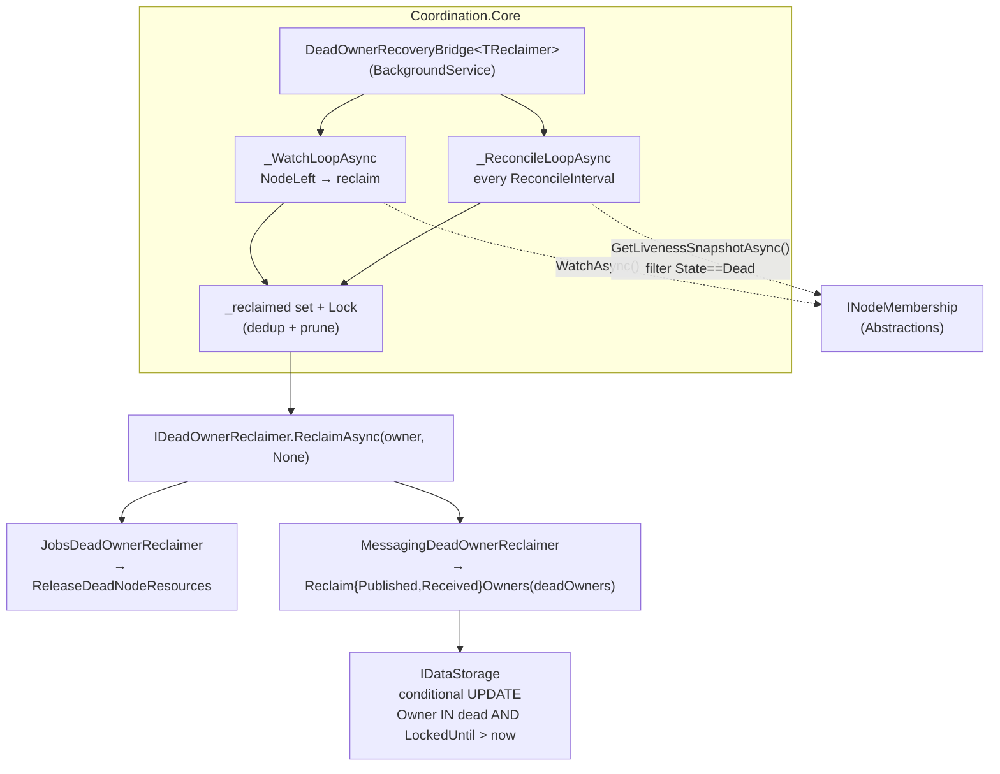
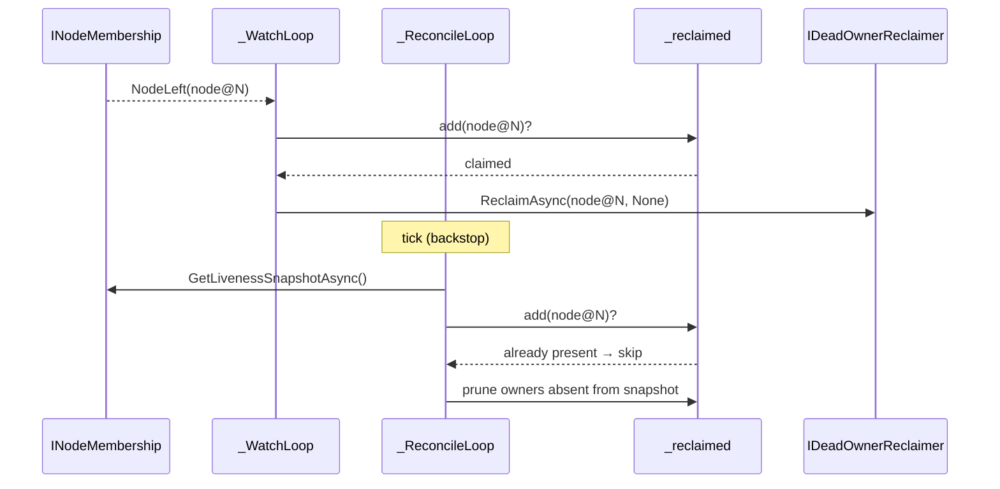

# feat(messaging): Dead-only reclaim + shared Coordination recovery bridge

## Summary

Extract the Jobs dead-owner recovery orchestration into a shared, generic `DeadOwnerRecoveryBridge<TReclaimer>` in Coordination, switch messaging reclaim from live-set-complement to `Dead`-only membership, run the messaging bridge unconditionally, and remove the inline reclaim from the retry processor. Jobs migrates onto the shared bridge with no behavior change. Shipped as one change across Coordination, Jobs, and Messaging.

---

## Problem Frame

Messaging v1 (#421) reclaims dead-owner rows inside `MessageNeedToRetryProcessor` by reading `GetLiveNodesAsync()` (which returns `Alive` only) and reclaiming the complement (`Owner <> ALL(liveOwners)`). That complement includes `Suspected` owners — nodes that are very likely still alive and mid-dispatch — so every transient suspect window (GC pause, thread-pool starvation, brief store/network blip) triggers a reclaim, the row re-dispatches, and the still-alive suspect also completes its dispatch: duplicate delivery on transients, not just on genuine crashes. Recovery latency is also bounded by the retry-poll interval because messaging deferred `WatchAsync`.

Jobs (#422) already solved both with `MembershipRecoveryBridge`: a `BackgroundService` running a `WatchAsync` event loop (reclaim on `NodeLeft`) plus a periodic `Dead`-only liveness-snapshot reconcile, an idempotent in-memory dedup set, snapshot-pruning, and `CancellationToken.None` reclaim writes. Its orchestration is domain-agnostic; only the reclaim sink, the interval, and the logger category differ. Messaging is the second consumer of that exact shape, which is the repo's extract-first trigger (see origin: `docs/brainstorms/2026-06-15-messaging-dead-owner-recovery-parity-requirements.md`).

---

## Requirements

Traced to the origin requirements doc (R/AE IDs are that document's).

**Reclaim semantics**
- R1. Messaging reclaim targets the `Dead` set (`Owner IN deadOwners`), replacing the live-complement predicate across InMemory, PostgreSQL, SQL Server. → U4, U6
- R2. A `Suspected` owner is never reclaimed. → U4, U7 (AE1)
- R3. Reclaim re-dispatches in-flight rows (at-least-once); it does not skip them. → U5, U7 (AE2)
- R4. `LockedUntil` remains the correctness floor; an owner that ages out of the snapshot before reclaim still recovers via normal lease expiry. → U4, U7 (AE4)

**Shared recovery bridge**
- R5. A shared `DeadOwnerRecoveryBridge` lives in Coordination, parameterized by a reclaim action, a reconcile interval, and a logger category; both domains consume it. → U1, U2, U3, U5
- R5a. The messaging bridge is registered unconditionally, independent of `UseStorageLock`. Jobs retains its existing `RequiresCoordinatedMembership` durable-path gate (Jobs has no `UseStorageLock` concept); the migration must not hoist the Jobs registration out of that guard. → U3, U5
- R6. Dual triggers: a `WatchAsync` loop reclaiming on `NodeLeft`, and a periodic `Dead`-only snapshot reconcile as the authoritative backstop; a watch-loop failure degrades to reconcile, not to no recovery. → U2
- R7. Idempotent in-memory dedup of event vs reconcile paths, pruned as identities age out of the snapshot so a future same-id incarnation is never suppressed. → U2 (AE3)
- R8. Jobs' existing `MembershipRecoveryBridge` is refactored onto the shared bridge with its skip-in-flight policy preserved inside its reclaim action and no behavior change. → U3
- R9. Messaging's reclaim action covers both the published and received tables. → U5

**Safety**
- R10. Reclaim writes use `CancellationToken.None`. → U2
- R11. A failed reclaim is logged and removed from the dedup set so the next reconcile retries it. → U2
- R12. A restarted node (new incarnation) is never reclaimed by stale dead-owner state for its prior incarnation. → U7 (AE5)

**Tests and docs**
- R13. Cross-provider conformance through `Headless.Messaging.Core.Tests.Harness`: Suspected-not-reclaimed, Dead-reclaimed, event+reconcile dedup, fast-restart fencing, aged-out-via-floor. → U4, U7
- R14. `docs/llms/messaging.md` and `src/Headless.Messaging.Core/README.md` synced. → U8

---

## Key Technical Decisions

- KTD1. **Reclaim contract is an interface + generic bridge**, not a delegate. `IDeadOwnerReclaimer` (carrying `ReconcileInterval` and `ReclaimAsync(string owner, CancellationToken)`) is implemented per domain; the bridge is `DeadOwnerRecoveryBridge<TReclaimer>`. The closed generic type gives each consumer a distinct `IHostedService` registration and a distinct `ILogger<DeadOwnerRecoveryBridge<TReclaimer>>` category (Jobs vs Messaging log lines stay attributable), and sidesteps the keyed-DI first-wins shadowing documented in `docs/solutions/architecture-patterns/messaging-keyed-di-lock-isolation-2026-05-19.md` by construction — two distinct closed types never collide. A bare delegate would force factory registration and collapse both domains into one logger category.

- KTD2. **The storage flip changes only the owner predicate, not the lease predicate.** The `LockedUntil > now` clause and the terminal-row guard stay verbatim; only `Owner <> ALL(@LiveOwners)` becomes `Owner = ANY(@DeadOwners)` (PostgreSQL), `NOT IN` becomes `IN` (SQL Server), and the InMemory skip-if-live becomes reclaim-if-dead. Messaging's model is floor-plus-accelerate: reclaim fast-forwards leases still in the future; expired leases (`LockedUntil <= now`) are already recovered by normal pickup. The generic lease-floor reading (reclaim where `LockedUntil < now`) is the inverse and does not apply here.

- KTD3. **The messaging bridge runs unconditionally, decoupled from `UseStorageLock`** (see origin Key Decisions). v1 reclaim ran only under the held-lock retry path; the standalone bridge runs per-node concurrently. Cross-node safety rests on the conditional reclaim `UPDATE` being idempotent — after the first reclaim sets `LockedUntil = now`, a peer's `LockedUntil > now` predicate matches zero rows. `UseStorageLock` keeps its separate meaning (serializing retry pickups) and its `false` default.

- KTD4. **`DeadNodeReconcileInterval` is added to `MessagingOptions`**, default `TimeSpan.FromMinutes(1)`, mirroring `JobsOptionsBuilder.DeadNodeReconcileInterval`. The `WatchAsync` path carries low-latency recovery; this is the backstop cadence. `MessagingDeadOwnerReclaimer.ReconcileInterval` returns it.

- KTD5. **`IDeadOwnerReclaimer` goes in `Headless.Coordination.Abstractions`; `DeadOwnerRecoveryBridge<TReclaimer>` goes in `Headless.Coordination.Core`.** Abstractions holds the contract (both consumers already reference it); Core holds the concrete `BackgroundService` (it already hosts `MembershipHeartbeatBackgroundService`). Consequence: `Headless.Jobs.Core` and `Headless.Messaging.Core` each gain a `Headless.Coordination.Core` package reference. This is the cost of sharing concrete infrastructure; placing a `BackgroundService` in an Abstractions package would violate the contracts-only convention.

- KTD6. **Reclaim writes pass `CancellationToken.None`** so a reclaim racing host shutdown is not torn mid-write, carried verbatim from the Jobs bridge and `docs/solutions/logic-errors/terminal-state-overwrite-on-redelivery-2026-05-16.md`.

---

## High-Level Technical Design

The bridge orchestration is a generalize-and-relocate of `src/Headless.Jobs.Core/Coordination/MembershipRecoveryBridge.cs` — the dual loop, dedup set, prune, and KTD6 write move verbatim; only the reclaim sink is parameterized.



Event vs reconcile timing (both paths converge on the dedup set, so a `Dead` owner is reclaimed once):



---

## Output Structure

New and changed files (per-unit `**Files:**` remain authoritative):

```text
src/Headless.Coordination.Abstractions/
  IDeadOwnerReclaimer.cs                      (U1)
src/Headless.Coordination.Core/
  DeadOwnerRecoveryBridge.cs                  (U2)  generic + DeadOwnerRecoveryBridgeLog
src/Headless.Jobs.Core/Coordination/
  JobsDeadOwnerReclaimer.cs                   (U3)  (MembershipRecoveryBridge.cs deleted)
src/Headless.Messaging.Core/Coordination/
  MessagingDeadOwnerReclaimer.cs             (U5)
tests/Headless.Coordination.Core.Tests.Unit/
  DeadOwnerRecoveryBridgeTests.cs             (U2)
tests/Headless.Messaging.Core.Tests.Harness/
  DeadOwnerReclaimConformanceTests.cs         (U7)
```

---

### U1. Define the shared reclaim contract

- **Goal:** Introduce `IDeadOwnerReclaimer` — the per-domain reclaim sink the bridge drives.
- **Requirements:** R5
- **Dependencies:** none
- **Files:** `src/Headless.Coordination.Abstractions/IDeadOwnerReclaimer.cs`
- **Approach:** `public` interface with `TimeSpan ReconcileInterval { get; }` and `Task ReclaimAsync(string owner, CancellationToken cancellationToken)`. `owner` is the `NodeIdentity.ToString()` form (`node@incarnation`). Mark `[PublicAPI]` — it is referenced across packages but each implementation is internal. No `IMembershipEventSource`/snapshot concerns leak here; the bridge owns those.
- **Patterns to follow:** existing single-method coordination contracts in `src/Headless.Coordination.Abstractions/` (e.g. `INodeMembership.cs`).
- **Test expectation:** none — contract only; behavior is exercised through U2/U3/U5.
- **Verification:** Coordination.Abstractions compiles; the interface is `public` and documented.

### U2. Extract `DeadOwnerRecoveryBridge<TReclaimer>` into Coordination.Core

- **Goal:** Move the Jobs bridge orchestration into a generic, sink-agnostic `BackgroundService`.
- **Requirements:** R5, R6, R7, R10, R11
- **Dependencies:** U1
- **Files:**
  - `src/Headless.Coordination.Core/DeadOwnerRecoveryBridge.cs` (create — generic class + `DeadOwnerRecoveryBridgeLog`)
  - `tests/Headless.Coordination.Core.Tests.Unit/DeadOwnerRecoveryBridgeTests.cs` (create)
  - `src/Headless.Coordination.Core/Headless.Coordination.Core.csproj` (verify `Microsoft.Extensions.Hosting.Abstractions` available — already used by `MembershipHeartbeatBackgroundService`)
- **Approach:** `internal sealed class DeadOwnerRecoveryBridge<TReclaimer>(INodeMembership membership, TReclaimer reclaimer, TimeProvider timeProvider, ILogger<DeadOwnerRecoveryBridge<TReclaimer>> logger) : BackgroundService where TReclaimer : IDeadOwnerReclaimer`. Lift verbatim from `src/Headless.Jobs.Core/Coordination/MembershipRecoveryBridge.cs`: `ExecuteAsync` running `Task.WhenAll(_WatchLoopAsync, _ReconcileLoopAsync)`; `_WatchLoopAsync` over `membership.WatchAsync` handling `NodeLeft` only; `_ReconcileLoopAsync` delaying `reclaimer.ReconcileInterval` then `ReconcileOnceAsync`; `ReconcileOnceAsync` building `deadOwners` from snapshot `State == Dead`, pruning `_reclaimed` of owners absent from the snapshot, then reclaiming each `Dead` identity; `_TryReclaimAsync` atomically claiming via the `Lock`-guarded `HashSet<string>`, calling `reclaimer.ReclaimAsync(owner, CancellationToken.None)`, and removing the owner from the set on exception. `DeadOwnerRecoveryBridgeLog` keeps EventIds 1–3 (`MembershipWatchFailed`, `DeadNodeReconcileFailed`, `DeadNodeReclaimFailed`) restarting at 1 (per-class local convention). The bridge stays `internal` — consumers register closed generics from their own assemblies; confirm at implementation time whether `InternalsVisibleTo` or `public` is required for `AddHostedService<DeadOwnerRecoveryBridge<TReclaimer>>` to bind from Jobs/Messaging (see Open Questions).
- **Execution note:** characterization-first — port the existing bridge behavior, then assert it with tests using a fake `IDeadOwnerReclaimer`.
- **Patterns to follow:** `src/Headless.Jobs.Core/Coordination/MembershipRecoveryBridge.cs` (source); `src/Headless.Coordination.Core/MembershipHeartbeatBackgroundService.cs` (Core `BackgroundService` + `TimeProvider.Delay` shape); `[LoggerMessage]` source-gen shape from `src/Headless.Coordination.Core/Internal/LoggerExtensions.cs`; **`tests/Headless.Jobs.Tests.Unit/Coordination/MembershipRecoveryBridgeTests.cs`** — the existing 7-fact suite (NodeLeft reclaim, Suspected-not-reclaimed, dedup, incarnation-5→6 prune, throw-then-retry) and its settable-`Snapshot` `FakeMembership` double are the direct port source for the new tests.
- **Test suite design:** unit, in `tests/Headless.Coordination.Core.Tests.Unit`, porting the scenarios and the controllable-membership double from `MembershipRecoveryBridgeTests.cs` and substituting a recording fake `IDeadOwnerReclaimer` for the Jobs manager. Use `FakeTimeProvider` for the reconcile cadence. No real store — this unit proves orchestration, not the SQL predicate (that is U4). If `tests/Headless.Coordination.Core.Tests.Unit` does not yet exist, create it.
- **Test scenarios:**
  - Happy: a snapshot with one `Dead` identity → `ReclaimAsync` called once for it; an `Alive`/`Suspected` identity in the same snapshot → never passed to `ReclaimAsync`.
  - `WatchAsync` emits `NodeLeft(x)` → `ReclaimAsync(x)` once; `NodeSuspected`/`NodeRecovered`/`NodeJoined` → no reclaim.
  - Covers AE3. Event then reconcile for the same `Dead` owner → `ReclaimAsync` invoked exactly once (dedup set).
  - Edge: an owner reclaimed in a prior tick that has left the snapshot is pruned, so the same `node@incarnation` reappearing later is reclaimed again (prune correctness).
  - Error: `ReclaimAsync` throws → failure logged (EventId 3), owner removed from `_reclaimed`, next reconcile retries it.
  - Cancellation: `ReclaimAsync` receives `CancellationToken.None` even when `stoppingToken` is already cancelled; a cancelled watch loop logs nothing and lets reconcile continue.
- **Verification:** the new unit tests pass; the bridge contains no Jobs- or Messaging-specific types.

### U3. Migrate Jobs onto the shared bridge

- **Goal:** Replace `MembershipRecoveryBridge` with `DeadOwnerRecoveryBridge<JobsDeadOwnerReclaimer>`, no behavior change.
- **Requirements:** R5, R5a, R8
- **Dependencies:** U1, U2
- **Files:**
  - `src/Headless.Jobs.Core/Coordination/JobsDeadOwnerReclaimer.cs` (create)
  - `src/Headless.Jobs.Core/Coordination/MembershipRecoveryBridge.cs` (delete)
  - `tests/Headless.Jobs.Tests.Unit/Coordination/MembershipRecoveryBridgeTests.cs` (delete — it constructs `new MembershipRecoveryBridge(...)` and references `MembershipRecoveryBridgeLog`, so it breaks the build once the type is gone; its scenarios are ported to U2's `DeadOwnerRecoveryBridgeTests`)
  - `src/Headless.Jobs.Core/DependencyInjection/JobsServiceExtensions.cs` (registration at the current `AddHostedService<MembershipRecoveryBridge>` site, ~line 149)
  - `src/Headless.Jobs.Core/Headless.Jobs.Core.csproj` (add `Headless.Coordination.Core` reference)
- **Approach:** `internal sealed class JobsDeadOwnerReclaimer(IInternalJobManager internalJobManager, SchedulerOptionsBuilder optionsBuilder) : IDeadOwnerReclaimer` with `ReconcileInterval => optionsBuilder.DeadNodeReconcileInterval` and `ReclaimAsync(owner, ct) => internalJobManager.ReleaseDeadNodeResources(owner, ct)`. Inject `SchedulerOptionsBuilder` (the type the existing `MembershipRecoveryBridge` takes and the type that declares `DeadNodeReconcileInterval`), not the generic `JobsOptionsBuilder<TTimeJob,TCronJob>`. The skip-in-flight policy is unchanged — it lives entirely inside `ReleaseDeadNodeResources`. Registration becomes `services.AddSingleton<JobsDeadOwnerReclaimer>(); services.AddHostedService<DeadOwnerRecoveryBridge<JobsDeadOwnerReclaimer>>();` under the same `RequiresCoordinatedMembership` guard. The old `MembershipRecoveryBridgeLog` EventIds now live on `DeadOwnerRecoveryBridgeLog` (U2); confirm no other code references the deleted type.
- **Execution note:** characterization — the existing Jobs coordination tests are the no-behavior-change safety net; run them before and after.
- **Patterns to follow:** the deleted bridge's constructor wiring; existing `AddHostedService` + `AddSingleton` registrations in `JobsServiceExtensions.cs`.
- **Test suite design:** reuse — the existing Jobs+Coordination integration suite (`tests/Headless.Jobs.EntityFramework.Tests.Harness` and its provider integration projects) must pass unchanged. The Jobs-unit bridge suite (`MembershipRecoveryBridgeTests.cs`) is deleted, not retargeted: its orchestration scenarios are owned by U2's `DeadOwnerRecoveryBridgeTests` (the bridge logic is no longer Jobs-specific). The Jobs reclaimer's behavior is covered transitively by the integration suite.
- **Test scenarios:** Covers R8. Existing dead-node-recovery Jobs tests (reconcile reclaims a `Dead` owner's resources; `NodeLeft` accelerates; `Suspected` is not reclaimed) pass against the migrated wiring with no edits to their assertions.
- **Verification:** Jobs coordination test suite green; `MembershipRecoveryBridge.cs` gone; no dangling references.

### U4. Flip messaging storage reclaim to the `Dead` set

- **Goal:** Reclaim `Owner IN deadOwners` instead of the live complement, across all three providers.
- **Requirements:** R1, R2, R4
- **Dependencies:** none (parallel with U1–U3)
- **Files:**
  - `src/Headless.Messaging.Core/Persistence/IDataStorage.cs` (rename params `liveOwners` → `deadOwners` on `ReclaimDeadPublishedOwnersAsync`/`ReclaimDeadReceivedOwnersAsync`, ~lines 250, 303)
  - `src/Headless.Messaging.InMemoryStorage/InMemoryDataStorage.cs` (`_ReclaimDeadOwners`, ~lines 781–830)
  - `src/Headless.Messaging.Storage.PostgreSql/PostgreSqlDataStorage.cs` (`_ReclaimDeadOwnersAsync`, ~lines 910–954)
  - `src/Headless.Messaging.Storage.SqlServer/SqlServerDataStorage.cs` (`_ReclaimDeadOwnersAsync`, ~lines 919–952)
  - `tests/Headless.Messaging.Core.Tests.Harness/DataStorageTestsBase.cs` (the existing reclaim conformance scenarios call the renamed methods with a **live**-owner identity as the complement set; the flip inverts their meaning, so every call site must be changed to pass **dead**-owner identities and the assertions adjusted to dead-set semantics. Add AE4 coverage — currently absent — that a dead owner's row with `LockedUntil <= now` is left untouched by reclaim.)
  - provider integration projects extending `DataStorageTestsBase` (`Headless.Messaging.Storage.{PostgreSql,SqlServer}.Tests.Integration`, plus the InMemory unit binding) inherit the flipped scenarios with no per-provider duplication
- **Approach:** Flip only the owner clause (KTD2). InMemory: reclaim when `deadOwnerSet.Contains(message.Owner)` (was: skip when `liveOwnerSet.Contains`). PostgreSQL: `"Owner" = ANY(@DeadOwners)` (was `<> ALL(@LiveOwners)`). SQL Server: `Owner IN ({deadOwnerParams})` (was `NOT IN`). Keep `LockedUntil > @Now` and `_TerminalRowGuardSimple` unchanged. Keep the empty-set early return, but **rewrite its in-code comment**: today it guards the vacuous-`TRUE` case (`Owner <> ALL(ARRAY[])` reclaims every leased row); after the flip an empty `deadOwners` set trivially matches zero rows, so the early return is an optimization, not a safety guard — carrying the old ALL/NOT-IN rationale verbatim ships a false comment into all three providers.
- **Patterns to follow:** the existing `_ReclaimDeadOwners`/`_ReclaimDeadOwnersAsync` methods and `_TerminalRowGuardSimple` constants; provider parity discipline in `docs/solutions/logic-errors/terminal-state-overwrite-on-redelivery-2026-05-16.md`.
- **Test suite design:** integration per provider (real store), plus InMemory unit. Storage-predicate correctness is provider-specific (`ANY`/`IN`/set-membership) and cannot be proven by mocks — exercise each backend.
- **Test scenarios:**
  - Covers AE2. A `Dead` owner's row with `LockedUntil > now` → `LockedUntil` pulled to now; row count returned.
  - Covers AE1. An owner NOT in `deadOwners` (the live/suspect case) → row untouched.
  - Covers AE4. A dead owner's row already past its lease (`LockedUntil <= now`) → untouched by reclaim (the floor owns it).
  - Edge: terminal row (`Succeeded`/`Failed` with null `NextRetryAt`) owned by a dead owner → untouched (terminal guard).
  - Edge: empty `deadOwners` → 0 rows, no UPDATE issued.
  - Integration (concurrency): two sequential reclaims of the same `Dead` owner → first returns N, second returns 0 (idempotent conditional UPDATE; proves the per-node concurrency claim in KTD3).
- **Verification:** InMemory unit + PostgreSQL + SQL Server integration tests pass; the three predicates are owner-set-membership with the lease clause intact.

### U5. Add the messaging reclaimer, interval option, and unconditional registration

- **Goal:** Wire `DeadOwnerRecoveryBridge<MessagingDeadOwnerReclaimer>` into messaging, always-on.
- **Requirements:** R3, R5, R5a, R9
- **Dependencies:** U1, U2, U4
- **Files:**
  - `src/Headless.Messaging.Core/Coordination/MessagingDeadOwnerReclaimer.cs` (create)
  - `src/Headless.Messaging.Core/Configuration/MessagingOptions.cs` (add `DeadNodeReconcileInterval`, near the existing `TimeSpan` options ~lines 198–222)
  - `src/Headless.Messaging.Core/Setup.cs` (register reclaimer + hosted bridge in `AddHeadlessMessaging`, near the IProcessor block ~lines 336–351)
  - `src/Headless.Messaging.Core/Headless.Messaging.Core.csproj` (add `Headless.Coordination.Core` reference)
  - `tests/Headless.Messaging.Core.Tests.Unit/...` (reclaimer unit test)
- **Approach:** `MessagingDeadOwnerReclaimer` resolves the storage connection through the same abstraction the retry processor used (`IDataStorage` / its connection factory) and, in `ReclaimAsync(owner, ct)`, calls both `ReclaimDeadPublishedOwnersAsync([owner], CancellationToken.None)` and `ReclaimDeadReceivedOwnersAsync([owner], CancellationToken.None)` (KTD6 — the bridge already passes `None`; the reclaimer must not re-thread `ct` into a cancellable token). `ReconcileInterval => _options.Value.DeadNodeReconcileInterval`. `DeadNodeReconcileInterval` defaults to `TimeSpan.FromMinutes(1)` (KTD4). Registration is unconditional (KTD3): `services.AddSingleton<MessagingDeadOwnerReclaimer>(); services.AddHostedService<DeadOwnerRecoveryBridge<MessagingDeadOwnerReclaimer>>();` — no `UseStorageLock` guard.
- **Patterns to follow:** `JobsDeadOwnerReclaimer` (U3) for the sink shape; existing `MessagingOptions` interval properties + their validator if any; the IProcessor/hosted-service registration block in `Setup.cs`; existing `MessagingDeadOwnerRowsReclaimed`/`MessagingDeadOwnerReclaimFailed` log messages in `src/Headless.Messaging.Core/Internal/LoggerExtensions.cs` (reuse for per-table reclaim logging).
- **Test suite design:** unit for the reclaimer (recording fake `IDataStorage` asserting both tables hit with the single dead owner and `CancellationToken.None`); end-to-end behavior is U7.
- **Test scenarios:**
  - Covers R9. `ReclaimAsync("node@5")` → exactly one published-table and one received-table reclaim call, each with `["node@5"]` and `CancellationToken.None`.
  - `ReconcileInterval` reflects a configured `DeadNodeReconcileInterval`.
  - Registration: resolving `IEnumerable<IHostedService>` from a messaging container includes `DeadOwnerRecoveryBridge<MessagingDeadOwnerReclaimer>` regardless of `UseStorageLock`.
- **Verification:** reclaimer unit tests pass; the bridge is registered unconditionally; `DeadNodeReconcileInterval` is bindable and defaulted.

### U6. Remove the inline reclaim from the retry processor

- **Goal:** Delete the v1 reclaim path now that the bridge owns recovery.
- **Requirements:** R1 (mechanism replacement)
- **Dependencies:** U5
- **Files:** `src/Headless.Messaging.Core/Processor/IProcessor.NeedRetry.cs`
- **Approach:** Remove `_GetLiveOwnersForReclaimAsync` (~306–352), `_TryReclaimDeadOwnersAsync` (~354–394), `LiveOwnersForReclaimCache` (~396–418), the `liveOwnersForReclaim` construction in `ProcessAsync` (~151–153) and its plumbing through `_ProcessPublishedAsync`/`_ProcessReceivedAsync` (~258–263, 296–301), the `_consecutiveMembershipQueryFailures` field + escalation logging (~62–64, 333–341), and the `DeadThreshold >= DispatchTimeout` invariant comment (~313–320 — no longer the mechanism; the bridge reclaims on `Dead`, which already implies the lease has had its window). Drop the `INodeMembership` constructor dependency if nothing else in the processor uses it (verify). Keep all retry-pickup logic and `IRetryProcessorMonitor`. Remove `CoordinationMembershipQueryFailed`/`CoordinationMembershipQueryFailureEscalated` log methods only if now unreferenced.
- **Execution note:** characterization — run the existing retry-processor tests before and after; they guard pickup behavior. Remove only tests that assert the deleted inline-reclaim path.
- **Patterns to follow:** the current `IProcessor.NeedRetry.cs` structure; remove cleanly without touching adaptive-polling or circuit-breaker logic.
- **Test suite design:** reuse the existing retry-processor unit/integration tests; delete inline-reclaim-specific tests; no new tests (behavior moved, not added — its coverage is U4/U5/U7).
- **Test scenarios:** Covers R1. Existing retry-pickup tests pass unchanged; any test asserting `GetLiveNodesAsync`-driven reclaim is removed or relocated to the bridge/storage suites.
- **Verification:** messaging builds with no `UseStorageLock`-gated reclaim path; retry-processor tests green; no orphaned membership-query code.
- **Risk coordination:** this file is co-edited by the in-flight #320/#296 safety-deadline work (not yet on `origin/main`). See Risks & Dependencies.

### U7. Cross-provider dead-owner reclaim conformance

- **Goal:** Prove the end-to-end messaging recovery semantics across providers via the harness.
- **Requirements:** R12, R13
- **Dependencies:** U5
- **Files:**
  - `tests/Headless.Messaging.Core.Tests.Harness/DeadOwnerReclaimConformanceTests.cs` (create — abstract conformance)
  - `tests/Headless.Messaging.Core.Tests.Harness/ControlledNodeMembership.cs` (create, or extend the existing `TestNodeMembership.cs`) — the **prerequisite** for this unit: the current `TestNodeMembership` returns an empty `GetLivenessSnapshotAsync` and a `yield break` `WatchAsync`, so it models only the v1 `GetLiveNodesAsync` path being deleted. Every scenario below is a vacuous no-op until the double accepts a settable list of `NodeLivenessSnapshot` (with `Dead`/`Suspected`/`Alive` states) and an injectable `NodeLeft` event source (e.g. a `Channel<NodeMembershipEvent>`).
  - `tests/Headless.Messaging.Storage.PostgreSql.Tests.Integration/...` and `tests/Headless.Messaging.Storage.SqlServer.Tests.Integration/...` (provider hookups), plus an InMemory binding
- **Approach:** A `*ConformanceTests` base that hosts a real `DeadOwnerRecoveryBridge<MessagingDeadOwnerReclaimer>` against the controllable membership above and a real provider store, then asserts outbox/inbox row outcomes. The fixture must expose both the membership control surface (to plant `Dead` snapshots / push `NodeLeft`) and the storage (to seed owned rows and read back `LockedUntil`); `MessagingStackFixtureBase` is a component-composition shell and does not provide these today, so the conformance fixture extends it. Each provider supplies its fixture; do not copy-paste the scenarios per provider (CLAUDE.md harness rule).
- **Patterns to follow:** `tests/Headless.Messaging.Core.Tests.Harness/Fixtures/MessagingStackFixtureBase.cs`; the conformance-test split (reconcile is authoritative, watch is best-effort) from `docs/solutions/architecture-patterns/coordination-register-establishes-durable-liveness.md`; the N-concurrent-host shape from `docs/solutions/best-practices/storage-initializer-lifecycle-correctness.md`.
- **Test suite design:** integration harness conformance, owned by `Headless.Messaging.Core.Tests.Harness`, run by each provider's integration project (Docker).
- **Test scenarios:**
  - Covers AE2 / R3. A `Dead` owner's in-flight published+received rows are re-dispatched (at-least-once), not skipped.
  - Covers AE1 / R2. A `Suspected` owner's rows are untouched through both watch and reconcile.
  - Covers AE3 / R7. A `Dead` owner surfaced by both a `NodeLeft` event and the reconcile is reclaimed once.
  - Covers AE5 / R12. `node@N` dead, `node@N+1` live (restart) → `node@N+1`'s rows untouched (incarnation fencing).
  - Covers AE4 / R4. A dead owner that ages out of the snapshot before reclaim → its rows still recover via `LockedUntil` expiry.
  - Concurrency: two bridges (two hosts) reclaiming the same `Dead` owner → rows reclaimed once, no duplicate `LockedUntil` thrash.
- **Verification:** conformance passes on InMemory, PostgreSQL, and SQL Server.

### U8. Docs sync

- **Goal:** Reflect dead-only semantics, the unconditional bridge, and at-least-once re-dispatch.
- **Requirements:** R14
- **Dependencies:** U5, U6
- **Files:** `docs/llms/messaging.md`, `src/Headless.Messaging.Core/README.md` (and a brief Coordination mention of `IDeadOwnerReclaimer`/`DeadOwnerRecoveryBridge` if the Coordination docs surface enumerates recovery).
- **Approach:** Per `docs/authoring/AUTHORING.md`, update both agent-facing surfaces in lockstep: dead-only reclaim (no Suspected reclaim), the always-on bridge decoupled from `UseStorageLock`, `DeadNodeReconcileInterval`, and the `LockedUntil` floor relationship. Remove any v1 text describing live-complement reclaim or the `DeadThreshold >= DispatchTimeout` invariant.
- **Test expectation:** none — documentation.
- **Verification:** drift checks in `docs/authoring/AUTHORING.md` pass; no stale live-complement or invariant references remain.

---

## Scope Boundaries

**Deferred for later** (from origin)
- `UseStorageLock` default stays `false`.
- Leadership election and a messaging dashboard.

**Outside this issue's axis** (from origin)
- `IDistributedLock` lease-lifecycle cleanup (#296) — a different primitive (self lock-loss via `HandleLostToken`), blocked on #289. Disjoint scope; only the `IProcessor.NeedRetry.cs` merge is coordinated.

**Deferred to Follow-Up Work**
- Promoting `IDeadOwnerReclaimer` / `DeadOwnerRecoveryBridge` learnings into `docs/solutions/` via `/x-compound` after merge (the reclaim-sink shape, the dead-set storage flip, the dual-consumer Core reference are not yet documented).

---

## Risks & Dependencies

- **`IProcessor.NeedRetry.cs` merge collision (high).** The in-flight #320/#296 safety-deadline work co-edits this file and is not yet on `origin/main` (this worktree's base). U6 deletes large regions of it. Mitigation: land the two in a known order — coordinate so whichever merges second rebases against the first; keep U6 as the last messaging-core edit so the deletion is easy to re-apply. Flag in the PR description.
- **New `Coordination.Core` dependency for Jobs and Messaging (medium).** KTD5 adds a package reference to both `Headless.Jobs.Core` and `Headless.Messaging.Core`. Verify no version/packaging constraint in `Directory.Packages.props` or SDK config blocks it, and that it introduces no cycle (Coordination.Core must not reference Jobs/Messaging).
- **Concurrent per-node reclaim correctness (medium).** KTD3 rests entirely on the conditional `UPDATE` being idempotent. U4's concurrency scenario and U7's two-bridge test are the load-bearing proof; do not ship without them green.
- **Bridge type visibility (compile prerequisite, was framed low).** `AddHostedService<DeadOwnerRecoveryBridge<TReclaimer>>` is invoked from the Jobs and Messaging assemblies; a non-public generic type is not accessible across assembly boundaries, so U3 and U5 will not compile unless the bridge is made `public` (adds to the Coordination NuGet contract) or `Headless.Coordination.Core.csproj` adds `InternalsVisibleTo` for `Headless.Jobs.Core` and `Headless.Messaging.Core` (its current block lists only database/test assemblies). Settle this at the start of U2, before any registration is written — it is not a deferrable detail.

---

## System-Wide Impact

- **Behavior change (default-on recovery).** Messaging dead-owner recovery becomes active by default (was effectively off unless `UseStorageLock=true`). Operators relying on the prior floor-only default will see accelerated reclaim and `WatchAsync` subscriptions on every node. Documented in U8.
- **Logging.** New `DeadOwnerRecoveryBridge<...>` logger categories (one per domain) replace `MembershipRecoveryBridge`. Dashboards/alerts keyed on the old category name need updating.
- **Hosted services.** One additional `IHostedService` per messaging host; Jobs swaps one hosted-service type for another (count unchanged).

---

## Open Questions (Deferred to Implementation)

- `public` vs `InternalsVisibleTo` for `DeadOwnerRecoveryBridge<TReclaimer>` (and `IDeadOwnerReclaimer` is already `public`). This is a compile prerequisite, not deferrable — see Risks & Dependencies; decide at the start of U2.
- Whether to extend the existing `TestNodeMembership` in place or introduce a shared `ControlledNodeMembership` (and where it lives — the messaging harness vs. a Coordination test harness both Jobs and Messaging could reuse). The Jobs unit suite already has a `FakeMembership` double; promoting one controllable double would avoid two parallel implementations. Resolve when building U7 (and U2's port).
- The exact storage-connection abstraction `MessagingDeadOwnerReclaimer` resolves to reach both tables (the same path the retry processor used vs. a dedicated unit-of-work). Resolve when reading `IDataStorage`'s connection/transaction surface during U5.
- Whether any `MessagingOptions` validator must cover `DeadNodeReconcileInterval` (e.g. `> TimeSpan.Zero`). Add a validator rule only if other intervals are validated.

---

## Sources & Research

- Origin: `docs/brainstorms/2026-06-15-messaging-dead-owner-recovery-parity-requirements.md`.
- Extraction source: `src/Headless.Jobs.Core/Coordination/MembershipRecoveryBridge.cs`; Jobs interval `src/Headless.Jobs.Abstractions/JobsOptionsBuilder.cs`; sink `src/Headless.Jobs.Abstractions/Interfaces/Managers/IInternalJobManager.cs`.
- Messaging reclaim caller: `src/Headless.Messaging.Core/Processor/IProcessor.NeedRetry.cs`; storage contract `src/Headless.Messaging.Core/Persistence/IDataStorage.cs`; predicates in `InMemoryDataStorage.cs`, `PostgreSqlDataStorage.cs`, `SqlServerDataStorage.cs`.
- Coordination abstractions: `src/Headless.Coordination.Abstractions/{INodeMembership,NodeLivenessSnapshot,NodeLivenessState,NodeIdentity}.cs`, `Events/{IMembershipEventSource,NodeMembershipEvent}.cs`.
- Learnings: `docs/solutions/architecture-patterns/messaging-keyed-di-lock-isolation-2026-05-19.md` (KTD1); `docs/solutions/logic-errors/terminal-state-overwrite-on-redelivery-2026-05-16.md` (KTD2, KTD6); `docs/solutions/architecture-patterns/coordination-register-establishes-durable-liveness.md` (fencing, reconcile-vs-watch test split); `docs/solutions/best-practices/storage-initializer-lifecycle-correctness.md` (concurrent-host conformance shape).
- Harness: `tests/Headless.Messaging.Core.Tests.Harness/Fixtures/MessagingStackFixtureBase.cs`.
