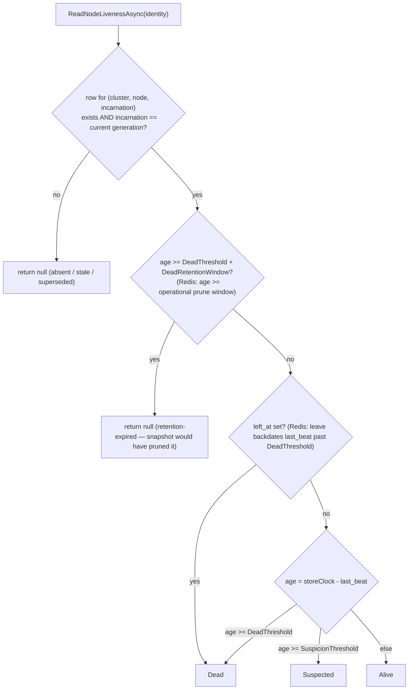
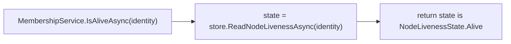

# perf(coordination): targeted single-node liveness via ReadNodeLivenessAsync SPI

## Summary

Add a targeted single-node liveness method to the `IMembershipStore` provider SPI so a per-request consumer can ask "what state is *this* node in?" with one guarded single-row query instead of a full cluster-wide snapshot read plus LINQ filter. The relational providers gain a single-row SELECT, Redis a small read-only Lua, the in-memory fake an equivalent, and `MembershipService.IsAliveAsync` is rewired to delegate. A cross-provider conformance test pins parity with the existing snapshot path.

---

## Problem Frame

`MembershipService.IsAliveAsync` (`src/Headless.Coordination.Core/MembershipService.cs`) and `GetLiveNodesAsync` both call `GetLivenessSnapshotAsync`, which calls `store.ReadLivenessAsync` — a full liveness projection over every known node in the cluster, classified and ordered, then filtered in C# (`snapshots.Any(s => s.Identity == identity && s.State == Alive)`). A per-request consumer that calls `IsAliveAsync` to validate a stamped `node@incarnation` before acting therefore triggers O(nodes · rps) full reads. On the relational providers the snapshot read also runs a best-effort full-table prune; on Redis it runs an opportunistic prune plus generation-mirror backfill — none of which a single-node liveness check needs.

This was surfaced by code review of #416 and routed to follow-up (#418) because the fix touches the provider SPI plus all three providers plus the fake plus service wiring — too invasive to land inside that review's fixer pass. There is no upstream brainstorm document; scope was confirmed interactively.

---

## Requirements

- R1. The membership store SPI exposes a targeted method returning the classified liveness state of a single `NodeIdentity` without reading other nodes.
- R2. The targeted check returns exactly what the existing snapshot path would conclude for that identity: current-generation membership only, the same Alive/Suspected/Dead classification, the same store-clock authority, and — critically — the same retention boundary. The snapshot read produces "absent" by pruning rows older than `DeadThreshold + DeadRetentionWindow`; the targeted check must reproduce that view (see KTD3).
- R3. An identity resolves to "absent" (`null`) — distinct from any present state — in all the cases the snapshot path omits it: incarnation is not the current generation (stale, superseded, never registered), **or** the liveness row's age is at or beyond the retention boundary (`DeadThreshold + DeadRetentionWindow`; Redis: the operational prune window) even if no prune has physically deleted it yet.
- R4. `MembershipService.IsAliveAsync` derives its boolean from the targeted method and no longer issues a full snapshot read.
- R5. The targeted path performs no full-table prune and no generation-mirror backfill; it stays a bounded single-row/single-member operation.
- R6. All three providers (PostgreSql, SqlServer, Redis) and the in-memory fake implement the new method; cross-provider conformance proves identical observable behavior.
- R7. `GetLiveNodesAsync` and `GetLivenessSnapshotAsync` behavior is unchanged.

---

## Key Technical Decisions

- KTD1. **Return shape: `ValueTask<NodeLivenessState?> ReadNodeLivenessAsync(NodeIdentity, CancellationToken)`.** `null` means the identity is not a current-generation member (absent / stale / superseded); a non-null value is the store-classified state. This is a richer SPI than the issue's tentative `bool IsAliveAsync` — chosen so the single round-trip is reusable by future consumers that need Suspected-vs-Dead, with the service deriving `IsAlive == (state is NodeLivenessState.Alive)`. The public `INodeMembership.IsAliveAsync` consumer contract keeps its `bool` shape and existing semantics.
- KTD2. **Parity is the contract, not an optimization detail (R2/R3).** The targeted query must mirror the snapshot path's invariants: it filters the liveness row to the **current generation** (`incarnation == current_incarnation`), it classifies with the **store clock** using the same `SuspicionThreshold` / `DeadThreshold` / `left_at` rules, and it applies the same **retention boundary** so that a row at or beyond `DeadThreshold + DeadRetentionWindow` reads as absent (`null`), not `Dead` (see KTD3). A stale or absent incarnation yields no row → `null`, matching the snapshot path which never surfaces non-current incarnations.
- KTD3. **Read-only targeted path; no prune, no backfill — retention enforced as a classification cutoff, not a delete (R5).** The snapshot read produces "absent" *by deleting* rows whose age is at or beyond `DeadThreshold + DeadRetentionWindow` and then classifying the survivors (Dead is classified at `DeadThreshold`). The targeted path must not write, so it cannot delete — but it must still produce the same view. Therefore it applies the retention window as an **outermost read-only cutoff in the classification expression**: when `age >= DeadThreshold + DeadRetentionWindow` (Redis: `age >=` the operational prune window) it returns `null` (absent), and only otherwise does it classify `Dead`/`Suspected`/`Alive`. This reproduces the snapshot's post-prune view exactly while remaining write-free. (Note: the naive "skip the prune and just classify" approach is *unsound* — it would return `Dead` for a retention-expired-but-unpruned row where the snapshot returns absent, breaking the `Dead`-vs-absent distinction the richer SPI exists to serve. Because relational providers prune only on the snapshot read path, and the whole point of this change is that `IsAliveAsync` stops reading the snapshot, such rows can persist unpruned indefinitely — the divergence is structural, not theoretical.) Generation-mirror backfill (Redis) is still skipped; cleanup cadence remains owned by the snapshot read path and the Redis cleanup service.
- KTD4. **Relational shape:** a single-row `SELECT` joining the liveness table to the generation table on `current_incarnation = incarnation`, returning the classified state for the one `(cluster, node, incarnation)` tuple. Reuse the store-clock function and threshold params from `ReadCurrentLivenessCoreAsync`, with the `CASE` extended so the retention boundary (`DeadThreshold + DeadRetentionWindow`) maps to a sentinel that materializes as `null` (absent). No transaction, no locking hints — it is a plain read.
- KTD5. **Redis shape:** a new read-only `RedisMembershipReadNodeLivenessScriptDefinition` that reads the single `:known` member payload, resolves the current generation **the same way the read script does — mirror-first (`hget :known __gen:<node>`), falling back to `get gen:<node>`** — and classifies against `SuspicionThreshold` / `DeadThreshold` plus the operational prune window with server `TIME`. A member at or beyond the prune window returns the absent sentinel (`null`), matching the read script which deletes-and-omits such members. It performs no `hdel` / `zrem` / `hset`. Registered in `CoordinationRedisScriptsInitializer`. (Resolving generation mirror-first rather than `gen:`-only keeps the targeted path byte-for-byte aligned with the snapshot's generation view; reading `gen:` only would diverge if the `gen:` key were lost under eviction while the mirror survived.)
- KTD6. **Build coupling is cross-cutting.** Adding a method to `public interface IMembershipStore` (and an `abstract` core to `DatabaseMembershipStoreBase`) breaks compilation of every implementer until each is updated. Intermediate commits in this PR may be red; the PR builds green at its tip. Sequence U1 → U2 → U3 → U4 accordingly.
- KTD7. **Mandatory abstract method, not a C# default-interface fallback.** An alternative is a default interface method on `IMembershipStore` whose body derives state from the existing snapshot read, letting custom provider authors stay compilable without implementing the optimization. Rejected: this is a *performance* method, and a snapshot-derived default would silently hand custom providers the exact O(nodes) behavior this change exists to eliminate — a latent footgun rather than a safe default. Forcing implementation makes provider authors consciously address the hot path, and it keeps the SPI consistent with its existing all-mandatory shape. The build-coupling and drift costs (KTD6, Risks) are accepted in exchange. Greenfield + CLAUDE.md's "prefer breaking changes over compat layers" reinforces this.

---

## High-Level Technical Design

Every provider implements the same classification decision — this is the parity contract (R2/R3) each `ReadNodeLivenessCoreAsync` / Lua must satisfy:

Service derivation after the rewire:

---

## Implementation Units

### U1. SPI contract, base wrapper, fake store, and service rewire

- **Goal:** Introduce `ReadNodeLivenessAsync` on the SPI, the relational base wrapper + abstract core, the fake implementation, and rewire the service to delegate.
- **Requirements:** R1, R2 (contract), R4, R7.
- **Dependencies:** none.
- **Files:**
  - `src/Headless.Coordination.Core/IMembershipStore.cs` — add `ValueTask<NodeLivenessState?> ReadNodeLivenessAsync(NodeIdentity identity, CancellationToken cancellationToken = default)` with XML-doc stating: the current-generation-only + store-clock + retention-boundary parity contract; that `null` means "absent from the current-generation snapshot view" and deliberately collapses the absence sub-states (never-registered / stale / superseded / retention-expired) — if a future consumer needs to distinguish them, that is an additive extension point, not modeled here.
  - `src/Headless.Coordination.Core.Database/DatabaseMembershipStoreBase.cs` — add the public `ReadNodeLivenessAsync` (cancellation guard, delegate to a new `protected abstract ReadNodeLivenessCoreAsync(string clusterName, NodeIdentity, CancellationToken)`), mirroring the existing wrapper/core split.
  - `src/Headless.Coordination.Core/MembershipService.cs` — rewire `IsAliveAsync` to `var state = await store.ReadNodeLivenessAsync(identity, ct); return state is NodeLivenessState.Alive;` (keep the cancellation check); leave `GetLiveNodesAsync` / `GetLivenessSnapshotAsync` untouched.
  - `tests/Headless.Coordination.Core.Tests.Unit/FakeMembershipStore.cs` — implement `ReadNodeLivenessAsync` from a settable `Dictionary<NodeIdentity, NodeLivenessState?> NodeStates` (default empty → `null`), plus a `ReadNodeLivenessCalls` counter and a `ThrowOnReadNodeLiveness` toggle to mirror the existing fake's controllability.
  - `tests/Headless.Coordination.Core.Tests.Unit/MembershipServiceTests.cs` (the existing service test file) — add `IsAliveAsync` tests driving the new path (the file currently has no `IsAliveAsync` coverage).
- **Approach:** The base remains the cluster-scoping/operation-order owner; the new abstract core receives `clusterName` exactly like the other `*CoreAsync` members. `NullNodeMembership` is unaffected — it implements `INodeMembership`, not `IMembershipStore`, and already returns `false` from `IsAliveAsync`.
- **Patterns to follow:** the wrapper/abstract-core split already in `DatabaseMembershipStoreBase` (`ReadLivenessAsync` → `ReadCurrentLivenessCoreAsync`); the fake's existing settable-field + call-counter style.
- **Execution note:** This unit changes `IMembershipStore` and adds an abstract member to the base, so the relational and Redis provider projects will not compile until U2–U4. Expected; the PR is green at its tip.
- **Test suite design:** Unit-level, in `Headless.Coordination.Core.Tests.Unit`, using `FakeMembershipStore`. The behavioral parity across real backends is owned by the conformance test in U5, not here.
- **Test scenarios:**
  - `IsAliveAsync` returns `true` when the fake's `ReadNodeLivenessAsync` yields `Alive` for the identity.
  - `IsAliveAsync` returns `false` when the fake yields `Suspected`.
  - `IsAliveAsync` returns `false` when the fake yields `Dead`.
  - `IsAliveAsync` returns `false` when the fake yields `null` (absent).
  - `IsAliveAsync` increments `ReadNodeLivenessCalls` and does **not** increment `ReadLivenessCalls` (proves the full-read path is no longer used — covers R4).
  - `IsAliveAsync` throws `OperationCanceledException` when called with an already-cancelled token (cancellation-guard parity with the other service methods).
- **Verification:** `Headless.Coordination.Core.Tests.Unit` compiles and the updated/added service tests pass; `ReadLivenessCalls` assertion proves the rewire.

### U2. PostgreSql targeted single-row state query

- **Goal:** Implement `ReadNodeLivenessCoreAsync` for PostgreSql as a single-row guarded read.
- **Requirements:** R1, R2, R3, R5, R6.
- **Dependencies:** U1.
- **Files:**
  - `src/Headless.Coordination.PostgreSql/PostgreSqlMembershipStore.cs` — add `ReadNodeLivenessCoreAsync`: a single connection, no transaction, a `SELECT` joining `coordination_liveness` to `coordination_node_generation` on `current_incarnation = incarnation` and filtered by `cluster_name`, `node_id`, `incarnation`, returning the classified `state` text via the same `clock_timestamp()` and threshold params used in `ReadCurrentLivenessCoreAsync`, with the `CASE` extended so `last_beat <= clock_timestamp() - @RetentionThreshold` yields no state (absent). No descriptor join is needed (state only). Map no row / retention-expired → `null`; otherwise `Enum.Parse<NodeLivenessState>`.
  - `tests/Headless.Coordination.PostgreSql.Tests.Integration/PostgreSqlMembershipNativeTests.cs` — add provider-native assertions for the SQL-level behavior.
- **Approach:** Reuse the existing parameter set (`ClusterName`, `NodeId`, `Incarnation`, threshold + state-name params) plus a `@RetentionThreshold` = `DeadThreshold + DeadRetentionWindow` matching `_PruneExpiredRowsAsync`. Explicitly do **not** call `_PruneExpiredRowsAsync` (KTD3) — instead the retention boundary is enforced as the outermost read-only branch of the `CASE`, returning the absent sentinel rather than `Dead`. Read-only, so a plain `ExecuteReaderAsync`/`ExecuteScalarAsync` on the projected state column.
- **Patterns to follow:** `ReadCurrentLivenessCoreAsync` SQL shape and parameter binding; the `#pragma warning disable CA2100` envelope already in the file.
- **Test suite design:** Provider-native integration test (real Postgres via Testcontainers) for SQL-specific behavior that the conformance suite does not exercise (e.g., explicit stale-incarnation row → `null`). Cross-provider parity stays in U5.
- **Test scenarios:**
  - Registered, freshly-beaten node → `Alive`.
  - Node aged past `SuspicionThreshold` but below `DeadThreshold` → `Suspected`.
  - Node aged past `DeadThreshold` → `Dead`.
  - Gracefully-left node (`left_at` set) → `Dead`.
  - Identity with a stale incarnation while a newer generation is current → `null` (R3).
  - Identity for a node id that was never registered → `null`.
  - **Retention-expired-but-unpruned → `null`, not `Dead`:** age the row past `DeadThreshold + DeadRetentionWindow` and call `ReadNodeLivenessCoreAsync` *before* any snapshot read (so no prune has physically run); assert `null` (R2/R3, the parity-critical case — proves the classification cutoff, not the delete, produces absence).
  - The call issues no DELETE (prune) — assert row counts are unchanged after the call, including for the retention-expired case above (R5).
- **Verification:** `Headless.Coordination.PostgreSql.Tests.Integration` builds and the new native tests pass against the Testcontainers Postgres.

### U3. SqlServer targeted single-row state query

- **Goal:** Implement `ReadNodeLivenessCoreAsync` for SqlServer as a single-row guarded read.
- **Requirements:** R1, R2, R3, R5, R6.
- **Dependencies:** U1.
- **Files:**
  - `src/Headless.Coordination.SqlServer/SqlServerMembershipStore.cs` — add `ReadNodeLivenessCoreAsync`: a `SELECT` joining `liveness` to `generation` on `current_incarnation = incarnation`, filtered by cluster/node/incarnation, returning the `CASE`-classified state using `DATEDIFF_BIG(millisecond, ...)` + `SYSUTCDATETIME()` and the millisecond threshold params, matching `ReadCurrentLivenessCoreAsync`, with the `CASE` extended so age `>= @RetentionThresholdMs` (= `DeadThreshold + DeadRetentionWindow`) yields the absent sentinel. No row / retention-expired → `null`.
  - `tests/Headless.Coordination.SqlServer.Tests.Integration/SqlServerMembershipNativeTests.cs` — add provider-native assertions.
- **Approach:** Plain read — **do not** wrap in the `SERIALIZABLE` transaction or the deadlock-retry pipeline used by the write paths, and **do not** call `_PruneExpiredRowsAsync` (KTD3); the retention boundary is enforced as the outermost read-only `CASE` branch using `@RetentionThresholdMs` (the same value `_PruneExpiredRowsAsync` uses). This is a non-locking single-row classification read.
- **Patterns to follow:** `ReadCurrentLivenessCoreAsync` SQL + `_ToMilliseconds` threshold params; `_Qualified` for schema-qualified table names; the `CA2100` envelope.
- **Test suite design:** Provider-native integration test (Testcontainers SqlServer) for SQL-specific behavior; parity in U5.
- **Test scenarios:** same matrix as U2 (Alive / Suspected / Dead-by-age / Dead-by-leave / stale-incarnation → null / never-registered → null / **retention-expired-but-unpruned read-first → null** / no prune side-effect), against SqlServer semantics.
- **Verification:** `Headless.Coordination.SqlServer.Tests.Integration` builds and the new native tests pass against the Testcontainers SqlServer.

### U4. Redis targeted state Lua

- **Goal:** Implement a read-only single-member state lookup for Redis.
- **Requirements:** R1, R2, R3, R5, R6.
- **Dependencies:** U1.
- **Files:**
  - `src/Headless.Coordination.Redis/Scripts/RedisMembershipReadNodeLivenessScriptDefinition.cs` — new read-only script + `ReadNodeLivenessParams` record: read the single `:known` member payload for `node@incarnation`; resolve the node's current generation **mirror-first (`hget @knownKey __gen:<nodeId>`), falling back to `get @genKeyPrefix .. nodeId`** — identical to how `RedisMembershipReadScriptDefinition` resolves it; confirm `current == incarnation`; parse `last_beat_ms`; classify against `softMs` (Suspicion) / `hardMs` (Dead) with server `TIME`, returning the absent sentinel when `ageMs >= pruneMs` (the operational prune window — matches the read script's delete-and-omit). Return a nil/sentinel when the member is absent, not current-generation, or retention-expired. **No** `hdel` / `zrem` / `hset`.
  - `src/Headless.Coordination.Redis/RedisMembershipStore.cs` — add `ReadNodeLivenessAsync` invoking the new script, mapping the result (state string or absent sentinel) to `NodeLivenessState?`.
  - `src/Headless.Coordination.Redis/CoordinationRedisScriptsInitializer.cs` — register `RedisMembershipReadNodeLivenessScriptDefinition.Instance` in `_Definitions`.
  - `tests/Headless.Coordination.Redis.Tests.Integration/RedisMembershipLuaTests.cs` — add Lua-level assertions.
- **Approach:** Mirror `RedisMembershipReadScriptDefinition` exactly on the two parity-sensitive points — generation resolution (mirror-first, `gen:` fallback) and the prune-window boundary (`_OperationalPruneMilliseconds`, i.e. `max(DeadThreshold + DeadRetentionWindow, RedisKnownNodeRetention)`) — reduced to a single member. Note Redis has no `left_at`: graceful leave backdates `last_beat` past `hardMs`, so Dead-by-leave falls out of the age classification with no special case. Because the script does no writes, it does not require routing to a writable primary the way `ReadLivenessAsync` does — but keep it on the default `IDatabase` for simplicity unless replica routing is already configured. Reuse `RedisMembershipStore`'s existing key/param helpers (`_KnownKey`, `_GenKeyPrefix`, `_GenerationFieldPrefix`, `_OperationalPruneMilliseconds`, `_ToMilliseconds`, identity `ToString()`).
- **Patterns to follow:** `RedisMembershipReadScriptDefinition` (classification, generation resolution, `__gen:` mirror handling) reduced to a single member; `RedisScriptDefinition` + `[StructLayout(LayoutKind.Auto)]` param-record convention; the heartbeat-script param style.
- **Test suite design:** Provider-native integration test (Testcontainers Redis) for Lua-specific behavior — especially that the script performs no pruning writes (R5) and that the `__gen:` mirror vs `gen:` key resolution gives the same answer the snapshot read would. Parity in U5.
- **Test scenarios:**
  - Registered, freshly-beaten member → `Alive`.
  - Member aged into the Suspicion band → `Suspected`.
  - Member aged past Dead → `Dead`.
  - Gracefully-left member → `Dead`.
  - Stale incarnation while a newer generation is current → `null` (R3).
  - Never-registered member → `null`.
  - Retention-expired-but-unpruned member (`ageMs >= pruneMs`) read *before* any snapshot/cleanup tick → `null`, not `Dead` (parity-critical — proves the prune-window cutoff in the script).
  - After the call, the `:known` hash and `:live` zset are byte-for-byte unchanged for an expired-but-unpruned member (proves no prune/backfill writes — R5).
- **Verification:** `Headless.Coordination.Redis.Tests.Integration` builds; the script loads via the initializer; new Lua tests pass against the Testcontainers Redis.

### U5. Cross-provider conformance for targeted state

- **Goal:** Pin identical observable behavior across all three providers, including parity with the snapshot path.
- **Requirements:** R2, R3, R6, R7.
- **Dependencies:** U2, U3, U4.
- **Files:**
  - `tests/Headless.Coordination.Tests.Harness/MembershipConformanceTests.cs` — add `virtual` conformance scenarios that resolve `IMembershipStore` from the node's `Services` (as `should_reject_stale_and_impossible_heartbeats_with_generation_guard` already does) and call `ReadNodeLivenessAsync` directly, plus scenarios driving `INodeMembership.IsAliveAsync` end-to-end.
  - `tests/Headless.Coordination.PostgreSql.Tests.Integration/PostgreSqlMembershipConformanceTests.cs` — add `[Fact] public override` overrides for the new scenarios.
  - `tests/Headless.Coordination.SqlServer.Tests.Integration/SqlServerMembershipConformanceTests.cs` — same overrides.
  - `tests/Headless.Coordination.Redis.Tests.Integration/RedisMembershipConformanceTests.cs` — same overrides.
- **Approach:** Mirror the existing harness style (`_Cluster()` isolation, `fixture.CreateNodeAsync`, `AbortToken`, the timing constants `SuspicionThreshold` / `DeadButRetainedWait`). The headline parity test reads the full snapshot and the targeted state for the same identity and asserts they agree.
- **Patterns to follow:** the existing `MembershipConformanceTests<TFixture>` virtual-method + per-provider `override` wiring; the timing-constant helpers in `CoordinationFixtureExtensions`.
- **Test suite design:** Cross-provider conformance in the harness, overridden in each of the three leaf integration projects — the established mechanism for "same observable behavior must hold for each provider." No new harness infrastructure is required.
- **Test scenarios:**
  - `ReadNodeLivenessAsync` returns `Alive` for a freshly-registered node before any extra heartbeat.
  - `ReadNodeLivenessAsync` returns `Suspected` for a node aged into the suspicion band (`SuspicionThreshold` ≤ age < `DeadThreshold`) — pins cross-provider parity for the middle state, which the per-provider native tests cover individually but the harness must also assert uniformly (R2).
  - `ReadNodeLivenessAsync` returns `Dead` for a node past the dead-but-retained window (mirrors `should_return_dead_snapshot_before_retention_prune`).
  - `ReadNodeLivenessAsync` returns `null` for a superseded prior incarnation while the current incarnation returns `Alive` (R3, mirrors `should_filter_operational_reads_to_current_generation`).
  - `ReadNodeLivenessAsync` returns `Dead` after graceful leave.
  - **Retention parity (order-sensitive):** for an identity aged past `DeadThreshold + DeadRetentionWindow`, call `ReadNodeLivenessAsync` **first** and assert `null` — *before* any `GetLivenessSnapshotAsync` call, because the snapshot read prunes the row as a side effect and would mask the divergence. This is the scenario that catches the original "skip-the-prune returns Dead where snapshot returns absent" gap (R2/R3).
  - **Full-state parity:** for an identity inside the retention window, `ReadNodeLivenessAsync(identity)` equals `(await GetLivenessSnapshotAsync()).FirstOrDefault(s => s.Identity == identity)?.State` — i.e. agreement across all three states and `null`-iff-absent, not just the `Alive` case (R2/R7).
  - `IsAliveAsync` end-to-end returns `true` for a live current node and `false` for a Suspected current node, a Dead node, and a superseded incarnation.
- **Verification:** all three leaf integration projects build and the new conformance overrides pass against their Testcontainers backends.

### U6. Documentation sync

- **Goal:** Reflect the SPI addition and the consumer-visible performance characteristic in the agent-facing docs.
- **Requirements:** R1, R4 (consumer-visible behavior).
- **Dependencies:** U1.
- **Files:**
  - `docs/llms/coordination.md` — note that `IsAliveAsync` is a targeted single-node check (O(1), not a cluster snapshot), and that the provider SPI requires `ReadNodeLivenessAsync` with the current-generation + store-clock parity contract.
  - `src/Headless.Coordination.Core/README.md` — keep in lockstep with the llms doc per the authoring rule; add the SPI method to any membership-engine description.
  - `src/Headless.Coordination.Abstractions/README.md` — only if it enumerates the SPI surface; otherwise leave untouched.
- **Approach:** Follow `docs/authoring/AUTHORING.md` drift checks; the two surfaces (`docs/llms/coordination.md` and the package README) must stay paired. Docs explain the concept (targeted vs snapshot, why the targeted path skips prune), not just the signature.
- **Test suite design:** none — documentation only.
- **Test scenarios:** Test expectation: none -- documentation-only unit.
- **Verification:** `docs/llms/coordination.md` and the Core README describe `ReadNodeLivenessAsync` and the faster `IsAliveAsync`; no stale claim that `IsAliveAsync` reads the full snapshot.

---

## Scope Boundaries

- In scope: the `IMembershipStore` SPI addition, the relational base + Postgres + SqlServer + Redis + fake implementations, the `MembershipService.IsAliveAsync` rewire, cross-provider conformance, and the doc sync.
- Out of scope — `INodeMembership` consumer contract shape: it already exposes `IsAliveAsync` returning `bool`; only its internals change. No public consumer-facing signature changes.
- Out of scope — any caching/memoization of liveness results: the targeted query is the optimization; a cache layer is a separate concern with its own staleness trade-offs.

### Deferred to Follow-Up Work

- Sibling issue #417 (Redis O(N) snapshot `GET`s on the full read path) is a distinct optimization of `ReadLivenessAsync`, not the targeted single-node path; it is not addressed here.

---

## Risks & Dependencies

- Classification drift between the targeted query and the snapshot path would silently violate parity (R2) — most dangerously on the retention boundary, where the snapshot produces absence by *deleting* and the targeted path must produce it by *classifying* (KTD3). Mitigation: every provider reuses its existing threshold/`CASE`/Lua classification and adds the retention cutoff using the same value its prune predicate uses; the U5 retention-parity scenario reads the targeted path *first* (before the snapshot's destructive prune) so the divergence is observable rather than masked.
- Cross-cutting build breakage from the interface change (KTD6). Mitigation: sequence U1 → U2 → U3 → U4 and treat the PR as green-at-tip; reviewers should expect intermediate red commits.
- Redis generation-resolution divergence: if the targeted Lua resolved generation differently from the read script, the two paths could disagree. (There is *no* post-generation-bump race to defend against — the allocate and heartbeat scripts write `gen:` and the `__gen:` mirror atomically in one script, so the mirror is never stale-but-present.) The real divergence is under Redis key eviction: reading `gen:` only would return `null` if the `gen:` key were evicted while the `:known` mirror survived, whereas the snapshot resolves mirror-first. Mitigation: resolve generation mirror-first with `gen:` fallback, byte-for-byte identical to `RedisMembershipReadScriptDefinition` (KTD5), removing the divergence entirely.

---

## Sources & Research

- Origin issue: https://github.com/xshaheen/headless-framework/issues/418
- `docs/solutions/architecture-patterns/coordination-register-establishes-durable-liveness.md` — the incarnation-guard + store-clock + per-provider classification model this targeted query must honor; lists #418 as planned follow-up.
- `docs/solutions/design-patterns/redis-zset-semaphore-prune-count-separation.md` — Redis prune/count separation, relevant to keeping the targeted Lua write-free.
- Existing implementations mirrored by this work: `DatabaseMembershipStoreBase` (wrapper/core split), `PostgreSqlMembershipStore.ReadCurrentLivenessCoreAsync`, `SqlServerMembershipStore.ReadCurrentLivenessCoreAsync`, `RedisMembershipReadScriptDefinition`, `MembershipConformanceTests<TFixture>`.
