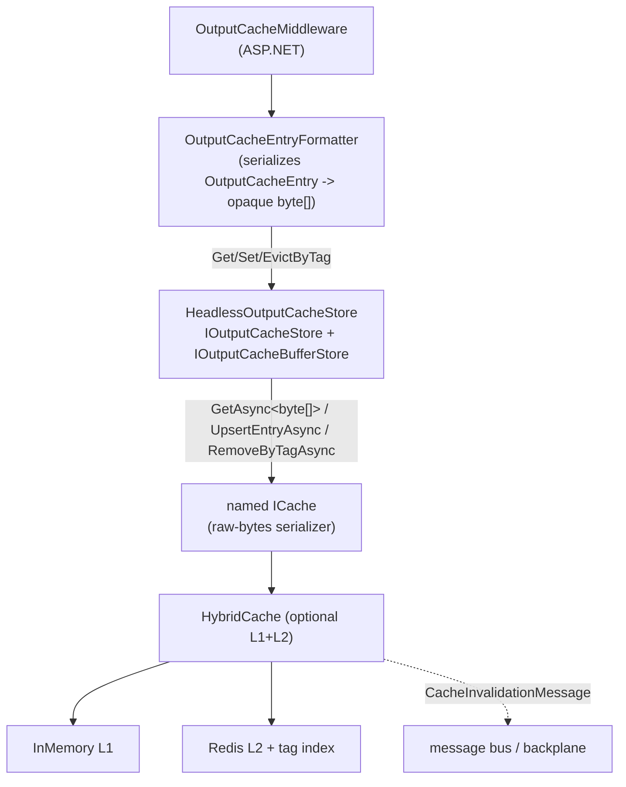
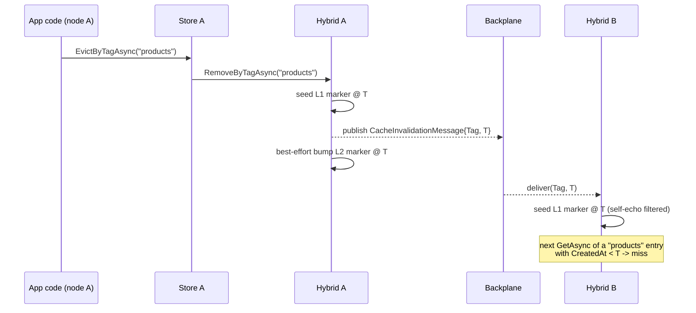

# feat(caching): distributed, tag-aware IOutputCacheStore adapter

## Summary

Ship an ASP.NET Core output-cache store backed by the Headless caching engine, so `services.AddOutputCache()` becomes distributed and **tag-aware**. The adapter implements `IOutputCacheStore` (and the optional `IOutputCacheBufferStore`) over a named `ICache`, mapping `GetAsync`/`SetAsync(value, tags, validFor)`/`EvictByTagAsync` onto the entry envelope and the Family-2 tag index. When the consumer wires the Hybrid tier, the store inherits L1+L2 plus **cluster-wide** tag eviction over the backplane — the capability the BCL `IDistributedCache` cannot offer (no atomic tag features).

This is M3 interop work in the `Headless.Caching.*` program (#369). It mirrors the just-landed BCL `IDistributedCache` adapter (#382's sibling, #383) in shape — same unified setup-builder pivot, same named-cache + raw-bytes-serializer mechanism — but lives in a **new package** because `IOutputCacheStore` is in the `Microsoft.AspNetCore.App` shared framework and must not leak an ASP.NET dependency into the framework-agnostic `Headless.Caching.Bcl`.

Not in scope: a new `ICache` provider, changes to the tag index or `ICache` contract, or output-cache *policies* (those remain ASP.NET's concern — the consumer still calls `AddOutputCache` and declares `[OutputCache(Tags = ...)]`).

---

## Problem Frame

ASP.NET Core's output caching ships only `MemoryOutputCacheStore` out of the box. The official guidance is explicit that `IDistributedCache` is **not** a valid backing store for output caching because it "doesn't have the atomic features required for tagging" — so a multi-instance app gets either per-node memory caches (no shared invalidation) or a third-party Redis output-cache store with its own tag bookkeeping.

The Headless caching engine already solved the hard part: a distributed tag index with O(1) logical invalidation (`RemoveByTagAsync`) that propagates cluster-wide through the Hybrid backplane (#378–#380). Exposing it as an `IOutputCacheStore` turns "we have a resilient, tag-aware cache" into "ASP.NET output caching is now distributed and tag-aware with a one-line registration" — the M3 thesis of meeting consumers on standard BCL contracts while differentiating on resilience and tagging.

---

## Requirements

Grouped by capability. IDs are plan-local.

**Store contract**
- R1. Provide a public registration that wires a Headless-backed `IOutputCacheStore` into ASP.NET output caching such that `AddOutputCache()` uses it as a drop-in store.
- R2. `GetAsync(key)` returns the exact bytes previously stored for a live key, or `null` on miss/expiry; round-trip is byte-identical (the payload is an opaque blob the store must not inspect or re-serialize).
- R3. `SetAsync(key, value, tags, validFor)` persists the blob with `validFor` as its relative TTL and associates it with the supplied tags for later eviction.
- R4. `EvictByTagAsync(tag)` makes every entry stored under that exact tag a subsequent miss, cluster-wide when the Hybrid tier is configured.
- R5. Implement `IOutputCacheBufferStore` (`TryGetAsync(key, PipeWriter)`, `SetAsync(ReadOnlySequence<byte>, ReadOnlyMemory<string>, ...)`) in addition to the three `byte[]` members, so the framework's buffer-aware write path is honored. Buffers handed in are copied out before the call returns (pooled, valid only for the call).

**Distribution & tagging**
- R6. Tag eviction must use `ICache.RemoveByTagAsync` (Family-2 logical marker), not key enumeration, and rely on the existing backplane propagation so a tag evicted on node A is a miss on node B's L1.
- R7. Tags passed through to the engine must satisfy the engine's envelope limits (≤65535 tags, each ≤65535 UTF-8 bytes, non-empty); rely on the engine's write-time validation rather than re-implementing it.

**Isolation & configuration**
- R8. Output-cache entries are stored in a dedicated **named** `ICache` instance (own key namespace / provider config), not the application's default cache, to avoid key collisions and allow independent backing-provider selection.
- R9. The store owns its raw-bytes codec; the consumer's `configureCache` callback selects only the backing provider (e.g. `UseRedis`) and must not set a serializer — reject it loudly if it does (mirror the BCL adapter).
- R10. Options expose the named-cache name (default non-reserved) and a default expiration cap; validate via FluentValidation through the Hosting DI pipeline.

**Quality bar (per #369 cross-cutting)**
- R11. Unit + integration coverage; cluster-wide EvictByTag proven across two cache instances; docs synced (`docs/llms/caching.md` + new package README); roadmap checkbox flipped.

---

## High-Level Technical Design

### Component shape

The adapter is a thin translation layer; all caching behavior comes from the engine the consumer already composed.



The store never sees `OutputCacheEntry` — the formatter serializes/deserializes around it, so `value` is an opaque blob persisted and returned verbatim.

### Cluster-wide EvictByTag

The headline behavior. `EvictByTagAsync` delegates to `RemoveByTagAsync`, which bumps a logical timestamp marker locally, publishes a `CacheInvalidationMessage { Tag, Timestamp }` over the bus, then best-effort bumps the L2 marker. Peers seed their own marker from the message timestamp; on the next read an entry whose `CreatedAt` predates the marker is a miss.



*Directional — the prose and the engine implementation are authoritative; the diagram conveys flow shape, not a contract.*

---

## Output Structure

New package plus its two test projects. Existing engine/serializer files are modified, not created.

```text
src/
  Headless.Caching.OutputCache/
    Headless.Caching.OutputCache.csproj      # FrameworkReference Microsoft.AspNetCore.App
    HeadlessOutputCacheStore.cs              # IOutputCacheStore + IOutputCacheBufferStore
    HeadlessOutputCacheStoreOptions.cs       # options + validator
    Setup.cs                                 # UseOutputCache builder extension
  Headless.Caching.Core/
    RawBytesSerializer.cs                     # MOVED here from Headless.Caching.Bcl (U1)
tests/
  Headless.Caching.OutputCache.Tests.Unit/
  Headless.Caching.OutputCache.Tests.Integration/
    OutputCacheRedisFixture.cs
```

---

## Key Technical Decisions

- KTD1 — **New package `Headless.Caching.OutputCache`, not an addition to `Headless.Caching.Bcl`.** `IOutputCacheStore` lives in the `Microsoft.AspNetCore.App` shared framework; the csproj needs `<FrameworkReference Include="Microsoft.AspNetCore.App"/>`. Folding it into `Headless.Caching.Bcl` would force that ASP.NET dependency onto every consumer of the framework-agnostic distributed-cache/session adapter. A dedicated package keeps the ASP.NET surface opt-in.

- KTD2 — **Store opaque bytes in a named `ICache` via a raw-bytes serializer keyed by cache name.** `ICache` is generic (`GetAsync<T>`/`UpsertEntryAsync<T>`); the default JSON serializer would base64-bloat an opaque `byte[]`. The adapter calls `GetAsync<byte[]>` / `UpsertEntryAsync<byte[]>(...)` against a named instance whose serializer is `RawBytesSerializer` (identity codec), registered keyed by the cache name and resolved by the provider's named core (`GetKeyedService<ISerializer>(name) ?? global`). This is the exact mechanism the BCL adapter introduced.

- KTD3 — **Depend on #383 landing on `main`, then promote `RawBytesSerializer` to `Headless.Caching.Core`.** The keyed-serializer resolution and `RawBytesSerializer` ship with #383 (`dist-cache-adapter`), not yet merged to `main`. This plan assumes #383 merges first. `RawBytesSerializer` currently lives inside `Headless.Caching.Bcl`; promote it to `Headless.Caching.Core` so both adapters share one codec and the output-cache package does not take a project reference on `Bcl`. (See origin program: #369.)

- KTD4 — **Implement both `IOutputCacheStore` and `IOutputCacheBufferStore`.** The framework's write path prefers the buffer interface; implementing it honors that path. Because `ICache` ultimately needs a `byte[]`, the buffer `SetAsync` materializes the `ReadOnlySequence<byte>` via `ToArray()` and copies the pooled `ReadOnlyMemory<string>` tags before returning (buffers are valid only for the call). `TryGetAsync` reads `byte[]` from `ICache` and writes it into the supplied `PipeWriter` (the v10 middleware reads through `byte[] GetAsync`, but the interface requires `TryGetAsync`, so it must be correct).

- KTD5 — **Register the store with `services.Replace`, not `TryAdd`.** `AddOutputCache()` registers `MemoryOutputCacheStore` via `TryAddSingleton<IOutputCacheStore>`, so call order matters. Using `Replace(ServiceDescriptor.Singleton<IOutputCacheStore>(factory))` makes the Headless store win regardless of whether the consumer calls `AddOutputCache()` before or after `AddHeadlessCaching`. The store is a process-wide **singleton** and must be thread-safe (it is, by delegating to the thread-safe `ICache`).

- KTD6 — **`validFor` maps directly to `CacheEntryOptions.Duration`; tags pass straight through.** No sliding/absolute reconciliation (unlike the BCL `DistributedCacheEntryOptions` mapper) — output caching hands a single relative TTL. A `DefaultExpiration` option exists only as a guard for a non-positive `validFor` edge case. Tag-limit validation is left to the engine's write-time `ValidateTags` choke point (R7).

- KTD7 — **`UseOutputCache(Action<options>, Action<HeadlessCacheInstanceBuilder>)` builder extension mirroring `UseBclCache`.** Calls `setup.AddNamed(name, instance => { configureCache(instance); reject WithSerializer; })` then `setup.RegisterCrossCuttingExtension(services => services._AddOutputCacheCore(options))`. The consumer wires it as: `AddOutputCache()` + `AddHeadlessCaching(setup => { setup.AddMemoryTier(); setup.AddRedisTier(...); setup.UseHybrid(); setup.UseOutputCache(o => …, instance => instance.UseRedis(...)); })`.

---

## Dependencies / Prerequisites

- **#383 (BCL `IDistributedCache` adapter)** must merge to `main` first — it brings `RawBytesSerializer`, the `HeadlessCacheInstanceBuilder.SerializerFactory` + `WithSerializer` API, and the Redis named-core keyed-serializer resolution. Without it, none of the raw-bytes-by-name mechanism exists on `main`. If #383 stalls, U1 can absorb porting that infra, but the plan's baseline assumption is #383-first.
- **#378–#380 (tag index + RemoveByTag + backplane)** are merged (`main`) and are the engine substrate this adapter rides.

---

## Implementation Units

### U1. Promote `RawBytesSerializer` to `Headless.Caching.Core`

- Goal: Give both BCL and output-cache adapters one shared raw-bytes codec, so the output-cache package needs no reference on `Headless.Caching.Bcl`.
- Requirements: R2, R8 (precondition), R9
- Dependencies: #383 merged to `main`
- Files: `src/Headless.Caching.Core/RawBytesSerializer.cs` (moved), `src/Headless.Caching.Bcl/Setup.cs` (update `using`/namespace ref if it changes), `tests/Headless.Caching.Bcl.Tests.Unit/RawBytesSerializerTests.cs` (move to `tests/Headless.Caching.Core.Tests.Unit/` or repoint reference).
- Approach: Move the type into `Headless.Caching.Core` keeping the `Headless.Caching` namespace (Core already roots there), so no consumer `using` changes. Keep it `internal sealed` with `InternalsVisibleTo` extended to both adapter test projects, or make it `internal` + accessible to Bcl/OutputCache via `InternalsVisibleTo` on the Core csproj. Confirm the BCL adapter still resolves it (Bcl references Core already).
- Patterns to follow: existing `InternalsVisibleTo` blocks in caching csproj files.
- Test suite design: The serializer's own round-trip/error tests move with it (unit, no infra). The BCL adapter integration tests already exercise it end-to-end and must stay green — that is the regression guard for the move.
- Test scenarios:
  - `byte[]` round-trips identically (empty, 1-byte, large blob).
  - Non-`byte[]` type throws `NotSupportedException` (both generic and `Type`-based paths).
  - Existing `Headless.Caching.Bcl.Tests.*` remain green after the move (no behavior change).
- Verification: Solution builds; moved unit tests pass; full `Headless.Caching.Bcl.Tests.Unit` + `.Integration` pass unchanged.

### U2. Scaffold the `Headless.Caching.OutputCache` package

- Goal: New packable project with the ASP.NET framework reference, attached to the solution.
- Requirements: R1 (precondition)
- Dependencies: U1
- Files: `src/Headless.Caching.OutputCache/Headless.Caching.OutputCache.csproj`, `headless-framework.slnx`, `Directory.Packages.props` (only if a new package version entry is required — `Microsoft.AspNetCore.App` is a `FrameworkReference`, not a package, so likely none).
- Approach: `<Project Sdk="Headless.NET.Sdk">` with `<TargetFramework>net10.0</TargetFramework>`, `<RootNamespace>Headless.Caching</RootNamespace>`, `<FrameworkReference Include="Microsoft.AspNetCore.App"/>`, project refs on `Headless.Caching.Abstractions`, `Headless.Caching.Core`, `Headless.Hosting`, `Headless.Serializer.Abstractions`, and `InternalsVisibleTo` for the two test projects. Attach to `headless-framework.slnx`.
- Patterns to follow: `src/Headless.Caching.Bcl/Headless.Caching.Bcl.csproj` (swap the `Microsoft.Extensions.Caching.Abstractions` package ref for the `FrameworkReference`). Library SDK rule in CLAUDE.md (Headless SDKs, no stock `Microsoft.NET.Sdk`).
- Test suite design: none for this unit — pure scaffolding.
- Test scenarios: Test expectation: none -- scaffolding only; verified by the build and by downstream units compiling against it.
- Verification: `make build-project PROJECT=src/Headless.Caching.OutputCache/Headless.Caching.OutputCache.csproj` succeeds; project appears in `make list-projects`.

### U3. `HeadlessOutputCacheStoreOptions` + validator

- Goal: Typed, validated options for the named cache and default expiration.
- Requirements: R8, R10
- Dependencies: U2
- Files: `src/Headless.Caching.OutputCache/HeadlessOutputCacheStoreOptions.cs`
- Approach: `[PublicAPI] public sealed class HeadlessOutputCacheStoreOptions` with `const string DefaultCacheName = "output-cache"` (no `Headless.Caching:` prefix → not reserved), `string CacheName { get; set; }`, `TimeSpan DefaultExpiration { get; set; } = TimeSpan.FromMinutes(1)` (matches ASP.NET's 60s default, used only when `validFor` is non-positive). `internal sealed class HeadlessOutputCacheStoreOptionsValidator : AbstractValidator<…>` in the same file below the options: `CacheName` non-empty and `!CacheConstants.IsReservedProviderKey(name)`; `DefaultExpiration > TimeSpan.Zero`.
- Patterns to follow: `src/Headless.Caching.Bcl/HeadlessDistributedCacheAdapterOptions.cs` (same options+validator-in-one-file shape); CLAUDE.md options-pattern rules.
- Test suite design: Validator covered by unit tests (no infra).
- Test scenarios:
  - Default options validate successfully.
  - Reserved name (`"Headless.Caching:Memory"` / any `Headless.Caching:` prefix) fails validation with the reserved-key message.
  - Empty/whitespace `CacheName` fails.
  - Non-positive `DefaultExpiration` fails.
- Verification: Unit tests pass; validator wired through `services.Configure<TOptions, TValidator>` in U5 (`ValidateOnStart`).

### U4. `HeadlessOutputCacheStore` adapter (`IOutputCacheStore` + `IOutputCacheBufferStore`)

- Goal: The translation layer mapping the ASP.NET store contract onto a named `ICache`.
- Requirements: R2, R3, R4, R5, R6
- Dependencies: U2, U3
- Files: `src/Headless.Caching.OutputCache/HeadlessOutputCacheStore.cs`, `tests/Headless.Caching.OutputCache.Tests.Unit/HeadlessOutputCacheStoreTests.cs`
- Approach: `internal sealed class HeadlessOutputCacheStore(ICache cache, IOptions<HeadlessOutputCacheStoreOptions> options, TimeProvider timeProvider) : IOutputCacheStore, IOutputCacheBufferStore`.
  - `GetAsync(key, ct)` → `var v = await cache.GetAsync<byte[]>(key, ct); return v.HasValue ? v.Value : null;`
  - `SetAsync(key, value, tags, validFor, ct)` → build `CacheEntryOptions { Duration = _ResolveDuration(validFor), Tags = tags }` (null/empty tags → null), then `cache.UpsertEntryAsync(key, value, options, ct)`.
  - `EvictByTagAsync(tag, ct)` → `cache.RemoveByTagAsync(tag, ct)`.
  - `IOutputCacheBufferStore.TryGetAsync(key, PipeWriter, ct)` → read `byte[]`; on miss return `false`; on hit `await destination.WriteAsync(bytes, ct)` and return `true`.
  - `IOutputCacheBufferStore.SetAsync(key, ReadOnlySequence<byte> value, ReadOnlyMemory<string> tags, validFor, ct)` → `value.ToArray()` + copy tags to `string[]` (buffers valid only for the call), then delegate to the same upsert logic.
  - `_ResolveDuration(validFor)`: positive `validFor` passes through; non-positive falls back to `DefaultExpiration`.
  - Guard `key`/`value` with `Headless.Checks.Argument`.
- Technical design (directional, not a contract): `EvictByTagAsync` is one line — the engine owns logical-marker + backplane semantics. `validFor` mapping is deliberately trivial vs the BCL mapper.
- Patterns to follow: `src/Headless.Caching.Bcl/HeadlessDistributedCacheAdapter.cs` (constructor injection, `Argument` guards, `ICache` delegation).
- Test suite design: Adapter mapping is unit-tested with a **mocked `ICache`** (NSubstitute arg capture) — no infra needed to assert the translation. End-to-end byte fidelity and real tag eviction are covered in U7/U8.
- Test scenarios:
  - `GetAsync` returns `null` when `ICache` reports no value; returns the stored bytes when present.
  - `SetAsync` calls `UpsertEntryAsync` with `Duration == validFor` and `Tags` equal to the supplied tags (capture and assert `CacheEntryOptions`).
  - `SetAsync` with `null` / empty tags passes `Tags == null`.
  - `SetAsync` with non-positive `validFor` falls back to `DefaultExpiration`.
  - `EvictByTagAsync` delegates to `RemoveByTagAsync` with the same tag.
  - Buffer `SetAsync(ReadOnlySequence)` materializes the same bytes as the `byte[]` overload (feed a multi-segment sequence; assert captured bytes equal the concatenation).
  - Buffer `TryGetAsync` writes stored bytes to the `PipeWriter` and returns `true`; returns `false` (writes nothing) on miss.
  - `key`/`value` null/empty guards throw before touching `ICache`.
- Verification: Unit tests pass; mapping asserted via captured `CacheEntryOptions`.

### U5. `Setup.cs` — `UseOutputCache` builder extension

- Goal: One-line registration that wires the named cache, the raw-bytes codec, and the `IOutputCacheStore` override.
- Requirements: R1, R8, R9, R10, KTD5
- Dependencies: U3, U4
- Files: `src/Headless.Caching.OutputCache/Setup.cs`, `tests/Headless.Caching.OutputCache.Tests.Unit/SetupOutputCacheTests.cs`
- Approach: `[PublicAPI] public static class SetupOutputCache` with two extension blocks (mirror `SetupBclCache`):
  - `extension(HeadlessCachingSetupBuilder setup)` → `UseOutputCache(Action<HeadlessOutputCacheStoreOptions> setupAction, Action<HeadlessCacheInstanceBuilder> configureCache)`: materialize+validate options, derive `cacheName`, `setup.AddNamed(cacheName, instance => { configureCache(instance); if (instance.SerializerFactory is not null) throw new InvalidOperationException(...); })`, `setup.RegisterCrossCuttingExtension(services => services._AddOutputCacheCore(options))`.
  - `extension(IServiceCollection services)` → `_AddOutputCacheCore(options)`: `TryAddSingleton(TimeProvider.System)`; `AddKeyedSingleton<ISerializer>(cacheName, (_, _) => new RawBytesSerializer())`; `services.Configure<HeadlessOutputCacheStoreOptions, HeadlessOutputCacheStoreOptionsValidator>(...)`; then **`services.Replace(ServiceDescriptor.Singleton<IOutputCacheStore>(provider => new HeadlessOutputCacheStore(provider.GetRequiredKeyedService<ICache>(name), provider.GetRequiredService<IOptions<…>>(), provider.GetRequiredService<TimeProvider>())))`**. Add the `CA1708` extension-marker suppression as the BCL Setup does.
  - Note: only `IOutputCacheStore` is registered as the service type; the formatter upcasts to `IOutputCacheBufferStore` via pattern-match, so no second registration is needed.
- Patterns to follow: `git show origin/xshaheen/dist-cache-adapter:src/Headless.Caching.Bcl/Setup.cs` — copy the structure, swapping `IDistributedCache`→`IOutputCacheStore`, `TryAddSingleton`→`Replace` (KTD5).
- Test suite design: Setup-shape behavior (serializer rejection, reserved-name rejection) unit-tested against a bare `ServiceCollection`; actual resolution + middleware wiring in U7.
- Test scenarios:
  - Calling `WithSerializer` inside `configureCache` throws `InvalidOperationException` (adapter owns the codec).
  - A reserved `CacheName` throws via options validation / `AddNamed`.
  - After `AddOutputCache()` **then** `UseOutputCache(...)`, the resolved `IOutputCacheStore` is `HeadlessOutputCacheStore` (proves `Replace` wins over the default `MemoryOutputCacheStore`) — and the reverse order also resolves to the Headless store.
  - The named `ICache` is registered keyed by `cacheName` with a `RawBytesSerializer` keyed under the same name.
- Verification: Unit tests pass; `IOutputCacheStore` resolves to the Headless store in both registration orders.

### U6. Unit-test project

- Goal: Host the U3–U5 unit tests with no external infra.
- Requirements: R11
- Dependencies: U3, U4, U5
- Files: `tests/Headless.Caching.OutputCache.Tests.Unit/Headless.Caching.OutputCache.Tests.Unit.csproj` (and the test files listed in U3–U5)
- Approach: `<Project Sdk="Headless.NET.Sdk.Test">`, `net10.0`, `OutputType=Exe`, `RootNamespace=Tests`; refs `Microsoft.Extensions.TimeProvider.Testing`, `xunit.v3.mtp-v2`, NSubstitute, the `Headless.Caching.OutputCache` src project, `Headless.Testing`. `<FrameworkReference Include="Microsoft.AspNetCore.App"/>` so the ASP.NET types (`PipeWriter`, `IOutputCacheStore`) are visible.
- Patterns to follow: `tests/Headless.Caching.Bcl.Tests.Unit/Headless.Caching.Bcl.Tests.Unit.csproj`.
- Test suite design: This unit is the project shell; the scenarios live in U3/U4/U5 and are this unit's coverage.
- Test scenarios: Aggregates U3–U5 scenarios; no additional cases of its own.
- Verification: `make test-project TEST_PROJECT=tests/Headless.Caching.OutputCache.Tests.Unit/...` green.

### U7. Integration tests — Redis-backed store + ASP.NET middleware

- Goal: Prove byte-fidelity, real TTL/expiry, single-node tag eviction, and the full ASP.NET output-cache pipeline against a real Redis.
- Requirements: R2, R3, R4, R7, R8, R11
- Dependencies: U5
- Files: `tests/Headless.Caching.OutputCache.Tests.Integration/OutputCacheRedisFixture.cs`, `tests/Headless.Caching.OutputCache.Tests.Integration/HeadlessOutputCacheStoreTests.cs`, `tests/Headless.Caching.OutputCache.Tests.Integration/OutputCacheMiddlewareTests.cs`, `tests/Headless.Caching.OutputCache.Tests.Integration/Headless.Caching.OutputCache.Tests.Integration.csproj`
- Approach: Clone `BclRedisFixture` → `OutputCacheRedisFixture : HeadlessRedisFixture, ICollectionFixture<…>` with `[CollectionDefinition]`, a `ConnectionMultiplexer` and `FlushAllAsync` in `InitializeAsync`. Host bootstrap: `AddOutputCache()` + `AddHeadlessCaching(setup => { setup.UseRedis(...); setup.UseOutputCache(o => { o.CacheName = uniqueName; }, instance => instance.UseRedis(o => { o.ConnectionMultiplexer = fixture.ConnectionMultiplexer; o.KeyPrefix = uniquePrefix; })); })` with per-test unique `cacheName`/`KeyPrefix`. Drive the store directly **and** drive the middleware via `Microsoft.AspNetCore.Mvc.Testing` `TestServer` + `host.GetTestClient()` with an endpoint marked `[OutputCache(Tags = "products")]`.
- Patterns to follow: `tests/Headless.Caching.Bcl.Tests.Integration/BclRedisFixture.cs` and `SessionRoundTripTests.cs` (TestServer wiring); csproj already references `Microsoft.AspNetCore.Mvc.Testing`.
- Test suite design: Integration suite owning everything a mocked `ICache` cannot prove — real serialization round-trip, Redis TTL, real tag-index eviction, and the live middleware path. Hand-rolled fixture (the `ICache` conformance harness is the wrong layer for an adapter — confirmed in research).
- Test scenarios:
  - Direct store: `SetAsync` then `GetAsync` returns byte-identical blob; unknown key → `null`.
  - Direct store: entry expires after `validFor` (advance / short TTL) → `GetAsync` returns `null`.
  - Direct store: `SetAsync(tags: ["a","b"])` then `EvictByTagAsync("a")` → `GetAsync` returns `null`; an entry tagged only `"b"` survives. Covers AE: EvictByTag works (single node).
  - Direct store: tag exceeding the engine envelope (>65535 UTF-8 bytes) surfaces the engine's `ArgumentException` (R7) — thin assertion that validation is delegated, not re-implemented.
  - Middleware: two identical requests to the `[OutputCache]` endpoint → second served from cache (assert a request-counter header / body marker proves the first response was replayed).
  - Middleware: after `IOutputCacheStore.EvictByTagAsync("products")`, the next request re-executes the endpoint (fresh response). Covers AE: drop-in `AddOutputCache` store + tag eviction end-to-end.
- Verification: `make test-project TEST_PROJECT=tests/Headless.Caching.OutputCache.Tests.Integration/...` green with Docker; middleware replay + eviction assertions hold.

### U8. Cluster-wide EvictByTag — two-node test

- Goal: Prove the headline guarantee: a tag evicted via the store on node A makes node B's L1 a miss, through the backplane.
- Requirements: R4, R6, R11
- Dependencies: U4
- Files: `tests/Headless.Caching.OutputCache.Tests.Unit/OutputCacheClusterEvictionTests.cs` (plus a copied `FakeBackplaneBus` / two-node harness helper, or referenced from a shared test-support location if one is introduced)
- Approach: Reuse the `FakeBackplaneBus` + `TwoNodeConvergenceHarness` pattern from `tests/Headless.Caching.Hybrid.Tests.Unit/HybridCacheAutoRecoveryConvergenceTests.cs` — a synchronous in-memory bus routing `CacheInvalidationMessage` to both nodes, each a `HybridCache` over private L1 + shared L2, distinct `InstanceId`. Wrap each node's `ICache` in a `HeadlessOutputCacheStore`. Store an entry through node A's store under tag `"products"`; read it back through node B's store (populates B's L1); call `EvictByTagAsync("products")` on node A's store; assert node B's store now returns `null` for that key. No broker/Testcontainers — this is the codebase's established pattern for multi-node invalidation.
- Execution note: Start from the existing harness; the new surface is only the store wrapper over each node.
- Patterns to follow: `tests/Headless.Caching.Hybrid.Tests.Unit/HybridCacheAutoRecoveryConvergenceTests.cs` (`FakeBackplaneBus`, `TwoNodeConvergenceHarness`, `InstanceId` self-echo filter).
- Test suite design: Lives in the unit project (deterministic, no infra) because the backplane fake is synchronous and broker-free — matching how the engine itself tests cross-node convergence.
- Test scenarios:
  - Node A `SetAsync(key, tags: ["products"])`; node B `GetAsync(key)` hits (seeds B L1); node A `EvictByTagAsync("products")`; node B `GetAsync(key)` → `null`. Covers AE: EvictByTag works cluster-wide.
  - An entry under a different tag on node B survives node A's `"products"` eviction (no over-eviction).
  - Self-echo: node A's own L1 entry for that tag is also a miss after its own eviction (sanity, not just the peer).
- Verification: Unit test green; node B observes the eviction without a direct call to its own store.

### U9. Docs sync + roadmap

- Goal: Keep the two agent-facing doc surfaces in lockstep and flip the program checkbox.
- Requirements: R11
- Dependencies: U5 (public surface settled)
- Files: `docs/llms/caching.md`, `src/Headless.Caching.OutputCache/README.md` (new), and a note to flip `#382` in the #369 roadmap (tracked on GitHub, not a repo file).
- Approach: Add an output-cache section to `docs/llms/caching.md` and author the new package README per `docs/authoring/AUTHORING.md` — concepts (why not `IDistributedCache`; tag-aware distributed output caching), the `UseOutputCache` recipe, the L1+L2/Hybrid relationship, and the cluster-wide EvictByTag behavior with trade-offs (logical vs physical eviction). Read `docs/authoring/AUTHORING.md` before editing either surface.
- Patterns to follow: `src/Headless.Caching.Hybrid/README.md`, `src/Headless.Caching.Redis/README.md`; the docs sync trigger in CLAUDE.md (new package + public API → docs required).
- Test suite design: none (docs).
- Test scenarios: Test expectation: none -- documentation only.
- Verification: README + `docs/llms/caching.md` cover concepts, the registration recipe, and the eviction semantics; drift checks in `AUTHORING.md` pass; `#382` checked on the roadmap.

---

## Scope Boundaries

**In scope:** the new package, the store (both interfaces), the `UseOutputCache` builder extension, options+validator, the `RawBytesSerializer` promotion to Core, unit + integration + two-node tests, and docs.

### Deferred to Follow-Up Work
- Promoting the `FakeBackplaneBus` / `TwoNodeConvergenceHarness` into a shared caching test-support package (currently copied per-project). Queue if a third consumer appears.
- A real-broker (Testcontainers) end-to-end multi-node EvictByTag test — no caching test wires a real bus today; the synchronous fake is the accepted convention.
- OpenTelemetry instrumentation for the store path (belongs to M4 #384).

### Outside this product's identity
- Output-cache **policies** (eviction strategy, vary-by, cache-control) — these stay ASP.NET's; the store only persists/evicts.
- Replacing or wrapping `AddOutputCache()` — the consumer still calls it; we only override the store.

---

## Risks & Dependencies

- **#383 not yet on `main`** (KTD3) — the raw-bytes-by-name infra is branch-only. Mitigation: sequence after #383; U1 can absorb porting it if #383 stalls. This is the single gating dependency.
- **Logical vs physical eviction expectation** — `EvictByTagAsync` makes entries *read as misses* (Family-2 marker), it does not physically delete them until their TTL lapses. This satisfies the ASP.NET contract (subsequent reads miss) and is cluster-safe, but reviewers expecting hard deletes should see it documented (U9). Confirmed acceptable.
- **InMemory-only backing** — with no Redis/Hybrid tier, `RawBytesSerializer` is a no-op (InMemory stores object refs, never serializes) and EvictByTag is single-node only. Acceptable: distribution is a function of the tier the consumer composes, not the adapter. Document the L1-only caveat.
- **Buffer-store buffer lifetime** (KTD4) — the pooled `ReadOnlySequence`/`ReadOnlyMemory<string>` are valid only during the call; failing to copy before an `await` that yields would read recycled memory. Mitigation: materialize (`ToArray`) before any delegating await; explicit test (U4) feeds a multi-segment sequence.

---

## Acceptance Examples

- AE1. **Drop-in distributed store.** Given an app that calls `AddOutputCache()` and `AddHeadlessCaching(setup => setup.UseRedis(...).UseOutputCache(...))`, when two identical requests hit an `[OutputCache]` endpoint, then the second is served from the Redis-backed store (covered by U7 middleware replay).
- AE2. **Cluster-wide tag eviction.** Given two app instances sharing the backplane, when instance A calls `IOutputCacheStore.EvictByTagAsync("products")`, then a cached `"products"` response on instance B is re-executed on its next request (covered by U8 two-node test; U7 single-node middleware eviction).
- AE3. **Byte fidelity.** Given any opaque payload stored via `SetAsync`, when read via `GetAsync`, then the bytes are identical (covered by U7).

---

## Sources & Research

- Issue #382 (this), program roadmap #369, tag-index deps #378–#380, sibling BCL adapter #383.
- ASP.NET Core `v10.0.0` source: `IOutputCacheStore` / `IOutputCacheBufferStore` / `OutputCacheEntryFormatter` / `OutputCacheServiceCollectionExtensions` / `MemoryOutputCacheStore` / `TagsPolicy` — confirmed exact signatures, the `Replace`-vs-`TryAdd` registration consequence, the formatter's buffer-store write-path branch + `byte[]`-only read path, opaque-blob payload, no implicit "all" tag, and the singleton/thread-safety + buffer-lifetime contracts.
- MS Learn output-caching docs — `IDistributedCache` rejected for output caching due to missing atomic tag features (the gap this adapter fills).
- Codebase: `src/Headless.Caching.Bcl/*` (on `origin/xshaheen/dist-cache-adapter`) as the structural template; `src/Headless.Caching.Abstractions/ICache`T.cs` + `Contracts/CacheEntryOptions.cs` + `Contracts/CacheConstants.cs`; `src/Headless.Caching.Core/HeadlessCachingSetupBuilder.cs` / `HeadlessCacheInstanceBuilder.cs` / `CacheEntryStamps.cs` (`ValidateTags`); `src/Headless.Caching.Hybrid/HybridCache.WriteOperations.cs` + `HybridCacheInvalidationConsumer.cs` + `CacheInvalidationMessage.cs`; `tests/Headless.Caching.Tests.Harness/` (wrong layer for adapters) and `tests/Headless.Caching.Hybrid.Tests.Unit/HybridCacheAutoRecoveryConvergenceTests.cs` (two-node pattern).
- Learnings: `docs/solutions/architecture-patterns/unified-provider-setup-builder-pattern.md`, `docs/solutions/conventions/keyed-services-for-overridable-abstractions.md`, `docs/solutions/best-practices/storage-initializer-lifecycle-correctness.md`.

---

## Open Questions

- Package naming: `Headless.Caching.OutputCache` (chosen) vs `Headless.Caching.AspNetCore` (broader, if future ASP.NET-coupled caching adapters are expected). Defaulting to the specific name; revisit only if more ASP.NET adapters are planned.
- Whether to expose a convenience `AddHeadlessOutputCache(...)` that also calls ASP.NET's `AddOutputCache()` for the consumer, vs requiring both calls explicitly. Leaning explicit (matches the BCL adapter's "you compose the pieces" posture); a convenience overload is a cheap follow-up if ergonomics demand it.
