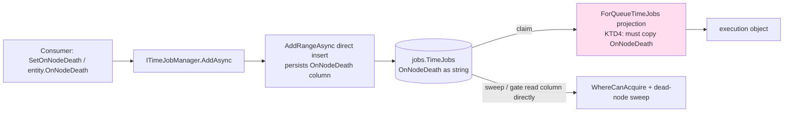
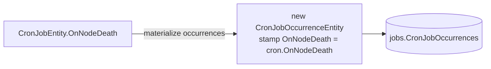
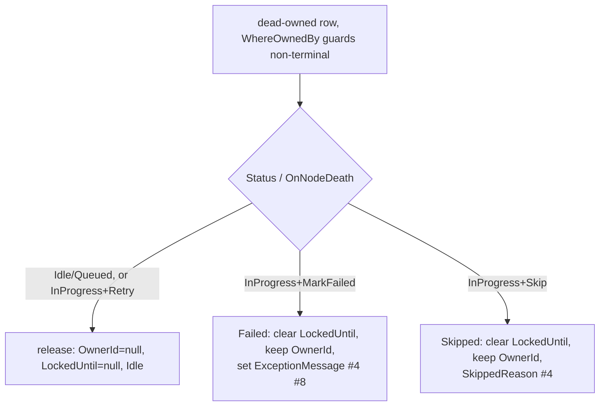

# feat: OnNodeDeath consumer input API (time + cron) + #454 review follow-ups

## Summary

#454 (merged as `49cb9799`) shipped the storage column, the claim-predicate gate (`OnNodeDeath == Retry` on the lease-expiry arm), and the per-policy dead-node sweep — but left the policy **unselectable by consumers**. `TimeJobEntity.OnNodeDeath` has an `internal set`, `CronJobEntity` has no policy field at all, and the EF queue projections drop the value while the in-memory clone keeps it. The net effect: every persisted job is `Retry`; `MarkFailed`/`Skip` are reachable only by raw-SQL test seeding, so two-thirds of the sweep's behavior is dead config for real consumers.

This follow-up wires the **input surface end-to-end for both time jobs and cron jobs** (entity setters, fluent builder, persistence, EF↔InMemory parity, cron→occurrence propagation, one new migration column) and folds in the remaining reliability and test-coverage findings from the #454 review (#4, #5, #7, #8, U9).

This is a greenfield framework — breaking changes are acceptable. The `dec3f5ad` review fix (migration `defaultValue: "Retry"` + sweep comment) is already cherry-picked onto this branch.

---

## Problem Frame

The per-job `NodeDeathPolicy` is a half-wired feature. Storage + read-side behavior exist; the write-side input path does not. The precedent for a per-job enum is `RunCondition` (sibling enum on the same entities) — exposed on the fluent builder, defaulted in the manager, copied in the in-memory clone, mapped in the EF projection. The gap is everything on that list for `OnNodeDeath`, plus a cron-side propagation path that `RunCondition` never needed (cron has no `RunCondition`).

Two differences from `RunCondition` shape the design:
1. **`OnNodeDeath` is universal**, not child-only. Any job — parent, child, grandchild, time, cron — can declare a death policy. `RunCondition` only governs a child's run-vs-parent relationship and lives on child builders only.
2. **Cron needs propagation.** The policy is declared once on the `CronJobEntity` and must flow to every generated `CronJobOccurrenceEntity` at materialization. `RunCondition` has no cron analogue, so this propagation is net-new design.

---

## Key Technical Decisions

### KTD1 — Consumer input via the entity property + fluent builder, mirroring `RunCondition`
Consumers already pass a `TTimeJob`/`TCronJob` entity to `ITimeJobManager.AddAsync` / `ICronJobManager.AddAsync`, and EF persists it via `AddRangeAsync` (direct entity insert). So a **public setter on the entity** is sufficient for the add path; the fluent `SetOnNodeDeath` is the ergonomic surface for chain construction. No new manager method or DTO.

### KTD2 — `SetOnNodeDeath` on Parent, Child, and GrandChild builders
Because the policy is universal (KTD1 / Problem Frame #1), expose it on all three builder levels — unlike `SetRunCondition`, which is child/grandchild only. The default stays `Retry`.

### KTD3 — Cron policy lives on `CronJobEntity`, propagated to occurrences at materialization
Add `OnNodeDeath` (default `Retry`) to `CronJobEntity` (one new DB column). At occurrence generation, read `cronJob.OnNodeDeath` and stamp it onto each new `CronJobOccurrenceEntity` in **both** providers. This keeps a single source of truth (the cron definition) and avoids per-occurrence configuration.

### KTD4 — Map `OnNodeDeath` in the EF queue projections for claim-path parity
`MappingExtensions.ForQueueTimeJobs` (+children) and `ForQueueCronJobOccurrence` must copy `OnNodeDeath`, matching the in-memory clone. The sweep/gate read the column directly off DB rows (unaffected), but the projected execution object must carry the true policy for parity and to avoid a latent bug once any execution-time logic reads it.

### KTD5 — New migration, never edit the merged one
Migration `20260616065251` is merged; do not retroactively rework it (#2/#3 from the review are moot for greenfield and the migration is immutable). The only schema delta here is the new `CronJobs.OnNodeDeath` column → one new migration for both demo apps + snapshot refresh.

### KTD6 — Reliability fixes ride this PR because they are now reachable
With `MarkFailed`/`Skip` becoming consumer-selectable, the terminal-transition paths stop being dead code. So the sweep hygiene (#4, #7, #8) and the completion fence (#5) move from "latent" to "live" and belong in the same change. The fence is the **minimal** ownership + non-terminal-status guard on the completion write, not a broader reconciliation pass.

---

## High-Level Technical Design

Data flow for a consumer-selected policy (time job), and where #454 dropped it:

Cron propagation (KTD3):

Dead-node sweep terminal transitions after KTD6 fixes (both providers):

---

## Implementation Units

### U1. `OnNodeDeath` settable on entities + EF config
**Goal:** Make the policy storable from consumer-set values on both entity types.
**Requirements:** Review #1 (consumer reachability); KTD1, KTD3.
**Dependencies:** none.
**Files:**
- `src/Headless.Jobs.Abstractions/Entities/TimeJobEntity.cs` (`internal set` → `set`)
- `src/Headless.Jobs.Abstractions/Entities/CronJobEntity.cs` (add `OnNodeDeath`, default `Retry`)
- `src/Headless.Jobs.EntityFramework/Configurations/CronJobConfigurations.cs` (`HasConversion<string>`, `HasMaxLength(32)`, required)
**Approach:** Mirror the existing `TimeJobConfigurations`/`CronJobOccurrenceConfigurations` enum-as-string config for the new cron property. `CronJobOccurrenceEntity.OnNodeDeath` already exists and is already configured (from #454).
**Patterns to follow:** existing `OnNodeDeath` config on `CronJobOccurrenceConfigurations`; `RunCondition` enum-as-string config.
**Test scenarios:** `Test expectation: none -- pure property/config; behavior covered by U3/U4/U8 round-trip and parity tests.`
**Verification:** build green; model builds without snapshot error before U7 regen.

### U2. `SetOnNodeDeath` on the fluent builders
**Goal:** Ergonomic per-job policy selection in chain construction.
**Requirements:** Review #1; KTD2.
**Dependencies:** U1.
**Files:**
- `src/Headless.Jobs.Abstractions/Managers/FluentChainJobBuilder.cs` (`SetOnNodeDeath` on `ParentBuilder`, `ChildBuilder`, `GrandChildBuilder`)
**Approach:** Mirror `SetRunCondition`/`SetRetries` exactly, but add it to `ParentBuilder` too (KTD2). Each setter assigns the builder's backing entity `OnNodeDeath` and returns the same builder type for chaining.
**Patterns to follow:** `FluentChainJobBuilder.SetRunCondition` (child/grandchild) and `ParentBuilder.SetRetries` (parent-level setter shape).
**Test suite design:** unit, `tests/Headless.Jobs.Tests.Unit`.
**Test scenarios:**
- Happy: `BeginWith(p => p.SetOnNodeDeath(MarkFailed))` → built parent entity has `OnNodeDeath == MarkFailed`.
- Happy: child and grandchild `SetOnNodeDeath(Skip)` → respective built entities carry `Skip`.
- Edge: builder without `SetOnNodeDeath` → entity defaults to `Retry`.
**Verification:** the three builder-level scenarios pass.

### U3. Persistence wiring: manager default + EF projection / in-memory parity
**Goal:** A consumer-set policy survives persist and claim on both providers.
**Requirements:** Review #1; KTD1, KTD4.
**Dependencies:** U1.
**Files:**
- `src/Headless.Jobs.Abstractions/Managers/JobsManager.cs` (`_AddTimeJobAsync`, `_AddCronJobAsync`, batch add: default `OnNodeDeath ?? Retry` where a nullable input is coalesced, matching the `RunCondition ?? OnAnyCompletedStatus` shape)
- `src/Headless.Jobs.Abstractions/Managers/InternalJobsManager.cs` (child/grandchild persist sites that already coalesce `RunCondition`)
- `src/Headless.Jobs.EntityFramework/Infrastructure/MappingExtensions.cs` (`ForQueueTimeJobs` + children, `ForQueueCronJobOccurrence`: map `OnNodeDeath`)
- `src/Headless.Jobs.Core/Src/Provider/JobsInMemoryPersistenceProvider.cs` (confirm clone `_ForQueueTimeJobs` ~1333 and `_ForQueueCronOccurrence` ~1363 copy it; add child coverage if children are cloned)
**Approach:** EF insert is `AddRangeAsync` (direct entity), so persistence needs no projection change; the projection edits are for the **claim/read** path (KTD4). Keep the in-memory clone authoritative as the parity reference.
**Test suite design:** unit for projection mapping (in-memory `IQueryable` over `ForQueueTimeJobs`) + EF↔InMemory parity in U8.
**Test scenarios:**
- Happy: a `MarkFailed` time job round-trips through add → claim projection with `OnNodeDeath == MarkFailed` (both providers).
- Edge: children carry their own `OnNodeDeath` through the projection independently of the parent.
- Covers parity: in-memory clone and EF projection produce the same `OnNodeDeath` for the same input.
**Verification:** projection/parity scenarios pass; no EF client-eval warning on the projection.

### U4. Cron policy propagation to occurrences
**Goal:** A cron job's `OnNodeDeath` flows to every generated occurrence.
**Requirements:** KTD3.
**Dependencies:** U1.
**Files:**
- `src/Headless.Jobs.Core/Src/Provider/JobsInMemoryPersistenceProvider.cs` (occurrence creation sites ~786, ~1353: stamp `OnNodeDeath = cronJob.OnNodeDeath`)
- `src/Headless.Jobs.EntityFramework/Infrastructure/BasePersistenceProvider.cs` (cron occurrence materialization near the `Set<CronJobOccurrenceEntity<TCronJob>>` insert path, ~450–485)
**Approach:** At the point each occurrence is constructed from its cron job, copy the policy. Single source of truth is the cron definition.
**Test suite design:** unit (in-memory) + EF conformance (U8) for the real materialization path.
**Test scenarios:**
- Happy: cron job with `OnNodeDeath = Skip` → generated occurrence has `Skip` (in-memory).
- Edge: cron default `Retry` → occurrence `Retry`.
- Covers parity: same propagation result in EF conformance and in-memory.
**Verification:** in-memory propagation scenarios pass; EF conformance defers to CI.

### U5. Dead-node sweep hygiene (#4, #7, #8) — both providers
**Goal:** Terminal sweep rows are correctly attributed and diagnosable; the Retry arm is self-documenting.
**Requirements:** Review #4, #7, #8.
**Dependencies:** none (independent of input API, but lands here because the policies are now reachable — KTD6).
**Files:**
- `src/Headless.Jobs.EntityFramework/Infrastructure/BasePersistenceProvider.cs`
- `src/Headless.Jobs.Core/Src/Provider/JobsInMemoryPersistenceProvider.cs`
**Approach:**
- #7: add explicit `Status == InProgress` to the Retry arm of the release predicate (`Idle || Queued || (InProgress && Retry)`) — behavior-equivalent given `WhereOwnedBy`'s non-terminal guard, but mirrors the in-memory predicate and is self-documenting.
- #4: in the `MarkFailed` and `Skip` `ExecuteUpdate`/in-memory setters, clear `LockedUntil` (keep `OwnerId` for audit) so the dashboard machine-jobs view (filters `LockedUntil != null`) stops counting terminal rows as live leases.
- #8: set `ExceptionMessage` (e.g., "Node is not alive") on the `MarkFailed` transition, mirroring `Skip`'s `SkippedReason`.
**Patterns to follow:** the existing three-phase sweep; the `released` branch already clears the lease fields.
**Test suite design:** in-memory unit for the per-policy branches; EF conformance (U8) for the transactional UPDATE grouping.
**Test scenarios:**
- `MarkFailed` in-flight dead-owned row → `Failed`, `LockedUntil == null`, `OwnerId` retained, `ExceptionMessage` set.
- `Skip` → `Skipped`, `LockedUntil == null`, `OwnerId` retained, `SkippedReason` set.
- `Retry` in-flight → released to `Idle`, lease fields cleared.
- Idempotency: second sweep pass matches zero rows.
**Verification:** in-memory branch scenarios pass; EF conformance updated and deferred to CI.

### U6. Completion ownership/non-terminal fence (#5)
**Goal:** A falsely-dead-but-alive node's late completion cannot clobber the sweep's terminal transition.
**Requirements:** Review #5; KTD6.
**Dependencies:** U5.
**Files:**
- `src/Headless.Jobs.EntityFramework/Infrastructure/BasePersistenceProvider.cs` (completion `ExecuteUpdate` near ~185)
- `src/Headless.Jobs.Core/Src/Provider/JobsInMemoryPersistenceProvider.cs` (mirror)
**Approach:** Fence the completion write on `OwnerId == me && Status` non-terminal (`InProgress`/`Queued`), so a swept node's late write matches zero rows instead of overwriting a `Failed`/`Skipped` row. Minimal guard, not a reconciliation pass (KTD6).
**Execution note:** start from a failing test that simulates sweep-then-late-completion ordering.
**Test suite design:** in-memory unit (deterministic ordering); EF conformance optional follow-up.
**Test scenarios:**
- Sweep transitions a `MarkFailed` row to `Failed`; the original node then completes → completion matches 0 rows, row stays `Failed`.
- Normal completion on a still-owned non-terminal row → succeeds unchanged (no regression).
**Verification:** both scenarios pass; existing completion tests still green.

### U7. New EF migration + snapshots (both demo apps)
**Goal:** Persist the new `CronJobs.OnNodeDeath` column.
**Requirements:** KTD3, KTD5.
**Dependencies:** U1 (model must reflect the new property before `migrations add`).
**Files:**
- `demo/Headless.Jobs.Api.Demo/Migrations/*` (new migration + `JobsDbContextModelSnapshot.cs`)
- `demo/Headless.Jobs.Console.Demo/Migrations/*` (new migration + snapshot)
**Approach:** `dotnet ef migrations add JobsCronOnNodeDeath` per demo context. `AddColumn` NOT NULL `defaultValue: "Retry"` (matching the #454 review fix convention). Do not edit `20260616065251` (KTD5).
**Execution note:** migration generation needs a successful local build — the custom Headless MSBuild SDK requires a `read:packages` token (build prereqs).
**Test scenarios:** `Test expectation: none -- generated migration; correctness verified by U4/U8 conformance round-trip on the column.`
**Verification:** `dotnet ef migrations has-pending-model-changes` clean for both contexts; snapshot includes `CronJobs.OnNodeDeath`.

### U8. Tests — feature coverage + #454 U9 gaps
**Goal:** Lock in the input API, parity, propagation, fence, and the deferred #454 unit coverage.
**Requirements:** Review #1, #5, U9; KTD1–KTD4.
**Dependencies:** U2, U3, U4, U5, U6.
**Files:**
- `tests/Headless.Jobs.Tests.Unit/JobsOptionsBuilderTests.cs` (LeaseDuration default 5min)
- `tests/Headless.Jobs.Tests.Unit/Infrastructure/JobsQueryPredicateTests.cs` (extend if needed)
- `tests/Headless.Jobs.Tests.Unit/` (new): builder→entity OnNodeDeath; EF↔InMemory projection parity; in-memory cron propagation; in-memory per-policy sweep branches; completion fence; LeaseDuration `> Zero` guard throws; `LeaseDuration < FallbackIntervalChecker` warning EventId logged (+ negative)
- `tests/Headless.Jobs.EntityFramework.Tests.Harness/JobsCoordinationConformanceTests.cs` (cron propagation + sweep hygiene assertions; defers to CI)
**Test suite design:** unit owns all no-Docker scenarios; the harness conformance owns the real transactional/materialization paths (Postgres + SqlServer, CI-only locally). Use `FakeTimeProvider` and the existing `FakeLogCollector`/list-logger pattern for the warning test.
**Test scenarios:** the union enumerated in U2–U6 plus the U9 lease scenarios above.
**Verification:** unit suite green locally (`make test-unit` or scoped); conformance compiles and is expected green in CI.

### U9. Docs + changelog
**Goal:** Document the new API and the OTel tag change.
**Requirements:** Review #6; docs sync trigger (public API surface change).
**Dependencies:** U2, U4.
**Files:**
- `src/Headless.Jobs.Core/README.md`, `docs/llms/jobs.md` (`SetOnNodeDeath` + per-job/cron policy; how `MarkFailed`/`Skip`/`Retry` behave on node death)
- `src/Headless.Jobs.OpenTelemetry/README.md` or a CHANGELOG/upgrade note (#6: `final_status` tag value `Done` → `Succeeded` is an OTel-consumer-visible break)
**Test scenarios:** `Test expectation: none -- documentation.`
**Verification:** docs describe the input API and the OTel value change; AUTHORING drift checks pass.

---

## Scope Boundaries

### In scope
Consumer input API for `OnNodeDeath` (time + cron), persistence + provider parity, cron→occurrence propagation, one new migration column, and review findings #4/#5/#6/#7/#8 + U9 test gaps.

### Deferred to Follow-Up Work
- Dashboard UI/API surface to view or override a job's `OnNodeDeath` at runtime (agent-native parity follow-up).

### Outside this plan (separate issues)
- SKIP-LOCKED provider packages #308/#309 and the `SupportsSkipLocked` flag #310.
- Worker-side lease renewal #316.
- Retroactive edits to the merged migration `20260616065251` (#2/#3 — moot for greenfield, migration is immutable).

---

## Risks & Dependencies

- **No local Docker** → EF conformance (U4, U5, U8 harness) cannot run locally; it validates in CI. Unit coverage (in-memory) is the local gate and is designed to carry the behavioral load.
- **Local build needs the `read:packages` token** for the custom Headless MSBuild SDK; U7 (`dotnet ef migrations add`) is blocked without it.
- **EF projection translation** — adding `OnNodeDeath` to `ForQueue*` must stay server-translatable (no client-eval). Low risk (scalar enum-as-string column), but verify.
- **Breaking change** — `TimeJobEntity.OnNodeDeath` setter visibility widens (non-breaking) and `CronJobEntity` gains a column; greenfield policy accepts the schema change.

---

## Sources & Research

- #454 review report: `.context/compound/x-code-review/20260616-112730-12060ab1/report.md` (findings #1, #4, #5, #6, #7, #8, U9).
- Origin plan: `docs/plans/2026-06-16-001-refactor-jobs-lease-onnodedeath-plan.md` (KTD1/KTD5/KTD6, sweep design).
- In-repo precedent: `RunCondition` per-job enum — `FluentChainJobBuilder.SetRunCondition`, `JobsManager`/`InternalJobsManager` `?? OnAnyCompletedStatus`, `MappingExtensions.ForQueueTimeJobs`, in-memory clone.
- Known patterns: `docs/solutions/logic-errors/terminal-state-overwrite-on-redelivery.md` (informs #5 fence); `docs/solutions/architecture-patterns/coordination-register-establishes-durable-liveness.md` (lease-as-floor design context).
