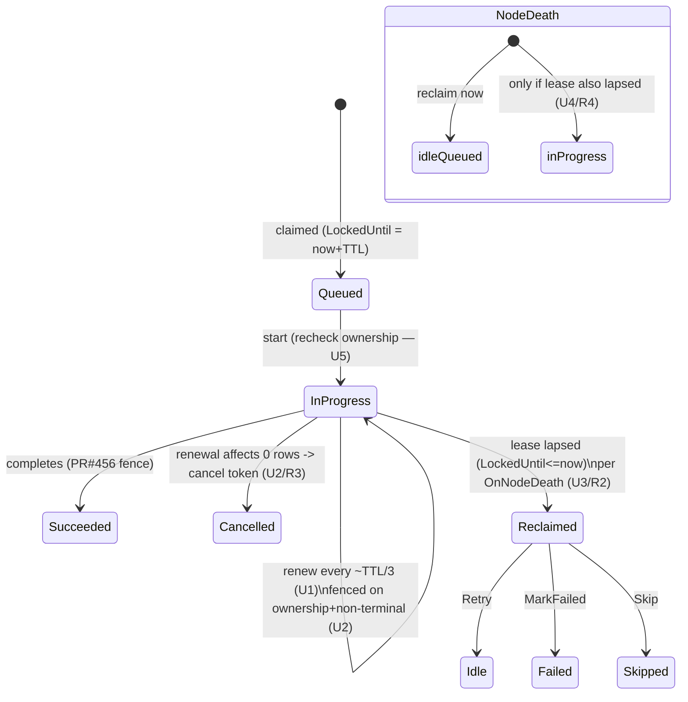

# feat: Sliding execution lease for running jobs (#316)

## Summary

Make the per-job lease **renewable while a job runs**. The owning worker periodically extends `LockedUntil` (slides the lease); a job that stops renewing — crashed or wedged on a live node — has its lease lapse and is reclaimed per its `OnNodeDeath` policy. This closes the one recovery gap in the current design (a job stuck `InProgress` on a still-heartbeating node is recovered by neither the claim predicate nor the dead-node sweep) and removes the burden of sizing the lease larger than the longest job runtime. It is the Hangfire sliding-invisibility / Temporal activity-heartbeat pattern, implemented on the existing lease column with no new store or package dependency.

Per-job renewal is owned by the execution handler (confirmed in planning): a running job's own execution loop renews its lease, so a stall is detected precisely and lease-loss naturally cancels that job.

---

## Problem Frame

Verified in source this session:
- `WhereCanAcquire` and `QueueTimedOutTimeJobs` both gate on `Status == Idle || Queued` — neither touches `InProgress`.
- The dead-node sweep (`ReleaseDeadNode*Resources`) only fires on a Coordination-declared node death.
- There is no lease renewal (#316 deferred).

So a job wedged `InProgress` on a node that keeps heartbeating is orphaned until the node itself dies. The fix is a per-job liveness signal — a renewed lease — that lets a stalled running job be reclaimed independently of node death, gated by the same `OnNodeDeath` policy that already governs the dead-node sweep.

---

## Requirements

Carried from origin (`see origin` for rationale):
- **R1** — Renew the running job's lease at ~⅓ TTL while it executes.
- **R2** — Reclaim `InProgress` rows whose lease lapsed, per `OnNodeDeath` (Retry → released; MarkFailed → Failed; Skip → Skipped).
- **R3** — Cancel the running job when the worker can no longer hold its lease (lost/lapsed).
- **R4** — Node-death sweep reclaims `Idle`/`Queued` immediately but defers `InProgress` to the per-job lease.
- **R5** — Defaults unchanged (`LeaseDuration` 5 min, `DeadThreshold` 30s); relax and re-document the "timeout > runtime" contract (now only the `Idle`→start gap needs it).

---

## Key Technical Decisions

- **KTD1 — Per-job renewal in the execution handler, not a batch sweep** (confirmed in planning). The job's execution loop renews its own lease, so a stall is detected at the granularity of the individual job and lease-loss maps directly to cancelling *that* job's `CancellationToken` (R3). A batch background renewal would be cheaper on the DB but cannot cleanly attribute loss to a specific running job for cancellation. (see origin: OQ1)
- **KTD2 — Renew on our own `LockedUntil`, not `IDistributedLease`.** Jobs depends on Coordination but not DistributedLocks; reusing the lock engine would add a dependency + a second lease store. Borrow its proven parameters (⅓-TTL cadence, cancel-on-loss) without its engine. (see origin: KTD1)
- **KTD3 — Renewal UPDATE is the loss detector.** The renew writes `LockedUntil = now + LeaseDuration` fenced on `OwnerId == me && Status` non-terminal (the existing `WhereOwnedBy` shape from PR #456's completion fence). Affected-rows == 0 means the lease was lost/reclaimed/terminalized → cancel the job. No separate liveness query. (see origin: OQ3)
- **KTD4 — Lease lapse drives a per-policy reclaim, reusing the sweep's transition logic.** The stalled-job reclaim applies the identical Retry→released / MarkFailed→Failed / Skip→Skipped transitions the dead-node sweep already implements — the trigger differs (lease lapse vs. node death), the transition does not.
- **KTD5 — `OnNodeDeath` stays the correctness authority.** Renewal changes liveness detection, not delivery semantics. Only `Retry` rows are speculatively released on lapse; `MarkFailed`/`Skip` go terminal, never re-run.

---

## High-Level Technical Design

Running-job lifecycle with the sliding lease (state shape, directional):

Two reclaim triggers converge on the same per-policy transition (KTD4): **lease lapse** (U3, any node — closes the gap) and **node death** (U4, deferring `InProgress` to the lease).

---

## Implementation Units

### U1. Per-job lease renewal while running
**Goal:** A running job's lease is extended on a cadence so a healthy long job is never falsely reclaimed (R1).
**Requirements:** R1; KTD1, KTD2.
**Dependencies:** none.
**Files:**
- `src/Headless.Jobs.Abstractions/JobsOptionsBuilder.cs` (`SchedulerOptionsBuilder`: renewal cadence, default ≈ `LeaseDuration`/3; validate `< LeaseDuration`)
- `src/Headless.Jobs.Abstractions/Interfaces/IJobPersistenceProvider.cs` (renew-lease method on the provider contract)
- `src/Headless.Jobs.Core/Src/JobsExecutionTaskHandler.cs` (drive renewal on a timer for the duration of execution)
- `src/Headless.Jobs.EntityFramework/Infrastructure/BasePersistenceProvider.cs` (renew = `ExecuteUpdate` `LockedUntil = now + LeaseDuration`)
- `src/Headless.Jobs.Core/Src/Provider/JobsInMemoryPersistenceProvider.cs` (mirror)
- `tests/Headless.Jobs.Tests.Unit/` (renewal cadence + provider renew behavior, with `FakeTimeProvider`)
**Approach:** The execution handler starts a renewal loop alongside the job task; it extends the lease every cadence interval until the job finishes or is cancelled. Cadence derives from `LeaseDuration` (⅓ TTL) so one missed renewal doesn't lapse the lease.
**Patterns to follow:** existing `LockedUntil` stamping in the claim path; `FakeTimeProvider` usage in `JobsOptionsBuilderTests`.
**Test scenarios:**
- A job running longer than `LeaseDuration` has its `LockedUntil` advanced past the original deadline (renewal fires).
- Renewal cadence defaults to `LeaseDuration`/3; configuring `>= LeaseDuration` is rejected at options validation.
- A job that finishes before the first renewal interval never renews (no spurious writes).
**Verification:** unit tests pass; a long-running job's lease stays ahead of `now` for its full duration against a `FakeTimeProvider`.

### U2. Cancel-on-loss via fenced renewal
**Goal:** A worker that can no longer hold its lease stops executing the job (R3).
**Requirements:** R3; KTD3.
**Dependencies:** U1.
**Files:**
- `src/Headless.Jobs.EntityFramework/Infrastructure/BasePersistenceProvider.cs` (renew fenced on `WhereOwnedBy(owner)` + non-terminal; return affected rows)
- `src/Headless.Jobs.Core/Src/Provider/JobsInMemoryPersistenceProvider.cs` (mirror)
- `src/Headless.Jobs.Core/Src/JobsExecutionTaskHandler.cs` (renewal returning 0 rows → cancel the job's `CancellationToken`)
- `tests/Headless.Jobs.Tests.Unit/`
**Approach:** Reuse PR #456's `WhereOwnedBy`-fence shape on the renew UPDATE. Affected-rows == 0 ⇒ lease lost (reclaimed, owner changed, or terminalized) ⇒ signal cancellation to the running job. Best-effort: a job ignoring its token still relies on `OnNodeDeath` for correctness.
**Test scenarios:**
- Renewal after the row's owner was changed by another node → 0 rows → cancellation requested.
- Renewal after the row was transitioned terminal → 0 rows → cancellation requested.
- Normal renewal on an owned `InProgress` row → 1 row → no cancellation.
**Verification:** unit tests prove 0-row renewal triggers cancellation and 1-row does not.

### U3. Stalled-job reclaim — lapsed-lease InProgress, per policy
**Goal:** Close the gap — an `InProgress` row whose lease lapsed is reclaimed per `OnNodeDeath`, independent of node death (R2). This is the core gap-closer.
**Requirements:** R2; KTD4, KTD5.
**Dependencies:** U1 (healthy jobs renew, so only genuinely-stalled rows lapse).
**Files:**
- `src/Headless.Jobs.Abstractions/Interfaces/IJobPersistenceProvider.cs` (reclaim-stalled method)
- `src/Headless.Jobs.EntityFramework/Infrastructure/BasePersistenceProvider.cs` (reclaim `InProgress && LockedUntil <= now` per policy: Retry→Idle+cleared lease, MarkFailed→Failed, Skip→Skipped; reuse the sweep's transition setters incl. PR#456 hygiene — clear `LockedUntil`, set `ExceptionMessage`/`SkippedReason`)
- `src/Headless.Jobs.Core/Src/Provider/JobsInMemoryPersistenceProvider.cs` (mirror)
- `src/Headless.Jobs.Core/Src/BackgroundServices/JobsFallbackBackgroundService.cs` (invoke the reclaim pass on the fallback cadence)
- conformance + unit tests (see U7)
**Approach:** A periodic pass (folded into the existing fallback service cadence) finds locally-relevant `InProgress` rows with a lapsed lease and applies the per-policy transition — the same transitions as the dead-node sweep, triggered by lease lapse instead of owner death. `Retry` rows return to `Idle` (re-claimable); `MarkFailed`/`Skip` go terminal.
**Patterns to follow:** `ReleaseDeadNode*Resources` per-policy transition + PR #456 terminal-row hygiene.
**Test scenarios:**
- `InProgress` + `Retry` + lapsed lease → `Idle`, lease cleared, re-claimable.
- `InProgress` + `MarkFailed` + lapsed → `Failed`, lease cleared, `ExceptionMessage` set, owner retained.
- `InProgress` + `Skip` + lapsed → `Skipped`, lease cleared, `SkippedReason` set.
- `InProgress` with a *valid* (future) lease → untouched (healthy renewing job).
- Idempotency: a second pass over already-reclaimed rows affects zero.
**Verification:** unit (in-memory) + conformance (U7) scenarios pass; a stalled job on a live node is recovered within ≈ one lease TTL.

### U4. Node-death sweep defers InProgress to the lease
**Goal:** A busy node whose running jobs still hold valid leases doesn't lose them to a membership blip (R4).
**Requirements:** R4.
**Dependencies:** U1, U3.
**Files:**
- `src/Headless.Jobs.EntityFramework/Infrastructure/BasePersistenceProvider.cs` (`ReleaseDeadNode*Resources`: `Idle`/`Queued` reclaim unchanged; `InProgress` arm gains `LockedUntil <= now`)
- `src/Headless.Jobs.Core/Src/Provider/JobsInMemoryPersistenceProvider.cs` (mirror)
- conformance + unit tests (see U7)
**Approach:** Add the lease-lapsed condition to the sweep's `InProgress` transitions only. `Idle`/`Queued` (never started) still reclaim immediately on node death — fast recovery of not-yet-started work preserved.
**Test scenarios:**
- Dead node, `InProgress` + valid lease → **not** reclaimed by the sweep (U3 handles it once the lease lapses).
- Dead node, `InProgress` + lapsed lease → reclaimed per policy.
- Dead node, `Idle`/`Queued` → reclaimed immediately (unchanged).
**Verification:** conformance scenarios pass on both DB providers; the existing dead-node sweep tests still pass for `Idle`/`Queued`.

### U5. Claim→start ownership recheck
**Goal:** Close the window where a `Queued` row's lease lapses and is re-claimed by another node before the original worker starts it (OQ2).
**Requirements:** R2 (correctness of the claim→start transition).
**Dependencies:** none (independent; verify-first).
**Files:**
- `src/Headless.Jobs.EntityFramework/Infrastructure/BasePersistenceProvider.cs` / `src/Headless.Jobs.Core/Src/JobsExecutionTaskHandler.cs` (wherever `Queued → InProgress` is written)
- unit tests
**Execution note:** Characterize first — read the current `Queued → InProgress` transition and add a failing test for the lapse-then-reclaim race before changing it. May be a no-op if the transition already fences on ownership.
**Test scenarios:**
- A worker that claimed a `Queued` row, then lost it (lease lapsed + re-claimed by another owner), does **not** transition it to `InProgress` under its own ownership.
- Normal claim→start on a still-owned row succeeds.
**Verification:** the race test passes; if verification shows the transition is already fenced, record that and close the unit as no-op with the test added as a regression guard.

### U6. Config contract, startup warning, and docs
**Goal:** Reflect that renewal removes the "timeout > runtime" burden for running jobs (R5).
**Requirements:** R5; KTD1.
**Dependencies:** U1.
**Files:**
- `src/Headless.Jobs.Core/Src/BackgroundServices/JobsInitializationHostedService.cs` (revise the `LeaseDuration < FallbackIntervalChecker` warning to reflect renewal; warn instead on renewal-cadence misconfig if useful)
- `src/Headless.Jobs.Core/README.md`, `docs/llms/jobs.md` (document the sliding lease, the renewal cadence option, and that running jobs no longer need `LeaseDuration` > runtime)
**Test scenarios:** `Test expectation: none -- docs + warning-text change; warning-fires behavior covered by U1 options-validation tests.`
**Verification:** docs describe the renewal model; startup warning text matches the new contract.

### U7. Cross-provider conformance
**Goal:** Prove the sliding-lease behavior holds identically on Postgres, SqlServer, and in-memory.
**Requirements:** R1–R4; success criteria.
**Dependencies:** U1–U4.
**Files:**
- `tests/Headless.Jobs.EntityFramework.Tests.Harness/JobsCoordinationConformanceTests.cs` (+ `JobsCoordinationFixtureBase.cs` if a seed/read helper is needed for `InProgress` + lease)
- `tests/Headless.Jobs.EntityFramework.PostgreSql.Tests.Integration/PostgreSqlConformanceTests.cs`, `.SqlServer.../SqlServerConformanceTests.cs` (`[Fact]` overrides)
**Test suite design:** extend the existing harness (same pattern as PR #456's fence/cron conformance). In-memory unit tests own the deterministic scenarios; the harness owns the real transactional behavior (Postgres + SqlServer, CI-only — no local Docker).
**Test scenarios:**
- Renewal extends a running row's lease across what would have been its original deadline.
- Lapsed-lease `InProgress` `Retry` row is reclaimed to `Idle`; `MarkFailed`/`Skip` go terminal with hygiene fields set.
- Node-death sweep leaves a valid-lease `InProgress` row untouched but reclaims a lapsed-lease one.
- Idempotency: a second reclaim pass affects zero rows.
**Verification:** conformance compiles and is green in CI on both DB providers; in-memory scenarios green locally.

---

## Scope Boundaries

### In scope
R1–R5 across both providers + cross-provider conformance: renewal, cancel-on-loss, stalled-job reclaim, node-death/lease interaction, claim→start recheck, config/docs.

### Deferred to Follow-Up Work
- Checkpoint/resume (carry progress so a reclaimed job resumes mid-work — Temporal heartbeat-details style).
- Configurable monitoring mode (None/Monitor/AutoExtend à la DistributedLocks); ship one sensible cadence first.

### Outside this plan
- Durable-execution / event-sourced replay (different product).
- Per-message at-most-once for Messaging (#263).
- Reusing `IDistributedLease` (KTD2).

---

## Risks & Dependencies

- **No local Docker** → U3/U4/U7 conformance validates in CI; in-memory unit tests are the local gate (same posture as PR #456). EF translation of the lapsed-lease predicate must stay server-side (scalar comparison — low risk).
- **Local build needs the `read:packages` token** + SDK 10.0.301 (established this session).
- **Thread-pool starvation** (recorded assumption): a fully CPU-pegged node delays both node-heartbeat and lease renewal; the lease can't save a starved node from itself. Out of band — operational + `OnNodeDeath`.
- **Renewal write load** — per-job renewal adds a periodic `UPDATE` per running job at ⅓ TTL. At default 5 min that's ~one write/90s/running-job — negligible, but the cadence is configurable if a deployment runs thousands of concurrent long jobs.
- **Stacks on PR #456** — reuses its `WhereOwnedBy` fence and terminal-row hygiene; sequence after #456 merges.

---

## Sources & Research

- Origin: `docs/brainstorms/2026-06-16-jobs-sliding-execution-lease-requirements.md` (R1–R5, KTDs, OQ1–OQ3, the cross-library landscape).
- In-repo (verified): claim/timed-out predicates gate on `Idle`/`Queued`; sweep per-policy transitions + PR #456 hygiene; `WhereOwnedBy` fence; `SchedulerOptionsBuilder` defaults; `JobsFallbackBackgroundService` cadence; Coordination node-level heartbeat; DistributedLocks `AutoExtend` (not depended on).
- External (verified, load-bearing for KTD1/KTD2): Hangfire `SlidingInvisibilityTimeout` (worker-renewed, 5 min default); Temporal activity heartbeat (per-job liveness + cancel-on-loss); Quartz/Sidekiq/TickerQ lack per-job renewal — this enhancement is the feature separating the engine tier from the scheduler tier.
