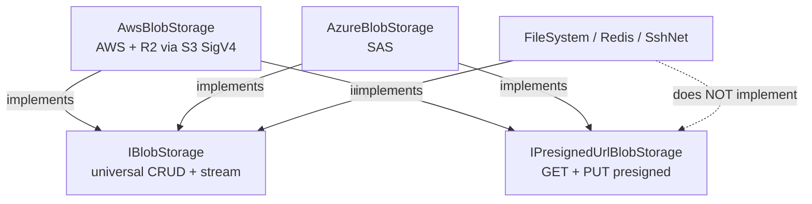
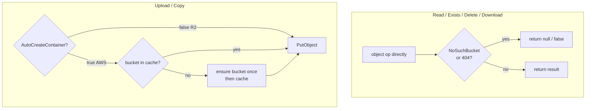

# feat: Cloudflare R2 blob backend + presigned URLs

## Summary

Add a dedicated `Headless.Blobs.CloudflareR2` package that runs R2 as a private, cost-saving S3 replacement on the reused `AwsBlobStorage` engine with R2-correct client config. Introduce an `IPresignedUrlBlobStorage` capability interface (presigned GET + PUT) implemented by the S3 engine (AWS + R2) and the Azure provider via SAS. Refactor the shared `AwsBlobStorage` engine to drop the per-operation bucket round trips.

---

## Problem Frame

R2 is S3-compatible but unusable through the current AWS provider. `SetupAwsS3.AddAwsS3BlobStorage` accepts only `AWSOptions`, which cannot set `ForcePathStyle` or the SDK v4 checksum knobs; on `AWSSDK.S3 4.0.23.3` the flexible-checksum default (`WHEN_SUPPORTED`) emits framing R2 rejects. R2 also has no ACL concept, while the engine always sets `CannedACL`.

`AwsBlobStorage` issues a `HeadBucket` (and sometimes `PutBucket`) before almost every object operation — uploads auto-create on each call, reads/exists/delete pre-check existence. That is wasted latency on S3 and a hard failure on R2, whose API tokens are commonly object-scoped and cannot create buckets.

Presigned URLs are advertised in `src/Headless.Blobs.Aws/README.md` but do not exist: `IBlobStorage` has no URL surface and no provider implements one. The migration use case — serving private objects to clients for a bounded time — needs them. (see origin: `docs/brainstorms/2026-06-19-blobs-cloudflare-r2-requirements.md`)

---

## Requirements

**Packaging and R2 client**

- R1. `Headless.Blobs.CloudflareR2` references `Headless.Blobs.Aws` and uses `AwsBlobStorage` as its engine without duplicating S3 logic.
- R2. The R2 `IAmazonS3` is configured with `ServiceURL` from the account id (and optional jurisdiction), `ForcePathStyle = true`, region `auto`, and `RequestChecksumCalculation` / `ResponseChecksumValidation = WHEN_REQUIRED`.
- R3. R2 options bind account id, access key, secret key, and optional jurisdiction (default / EU / FedRAMP). Registration is `AddCloudflareR2BlobStorage` exposing the options trio (`IConfiguration`, `Action<TOptions>`, `Action<TOptions, IServiceProvider>`).
- R4. R2 defaults are R2-safe: `CannedAcl = null`, `UseChunkEncoding = false`, `DisablePayloadSigning = true`, `AutoCreateContainer = false`.
- R5. R2 ships a naming normalizer enforcing R2 bucket rules — 3–63 chars, lowercase letters, digits, and hyphens, no dots.

**Shared engine refactor (`Headless.Blobs.Aws`)**

- R6. Read, exists, delete, and download paths no longer pre-check bucket existence; the object operation runs directly and `NoSuchBucket` / 404 maps to not-found or null, the same as a missing key.
- R7. Auto-create on upload and copy is gated by `AutoCreateContainer` (AWS default true, R2 default false); when off, a missing bucket surfaces as a clear error.
- R8. When auto-create is on, the bucket existence/create call runs at most once per bucket per storage instance; explicit `CreateContainerAsync` always creates regardless of the flag and primes the cache.

**Presigned URLs**

- R9. `Headless.Blobs.Abstractions` defines `IPresignedUrlBlobStorage` with a presigned-download (GET) method and a presigned-upload (PUT) method, each taking container, blob name, and an expiry.
- R10. `AwsBlobStorage` implements it via S3 SigV4 (covering AWS and R2); the Azure provider implements it via SAS. FileSystem, Redis, and SshNet do not implement it.
- R11. Consumers obtain the capability by feature detection (`storage is IPresignedUrlBlobStorage`) or direct injection; a provider that lacks it is detectable without a runtime `NotSupportedException`.

**Testing and drift durability**

- R12. A creds-gated R2 integration project reuses the cross-provider conformance suite against real R2 and skips cleanly when R2 credentials are absent.
- R13. The R2 conformance run is a required check on `AWSSDK.*` dependency-update PRs; no scheduled run.
- R14. Presigned GET and PUT round-trips are covered by tests for AWS and Azure (fetch/upload through the signed URL, with an expiry boundary check).

**Documentation**

- R15. Update `docs/llms/blobs.md` and the affected READMEs (`Headless.Blobs.Aws`, `Headless.Blobs.Azure`, new `Headless.Blobs.CloudflareR2`) for the new package, the presigned capability, the auto-create change, and R2 setup; fix the stale `BucketName` claim in the AWS README.

---

## Key Technical Decisions

- KTD1. **Reuse `AwsBlobStorage` for R2; no separate engine type.** R2's data plane is pure S3 and `AwsBlobStorage` talks only to `IAmazonS3` (`src/Headless.Blobs.Aws/AwsBlobStorage.cs`), so a separate engine would duplicate it.
- KTD2. **Pin request shaping in the R2 client config**, not per-request. Set `RequestChecksumCalculation` / `ResponseChecksumValidation = WHEN_REQUIRED` plus `ForcePathStyle` / region `auto` on the R2 `AmazonS3Config`. One place, immune to future SDK default flips. Fallback if live R2 still rejects writes: per-request `DisableDefaultChecksumValidation = true` (the lever the reference library uses on its pinned `4.0.7.1`).
- KTD3. **Presigned URLs as a capability interface**, not members on `IBlobStorage`. FileSystem/Redis/SshNet have no signing concept; a capability interface keeps `IBlobStorage` universal and avoids runtime `NotSupportedException` holes.
- KTD4. **Presigned signatures are `ValueTask<Uri>` with a relative `TimeSpan` expiry.** `ValueTask` accommodates Azure's user-delegation-key path (an async call); relative expiry is the common ergonomic and maps to both `GetPreSignedURL` (`Expires`) and `GenerateSasUri`.
- KTD5. **`AutoCreateContainer` lives on the shared `AwsBlobStorageOptions`** (AWS default true), because the shared engine reads it; R2 sets it false. Bucket existence/create is cached once per bucket per instance to cut round trips.
- KTD6. **`NoSuchBucket` maps to not-found/null** on read/exists/delete after the pre-check is removed, preserving today's null-on-missing contract (the catch sites already handle 404 `NoSuchKey`).
- KTD7. **R2 setup follows the options-trio shape** (like Azure/FileSystem/Redis/SshNet), not the AWS-provider outlier. AWS skips the trio only because the AWS SDK owns `AWSOptions` and the credential chain; R2 owns a normal options class.
- KTD8. **Azure presigned throws `InvalidOperationException` at call-time when the client cannot sign.** `AzureBlobStorage` receives an injected `BlobServiceClient` (`src/Headless.Blobs.Azure/AzureBlobStorage.cs:18-26`); SAS works only when it carries an account key or user-delegation key (`CanGenerateSasUri`). The capability is present on the type; signing ability depends on consumer wiring.
- KTD9. **The R2 conformance gate is net-new CI.** `ci.yml` runs no integration tests and dependency automation is Dependabot with grouped nuget bumps. Deliver a dedicated creds-gated workflow plus an `AWSSDK.*` Dependabot group; marking the check "required" is an out-of-repo branch-protection step documented in the plan.

---

## High-Level Technical Design

**Capability surface — who implements what.**



R2 reuses `AwsBlobStorage`, so implementing `IPresignedUrlBlobStorage` once on the S3 engine covers both AWS and R2; the R2-configured `IAmazonS3` produces R2-host presigned URLs.

**Read/write path after the engine refactor.**



The bucket-existence cache must create at most once under concurrent uploads and must not cache a failed creation. Direction: a per-instance `ConcurrentDictionary` keyed by bucket holding a single-flight task; evict on failure so a transient error doesn't poison the cache. Exact structure is the implementer's call.

---

## Output Structure

```text
src/Headless.Blobs.CloudflareR2/
  Headless.Blobs.CloudflareR2.csproj   # references Headless.Blobs.Aws
  Setup.cs                             # AddCloudflareR2BlobStorage (options trio)
  R2BlobStorageOptions.cs              # AccountId, AccessKey, SecretKey, Jurisdiction(+validator)
  R2BlobNamingNormalizer.cs            # R2 bucket rules (no dots)
  README.md

tests/Headless.Blobs.CloudflareR2.Tests.Integration/
  Headless.Blobs.CloudflareR2.Tests.Integration.csproj
  CloudflareR2BlobStorageFixture.cs    # creds-gated, real R2 endpoint
  CloudflareR2BlobStorageTests.cs      # re-declares BlobStorageTestsBase scenarios

src/Headless.Blobs.Abstractions/
  IPresignedUrlBlobStorage.cs          # new capability interface
```

The per-unit `Files` lists remain authoritative; the implementer may adjust layout.

---

## Implementation Units

### U1. Presigned URL capability interface

- **Goal:** Define the capability contract both S3 and Azure backends will implement.
- **Requirements:** R9, R11
- **Dependencies:** none
- **Files:** `src/Headless.Blobs.Abstractions/IPresignedUrlBlobStorage.cs`
- **Approach:** `[PublicAPI]` interface with `ValueTask<Uri> GetPresignedDownloadUrlAsync(string[] container, string blobName, TimeSpan expiry, CancellationToken ct = default)` and a matching upload (PUT) method. Mirror the `container` + `blobName` shape and XML-doc style of `IBlobStorage`. Document that absence of the interface means the provider cannot sign URLs (KTD3).
- **Patterns to follow:** `src/Headless.Blobs.Abstractions/IBlobStorage.cs` (member shape, `[PublicAPI]`, file header).
- **Test scenarios:** Test expectation: none -- pure interface contract, exercised by U3 and U6 implementer tests.
- **Verification:** Compiles; the interface surface matches R9 (download + upload, expiry, returns `Uri`).

### U2. Shared engine refactor: bucket pre-check removal + opt-in cached auto-create

- **Goal:** End the per-operation bucket round trips and make auto-create opt-in, on the shared engine.
- **Requirements:** R6, R7, R8
- **Dependencies:** none
- **Files:** `src/Headless.Blobs.Aws/AwsBlobStorage.cs`, `src/Headless.Blobs.Aws/AwsBlobStorageOptions.cs`, `tests/Headless.Blobs.Aws.Tests.Unit/` (engine tests), `tests/Headless.Blobs.Aws.Tests.Integration/AwsBlobStorageTests.cs`
- **Approach:** Add `bool AutoCreateContainer = true` to `AwsBlobStorageOptions`. In `OpenReadStreamAsync`, `ExistsAsync`, `GetBlobInfoAsync`, `DeleteAsync`, remove the `DoesS3BucketExistV2Async` pre-check (`AwsBlobStorage.cs:468`, reached at `:506`, `:179`) and let the object op run, catching `NoSuchBucket` alongside the existing 404/`NoSuchKey` handling → return null/false (KTD6). In `UploadAsync` (`:69`) and `CopyAsync` (`:387`), gate the create on `AutoCreateContainer`; when on, route through the once-per-bucket cache. Keep `CreateContainerAsync` always creating and priming the cache.
- **Execution note:** Characterization-first — add coverage pinning current read/exists/delete null-on-missing behavior before removing the pre-check.
- **Patterns to follow:** existing `AmazonS3Exception` 404 catch blocks in `AwsBlobStorage.cs`; storage-initializer idempotent-create + existence-cache thinking in `docs/solutions/best-practices/storage-initializer-lifecycle-correctness.md`.
- **Test suite design:** Unit tests in `Headless.Blobs.Aws.Tests.Unit` with a mocked `IAmazonS3` (NSubstitute) for the cache and flag logic; behavior assertions against LocalStack in `Headless.Blobs.Aws.Tests.Integration`.
- **Test scenarios:**
  - Covers R6. GetBlobInfo / OpenReadStream / Exists / Delete against a missing bucket → returns null/false, no throw.
  - Covers R7. `AutoCreateContainer = false` + missing bucket + Upload → throws a clear bucket-not-found error; no `PutBucket` issued.
  - Covers R7. `AutoCreateContainer = true` + missing bucket + Upload → bucket created, object stored.
  - Covers R8. 100 sequential uploads to the same bucket (auto-create on) → at most one existence/create call (assert via mock call count).
  - Covers R8. Concurrent uploads to the same missing bucket → create runs exactly once; all succeed.
  - Covers R8. Explicit `CreateContainerAsync` then Upload with auto-create off → upload succeeds (explicit create is independent of the flag).
  - Edge: first create fails (transient), retried upload → create is reattempted (failure not cached).
- **Verification:** Planned tests added and passing; existing AWS integration tests updated to the new behavior and green.

### U3. Presigned URLs on the S3 engine (AWS + R2)

- **Goal:** Implement `IPresignedUrlBlobStorage` on `AwsBlobStorage`.
- **Requirements:** R9, R10, R14
- **Dependencies:** U1
- **Files:** `src/Headless.Blobs.Aws/AwsBlobStorage.cs`, `tests/Headless.Blobs.Aws.Tests.Unit/`, `tests/Headless.Blobs.Aws.Tests.Integration/AwsBlobStorageTests.cs`
- **Approach:** Implement the interface using the SDK presigned API (`GetPreSignedURL` / `GetPreSignedUrlRequest` with `Verb = HttpVerb.GET`/`PUT`, `Expires = clock.UtcNow + expiry`), building bucket+key via the existing `_BuildObjectKey` path. No new options. The R2-configured client (U5) produces R2-host URLs automatically.
- **Patterns to follow:** existing key/bucket construction and `IClock` usage in `AwsBlobStorage.cs`.
- **Test suite design:** Unit for URL composition (verb, expiry, host) with a configured client; integration round-trip against LocalStack (supports presigned GET/PUT) in the AWS integration project.
- **Test scenarios:**
  - Covers AE5, R14. Generate download URL, fetch with an unauthenticated HTTP client before expiry → 200 with object bytes.
  - Covers AE5, R14. Fetch the same URL after expiry → denied.
  - Covers R14. Generate upload (PUT) URL, PUT bytes through it unauthenticated → object readable via normal download.
  - Presigned URL host/path reflects `ForcePathStyle` and the configured endpoint.
- **Verification:** Planned tests added and passing; AWS integration round-trip green locally.

### U4. R2 package: options + naming normalizer

- **Goal:** Create the package with its options surface and R2-correct bucket naming.
- **Requirements:** R1, R3, R5
- **Dependencies:** none
- **Files:** `src/Headless.Blobs.CloudflareR2/Headless.Blobs.CloudflareR2.csproj`, `src/Headless.Blobs.CloudflareR2/R2BlobStorageOptions.cs`, `src/Headless.Blobs.CloudflareR2/R2BlobNamingNormalizer.cs`, `tests/Headless.Blobs.CloudflareR2.Tests.Unit/`
- **Approach:** New project on `Headless.NET.Sdk`, referencing `Headless.Blobs.Aws` (transitively the abstractions). `R2BlobStorageOptions`: `AccountId`, `AccessKeyId`, `SecretAccessKey`, optional `Jurisdiction` (enum default/EU/FedRAMP), optional explicit `EndpointUrl`; `internal sealed` FluentValidation validator requiring account id + keys (correctness gate, no I/O — see `docs/solutions/architecture-patterns/startup-validation-gate-two-tier-mode-and-env-defaults.md`). `R2BlobNamingNormalizer` mirrors `AwsBlobNamingNormalizer` but strips dots and enforces 3–63 lowercase/digit/hyphen. Attach the project to `headless-framework.slnx`.
- **Patterns to follow:** `src/Headless.Blobs.Aws/AwsBlobNamingNormalizer.cs`; options+validator co-location per CLAUDE.md.
- **Test suite design:** Unit tests in a new `Headless.Blobs.CloudflareR2.Tests.Unit`.
- **Test scenarios:**
  - Covers R5. Container name with dots → dots removed; uppercase → lowercased; >63 chars → truncated; <3 chars → padded.
  - Covers R5. Name with invalid characters → stripped to the allowed set.
  - Covers R3. Validator fails when account id / access key / secret key is missing or blank; passes when all present.
  - Endpoint derivation: jurisdiction default/EU/FedRAMP produces the expected host; explicit `EndpointUrl` overrides jurisdiction.
- **Verification:** Planned tests added and passing; project builds under warnings-as-errors and is in the solution.

### U5. R2 setup / DI

- **Goal:** Wire `AddCloudflareR2BlobStorage` to build the R2 client, apply R2-safe defaults, and reuse the engine.
- **Requirements:** R1, R2, R3, R4
- **Dependencies:** U2, U4
- **Files:** `src/Headless.Blobs.CloudflareR2/Setup.cs`, `tests/Headless.Blobs.CloudflareR2.Tests.Unit/`
- **Approach:** `extension(IServiceCollection services)` block exposing the trio (`IConfiguration` / `Action<R2BlobStorageOptions>` / `Action<R2BlobStorageOptions, IServiceProvider>`), each delegating to a private `_AddCloudflareR2Core`. Core: register options via `services.Configure<R2BlobStorageOptions, R2BlobStorageOptionsValidator>` (`Headless.Hosting`); register a singleton `IAmazonS3` built from the options as an `AmazonS3Config` per KTD2 with `BasicAWSCredentials`; configure `AwsBlobStorageOptions` with R2-safe defaults (R4, `AutoCreateContainer = false`); `TryAddSingleton<IBlobNamingNormalizer, R2BlobNamingNormalizer>`; `AddSingleton<IBlobStorage, AwsBlobStorage>`.
- **Patterns to follow:** `src/Headless.Blobs.Aws/Setup.cs` (S3 client + `IBlobStorage` registration); the trio shape in `src/Headless.Blobs.Azure/Setup.cs`; keyed-vs-unkeyed `IAmazonS3` guidance in `docs/solutions/conventions/keyed-services-for-overridable-abstractions.md` if R2 must coexist with an app-wide S3 client.
- **Test suite design:** Unit tests resolving the service provider and asserting registrations + config values (no network).
- **Test scenarios:**
  - Covers R2. Resolved `IAmazonS3` config has the R2 `ServiceURL`, `ForcePathStyle = true`, region `auto`, and checksum settings `WHEN_REQUIRED`.
  - Covers R4. Resolved `AwsBlobStorageOptions` has `CannedAcl = null`, `UseChunkEncoding = false`, `DisablePayloadSigning = true`, `AutoCreateContainer = false`.
  - Covers R1. `IBlobStorage` resolves to `AwsBlobStorage`; `R2BlobNamingNormalizer` is the registered normalizer.
  - Covers R3. Each overload (config section, action, action+provider) registers and validates options.
  - Resolved `IBlobStorage` is assignable to `IPresignedUrlBlobStorage` (R2 inherits presigned via the engine).
- **Verification:** Planned tests added and passing.

### U6. Azure presigned via SAS

- **Goal:** Implement `IPresignedUrlBlobStorage` on `AzureBlobStorage`.
- **Requirements:** R9, R10, R14
- **Dependencies:** U1
- **Files:** `src/Headless.Blobs.Azure/AzureBlobStorage.cs`, `tests/Headless.Blobs.Azure.Tests.Unit/`, `tests/Headless.Blobs.Azure.Tests.Integration/AzureStorageTests.cs`
- **Approach:** Implement the interface using `BlobClient.GenerateSasUri(BlobSasBuilder)` for the account-key path; map download→`BlobSasPermissions.Read`, upload→`Write` (`Create`), `ExpiresOn = clock.UtcNow + expiry`. Before generating, check `CanGenerateSasUri`; when false, throw `InvalidOperationException` with a message explaining the client lacks signing credentials (KTD8). User-delegation-key support (AAD-wired clients) may be added behind the same method via the async delegation-key call; scope the call-time path to account-key first and note delegation as follow-up if the injected client is AAD-only.
- **Patterns to follow:** `BlobContainerClient`/`BlobClient` derivation in `src/Headless.Blobs.Azure/AzureBlobStorage.cs:586-587`.
- **Test suite design:** Unit for the `CanGenerateSasUri == false` throw path (mock/stub client); integration round-trip against Azurite (account-key connection → `CanGenerateSasUri` true) in the Azure integration project.
- **Test scenarios:**
  - Covers R10, KTD8. Client without signing credentials → presigned call throws `InvalidOperationException`.
  - Covers AE5, R14. Account-key client: generate download SAS, fetch before expiry → 200; after expiry → denied.
  - Covers R14. Generate upload SAS, PUT through it → object readable.
- **Verification:** Planned tests added and passing; Azurite round-trip green locally.

### U7. R2 conformance test project (creds-gated)

- **Goal:** Run the cross-provider conformance suite against real R2.
- **Requirements:** R12
- **Dependencies:** U5
- **Files:** `tests/Headless.Blobs.CloudflareR2.Tests.Integration/Headless.Blobs.CloudflareR2.Tests.Integration.csproj`, `tests/Headless.Blobs.CloudflareR2.Tests.Integration/CloudflareR2BlobStorageFixture.cs`, `tests/Headless.Blobs.CloudflareR2.Tests.Integration/CloudflareR2BlobStorageTests.cs`
- **Approach:** New `Headless.NET.Sdk.Test` project referencing `Headless.Blobs.Tests.Harness`, `Headless.Blobs.CloudflareR2`, and `Headless.Testing`. The fixture reads R2 creds from env vars and builds the R2-configured `AwsBlobStorage`; when creds are absent, every scenario calls `Assert.Skip`. The test class re-declares the `BlobStorageTestsBase` scenarios with `[Fact]` and `base.<name>()` (no Testcontainer — there is no R2 emulator). Add an R2-specific presigned round-trip scenario beyond the base suite.
- **Patterns to follow:** `tests/Headless.Blobs.Aws.Tests.Integration/AwsBlobStorageTests.cs` (re-declare-and-delegate); `tests/Headless.Blobs.Tests.Harness/BlobStorageTestsBase.cs` (`GetStorage()` seam). Do not copy fixtures across projects (CLAUDE.md anti-pattern).
- **Test suite design:** This unit *is* the integration suite; it owns R2 conformance. Skip-when-no-creds keeps local/PR runs green.
- **Test scenarios:**
  - Covers R12. Full `BlobStorageTestsBase` suite passes against real R2 when creds are present.
  - Covers R12. With creds absent, the suite skips (does not fail).
  - R2 presigned GET/PUT round-trip against the real endpoint (validates KTD2 checksum settings don't break signed access).
- **Verification:** Suite green against a real R2 bucket with creds; skips cleanly without.

### U8. CI: creds-gated R2 conformance workflow + Dependabot group

- **Goal:** Run R2 conformance as a check on AWS SDK bumps.
- **Requirements:** R13
- **Dependencies:** U7
- **Files:** `.github/workflows/r2-conformance.yml` (new), `.github/dependabot.yml`
- **Approach:** New workflow triggered on PRs that touch `Directory.Packages.props` (or carry an `aws-sdk` label), running `make test-project TEST_PROJECT=tests/Headless.Blobs.CloudflareR2.Tests.Integration/...` with R2 creds from repo secrets behind a protected GitHub Environment; the suite self-skips when secrets are unset (forks). Add an `AWSSDK.*`-keyed group to the `nuget` ecosystem in `dependabot.yml` so SDK bumps arrive as a distinct PR rather than folded into `nuget-minor-patch`. Marking the check "required" is branch-protection config — document it in U9, do not attempt in-repo.
- **Patterns to follow:** existing job/Environment usage in `.github/workflows/ci.yml`; the grouped-ecosystem shape in `.github/dependabot.yml`.
- **Test scenarios:** Test expectation: none -- CI configuration; validated by the workflow running green on a test PR that bumps an `AWSSDK.*` version.
- **Verification:** Workflow parses and runs on a synthetic AWS-SDK-bump PR; skips on a fork without secrets; Dependabot config validates.

### U9. Documentation

- **Goal:** Sync agent-facing docs and READMEs with the new surface.
- **Requirements:** R15
- **Dependencies:** U3, U5, U6
- **Files:** `docs/llms/blobs.md`, `src/Headless.Blobs.Aws/README.md`, `src/Headless.Blobs.Azure/README.md`, `src/Headless.Blobs.CloudflareR2/README.md`
- **Approach:** Add the `Headless.Blobs.CloudflareR2` section to `docs/llms/blobs.md` (problem solved, setup, config, R2-safe defaults, presigned). Document the `IPresignedUrlBlobStorage` capability and the auto-create behavior change in the Aws/Azure surfaces. Document the Azure SAS signing-credential requirement (KTD8) and the R2 object-token / pre-create-bucket limitation. Fix the stale `BucketName` Quick Start in the AWS README. Add the branch-protection "make the R2 check required" manual setup note. Follow `docs/authoring/AUTHORING.md` and keep `docs/llms/blobs.md` ↔ READMEs in lockstep.
- **Patterns to follow:** existing provider sections in `docs/llms/blobs.md`; `src/Headless.Blobs.Aws/README.md` structure.
- **Test scenarios:** Test expectation: none -- documentation.
- **Verification:** Docs build/lint clean; llms ↔ README parity holds; no remaining `BucketName` reference.

---

## Testing Strategy

- **Unit** (`Headless.Blobs.Aws.Tests.Unit`, `Headless.Blobs.Azure.Tests.Unit`, new `Headless.Blobs.CloudflareR2.Tests.Unit`): engine flag/cache logic with mocked `IAmazonS3`, presigned URL composition, the Azure no-signing throw path, R2 normalizer/options/validator, R2 DI registration assertions.
- **Integration** (`Headless.Blobs.Aws.Tests.Integration` on LocalStack, `Headless.Blobs.Azure.Tests.Integration` on Azurite): behavior of the engine refactor and presigned GET/PUT round trips. These run locally via `make test-integration`; CI does not run them today.
- **Conformance** (new `Headless.Blobs.CloudflareR2.Tests.Integration`): reuses `BlobStorageTestsBase` against real R2, creds-gated with `Assert.Skip`. No R2 emulator exists, so this is the authoritative R2 signal and the only suite wired into CI (U8).
- New infrastructure: the creds-gated R2 fixture (no Testcontainer) and the R2 unit test project. All other suites reuse existing harness/fixtures.

---

## Scope Boundaries

**Deferred for later** (carried from origin)

- Public / CDN access, including R2 custom domains and `r2.dev`. Does not help presigned URLs (SigV4 and SAS bind to the storage host).
- Multipart upload / large-file streaming refactor. The single-PUT ~5 GiB cap and in-memory buffering of non-seekable streams remain.
- Presigned POST-form and multipart-part URLs (ride with the multipart work).
- Scheduled / nightly conformance runs (bump-PR-only by decision).
- Multi-account named R2 clients and keyed-DI factories.

**Deferred to Follow-Up Work**

- Azure user-delegation-key (AAD-wired client) presigned path, if the account-key path in U6 proves insufficient for a consumer.
- Migrating the Blobs feature to the unified `Headless{Feature}SetupBuilder` pattern — out of scope; R2 follows the existing plain-extension convention (see `docs/solutions/architecture-patterns/unified-provider-setup-builder-pattern.md`).
- Capturing the R2 checksum/signing resolution and presigned design as `docs/solutions/` entries once the work lands (via `x-compound`).

---

## Risks & Dependencies

- **SDK checksum resolution unverified against live R2.** KTD2's config-level lever is ~90% confident on `4.0.23.3`; only a real R2 round-trip (U7) confirms it. Fallback is per-request `DisableDefaultChecksumValidation`. Mitigation: U7 runs before declaring R2 done.
- **`AWSSDK.S3` is centrally shared** (`Directory.Packages.props:21-22`) across Blobs.Aws/SES/SNS/SQS; no separate pin for R2. Durability rests on KTD2's explicit config plus the U8 bump gate.
- **Azure SAS depends on consumer client wiring.** A `BlobServiceClient` built from a bare SAS-token or anonymous connection cannot sign; KTD8 surfaces this as a clear runtime error, documented in U9.
- **R2 object-scoped tokens cannot create buckets.** R2 defaults `AutoCreateContainer = false`; pre-creating buckets out of band is a documented requirement, not a bug.
- **Engine refactor changes existing AWS provider behavior** (R6–R8). Accepted as greenfield; U2 updates existing AWS tests.
- **CI integration testing is greenfield** (KTD9). The U8 workflow is net-new and the "required check" step is out-of-repo branch protection.

---

## Acceptance Examples

- AE1. **Covers R7.** R2 storage (auto-create off), bucket missing. **When** a blob is uploaded, **then** the call fails with a clear bucket-not-found error rather than creating the bucket. (U2)
- AE2. **Covers R6.** Bucket missing. **When** `GetBlobInfoAsync` or `OpenReadStreamAsync` is called, **then** it returns null instead of throwing. (U2)
- AE3. **Covers R8.** AWS storage (auto-create on). **When** 100 blobs are uploaded to the same bucket, **then** the bucket existence/create call is issued at most once. (U2)
- AE4. **Covers R11.** FileSystem storage. **When** a consumer evaluates `storage is IPresignedUrlBlobStorage`, **then** the result is false and no exception is thrown. (U1)
- AE5. **Covers R9, R10.** A presigned download URL is generated with a short expiry. **When** an unauthenticated client fetches it before expiry, **then** it receives the object; after expiry, **then** the request is denied. (U3, U6)

---

## Documentation / Operational Notes

- New repo secrets for U8 (`R2_ACCOUNT_ID`, `R2_ACCESS_KEY_ID`, `R2_SECRET_ACCESS_KEY`), placed behind a protected GitHub Environment as the push jobs already do.
- Branch-protection: mark the R2 conformance check required on `AWSSDK.*` bump PRs — a manual GitHub setting, documented in U9, not expressible in-repo.
- `docs/llms/blobs.md` and the provider READMEs must stay in lockstep per `docs/authoring/AUTHORING.md`.

---

## Sources / Research

- `src/Headless.Blobs.Aws/AwsBlobStorage.cs` — per-op bucket dance: upload auto-create (`:69`), copy create (`:387`), `_ExistsAsync` pre-check (`:468`) reached by download (`:506`) and delete (`:179`); non-seekable buffering (`:82`).
- `src/Headless.Blobs.Aws/AwsBlobStorageOptions.cs`, `src/Headless.Blobs.Aws/Setup.cs` — existing options + the AWS-outlier setup shape.
- `src/Headless.Blobs.Abstractions/IBlobStorage.cs` — no URL surface today.
- `src/Headless.Blobs.Azure/AzureBlobStorage.cs:18-26,586-587`, `src/Headless.Blobs.Azure/Setup.cs` — injected `BlobServiceClient`, SAS feasibility tied to client wiring.
- `tests/Headless.Blobs.Tests.Harness/BlobStorageTestsBase.cs` — `GetStorage()` seam; `tests/Headless.Blobs.Aws.Tests.Integration/AwsBlobStorageTests.cs` — re-declare-and-delegate fixture pattern.
- `.github/workflows/ci.yml` (build/pack/push only, no integration tests), `.github/dependabot.yml` (grouped nuget bumps), `Makefile:115,163-169` (`test-project`, `test-integration`), `Directory.Packages.props:21-22` (`AWSSDK.*`).
- `docs/solutions/best-practices/storage-initializer-lifecycle-correctness.md` (idempotent create + existence cache), `docs/solutions/architecture-patterns/startup-validation-gate-two-tier-mode-and-env-defaults.md` (correctness-vs-diagnostic validation), `docs/solutions/conventions/keyed-services-for-overridable-abstractions.md` (keyed `IAmazonS3` if coexisting with app-wide S3).
- Reference `Alos-no/Cloudflare.NET`: `src/Cloudflare.NET.R2/R2ClientFactory.cs` (R2 config = `ServiceURL` + `ForcePathStyle=true` + `AuthenticationRegion="auto"`); `src/Cloudflare.NET.R2/R2Client.cs:133,226` (per-request `DisablePayloadSigning` + `DisableDefaultChecksumValidation`); pins `AWSSDK.S3 4.0.7.1`.
- Verified in `AWSSDK.S3 4.0.23.3` / `AWSSDK.Core 4.0.7.1`: `ClientConfig.RequestChecksumCalculation` / `ResponseChecksumValidation` (`WHEN_REQUIRED` / `WHEN_SUPPORTED`), `AmazonS3Config.ForcePathStyle`, `PutObjectRequest` / `UploadPartRequest.DisableDefaultChecksumValidation` and `.DisablePayloadSigning`.
