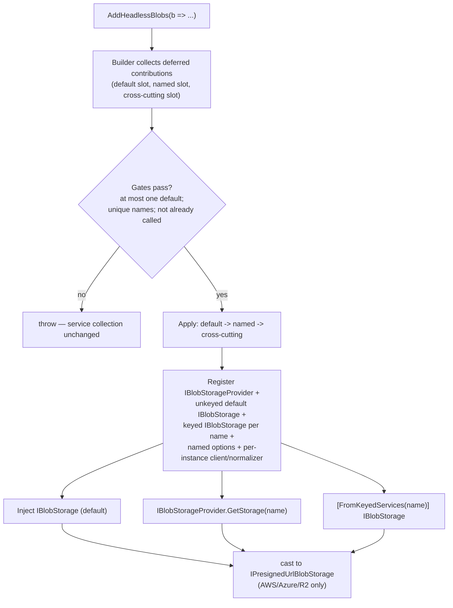

# feat: Multiple named blob storages in one DI container

## Summary

Add a `Headless.Blobs.Core` package with a unified `AddHeadlessBlobs(Action<HeadlessBlobsSetupBuilder>)` entry that registers an optional default plus any number of named blob stores — the same provider registerable N times, each with isolated options/client/normalizer — resolved by name via a new `IBlobStorageProvider` and keyed `IBlobStorage`. Structurally mirrors `Headless.Caching.Core`. Replaces the per-provider `Add{Provider}BlobStorage(IServiceCollection)` extensions across all six providers.

---

## Problem Frame

Today each blob provider registers a single `IBlobStorage` via a bespoke `Add{Provider}BlobStorage(IServiceCollection)` extension, with the provider client, `IBlobNamingNormalizer`, and options all as shared DI singletons. A second `Add…BlobStorage()` call appends a duplicate `IBlobStorage` (last-wins for injection; `IEnumerable<IBlobStorage>` the only way to see both, with no way to tell them apart). Real apps routinely need several stores at once (images on R2, documents on Azure, scratch on the file system) and often two instances of the same provider (prod vs. staging buckets).

The framework already solved this exact shape for caching: `HeadlessCachingSetupBuilder` with default + named-instance slots, deferred contributions gated before registration, resolved through `ICacheProvider.GetCache(name)` and keyed `ICache`. Blobs has no Core/builder package at all. Multi-store apps must hand-roll keyed wiring around the provider packages, defeating the unopinionated, batteries-included design. (See origin: `docs/brainstorms/2026-06-20-blobs-named-storage-requirements.md`.)

---

## Requirements

**Registration API**

- R1. A new `Headless.Blobs.Core` package exposes `AddHeadlessBlobs(Action<HeadlessBlobsSetupBuilder>)` on `IServiceCollection` as the only registration entry point.
- R2. The builder registers an optional default store (at most one), injectable as a plain unkeyed `IBlobStorage`; a named-only configuration with no default is valid.
- R3. The builder registers any number of named stores under unique, non-empty names; a duplicate name is a configuration error.
- R4. The same provider may back multiple named stores with independent configuration.
- R5. Each provider contributes `Use{Provider}` members for both default and named paths, following the options overload trio (`Action<TOptions>`, `IConfiguration`, `Action<TOptions, IServiceProvider>`).
- R6. The existing `Add{Provider}BlobStorage(IServiceCollection)` extensions are removed across Aws, Azure, CloudflareR2, FileSystem, Redis, SshNet.

**Resolution**

- R7. `IBlobStorageProvider` exposes `GetStorage(string name)` (throws when unregistered) and `GetStorageOrNull(string name)` (returns null), mirroring `ICacheProvider`.
- R8. Named stores resolve as keyed `IBlobStorage` services (`[FromKeyedServices("name")] IBlobStorage`).
- R9. The default store resolves as a plain `IBlobStorage`; named stores never register into the default unkeyed `IBlobStorage`.

**Per-instance isolation**

- R10. Each store binds its own options instance via named options, validated independently.
- R11. Each store constructs its own provider client from that store's options; no provider client is shared across stores via a DI singleton.
- R12. Each store carries its own `IBlobNamingNormalizer`; the normalizer is no longer a global DI singleton.

**Setup gates**

- R13. `AddHeadlessBlobs` defers all contributions and applies them only after gates pass; a failed gate leaves the service collection unchanged.
- R14. Calling `AddHeadlessBlobs` more than once on the same service collection is a configuration error (marker registration).
- R15. At most one default store may be registered; two defaults is a configuration error; zero defaults (named-only) is valid.

**Capabilities**

- R16. `IPresignedUrlBlobStorage` is no longer a global singleton; presigned support is a per-store capability — the resolved store implements it when its provider supports it (AWS, Azure, R2 only).

---

## Key Technical Decisions

- KTD1. **Mirror caching's per-slot builder, not the storage-feature global gate.** The unified-provider-setup-builder learning (`docs/solutions/architecture-patterns/unified-provider-setup-builder-pattern.md` §5) documents that caching deliberately permits legitimate multiplicity. Blobs adopts a default slot (at most one — diverges from caching's exactly-one per R15), a named slot (unlimited, unique non-empty names), and a cross-cutting slot. No tier slot (no blob tier concept). Application order: default → named → cross-cutting, all deferred until gates pass, with a called-once marker.
- KTD2. **`IBlobStorageProvider` in Abstractions; keyed resolution in Core.** Named stores register as keyed `IBlobStorage`; `KeyedServiceBlobStorageProvider` resolves them. The default store is the plain unkeyed `IBlobStorage` injected directly — the provider resolves named stores only, with no conventional alias for the default (resolves origin OQ1).
- KTD3. **Isolation via the named-options + keyed-factory triad; engines essentially unchanged.** Each named store uses `services.Configure<TOptions, TValidator>(action, name)` then `AddKeyedSingleton<IBlobStorage>(name, factory)`, where the factory `new`s the engine with `Options.Create(monitor.Get(name))`, the per-instance client, the provider normalizer, and shared ambient deps (`IMimeTypeProvider`, `IClock`) pulled from the provider. Engines keep their `IOptions<T>` / `IOptionsMonitor<T>` ctors — the harness already constructs engines this way, so no engine rewrite (resolves origin OQ2).
- KTD4. **Per-provider client instancing differs and drives unit shape.** FileSystem: no client. Redis: client carried in `RedisBlobStorageOptions.ConnectionMultiplexer` — isolation free from per-name options. AWS: needs a new S3 client factory (none exists) building `IAmazonS3` per store from `AwsBlobStorageOptions`, with an optional per-store `AWSOptions` to preserve SDK credential-chain support. R2: reuses `R2ClientFactory` per instance and binds its **own** named `AwsBlobStorageOptions`, removing today's global `Configure<AwsBlobStorageOptions>` mutation. Azure: per-name `BlobServiceClient` resolution (consumer-supplied). SSH: per-instance `SftpClientPool` keyed to named options (engine already uses `IOptionsMonitor`).
- KTD5. **Presigned becomes a per-store capability.** Drop the global `IPresignedUrlBlobStorage` singleton alias. AWS, Azure, and R2 register a keyed `IPresignedUrlBlobStorage` forwarding their keyed (or default) store; callers cast the resolved store. Breaking for code that injects `IPresignedUrlBlobStorage` directly.
- KTD6. **Breaking replacement, no compatibility layer.** `AddHeadlessBlobs` is the only entry; the per-provider `IServiceCollection` extensions are removed. Consistent with the greenfield stance.
- KTD7. **Keep internal keys internal; key Redis infra if shared.** The `*BlobKeys` type stays internal — the builder API is the only public surface. If `Headless.Blobs.Redis` shares any unkeyed Redis infra (e.g. a script loader) with other Redis packages, key it package-private per `docs/solutions/architecture-patterns/messaging-keyed-di-lock-isolation.md` (likely N/A — the multiplexer is carried in options).

---

## High-Level Technical Design

Build-and-resolve flow:



Per-provider isolation strategy (the load-bearing variation):

| Provider | Client today | Per-instance client strategy | Presigned | Notes |
|---|---|---|---|---|
| FileSystem | none | none — options only | no | Cleanest; migration template (U3) |
| Redis | `options.ConnectionMultiplexer` | carried in named options | no | Isolation free from per-name options |
| AWS | shared `IAmazonS3` (`TryAddAWSService`) | **new** S3 client factory from named options (+ optional `AWSOptions`) | yes | Hardest; behavior shift on client construction |
| CloudflareR2 | `R2ClientFactory` per registration | `R2ClientFactory` per named options; bind own named `AwsBlobStorageOptions` | yes | Reuses AWS engine; removes global options mutation |
| Azure | consumer-supplied `BlobServiceClient` | per-name client resolution | yes | Consumer supplies client per store |
| SshNet | `SftpClientPool` singleton | per-name pool keyed to named options | no | Engine already `IOptionsMonitor` |

---

## Output Structure

New `Headless.Blobs.Core` package (per-unit `Files` remain authoritative; implementer may adjust):

```text
src/Headless.Blobs.Core/
  Headless.Blobs.Core.csproj
  Setup.cs                          # SetupBlobsCore.AddHeadlessBlobs + _AddBlobsCore + AddBlobStorageProvider
  HeadlessBlobsSetupBuilder.cs      # default/named/cross-cutting slots + AddNamed
  HeadlessBlobInstanceBuilder.cs    # single named-instance builder (RegisterProvider once)
  KeyedServiceBlobStorageProvider.cs
  BlobStorageKeys.cs                # internal

src/Headless.Blobs.Abstractions/
  IBlobStorageProvider.cs           # new

tests/Headless.Blobs.Core.Tests.Unit/
  BlobsSetupBuilderTests.cs
```

---

## Implementation Units

### Phase 1 — Core foundation

### U1. `IBlobStorageProvider` abstraction
- **Goal:** Add the name-resolution contract.
- **Requirements:** R7.
- **Dependencies:** none.
- **Files:** `src/Headless.Blobs.Abstractions/IBlobStorageProvider.cs` (new).
- **Approach:** Mirror `ICacheProvider` — `GetStorage(string)` throws `InvalidOperationException` when unregistered, `GetStorageOrNull(string)` returns null. `[PublicAPI]`. XML docs describing named-store resolution and that the default is reached via plain `IBlobStorage`.
- **Patterns to follow:** `src/Headless.Caching.Abstractions/ICacheProvider.cs`.
- **Test expectation:** none -- interface contract only; exercised through U2 and U9.
- **Verification:** Compiles; referenced by Core.

### U2. `Headless.Blobs.Core` package: builder, gates, provider impl, entry
- **Goal:** The unified builder, deferred-contribution gate validation, keyed provider implementation, and `AddHeadlessBlobs` entry.
- **Requirements:** R1, R2, R3, R7, R8, R9, R13, R14, R15.
- **Dependencies:** U1.
- **Files:** `src/Headless.Blobs.Core/Headless.Blobs.Core.csproj`, `Setup.cs`, `HeadlessBlobsSetupBuilder.cs`, `HeadlessBlobInstanceBuilder.cs`, `KeyedServiceBlobStorageProvider.cs`, `BlobStorageKeys.cs` (internal); attach to `headless-framework.slnx`. Test: `tests/Headless.Blobs.Core.Tests.Unit/BlobsSetupBuilderTests.cs`.
- **Approach:** Default slot (at most one), named slot (unlimited; unique, non-empty names via a `HashSet` guard), cross-cutting slot. `AddHeadlessBlobs` materializes the builder, validates gates, then replays deferred actions in order default → named → cross-cutting; a marker record rejects a second call. `HeadlessBlobInstanceBuilder.RegisterProvider(Action<IServiceCollection>)` callable exactly once (zero or many providers per name throws). `KeyedServiceBlobStorageProvider` resolves keyed `IBlobStorage` with a helpful throw; `AddBlobStorageProvider` registers it via `TryAddSingleton` (idempotent, callable from each provider package). Use C# 14 `extension(IServiceCollection)` members. New project uses `Headless.NET.Sdk` (per CLAUDE.md).
- **Patterns to follow:** `src/Headless.Caching.Core/Setup.cs`, `HeadlessCachingSetupBuilder.cs`, `HeadlessCacheInstanceBuilder.cs`, `KeyedServiceCacheProvider.cs`.
- **Test suite design:** New `Headless.Blobs.Core.Tests.Unit` (unit, no Docker), mirroring `tests/Headless.Caching.Core.Tests.Unit/CachingSetupBuilderTests.cs`.
- **Test scenarios:**
  - Covers AE2. Two named stores with the same name → throws.
  - Covers AE1. Two defaults → throws; only named stores, no default → succeeds.
  - Covers AE3. `AddHeadlessBlobs` called twice on one collection → throws.
  - Empty/whitespace name → throws.
  - A gate failure leaves the `IServiceCollection` count unchanged (no partial registration).
  - `GetStorage(unknown)` → throws; `GetStorageOrNull(unknown)` → null.
  - A named instance configured with zero providers → throws; with two providers → throws.
- **Verification:** Planned unit tests added and passing.

### Phase 2 — Provider migration

### U3. FileSystem provider migration (template)
- **Goal:** Contribute `UseFileSystem` (default) + named-instance `UseFileSystem`; remove the old `IServiceCollection` extension; per-name options/normalizer/keyed registration. Establishes the per-provider migration template the rest follow.
- **Requirements:** R4, R5, R6, R10, R11, R12.
- **Dependencies:** U2.
- **Files:** `src/Headless.Blobs.FileSystem/Setup.cs`; `src/Headless.Blobs.FileSystem/Headless.Blobs.FileSystem.csproj` (reference Core); tests under `tests/Headless.Blobs.FileSystem.Tests.Integration/`.
- **Approach:** `extension(HeadlessBlobsSetupBuilder)` `UseFileSystem` trio registering the default unkeyed `IBlobStorage`; `extension(HeadlessBlobInstanceBuilder)` `UseFileSystem` registering keyed `IBlobStorage` via `Configure(action, name)` + `AddKeyedSingleton<IBlobStorage>(name, (sp,_) => new FileSystemBlobStorage(Options.Create(monitor.Get(name)), new CrossOsNamingNormalizer(), logger))`. Default normalizer no longer a shared `TryAddSingleton`. Call `AddBlobStorageProvider`.
- **Patterns to follow:** `src/Headless.Caching.InMemory/Setup.cs` (named instance shape), `src/Headless.Caching.Redis/Setup.cs` (keyed factory + `IOptionsMonitor.Get(name)`).
- **Test suite design:** Extend the existing FileSystem integration project; reuse `tests/Headless.Blobs.Tests.Harness/BlobStorageTestsBase.cs` for behavior, add registration tests via `AddHeadlessBlobs`.
- **Test scenarios:**
  - Default `UseFileSystem` resolves as plain `IBlobStorage` and passes conformance.
  - Named store resolves via `IBlobStorageProvider.GetStorage(name)` and keyed injection.
  - Two named FileSystem stores with different `BaseDirectoryPath` write to separate roots (isolation).
- **Verification:** Planned tests added and passing.

### U4. Redis provider migration
- **Goal:** `UseRedis` default + named; remove old extension; isolation from per-name options (client carried in options).
- **Requirements:** R4, R5, R6, R10, R11, R12.
- **Dependencies:** U2, U3 (template).
- **Files:** `src/Headless.Blobs.Redis/Setup.cs`; csproj reference Core; tests under `tests/Headless.Blobs.Redis.Tests.Integration/`.
- **Approach:** Same triad as U3; the keyed factory news `RedisBlobStorage(Options.Create(monitor.Get(name)), serializer, normalizer, timeProvider)` pulling `IJsonSerializer`/`TimeProvider` from the provider. Verify no unkeyed Redis infra collides with other Redis packages; key package-private if it does (KTD7).
- **Patterns to follow:** `src/Headless.Caching.Redis/Setup.cs`.
- **Test suite design:** Extend Redis integration project; reuse `BlobStorageTestsBase`.
- **Test scenarios:**
  - Default + named resolution and conformance.
  - Two named Redis stores with different multiplexers/prefixes are isolated (no key cross-talk).
- **Verification:** Planned tests added and passing.

### U5. AWS provider migration + S3 client factory
- **Goal:** Per-instance `IAmazonS3`; `UseAws` default + named with optional per-store `AWSOptions`; remove old extension; keyed presigned forward.
- **Requirements:** R4, R5, R6, R10, R11, R12, R16.
- **Dependencies:** U2, U3.
- **Files:** `src/Headless.Blobs.Aws/Setup.cs`, `src/Headless.Blobs.Aws/S3ClientFactory.cs` (new, `internal static`); csproj reference Core; tests under `tests/Headless.Blobs.Aws.Tests.Integration/`.
- **Approach:** Add `S3ClientFactory.Create(AwsBlobStorageOptions, AWSOptions?)` mirroring `R2ClientFactory`. The keyed factory builds a per-store `IAmazonS3` from named `AwsBlobStorageOptions` (+ optional `AWSOptions` to retain the SDK credential/region chain), then news `AwsBlobStorage(client, mime, clock, Options.Create(monitor.Get(name)), normalizer, logger)`. Register keyed `IPresignedUrlBlobStorage` forwarding the keyed/default store. Default path replaces today's `TryAddAWSService<IAmazonS3>` singleton with an options-built client.
- **Patterns to follow:** `src/Headless.Blobs.CloudflareR2/R2ClientFactory.cs`; current `src/Headless.Blobs.Aws/Setup.cs` (presigned forward shape).
- **Test suite design:** Extend AWS integration project (LocalStack fixture); reuse `BlobStorageTestsBase`.
- **Test scenarios:**
  - Default + named resolution and conformance against LocalStack.
  - Covers AE5. Two named AWS stores with different buckets/credentials operate on isolated clients.
  - Covers AE6. The resolved AWS store casts to `IPresignedUrlBlobStorage` and produces a presigned URL.
  - A named store supplied an `AWSOptions` resolves its client through the SDK credential chain.
- **Verification:** Planned tests added and passing.

### U6. CloudflareR2 provider migration
- **Goal:** Reuse the AWS engine under the builder; bind per-instance named `AwsBlobStorageOptions` (remove global mutation); per-instance R2 client; keyed presigned.
- **Requirements:** R4, R5, R6, R10, R11, R12, R16.
- **Dependencies:** U5 (shares AWS engine + options type).
- **Files:** `src/Headless.Blobs.CloudflareR2/Setup.cs`; csproj reference Core; tests under `tests/Headless.Blobs.CloudflareR2.Tests.Integration/`.
- **Approach:** `UseCloudflareR2` default + named; keyed factory builds `IAmazonS3` via `R2ClientFactory.Create(r2Options.Get(name))` and news `AwsBlobStorage` with a per-name `AwsBlobStorageOptions` carrying R2's forced settings (CannedAcl=null, UseChunkEncoding=false, DisablePayloadSigning=true, AutoCreateContainer=false) — bound per name, **not** via the global `Configure<AwsBlobStorageOptions>` that breaks coexisting AWS stores. Register keyed `IPresignedUrlBlobStorage`.
- **Patterns to follow:** current `src/Headless.Blobs.CloudflareR2/Setup.cs` (R2 forced settings, `R2ClientFactory`); U5 keyed factory.
- **Test suite design:** Extend R2 integration project (credentials-gated, fixtureless); reuse `BlobStorageTestsBase`.
- **Test scenarios:**
  - Default + named resolution and conformance (credentials-gated skip).
  - An R2 named store and an AWS named store coexist without the AWS store inheriting R2's forced settings (regression for the removed global mutation).
  - Resolved R2 store casts to `IPresignedUrlBlobStorage`.
- **Verification:** Planned tests added and passing.

### U7. Azure provider migration
- **Goal:** `UseAzure` default + named with per-name `BlobServiceClient`; remove old extension; keyed presigned.
- **Requirements:** R4, R5, R6, R10, R11, R12, R16.
- **Dependencies:** U2, U3.
- **Files:** `src/Headless.Blobs.Azure/Setup.cs`; csproj reference Core; tests under `tests/Headless.Blobs.Azure.Tests.Integration/`.
- **Approach:** Keyed factory news `AzureBlobStorage(client, mime, clock, Options.Create(monitor.Get(name)), normalizer, logger)`. Provide a per-store client supply path (factory/option-supplied `BlobServiceClient`) so two named Azure stores can target different accounts; document that the consumer supplies the client per store. Register keyed `IPresignedUrlBlobStorage`.
- **Patterns to follow:** current `src/Headless.Blobs.Azure/Setup.cs` (presigned forward; consumer-supplied client docs); U5 keyed factory.
- **Test suite design:** Extend Azure integration project (Azurite fixture); reuse `BlobStorageTestsBase`.
- **Test scenarios:**
  - Default + named resolution and conformance against Azurite.
  - Two named Azure stores targeting different containers/clients are isolated.
  - Resolved Azure store casts to `IPresignedUrlBlobStorage` (SAS).
- **Verification:** Planned tests added and passing.

### U8. SshNet provider migration
- **Goal:** `UseSsh` default + named with per-instance `SftpClientPool`; remove old extension.
- **Requirements:** R4, R5, R6, R10, R11, R12.
- **Dependencies:** U2, U3.
- **Files:** `src/Headless.Blobs.SshNet/Setup.cs`; csproj reference Core; tests under `tests/Headless.Blobs.SshNet.Tests.Integration/`.
- **Approach:** Keyed factory builds a per-name `SftpClientPool` bound to named options and news `SshBlobStorage(normalizer, monitor, logger)` — the engine already takes `IOptionsMonitor`, so `.Get(name)` works directly; ensure each keyed store gets its own pool (the pool is `IDisposable`, so register it keyed and ensure disposal). No presigned.
- **Patterns to follow:** current `src/Headless.Blobs.SshNet/Setup.cs`; U3 template.
- **Test suite design:** Extend SSH integration project; reuse `BlobStorageTestsBase`.
- **Test scenarios:**
  - Default + named resolution and conformance.
  - Two named SSH stores with different hosts/credentials use separate pools (isolation), each disposed with the container.
- **Verification:** Planned tests added and passing.

### Phase 3 — Verification and docs

### U9. Cross-provider named-isolation conformance
- **Goal:** Net-new tests proving multi-store registration, name resolution, and isolation across mixed providers.
- **Requirements:** R2, R4, R7, R8, R9, R10, R11, R12, R16.
- **Dependencies:** U3–U8.
- **Files:** `tests/Headless.Blobs.Core.Tests.Integration/` (new) or a shared isolation test; reuse `tests/Headless.Blobs.Tests.Harness/BlobStorageTestsBase.cs`.
- **Approach:** Register a default + several named stores spanning providers in one `AddHeadlessBlobs` call; assert distinct instances, distinct options, distinct clients/normalizers, no cross-talk on read/write, default not satisfied by named stores, and presigned capability present only on AWS/Azure/R2 resolved stores.
- **Test suite design:** New Core integration suite (Docker for the providers it exercises; gate credentials-only providers). Reuse the harness base for behavior; isolation assertions are net-new.
- **Test scenarios:**
  - Covers AE4. Named-only configuration → plain `IBlobStorage` injection is unsatisfied.
  - Covers AE5. Same provider twice with different config → isolated round-trips.
  - Covers AE6. Capability cast succeeds only for presign-capable providers.
  - Default + named coexist; writing to one never appears in another.
- **Verification:** Planned tests added and passing.

### U10. Docs and migration guidance
- **Goal:** Keep agent-facing docs and package READMEs in lockstep; document the breaking migration.
- **Requirements:** R1, R6, R16.
- **Dependencies:** U1–U9.
- **Files:** `docs/llms/blobs.md`, `src/Headless.Blobs.Core/README.md` (new), and each provider `README.md`; per `docs/authoring/AUTHORING.md`.
- **Approach:** Document `AddHeadlessBlobs`, default vs named, `IBlobStorageProvider`/keyed resolution, per-store presigned, and a migration section for the removed `Add{Provider}BlobStorage` extensions and the removed global `IPresignedUrlBlobStorage` registration (resolves origin OQ3).
- **Test expectation:** none -- documentation.
- **Verification:** Docs drift checks per `docs/authoring/AUTHORING.md`; both surfaces updated.

---

## Testing Strategy

- **Unit (no Docker):** New `Headless.Blobs.Core.Tests.Unit` owns builder gate behavior (duplicate name, default cardinality, called-once, deferred-no-partial-registration, provider resolution throw/null) — mirrors `Headless.Caching.Core.Tests.Unit`.
- **Integration (Testcontainers / credentials-gated):** Each provider's existing `*.Tests.Integration` project gains default + named registration tests, reusing `tests/Headless.Blobs.Tests.Harness/BlobStorageTestsBase.cs` for behavior (it needs only an `IBlobStorage`).
- **Cross-provider isolation (new):** U9 adds a Core integration suite asserting multi-store isolation and capability resolution.
- **No new harness fixture base required** — `BlobStorageTestsBase` is reused; the named-isolation assertions are the only net-new test infrastructure.

---

## Scope Boundaries

**Carried from origin (cross-store coordination — out of scope):**
- No routing-by-container/prefix, replication/fan-out, primary-with-fallback, or cross-store `Copy`/`Rename` (today copy/rename stay within one store). Named stores are independent; these could layer on later.
- No change to the `IBlobStorage` operational contract.

**Deferred to Follow-Up Work:**
- Capturing the multi-store + named-options + presigned/normalizer design in `docs/solutions/` via `/x-compound` (no blob-storage learnings exist today — flagged by research).
- Optional consumer-facing `public const` store keys if downstream code needs compile-time keyed-injection links (not required for the builder API).

---

## Risks & Dependencies

- **AWS client-construction behavior change.** Moving from `TryAddAWSService<IAmazonS3>` to an options-built per-store client changes how credentials/region resolve. Mitigation: keep an optional per-store `AWSOptions` for the SDK chain; cover with a credential-chain test (U5).
- **R2/AWS shared options type.** R2 and AWS both bind `AwsBlobStorageOptions`; the current global mutation must become per-name or coexisting AWS stores inherit R2 settings. Mitigation: explicit regression test (U6).
- **Consumer breakage (intended).** Removing the per-provider extensions and the global `IPresignedUrlBlobStorage` is breaking. Mitigation: migration section in docs (U10); greenfield stance accepts it (KTD6).
- **Redis infra keying.** If `Headless.Blobs.Redis` shares unkeyed Redis infra with other Redis packages, first-wins `TryAddSingleton` collides. Mitigation: verify during U4; key package-private if needed (KTD7).
- **Azure per-store client ergonomics.** Consumer must supply a `BlobServiceClient` per named store; document the supply path clearly (U7).
- **Dependency:** ambient `IMimeTypeProvider` and `IClock` (used by AWS/Azure engines) remain host-registered and shared — safe across instances, but the keyed factories must resolve them from the provider.

---

## Acceptance Examples

- AE1. **Default cardinality.** Two default `Use{Provider}` calls → configuration error; named-only with no default → succeeds. (U2)
- AE2. **Duplicate name.** Two named stores under one name → configuration error. (U2)
- AE3. **Double registration.** `AddHeadlessBlobs` called twice → configuration error. (U2)
- AE4. **No leak into default.** Only named stores registered → plain `IBlobStorage` injection unsatisfied. (U9)
- AE5. **Same provider, isolated config.** Two named stores of one provider with different config → isolated clients/options round-trip independently. (U5, U9)
- AE6. **Presigned per-store.** Resolved store casts to `IPresignedUrlBlobStorage` only for presign-capable providers. (U5–U7, U9)

---

## Sources / Research

- `docs/brainstorms/2026-06-20-blobs-named-storage-requirements.md` — origin requirements.
- `docs/solutions/architecture-patterns/unified-provider-setup-builder-pattern.md` — per-slot builder contract, deferred registration, called-once marker, overload trio, `_Add{Feature}Core` naming.
- `docs/solutions/conventions/keyed-services-for-overridable-abstractions.md` — `TryAddKeyedSingleton` defaults vs consumer `AddKeyedSingleton`; ordering sensitivity.
- `docs/solutions/architecture-patterns/messaging-keyed-di-lock-isolation.md` — hide keys behind the builder; package-private Redis-infra keying.
- `src/Headless.Caching.Core/Setup.cs`, `HeadlessCachingSetupBuilder.cs`, `HeadlessCacheInstanceBuilder.cs`, `KeyedServiceCacheProvider.cs` — structural template.
- `src/Headless.Caching.InMemory/Setup.cs`, `src/Headless.Caching.Redis/Setup.cs` — named-instance + keyed-factory + `IOptionsMonitor.Get(name)` triad.
- `src/Headless.Caching.Abstractions/ICacheProvider.cs` — provider resolution surface.
- Provider `Setup.cs` + engine ctors: `src/Headless.Blobs.Aws/{Setup.cs,AwsBlobStorage.cs}`, `src/Headless.Blobs.CloudflareR2/{Setup.cs,R2ClientFactory.cs}`, `src/Headless.Blobs.Azure/{Setup.cs,AzureBlobStorage.cs}`, `src/Headless.Blobs.FileSystem/{Setup.cs,FileSystemBlobStorage.cs}`, `src/Headless.Blobs.Redis/{Setup.cs,RedisBlobStorage.cs}`, `src/Headless.Blobs.SshNet/{Setup.cs,SshBlobStorage.cs,SftpClientPool.cs}`.
- `src/Headless.Blobs.Abstractions/IPresignedUrlBlobStorage.cs` — capability interface; FS/Redis/SSH deliberately excluded.
- `tests/Headless.Blobs.Tests.Harness/BlobStorageTestsBase.cs` — reusable conformance base; `tests/Headless.Caching.Core.Tests.Unit/CachingSetupBuilderTests.cs` — gate-test template.
