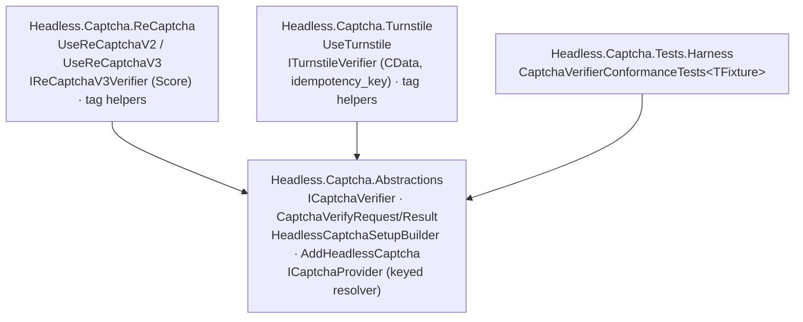

# feat: CAPTCHA provider abstraction + Cloudflare Turnstile

## Summary

Split the standalone `Headless.ReCaptcha` package into a provider model: a new `Headless.Captcha.Abstractions` (`ICaptchaVerifier` + a unified `AddHeadlessCaptcha` builder + a keyed resolver), the renamed `Headless.Captcha.ReCaptcha` provider, and a new `Headless.Captcha.Turnstile` provider. The builder and keyed multi-provider resolution mirror `Headless.Caching` exactly. A shared `Headless.Captcha.Tests.Harness` carries cross-provider conformance, and agent docs + the demo move in lockstep.

---

## Problem Frame

The framework's identity is swappable providers behind a common abstraction (caching, locks, messaging). CAPTCHA is the exception: `src/Headless.ReCaptcha/` is a single package hard-wired to Google reCAPTCHA with no abstraction a second provider could implement, and it ships zero tests. A consumer who wants Cloudflare Turnstile cannot get it from the framework today, and a bolt-on standalone Turnstile package would couple call sites to a concrete vendor type — the lock-in the framework exists to avoid. reCAPTCHA and Turnstile share a near-identical server-verify contract, which makes a shared abstraction honest; the one divergence (reCAPTCHA v3's numeric score, absent in Turnstile) is the reason the abstraction stays pass/fail.

---

## Key Technical Decisions

- KTD1. **Mirror `Headless.Caching`, not blobs.** Caching is the sole in-repo exemplar of *both* the unified `AddHeadless{Feature}` builder and keyed multi-provider resolution. Blobs is neither (no builder; a single `IBlobStorage` singleton per provider — `src/Headless.Blobs.Aws/Setup.cs`). The origin doc's "caching/blobs keyed-DI pattern" is corrected here to caching-only. The captcha builder is the per-slot named-instance variant (a host may compose several verifiers), not the storage global exactly-one gate.

- KTD2. **Pass/fail abstraction; per-variant data on concrete interfaces** (resolves origin's open fork). `ICaptchaVerifier.VerifyAsync` returns the common `CaptchaVerifyResult`. A concrete interface is added only where a variant carries extra data: `IReCaptchaV3Verifier : ICaptchaVerifier` (exposes `Score`) and `ITurnstileVerifier : ICaptchaVerifier` (exposes `CData`). reCAPTCHA v2 uses plain `ICaptchaVerifier`. This mirrors caching's `ICache` + specialized `IRemoteCache` shape.

- KTD3. **Default provider resolves unkeyed; named providers keyed-only.** A single/default `Use{Provider}(...)` registers an unkeyed `ICaptchaVerifier` plus a keyed alias; `Use{Provider}(name, ...)` registers keyed-only. Consumers select a named provider through an `ICaptchaProvider.GetVerifier(name)` resolver over `GetKeyedService<ICaptchaVerifier>(name)`, or inject the concrete interface directly. Mirrors `KeyedServiceCacheProvider`.

- KTD4. **The reCAPTCHA rename is a clean greenfield breaking change — no compat shim.** Beyond moving types into the captcha namespace, the verifiers, named `HttpClient`s, and language-code provider are re-keyed under the new builder, the standalone `AddReCaptchaV2/V3` entry points are removed, the currently-missing `IConfiguration` options overload is added (to complete the canonical trio), and options bind `Headless:Captcha:ReCaptchaV2` / `Headless:Captcha:ReCaptchaV3` sections.

- KTD5. **Verify tests stub the siteverify HTTP endpoint; no creds-gated live-integration suite.** Live verification needs a human-solved token, so it cannot run in CI. A `Headless.Captcha.Tests.Harness` carries the cross-provider conformance suite (the two-provider/one-contract trigger in CLAUDE.md); each provider supplies a fixture that wires a stubbed `HttpMessageHandler` returning that vendor's siteverify JSON shape.

- KTD6. **Per-provider source-gen JSON contexts and keyed-internal helpers.** Each provider keeps its own `JsonSerializerContext` (response shapes differ). Per-provider internal singletons (named `HttpClient`, language provider) are registered under package-private keys so reCAPTCHA and Turnstile cannot collide on a first-wins `TryAddSingleton` (the shadowing trap from `docs/solutions/architecture-patterns/messaging-keyed-di-lock-isolation.md`).

- KTD7. **SDK split.** `Headless.Captcha.Abstractions` uses `Headless.NET.Sdk` (pure contracts + builder, no Razor). `Headless.Captcha.ReCaptcha` and `Headless.Captcha.Turnstile` use `Headless.NET.Sdk.Razor` (they ship tag helpers).

- KTD8. **Options validated via `Headless.Hosting`.** Options + their `AbstractValidator` live in the same file; registration goes through `services.Configure<TOption, TValidator>(...)` / `AddOptions<TOption, TValidator>()` (auto-wires FluentValidation + `ValidateOnStart()`). Options/validator types stay `public` — they are config contract. No live siteverify reachability probe.

---

## High-Level Technical Design

Package topology (provider packages depend on the abstraction; the resolver lives in the abstraction):



Registration + verify + keyed resolution (directional):

```mermaid
sequenceDiagram
  participant App as Startup
  participant B as HeadlessCaptchaSetupBuilder
  participant DI as IServiceCollection
  participant C as Consumer
  participant P as ICaptchaProvider
  participant V as ICaptchaVerifier (keyed)
  App->>B: AddHeadlessCaptcha(b => b.UseTurnstile(...).UseReCaptchaV3("recaptcha", ...))
  B->>DI: deferred registration applied after gates pass
  Note over DI: default => unkeyed + keyed alias; named => keyed only
  C->>P: GetVerifier("recaptcha")
  P->>DI: GetKeyedService<ICaptchaVerifier>("recaptcha")
  DI-->>C: verifier
  C->>V: VerifyAsync(request, ct)
  V-->>C: CaptchaVerifyResult (concrete subtype carries Score/CData)
```

---

## Output Structure

```text
src/
  Headless.Captcha.Abstractions/        # Headless.NET.Sdk
    ICaptchaVerifier.cs
    Contracts/CaptchaVerifyRequest.cs
    Contracts/CaptchaVerifyResult.cs
    Contracts/CaptchaConstants.cs
    HeadlessCaptchaSetupBuilder.cs
    ICaptchaProvider.cs
    Internals/KeyedServiceCaptchaProvider.cs
    Setup.cs                            # AddHeadlessCaptcha + _AddCaptchaCore
    README.md
  Headless.Captcha.ReCaptcha/           # Headless.NET.Sdk.Razor (renamed from Headless.ReCaptcha)
    Setup.cs                            # UseReCaptchaV2 / UseReCaptchaV3 on the builder
    Contracts/ReCaptchaOptions.cs
    V2/ ... V3/ ... (verifiers, IReCaptchaV3Verifier, tag helpers, language provider)
    Internals/ReCaptchaJsonSerializerContext.cs
    README.md
  Headless.Captcha.Turnstile/           # Headless.NET.Sdk.Razor
    Setup.cs                            # UseTurnstile on the builder
    Contracts/TurnstileOptions.cs
    Contracts/TurnstileVerifyRequest.cs
    Contracts/TurnstileVerifyResult.cs
    ITurnstileVerifier.cs
    TurnstileSiteVerify.cs
    TagHelpers/ (script + widget)
    Services/ITurnstileLanguageCodeProvider.cs
    Internals/TurnstileJsonSerializerContext.cs
    README.md
tests/
  Headless.Captcha.Tests.Harness/       # Headless.NET.Sdk.Test
    CaptchaVerifierConformanceTests.cs
    ICaptchaVerifierFixture.cs
    StubSiteVerifyHandler.cs
  Headless.Captcha.ReCaptcha.Tests.Unit/
  Headless.Captcha.Turnstile.Tests.Unit/
demo/
  Headless.Captcha.Demo/                # renamed from Headless.ReCaptcha.Demo
docs/llms/captcha.md
```

The per-unit `**Files:**` sections remain authoritative; the implementer may adjust the layout.

---

## Requirements

Inherited requirements cite the origin doc; plan-local requirements have no origin tag.

**Abstraction**

- R1. `Headless.Captcha.Abstractions` defines `ICaptchaVerifier.VerifyAsync(request, ct)` returning a normalized `CaptchaVerifyResult` (success, hostname, challenge timestamp, error codes, action). (origin R1)
- R2. The normalized request carries the required response token and an optional remote IP. (origin R2)
- R3. Provider-specific data is exposed on derived result types and concrete interfaces, never on the base result. (origin R3, R12)
- R4. The abstraction owns `AddHeadlessCaptcha(Action<HeadlessCaptchaSetupBuilder>)`; providers contribute `Use{Provider}` extension members on the builder. (origin R4)
- R5. The abstraction exposes a keyed resolver (`ICaptchaProvider.GetVerifier(name)`); a single/default provider also resolves as an unkeyed `ICaptchaVerifier`. (plan-local; KTD3)

**Turnstile provider**

- R6. `Headless.Captcha.Turnstile` verifies tokens against `https://challenges.cloudflare.com/turnstile/v0/siteverify` and implements `ICaptchaVerifier`. (origin R5)
- R7. The Turnstile request supports the optional `idempotency_key`. (origin R6)
- R8. `ITurnstileVerifier` returns a `TurnstileVerifyResult` exposing `cdata` (and Enterprise `metadata` where present). (origin R7)
- R9. Razor tag helpers render the Turnstile client script and widget element. (origin R8)
- R10. An `ITurnstileLanguageCodeProvider` supplies the widget language. (origin R9)
- R11. `TurnstileOptions` carries site key, secret, and a configurable verify base URL, validated with FluentValidation in the same file. (origin R10)

**reCAPTCHA migration**

- R12. `Headless.ReCaptcha` is renamed to `Headless.Captcha.ReCaptcha`; public types move into the captcha namespace. (origin R11)
- R13. reCAPTCHA v2 implements plain `ICaptchaVerifier`; v3 implements `IReCaptchaV3Verifier : ICaptchaVerifier` exposing `Score`. (origin R12)
- R14. reCAPTCHA registers via `UseReCaptchaV2` / `UseReCaptchaV3` on the builder; standalone `AddReCaptchaV2` / `AddReCaptchaV3` are removed (no compat shim). (origin R13)

**DI and configuration**

- R15. Multiple providers register simultaneously and resolve by key/name (caching keyed-DI pattern). (origin R14)
- R16. `Use{Provider}` members that bind options expose the trio (`Action<TOptions>` / `IConfiguration` / `Action<TOptions, IServiceProvider>`) and bind a `Headless:Captcha:*` section. (origin R15)

**Testing, docs, demo**

- R17. A `Headless.Captcha.Tests.Harness` carries a cross-provider conformance suite; each provider supplies a fixture over a stubbed siteverify endpoint. (plan-local; KTD5)
- R18. `docs/llms/captcha.md` and per-package READMEs explain the abstraction, providers, the pass/fail-vs-score trade-off, and provider selection, in lockstep per `docs/authoring/AUTHORING.md`. (origin R16)
- R19. The demo shows provider selection and Turnstile usage. (origin R17)

---

## Implementation Units

### U1. Abstractions package: contracts, builder, keyed resolver

- **Goal:** Create `Headless.Captcha.Abstractions` with the verify contract, the unified setup builder, and the keyed resolver.
- **Requirements:** R1, R2, R3, R4, R5, R15, R16 (builder surface).
- **Dependencies:** none.
- **Files:** `src/Headless.Captcha.Abstractions/Headless.Captcha.Abstractions.csproj`, `ICaptchaVerifier.cs`, `Contracts/CaptchaVerifyRequest.cs`, `Contracts/CaptchaVerifyResult.cs`, `Contracts/CaptchaConstants.cs`, `HeadlessCaptchaSetupBuilder.cs`, `ICaptchaProvider.cs`, `Internals/KeyedServiceCaptchaProvider.cs`, `Setup.cs`.
- **Approach:** `CaptchaVerifyResult` holds the common fields with `[MemberNotNullWhen]` discipline mirroring `ReCaptchaSiteVerifyV3Response`. `HeadlessCaptchaSetupBuilder` is `public sealed` with an `internal` ctor taking `IServiceCollection`, holding **deferred** registration actions (per-slot) so a throwing setup leaves the collection unchanged; expose an `internal` registration entry the provider extensions call (`RegisterDefault` / `RegisterNamed`). `Setup.cs` exposes `AddHeadlessCaptcha` as a C# 14 extension member on `IServiceCollection`, runs `configure`, then `_AddCaptchaCore` applies deferred actions and `TryAddSingleton<ICaptchaProvider>(sp => new KeyedServiceCaptchaProvider(sp))`. Add a repeated-call sentinel marker. `KeyedServiceCaptchaProvider.GetVerifier(name)` resolves `GetKeyedService<ICaptchaVerifier>(name)` and throws an actionable error naming registered keys when missing.
- **Patterns to follow:** `src/Headless.Caching.Core/HeadlessCachingSetupBuilder.cs`, `src/Headless.Caching.Core/Setup.cs` (`AddHeadlessCaching` + `_AddCachingProviderCore` + repeated-call sentinel), `src/Headless.Caching.Core/KeyedServiceCacheProvider.cs`, `src/Headless.Caching.Abstractions/Contracts/CacheConstants.cs`.
- **Test suite design:** Builder/resolver behavior is unit-tested from `Headless.Captcha.Tests.Harness`-independent tests in each provider suite (they need a real provider to register); pure-resolver error paths covered in U6/U7. No standalone abstractions test project.
- **Test scenarios:** `Test expectation: none -- contracts + DI plumbing; exercised through provider suites (U6, U7), which assert keyed/unkeyed resolution, missing-key error, and repeated-AddHeadlessCaptcha sentinel.`
- **Verification:** Package compiles under `Headless.NET.Sdk`; `AddHeadlessCaptcha` + builder + resolver are referenced and pass in U6/U7 tests.

### U2. Conformance harness

- **Goal:** Extract `Headless.Captcha.Tests.Harness` carrying the cross-provider conformance suite over a stubbed siteverify endpoint.
- **Requirements:** R17.
- **Dependencies:** U1.
- **Files:** `tests/Headless.Captcha.Tests.Harness/Headless.Captcha.Tests.Harness.csproj`, `ICaptchaVerifierFixture.cs`, `StubSiteVerifyHandler.cs`, `CaptchaVerifierConformanceTests.cs`.
- **Approach:** `StubSiteVerifyHandler : HttpMessageHandler` returns canned responses keyed by a queued script (success body, failure body, malformed body, network-throw). `ICaptchaVerifierFixture` exposes a configured `ICaptchaVerifier` plus hooks to set the next stub response; each provider supplies a concrete fixture wiring its verifier + its vendor JSON shape through the stub handler. `CaptchaVerifierConformanceTests<TFixture>` carries provider-agnostic scenarios as an `abstract` base satisfying xUnit v3 `IClassFixture<>`.
- **Patterns to follow:** the harness shape in `tests/Headless.Blobs.Tests.Harness` and `tests/Headless.DistributedLocks.Tests.Harness` (abstract conformance base + per-provider fixture); xUnit v3 / AwesomeAssertions / NSubstitute / Bogus per CLAUDE.md. Note: no Testcontainers — this is an HTTP-stub harness.
- **Test suite design:** This unit *is* the shared test infrastructure; it is consumed by U6 and U7. New test infrastructure required (no prior captcha or tag-helper test precedent in the repo).
- **Test scenarios (the conformance contract the base enforces):**
  - Valid token → `Success == true`, common fields populated.
  - Rejected token (well-formed but invalid) → `Success == false`, non-empty `ErrorCodes`, no exception.
  - Non-success HTTP status → throws `HttpRequestException` (current reCAPTCHA behavior preserved).
  - Malformed / null JSON body → throws a deserialization-failure `InvalidOperationException`.
  - Cancellation token already cancelled → throws `OperationCanceledException`, no HTTP call completes.
  - `remoteip` present vs absent → request carries the field only when supplied.
- **Verification:** Both provider suites (U6, U7) derive from the base and pass every conformance scenario.

### U3. Turnstile provider: options, verifier, JSON, builder wiring

- **Goal:** Create `Headless.Captcha.Turnstile` verify path implementing `ICaptchaVerifier` / `ITurnstileVerifier` and contributing `UseTurnstile` to the builder.
- **Requirements:** R6, R7, R8, R11, R15, R16.
- **Dependencies:** U1.
- **Files:** `src/Headless.Captcha.Turnstile/Headless.Captcha.Turnstile.csproj`, `Contracts/TurnstileOptions.cs`, `Contracts/TurnstileVerifyRequest.cs`, `Contracts/TurnstileVerifyResult.cs`, `ITurnstileVerifier.cs`, `TurnstileSiteVerify.cs`, `Internals/TurnstileJsonSerializerContext.cs`, `Internals/TurnstileLoggerExtensions.cs`, `Setup.cs`.
- **Approach:** `TurnstileSiteVerify` POSTs `FormUrlEncodedContent` (`secret`, `response`, optional `remoteip`, optional `idempotency_key`) to `turnstile/v0/siteverify`, deserializes via source-gen context into `TurnstileVerifyResult` (`success`, `challenge_ts`, `hostname`, `error-codes`, `action`, `cdata`). `TurnstileOptions { VerifyBaseUrl = "https://challenges.cloudflare.com/", SiteKey, SiteSecret }` with a same-file `AbstractValidator`. `UseTurnstile` (extension members on `HeadlessCaptchaSetupBuilder`) offers the trio, binds `Headless:Captcha:Turnstile`, registers keyed `ICaptchaVerifier`/`ITurnstileVerifier`, and configures a named `HttpClient` keyed per-provider with `AddStandardResilienceHandler`.
- **Patterns to follow:** `src/Headless.ReCaptcha/V3/IReCaptchaSiteVerifyV3.cs` (verify impl, form encoding, logging), `src/Headless.ReCaptcha/Internals/ReCaptchaJsonSerializerContext.cs`, `src/Headless.Caching.Redis/Setup.cs` (extension-member `UseRedis` + trio + keyed registration), `src/Headless.Hosting/Options/OptionsServiceCollectionExtensions.cs`.
- **Test suite design:** Conformance via U2 base in U6 (`Headless.Captcha.Turnstile.Tests.Unit`); Turnstile-specific cases also in U6.
- **Test scenarios:** covered in U6 (provider behavior is tested there, not in the src unit).
- **Verification:** Package compiles under `Headless.NET.Sdk.Razor`; U6 conformance + Turnstile-specific tests pass.

### U4. Turnstile tag helpers + localization provider

- **Goal:** Add Razor tag helpers (client script + widget) and `ITurnstileLanguageCodeProvider`.
- **Requirements:** R9, R10.
- **Dependencies:** U3.
- **Files:** `src/Headless.Captcha.Turnstile/TagHelpers/TurnstileScriptTagHelper.cs`, `TagHelpers/TurnstileWidgetTagHelper.cs`, `Services/ITurnstileLanguageCodeProvider.cs`, `Services/CultureInfoTurnstileLanguageCodeProvider.cs`.
- **Approach:** Script helper emits `https://challenges.cloudflare.com/turnstile/v0/api.js` (optionally `?render=explicit`). Widget helper emits the `cf-turnstile` element with `data-sitekey` (from options), `data-theme`, `data-size`, `data-callback`, `data-action`, and a `data-language` from the language provider. Register the language provider under a package-private key (KTD6) so it cannot shadow reCAPTCHA's.
- **Patterns to follow:** `src/Headless.ReCaptcha/V2/TagHelpers/*` and `V3/TagHelpers/*`, `src/Headless.ReCaptcha/Services/IReCaptchaLanguageCodeProvider.cs`.
- **Test suite design:** Unit tests in U6 instantiate the tag helper and call `Process(context, output)` directly, asserting on `TagHelperOutput` — no tag-helper test precedent exists, so this approach is established here.
- **Test scenarios:** covered in U6.
- **Verification:** U6 tag-helper tests pass.
- **Note:** confirm the exact Turnstile widget language attribute name during implementation (the client-rendering doc page did not enumerate `data-language`; see origin Dependencies/Assumptions).

### U5. reCAPTCHA migration to the provider model

- **Goal:** Rename `Headless.ReCaptcha` → `Headless.Captcha.ReCaptcha`, implement `ICaptchaVerifier` (v2 plain, v3 via `IReCaptchaV3Verifier`), and move registration onto the builder.
- **Requirements:** R12, R13, R14, R15, R16.
- **Dependencies:** U1.
- **Files:** rename `src/Headless.ReCaptcha/` → `src/Headless.Captcha.ReCaptcha/` (all `.cs` + `.csproj` + `README.md`), `Setup.cs` (rewrite to `UseReCaptchaV2`/`UseReCaptchaV3` builder extensions), `Contracts/ReCaptchaOptions.cs`, `V3/IReCaptchaSiteVerifyV3.cs` (→ `IReCaptchaV3Verifier : ICaptchaVerifier`), `V2/IReCaptchaSiteVerifyV2.cs` (→ implement plain `ICaptchaVerifier`), tag helpers, `Services/IReCaptchaLanguageCodeProvider.cs`.
- **Approach:** Verifiers implement `ICaptchaVerifier`; the v3 verifier additionally implements `IReCaptchaV3Verifier` exposing the existing `Score`. Map the existing `ReCaptchaSiteVerifyV3Response` into `CaptchaVerifyResult` (base) while keeping `Score` on the concrete result. `UseReCaptchaV2`/`UseReCaptchaV3` add the missing `IConfiguration` overload (completing the trio), bind `Headless:Captcha:ReCaptchaV2` / `Headless:Captcha:ReCaptchaV3`, register keyed verifiers, and key the named `HttpClient` + language provider per-provider (KTD6). Remove `AddReCaptchaV2`/`AddReCaptchaV3`. Keep options/validator `public`.
- **Patterns to follow:** existing `src/Headless.ReCaptcha/Setup.cs` (HttpClient + resilience + named options), `src/Headless.Caching.Redis/Setup.cs` (builder extension + keyed registration + trio). Treat as a clean greenfield rename (`docs/solutions/messaging/transport-wrapper-drift-and-doc-sync.md` greenfield-scope rule) — no compat shim.
- **Test suite design:** Conformance via U2 base in U7 (`Headless.Captcha.ReCaptcha.Tests.Unit`); v3 score + tag helpers also in U7.
- **Test scenarios:** covered in U7.
- **Verification:** Package compiles under `Headless.NET.Sdk.Razor`; no references to removed `AddReCaptcha*` remain; U7 passes.

### U6. Turnstile test suite

- **Goal:** Conformance + Turnstile-specific coverage.
- **Requirements:** R6, R7, R8, R9, R10, R15, R17.
- **Dependencies:** U2, U3, U4.
- **Files:** `tests/Headless.Captcha.Turnstile.Tests.Unit/Headless.Captcha.Turnstile.Tests.Unit.csproj`, `TurnstileVerifierFixture.cs`, `TurnstileConformanceTests.cs`, `TurnstileSiteVerifyTests.cs`, `TurnstileTagHelperTests.cs`, `TurnstileSetupTests.cs`.
- **Approach:** `TurnstileVerifierFixture : ICaptchaVerifierFixture` wires `TurnstileSiteVerify` over the stub handler with Cloudflare-shaped JSON. `TurnstileConformanceTests : CaptchaVerifierConformanceTests<TurnstileVerifierFixture>`.
- **Test suite design:** Unit suite; consumes U2 harness. New project.
- **Test scenarios:**
  - Covers AE1. Valid token → success; rejected token → `Success == false` + error codes.
  - `idempotency_key` present → form includes it; absent → omitted.
  - `cdata` in response → surfaced on `TurnstileVerifyResult`; result is assignable to `CaptchaVerifyResult`.
  - Tag helpers: script helper emits the api.js URL (and `?render=explicit` when set); widget helper emits `cf-turnstile` + `data-sitekey`/`data-theme`/`data-size`/`data-action`/language attribute.
  - Covers AE3. Setup: registering Turnstile + reCAPTCHA together resolves the Turnstile verifier by its name; single default resolves unkeyed `ICaptchaVerifier`.
  - Missing site key/secret → options validation fails at startup.
- **Verification:** planned tests added and passing; all conformance scenarios green.

### U7. reCAPTCHA test suite (net-new)

- **Goal:** First-ever tests for reCAPTCHA: conformance + v3 score + tag helpers.
- **Requirements:** R12, R13, R14, R15, R17.
- **Dependencies:** U2, U5.
- **Files:** `tests/Headless.Captcha.ReCaptcha.Tests.Unit/Headless.Captcha.ReCaptcha.Tests.Unit.csproj`, `ReCaptchaV2VerifierFixture.cs`, `ReCaptchaV3VerifierFixture.cs`, `ReCaptchaConformanceTests.cs`, `ReCaptchaV3ScoreTests.cs`, `ReCaptchaTagHelperTests.cs`, `ReCaptchaSetupTests.cs`.
- **Approach:** Two fixtures (v2, v3) over the stub handler with Google-shaped JSON; conformance bases for each. v3-specific tests assert `Score` on `IReCaptchaV3Verifier` and that the generic `ICaptchaVerifier` view exposes pass/fail only (Covers AE2).
- **Test suite design:** Unit suite; consumes U2 harness. New project.
- **Test scenarios:**
  - Conformance (both v2 and v3) via the base.
  - Covers AE2. v3 `Score` reachable via `IReCaptchaV3Verifier`; generic `ICaptchaVerifier` resolution yields pass/fail only.
  - v3 score threshold gating example (`Score < 0.5` → caller-side fail) documented as a result-shape test.
  - Tag helpers (v2 div/script, v3 script/script-js) emit expected markup.
  - Setup: `UseReCaptchaV3` binds `Headless:Captcha:ReCaptchaV3` via `IConfiguration` overload; removed `AddReCaptchaV3` no longer compiles (compile-time, verified by absence).
- **Verification:** planned tests added and passing.

### U8. Solution + demo wiring

- **Goal:** Register all new projects in the solution and update the demo to show Turnstile + provider selection.
- **Requirements:** R19.
- **Dependencies:** U3, U4, U5 (demo needs the providers); U6, U7 (test projects in slnx).
- **Files:** `headless-framework.slnx` (under the existing `<Folder Name="/Captcha/">`: add the three src projects, three test projects, renamed demo; remove the old `src/Headless.ReCaptcha` + `demo/Headless.ReCaptcha.Demo` entries), rename `demo/Headless.ReCaptcha.Demo/` → `demo/Headless.Captcha.Demo/`, add `demo/Headless.Captcha.Demo/Pages/Turnstile.cshtml` (+ `.cs`) and a provider-selection page, update `demo/Headless.Captcha.Demo/appsettings.json` to `Headless:Captcha:*` sections.
- **Approach:** Demo `Program.cs` calls `AddHeadlessCaptcha(b => b.UseReCaptchaV3(...).UseTurnstile(...))`; pages demonstrate selecting a provider via `ICaptchaProvider`.
- **Patterns to follow:** `/Caching/` folder layout in `headless-framework.slnx`; existing `demo/Headless.ReCaptcha.Demo` page-per-scenario structure.
- **Test suite design:** none — wiring + demo (`IsPackable=false`).
- **Test scenarios:** `Test expectation: none -- solution/demo wiring; no shipped behavior. Verified by full-solution build.`
- **Verification:** `make build` succeeds for the whole solution; demo builds (Node not required — no SPA); `dotnet` restore resolves the renamed projects with no dangling references to `Headless.ReCaptcha`.

### U9. Docs in lockstep

- **Goal:** Author `docs/llms/captcha.md` and the three package READMEs; update the docs hub.
- **Requirements:** R18.
- **Dependencies:** U1, U3, U4, U5 (final public surface known).
- **Files:** `docs/llms/captcha.md`, `docs/llms/index.md` (add captcha to domain list + package catalog), `src/Headless.Captcha.Abstractions/README.md`, `src/Headless.Captcha.ReCaptcha/README.md`, `src/Headless.Captcha.Turnstile/README.md`.
- **Approach:** Follow `docs/authoring/AUTHORING.md`: domain doc section order with the required **Choosing a Provider** section (2 providers ship), per-package READMEs with the fixed H3 order, YAML `domain:` + `packages:` frontmatter. Explain the pass/fail-vs-score trade-off and keyed provider selection. Delete the old `src/Headless.ReCaptcha/README.md` as part of the rename (U5).
- **Patterns to follow:** `docs/llms/caching.md` (multi-provider domain doc + Choosing a Provider), `docs/authoring/TEMPLATE.md`, `docs/authoring/PACKAGE-README-TEMPLATE.md`.
- **Test suite design:** none — docs.
- **Test scenarios:** `Test expectation: none -- documentation.`
- **Verification:** `docs/llms/captcha.md` + three READMEs exist and pass the AUTHORING lockstep check (every public package documented in both surfaces); `docs/llms/index.md` lists captcha.

---

## Testing Strategy

- **Ownership.** Cross-provider behavior lives once in `Headless.Captcha.Tests.Harness` (`CaptchaVerifierConformanceTests<TFixture>`); provider-specific behavior lives in each provider's `*.Tests.Unit`. No `*.Tests.Integration` projects — see KTD5.
- **New infrastructure.** The harness is net-new (no captcha or tag-helper test precedent). It is an HTTP-stub harness, not Testcontainers: a `StubSiteVerifyHandler : HttpMessageHandler` drives canned siteverify responses.
- **Stack.** xUnit v3 (MTP), AwesomeAssertions, NSubstitute, Bogus, per CLAUDE.md. Verify the verifier via a stubbed `IHttpClientFactory`/handler; verify tag helpers by direct `Process(...)` calls.
- **Coverage intent.** Each provider derives the conformance base (round-trip, rejection, HTTP failure, malformed body, cancellation) and adds its specifics (Turnstile: idempotency_key, cdata; reCAPTCHA: v3 score, v2/v3 tag helpers). Targets: ≥85% line / ≥80% branch per CLAUDE.md.

---

## Acceptance Examples

- AE1. Turnstile verify outcome (origin AE1). **Covers R6.** Valid token → `Success == true` with common fields; invalid/expired → `Success == false` with non-empty error codes, no exception.
- AE2. Score is provider-specific (origin AE2). **Covers R3, R13.** Resolving the generic `ICaptchaVerifier` exposes pass/fail only; `Score` requires `IReCaptchaV3Verifier`.
- AE3. Keyed provider selection (origin AE3). **Covers R5, R15.** With Turnstile + reCAPTCHA both registered, resolving by name returns the matching backend and routes to that vendor's endpoint.

---

## Scope Boundaries

**Deferred for later** (origin)

- Additional providers (e.g., hCaptcha) — the abstraction enables them; none built here.
- reCAPTCHA Enterprise / Turnstile Enterprise surfaces beyond exposing `metadata` where the standard response returns it.

**Outside this product's identity** (origin)

- Client integrations beyond Razor tag helpers (Blazor / JS-framework components).

**Deferred to Follow-Up Work**

- A `/x-compound` write-up capturing the multi-provider CAPTCHA builder + keyed by-name resolution and the HTTP-integration (non-Testcontainers) harness trigger — neither is documented in `docs/solutions/` yet.
- Optional Tier-2 live siteverify reachability probe (would default off in production) — not part of this work.

---

## Risks & Dependencies

- **Breaking rename.** Removing the published `Headless.ReCaptcha` package id strands existing consumers (accepted per origin KD; greenfield). No NuGet `[Obsolete]` forwarder ships.
- **Turnstile `data-language` attribute** unconfirmed by the client-rendering doc page (U4 note) — confirm at implementation; low risk (it is a tag-helper attribute, not a verify-path concern).
- **Version pins.** Reuse existing `Directory.Packages.props` pins (`Microsoft.Extensions.Http.Resilience`, `FluentValidation`, AspNetCore) — no new entries expected. Never add `Version` attributes in csproj.
- **slnx `/Captcha/` folder** already exists with the old entries; U8 must remove the old `Headless.ReCaptcha` references to avoid a broken solution graph.

---

## Sources / Research

- Origin: `docs/brainstorms/2026-06-21-captcha-provider-split-turnstile-requirements.md`.
- Builder + keyed resolver to mirror: `src/Headless.Caching.Core/Setup.cs:22` (`AddHeadlessCaching`, `_AddCachingProviderCore`), `src/Headless.Caching.Core/HeadlessCachingSetupBuilder.cs:15`, `src/Headless.Caching.Core/KeyedServiceCacheProvider.cs:12`, `src/Headless.Caching.Redis/Setup.cs:20` (extension-member `UseRedis` + trio + keyed registration), `src/Headless.Caching.Abstractions/Contracts/CacheConstants.cs:17`.
- Migration source: `src/Headless.ReCaptcha/Setup.cs:17` (named options), `src/Headless.ReCaptcha/V3/IReCaptchaSiteVerifyV3.cs:37` (verify impl), `src/Headless.ReCaptcha/Contracts/ReCaptchaSiteVerifyV3Response.cs:25` (`Score`), `src/Headless.ReCaptcha/Contracts/ReCaptchaOptions.cs:7`.
- Options pipeline: `src/Headless.Hosting/Options/OptionsServiceCollectionExtensions.cs:85` (`AddOptions<T,TValidator>`), `:142`/`:176`/`:200` (`Configure` trio).
- Learnings: `docs/solutions/architecture-patterns/unified-provider-setup-builder-pattern.md` (§ per-slot caching variant), `docs/solutions/conventions/keyed-services-for-overridable-abstractions.md`, `docs/solutions/architecture-patterns/messaging-keyed-di-lock-isolation.md` (shadowing trap), `docs/solutions/architecture-patterns/startup-validation-gate-two-tier-mode-and-env-defaults.md` (options ValidateOnStart), `docs/solutions/messaging/transport-wrapper-drift-and-doc-sync.md` (greenfield-rename scope rule).
- Harness shape: `tests/Headless.Blobs.Tests.Harness`, `tests/Headless.DistributedLocks.Tests.Harness`.
- Docs contract: `docs/authoring/AUTHORING.md`, `docs/llms/caching.md` (multi-provider exemplar).
- Cloudflare Turnstile: server-side validation `https://developers.cloudflare.com/turnstile/get-started/server-side-validation/`; client-side rendering `https://developers.cloudflare.com/turnstile/get-started/client-side-rendering/`.
- Grounding dossier: `.context/arkan/x-brainstorm/turnstile/grounding.md`.
