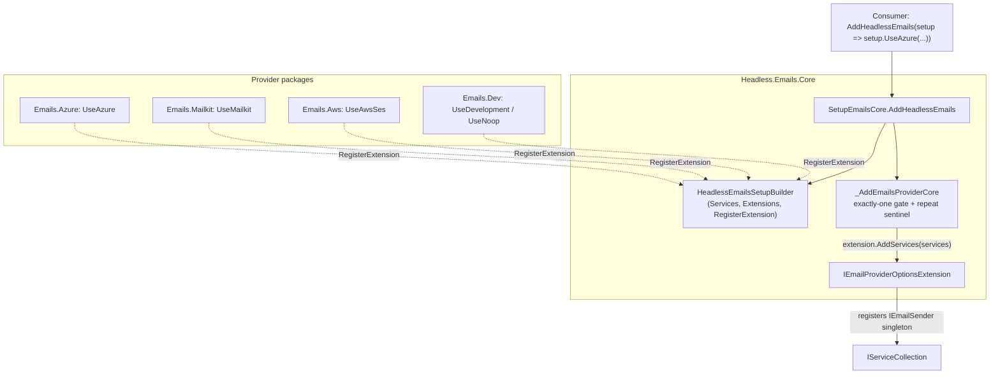
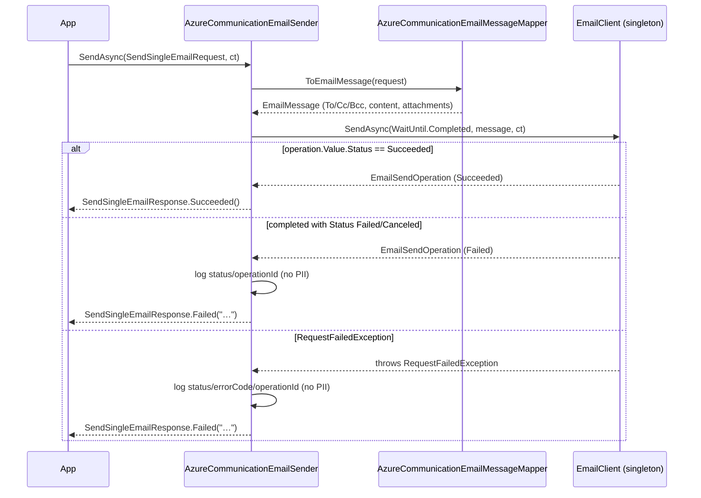

# feat: Azure Communication Services email provider + unified Emails setup builder

## Summary

Add `Headless.Emails.Azure`, an `IEmailSender` provider over Azure Communication Services (ACS) Email (`Azure.Communication.Email`). As a prerequisite, migrate the Emails feature onto the framework's unified provider setup-builder pattern: introduce `HeadlessEmailsSetupBuilder` + an `AddHeadlessEmails(setup => setup.Use…())` root entry with a global exactly-one-provider gate in `Headless.Emails.Core`, then move the existing MailKit, AWS SES, and Dev/Noop providers onto `Use*` members. The `IEmailSender` contract and its request/response records are unchanged.

---

## Problem Frame

The Emails feature is the last multi-provider feature still on the legacy per-provider registration style: each provider exposes its own `IServiceCollection` extension (`AddMailKitEmailSender`, `AddAwsSesEmailSender`, `AddDevEmailSender`, `AddNoopEmailSender`). Every other multi-provider feature (Coordination, Caching, Settings, Permissions, AuditLog, Features) uses the unified setup-builder grammar documented in `docs/solutions/architecture-patterns/unified-provider-setup-builder-pattern.md`: one `AddHeadless{Feature}(Action<…SetupBuilder>)` entry, exactly-one-provider invariant, provider-owned `Use{Provider}` members.

Adding a fourth email provider (ACS) is the trigger to converge Emails onto that grammar rather than grow a fifth bespoke `Add*EmailSender` extension. The migration is low-risk: a repo-wide search found **no internal callers** of the four legacy extensions, so removing them ripples only into the provider `Setup.cs` files and docs.

ACS Email is the intended cloud-email backend for Azure-hosted consumers — an alternative to AWS SES (cloud API) and MailKit (self-hosted SMTP).

---

## Requirements

### Setup grammar (Emails feature)

- R1. `AddHeadlessEmails(Action<HeadlessEmailsSetupBuilder>)` in `Headless.Emails.Core` is the single consumer entry point for selecting an email provider.
- R2. Exactly one `Use*` provider must be selected per call. Zero, multiple, or a repeated `AddHeadlessEmails` on the same `IServiceCollection` throws `InvalidOperationException` at registration time; the zero-provider message lists every available `Use*` call.
- R3. Each provider package selects itself via a `Use*` extension member on `HeadlessEmailsSetupBuilder` that registers an `IEmailProviderOptionsExtension`; the provider's DI wiring runs later from the core gate, so all providers pass through the same invariant.

### Azure provider behavior

- R4. `Headless.Emails.Azure` implements `IEmailSender` over `Azure.Communication.Email`, mapping `SendSingleEmailRequest` (From, To/Cc/Bcc, Subject, MessageHtml, MessageText, Attachments) to an ACS `EmailMessage` and sending it.
- R5. Authentication supports three modes — connection string, endpoint + access key, and endpoint + `TokenCredential` (managed identity) — and options validation requires exactly one mode to be configured.
- R6. A successful send returns `SendSingleEmailResponse.Succeeded()`; an ACS failure returns `SendSingleEmailResponse.Failed(...)` with a non-PII message. Recipient and sender addresses never appear in log output.
- R7. Attachment content type is derived from the attachment file name (the abstraction carries only name + bytes), defaulting to `application/octet-stream`.

### Migration and compatibility

- R8. The legacy `IServiceCollection` extensions (`AddMailKitEmailSender`, `AddAwsSesEmailSender`, `AddDevEmailSender`, `AddNoopEmailSender`) are removed. MailKit, AWS SES, Dev, and Noop are reachable only through `Use*` members on the builder. No compatibility shim (greenfield; no internal callers exist).
- R9. The `IEmailSender` abstraction and the `SendSingleEmailRequest` / `SendSingleEmailResponse` / `EmailRequestAddress` / `EmailRequestDestination` / `EmailRequestAttachment` contracts are not changed.

### Testing and docs

- R10. Unit tests cover the exactly-one-provider gate (zero / one / multiple / repeated) and the Azure provider (request→`EmailMessage` mapping, content-type derivation, error mapping, options validation).
- R11. `docs/llms/emails.md` and the affected package READMEs reflect the new grammar and the Azure provider, per `docs/authoring/AUTHORING.md`.

---

## Key Technical Decisions

- KTD1 — **Global exactly-one-provider gate, mirroring Coordination (not Caching's per-slot gate).** Emails resolves to a single `IEmailSender`, so a host needs exactly one provider — the simplest invariant applies. Mirror `src/Headless.Coordination.Core/Setup.cs`: count `Extensions`, plus a marker-singleton sentinel (`EmailProviderRegistration`) to reject a repeated `AddHeadlessEmails` on the same collection.

- KTD2 — **Breaking change with no compat shim.** Remove the four legacy `Add*EmailSender` extensions outright. Greenfield project policy and a verified absence of internal callers make a shim pure ceremony.

- KTD3 — **Send with `WaitUntil.Completed`, map both the exception and the terminal status.** Use `EmailClient.SendAsync(WaitUntil.Completed, EmailMessage, ct)`. This matches the contract's "accepted for delivery" success semantics and keeps the wrapper synchronous-style. Map the outcome two ways: (a) catch `RequestFailedException` → `Failed(...)`; and (b) on a normal return, inspect `operation.Value.Status` and treat any terminal non-`Succeeded` state (`Failed` / `Canceled`) as `Failed(...)` — ACS can complete a long-running send with a failed status **without throwing**, so an exception-only check would report rejected mail as delivered (R6). Only `Succeeded` returns `Succeeded()`. Let unrelated exceptions (cancellation, argument errors) propagate. Do not add a custom retry loop — `Azure.Core`'s pipeline already retries 429/5xx with `Retry-After`. (An enqueue-only `WaitUntil.Started` mode is deferred — see Scope Boundaries.)

- KTD4 — **Three auth modes via options; provider depends on `Azure.Core`, not `Azure.Identity`.** `AzureCommunicationEmailOptions` carries `ConnectionString`, `Endpoint` + `AccessKey`, and an optional `TokenCredential` (a `Azure.Core` type, transitive via `Azure.Communication.Email`). The consumer supplies their own `DefaultAzureCredential` through the delegate overload, so the package keeps a narrow dependency surface. The `IConfiguration` overload binds only string/key modes; `TokenCredential` requires a `Use*` delegate overload.

- KTD5 — **Derive attachment content type via MimeKit's `MimeTypes.GetMimeType(name)`** (already transitively available through `Headless.Emails.Core` → MailKit), defaulting to `application/octet-stream`. This keeps the `EmailRequestAttachment` contract unchanged (R9) while satisfying ACS's required `EmailAttachment.contentType`. Expose it as a small shared helper in Core so future providers reuse it.

- KTD6 — **Extract request→`EmailMessage` mapping into a pure static mapper** (`AzureCommunicationEmailMessageMapper`) so the bulk of provider logic is unit-testable without mocking the ACS LRO; the sender stays a thin send + error-map shell.

- KTD7 — **Naming:** package `Headless.Emails.Azure`; builder member `UseAzure`; types `AzureCommunicationEmailSender` / `AzureCommunicationEmailOptions`. `UseAzure` matches sibling brevity (`UseRedis`, `UsePostgreSql`) and the package suffix; the `AzureCommunicationEmail*` type names disambiguate the implementation. (`UseAzureCommunication` was the considered alternative.)

---

## High-Level Technical Design

### Registration topology



### Azure send path



---

## Output Structure

```text
src/Headless.Emails.Core/
  IEmailProviderOptionsExtension.cs     (new)
  HeadlessEmailsSetupBuilder.cs         (new)
  Setup.cs                              (new: AddHeadlessEmails + gate)
  EmailAttachmentContentType.cs         (new: shared content-type helper)
  EmailToMimMessageConverter.cs         (unchanged)
src/Headless.Emails.Azure/             (new package)
  Headless.Emails.Azure.csproj
  AzureCommunicationEmailOptions.cs     (+ in-file validator)
  AzureCommunicationEmailMessageMapper.cs
  AzureCommunicationEmailSender.cs
  Setup.cs                              (UseAzure trio + extension)
  README.md
tests/Headless.Emails.Core.Tests.Unit/ (new)
tests/Headless.Emails.Azure.Tests.Unit/ (new)
```

---

## Implementation Units

### Phase 1 — Builder infrastructure

#### U1. Introduce the unified Emails setup builder + exactly-one-provider gate

- **Goal:** Establish `AddHeadlessEmails`, `HeadlessEmailsSetupBuilder`, and `IEmailProviderOptionsExtension` in `Headless.Emails.Core`.
- **Requirements:** R1, R2, R3.
- **Dependencies:** none.
- **Files:** `src/Headless.Emails.Core/IEmailProviderOptionsExtension.cs`, `src/Headless.Emails.Core/HeadlessEmailsSetupBuilder.cs`, `src/Headless.Emails.Core/Setup.cs`.
- **Approach:** Mirror `src/Headless.Coordination.Core/{Setup.cs,HeadlessCoordinationSetupBuilder.cs,ICoordinationProviderOptionsExtension.cs}` exactly:
  - `IEmailProviderOptionsExtension { void AddServices(IServiceCollection services); }` — `[PublicAPI]`.
  - `HeadlessEmailsSetupBuilder` — internal ctor taking `IServiceCollection`; `internal IServiceCollection Services`; `internal IList<IEmailProviderOptionsExtension> Extensions`; public `void RegisterExtension(...)` with `Argument.IsNotNull`. Emails has no shared feature options, so omit the `Configure(...)` overloads Coordination carries.
  - `SetupEmailsCore` — `extension(IServiceCollection services)` with `public IServiceCollection AddHeadlessEmails(Action<HeadlessEmailsSetupBuilder> configure)`. Construct the builder, invoke `configure`, delegate to a private `_AddEmailsProviderCore`. The gate throws when `Extensions.Count != 1` (zero-case message: ``"Headless.Emails requires exactly one provider. Call one of `UseAzure`, `UseAwsSes`, `UseMailkit`, `UseDevelopment`, or `UseNoop`."``; multiple-case: `"…Multiple providers were configured."`), enforces a `EmailProviderRegistration` marker-singleton sentinel against repeated calls, then runs `extension.AddServices(services)`.
- **Patterns to follow:** `SetupCoordinationCore` (gate + sentinel record), `HeadlessCoordinationSetupBuilder`, `ICoordinationProviderOptionsExtension`.
- **Test suite design:** Covered by U8 (`Headless.Emails.Core.Tests.Unit`); no test infra in this unit.
- **Test scenarios:** none in this unit (exercised in U8). `Test expectation: none -- builder/gate behavior is verified end-to-end in U8 once a real provider (UseNoop) exists to register.`
- **Verification:** `make build-project PROJECT=src/Headless.Emails.Core/Headless.Emails.Core.csproj` compiles; the new public types match the Coordination shape.

### Phase 2 — Migrate existing providers onto the builder

#### U2. Migrate MailKit to `UseMailkit` on the builder

- **Goal:** Replace `SetupMailkit.AddMailKitEmailSender` (three `IServiceCollection` overloads) with `UseMailkit` members on `HeadlessEmailsSetupBuilder`.
- **Requirements:** R3, R8.
- **Dependencies:** U1.
- **Files:** `src/Headless.Emails.Mailkit/Setup.cs`.
- **Approach:** Convert `extension(IServiceCollection services)` → `extension(HeadlessEmailsSetupBuilder setup)`. Keep the overload trio (`IConfiguration` / `Action<MailkitSmtpOptions>` / `Action<MailkitSmtpOptions, IServiceProvider>`) but each now calls `setup.RegisterExtension(new MailkitEmailOptionsExtension(...))`. Move the current `_AddCore` body (options `Configure<…,Validator>` + `SmtpClientPooledObjectPolicy` + `ObjectPool<SmtpClient>` + `AddSingleton<IEmailSender, MailkitEmailSender>`) into the private `MailkitEmailOptionsExtension.AddServices`. Mirror `SetupRedisCoordination`'s captured-delegate extension shape.
- **Patterns to follow:** `src/Headless.Coordination.Redis/Setup.cs` (`RedisCoordinationOptionsExtension`).
- **Test suite design:** Registration success is covered transitively by U8's one-provider gate test (can use `UseMailkit` or `UseNoop`); no MailKit-specific behavioral change.
- **Test scenarios:** `Test expectation: none -- pure registration-shape refactor; no behavioral change to MailkitEmailSender.`
- **Verification:** Project builds; `MailkitEmailSender` unchanged; no remaining `AddMailKitEmailSender` symbol.

#### U3. Migrate AWS SES to `UseAwsSes` on the builder

- **Goal:** Replace `SetupAwsSes.AddAwsSesEmailSender(AWSOptions?)` with `UseAwsSes(AWSOptions?)` on the builder.
- **Requirements:** R3, R8.
- **Dependencies:** U1.
- **Files:** `src/Headless.Emails.Aws/Setup.cs`.
- **Approach:** `extension(HeadlessEmailsSetupBuilder setup)` with `public HeadlessEmailsSetupBuilder UseAwsSes(AWSOptions? options)` → `setup.RegisterExtension(new AwsSesEmailOptionsExtension(options))`. The extension's `AddServices` runs the current body (`TryAddAWSService<IAmazonSimpleEmailServiceV2>(options)` + `AddSingleton<IEmailSender, AwsSesEmailSender>`). AWS keeps its single `AWSOptions?` parameter (not the config/delegate trio) — it delegates to the AWS SDK's own options model, as today.
- **Patterns to follow:** existing `SetupAwsSes` body; `RedisCoordinationOptionsExtension` for the extension wrapper.
- **Test suite design:** Covered transitively by U8 gate tests; `AwsSesEmailSender` behavior unchanged.
- **Test scenarios:** `Test expectation: none -- registration-shape refactor; AwsSesEmailSender logic untouched.`
- **Verification:** Project builds; no remaining `AddAwsSesEmailSender` symbol.

#### U4. Migrate Dev/Noop to `UseDevelopment` / `UseNoop` on the builder

- **Goal:** Replace `AddDevEmailSender(string)` / `AddNoopEmailSender()` with `UseDevelopment(string filePath)` / `UseNoop()` on the builder.
- **Requirements:** R3, R8.
- **Dependencies:** U1.
- **Files:** `src/Headless.Emails.Dev/Setup.cs`, `src/Headless.Emails.Dev/Headless.Emails.Dev.csproj`.
- **Approach:** `extension(HeadlessEmailsSetupBuilder setup)` with two members, each registering a small `IEmailProviderOptionsExtension` whose `AddServices` does `AddSingleton<IEmailSender>(new DevEmailSender(filePath))` / `AddSingleton<IEmailSender, NoopEmailSender>()`. **Add a `ProjectReference` to `Headless.Emails.Core`** in the csproj (Dev currently references only Abstractions + Hosting; the builder lives in Core). No dependency cycle — Core → Abstractions + Hosting.
- **Patterns to follow:** existing `SetupDevEmail`; `RedisCoordinationOptionsExtension`.
- **Test suite design:** `UseNoop` is the canonical one-provider success path in U8's gate tests.
- **Test scenarios:** `Test expectation: none -- registration-shape refactor; DevEmailSender/NoopEmailSender logic untouched.`
- **Verification:** Project builds; Dev references Core; no remaining `AddDevEmailSender` / `AddNoopEmailSender` symbols.

### Phase 3 — Azure Communication Services provider

#### U5. Scaffold `Headless.Emails.Azure` (project, package pins, options + validator)

- **Goal:** Create the new provider project, wire it into the solution and CPM, and define validated options.
- **Requirements:** R4, R5.
- **Dependencies:** U1.
- **Files:** `src/Headless.Emails.Azure/Headless.Emails.Azure.csproj`, `src/Headless.Emails.Azure/AzureCommunicationEmailOptions.cs`, `Directory.Packages.props`, `headless-framework.slnx`.
- **Approach:**
  - csproj uses `Sdk="Headless.NET.Sdk"`, `TargetFramework net10.0`, `RootNamespace Headless.Emails.Azure`; `ProjectReference` to `Headless.Emails.Abstractions` and `Headless.Emails.Core`; `PackageReference Include="Azure.Communication.Email"` (no `Version` — CPM).
  - `Directory.Packages.props`: add `<PackageVersion Include="Azure.Communication.Email" Version="1.1.0" />` (Oct 2025 — past the 7-day quarantine). `Azure.Core` arrives transitively; pin it only if a build warning requires it.
  - `headless-framework.slnx`: add the project under the existing `/Emails/` folder.
  - `AzureCommunicationEmailOptions` — `ConnectionString` (string?), `Endpoint` (Uri?), `AccessKey` (string?), `TokenCredential` (`Azure.Core.TokenCredential?`). `internal sealed class AzureCommunicationEmailOptionsValidator : AbstractValidator<…>` in the same file (below the options) enforcing exactly one auth mode: connection string set; OR endpoint + access key; OR endpoint + token credential — and rejecting zero/ambiguous combinations. Add a `[PublicAPI]`-friendly `ToString()` that never emits the connection string or key (diagnostics-safe, per the messaging-transport-provider guidance).
- **Patterns to follow:** `src/Headless.Emails.Mailkit/MailkitSmtpOptions.cs` (options + in-file FluentValidation validator + sanitized `ToString`); `src/Headless.Blobs.Azure/AzureStorageOptions.cs` for the Azure auth-options shape; CLAUDE.md "New .NET Projects" + "Package Management".
- **Test suite design:** Validator covered in U8 (`Headless.Emails.Azure.Tests.Unit`).
- **Test scenarios:** none here (validator tested in U8). `Test expectation: none -- scaffolding + options; validation behavior tested in U8.`
- **Verification:** Solution restores and `make build-project PROJECT=src/Headless.Emails.Azure/Headless.Emails.Azure.csproj` builds; package resolves without quarantine failure.

#### U6. `AzureCommunicationEmailMessageMapper` + `AzureCommunicationEmailSender`

- **Goal:** Implement the pure mapper and the thin `IEmailSender`.
- **Requirements:** R4, R6, R7.
- **Dependencies:** U5.
- **Files:** `src/Headless.Emails.Azure/AzureCommunicationEmailMessageMapper.cs`, `src/Headless.Emails.Azure/AzureCommunicationEmailSender.cs`, `src/Headless.Emails.Core/EmailAttachmentContentType.cs`.
- **Approach:**
  - `EmailAttachmentContentType` (Core, shared): `static string Resolve(string fileName)` → `MimeKit.MimeTypes.GetMimeType(fileName)` with `application/octet-stream` fallback (KTD5, KTD7).
  - `AzureCommunicationEmailMessageMapper` — pure `static EmailMessage ToEmailMessage(SendSingleEmailRequest request)`: build `EmailContent(request.Subject) { PlainText = request.MessageText, Html = request.MessageHtml }`; `EmailRecipients` from To/Cc/Bcc mapping `EmailRequestAddress` → `EmailAddress(address.EmailAddress, address.DisplayName)`; sender = `request.From.EmailAddress` (ACS `senderAddress` is a bare string — sender display name is not honored; note in README); attachments → `EmailAttachment(name, EmailAttachmentContentType.Resolve(name), BinaryData.FromBytes(file))` (pass raw bytes; the SDK base64-encodes). No ReplyTo/Headers (contract has none).
  - `AzureCommunicationEmailSender(EmailClient client, ILogger<…>) : IEmailSender` — `SendAsync`: map via the mapper, call `client.SendAsync(WaitUntil.Completed, message, ct)`. On a normal return, inspect `operation.Value.Status`: `Succeeded` → `Succeeded()`; any other terminal state (`Failed` / `Canceled`) → log the operation id + status (no addresses) and return `Failed("Failed to send an email to the recipient.")` — ACS can complete a long-running send with a failed status without throwing. Catch `RequestFailedException`: log `Status`, `ErrorCode`, and the operation id only (no addresses), return the same `Failed(...)`. Let other exceptions propagate. `[LoggerMessage]` partial class at the **bottom** of the file.
- **Patterns to follow:** `src/Headless.Emails.Aws/AwsSesEmailSender.cs` (non-PII logging, `Succeeded`/`Failed` mapping, `[LoggerMessage]` placement); ACS SDK reference (`SendAsync(WaitUntil, EmailMessage, ct)`, `BinaryData.FromBytes`).
- **Test suite design:** `Headless.Emails.Azure.Tests.Unit` (U8) — mapper tested directly; sender's error/success path tested with a substituted `EmailClient` (virtual `SendAsync`).
- **Test scenarios:**
  - Mapper: single To recipient → `EmailMessage` with matching sender/subject/recipient.
  - Mapper: To + Cc + Bcc populated → all three `EmailRecipients` lists mapped, display names preserved.
  - Mapper: html + text both set → `EmailContent.Html` and `.PlainText` both populated; only html set → `.PlainText` null; only text set → `.Html` null.
  - Mapper: attachment `report.pdf` → `EmailAttachment.ContentType == "application/pdf"`; unknown extension `data.zzz` → `application/octet-stream`; content bytes round-trip through `BinaryData`.
  - Sender: `EmailClient.SendAsync` returns an operation with `Value.Status == Succeeded` → `Succeeded()`.
  - Sender: `EmailClient.SendAsync` returns normally but `operation.Value.Status` is `Failed` (or `Canceled`) → `Failed(...)`, with no recipient/sender address in the message or log args.
  - Sender: `EmailClient.SendAsync` throws `RequestFailedException` → `Failed(...)`, and the failure message + log args contain no recipient/sender address.
  - Sender: `OperationCanceledException` from the client propagates (not swallowed).
- **Verification:** `Headless.Emails.Azure.Tests.Unit` passes; planned tests above added and green.

#### U7. `SetupAzureEmail.UseAzure` + `EmailClient` construction

- **Goal:** Expose `UseAzure` on the builder and construct the `EmailClient` singleton across the three auth modes.
- **Requirements:** R3, R5.
- **Dependencies:** U5, U6.
- **Files:** `src/Headless.Emails.Azure/Setup.cs`.
- **Approach:** `SetupAzureEmail` with `extension(HeadlessEmailsSetupBuilder setup)` and the `UseAzure` overload trio (`IConfiguration` / `Action<AzureCommunicationEmailOptions>` / `Action<AzureCommunicationEmailOptions, IServiceProvider>`), each `setup.RegisterExtension(new AzureCommunicationEmailOptionsExtension(...))`. The extension's `AddServices`: `services.Configure<AzureCommunicationEmailOptions, AzureCommunicationEmailOptionsValidator>(…)`, then register `EmailClient` as a singleton from resolved options — connection string → `new EmailClient(cs)`; endpoint + access key → `new EmailClient(endpoint, new AzureKeyCredential(key))`; endpoint + token credential → `new EmailClient(endpoint, tokenCredential)` — and `AddSingleton<IEmailSender, AzureCommunicationEmailSender>()`. The `IConfiguration` overload supports only string/key modes (TokenCredential is not bindable); document that on the method.
- **Patterns to follow:** `src/Headless.Coordination.Redis/Setup.cs` (`UseRedis` trio + captured-delegate extension); `src/Headless.Emails.Mailkit/Setup.cs` (overload trio + `Configure<TOptions,TValidator>`).
- **Test suite design:** Registration success path is covered by U8's gate test (`UseAzure` as the single provider, connection-string mode).
- **Test scenarios:**
  - `AddHeadlessEmails(s => s.UseAzure(o => o.ConnectionString = "..."))` resolves a singleton `IEmailSender` of type `AzureCommunicationEmailSender` and a singleton `EmailClient`.
  - Endpoint + access key options → container builds and resolves `IEmailSender` without throwing.
- **Verification:** Gate/registration tests in U8 pass; `EmailClient` resolves for each auth mode exercised.

### Phase 4 — Tests and docs

#### U8. Unit tests: builder gate + Azure provider

- **Goal:** Cover the new invariant and the Azure provider behavior.
- **Requirements:** R10 (and validates R2, R4, R5, R6, R7).
- **Dependencies:** U1–U7.
- **Files:** `tests/Headless.Emails.Core.Tests.Unit/Headless.Emails.Core.Tests.Unit.csproj`, `tests/Headless.Emails.Core.Tests.Unit/EmailsSetupBuilderTests.cs`, `tests/Headless.Emails.Azure.Tests.Unit/Headless.Emails.Azure.Tests.Unit.csproj`, `tests/Headless.Emails.Azure.Tests.Unit/AzureCommunicationEmailMessageMapperTests.cs`, `tests/Headless.Emails.Azure.Tests.Unit/AzureCommunicationEmailSenderTests.cs`, `tests/Headless.Emails.Azure.Tests.Unit/AzureCommunicationEmailOptionsValidatorTests.cs`. Add both test projects to `headless-framework.slnx`.
- **Approach:** New test projects use `Sdk="Headless.NET.Sdk.Test"` (xUnit v3 / MTP, AwesomeAssertions, NSubstitute). The Core test project references `Headless.Emails.Core` + `Headless.Emails.Dev` (for `UseNoop` as the real one-provider). Build the service collection, call `AddHeadlessEmails`, then `BuildServiceProvider()` and assert resolution. Substitute `EmailClient` via NSubstitute (its `SendAsync` is virtual); for the success path return a substituted `EmailSendOperation` or assert via the thrown-exception path for `Failed`.
- **Patterns to follow:** `tests/Headless.Coordination.Core.Tests.Unit/CoordinationSetupBuilderTests.cs` and `tests/Headless.Caching.Core.Tests.Unit/CachingSetupBuilderTests.cs` (gate regression suites named in the pattern doc).
- **Test suite design:** Two new unit projects; no integration project (ACS Email has no Testcontainer/emulator — see Scope Boundaries). This is the test infrastructure for the Emails feature, which had none.
- **Test scenarios:**
  - Gate: zero `Use*` calls → `InvalidOperationException`; message lists `UseAzure`, `UseAwsSes`, `UseMailkit`, `UseDevelopment`, `UseNoop`.
  - Gate: two `Use*` calls in one delegate → `InvalidOperationException` (multiple-providers message).
  - Gate: one `Use*` call (`UseNoop`) → resolves a single `IEmailSender`.
  - Gate: two `AddHeadlessEmails` calls on the same collection → `InvalidOperationException` (repeat sentinel).
  - Mapper + sender + validator scenarios per U5/U6 (consolidated here).
- **Verification:** `make test-project TEST_PROJECT=tests/Headless.Emails.Core.Tests.Unit` and `…/Headless.Emails.Azure.Tests.Unit` pass; all planned scenarios green.

#### U9. Docs: agent surface + package READMEs

- **Goal:** Sync the agent docs and READMEs to the new grammar and the Azure provider.
- **Requirements:** R11.
- **Dependencies:** U1–U7.
- **Files:** `docs/llms/emails.md`, `src/Headless.Emails.Core/README.md`, `src/Headless.Emails.Mailkit/README.md`, `src/Headless.Emails.Aws/README.md`, `src/Headless.Emails.Dev/README.md`, `src/Headless.Emails.Azure/README.md` (new). `src/Headless.Emails.Abstractions/README.md` only if it documents registration.
- **Approach:** Read `docs/authoring/AUTHORING.md` first (mandatory before editing either doc surface). Replace `Add*EmailSender` examples with `AddHeadlessEmails(setup => setup.Use…())`; document the exactly-one-provider rule; add an Azure section covering the three auth modes, sender-domain verification requirement, attachment content-type derivation, and the sender-display-name limitation. New `Headless.Emails.Azure/README.md` follows the Ankane-style README convention used by sibling provider packages.
- **Patterns to follow:** existing `src/Headless.Emails.*/README.md`; `docs/authoring/AUTHORING.md` templates.
- **Test suite design:** n/a (docs).
- **Test scenarios:** `Test expectation: none -- documentation only.`
- **Verification:** Examples compile mentally against the new API; no lingering `Add*EmailSender` references in docs; drift checks in AUTHORING.md pass.

---

## Scope Boundaries

### Deferred to Follow-Up Work

- **Azure SMS provider (`Headless.Sms.Azure`).** ACS also does SMS, but native ACS SMS can't reach most destinations (e.g. Egypt) without Messaging Connect (public preview), which adds a per-message partner-credential surface and a preview API dependency. Plan separately if needed.
- **Enqueue-only send mode (`WaitUntil.Started`).** A non-blocking path that returns the operation id immediately. Deferred because it can't report final delivery status through the current `SendSingleEmailResponse` contract (KTD3).
- **`Headless.Emails.Tests.Harness` conformance package.** The CLAUDE.md harness trigger fires for multi-provider features, but email providers have no shared integration test infrastructure today and ACS Email has no Testcontainer/emulator. Revisit if/when a local-testable email backend or a real-resource integration suite is added.
- **Shared `EmailOptions` on the builder** (e.g. a global default From or tracking toggle). Not introduced — no current cross-provider feature option exists; the builder stays provider-selection-only.

### Out of scope

- Changing the `IEmailSender` abstraction or its request/response contracts (R9).
- ACS resource provisioning, domain verification, or DNS (SPF/DKIM) — operator responsibility, surfaced as service errors.
- Bulk/multi-message send APIs beyond the existing single-message contract.

---

## Risks & Dependencies

- **ACS sender domain must be verified and linked** in the Communication Services resource; the SDK can't pre-validate this, so a misconfigured sender surfaces as a `RequestFailedException` → `Failed(...)`. Mitigation: clear README guidance; non-PII error logging includes the operation id for troubleshooting.
- **Rate limits / LRO polling cost.** `WaitUntil.Completed` auto-polls the status endpoint; ACS limits are low on Azure-managed domains (5 sends/min) and modest on custom domains (30/min). Mitigation: rely on `Azure.Core` retry honoring `Retry-After`; document the limits; the enqueue-only mode is a deferred lever if volume demands it.
- **Package TFM.** `Azure.Communication.Email` 1.1.0 ships `net8.0` / `netstandard2.0` assets (no `net10.0`-specific asset); consumed fine by the `net10.0` project. No action, noted for awareness.
- **Message-size / recipient limits** (10 MB total, 50 recipients). Per CLAUDE.md, input-size validation is delegated to consumers; the provider does not pre-enforce. A fast-fail check is a possible future addition, not planned here.
- **Mocking the ACS LRO.** `EmailClient.SendAsync` is virtual (mockable), but `EmailSendOperation` is awkward to construct in tests — the success and completed-but-failed paths both require stubbing `operation.Value.Status`. Mitigation: KTD6 extracts the mapper as a pure static so the bulk of logic is tested without the client; the sender's failure paths are tested via both a substituted operation with a `Failed` status and the thrown-`RequestFailedException` route. If stubbing `EmailSendOperation` proves impractical, the SDK's `EmailSendOperation` test helpers / a thin seam over `Value.Status` is the fallback — an execution-time detail for the implementer.

---

## Sources & Research

- `docs/solutions/architecture-patterns/unified-provider-setup-builder-pattern.md` — the builder/gate/extension contract this plan applies; names the regression suites to mirror.
- `src/Headless.Coordination.Core/Setup.cs`, `HeadlessCoordinationSetupBuilder.cs`, `ICoordinationProviderOptionsExtension.cs` — minimal global-gate template (Emails mirrors this).
- `src/Headless.Coordination.Redis/Setup.cs` — provider `Use*` trio + captured-delegate `…OptionsExtension` shape.
- `src/Headless.Emails.Aws/AwsSesEmailSender.cs`, `src/Headless.Emails.Mailkit/{Setup.cs,MailkitSmtpOptions.cs}` — existing email provider conventions (non-PII logging, options+validator, overload trio).
- `src/Headless.Emails.Abstractions/{IEmailSender.cs,Contracts/*}`, `src/Headless.Emails.Core/EmailToMimMessageConverter.cs` — the contract (unchanged) and shared conversion.
- `Azure.Communication.Email` 1.1.0 (NuGet, Oct 2025): [package](https://www.nuget.org/packages/Azure.Communication.Email), [.NET README](https://learn.microsoft.com/en-us/dotnet/api/overview/azure/communication.email-readme?view=azure-dotnet), [`SendAsync`](https://learn.microsoft.com/en-us/dotnet/api/azure.communication.email.emailclient.sendasync?view=azure-dotnet), [`EmailMessage`](https://learn.microsoft.com/en-us/dotnet/api/azure.communication.email.emailmessage?view=azure-dotnet), [service limits](https://learn.microsoft.com/en-us/azure/communication-services/concepts/service-limits), [domain & sender auth](https://learn.microsoft.com/en-us/azure/communication-services/concepts/email/email-domain-and-sender-authentication).
