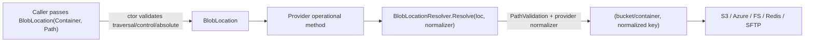
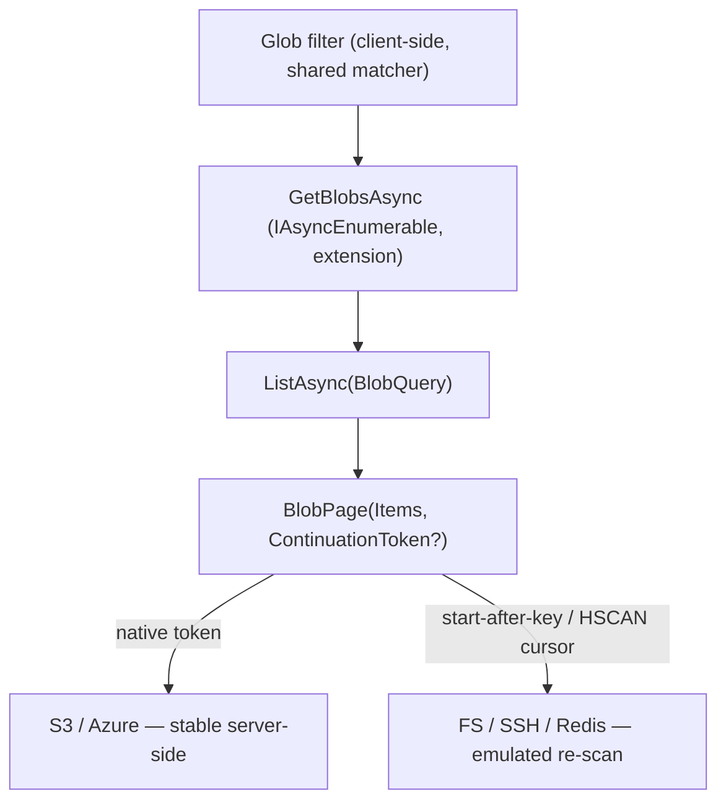
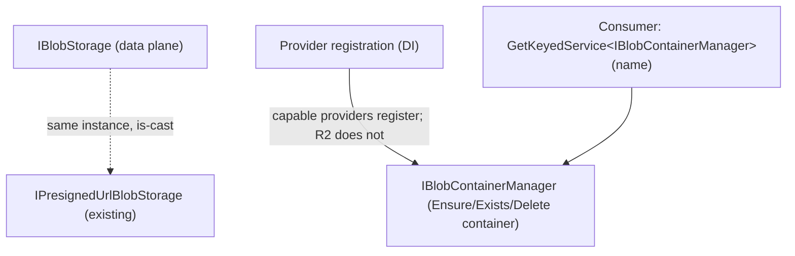

# refactor: Redesign IBlobStorage operational contract

## Summary

Reshape the `IBlobStorage` operational contract around a `BlobLocation(Container, Path)` value type, a serializable token-based listing primitive, prefix-first filtering, and capability interfaces for container management and universal metadata (sidecar files on the filesystem-like backends). The redesign routes every operation through one validate-and-normalize seam so the path-handling bug class found in the cross-provider review cannot recur, and folds the 12 consistency findings into the new shape rather than patching them first.

This is the operational contract only. The `AddHeadlessBlobs` builder, named-store resolution (`IBlobStorageProvider`), and keyed DI are unchanged (see origin: docs/brainstorms/2026-06-20-blobs-named-storage-requirements.md).

---

## Problem Frame

`IBlobStorage` carries a `string[] container` plus a separate `string blobName` on nearly every method. The first array element is "magic" — it maps to the provider root (S3 bucket, Azure container, FS/SFTP root) under strict naming rules, while the rest plus `blobName` form a lenient key. The two-tier model is never a type; it is re-documented per method and re-implemented per call site through a normalize-and-validate helper. Three real bugs hit the exact spots that skipped that helper: AWS `BulkDeleteAsync` (un-normalized bucket → silent no-op deletes), FileSystem `GetBlobInfoAsync` (raw `blobName` → path traversal), SSH `CreateContainerAsync` (raw segments → traversal + path mismatch). Secondary smells compound it: a closure-backed paging cursor that can't cross a web-request boundary, glob matching re-implemented per provider, container creation on the data plane, and metadata silently discarded by SFTP and FileSystem.

The fix is structural: make the address a validated value type, push normalization into one provider seam, and turn the leaky conventions (paging, filtering, container lifecycle, metadata) into explicit contracts.

---

## Key Technical Decisions

- KTD1. **`BlobLocation(Container, Path)` value type.** A `readonly record struct` (mirror `src/Headless.Coordination.Abstractions/NodeId.cs`) that validates provider-agnostic path security (traversal, control chars, absolute paths) via `Argument.*`/`PathValidation` in its constructor. It also exposes a `params string[]` segment convenience constructor. Provider-specific normalization is NOT done here — it stays per provider because the normalizer differs per backend.

- KTD2. **One resolve seam per provider.** Each provider resolves a `BlobLocation` to its backend key through a single shared helper (`BlobLocationResolver`) that applies `PathValidation` + the provider's `IBlobNamingNormalizer`. Every operational method calls it; none re-implement key building. This is what makes the H1/H2/H3 bug class structurally impossible.

- KTD3. **Token-based listing core, streaming as sugar.** `ListAsync(BlobQuery) → BlobPage(Items, ContinuationToken?)` is the primitive; the token is an **opaque** string the caller round-trips. `GetBlobsAsync` (`IAsyncEnumerable`) becomes an extension over it. Encodings: S3/Azure native tokens; FileSystem/SSH a start-after-key (lexicographic sort); Redis the native `HSCAN` cursor. Guarantee tiers are documented: server-side stable on S3/Azure; emulated re-scan (weaker stability, same cost as today) on FS/SSH/Redis.

- KTD4. **Prefix first-class; glob client-side.** `BlobQuery` carries a server-pushed `Prefix`. Glob (`*`,`?`) becomes a client-side filter through one shared matcher (extend `src/Headless.Blobs.Abstractions/Internals/BlobStorageHelpers.cs`), layered over `GetBlobsAsync`. Providers stop owning private regex.

- KTD5. **`IBlobContainerManager` capability — resolved, not cast.** A new capability interface (`EnsureContainerAsync`, `ContainerExistsAsync`, `DeleteContainerAsync`). Unlike `IPresignedUrlBlobStorage` (which both AWS and R2 support, so the `is`-cast-from-storage pattern is honest there), container management must distinguish providers that share a storage class: AWS supports bucket lifecycle, but R2 (object-scoped tokens) does not — yet R2 reuses `AwsBlobStorage`. So this capability is a **separately registered keyed/default service resolved from DI** (`GetKeyedService<IBlobContainerManager>(name)`), NOT a cast from the resolved `IBlobStorage`. Providers that support it register an implementation; R2 registers `IBlobStorage` but no manager, so resolution returns null and the capability is honestly absent. `UploadAsync` no longer creates the top-level container — missing managed container/bucket is an error; FS/SSH still create intermediate path directories inherent to writing.

- KTD6. **Universal metadata via sidecar.** FileSystem and SFTP store metadata in a companion file beside each blob (Redis already does this via a separate info hash). Write order is content-first, then sidecar; a missing sidecar reads as empty metadata. Sidecars are filtered from every list/exists/count/delete path. The sidecar key uses a reserved suffix; a blob key matching the reserved form is rejected at resolve time. Sidecar payloads use the buffer-first `ISerializer` contract (see origin: docs/solutions/architecture-patterns/buffer-first-serializer-contract.md).

- KTD7. **`Move` replaces `Rename`, documented non-atomic.** Copy-then-delete; best-effort rollback of the destination on source-delete failure; on FS/SFTP the sidecar moves with the blob. Naming and docs state the non-atomic reality.

- KTD8. **Unified bulk-result shape.** Bulk operations return `IReadOnlyList<T>` where each item carries the input `BlobLocation` (or blob identity) plus a `Result<…>` (`Headless.Primitives`), so results are correlatable, not positional. A per-item failure does not abort the batch.

- KTD9. **Consistent metadata typing.** One read-only dictionary shape with non-null string values across the upload parameter, `BlobInfo.Metadata`, and `BlobDownloadResult.Metadata`.

- KTD10. **Fold the 12 consistency findings.** H1–L5 are subsumed by the new shape rather than patched separately. Mapping:

  | Finding | Folded into |
  |---|---|
  | H1 AWS bulk-delete un-normalized bucket | U6 (resolve seam) |
  | H2 FileSystem GetBlobInfo traversal | U9 (resolve seam) |
  | H3 SSH CreateContainer raw segments | U11 (resolve seam + container manager) |
  | M1 non-seekable buffering doc mismatch | U2 + U15 (doc per provider) |
  | M2 GetBlobInfo metadata dropped | U6, U8 (universal metadata) |
  | M3 IsNotNull vs IsNotNullOrEmpty | U1 (BlobLocation ctor uniform) |
  | M4 Redis download metadata | U10 |
  | L1 missing traversal conformance tests | U13 |
  | L2 FS pattern-guard inconsistency | U9 (prefix-first removes core glob) |
  | L3 AWS list-vs-info Created | U6 (documented) |
  | L4 SSH rename destructive pre-delete | U11 (Move semantics) |
  | L5 CreateContainer caching divergence | U6/U8 (cache retained behind manager) |

- KTD11. **Registration surface unchanged.** `AddHeadlessBlobs` + `Use{Provider}` builder, per-instance isolation (clients/options/normalizers per keyed instance), and the presigned alias are preserved. The only DI addition is the keyed `IBlobContainerManager` alias for capable providers.

---

## High-Level Technical Design

The resolve seam — every method funnels through it, so validation/normalization cannot be skipped:



Listing — one primitive, streaming derived, opaque token per tier:



Capability segregation — data plane stays lean; lifecycle and presigned URLs are opt-in casts:



---

## Output Structure

New and renamed contract types in `src/Headless.Blobs.Abstractions/`:

```
src/Headless.Blobs.Abstractions/
  IBlobStorage.cs                  (reshaped: BlobLocation params, Move, ListAsync)
  IBlobContainerManager.cs         (new capability)
  IBlobNamingNormalizer.cs         (unchanged)
  IPresignedUrlBlobStorage.cs      (unchanged)
  BlobStorageExtensions.cs         (GetBlobsAsync sugar + glob filter + BlobLocation overloads)
  Contracts/
    BlobLocation.cs                (new value type)
    BlobQuery.cs                   (new: Container, Prefix, PageSize, ContinuationToken)
    BlobPage.cs                    (new: Items, ContinuationToken?)
    BlobInfo.cs                    (metadata typing)
    BlobDownloadResult.cs          (metadata typing)
    BlobUploadRequest.cs           (BlobLocation-aligned)
    BlobBulkResult.cs              (new: identity + Result<…>)
  Internals/
    BlobLocationResolver.cs        (new: validate + normalize seam)
    BlobStorageHelpers.cs          (shared glob matcher, prefix derivation, sidecar naming)
    PathValidation.cs              (unchanged)
```

The per-unit `Files` lists remain authoritative; this tree is the scope shape.

---

## Requirements

Carried from the origin requirements doc (R1–R17). Grouped by concern; IDs preserved.

**Addressing & validation**
- R1. Operations identify a blob by a single `BlobLocation(Container, Path)`; `Move`/`Copy` take source + destination `BlobLocation`.
- R2. `BlobLocation` validates path security (traversal, control chars, absolute) at construction, throwing `ArgumentException`; every method routes through it.
- R3. Provider-specific normalization is applied by the provider's resolve step, not by the value type.

**Listing & filtering**
- R4. List/delete accept a server-pushed `prefix` as the only backend filter.
- R5. A single paged primitive returns items plus an opaque, serializable continuation token; passing it back returns the next page; null means done.
- R6. `GetBlobsAsync` (`IAsyncEnumerable`) is provided as an extension over the paged primitive.
- R7. Glob matching is a client-side filter via one shared matcher.

**Container lifecycle**
- R8. Container/bucket lifecycle lives on `IBlobContainerManager`; providers implement only where meaningful.
- R9. `UploadAsync` does not create the top-level container/bucket; missing = error. FS/SSH still create intermediate path directories.

**Metadata**
- R10. All six providers support metadata; FS and SFTP use sidecar companions.
- R11. Sidecars are excluded from every listing/existence/count/delete-all result.
- R12. The sidecar naming scheme is collision-proofed; a colliding blob key is rejected.

**Mutation operations**
- R13. `UploadAsync` rewinds seekable streams; non-seekable handling is provider-specific and documented, not promised uniform.
- R14. The move operation is `Move`, copy-then-delete, non-atomic with best-effort destination rollback; on FS/SSH the sidecar moves with the blob.
- R15. Bulk operations return one identity-carrying result per input; a per-item failure does not abort the batch.

**Capabilities & typing**
- R16. Capability surfaces are discoverable by interface check; unsupported operations are explicit, not silently ignored.
- R17. Metadata uses one read-only dictionary shape with non-null values across upload param, `BlobInfo`, and download result.

---

## Implementation Units

### Phase 1 — Contracts (Headless.Blobs.Abstractions)

### U1. BlobLocation value type
- **Goal:** Introduce the validated address type that centralizes path security.
- **Requirements:** R1, R2, R3 (partial), R12 (collision hook).
- **Dependencies:** none.
- **Files:** `src/Headless.Blobs.Abstractions/Contracts/BlobLocation.cs`; test `tests/Headless.Blobs.Abstractions.Tests.Unit/BlobLocationTests.cs`.
- **Approach:** `readonly record struct BlobLocation` with `Container`, `Path`; constructor validates via `PathValidation.ValidatePathSegment`/`ValidateContainer` and `Argument.IsNotNullOrEmpty`. Add `BlobLocation(string container, params string[] segments)` joining with `/`. Mirror `NodeId` (`[PublicAPI]`, XML docs, ctor exceptions). Expose a `ToString()` for diagnostics. Reserve a static check for the sidecar suffix (consumed by KTD6) — reject a `Path` matching the reserved form.
- **Patterns to follow:** `src/Headless.Coordination.Abstractions/NodeId.cs`; `src/Headless.Blobs.Abstractions/Internals/PathValidation.cs`.
- **Test suite design:** Pure unit tests in `Headless.Blobs.Abstractions.Tests.Unit` (no I/O).
- **Test scenarios:**
  - Valid `(container, path)` round-trips through properties. Covers AE-adjacent.
  - `Path` containing `../`, `..\\`, leading `/`, `\x00` control char each throw `ArgumentException` with the path param name. Covers AE1.
  - Empty/null container and empty/null path throw (uniform `IsNotNullOrEmpty`). Covers M3 fold.
  - `params` ctor joins segments with `/` and validates the joined path.
  - A path equal to the reserved sidecar form throws. Covers AE7 (construction half).
- **Verification:** Planned unit tests added and passing; `BlobLocation` is the only address type referenced by the new interface.

### U2. Reshape IBlobStorage + listing/result/metadata contracts
- **Goal:** Replace `string[] container`+`blobName` with `BlobLocation`, add the token-listing primitive, `Move`, unified bulk results, and consistent metadata typing.
- **Requirements:** R1, R4, R5, R6, R13, R14, R15, R17.
- **Dependencies:** U1.
- **Files:** `src/Headless.Blobs.Abstractions/IBlobStorage.cs`; `Contracts/BlobQuery.cs`, `Contracts/BlobPage.cs`, `Contracts/BlobBulkResult.cs`, `Contracts/BlobInfo.cs`, `Contracts/BlobDownloadResult.cs`, `Contracts/BlobUploadRequest.cs`, `Contracts/INextPageResult.cs` + `NextPageResult.cs` (remove/replace closure cursor).
- **Approach:** New signatures — `UploadAsync(BlobLocation, Stream, metadata?, ct)`, `DeleteAsync(BlobLocation, ct)`, `DeleteAllAsync(BlobQuery, ct) → int` (prefix-based delete-by-query, replacing the dropped `DeleteAllAsync(container, pattern)`; glob-by-pattern delete is a client-side extension that lists+filters+bulk-deletes), `MoveAsync(BlobLocation source, BlobLocation dest, ct)`, `CopyAsync(source, dest, ct)`, `ExistsAsync(BlobLocation, ct)`, `OpenReadStreamAsync(BlobLocation, ct)`, `GetBlobInfoAsync(BlobLocation, ct)`, `ListAsync(BlobQuery, ct) → BlobPage`, bulk ops returning `IReadOnlyList<BlobBulkResult>`. `BlobQuery` = `{ Container, Prefix?, PageSize, ContinuationToken? }`; its constructor validates `Container` and `Prefix` through `PathValidation` (the same seam as `BlobLocation`) so a `../` prefix can never reach directory enumeration on FS/SSH. `BlobPage` = `{ IReadOnlyList<BlobInfo> Items, string? ContinuationToken }`. `BlobBulkResult` carries the input `BlobLocation` + `Result<bool, Exception>` (delete) / `Result<Exception>` semantics unified to one identity-carrying shape. Metadata typing → `IReadOnlyDictionary<string,string>?` everywhere, non-null values. Remove `CreateContainerAsync` (moves to U3). Delete the closure-cursor `PagedFileListResult`/`INextPageResult` path. Document non-seekable handling as provider-specific (M1).
- **Patterns to follow:** existing XML-doc density in `IBlobStorage.cs`; `Result<…>` in `src/Headless.Extensions/Primitives/`.
- **Test suite design:** Contract compiles; behavior is proven by the conformance harness (U13), not here.
- **Test scenarios:** `Test expectation: none -- pure contract/shape; behavior covered by U13 conformance.`
- **Verification:** Solution compiles against the new interface once providers (U6–U11) are updated; no member still takes `string[] container` + `blobName`.

### U3. IBlobContainerManager capability
- **Goal:** Move container lifecycle off the data plane into an opt-in capability.
- **Requirements:** R8, R9 (error path), R16.
- **Dependencies:** U1.
- **Files:** `src/Headless.Blobs.Abstractions/IBlobContainerManager.cs`; test coverage via U13/U14.
- **Approach:** `[PublicAPI]` interface with `EnsureContainerAsync(string container, ct)`, `ContainerExistsAsync(string container, ct)`, `DeleteContainerAsync(string container, ct)`. XML docs state idempotency for `EnsureContainer` and that S3 may decline runtime bucket creation. Mirror `IPresignedUrlBlobStorage.cs`.
- **Patterns to follow:** `src/Headless.Blobs.Abstractions/IPresignedUrlBlobStorage.cs`.
- **Test suite design:** Conformance for capable providers in U13; capability presence asserted in U14.
- **Test scenarios:** `Test expectation: none -- interface shape; behavior covered by U13/U14.`
- **Verification:** Interface present; AWS/Azure/FileSystem/SSH/Redis register a manager implementation (U6/U8/U9/U10/U11); R2 does not; consumers resolve it from DI (`GetKeyedService<IBlobContainerManager>`), not by `is`-casting the storage.

### U4. Shared resolve seam, glob matcher, sidecar + token helpers
- **Goal:** Provide the single validate+normalize seam and the shared list/sidecar utilities every provider reuses.
- **Requirements:** R3, R7, R10, R11, R12.
- **Dependencies:** U1.
- **Files:** `src/Headless.Blobs.Abstractions/Internals/BlobLocationResolver.cs` (new); `Internals/BlobStorageHelpers.cs` (extend); tests `tests/Headless.Blobs.Abstractions.Tests.Unit/BlobStorageHelpersTests.cs`.
- **Approach:** `BlobLocationResolver.Resolve(BlobLocation, IBlobNamingNormalizer)` → `(container, normalizedKey)` applying `PathValidation` then the two-tier normalization (container[0] strict, rest lenient). Also `ResolveQuery(BlobQuery, IBlobNamingNormalizer)` → `(container, normalizedPrefix)` that validates + normalizes the listing/delete prefix through the same `PathValidation`, so `ListAsync`/`DeleteAllAsync` use the identical seam (closes the listing-traversal gap). Add to `BlobStorageHelpers`: the shared glob→matcher (reuse existing `GetRequestCriteria` regex logic, exposed as a predicate), literal-prefix derivation from a glob, and the reserved sidecar suffix + `IsSidecarKey(key)` helper.
- **Patterns to follow:** existing `BlobStorageHelpers.GetRequestCriteria`; `PathValidation`.
- **Test suite design:** Pure unit tests in `Headless.Blobs.Abstractions.Tests.Unit`.
- **Test scenarios:**
  - Resolver normalizes container[0] strictly and key segments leniently; output matches what providers store.
  - Resolver rejects traversal/control/absolute before normalization.
  - `ResolveQuery` rejects a `../` prefix and normalizes a valid prefix (listing/delete share the seam).
  - Glob matcher: `*`/`?` match expected names; literal-prefix derivation returns the longest non-wildcard head.
  - `IsSidecarKey` recognizes the reserved suffix and rejects collisions.
- **Verification:** Planned unit tests pass; all providers call `BlobLocationResolver` (no private key-building remains).

### U5. BlobStorageExtensions reshape
- **Goal:** Rebuild `GetBlobsAsync` as streaming sugar over `ListAsync`, add the glob-filter extension, and migrate the content/JSON helpers to `BlobLocation`.
- **Requirements:** R6, R7.
- **Dependencies:** U2, U4.
- **Files:** `src/Headless.Blobs.Abstractions/BlobStorageExtensions.cs`; tests `tests/Headless.Blobs.Abstractions.Tests.Unit/BlobStorageExtensionsTests.cs`.
- **Approach:** `GetBlobsAsync(storage, BlobQuery)` iterates `ListAsync` pages until the token is null. Add `GetBlobsAsync(..., string globPattern)` that filters the stream with the shared matcher. Migrate `UploadContentAsync`/`GetBlobContentAsync`/JSON overloads to `BlobLocation`. Keep the `GetBlobsListAsync` materializer over the token primitive (replace the old `GetPagedListAsync` loop).
- **Patterns to follow:** current `BlobStorageExtensions.cs` `extension(IBlobStorage storage)` blocks.
- **Test suite design:** Unit tests with a fake `IBlobStorage` returning canned pages.
- **Test scenarios:**
  - `GetBlobsAsync` enumerates across multiple pages until token null.
  - Glob extension filters to matching keys only.
  - `UploadContentAsync(null)` uploads empty; `GetBlobContentAsync` round-trips UTF-8.
  - JSON overloads serialize/deserialize via the source-generated and reflection paths.
- **Verification:** Planned unit tests pass; no extension references the removed cursor type.

### Phase 2 — Providers

### U6. AWS provider rewrite (+ folds H1, L3, M2)
- **Goal:** Move `AwsBlobStorage` to the new contract through the resolve seam, native-token paging, prefix, full metadata, container manager, unified bulk.
- **Requirements:** R1–R7, R13–R17; KTD10 (H1, L3, M2).
- **Dependencies:** U1–U4.
- **Files:** `src/Headless.Blobs.Aws/AwsBlobStorage.cs`, `src/Headless.Blobs.Aws/AwsBlobContainerManager.cs` (new), `src/Headless.Blobs.Aws/Setup.cs`; test updates in U14.
- **Approach:** Every method resolves via `BlobLocationResolver` (kills the H1 inline bulk-delete key building). `ListAsync` uses `ListObjectsV2` `ContinuationToken` as the opaque token; `BlobQuery.Prefix` pushed down. `GetBlobInfoAsync` populates `Metadata` from the HEAD response (M2) and documents that the list API can't (Created falls back to LastModified — L3). Provide a dedicated `AwsBlobContainerManager` (registered only by the AWS provider, not R2) implementing the lifecycle (`EnsureContainerAsync` keeps the per-instance ensured-bucket cache — L5; `DeleteContainerAsync`/`ContainerExistsAsync` via S3 APIs). `UploadAsync` drops auto-create (fails on missing bucket). Bulk returns `BlobBulkResult` per input.
- **Patterns to follow:** existing `_BuildObjectKey`/`_ToDictionary`/`_GetUploadedDate` (re-cast onto the resolver); `AwsBlobStorageOptions` validator wiring.
- **Test suite design:** Cross-provider conformance (U13) + AWS-specific native-token paging test (U14).
- **Test scenarios:**
  - Bulk-delete of keys whose container needs normalization actually deletes (not silent success). Covers AE2 (H1).
  - `ListAsync` round-trips a native continuation token across calls. Covers AE5.
  - `GetBlobInfoAsync` returns stored metadata; list `Created` documented as LastModified fallback.
  - Upload to a missing bucket throws; after `EnsureContainerAsync`, succeeds. Covers AE4.
- **Verification:** Conformance + AWS-specific tests pass; no inline key building remains.

### U7. CloudflareR2 alignment
- **Goal:** Keep R2 working against the reshaped `AwsBlobStorage` it directly instantiates.
- **Requirements:** R1–R17 (inherited via AWS).
- **Dependencies:** U6.
- **Files:** `src/Headless.Blobs.CloudflareR2/Setup.cs`, `src/Headless.Blobs.CloudflareR2/R2BlobNamingNormalizer.cs` (if touched); test updates in U14.
- **Approach:** Verify the direct `AwsBlobStorage` instantiation compiles against new signatures. R2 does NOT register an `IBlobContainerManager` (object-scoped tokens cannot create buckets, and ensuring a missing bucket would not make a subsequent upload succeed). Because the capability is a separately-registered service resolved from DI (KTD5), not a cast from the storage, R2 omitting the registration makes the capability honestly absent (`GetKeyedService<IBlobContainerManager>` returns null) — no need for `AwsBlobStorage` to implement the interface at all (a dedicated `AwsBlobContainerManager`, registered only by the AWS provider, owns it). R2 bucket provisioning is out-of-band (IaC/dashboard). Confirm R2 normalizer flows through the resolver.
- **Patterns to follow:** `src/Headless.Blobs.CloudflareR2/Setup.cs` reuse pattern.
- **Test suite design:** R2 conformance leaf (U14) reusing the harness.
- **Test scenarios:**
  - R2 round-trips upload/list/move/delete via the harness.
  - R2 `EnsureContainerAsync` behavior matches its documented no-bucket-create stance.
- **Verification:** R2 conformance passes; R2 builds against the new `AwsBlobStorage`.

### U8. Azure provider rewrite (+ folds M2, M1 doc)
- **Goal:** Move `AzureBlobStorage` to the contract with native continuation tokens and full metadata.
- **Requirements:** R1–R7, R13–R17; KTD10 (M2, M1).
- **Dependencies:** U1–U4.
- **Files:** `src/Headless.Blobs.Azure/AzureBlobStorage.cs`, `src/Headless.Blobs.Azure/AzureBlobContainerManager.cs` (new), `src/Headless.Blobs.Azure/Setup.cs`; tests in U14.
- **Approach:** Resolve seam; `ListAsync` uses Azure `Pageable` `ContinuationToken`; `GetBlobInfoAsync` populates `Metadata` from `GetPropertiesAsync` (M2); implement `IBlobContainerManager` (ensured-container cache retained — L5; `UploadAsync` no longer auto-creates). Document non-seekable stream pass-through (M1). Unified bulk results.
- **Patterns to follow:** existing `_ToBlobInfo`, ensured-container cache, `_NormalizeBlob`.
- **Test suite design:** Conformance (U13) + Azure native-token paging test (U14).
- **Test scenarios:**
  - `GetBlobInfoAsync` returns metadata consistent with list metadata.
  - Native continuation token round-trips. Covers AE5.
  - Upload to missing container throws; `EnsureContainerAsync` then succeeds. Covers AE4.
- **Verification:** Conformance + Azure-specific tests pass.

### U9. FileSystem provider rewrite (+ folds H2, L2, sidecar metadata)
- **Goal:** Route every FS path through the resolver, add sidecar metadata, start-after-key paging, prefix; remove core glob.
- **Requirements:** R1–R14, R17; KTD6; KTD10 (H2, L2, L5).
- **Dependencies:** U1–U4.
- **Files:** `src/Headless.Blobs.FileSystem/FileSystemBlobStorage.cs`, `FileSystemBlobContainerManager.cs` (new), `Setup.cs`, `FileSystemBlobStorageLoggerExtensions.cs`; tests in U14.
- **Approach:** All methods (incl. `GetBlobInfoAsync` — closes H2) resolve via `BlobLocationResolver`. Metadata stored in a sidecar companion (content-first write order); `Created` from sidecar upload-date when present else file ctime (OQ6). `ListAsync` enumerates sorted by key, applies `Prefix`, encodes a start-after-key token; sidecars filtered from all results (R11). `DeleteAsync`/`BulkDeleteAsync`/`DeleteAllAsync` remove the sidecar alongside the blob, so re-uploading the same key without metadata cannot resurrect stale metadata. `MoveAsync` moves the sidecar with the blob. `DeleteAllAsync(BlobQuery)` deletes by validated prefix. `IBlobContainerManager.EnsureContainerAsync` = create root dir; `ContainerExists`/`DeleteContainer` via directory ops. Core glob removed (L2 dissolves — glob is now the client-side extension).
- **Patterns to follow:** existing `_BuildBlobPath`/`_GetDirectoryPath`/`_ThrowIfPathTraversal`.
- **Test suite design:** Conformance (U13) + FS-specific sidecar-filtering and start-after paging tests (U14).
- **Test scenarios:**
  - `GetBlobInfoAsync` with a traversal path throws (H2). Covers AE3.
  - Metadata round-trips via sidecar; sidecar never appears in a listing. Covers AE6.
  - Uploading a blob whose key matches the reserved sidecar form is rejected. Covers AE7.
  - Start-after-key token paginates a directory and survives serialization. Covers AE5.
  - `MoveAsync` relocates both blob and sidecar.
- **Verification:** Conformance + FS-specific tests pass; `GetBlobInfoAsync` no longer builds paths inline.

### U10. Redis provider rewrite (+ folds M4)
- **Goal:** Move `RedisBlobStorage` to the contract; surface download metadata; HSCAN-cursor token paging.
- **Requirements:** R1–R15, R17; KTD10 (M4).
- **Dependencies:** U1–U4.
- **Files:** `src/Headless.Blobs.Redis/RedisBlobStorage.cs`, `RedisBlobContainerManager.cs` (new), `Setup.cs`; tests in U14.
- **Approach:** Resolve seam; `OpenReadStreamAsync` returns stored `Metadata` (reads the info hash — M4); `ListAsync` uses the `HSCAN` cursor as the opaque token with `Prefix` as the match head — document non-lexicographic order + possible duplicates across rehash (KTD3). `IBlobContainerManager.EnsureContainerAsync` is a no-op (Redis has no container); `ContainerExists` true if any key under the prefix; `DeleteContainer` clears the hash. Sidecar concept maps to the existing separate info hash (already atomic via Lua). Unified bulk results.
- **Patterns to follow:** existing Lua scripts, `_ScanBlobInfoListAsync`, `_BuildContainerPath`; buffer-first serializer for the info payload.
- **Test suite design:** Conformance (U13) + Redis HSCAN-paging test (U14).
- **Test scenarios:**
  - `OpenReadStreamAsync` returns the stored metadata (M4).
  - `HSCAN` cursor token round-trips and eventually terminates; duplicates tolerated by callers (documented).
  - Bulk results carry per-key identity.
- **Verification:** Conformance + Redis-specific tests pass.

### U11. SshNet provider rewrite (+ folds H3, L4, sidecar metadata)
- **Goal:** Normalize+validate container creation, add sidecar metadata, start-after-key paging, non-atomic `Move`.
- **Requirements:** R1–R14, R17; KTD6, KTD7; KTD10 (H3, L4).
- **Dependencies:** U1–U4.
- **Files:** `src/Headless.Blobs.SshNet/SshBlobStorage.cs`, `SshBlobContainerManager.cs` (new), `SftpClientPool.cs` (if touched), `Setup.cs`; tests in U14.
- **Approach:** `CreateContainer`/`_CreateContainerWithClientAsync` validate + normalize each segment via the resolver (closes H3 in both the public method and the upload/move retry paths). Sidecar metadata (content-first; 2× round-trip acknowledged); sidecars filtered from listings. `DeleteAsync`/`BulkDeleteAsync`/`DeleteAllAsync` remove the sidecar with the blob (no stale-metadata resurrection on re-upload). `ListAsync` recursive list → sort by key → start-after token, `Prefix` applied; `DeleteAllAsync(BlobQuery)` deletes by validated prefix. `MoveAsync` documents the destructive pre-delete edge (L4) and moves the sidecar. `IBlobContainerManager.EnsureContainerAsync` = mkdir -p (validated/normalized); `ContainerExists`/`DeleteContainer` via SFTP. Unified bulk results.
- **Patterns to follow:** existing `_BuildBlobPath`/`_BuildContainerPath`; pool acquire/release.
- **Test suite design:** Conformance (U13) + SSH-specific sidecar + start-after paging tests (U14).
- **Test scenarios:**
  - `EnsureContainerAsync(["..","x"])` is rejected (H3 traversal).
  - Created container path matches where uploads are written (normalization parity).
  - Metadata round-trips via sidecar; sidecar filtered from listings. Covers AE6.
  - `MoveAsync` moves blob + sidecar; non-atomic behavior documented.
- **Verification:** Conformance + SSH-specific tests pass; no raw-segment path building remains.

### Phase 3 — Core wiring

### U12. Register IBlobContainerManager as a resolved capability
- **Goal:** Register a dedicated `IBlobContainerManager` (keyed + default) for capable providers without breaking the builder, keeping R2 honestly capability-less.
- **Requirements:** R8, R16, KTD11.
- **Dependencies:** U3, U6, U8, U9, U10, U11.
- **Files:** provider `Setup.cs` files (Aws, Azure, FileSystem, Redis, SshNet) and/or `src/Headless.Blobs.Core/Setup.cs`.
- **Approach:** Each capable provider registers its own manager implementation as keyed + default `IBlobContainerManager` (per-instance, mirroring the per-instance isolation of the storage). This is a separate registration (resolve via DI), NOT a cast from the resolved `IBlobStorage` — so the AWS provider registers a manager while CloudflareR2 (which reuses `AwsBlobStorage`) registers none, and `GetKeyedService<IBlobContainerManager>` honestly returns null for R2. Keep the `AddHeadlessBlobs`/`Use{Provider}` grammar and per-instance isolation intact. The presigned alias is unchanged (still a cast — both AWS and R2 support it).
- **Patterns to follow:** the keyed per-instance registration in the provider `Setup.cs` files; presigned alias for contrast (cast vs. separate registration).
- **Test suite design:** Registration tests in each provider's `*.Tests.Integration` (mirror existing `*RegistrationTests`).
- **Test scenarios:**
  - Resolving `IBlobContainerManager` (default + keyed) succeeds for AWS/Azure/FileSystem/Redis/SSH.
  - Resolving `IBlobContainerManager` for a CloudflareR2-only registration returns null (capability honestly absent).
  - The presigned alias still resolves for both AWS and R2.
- **Verification:** Registration tests pass; builder behavior unchanged.

### Phase 4 — Tests

### U13. Conformance harness rewrite
- **Goal:** Move the shared conformance base to the new contract and add the previously-missing coverage that catches the folded bugs.
- **Requirements:** R1–R17; KTD10 (L1).
- **Dependencies:** U2–U5.
- **Files:** `tests/Headless.Blobs.Tests.Harness/BlobStorageTestsBase.cs`.
- **Approach:** Migrate all base virtual methods to `BlobLocation`/`ListAsync`/`MoveAsync`. Add new base tests: token-paging round-trip (serialize the token between pages); traversal tests for `GetBlobInfoAsync`, bulk delete, and `ListAsync`/`DeleteAllAsync` (the L1 gaps, including a `../` prefix in `BlobQuery`); a normalization round-trip test (upload under a name that normalizes, then bulk-delete/GetBlobInfo it — catches H1/H2); delete-by-prefix (`DeleteAllAsync(BlobQuery)` removes matching blobs); metadata round-trip including sidecar-not-listed, collision rejection, and **delete-then-re-upload yields no stale metadata** (sidecar deleted with blob); `Move` non-atomic move-with-metadata. Add a `protected virtual bool SupportsContainerManagement` hook so capable providers assert `IBlobContainerManager` resolves and R2 asserts it does not.
- **Patterns to follow:** existing `BlobStorageTestsBase` virtual-method shape; `ResetAsync`.
- **Test suite design:** This IS the shared conformance suite; leaf wiring in U14.
- **Test scenarios:** (enumerated above as new base methods) — token round-trip, GetBlobInfo/bulk/list traversal, normalization round-trip, metadata sidecar round-trip + collision, Move-with-metadata. Covers AE1–AE7.
- **Verification:** Base compiles; all six leaves (U14) green against it.

### U14. Per-provider leaf test updates + unit tests
- **Goal:** Wire the new conformance methods into all six leaves and add provider-specific + abstraction unit tests.
- **Requirements:** R1–R17.
- **Dependencies:** U13, U6–U12.
- **Files:** `tests/Headless.Blobs.{Aws,Azure,CloudflareR2,FileSystem,Redis,SshNet}.Tests.Integration/*BlobStorageTests.cs` (+ `AzureStorageTests.cs`); provider `*RegistrationTests.cs`; `tests/Headless.Blobs.*.Tests.Unit/*NamingNormalizerTests.cs`.
- **Approach:** Add `[Fact]/[Theory] public override` delegations for each new base method to all six leaves; `[Fact(Skip="…")]` only where a backend genuinely can't (document why). Add provider-specific tests: native-token paging (S3/Azure), sidecar filtering + start-after paging (FS/SSH), HSCAN paging (Redis). Keep normalizer unit tests aligned with resolver behavior.
- **Patterns to follow:** existing leaf override pattern in `FileSystemBlobStorageTests.cs`.
- **Test suite design:** Integration (Testcontainers) for providers; unit for normalizers/BlobLocation.
- **Test scenarios:** the six leaves each run the full conformance set; provider-specific scenarios as above.
- **Verification:** `make test-project` green for each provider; no silent `Skip` without a documented reason.

### Phase 5 — Documentation

### U15. Docs + migration notes
- **Goal:** Sync the agent-facing docs and record the breaking migration.
- **Requirements:** R-doc traceability; KTD10 (M1 doc).
- **Dependencies:** U2–U12.
- **Files:** `docs/llms/blobs.md`; `src/Headless.Blobs.*/README.md`; a changelog/migration note.
- **Approach:** Update the operational contract (BlobLocation, ListAsync, Move), the capability interfaces (`IBlobContainerManager`, presigned), metadata sidecar behavior + tiers, prefix/glob split, and the non-seekable per-provider note (M1). Per AUTHORING.md, keep `docs/llms/blobs.md` and the package READMEs in lockstep. Add migration guidance for the operational-contract break (OQ9).
- **Patterns to follow:** `docs/authoring/AUTHORING.md`; existing `docs/llms/blobs.md`.
- **Test suite design:** `Test expectation: none -- documentation. Verify XML-doc builds (no CS1734/RCS1139) via a non-incremental build.`
- **Verification:** Docs match the shipped contract; `make rebuild` clean (XML-doc analyzers pass).

---

## Testing Strategy

- **Conformance (shared):** `Headless.Blobs.Tests.Harness` owns every cross-provider behavior (round-trip, paging, traversal, metadata, Move). All six providers run it through their leaf `*.Tests.Integration` classes (Testcontainers; Docker required).
- **Provider-specific (integration):** native-token paging (S3/Azure), sidecar filtering + start-after paging (FS/SSH), HSCAN paging (Redis), capability presence/absence, registration aliases.
- **Unit:** `BlobLocation` validation, `BlobLocationResolver`, the shared glob matcher + prefix derivation, `BlobStorageExtensions` (fake `IBlobStorage`), and per-provider normalizers — in the `*.Tests.Unit` projects, no I/O.
- **New infrastructure:** none beyond extending the existing harness. SqlServer-style reuse caveats don't apply; existing blob Testcontainers fixtures stay.
- **Execution posture:** the folded security findings (H1/H2/H3) should be locked first — add the failing traversal/normalization conformance tests (U13) before the provider rewrites land, so the resolve seam is proven to close them.

---

## Scope Boundaries

- Operational contract only. The `AddHeadlessBlobs` builder, named-store resolution, keyed DI, and per-instance isolation are unchanged (origin: docs/brainstorms/2026-06-20-blobs-named-storage-requirements.md).
- Out: cross-store/cross-container coordination — replication, routing-by-prefix, fallback chains, cross-store `Move`/`Copy`.
- Out: `xattr`-based metadata (rejected for sidecar); capability-segregated paging (rejected for emulated tiers).

### Deferred to Follow-Up Work
- Optional ordered Redis pagination (sort-based start-after) if the HSCAN cursor's ordering/duplication proves insufficient for a real consumer.
- A `DeleteContainerAsync` safety guard (e.g., refuse non-empty containers) if operational use warrants it.

---

## Risks & Dependencies

- **CloudflareR2 couples to AwsBlobStorage by direct instantiation** — every AWS signature change must update R2 in the same unit (U7). Build R2 immediately after AWS.
- **Sidecar atomicity on FS/SFTP** — no transaction means partial-state windows (blob without sidecar, orphan sidecar) on crash/cancel. Content-first write order + missing-sidecar-reads-empty keeps reads safe; orphan cleanup is best-effort. Tested via cancel-mid-write scenarios in U9/U11.
- **SFTP 2× round-trips** for metadata-bearing list/info — acknowledged cost; documented tier.
- **Redis HSCAN cursor semantics** — non-lexicographic, possible duplicates across rehash; callers must tolerate. Documented; ordered fallback deferred.
- **Breaking change blast radius** — all six providers + harness + every leaf test change together; sequence Phase 1 (contracts) fully before providers so the solution compiles in coherent slices.
- **Dependency:** buffer-first `ISerializer` contract for sidecar/info payloads (origin: docs/solutions/architecture-patterns/buffer-first-serializer-contract.md).

---

## Acceptance Examples

Carried from origin (AE1–AE7); each maps to conformance scenarios in U13.

- AE1. A `BlobLocation` built with a `../` path throws `ArgumentException` before any provider call. (U1, U13)
- AE2. Blobs uploaded under a container name that requires normalization are actually deleted by bulk delete, not silently reported deleted. (U6, U13)
- AE3. `GetBlobInfoAsync` with an escaping path throws on FileSystem. (U9, U13)
- AE4. Upload to a missing Azure container fails; after `EnsureContainerAsync`, the same upload succeeds. (U8, U13)
- AE5. A continuation token serialized and passed to a fresh `ListAsync` returns the next page. (U6/U8/U9/U10/U11, U13)
- AE6. Metadata round-trips on FileSystem/SFTP via sidecar, and the sidecar never appears as a blob in a listing. (U9/U11, U13)
- AE7. A blob key matching the reserved sidecar form is rejected. (U1/U4, U13)
- AE8. Deleting a blob removes its sidecar; re-uploading the same key without metadata returns no metadata (no resurrection). (U9/U11, U13)
- AE9. A `BlobQuery` with a `../` prefix throws before any listing/delete enumeration. (U2/U4, U13)
- AE10. `IBlobContainerManager` resolves for AWS but is absent (null) for a CloudflareR2-only registration. (U12, U13)

---

## Open Questions

Deferred to implementation — knowable only against real code, not blocking the plan:

- OQ3. Exact reserved sidecar suffix and escape rule (constrained by KTD6; pick a suffix unlikely to collide, enforce via `IsSidecarKey`).
- OQ4. Sidecar orphan-cleanup policy on FS/SSH after a crash mid-write (best-effort sweep vs. ignore).
- OQ5. Whether Redis ships HSCAN-cursor only or also the sort-based ordered token (deferred unless a consumer needs order).
- OQ6. `Created` source precedence on FileSystem when both sidecar upload-date and file ctime exist (plan: prefer sidecar upload-date).

---

## Sources & Research

- `src/Headless.Blobs.Abstractions/IBlobStorage.cs`, `IPresignedUrlBlobStorage.cs`, `IBlobNamingNormalizer.cs` — current contract + capability template.
- `src/Headless.Blobs.Abstractions/Internals/PathValidation.cs`, `BlobStorageHelpers.cs` — validation + glob/prefix helpers to extend.
- `src/Headless.Coordination.Abstractions/NodeId.cs` — `readonly record struct` + ctor-validation pattern for `BlobLocation`.
- `src/Headless.Extensions/Primitives/` — `Result<TError>` / `Result<TValue,TError>` (`Headless.Primitives`) for `BlobBulkResult`.
- `src/Headless.Blobs.Core/` (`Setup.cs`, `HeadlessBlobsSetupBuilder.cs`, `HeadlessBlobInstanceBuilder.cs`, `KeyedServiceBlobStorageProvider.cs`) — registration surface to preserve.
- `src/Headless.Blobs.CloudflareR2/Setup.cs` — direct `AwsBlobStorage` reuse + forced defaults.
- `src/Headless.Blobs.{Aws,Azure,FileSystem,Redis,SshNet}/*BlobStorage.cs` — provider implementations to rewrite.
- `tests/Headless.Blobs.Tests.Harness/BlobStorageTestsBase.cs` + six leaf `*.Tests.Integration` classes — conformance wiring.
- `docs/solutions/architecture-patterns/unified-provider-setup-builder-pattern.md`, `named-instance-keyed-provider-registration.md`, `buffer-first-serializer-contract.md` — load-bearing conventions (isolation invariant, serializer contract).
- `docs/brainstorms/2026-06-26-blobs-interface-redesign-requirements.md` — origin requirements.
