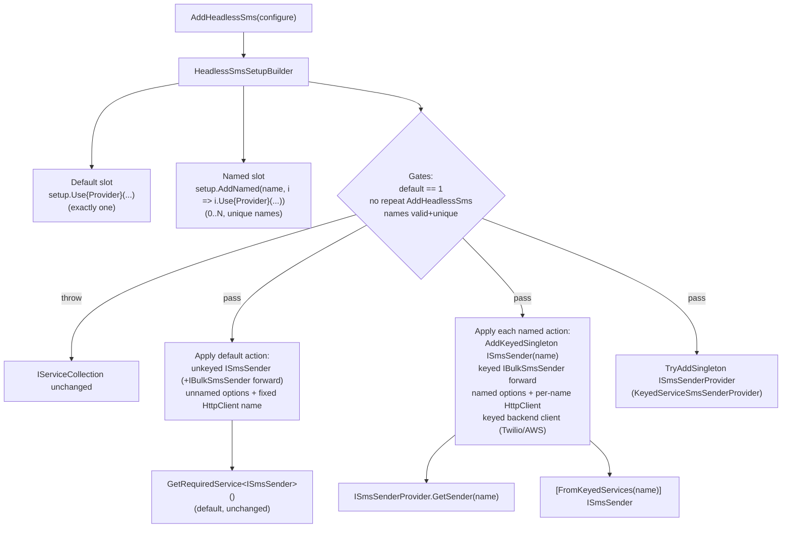

# Named SMS Clients - Plan

## Goal Capsule

- **Objective:** Replace the SMS feature's exactly-one-provider registration with a default-plus-named-clients model — multiple named `ISmsSender` instances (same provider allowed twice) with per-name options/HttpClient/state isolation, resolved through a public `ISmsSenderProvider` factory over keyed DI — mirroring the already-migrated `Headless.Emails` blueprint. Includes a repo-wide CA1708 de-pragma sweep (split extension classes) and a new `Headless.Sms.Core` package.
- **Authority:** Repo conventions (root `CLAUDE.md`, `docs/authoring/AUTHORING.md`) override this plan on style/process; this plan overrides the `Headless.Emails` blueprint only where a Key Technical Decision says so (KTD6 class-split, KTD7 layering); everywhere else, when this plan and the Emails source disagree on a mechanism detail, follow the Emails source and note the divergence.
- **Stop conditions:** Surface to the user instead of guessing if (a) the Emails blueprint turns out not to support a mechanism this plan assumes (e.g., named options validation not firing per name), (b) the `ClaimsPrincipalExtensions.cs` CA1708 case cannot be fixed by a mechanical split, or (c) any provider's named migration requires changing send-path behavior (anything beyond constructor/registration seams).
- **Execution profile:** Single PR; units land as dependency-ordered atomic commits. U1+U2 intentionally break provider compilation until U3–U5 complete — do not attempt green builds between those commits; the PR-level build is the gate.

---

## Product Contract

### Summary

Register several named SMS clients side by side — including the same provider twice with different options — through the existing `AddHeadlessSms` builder, while the unnamed single-provider default keeps working exactly as today. Consumption is discoverable: inject `ISmsSenderProvider` and call `GetSender("otp")`, or use keyed DI directly. The machinery moves to a new `Headless.Sms.Core` package, and every CA1708 pragma in the repo's provider setup classes is removed by splitting to one extension receiver per class.

### Problem Frame

PR #549 shipped the single-recipient SMS core, bulk capability, and provider hardening, but the registration model still enforces exactly one provider per host: `SetupSmsCore._AddSmsCore` throws unless `Extensions.Count == 1`, senders are unkeyed singletons, options are unnamed, and each provider's HttpClient name is a fixed constant. A host that needs an OTP route on Twilio and a marketing route on Vodafone — or two Twilio accounts — cannot compose them. The framework already solved this exact problem for Emails, Caching, and Captcha with a default-slot + named-slot builder over keyed DI; SMS is the remaining sender-style feature on the old gate. Separately, the two-receiver extension-class pattern those migrations introduced was suppressed with `#pragma warning disable CA1708` in 15 provider setup files — a suppression the maintainer has rejected as policy.

### Requirements

**Registration & composition**

- R1. One `AddHeadlessSms` call composes an optional set of named clients via `setup.AddNamed(name, instance => instance.Use{Provider}(...))` — unlimited count, names unique (ordinal), non-null/non-whitespace, each instance selecting exactly one provider.
- R2. The same provider type is registerable under multiple names with fully independent options (e.g., two Twilio clients with different sender numbers).
- R3. The default registration (`setup.Use{Provider}(...)`) keeps working with an exactly-one-default gate, and `ISmsSender`/`IBulkSmsSender` resolve the default unkeyed, byte-for-byte as today.
- R4. Registration is deferred: gates run before anything touches `IServiceCollection`, so a throwing setup leaves the collection unchanged; a repeated `AddHeadlessSms` call throws via a sentinel registration.

**Resolution & consumption**

- R5. A public `ISmsSenderProvider` in `Headless.Sms.Abstractions` exposes `GetSender(string name)` (throws `InvalidOperationException` naming `AddNamed` and the `Use*` methods for unknown names) and `GetSenderOrNull(string name)`; both guard the name argument; the implementation is an idempotently-registered singleton over `GetKeyedService<ISmsSender>(name)`.
- R6. Keyed DI resolution works alongside the factory: `[FromKeyedServices("name")] ISmsSender` and `GetRequiredKeyedService<ISmsSender>(name)` resolve the same instance the factory returns.
- R7. Bulk capability survives per client: bulk-capable providers register a keyed `IBulkSmsSender` forward per name, and the documented `sender is IBulkSmsSender` probe works on factory-returned senders.

**Isolation**

- R8. Every per-name dependency is isolated by instance name: named options (validated per name, `ValidateOnStart`), a per-name HttpClient registration with its own resilience pipeline and `configureClient`/`configureResilience` callbacks, and per-name backend state (Cequens token cache, Twilio `ITwilioRestClient`, AWS SNS client). Two named instances must never collide on a first-wins `TryAdd`.
- R9. The container owns disposal of keyed sender singletons and keyed backend clients (Cequens's `IDisposable` sender must be disposed per instance by the container).

**Repo-wide CA1708 cleanup**

- R10. All 15 `#pragma warning disable CA1708` suppressions in provider `Setup.cs` files (Emails x4, Captcha x2, Caching x3, Blobs x6) are removed by splitting each class into one-extension-receiver-per-class, with no behavior or call-site changes; the 16th case (`src/Headless.Extensions/Security/ClaimsPrincipalExtensions.cs`) is investigated and either fixed the same way or explicitly deferred with its differing trigger documented.

**Documentation**

- R11. Docs surfaces sync per `docs/authoring/AUTHORING.md`: `docs/llms/sms.md`, the new `src/Headless.Sms.Core/README.md`, `src/Headless.Sms.Abstractions/README.md`, and each provider README document the default + named + factory story.

### Acceptance Examples

- AE1. **Two clients, same provider.** Given `AddHeadlessSms(s => { s.UseTwilio(otpConfig); s.AddNamed("marketing", i => i.UseTwilio(marketingConfig)); })`, when the host resolves `ISmsSender` and `ISmsSenderProvider.GetSender("marketing")`, then each sender sends with its own account SID/number and neither shares options or HttpClient with the other.
- AE2. **Unknown name.** Given a host with only a default client, when `GetSenderOrNull("nope")` is called it returns null, and `GetSender("nope")` throws an `InvalidOperationException` whose message names `AddNamed`.
- AE3. **Throwing setup leaves no residue.** Given a builder callback that registers zero default providers, when `AddHeadlessSms` throws, then the `IServiceCollection` contains no SMS registrations at all.
- AE4. **Bulk probe per name.** Given a named Vodafone client, when the factory returns it, then `sender is IBulkSmsSender` is true and the keyed `IBulkSmsSender` forward resolves the same instance.

### Scope Boundaries

**Deferred to Follow-Up Work**

- Relaxing the exactly-one-default gate to allow named-only hosts (no default client). The Emails blueprint requires a default; SMS mirrors it. Revisit if a real host needs named-only.
- Renaming `UseDev` to `UseDevelopment` to align with Emails' naming.
- Capturing the migration recipe delta into `docs/solutions/` after merge (the named-instance doc's CA1708 pragma guidance is superseded by this plan's class-split decision and should be updated then).
- Runtime-dynamic client registration (adding clients after container build) and tenant-scoped SMS clients.

**Outside this plan**

- Any change to `ISmsSender`/`IBulkSmsSender` send contracts, response types, or `SmsFailureKinds` classification.
- Named-instance support for features that don't have it yet (only the CA1708 pragma removal touches Emails/Captcha/Caching/Blobs; their registration behavior is untouched).

---

## Planning Contract

### Key Technical Decisions

- KTD1. **Mirror the `Headless.Emails` blueprint, not the abstract recipe.** Emails is SMS's twin (sender-based, abstraction+provider) and already made this exact migration. The `ISmsProviderOptionsExtension` indirection is deleted; the builder holds deferred `Action<IServiceCollection>` slots (`RegisterDefaultProvider` + `AddNamed`), gates run first, then default and named actions apply. Source shapes: `src/Headless.Emails.Core/{Setup.cs,HeadlessEmailsSetupBuilder.cs,HeadlessEmailInstanceBuilder.cs,KeyedServiceEmailSenderProvider.cs}`.
- KTD2. **Factory naming follows repo convention: `ISmsSenderProvider.GetSender/GetSenderOrNull`, not `ISmsSenderFactory`.** Precedents: `IEmailSenderProvider.GetSender(name)`, `ICacheProvider.GetCache(name)`. Method verb is `Get` (singletons, not per-call creation); key type is `string`; `[PublicAPI]`.
- KTD3. **Default = unkeyed, named = keyed, never shared.** The default sender stays a plain `AddSingleton<ISmsSender>` so direct injection is unchanged; named instances exist only as keyed services; the factory surfaces keyed ones. Both consumption surfaces ship: factory (primary, documented) and raw keyed DI (works, for consumers who prefer it).
- KTD4. **Senders switch from `IOptions<T>` to `IOptionsMonitor<T>` + `string? optionsName`, reading `.Get(optionsName)`.** Never `.CurrentValue` — it binds the default options and bleeds configuration across keyed instances. `Headless.Hosting`'s `Configure<TOptions, TValidator>(..., name)` overloads already support named options with per-name FluentValidation + `ValidateOnStart` (`src/Headless.Hosting/Options/OptionsServiceCollectionExtensions.cs`); no new options API.
- KTD5. **Per-name HttpClient names: `"Headless:{Provider}Sms"` for the default, `"Headless:{Provider}Sms:{name}"` for named instances.** The client name doubles as the resilience-pipeline key, so per-name clients are a correctness requirement (own pipeline, own callbacks), and the conformance harness stubs transport through exactly this name.
- KTD6. **CA1708 is fixed by class split, never pragma (user decision, supersedes the Emails precedent).** Each provider gets two setup classes — `Setup{Provider}` (default receiver) and `Setup{Provider}Named` (`HeadlessSmsInstanceBuilder` receiver) — and the 15 existing pragma files across Emails/Captcha/Caching/Blobs are de-pragma'd the same way in this plan.
- KTD7. **New `Headless.Sms.Core` package owns the machinery (user decision).** Abstractions keeps contracts only (`ISmsSender`, `IBulkSmsSender`, `ISmsSenderProvider`, request/response types, `SmsFailureKinds`); Core owns `AddHeadlessSms`, both builders, gates, and `KeyedServiceSmsSenderProvider`. Core references Abstractions; providers retarget to Core.
- KTD8. **SDK providers key their backend clients per name.** Twilio registers a keyed `ITwilioRestClient` per named instance; AWS SNS registers a keyed `IAmazonSimpleNotificationService` with the config fallback chain from `src/Headless.Emails.Aws/Setup.cs` (`awsOptions ?? sp.GetService<AWSOptions>() ?? IConfiguration.GetAWSOptions() ?? new()`).

### High-Level Technical Design

Registration and resolution topology (directional guidance, not implementation specification):

Per-provider seam (same three edits in every provider): sender constructor takes `IOptionsMonitor<TOptions>` + `optionsName` and reads `.Get(optionsName)`; the HttpClient name becomes a parameter derived from the instance name; registration goes through a shared private `_Add{Provider}Core(IServiceCollection services, string? name, ...)` invoked by both the default `Setup{Provider}` receiver and the named `Setup{Provider}Named` receiver.

### Assumptions

- The Emails gate semantics (exactly one default required even when named instances exist) are the intended semantics for SMS too; named-only hosts are deferred (Scope Boundaries).
- `Headless.Sms.Abstractions`' existing Polly references (for `SmsFailureKinds`) stay in Abstractions; the Core package does not need them.

### Sources & Research

- Blueprint (read before implementing): `src/Headless.Emails.Core/Setup.cs`, `HeadlessEmailsSetupBuilder.cs`, `HeadlessEmailInstanceBuilder.cs`, `KeyedServiceEmailSenderProvider.cs`; `src/Headless.Emails.Abstractions/IEmailSenderProvider.cs`; `src/Headless.Emails.Mailkit/Setup.cs` (HTTP-ish provider shape); `src/Headless.Emails.Aws/Setup.cs` (keyed AWS client + fallback chain).
- Test blueprint: `tests/Headless.Emails.Core.Tests.Unit/{EmailsSetupBuilderTests,EmailSenderProviderTests,CrossProviderEmailMixingTests}.cs`, `tests/Headless.Emails.Mailkit.Tests.Unit/SetupMailkitNamedEmailTests.cs`.
- Institutional learnings: `docs/solutions/architecture-patterns/named-instance-keyed-provider-registration.md` (triad: named options + keyed factory + per-instance deps; per-instance disposables as own keyed singletons), `docs/solutions/architecture-patterns/unified-provider-setup-builder-pattern.md` (§5 per-slot gate evolution), `docs/solutions/architecture-patterns/messaging-keyed-di-lock-isolation.md` (TryAdd first-wins collision trap — the likeliest runtime-only bug here), `docs/solutions/conventions/keyed-services-for-overridable-abstractions.md` (TryAdd-vs-Add ordering discipline), `docs/solutions/best-practices/http-stub-conformance-harness.md` (stub through the named client's HttpClient name).
- Current seam: `src/Headless.Sms.Abstractions/{Setup.cs,HeadlessSmsSetupBuilder.cs,ISmsProviderOptionsExtension.cs}`, all `src/Headless.Sms.*/Setup.cs`, senders' `IOptions<T>` constructor fields.

---

## Implementation Units

### U1. `ISmsSenderProvider` contract in Abstractions

- **Goal:** Public by-name resolution contract, mirroring `IEmailSenderProvider`.
- **Requirements:** R5
- **Dependencies:** none
- **Files:** `src/Headless.Sms.Abstractions/ISmsSenderProvider.cs` (new)
- **Approach:** `GetSender(string name)` + `GetSenderOrNull(string name)`, `[PublicAPI]`, name guarded via `Argument.IsNotNullOrWhiteSpace`. XML docs state the default-vs-named invariant (default is unkeyed and not reachable by name; named are keyed-only) and that `GetSender` throws for unknown names with a message naming `AddNamed` and the provider `Use*` methods.
- **Patterns to follow:** `src/Headless.Emails.Abstractions/IEmailSenderProvider.cs` (copy shape, adjust vocabulary).
- **Test scenarios:** covered by U6's `SmsSenderProviderTests` (contract has no logic of its own).
- **Verification:** compiles as part of the PR build; XML docs pass the doc-comment analyzers (CS1734/RCS1139 are build errors).

### U2. `Headless.Sms.Core` package: builder rebuild, gates, factory impl

- **Goal:** New Core package owning `AddHeadlessSms` with default + named slots and deferred registration; old extension indirection deleted.
- **Requirements:** R1, R3, R4, R5
- **Dependencies:** U1
- **Files:** `src/Headless.Sms.Core/Headless.Sms.Core.csproj` (new, `Headless.NET.Sdk`), `src/Headless.Sms.Core/{Setup.cs,HeadlessSmsSetupBuilder.cs,HeadlessSmsInstanceBuilder.cs,KeyedServiceSmsSenderProvider.cs}` (new), `src/Headless.Sms.Abstractions/{Setup.cs,HeadlessSmsSetupBuilder.cs,ISmsProviderOptionsExtension.cs}` (deleted), `headless-framework.slnx`
- **Approach:** Copy `Headless.Emails.Core` shapes: builder holds `DefaultExtensions` (list of deferred actions, exactly one enforced) + `NamedExtensions` (name + action pairs, ordinal-unique names) with plumbing members marked `[EditorBrowsable(Never)]`; `HeadlessSmsInstanceBuilder` carries `Name` and a single `RegisterProvider` (second registration throws); `_AddSmsProviderCore` gate order: default count, repeat-call sentinel, then apply default, then each named, then `TryAddSingleton<ISmsSenderProvider, KeyedServiceSmsSenderProvider>`. Nothing touches `services` until all gates pass. Error messages list the available `Use*` methods (mirror Emails' wording).
- **Patterns to follow:** `src/Headless.Emails.Core/*` (KTD1); new-project rules in root `CLAUDE.md` (Headless SDK, slnx attach, no Version attributes).
- **Test scenarios:** covered by U6's `SmsSetupBuilderTests` (gates) and `SmsSenderProviderTests` (factory) — enumerated there.
- **Verification:** Core builds standalone (`make build-project PROJECT=src/Headless.Sms.Core/Headless.Sms.Core.csproj`); providers are expected red until U3–U5.

### U3. Dev/Noop provider migration (model proof)

- **Goal:** Simplest provider proves the default + named model end to end.
- **Requirements:** R1, R2, R3, R7
- **Dependencies:** U2
- **Files:** `src/Headless.Sms.Dev/Setup.cs` (split into `SetupDevSms` default receiver + new named-receiver class per KTD6), `src/Headless.Sms.Dev/Headless.Sms.Dev.csproj` (retarget reference to Core), `tests/Headless.Sms.Dev.Tests.Unit/DevSetupTests.cs`
- **Approach:** `UseDev(filePath)`/`UseNoop()` register deferred actions on the default slot; named receivers add the keyed equivalents (`AddKeyedSingleton<ISmsSender>(name, ...)` + keyed bulk forward). Dev's sender has no options/HttpClient, so this unit isolates the builder/keyed mechanics from the options/HTTP mechanics.
- **Test scenarios:**
  - Default `UseDev` resolves unkeyed `ISmsSender` and bulk forward same-instance (existing assertion preserved).
  - Named Dev client resolves via `GetSender("audit")` and via keyed DI, distinct instance from the default.
  - Covers AE4 for the Dev/Noop forward: keyed `IBulkSmsSender` is the same instance as the keyed `ISmsSender`.
- **Verification:** `make test-project TEST_PROJECT=tests/Headless.Sms.Dev.Tests.Unit/...` green.

### U4. HTTP providers x5: Cequens, Connekio, Infobip, VictoryLink, Vodafone

- **Goal:** Named support with per-name options, HttpClient, and state isolation for all HTTP-backed providers.
- **Requirements:** R1, R2, R3, R7, R8, R9
- **Dependencies:** U2 (U3 as reference)
- **Files:** per provider: `src/Headless.Sms.{Provider}/Setup.cs` (split into default + named classes), `{Provider}SmsSender.cs` (constructor seam only), csproj retarget; tests: `tests/Headless.Sms.{Provider}.Tests.Unit/{Provider}SetupTests.cs` plus one named-isolation test file per provider (e.g., `CequensNamedSetupTests.cs`)
- **Approach:** The three-edit seam per provider (KTD4/KTD5): `IOptionsMonitor<TOptions>` + `optionsName` constructor reading `.Get(optionsName)`; HttpClient name parameterized (`"Headless:{Provider}Sms"` default, `":{name}"` suffix named) with its own `AddStandardResilienceHandler` (retry stays disabled) and per-instance `configureClient`/`configureResilience`; shared `_Add{Provider}Core(services, name, ...)` invoked from both receiver classes. Named path: `Configure<TOptions, TValidator>(config-or-action, name)`, `AddKeyedSingleton<ISmsSender>(name, factory)`, keyed bulk forward. Cequens's token cache and `SemaphoreSlim` are already instance fields — isolation falls out of one-keyed-singleton-per-name; its `IDisposable` disposal is container-owned per keyed registration (R9).
- **Execution note:** Migrate Cequens first (it has the most per-instance state); the remaining four are mechanical repeats.
- **Test scenarios (per provider, mirroring `SetupMailkitNamedEmailTests`):**
  - Two named instances get distinct options (`IOptionsMonitor.Get(name)` values differ) and distinct HttpClient names — proves `.Get(name)` not `.CurrentValue` and no TryAdd collision.
  - Named instance resolves alongside an unaffected default; default options don't bleed into named and vice versa.
  - Covers AE4: keyed bulk forward same-instance per name.
  - Cequens only: two named senders dispose independently (container disposal disposes both without double-dispose errors).
- **Verification:** each provider's unit test project green; `dotnet csharpier check` on touched files.

### U5. SDK providers x2: Twilio, AWS SNS

- **Goal:** Named support where the backend client is an SDK object, keyed per name.
- **Requirements:** R1, R2, R3, R8
- **Dependencies:** U2 (U4 as reference)
- **Files:** `src/Headless.Sms.Twilio/{Setup.cs,TwilioSmsSender.cs}`, `src/Headless.Sms.Aws/{Setup.cs,AwsSnsSmsSender.cs}`, csproj retargets; `tests/Headless.Sms.Twilio.Tests.Unit/`, `tests/Headless.Sms.Aws.Tests.Unit/` (setup + named-isolation tests)
- **Approach:** Twilio: keyed `ITwilioRestClient` per name built from that name's options and per-name HttpClient; sender takes the keyed client. AWS: keyed `IAmazonSimpleNotificationService` per name using the Emails.Aws fallback chain (KTD8); default path keeps `TryAddAWSService` semantics. Neither registers a bulk forward (structurally single-only — unchanged).
- **Test scenarios:**
  - Two named Twilio clients get distinct `ITwilioRestClient` instances built from their own named options (assert per-name credentials/from-number reach the client).
  - AWS named instance with explicit `AWSOptions` wins over ambient config; absent explicit options, the fallback chain resolves without throwing.
  - Named Twilio/AWS resolve via factory and keyed DI; default unaffected.
  - Factory-returned Twilio/AWS sender is NOT `IBulkSmsSender` (capability probe correctly false).
- **Verification:** both providers' unit test projects green.

### U6. Cross-cutting test suite + conformance harness extension

- **Goal:** Gate suite, factory suite, cross-provider mixing, and harness proof that named wiring works end to end.
- **Requirements:** R1–R8, AE1–AE4
- **Dependencies:** U3, U4, U5
- **Files:** `tests/Headless.Sms.Core.Tests.Unit/` (new project: `SmsSetupBuilderTests.cs`, `SmsSenderProviderTests.cs`, `CrossProviderSmsMixingTests.cs`), `tests/Headless.Sms.Tests.Harness/` (named-instance fixture support), `headless-framework.slnx`
- **Approach:** Replicate the Emails test matrix. The harness extension wires the transport stub through the named client's HttpClient name (`AddHttpClient("Headless:{Provider}Sms:{name}").ConfigurePrimaryHttpMessageHandler(...)`) so a named conformance run exercises real options binding + keyed resolution, not a hand-built sender.
- **Test scenarios:**
  - Gates (`SmsSetupBuilderTests`): reject zero defaults (AE3 — collection unchanged after throw); reject two defaults; reject repeated `AddHeadlessSms` (including when the first call had named instances); `AddNamed` rejects whitespace/duplicate names and zero/two providers per instance; factory registered as singleton and idempotent.
  - Factory (`SmsSenderProviderTests`): resolve known name; `GetSenderOrNull` unknown → null; `GetSender` unknown → `InvalidOperationException` naming `AddNamed` (AE2); null/whitespace name guards throw.
  - Mixing (`CrossProviderSmsMixingTests`): one `AddHeadlessSms` with a default plus one named instance per provider — no DI collisions, keyed resolution matches factory results; same provider twice with different options sends with its own config (AE1, via harness stubs for HTTP providers).
- **Verification:** `make test-project TEST_PROJECT=tests/Headless.Sms.Core.Tests.Unit/...` plus the provider suites; full `make build` green (warnings-as-errors).

### U7. Repo-wide CA1708 de-pragma sweep

- **Goal:** Remove every `#pragma warning disable CA1708` by splitting to one extension receiver per class; no behavior change.
- **Requirements:** R10
- **Dependencies:** none (independent of U1–U6; separate commits)
- **Files:** `src/Headless.Emails.{Aws,Azure,Mailkit,Dev}/Setup.cs`, `src/Headless.Captcha.{ReCaptcha,Turnstile}/Setup.cs`, `src/Headless.Caching.{Hybrid,InMemory,Redis}/Setup.cs`, `src/Headless.Blobs.{Aws,Azure,CloudflareR2,FileSystem,Redis,SshNet}/Setup.cs`, `src/Headless.Extensions/Security/ClaimsPrincipalExtensions.cs`
- **Approach:** For each Setup file: move the second `extension(...)` receiver block into a new sibling class in the same file (`Setup{Provider}Named` or matching local naming), delete the pragma, keep method bodies verbatim. Call sites don't change (extension methods bind by receiver, not class name). `ClaimsPrincipalExtensions.cs` first: identify its CA1708 trigger; if it's the same marker-member collision, split; if not, stop and surface (Goal Capsule stop condition b).
- **Test scenarios:** `Test expectation: none beyond existing suites` — this is a mechanical no-behavior-change split; the proof is the affected features' existing unit tests staying green and the build staying clean with the pragmas gone.
- **Verification:** `rg -l "pragma warning disable CA1708" src/` returns empty; `make build` green; existing Emails/Captcha/Caching/Blobs unit suites green.

### U8. Documentation sync

- **Goal:** Both agent-facing doc surfaces tell the default + named + factory story.
- **Requirements:** R11
- **Dependencies:** U1–U5
- **Files:** `docs/llms/sms.md`, `src/Headless.Sms.Core/README.md` (new), `src/Headless.Sms.Abstractions/README.md`, each `src/Headless.Sms.{Provider}/README.md`
- **Approach:** Follow `docs/authoring/AUTHORING.md` and the Emails docs as the template for documenting named instances: registration examples (default-only; default + named; same provider twice), consumption via `ISmsSenderProvider` and keyed DI, the per-name HttpClient/resilience note, and the exactly-one-default gate. Update the registration sections that currently document the exactly-one-provider model.
- **Test scenarios:** `Test expectation: none -- documentation-only unit`; drift checks per AUTHORING.md serve as review.
- **Verification:** AUTHORING.md drift checklist pass; examples compile conceptually against the final API (spot-check signatures).

---

## Verification Contract

| Gate | Command | Applies to |
|---|---|---|
| Build (warnings-as-errors) | `make build` | PR-level; U2 standalone via `make build-project PROJECT=src/Headless.Sms.Core/Headless.Sms.Core.csproj` |
| SMS unit suites | `make test-project TEST_PROJECT=tests/Headless.Sms.<X>.Tests.Unit/...` for Core, Dev, Cequens, Connekio, Infobip, Twilio, VictoryLink, Vodafone, Aws, Abstractions | U3–U6 |
| CA1708 sweep proof | `rg -l "pragma warning disable CA1708" src/` → empty; existing Emails/Captcha/Caching/Blobs unit suites | U7 |
| Format | `dotnet csharpier check <touched files>` | all units |
| Docs drift | `docs/authoring/AUTHORING.md` checklist against `docs/llms/sms.md` + READMEs | U8 |

Test-count expectation: the SMS suites were 190 tests green pre-plan (Abstractions 28, Cequens 23, Connekio 24, Infobip 32, Twilio 11, VictoryLink 35, Vodafone 22, Aws 16 minus overlap); the plan adds gate/factory/mixing/named-isolation suites on top — no existing scenario may be deleted to make room.

---

## Definition of Done

- All R1–R11 satisfied; AE1–AE4 each enforced by at least one passing test.
- `make build` green with zero warnings (CI is warnings-as-errors) and zero `CA1708` pragmas under `src/`.
- All SMS test projects plus the touched Emails/Captcha/Caching/Blobs test projects green.
- New `Headless.Sms.Core` attached to `headless-framework.slnx` with a README; both docs surfaces updated.
- No abandoned-attempt code in the diff (no leftover `ISmsProviderOptionsExtension` references, no dual registration paths kept "just in case").
- Single PR opened against `main` from `xshaheen/feat-named-sms-clients` with dependency-ordered commits (U7 commits may interleave; they're independent).
