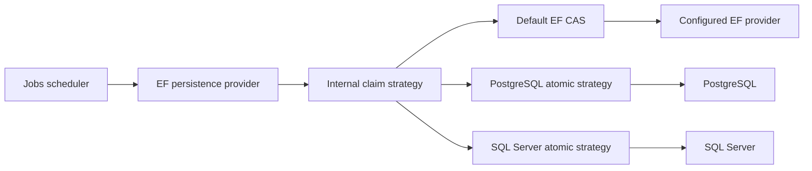
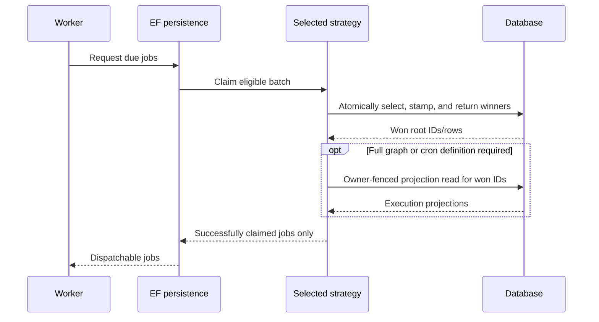

# feat(jobs): Add native atomic claim strategies

## Goal Capsule

Replace the contended select-then-CAS Jobs pickup path with provider-native atomic claim-and-return operations for PostgreSQL and SQL Server, while retaining the existing EF CAS behavior as the zero-configuration fallback. The scheduler and public persistence contract remain backend-agnostic; provider selection happens inside the Jobs Entity Framework configuration surface.

---

## Product Contract

### Problem Frame

The current EF provider discovers eligible time jobs and cron occurrences, materializes them, and then attempts optimistic updates. Concurrent workers can discover the same rows, after which all but one perform failed update work. PostgreSQL and SQL Server already expose queue-oriented locking primitives that can choose and claim disjoint rows in one database operation.

The optimization cannot weaken current Jobs correctness. A claim includes lease and owner fencing, `OnNodeDeath` policy gates, time-job descendant stamping, cron projections, and separate main-window and fallback-window behavior. These semantics are broader than the conceptual SQL in the original issues.

### Requirements

- R1. `IJobPersistenceProvider<TTimeJob, TCronJob>` remains behavioral and backend-agnostic; no capability flag or database selection enters the public scheduler contract.
- R2. `Headless.Jobs.EntityFramework` owns an internal strategy seam for candidate selection and claim-and-return behavior.
- R3. The existing EF optimistic-CAS algorithm remains the default for consumers that do not install a native strategy and for unsupported EF providers.
- R4. Provider selection composes through the existing Jobs EF builder; standalone `IServiceCollection.Add*ClaimPath` APIs are not introduced.
- R5. All strategies preserve `Idle`/`Queued` eligibility, same-owner reacquisition, unleased-row pickup, and expired-lease pickup only for `OnNodeDeath == Retry`.
- R6. Successful claims atomically stamp `OwnerId`, `LockedUntil`, `UpdatedAt`, and the expected queued state, and return only rows won by the current owner.
- R7. Time-job claims preserve root plus direct-child and grandchild owner/lease stamping while transitioning only the root to `Queued`.
- R8. Cron-occurrence claims preserve cron-definition projection, eligibility, ordering, and lease behavior.
- R9. Main-window and fallback-window timing semantics remain unchanged, including their distinct optimistic predicates.
- R10. PostgreSQL claims use an atomic update-and-return operation whose candidate query uses `FOR UPDATE SKIP LOCKED`.
- R11. SQL Server claims use an atomic update-and-output operation whose candidate query uses `UPDLOCK`, `READPAST`, and `ROWLOCK`.
- R12. Provider SQL derives mapped schema, table, and column identifiers from EF metadata and parameterizes runtime values.
- R13. Real-database concurrency tests prove disjoint claims, at-most-once ownership per lease, complete chain stamping, and rollback safety.
- R14. Package READMEs document setup, semantics, supported database versions, and operational considerations without prescribing SQL Server lock-escalation changes unconditionally.

### Acceptance Examples

- AE1. Two PostgreSQL workers released simultaneously against the same eligible time-job set receive disjoint root jobs; every returned root and its two supported descendant levels carry one consistent owner and lease.
- AE2. Two SQL Server workers released simultaneously against the same eligible cron-occurrence set receive disjoint occurrences without blocking on rows held by the other claim transaction.
- AE3. An expired `Retry` row can be claimed, while equivalent expired `MarkFailed` and `Skip` rows remain for recovery processing.
- AE4. A configured native strategy wins over the default CAS registration regardless of surrounding service-registration order; configuring both native providers fails deterministically at registration.
- AE5. Cancelling or rolling back a claim before commit leaves no partially stamped root/descendant graph and returns no executable job.
- AE6. A consumer that only calls the existing `UseEntityFramework` path continues using CAS without code or configuration changes.

### Scope Boundaries

#### In Scope

- Internal EF claim-strategy abstraction and default CAS implementation.
- PostgreSQL and SQL Server Jobs EF provider packages.
- Atomic time-job and cron-occurrence claiming for main and fallback paths.
- Shared conformance scenarios plus provider-specific Testcontainers coverage.
- Solution/package metadata and consumer/provider documentation.

#### Deferred to Follow-Up Work

- Decomposing unrelated responsibilities from the large Jobs persistence providers tracked by #467.
- Resolving application-clock versus database-clock claim stamping tracked by #469.

#### Out of Scope

- Benchmarks, benchmark projects, fixed throughput targets, or performance-ratio CI gates.
- Scheduler cadence, lease duration, renewal, retry, node-death, or membership behavior changes.
- In-memory provider refactoring; it remains its own non-EF persistence implementation.
- Automatically applying `LOCK_ESCALATION = DISABLE` or other database administration changes.
- Replacing the entire EF persistence provider in each database package.

---

## Planning Contract

### Key Technical Decisions

- KTD1. Hide backend selection behind an internal EF strategy rather than adding `SupportsSkipLocked`. The scheduler asks for behavior; the persistence layer owns how the database supplies it.
- KTD2. Keep CAS as a registered default and let exactly one native provider override it through the Jobs EF option builder. Duplicate native selections fail during registration rather than relying on last-registration-wins DI behavior.
- KTD3. Extract only claim operations. Coordinated writes, renewal, recovery, dashboards, CRUD, and all other persistence behavior stay in the shared EF provider.
- KTD4. Model direct time-job claims, fallback time-job discovery/claims, direct cron claims, and fallback cron claims explicitly enough to preserve their different predicates and projections. Do not collapse them into one lowest-common-denominator method.
- KTD5. Make winner selection and lease stamping atomic. Full execution-graph materialization may follow as an owner-fenced EF read when returning nested jobs or joined cron definitions cannot be expressed safely in the update result; the second read must never broaden the won set.
- KTD6. Derive relational identifiers from EF model metadata and delimit them through provider APIs. Custom schema/table/column mappings are part of the supported contract.
- KTD7. Extend `Headless.Jobs.EntityFramework.Tests.Harness` and drive tests through production DI wiring. Portable behavior belongs in the harness; SQL text, hints, and provider-only failure modes belong in leaf integration projects.
- KTD8. Use deterministic concurrency barriers and directly seeded contested rows. Correctness assertions, not elapsed-time ratios, are the acceptance gate.

### High-Level Technical Design

The diagrams are directional planning guidance, not implementation specifications.

### Existing Patterns to Follow

- `src/Headless.Jobs.EntityFramework/Infrastructure/BasePersistenceProvider.cs` for current direct/fallback predicates, chain stamping, and projections.
- `src/Headless.Jobs.EntityFramework/Infrastructure/HeadlessJobsQueryExtensions.cs` for eligibility and node-death policy rules.
- `src/Headless.Jobs.EntityFramework/EfCoreOptionBuilder.cs` and `src/Headless.Jobs.EntityFramework/DependencyInjection/SetupJobsEntityFramework.cs` for the current Jobs EF configuration surface.
- `src/Headless.Messaging.Storage.PostgreSql/PostgreSqlDataStorage.cs` for atomic PostgreSQL update/returning claims.
- `src/Headless.Messaging.Storage.SqlServer/SqlServerDataStorage.cs` for atomic SQL Server CTE/update/output claims.
- `docs/solutions/architecture-patterns/unified-provider-setup-builder-pattern.md` for provider-owned builder extensions and deterministic provider selection.
- `tests/Headless.Jobs.EntityFramework.Tests.Harness/JobsCoordinationFixtureBase.cs` for shared PostgreSQL/SQL Server production wiring and Testcontainers lifecycle.

### Dependencies and Sequencing

U1 establishes the internal seam and default behavior. U2 and U3 can then implement independent database providers. U4 extends shared behavior tests after the seam is available and is completed against both providers. U5 adds provider-specific concurrency and SQL-contract coverage. U6 integrates packages and documentation after their final public configuration surfaces settle.

---

## Implementation Units

### U1. Extract the internal claim strategy and preserve CAS fallback

- **Goal:** Move EF claim decisions behind an internal seam without changing observable behavior for existing consumers.
- **Requirements:** R1-R9
- **Dependencies:** None
- **Files:**
  - `src/Headless.Jobs.EntityFramework/Infrastructure/BasePersistenceProvider.cs`
  - `src/Headless.Jobs.EntityFramework/Infrastructure/JobsEFCorePersistenceProvider.cs`
  - `src/Headless.Jobs.EntityFramework/Infrastructure/HeadlessJobsQueryExtensions.cs`
  - `src/Headless.Jobs.EntityFramework/Infrastructure/MappingExtensions.cs`
  - `src/Headless.Jobs.EntityFramework/Customizer/CustomizerServiceDescriptor.cs`
  - `src/Headless.Jobs.EntityFramework/EfCoreOptionBuilder.cs`
  - `src/Headless.Jobs.EntityFramework/Headless.Jobs.EntityFramework.csproj`
  - `tests/Headless.Jobs.Composition.Tests.Unit/Infrastructure/JobsQueryPredicateTests.cs`
  - `tests/Headless.Jobs.Composition.Tests.Unit/JobsDistributedLockWiringTests.cs`
- **Approach:** Introduce an internal strategy contract and relocate the existing direct/fallback time-job and cron claim behavior into the default EF implementation. Resolve the selected strategy when constructing the EF persistence provider. Add a narrow internal provider-registration hook to the existing EF option builder and friend only the two provider assemblies that require it. Register CAS by default and enforce zero-or-one native override deterministically.
- **Test scenarios:**
  - Existing `UseEntityFramework` registration resolves the CAS strategy and produces the same eligibility/projection behavior as before.
  - PostgreSQL or SQL Server strategy selection replaces CAS regardless of whether surrounding Coordination and Jobs registrations occur before or after it.
  - Selecting both native strategies produces an actionable registration-time error.
  - Direct time-job claiming retains exact `UpdatedAt` fencing; fallback claiming retains its owner-agnostic fallback predicate.
  - Same-owner, unleased, expired-Retry, expired-MarkFailed, and expired-Skip rows match the current predicate matrix.
- **Verification:** Focused unit tests pass, public API review shows no capability flag or scheduler database branch, and existing EF consumers compile unchanged.

### U2. Add the PostgreSQL native claim provider

- **Goal:** Claim eligible PostgreSQL time jobs and cron occurrences with atomic skip-locked operations.
- **Requirements:** R4-R10, R12
- **Dependencies:** U1
- **Files:**
  - `src/Headless.Jobs.EntityFramework.PostgreSql/Headless.Jobs.EntityFramework.PostgreSql.csproj`
  - `src/Headless.Jobs.EntityFramework.PostgreSql/Setup.cs`
  - `src/Headless.Jobs.EntityFramework.PostgreSql/PostgreSqlJobsClaimStrategy.cs`
  - `src/Headless.Jobs.EntityFramework.PostgreSql/README.md`
  - `tests/Headless.Jobs.EntityFramework.PostgreSql.Tests.Integration/Headless.Jobs.EntityFramework.PostgreSql.Tests.Integration.csproj`
  - `tests/Headless.Jobs.EntityFramework.PostgreSql.Tests.Integration/PostgreSqlJobsCoordinationFixture.cs`
- **Approach:** Add a provider-owned Jobs EF builder extension that selects a PostgreSQL strategy. Implement atomic candidate selection and stamping with an update/returning statement and inner `FOR UPDATE SKIP LOCKED`. Resolve and delimit mapped identifiers from the EF model. Preserve chain stamping in the same transaction, returning won roots before an owner-fenced projection read when the execution graph requires it.
- **Test scenarios:**
  - Custom schema and renamed table mappings are used by generated SQL and claims succeed.
  - Eligible rows are ordered stably by priority, execution time, and ID.
  - A locked candidate is skipped and another eligible row is claimed without waiting for the first transaction.
  - Root, direct children, and grandchildren receive one owner/lease atomically while deeper descendants and unrelated jobs remain untouched.
  - Cron claims return the matching cron definition and never return an occurrence won by another owner.
  - Cancellation or rollback before commit returns no winner and leaves all rows unchanged.
- **Verification:** The provider package builds/packs and PostgreSQL leaf plus shared conformance suites pass against Testcontainers.

### U3. Add the SQL Server native claim provider

- **Goal:** Claim eligible SQL Server time jobs and cron occurrences with atomic read-past operations.
- **Requirements:** R4-R9, R11-R12
- **Dependencies:** U1
- **Files:**
  - `src/Headless.Jobs.EntityFramework.SqlServer/Headless.Jobs.EntityFramework.SqlServer.csproj`
  - `src/Headless.Jobs.EntityFramework.SqlServer/Setup.cs`
  - `src/Headless.Jobs.EntityFramework.SqlServer/SqlServerJobsClaimStrategy.cs`
  - `src/Headless.Jobs.EntityFramework.SqlServer/README.md`
  - `tests/Headless.Jobs.EntityFramework.SqlServer.Tests.Integration/Headless.Jobs.EntityFramework.SqlServer.Tests.Integration.csproj`
  - `tests/Headless.Jobs.EntityFramework.SqlServer.Tests.Integration/SqlServerJobsCoordinationFixture.cs`
- **Approach:** Add a provider-owned Jobs EF builder extension that selects a SQL Server strategy. Use a candidate CTE or equivalent update source with `UPDLOCK`, `READPAST`, and `ROWLOCK`, followed by one update/output operation. Resolve and delimit mapped identifiers from the EF model and keep chain stamping inside the claim transaction.
- **Test scenarios:**
  - Custom schema and renamed table mappings are used by generated SQL and claims succeed.
  - Eligible rows are ordered stably by priority, execution time, and ID.
  - A row-locked candidate is skipped and another eligible row is claimed without waiting for the first transaction.
  - Root, direct children, and grandchildren receive one owner/lease atomically while deeper descendants and unrelated jobs remain untouched.
  - Cron claims return the matching cron definition and never return an occurrence won by another owner.
  - Cancellation, a forced transaction rollback, or a deadlock victim outcome exposes no partial claim to the scheduler.
- **Verification:** The provider package builds/packs and SQL Server leaf plus shared conformance suites pass against Testcontainers.

### U4. Extend Jobs EF claim conformance coverage

- **Goal:** Prove all three strategies implement the same observable Jobs claim contract through production DI wiring.
- **Requirements:** R3, R5-R9, R13
- **Dependencies:** U1-U3
- **Files:**
  - `tests/Headless.Jobs.EntityFramework.Tests.Harness/JobsCoordinationFixtureBase.cs`
  - `tests/Headless.Jobs.EntityFramework.Tests.Harness/JobsClaimConformanceTests.cs`
  - `tests/Headless.Jobs.EntityFramework.PostgreSql.Tests.Integration/PostgreSqlConformanceTests.cs`
  - `tests/Headless.Jobs.EntityFramework.SqlServer.Tests.Integration/SqlServerConformanceTests.cs`
- **Approach:** Add strategy configuration to the existing fixture contract and introduce provider-neutral claim scenarios. Seed contested states directly, synchronize workers with barriers, and assert durable rows as well as returned projections. Keep test setup on the public production registration path rather than constructing strategies manually.
- **Test scenarios:**
  - Eligibility and policy matrix matches R5 for time jobs and cron occurrences.
  - Same-owner reacquisition works without admitting a different owner before lease expiry.
  - Main-window and fallback-window paths preserve their distinct timing and optimistic predicates.
  - Concurrent workers receive disjoint time-job roots and disjoint cron occurrences.
  - Every returned claim has exactly one durable owner/lease and every durable winner is returned once.
  - Chain stamping is complete across root, children, and grandchildren or is wholly rolled back.
  - CAS fallback passes the same portable scenarios without a native package installed.
- **Verification:** Shared scenarios run successfully from both provider leaf projects, and the existing Jobs coordination/enqueue conformance suites remain green.

### U5. Add provider-specific SQL and contention regression tests

- **Goal:** Lock the database-specific atomicity mechanisms that shared behavioral tests cannot observe.
- **Requirements:** R10-R13
- **Dependencies:** U2-U4
- **Files:**
  - `tests/Headless.Jobs.EntityFramework.PostgreSql.Tests.Integration/PostgreSqlClaimStrategyTests.cs`
  - `tests/Headless.Jobs.EntityFramework.SqlServer.Tests.Integration/SqlServerClaimStrategyTests.cs`
- **Approach:** Capture or inspect executed commands where useful, but prioritize database-observable contention behavior. Hold candidate locks deliberately, release workers together, and verify that each provider skips locked work rather than reverting to select-then-update behavior. Exercise failures inside the claim transaction to prove rollback boundaries.
- **Test scenarios:**
  - PostgreSQL command shape includes `FOR UPDATE SKIP LOCKED` within the atomic update/returning operation.
  - SQL Server command shape applies `UPDLOCK`, `READPAST`, and `ROWLOCK` to candidate selection and returns winners from the same update.
  - Under 100 synchronized workers, no eligible row is returned to two owners within one lease and no eligible row disappears without a durable claim.
  - Workers continue claiming other rows while one transaction holds a candidate lock.
  - Parameter values containing edge-case owner IDs never alter SQL structure.
  - Custom schema/table identifiers are delimited and cannot be confused with runtime parameters.
- **Verification:** Both provider-specific integration suites pass repeatedly against fresh Testcontainers databases without timing-ratio assertions.

### U6. Wire packages, docs, and release metadata

- **Goal:** Make both provider packages discoverable, packable, and accurately documented.
- **Requirements:** R4, R14
- **Dependencies:** U2-U5
- **Files:**
  - `headless-framework.slnx`
  - `src/Headless.Jobs.EntityFramework/README.md`
  - `src/Headless.Jobs.EntityFramework.PostgreSql/README.md`
  - `src/Headless.Jobs.EntityFramework.SqlServer/README.md`
  - `docs/llms/jobs.md`
  - `README.md`
- **Approach:** Add source and test projects under the existing Jobs solution grouping, update package catalogs and Jobs documentation, and show provider selection inside the existing EF builder. Document SQL Server page-lock/lock-escalation behavior as an operator decision requiring measurement; do not ship or recommend unconditional DDL changes.
- **Test scenarios:** Test expectation: none -- this unit is package/documentation integration; behavior is covered by U1-U5.
- **Verification:** Solution discovery includes all new projects, packages build and pack with expected dependencies, and all documented setup examples match the implemented public surface.

---

## Verification Contract

### Focused Gates

- Build and analyzer-check `Headless.Jobs.EntityFramework` after U1.
- Build and analyzer-check each new provider package after U2/U3.
- Run `Headless.Jobs.Composition.Tests.Unit` for registration and predicate regressions.
- Run both Jobs EF PostgreSQL and SQL Server integration projects with Docker available.
- Run the shared Jobs EF harness through both leaf projects; the harness is not executed as a standalone test assembly.
- Verify formatting and diff whitespace before the wider solution gate.

### Final Gates

- Relevant Jobs unit and integration suites pass.
- Both provider packages pack successfully with locked restores.
- Solution Release build and quality analyzers pass.
- Public API review confirms no backend capability flag, standalone claim-path service extension, or accidental public strategy type.
- Documentation and package catalog changes match the final setup surface.

---

## Risks & Dependencies

| Risk | Mitigation |
| --- | --- |
| Native SQL claims the root but partially stamps descendants. | Keep the graph update in one transaction and add forced-rollback assertions over every supported depth. |
| A second projection read returns rows not won by this transaction. | Fence projection by won IDs plus current owner/lease and test concurrent owner changes. |
| Direct and fallback paths are over-generalized. | Preserve separate strategy operations or request shapes and port the existing predicate matrix before optimizing. |
| Provider packages depend on internal EF types. | Use narrow friend-assembly access only for the strategy registration/contract; keep provider types internal and public surface limited to setup extensions. |
| Raw SQL breaks custom mappings. | Resolve identifiers from EF metadata and test renamed schema/table mappings in both databases. |
| SQL Server page locks defeat `READPAST`. | Document the limitation, keep claims bounded, recommend measurement and indexing, and avoid automatic lock-escalation DDL. |
| Contention tests become flaky. | Use explicit barriers, lock-holding transactions, bounded timeouts, durable-state assertions, and no throughput thresholds. |

---

## Definition of Done

- #308, #309, and #310 acceptance criteria are satisfied without benchmark work.
- Existing consumers retain CAS behavior without configuration changes.
- PostgreSQL and SQL Server consumers can select native atomic claiming through the Jobs EF builder.
- Shared and provider-specific tests prove eligibility, disjoint concurrent claims, chain atomicity, cron behavior, rollback safety, and custom mapping support.
- Both packages build, pack, appear in the solution/package catalog, and have accurate READMEs.
- No scheduler database branch, public capability flag, fixed performance ratio, or automatic lock-escalation migration is introduced.

---

## Sources & Research

- GitHub issues [#308](https://github.com/xshaheen/headless-framework/issues/308), [#309](https://github.com/xshaheen/headless-framework/issues/309), and [#310](https://github.com/xshaheen/headless-framework/issues/310), updated on 2026-07-11.
- `docs/solutions/architecture-patterns/unified-provider-setup-builder-pattern.md`.
- `src/Headless.Jobs.EntityFramework/Infrastructure/BasePersistenceProvider.cs`.
- `src/Headless.Jobs.EntityFramework/Infrastructure/HeadlessJobsQueryExtensions.cs`.
- `src/Headless.Messaging.Storage.PostgreSql/PostgreSqlDataStorage.cs`.
- `src/Headless.Messaging.Storage.SqlServer/SqlServerDataStorage.cs`.
- PostgreSQL `SELECT` locking documentation: <https://www.postgresql.org/docs/current/sql-select.html>.
- SQL Server table hints documentation: <https://learn.microsoft.com/en-us/sql/t-sql/queries/hints-transact-sql-table>.

