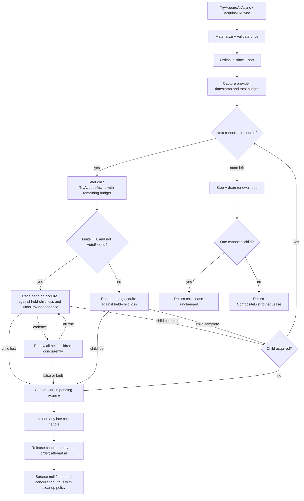

# Composite Distributed Lock Acquire - Plan

## Goal Capsule

- **Objective:** Add provider-agnostic `TryAcquireAllAsync` / `AcquireAllAsync` extensions over one `IDistributedLock` that acquire a canonical ordinal-sorted, duplicate-free resource set under one timeout budget; keep earlier finite leases alive while a later resource is blocked; and return one `IDistributedLease` whose loss, renewal, release, disposal, and metadata represent the full set.
- **Authority:** GitHub issue [#292](https://github.com/xshaheen/headless-framework/issues/292) defines the requested surface and scope. Root `CLAUDE.md` and `docs/authoring/AUTHORING.md` govern implementation and documentation. This plan resolves underspecified lifecycle, timeout, metadata, and failure behavior in the Key Technical Decisions below.
- **Priority decision:** The issue remains labelled `priority:parked` and has no current consumer, but the user explicitly authorized implementation on 2026-07-13 after reviewing the local Madelson checkout. This execution is a direct user decision, not an inferred reprioritization from the issue label.
- **Stop conditions:** Surface to the user instead of guessing if (a) `IDistributedLock.TimeProvider` cannot be added as a required provider contract, (b) a built-in provider cannot preserve the single overall timeout or explicit rollback contract, (c) composite lease loss cannot be made race-safe without changing `IDistributedLease`, or (d) Redis cannot run the portable composite conformance cases through the real provider.
- **Execution profile:** One PR, five dependency-ordered atomic commits. Each unit should compile and keep its narrow test project green before the next unit; integration providers remain optional locally only when their containers are unavailable, but CI must run all four provider projects.

---

## Product Contract

### Summary

A caller supplies one lock provider and several resource names. Headless validates and canonicalizes the complete input before touching storage, then acquires each distinct resource sequentially in ordinal order. Success returns the real child lease unchanged when canonicalization leaves one resource, or one composite lease when two or more resources remain; any timeout, cancellation, lost prerequisite lease, or later-acquire failure stops the in-flight work, drains it, and releases every acquired child in reverse order before the operation completes. The operation is all-or-nothing at the API boundary, but it is not a distributed transaction: rollback is compensating cleanup, and exceptions reported by child cleanup APIs are surfaced rather than hidden. Built-in provider release paths retain their existing bounded/logged-timeout and eventual-TTL semantics.

### Problem Frame

The current regular-lock API acquires one resource at a time. Consumers that need several locks must choose their own ordering, multiply the acquire timeout across resources, keep early leases alive during slow later acquires, and implement rollback and aggregate lifecycle semantics themselves. Inconsistent ordering can deadlock two callers that request the same set in opposite orders; a finite early lease can expire while a later resource is still blocked; and naïve cleanup can leak an acquired lock or hide its release failure.

Issue #292 retains this as a parity feature with `madelson/DistributedLock` and Foundatio, but its Foundatio reference renews only after a later acquire completes. Headless's acceptance criterion is stronger: already-held children must be renewed while a later acquisition is still in flight.

### Requirements

**Public acquisition contract**

- R1. Add public trailing-token extension methods on `IDistributedLock`: `TryAcquireAllAsync(IEnumerable<string>, DistributedLockAcquireOptions?, CancellationToken)` returns a nullable `IDistributedLease`, and `AcquireAllAsync(...)` throws `LockAcquisitionTimeoutException` when the set cannot be formed.
- R2. Enumerate the input exactly once and validate all values before any acquire: the sequence and each resource are non-null, the sequence is non-empty, and every resource is non-empty/non-whitespace. Deduplicate and sort with `StringComparer.Ordinal`; this same canonical sequence drives acquisition and `Resource = string.Join("+", resources)`.
- R3. Use one composite acquire budget. A finite positive `AcquireTimeout` is enforced by a provider-clock deadline linked into child waits and renewal work as well as decremented before each child; `Timeout.InfiniteTimeSpan` remains unbounded; explicit zero preserves the existing "try once, no wait" behavior by giving every canonical child one immediate provider attempt rather than pre-cancelling the first attempt.
- R4. Caller cancellation takes precedence when the caller token is observed. The coordinator must cancel and drain any pending child acquisition, release a handle that wins the cancellation race, complete rollback, and only then surface cancellation. Timeout-only failure returns null from `TryAcquireAllAsync`; the throwing overload reports the canonical composite resource.

**Acquisition safety and renewal**

- R5. Acquisitions are sequential and all-or-nothing. A later null result, timeout, cancellation, exception, or prerequisite renewal failure triggers explicit reverse-order rollback of every child obtained so far, independent of `ReleaseOnDispose`.
- R6. While a later acquire is incomplete, observe every held child whose `CanObserveLoss` is true and periodically renew every already-held child when the effective TTL is finite and `Monitoring != AutoExtend`. `Monitoring=None` has no asynchronous loss signal, so renewal false/fault is its formation-time loss detection. The cadence is half the effective TTL, capped at one minute, scheduled through the provider's `TimeProvider`. Infinite leases and auto-extended children do not need this extra renewal, but their observable loss still aborts formation.
- R7. A renewal sweep runs child renewals concurrently to minimize expiry skew and succeeds only if every child returns true. A false result or observed child loss means the set can no longer be guaranteed: after rollback, both public overloads throw `LockHandleLostException` identifying the first lost child rather than translating loss into contention/timeout. Unexpected renewal faults are likewise preserved after rollback. The renewal/loss loop is cancelled and drained on every success and failure path.
- R8. Cleanup explicitly releases and then disposes every acquired child so monitors cannot outlive a failed composite, even when one release/dispose reports failure. Reverse-order rollback and release remain sequential. Preserve one exception exposed by child cleanup APIs and use `AggregateException` for multiple exposed failures or for a primary failure plus cleanup failures, with the primary first; never hide a reported cleanup exception behind null or ordinary cancellation. This does not strengthen built-in child release confirmation beyond their existing logged-timeout/eventual-cleanup contract.
  - **Amended 2026-07-13 (code review, run `20260713-194137-de151868`).** The two-pass "release every child, then dispose every child, in reverse order" requirement stands and is load-bearing. What changed is the exception *type*: pure cleanup failures now raise `LockCleanupFailedException`, which derives from `DistributedLockException`. `AggregateException` did not, and neither did a bare rethrown storage exception — so a caller writing `catch (DistributedLockException)`, the catch-all the package's own exception hierarchy documents, silently missed every cleanup failure. The original exceptions are preserved on `Failures` and `InnerException`. A primary failure plus cleanup failures still aggregates with the primary first, since that is not purely a cleanup failure. Renewal faults keep their existing shape.

**Composite lease contract**

- R9. When canonicalization leaves one resource, return the acquired child lease unchanged so its provider-issued `LeaseId`, `FencingToken`, metadata, and concrete behavior remain intact. For two or more resources, the returned internal composite implements `IDistributedLease` with a new opaque composite `LeaseId`, canonical joined `Resource`, `FencingToken = null`, `DateAcquired` captured from the provider clock when the full canonical set becomes held, `TimeWaitedForLock` equal to the full coordinator elapsed time, and `RenewalCount` equal to the minimum child count (the number of renewals the complete set has survived).
- R10. `LostToken` links every observable child and fires if any one fires. Because all children come from one provider and one options object, `CanObserveLoss` must be uniform across the set; mixed child observability is a provider-contract violation and fails construction with rollback rather than returning a misleading composite.
- R11. Composite `RenewAsync` fans out concurrently and returns true only when all children renew; composite `ReleaseAsync` releases sequentially in reverse acquisition order; `DisposeAsync` is idempotent and disposes children in reverse order. Renew, release, and dispose are serialized so a renewal cannot race teardown.
  - **Amended 2026-07-13 (code review, run `20260713-194137-de151868`).** `RenewAsync` no longer returns `false` when a child is lost — it throws `LockHandleLostException` naming that child. Renewals fan out concurrently, so by the time one child reports loss its siblings have already been extended by a full lease duration and are still held. `IDistributedLease` documents `false` as "already lost — nothing to release", so a caller trusting that contract (especially under `ReleaseOnDispose = false`, whose whole point is explicit release) would abandon the handle and orphan every survivor until its TTL expired. The coordinator already treated the identical condition as fatal during formation; the handle now agrees. `false` is still returned when the composite was already released.
  - **Amended 2026-07-13 (same review).** `DisposeAsync` never throws. It logs cleanup failures through `IDistributedLock.Logger` instead. `await using` lowers to try/finally and an exception from a finally block *replaces* the one already in flight, so a throwing disposal silently destroyed the caller's real exception whenever a release happened to fail — and both doc surfaces show `await using AcquireAllAsync(...)` as the flagship example. Explicit `ReleaseAsync()` still throws `LockCleanupFailedException`, so the cleanup outcome remains observable on the path where the caller asks for it. This restores the non-throwing-dispose invariant every other `IDistributedLease` upholds (`DistributedLockHandleBase.DisposeAsync` logs and swallows for exactly this reason).
- R12. `ReleaseOnDispose = false` is passed unchanged to every child. A successful composite disposal then tears down child monitoring without releasing storage ownership; explicit composite release remains available. Failed acquisition rollback still explicitly releases all children.
- R13. Existing `provider.RenewAsync(IDistributedLease, ...)` and `provider.ReleaseAsync(IDistributedLease, CancellationToken)` extensions recognize the composite marker and fan out through that supplied provider instead of sending the synthetic `(Resource, LeaseId)` to one provider key. These raw provider conveniences retain the caller's cancellation token and remain distinct from direct handle lifecycle methods (they do not mutate composite/child lifecycle state or renewal counters); ordinary lease behavior stays unchanged.

**Quality and documentation**

- R14. Deterministic unit tests use `FakeTimeProvider` and controllable provider/lease doubles for canonicalization, overall budgeting, in-flight renewal, cancellation races, rollback ordering, lifecycle serialization, linked loss, metadata, and multi-failure aggregation; no wall-clock sleeps prove the coordinator.
- R15. The portable lock harness proves canonical order, duplicate removal, contention rollback, opposite caller order, explicit renew/release, and disposal behavior across InMemory, Redis, PostgreSQL, and SQL Server providers. Backend-specific lease-loss tests run only where the provider can observe loss.
- R16. Update `docs/llms/distributed-locks.md` and `src/Headless.DistributedLocks.Abstractions/README.md` in lockstep with the public API and its trade-offs, including compensating (not transactional) rollback, scalar fencing limitations, overall timeout semantics, ordering, renewal behavior, and provider clock requirements.

### Acceptance Examples

- AE1. **Canonical identity.** Given `['B', 'A', 'B']`, acquisition calls occur for `A` then `B` exactly once each, and the composite `Resource` is `A+B`.
- AE2. **Opposite callers avoid circular wait.** Given callers requesting `['A', 'B']` and `['B', 'A']`, both use `A` then `B`; after the first releases, the second succeeds.
- AE3. **Atomic API outcome.** Given `A` succeeds and `B` returns null, `A.ReleaseAsync()` and child disposal complete before `TryAcquireAllAsync` returns null. If either child API reports failure, the operation throws that cleanup failure instead of returning null; built-in logged release timeouts retain their existing eventual-cleanup behavior.
- AE4. **Renew while blocked.** Given finite TTL children, no auto-extension, and a blocked `B` acquisition, advancing the fake clock by the cadence renews `A` before `B` completes.
- AE5. **Renewal loss race.** Given `A` renewal returns false while `B` is in flight and `B` concurrently succeeds, the coordinator cancels/drains `B`, releases both `B` and `A` in reverse order, then throws `LockHandleLostException` for `A`; no composite escapes.
- AE6. **One timeout budget.** Given two sequential waits and a 10-second composite timeout, the second child receives only the remaining budget; the overall operation does not wait 20 seconds. Given zero, both uncontended children receive one immediate attempt.
- AE7. **Composite loss.** Given monitored children and `B.LostToken` firing, the composite token fires even while `A` remains held.
- AE8. **Dispose without release.** Given `ReleaseOnDispose = false`, disposing a successful composite disposes its child handles but leaves both resources held until explicit composite release.
- AE9. **Synthetic identity never reaches storage.** Given `provider.ReleaseAsync(composite, ct)` or `provider.RenewAsync(composite, ttl, ct)`, the call fans out through the supplied provider over each canonical child resource/lease-ID pair; the provider never receives resource `A+B` with the composite lease ID.
- AE10. **Fast path and metadata.** Given one canonical resource—including input deduplicated to one—the result is the exact child lease and preserves its real lease ID and fencing token. Given two or more children with different acquisition timestamps, wait durations, renewal counts, and fencing tokens, the composite reports provider-clock completion time for the full set, total composite elapsed time, minimum renewal count, and no scalar fencing token.

### Scope Boundaries

**Deferred to follow-up work**

- A public `ICompositeDistributedLease` exposing child resources, lease IDs, or a vector of fencing tokens. Add it only when a consumer needs per-resource fencing or inspection.
- Composite-specific metrics/activity. Existing child provider acquisition, renewal, and release diagnostics remain authoritative; add a parent activity later if an observability consumer needs set-level correlation.
- Bounded rollback/release policy beyond the existing child/provider release behavior.

**Outside this plan**

- Cross-provider composites, distributed consensus/RedLock semantics, or a transaction spanning lock backends.
- Reader/writer or semaphore composites.
- Parallel child acquisition. Canonical sequential acquisition is the deadlock-avoidance contract.
- Encoding/escaping `+` in the composite `Resource`; the joined value is a diagnostic identity, not a reversible storage key.

---

## Planning Contract

### Key Technical Decisions

- KTD1. **Expose the provider clock as a required `IDistributedLock.TimeProvider` contract.** The coordinator owns elapsed-time budgeting and cadence scheduling but receives only the interface. A required property keeps all built-in and custom providers deterministic and avoids a silent `TimeProvider.System` compatibility fallback that would mix clocks. Update all three production implementers and the two repo test doubles; this project explicitly prefers clean breaking APIs over compatibility layers.
  - **Clarified 2026-07-13 (code review, run `20260713-194137-de151868`).** The provider clock *schedules the check-in; it never arbitrates expiry.* It decides when to ask whether a lease still holds; only the backend's own answer decides whether it does. That is what keeps composite renewal on the Jobs *claim-path* shape (local scheduling, backend-confirmed truth) rather than the *reclaim-path* shape whose local-clock authority caused the clock-skew bug in #316. Stated on `IDistributedLock.TimeProvider`'s XML doc, because the distinction is subtle and load-bearing.
- KTD11. **Expose the provider logger as a required `IDistributedLock.Logger` contract** (added 2026-07-13 by the same review). Follows KTD1's precedent for the same reason: a provider-agnostic coordinator cannot report a failure it has no sink for. It exists specifically so composite `DisposeAsync` can be non-throwing — disposal has to report a failed release *somewhere*, and swallowing it silently would be worse than the exception-masking it fixes. `NullDistributedLock` takes an optional logger and defaults to `NullLogger`; the three production providers forward the logger they already receive. `Headless.DistributedLocks.Abstractions` therefore depends on `Microsoft.Extensions.Logging.Abstractions`.
- KTD2. **Canonicalize with ordinal equality and ordering before storage.** Materialize once, reject empty/invalid input, then `Distinct(StringComparer.Ordinal)` and `OrderBy(StringComparer.Ordinal)`. Culture-sensitive order can differ across processes and reintroduce circular wait. The canonical array is also the source of the required joined `Resource` identity.
- KTD3. **Treat `AcquireTimeout` as one monotonic budget, with zero as a semantic special case.** Resolve the total once from `options.AcquireTimeout ?? provider.DefaultAcquireTimeout`, capture one provider timestamp, and for finite positive values create a deadline source through `provider.TimeProvider`, linked with caller cancellation for child acquires and renewal sweeps. Also derive remaining budget before each child and pass it through a cloned options record. Infinite has no deadline source; zero supplies zero to every child so each gets the regular provider's bounded try-once path. Classify the original caller token versus deadline token only after cancelling/draining work. Cleanup may intentionally complete after the nominal budget rather than abandon work.
- KTD4. **Drive in-flight retention with a `WhenAny` loop around the pending child acquire.** Always race the pending acquire against observable held-child loss; for finite, non-auto-extended leases, also race a `TimeProvider` cadence delay and renew held children concurrently after each tick. Do not use a timeout wrapper that abandons the underlying acquire: every pending task is cancelled, awaited, and its late handle captured for rollback.
- KTD5. **Renew unless the child already auto-extends or never expires.** `Monitoring=None` and `Monitoring=Monitor` both need explicit renewal during composite formation; `Monitor` observes loss but does not extend TTL. `AutoExtend` already has a per-child monitor, while connection-scoped/infinite leases need no TTL renewal.
- KTD6. **Rollback is compensation, not transactional atomicity.** Reverse sequential release reduces nesting and follows Madelson's established composite behavior, but storage/network failure can still leave a child held until expiry or connection teardown. Exceptions exposed by child cleanup APIs therefore outrank a clean null/cancellation outcome; built-in logged release timeouts remain governed by existing eventual-cleanup behavior.
- KTD7. **Use a private composite marker for raw-provider extension dispatch.** The public contract remains `IDistributedLease`. An internal marker exposes the canonical child set (or equivalent raw fan-out operations) so the existing provider convenience extensions can preserve their supplied-provider and cancellation semantics without decomposing synthetic metadata. Direct composite handle lifecycle remains separately serialized, matching the distinction already present for ordinary leases.
- KTD8. **Use Madelson's raw-child fast path; synthesize identity only for true composites.** When the canonical set contains one resource, return the child lease unchanged, preserving its provider-issued lease ID, fencing token, metadata, and any provider-specific behavior. For two or more children, generate a new opaque `LeaseId`; never concatenate child IDs. The composite `FencingToken` is null because child fencing tokens form a vector and no min/max reduction safely fences multiple protected resources. `RenewalCount = Min(children)` represents completed set-wide lifetime extensions, including child auto-extension.
- KTD9. **Make composite teardown retryable and exhaustive.** One async lifecycle gate serializes direct handle renew/release/dispose. Reverse release/dispose continues through every child, preserves the original exception type and stack for one reported failure, aggregates two or more, and leaves children that reported release failure eligible for a later explicit attempt. Direct renew after confirmed release returns false; after `ReleaseOnDispose=false` disposal it remains callable until explicit release, matching current child-handle behavior.
  - **Amended 2026-07-13 (code review, run `20260713-194137-de151868`).** "Preserves the original exception type and stack for one reported failure" is superseded: a bare storage exception does not derive from `DistributedLockException`, so it escaped the package's own documented catch-all just as `AggregateException` did. Cleanup now raises `LockCleanupFailedException` uniformly, carrying the originals on `Failures` and `InnerException` — type and stack are preserved, but reachable through a type callers can actually catch. Exhaustive continue-through-every-child, retryability, and the lifecycle gate are unchanged. Disposal is now non-throwing (see R11's amendment); "retryable" therefore means a failed release stays retryable via explicit `ReleaseAsync()`, which still throws.
- KTD10. **Extend the existing portable harness rather than copy backend tests.** Add composite scenarios as virtual methods on `DistributedLockTestsBase`, expose them as facts in the three existing mutex conformance classes, and add a Redis mutex conformance class over `RedisTestFixture.LockStorage`. Deterministic timing and fault races stay in the unit suite.

### High-Level Technical Design

Acquisition and compensation flow:

Composite lifecycle serialization:

```mermaid
stateDiagram-v2
  [*] --> Held
  Held --> Renewing: RenewAsync
  Renewing --> Held: every child renewed
  Renewing --> Lost: any child returned false
  Held --> Lost: any child LostToken fires
  Held --> Releasing: direct ReleaseAsync
  Lost --> Releasing: explicit release
  Releasing --> Released: all child releases complete
  Releasing --> Held: one or more releases fault; retry remains possible
  Held --> Disposing: DisposeAsync
  Lost --> Disposing: DisposeAsync
  Released --> Disposing: DisposeAsync
  Disposing --> Disposed: reverse child disposal complete
  Disposed --> Releasing: explicit release after no-release disposal
  Disposed --> [*]
```

The lifecycle gate permits only one transition body at a time. `DisposeAsync` is idempotent. With `ReleaseOnDispose=true`, dispose performs reverse release before final child disposal; with false, it only disposes children so their monitors stop while storage ownership remains and later explicit release stays valid, matching current child-handle behavior.

### Assumptions

- All resources in one call use the same `IDistributedLock` instance, options record, TTL, monitoring mode, and release-on-dispose policy.
- Built-in provider handles honor cancellation on acquisition and make `ReleaseAsync` idempotent; the coordinator still drains and compensates for a late success.
- `LockAcquisitionTimeoutException` can carry the canonical joined resource without a new exception type.
- Underlying provider activities/metrics are sufficient for the first release; no set-level telemetry contract is required by issue #292.

### Sources & Research

- Primary requirement: GitHub issue [#292](https://github.com/xshaheen/headless-framework/issues/292), verified live on 2026-07-13; dependency #289 is complete, but priority remains parked.
- Current public seams: `src/Headless.DistributedLocks.Abstractions/RegularLocks/{IDistributedLock.cs,IDistributedLease.cs,DistributedLockAcquireOptions.cs,DistributedLockExtensions.cs}`.
- Current provider/lifecycle patterns: `src/Headless.DistributedLocks.Core/RegularLocks/{DistributedLock.cs,DistributedLockHandleBase.cs,DisposableDistributedLock.cs,LeaseMonitor.cs}` and `src/Headless.DistributedLocks.Core.Database/{ConnectionScopedDistributedLock.cs,ConnectionScopedLockHandle.cs}`.
- Current conformance pattern: `tests/Headless.DistributedLocks.Tests.Harness/DistributedLockTestsBase.cs` plus the InMemory, PostgreSQL, and SQL Server conformance classes; Redis fixture/provider construction is available in `tests/Headless.DistributedLocks.Redis.Tests.Integration/{RedisTestFixture.cs,RedisReadWriteLockTests.cs}`.
- Institutional learnings: `docs/solutions/tooling-decisions/redlock-multi-instance-not-adopted-2026-05-19.md` (this is one-provider multi-resource coordination, not quorum locking), `docs/solutions/architecture-patterns/caching-fail-safe-coordinator-design.md` (orchestration belongs above providers), `docs/solutions/architecture-patterns/redis-zset-semaphore-prune-count-separation.md`, and `docs/solutions/architecture-patterns/circuit-breaker-transport-thread-safety-patterns.md` (cleanup/lifecycle ownership and task draining).
- External reference: Madelson [`CompositeDistributedSynchronizationHandle`](https://github.com/madelson/DistributedLock/blob/07b06677a8cd4203f8601e7a869119f11655b9ac/src/DistributedLock.Core/CompositeDistributedSynchronizationHandle.cs) for the raw one-child fast path, one-budget ordered acquire, and reverse exhaustive teardown. The user's local checkout was compared with current upstream; the composite implementation is unchanged between its local `3da3eaf4` and upstream `07b06677` revisions.
- External comparison: Foundatio [`ILockProvider.AcquireAsync(IEnumerable<string>)`](https://github.com/FoundatioFx/Foundatio/blob/7d1ce62b8de18b0478acd1ab1b8cead38a10790f/src/Foundatio/Lock/ILockProvider.cs#L277-L319) and [`DisposableLockCollection`](https://github.com/FoundatioFx/Foundatio/blob/7d1ce62b8de18b0478acd1ab1b8cead38a10790f/src/Foundatio/Lock/DisposableLockCollection.cs); its renewal occurs after the awaited child acquire, so KTD4 intentionally differs.
- .NET timing guidance: [`TimeProvider.GetTimestamp`](https://learn.microsoft.com/en-us/dotnet/api/system.timeprovider.gettimestamp?view=net-10.0), [`GetElapsedTime`](https://learn.microsoft.com/en-us/dotnet/api/system.timeprovider.getelapsedtime?view=net-10.0), [`Task.Delay(TimeSpan, TimeProvider, CancellationToken)`](https://learn.microsoft.com/en-us/dotnet/api/system.threading.tasks.task.delay?view=net-10.0), and [`FakeTimeProvider`](https://learn.microsoft.com/en-us/dotnet/core/extensions/timeprovider-testing).

---

## Implementation Units

### U1. Provider time authority contract

- **Goal:** Give provider-agnostic coordinators the same clock used by the underlying provider.
- **Requirements:** R3, R4, R6, R14
- **Dependencies:** none
- **Files:** `src/Headless.DistributedLocks.Abstractions/RegularLocks/IDistributedLock.cs`; `src/Headless.DistributedLocks.Abstractions/RegularLocks/NullDistributedLock.cs`; `src/Headless.DistributedLocks.Core/RegularLocks/DistributedLock.cs`; `src/Headless.DistributedLocks.Core.Database/ConnectionScopedDistributedLock.cs`; repo-local `IDistributedLock` test doubles in `tests/Headless.Api.Idempotency.Tests.Integration/IdempotencyTestApp.cs` and `tests/Headless.Messaging.Core.Tests.Unit/RetryProcessorDistributedLockTests.cs`; focused provider tests under `tests/Headless.DistributedLocks.Composition.Tests.Unit/`.
- **Approach:** Add a required, documented `TimeProvider` property to `IDistributedLock`. Every production provider returns its already-injected instance; test doubles return their injected/fake clock rather than system time. Do not add a system-clock default interface implementation.
- **Patterns to follow:** Constructor-injected clock use in `DistributedLock`, `ConnectionScopedDistributedLock`, and `NullDistributedLock`; monotonic elapsed-time calculations in the two real provider acquire loops.
- **Test scenarios:** Built-in providers expose the exact injected clock; a custom fake provider can drive acquire budgeting entirely with `FakeTimeProvider`; compile failures identify every remaining in-repo implementer that must opt into the contract.
- **Verification:** Abstractions, Core, Core.Database, distributed-lock unit tests, and affected idempotency/messaging test projects compile; provider clock identity tests pass.

### U2. Composite lease lifecycle and extension dispatch

- **Goal:** Implement a race-safe `IDistributedLease` aggregate before wiring acquisition.
- **Requirements:** R8-R13, R14
- **Dependencies:** U1
- **Files:** `src/Headless.DistributedLocks.Abstractions/RegularLocks/CompositeDistributedLease.cs` (new, internal composite + marker); `src/Headless.DistributedLocks.Abstractions/RegularLocks/DistributedLockExtensions.cs`; `tests/Headless.DistributedLocks.Composition.Tests.Unit/RegularLocks/CompositeDistributedLeaseTests.cs` (new).
- **Approach:** Implement the aggregate used only for two or more canonical children: snapshot their metadata, create the synthetic ID and linked loss token, enforce uniform observability, serialize direct renew/release/dispose through one async gate, renew children concurrently but inspect every result/fault, and release/dispose in reverse sequence while continuing after errors. The internal marker exposes children/equivalent raw fan-out for supplied-provider extension dispatch without mutating handle lifecycle. Track idempotent disposal separately from release success so a failed explicit release—or release after a no-release disposal—can be retried.
- **Patterns to follow:** `DistributedLockHandleBase` for idempotent, serialized lifecycle and retry-after-release-failure; PostgreSQL connection teardown for preserving one exception and aggregating multiple; Madelson composite for linked loss and reverse exhaustive teardown.
- **Test scenarios:** Metadata projection; new opaque ID and null fencing; linked loss from each child; uniform-observability rejection; all-true/one-false/multi-fault renewal; minimum renewal count; reverse release/dispose; continue-after-failure aggregation; release retry; renew-vs-release serialization; repeated/concurrent dispose; renew after confirmed release and after no-release disposal; `ReleaseOnDispose=false`; provider extension dispatch with cancellation and proof the synthetic resource/ID never reach raw provider methods.
- **Verification:** Focused composite lease tests pass with controllable child doubles; existing `DistributedLockExtensionsTests` remain green.

### U3. Canonical composite acquisition coordinator

- **Goal:** Add the public extensions and guarantee one-budget acquisition, in-flight renewal, and compensating rollback.
- **Requirements:** R1-R8, R14, AE1-AE6
- **Dependencies:** U1, U2
- **Files:** `src/Headless.DistributedLocks.Abstractions/RegularLocks/DistributedLockExtensions.cs`; `src/Headless.DistributedLocks.Abstractions/RegularLocks/CompositeDistributedLockAcquireCoordinator.cs` (new, internal); `tests/Headless.DistributedLocks.Composition.Tests.Unit/DistributedLockExtensionsTests.cs`; `tests/Headless.DistributedLocks.Composition.Tests.Unit/RegularLocks/CompositeDistributedLockAcquireTests.cs` (new).
- **Approach:** Both public overloads share one core that materializes and canonicalizes once. Capture one monotonic timestamp; for finite positive budgets create a provider-clock deadline linked with caller cancellation and pass it to child acquisition and renewal; also clone child options with remaining positive timeout while preserving TTL, monitoring, and release-on-dispose. For each later child, race its pending acquire against held-child loss and, when required, a provider-clock renewal cadence. On every unsuccessful path, cancel/drain the pending task, add any late handle, stop/drain retention work, then reverse-release and dispose the complete acquired list before classifying the original caller/deadline/result. Keep zero and infinite timeouts as explicit branches.
- **Patterns to follow:** Current regular-lock acquire loop for cancellation precedence, zero-timeout semantics, `TimeProvider` deadlines, and orphan cleanup; `LeaseMonitor` for cancel-then-drain ownership; KTD4 for the stronger-than-Foundatio in-flight renewal loop.
- **Test scenarios:** Null sequence, empty sequence, null/whitespace element, single enumeration, ordinal order, duplicates, canonical joined identity, one-resource and deduplicated-to-one raw-child fast paths preserving object identity/lease ID/fencing token; multi-resource success; later null rollback; later exception rollback; caller cancellation after one child; deadline expiry during child acquire and during renewal; simultaneous caller/deadline precedence; late child success after cancellation; child loss while waiting including `AutoExtend` and its `LockHandleLostException` identity; reverse release plus disposal; one/multiple reported cleanup failures; built-in silent/logged timeout boundary; one total positive/default budget; infinite budget; zero gives every child one attempt; half-TTL cadence and one-minute cap; renewal for `None` and `Monitor`; skipped sweep for `AutoExtend` and infinite TTL; renewal false/fault; retention loop drained on every exit; no real-time delays.
- **Verification:** Distributed-lock unit project passes under `FakeTimeProvider`; tests assert no pending acquire/renew task or acquired fake lease remains after completion.

### U4. Cross-provider composite conformance

- **Goal:** Prove the provider-agnostic extensions preserve their contract over every shipped regular-lock backend.
- **Requirements:** R15, AE1-AE3, AE7-AE9
- **Dependencies:** U3
- **Files:** `tests/Headless.DistributedLocks.Tests.Harness/DistributedLockTestsBase.cs`; `tests/Headless.DistributedLocks.InMemory.Tests.Integration/InMemoryDistributedLockTests.cs`; `tests/Headless.DistributedLocks.PostgreSql.Tests.Integration/PostgreSqlDistributedLockConformanceTests.cs`; `tests/Headless.DistributedLocks.SqlServer.Tests.Integration/SqlServerDistributedLockConformanceTests.cs`; `tests/Headless.DistributedLocks.Redis.Tests.Integration/RedisDistributedLockConformanceTests.cs` (new); `tests/Headless.DistributedLocks.Redis.Tests.Integration/RedisTestFixture.cs` only if fixture visibility/cleanup needs a narrow change.
- **Approach:** Add portable virtual composite scenarios to `DistributedLockTestsBase`; expose them with `[Fact]` overrides in existing InMemory/PostgreSQL/SQL Server classes. Add a Redis regular-lock conformance class using the real `DistributedLock` over `fixture.LockStorage`, mirroring the reader/writer construction. Keep fake-time and injected-fault cases in U3; integration tests exercise real storage and cleanup only.
- **Patterns to follow:** Existing mutex conformance base/overrides and `RedisReaderWriterLockProviderTests` fixture construction and database flush.
- **Test scenarios:** Successful two-resource composite; duplicate removal; opposite input order under contention; failure on the second resource releases the first before return; explicit composite renew/release; provider-extension dispatch; `ReleaseOnDispose=false`; monitored composite loss only for provider paths whose existing harness can reliably induce loss.
- **Verification:** All four distributed-lock integration projects pass independently; container-backed skips/failures are not treated as unit-test substitutes, and CI must cover the full matrix.

### U5. Consumer documentation and drift sync

- **Goal:** Make the new surface and its non-transactional safety boundaries clear to package consumers and agents.
- **Requirements:** R16
- **Dependencies:** U1-U4
- **Files:** `docs/llms/distributed-locks.md`; `src/Headless.DistributedLocks.Abstractions/README.md`.
- **Approach:** Add the two extension signatures and a canonical multi-resource example; explain ordinal ordering/deduplication, the one-resource raw-child fast path, one overall timeout, zero-timeout behavior, mid-flight renewal vs. `AutoExtend`, reverse compensating rollback, loss fan-out, release-on-dispose, null fencing only for true multi-resource composites, and custom providers' required clock property. Mirror package facts and code samples between both documentation surfaces without restructuring unrelated sections.
- **Patterns to follow:** `docs/authoring/AUTHORING.md`; the existing Abstractions section in `docs/llms/distributed-locks.md` and its package README mirror.
- **Test scenarios:** Test expectation: none beyond code examples and existing API tests; documentation review verifies every consumer-visible decision maps to the final signatures and behavior.
- **Verification:** Authoring drift checklist passes; search finds both new method names and `TimeProvider` in the domain doc and package README; examples match the final trailing-token signatures.

---

## Verification Contract

| Gate | Command | Applies to |
|---|---|---|
| Abstractions build | `make build-project PROJECT=src/Headless.DistributedLocks.Abstractions/Headless.DistributedLocks.Abstractions.csproj` | U1-U3 |
| Core provider builds | `make build-project PROJECT=src/Headless.DistributedLocks.Core/Headless.DistributedLocks.Core.csproj` and `make build-project PROJECT=src/Headless.DistributedLocks.Core.Database/Headless.DistributedLocks.Core.Database.csproj` | U1 |
| Deterministic unit suite | `make test-project TEST_PROJECT=tests/Headless.DistributedLocks.Composition.Tests.Unit/Headless.DistributedLocks.Composition.Tests.Unit.csproj` | U1-U3 |
| InMemory conformance | `make test-project TEST_PROJECT=tests/Headless.DistributedLocks.InMemory.Tests.Integration/Headless.DistributedLocks.InMemory.Tests.Integration.csproj` | U4 |
| Redis conformance | `make test-project TEST_PROJECT=tests/Headless.DistributedLocks.Redis.Tests.Integration/Headless.DistributedLocks.Redis.Tests.Integration.csproj` | U4 |
| PostgreSQL conformance | `make test-project TEST_PROJECT=tests/Headless.DistributedLocks.PostgreSql.Tests.Integration/Headless.DistributedLocks.PostgreSql.Tests.Integration.csproj` | U4 |
| SQL Server conformance | `make test-project TEST_PROJECT=tests/Headless.DistributedLocks.SqlServer.Tests.Integration/Headless.DistributedLocks.SqlServer.Tests.Integration.csproj` | U4 |
| Required-interface consumer checks | `make test-project TEST_PROJECT=tests/Headless.Api.Idempotency.Tests.Integration/Headless.Api.Idempotency.Tests.Integration.csproj` and `make test-project TEST_PROJECT=tests/Headless.Messaging.Core.Tests.Unit/Headless.Messaging.Core.Tests.Unit.csproj` | U1 |
| Formatting | `make format` followed by a clean touched-file diff check | U1-U5 |
| Solution build | `make build` | PR-level |
| Docs drift | Follow `docs/authoring/AUTHORING.md`; search `docs/llms/distributed-locks.md` and the Abstractions README for `TryAcquireAllAsync`, `AcquireAllAsync`, and `TimeProvider` | U5 |

Coverage expectations:

- Unit coverage owns deterministic timing, race, and fault-injection proof. No `Task.Delay` against wall time is acceptable for the coordinator algorithm.
- Integration coverage owns real provider ordering, contention, cleanup, and lifecycle behavior. Each portable scenario is defined once in the harness.
- Every acceptance example AE1-AE10 maps to at least one named test; no existing distributed-lock scenario is removed or weakened.
- Validation uses `TestBase.AbortToken` on async test calls and Microsoft Testing Platform/xUnit v3 conventions from `CLAUDE.md`.

---

## Definition of Done

- R1-R16 are implemented; AE1-AE10 each map to at least one passing test, and the coordinator unit suite has no wall-clock timing dependency.
- `IDistributedLock.TimeProvider` is implemented by every production provider and repo test double; no hidden `TimeProvider.System` fallback exists in composite code.
- Acquisition always uses the canonical ordinal set and one timeout budget; zero and infinite semantics are explicitly tested.
- Every failure path cancels and drains pending work, includes late handles in rollback, attempts all reverse releases/disposals, and surfaces every cleanup exception exposed by child APIs without claiming stronger confirmation than built-in providers provide.
- One-resource calls preserve the exact provider child lease and its fencing token; multi-resource composite renew/release/dispose transitions are serialized, loss fans in from every child, synthetic identity never reaches a raw provider method, and `ReleaseOnDispose=false` behaves consistently on success versus rollback.
- InMemory, Redis, PostgreSQL, and SQL Server composite conformance projects are green; the full solution builds with warnings as errors.
- `docs/llms/distributed-locks.md` and `src/Headless.DistributedLocks.Abstractions/README.md` are synchronized and pass the authoring drift checklist.
- No abandoned-attempt code remains: no second timer implementation, no compatibility clock fallback, no parallel acquisition path, and no exposed child-lease API without a consumer requirement.
- One PR targets `main` from an `xshaheen/` branch with dependency-ordered conventional commits matching U1-U5.
